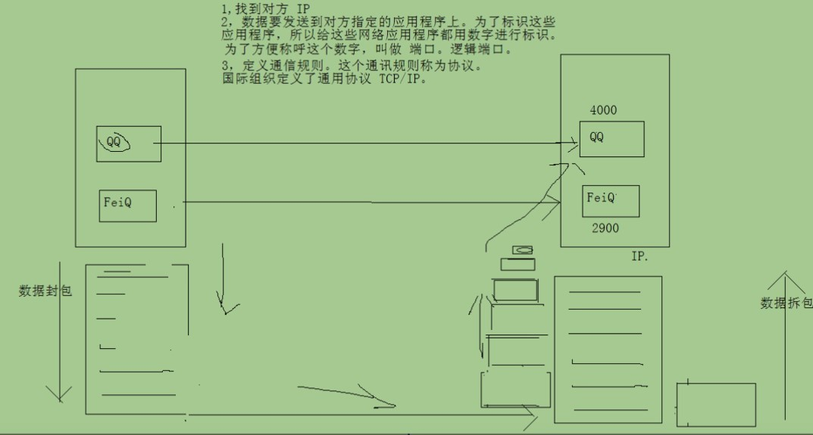
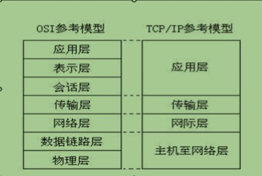
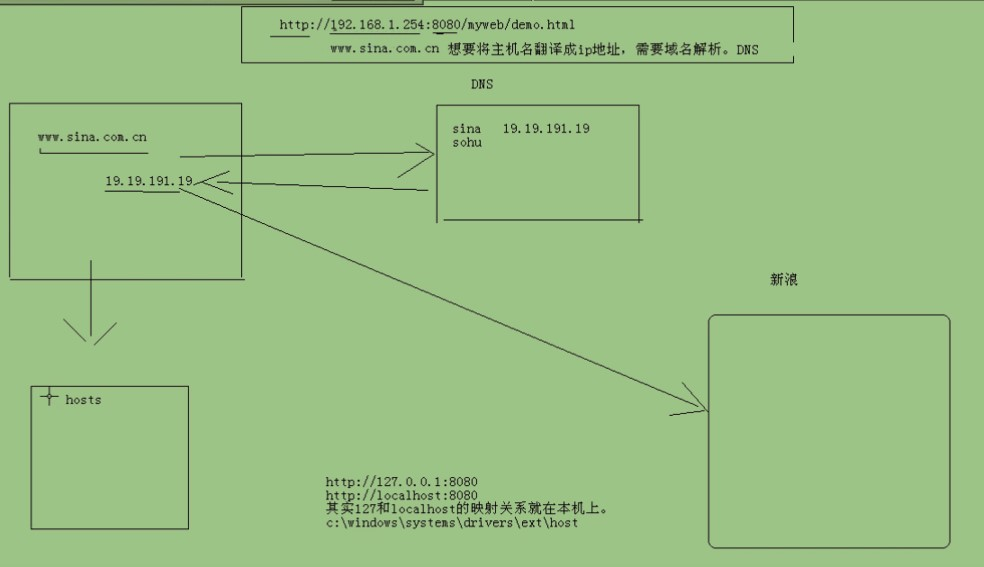

# 1. 基本数据类型包装类

```java
/*
基本数据类型转String：
基本数据类型为：Xxx
使用Xxx.toString(基本数据类型);//toString有非静态，也有静态方法，非静态无参数
或者使用String.valueOf(基本数据类型)

String转基本数据类型
基本数据类型为：Xxx
xxx.parseXxx(String s)
valueOf返回的是基本数据类型对应的类（如Integer），而parseXxx返回的是基本数据类型（如int）

但是Character没有parseXxx方法，因为是一个字符


基本上想转换成什么数据类型，就去目的数据类型的方法中找就能找到

十进制转换为其他进制
Integer.toHexString()
Integer.toOctalString()
Integer.toBinaryString()
其他进制转换为十进制
Integer.parseInt(String s,int radix) radix表示进制，但要确保String中数字格式要和进制格式相符，二进制中不能出现2及以上的数字

Integerh中 intValue()返回Integer对应的int
*/


/*
数据类型的装箱与拆箱
装：new Integer(int)
拆：调用intValue()

常量池

Integer 值小于128时，不会创建新对象，而是指向同一个对象

*/
class test{
	public static void main(String[] args){

	}
}

```

# 2. 字符串常用方法

```java
/*
 * 字符串最大特点：一旦被初始化就不能被改变
 *
 *  String s1="abc";
 *  String s2=new String("abc");
 *  区别：第一个建立了一个对象“abc”
 *  		第二个建立了两个对象“abc” （在常量池）与new String()出的对象//详情情查询常量池
 */


/*

位置是指从0开始的索引
*
*
*一下字符串必须完全背下并手打
*
* 1,获取：
* 1.1 获取字符串中字符的个数(长度).
* int length();
* 1.2 根据位置获取字符。
* char charAt(int index);
* 1.3 根据字符获取在字符串中的第一次出现的位置.
* int indexOf(int ch)
* int indexOf(int ch,int fromIndex):从指定位置进行ch的查找第一次出现位置（索引，不是从ch后数几个）
* int indexOf(String str);返回字符串str第一次出现的位置
* int indexOf(String str,int fromIndex);从fromIndex开始检索，返回字符串str第一次出现的位置
* 根据字符串获取在字符串中的第一次出现的位置.
* int lastIndexOf(int ch)
* int lastIndexOf(int ch,int fromIndex):从指定位置进行ch的查找第一次出现位置
* int lastIndexOf(String str);
* int lastIndexOf(String str,int fromIndex);
*
*
* 2，转换。
* 2.1 将字符串变成字符串数组(字符串的切割)
* String[] split(String regex):涉及到正则表达式.
* 2.2 将字符串变成字符数组。
* char[] toCharArray();
* 2.3 将字符串变成字节数组。//特殊：字符数组在转换为字节数组时，是可以指定编码表的
* byte[] getBytes();
* 2.4 将字符串中的字母转成大小写。
* String toUpperCase():大写
* String toLowerCase():小写
* 2.5 将字符串中的内容进行替换
* String replace(char oldch,char newch);
* String replace(String s1,String s2);
* 2.6 将字符串两端的空格去除
* String trim();		//实际开发中很好用
* 2.7 将字符串进行连接 。
* String concat(string);
* 2.8 将字符数组转换为字符串
* Static String copyValueOf(char [])
* Static String copyValueOf(char []data,int offset,int count)
* 2.9将基本数据转换为String
* Static String valueOf()  3+""==String.valueOf(3)
*
*
* 3，判断//挺常用的
* 3.1 两个字符串内容是否相同啊？
* boolean equals(Object obj);
* boolean equalsIgnoreCase(string str);忽略大写比较字符串内容。
* 3.2 字符串中是否包含指定字符串？
* boolean contains(string str);
* 特殊之处：indexOf(str):可以索引str第一次出现位置，如果返回-1，则表示字符串中不存在str，所以也可以用来判断是否包含特定字符串
* 			而且还能返回第一次出现位置
*
* 3.3 字符串是否以指定字符串开头。是否以指定字符串结尾。
* boolean startsWith(string);
* boolean endsWith(string);
* 3.4判断字符串是否为空
* boolean isEmpty();
*
* 4，替换
* String replace(char oldchar,char newchar)//如果要替换的字符不存在，返回的还是原串，如果替换了，那么返回替换后的新串（String一旦创建无法修改）
* String replace(String old,String new)
*
* 5 切割
* 里面为选择作为切割符的符号，分隔符不会被获取
* String[] split(regex)
* 6 子串
* String substring(int beginIndex);从指定位置到末尾
* String substring(int beginIndex,int endIndex),包含头不包含尾
*
*  int comompareTo(String anotherString)//返回最靠左的不同字符的ASCII码差值
*/


/*这样可以无视类型进行输出（1.6后才可以）
 * public static void sop(Object obj){
 * 		System.out.println(obj)
 * }
 *
 */

```

```java
/*
 * StringBuffer可以对字符串进行删减，
 *
 * StringBuffer是字符串缓冲区，是一个容器，
 * 长度可变化，
 * 可添加多种类型数据，
 * 最后可以通过toString方法变为字符串
 *
 *
 * C create U update R read D delete
 *
 * 存储，
 * StringBuffer append()将指定数据作为参数添加到已有数据的结尾处
 * 返回的还是**原缓冲区对象**，可以写一个调用串（下面有示例）
 * StringBuffer insert(int index,数据)将指定数据作为字符串插入索引处
 *
 * 删除，
 * StringBuffer delete(int start,int end)删除缓冲区数据包含start,不包含end
 * StringBuffer deleteCharAt(int index)删除指定位置的字符
 *
 * 获取//很多都是String里的方法
 * int	indexOf(String str)
 * int	indexOf(String str, int fromIndex)
 * String	substring(int start)//这里返回的是String，不是StringBuffer
 * int	length()
 *
 * 修改
 * StringBuffer	replace(int start, int end, String str)还是返回原来容器
 * void	setCharAt(int index, char ch)替换完不返回
 *
 * 反转
 * StringBuffer reverse()
 *
 * 将缓冲区中指定数据存储到指定字符数组中
 * void getChars(int srcBegin,int srcEnd,char[] dst,int dstBegin)
 *
 *
 * StringBuffer是可变长度的
 *
 *
 */

public class StringBufferdemo{
	public static void sop(Object obj) {
		System.out.println(obj);
	}
	public static void main(String[] args) {
		StringBuffer a=new StringBuffer();
		StringBuffer b=a.append(34);//用的是一个缓冲区
		//sop("a==b:"+(a==b));
		//sop(b);
		//sop(a);//相当于一个容器里装东西，返回还是那个容器
		a.append("adfaa").append("dsaf").append(345).append("+");
		sop(a);

		a.insert(1,"zzzz");
		sop(a);
		a.delete(2,4);
		a.deleteCharAt(4);
		sop(a);
		//清空缓冲区：delete(0,a.length());

	}
}
```

# 3. 内部类注意点

```java
/*
内部类访问规则：
1 内部类可以直接访问外部类中的成员，包括私有
	之所以可以直接访问外部类的成员，是因为内部类持有了内部类的引用，格式： 外部类名.this！！！
2 外部类要访问内部类必须要建立内部类对象

当内部类定义在外部类成员位置上，而且非私有，可以在外部其他类中，直接建立内部对象
格式：外部类名.内部类名 变量=new 外部类名.内部类名();


内部类可以被private与静态stati修饰。
当内部类变为静态时，只能直接访问外部类中的静态成员（访问局限）

访问静态内部类的非静态成员
new Outer.Inner2().function();//function()非static，需要类调用
访问静态内部类的静态成员（未写示例）
Outer.Inner2().function();

注意：当内部类中定义了静态成员，该内部类必须是static的
		当内部类的静态方法访问内部类时，内部类也必须是static的（未写示例）
*/
/*
当描述事物时，事物内部还有事物，该事物用内部类来描述
因为内部事物在使用外部事物的内容

*/

class Outer{
	private int num =3;
	private class Inner{//内部类可以被private修饰
		int num=4;
		public void function(){
			int num=5;
			System.out.println(num);//打印函数内的变量
			System.out.println(this.num);//打印内部类的成员变量
			System.out.println(Outer.this.num);//打印外部类成员变量
		}
	}
	static class Inner2{
		void function(){
			System.out.println("调用静态内部类方法");
		}
	}
	void method(){
		Inner i=new Inner();
		i.function();
	}
}

public class 内部类{
	public static void main(String[] args){
		Outer o=new Outer();
		o.method();
		//创建内部类对象时(内部类修饰符不为private时)：Outer.Inner in=new Outer.Inner();
		new Outer.Inner2().function();
	}
}
```

# 4. 异常机制

## 4.1. 异常机制 0

```java

/*
一：
异常：就是程序在运行时遇到的问题
异常由来:问题也是生活中的一个具体事物，也可以通过java的类进行描述，并封装成对象
			其实就是java对不正常情况进行描述后的对象体现

问题划分：严重：java通过Error类进行描述
				对于Error一般不编写针对性代码进行处理。
		非严重：java通过Exception类进行描述
				对于Exception可以使用针对性代码进行处理。

无论Error还是Exception都有一些共性内容：
比如不正常的信息，引发原因等
因此两类的父类为：Throwable
java.lang-Throwable

二：
异常的处理
java提供了特有的语句进行处理

try{
	需要检测的代码
}
catch(异常类 变量){
	处理异常的代码（处理方式）
}
finally{
	一定会执行的语句
}

三：对捕获的异常进行常见方法操作：
	String getMessage():获取异常的信息
	e.toString()：返回异常名称， 异常信息（自动调用getMessage实现）
	e.printStackTrace();//（无返回值）//异常名称，异常信息，异常出现的位置
									//其实jvm默认异常处理机制就是调用printStackTrace打印异常在堆栈中的跟踪信息（并停止）
									（暂时认为是对于RuntimeException异常，对于Thread.sleep();对应异常不会打印这个，
									程序也不会停止为什么具体还不懂）
*/

class Demo{
	int div(int a,int b){
		return a/b;		//1.在这里产生AritchmeticException,并new AritchmeticException(封装成了对象)，然后抛给了调用这个功能的调用者（mian函数div(4,0)位置上）
	}
}

class 异常机制{
	public static void main(String[] args){
		Demo d=new Demo();
		try{//try下因为有专门处理异常的代码，不会调用虚拟机的默认处理机制（导致程序停止）；try若果检测到问题，就不会运行try里的代码，跳过运行catch里的代码
			int x=d.div(4,0);	//2.try检测到被抛过来问题，然后丢给catch
			System.out.println(x);
		}catch(Exception e){//3.捕获异常对象，e指向异常对象（父类引用指向子类对象）
			System.out.println("除零了");
			System.out.println(e.getMessage());//在Throwable类中的方法
			System.out.println(e.toString());//不行toString也行，在输出语句里会帮你自动调用。toString会返回throwable的简单信息（系列包名，Exception名）
			e.printStackTrace();//（无返回值）//异常名称，异常信息，异常出现的位置
									//其实jvm默认异常处理机制就是调用printStackTrace打印异常在堆栈中的跟踪信息，然后结束。
		}

		System.out.println("over");
	}
}
```

## 4.2. 异常机制 1

```java
/*四：使用者不知道某段程序是否会发生异常。
	作为程序编辑者，在程序上使用表示throws Exception//在功能上通过throws的关键字声明了该功能有可能会出现问题

	也就是说，如果没throw，即可以写try也可以不写try，但是如果有throw，则必须在调用时写出try。
*/
class Demo{
	int div (int a,int b)throws Exception{//告诉调用者这个函数可能会出问题，必须进行捕获或抛出。throws使下层必须进行捕捉（try）或抛出（catch）
		return a/b;
	}
}

class 异常机制1{
	public static void main(String[] args)//throws Exception	/*div抛给main，main抛给虚拟机处理，不管多少层，最终都可以抛给虚拟机*/
	{
		Demo d=new Demo();
		try{
			int x=d.div(4,1);
			System.out.println("x="+x);
		}catch(Exception e){
			System.out.println(e.toString());
		}
		System.out.println("出现错误"+"over");
	}
}

```

## 4.3. 异常机制 2

```java
/*
五：
对多异常的处理：
1 声明异常时，建议声明更为具体的异常，这样可以处理得更为具体。
2 对方声明几个异常，就要对应几个catch块，不要定义多余的catch块
	如果多个catch块的异常有继承关系，父类的catch块必须要往下放。

建议进行catch处理时，catch中一定要定义具体处理方式，
不要简单定义一句e.printStackTrace()
也不要简单地书写一条输出语句。
*/
class Demo{
	int div(int a,int b)throws ArithmeticException,ArrayIndexOutOfBoundsException{
		int[] arr=new int[a];
		System.out.println(arr[4]);
		return a/b;
	}
}
public class 异常处理2{
	public static void main(String[] args){
		Demo d=new Demo();
		try{
			int x=d.div(4,1);
			System.out.println(x);
		}catch(ArithmeticException e){
			System.out.println("分母为0");
			e.printStackTrace();
		}catch(ArrayIndexOutOfBoundsException e){
			System.out.println("角标越界");
			e.printStackTrace();
		}
		/*
		1.使用这个两异常都可以捕获到，但是没有任何针对性。
		  如果出现了之前未发现的异常，最好停掉程序，再重新写一个新的抛出异常，而不是使用catch(Exception e)
		2.就算写这个，要放到其他catch下面，因为Exception类是其他具体异常的父类，要使放到上面，会使所有异常抛出都被它所借货
		catch(Exception e){

		}
		*/
		System.out.println("over");
	}
}

```

## 4.4. 异常机制 3-自定义异常

```java
/*
因为项目中会出现一些特有的问题，而这些问题并未别java所描述并封装对象，
所以这些特有的问题可以按照java对问题封装的思想，
将特有的问题进行自定义的异常封装

需求：在本程序中，对于除数为负数也视为错误，无法进行运算，
那么要对这个问题进行自定义描述

当在函数内部出现throw抛出对象，那么就要给出相应处理动作：
要么在内部使用try catch处理，
要么在函数上声明让调用者处理

 一般 （有特殊）情况下函数内出现异常，函数上需要声明

不定义异常信息，toString只会返回异常名称。
想要返回更详细的异常信息需要自定义函数

因为父类已经把异常信息的操作都完成了，所以子类只要在构造时将异常信息传给父类（通过super）
那么就可以直接通过getMessage方法获取自定义的异常信息了
当然也可以重写或者补充方法与变量

自定义异常：必须是自定义类继承Exception ，，，才怪，后面会与加成RuntimeException

继承Exception原因：异常体系有一个特点，异常类与异常对象都可被抛出，
他们都具有可抛性，这个可抛性是Throwable这个体系中的独有特点，

只有这个体系中的类和对象才能可以被throws与throw操作
*/
class FushuException extends Exception{
	private String meg;
	private int value;
	FushuException(String meg,int value){  //查看api文档可以发现，父类Throwable中定义了 构造函数
								 //与getMessage，构造函数直接调用即可，getMassge不用重写。
		super(meg);
		this.value=value;
	}
	int getValue(){
		return value;
	}
}

class Demo{
	int div(int a,int b)throws FushuException{//声明下面抛出的异常为哪一类异常
		if(b<0){//java已有异常可以自动抛出（即不用写throw）或虚拟机抛出。但对于自定义异常需要手动建立对象并进行抛出
			throw new FushuException("除数为负数",b);//手动通过throw（没s）关键字抛出异常
		}
		return a/b;
	}
}
public class 异常处理自定义{
	public static void main(String[] args){
		try{
			Demo d=new Demo();
			int x=d.div(3,-1);
			System.out.println(x);
		}catch(FushuException e){
			System.out.println("分母为负数");
			System.out.println(e.toString());
			System.out.println("出现的负数为"+e.getValue());
		}


		System.out.println("over");
	}
}
/*
	throws与throw的区别：
	throws使用在函数上，throw使用在函数内，
	throws后面跟异常类，可以跟多个，用逗号隔开
	throw后跟异常对象。
*/
```

## 4.5. 异常机制 4-异常分类

```java
/*
RuntimeException大重点，，面试时会有的

前面写道 一般 情况下，函数内使用throw抛出，函数上要使用throws声明

其中特殊情况为：RuntimeException类以及其子类
如果在函数内抛出了，在函数上不用声明
但如果在函数上声明了该异常，调用者可以不用处理（抛与try），编译一样通过

之所以不用再函数上声明，是因为不需要让调用者处理，当该异常发生，就会让程序停止，
因为在运行时，出现了无论如何无法运算的情况，（这里是瞎传值），其他异常被抛出解决后可能还能继续运行
因此希望程序停止后，对代码进行修正。如果进行了抛出（并且最终要捕获才能使程序无视错误继续运行），那么这种异常情况就被隐藏了，无法被解决
（或者说这种异常不可被处理，其他异常可处理）

自定义异常时：如果该异常的发生，无法继续进行运算的话，就让自定义异常继承RuntimeException

异常分两种：
1 编译时被检测到的异常
2 编译时不被检测的异常（运行时异常，就是RuntimeException以及其子类）
*/
class Demo{
	int div(int a,int b){
		if(b<0){
			throw new ArithmeticException("！！！！分母为负数");
		}//定义新的异常，没有这句不会抛出异常
		if(b==0){
			throw new ArithmeticException("被零除了");
		}//原有的异常，就算没有这句也会抛出，这只是改变抛出异常时的输出
		return a/b;
	}
}

public class 异常处理手动抛出{
	public static void main(String[] args){
		Demo d=new Demo();
		int x=d.div(4,-1);
		System.out.println("x="+x);
		System.out.println("over");
	}
}

```

## 4.6. 异常机制 5-示例

```java
/*
老师用电脑上课

问题：电脑蓝屏，电脑冒烟

可是当冒烟发生后，会发现讲课进度无法继续
出现了讲师的问题，可是计划无法完成

boss是调用者，指挥老师


另外：
finnally代码块：定义一定执行的代码，通常用于关闭资源
实际应用时一定要写（比如关闭数据库连接）
十分重要（唯一不用执行finnally只有使用System.exit(0)语句）
*/
class LanPingException extends Exception{
	LanPingException(String message){
		super(message);
	}
}
class MaoYanException extends Exception{
	MaoYanException(String message){
		super(message);
	}
}
class NoPlanException extends Exception{
	NoPlanException(String meg){
		super(meg);
	}
}
class Computer {
	private int state=3; //改改这个数再运行
	public void run()throws LanPingException,MaoYanException{
		if(state==2)
			throw new LanPingException("蓝屏了");
		if(state==3)
			throw new MaoYanException("冒烟了");
		System.out.println("电脑运行");
	}
	public void reset(){
		state=1;
		System.out.println("电脑重启");
	}
}
class Teacher{
	private String name;
	private Computer cmpt=new Computer();
	Teacher(String name){
		this.name=name;
	}
	public void prelect() throws NoPlanException{
		try{
			cmpt.run();
		}catch(LanPingException e){
			cmpt.reset();

		}catch(MaoYanException e){
			//throw e;//老师处理不了抛出去(到mian交给调用者(boss)解决),同时也要在函数上标识//但抛出去后函数调用者(boss)也处理不了
			//所以不能抛这个错误
			test();
			//抛出了能被识别的异常（问题的封装），当然把本质问题（系统冒烟）也可以说出来
			throw new NoPlanException("课时无法继续:"+e.getMessage());//抛哪个声明哪个
			//test();//无法运行，因为throw就是函数结束标识，和return一样
		}

		System.out.println("讲课");
	}
	public void test(){
			System.out.println("做练习");
		}
}


public class 异常示例{
	public static void main(String[] args){
		Teacher t=new Teacher("老师");
		try{
			t.prelect();
		}catch(NoPlanException e){
			System.out.println(e.toString());
			System.out.println("换老师或者放假");
		}

	}
}

```

## 4.7. 异常机制 6-语句格式

```java
/*
第一个格式
try{

}catch(){

}

第二个格式：
tryj{

}catch{

}finally{

}
第三个格式：
try{

}finally{

}

//catch是用于处理异常，如果没有catch就相当于异常没有被处理，如果异常是检测是异常，则必须要声明
*/

class Demo{
	public void method(){
		try{
			throw new Exception();
		}catch(Exception e){

		}//编译能通过，编译被在内部解决了，不用声明（有catch就行）//没有catch就不能通过，有finally也不行
	}
}

public class 异常处理语句格式{
	public static void main(String[] args){
		System.out.println("hellow world");
	}
}
```

## 4.8. 异常机制 7-异常机制在子类覆盖中的表现※

```java
/*
异常在子父类覆盖中的体现：
1 子类在覆盖父类时，如果父类的方法抛出异常，那么子类的覆盖方法，只能抛出父类的异常或该异常的子类
2 如果父类方法抛出多个异常，那么子类在覆盖该方案时，只能抛出父类异常的子集
如父类抛ABCDE，子类可以抛这五个的子集，如ABC，AD等
3 如果父类或者接口的方法中，没有异常抛出，那么子类在覆盖方法时，也不可以抛出异常，只能进行try catch处理（后期超常见，一定要记住）
*/

class AException extends Exception{

}
class BException extends Exception{

}
class fu{
	void show()throws AException{

	}
}
class zi extends fu{
	void show()throws AException{//或者抛BException,不可以抛其他异常。
	}
}

public class 异常在子父类覆盖时的表现{
	public static void main(String[] args){

	}
}
//原因是 多态，父类中有含有处理自身异常的try catch方法，子类对象传入后无法如果子类对象抛出其他异常(编译都会失败)，父类中的那个函数将会无法识别（早期程序不能产生新产生异常）
//子类中如果发生其他种类异常，只能在内部catch解决

```

## 4.9. 异常机制-示例 2

```java
/*
有一个圆形与长方形。
都可以获取面积，对于面积如果出现非法数值，视为获取面积出了问题。
问题通过异常来表示，
现对这个程序进行基本设计。
*/

class NoValueException extends RuntimeException{
	NoValueException(String message){
		super(message);
	}
}
interface Shape{
	void getArea();
}
class Rec implements Shape{
	private int len,wid;
	Rec(int len,int wid){
		if(len<=0||wid<=0){
			throw new NoValueException("出现非法值");
		}
		this.len=len;
		this.wid=wid;
	}
	public void getArea(){
		System.out.println(len*wid);
	}
}

class Circle implements Shape{
	private double radius;
	public static final double pai=3.14;
	Circle(int radius){
		if(radius<=0){
			throw new NoValueException("半径无效");
		}
		this.radius=radius;
	}
	public void getArea(){
		System.out.println(radius*radius*pai);
	}
}
class 异常示例2{
	public static void main(String[] args){
			Rec r=new Rec(4,4);
			r.getArea();
			Circle c=new Circle(-2);
			c.getArea();
		System.out.println("over");

	}
}

/*
！！！！！
自我总结点
throws：在函数上声明异常（实质上只是声明，使调用者必须进行try catch或throw，否则无法编译）
throw：抛出异常

可看作已有异常会自动throw，而自定义异常需要手动throw（详见异常处理手动抛出.java）
RuntimeExcetion及其子类不用声明，但声明也没关系，也能trycatch，让异常出现后程序依旧运行，但应该不去trycatch，让程序停止
*/
/*
一些偏僻但重要点：
catch里什么也不写也可以编译并运行通过，但不会有任何记录或日志，最好写些输出语句

当捕获到的功能依旧处理不了时，可以继续抛出。
但如果该异常不属于该功能出现异常，可以将异常转换后，抛出和功能相关异常（见异常示例）
或者即处理也抛出

子父类覆盖时异常抛出
*/
```

# 5. 集合框架

## 5.1. 共性方法

```java
/*
 * 1 集合中存在的都是对象地址
 * 2 add()方法的参数类型为Object，以便于接收任意类型的地址
 * 3 集合框架中只能加入对象，无法加入数据类型，但到了1.5之后，会自动完成装箱拆箱操作，所以可以add时直接加入基本数据类型
 */

package 集合框架;

import java.util.ArrayList;
//所有集合共有方法
class _01共性方法{
	public static void sop(Object obj){
		System.out.println(obj);
	}
	public static void main(String[] args) {
		//创建一个集合容器，使用collection接口的子类，ArrayList
		ArrayList a1=new ArrayList();
		ArrayList a2=new ArrayList();

		//添加元素
		a1.add("java01");
		a1.add("java02");
		a1.add("java03");
		a1.add("java04");
		a1.add(4);

		a2.add("java01");
		a2.add("java02");
		a2.add("java05");
		a2.add("java06");
		a2.add(4);

		//打印集合
		sop("a1"+a1);
		sop("a2"+a2);

		//获取个数，集合长度
		sop("size:"+a1.size());

		//删除元素
		a1.remove("java03");
		sop(a1);

		//判断元素
		sop("Java02是否存在："+a1.contains("java02"));
		sop("java是否为空"+a1.isEmpty());

		//取交集
		a1.retainAll(a2);
		sop("a1取交集后："+a1);
		sop("a2"+a2);

		sop("removeAll函数"+a1.removeAll(a2));//removeAll返回boolean，会删去所有交集
		sop(a1);

		//清空集合
		a1.clear();
		sop(a1);
	}
}
```

## 5.2. 迭代器

```java


package 集合框架;

import java.util.ArrayList;
import java.util.Iterator;

class _02IteratorDemo{
	public static void sop(Object obj){
		System.out.println(obj);
	}
	public static void method_get() {
		ArrayList a1=new ArrayList();

		//添加元素
		a1.add("java01");
		a1.add("java02");
		a1.add("java03");
		a1.add("java04");
		a1.add(4);

		//Iterator是内部类，每个容器里面都有这个内部类
		/*		取出功能，一个函数不足以实现全部功能
		 * 		要可以自由访问集合内部内容的元素，因此便定义了内部类
		 * 		每一个容器的数据结构不同，所以取出的实现细节也不一样。但是都有共性内容：判断和取出，可以将这些内容抽取，
		 * 		抽取出的接口就是Iterator，每个不同的集合都会实现Iterator接口，比如ListLIterator
		 * 		通过一个对外提供的Iterator()方法来获取对应Iterator对象
		 *
		 *
		 */
		//Iterator i=a1.iterator();//获取迭代器用于获得集合中的元素
		//sop(i.hasNext());//是否还有下一个元素
		//sop(i.next());//下一个元素是什么
		//while(i.hasNext())
		//	sop(i.next());
		for(Iterator i=a1.iterator();i.hasNext();)//这个循环较好，因为在for结束后便会清除迭代器对象，更节省内存，而while在只有在函数结束后才会清除
			sop(i.next());

	}
	public static void main(String[] args) {
		method_get();
	}
}
```

## 5.3. list 共性方法

```java
package 集合框架;

import java.util.ArrayList;
import java.util.Iterator;
import java.util.List;
import java.util.ListIterator;

/*
 * collection下两大接口
 * 	!--List:元素是有序的，元素可以重复，因为集合体系有索引
 * 	!--Set：元素是无序的，元素不可以重复
 *
 * 凡是可以操作角标index的方法都是该体系特有方法
 * 增
 * add(index,element)
 * 删
 * addAll(index,Collection)
 * 改
 * remove(index)
 * 查
 * set(index,element)
 * subList(from,to)
 * lsitIterator();
 */

/*
 * list集合特有的迭代器，ListIterator是Iterator的子接口，
 * 在迭代时，不可以通过集合对象的方法操作集合中的元素，因为会发生ConcurrentModificationException异常（并发修改异常）
 *
 * 所以，在使用迭代器时，只能用迭代器的方法操作元素，知识，Iterator的方法是有限的，只能对元素进行判断取出删除操作
 * 如过想要进行添加，修改等，就需要使用其子接口ListLiterator，
 * 该接口只能通过List集合的ListLiterator方法获取//具体方法请查阅文档
 *
 */

class _03List共性方法{
	public static void sop(Object obj){
		System.out.println(obj);
	}
	public static void method() {
		ArrayList a=new ArrayList();

		//添加元素
		a.add("java01");
		a.add("java02");
		a.add("java03");
		a.add("java04");

		sop(a);
		//插入元素
		a.add(1,"java08");
		sop(a);

		//删除元素
		a.remove(2);
		sop(a);

		//修改元素
		a.set(2,4);
		sop(a);

		//通过角标获取
		sop("get(1):"+a.get(1));

		//获取所有
		for(int i=0;i<a.size();i++)
			sop("a["+i+"]:"+a.get(i));

		//迭代器
		Iterator it=a.iterator();
		while(it.hasNext())
			sop("next=="+it.next());

		//获取字符索引
		sop("index:"+a.indexOf("java08"));

		//获取几个元素
		List sub=a.subList(1,3);
		sop("几个元素："+sub);
	}


	public static void Iter(){//使用Iterator
		//演普通表迭代器
		ArrayList a=new ArrayList();

		//添加元素
		a.add("java01");
		a.add("java02");
		a.add("java03");
		a.add("java04");

		sop(a);

		Iterator it=a.iterator();
		//在迭代过程中的，准备添加或删除元素
		while(it.hasNext()){
			Object obj=it.next();
			if(obj.equals("java02"))
				//a.add("java09");//在用迭代器操作元素的过程中使用集合的方法操作元素会产生安全隐患，称为并发访问。抛出异常java.util.ConcurrentModificationException
								//不能对一个元素同时进行多种操作
			it.remove();//将java02的引用从集合中删除，但obj仍指向java02这个字符串（依旧涉及常量池）
		}
		sop(a);
	}

	public static void Iterl(){
		ArrayList a=new ArrayList();

		//添加元素
		a.add("java01");
		a.add("java02");
		a.add("java03");
		a.add("java04");
		ListIterator it=a.listIterator();

		while(it.hasNext()){
			Object obj=it.next();
			if(obj.equals("java02"))

			it.add("java2.5");
		}
		sop(a);

	}
	public static void main(String[] args) {
		//method();
		//Iter();
		Iterl();
	}


}
```

## 5.4. List 接口常见对象（有提枚举）

```java
package 集合框架;
/*
 * collection
 * 	|--List元素是有序的，元素可以重复，因为该集合体系有索引
 * 		|--ArrayList;底层数据结构为数组，查询快，增删慢（1.2版本中出现）
 * 		|--LinkedList;底层数据结构为链表。增删快，查询慢
 * 		|--Vector;底层是数组数据结构。Vector是线程同步的（因此加去锁使速度变慢），ArrayList是线程不同步的。
 * 				   Vector被ArrayList替代了（1.0版本中出现）
 * 	|--Set
 *
 */


/*
枚举就是vector特有的取出方式，
发现枚举与迭代器很像
其实枚举和迭代是一样的，因为枚举的名称以及方法的名称过长，所以被迭代器取代了。枚举就不再使用了
有使用枚举的视频。
其他集合框架中没有枚举。vector因为比较老，1.0版本中就出现了。所以才有
*/

/*
LinkedList特有方法：
addFirst()
addLast()

removeFirst()获取元素并删除元素
removeLast()
若为空则抛出异常
1.6版本后出现替代函数：
polFirst()
polLast()
若链为空则返回null

getFrist()获取元素但并不删除元素
getLast()
*/

/*
集合框架中
对象间进行比较时，会自动调用equals方法（Object类中方法，可重写）或compareTo方法（通过comparable接口）
而集合主动对两个对象进行比较，会使用比较器。（具体可见Set处笔记）
*/

//List集合判断元素是否相同，依据的是元素的equals方法
```

## 5.5. set 方法

```java

/*
class person{

}
public boolean lei(Object obj){
	if(obj instanceOf person)//用于比较是否为同一个类
		return false;
}
*/


//——————————————————————————————————————————————————————————————————————————

/*
set:元素是无序的（准确多说是按哈希值排序）（存入和取出的顺序不一定一致）

	set集合的方法与collection是一致的，没有特有方法（但继承collection接口得List有特有方法）

	|--HashSet底层数据结构是哈希表（默认的是哈希算法算出的地址）
		存储顺序按照哈希值大小来存（可以重写Object类中的hashCode()方法）


		//存储：
		HashSet保证元素唯一性原理：
		存储时，先比较哈希值（默认是所在地址的十进制数字，而且hashCode()方法也可以重写），如果哈希值相同，就会比较元素是不是同一对象（通过equals方法，也可以重写），如果不是，则会在该地址下再顺延一个元素
		（hashCode()与equals()都是Object类中的方法）

		（）在开发中，hashCode()与equals()经常会被复写


		//判断与删除：
		HashSet中：contains()与remove():先判断哈希值(比较hashCode()返回值)，再判断内容（equals()）
		而ArrayList只依赖与equals()

	|--TreeSet
	排序：
	一：
		添加时可以对set集合中的元素进行排序
		添加自定义对象时，TreeSet中存放元素必须具有可比性，而TreeSet进行比较是通过compareTo()方法，而该方法是通过实现
		接口comarable来实现的（这种方式也叫做元素的自然顺序，或者默认顺序）
		当compareTo方法返回0时，认为元素相同，正负数表示两个元素大小比较
		java中很多类都实现了该接口，比如String

		当排序时，一个元素可能会有多个信息，当主要条件相同时，一定要判断次要条件

		二叉树取值：能右拐就拐，然后到最左下面往上取
	二：
		当元素自身不具备比较性时，或者具备的比较性不是所需要的。
		这是需要让集合自身具有比较性
		在集合初始化时，就有了比较方式。可通过构造方法：TreeSet(Comparator<? super E> comparator)
		Comparator接口中方法：
		int compare(T o1, T o2)
          比较用来排序的两个参数。
		boolean	equals(Object obj)
          指示某个其他对象是否“等于”此 Comparator。
		从1.8后，又多了很多方法，具体可查阅文档上面两个是1.2时出现的的
		使用方法：创建实现Comparator的类，在里面实现有两个参数的compare方法（返回也是int类型），equals因为在Object类中有，所以是否重写都行。在TreeSet类初始化时，new一个对象进去

		当两中排序方式都存在时
		Comparator的优先级比compareTo高（集合框架内部的比较器优先级高于元素间的比较方法）
*/

//———————————————————————————————————————————————————————————————————————————


//Object中的toString方法
/*
在Java中，所有的对象都是继承自Object，自然继承了toString方法，在当使用System.out.println()里面为一个对象的引用时，自动调用toString方法将对象打印出来。如果重写了tostring方法则调用重写的toString 方法。

toString方法实质为： getClass().getName() + '@' + Integer.toHexString(hashCode())

因为System.out.println()的这个方法源码中调用了String.valueOf(Objec o),
public void println(Object x) {
        String s = String.valueOf(x);
        synchronized (this) {
            print(s);
            newLine();
        }
    }
而String.valueOf(x)的源码就是去调用该对象的toString()方法，源码如下：
public static String valueOf(Object obj) {
        return (obj == null) ? "null" : obj.toString();
}

*/

//———————————————————————————————————————————————————————————————————————————


```

## 5.6. set 对象即其他※

```java


class person{

}
public boolean lei(Object obj){
	if(obj instanceOf person)//用于比较是否为同一个类
		return false;
}

//——————————————————————————————————————————————————————————————————————————

/*
set:元素是无序的（准确多说是按哈希值排序）（存入和取出的顺序不一定一致）

	set集合的方法与collection是一致的，没有特有方法（但继承collection接口得List有特有方法）

	|--HashSet底层数据结构是哈希表（默认的是哈希算法算出的地址）
		存储顺序按照哈希值大小来存（可以重写Object类中的hashCode()方法）


		//存储：
		HashSet保证元素唯一性原理：
		存储时，先比较哈希值（默认是所在地址的十进制数字，而且hashCode()方法也可以重写），如果哈希值相同，就会比较元素是不是同一对象（通过equals方法，也可以重写），如果不是，则会在该地址下再顺延一个元素
		（hashCode()与equals()都是Object类中的方法）

		（）在开发中，hashCode()与equals()经常会被复写


		//判断与删除：
		HashSet中：contains()与remove():先判断哈希值(比较hashCode()返回值)，再判断内容（equals()）
		而ArrayList只依赖与equals()

	|--TreeSet
	排序：
	一：
		添加时可以对set集合中的元素进行排序
		添加自定义对象时，TreeSet中存放元素必须具有可比性，而TreeSet进行比较是通过compareTo()方法，而该方法是通过实现
		接口comarable来实现的（这种方式也叫做元素的自然顺序，或者默认顺序）
		当compareTo方法返回0时，认为元素相同，正负数表示两个元素大小比较
		java中很多类都实现了该接口，比如String

		当排序时，一个元素可能会有多个信息，当主要条件相同时，一定要判断次要条件

		二叉树取值：能右拐就拐，然后到最左下面往上取
	二：
		当元素自身不具备比较性时，或者具备的比较性不是所需要的。
		这是需要让集合自身具有比较性
		在集合初始化时，就有了比较方式。可通过构造方法：TreeSet(Comparator<? super E> comparator)
		Comparator接口中方法：
		int compare(T o1, T o2)
          比较用来排序的两个参数。
		boolean	equals(Object obj)
          指示某个其他对象是否“等于”此 Comparator。
		从1.8后，又多了很多方法，具体可查阅文档上面两个是1.2时出现的的
		使用方法：创建实现Comparator的类，在里面实现有两个参数的compare方法（返回也是int类型），equals因为在Object类中有，所以是否重写都行。在TreeSet类初始化时，new一个对象进去

		当两中排序方式都存在时
		Comparator的优先级比compareTo高（集合框架内部的比较器优先级高于元素间的比较方法）

		（equals()只能比较是否相同，想要排序这样是不够的，因此使用compareTo来返回负零正来表示元素间大小关系）
*/

//———————————————————————————————————————————————————————————————————————————


//Object中的toString方法
/*
在Java中，所有的对象都是继承自Object，自然继承了toString方法，在当使用System.out.println()里面为一个对象的引用时，自动调用toString方法将对象打印出来。如果重写了tostring方法则调用重写的toString 方法。

toString方法实质为： getClass().getName() + '@' + Integer.toHexString(hashCode())

因为System.out.println()的这个方法源码中调用了String.valueOf(Objec o),
public void println(Object x) {
        String s = String.valueOf(x);
        synchronized (this) {
            print(s);
            newLine();
        }
    }
而String.valueOf(x)的源码就是去调用该对象的	toString()方法，源码如下：
public static String valueOf(Object obj) {
        return (obj == null) ? "null" : obj.toString();
}

*/

//———————————————————————————————————————————————————————————————————————————
/*
泛型概述：
当往集合框架中加入不同类型的对象时，编译时不会出现异常，但运行时会出现类型转换异常（ClassCastException）。
在java1.5后为了解决这个问题，提出了新特性  泛型  ，用于解决安全问题，是一个安全机制。
使用<>来声明容器中装入什么元素
ArrayList<String> a=new ArrayList<String>
Iterator<String> it=a.iterator();
将运行时期出现的问题转移到了编译时期，方便程序员解决问题，
创建迭代器时左端也要加上<>，避免了强制转换的麻烦，
*/

//———————————————————————————————————————————————————————————————————————————
/*
重写equals时，方法形参时Object，不要忘了强行转换。另外实参如果不是指定类型对象，要抛出异常
class A{
	public boolean equals(Object obj){
		if(!(obj instanceOf A))
			throw ClassCastException("类型不匹配");
		A a=(Student)obj;
		return *****  ;
	}
}

*/
```

## 5.7. map

```java
/*
Map:该集合存储键值对，而且要保证键的唯一性。（Map使用更加频繁）（再说一遍，集合框架只能存储对象，其实是存储引用。存储基本数据类型时会自动装箱拆箱）
	collection称为单列集合，Map为双列集合
	方法：
	添加：
	V	put(K key, V value)	同一个键，第一次存入值返回null，第二次存入时，新值会替换老值，然后返回老值
	void	putAll(Map<? extends K,? extends V> m)
	删除：
	void	clear()
	V	remove(Object key)（返回去除的键所对应的值）
	default boolean	remove(Object key, Object value)
	判断：
	boolean	containsKey(Object key)
	boolean	containsValue(Object value)
	boolean	isEmpty()
	获取：
	int	size()
	Collection<V>	values()

	Set<Map.Entry<K,V>>	entrySet()
	Set<K>	keySet()

	Map
	|--Hashtable底层是哈希表数据结构，不可以存入null作为键或值。该集合是线程同步的（1.0出现，较早的基本都是线程同步）
	|--HashMap底层是哈希表数据结构，并允许使用null作为键与值，该集合是不同步的（jdk1.2,效率更高）
	（上面两两不同，面试时会出）
	   HashMap中键的比较与HashSet比较相同，先比较哈希值，后调用equals()方法
	|--TreeMap底层是二叉树数据结构，不同步。可以用于给Map集合中的键进行排序

	和Set很像，其实Set集合底层就是使用了Map集合
	HashSet底层就是使用的Hashtable
*/


/*
Map集合两取出方式：

Map中没有迭代器，因此有替代方法。
Map集合的取出原理就是，将Map集合转换为Set集合，再使用迭代器取出

keySet:将map中所有的键存入到Set集合。Set集合具备迭代器，因此可以通过迭代方式取出所有的键，再根据get方法，获取每一个
		键对应的值

entrySet:返回Map中包含映射关系的Set视图,而映射关系就是返回的Map.entry<>数据类型
		Map.Entry原理：其实Entry也是一个接口，它是Map接口中的一个内部接口（类似内部类）
		大致为：
		interface Map{
			public static interface Entry{!!!//能加static的接口只能是内部接口（还是复习一下内部类去吧）
				public abstract Object getKey();
				public abstract Object getValue();
			}
		}
		子类中实现Map接口时，也会实现Entry内部接口
		大致为：
		class HashMap implements Map{
			class A implements Entry{

			}
			public Object getKey(){

			}
			public Object getKey(){

			}
		}
		因为只有创建Map对象，才能产生映射关系用于存储在Entry中，因此作为内部接口，同时也方便了访问外部类的成员
*/


/*
Map集合扩展知识
map集合的使用是因为具备映射关系

Map中存Map，一个key对应1个Map或一个List，从而实现一对多
*/


/*
//一些简单共性方法（请查文档）
import java.util.*;
class Map后笔记{
	public static void main(String args[]){
		Map<String,String> m=new HashMap<String,String>();
		m.put("01","a");
		m.put("03","b");
		m.put("02","c");//HashMap排序时根据键的哈希值排序的
		System.out.println("containskey:"+m.containsKey("02"));
		//System.out.println("containskey:"+m.remove("02"));
		System.out.println("get:"+m.get("02"));//根据键获取值
		m.put(null,"d");
		m.put(null,"e");//会覆盖null指向的值
		m.put("05",null);
		System.out.println("get:"+m.get(null));
		//可通过get方法的返回值是否为null来一个键是否存在（有null键的时候除外，所以最好不要用null）

		//获取Map中的所有值：
		Collection<String> c =m.values();
		System.out.println(c);
		System.out.println(m);
	}
}
*/


//都有截图

/*
//keySet()方法演示
import java.util.*;
class Map后笔记{
	public static void main(String args[]){
		Map<String,String> m=new HashMap<String,String>();
		m.put("01","a");
		m.put("03","b");
		m.put("02","c");
		//现获取Map中的所有键的set集合
		Set<String> s=m.keySet();
		//获取迭代器：
		Iterator<String> it=s.iterator();
		while(it.hasNext()){
			String key=it.next();
			//有了键可以通过Map集合的get方法获得所对应的值
			String value=m.get(key);
			System.out.println("key:"+key+"-value:"+value);
		}
	}
}
*/

/*
//entrySet()方法演示
import java.util.*;
class Map后笔记{
	public static void main(String args[]){
		Map<String,String> m=new HashMap<String,String>();
		m.put("01","a");
		m.put("03","b");
		m.put("02","c");
		//将Map中的映射关系存入到Set集合中
		Set<Map.Entry<String,String>> e=m.entrySet();
		Iterator<Map.Entry<String,String>> it=e.iterator();
		while(it.hasNext()){
			Map.Entry<String,String> me=it.next();
			String key=me.getKey();
			String value=me.getValue();
			System.out.println("key:"+key+"--value:"+value);
		}

	}
}

*/

/*
TreeMap练习
给定一串字母，返回每个字母以及其对应次数
字母与次数为映射关系
*/

import java.util.*;
class MapTest{

}
public class Map后笔记{
	public static String charCount(String str){//以下步骤最好写得顺溜得很
		TreeMap<Character,Integer> map=new TreeMap<Character,Integer>();

		char[] c=str.toCharArray();
		for(int i=0;i<c.length;i++){
			if('a'>=c[i]||c[]>=)
			Integer value=map.get(c[i]);
			if(value==null){
				map.put(c[i],1);//键为Character，自身实现了Comparable方法，能自然排序。
			}else{
				value+=1;
				map.put(c[i],value);
			}
		}
		//System.out.println(map);
		StringBuilder sb=new StringBuilder();
		Set<Map.Entry<Character,Integer>> entrySet=map.entrySet();
		Iterator<Map.Entry<Character,Integer>> it=entrySet.iterator();
		while(it.hasNext()){
			Map.Entry<Character,Integer> me=it.next();
			Character ch=me.getKey();
			int va=me.getValue();
			sb.append(ch+"("+va+")");

		}

		return sb.toString();
	}
	public static void main(String[] args){
		String s="asddsaaaaadfjnkojfg";
		System.out.println(charCount(s));
	}

}

```

## 5.8. collection 工具类

```java
/*
两个工具类
Collections
里面有许多静态方法
用于对集合框架进行操作

比如List想进行排序，但List集合中没有Tree，所以可以使用这个工具类
static <T extends Comparable<? super T>> void	sort(List<T> list)对List进行排序
想要比较，就一定要具备可比性，因此必须实现Comparable接口。或者继承父类的compare方法
如果没有实现Comparable接口，可以使用比较器
Array
*/
import java.util.*;
class comparatorLong implements Comparator<String>{//日，，这里也要写泛型
	public int compare(String s1,String s2){
		int a=s1.length()-s2.length();
		if(a==0)
			return s1.compareTo(s2);
		return a;
	}
}
public class Collections工具类笔记{
	public static void sortDemo(){//排序
		List<String> list=new ArrayList<String>();
		list.add("sdfa");
		list.add("asdfa");
		list.add("aaa");
		list.add("gdhj");
		list.add("fa");
		list.add("fa");
		System.out.println(list);
		Collections.sort(list);
		System.out.println(list);
		Collections.sort(list,new comparatorLong());//使用比较器
		System.out.println(list);
	}
	public static void maxDemo(){//最大（按照compara或comparaTo	的比较依据）
		List<String> list=new ArrayList<String>();
		list.add("sdfa");
		list.add("asdfa");
		list.add("aaa");
		list.add("gdhj");
		list.add("fa");
		list.add("fa");
		String a=Collections.max(list);
		System.out.println("Max:"+a);
		String b=Collections.max(list,new comparatorLong());//使用比较器
		System.out.println("Max:"+b);

	}
	public static void binarySearchDemo(){//二分法查找，必须要排序
		List<String> list=new ArrayList<String>();
		list.add("sdfa");
		list.add("asdfa");
		list.add("aaa");
		list.add("gdhj");
		list.add("fa");
		list.add("fa");
		Collections.sort(list);
		int a=Collections.binarySearch(list,"gdhj");
		System.out.println("index:"+a);//如果返回负数则表示不存在，数值为插入点（根据二分法查找原理可得为何返回负数）

		Collections.sort(list,new comparatorLong());//使用比较器排序
		int b=Collections.binarySearch(list,"aaa",new comparatorLong());//使用比较器查找
		System.out.println("index:"+b);
	}
	public static void fillDemo(){//全部替换
		List<String> list=new ArrayList<String>();
		list.add("sdfa");
		list.add("asdfa");
		list.add("aaa");
		list.add("gdhj");
		list.add("fa");
		list.add("fa");
		System.out.println(list);
		Collections.fill(list,"bbb");
		System.out.println(list);

	}
	public static void replaceAllDemo(){//指定替换
		List<String> list=new ArrayList<String>();
		list.add("sdfa");
		list.add("asdfa");
		list.add("aaa");
		list.add("aaa");
		list.add("fa");
		list.add("fa");
		System.out.println(list);
		Collections.replaceAll(list,"aaa","bbb");
		System.out.println(list);
	}

	public static void reverseDemo(){//反转
		List<String> list=new ArrayList<String>();
		list.add("sdfa");
		list.add("asdfa");
		list.add("aaa");
		list.add("aaa");
		list.add("fa");
		list.add("fa");
		System.out.println(list);
		Collections.reverse(list);
		System.out.println(list);
	}
	public static void reverseOrderDemo(){
		//Collections.reverseOrder()返回的是能将原本排序顺序反转的比较器
		TreeSet<String> te=new TreeSet<String>(Collections.reverseOrder());
		te.add("sdfa");
		te.add("asdfa");
		te.add("aaa");
		te.add("aaa");
		te.add("fa");
		te.add("fa");
		System.out.println(te);
		//也有一个重载方法，reverseOrder中传入比较器，返回逆转后的比较器
	}

	public static void synchronizedListDemo(){//将线程不安全的集合变为线程安全
		//Collections.synchronized(List<T> list);
	}

	public static void swapDemo(){
		//swap(List list<>,int index1,int index2)
	}

	public static void shuffleDemo(){//把集合中元素随机进行排放。
		List<String> list=new ArrayList<String>();
		list.add("sdfa");
		list.add("asdfa");
		list.add("aaa");
		list.add("aaa");
		list.add("fa");
		list.add("fa");
		System.out.println(list);
		Collections.shuffle(list);
		System.out.println(list);
		Collections.shuffle(list);
		System.out.println(list);
	}

	public static void main(String[] args){
		//sortDemo();
		//maxDemo();
		//binarySearchDemo();
		//fillDemo();
		//replaceAllDemo();
		//reverseDemo();
		//reverseOrderDemo();
		shuffleDemo();
	}
}
```

## 5.9. Arrays 工具类

```java
/*
数组的工具类，
类中都为静态方法
*/
import java.util.*;
public class Arrays工具类{
	public static void toStringDemo(){//以前使用的是StringBuffer来进行转为String
		int arr[]={1,2,4};
		System.out.println(Arrays.toString(arr));
	}
	public static void asListDemo(){//将数组转换为List集合
		String arr[]={"asf","sdf","adf"};
		List<String> list =Arrays.asList(arr);
		System.out.println(list);
		/*
		把数组变为List集合：
		可以使用集合的思想和方法来操作数组中的元素

		注意：将数组变成集合，不可以使用集合的增删方法，
				因为数组的长度是不可变的，其他的都可以
				如果增删，会发生不支持操作异常（UnsupportedOperationException）
		*/


		/*
		如果数组中的元素都是对象，那么转成集合是，数组中的元素就会变成集合中的元素，比如String
		如果数组中的元素都是基本数据类型，就会将该数组作为集合中的元素存在，此时System.out.println(list)会打印地址
		int[]要写成Integer[]才行
		*/
	}

	//额外:List到Array（Collection接口方法）
	public static void ListToArray(){
		ArrayList<String> a1=new ArrayList<String>();
		a1.add("asdf");
		a1.add("okm");
		a1.add("assadf");

		String[] arr=a1.toArray(new String[1]);//无参时返回Object[];
		System.out.println(Arrays.toString(arr));

		String[] arr1=a1.toArray(new String[6]);
		System.out.println(Arrays.toString(arr1));
		/*
		1 制定类型的数组定义长度：
			当指定类型的数组长度小于集合size，那么该方法内部就会创建一个新的数组，长度为集合的size
			当指定类型的数组长度大于了集合的size，就不会重新创建数组，而是用传递进来数组，空位为null
			所以创建一个刚好的数组最优

		2 将集合变数组：
			为了限定对元素的操作
			不需要进行增删
		*/
	}

	public static void main(String[] args){
		//toStringDemo();
		//asListDemo();
		ListToArray();

	}
}
```

## 5.10. 高级 for

```java
/*
1.5版本后，java中出现了Iterable接口，继承此接口的都可使用迭代器
实现这个接口的允许使用foreach循环语句

高级for循环

for(数据类型 变量:被遍历的集合或者数组){//int数组野性
	//语句
}

底层原理就是迭代器，此语句简化书写
*/
import java.util.*;
public class Iterable接口高级for等{
	public static void main(String[] args){
		ArrayList<String> a1=new ArrayList<String>();
		a1.add("dafad");
		a1.add("ljk");
		a1.add("adf");

		for(String s:a1){
			System.out.println(s);
		}
		for(String s:a1){//相当于计数
			s="kk";//让s指向kk。
			System.out.println(s);
		}
		System.out.println(a1);//发现集合没有改变

		/*
		这个循环只能对集合进行取出而不能进行修改动作。
		迭代器至少还有个remove，删除。
		ListIterator增删改查都行

		传统for与高级for区别：
		高级for有个局限性，必须有别遍历的目标。
		在遍历数组是，建议使用传统for，因为传统for可以对角标进行操作(int i=0;i<length;i++)
		*/

		//如果不使用泛型，那么高级for循环中数据类型只能是Object
		//遍历Map集合：for(Map.Entry e:entryset){}
	}
}
```

## 5.11. 集合可变参数※

```java
/*
jdk1.5版本新特性：

可变参数：
就是上一种数组简写形式，不用每次都建立数组对象，只要将要操作的元素作为参数传递即可，隐式将这些参数封装成了数组。
同时，传入数组引用也可以

在使用可变参数的时候，可变参数要定义在参数列表的最后面，因为一旦数据类型对上，直到最后的数据都会被封装入数组
*/
import java.util.*;
public class 集合可变参数{
	public static void main(String[] args){
		show(2);
		show(234,35,2);
		int[] a={3,5,6,3};
		show(a);
	}
	public static void show(int... arr){//...表示可变参数，基本数据类型与对象都行
		System.out.println(arr);
		System.out.println(arr.length);
	}
}

//当使用泛型时，传入的数据种类不同也行？.

//来自泛型pdf:

/*
	4.4.3 泛型方法与可变参数
再看一个泛型方法和可变参数的例子（这里的 T 可以同时传入不同类型）：

public <T> void printMsg( T... args){
    for(T t : args){
        Log.d("泛型测试","t is " + t);
    }
}
printMsg("111",222,"aaaa","2323.4",55.55);
*/
```

## 5.12. 集合静态导入

```java
/*
jdk1.5版本新特性

*/
import java.util.*;
import static java.util.Arrays.*;//导入Arrays类中的所有静态成员，可以将 Arrays. 删去（不加static则时导入类而非成员）
import static java.lang.System.*;//导入System中所有静态成员
public class 集合静态导入{
	public static void main(String[] args){
		int[] a={2,3,51,5};
		sort(a);
		out.println(Arrays.toString(a));//Object中也有toString方法，当方法重名时，必须指定类名或对象，当类名重名时，必须指定包名
		int index=binarySearch(a,51);
		System.out.println("index:"+index);
	}

}
```

# 6. 其他常用对象

> 多查文档，这里不详细

```java

import java.util.*;
import java.text.*;
public class 其他类对象{
	public static void sop(Object obj){
		System.out.println(obj);
	}
	public static void SystemDemo(){
		/*
		System中的方法都是静态的
		out:标准输出，默认是控制台
		in:标准输入，默认键盘

		System获取系统信息:
		//做软件时要根据系统种类不同措施
		static Properties	getProperties()
		*/


		Map properties=	System.getProperties();
		/*
		Properties是HashTable（虽说本身被HashSet替代，但用来记录属性用得挺多的）的子类，也就是Map集合的一个子类对象，
		那么可以通过Map方法获取该集合中的元素
		该集合中存储的都是字符串，没有泛型定义
		*/

		//如何在系统中定义一些特有信息
		//SetProperty
		System.setProperty("makey","myValue");


		System.out.println("os.name:"+properties.get("os.name"));
		for(Object a:properties.keySet()){//没有泛型，Set中元素为Object
			String s=(String)a;
			System.out.println(a+"=="+(String)properties.get(a));

		}
		//获取指定信息：
		System.out.println("os.name:"+properties.get("os.name"));//或：
		System.out.println("os.name:"+System.getProperty("os.name"));

		/*
		在虚拟机启动时动态加在一些系统值
		String v=System.getProperty(vv);
		System.out.println("v="+v);

		上述语句直接运行，v=null，
		但编译时输入语句： java -Dvv=1111 其他类对象
		就可以填入信息（-D加系统名称=系统信息）
		*/
	}

	public static void RuntimeDemo()throws Exception{//为了省事儿抛了Exception（这里有好几个异常）
		/*每个 Java 应用程序都有一个 Runtime 类实例，使应用程序能够与其运行的环境相连接。可以通过 getRuntime 方法获取当前运行时。

		并没有构造函数

		但大部分方法都是非静态的

		只有一个静态方法：static Runtime getRuntime()
		是因为程序执行时就已经产生了Runtime对象
		通过该方法来获取（可以看出使用了单例设计模式）
		*/


		Runtime r=Runtime.getRuntime();
		//r.exec("C:\\WINDOWS\\system32\\notepad.exe");//执行命令打开文件等//要多加个斜杠，否则是转义字符

		//只保留notepad.exe也行，因为没有指定目录，那么回去当前目录那里去找，
		//环境变量中的Path中有设置%SystemRoot%\system32

		/*
		exec返回一个新的Process对象，
		而Process类是抽象类，它的所有方法也都是抽象方法，也没有子类。
		是因为程序执行就已经产生进程，而底层在帮他进行实现
		更多方法请查阅文档
		*/

		//Process p=r.exec("notepad.exe");
		//Thread.sleep(4000);
		//p.destroy();//结束进程

		//能结束的进程只能是p对象对应的，该方法无法结束所有进程

		r.exec("notepad.exe  其他类对象.java");//打开文件
	}


	public static void DateDemo(){
		//util包中
		Date a=new Date();
		System.out.println(a);
		/*
		查文档：请参见：
				java.text.Format
					java.text.DateFormat
						java.text.SimpleDateFormat
		*/
		//将模式封装道SimpleDateFormat对象中
		//SimpleDateFormat在java.text包中
		//查文档可查阅 获得模式字母
		SimpleDateFormat s=new SimpleDateFormat("yyyy年MM月dd日");//大小写严格
		//调用format方法来格式化事件

		String str=s.format(a);

		System.out.println(str);

		SimpleDateFormat nian=new SimpleDateFormat("yyyy年");//只取年
		String n=nian.format(a);
		System.out.println(n);
	}


	public static void CalendarDemo(){//日历信息，详细请看文档

		Calendar c=Calendar.getInstance();
		//sop(c);//打印全部信息

		// int	get(int field)	返回给定日历字段的值。

		//计算机中是0-11月
		sop(c.get(Calendar.YEAR)+"年"+c.get(Calendar.MONTH)+"月"+c.get(Calendar.DAY_OF_MONTH)+"日");
		sop(c.get(Calendar.YEAR)+"年"+(c.get(Calendar.MONTH)+1)+"月"+c.get(Calendar.DAY_OF_MONTH)+"日");

		//用查表法 看起来更舒服
		String[] mon={"一月","二月","三月","四月","五月","六月","七月","八月","九月","十月","十一月","十二月"};
		int index=c.get(Calendar.MONTH);
		sop(mon[index]);


		Calendar g=Calendar.getInstance();
		g.set(2012,3,2);//4月2日
		sop("2012年4月2日是星期"+g.get(+Calendar.DAY_OF_WEEK));

		//abstract  void	add(int field, int amount)		根据日历的规则，为给定的日历字段添加或减去指定的时间量。
		//在Calendar子类
		g.add(Calendar.YEAR,5);//年加5
		sop(g.get(Calendar.YEAR));
	}

	public static void MathDemo(){
		double a=Math.ceil(12.2);
		sop(a);//返回大于该数的最小整数
		double b=Math.floor(23.1);
		sop(b);//返回小于该数的最大整数
		long c=Math.round(12.2);
		sop(c);//返回最接近该数的整数（四舍五入）
		double d=Math.pow(2,3);
		sop(d);//返回2的三次方
		double e=Math.random();
		sop(e);//返回大于等于0小于1的随机数

		//util包中Random类类似方法
		Random r=new Random();
		for(int i=0;i<10;i++){//从零开始到指定数，包括0不包括指定数
			int y=r.nextInt(100);
			sop(y);
		}
	}


	public static void main(String[] args)throws Exception{
		//SystemDemo();
		//RuntimeDemo();
		//DateDemo();
		//CalendarDemo();
		MathDemo();
	}
}
```

# 7. 多线程

## 7.1. 创建方式 1

```java
package 多线程;
/*
每个进程至少一个线程负责java程序的执行，
而且这个线程运行的代码在main方法中，
该线程称之为主线程
扩展：其实更细节的地说，jvm启动不止一个线程，还有负责垃机制的线程


自定义线程方法一：
1 自定义类继承Thread
2 重写run()方法			目的：将自定义的代码存储在run方法中。让线程运行
3 创建对象，运行start()方法（作用：启动线程，调用run方法）
（已经运行的程序不能再次start，会返回线程状态异常）

因为多个线程获取了cpu的执行权，cpu执行到谁，谁就运行
在某一时刻，只有哦一个线程，能运行，线程间会无规律高速互相切换，达到近乎同时的目的（或者说争夺cpu执行权）

但要是多核cpu则能达到同时运行

run方法是用于存储线程要运行的代码


设置线程名称：setName()或者构造函数
name是私有成员变量，只能使用super()传参，不可以使用this
获取名称可以使用this.getname(),但是创建线程第二种方式无法进行调用
获取当前运行线程使用静态函数currentThread(),返回线程,再调用getname()
在使用Runnable接口时无法使用this.getName()
*/


class demo extends Thread{
	demo(String name){
		super(name);
	}
	public void run(){
		for(int i=0;i<60;i++)
			System.out.println(this.getName()+i);//或者写成Thread.currentThread().getName();
	}
}
class 多线程00duoxiancheng{
	public static void main(String[] args) {
		demo d=new demo("one--");
		d.start();//开启线程并执行run方法，		调用run方法只是主线程调用run方法，没有开启线程
		demo s=new demo("two--");
		s.start();
		for(int i=0;i<60;i++)
			System.out.println("hello world--"+i);
	}
}
```

## 7.2. 创建方式 2

```java
package 多线程;
/*
 * 创建线程第二种方式，实现Runnable接口（常用）
 * 步骤：
 * 1 定义类实现Runable接口
 * 2 覆盖Runnable接口中的run方法
 * 			将线程要运行的代码存到该run方法中。
 * 3 通过Thread建立线程对象
 * 4 将Runable接口的子类对象作为实际参数传递给Thread类的构造函数
 * 			明确run方法所属对象调用指定Runable对象的run方法
 * 5 调用Thread类的start方法开启进程，此时同时调用了Runable接口子类的run方法
 *
 *
 *
 * 实现方式与继承方式区别：（面试常有）
 *
 * 实现方式：避免了单继承的局限性，在定义线程时，建立了实现方式
 * 例：Student继承Person类
 * 按第一种方式Student无法进行多线程运行
 * 第二种方式，可以Student类继承Runnable接口，在创建Thread对象时调用Student对象，实现多线程
 *
 * 两种方式区别：
 * 继承Thread：线程代码存放在Thread子类run方法中
 * 实现Runable：	线程代码存放在接口的子类run方法中
 */

class type2 implements Runnable{
	Object obj=new Object();
	  private int ticket=100;
	  public void run(){
		  while(true) {
			  //同步代码块，使一块代码一点开始运行，运行完后，线程才能进入阻塞状态
			  //输入的对象(随便找的，为何等学到后面)如同锁，译名有锁旗标，同步锁等等。简称锁；开始时默认开锁，进去后关锁，其他线程无法进入，
			  //在执行完语句块后再开锁，其他线程进入。

			  /*
			   * 同步的前提：
			   * 1 必须要有两个及以上的线程
			   * 2 必须多个线程使用同一个锁(后面有不使用同一个锁的程序)
			   * 3 不能把run方法所有代码放同步代码块里，比如这里只放了包含变量的两行
			   * 好处：解决了多线程的安全问题
			   * 缺点：多个线程都要判断锁，消耗资源，速度变慢
			   */
				  synchronized(obj) {
					  if(ticket>0){
						  System.out.println(Thread.currentThread().getName()+"--sale is "+ticket);
						  ticket--;
					  }
				  }
		  }

	  }
}

class 多线程01piao{
	public static void main(String[] args){
		type2 t=new type2();//只创建了一个对象，因此ticket只有一个数据，四个线程共享
		Thread t1=new Thread(t);
		Thread t2=new Thread(t);
		Thread t3=new Thread(t);
		Thread t4=new Thread(t);
		t1.start();
		t2.start();
		t3.start();
		t4.start();

	}
}
```

## 7.3. 示例 1

```java
package 多线程;
/*
 * 需求：
 * 银行有一个金库，有两个储户分别存300元，存3次
 *
 *
 * 目的：改程序是否有安全问题，如果有如何解决
 *
 * 如何找到问题：
 * 1 那些代码是多线程运行代码
 * 2 明确共享数据（sum b c）
 * 3 明确哪些代码操作共享数据（run方法(包括里面的add方法)）
 */

class Bank {
	private int sum=0;
	Object obj=new Object();
	public void add(int n) {
		synchronized(obj) {
			sum+=n;
			try {Thread.sleep(10);}catch(Exception e){}
			//--在这里运行完上面那句后可能还没有打印，进程就进入了阻塞状态，若将synchronized去掉之后，会发生混乱（试过）--//
			System.out.println("sum="+sum);
		}

	}
}

class Cus implements Runnable{
	private Bank b=new Bank();
	public void run() {
		for(int x=0;x<3;x++) {
			b.add(100);
		}
	}
}
class 多线程03BankDemo{
	public static void main(String[] args) {
		Cus c=new Cus();
		Thread t1=new Thread(c);
		Thread t2=new Thread(c);
		t1.start();
		t2.start();
	}
}

/*
 * 函数封装代码与同步代码块封装代码区别是	同步代码块具备了同步性，而线程在函数里也能断开
 *
 * 将synchronized作为修饰符放在函数之前就能使函数具有同步性
 */
```

## 7.4. 示例 2

```java
package 多线程;

class Ticket implements Runnable{
	private int tick=100;
	Object obj=new Object();


	/*
	//这样运行会出问题，只有0线程进去while循环，1线程被锁到外面
	public synchronized void run() {
		while(true) {
			if(tick>0) {
				try {
					Thread.sleep(20);
				} catch (Exception e) {
					// TODO: handle exception
				}
				System.out.println(Thread.currentThread().getName()+".....sales"+tick--);
			}
		}
	}
}
*/

	//正确方式：，把需要公用的一段代码提出来重新写一个方法
	public void run() {
		while(true) {
			show();
		}
	}
	public synchronized void show() {//锁是this，也就是创建的含有这个方法的对象
		if(tick>0) {
			try {
				Thread.sleep(20);
			} catch (Exception e) {
				// TODO: handle exception
			}
			System.out.println(Thread.currentThread().getName()+".....sales"+tick--);
		}
	}
}


class 多线程04tickdemo{
	public static void main(String[] args) {
		Ticket t=new Ticket();

		Thread t1=new Thread(t);
		Thread t2=new Thread(t);
		Thread t3=new Thread(t);
		t1.start();
		t2.start();
		t3.start();
	}
}
```

### 7.4.1. 示例 2-fix

```java
package 多线程;
//两个线程不是同一个锁的情况下，会打印出0甚至负数
class tick2 implements Runnable{
	private static int tick=100;
	boolean flag=true;
	Object obj=new Object();
	public void run() {
		if(flag) {
			while(true) {
				synchronized(obj) {//这里的锁是obj，而静态函数的锁是，，，看最下面			修改方法；obj改为tick2.class
					if(tick>0) {
						try {
							Thread.sleep(10);
						} catch (Exception e) {
							// TODO: handle exception
						}
						System.out.println(Thread.currentThread().getName()+"----if:"+tick--);
					}
				}

			}
		}
		else {
			while(true) {
				show();
			}
		}

	}
	public static synchronized void show() {
		if(tick>0) {
			try {
				Thread.sleep(10);
			} catch (Exception e) {
				// TODO: handle exception
			}
			System.out.println(Thread.currentThread().getName()+"else---"+tick--);
		}
	}
}

class 多线程05tickdemo2{
	public static void main(String[] args) {
		tick2 t=new tick2();
		Thread th1=new Thread(t);
		Thread th2=new Thread(t);
		//要使th1与th2运行不同的同步代码,使th1进入if里的同步代码块后，th2进入else里运行同步函数show()
		//如果不加睡眠的的话，th1 start后可能进入阻塞状态，然后flag变为flase，使两个线程都进入else里
		th1.start();
		try {
			Thread.sleep(10);
		} catch (Exception e) {
			// TODO: handle exception
		}
		t.flag=false;
		th2.start();

		try {
			Thread.sleep(2000);
		} catch (Exception e) {
			// TODO: handle exception
		}
		System.exit(0);
	}
}


/*
 * 同步函数使用的锁是什么？
 * 函数需要被对象调用，那么函数都有一个所属对象引用，就是this
 * 所有同步函数的锁都是this
 *
 * 但若用static修饰后，方法的锁不再是this，而是该类对应的字节码文件对象 类名.class 该对象的类型是Class
 */
```

## 7.5. deadlock

```java
package 多线程;
//同步嵌套同步时出现
//面试时经常让写
//下面obj锁里有this锁，this锁里有obj锁
class DeadLockbase implements Runnable{
	Object obj=new Object();
	boolean flag=true;
	public void run() {

		if(flag) {
				while(true) {
					synchronized(obj) {
						System.out.println("if--obj");
						synchronized(this) {
							System.out.println("if--this");
						}
					}
				}

		}
		else {
			while(true) {
				show();				}
		}
	}
	public synchronized void show() {//this
		System.out.println("else this");
		synchronized(obj) {
			System.out.println("else obj");
		}
	}
}
public class 多线程06DeadLock{
	public static void main(String[] args) {
		DeadLockbase dead=new DeadLockbase();
		Thread t1=new Thread(dead);
		Thread t2=new Thread(dead);
		t1.start();
		//通过延迟使t2进入else
		try {
			Thread.sleep(1);
		} catch (InterruptedException e1) {
			// TODO 自动生成的 catch 块
		}
		dead.flag=false;
		t2.start();
		try {
			Thread.sleep(1000);
		} catch (InterruptedException e) {
			// TODO 自动生成的 catch 块
		}
		System.exit(0);
	}
}

/*
 * t1在开启线程后，不断进出obj，obj锁不断开关，同时进入show,this锁也不断开关
 * t2在开启线程后，因为flag变为false因此直接运行show()，在t1跳出this锁时进入，同时进入obj锁
 * 在一方进入obj，一方进入this时锁死
 */

```

## 7.6. 多线程间通信

```java
/*
 * 多线程通信，其实就是多个线程在操作同一个资源，但操作的动作不同
 *
 * ！！下面代码一旦少写一个synchronized或者用不同的锁，会出现姓名与性别乱匹配的情况
 */
package 多线程;
class Res {
	String name;
	String sex;
}
class Input implements Runnable{
	private Res r;
	Input(Res r){
		this.r=r;
	}
	int x=0;

	public void run() {
		while(true) {
			synchronized(r) {//有两处用加同步，而且必须用同一个锁。第一处
				if(x==0) {
					r.name="mike";
					r.sex="man";
				}else {
					r.name="丽丽";
					r.sex="女";
				}
				x=(x+1)%2;
			}


		}
	}
}
class Output implements Runnable{
	Res r;
	Output(Res r){
		this.r=r;
	}
	public void run() {
		while(true) {
			synchronized(r) {//第二处
				System.out.println(r.name+"..."+r.sex);
			}

		}
	}
}
public class 多线程07线程间通信{
	public static void main(String[] args) throws InterruptedException {
		Res r=new Res();
		Input in=new Input(r);
		Output out=new Output(r);
		Thread t1=new Thread(in);
		Thread t2=new Thread(out);
		t1.start();
		t2.start();
		Thread.sleep(1000);
		System.out.println("hello world");
		System.exit(0);
	}
}
```

## 7.7. 等待唤醒机制

```java
/*
 * 要实现男女岔开输出，而不是无规律输出
 *
 * wait notify notifyAll方法都用在同步里面。（实质上是必须有锁）（API文档中原句：当前线程必须拥有此对象监视器。）
 */
package 多线程;
class Res2 {
	String name;
	String sex;
	boolean flag=false;//表示有没有写入资源
}
class Input2 implements Runnable{
	private Res2 r;
	Input2(Res2 r){
		this.r=r;
	}
	int x=0;

	public void run() {
		while(true) {
			synchronized(r) {
				if(r.flag)
					try {
						r.wait();//让使用r锁的线程进入线程池
					} catch (InterruptedException e) {
						// TODO 自动生成的 catch 块
						e.printStackTrace();
					}
				if(x==0) {
					r.name="mike";
					r.sex="man";
				}else {
					r.name="丽丽";
					r.sex="女";
				}
				x=(x+1)%2;
				r.flag=true;
				r.notify();//唤醒线程池中的线程
			}


		}
	}
}
class Output2 implements Runnable{
	Res2 r;
	Output2(Res2 r){
		this.r=r;
	}
	public void run() {
		while(true) {
			synchronized(r) {
				if(!r.flag)
					try {
						r.wait();
					} catch (InterruptedException e) {
						// TODO 自动生成的 catch 块
						e.printStackTrace();
					}
				System.out.println(r.name+"..."+r.sex);
				r.flag=false;
				r.notify();
			}

		}
	}
}
public class 多线程08等待唤醒机制{
	public static void main(String[] args) throws InterruptedException {
		Res2 r=new Res2();
		Input2 in=new Input2(r);
		Output2 out=new Output2(r);
		Thread t1=new Thread(in);
		Thread t2=new Thread(out);
		t1.start();
		t2.start();
		Thread.sleep(1000);
		System.out.println("hello world");
		System.exit(0);
	}
}
//notifyAll()唤醒所有线程
/*
 * wait()
 * notify()//先进入锁的线程先唤醒
 * notifyAll()
 * 这类方法都是使用在同步中，因为要对持有监视器（锁）的线程操作，
 * 所以要使用在同步中，因为只有同步才具有锁
 *
 * 任何对象都可以调用wait()与notify()。查阅文档也可以发现，wait()，notify()都是Object类的函数
 *
 * 只有同一个锁上的被等待线程，可以被同一个锁上的notify()唤醒，
 * 不可以对不同锁的notify唤醒
 * 也就是说等待与唤醒必须是同一个锁
 */
```

### 7.7.1. 简化

```java
/*
 * 将同步以及判断写到了资源类里面，调用时使用了匿名类，更简化
 */
package 多线程;
class Res3 {
	private String name;
	private String sex;
	boolean flag=false;
	public synchronized void set(String name,String sex) {
		if(flag) {
			try {
				this.wait();
			} catch (InterruptedException e) {
				// TODO 自动生成的 catch 块
				e.printStackTrace();
			}
		}
		this.name=name;
		this.sex=sex;
		this.notify();//唤醒上面那个进程
	}
	public synchronized void out(){
		if(!flag) {
			try {
				this.wait();
			} catch (Exception e) {
				// TODO: handle exception
			}
		}
		System.out.println(name+"...."+sex);
		flag=false;
		this.notify();//唤醒上面个进程
	}
}
class Input3 implements Runnable{
	private Res3 r;
	Input3(Res3 r){
		this.r=r;
	}
	int x=0;

	public void run() {
		while(true) {
			if(x==0) {
				r.set("mike","man");
			}else {
				r.set("丽丽","女");
			}
			x=(x+1)%2;
		}
	}
}
class Output3 implements Runnable{
	Res3 r;
	Output3(Res3 r){
		this.r=r;
	}
	public void run() {
		while(true) {
			r.out();
		}
	}
}
public class 多线程09上一个程序优化{
	public static void main(String[] args) throws InterruptedException {
		Res3 r=new Res3();

		new Thread(new Input3(r)).start();
		new Thread(new Output3(r)).start();
		/*
		Input3 in=new Input3(r);
		Output3 out=new Output3(r);
		Thread t1=new Thread(in);
		Thread t2=new Thread(out);
		t1.start();
		t2.start();
		Thread.sleep(1000);
		System.out.println("hello world");
		System.exit(0);
		*/
	}
}
```

## 7.8. 生产者消费者-notifyAll 使用

```java
package 多线程;

/*
必须while循环，必须notifyAll()
在用if与notify()的情况下出现的问题 要自己分析一下
*/
class Resource{
	private String name;
	private int count=1;
	private boolean flag=false;

	public synchronized void set(String name){
		while(flag)//if只能判断一次而
					//在whlie循环语句里，被唤醒的线程会线判断while里的条件在决定是否再向下执行！！

			try{
				this.wait();
			}catch(Exception e){

			}
		this.name=name+"..."+count++;
		System.out.println(Thread.currentThread().getName()+"....生产者...."+this.name);
		flag=true;
		this.notifyAll();//唤醒所有
	}
	public synchronized void out(){
		while(!flag)
			try{
				this.wait();
			}catch(Exception e){

			}
		System.out.println(Thread.currentThread().getName()+"..消费者.."+this.name);
		flag=false;
		this.notifyAll();
	}
}
class Producer implements Runnable{
	private Resource res;
	Producer(Resource res){
		this.res=res;
	}
	public void run(){
		while(true)
			res.set("+商品+");
	}
}
class Consumer implements Runnable{
	private Resource res;
	Consumer (Resource res){
		this.res=res;
	}
	public void run(){
		while(true){
			res.out();
		}
	}
}
class 多线程10生产者消费者{
	public static void main(String[] args){
		Resource  r=new Resource();
		Producer pro=new Producer(r);
		Consumer con=new Consumer(r);
		Thread t0=new Thread(pro);
		Thread t1=new Thread(pro);
		Thread t2=new Thread(con);
		Thread t3=new Thread(con);
		t0.start();
		t1.start();
		t2.start();
		t3.start();


		try{
			Thread.sleep(1000);
		}catch(Exception e){

		}
		System.out.println("hello world");
		System.exit(0);
	}
}

//在whlie循环语句里，被唤醒的线程会线判断while里的条件在决定是否再向下执行！！
//notify()会唤醒锁里的所有线程中最早等待的那个

/*
 * 对于多个生产者与消费者，定义while循环标记：让被唤醒的线程再一次判断标记
 * 定义notifyAll()，容易出现只唤醒本方线程的情况，导致程序中的所有线程都等待
 */


```

## 7.9. 新锁

```java
/*
 *
 */
package 多线程;
import java.util.concurrent.locks.*;
//
/*jdk1.5中提供了显式的多线程升级操作
 * 将同步的Synchronized替换成了显式Lock进行操作，将Object对象中的wait,notify,notifyAll,替换成了Condition对象，
 * 该对象可以通过Lock对象进行获取
 */
//一个lock上可以有多个Condition ，可以实现只唤醒部分线程


/*
必须while循环，必须notifyAll()
在用if与notify()的情况下出现的问题 要自己分析一下
*/
class Resource1{
	private String name;
	private int count=1;
	private boolean flag=false;
	private Lock lock=new ReentrantLock();
	//private Condition con=lock.newCondition();放弃这样写
	private Condition conpro=lock.newCondition();
	private Condition concon=lock.newCondition();
	public void set(String name) throws InterruptedException{
		lock.lock();
		try {
			while(flag)					//if只能判断一次而
			conpro.await();				//在whlie循环语句里，被唤醒的线程会线判断while里的条件在决定是否再向下执行！！
			this.name=name+"..."+count++;
			System.out.println(Thread.currentThread().getName()+"....生产者...."+this.name);
			concon.signal();
			flag=true;
		}finally {
			lock.unlock();//释放锁，释放资源（在最后的时候）
		}

	}
	public void out() throws InterruptedException{
		lock.lock();//在拿到锁时，锁释放（上面锁住了），再锁		//难道在执行别处的lock.lock()命令是，才会解锁再锁
		try {
			while(!flag)
			concon.await();
			System.out.println(Thread.currentThread().getName()+"..消费者.."+this.name);
			flag=false;
			conpro.signal();
		}finally {
			lock.unlock();
		}
	}
}
class Producer1 implements Runnable{
	private Resource1 res;
	Producer1(Resource1 res){
		this.res=res;
	}
	public void run(){
		while(true){
			try {
				res.set("+商品+");
			} catch (InterruptedException e) {
				// TODO 自动生成的 catch 块
				e.printStackTrace();
			}
		}
	}
}
class Consumer1 implements Runnable{//这里之所以不能抛，是因为run函数是接口里的原有函数，本身就没有throws声明
	private Resource1 res;			//子类覆盖父类方法的方法，只能抛父类异常的子集或者trycatch
	Consumer1 (Resource1 res){
		this.res=res;
	}
	public void run(){
		while(true){
			try {
				res.out();
			} catch (InterruptedException e) {
				// TODO 自动生成的 catch 块
				e.printStackTrace();
			}
		}
	}
}
class 多线程11新锁{
	public static void main(String[] args){
		Resource1  r=new Resource1();
		Producer1 pro=new Producer1(r);
		Consumer1 con=new Consumer1(r);
		Thread t0=new Thread(pro);
		Thread t1=new Thread(pro);
		Thread t2=new Thread(con);
		Thread t3=new Thread(con);
		t0.start();
		t1.start();
		t2.start();
		t3.start();


		try{
			Thread.sleep(1000);
		}catch(Exception e){

		}
		System.out.println("hello world");
		System.exit(0);
	}
}

//在whlie循环语句里，被唤醒的线程会线判断while里的条件在决定是否再向下执行！！
//notify()会唤醒锁里的所有线程中最早等待的那个

/*
 * 对于多个生产者与消费者，定义while循环标记：让被唤醒的线程再一次判断标记
 * 定义notifyAll()，容易出现只唤醒本方线程的情况，导致程序中的所有线程都等待
 */

//释放锁的动作一定要实行


```

## 7.10. 停止线程

```java
package 多线程;
/*
 * stop()方法已经过时，如何停止线程：
 * 只有一种：run方法结束
 * 开启多线程运行，运行代码通常都是循环结构，
 * 只要控制住循环，就能让run结束，从而线程结束
 *
 * 特殊情况：当线程处于了冻结状态，
 * 就不会读取到标记，那么线程就不会结束
 *
 * 解决方法：
 * 一：//标注
 * Interrupt:清除线程冻结状态，同时会抛出中断异常
 *
 * 当没有指定的方式让冻结的线程恢复到运行状态时，需要对冻结线程进行清除，
 * 强制让线程回复到运行状态中来，这样就可以操纵标记让线程结束（经常用到）
 *
 * 二：////标注
 * 守护线程(或者后台线程)：当前台线程=运行时，后台线程也运行，当前台线程关闭时，后台线程不计当时状态立刻关闭
 * 必须在线程开启前设置
 */


//把注释语句恢复就是解决办法
class stopThread implements Runnable{
	private boolean flag=true;
	public synchronized void run() {
		while(flag) {
			try {
				this.wait();
			} catch (InterruptedException e) {
				System.out.println(Thread.currentThread().getName()+"...Exception");
				//flag=false;
			}
			System.out.println(Thread.currentThread().getName()+"...run");
		}
	}
	public void fafa() {
		this.flag=false;
	}
}
class 多线程12停止线程{
	public static void main(String[] args) {
		stopThread st=new stopThread();
		Thread t1=new Thread(st);
		Thread t2=new Thread(st);
		////t1.setDaemon(true);
		////t2.setDaemon(true);

		t1.start();
		t2.start();
		int num	=0;
		while(true) {
			if(num++ ==60) {
				st.fafa();
				//t1.interrupt();
				//t2.interrupt();
				break;
			}
			System.out.println(Thread.currentThread().getName()+"..."+num);
		}
	}
}

```

## 7.11. join()

```java
package 多线程;
/*
 * 当A线程执行到B线程的join方法时，A就会等待，等B线程都执行完，A才会执行，
 * join可以用来临时加入线程执行
 */
class Demo2 implements Runnable{
	public void run() {
		for(int x=0;x<70;x++) {
			System.out.println(Thread.currentThread().getName()+"...."+x);
		}
	}
}
class 多线程13join函数{
	public static void main(String[] args) throws InterruptedException {
		Demo2 d=new Demo2();
		Thread t1=new Thread(d);
		Thread t2=new Thread(d);
		t1.start();

		t1.join();//得到cpu执行权 ，t1结束main才能运行			//没有做中断清楚，所以不会出异常，抛一下就行了

		t2.start();
		for(int x=0;x<80;x++) {
			System.out.println("main...."+x);
		}
		System.out.println("over");
	}
}
```

## 7.12. 多线程优先级

```java
/*
Thread的toString返回的是：线程名称，优先级，所在线程组
线程组有ThreadGroup这个类，但基本上用不上
优先级表示cpu对其操作频率，优先级越高，操作频率越大，但并不会一直执行。
默认优先级为5
Thread中有setPriority()来设置优先级
优先级别为1-10
相差1,2基本没啥区别
1,5,10跨度大，效果最明显
分别用关键字MAX_PRIORITY MIN_PRIORITY NORM_PRIORITY

yeild()方法： 临时停止，减缓线程执行速度
暂停正在执行的方法，执行其他线程，可以达到交替执行的效果
比如 Thread0执行到yeild()后放弃执行权，Thread1开始执行，然后Thread1也执行到yeild()时，Thread1释放执行权，Thread0开始执行
使用频率并不高，但面试可能有
*/


class ThreadTest{
	public static void main(String[] args){

		//开发时常使用的多线程运算运用，提高程序执行效率:

		//匿名类进行多线程运算,当运行的不是同一代码区域时
		new Thread(){
			public void run(){
				for(int i=0;i<100;i++)
					System.out.println(Thread.currentThread()+"....."+i);
			}
		}.start();
		new Thread(){
			public void run(){
				for(int i=0;i<100;i++){
					System.out.println(Thread.currentThread()+"....."+i);
				}
			}
		}.start();

		//当运行的是同一代码区域时
		Runnable r=new Runnable(){
			public void run(){
				for(int i=0;i<100;i++)
					System.out.println(Thread.currentThread()+"....."+i);
			}
		};
		new Thread(r).start();
		for(int i=0;i<100;i++){
					System.out.println(Thread.currentThread()+"....."+i);
		}
	}
}

```

# 8. 设计模式

## 8.1. 装饰设计模式

```java
/*
 * 装饰设计模式：
 * 当想要对已有对象进行功能增强时
 * 可以定义类，将已有对象传入，基于已有的功能，并提供加强功能
 * 那么自定义的该类称为装饰类
 *
 * 比如BufferedReader是FileReader的装饰类
 */

/*
 *装饰设计模式与继承
 *MyReader
 *	|--MyTextReader
 *		|--MyBufferTextReader
 *	|--MyMediaReader
 *		|--MyBufferMediaReader
 *	|--MyDateReader
 *		|--MyBufferDateReader
 *
 *增强类：
 *class MyBufferReader{
 *		MyBufferReader(MyBufferTextReader m){
 *		}
 *		MyBufferReader(MyBufferMediaReader m){
 *		}
 *}
 *
 *上述类扩展性极差，想要增强时必须添加构造函数。
 *
 *MyReader
 *	|--MyTextReader
 *	|--MyBufferMediaReader
 *	|--MyDateReader
 *	|--MyBufferReader
 *
 *class MyBufferReader(MyReader r){}
 *
 *这样因为多态性，只要传入的是MyReader子类对象就行。
 *避免了体系臃肿，降低了类与类之间的关系。
 *
 *装饰类因为知识增强已有对象，具备的功能和已有是相同的，只不过提供了更强的功能
 *所以装饰类和被装饰类，通常是属于一个体系中的
 *一般不要因为几个功能就写继承，那样会使体系过于臃肿。多用装饰类
 */

```

## 8.2. 单例设计模式

### 8.2.1. Demo1

```java
package 设计模式;
/*
 * 设计模式：解决一种问题最有效的方法
 * 设计模式是一种思想
 *
 * java中有23种设计模式
 *
 * 这次为单例设计模式:		解决使一个类在内存中只存在一个对象
 *
 * 想要保证对象唯一
 * 1 为了避免其他程序建立该类对象，要先禁止其他程序建立该类对象
 * 2 还为了让其他程序可以访问到该类对象，只好在本类中，自定义一个对象
 * 3 为了方便其他程序对自定义对象的访问，可以对外提供一些访问方式
 *
 * 实现上面三步的方法：
 * 1 将构造函数私有化
 * 2 在类中创建一个本类对象
 * 3 提供一个方法可以获取到该对象
 *
 */
class Single{
	//这里面是单例设计模式必要三步
	private Single() {

	}
	//但如果在java的类中用new创建自身的对象时，如不声明为static，会陷入递归调用循环，占满内存，但将其声明为static则是可以的。
	//这是因为static成员只在类的对象被创建或类的静态成员（方法）被调用时进行一次初始化，其后即再不创建和初始化。
	static Single a=new Single();	//因此对象也要用static修饰//<<--·
																//|
																//|
	public  static Single getSingle() {//因为不能创建方法，因此想要调用该方法只能使之成为类方法，通过类名调用
		return a;//返回唯一一个Singel类的地址
	}
}

class SingleDemo{
	public static void main(String[] args) {
		Single s=Single.getSingle();//获得唯一一个Single对象的地址
	}
}


//饿汉式
```

### 8.2.2. Demo2

```java
package 设计模式;
//懒汉式面试时很多，如何优化一定要记住


//饿汉式在类加载的时候就会创建对象。开发一般使用饿汉式，简单且安全

//加载Single类进内存时并不会创建对象，对象被调用时才被加载，也叫做对象的延迟加载 （懒汉式）（开发一般不使用（但面试使用），线程不安全（也可以优化））

class Single01 {
	private Single01() { }
	private static Single01 s=null;
	public static Single01 getSingle01() {
		if(s==null) {
			//此处可能进来两个线程，然后同时new，使对象不唯一
			s=new Single01();
		}
		return s;
	}
}

//以下为优化方案		不同步函数是因为频繁判断锁会降低效率，以下方式会只在new之前判断锁
/*
class Single01 {
	private Single01() { }
	private static Single01 s=null;
	public static Single01 getSingle01() {
		if(s==null) {
			synchronized(Single.class) {
				if(s==null) {
					//此处可能进来两个线程，然后同时new，使对象不唯一
					s=new Single01();
				}
			}
		}

		return s;
	}
}

*/
class SinbleDemo_01{
	public static void main(String[] args){
	}
}
```

# 9. io 流

## 9.1. 入门

```java
/*
字符流可以指定查jbk码表还是utf-8码表


处理图片用字节流

字节流抽象基类：
InputStream OutputStream
字符流抽象基类：
Reader Writer
由着4个类派生出的子类名称都是以其父类名作为子类名的后缀
*/

```

## 9.2. 字符流

### 9.2.1. 入门

```java
import java.io.*;
/*
io流用于操作数据，
数据最常见形式：文件

先已操作文件为主演示

FileWriter用于操作文件。后缀名为父类名，前缀名为功能
FilrWriter的方法都是继承自抽象父类Writer
*/

public class 字符流{
	 public static void main(String[] args)throws IOException{
		//创建一个FileWriter对象，该对象一被初始化就必须明确被操作的文件。
		//该文件会创建到指定目录下。如果有同名文件存在，那么会被覆盖
		//用来明确文件存在目的地
		FileWriter fw=new FileWriter("demo.txt");//调用windows创建文件方法
		//调用write方法将数据写到流中，临时存放数据（未到文件中）
		fw.write("123");

		fw.flush();//刷新流中数据，将数据写入目的地（文件）中
		//每次写入都要刷新流

		//使用close()也可以刷新流中数据，但是close后就会关闭流资源，不能再写入数据了。
		fw.write("abc");//再次写入时，光标再文件首
		fw.close();

		//write其实是在调用所在系统的资源


		//wirte方法有好几个重载函数，看看去
	}
}

```

### 9.2.2. IO 异常处理

```java

/*

*/
import java.io.*;
public class IO异常处理{
	public static void main(String[] args){
		FileWriter fw=null;
		//再try外建立引用，再try内初始化。
		//否则finally中因作用域无法调用fw
		try{
			fw=new FileWriter("demo.txt");//当文件路径错误时，会抛出异常（改改尝试。）
												//java.io.FileNotFoundException: k:\demo.txt (系统找不到指定的路径。)
			fw.write("aff");
		}catch(IOException e){
			System.out.println(e.toString());
		}finally{
			try{
				if(fw!=null)//一定要判定。当文件路径错误时，不会产生流对象。
							//因此关闭时会抛出 java.lang.NullPointerException（虽说能正常编译）

					fw.close();//这个也会产生异常，要trycatch,否则无法编译
			}catch(IOException e){

			}
		}
	}

}

```

### 9.2.3. IO 示例-续写

```java

import java.io.*;
public class IO续写{
	public static void main(String[] args){
		FileWriter fw=null;
		try{
			fw=new FileWriter("demo.txt",true);
			fw.write("adf");
			fw.write("1\n\r213");//windows中这俩都是换行符
		}catch(IOException e){
			e.printStackTrace();
		}finally{
			try{
				if(fw!=null)
				fw.close();
			}catch(IOException e){
				System.out.println(e.toString());
			}

		}
	}
}

```

### 9.2.4. 文件读取

```java
/*

*/
import java.io.*;
public class IO文件读取{//换行符是一个符号，会被读取
	public static void main(String[] args)throws IOException{
		//读取单个字符
		FileReader fr=new FileReader("demo.txt");
		//读取文件不需要写流中再刷新
		//创建一个文件读取流对象与文件相关联。如果文件不存在会抛出异常 FileNotFoundException(IOException子类)

		int i;
		while((i=fr.read())!=-1){
			System.out.print((char)i);
		}//每次read()，自动往下读.直到读到末尾返回-1（其实是调用windows程序）
									//每个文件再硬盘中存储时，再文件区域末尾有结束标识，windows程序可以读取标识返回-1

		fr.close();
		System.out.println();

		//——————————————————————————————————————————————————————————————————————————————————————
		//读取一个字符数组
		FileReader ff=new FileReader("demo.txt");
		//定义一个用来存储的数组
		char[] buf=new char[4];
		for(int x=0;x<4;x++){
			int num=ff.read(buf);//返回读取的字符数			//每次读取，数据覆盖，文件中指针后移，数组上指针后移，继续覆盖，直到数组末尾结束一次读取。到达文件末尾不再覆盖，返回-1
			System.out.println("num="+num+"....String:"+new String(buf));
			if(num>0)
				System.out.println("num="+num+"正确方式****************String:"+new String(buf,0,num));
		}

		ff.close();

	}
}

```

#### 9.2.4.1. 练习

```java
import java.io.*;
public class IO读取练习{
	public static void main(String[] args){
		FileReader fr=null;
		char[] a=new char[1024];
		int i;
		try{
			fr=new FileReader("demo.txt");
			while((i=fr.read(a))!=-1){
				System.out.println(new String(a,0,i));
			}
		}catch(IOException e){
			System.out.println(e.toString());
		}finally{
			try{
				if(fr!=null)
					fr.close();
			}catch(IOException e){
				System.out.println("关闭失败："+e.toString());
			}

		}
	}
}
```

### 9.2.5. 文件复制

```java
import java.io.*;
/*
通过创建写入流创建文件
创建读取流与文件关联
读取文件，写入文件
关闭资源
*/
public class 文件复制{
	public static void main(String[] args){
		FileWriter fw=null;
		FileReader fr=null;

		char[] buf=new char[1024];
		int num=0;
		try{
			fr=new FileReader("D:\\learn\\文档\\java笔记，课件\\知识点\\未意识到错误点.txt");
			fw=new FileWriter("复制文件.txt");
			while((num=fr.read(buf))!=-1){
				fw.write(buf,0,num);//写入指明多长，否则写入一堆空数据浪费资源
				fw.flush();
			}
		}catch(IOException e){
			throw new RuntimeException("读写异常");
		}finally{
			try{
				if(fw!=null)
					fw.close();
				if(fr!=null)
					fr.close();
			}catch(IOException e){
				System.out.println("异常");
				e.printStackTrace();
			}
		}
	}
}

```

### 9.2.6. 字符流缓冲流

#### 9.2.6.1. BufferedWriter

```java
/*
缓冲区的出现提高了数据的读写效率
缓冲区要结合流使用
对应类：
BufferedWriter
BufferedReader
在流的基础上对流的功能进行了增强

先将数据积攒储存到一定大小，再写到硬盘

缓冲区的出现是为了提高流的效率出现的，
所以在创建缓冲区之前，必须现有流（可看构造函数）

缓冲原理就是对象中封装了数组
不用自己写缓冲数组，以及 new String(buf,0,num)了
*/
import java.io.*;
public class IO字符流的缓冲区{
	public static void main(String[] args){
		FileWriter fw=null;
		BufferedWriter bufw=null;
		try{
			fw=new FileWriter("demo.txt");
			//只要将需要提高效率的流对象作为参数传入构造函数即可
			bufw=new BufferedWriter(fw);
			bufw.write("afdadf");
			//只要用到缓冲区，就要刷新

			bufw.newLine();//一个换行符，linux还是windows通用,跨平台换行符。缓冲区特有方法（本质就是write("\n\r");）
			bufw.write("afdadf");
			bufw.flush();
		}catch(IOException e){
			throw new RuntimeException("流异常");
		}finally{
			try{
				if(bufw!=null)
					bufw.close();//真正进行读写操作的时流，关闭缓冲区就是关闭流对象。因此只着一条语句就够了
			}catch(IOException e){
				throw new RuntimeException("流关闭异常");
			}


		}
	}
}
```

#### 9.2.6.2. BufferedReader

```java
import java.io.*;
public class IOBufferedReader{
	public static void main(String[] args){
		BufferedReader bur=null;
		String s1=null;
		try{
			//将字符流读取对象作为参数传递给缓冲对象的构造函数，用来提高效率
			bur=new BufferedReader(new FileReader("demo.txt"));
			while((s1=bur.readLine())!=null){//读到最后一行时，没有字符串返回，因此赋值null
				System.out.println(s1);//readline()返回的数据不包括回车符，只会返回回车符前的内容
			}

		}catch(IOException e){
			throw new RuntimeException("读取流错误");
		}finally{
			try{
				if(bur!=null)
					bur.close();
			}catch(IOException e){
				throw new RuntimeException("流关闭错误");
			}

		}
	}
}
/*
readLine原理：
无论读取多个字符还是读取一个字符，最终使用的还是read()方法，每次从硬盘上读一个
然后存储到缓存区

根据这个就能自己写一个模拟BufferedReader的类了
*/
```

##### 9.2.6.2.1. LineNumberReader

```java
/*
LineNumberReader是另一个装饰类
它是BufferReader的子类。
能够读取输出行号

//其实也就是加了个记录行号的成员变量
*/
import java.io.*;
class LIneNumberReaderdemo{
	public static void main(String[] args){
		FileReader fr=null;
		LineNumberReader lnr=null;
		try{
			fr=new FileReader("demo.txt");
			lnr=new LineNumberReader(fr);
			String str=null;
			lnr.setLineNumber(3);//设置首行默认行号。（不包括3）（默认为0）
			while((str=lnr.readLine())!=null){
				System.out.println(lnr.getLineNumber()+":"+str);//getLineNumber()用户获取当前对象指向的行数
			}
		}catch(IOException e){
			throw new RuntimeException("读写异常");
		}finally{
			try{
				if(lnr!=null)
					lnr.close();
			}catch(IOException e){

			}
		}
	}
}
```

## 9.3. 字节流

### 9.3.1. 入门

```java
/*
字符流：//使用pc默认编码表，通过System中方法可以获取
FileReader
FileWriter
BufferedReader
BufferedWriter
LineNumberReader

字节流：
FileInputStream
FileOutputStream
*/
/*
字节流不需要刷新与关闭流，就能写入。
但字节流要关的。
粗略解释（讲转换流时详细讲）
字符流本质也是一个字节一个字节得传，但是字符流有些字符（如中文）对应两个字节，
所以会将传过来的字节临时存起来，再去查表和FileBufferWrite原理相同

而字符流不会进行缓冲

*/
import java.io.*;

public class 字节流{
	public static void read1(){
		FileInputStream fis=null;
		int b;
		try{
			fis=new FileInputStream("dome.txt");

			while((b=fis.read())!=-1)
				System.out.print((char)b);//单个字节读取

		}catch(IOException e){
			throw new RuntimeException("字节输出流出错");
		}finally{
			try{
				if(fis!=null)
					fis.close();
			}catch(IOException e){
				throw new RuntimeException("输出流关闭出错");
			}
		}
	}
	public static void read2(){
		FileInputStream fis=null;
		int len;
		byte[] buf=new byte[1024];
		try{
			fis=new FileInputStream("dome.txt");

			while((len=fis.read(buf))!=-1)
				System.out.print(new String(buf,0,len));//单个字节读取

		}catch(IOException e){
			throw new RuntimeException("字节输出流出错");
		}finally{
			try{
				if(fis!=null)
					fis.close();
			}catch(IOException e){
				throw new RuntimeException("输出流关闭出错");
			}
		}
	}
	public static void write(){
		FileOutputStream fos=null;

		try{
			fos=new FileOutputStream("dome.txt");
			fos.write("adf".getBytes());//假如时中文时会乱码
		}catch(IOException e){
			throw new RuntimeException("字节输出流出错");
		}finally{
			try{
				if(fos!=null)
					fos.close();
			}catch(IOException e){
				throw new RuntimeException("输出流关闭出错");
			}
		}
	}
	public static void 	availableDemo(){
		FileInputStream fis=null;
		try{
			fis=new FileInputStream("dome.txt");
			int num=fis.available();//available返回文件中字符数，包括\r\n(windows中的回车时\r\n组成，\r\n含义不同，句子自动换行时\r,具体可以自己查询)
			System.out.println(num);
			read1();
		}catch(IOException e){
			throw new RuntimeException("错误");
		}finally{
			try{
				if(fis!=null)
					fis.close();
			}catch(IOException e){

			}
		}

	}
	//通过availavle方法可以定义一个刚刚好的缓冲区，用于输出，不用循环，但要慎用，
	//定义byte(1024整数倍)当作缓冲区最为合适
	public static void main(String[] args){
		write();
		read1();
		System.out.println();
		read2();
		System.out.println();
		availableDemo();
	}
}
```

### 9.3.2. 拷贝图片

```java
/*
用字节读取流对象和图片关联
用字节写入流对象创建一个图片文件，用于储存获取的图片数据
循环读写
关闭资源
*/
import java.io.*;
public class 拷贝图片{
	public static void main(String[] args){
		FileInputStream fis=null;
		FileOutputStream fos=null;
		byte[] buf=new byte[1024];
		int len=-1;
		try{
			fis=new FileInputStream("D:\\ACGN\\图片\\IMG_20190713_180544 (已调整大小).jpg");
			fos=new FileOutputStream("相川涡波.jpg");
			while((len=fis.read(buf))!=-1){
				fos.write(buf,0,len);
			}

		}catch(IOException e){
			throw new RuntimeException("文件拷贝问题");
		}finally{
			try{
				if(fis!=null)
					fis.close();
				if(fos!=null)
					fos.close();
			}catch(IOException e){
				throw new RuntimeException("文件流关闭异常");
			}
		}
	}
}
```

### 9.3.3. 字节缓冲流

```java
/*
BufferedOutputStream
BufferedInputStream
其实和字符流对应缓冲区差不多
*/
import java.io.*;
public class 字节流缓冲类{
	public static void main(String args[])throws IOException{
		long start=System.currentTimeMillis();

		BufferedOutputStream bos=new BufferedOutputStream(new FileOutputStream("桌面58615824_p0.jpg"));
		BufferedInputStream bis=new BufferedInputStream(new FileInputStream("D:\\ACGN\\图片\\58615824_p0.jpg"));

		int by=0;//BufferedInputStream对象的read方法每次读取一个字节，然后写入（会存入缓冲区的）
		while((by=bis.read())!=-1){//即使时缓冲流，但每次也只写入一个字节。原理间下一个文件
			bos.write(by);
		}
		bos.close();
		bis.close();

		long end=System.currentTimeMillis();
		System.out.println((end-start)+"毫秒");
	}
}
```

#### 9.3.3.1. 原理※

```java
/*
字节缓冲流原理基础

字节流BufferedInputStream每次会读取不只一个字符，每次读去后会将读取的固定长度的数据存储到一个数组中
但每次输出时只会输出一个字符
在未输出完之前read()是不会读取文件中数据
在将数组中的数据输出完毕时，read则会再次读取文件中数据
重复操作

在字节流读取数据是，可能会出现-1的补码（11111111）使read()返回-1，使程序停止
为了解决这个问题，
read()方法中，java中使返回值为int，然后byte转换为int时，自动前面补0而不是补1（那样为-1补码）
在前面补0可以保证原数据不变而且避免1的出现
做法：b&0xff
（0xff就是11111111十六进制）
而write方法中，会做强转动作，将最低八位输出
*/

/*
具体myInputStream的构建请看视频
*/
```

## 9.4. IO 键盘录入数据

```java
/*
System.out:对应标准输出设备（控制台）
System.in:对应标准输入设备（键盘）
*/
import java.io.*;
public class IO键盘录入数据{
	public static void test()throws IOException{
		InputStream in=System.in;//在录入前强制停止。（回车是两字符，也能被读取）
		int by=in.read();
		System.out.println(by);
	}

	//通过键盘输出数据，当录入一行后，就进行打印，如果录入的是over，那么就停止打印
	public static void writeFromKeyboard()throws IOException{
		InputStream in=System.in;
		int ch=0;
		String s;
		StringBuilder b=new StringBuilder();
		while(true){//这个本质就是读一行的原理
			ch=in.read();
			if(ch=='\r')
				continue;
			if(ch=='\n'){
				s=b.toString();
				b.delete(0,b.length());//清空缓冲区
				if(s.equals("over"))
					break;
				else{
					System.out.println(s);
				}
			}else
				b.append((char)ch);
		}
	}//并且这样无法接收汉字等符号

	public static void throwReadline()throws IOException{//如何使用readLine方法而不用自己写原理
	//readLine()是字符流的方法，通过使用转换流来使用该方法。
		//获取键盘录入对象
		InputStream in=System.in;
		//将字节流对象转换为字符流对象，使用转换流InputStreamReader（字节通向字符）
		InputStreamReader isr=new InputStreamReader(in);
		//为了提高效率将字符流进行缓冲基础的提高。使用BufferedReder
		BufferedReader bd=new BufferedReader(isr);

		String s=null;

		while((s=bd.readLine())!=null){
			if("over".equals(s))
				break;
			System.out.println(s.toUpperCase());
		}
		bd.close();//其实这里关不关都行，因为使用System.in,调用的是windows资源，会自动关闭
	}

	public static void main(String[] args)throws IOException{
		//test();
		writeFromKeyboard();
		//throwReadline();
	}
}
```

## 9.5. 转换流

```java
/*
上一个文件中有InputStreamReader的使用，为字节通向字符的桥梁。

OutputSteamWrite是字符通向字节的桥梁
文件以字节形式存在，在把文字写出去时，把字符转换为字节

转换流是Writer与Reader的子类，往其中传入字节流。
*/
/*
从上个文件中复制了个方法
*/
import java.io.*;
public class 转换流{
	public static void throwReadline()throws IOException{//如何使用readLine方法而不用自己写原理
	//readLine()是字符流的方法，通过使用转换流来使用该方法。
	/*
		//获取键盘录入对象
		InputStream in=System.in;
		//将字节流对象转换为字符流对象，使用转换流InputStreamReader（字节通向字符）
		InputStreamReader isr=new InputStreamReader(in);
		//为了提高效率将字符流进行缓冲基础的提高。使用BufferedReder
		BufferedReader bd=new BufferedReader(isr);
	*///上面三句话变为一句话
	BufferedReader bd=new BufferedReader(new InputStreamReader(System.in));

		String s=null;

		//————————————————————————
		/*
		OutputStream os=System.out;
		OutputStreamWriter osw=new OutputStreamWriter(os);
		BufferedWriter br=new BufferedWriter(osw);
		*/
		BufferedWriter br=new BufferedWriter(new OutputStreamWriter(System.out));
		//————————————————————————


		while((s=bd.readLine())!=null){
			if("over".equals(s))
				break;
			br.write(s.toUpperCase());//"\r\n"不跨平台
			br.newLine();
			br.flush();
		}
		br.close();
		bd.close();//其实这里关不关都行，因为使用System.in,调用的是windows资源，会自动关闭
	}
	public static void main(String[] args)throws IOException{
		throwReadline();
	}
}


//转换流自动优化了 汉字等的输出？？？？？
//字节转字符出入后，之后还能保持正常输出
//为何字符转字节输出后汉字不会乱码
//调用上一个文件中的writeFromKeyboard()则会出现乱码（字节流读取字符）


/*
Java中的字符流处理的最基本的单元是Unicode码元（大小2字节），它通常用来处理文本数据。所谓Unicode码元，也就是一个Unicode代码单元，范围是0x0000~0xFFFF。在以上范围内的每个数字都与一个字符相对应，Java中的String类型默认就把字符以Unicode规则编码而后存储在内存中。然而与存储在内存中不同，存储在磁盘上的数据通常有着各种各样的编码方式。使用不同的编码方式，相同的字符会有不同的二进制表示。实际上字符流是这样工作的：

输出字符流：把要写入文件的字符序列（实际上是Unicode码元序列）转为指定编码方式下的字节序列，然后再写入到文件中；
输入字符流：把要读取的字节序列按指定编码方式解码为相应字符序列（实际上是Unicode码元序列从）从而可以存在内存中。

*/


```

## 9.6. IO 流使用规律总结

```java
/*
1 明确源和目的
	源：输入流：InputStream Reader
	目的：输出流：OutputStream Writer
2 明确操作的文件是不是纯文本
	是：字符流
	不是：字节流
3 当体系明确后，再通过设备来明确使用哪个对象
	源设备：内存ArrayStream(后面讲) 硬盘FileStream 键盘System.in
	目的设备：内存ArrayStream(后面讲) 硬盘FileStream 控制台System.out
4 最后确定是否需要提高效率
	否：不做操作
	是：使用缓冲流
*/

/*
System.in用来读取键盘输入
为了操作键盘的文本数据方便。转成了字符流按照字符串操作最方便
因此使用转换流。（此时用到了字符流）
（可以发现FileReader为InputStreamReader子类）

（FileWriter是使用了默认编码表的转换流？？）
*/

/*
扩展：想要把录入的数据按照指定的编码表（utf—8/GBK），将数据保存到文件中
FileWriter使用机器默认编码表存

此时会用上转换流（转换流由来就是为了指定编码表）
如果转换流指定GBK编码，那么功能和FileReader相同
知识FileWriter封装过，更简单
它的父类OutputStreamWriter能指定码表
*/

import java.io.*;
public class IO流操作规律{
	public static void zhidingmabiao()throws IOException{//如何使用readLine方法而不用自己写原理
	BufferedReader bd=new BufferedReader(new InputStreamReader(new FileInputStream("UTF-8编码.txt")));
	//BufferedReader bd=new BufferedReader(new InputStreamReader(System.in,"UTF-8"));
		String s=null;
		//往文本文件中以不同编码写入了"你好"

		//BufferedWriter br=new BufferedWriter(new OutputStreamWriter(new FileOutputStream("UTF-8编码"),"UTF-8"));
		//BufferedWriter br=new BufferedWriter(new OutputStreamWriter(System.out));//通过转换流使用系统默认编码表输出到控制台
		BufferedWriter br=new BufferedWriter(new OutputStreamWriter(System.out,"UTF-8"));//使用指定码表输出


		while((s=bd.readLine())!=null){
			if("over".equals(s))
				break;
			br.write(s);
			br.newLine();//"\r\n"不跨平台
			br.flush();
		}
		br.close();
		bd.close();
	}
	public static void main(String[] args)throws IOException{
		zhidingmabiao();
	}
}
/*
涉及到字符编码转换时，需要使用转换流
*/

```

## 9.7. 改变标准输入输出流

```java
/*
System类中
方法setIn(),setOut()重新分配标准输入输出流(System.in System.out)
但并不常用
如:
System.setIn(new FileInputStream("temp.txt"))
此时System.in就是从temp.txt中读取数据
*/
```

## 9.8. IO 异常信息打印

```java
import java.io.*;
import java.util.*;
import java.text.*;
class 异常信息系统信息打印{
	public static void main(String[] args)throws IOException{

		PrintStream ps=new PrintStream("exception.log");
		try{
			int[] arr=new int[2];
			System.out.println(arr[3]);
		}catch(Exception e){
			Date d= new Date();
			SimpleDateFormat sdf=new SimpleDateFormat("YYYY-MM-dd HH:mm:ss");
			String s=sdf.format(d);
			//ps.write(d.toString().getByte());
			ps.println(s);
			e.printStackTrace(ps);
		}finally{
			ps.close();
		}

		Properties prpo=System.getProperties();
		prpo.list(new PrintStream("System.txt"));
	}
}

//网络上的异常信息处理工具（jar包）：log4j，不需要自己写这个
```

## 9.9. File

### 9.9.1. 入门

```java
/*
用来封装文件或者文件夹信息，方便对文件或者文件夹的属性信息进行操作
弥补了流只能操作数据，不能操作文件夹以及文件属性（比如可读可写）的不足
可以传给流的构造函数
*/
import java.io.*;
public class File概述{
	public static void main(String[] args){
		test1();
		test2();
	}
	public static void test1(){
		//将已有或者不存在的文件或文件夹封装
		File f1=new File("a.txt");//File只是指定某个路径中的文件夹或文件，不调用方法的话不会创建相关文件
		File f2=new File("D:\\learn\\java","b.txt");//和D:\\learn\\java\\b.txt相同，但将文件和目录分成两参数来传递，那么就能使用变量来代替文件名称，增加灵活性
		File fu=new File("D:"+File.separator+"learn"+File.separator+"java");//使用平台默认分隔符，从而实现跨平台
		File f3=new File(fu,"c.txt");
		sop("f1:"+f1);//封装相对路径，只打印封装路径，不打印绝对路径
		sop("f2:"+f2);
		sop("f3:"+f3);
	}
	public static void test2(){
		File f=new File("file.txt");
		sop("execute:"+f.canExecute());//canExecute()返回是否能执行
		//	canRead() 		canWrite()同理
		//也有compareTo方法，比较路径名
	}
	public static void sop(Object obj){
		System.out.println(obj);
	}
}
```

### 9.9.2. 常见方法

```java
/*
File常用方法：(其他的查文档)
1 创建
	boolean	createNewFile()	当不存在文件时创建文件，返回true，文件若存在则不会创建覆盖，返回false
	boolean creatTempFile(String prefix,String suffix) 创建临时文件(前缀名，后缀名，（指定路径）)
	boolean mkdir() 创建目录
	boolean mkdirs() 创建多级文件夹
2 删除
	boolean delete()删除路径名表示的文件或路径
	void deleteOnExit()当虚拟机结束运行时删除文件,在次代码执行时不会删除
3 判断
	boolean canExecute()判断文件是否可执行
	boolean exists() 判断文件是否存在

	//判断是否是目录或文件时，一定要通过exists()判断是否存在  				//实际开发时这点很危险
	boolean	isDirectory()	测试此抽象路径名表示的文件是否是一个目录。
	boolean	isFile()	测试此抽象路径名表示的文件是否是一个标准文件。

	boolean	isHidden()	判断是否为隐藏目录，java中某些隐藏文件无法访问，比如系统卷标目录，否则会失败报错，所以要判断是否隐藏
	boolean	isAbsolute()	测试此抽象路径名是否为绝对路径名。此时只是针对File这个对象，并不需要创建文件和目录
4 获取信息
	String getName()
	String getPath()	//返回File封装的路径,可以是绝对和相对
	String getParent()	//若文件是相对路径，返回空。但若封装路径中有上一级路径，则返回
	String getAbsolutePath() //不管封装的是相对还是绝对，都会返回绝对路径
	Path getAbsoluteFile()//返回封装绝对路径的对象
	long lastModified()	返回此抽象路径名表示的文件最后一次被修改的时间。  毫秒值
	long length() 返回由此抽象路径名表示的文件的长度。若是文件夹返回0

特殊：
	boolean renameTo(File to) 将文件剪切到某处(文件名可以通过to来指定)
*/
import java.io.*;
public class File常见方法{
	public static void main(String[] args)throws IOException{
		test1();
		test2();
		test3();
	}
	public static void test1()throws IOException{
		File f=new File("file.txt");
		//f.deleteOnExit();
		sop("create:"+f.createNewFile());
		//sop("delete:"+f.delete());
	}
	public static void test2(){
		File f=new File("file.txt");
		sop("excute:"+f.canExecute());
		File i=new File("abc");
		sop("mkdir:"+i.mkdir());
		File s=new File("abc/adf/adf/adf");
		sop("mkdirs:"+s.mkdirs());
	}
	public static void test3(){
		File f=new File("test3.txt");
		sop("getname:"+f.getName());
		sop("getPath:"+f.getPath());
		sop("getParent:"+f.getParent());
		sop("getAbsoluteFile:"+f.getAbsoluteFile());
	}
	public static void sop(Object obj){
		System.out.println(obj);
	}
}

```

```java
/*

static File[] listRoots() //列出所有有效盘符
String[] list()	//	返回保存File对象所封装路径下所有文件或文件夹的路径（包含隐藏文件），按顺序排布。但若封装目录不存在，
					则会返回null，在遍历时会抛出异常，若为一个文件则会返回空数组

File[] listFiles() 返回路径下所有文件及文件夹的File对象
*/
import java.io.*;
public class File常见方法2{
	public static void main(String[] args){
	//listRootsdemo();
	//listdemo();
	//FilenameFilterDemo();
	//listFiledemo();
	allfiles(new File("D:/learn/gittest"),0);

	}
	public static void listRootsdemo(){
		File[] farr=File.listRoots();
		for(File filer:farr){
			System.out.println(filer);
		}
	}
	public static void listdemo(){
		File f=new File("D:/learn/java");
		File file=new File("D/learn/java/File概述.java");
		String[] sarr;
		sarr=f.list();
		for(String str:sarr){
			System.out.println(str);
		}
		/*
		sarr=file.list();
		for(String str:sarr){
			System.out.println(str);
		}
		*/
	}
	public static void FilenameFilterDemo(){
		File dir=new File("d:/learn/java");
		String[] a=dir.list(new FilenameFilter(){
		public boolean accept(File dir,String name){//FilenameFilter接口中有accept方法，按照accept返回值来判断是否需要dir文件夹下文件
		return name.endsWith(".java");
		}
		});
		for(String s:a){
			System.out.println(s);
		}
	}
	public static void listFiledemo(){
		File[] files=new File("D:/learn/gittest").listFiles();
		for(File f:files){
			System.out.println(f);
		}

	}


	public static String getlevel(int level){
		StringBuilder sb=new StringBuilder();
		sb.append("|--");
		for(int x=0;x<level;x++){
			sb.append("——");
		}
		return sb.toString();
	}
	public static void allfiles(File temp,int level){//带有层级目录
		System.out.println(getlevel(level)+temp.getName());
		level++;
		File[] files=temp.listFiles();
		for(File f:files){
			if(f.isHidden())
				continue;
			if(f.isDirectory())
				allfiles(f,level);
			else
				System.out.println(f);
		}
	}
}
```

### 9.9.3. 删除所有文件

```java
/*
删除某目录所有文件
使用delete()
原理就是从里到外
删完里面的时候别忘了删外面的文件夹
因为不想创建文件目录，因此就不打这里了，也是使用递归，和前面一样
同时要避开隐藏文件，因为有时候删不了
*/
```

### 9.9.4. 文件清单列表

```java
/*
1 对指定目录进行递归
2 获取文件路径
3 将路径存入集合
4 将数据写到一个文件
*/


//其实就是前面递归列出所有文件加一个添加到lsit的步骤而已
//之后还有将目录中的信息全写到一个文件中，没有写，没啥难的    提醒：在获取path时，不要使用getPath(),要使用getAbsolutePath()获得绝对路径
import java.io.*;
import java.util.*;
public class javaio文件清单列表{
	public static void main(String[] args){
		List<File> t=new ArrayList<File>();
		filetolsit(new File("D:/learn/gittest"),t);
		System.out.println(t.size());
	}
	public static void filetolsit(File dir,List<File> list){
		File[] files=dir.listFiles();
		for(File f:files){
			if(f.isDirectory())
				filetolsit(f,list);
			else
				list.add(f);
		}
	}
}
```

## 9.10. Properties

```java
/*
！！重要


在学习System类时见过的一个类
是Hashtable的子类，也就是说具有Map的特点，
其中里面的键值对都是String

他是集合与io相结合的集合容器
可用于键值对形式的配置文件
需要有固定格式 key=value
*/
import java.io.*;
import java.util.*;
public class Propertiestest1{
	public static void main(String[] args){
		//setAndGet();
		//readfromfiles();
		//loaddemo();
		storedemo();
	}
	public static void setAndGet(){
		/*
		 Set<String>	stringPropertyNames() 返回键的set集合
		 getProperty(String key) 获取key对应的value
		  Object	setProperty(String key, String value) 添加键值对
		*/

		Properties p=new Properties();
		p.setProperty("1","1");
		p.setProperty("2","2");
		Set<String> strs=p.stringPropertyNames();
		for(String s:strs)
			System.out.println(s+"::"+p.getProperty(s));//这里也可以使用父类Hashtable中的get方法，但要进行强转
	}

	public static void readfromfiles(){//load方法原理
		Properties p=new Properties();
		BufferedReader bu=null;
		String line=null;
		try{
			bu=new BufferedReader(new FileReader("info.txt"));
			while((line=bu.readLine())!=null){
				String[] spa=line.split("=");
				p.setProperty(spa[0],spa[1]);
			}
		}catch(IOException e){

		}finally{
			try{
				if(bu!=null)
					bu.close();
			}catch(IOException e){

			}
		}
		System.out.println(p);
	}

	public static void loaddemo(){
		Properties p=new Properties();
		BufferedReader bu=null;
		try{
			bu=new BufferedReader(new FileReader("info.txt"));
			p.load(bu);
		}catch(IOException e){

		}finally{
			try{
				if(bu!=null)
					bu.close();
			}catch(IOException e){

			}
		}
		p.list(System.out);// 将属性列表输出到指定的输出流。
	}
	public static void storedemo(){
		Properties p=new Properties();
		FileOutputStream out=null;
		BufferedReader bu=null;
		try{
			bu=new BufferedReader(new FileReader("info.txt"));
			p.load(bu);
			out=new FileOutputStream("info.txt");
			p.setProperty("df","10");
			p.store(out,"modified the df");//将修改后的文件保存
		}catch(IOException e){

		}finally{
			try{
				if(bu!=null)
					bu.close();
			}catch(IOException e){

			}
		}
		p.list(System.out);// 将属性列表输出到指定的输出流。
	}
}
```

## 9.11. PrintWriter 和 PrintStream※

```java
/*
重要！！！！！
去看pdf
可以直接操作输入流和文件
//javaweb中往服务器中写数据都是这个


打印流：
字符打印流PrintWriter
构造函数接收：
File对象
字符串路径
字节输出流


字节打印流PrintStream
构造函数接收：
File对象
字符串路径
字节数输出流
字符输出流

该流提供了一系列打印方法，可以把所有数据按照 原数据 形式打印


PrintStrean是写入一串8bit的数据的。
PrintWriter是写入一串16bit的数据的。
String缺省是用UNICODE编码，是16bit的。
一般需要处理中文时用PrintWriter

该流提供了打印方法，可以将各种类型数据都按照原样打印!! 假如使用FileInputStream的话就会按照字符串来读入，而不是int等数据
其中有printf等方法！！！
这个方法功能是 非常强大的，它可以输出任何对象，而不必另加说明。此外print()方法有许多重载形式，即有多种参数。它们是字符串(String)、
(char[])、字符(char)、整数(int)、长整数(long)、浮点数(float)、双精度浮点数(double)、布尔值 (boolean)。其中，输出多个数单位的print()方法(也
String和char[]的)是同步(synchronized)方 法。

//与其他流不同的是,PrintStream流永远不会抛出异常

//PrintStream与PrintWriter区别pdf，，赶紧去看，超有用
*/
import java.io.*;
public class ioPrintWriter{
	public static void main(String[] args)throws IOException{
		BufferedReader b=new BufferedReader(new InputStreamReader(System.in));
		PrintWriter pw=new PrintWriter(System.out,true);//第二个参数为是否自动刷新（自己去查文档）  只有使用Println()才会刷新

		/*
		　	PrintWriter类与PrintStream类的方法是对应的。有一个不同之外需提请读者注意，就是当前者的自动清空缓冲区的功能被使能时(构造函数中autoFlash=
			true)，仅当println()方法被调用时才自动清缓冲区，而不是像PrintStream一样遇到一个换行符就清 缓冲。
		*/

		//PrintWriter pw=new PrintlnWriter(new FileWriter("PrintWritertest.txt"),true)//往文件中输入时，带有自动刷新的话，要封装成File对象
		String line=null;
		while((line=b.readLine())!=null){
			if(line.equals("over"))
				break;
			//pw.write(line.toUpperCase());
			pw.println(line.toUpperCase());
			//pw.flush();
		}
		pw.close();
		b.close();
	}
}
```

## 9.12. 合成流 SequenceInputStream

```java
/*
SequenceInputStream 表示其他输入流的逻辑串联。它从输入流的有序集合开始，并从第一个输入流开始读取，直到到达文件末尾，接着从第二个输入流读取，依次类推，直到到达包含的最后一个输入流的文件末尾为止。

它只有输入流，没有对应的输出流。
当调用SequenceInputStream的close()方法时，它将会自动关闭所有它所串联的输入流。

SequenceInputStream(Enumeration<? extends InputStream> e)
枚举可以通过Vector来获得
或者通过迭代器写一个实现Enumeration的匿名类


为何合并的是字节流，但能处理字符？？？？？
*/
import java.io.*;
import java.util.*;
public class 合成流{
	public static void main(String[] args)throws IOException{
		sequencedemo();
	}
	public static void sequencedemo()throws IOException{//将多个文件数据整合到一个文件
		FileInputStream a=new FileInputStream("demo.txt");
		FileInputStream b=new FileInputStream("dmeo.txt");
		FileInputStream c=new FileInputStream("t.txt");
		Vector<FileInputStream> v=new Vector<FileInputStream>();
		v.add(a);
		v.add(b);
		v.add(c);
		Enumeration<FileInputStream> en=v.elements();
		SequenceInputStream sis=new SequenceInputStream(en);

		FileOutputStream out =new FileOutputStream("4.txt");
		byte[] buf=new byte[1024];
		int len=0;
		while((len=sis.read(buf))!=-1){
			out.write(buf,0,len);
		}
		sis.close();
		out.close();
	}
}
```

### 9.12.1. 切割文件与合并文件

```java
public class 切割文件(template){
	public static void main(String[] args){

	}
	public static void splitfile(){
		FileInputStream in=new FileInputStream("文件名");
		FileOutputStream out=null;
		byte buf[]=new byte[1024*1024];
		int len=0,count=1;
		while((len=in.read(buf))!=-1){
			out=new FileOutputStream(count+".part");
			out.write(buf,0,len);
			out.close();
		}
		in.close();
	}

	//将文件合并：
	//通过得迭代器将ArrayList中输入流加入到SequenceInputStream
}
```

## 9.13. 对象序列化

```java
/*
操作对象
ObjectInputStream
ObjectOutputStream
将对象存储到文件中
对象的持久化，或序列化

只有实现Serializable接口才能被序列化
而Serializable接口没有任何方法，
没有任何方法的接口称为!!标记接口!!

原理：
每一个类都会根据自己每个成员对应的数字编号来生成uid（序列号）
而使用接口会改变序列号
除非自定义uid，这样会使uid固定不变
是为了序列化方便，使新的类还能读取旧的类（比如新的类中只是添加了新的成员或者加上了private等修饰符。）

（两个完全不一样的类会咋样？？？）

在读取对象是也是，只有文件中对象的序列号与程序中对象序列号相同，才可以读取


静态成员不能被序列化，因为只能序列化堆区中的数据，而静态成员在方法区中


避免序列化关键字：
transient
（保持默认值）


文档中：如果可序列化类未显式声明 serialVersionUID，则序列化运行时将基于该类的各个方面计算该类的默认 serialVersionUID 值，如“Java(TM) 对象序列化规范”中所述。不过，强烈建议 所有可序列化类都显式声明 serialVersionUID 值，原因是计算默认的 serialVersionUID 对类的详细信息具有较高的敏感性，根据编译器实现的不同可能千差万别，这样在反序列化过程中可能会导致意外的
*/
import java.io.*;
class Person implements Serializable{
	public static final long serialVersionUID = 42L;//自定义uid

	String name;
	transient int age;
	public Person(String name,int age){
		this.name=name;
		this.age=age;
	}
	public String toString(){
		return name+"::"+age;
	}
}
public class 对象的序列化{
	public static void main(String[] args)throws Exception{
		writeobj();
		readobj();
	}
	public static void writeobj() throws IOException{
		ObjectOutputStream oos=new ObjectOutputStream(new FileOutputStream("obj.txt"));
		oos.writeObject(new Person("1",1));
		//用记事本打开的话会乱码
		oos.close();

	}
	public static void readobj()throws Exception{
		ObjectInputStream ois=new ObjectInputStream(new FileInputStream("obj.txt"));
		Person p=(Person)ois.readObject();//返回Object，需要强转
		//每次读取一个对象，然后继续读取后面对象，类似迭代器
		System.out.println(p);
	}
}
```

## 9.14. RandomAccess※

```java
/*
重点：
临时补充：我靠，修改文本数据的工具啊，不用覆盖文件		//每次运行开始时指针指向头
（通过seek进行移位）
因此写文件时可以分段写，每个线程写一段
也就是下载软件原理
只有他能实现，，
超有用！！！

在存储信息时，可以扩展，比如姓名，可以16个字节一个（8个字怎么说也够用），然后再读取，这样可以跳来跳去得读，读信息时不会出错


并没有继承任何io流中的类，而是直接继承的Object

但是它是IO包中的成员，因为它具备读和写操作
内部封装了一个byte数组，并通过指针对数组进行操作
可以通过getFilePointer来获取指针位置
同时可以通过seek改变指针位置

其实完成读写的原理就是内部封装了字节输入流和字节输出流


通过构造函数可以看出，只能操作*文件*，同时有模式
"r"	Open for reading only. Invoking any of the write methods of the resulting object will cause an IOException to be thrown.
"rw"	Open for reading and writing. If the file does not already exist then an attempt will be made to create it.
"rws"	Open for reading and writing, as with "rw", and also require that every update to the file's content or metadata be written synchronously to the underlying storage device.
"rwd"  	Open for reading and writing, as with "rw", and also require that every update to the file's content be written synchronously to the underlying storage device.

如果模式为rw,文件不存在，会自动创建，文件存在，不会创建覆盖
如果模式为只读，不会创建文件，如果文件不存在，就会出现异常


方法：//查文档吧，忒多了，要知道区别
seek(int to)
read()
read(byte[] buf)
readInt()
write(byre[],int off,int len)
writeInt(int number)
skipBytes(int number)//只能往后跳
*/
import java.io.*;
class RandomAccessFile1{
	public static void main(String[] args)throws IOException{
		write1();
		//read1();
		write2();
	}
	public static void write1()throws IOException{
		RandomAccessFile raf=new RandomAccessFile("demo.txt","rw");//假如只读的话，使用write方法会有IOException
		raf.write("你好".getBytes());//一个汉字两字节（gbk）
		//raf.write(2835);//这样转换为二进制数的话，一个字节（最大为255）装不下，只会装入最低八位，因此应该使用writeInt
		//raf.writeInt(3453);//一次写入四个字节，当然这样也会乱码，因为记事本显示的是字符，而不是数据本身，gbk对应符号就是那个，但是已经把所有位都写进去了
		raf.writeInt(97);//前面会有三个空格，是因为int类型中前面三个字节都为0

		raf.write("一二".getBytes());
		raf.writeInt(98);
		raf.close();
	}
	public static void read1()throws IOException{
		RandomAccessFile raf=new RandomAccessFile("demo.txt","r");
		byte[] buf=new byte[4];
		raf.read(buf);
		System.out.println(new String(buf));
		/*
		raf.read(buf);//在文件中为a
		System.out.println(new String(buf));
		*///这样输出的是???a
		//想要输出数字
		int number=raf.readInt();
		System.out.println(number);


		raf.seek(0);//指针移动到开头
		raf.read(buf);
		System.out.println(new String(buf));
		int number2=raf.readInt();
		System.out.println(number2);
	}
	public static void write2()throws IOException{
		RandomAccessFile raf=new RandomAccessFile("demo.txt","rw");
		raf.seek(0);//调回头
		raf.write("周期".getBytes());//这里会覆盖文件中信息，而不是重新创建文件后再覆盖！！！
		raf.writeInt(103);
		raf.close();
	}
}

```

## 9.15. 管倒流

```java
/*
少用但是比较特殊

（只能写到读，感觉真没用）

管道流
PipedInputStream和PipedOutputStream
输入输出流可以进行连接，通过结合线程使用

比如以前都需要一个buf进行暂时缓存，而管道流不需要
*/

/*
来自文档：
管道输入流应该连接到管道输出流；管道输入流提供要写入管道输出流的所有数据字节。通常，数据由某个线程从 PipedInputStream 对象读取，并由其他线程将其写入到相应的 PipedOutputStream。不建议对这两个对象尝试使用单个线程，因为这样可能死锁线程。管道输入流包含一个缓冲区，可在缓冲区限定的范围内将读操作和写操作分离开。 如果向连接管道输出流提供数据字节的线程不再存在，则认为该管道已损坏。
*/
import java.io.*;
class Read implements Runnable{
	private PipedInputStream in;
	Read(PipedInputStream in){
		this.in=in;
	}
	public void run(){
		try{
			byte[] buf=new byte[1024];
			int len=in.read(buf);//将下面PipedOutputStream写入数据读出
			String s=new String(buf,0,len);
			System.out.println(s);
			in.close();
		}catch(IOException e){
			throw new RuntimeException("管道输入流读取失败");
		}
	}
}
class Write implements Runnable{
	private PipedOutputStream out;
	Write(PipedOutputStream out){
		this.out=out;
	}
	public void run(){
		try{
			System.out.println("管道输出流开始写入到输入流");
			out.write("from code files".getBytes());
			System.out.println("写出完毕");
			out.close();
		}catch(IOException e){
			System.out.println("管道输出流写入失败");
		}
	}
}
public class 管道流{
	public static void main(String[] args)throws IOException{
		pipe1();
	}
	public static void pipe1() throws IOException{
		PipedInputStream in=new PipedInputStream();
		PipedOutputStream out=new PipedOutputStream();
		in.connect(out);
		Read r=new Read(in);
		Write w=new Write(out);
		new Thread(r).start();
		new Thread(w).start();
	}
}

```

## 9.16. DataStream

```java
/*
DataInputStream
DataOutputStream
功能在于把基本数据类型与流相结合

只要操作基本数据类型，就用它！！！

用的挺多的
*/

/*
文档中：
数据输入流允许应用程序以与机器无关方式从底层输入流中读取基本 Java 数据类型。应用程序可以使用数据输出流写入稍后由数据输入流读取的数据。
DataInputStream 对于多线程访问不一定是安全的。 线程安全是可选的，它由此类方法的使用者负责。
*/
import java.io.*;
public class DataStream1{
	public static void main(String[] args)throws IOException{
		write1();
		read1();
	}
	public static void write1()throws IOException{
		DataOutputStream dos=new DataOutputStream(new FileOutputStream("dos.txt"));
		dos.writeInt(234);//4个字节
		dos.writeBoolean(true);//1个字节
		dos.writeDouble(12231.34);//8个字节
		//文件一共13个字节
		dos.close();
	}
	public static void read1()throws IOException{
		DataInputStream dis=new DataInputStream(new FileInputStream("dos.txt"));
		System.out.println(dis.readInt());
		System.out.println(dis.readBoolean());
		System.out.println(dis.readDouble());
	}

	//其他			这里懒就没有打码，，有时间自己写写验证下，包括转换流
	/*
	DataInputStream有readUTF()
	DateOutputStream有writeUTF(String s)
	两者都是使用UTF-8修改版编码输入或者输出数据，使用转换流指定编码的话也不能正确读出，每个汉字在UTF-8修改版中占4个字节（UTF为3个字节）
	//该复习转换流！！要把所有流的构造函数搞清
	*/
}
```

## 9.17. 其他 IO

```java
/*
以内存为源与目的的IO流


操作字节数组
ByteArrayInputStream	构造时需要数据源，并且数据源要是一个字节数组
ByteArrayOutputStream	构造时不需要定义数据目的，因为内部已经封装了一个可变长度的字节数组作为数据目的地
因为这两刘都操作的是数组，没有调用系统资源，因此不需要关闭

ByteArrayInputStream 包含一个内部缓冲区，该缓冲区包含从流中读取的字节。内部计数器跟踪 read 方法要提供的下一个字节。
关闭 ByteArrayInputStream 无效。此类中的方法在关闭此流后仍可被调用，而不会产生任何 IOException。

此类实现了一个输出流，其中的数据被写入一个 byte 数组。缓冲区会随着数据的不断写入而自动增长。可使用 toByteArray() 和 toString() 获取数据。
关闭 ByteArrayOutputStream 无效。此类中的方法在关闭此流后仍可被调用，而不会产生任何 IOException。


	源设备：内存ArrayStream(后面讲) 硬盘FileStream 键盘System.in
	目的设备：内存ArrayStream(后面讲) 硬盘FileStream 控制台System.out


用流的读写思想来操作数组，没有通过length，而是看是否返回-1
——————————————————————————————————
下面两同理，不再演示，自己查文档（视频中也没继续讲解）
——————————————————————————————————
CharArrayReader
CharArrayWriter
操作字符数组

StringReader
StringWriter
操作字符串
*/
import java.io.*;
public class 剩余IO{
	public static void main(String[] args){

		ByteArrayInputStream by=new ByteArrayInputStream("afdadff".getBytes());//数据源

		ByteArrayOutputStream bo=new ByteArrayOutputStream();//数据目的
		byte a=0;
		/*
		原代码这里写的是int，我写成byte再强转的话，正常运行，因此推测：
		read返回的4个字节中，只有最低位一个有数据，其他三个为0
		而write再写数据时,无论是int还是byte都行，而且单纯写128与1的话，输出的同，那么就是write不是单纯取最后一个字节，但那是什么???
		*/

		while((a=(byte)by.read())!=-1){//从此输入流中读取下一个数据字节。返回一个 0 到 255 范围内的 int 字节值。
			bo.write((int)a);//默认输出到控制台//输出到文件的话会//调用底层资源，有异常
		}
		System.out.println(bo.size());//查看缓冲区大小
		System.out.println(bo.toString());//输出缓冲区数据(转为字符串)

		//bo.writeTo(new FileOutputStream("otherio.txt"));//只有这个方法调用底层资源，涉及到异常
	}
}
```

## 9.18. 字符编码-转换溜溜

```java
//编码大问题！！

/*
字符流的出现为了方便操作字符
更重要的是加入了编码转换
通过子类转换流来完成：
	InputStreamReader
	OutputStreamWriter
两个对象在构造时可以加上字符集

另外两个加入编码表的：
PrintStream
PrintWriter
但只能打印，不能读取

ASCII美国信息标准信息交换码，用一个字节的7位表示。
ISO8859-1欧洲码表，用一个字节的8位表示，最大位为1
GBK2321中国的中文码表 连个高位都是1，避免了和ASCII码重复，因为中国码表兼容ASCII码（中国中拼音中也有字母）（虽说会和ISO8859-1冲突，但又不会兼容它，管它呢）
Unicode国际标准码，融合了多种文字，所有文字都用两个字节表示
java默认使用Unicode形式
UTF-8(Universal Character Set/Unicode Transformation Format)最少两个字节，最多三个字节而且每个字节开头都加有标识头1，很容易区分，因此utf-8全世界通用
*/
import java.io.*;
class 字符编码转换流{
	public static void main(String[] args)throws IOException{
		writeText();
		readText();
	}
	public static void readText()throws IOException{
		InputStreamReader in=new InputStreamReader(new FileInputStream("gbk.txt"),"GBK");
		char[] buf=new char[10];
		int len=in.read(buf);
		System.out.println(new String(buf,0,len));

		in=new InputStreamReader(new FileInputStream("gbk.txt"),"utf-8");
		len=in.read(buf);
		System.out.println(new String(buf,0,len));

		in=new InputStreamReader(new FileInputStream("gbk.txt"),"utf-8");//使用gbk编码的文件，去使用utf-8查,出现未知数据？
		//使用gbk编码的文件，去使用utf-8查,出现未知数据？。因为gbk每个字符2个字节，而utf-8没个字符3个字节，gbk编码出的数据无法在utf-8中读出
		len=in.read(buf);
		System.out.println(new String(buf,0,len));

		in=new InputStreamReader(new FileInputStream("utf-8.txt"),"gbk");
		len=in.read(buf);
		System.out.println(new String(buf,0,len));//会出现很奇怪的汉字，因为utf-8每三个字节对应一个字符因此两个汉字的utf-8编码对应gbk中的三个汉字
		in.close();

	}
	public static void writeText()throws IOException{
		//OutputStreamWriter out=new OutputStreamWriter(new FileOutputStream("gbk.txt"),"GBK");//4个字节
		OutputStreamWriter out=new OutputStreamWriter(new FileOutputStream("utf-8.txt"),"utf-8");//6个字节	//OutputStreamWriter之所以是字符到字节的桥梁，是因为一开始在内存中存储着字符，然后写到硬盘中是需要转换为字节，存储到文件中（编辑器打开时是自动识别编码转换为字符）
		out.write("你好");
		out.close();
	}
}


```

## 9.19. 字符编码

```java
/*
编码:字符串边字节数组
str.getBytes();//以默认编码表编码
其中有getBytes(String charsetName)//以指定字符集进行解码
解码:字节数组变字符串
new String(byte[])//以默认编码表解码
其中有构造函数String(byte[] bytes,String charsetName)

如果在编码时编码表不支持中文，那么再怎么解码也解不出来
但如果编码对，大不了试几次，数据都就能搞对

*/
import java.util.*;
public class 字符编码{
	public static void main(String[] args)throws Exception{
		String a="你好";
		byte[] b1=a.getBytes();//使用gbk编码
		System.out.println(Arrays.toString(b1));//Arrays对数据进行操作
		byte[] b2=a.getBytes("UTF-8"); //使用utf-8编码
		System.out.println(Arrays.toString(b2));//会抛出异常


		//解码错误时的解决方法(开发时经常见)
		//比如Tomcat服务器默认使用ISO8859-1编码！只能在服务端重新解码编码
		String s=new String(b1,"ISO8859-1");//解码错误的字符串存入字符串
		System.out.println(s);
		byte[] b3=s.getBytes("ISO8859-1");//原路解码回去
		System.out.println(Arrays.toString(b3));
		System.out.println(new String(b3,"gbk"));
	}
}

```

# 10. 正则

## 10.1. 教程 1

```java
/*
正则表达式：符合一定规范的表达式
		作用：专门操作字符串
		特点：用一些特定符号来一些代码操作，简化书写（以后的web中的自定义标签类似），是在学习一些特殊符号的使用
		好处：简化对字符串的操作
		弊端：符号定义越多，正则越长，阅读性越差
具体操作功能：
1 匹配：String matches(String regex)方法,用定义规则匹配《整个字符串》，有一处不匹配，返回false
2 切割 String split();
3 替换 String replaceAll(String regex,String replacement)

*/
public class regex1{
	public static void main(String[] args){
		check_qq();
		splitdemo();
		replacedemo();
	}
	public static void check_qq(){
		String qq="134143";
		String regex="[1-9]\\d{5,15}";
		boolean b=qq.matches(regex);
		System.out.println(b);
	}
	public static void splitdemo(){
		//String str="da  fda,adf   sas df,fs   aa";
		//String regex=" +";

		//String str="afs.asdf.df.";
		//String regex="\\."; //    .表示在正则表达式中任意字符，\.在正则中表示.，但为了得到反斜杠，\也要加\来转义

		//String str="c:\\adfadf\\dfas\\daf";
		//String regex="\\\\";//  两个反斜杠

		String str="dsasssfdsfss";//任意对重复字符进行切割
		//String regex=".{2}";//这个表示两任意字符，而不是两相同字符，所以并不适用
		String regex="(.)\\1+";	//  ()表示一个组，从1开始编号，通过转义字符来重用组(组中内容以固定)，也就是\1，封装入字符串时要再加入\,也就是\\1
								//按照左括号顺序来分组
		String[] arr=str.split(regex);
		for(String s:arr){
			System.out.println(s);
		}
	}
	public static void replacedemo(){
		//String str="13431s24fajfaedo31df43932482034j1j3j4j3a8df0";//将数字替换为#
		//String regex="\\d{5,}";
		//String newstr="#";

		String str="hhssiiaioojfjfjjsossoo";//将重复字符替换为1个
		String regex="(.)\\1+";
		String newstr="$1";//使用前一正则中的第一个组(只要没用一个双引号引起来就是不是一个整体)
		str=str.replaceAll(regex,newstr);//replaceAll返回的是字符串，而不是在原对象进行修改
		System.out.println(str);
	}
}

```

## 10.2. 教程 2

```java
/*
正则表达式功能:
4.获取:将字符串中符合规则的子串取出

操作步骤:
1. 将正则表达式封装成对象
2. 让正则对象和要操作的对象相关联
3. 关联，获取正则匹配引擎，
4. 通过引擎对符合规则的子串进行操作，比如取出

pattern:正则表达式的编译表示形式。
Pattern没有构造函数，只能通过静态方法返回对象
*/

import java.util.regex.*;
class regex2{
	public static void main(String[] args){
		//getdemo1();
		getdemo2();
	}
	public static void getdemo1(){
		String str="asd adf  df ddaf adf d fasdf";//取出连续3个字母的单词
		String reg="[a-z]{3}";
		//将规则封装成对象
		Pattern p=Pattern.compile(reg);
		//让正则对象和要作用的字符串相关联
		//使用： Matcher	matcher(CharSequence input)  		CharSequence为lang中的一个接口，String有实现该接口
		Matcher m=p.matcher(str);
		//返回Matcher		Matcher也在regex包中，是通过解释 Pattern 对 character sequence 执行匹配操作的引擎。
		//String类中有matcher等方法,Matcher中也有，其实String中的matcher方法就是通过Pattern和Matcher来进行的，
		//只不过进行了一个封装，用起来更方便，但要进行更复杂的操作，就要使用Matcher对象中的方法，比如获取group()

		boolean b=m.find();//将规则作用在字符串上并进行符合规则的子串查找
		System.out.println(b);
		System.out.println(m.group());//group用于返回find()函数找到的子串。
		//这种形式类似于迭代器，会一直往后找。

		while(m.find()){//find()后，会一直往后走，同一个匹配器使用同一个索引指针
			System.out.println(m.group());
		}
	}
	public static void getdemo2(){
		String str="asd adf  df ddaf adf d fasdf";
		String reg="\\b[a-z]{3}\\b";// \b为单词边界，防止从四个字母单词中取三个字母输出
		Pattern p=Pattern.compile(reg);
		Matcher m=p.matcher(str);
		while(m.find()){
			System.out.println(m.group());
			System.out.println(m.start()+"......"+m.end());//find后的返回偏移量（m.end()是返回最后一个字符处位置+1）
		}
	}
}

```

## 10.3. 练习

```java
/*
判断是对是错：匹配
将已有字符串变成另一个字符串：替换
想要按照自定义方式将字符串变为多个： 切割
拿到符合要求子串：获取  （这里需要Pattern和Matcher对象）

切割是获取规则以外子串，获取是获取符合规则的子串
*/


```

# 11. 网络编程

## 11.1. 入门

```java
/*
数据传输时，通过数字标识找到对方，就是IP
而为了找到网络特定应用程序，通过数字进行标识，就是端口
通讯时，为了方便通讯，定义了通讯规则，称为协议，国际组织定义了通用协议TCP/IP，既能局域网，也能互联

端口0-65535可以任选，但是0-1024一般被系统程序保留，比如web服务：80，tomcat服务器：8080，数据库：3306
程序端口可以自动改

192.168段10.10.段常用作局域网地址，在互联王中保留，两个局域网中会出现同IP的机器，但互联网中不会

127.0.0.1是本地回环地址，默认主机名:localhost

因为IP有限，所以运营商把每个区域划分到一个子网掩码区域中，分配一个公IP地址，相当于一个大型局域网，两个区域中IP相同也不会冲突
*/
/*
网络模型OSI参考模型
数据会从上到下一层一层封包，发送过去后再进行拆包

TCP/IP将一些层归为一层

网络编程是在传输层
javaweb是应用层
每个层都有自己的协议或通讯规则
应用层最常见的是http协议，ftp
传输层最常见的是TCP和UDP
网际层最常见的是IP

*/


```



## 11.2. IntAddress

```java
/*
InetAddress：封装ip的对象
*/
import java.net.*;
public class 网络编程2{
	public static void main(String[] args)throws UnknownHostException{//
		InetAddress i=InetAddress.getLocalHost();//会有未知主机异常，很常见
		System.out.println(i);
		System.out.println(i.getHostAddress());
		System.out.println(i.getHostName());


		/*
		static InetAddress[]	getAllByName(String host)
          在给定主机名的情况下，根据系统上配置的名称服务返回其 IP 地址所组成的数组。
		static InetAddress	getByAddress(byte[] addr)
          在给定原始 IP 地址的情况下，返回 InetAddress 对象。
		static InetAddress	getByAddress(String host, byte[] addr)
          根据提供的主机名和 IP 地址创建 InetAddress。
		static InetAddress	getByName(String host)
          在给定主机名的情况下确定主机的 IP 地址。
		*/
		System.out.println("————————");
			InetAddress ia=InetAddress.getByName("LAPTOP-AF7GFVGF");//在给定主机名的情况下确定主机的 IP
																	//地址。这里写iP还是主机名都行，返回包含所有信息的InetArress对象   常用
			//上面那句的效果和InetAddress ia=InetAddress.getByName("172.22.5.52);效果相同//校园网动态变化，要重新查的
			//假如给的是IP，那么查不到的主机名的话会让InetAddress对象中的主机名和IP相同
			//假如给的是主机名（计算机名），那么查不到的话就会抛出一堆异常

			//如果地址与对应主机名不再网络上，就无法解析成功，那么名字依旧是iP地址
		System.out.println(ia.getHostAddress());
		System.out.println(ia.getHostName());

		System.out.println("————————");
		InetAddress[] baidu=InetAddress.getAllByName("www.baidu.com");//获取百度所有主机名
		for(InetAddress i4:baidu){
			System.out.println(i4);
		}
	}
}
```

## 11.3. socket-udp

```java
/*
传输协议
UDP:
将数据源及目的封装成包，不需要建立
将每个数据大小限制在64k内
因无连接，不可靠靠协议
不需要建立连接，速度快

类似邮寄
（找不到目的地时会丢包）
（在数据不重要时使用，比如凌波教学，网络视频会议）

总结：		面向无连接
			数据会被封包
			不可靠
			速度快

TCP:
建立连接，形成穿数据的通道
在连接中进行大数据量传输
通过三次握手完成连，是可靠协议
必须建立协议，效率会稍低

第一次握手：1：在吗
第二次握手：2：我在
第三次握手：1：我收到了
类似打电话
（下载使用的是TCP）

*/

/*
socket:（插座，套接字）
socket是为网络服务的一种机制
通信两端都有socket
网络通信其实就是socket之间的通信
数据在两个socket间通过IO传输

是一个应用程序
每个应用程序都有socket，（port）
通信两端都要有socket，连接后才能进行通信

网络编程其实就是指的是socket编程

不同连接协议都有自己不同建立socket端点的方式
*/

/*
UDP传输
DatagramSocket（用来发送和接受的数据的socket对象）   DatagramPacket（数据包对象，包装数据与其他信息）
建立发送端，接收端
建立数据包
调用socket的发送接收方法
关闭socket
//发送端与接收端是两个独立的应用程序
*/

/*
记住流程，代码查文档
1 建立UDPsocket服务
2 提供数据，并将数据封装到数据包中
3 通过socket服务的发送功能，讲数据包发送出去
4 关闭资源
*/
import java.net.*;
class UDPsend{
	public static void main(String[] args)throws Exception{
		//1 创建udp服务
		DatagramSocket ds=new DatagramSocket();
		//2 确定数据，并封装成包	DatagramPacket(byte[] buf, int length, InetAddress address, int port)
		byte[] buf="数据要通过字节数组来传输".getBytes();
		DatagramPacket dp=new DatagramPacket(buf,buf.length,InetAddress.getByName("LAPTOP-AF7GFVGF"),10000);//发送到接收端的10000端口
		//3 通过socket服务将已有的数据包发送出去
		ds.send(dp);
		//4 关闭资源
		ds.close();

		//面向无连接，接收端没有接受端口，此时数据会丢失
	}
}

/*
定义一个应用程序，用来接收udp协议传输的数据并处理

定义updsocket服务，通常会监听一个端口（也就是指定一个特定端口来接收数据），其实就是给这个接收网络应用程序定义一个数字标识，（否则系统会随机分配）
用来方便那些数据该应用程序可以处理

1 建立UDPsocket服务
2 定义一个空数据包，用来存储接受到的字节数据，用来提取处理数据 （类似本地缓冲，因为发过来的数据包只能在本地进行处理）
3 通过socket服务的receive方法将收到的数据存入已定义好的数据包中，为阻塞时方法
4 通过数据包对象的特有功能，将这些不同数据取出，打印在控制台上
5 关闭资源
*/
class UDPsave{
	public static void main(String[] args)throws Exception{
		//1 创建udpsocket服务
		DatagramSocket ds=new DatagramSocket(10000);//不指定的话系统会自动分配端口
		//2 定义数据包
		byte[] buf=new byte[1024];
		DatagramPacket dp=new DatagramPacket(buf,buf.length);//用来接收数据的数据包不需要指定端口

		//3 通过服务的receive方法将数据存入数据包
		ds.receive(dp);//阻塞时方法，无数据发过来时会等待

		//4 通过数据包的方法获取其中的数据
		String ip=dp.getAddress().getHostAddress();
		String data=new String(dp.getData(),0,dp.getLength());
		int port=dp.getPort();
		System.out.println(ip+"::"+data+"::"+port);

		//5 关键资源
		ds.close();

	}
}
//演示的话要使用两个cmd，先运行接收程序，此时阻塞，再运行发送程序，接受程序解除阻塞继续运行

/*
输出内容：198.18.12.202::数据要通过字节数组来传输::60052
只定义了发送到的端口以及接受应用程序的端口，没有定义发送应用程序的端口
而60052是发送端应用程序的端口，随机分配

随机分配的端口如果不释放，那么不会被其他程序占用，如果强制指定已被占用端口，
会抛出BindException(端口绑定异常)

发送端也可以指定端口，DatagramSocket ds=new DatagramSocket(int port)

*/

```

### 11.3.1. 修改

```java
/*
将输出端改为从键盘录入，那么类似与聊天页面

192.168.1.0代表网络端
192.168.0.255代表广播地址，给该段所有机器发广播

*/

/*
编写一个聊天程序
聊天窗口是一个界面，同时进行收发数据，使用到了多线程

现在这个是对自己的电脑发，也可是往别的电脑上发，从别的电脑上接收
再加上图形化界面，over
*/
import java.io.*;
import java.net.*;
class send implements Runnable{
	private DatagramSocket ds;
	public send(DatagramSocket ds){
		this.ds=ds;
	}
	public void run(){
		try{
			BufferedReader read=new BufferedReader(new InputStreamReader(System.in));
			String line;
			while((line=read.readLine())!=null){
				if("over".equals(line)){
					break;
				}
				byte[] buf=line.getBytes();
				DatagramPacket dp=new DatagramPacket(buf,buf.length,InetAddress.getByName("LAPTOP-AF7GFVGF"),10002);//10002根据接收端而定
				ds.send(dp);
			}
		}catch(Exception e){
			throw new RuntimeException("发送端失败");
		}
	}
}
class receive implements Runnable{
	private DatagramSocket ds;
	public receive(DatagramSocket ds){
		this.ds=ds;
	}
	public void run(){
		byte[] buf;
		try{
			while(true){
				buf=new byte[1024];
				DatagramPacket dp=new DatagramPacket(buf,buf.length);
				ds.receive(dp);

				String ip=dp.getAddress().getHostAddress();
				String data=new String(dp.getData(),0,dp.getLength());
				System.out.println(ip+"::"+data);
			}
		}catch(Exception e){
			throw new RuntimeException("接收端异常");
		}
	}
}
class chatDemo{
	public static void main(String[] args)throws Exception{
		DatagramSocket sendSocket=new DatagramSocket();//发送端无所谓，但接收端一定要指定
		DatagramSocket recieveSocket=new DatagramSocket(10002);

		new Thread(new send(sendSocket)).start();
		new Thread(new receive(recieveSocket)).start();
	}
}

```

## 11.4. socket-tcp

### 11.4.1. 入门

```java
/*
TCP传输
Socket(客户端)和ServeSocker(服务端)
建立客户端与服务端
建立连接后，通过socket的IO流进行传输
关闭socket

同样，客户端与服务端是两独立的应用程序
*/

/*
客户端建立方式：
查阅api后
Socket(InetAddress address, int port)//在刚建立，就要连
空构造方法建立的话，不会有任任何连接，通过connect(SocketAddress endpoint)连到服务端
因为TCP是面向连接的，所以在建立socket服务时，就要有服务端存在，并连接成功，在形成通路后，再进行3数据的传输

*/

/*
本程序仅仅模拟了客户端往服务端发送一次数据
先打开服务端等待，再打开客户端进行数据发送
*/


import java.io.*;
import java.net.*;


//1 创建socket服务并连接主机端口
class TcpClient{
	public static void main(String[] args)throws Exception{
		//创建客户端的socket服务，指定目的主机和端口
		//如果建立，会有一个socket流，通过getOutputStream(),getInputStream(0)
		Socket s=new Socket(InetAddress.getByName("LAPTOP-AF7GFVGF"),10010);//这里是指定发送端口，有发送端口与本地端口一起指定的构造方法。。而UDP的发送端口在D只能在atagramPacket中指定
		OutputStream out=s.getOutputStream();
		out.write("has get data".getBytes());
		s.close();//流会通过socket关闭关闭
	}
}


//1 建立服务端的socket服务，ServerSocket()
//2 获取连接过来客户端对象，通过ServerSocket的accept()方法，为阻塞式方法
//3 如果客户端发送来数据，那么服务端就要使用对应的客户端对象，并获取该客户端对象的读取流来读取发过来的数据，并打印到控制台上
//4 关闭服务端(可选，因为服务端一般不会关)
class TcpServe{
	public static void main(String[] args)throws Exception{
		//连接后服务端能拿到客户端的对象，在向特定客户端发送数据时，就会使用该客户端对象的IO流来通讯
		//1 建立服务端的socket服务，ServerSocket()，并监听一个端口
		ServerSocket ss=new ServerSocket(10010);//指定本地端口
		//2 通过accept方法获取连接过来的客户端对象
		Socket s=ss.accept();
		//3 获取客户端发送过来信息，那么要使用客户端对象的读取流来读取数据
		InputStream in=s.getInputStream();//源为网络流

		byte[] buf=new byte[1024];
		int len=in.read(buf);
		System.out.println(new String(buf,0,len)+s.getInetAddress().getHostAddress());
		s.close();//关闭客户端，不需要继续连了
		ss.close();//可选
	}
}

```

### 11.4.2. 客户端服务端

```java
/*
演示tcp传输的客户端和服务端的互访，
需求：客户端给服务端发送数据，服务端收到后，给客户端反馈


客户端：
1 建立socket服务，指定要连接的主机和端口
2 获取socket流中的输出流，将数据写到流中，通过网络发送给服务端
3 获取socket流中的输入流，将服务端反馈数据获取并打印
4 关闭客户端资源


服务端：

*/
import java.io.*;
import java.net.*;
class TcpClient2{
	public static void main(String[] args)throws Exception{
		Socket s=new Socket(InetAddress.getByName("LAPTOP-AF7GFVGF"),10010);//发往ip与端口
		OutputStream out=s.getOutputStream();
		out.write("来自Client2".getBytes());//发到服务端

		InputStream in=s.getInputStream();
		byte[] buf=new byte[1024];
		int len=in.read(buf);//从服务端接收(阻塞式方法，无数据发过来会等待)
		System.out.println(new String(buf,0,len));
		s.close();
	}
}
class TcpServe2{
	public static void main(String[] args)throws Exception{
		ServerSocket ss=new ServerSocket(10010);//建立端口
		Socket s=ss.accept();
		System.out.println(s.getInetAddress().getHostAddress()+"......has connected");
		InputStream in=s.getInputStream();
		byte[] buf=new byte[1024];
		int len=in.read(buf);//从客户端接收(阻塞式方法，无数据发过来会等待)
		System.out.println(new String(buf,0,len));
		OutputStream out=s.getOutputStream();
		out.write("收到".getBytes());//发到客户端

		s.close();
		ss.close();
	}

}
```

### 11.4.3. 练习

```java
/*
建立一个文本转换服务器，
客户端给服务器发文本，服务器会将文本转成大写在返回给客户端，
而且客户端可以不断得进行文本得转换，当客户端输入over时，转换结束

*/
/*
分析：
既然是操作设备上的数据，那么就可以使用io技术，按照io的操作规律来参考
源：键盘
目的:网络设备，网络输出流
而且操作的事文本数据，可以选择字符流


步骤：
1 建立服务
2 获取键盘输入
3 将数据发送到客户端
4 获取服务端返回的大写数据
5 结束，关闭

都是文本数据，可以通过字符流进行操作，同时为了提高数据加入缓冲流
*/

import java.io.*;
import java.net.*;
class TcpClient3{
	public static void main(String[] args)throws Exception{
		Socket s=new Socket(InetAddress.getByName("LAPTOP-AF7GFVGF"),10010);//发往ip与端口
		//定义读取键盘数据流对象
		BufferedReader bufr=new BufferedReader(new InputStreamReader(System.in));
		//定义目的，将数据写到socket输出流，发送到客户端
		BufferedWriter bufw=new BufferedWriter(new OutputStreamWriter(s.getOutputStream()));//文本数据，用字符流(涉及编码什么的)，
																							//因为OutputStream为字节流，因还要用转换流包装
		//定义从服务端读取数据的流对象
		BufferedReader bufIn=new BufferedReader(new InputStreamReader(s.getInputStream()));

		String line=null;
		while((line=bufr.readLine())!=null){
			if("over".equals(line)){
				break;
			}
			bufw.write(line);
			bufw.newLine();//客户端使用readLine()读取时，只有碰见回车符才能读取一次，因此要加上这个******
			bufw.flush();//!!一定要刷新*********
			//从服务端读取数据后，再重新从键盘读取数据1
			String str=bufIn.readLine();
			System.out.println("Serve::"+str);
		}
		bufw.close();
		bufr.close();
		s.close();
	}
}

/*
服务端：
源：socket服务
目的：socket输出流
都是文本，Buffered装饰一下
*/
class TcpServe3{
	public static void main(String[] args)throws Exception{
		ServerSocket ss=new ServerSocket(10010);//建立端口
		Socket s=ss.accept();
		System.out.println(s.getInetAddress().getHostAddress()+".....has connected");
		//读取socket流中的数据
		BufferedReader bufIn=new BufferedReader(new InputStreamReader(s.getInputStream()));
		//目的socket输出流，将大写数据发送到socket输出流，并发送给客户端
		BufferedWriter bufOut=new BufferedWriter(new OutputStreamWriter(s.getOutputStream()));
		String line=null;

		PrintWriter prin=new PrintWriter(s.getOutputStream(),true);

		while((line=bufIn.readLine())!=null){
			//readLine()只有读到回车符才会返回数据！！，否则会一直等待，所谓readLine也就是一直读取到回车符，不要拘泥于行的概念
			System.out.println("received:...."+line);
			prin.println(line.toUpperCase());//带ln自动刷新
			/*
			bufOut.write(line.toUpperCase());
			bufOut.newLine();//同理，要有结束符号，要刷新
			bufOut.flush();
			*/
		}

		s.close();
		ss.close();
	}

}

/*
问题：
客户端与服务端都在莫名等待：
原因：两方都有阻塞式方法，这些方法没有读到结束标记，因此导致都在等着
以后出原因就去查阻塞式方法

在这里是因为使用BufferedWriter时未使用：
flush() 刷新
newLine() 提供结束标记

然后就是之前提到的一个网络编程里的一个流：
PrintWriter out=new PrintWriter(Stream,boolean);
既能接收字节，也能接收字符流，还能自动刷新，也可以传入缓冲流对象来添加缓冲区

当s.close()时，是在socket流里面加了个-1结束标记，服务端调用read时也会返回-1，然后服务端也会结束
*/

```

### 11.4.4. tcp 协议复制文件

```java
/*
从客户端读取文本文件
发送到服务端保存

注意问题：
文件数据发送完之后，客户端等待服务端反馈，而此时服务端不知道文件数据已经发送完，依旧在等待客户端
发来数据。
解决方法：	1 自定义解决标记。比如：客户端发送一个over，服务端加一个对over的判断语句（差，容易与文本中数据重复）
			2 通过时间来作为结束标记，毫秒为最小单位（使用DataOutputStream的WriteLong)   用得不多但有，比如  tomcat用的是空行
			3 标准：通过Socket的shutdownOutput()（关闭客户端输出流，相当于加入结束标记-1）,shutdownInput()
*/
import java.io.*;
import java.net.*;
class TcpClient4{
	public static void main(String[] args)throws Exception{
		Socket s=new Socket(InetAddress.getByName("LAPTOP-AF7GFVGF"),10010);
		BufferedReader br=new BufferedReader(new FileReader("dmeo.txt"));
		PrintWriter pri=new PrintWriter(s.getOutputStream(),true);
		String str=null;

		/*
		long time=System.currentTimeMillie();//通过时间来标记是否发送完文件
		DataOutputStream dao=new DataOutputStream(s.getOutputStream());
		*/
		while((str=br.readLine())!=null){
			pri.println(str);
		}
		s.shutdownOutput();//关闭客户端输出流，相当于加入结束标记-1
		//这里的String 就相当于一个缓冲区（对比发送图片）

		//dao.writeLong(time);//文件数据发送完，发送时间戳

		BufferedReader brsock=new BufferedReader(new InputStreamReader(s.getInputStream()));
		System.out.println(brsock.readLine());
		br.close();
		s.close();
	}
}
class TcpServer4{
	public static void main(String[] args)throws Exception{
		ServerSocket ss=new ServerSocket(10010);
		Socket s=ss.accept();
		System.out.println(s.getInetAddress().getHostAddress()+"....has connected");
		BufferedReader brsock=new BufferedReader(new InputStreamReader(s.getInputStream()));
		PrintWriter prifile=new PrintWriter(new FileWriter("server.txt"),true);
		String str=null;

		//DataInputStream dai=new DataInputStream(s.getInputStream());
		//long time=dai.readLong();//记录时间戳

		while((str=brsock.readLine())!=null){
			prifile.println(str);
		}
		PrintWriter pri=new PrintWriter(s.getOutputStream(),true);
		pri.println("Server::文件接收成功");
		prifile.close();
		s.close();
		ss.close();
	}
}

```

### 11.4.5. 多人上传图片

```java
/*
客户端：
1 连接服务端
2 读取文件
3 通过socket发送到服务端
4 读取服务端反馈
5 关闭
*/
import java.io.*;
import java.net.*;
//单人模型
class TcpClient5{
	public static void main(String[] args)throws Exception{
		Socket s=new Socket(InetAddress.getByName("LAPTOP-AF7GFVGF"),10011);
		/*
		可以通过args来上传文件路径
		判断文件是否存在
		以及添加文件格式判断以及文件大小限定来对文件进行筛选
		*/


		FileInputStream in=new FileInputStream("D:/ACGN/图片/1.ico");
		PrintStream ps=new PrintStream(s.getOutputStream(),true);
		byte[] buf=new byte[1024];
		int size=-1;
		while((size=in.read(buf))!=-1){
			ps.write(buf,0,size);
		}
		s.shutdownOutput();

		BufferedReader brsock=new BufferedReader(new InputStreamReader(s.getInputStream()));
		System.out.println(brsock.readLine());

		in.close();
		s.close();
	}
}
class TcpServer5{
	public static void main(String[] args)throws Exception{
		ServerSocket ss=new ServerSocket(10011);
		Socket s=ss.accept();
		System.out.println(s.getInetAddress().getHostAddress()+"....has connected");
		InputStream in=s.getInputStream();
		FileOutputStream fout=new FileOutputStream("serve.ico");
		byte[] buf=new byte[1024];
		int len=0;
		while((len=in.read(buf))!=-1){
			fout.write(buf,0,len);
		}
		OutputStream outsock=s.getOutputStream();
		outsock.write("上传成功".getBytes());
		fout.close();
		s.close();
		ss.close();
	}
}


/*
为了解决服务端只能对一个客户端进行服务的问题，可以将每个客户端封装到一个单独的进程中，这样就可以处理多个客户端

只要明确客户端在服务端执行代码，然后封转到run方法中。
*/
class clientThread implements Runnable{
	static int i=0;//其实这里最好不要用，用局部数据最好，共享数据会出现很多问题。可以通过File中的exsit()来进行判断，然后局部数据递增，直到不存在
	private Socket s;
	clientThread(Socket s){
		this.s=s;
	}
	public void run(){
		try{
			System.out.println(s.getInetAddress().getHostAddress()+"....has connected");
			InputStream in=s.getInputStream();
			FileOutputStream fout=new FileOutputStream(i+"-serve.ico");
			i++;
			byte[] buf=new byte[1024];
			int len=0;
			while((len=in.read(buf))!=-1){
				fout.write(buf,0,len);
			}
			OutputStream outsock=s.getOutputStream();
			outsock.write("上传成功".getBytes());
			fout.close();
			s.close();
		}catch(Exception e){
			throw new RuntimeException(s.getInetAddress().getHostAddress()+"上传失败");
		}
	}
}

class TcpNumbersOfThreadServers{
	public static void main(String[] args)throws Exception{
		ServerSocket ss=new ServerSocket(10011);

		while(true){
			Socket s=ss.accept();
			new Thread(new clientThread(s)).start();
		}
	}
}

```

# 12. host

