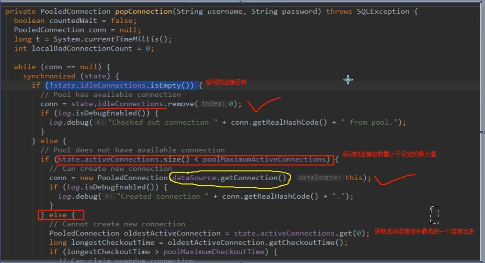
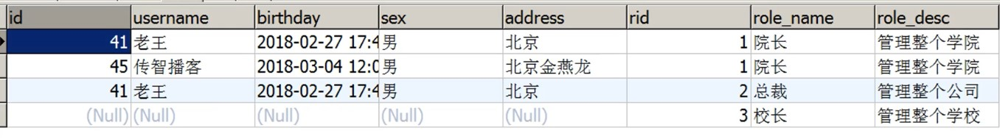
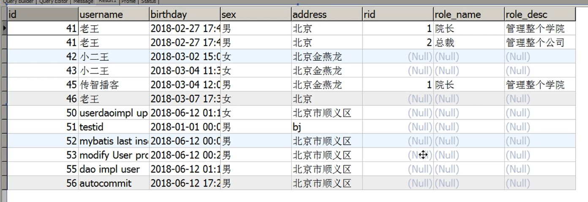
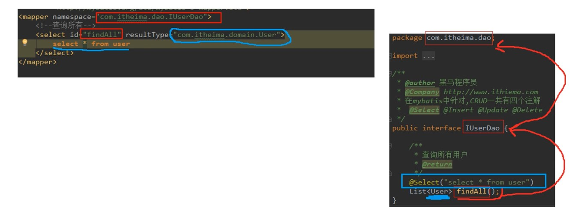
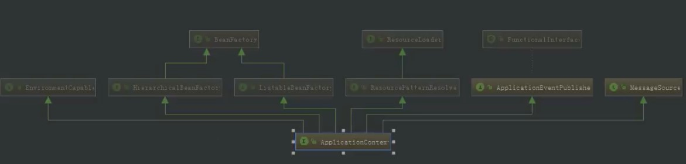
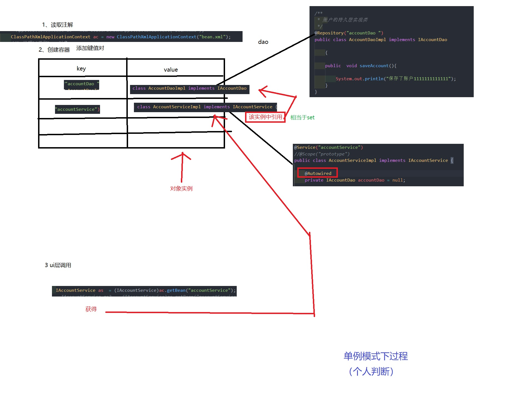
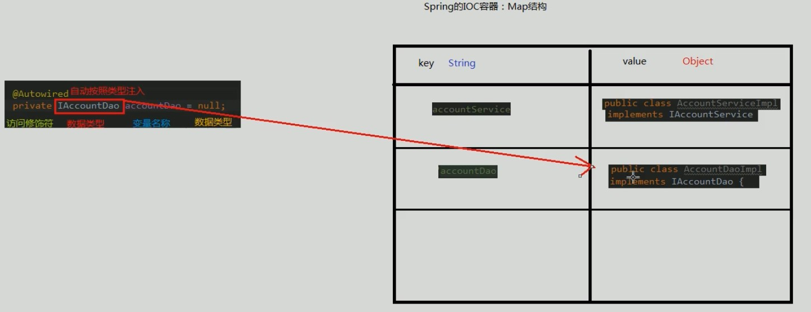
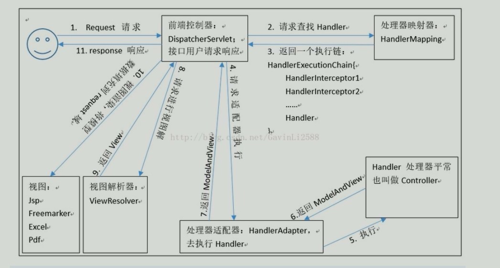
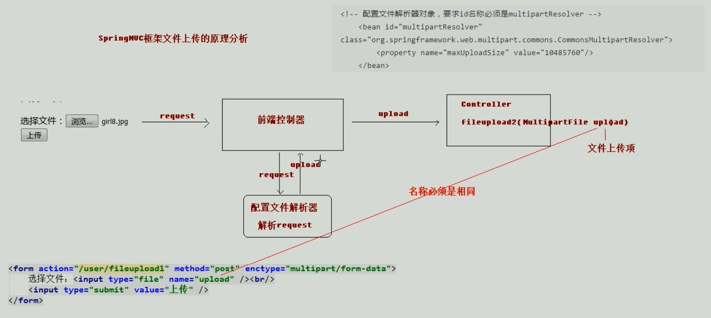
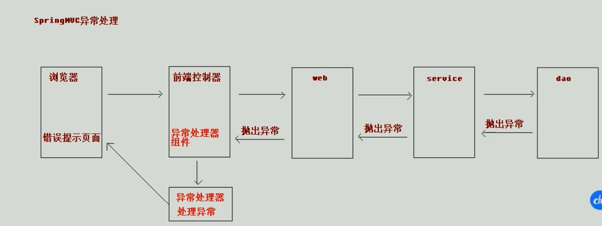

# 1. mybatis

> 官方文档：https://mybatis.org/mybatis-3/zh/index.html

## 1.1. 基础

### 1.1.1. mubatis入门

- 框架：
    - 概念：
        - 半成品软件
        - 封装了很多细节，使开发者可以通过极简的方式实现功能，提高效率
    - 目的：对三层架构的封装
    - 三层架构
      > 
        - 持久层解决方案（非框架）
            - jdbc -- 规范
            - Spring的JDBCTemplate -- 简单封装
            - Apache的DBUtils
    - 持久层总图
      > 
- mybatis概述
    - 持久层框架，java编写
    - 封装了很多jdbc细节，使开发者只用关注sql语句本身，而不用关注注册驱动等繁杂过程
    - 它使用了ORM思想，实现了结果集的封装
        - Object Relation Mapping对象关系映射
        - 把数据库表和实体类及实体类的属性对应起来，使操作实体类就能操作数据库表
            > 实体类中的属性和数据库表中的字段名保持一致

### 1.1.2. mybatis环境搭建

> 此处主要是使用xml，注解会在后面演示
- mybatis环境搭建
    - maven导入包
        - mybatis
        - mysql-connect-java
        - log4j（也要导入配置文件）
        - junit
    - 创建实体类（实现Serializable接口？）
    - 创建dao接口
        ```java
        package com.itheima.dao;

        import com.itheima.domain.User;

        import java.util.List;

        /**
        * @author 黑马程序员
        * @Company http://www.ithiema.com
        *
        * 用户的持久层接口
        */
        public interface IUserDao {

                /**
                * 查询所有操作
                * @return
                */
                List<User> findAll();
        }
        ```
    - 创建一个xml文件（习惯名称：SqlMapConfig.xml）
    - 添加xml文件的mybatis约束
        ```xml
        <?xml version="1.0" encoding="UTF-8"?>
        <!DOCTYPE configuration  
            PUBLIC "-//mybatis.org//DTD Config 3.0//EN"  
            "http://mybatis.org/dtd/mybatis-3-config.dtd">

        ```
    - 配置xml文件
        ```xml
        <?xml version="1.0" encoding="UTF-8"?>
        <!DOCTYPE configuration
                        PUBLIC "-//mybatis.org//DTD Config 3.0//EN"
                        "http://mybatis.org/dtd/mybatis-3-config.dtd">
        
        <!-- mybatis的主配置文件 -->
        <configuration>
                <!-- 配置环境 -->
                <environments default="mysql"> <!-- 默认使用配置名称 -->

                        <!-- 配置mysql的环境-->
                        <environment id="mysql">
                                <!-- 配置事务的类型-->
                                <transactionManager type="JDBC"></transactionManager>

                                <!-- 配置数据源（连接池） -->
                                <!-- 一共有三种类型，后面再讲 -->
                                <dataSource type="POOLED">

                                        <!-- 配置连接数据库的4个基本信息 -->
                                        <property name="driver" value="com.mysql.jdbc.Driver"/>
                                        <property name="url" value="jdbc:mysql://localhost:3306/eesy_mybatis"/>
                                        <property name="username" value="root"/>
                                        <property name="password" value="1234"/>
                                </dataSource>
                        </environment>
                </environments>

                <!-- 指定映射配置文件的位置，映射配置文件指的是每个dao独立的配置文件 -->
                <mappers>
                        <mapper resource="com/itheima/dao/IUserDao.xml"/><!-- mapper路径 -->
                </mappers>
        </configuration>

        ```
    - 创建mapper文件，添加mapper约束
        ```xml
        <?xml version="1.0" encoding="UTF-8"?>
        <!DOCTYPE mapper
                        PUBLIC "-//mybatis.org//DTD Mapper 3.0//EN"
                        "http://mybatis.org/dtd/mybatis-3-mapper.dtd">
        ```
    - 添加配置
        ```xml
        <?xml version="1.0" encoding="UTF-8"?>
        <!DOCTYPE mapper
                        PUBLIC "-//mybatis.org//DTD Mapper 3.0//EN"
                        "http://mybatis.org/dtd/mybatis-3-mapper.dtd">

        <mapper namespace="com.itheima.dao.IUserDao">

                <!--配置查询所有-->
                <select id="findAll" resultType="com.itheima.domain.User"> <!-- 这里一定要与方法名称相对应，以及一定要告知封装到的实体类 -->
                        select * from user;
                </select>
        </mapper>
        ```
    - 注意事项
        - mybatis中将持久层（dao层）的操作接口名称叫做mapper，比如`UserDao`和`UserMapper`是相同意思
        - 在映射配置文件中要指明封装到的实体类的全限定类名
        - mybatis映射文件位置必须和dao接口的包结构相同。
            ```
            ├─src
            │  ├─main
            │  │  ├─java
            │  │  │  └─com
            │  │  │      └─itheima
            │  │  │          ├─dao
            │  │  │          │      IUserDao.java
            │  │  │          │
            │  │  │          └─domain
            │  │  │                  User.java
            │  │  │
            │  │  └─resources
            │  │      │  log4j.properties
            │  │      │  SqlMapConfig.xml
            │  │      │
            │  │      └─com
            │  │          └─itheima
            │  │              └─dao
            │  │                      IUserDao.xml
            │  │
            │  └─test
            │      └─java
            │          └─com
            │              └─itheima
            │                  └─test
            │                          MybatisTest.java
            ```
        - 映射配置文件的mapper标签，nampspace属性取值，必须是dao接口的全限定类名
        - 映射配置文件的操作配置，id属性的取值必须是dao接口的方法名
        - **遵从后三个条件后，就不用再写dao的实现类，而只通过mybatis实现**


### 1.1.3. mybatis入门案例

```java
/**
 * @author 黑马程序员
 * mybatis的入门案例
 */
public class MybatisTest {

    /**
     * 入门案例
     * @param args
     */
    public static void main(String[] args)throws Exception {
        //1.读取配置文件
                // 注意，配置文件路径的读取是按照编译后资源文件所在位置，而不是开发的目录结构。maven会把资源文件放到target/classes下，而不会按照开发目录编写
        InputStream in = Resources.getResourceAsStream("SqlMapConfig.xml");
        //2.创建SqlSessionFactory工厂
        SqlSessionFactoryBuilder builder = new SqlSessionFactoryBuilder();
        SqlSessionFactory factory = builder.build(in);
        //3.使用工厂生产SqlSession对象
        SqlSession session = factory.openSession();
        //4.使用SqlSession创建Dao接口的代理对象
        IUserDao userDao = session.getMapper(IUserDao.class);
        //5.使用代理对象执行方法
        List<User> users = userDao.findAll();
        for(User user : users){
            System.out.println(user);
        }
        //6.释放资源
        session.close();
        in.close();
    }
}


```
- 图解
    > 
- 注意：
    - **配置文件路径的读取是按照编译后资源文件所在位置，而不是开发的目录结构。**
    - **maven会把资源文件放到target/classes下，而不会按照开发目录编写**
    - 所以这里会有`InputStream in = Resources.getResourceAsStream("SqlMapConfig.xml");`

- 基于注解的入门案例
    - 把IUserDao.xml移除，在dao接口方法上使用@Select注解并且指定sql语句
    - 在SqlMapConfig.xml中配置mapper标签时，修改使用class属性指定dao接口的权限定类名
        ```xml
        <mapper resource="com/itheima/dao/IUserDao.xml"/>
        <!-- 改为 -->
        <mapper class="com.ithema.IUserDao">
        ```

### 1.1.4. 自定义实现dao类入门（了解）

- 明确：
    - 在实际开发中，越简便越好
    - 尽管使用mybatis框架，也支持自己写实现类
    - 但通常不采用使用dao实现类的方式，直接使用框架
    - 使用自定义实现类演示（看看就行）：
        ```java
        // test.java
        public static void main(String[] args)throws Exception {
                        //1.读取配置文件
                        InputStream in = Resources.getResourceAsStream("SqlMapConfig.xml");
                        //2.创建SqlSessionFactory工厂
                        SqlSessionFactoryBuilder builder = new SqlSessionFactoryBuilder();
                        SqlSessionFactory factory = builder.build(in);

                        // 3将工厂传进去
                        userdao = new UserDaoImpl(factory);

                        //6.使用对象执行方法
                        List<User> users = userDao.findAll();
                        for(User user : users){
                                System.out.println(user);
                        }
                        //7.释放资源
                        session.close();
                        in.close();
        }
        ```
        ```java
        //实现类
        /**
        * @author 黑马程序员
        */
        public class UserDaoImpl implements IUserDao {

                private SqlSessionFactory factory;

                public UserDaoImpl(SqlSessionFactory  factory){
                        this.factory = factory;
                }

                public List<User> findAll(){
                        //4.使用工厂创建SqlSession对象
                        SqlSession session = factory.openSession();
                        //5.使用session执行 查询所有 方法
                        // * 注意：这里使用的是namespage.id 只有id时不行的。指定这个是为了找到配置的sql语句
                        List<User> users = session.selectList("com.itheima.dao.IUserDao.findAll");
                        session.close();
                        //返回查询结果
                        return users;
                }
        }
        
        ```

### 1.1.5. 自定义mybatis框架

> 为了了解执行细节

- 分析
  - 基本思路分析
      > 
    - 流程图
        > 
- 在source/src下有相关实现代码。因为比较复杂这里就没细说

## 1.2. 基本使用

### 1.2.1. 单表crud操作

#### 1.2.1.1. xml内容

- 查询
    - 单个查询（前面）
    - 模糊查询
        - 两种方式：
            - `select * from user where username like #{name}`
            - `select * from user where username like '%${value}%'`（不推荐）
        - 两种方式区别：
            > 
        ```xml
            <!-- 根据名称模糊查询 -->
            <select id="findByName" parameterType="string" resultType="com.ithema.domain.User">
                        <!-- 百分号要在调用时提供 -->
                        select * from user where username like #{name}

                    <!-- 也可以写成下面那样，百分号写到sql中，但是${}中只能写'value'，并且不安全。不推荐。 -->
                    <!-- select * from user where username like '%${value}%'-->
            </select>
        ```
    - 使用聚合函数
        ```xml
            <!-- 获取用户的总记录条数 -->
            <select id="findTotal" resultType="int">
                    select count(id) from user;
            </select>
        ```
- 插入
    - 使用`#{属性名}`来获取值（属性定义见javabean）
    - 注意：默认不会自动提交，需要调用`sqlSession.commit();`;
    - 示例：
    ```xml
    <!-- 保存用户 -->
    <insert id="saveUser" parameterType="com.itheima.domain.User">
        <!-- 配置插入操作后，获取插入数据的id -->
        <selectKey keyProperty="id" keyColumn="id" resultType="int" order="AFTER">
                <!-- 
                    keyProperty:对应类中的名称。saveUser(user)，后会读取对象数据进行插入，同时也会为对象中的id属性值
                    keyColumn:想要查询的数据库中的字段名称
                    resultType:返回值类型
                    order：什么时候进行这个操作（after就是指执行完下面的插入语句后）
                 -->
            select last_insert_id();
                        <!-- last_insert_id()为mysql中的一个函数 -->
        </selectKey>
                <!--上面一块只有在想获得插入记录的id时需要写上（id自增长）。 -->

        insert into user(username,address,sex,birthday)values(#{userName},#{userAddress},#{userSex},#{userBirthday});
    </insert>
    ```
- 更新
    - 参数类型名为全类名
    - 里面的要为属性名
    - 同样要进行手动提交
    - 示例
        ```xml
    <!-- 更新用户 -->
    <update id="updateUser" parameterType="com.itheima.domain.User">
        update user set username=#{userName},address=#{userAddress},sex=#{userAex},birthday=#{userBirthday} where id=#{userId}
    </update>
        ```
- 删除
    - 传入id删除用户
    - `parameterType`的类型可以是`int`,`Integer`,`java.lang.Integer`。
        > 原因在`typeAliases`标签
    - 当只有一个参数时`#{占位符}`，就行，占位符没有任何名称要求
    - 示例
    ```xml
    <!-- 删除用户-->
    <delete id="deleteUser" parameterType="java.lang.Integer">
        delete from user where id = #{uid}
    </delete>
    ```

#### 1.2.1.2. java测试代码（全部）
```java
/**
* 测试mybatis的crud操作
*/
public class MybatisTest {

        private InputStream in;
        private SqlSession sqlSession;
        private IUserDao userDao;

        @Before//用于在测试方法执行之前执行
        public void init()throws Exception{
                //1.读取配置文件，生成字节输入流
                in = Resources.getResourceAsStream("SqlMapConfig.xml");
                //2.获取SqlSessionFactory
                SqlSessionFactory factory = new SqlSessionFactoryBuilder().build(in);
                //3.获取SqlSession对象
                sqlSession = factory.openSession();
                //4.获取dao的代理对象
                userDao = sqlSession.getMapper(IUserDao.class);
        }

        @After//用于在测试方法执行之后执行
        public void destroy()throws Exception{
                //手动提交事务
                sqlSession.commit();
                //6.释放资源
                sqlSession.close();
                in.close();
        }

        /**
        * 测试查询所有
        */
        @Test
        public void testFindAll(){
                //5.执行查询所有方法
                List<User> users = userDao.findAll();
                for(User user : users){
                        System.out.println(user);
                }

        }

        /**
        * 测试保存操作
        */
        @Test
        public void testSave(){
                User user = new User();
                user.setUserName("modify User property");
                user.setUserAddress("北京市顺义区");
                user.setUserSex("男");
                user.setUserBirthday(new Date());
                System.out.println("保存操作之前："+user);
                //5.执行保存方法
                userDao.saveUser(user);

                System.out.println("保存操作之后："+user);
        }

        /**
        * 测试更新操作
        */
        @Test
        public void testUpdate(){
                User user = new User();
                user.setUserId(50);
                user.setUserName("mybastis update user");
                user.setUserAddress("北京市顺义区");
                user.setUserSex("女");
                user.setUserBirthday(new Date());

                //5.执行保存方法
                userDao.updateUser(user);
        }

        /**
        * 测试删除操作
        */
        @Test
        public void testDelete(){
                //5.执行删除方法
                userDao.deleteUser(48);
        }

        /**
        * 测试删除操作
        */
        @Test
        public void testFindOne(){
                //5.执行查询一个方法
                User  user = userDao.findById(50);
                System.out.println(user);
        }

        /**
        * 测试模糊查询操作
        */
        @Test
        public void testFindByName(){
                //5.执行查询一个方法
                List<User> users = userDao.findByName("%王%");
        //        List<User> users = userDao.findByName("王");
                for(User user : users){
                        System.out.println(user);
                }
        }

        /**
        * 测试查询总记录条数
        */
        @Test
        public void testFindTotal(){
                //5.执行查询一个方法
                int count = userDao.findTotal();
                System.out.println(count);
        }
}

```

### 1.2.2. 参数和返回值

- ognl表达式（Object Graphic Navigation Language）
    > 对象名导航语言。<br>
    > 使用方式和jsp中的el表达式差不多
    - apache开发出的
    - 通过对象的取值方法获取数据。在写法上把get省略
        - 类中：`user.getUsername()`
        - ognl：`user.username`
    - mybatis中，因为parameterType已经提供了属性所属的类，所以直接使用`#{username}`即可
- parameterType
    - 传递单个参数
        - 传递简单对象
        - 传递pojo对象（javabean对象）
            - mybatis使用ognl表达式解析对象字段的值
        - 传递pojo包装对象（pojo对象作为某个对象的属性）（和下面javabean传参法类似）
            ```xml
                <!-- 根据queryVo的条件查询用户 -->
                <select id="findUserByVo" parameterType="com.itheima.domain.QueryVo" resultType="com.ithema.domain.User">
                        select * from user where username like #{user.username}
                        <!-- 相当于vo.getUser().getUsername() -->
                </select>
            ```
            ```java
                /**
                * 测试使用QueryVo作为查询条件
                */
                @Test
                public void testFindByVo(){
                        QueryVo vo = new QueryVo();
                        User user = new User();
                        user.setUserName("%王%");
                        vo.setUser(user);
                        //5.执行查询一个方法
                        List<User> users = userDao.findUserByVo(vo);
                        for(User u : users){
                                System.out.println(u);
                        }
                }
            ```
    - 传递多个参数
        - 顺序传参法
            > #{}里面的数字代表你传入参数的顺序。<br>
            > 这种方法不建议使用，sql层表达不直观，且一旦顺序调整容易出错。
            ```java
                public User selectUser(String name, int deptId);
            ```
            ```xml
                <select id="selectUser" resultMap="UserResultMap">
                        select * from user
                        where user_name = #{0} and dept_id = #{1}
                </select>
            ```
        - @Param注解传参法
            > #{}里面的名称对应的是注解 @Param括号里面修饰的名称。<br>
            > 这种方法在参数不多的情况还是比较直观的，推荐使用
            ```java
            public User selectUser(@Param("userName") String name, int @Param("deptId") deptId);
            ```
            ```xml
                <select id="selectUser" resultMap="UserResultMap">
                        select * from user
                        where user_name = #{userName} and dept_id = #{deptId}
                </select>
            ```
        - Map传参法
            > #{}里面的名称对应的是 Map里面的key名称。<br>
            > 这种方法适合传递多个参数，且参数易变能灵活传递的情况。
            ```java
            public User selectUser(Map<String, Object> params);
            ```
            ```xml
                <select id="selectUser" parameterType="java.util.Map" resultMap="UserResultMap">
                        select * from user
                        where user_name = #{userName} and dept_id = #{deptId}
                </select>
            ```
        - Java Bean传参法
            > #{}里面的名称对应的是 User类里面的成员属性。<br>
            > 这种方法很直观，但需要建一个实体类，扩展不容易，需要加属性，看情况使用。
            ```java
            public User selectUser(User params);
            ```
            ```xml
                <select id="selectUser" parameterType="com.test.User" resultMap="UserResultMap">
                        select * from user
                        where user_name = #{userName} and dept_id = #{deptId}
                </select>
            ```

- 返回值
    - 当对象中属性名称和数据库字段名称不相同时就会无法将数据封装
    - 解决方式：
        > 最好还是能属性名和列名相同
        - 查询时在sql语句中起别名。**执行效率高**
            > `select name as useName from user`
        - xml中进行配置。**效率低，但开发效率高**
            - 配置查询结果的列名和实体类的属性名的对应关系
                ```xml
                    <!-- 配置 查询结果的列名和实体类的属性名的对应关系 -->
                    <!-- id为这个映射的名称，type表示对应实体类。 -->
                    <!-- 因此一个map映射就能表示一张表到一个实体类的封装 -->
                    <resultMap id="userMap" type="com.ithema.domain.User">
                            <!-- 主键字段的对应 -->
                            <!-- 复合主键的话就多个id标签 -->
                            <id property="userId" column="id"></id>
                            <!-- property对应java中的属性名，严格区分大小写 -->
                            <!--非主键字段的对应。-->
                            <result property="userName" column="username"></result>
                            <result property="userAddress" column="address"></result>
                            <result property="userSex" column="sex"></result>
                            <result property="userBirthday" column="birthday"></result>
                    </resultMap>
                ```
            - 下面标签中的`resultType`属性换为`resultMap`属性
                ```xml
                    <!-- 当数据库字段名和类中属性名相同时会一一对应，不需要额外映射，使用resultType即可。 -->
                    <!-- 但不相同时 -->
                    <!-- 这里需要指定使用那个 resultMap -->
                    <select id="findByName" parameterType="string" resultMap="userMap">
                        select * from user where username like #{name}
                    </select>
                ```

### 1.2.3. dao编写（了解）

> 不多说了，了解即可
```java
public class UserDaoImpl implements IUserDao {

    private SqlSessionFactory factory;

    public UserDaoImpl(SqlSessionFactory factory){
        this.factory = factory;
    }

    @Override
    public List<User> findAll() {
        //1.根据factory获取SqlSession对象
        SqlSession session = factory.openSession();
        //2.调用SqlSession中的方法，实现查询列表
        List<User> users = session.selectList("com.itheima.dao.IUserDao.findAll");//参数就是能获取配置信息的key
        //3.释放资源
        session.close();
        return users;
    }

    @Override
    public void saveUser(User user) {
        //1.根据factory获取SqlSession对象
        SqlSession session = factory.openSession();
        //2.调用方法实现保存
        session.insert("com.itheima.dao.IUserDao.saveUser",user);
        //3.提交事务
        session.commit();
        //4.释放资源
        session.close();
    }

    @Override
    public void updateUser(User user) {
        //1.根据factory获取SqlSession对象
        SqlSession session = factory.openSession();
        //2.调用方法实现更新
        session.update("com.itheima.dao.IUserDao.updateUser",user);
        //3.提交事务
        session.commit();
        //4.释放资源
        session.close();
    }

    @Override
    public void deleteUser(Integer userId) {
        //1.根据factory获取SqlSession对象
        SqlSession session = factory.openSession();
        //2.调用方法实现更新
        session.update("com.itheima.dao.IUserDao.deleteUser",userId);
        //3.提交事务
        session.commit();
        //4.释放资源
        session.close();
    }

    @Override
    public User findById(Integer userId) {
        //1.根据factory获取SqlSession对象
        SqlSession session = factory.openSession();
        //2.调用SqlSession中的方法，实现查询一个
        User user = session.selectOne("com.itheima.dao.IUserDao.findById",userId);
        //3.释放资源
        session.close();
        return user;
    }

    @Override
    public List<User> findByName(String username) {
        //1.根据factory获取SqlSession对象
        SqlSession session = factory.openSession();
        //2.调用SqlSession中的方法，实现查询列表
        List<User> users = session.selectList("com.itheima.dao.IUserDao.findByName",username);
        //3.释放资源
        session.close();
        return users;
    }

    @Override
    public int findTotal() {
        //1.根据factory获取SqlSession对象
        SqlSession session = factory.openSession();
        //2.调用SqlSession中的方法，实现查询一个
        Integer count = session.selectOne("com.itheima.dao.IUserDao.findTotal");
        //3.释放资源
        session.close();
        return count;
    }
}

```

- 自定义dao实现类mybatis源码执行过程分析(**※重要**)：
    > 
- mybatis使用源码执行过程(**※重要**)：
    > 
    > 到达selectList的过程与自己写的dao实现类代码相对应

### 1.2.4. 配置细节

#### 1.2.4.1. properties标签

- 可以在`configuration`标签内写。然后再进行调用
    ```xml
    <properties>
        <property name="driver" value="com.mysql.jdbc.Driver"></property>
        <property name="url" value="jdbc:mysql://localhost:3306/eesy_mybatis"></property>
        <property name="username" value="root"></property>
        <property name="password" value="1234"></property>
    </properties>

    <!--配置环境-->
    <environments default="mysql">
        <!-- 配置mysql的环境-->
        <environment id="mysql">
            <!-- 配置事务 -->
            <transactionManager type="JDBC"></transactionManager>

            <!--配置连接池-->
            <dataSource type="POOLED">
                <property name="driver" value="${driver}"></property>
                <property name="url" value="${url}"></property>
                <property name="username" value="${username}"></property>
                <property name="password" value="${password}"></property>
            </dataSource>
        </environment>
    </environments>
    ```
- 也可以使用外部文件
    - resource:直接用类路径就好（注意，是按照编译后的路径。）
    - url：
      - http，https协议
      - file协议
      ```properties
      jdbc.driver=com.mysql.jdbc.Driver
      jdbc.url=jdbc:mysql://localhost:3306/eesy_mybatis
      jdbc.username=root
      jdbc.password=1234
      ```
      ```xml
      <!-- 配置properties
          可以在标签内部配置连接数据库的信息。也可以通过属性引用外部配置文件信息
          resource属性： 常用的
              用于指定配置文件的位置，是按照类路径的写法来写，并且必须存在于类路径下。
          url属性：
              是要求按照Url的写法来写地址
              URL：Uniform Resource Locator 统一资源定位符。它是可以唯一标识一个资源的位置。
              它的写法：
                  http://localhost:8080/mybatisserver/demo1Servlet
                  协议      主机     端口       URI

              URI:Uniform Resource Identifier 统一资源标识符。它是在应用中可以唯一定位一个资源的。
        -->
      <properties url="file:///D:/IdeaProjects/day02_eesy_01mybatisCRUD/src/main/resources/jdbcConfig.properties">
      </properties>

          <!-- 在下方进行调用 -->
      ```

#### 1.2.4.2. typeAliases

- 之所以String等类型可以写成好多种方式，是因为mybatis内部配置了别名
    > 
- 使用typeAliases标签配置别名.**只能配置domain中类的别名**
    - `typeAlias`标签
        > 放在SqlMapConfig.xml最上面，因为下面会用
    - `package`标签
        > 放在mappers中
    ```xml
    <!--使用typeAliases配置别名，它只能配置domain中类的别名 -->
    <typeAliases>
        <!--typeAlias用于配置别名。type属性指定的是实体类全限定类名。alias属性指定别名，当指定了别名就再区分大小写 
        <typeAlias type="com.itheima.domain.User" alias="user"></typeAlias>-->

        <!-- 用于指定要配置别名的包，当指定之后，该包下的实体类都会注册别名，并且类名就是别名，不再区分大小写-->
        <package name="com.itheima.domain"></package>
    </typeAliases>
    ```

#### 1.2.4.3. mappers

- `mappers`内也可以配置`package`标签。**为整个包下的接口设置resource或class**
    ```xml
    <mappers>
        <!--<mapper resource="com/itheima/dao/IUserDao.xml"></mapper>-->
        <!-- package标签是用于指定dao接口所在的包,当指定了之后就不需要在写mapper以及resource或者class了 -->
        <package name="com.itheima.dao"></package>
    </mappers>
    ```

## 1.3. 深入

### 1.3.1. 连接池（原理了解）

> 自己去分析源码
- 连接池复习：
    > 
- mybatis连接池配置方式：
    - SqlMapConfig中的dataSource标签，type属性
        - 取值：
            - POOLED：采用传统的javax.sql.DataSource规范中的连接池
            - UNPOOLED：采用传统获取连接方式，虽然也实现了javax.sql.DataSource接口，但是并没有使用池的思想
            - JNDI：采用服务器提供的JNDI技术实现，来获取DataSource对象，不同服务器所能拿到的DataSource是不同的。**注意；如果不是web或maven的war工程是不能使用的**
                > 课程中用的tomcat服务器，采用的连接池是dbcp连接池
    - POOLED和UNPOOLED日志输出对比
        > 
    - POOLED源码过程分析
        > <br>
        > 

- JDNI扩展（了解）
    - 百科
        > JNDI(Java Naming and Directory Interface,Java命名和目录接口)是SUN公司提供的一种标准的Java命名系统接口，JNDI提供统一的客户端API，通过不同的访问提供者接口JNDI服务供应接口(SPI)的实现，由管理者将JNDI API映射为特定的命名服务和目录系统，使得Java应用程序可以和这些命名服务和目录服务之间进行交互。目录服务是命名服务的一种自然扩展。两者之间的关键差别是目录服务中对象不但可以有名称还可以有属性（例如，用户有email地址），而命名服务中对象没有属性
    - JDNI模仿window的注册表
        > 
    - 使用步骤
        - maven创建工程
        - webapp下创建META-INF目录
        - META-INF目录下创建context.xml文件
            ```xml
                <?xml version="1.0" encoding="UTF-8"?>
                <Context>
                <!-- 
                <Resource 
                name="jdbc/eesy_mybatis"						数据源的名称 	对应上面那幅图的name
                type="javax.sql.DataSource"						数据源类型
                auth="Container"								数据源提供者
                maxActive="20"									最大活动数
                maxWait="10000"									最大等待时间
                maxIdle="5"										最大空闲数
                username="root"									用户名
                password="1234"									密码
                driverClassName="com.mysql.jdbc.Driver"			驱动类
                url="jdbc:mysql://localhost:3306/eesy_mybatis"	连接url字符串
                />
                -->
                <Resource 
                name="jdbc/eesy_mybatis"
                type="javax.sql.DataSource"
                auth="Container"
                maxActive="20"
                maxWait="10000"
                maxIdle="5"
                username="root"
                password="1234"
                driverClassName="com.mysql.jdbc.Driver"
                url="jdbc:mysql://localhost:3306/eesy_mybatis"
                />
                </Context>
            ```
        - 如果不经过服务器，是无法访问数据库（连接池依赖于服务器）。所以测试可以在jsp中写。在一个普通测试文件中不行

### 1.3.2. 事务（原理了解）

> 自己去分析源码
- 默认不自动提交
- 创建SqlSession时，`openSession(true)`即可获得自动提交的SqlSession对象
- 注意**一般不会使用自动提交，在测试时可以用用**

### 1.3.3. 动态sql（会用即可）

> 更多查文档

- if标签：选择性连接
    ```xml
    <select id="findUserByCondition" resultMap="userMap" parameterType="user">
        select * from user where 1=1
                
                <!-- 这里test中要与对象属性名相同，大小写敏感 -->
                <!-- 不能使用&&，只能用and -->
        <if test="userName != null and userSex != null">
          and username = #{userName} and userSex = #{userSex}
        </if>
        <if test="userAddress != null">
            and userAddress = #{userAddress}
        </if>
    </select>
    ```
- where标签：代表where语句，能够省略`where 1=1`，自动添加`and`
    ```xml
    <select id="findUserByCondition" resultMap="userMap" parameterType="user">
        select * from user
        <where>
            <if test="userName != null">
                and username = #{userName}
            </if>
            <if test="userSex != null">
                and sex = #{userSex}
            </if>
        </where>
    </select>
    ```
- foreach标签：为了 in ....语句
    - SQL语句：select字段from user where id in(?)
    - <foreach>标签用于遍历集合，它的属性：
        - collection:代表要遍历的集合元素，注意编写时不要写#{}
        - open:代表语句的开始部分
        - close:代表结束部分
        - item:代表遍历集合的每个元素，生成的变量名
        - sperator:代表分隔符
    ```java
        public class QueryVo {

                private User user;

                private List<Integer> ids;

                // getter setter toString 略去
        }
    ```
    ```xml
        <!-- 根据queryvo中的Id集合实现查询用户列表 -->
    <select id="findUserInIds" resultMap="userMap" parameterType="queryvo">
        select * from user
        <where>
            <if test="ids != null and ids.size()>0">
                <foreach collection="ids" open="and id in (" close=")" item="uid" separator=",">
                    #{uid}
                </foreach>
            </if>
        </where>
    </select>
    ```

- 抽取重复sql（了解）
    ```xml
    <!-- 了解的内容：抽取重复的sql语句-->
        <!-- 注意，这里不能写分号 -->
    <sql id="defaultUser">
        select * from user
    </sql>

    <!-- 根据queryvo中的Id集合实现查询用户列表 -->
    <select id="findUserInIds" resultMap="userMap" parameterType="queryvo">
        <include refid="defaultUser"></include>
        <where>
            <if test="ids != null and ids.size()>0">
                <foreach collection="ids" open="and id in (" close=")" item="uid" separator=",">
                    #{uid}
                </foreach>
            </if>
        </where>
    </select>
    ```

### 1.3.4. 多表查询（掌握使用）


#### 1.3.4.1. 一对一（多对一）

> 情景：一个用户能有多个账户，一个账户只能对应一个用户<br>
> JavaType和ofType都是用来指定对象类型的，但是JavaType是用来指定pojo中属性的类型，而ofType指定的是映射到list集合属性中pojo的类型。<br>
> association用javatype即可，collection用ofType即可

- 方式一：在domain中定义专门的 po 类作为输出类型，其中定义了 sql 查询结果集所有的字段。此方法较为简单，企业中使用普遍。
    - 没什么新的点，看看pdf吧
- 方式二：
    - 使用 resultMap，定义专门的 resultMap 用于映射一对一查询结果。
    - 从表对象中加入主表对象属性
        > 通过面向对象的(has a)关系可以得知，我们可以在 Account 类中加入一个 User 类的对象来代表这个账户是哪个用户的。
    - 示例：一个账户对应一个用户
        - 注意：`association`标签
        ```java
            public class Account implements Serializable {

                    private Integer id;
                    private Integer uid;
                    private Double money;
                    //从  主
                    //多对一关系，从表实体应该包含一个主表实体的对象引用
                    private User user;

                    //getter setter toString这里省略
        ```
        ```xml
            <?xml version="1.0" encoding="UTF-8"?>
            <!DOCTYPE mapper
                            PUBLIC "-//mybatis.org//DTD Mapper 3.0//EN"
                            "http://mybatis.org/dtd/mybatis-3-mapper.dtd">
            <mapper namespace="com.itheima.dao.IAccountDao">

                    <!-- 定义封装account和user的resultMap -->
                    <resultMap id="accountUserMap" type="account">
                            <id property="id" column="aid"></id>
                            <result property="uid" column="uid"></result>
                            <result property="money" column="money"></result>

                            <!-- 一对一的关系映射：配置封装user的内容-->
                            <!-- 此处column不用写。延迟加载时再说这个干嘛 -->
                            <association property="user" column="uid" javaType="user">
                                    <id property="id" column="id"></id>
                                    <result column="username" property="username"></result>
                                    <result column="address" property="address"></result>
                                    <result column="sex" property="sex"></result>
                                    <result column="birthday" property="birthday"></result>
                            </association>
                    </resultMap>

                    <!-- 查询所有 -->
                    <select id="findAll" resultMap="accountUserMap">
                            select u.*,a.id as aid,a.uid,a.money from account a , user u where u.id = a.uid;
                    </select>

                    <!--查询所有账户同时包含用户名和地址信息-->
                    <select id="findAllAccount" resultType="accountuser">
                            select a.*,u.username,u.address from account a , user u where u.id = a.uid;
                    </select>

            </mapper>
        ```

#### 1.3.4.2. 一对多

> 注意，使用左外连接，就算user有重复也没关系，会根据主键往collection中添加<br>

- 方式一：新的po对象
- 方式二：
    - 使用resultMap，
    - 主表对象中加入从表对象集合
    - 示例：一个用户有多个账户
        ```java
        package com.itheima.domain;

        import java.io.Serializable;
        import java.util.Date;
        import java.util.List;

        /**
        * @author 黑马程序员
        * @Company http://www.ithiema.com
        */
        public class User implements Serializable {

                private Integer id;
                private String username;
                private String address;
                private String sex;
                private Date birthday;

                //主  从
                //一对多关系映射：主表实体应该包含从表实体的集合引用
                private List<Account> accounts;
                
                //getter setter toString略去
        }
        ```
        ```xml
            <?xml version="1.0" encoding="UTF-8"?>
            <!DOCTYPE mapper
                            PUBLIC "-//mybatis.org//DTD Mapper 3.0//EN"
                            "http://mybatis.org/dtd/mybatis-3-mapper.dtd">
            <mapper namespace="com.itheima.dao.IUserDao">

                    <!-- 定义User的resultMap-->
                    <resultMap id="userAccountMap" type="user">
                            <id property="id" column="id"></id>
                            <result property="username" column="username"></result>
                            <result property="address" column="address"></result>
                            <result property="sex" column="sex"></result>
                            <result property="birthday" column="birthday"></result>

                            <!-- 配置user对象中accounts集合的映射。 -->
                            <!-- ofType是集合中元素的属性 -->
                            <collection property="accounts" ofType="account">
                                    <id column="aid" property="id"></id>
                                    <result column="uid" property="uid"></result>
                                    <result column="money" property="money"></result>
                            </collection>
                    </resultMap>

                    <!-- 查询所有 -->
                    <select id="findAll" resultMap="userAccountMap">
                            select * from user u left outer join account a on u.id = a.uid
                    </select>

                    <!-- 根据id查询用户 -->
                    <select id="findById" parameterType="INT" resultType="user">
                            select * from user where id = #{uid}
                    </select>

            </mapper>
        ```


#### 1.3.4.3. 多对多

> 也就是有中间表。进行两次左外连接<br>
> 注意，sql语句在换行时，最好每行结尾或开头**加一个空格**<br>
> mybatis会直接拼接，不会自动加空格

- 方式一：两个对象，各自包含对方的集合引用

- 示例：用户和角色
    - 情景
        - 一个用户可以有多个角色
        - 一个角色可以赋予多个用户
    - 步骤：
        - 建立两张表：用户表，角色表
            - 让用户表和角色表具有多对多的关系。需要使用中间表，中间表中包含各自的主键，在中间表中是外键。
        - 建立两个实体类：用户实体类和角色实体类
            - 让用户和角色的实体类能体现出来多对多的关系
            - 各自包含对方一个集合引用
        - 建立两个配置文件
            - 用户的配置文件
            - 角色的配置文件
        - 实现配置：
            - 当我们查询用户时，可以同时得到用户所包含的角色信息
            - 当我们查询角色时，可以同时得到角色的所赋予的用户信息
    - 代码：
        - 角色到用户。多对多
            ```xml
                <?xml version="1.0" encoding="UTF-8"?>
                <!DOCTYPE mapper
                                PUBLIC "-//mybatis.org//DTD Mapper 3.0//EN"
                                "http://mybatis.org/dtd/mybatis-3-mapper.dtd">
                <mapper namespace="com.itheima.dao.IRoleDao">

                        <!--定义role表的ResultMap-->
                        <resultMap id="roleMap" type="role">
                                <id property="roleId" column="rid"></id>
                                <result property="roleName" column="role_name"></result>
                                <result property="roleDesc" column="role_desc"></result>
                                <collection property="users" ofType="user">
                                        <id column="id" property="id"></id>
                                        <result column="username" property="username"></result>
                                        <result column="address" property="address"></result>
                                        <result column="sex" property="sex"></result>
                                        <result column="birthday" property="birthday"></result>
                                </collection>
                        </resultMap>

                        <!--查询所有-->
                        <select id="findAll" resultMap="roleMap">
                        <!-- 注意行首或行末写空格 -->
                            select u.*,r.id as rid,r.role_name,r.role_desc from role r
                                left outer join user_role ur  on r.id = ur.rid
                                left outer join user u on u.id = ur.uid
                        </select>
                </mapper>
            ```
            > 查询结果<br>
            > 
            ```java
            public class Role implements Serializable {

                    private Integer roleId;
                    private String roleName;
                    private String roleDesc;

                    //多对多的关系映射：一个角色可以赋予多个用户
                    private List<User> users;

                    // 省略getter setter toString
            }
            ```
        - 用户到角色。多对多
            ```xml
                <?xml version="1.0" encoding="UTF-8"?>
                <!DOCTYPE mapper
                                PUBLIC "-//mybatis.org//DTD Mapper 3.0//EN"
                                "http://mybatis.org/dtd/mybatis-3-mapper.dtd">
                <mapper namespace="com.itheima.dao.IUserDao">

                        <!-- 定义User的resultMap-->
                        <resultMap id="userMap" type="user">
                                <id property="id" column="id"></id>
                                <result property="username" column="username"></result>
                                <result property="address" column="address"></result>
                                <result property="sex" column="sex"></result>
                                <result property="birthday" column="birthday"></result>
                                <!-- 配置角色集合的映射 -->
                                <collection property="roles" ofType="role">
                                        <id property="roleId" column="rid"></id>
                                        <result property="roleName" column="role_name"></result>
                                        <result property="roleDesc" column="role_desc"></result>
                                </collection>
                        </resultMap>

                        <!-- 查询所有 -->
                        <!-- 和上面差不多，就是反一下 -->
                        <select id="findAll" resultMap="userMap">
                                select u.*,r.id as rid,r.role_name,r.role_desc from user u
                                left outer join user_role ur  on u.id = ur.uid
                                left outer join role r on r.id = ur.rid
                        </select>

                        <!-- 根据id查询用户 -->
                        <select id="findById" parameterType="INT" resultType="user">
                                select * from user where id = #{uid}
                        </select>

                </mapper>
            ```
            > 查询结果<br>
            > 
            ```java
                public class User implements Serializable {

                        private Integer id;
                        private String username;
                        private String address;
                        private String sex;
                        private Date birthday;

                        //多对多的关系映射：一个用户可以具备多个角色
                        private List<Role> roles;

                        //getter setter toString略去
                }
            ```

## 1.4. 加载和缓存

### 1.4.1. mybatis加载时机

#### 1.4.1.1. 概念

- 问题：
    ```
        在一对多中，当我们有一个用户，它有100个账户。
        在查询用户的时候，要不要把关联的账户查出来？
        在查询账户的时候，要不要把关联的用户查出来？

        在查询用户时，用户下的账户信息应该是，什么时候使用，什么时候查询的。
        在查询账户时，账户的所属用户信息应该是随着账户查询时一起查询出来。
    ```
- 种类
    - 延迟加载
        > 按需加载，懒加载。只有在需要的时候才加载
        - 通常情景：
            - 一对多
            - 多对多
    - 立即加载
        > 只要一调用方法，就马上发起查询
        - 通常情景
            - 一对一
            - 多对一

#### 1.4.1.2. 实现

- 原理：在用的时候调用指定select

- 一对一实现。使用association实现延迟加载
    ```xml
        <!-- SqlMapConfig中 -->
    <!--配置参数-->
    <settings>
        <!--全局开关，开启Mybatis支持延迟加载-->
        <setting name="lazyLoadingEnabled" value="true"/>
                <!-- 将积极加载改为按需加载 -->
        <setting name="aggressiveLazyLoading" value="false"></setting>
    </settings>
    ```
    ```xml
        <?xml version="1.0" encoding="UTF-8"?>
        <!DOCTYPE mapper
                        PUBLIC "-//mybatis.org//DTD Mapper 3.0//EN"
                        "http://mybatis.org/dtd/mybatis-3-mapper.dtd">
        <mapper namespace="com.itheima.dao.IAccountDao">

                <!-- 定义封装account和user的resultMap -->
                <resultMap id="accountUserMap" type="account">
                        <id property="id" column="id"></id>
                        <result property="uid" column="uid"></result>
                        <result property="money" column="money"></result>
                        <!-- 一对一的关系映射：配置封装user的内容
                        select属性指定的内容：查询用户的唯一标识。指向已定义的select标签。当不是本文件中的时要加namespace
                        用于加载复杂类型属性的映射语句的 ID，它会从 column 属性指定的列中检索数据，作为参数传递给目标 select 语句

                        column属性指定的内容：用户根据id查询时，所需要的 参数 的值
                        -->
                        <association property="user" column="uid" javaType="user" select="com.itheima.dao.IUserDao.findById"></association>
                </resultMap>

                <!-- 查询所有 -->
                <select id="findAll" resultMap="accountUserMap">
                        select * from account
                </select>

                <!-- 根据用户id查询账户列表 -->
                <select id="findAccountByUid" resultType="account">
                        select * from account where uid = #{uid}
                </select>

        </mapper>
    ```
> 日志对比<br>
> 左上为直接加载。右上为延迟加载，之后查询user。左下为延迟加载不查询user。<br>
> 

- 一对多实现
    ```xml
        <?xml version="1.0" encoding="UTF-8"?>
        <!DOCTYPE mapper
                        PUBLIC "-//mybatis.org//DTD Mapper 3.0//EN"
                        "http://mybatis.org/dtd/mybatis-3-mapper.dtd">
        <mapper namespace="com.itheima.dao.IUserDao">

                <!-- 定义User的resultMap-->
                <resultMap id="userAccountMap" type="user">
                        <id property="id" column="id"></id>
                        <result property="username" column="username"></result>
                        <result property="address" column="address"></result>
                        <result property="sex" column="sex"></result>
                        <result property="birthday" column="birthday"></result>
                        <!-- 配置user对象中accounts集合的映射 -->
                        <collection property="accounts" ofType="account" select="com.itheima.dao.IAccountDao.findAccountByUid" column="id"></collection>
                </resultMap>

                <!-- 查询所有 -->
                <select id="findAll" resultMap="userAccountMap">
                        select * from user
                </select>

                <!-- 根据id查询用户 -->
                <select id="findById" parameterType="INT" resultType="user">
                        select * from user where id = #{uid}
                </select>

        </mapper>
    ```

### 1.4.2. 缓存

#### 1.4.2.1. 概念

- 概念：内存中的临时数据
- 目的：减少和数据库的交互次数，提高执行效率
- 适用于缓存：
    - 经常查询
    - 不经常改变
    - 数据的正确与否与最终结果影响不大（同步问题等可能导致数据差异）
- 不适用于缓存：
    - 经常改变的数据
    - 数据的正确与否对最终结果影响很大（商品库存，银行汇率，股市牌价）

#### 1.4.2.2. 一级缓存

- 概念：SqlSession对象的缓存。
    - 当我们执行查询之后，查询的结果会同时存入到SqlSession为我们提供一块区域中。
    - 该区域的结构是一个Map。当我们再次查询同样的数据，mybatis会先去sqlsession中查询是否有，有的话直接拿出来用。（自动完成）
    - 当SqlSession对象消失时，mybatis的一级缓存也就消失了。
- 清除触发
    - 清除sqlsession对象
    - `sqlSession.clearCache()`
    - 调用sqlsession的修改
    - 调用sqlsession的删除
    - 调用sqlsession的添加
    - 调用sqlsession的commit()
    - 调用sqlsession的close

#### 1.4.2.3. 二级缓存

- 概念：它指的是Mybatis中SqlSessionFactory对象的缓存。由同一个SqlSessionFactory对象创建的SqlSession共享其缓存。
- 结构：
    > 
    - 存放的是数据而不是对象，所以每次使用都会重新封装。所以每次查询出的对象都不是同一个
- 使用步骤（开启方式）：
    - 让Mybatis框架支持二级缓存（在SqlMapConfig.xml中配置）
        ```xml
            <!-- 该步不必要，默认为true -->
            <settings>
                    <setting name="cacheEnabled" value="true"/>
            </settings>
        ```
    - 让当前的映射文件支持二级缓存（在IUserDao.xml中配置）
        ```xml
        <!-- 映射文件，mapper标签下，开头 -->
        <!--开启user支持二级缓存-->
            <cache/>
        ```
    - 让当前的操作支持二级缓存（在select标签中配置）
        ```xml
            <!-- 根据id查询用户 -->
            <select id="findById" parameterType="INT" resultType="user" useCache="true">
                    select * from user where id = #{uid}
            </select>
        ```
- 测试java
    ```java
        @Test
        public void testFirstLevelCache(){
                SqlSession sqlSession1 = factory.openSession();
                IUserDao dao1 = sqlSession1.getMapper(IUserDao.class);
                User user1 = dao1.findById(41);
                System.out.println(user1);
                sqlSession1.close();//一级缓存消失

                SqlSession sqlSession2 = factory.openSession();
                IUserDao dao2 = sqlSession2.getMapper(IUserDao.class);
                User user2 = dao2.findById(41);
                System.out.println(user2);
                sqlSession2.close();
                
                // 以上代码只会查询数据库一次
                System.out.println(user1 == user2);// 因为对象会重新封装，所以会返回false
        }
    ```

## 1.5. 注解开发

### 1.5.1. 环境搭建

- 如果用package配置mappers的话，集合xml相同
- 不用的区别看前面
- 注意：
    - 只要路径下面有映射的xml文件，使用注解时就会报错。不管mappers中有没有配置
    - xml中的信息都能通过注解和java文件来找到
        > 

### 1.5.2. 单表CRUD

- 四个基本注解
    - @Select
    - @Insert
    - @Update
    - @Delete
- 代码
    ```java
        public interface IUserDao {

                /**
                * 查询所有用户
                * @return
                */
                @Select("select * from user")
                List<User> findAll();

                /**
                * 保存用户
                * @param user
                */
                @Insert("insert into user(username,address,sex,birthday)values(#{username},#{address},#{sex},#{birthday})")
                void saveUser(User user);

                /**
                * 更新用户
                * @param user
                */
                @Update("update user set username=#{username},sex=#{sex},birthday=#{birthday},address=#{address} where id=#{id}")
                void updateUser(User user);

                /**
                * 删除用户
                * @param userId
                */
                @Delete("delete from user where id=#{id} ")
                void deleteUser(Integer userId);

                /**
                * 根据id查询用户
                * @param userId
                * @return
                */
                @Select("select * from user  where id=#{id} ")
                User findById(Integer userId);

                /**
                * 根据用户名称模糊查询
                * @param username
                * @return
                */
        //    @Select("select * from user where username like #{username} ")
                @Select("select * from user where username like '%${value}%' ")
                List<User> findUserByName(String username);

                /**
                * 查询总用户数量
                * @return
                */
                @Select("select count(*) from user ")
                int findTotalUser();
        }

    ```

#### 1.5.2.1. @Results

> 相当于resultMap

- 在定义并使用时，使用`Results`注解
- 再重复使用时，使用`ResultMap`注解

```java

@CacheNamespace(blocking = true)
public interface IUserDao {

    /**
     * 查询所有用户
     * @return
     */
    @Select("select * from user")
    @Results(id="userMap",value={
            @Result(id=true,column = "id",property = "userId"),
            @Result(column = "username",property = "userName"),
            @Result(column = "address",property = "userAddress"),
            @Result(column = "sex",property = "userSex"),
            @Result(column = "birthday",property = "userBirthday"),
            @Result(property = "accounts",column = "id",
                    many = @Many(select = "com.itheima.dao.IAccountDao.findAccountByUid",
                                fetchType = FetchType.LAZY))
    })
    List<User> findAll();

    /**
     * 根据id查询用户
     * @param userId
     * @return
     */
    @Select("select * from user  where id=#{id} ")
    @ResultMap("userMap")
    User findById(Integer userId);

    /**
     * 根据用户名称模糊查询
     * @param username
     * @return
     */
    @Select("select * from user where username like #{username} ")
    @ResultMap("userMap")
    List<User> findUserByName(String username);
}

```

#### 1.5.2.2. 多表

- 一对一（多对一）
    ```java
    public interface IAccountDao {

            /**
            * 查询所有账户，并且获取每个账户所属的用户信息
            * @return
            */
            @Select("select * from account")
            @Results(id="accountMap",value = {
                            @Result(id=true,column = "id",property = "id"),
                            @Result(column = "uid",property = "uid"),
                            @Result(column = "money",property = "money"),
                            // one是指该对象对应一个user对象。此处user对应属性是一个对象																									立即加载
                            @Result(property = "user",column = "uid",one=@One(select="com.itheima.dao.IUserDao.findById",fetchType= FetchType.EAGER))
            })
            List<Account> findAll();

            /**
            * 根据用户id查询账户信息
            * @param userId
            * @return
            */
            @Select("select * from account where uid = #{userId}")
            List<Account> findAccountByUid(Integer userId);
    }

    ```

- 一对多
    ```java
    public interface IUserDao {

            /**
            * 查询所有用户
            * @return
            */
            @Select("select * from user")
            @Results(id="userMap",value={
                            @Result(id=true,column = "id",property = "userId"),
                            @Result(column = "username",property = "userName"),
                            @Result(column = "address",property = "userAddress"),
                            @Result(column = "sex",property = "userSex"),
                            @Result(column = "birthday",property = "userBirthday"),
                            /* 这里accounts属性名对应的属性是一个List集合 */
                            @Result(property = "accounts",column = "id",
                                            many = @Many(select = "com.itheima.dao.IAccountDao.findAccountByUid",
                                                                    fetchType = FetchType.LAZY))
            })
            List<User> findAll();

            /**
            * 根据id查询用户
            * @param userId
            * @return
            */
            @Select("select * from user  where id=#{id} ")
            @ResultMap("userMap")
            User findById(Integer userId);

            /**
            * 根据用户名称模糊查询
            * @param username
            * @return
            */
            @Select("select * from user where username like #{username} ")
            @ResultMap("userMap")
            List<User> findUserByName(String username);
    }
    ```

#### 1.5.2.3. 二级缓存配置

- 一级缓存默认开启
- 二级缓存开启步骤
    - 全局开启支持
        > SqlMapConfig.xml中
    - dao接口上加一个`@CacheNamespace(blocking=true)`
        ```java
        @CacheNamespace(blocking = true)
        public interface IUserDao {

                /**
                * 查询所有用户
                * @return
                */
                @Select("select * from user")
                @Results(id="userMap",value={
                                @Result(id=true,column = "id",property = "userId"),
                                @Result(column = "username",property = "userName"),
                                @Result(column = "address",property = "userAddress"),
                                @Result(column = "sex",property = "userSex"),
                                @Result(column = "birthday",property = "userBirthday"),
                                @Result(property = "accounts",column = "id",
                                                many = @Many(select = "com.itheima.dao.IAccountDao.findAccountByUid",
                                                                        fetchType = FetchType.LAZY))
                })
                List<User> findAll();

                /**
                * 根据id查询用户
                * @param userId
                * @return
                */
                @Select("select * from user  where id=#{id} ")
                @ResultMap("userMap")
                User findById(Integer userId);

                /**
                * 根据用户名称模糊查询
                * @param username
                * @return
                */
                @Select("select * from user where username like #{username} ")
                @ResultMap("userMap")
                List<User> findUserByName(String username);
        }

        ```

# 2. Spring

## 2.1. 基础

### 2.1.1. 基本概念

- spring是什么	
    > Spring框架是一个开放源代码的J2EE应用程序框架，由Rod Johnson发起，是针对bean的生命周期进行管理的轻量级容器（lightweight container）。 Spring解决了开发者在J2EE开发中遇到的许多常见的问题，提供了功能强大IOC、AOP及Web MVC等功能。Spring可以单独应用于构筑应用程序，也可以和Struts、Webwork、Tapestry等众多Web框架组合使用，并且可以与 Swing等桌面应用程序AP组合。因此， Spring不仅仅能应用于JEE应用程序之中，也可以应用于桌面应用程序以及小应用程序之中。<br>

- 两大核心
    - IoC（Inverse Of Control：反转控制）
    - AOP（Aspect Oriented Programming：面向切面编程）

- 发展历程
    - 1997 年 IBM 提出了 EJB 的思想
    - 1998 年，SUN 制定开发标准规范 EJB1.0
    - 1999 年，EJB1.1 发布
    - 2001 年，EJB2.0 发布
    - 2003 年，EJB2.1 发布
    - 2006 年，EJB3.0 发布
    - Rod Johnson（spring 之父）
        - Expert One-to-One J2EE Design and Development(2002)
        - 阐述了 J2EE 使用 EJB 开发设计的优点及解决方案
        - Expert One-to-One J2EE Development without EJB(2004)
        - 阐述了 J2EE 开发不使用 EJB 的解决方式（Spring 雏形）
        - 2017 年 9 月份发布了 spring 的最新版本 spring 5.0 通用版（GA）

- 优势：pdf

- 体系结构
    > 

### 2.1.2. 程序耦合和解耦

- 解释：pdf

### 2.1.3. 工厂模式结构

- 概念：
    - Bean：在计算机英语中，有可重用组件的含义。
    - JavaBean：用java语言编写的可重用组件。
    - javabean >  实体类

- 看源码

### 2.1.4. IOC（控制反转）

#### 2.1.4.1. 基础

- 概念：
    - 本来获取对象时是直接new，由程序直接掌握控制权
    - 将获取对象的控制权交给工厂类，这种控制权的转移，就叫控制反转
    - 这样当找不到相关类时，编译时也不会出错，只有在运行时才会出错
- 作用：降低依赖，无法消除

- Spring核心容器
    - 和前面工厂模式降低耦合相同
    - Spring核心容器也就是一个map集合

- 使用步骤：
    - resource下创建bean.xml(名称随便)
    - 文件内容：
        ```xml
            <?xml version="1.0" encoding="UTF-8"?>
            <beans xmlns="http://www.springframework.org/schema/beans"
                    xmlns:xsi="http://www.w3.org/2001/XMLSchema-instance"
                    xsi:schemaLocation="http://www.springframework.org/schema/beans
                            https://www.springframework.org/schema/beans/spring-beans.xsd">

                    <bean id="..." class="...">  
                            <!-- collaborators and configuration for this bean go here -->
                            <!-- 	The id attribute is a string that identifies the individual bean definition. -->
                            <!-- 	The class attribute defines the type of the bean and uses the fully qualified classname. -->
                    </bean>

                    <bean id="..." class="...">
                            <!-- collaborators and configuration for this bean go here -->
                    </bean>

                    <!-- more bean definitions go here -->

            </beans>
        ```
    - 获取核心容器对象
        ```java
        ApplicationContext context = new ClassPathXmlApplicationContext("bean.xml");
        ```
    - 根据id获取bean对象
        ```java
        // 两种方式
        PetStoreService service = (AccountService)context.getBean("accountService");
        //或
        PetStoreService service = context.getBean("accountService", accountService.class);
        ```

- ApplicationContext三个常用实现类
    - ClassPathXmlApplicationContext：加载类路径下的配置文件，要求配置文件必须在类路径下
    - FileSystemApplicationContext：可以加载磁盘任意路径下的配置文件。（必须有访问权限）
    - AnnocationConfigApplicationContext：读取注解来创建容器

- 核心容器的两个接口引发的问题：
    > 接口图：<br>
    > 
    - ApplicationContext：构建核心容器时，采用立即加载的方式。读取后立即创建配置文件中的class对象
        - 使用时机：单例模式
    - BeanFactory：构建核心容器时，采用延迟加载的方式。什么时候根据id获取对象什么时候才创建对象
        - 使用时机：多对象使用
- 解决：
    - BeanFactory是一个顶层接口，不适合直接使用
    - ApplicationContext有继承BeanFactory接口，可以通过配置文件来设置延迟和立即加载
    - 见Bean对象作用范围

#### 2.1.4.2. bean对象细节

- 创建bean三种方式
    - 使用默认构造函数创建：
        > spring中使用bean标签，仅配有id和class属性时，使用该种方式，没有默认构造函数时无法创建
        ```xml
        <bean id="accountService" class="com.itheima.service.impl.AccountServiceImpl"></bean>
        ```
    - 使用某个类（工厂类）中的方法创建对象（jar包中类方法的返回值的情景，无法调用默认构造函数）
        > id,factory-bean,factory-method三个属性<br>
        ```xml
        <bean id="instanceFactory" class="com.itheima.factory.InstanceFactory"></bean>
        <bean id="accountService" factory-bean="instanceFactory" factory-method="getAccountService"></bean>
        ```
    - 使用静态工厂中的静态方法创建对象（jar包中类方法的返回值的情景，无法调用默认构造函数）
        > id,class,factory-method三个属性<br>
        ```xml
        <bean id="accountService" class="com.itheima.factory.StaticFactory" factory-method="getAccountService"></bean>
        ```
    
- bean对象作用范围
    - bean标签scope属性（用于指定bean对象作用范围）
        - 取值
            - singleton：单例的（默认值）
            - prototype：多例的
            - request：作用于web应用的请求范围
            - session：作用于web应用的会话范围
            - global-session：作用于集群环境的会话范围（全局会话范围），当不是集群环境时，它就是session
                > 
    - 例：下方

- bean对象生命周期
    - 说明：
        - 单例对象：
            - 容器创建，对象创建
            - 容器销毁，对象销毁
        - 多例对象
            - 当获取对象时，spring框架创建
            - 使用过程中就不会销毁
            - 当对象没有对其他对象引用且长时间不用，由java回收机制进行回收
    - 属性：
        - init-method:创建时调用
        - destory-method:销毁时调用
    - 例：
        ```xml
        <bean id="accountService" class="com.itheima.service.impl.AccountServiceImpl"
            scope="singleton" init-method="init" destroy-method="destroy"></bean>
        ```

### 2.1.5. 依赖注入（Dependency Injection）

- 概念：
    > 在当前类需要用到其他类的对象，由spring为我们提供，我们只需要在配置文件中说明依赖关系的维护就称之为依赖注入。<br>
    > 注入就是为对象中的属性赋值，创建中（构造方法注入）或者创建后（set注入）都行。

- 能注入类型：
    > 如果是经常变化的数据并不适用于注入
    - 基本类型和String（看下面）
    - 其他bean类型（在配置文件中或者注解配置过的bean）（看下面）
    - 复杂类型/集合类型（此处使用的是set注入方式，使用构造函数注入的话只需要把property标签换一下即可）
        ```xml
            <!-- 复杂类型的注入/集合类型的注入
                    用于给List结构集合注入的标签：
                            list array set
                    用于个Map结构集合注入的标签:
                            map  props
                            
                    注意！！！！：
                    结构相同，标签可以互换
            -->
            <bean id="accountService3" class="com.itheima.service.impl.AccountServiceImpl3">
                    <property name="myStrs">
                            <set>
                                    <value>AAA</value>
                                    <value>BBB</value>
                                    <value>CCC</value>
                            </set>
                    </property>

                    <property name="myList">
                            <array>
                                    <value>AAA</value>
                                    <value>BBB</value>
                                    <value>CCC</value>
                            </array>
                    </property>

                    <property name="mySet">
                            <list>
                                    <value>AAA</value>
                                    <value>BBB</value>
                                    <value>CCC</value>
                            </list>
                    </property>

                    <property name="myMap">
                            <props>
                                    <prop key="testC">ccc</prop>
                                    <prop key="testD">ddd</prop>
                            </props>
                    </property>

                    <property name="myProps">
                            <map>
                                    <entry key="testA" value="aaa"></entry>
                                    <entry key="testB">
                                            <value>BBB</value>
                                    </entry>
                            </map>
                    </property>
            </bean>

        ```

<br>

- 注入方式：
    - 第一种：使用构造函数提供（一般不用）
        - 使用方式：
            - 使用的标签:constructor-arg
            - 标签出现的位置：bean标签的内部
            - 标签中的属性
                - type：用于指定要注入的数据的数据类型，该数据类型也是构造函数中某个或某些参数的类型。
                - index：用于指定要注入的数据给构造函数中指定索引位置的参数赋值。索引的位置是从0开始
                - name：用于指定给构造函数中指定名称的参数赋值	（常用的）
                - =============以上三个用于指定给构造函数中哪个参数赋值。下面用来给指定参数赋值
                - value：用于提供基本类型和String类型的数据。（字符串和数字类型会spring内会自动转换）
                - ref：用于指定其他的bean类型数据。它指的就是在spring的Ioc核心容器中出现过的bean对象
        - 示例：
            ```xml
            <bean id="accountService" class="com.itheima.service.impl.AccountServiceImpl">
            <!-- name是构造函数中的参数名称。 -->
            <constructor-arg name="name" value="泰斯特"></constructor-arg>
            <constructor-arg name="age" value="18"></constructor-arg>
            <constructor-arg name="birthday" ref="now"></constructor-arg>

            </bean>
            <!-- 配置一个日期对象 -->
            <bean id="now" class="java.util.Date"></bean>
            ```
        - 优势：在获取bean对象时，注入数据是必须的操作，否则对象无法创建成功。
    - 弊端：改变了bean对象的实例化方式，使我们在创建对象时，如果用不到这些数据，也必须提供。同时，如果只想赋几个成员的值，就要重载构造函数

    - 第二种：使用set方法提供（常用）
        - 使用：
            - 涉及的标签：property
            - 出现的位置：bean标签的内部
            - 标签的属性：
                - name：用于指定注入时所调用的set方法名称（也就是属性名称）
                - value：用于提供基本类型和String类型的数据
                - ref：用于指定其他的bean类型数据。它指的就是在spring的Ioc核心容器中出现过的bean对象
        - 示例：
            ```xml
            <bean id="accountService2" class="com.itheima.service.impl.AccountServiceImpl2">
                    <property name="name" value="TEST" ></property>
                    <property name="age" value="21"></property>
                    <property name="birthday" ref="now"></property>
            </bean>
            <bean id="now" class="java.util.Date"></bean>
            ```
        - 优势： 创建对象时没有明确的限制，可以直接使用默认构造函数
        - 弊端： 如果有某个成员必须有值，则获取对象是有可能set方法没有执行。（也就是忘了写）
    - 第三种：使用注解提供（之后的内容）

## 2.2. 基于注解ioc

### 2.2.1. 开始

- 创建bean.xml文件
- 导入依赖（不同于之前的）。
    ```xml
    <?xml version="1.0" encoding="UTF-8"?>
    <beans xmlns="http://www.springframework.org/schema/beans"
            xmlns:xsi="http://www.w3.org/2001/XMLSchema-instance"
            xmlns:context="http://www.springframework.org/schema/context"
            xsi:schemaLocation="http://www.springframework.org/schema/beans
                    https://www.springframework.org/schema/beans/spring-beans.xsd
                    http://www.springframework.org/schema/context
                    https://www.springframework.org/schema/context/spring-context.xsd">

    </beans>
    ```
- 添加要扫描的包（否则不知道注解位置）
    ```xml
    <context:component-scan base-package="com.whitestarrain"></context:component-scan>
    ```

### 2.2.2. 注入过程判断（个人）


> 所有对象在使用时都已经放到容器中了<br>
> 只有配置过，才能去注入。（bean类型）
>***spring就是一个大箱子，把之后用的装进去（配置），把要用的拿出来（注入）***

### 2.2.3. spring中ioc常用注解

- 用于创建对象
    - @Component
        - 作用：用于把当前类存入spring容器中（通常当某类不属于任何一层时使用）
        - 属性：
            - value:用于指定bean的id，当不写时，默认为首字母改小写的当前类名
    - @Controller
        - 作用和@Component完全相同。仅仅为了区分三层结构。一般在表现层
    - @Service
        - 作用和@Component完全相同。仅仅为了区分三层结构。一般用在业务层
    - @Repository
        - 作用和@Component完全相同。仅仅为了区分三层结构。一般用在持久层
- 用于注入数据
    - @AutoWired
        - 作用：自动按照类型注入。
            - 只要容器中有唯一的一个bean对象类型和要注入的变量类型匹配，就可以注入成功。
            - 如果没有任何匹配的类型（包括实现类），则报错
            - 如果有多个匹配时，首先按照类型筛选出来类型相同的几个，再用查找id和变量名相同的。如果没有则报错
        - 出现位置：变量上，方法上等
        - 细节：因为注解已经指定了变量位置，所以setter方法已经不是必须的了
        - 基本情况图解：
            > 
    - @Qualifier
        - 作用：
            - 在给类成员注入时不能单独使用，必须和@Autowired一起使用。@Autowired无法指定时，选择@Qualifier中指定id所对应的类
            - 但是给方法参数注入时可以直接使用。具体看下面使用注解配置时的使用
                > 不是必须的，参数会自动按照和Autowired相同的方式去容器中找。如果有多个且不同名时，可以用该注解指定
        - 属性：
            - value:用于指定注入bean的id
    - @Resource
        - 作用：直接按照bean的id进行注入
        - 属性：
            - name:用于指定bean的id。（注意，不是value）
    - ========以上三个注解只能注入bean类型数据，基本类型无法进行注入========
    - ========集合类型只能通过xml进行注入========
    - ========如果不是自己创建的类，无法写注解，那么也只能通过xml注入，比如jdbcTemplate========
    - @Value()
        - 作用：用于注入基本类型和String类型数据
        - 属性：
            - value：用于指定数据的值，同时可以使用spring的el表达式（SpEL）
                > jsp中，\$从四个域中获取数据。mybatis中，\$从上面设置的properties中获取。Spring中，看下面@PropertySource注解
- 用于改变作用范围
    - @Scope
        - 作用：用于指定bean作用范围
        - 属性：
            - value：指定范围的取值。常用取值：singleton prototype。所有取值看上面，和xml中的相同
- 生命周期相关（了解）
    - @PostConstruct
        - 作用：用于指定初始化方法
    - @PreDestroy
        - 作用：用于指定销毁方法

> 示例：
```java
@Service("accountService")
//@Scope("prototype")
public class AccountServiceImpl implements IAccountService {

//    @Autowired
//    @Qualifier("accountDao1")
    @Resource(name = "accountDao2")
    private IAccountDao accountDao = null;

    @PostConstruct
    public void  init(){
        System.out.println("初始化方法执行了");
    }

    @PreDestroy
    public void  destroy(){
        System.out.println("销毁方法执行了");
    }

    public void  saveAccount(){
        accountDao.saveAccount();
    }
}
```

### 2.2.4. xml和注解实现单表crud

> 具体见源码

- 过程：
    - 按照普通过程创建三层架构的文件
    - 注意：所有实现类都不要写，用接口即可
    - 配置xml时从顶向底配置，然后缺哪个配哪个，保证能配全
- bean.xml
    ```xml
    <?xml version="1.0" encoding="UTF-8"?>
        <beans xmlns="http://www.springframework.org/schema/beans"
                    xmlns:xsi="http://www.w3.org/2001/XMLSchema-instance"
                    xsi:schemaLocation="http://www.springframework.org/schema/beans
                        http://www.springframework.org/schema/beans/spring-beans.xsd">
                <!-- 配置Service -->
                <bean id="accountService" class="com.itheima.service.impl.AccountServiceImpl">
                        <!-- 注入dao -->
                        <property name="accountDao" ref="accountDao"></property>
                </bean>

                <!--配置Dao对象-->
                <bean id="accountDao" class="com.itheima.dao.impl.AccountDaoImpl">
                        <!-- 注入QueryRunner -->
                        <property name="runner" ref="runner"></property>
                </bean>

                <!--配置QueryRunner-->
                <bean id="runner" class="org.apache.commons.dbutils.QueryRunner" scope="prototype">
                        <!--注入数据源-->
                        <constructor-arg name="ds" ref="dataSource"></constructor-arg>
                </bean>

                <!-- 配置数据源 -->
                <bean id="dataSource" class="com.mchange.v2.c3p0.ComboPooledDataSource">
                        <!--连接数据库的必备信息-->
                        <property name="driverClass" value="com.mysql.jdbc.Driver"></property>
                        <property name="jdbcUrl" value="jdbc:mysql://localhost:3306/eesy"></property>
                        <property name="user" value="root"></property>
                        <property name="password" value="1234"></property>
                </bean>
        </beans>
    ```

### 2.2.5. spring新注解使用

> 目的：**脱离xml**<br>
>下面的注解主要是为了将不得不写xml的配置用配置类的方式进行配置（比如jdbcTemplate）<br>
> 推荐jar包中的类使用xml而不是下面的注解，因为有一定的复杂性

- @Configuration
    - 作用：指定当前类是一个配置类
    - 细节：
        - 当配置类作为AnnotationConfigApplicationContext对象创建的参数时，该注解可以不写。(可变参数，可传多个)
        - 但当不传入时：
            - 方式1：主配置类要配置好扫描路径，其他配置类要写好该注解
            - 方式2：在主配置类中使用import
- @ComponentScan
    - 作用：用于通过注解指定spring创建容器时要扫描的包
    - 属性：
        - value：用于指定创建容器时要扫描的包。
            > `@ComponentScan(com.whitestarrain)`
            > 等同于`<context:component-scan base-package="com.whitestarrain"></context:component-scan>`<br>
        - basePackagee：同上
- @Bean
    - 作用：用于把当前方法的返回值作为bean对象**存入spring的ioc容器中**
    - 属性：
        - name：用于指定bean的id。当不写时，默认值是当前方法的名称
    - 细节：
        - 当我们使用注解配置方法时，如果方法有**参数**，spring框架会去容器中查找有没有可用的bean对象。
        - 查找的方式和Autowired注解的作用是一样的
- @import
    - 作用：用于导入其他的配置类
    - 属性：
        - value:用于指定其他配置类的字节码。（当我们使用Import的注解之后，有Import注解的类就父配置类，而导入的都是子配置类）
- @PropertySource
    - 作用：用于指定properties文件的位置
    - 属性
        - value：指定文件的名称和路径。（关键字：classpath，表示类路径下）
            > `@PropertySource("classpath:jdbcConfig.properties")`
> 示例：

```java
@Configuration//可以省略
@ComponentScan("com.itheima")
@Import(JdbcConfig.class)
@PropertySource("classpath:jdbcConfig.properties")
public class SpringConfiguration {
}
```
```java
/**
 * 和spring连接数据库相关的配置类
 */
public class JdbcConfig {

    @Value("${jdbc.driver}")
    private String driver;

    @Value("${jdbc.url}")
    private String url;

    @Value("${jdbc.username}")
    private String username;

    @Value("${jdbc.password}")
    private String password;

    /**
     * 用于创建一个QueryRunner对象
     * @param dataSource
     * @return
     */
    @Bean(name="runner")
    @Scope("prototype")
    public QueryRunner createQueryRunner(@Qualifier("ds2") DataSource dataSource){
                                                                                //这个不是必须的，参数会自动按照和Autowired相同的方式去容器中找。如果有多个且不同名时，可以用该注解指定
        return new QueryRunner(dataSource);
    }

    /**
     * 创建数据源对象
     * @return
     */
    @Bean(name="ds2")
    public DataSource createDataSource(){
        try {
            ComboPooledDataSource ds = new ComboPooledDataSource();
            ds.setDriverClass(driver);
            ds.setJdbcUrl(url);
            ds.setUser(username);
            ds.setPassword(password);
            return ds;
        }catch (Exception e){
            throw new RuntimeException(e);
        }
    }

    @Bean(name="ds1")
    public DataSource createDataSource1(){
        try {
            ComboPooledDataSource ds = new ComboPooledDataSource();
            ds.setDriverClass(driver);
            ds.setJdbcUrl("jdbc:mysql://localhost:3306/eesy02");
            ds.setUser(username);
            ds.setPassword(password);
            return ds;
        }catch (Exception e){
            throw new RuntimeException(e);
        }
    }
}

```

### 2.2.6. spring和junit整合

- 分析：
    - 应用程序的入口:main方法
    - junit单元测试中，没有main方法也能执行
        - junit集成了一个main方法
        - 该方法就会判断当前测试类中哪些方法有 @Test注解
        - junit就让有Test注解的方法执行
    - junit不会管我们是否采用spring框架
        - 在执行测试方法时，junit根本不知道我们是不是使用了spring框架
        - 所以也就不会为我们读取配置文件/配置类创建spring核心容器
    - 由以上三点可知
        - 当测试方法执行时，没有Ioc容器，就算写了Autowired注解，也无法实现注入

- 过程：
    - 导入spring整合junit的jar(坐标)
    - 使用Junit提供的一个注解@Runwith，把原有的main方法替换了，替换成spring提供的
    - 告知spring的运行器，spring和ioc创建是基于xml还是注解的，并且说明位置。使用@ContextConfiguration
        - locations：指定xml文件的位置，加上classpath关键字，表示在类路径下。
            > `@ContextConfiguration(locations="classpath:bean.xml")`
        - classes：指定注解类所在地位置
            > `@ContextConfiguration(classes = SpringConfiguration.class)`
    - 已经给足创建容器的信息了，现在只要使用注解注入即可

<br>

> 注意：当我们使用spring 5.x版本的时候，要求junit的jar必须是4.12及以上

```java
    @RunWith(SpringJUnit4ClassRunner.class)
    @ContextConfiguration(classes = SpringConfiguration.class)
    public class AccountServiceTest {

            @Autowired
            private IAccountService as = null;

            @Test
            public void testFindAll() {
                    //3.执行方法
                    List<Account> accounts = as.findAllAccount();
                    for(Account account : accounts){
                            System.out.println(account);
                    }
            }

            @Test
            public void testFindOne() {
                    //3.执行方法
                    Account account = as.findAccountById(1);
                    System.out.println(account);
            }
    }

```

## 2.3. AOP

### 2.3.1. 案例引入

#### 2.3.1.1. ThreadLocal解决

<a id="ConnectionUtils"></a>

- 问题：比如在进行转账操作时，开启一个连接减少用户1的钱，开启另一个连接增加用户2的钱。不同连接是无法放在一个事务中的。
- 解决：使用ThreadLocal，每一个线程只对应一个连接。
    ```java
    /**
    * 连接的工具类，它用于从数据源中获取一个连接，并且实现和线程的绑定
    */
    public class ConnectionUtils {

            private ThreadLocal<Connection> tl = new ThreadLocal<Connection>();

            private DataSource dataSource;

            public void setDataSource(DataSource dataSource) {
                    this.dataSource = dataSource;
            }

            /**
            * 获取当前线程上的连接
            * @return
            */
            public Connection getThreadConnection() {
                    try{
                            //1.先从ThreadLocal上获取
                            Connection conn = tl.get();
                            //2.判断当前线程上是否有连接
                            if (conn == null) {
                                    //3.从数据源中获取一个连接，并且存入ThreadLocal中
                                    conn = dataSource.getConnection();
                                    tl.set(conn);
                            }
                            //4.返回当前线程上的连接
                            return conn;
                    }catch (Exception e){
                            throw new RuntimeException(e);
                    }
            }

            /**
            * 把连接和线程解绑
            */
            public void removeConnection(){
                    tl.remove();
            }
    }

    ```
    ```java
    /**
    * 和事务管理相关的工具类，它包含了，开启事务，提交事务，回滚事务和释放连接
    */
    public class TransactionManager {

            private ConnectionUtils connectionUtils;

            public void setConnectionUtils(ConnectionUtils connectionUtils) {
                    this.connectionUtils = connectionUtils;
            }

            /**
            * 开启事务
            */
            public  void beginTransaction(){
                    try {
                            connectionUtils.getThreadConnection().setAutoCommit(false);
                    }catch (Exception e){
                            e.printStackTrace();
                    }
            }

            /**
            * 提交事务
            */
            public  void commit(){
                    try {
                            connectionUtils.getThreadConnection().commit();
                    }catch (Exception e){
                            e.printStackTrace();
                    }
            }

            /**
            * 回滚事务
            */
            public  void rollback(){
                    try {
                            connectionUtils.getThreadConnection().rollback();
                    }catch (Exception e){
                            e.printStackTrace();
                    }
            }

            /**
            * 释放连接
            */
            public  void release(){
                    try {
                            connectionUtils.getThreadConnection().close();//还回连接池中
                            connectionUtils.removeConnection();	//必须解绑
                    }catch (Exception e){
                            e.printStackTrace();
                    }
            }
    }
    ```
    ```java
    /**
    * 账户的业务层实现类
    *
    * 事务控制应该都是在业务层
    */
    public class AccountServiceImpl implements IAccountService{

            private IAccountDao accountDao;
            private TransactionManager txManager;

            public void setTxManager(TransactionManager txManager) {
                    this.txManager = txManager;
            }

            public void setAccountDao(IAccountDao accountDao) {
                    this.accountDao = accountDao;
            }

            @Override
            public List<Account> findAllAccount() {
                    try {
                            //1.开启事务
                            txManager.beginTransaction();
                            //2.执行操作
                            List<Account> accounts = accountDao.findAllAccount();
                            //3.提交事务
                            txManager.commit();
                            //4.返回结果
                            return accounts;
                    }catch (Exception e){
                            //5.回滚操作
                            txManager.rollback();
                            throw new RuntimeException(e);
                    }finally {
                            //6.释放连接
                            txManager.release();
                    }

            }
    }
    ```
    ```xml
    <?xml version="1.0" encoding="UTF-8"?>
    <beans xmlns="http://www.springframework.org/schema/beans"
                xmlns:xsi="http://www.w3.org/2001/XMLSchema-instance"
                xsi:schemaLocation="http://www.springframework.org/schema/beans
                    http://www.springframework.org/schema/beans/spring-beans.xsd">

            <!-- 配置Service -->
            <bean id="accountService" class="com.itheima.service.impl.AccountServiceImpl">
                    <!-- 注入dao -->
                    <property name="accountDao" ref="accountDao"></property>
                    <!-- 注入事务管理器 -->
                    <property name="txManger" ref="txManger"></property>
            </bean>

            <!--配置Dao对象-->
            <bean id="accountDao" class="com.itheima.dao.impl.AccountDaoImpl">
                    <!-- 注入QueryRunner -->
                    <property name="runner" ref="runner"></property>
                    <!-- 注入ConnectionUtils -->
                    <property name="connectionUtils" ref="connectionUtils"></property>
            </bean>

            <!--配置QueryRunner-->
            <bean id="runner" class="org.apache.commons.dbutils.QueryRunner" scope="prototype"></bean>

            <!-- 配置数据源 -->
            <bean id="dataSource" class="com.mchange.v2.c3p0.ComboPooledDataSource">
                    <!--连接数据库的必备信息-->
                    <property name="driverClass" value="com.mysql.jdbc.Driver"></property>
                    <property name="jdbcUrl" value="jdbc:mysql://localhost:3306/eesy"></property>
                    <property name="user" value="root"></property>
                    <property name="password" value="1234"></property>
            </bean>

            <!-- 配置Connection的工具类 ConnectionUtils -->
            <bean id="connectionUtils" class="com.itheima.utils.ConnectionUtils">
                    <!-- 注入数据源-->
                    <property name="dataSource" ref="dataSource"></property>
            </bean>

            <!-- 配置事务管理器-->
            <bean id="txManager" class="com.itheima.utils.TransactionManager">
                    <!-- 注入ConnectionUtils -->
                    <property name="connectionUtils" ref="connectionUtils"></property>
            </bean>
    </beans>
    ```

> 新问题：方法称耦合度过高

#### 2.3.1.2. 代理

- 动态代理
    - 特点：字节码随用随创建，随用随加载
    - 作用：不修改源码的基础上对方法增强
- 基于接口的动态代理
    - 涉及的类：Proxy
        > 提供者：JDK官方
    - 要求：被代理类最少实现一个接口，如果没有则不能使用
    - 方法：newProxyInstance
        - 参数
            - ClassLoader：类加载器
                - 它是用于加载代理对象字节码的。和被代理对象使用相同的类加载器。固定写法。
            - Class[]：字节码数组
                - 它是用于让代理对象和被代理对象有相同方法。固定写法。
            - InvocationHandler：用于提供增强的代码
                - 它是让我们写如何代理。我们一般都是些一个该接口的实现类，通常情况下都是匿名内部类，但不是必须的。
                - 此接口的实现类都是谁用谁写。
    - 示例：
        ```java
        /**
        * 模拟一个消费者
        */
        public class Client {

            public static void main(String[] args) {
                final Producer producer = new Producer();

                    /**
                    * 动态代理：
                    *  分类：
                    *      基于接口的动态代理
                    *      基于子类的动态代理
                    *  如何创建代理对象：
                    *      使用Proxy类中的newProxyInstance方法
                    *  创建代理对象的要求：
                    *      被代理类最少实现一个接口，如果没有则不能使用
                    */
                IProducer proxyProducer = (IProducer) Proxy.newProxyInstance(producer.getClass().getClassLoader(),
                    producer.getClass().getInterfaces(),
                    new InvocationHandler() {
                        /**
                        * 作用：执行被代理对象的任何接口方法都会经过该方法
                        * 方法参数的含义
                        * @param proxy   代理对象的引用（一般不用）
                        * @param method  当前执行的方法
                        * @param args    当前执行方法所需的参数
                        * @return        和被代理对象方法有相同的返回值
                        * @throws Throwable
                        */
                        @Override
                        public Object invoke(Object proxy, Method method, Object[] args) throws Throwable {
                                //提供增强的代码
                                Object returnValue = null;

                                //1.获取方法执行的参数
                                Float money = (Float)args[0];
                                //2.判断当前方法是不是销售
                                if("saleProduct".equals(method.getName())) {
                                        returnValue = method.invoke(producer, money*0.8f);
                                }
                                return returnValue;
                        }
                    });
                proxyProducer.saleProduct(10000f);
            }
        }

        ```

- 基于子类的动态代理
    - 涉及的类：Enhancer
        > 提供者：第三方cglib库
    - 如何创建代理对象：使用Enhancer类中的create方法
        - 参数：
            - Class：字节码。它是用于指定被代理对象的字节码。
            - Callback：用于提供增强的代码
                - 它是让我们写如何代理。我们一般都是些一个该接口的实现类，通常情况下都是匿名内部类，但不是必须的。
                - 此接口的实现类都是谁用谁写。
                - 我们一般写的都是该接口的子接口实现类：MethodInterceptor
    - 要求：被代理类不能是最终类
    - 示例：
        ```java
        /**
        * 模拟一个消费者
        */
        public class Client {

                public static void main(String[] args) {
                        final Producer producer = new Producer();

                        /**
                        *  create方法的参数：
                        *      Class：字节码
                        *          它是用于指定被代理对象的字节码。
                        *
                        *      Callback：用于提供增强的代码
                        *          它是让我们写如何代理。我们一般都是些一个该接口的实现类，通常情况下都是匿名内部类，但不是必须的。
                        *          此接口的实现类都是谁用谁写。
                        *          我们一般写的都是该接口的子接口实现类：MethodInterceptor
                        */
                        Producer cglibProducer = (Producer)Enhancer.create(producer.getClass(), new MethodInterceptor() {
                                /**
                                * 执行被代理对象的任何方法都会经过该方法
                                * @param proxy （基本用不上）
                                * @param method
                                * @param args
                                *    以上三个参数和基于接口的动态代理中invoke方法的参数是一样的
                                * @param methodProxy ：当前执行方法的代理对象（基本用不上）
                                * @return
                                * @throws Throwable
                                */
                                @Override
                                public Object intercept(Object proxy, Method method, Object[] args, MethodProxy methodProxy) throws Throwable {
                                        //提供增强的代码
                                        Object returnValue = null;

                                        //1.获取方法执行的参数
                                        Float money = (Float)args[0];
                                        //2.判断当前方法是不是销售
                                        if("saleProduct".equals(method.getName())) {
                                                returnValue = method.invoke(producer, money*0.8f);
                                        }
                                        return returnValue;
                                }
                        });
                        cglibProducer.saleProduct(12000f);
                }
        }

        ```

#### 2.3.1.3. 动态代理解决

- 账户管理实现类
    ```java
    /**
    * 账户的业务层实现类
    *
    * 事务控制应该都是在业务层
    */
    public class AccountServiceImpl implements IAccountService{

            private IAccountDao accountDao;

            public void setAccountDao(IAccountDao accountDao) {
                    this.accountDao = accountDao;
            }

            @Override
            public List<Account> findAllAccount() {
                return accountDao.findAllAccount();
            }
    }

    ```
- 创建账户管理代理类的工厂类
    ```java
    /**
    * 用于创建Service的代理对象的工厂
    */
    public class BeanFactory {

            private IAccountService accountService;

            private TransactionManager txManager;

            public void setTxManager(TransactionManager txManager) {
                    this.txManager = txManager;
            }

            public final void setAccountService(IAccountService accountService) {
                    this.accountService = accountService;
            }

            /**
            * 获取Service代理对象
            * @return
            */
            public IAccountService getAccountService() {
                    return (IAccountService)Proxy.newProxyInstance(accountService.getClass().getClassLoader(),
                                    accountService.getClass().getInterfaces(),
                                    new InvocationHandler() {
                                            /**
                                            * 添加事务的支持
                                            *
                                            * @param proxy
                                            * @param method
                                            * @param args
                                            * @return
                                            * @throws Throwable
                                            */
                                            @Override
                                            public Object invoke(Object proxy, Method method, Object[] args) throws Throwable {

                                                    if("test".equals(method.getName())){
                                                            return method.invoke(accountService,args);
                                                    }

                                                    Object rtValue = null;
                                                    try {
                                                            //1.开启事务
                                                            txManager.beginTransaction();
                                                            //2.执行操作
                                                            rtValue = method.invoke(accountService, args);
                                                            //3.提交事务
                                                            txManager.commit();
                                                            //4.返回结果
                                                            return rtValue;
                                                    } catch (Exception e) {
                                                            //5.回滚操作
                                                            txManager.rollback();
                                                            throw new RuntimeException(e);
                                                    } finally {
                                                            //6.释放连接
                                                            txManager.release();
                                                    }
                                            }
                                    });

            }
    }
    ```
- 依赖项
    ```xml
    <?xml version="1.0" encoding="UTF-8"?>
    <beans xmlns="http://www.springframework.org/schema/beans"
                xmlns:xsi="http://www.w3.org/2001/XMLSchema-instance"
                xsi:schemaLocation="http://www.springframework.org/schema/beans
                    http://www.springframework.org/schema/beans/spring-beans.xsd">

            <!--配置代理的service-->
            <bean id="proxyAccountService" factory-bean="beanFactory" factory-method="getAccountService"></bean>

            <!--配置beanfactory-->
            <bean id="beanFactory" class="com.itheima.factory.BeanFactory">
                    <!-- 注入service -->
                    <property name="accountService" ref="accountService"></property>
                    <!-- 注入事务管理器 -->
                    <property name="txManager" ref="txManager"></property>
            </bean>

            <!-- 配置Service -->
            <bean id="accountService" class="com.itheima.service.impl.AccountServiceImpl">
                    <!-- 注入dao -->
                    <property name="accountDao" ref="accountDao"></property>
            </bean>

            <!--配置Dao对象-->
            <bean id="accountDao" class="com.itheima.dao.impl.AccountDaoImpl">
                    <!-- 注入QueryRunner -->
                    <property name="runner" ref="runner"></property>
                    <!-- 注入ConnectionUtils -->
                    <property name="connectionUtils" ref="connectionUtils"></property>
            </bean>

            <!--配置QueryRunner-->
            <bean id="runner" class="org.apache.commons.dbutils.QueryRunner" scope="prototype"></bean>

            <!-- 配置数据源 -->
            <bean id="dataSource" class="com.mchange.v2.c3p0.ComboPooledDataSource">
                    <!--连接数据库的必备信息-->
                    <property name="driverClass" value="com.mysql.jdbc.Driver"></property>
                    <property name="jdbcUrl" value="jdbc:mysql://localhost:3306/eesy"></property>
                    <property name="user" value="root"></property>
                    <property name="password" value="1234"></property>
            </bean>

            <!-- 配置Connection的工具类 ConnectionUtils -->
            <bean id="connectionUtils" class="com.itheima.utils.ConnectionUtils">
                    <!-- 注入数据源-->
                    <property name="dataSource" ref="dataSource"></property>
            </bean>

            <!-- 配置事务管理器-->
            <bean id="txManager" class="com.itheima.utils.TransactionManager">
                    <!-- 注入ConnectionUtils -->
                    <property name="connectionUtils" ref="connectionUtils"></property>
            </bean>
    </beans>
    ```

> 问题：依赖太过繁琐

### 2.3.2. AOP基础

- 概念：
    > 在软件业，AOP为Aspect Oriented Programming的缩写，意为：面向切面编程，通过预编译方式和运行期间动态代理实现程序功能的统一维护的一种技术。AOP是OOP的延续，是软件开发中的一个热点，也是Spring框架中的一个重要内容，是函数式编程的一种衍生范型。利用AOP可以对业务逻辑的各个部分进行隔离，从而使得业务逻辑各部分之间的耦合度降低，提高程序的可重用性，同时提高了开发的效率。
- 作用：在程序运行期间，不修改源码对已有方法进行增强。
- 优势：
    - 减少重复代码
    - 提高开发效率
    - 维护方便
- 实现方式：动态代理

> 实则就是上面的案例引入

### 2.3.3. Spring中的AOP

#### 2.3.3.1. 开始

##### 2.3.3.1.1. 术语

> 目的：通过配置的方式实现案例引入中的功能

- Joinpoint(连接点):
    > 所谓连接点是指那些被拦截到的点。在 spring 中,这些点指的是方法,因为 spring 只支持方法类型的连接点。（被拦截即可）
- Pointcut(切入点):
    > 所谓切入点是指我们要对哪些 Joinpoint 进行拦截的定义。（被拦截且增强）
- Advice(通知/增强):
    > 所谓通知是指拦截到 Joinpoint 之后所要做的事情就是通知。
    - 通知的类型：
        > 就是拦截后的增强
        - 前置通知：在切入点方法执行之前执行
        - 后置通知：在切入点方法正常执行之后执行。它和异常通知永远只能执行一个
        - 异常通知：它和后置通知永远只能执行一个
        - 最终通知：无论切入点方法是否正常执行它都会在其后面执行
        - 环绕通知：***可以做到上面的所有***，就相当于动态代理。
    - 图解：
        > 
- Introduction(引介):
    > 引介是一种特殊的通知在不修改类代码的前提下, Introduction 可以在运行期为类动态地添加一些方法或 Field。
- Target(目标对象):
    > 代理的目标对象。即被代理对象
- Weaving(织入):
    > 是指把增强应用到目标对象来创建新的代理对象的**过程**。<br>
    > spring 采用动态代理织入，而 AspectJ 采用编译期织入和类装载期织入。
- Proxy（代理）:
    > 一个类被 AOP 织入增强后，就产生一个结果代理类。
- Aspect(切面):
    > 是切入点和通知（引介）的结合。<br>
    > 即切入点方法和通知方法的对应关系

##### 2.3.3.1.2. 明确

- 开发阶段（我们做的）
    - 编写核心业务代码（开发主线）：大部分程序员来做，要求熟悉业务需求。
    - 把公用代码抽取出来，制作成通知。（开发阶段最后再做）：AOP 编程人员来做。
    - 在配置文件中，声明切入点与通知间的关系，即切面。：AOP 编程人员来做。
- 运行阶段（Spring 框架完成的）
    - Spring 框架监控切入点方法的执行。一旦监控到切入点方法被运行，使用代理机制，动态创建目标对象的代理对象，根据通知类别，在代理对象的对应位置，将通知对应的功能织入，完成完整的代码逻辑运行。

#### 2.3.3.2. xml配置

- 步骤：
    - 导包：
        - spring-context
        - aspectjweaver:切入点表达式相关
    - 创建bean.xml(约束不同)，进行配置
    - AOP配置步骤
        - 使用aop:config标签表明开始AOP的配置
        - 使用aop:aspect标签表明配置切面
            - id属性：是给切面提供一个唯一标识。尽量起得易懂
            - ref属性：是指定通知类bean的Id。
        - 在aop:aspect标签的内部使用对应标签来配置通知的类型
            - aop:before：表示配置前置通知
                - method属性：用于指定Logger类中哪个方法是前置通知
                - pointcut属性：用于指定切入点表达式，该表达式的含义指的是对业务层中哪些方法增强

- 切入点表达式写法：（就是用aspectjweaver解析的）
    - 关键字：execution(表达式)
    - 表达式：
        > `访问修饰符  返回值  包名.包名.包名...类名.方法名(参数列表)`
    - 标准的表达式写法：
        > `public void com.itheima.service.impl.AccountServiceImpl.saveAccount()`
    - 访问修饰符可以省略
        > `void com.itheima.service.impl.AccountServiceImpl.saveAccount()`
    - 返回值可以使用通配符，表示任意返回值
        > `* com.itheima.service.impl.AccountServiceImpl.saveAccount()`
    - 包名可以使用通配符，表示任意包。但是有几级包，就需要写几个*.
        > `* *.*.*.*.AccountServiceImpl.saveAccount())`	(任意包下的AccountServiceImpl类)
    - 包名可以使用..表示当前包及其子包
        > `* *..AccountServiceImpl.saveAccount()`	(任意包下的AccountServiceImpl类)
    - 类名和方法名都可以使用*来实现通配
        > `* *..*.*()`<!-- 任意包下任意类的任意没有参数的方法 -->
    - 参数列表：
        - 可以直接写数据类型：
            - 基本类型直接写名称：int
            - 引用类型写包名.类名的方式：java.lang.String
                > `* *..*.*(int,java.lang.String)`
            - 可以使用通配符表示任意类型，但是必须有参数
                > `* *..*.*(*,*)`
            - 可以使用..表示有无参数均可，有参数可以是任意类型
                > `* *..*.*(..)`
        - 全通配写法：
            > `* *..*.*(..)`
    - 实际开发中切入点表达式的**通常**写法：
        - 切到业务层实现类下的所有方法
            > `* com.itheima.service.impl.*.*(..)`

- 示例：
    ```xml
    <?xml version="1.0" encoding="UTF-8"?>
    <beans xmlns="http://www.springframework.org/schema/beans"
                xmlns:xsi="http://www.w3.org/2001/XMLSchema-instance"
                xmlns:aop="http://www.springframework.org/schema/aop"
                xsi:schemaLocation="http://www.springframework.org/schema/beans
                    http://www.springframework.org/schema/beans/spring-beans.xsd
                    http://www.springframework.org/schema/aop
                    http://www.springframework.org/schema/aop/spring-aop.xsd">

            <!-- 配置srping的Ioc,把service对象配置进来-->
            <bean id="accountService" class="com.itheima.service.impl.AccountServiceImpl"></bean>

            <!-- 配置Logger类 -->
            <bean id="logger" class="com.itheima.utils.Logger"></bean>

            <!--配置AOP-->
            <aop:config>
                    <!--配置切面 -->
                    <aop:aspect id="logAdvice" ref="logger"><!-- 配置通知类 -->
                            <!-- 配置通知的类型，并且建立通知方法和切入点方法的关联-->
                            <!-- 我们现在示例是让printLog方法在切入点方法执行之前之前：所以是前置通知 --><!-- 配置通知类里面的方法和切入点 -->
                            <aop:before method="printLog" pointcut="execution(* com.itheima.service.impl.*.*(..))"></aop:before>
                    </aop:aspect>
            </aop:config>

    </beans>
    ```
    ```java
    /**
    * 账户的业务层实现类
    */
    public class AccountServiceImpl implements IAccountService{

            @Override
            public void saveAccount() {
                    System.out.println("执行了保存");
            }

            @Override
            public void updateAccount(int i) {
                    System.out.println("执行了更新"+i);

            }

            @Override
            public int deleteAccount() {
                    System.out.println("执行了删除");
                    return 0;
            }
    }
    ```
    ```java
    /**
    * 用于记录日志的工具类，它里面提供了公共的代码
    */
    public class Logger {
            /**
            * 用于打印日志：计划让其在切入点方法执行之前执行（切入点方法就是业务层方法）
            */
            public  void printLog(){
                    System.out.println("Logger类中的pringLog方法开始记录日志了。。。");
            }
    }
    ```

- 其他通知类型：
    ```xml
    <?xml version="1.0" encoding="UTF-8"?>
    <beans xmlns="http://www.springframework.org/schema/beans"
                xmlns:xsi="http://www.w3.org/2001/XMLSchema-instance"
                xmlns:aop="http://www.springframework.org/schema/aop"
                xsi:schemaLocation="http://www.springframework.org/schema/beans
                    http://www.springframework.org/schema/beans/spring-beans.xsd
                    http://www.springframework.org/schema/aop
                    http://www.springframework.org/schema/aop/spring-aop.xsd">

            <!-- 配置srping的Ioc,把service对象配置进来-->
            <bean id="accountService" class="com.itheima.service.impl.AccountServiceImpl"></bean>

            <!-- 配置Logger类 -->
            <bean id="logger" class="com.itheima.utils.Logger"></bean>

            <!--配置AOP-->
            <aop:config>
                    <!-- 配置切入点表达式 id属性用于指定表达式的唯一标识。expression属性用于指定表达式内容
                                此标签写在aop:aspect标签内部只能当前切面使用。
                                它还可以写在aop:aspect外面，此时就变成了所有切面可用。但一定要放在切面之前，否则会报错
                        -->
                    <aop:pointcut id="pt1" expression="execution(* com.itheima.service.impl.*.*(..))"></aop:pointcut>
                    <!--配置切面 -->
                    <aop:aspect id="logAdvice" ref="logger">
                            <!-- 配置前置通知：在切入点方法执行之前执行
                            <aop:before method="beforePrintLog" pointcut-ref="pt1" ></aop:before>-->

                            <!-- 配置后置通知：在切入点方法正常执行之后值。它和异常通知永远只能执行一个
                            <aop:after-returning method="afterReturningPrintLog" pointcut-ref="pt1"></aop:after-returning>-->

                            <!-- 配置异常通知：在切入点方法执行产生异常之后执行。它和后置通知永远只能执行一个
                            <aop:after-throwing method="afterThrowingPrintLog" pointcut-ref="pt1"></aop:after-throwing>-->

                            <!-- 配置最终通知：无论切入点方法是否正常执行它都会在其后面执行
                            <aop:after method="afterPrintLog" pointcut-ref="pt1"></aop:after>-->

                            <!-- 配置环绕通知 详细的注释请看Logger类中-->
                            <aop:around method="aroundPringLog" pointcut-ref="pt1"></aop:around>
                    </aop:aspect>
            </aop:config>

    </beans>
    ```
    ```java
    package com.itheima.service.impl;

    import com.itheima.service.IAccountService;

    /**
    * 账户的业务层实现类
    */
    public class AccountServiceImpl implements IAccountService{

            @Override
            public void saveAccount() {
                    System.out.println("执行了保存");
    //        int i=1/0;
            }

            @Override
            public void updateAccount(int i) {
                    System.out.println("执行了更新"+i);

            }

            @Override
            public int deleteAccount() {
                    System.out.println("执行了删除");
                    return 0;
            }
    }

    ```
    ```java
    package com.itheima.utils;

    import org.aspectj.lang.ProceedingJoinPoint;

    /**
    * 用于记录日志的工具类，它里面提供了公共的代码
    */
    public class Logger {

            /**
            * 前置通知
            */
            public  void beforePrintLog(){
                    System.out.println("前置通知Logger类中的beforePrintLog方法开始记录日志了。。。");
            }

            /**
            * 后置通知
            */
            public  void afterReturningPrintLog(){
                    System.out.println("后置通知Logger类中的afterReturningPrintLog方法开始记录日志了。。。");
            }
            /**
            * 异常通知
            */
            public  void afterThrowingPrintLog(){
                    System.out.println("异常通知Logger类中的afterThrowingPrintLog方法开始记录日志了。。。");
            }

            /**
            * 最终通知
            */
            public  void afterPrintLog(){
                    System.out.println("最终通知Logger类中的afterPrintLog方法开始记录日志了。。。");
            }

            /**
            * 环绕通知
            * 问题：
            *      当我们配置了环绕通知之后，切入点方法没有执行，而通知方法执行了。
            * 分析：
            *      !!!通过对比动态代理中的环绕通知代码，发现动态代理的环绕通知有明确的切入点方法调用，
            * 		 !!!而我们的代码中没有。
            * 解决：
            **       Spring框架为我们提供了一个接口：ProceedingJoinPoint。该接口有一个方法proceed()，此方法就相当于明确调用切入点方法。
            **      该接口可以作为环绕通知的方法参数，在程序执行时，spring框架会为我们提供该接口的实现类供我们使用。
            *
            * spring中的环绕通知：
            **      它是spring框架为我们提供的一种可以在代码中手动控制增强方法何时执行的方式。就是一种动态代理。
            */
            public Object aroundPringLog(ProceedingJoinPoint pjp){
                    Object rtValue = null;
                    try{
                            Object[] args = pjp.getArgs();//得到方法执行所需的参数

                            System.out.println("Logger类中的aroundPringLog方法开始记录日志了。。。前置");//前置通知

                            rtValue = pjp.proceed(args);//明确调用业务层方法（切入点方法）

                            System.out.println("Logger类中的aroundPringLog方法开始记录日志了。。。后置");//后置通知

                            return rtValue;
                    }catch (Throwable t){// exception拦不住，必须要用Throwable
                            System.out.println("Logger类中的aroundPringLog方法开始记录日志了。。。异常");//异常通知
                            throw new RuntimeException(t);
                    }finally {
                            System.out.println("Logger类中的aroundPringLog方法开始记录日志了。。。最终");//最终通知
                    }
            }
    }

    ```

#### 2.3.3.3. 注解配置

> 注意，较早版本中，使用注解时异常通知和后置通知都在最终通知之后执行,***这是spring中的问题***<br>
> ***但使用环绕通知可以避免***<br>
> 因此使用注解时推荐使用环绕通知。<br>
> 新版已修复

- 创建bean.xml
    > 比之前多一个context的命名空间
    ```xml
    <?xml version="1.0" encoding="UTF-8"?>
    <beans xmlns="http://www.springframework.org/schema/beans"
                xmlns:xsi="http://www.w3.org/2001/XMLSchema-instance"
                xmlns:aop="http://www.springframework.org/schema/aop"
                xmlns:context="http://www.springframework.org/schema/context"
                xsi:schemaLocation="http://www.springframework.org/schema/beans
                    http://www.springframework.org/schema/beans/spring-beans.xsd
                    http://www.springframework.org/schema/aop
                    http://www.springframework.org/schema/aop/spring-aop.xsd
                    http://www.springframework.org/schema/context
                    http://www.springframework.org/schema/context/spring-context.xsd">

            <!-- 配置spring创建容器时要扫描的包-->
            <context:component-scan base-package="com.itheima"></context:component-scan>

            <!-- 配置spring开启注解AOP的支持 -->
            <aop:aspectj-autoproxy></aop:aspectj-autoproxy>
    </beans>
    ```
- 开启支持（两种方式）
    - xml中开启切面注解支持
        > `<aop:aspectj-autoproxy></aop:aspectj-autoproxy>`
    - 注解开启
        ```java
        @Configuration
        @ComponentScan(basePackages="com.itheima")
        @EnableAspectJAutoProxy //开启切面注解支持
        public class SpringConfiguration {
        }
        ```

- 使用注解进行配置：
    ```java
        package com.itheima.utils;
        import org.aspectj.lang.ProceedingJoinPoint;
        import org.aspectj.lang.annotation.*;
        import org.springframework.stereotype.Component;

        /**
        * 用于记录日志的工具类，它里面提供了公共的代码
        */
        @Component("logger")
        @Aspect//表示当前类是一个切面类
        public class Logger {

                /**
                * 指定切入点
                */
                @Pointcut("execution(* com.itheima.service.impl.*.*(..))")
                private void pt1(){}//方法名为切入点

                /**
                * 前置通知
                */
                @Before("pt1()")// 引用时必须带着括号
                public  void beforePrintLog(){
                        System.out.println("前置通知Logger类中的beforePrintLog方法开始记录日志了。。。");
                }

                /**
                * 后置通知
                */
                @AfterReturning("pt1()")
                public  void afterReturningPrintLog(){
                        System.out.println("后置通知Logger类中的afterReturningPrintLog方法开始记录日志了。。。");
                }
                /**
                * 异常通知
                */
                @AfterThrowing("pt1()")
                public  void afterThrowingPrintLog(){
                        System.out.println("异常通知Logger类中的afterThrowingPrintLog方法开始记录日志了。。。");
                }

                @After("pt1()")
                public  void afterPrintLog(){
                        System.out.println("最终通知Logger类中的afterPrintLog方法开始记录日志了。。。");
                }

                @Around("pt1()")
                public Object aroundPringLog(ProceedingJoinPoint pjp){
                        Object rtValue = null;
                        try{
                                Object[] args = pjp.getArgs();//得到方法执行所需的参数

                                System.out.println("Logger类中的aroundPringLog方法开始记录日志了。。。前置");

                                rtValue = pjp.proceed(args);//明确调用业务层方法（切入点方法）

                                System.out.println("Logger类中的aroundPringLog方法开始记录日志了。。。后置");

                                return rtValue;
                        }catch (Throwable t){
                                System.out.println("Logger类中的aroundPringLog方法开始记录日志了。。。异常");
                                throw new RuntimeException(t);
                        }finally {
                                System.out.println("Logger类中的aroundPringLog方法开始记录日志了。。。最终");
                        }
                }
        }

    ```

## 2.4. JDBCTemplate

### 2.4.1. 作用说明：

#### 2.4.1.1. 案例引入aop方式代理

```xml
<?xml version="1.0" encoding="UTF-8"?>
<beans xmlns="http://www.springframework.org/schema/beans"
       xmlns:xsi="http://www.w3.org/2001/XMLSchema-instance"
       xmlns:aop="http://www.springframework.org/schema/aop"
       xsi:schemaLocation="http://www.springframework.org/schema/beans
        http://www.springframework.org/schema/beans/spring-beans.xsd
        http://www.springframework.org/schema/aop
        http://www.springframework.org/schema/aop/spring-aop.xsd">

     <!-- 配置Service -->
    <bean id="accountService" class="com.itheima.service.impl.AccountServiceImpl">
        <!-- 注入dao -->
        <property name="accountDao" ref="accountDao"></property>
    </bean>

    <!--配置Dao对象-->
    <bean id="accountDao" class="com.itheima.dao.impl.AccountDaoImpl">
        <!-- 注入QueryRunner -->
        <property name="runner" ref="runner"></property>
        <!-- 注入ConnectionUtils -->
        <property name="connectionUtils" ref="connectionUtils"></property>
    </bean>

    <!--配置QueryRunner-->
    <bean id="runner" class="org.apache.commons.dbutils.QueryRunner" scope="prototype"></bean>

    <!-- 配置数据源 -->
    <bean id="dataSource" class="com.mchange.v2.c3p0.ComboPooledDataSource">
        <!--连接数据库的必备信息-->
        <property name="driverClass" value="com.mysql.jdbc.Driver"></property>
        <property name="jdbcUrl" value="jdbc:mysql://localhost:3306/eesy"></property>
        <property name="user" value="root"></property>
        <property name="password" value="1234"></property>
    </bean>

    <!-- 配置Connection的工具类 ConnectionUtils -->
    <bean id="connectionUtils" class="com.itheima.utils.ConnectionUtils">
        <!-- 注入数据源-->
        <property name="dataSource" ref="dataSource"></property>
    </bean>

    <!-- 配置事务管理器-->
    <bean id="txManager" class="com.itheima.utils.TransactionManager">
        <!-- 注入ConnectionUtils -->
        <property name="connectionUtils" ref="connectionUtils"></property>
    </bean>

    <!--配置aop-->
    <aop:config>
        <!--配置通用切入点表达式-->
        <aop:pointcut id="pt1" expression="execution(* com.itheima.service.impl.*.*(..))"></aop:pointcut>
        <aop:aspect id="txAdvice" ref="txManager">
            <!--配置前置通知：开启事务-->
            <aop:before method="beginTransaction" pointcut-ref="pt1"></aop:before>
            <!--配置后置通知：提交事务-->
            <aop:after-returning method="commit" pointcut-ref="pt1"></aop:after-returning>
            <!--配置异常通知：回滚事务-->
            <aop:after-throwing method="rollback" pointcut-ref="pt1"></aop:after-throwing>
            <!--配置最终通知：释放连接-->
            <aop:after method="release" pointcut-ref="pt1"></aop:after>
        </aop:aspect>
    </aop:config>
</beans>
```
```java
package com.itheima.utils;

import javax.sql.DataSource;
import java.sql.Connection;

/**
 * 连接的工具类，它用于从数据源中获取一个连接，并且实现和线程的绑定
 */
public class ConnectionUtils {

    private ThreadLocal<Connection> tl = new ThreadLocal<Connection>();

    private DataSource dataSource;

    public void setDataSource(DataSource dataSource) {
        this.dataSource = dataSource;
    }

    /**
     * 获取当前线程上的连接
     * @return
     */
    public Connection getThreadConnection() {
        try{
            //1.先从ThreadLocal上获取
            Connection conn = tl.get();
            //2.判断当前线程上是否有连接
            if (conn == null) {
                //3.从数据源中获取一个连接，并且存入ThreadLocal中
                conn = dataSource.getConnection();
                tl.set(conn);
            }
            //4.返回当前线程上的连接
            return conn;
        }catch (Exception e){
            throw new RuntimeException(e);
        }
    }

    /**
     * 把连接和线程解绑
     */
    public void removeConnection(){
        tl.remove();
    }
}

```
```java
package com.itheima.utils;

/**
 * 和事务管理相关的工具类，它包含了，开启事务，提交事务，回滚事务和释放连接
 */
public class TransactionManager {

    private ConnectionUtils connectionUtils;

    public void setConnectionUtils(ConnectionUtils connectionUtils) {
        this.connectionUtils = connectionUtils;
    }

    /**
     * 开启事务
     */
    public  void beginTransaction(){
        try {
            connectionUtils.getThreadConnection().setAutoCommit(false);
        }catch (Exception e){
            e.printStackTrace();
        }
    }

    /**
     * 提交事务
     */
    public  void commit(){
        try {
            connectionUtils.getThreadConnection().commit();
        }catch (Exception e){
            e.printStackTrace();
        }
    }

    /**
     * 回滚事务
     */
    public  void rollback(){
        try {
            connectionUtils.getThreadConnection().rollback();
        }catch (Exception e){
            e.printStackTrace();
        }
    }

    /**
     * 释放连接
     */
    public  void release(){
        try {
            connectionUtils.getThreadConnection().close();//还回连接池中
            connectionUtils.removeConnection();
        }catch (Exception e){
            e.printStackTrace();
        }
    }
}
```

#### 2.4.1.2. template说明

- template内部使用的就是ThreadLocal，实现了线程安全。
- 因为template也是线程绑定连接，所以也可以通过aop实现事务控制。原理与上面类似。只不过一个用的spring内部的，一个用的自定义的

### 2.4.2. 其他具体内容

> 这里只记录之前没记录过的

#### 2.4.2.1. 内置datasource

- spring内置datasource
    ```java
    DriverManagerDataSource ds = new DriverManagerDataSource();
    ds.setDriverClassName("com.mysql.jdbc.Driver");
    ds.setUrl("jdbc:mysql://localhost:3306/eesy");
    ds.setUsername("root");
    ds.setPassword("1234");
    ```
- 两个查询方法区别：
    > 

#### 2.4.2.2. 两种dao中使用jdbcTemplate

- 使用spring注入
- 继承`JdbcDaoSupport`类（Spring提供）
    - 目的：抽取前面的代码：
        ```java
            //被抽取代码(使用注解时)：
            @Autowired
            private JdbcTemplate jdbcTemplate;
        ```
        ```java
        // 被抽取代码(使用xml时)：
        private JdbcTemplate jdbcTemplate;
        public void setJdbcTemplate(JdbcTemplate jdbcTemplate) {
                this.jdbcTemplate = jdbcTemplate;
        }
        ```
    - 作用：会自动进行配置和注入
    - 使用：继承后直接使用`getJdbcTemplate()`即可获取
    - 注意：使用该方式时，因为`JdbcDaoSupport`在jar中，使用注解配置较困难。因此：
        - 第一种：使用注解配置：不抽取（因为包含注解也就两行）
        - 第二种：使用xml配置：抽取
    - 示例：
        ```java
        /**
        * 账户的持久层实现类
        */
        public class AccountDaoImpl extends JdbcDaoSupport implements IAccountDao {

                @Override
                public Account findAccountById(Integer accountId) {
                    /* 下面的getJdbcTemplate直接使用 */
                        List<Account> accounts = super.getJdbcTemplate().query("select * from account where id = ?",new BeanPropertyRowMapper<Account>(Account.class),accountId);
                        return accounts.isEmpty()?null:accounts.get(0);
                }

                @Override
                public Account findAccountByName(String accountName) {
                        List<Account> accounts = super.getJdbcTemplate().query("select * from account where name = ?",new BeanPropertyRowMapper<Account>(Account.class),accountName);
                        if(accounts.isEmpty()){
                                return null;
                        }
                        if(accounts.size()>1){
                                throw new RuntimeException("结果集不唯一");
                        }
                        return accounts.get(0);
                }

                @Override
                public void updateAccount(Account account) {
                        super.getJdbcTemplate().update("update account set name=?,money=? where id=?",account.getName(),account.getMoney(),account.getId());
                }
        }

        ```
    - 原理仿照：
        ```java
        // 自定义类
        package com.itheima.dao.impl;
         //此类用于抽取dao中的重复代码
        public class JdbcDaoSupport {

                private JdbcTemplate jdbcTemplate;
                /* 两个方式获得template */
                public void setJdbcTemplate(JdbcTemplate jdbcTemplate) {
                        this.jdbcTemplate = jdbcTemplate;
                }

                public void setDataSource(DataSource dataSource) {
                        if(jdbcTemplate == null){
                                jdbcTemplate = createJdbcTemplate(dataSource);// 注入datasource就会创建template
                        }
                }

                public JdbcTemplate getJdbcTemplate() {
                        return jdbcTemplate;
                }

                private JdbcTemplate createJdbcTemplate(DataSource dataSource){
                        return new JdbcTemplate(dataSource);
                }
        }
        ```
        ```xml
        <?xml version="1.0" encoding="UTF-8"?>
        <beans xmlns="http://www.springframework.org/schema/beans"
                    xmlns:xsi="http://www.w3.org/2001/XMLSchema-instance"
                    xsi:schemaLocation="http://www.springframework.org/schema/beans
                        http://www.springframework.org/schema/beans/spring-beans.xsd">

                <!-- 配置账户的持久层-->
                <bean id="accountDao" class="com.itheima.dao.impl.AccountDaoImpl">
                        <!--<property name="jdbcTemplate" ref="jdbcTemplate"></property>-->
                        <property name="dataSource" ref="dataSource"></property>
                </bean>

                <!-- 配置JdbcTemplate -->
                <!-- <bean id="jdbcTemplate" class="org.springframework.jdbc.core.JdbcTemplate">
                        <property name="dataSource" ref="dataSource"></property>
                </bean> -->

                <!-- 配置数据源-->
                <bean id="dataSource" class="org.springframework.jdbc.datasource.DriverManagerDataSource">
                        <property name="driverClassName" value="com.mysql.jdbc.Driver"></property>
                        <property name="url" value="jdbc:mysql://localhost:3306/eesy"></property>
                        <property name="username" value="root"></property>
                        <property name="password" value="1234"></property>
                </bean>
        </beans>
        ```

## 2.5. 事务控制

### 2.5.1. 原理

#### 2.5.1.1. 基于AOP和xml

```xml
<?xml version="1.0" encoding="UTF-8"?>
<beans xmlns="http://www.springframework.org/schema/beans"
       xmlns:xsi="http://www.w3.org/2001/XMLSchema-instance"
       xmlns:aop="http://www.springframework.org/schema/aop"
       xsi:schemaLocation="http://www.springframework.org/schema/beans
        http://www.springframework.org/schema/beans/spring-beans.xsd
        http://www.springframework.org/schema/aop
        http://www.springframework.org/schema/aop/spring-aop.xsd">

     <!-- 配置Service -->
    <bean id="accountService" class="com.itheima.service.impl.AccountServiceImpl">
        <!-- 注入dao -->
        <property name="accountDao" ref="accountDao"></property>
    </bean>

    <!--配置Dao对象-->
    <bean id="accountDao" class="com.itheima.dao.impl.AccountDaoImpl">
        <!-- 注入QueryRunner -->
        <property name="runner" ref="runner"></property>
        <!-- 注入ConnectionUtils -->
        <property name="connectionUtils" ref="connectionUtils"></property>
    </bean>

    <!--配置QueryRunner-->
    <bean id="runner" class="org.apache.commons.dbutils.QueryRunner" scope="prototype"></bean>

    <!-- 配置数据源 -->
    <bean id="dataSource" class="com.mchange.v2.c3p0.ComboPooledDataSource">
        <!--连接数据库的必备信息-->
        <property name="driverClass" value="com.mysql.jdbc.Driver"></property>
        <property name="jdbcUrl" value="jdbc:mysql://localhost:3306/eesy"></property>
        <property name="user" value="root"></property>
        <property name="password" value="1234"></property>
    </bean>

    <!-- 配置Connection的工具类 ConnectionUtils -->
    <bean id="connectionUtils" class="com.itheima.utils.ConnectionUtils">
        <!-- 注入数据源-->
        <property name="dataSource" ref="dataSource"></property>
    </bean>

    <!-- 配置事务管理器-->
    <bean id="txManager" class="com.itheima.utils.TransactionManager">
        <!-- 注入ConnectionUtils -->
        <property name="connectionUtils" ref="connectionUtils"></property>
    </bean>

    <!--配置aop-->
    <aop:config>
        <!--配置通用切入点表达式-->
        <aop:pointcut id="pt1" expression="execution(* com.itheima.service.impl.*.*(..))"></aop:pointcut>
        <aop:aspect id="txAdvice" ref="txManager">
            <!--配置前置通知：开启事务-->
            <aop:before method="beginTransaction" pointcut-ref="pt1"></aop:before>
            <!--配置后置通知：提交事务-->
            <aop:after-returning method="commit" pointcut-ref="pt1"></aop:after-returning>
            <!--配置异常通知：回滚事务-->
            <aop:after-throwing method="rollback" pointcut-ref="pt1"></aop:after-throwing>
            <!--配置最终通知：释放连接-->
            <aop:after method="release" pointcut-ref="pt1"></aop:after>
        </aop:aspect>
    </aop:config>
</beans>
```
<a href="#ConnectionUtils">两个相关类跳转</a>

> 表面上比较直接，实际已经与切面过。对比前面案例导入中的实现类
```java
package com.itheima.dao.impl;

import com.itheima.dao.IAccountDao;
import com.itheima.domain.Account;
import com.itheima.utils.ConnectionUtils;
import org.apache.commons.dbutils.QueryRunner;
import org.apache.commons.dbutils.handlers.BeanHandler;
import org.apache.commons.dbutils.handlers.BeanListHandler;

import java.util.List;

/**
 * 账户的持久层实现类
 */
public class AccountDaoImpl implements IAccountDao {

    private QueryRunner runner;
    private ConnectionUtils connectionUtils;

    public void setRunner(QueryRunner runner) {
        this.runner = runner;
    }

    public void setConnectionUtils(ConnectionUtils connectionUtils) {
        this.connectionUtils = connectionUtils;
    }

    @Override
    public List<Account> findAllAccount() {
        try{
            return runner.query(connectionUtils.getThreadConnection(),"select * from account",new BeanListHandler<Account>(Account.class));
        }catch (Exception e) {
            throw new RuntimeException(e);
        }
    }

    @Override
    public Account findAccountById(Integer accountId) {
        try{
            return runner.query(connectionUtils.getThreadConnection(),"select * from account where id = ? ",new BeanHandler<Account>(Account.class),accountId);
        }catch (Exception e) {
            throw new RuntimeException(e);
        }
    }
```

#### 2.5.1.2. 基于AOP和注解

> 上面的改改就行。不写了

### 2.5.2. spring中的事务控制

#### 2.5.2.1. 前提明细

- 第一：JavaEE 体系进行分层开发，事务处理位于业务层，Spring 提供了分层设计业务层的事务处理解决方案。
- 第二：spring 框架为我们提供了一组事务控制的接口。具体在后面的第二小节介绍。这组接口是在spring-tx-5.0.2.RELEASE.jar 中。
- 第三：spring 的事务控制都是基于 AOP 的，它既可以使用编程的方式实现，也可以使用配置的方式实现。我们学习的重点是使用配置的方式实现。

#### 2.5.2.2. api介绍

- PlatformTransactionManager
    - 说明：事务管理器接口
    - 方法：
        - `TransactionStatus getTransaction(TransactionDefinition definition)`：获取事务状态信息
        - `void commit()`:提交事务
        - `void rollback()`:回滚事务
    - 实现类：
        - org.springframework.jdbc.datasource.DataSourceTransactionManager 使用 SpringJDBC 或 iBatis 进行持久化数据时使用
        - org.springframework.orm.hibernate5.HibernateTransactionManager 使用Hibernate 版本进行持久化数据时使用

- TransactionDefinition
    - 说明：事务定义信息对象
    - 方法：
        - `String getName()`：获取事务名称
        - `int getIsolationLevel()`：设置隔离等级
            > 
        - `int getProagationBehavior()`：获取事务传播行为。也就是什么情况下必须有事务（增删改）
            - 取值：
                - REQUIRED:如果当前没有事务，就新建一个事务，如果已经存在一个事务中，加入到这个事务中。一般的选择（默认值）
                - SUPPORTS:支持当前事务，如果当前没有事务，就以非事务方式执行（没有事务）
                - MANDATORY：使用当前的事务，如果当前没有事务，就抛出异常
                - REQUERS_NEW:新建事务，如果当前在事务中，把当前事务挂起。
                - NOT_SUPPORTED:以非事务方式执行操作，如果当前存在事务，就把当前事务挂起
                - NEVER:以非事务方式运行，如果当前存在事务，抛出异常
                - NESTED:如果当前存在事务，则在嵌套事务内执行。如果当前没有事务，则执行 REQUIRED 类似的操作。

        - `int getTimeOut()`：提交或者回滚多长时间就过期了
            > 默认值是-1，没有超时限制。如果有，以秒为单位进行设置。
        - `boolean isReadOnly()`：
            > 建议查询设置为只读
- TransactionStatus
    - 说明：事务运行状态
    - 方法：
        - `void flush()`:刷新事务
        - `boolean hasSavepoint()`:获取是否存在存储点
            - 存储点：设置后事务按步提交，回滚时也会按步回滚
        - `boolean isCompleted()`:获取事务是否完成
        - `boolean isNewTransaction()`:获取事务是否为新的事务
        - `boolean isRollbackOnly()`:获取事务是否回滚
        - `void setRollbackOnly()`:设置事务回滚

#### 2.5.2.3. 分析

```xml
 <!--配置aop-->
    <aop:config>
        <!--配置通用切入点表达式-->
        <aop:pointcut id="pt1" expression="execution(* com.itheima.service.impl.*.*(..))"></aop:pointcut>
        <aop:aspect id="txAdvice" ref="txManager">
            <!--配置前置通知：开启事务-->
            <aop:before method="beginTransaction" pointcut-ref="pt1"></aop:before><!-- 前面可以默认改成不自动提交 -->
            <!--配置后置通知：提交事务-->
            <aop:after-returning method="commit" pointcut-ref="pt1"></aop:after-returning><!-- 异常和后置只能执行一个 -->
            <!--配置异常通知：回滚事务-->
            <aop:after-throwing method="rollback" pointcut-ref="pt1"></aop:after-throwing><!-- 异常和后置只能执行一个 -->
            <!--配置最终通知：释放连接-->
            <aop:after method="release" pointcut-ref="pt1"></aop:after><!-- 最后一步肯定是这个 -->
        </aop:aspect>
    </aop:config>

    <!--所以说事务配置都是固定化了，交给spring完成即可  -->
```

#### 2.5.2.4. 使用方式

##### 2.5.2.4.1. 基于xml

-  事务配置一次后，以后再写方法都没问题。而注解要每个方法都配置（具体看下面）。

- 步骤
1. 配置事务管理器
2. 配置事务的通知
  - 此时我们需要导入事务的约束 tx名称空间和约束，同时也需要aop的
  - 使用tx:advice标签配置事务通知
    - 属性：
      - id：给事务通知起一个唯一标识
      - transaction-manager：给事务通知提供一个事务管理器引用
3. 配置AOP中的通用切入点表达式
4. 建立事务通知和切入点表达式的对应关系
5. 配置事务的属性
  - 是在事务的通知tx:advice标签的内部
    - 属性：
        - isolation：用于指定事务的隔离级别。默认值是DEFAULT，表示使用数据库的默认隔离级别。
        - propagation：用于指定事务的传播行为。默认值是REQUIRED，表示一定会有事务，进行增删改时选择。查询方法可以选择SUPPORTS。
        - read-only：用于指定事务是否只读。只有查询方法才能设置为true。默认值是false，表示读写。
        - timeout：用于指定事务的超时时间，默认值是-1，表示永不超时。如果指定了数值，以秒为单位。
        - rollback-for：用于指定一个异常，当产生该异常时，事务回滚，产生其他异常时，事务不回滚。没有默认值。表示任何异常都回滚。
        - no-rollback-for：用于指定一个异常，当产生该异常时，事务不回滚，产生其他异常时事务回滚。没有默认值。表示任何异常都回滚。

```xml
<?xml version="1.0" encoding="UTF-8"?>
<beans xmlns="http://www.springframework.org/schema/beans"
       xmlns:xsi="http://www.w3.org/2001/XMLSchema-instance"
       xmlns:aop="http://www.springframework.org/schema/aop"
       xmlns:tx="http://www.springframework.org/schema/tx"
       xsi:schemaLocation="
        http://www.springframework.org/schema/beans
        http://www.springframework.org/schema/beans/spring-beans.xsd
        http://www.springframework.org/schema/tx
        http://www.springframework.org/schema/tx/spring-tx.xsd
        http://www.springframework.org/schema/aop
        http://www.springframework.org/schema/aop/spring-aop.xsd">

    <!-- 配置业务层-->
    <bean id="accountService" class="com.itheima.service.impl.AccountServiceImpl">
        <property name="accountDao" ref="accountDao"></property>
    </bean>

    <!-- 配置账户的持久层-->
    <bean id="accountDao" class="com.itheima.dao.impl.AccountDaoImpl">
        <property name="dataSource" ref="dataSource"></property>
    </bean>


    <!-- 配置数据源-->
    <bean id="dataSource" class="org.springframework.jdbc.datasource.DriverManagerDataSource">
        <property name="driverClassName" value="com.mysql.jdbc.Driver"></property>
        <property name="url" value="jdbc:mysql://localhost:3306/eesy"></property>
        <property name="username" value="root"></property>
        <property name="password" value="1234"></property>
    </bean>

    <!-- spring中基于XML的声明式事务控制配置步骤
        1、配置事务管理器
        2、配置事务的通知
                此时我们需要导入事务的约束 tx名称空间和约束，同时也需要aop的
                使用tx:advice标签配置事务通知
                    属性：
                        id：给事务通知起一个唯一标识
                        transaction-manager：给事务通知提供一个事务管理器引用
        3、配置AOP中的通用切入点表达式
        4、建立事务通知和切入点表达式的对应关系
        5、配置事务的属性
               是在事务的通知tx:advice标签的内部

     -->
    <!-- 配置事务管理器 -->
    <bean id="transactionManager" class="org.springframework.jdbc.datasource.DataSourceTransactionManager">
        <property name="dataSource" ref="dataSource"></property>
    </bean>

    <!-- 配置事务的通知-->
    <tx:advice id="txAdvice" transaction-manager="transactionManager">
        <!-- 配置事务的属性
                isolation：用于指定事务的隔离级别。默认值是DEFAULT，表示使用数据库的默认隔离级别。
                propagation：用于指定事务的传播行为。默认值是REQUIRED，表示一定会有事务，进行增删改时选择。查询方法可以选择SUPPORTS。
                read-only：用于指定事务是否只读。只有查询方法才能设置为true。默认值是false，表示读写。
                timeout：用于指定事务的超时时间，默认值是-1，表示永不超时。如果指定了数值，以秒为单位。
                rollback-for：用于指定一个异常，当产生该异常时，事务回滚，产生其他异常时，事务不回滚。没有默认值。表示任何异常都回滚。
                no-rollback-for：用于指定一个异常，当产生该异常时，事务不回滚，产生其他异常时事务回滚。没有默认值。表示任何异常都回滚。
        -->
        <tx:attributes>
                        <!-- 按照方法名称进行匹配。部分匹配优先级更高。同时因为名称已经写死，所以以后添加方法时要按照下面的规范 -->
            <tx:method name="*" propagation="REQUIRED" read-only="false"/>
            <tx:method name="find*" propagation="SUPPORTS" read-only="true"></tx:method>
        </tx:attributes>
    </tx:advice>

    <!-- 配置aop-->
    <aop:config>
        <!-- 配置切入点表达式-->
        <aop:pointcut id="pt1" expression="execution(* com.itheima.service.impl.*.*(..))"></aop:pointcut>
        <!--建立切入点表达式和事务通知的对应关系 -->
        <aop:advisor advice-ref="txAdvice" pointcut-ref="pt1"></aop:advisor>
    </aop:config>
</beans>
```
```java
/**
 * 账户的持久层实现类
 */
public class AccountDaoImpl extends JdbcDaoSupport implements IAccountDao {

    @Override
    public Account findAccountById(Integer accountId) {
        List<Account> accounts = super.getJdbcTemplate().query("select * from account where id = ?",new BeanPropertyRowMapper<Account>(Account.class),accountId);
        return accounts.isEmpty()?null:accounts.get(0);
    }
        // 其他方法省略
}
```
```java
package com.itheima.service.impl;

import com.itheima.dao.IAccountDao;
import com.itheima.domain.Account;
import com.itheima.service.IAccountService;

/**
 * 账户的业务层实现类
 *
 * 事务控制应该都是在业务层
 */
public class AccountServiceImpl implements IAccountService{

    private IAccountDao accountDao;

    public void setAccountDao(IAccountDao accountDao) {
        this.accountDao = accountDao;
    }

    @Override
    public Account findAccountById(Integer accountId) {
        return accountDao.findAccountById(accountId);

    }
    @Override
    public void transfer(String sourceName, String targetName, Float money) {
        System.out.println("transfer....");
            //2.1根据名称查询转出账户
            Account source = accountDao.findAccountByName(sourceName);
            //2.2根据名称查询转入账户
            Account target = accountDao.findAccountByName(targetName);
            //2.3转出账户减钱
            source.setMoney(source.getMoney()-money);
            //2.4转入账户加钱
            target.setMoney(target.getMoney()+money);
            //2.5更新转出账户
            accountDao.updateAccount(source);

            int i=1/0;

            //2.6更新转入账户
            accountDao.updateAccount(target);
    }
}

```

##### 2.5.2.4.2. 基于注解

1. 配置事务管理器
2. 开启spring对注解事务的支持
3. 在需要事务支持的地方使用@Transactional注解。该注解内部也可以进行事务属性配置

- 缺点：每个方法都要配置，而xml只需要配置一次

```xml
<?xml version="1.0" encoding="UTF-8"?>
<beans xmlns="http://www.springframework.org/schema/beans"
       xmlns:xsi="http://www.w3.org/2001/XMLSchema-instance"
       xmlns:aop="http://www.springframework.org/schema/aop"
       xmlns:tx="http://www.springframework.org/schema/tx"
       xmlns:context="http://www.springframework.org/schema/context"
       xsi:schemaLocation="
        http://www.springframework.org/schema/beans
        http://www.springframework.org/schema/beans/spring-beans.xsd
        http://www.springframework.org/schema/tx
        http://www.springframework.org/schema/tx/spring-tx.xsd
        http://www.springframework.org/schema/aop
        http://www.springframework.org/schema/aop/spring-aop.xsd
        http://www.springframework.org/schema/context
        http://www.springframework.org/schema/context/spring-context.xsd">

    <!-- 配置spring创建容器时要扫描的包-->
    <context:component-scan base-package="com.itheima"></context:component-scan>

    <!-- 配置JdbcTemplate-->
    <bean id="jdbcTemplate" class="org.springframework.jdbc.core.JdbcTemplate">
        <property name="dataSource" ref="dataSource"></property>
    </bean>

    <!-- 配置数据源-->
    <bean id="dataSource" class="org.springframework.jdbc.datasource.DriverManagerDataSource">
        <property name="driverClassName" value="com.mysql.jdbc.Driver"></property>
        <property name="url" value="jdbc:mysql://localhost:3306/eesy"></property>
        <property name="username" value="root"></property>
        <property name="password" value="1234"></property>
    </bean>

    <!-- spring中基于注解 的声明式事务控制配置步骤
        1、配置事务管理器
        2、开启spring对注解事务的支持
        3、在需要事务支持的地方使用@Transactional注解。该注解内部也可以进行属性配置
     -->
    <!-- 配置事务管理器 -->
    <bean id="transactionManager" class="org.springframework.jdbc.datasource.DataSourceTransactionManager">
        <property name="dataSource" ref="dataSource"></property>
    </bean>

    <!-- 开启spring对注解事务的支持-->
    <tx:annotation-driven transaction-manager="transactionManager"></tx:annotation-driven>

</beans>
```

```java
/**
 * 账户的业务层实现类
 *
 * 事务控制应该都是在业务层
 */
@Service("accountService")
@Transactional(propagation= Propagation.SUPPORTS,readOnly=true)//只读型事务的配置
public class AccountServiceImpl implements IAccountService{

    @Autowired
    private IAccountDao accountDao;

    @Override
    public Account findAccountById(Integer accountId) {
        return accountDao.findAccountById(accountId);

    }

    //需要的是读写型事务配置
    @Transactional(propagation= Propagation.REQUIRED,readOnly=false)
    @Override
    public void transfer(String sourceName, String targetName, Float money) {
        System.out.println("transfer....");
            //2.1根据名称查询转出账户
            Account source = accountDao.findAccountByName(sourceName);
            //2.2根据名称查询转入账户
            Account target = accountDao.findAccountByName(targetName);
            //2.3转出账户减钱
            source.setMoney(source.getMoney()-money);
            //2.4转入账户加钱
            target.setMoney(target.getMoney()+money);
            //2.5更新转出账户
            accountDao.updateAccount(source);

            int i=1/0;

            //2.6更新转入账户
            accountDao.updateAccount(target);
    }
}

```

##### 2.5.2.4.3. 基于纯注解

```java
package config;

import org.springframework.context.annotation.ComponentScan;
import org.springframework.context.annotation.Configuration;
import org.springframework.context.annotation.Import;
import org.springframework.context.annotation.PropertySource;
import org.springframework.transaction.annotation.EnableTransactionManagement;

/**
 * spring的配置类，相当于bean.xml
 */
@Configuration
@ComponentScan("com.itheima")
@Import({JdbcConfig.class,TransactionConfig.class})
@PropertySource("jdbcConfig.properties")
@EnableTransactionManagement
public class SpringConfiguration {
}
```
```java
package config;

import org.springframework.context.annotation.Bean;
import org.springframework.jdbc.datasource.DataSourceTransactionManager;
import org.springframework.transaction.PlatformTransactionManager;

import javax.sql.DataSource;

/**
 * 和事务相关的配置类
 */
public class TransactionConfig {

    /**
     * 用于创建事务管理器对象
     * @param dataSource
     * @return
     */
    @Bean(name="transactionManager")
    public PlatformTransactionManager createTransactionManager(DataSource dataSource){
        return new DataSourceTransactionManager(dataSource);
    }
}

```
```java
package config;

import org.springframework.beans.factory.annotation.Value;
import org.springframework.context.annotation.Bean;
import org.springframework.jdbc.core.JdbcTemplate;
import org.springframework.jdbc.datasource.DriverManagerDataSource;

import javax.sql.DataSource;

/**
 * 和连接数据库相关的配置类
 */
public class JdbcConfig {

    @Value("${jdbc.driver}")
    private String driver;

    @Value("${jdbc.url}")
    private String url;

    @Value("${jdbc.username}")
    private String username;

    @Value("${jdbc.password}")
    private String password;

    /**
     * 创建JdbcTemplate
     * @param dataSource
     * @return
     */
    @Bean(name="jdbcTemplate")
    public JdbcTemplate createJdbcTemplate(DataSource dataSource){
        return new JdbcTemplate(dataSource);
    }

    /**
     * 创建数据源对象
     * @return
     */
    @Bean(name="dataSource")
    public DataSource createDataSource(){
        DriverManagerDataSource ds = new DriverManagerDataSource();
        ds.setDriverClassName(driver);
        ds.setUrl(url);
        ds.setUsername(username);
        ds.setPassword(password);
        return ds;
    }
}
```

# 3. SpringMVC

> 代码参考尽量看随堂笔记，而不是大纲笔记

## 3.1. 基本概念

```
SpringMVC 是一种基于 Java 的实现 MVC 设计模型的请求驱动类型的轻量级 Web 框架，属于 Spring
FrameWork 的后续产品，已经融合在 Spring Web Flow 里面。Spring 框架提供了构建 Web 应用程序的全功
能 MVC 模块。使用 Spring 可插入的 MVC 架构，从而在使用 Spring 进行 WEB 开发时，可以选择使用 Spring
的 Spring MVC 框架或集成其他 MVC 开发框架，如 Struts1(现在一般不用)，Struts2 等。
SpringMVC 已经成为目前最主流的 MVC 框架之一，并且随着 Spring3.0 的发布，全面超越 Struts2，成
为最优秀的 MVC 框架。
它通过一套注解，让一个简单的 Java 类成为处理请求的控制器，而无须实现任何接口。同时它还支持
RESTful 编程风格的请求。
```

## 3.2. 其他

- 原理图解：
    > 
    > <br>
    > 

- 只配置了两个
    - web.xml中配置了前端控制器并指定springmvc.xml位置
    - springmvc.xml中只配置了视图解析器
    - 只配置了两个是因为配置了注解支持（mvc:annotation-driven）后
    - 处理器映射器，处理器适配器等都已经自动配置，替代了手动配置

- springMVC 和 springboot之前版本 都不会过滤静态资源

- controller类中，如果没有返回值，就默认传controller对应路径到视图解析器中查询jsp或html文件

- model 默认会存储到request域中，通过SessionAttributes指定可以存到session中


- 使用原生api上传文件

    ```java
    package cn.itcast.controller;

    import com.sun.jersey.api.client.Client;
    import com.sun.jersey.api.client.WebResource;
    import org.apache.commons.fileupload.FileItem;
    import org.apache.commons.fileupload.disk.DiskFileItemFactory;
    import org.apache.commons.fileupload.servlet.ServletFileUpload;
    import org.springframework.stereotype.Controller;
    import org.springframework.web.bind.annotation.RequestMapping;
    import org.springframework.web.multipart.MultipartFile;

    import javax.servlet.http.HttpServletRequest;
    import java.io.File;
    import java.util.List;
    import java.util.UUID;

    @Controller
    @RequestMapping("/user")
    public class UserController {

        /**
        * 跨服务器文件上传
        * @return
        */
        @RequestMapping("/fileupload3")
        public String fileuoload3(MultipartFile upload) throws Exception {
            System.out.println("跨服务器文件上传...");

            // 定义上传文件服务器路径
            String path = "http://localhost:9090/uploads/";

            // 说明上传文件项
            // 获取上传文件的名称
            String filename = upload.getOriginalFilename();
            // 把文件的名称设置唯一值，uuid
            String uuid = UUID.randomUUID().toString().replace("-", "");
            filename = uuid+"_"+filename;

            // 创建客户端的对象
            Client client = Client.create();

            // 和图片服务器进行连接
            WebResource webResource = client.resource(path + filename);

            // 上传文件
            webResource.put(upload.getBytes());

            return "success";
        }

        /**
        * SpringMVC文件上传
        * @return
        */
        @RequestMapping("/fileupload2")
        public String fileuoload2(HttpServletRequest request, MultipartFile upload) throws Exception {
            System.out.println("springmvc文件上传...");

            // 使用fileupload组件完成文件上传
            // 上传的位置
            String path = request.getSession().getServletContext().getRealPath("/uploads/");
            // 判断，该路径是否存在
            File file = new File(path);
            if(!file.exists()){
                // 创建该文件夹
                file.mkdirs();
            }

            // 说明上传文件项
            // 获取上传文件的名称
            String filename = upload.getOriginalFilename();
            // 把文件的名称设置唯一值，uuid
            String uuid = UUID.randomUUID().toString().replace("-", "");
            filename = uuid+"_"+filename;
            // 完成文件上传
            upload.transferTo(new File(path,filename));

            return "success";
        }

        /**
        * 文件上传
        * @return
        */
        @RequestMapping("/fileupload1")
        public String fileuoload1(HttpServletRequest request) throws Exception {
            System.out.println("文件上传...");

            // 使用fileupload组件完成文件上传
            // 上传的位置
            String path = request.getSession().getServletContext().getRealPath("/uploads/");
            // 判断，该路径是否存在
            File file = new File(path);
            if(!file.exists()){
                // 创建该文件夹
                file.mkdirs();
            }

            // 解析request对象，获取上传文件项
            DiskFileItemFactory factory = new DiskFileItemFactory();
            ServletFileUpload upload = new ServletFileUpload(factory);
            // 解析request
            List<FileItem> items = upload.parseRequest(request);
            // 遍历
            for(FileItem item:items){
                // 进行判断，当前item对象是否是上传文件项
                if(item.isFormField()){
                    // 说明普通表单向
                }else{
                    // 说明上传文件项
                    // 获取上传文件的名称
                    String filename = item.getName();
                    // 把文件的名称设置唯一值，uuid
                    String uuid = UUID.randomUUID().toString().replace("-", "");
                    filename = uuid+"_"+filename;
                    // 完成文件上传
                    item.write(new File(path,filename));
                    // 删除临时文件
                    item.delete();
                }
            }

            return "success";
        }

    }

    ```


- springmvc文件上传图解：
    > 


- springmvc异常页面跳转图解：
    > 

- spring整合springMVC:
    > 

- Spring容器 SpringMVC容器 web容器的关系:
    > [链接](https://blog.csdn.net/haohaizijhz/article/details/90674774)
    > <br>
    > [详细过程解析](https://blog.csdn.net/J080624/article/details/83444209)

- Spring配置Mybatis时
    - 配置SqlSessionFactoryBean时，只有datasource是必要的，此时可以把SqlMapConfig删了
    - 不过也可以留着进行其他配置
        ```xml
        <!-- sqlSessionFactory -->
        <bean id="sqlSessionFactory" class="org.mybatis.spring.SqlSessionFactoryBean">
            <!-- 加载 MyBatis 的配置文件 -->
            <property name="configLocation" value="mybatis/SqlMapConfig.xml"/>
            <!-- 数据源 -->
            <property name="dataSource" ref="dataSource"/>
        </bean>
        ```
