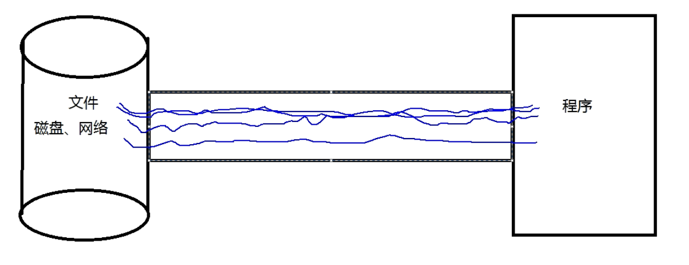
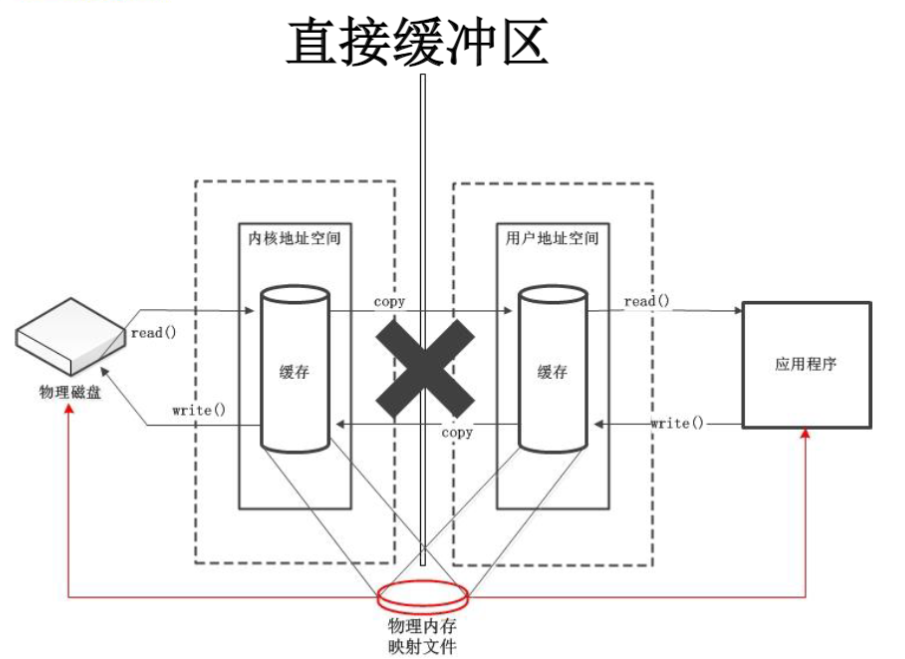
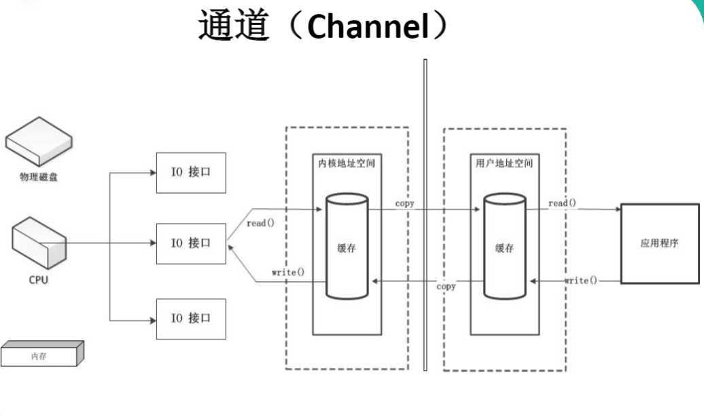
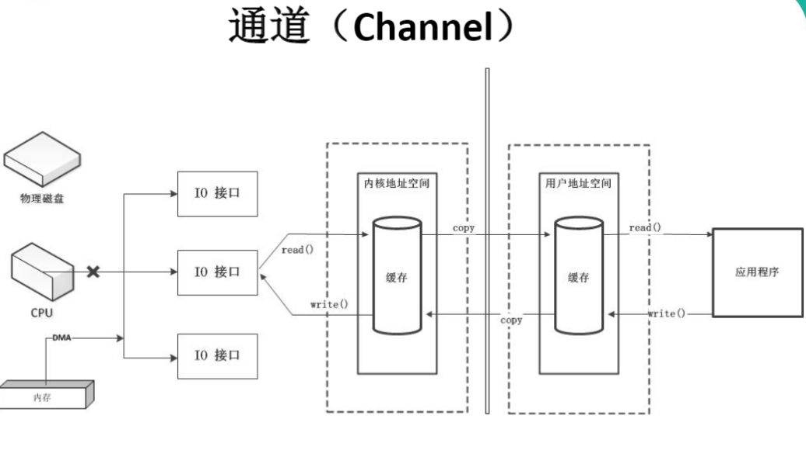
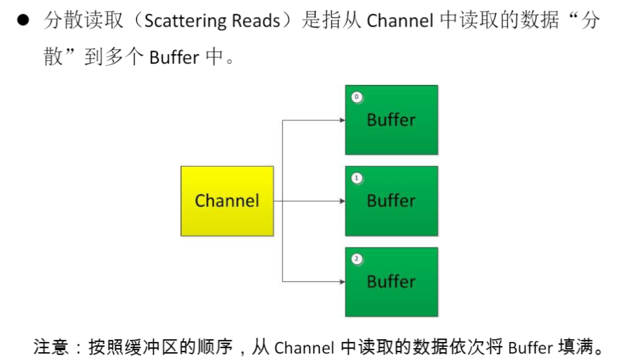

# 简介

- 说明
  - Java NIO（New IO）是从Java 1.4版本开始引入的一个新的IO API，可以替代标准的Java IO API
  - NIO与原来的IO有同样的作用和目的，但是使用的方式完全不同，NIO支持面向缓冲区的、基于通道的IO操作。
  - NIO将以更加高效的方式进行文件的读写操作。

# NIO 与 IO区别

- BIO
  - 面向流
    >  
  - 单向：输入流只能输入，输出流只能输出
  - 阻塞式

- NIO
  - 面向缓冲区
    >  
  - 双向
  - 非阻塞式

# 缓冲区buffer与通道channel

## 概述

Java NIO系统的核心在于通道和缓冲区

若需要使用NIO 系统，需要获取用于连接IO 设备的通道以及用于容纳数据的缓冲区。然后操作缓冲区，对数据进行处理。
**简而言之，Channel 负责传输，Buffer 负责存储**

## buffer

### 基础

- 概念： 
  - 一个用于特定基本数据类型的容器。
  - 由java.nio 包定义的，所有缓冲区都是Buffer 抽象类的子类。
  - Java NIO中的Buffer 主要用于与NIO 通道进行交互，数据是从通道读入缓冲区，从缓冲区写入通道中的。
- 作用：用于容纳数据。
- 组成：根据数据类型不同（boolean 除外），提供了相应类型的缓冲区：
  - ByteBuffer
  - CharBuffer
  - ShortBuffer
  - IntBuffer
  - LongBuffer
  - FloatBuffer
  - DoubleBuffer
- 获取缓冲区：`allocate()`
- 基本使用
  - `put()` : 存入数据到缓冲区中
  - `get()` : 获取缓冲区中的数据
- **核心属性** ：
  > 标记、位置、限制、容量遵守以下不变式：`0<=mark<=position<=limit<=capacity`
  - 容量(capacity) ：表示Buffer 最大数据容量，缓冲区容量不能为负，并且创建后不能更改。
  - 限制(limit)：第一个不应该读取或写入的数据的索引，即位于limit 后的数据不可读写。缓冲区的限制不能为负，并且不能大于其容量。
  - 位置(position)：下一个要读取或写入的数据的索引。缓冲区的位置不能为负，并且不能大于其限制
  - 标记(mark)与重置(reset)：标记是一个索引，通过Buffer 中的mark() 方法指定Buffer 中一个特定的position，之后可以通过调用reset() 方法恢复到这个position.
- 核心属性图示
  >  
- 基本方法：
  - Buffer clear():清空缓冲区并返回对缓冲区的引用
  - Buffer flip():将缓冲区的界限设置为当前位置，并将当前位置充值为 0
  - int capacity():返回 Buffer 的 capacity 大小
  - boolean hasRemaining():判断缓冲区中是否还有元素
  - int limit():返回 Buffer 的界限(limit) 的位置
  - Buffer limit(int n):将设置缓冲区界限为 n, 并返回一个具有新 limit 的缓冲区对象
  - Buffer mark():对缓冲区设置标记
  - int position():返回缓冲区的当前位置
  - positionBuffer position(int n):将设置缓冲区的当前位置为 n , 并返回修改后的 Buffer 对象
  - int remaining():返回 position 和 limit 之间的元素个数
  - Buffer reset():将位置 position 转到以前设置的 mark 所在的位置 Buffer rewind()将位置设为为 0，取消设置的 mark
- 直接缓冲区与非直接缓冲区：
  - 非直接缓冲区：通过 allocate() 方法分配缓冲区，将缓冲区建立在 JVM 的内存中
  - 直接缓冲区：通过 allocateDirect() 方法分配直接缓冲区，将缓冲区建立在 **物理内存** 中。可以提高效率

### 直接与非直接缓冲区




字节缓冲区要么是直接的，要么是非直接的。如果为直接字节缓冲区，则Java 虚拟机会尽最大努力直接在此缓冲区上执行本机I/O 操作。也就是说，在每次调用基础操作系统的一个本机I/O 操作之前（或之后），虚拟机都会尽量避免将缓冲区的内容复制到中间缓冲区中（或从中间缓冲区中复制内容）。

直接字节缓冲区可以通过调用此类的allocateDirect() 工厂方法来创建。此方法返回的缓冲区进行分配和取消分配所需成本通常高于非直接缓冲区。直接缓冲区的内容可以驻留在常规的垃圾回收堆之外，因此，它们对应用程序的内存需求量造成的影响可能并不明显。所以，建议将直接缓冲区主要分配给那些易受基础系统的本机I/O 操作影响的大型、持久的缓冲区。一般情况下，最好仅在直接缓冲区能在程序性能方面带来明显好处时分配它们。

直接字节缓冲区还可以通过FileChannel 的map() 方法将文件区域直接映射到内存中来创建。该方法返回MappedByteBuffer。Java 平台的实现有助于通过JNI 从本机代码创建直接字节缓冲区。如果以上这些缓冲区中的某个缓冲区实例指的是不可访问的内存区域，则试图访问该区域不会更改该缓冲区的内容，并且将会在访问期间或稍后的某个时间导致抛出不确定的异常。

字节缓冲区是直接缓冲区还是非直接缓冲区可通过调用其isDirect()方法来确定。提供此方法是为了能够在性能关键型代码中执行显式缓冲区管理。

### 示例

<details>
<summary style="color:red;">Buffer全部测试代码</summary>

```java
import java.nio.ByteBuffer;

import org.junit.Test;

/*
 * 一、缓冲区（Buffer）：在 Java NIO 中负责数据的存取。缓冲区就是数组。用于存储不同数据类型的数据
 * 
 * 根据数据类型不同（boolean 除外），提供了相应类型的缓冲区：
 * ByteBuffer
 * CharBuffer
 * ShortBuffer
 * IntBuffer
 * LongBuffer
 * FloatBuffer
 * DoubleBuffer
 * 
 * 上述缓冲区的管理方式几乎一致，通过 allocate() 获取缓冲区
 * 
 * 二、缓冲区存取数据的两个核心方法：
 * put() : 存入数据到缓冲区中
 * get() : 获取缓冲区中的数据
 * 
 * 三、缓冲区中的四个核心属性：
 * capacity : 容量，表示缓冲区中最大存储数据的容量。一旦声明不能改变。
 * limit : 界限，表示缓冲区中可以操作数据的大小。（limit 后数据不能进行读写）
 * position : 位置，表示缓冲区中正在操作数据的位置。
 * 
 * mark : 标记，表示记录当前 position 的位置。可以通过 reset() 恢复到 mark 的位置
 * 
 * 0 <= mark <= position <= limit <= capacity
 * 
 * 四、直接缓冲区与非直接缓冲区：
 * 非直接缓冲区：通过 allocate() 方法分配缓冲区，将缓冲区建立在 JVM 的内存中
 * 直接缓冲区：通过 allocateDirect() 方法分配直接缓冲区，将缓冲区建立在物理内存中。可以提高效率
 */
public class TestBuffer {
	
	@Test
	public void test1(){
		String str = "abcde";
		
		//1. 分配一个指定大小的缓冲区
		ByteBuffer buf = ByteBuffer.allocate(1024);
		
		System.out.println("-----------------allocate()----------------");
		System.out.println(buf.position()); //0
		System.out.println(buf.limit()); //1024
		System.out.println(buf.capacity()); //1024
		
		//2. 利用 put() 存入数据到缓冲区中
		buf.put(str.getBytes());
		
		System.out.println("-----------------put()----------------");
		System.out.println(buf.position()); // 5
		System.out.println(buf.limit()); //1024
		System.out.println(buf.capacity()); //1024
		
		//3. 切换读取数据模式
		buf.flip();
		
		System.out.println("-----------------flip()----------------");
		System.out.println(buf.position()); // 0
		System.out.println(buf.limit()); // 5
		System.out.println(buf.capacity()); // 1024
		
		//4. 利用 get() 读取缓冲区中的数据
		byte[] dst = new byte[buf.limit()];
		buf.get(dst);
		System.out.println(new String(dst, 0, dst.length)); // abcde
		
		System.out.println("-----------------get()----------------");
		System.out.println(buf.position()); // 5
		System.out.println(buf.limit()); // 5
		System.out.println(buf.capacity()); // 1024
		
		//5. rewind() : 可重复读
		buf.rewind();
		
		System.out.println("-----------------rewind()----------------");
		System.out.println(buf.position()); // 0
		System.out.println(buf.limit()); // 5
		System.out.println(buf.capacity()); // 1025
		
		//6. clear() : 清空缓冲区. 但是缓冲区中的数据依然存在，但是处于“被遗忘”状态
		buf.clear();
		
		System.out.println("-----------------clear()----------------");
		System.out.println(buf.position()); // 0
		System.out.println(buf.limit()); // 1024
		System.out.println(buf.capacity()); // 1024
		
		System.out.println((char)buf.get());
		
	}
	
	@Test
	public void test2(){
		String str = "abcde";
		
		ByteBuffer buf = ByteBuffer.allocate(1024);
		
		buf.put(str.getBytes());
		
		buf.flip();
		
		byte[] dst = new byte[buf.limit()];
		buf.get(dst, 0, 2);
		System.out.println(new String(dst, 0, 2));// ab
		System.out.println(buf.position());// 2
		
		//mark() : 标记
		buf.mark();
		
		buf.get(dst, 2, 2);
		System.out.println(new String(dst, 2, 2)); // cd
		System.out.println(buf.position()); // 4
		
		//reset() : 恢复到 mark 的位置
		buf.reset();
		System.out.println(buf.position()); // 2
		
		//判断缓冲区中是否还有剩余数据
		if(buf.hasRemaining()){
			//获取缓冲区中可以操作的数量
			System.out.println(buf.remaining());
		}
	}
	
	@Test
	public void test3(){
		//分配直接缓冲区
		ByteBuffer buf = ByteBuffer.allocateDirect(1024);
		
		System.out.println(buf.isDirect());
	}
}
```
</details>

## channel

### 基础

- 概念：
  - 通道（Channel）：由java.nio.channels 包定义的。
  - Channel 表示IO 源与目标打开的连接。
  - Channel 类似于传统的 流。只不过Channel 本身不能直接访问数据，Channel 只能与Buffer 进行交互。
- 作用：通道表示打开到IO 设备(例如：文件、套接字)的连接。
- 原理
  - 早期计算机，所有IO接口都由cpu独立负责。当有大量IO时，cpu占用十分高，导致处理能力下降
  - 为了改善这种情况，出现了DMA(直接存储器储存)。
    - 应用程序对操作系统发送读写请求时，DMA会向CPU申请权限
    - 如果得到权限，会建立DMA总线，之后的IO操作都由DMA负责
      > DMA对应的就是普通的IO流
    - 但是如果DMA总线建立过多，会产生冲突，影响性能。于是出现了channel
    - channel是一个完全独立的处理器，附属于CPU，专门用于IO操作。不需要向CPU请求权限。
    - 图示
      <details>
      <summary style="color:red;">图示</summary>

      
      
      
      </details>

- 主要实现类： java.nio.channels.Channel 
  - FileChannel(这里主要使用该类，下面的为网络通信)
    > 只有这个不能切换为非阻塞模式
  - SocketChannel
  - ServerSocketChannel
  - DatagramChannel
- 获取通道三种方式
  - NIO.1:`getChannel()`
    - 本地 IO：
      - FileInputStream/FileOutputStream
      - RandomAccessFile
    - 网络IO：
      - Socket
      - ServerSocket
      - DatagramSocket
  - 在 JDK 1.7 中的 NIO.2 针对各个实现类提供了静态方法 open()
  - 在 JDK 1.7 中的 NIO.2 的 Files 工具类的 newByteChannel()

- 通道之间的数据传输，使用的是直接缓冲区的方式
  - transferFrom()
  - transferTo()
- 分散(Scatter)与聚集(Gather)
  > 也就是操作缓冲区数组
  <details>
  <summary style="color:red;">图示</summary>

  
  
  </details>

  - 分散读取（Scattering Reads）：将通道中的数据分散到多个缓冲区中
  - 聚集写入（Gathering Writes）：将多个缓冲区中的数据聚集到通道中

### 示例

**使用直接缓冲区和非直接缓冲区的api区别挺大的，好好看看。**

<br /><br />


<details>
<summary style="color:red;">channel全部测试代码</summary>

```java
/*
 * 一、通道（Channel）：用于源节点与目标节点的连接。在 Java NIO 中负责缓冲区中数据的传输。Channel 本身不存储数据，因此需要配合缓冲区进行传输。
 * 
 * 二、通道的主要实现类
 * 	java.nio.channels.Channel 接口：
 * 		|--FileChannel
 * 		|--SocketChannel
 * 		|--ServerSocketChannel
 * 		|--DatagramChannel
 * 
 * 三、获取通道
 * 1. Java 针对支持通道的类提供了 getChannel() 方法
 * 		本地 IO：
 * 		FileInputStream/FileOutputStream
 * 		RandomAccessFile
 * 
 * 		网络IO：
 * 		Socket
 * 		ServerSocket
 * 		DatagramSocket
 * 		
 * 2. 在 JDK 1.7 中的 NIO.2 针对各个通道提供了静态方法 open()
 * 3. 在 JDK 1.7 中的 NIO.2 的 Files 工具类的 newByteChannel()
 * 
 * 四、通道之间的数据传输
 * transferFrom()
 * transferTo()
 * 
 * 五、分散(Scatter)与聚集(Gather)
 * 分散读取（Scattering Reads）：将通道中的数据分散到多个缓冲区中
 * 聚集写入（Gathering Writes）：将多个缓冲区中的数据聚集到通道中
 * 
 * 六、字符集：Charset
 * 编码：字符串 -> 字节数组
 * 解码：字节数组  -> 字符串
 * 
 */
public class TestChannel {
  //NIO1 API
	//利用通道完成文件的复制（非直接缓冲区）
	@Test
	public void test1(){//10874-10953
		long start = System.currentTimeMillis();
		
		FileInputStream fis = null;
		FileOutputStream fos = null;
		//①获取通道
		FileChannel inChannel = null;
		FileChannel outChannel = null;
		try {
			fis = new FileInputStream("d:/1.mkv");
			fos = new FileOutputStream("d:/2.mkv");
			
			inChannel = fis.getChannel();
			outChannel = fos.getChannel();
			
			//②分配指定大小的缓冲区
			ByteBuffer buf = ByteBuffer.allocate(1024);
			
			//③将通道中的数据存入缓冲区中
			while(inChannel.read(buf) != -1){
				buf.flip(); //切换读取数据的模式
				//④将缓冲区中的数据写入通道中
				outChannel.write(buf);
				buf.clear(); //清空缓冲区
			}
		} catch (IOException e) {
			e.printStackTrace();
		} 
		long end = System.currentTimeMillis();
		System.out.println("耗费时间为：" + (end - start));
		
	}
	
  // NIO2 API
	//使用直接缓冲区完成文件的复制(内存映射文件)
	@Test
	public void test2() throws IOException{//2127-1902-1777
		long start = System.currentTimeMillis();
		
		FileChannel inChannel = FileChannel.open(Paths.get("d:/1.mkv"), StandardOpenOption.READ);
		FileChannel outChannel = FileChannel.open(Paths.get("d:/2.mkv"), StandardOpenOption.WRITE, StandardOpenOption.READ, StandardOpenOption.CREATE);
		
		//内存映射文件
		MappedByteBuffer inMappedBuf = inChannel.map(MapMode.READ_ONLY, 0, inChannel.size());
		MappedByteBuffer outMappedBuf = outChannel.map(MapMode.READ_WRITE, 0, inChannel.size());
		
		//直接对缓冲区进行数据的读写操作
		byte[] dst = new byte[inMappedBuf.limit()];
		inMappedBuf.get(dst);
		outMappedBuf.put(dst);
		
		inChannel.close();
		outChannel.close();
		
		long end = System.currentTimeMillis();
		System.out.println("耗费时间为：" + (end - start));
	}

	//通道之间的数据传输(直接缓冲区)
	@Test
	public void test3() throws IOException{
		FileChannel inChannel = FileChannel.open(Paths.get("d:/1.mkv"), StandardOpenOption.READ);
		FileChannel outChannel = FileChannel.open(Paths.get("d:/2.mkv"), StandardOpenOption.WRITE, StandardOpenOption.READ, StandardOpenOption.CREATE);
		
//		inChannel.transferTo(0, inChannel.size(), outChannel);
		outChannel.transferFrom(inChannel, 0, inChannel.size());
		
		inChannel.close();
		outChannel.close();
	}
	
	//分散和聚集
	@Test
	public void test4() throws IOException{
		RandomAccessFile raf1 = new RandomAccessFile("1.txt", "rw");
		
		//1. 获取通道
		FileChannel channel1 = raf1.getChannel();
		
		//2. 分配指定大小的缓冲区
		ByteBuffer buf1 = ByteBuffer.allocate(100);
		ByteBuffer buf2 = ByteBuffer.allocate(1024);
		
		//3. 分散读取
		ByteBuffer[] bufs = {buf1, buf2};
		channel1.read(bufs);
		
		for (ByteBuffer byteBuffer : bufs) {
			byteBuffer.flip();
		}
		
		System.out.println(new String(bufs[0].array(), 0, bufs[0].limit()));
		System.out.println("-----------------");
		System.out.println(new String(bufs[1].array(), 0, bufs[1].limit()));
		
		//4. 聚集写入
		RandomAccessFile raf2 = new RandomAccessFile("2.txt", "rw");
		FileChannel channel2 = raf2.getChannel();
		
		channel2.write(bufs);
	}

	@Test
	public void test5(){
		Map<String, Charset> map = Charset.availableCharsets();
		
		Set<Entry<String, Charset>> set = map.entrySet();
		
		for (Entry<String, Charset> entry : set) {
			System.out.println(entry.getKey() + "=" + entry.getValue());
		}
	}

	//字符集
	@Test
	public void test6() throws IOException{
		Charset cs1 = Charset.forName("GBK");
		
		//获取编码器
		CharsetEncoder ce = cs1.newEncoder();
		
		//获取解码器
		CharsetDecoder cd = cs1.newDecoder();
		
		CharBuffer cBuf = CharBuffer.allocate(1024);
		cBuf.put("尚硅谷威武！");
		cBuf.flip();
		
		//编码
		ByteBuffer bBuf = ce.encode(cBuf);
		
		for (int i = 0; i < 12; i++) {
			System.out.println(bBuf.get());
		}
		
		//解码
		bBuf.flip();
		CharBuffer cBuf2 = cd.decode(bBuf);
		System.out.println(cBuf2.toString());
		
		System.out.println("------------------------------------------------------");
		
		Charset cs2 = Charset.forName("GBK");
		bBuf.flip();
		CharBuffer cBuf3 = cs2.decode(bBuf);
		System.out.println(cBuf3.toString());
	}
}
```
</details>

# NIO  的非阻塞式网络通信

## 阻塞与非阻塞


传统的IO 流都是阻塞式的。也就是说，当一个线程调用read() 或write() 时，该线程被阻塞，直到有一些数据被读取或写入，该线程在此期间不能执行其他任务。因此，在完成网络通信进行IO 操作时，由于线程会阻塞，所以服务器端必须为每个客户端都提供一个独立的线程进行处理，当服务器端需要处理大量客户端时，性能急剧下降。

Java NIO 是非阻塞模式的。当线程从某通道进行读写数据时，若没有数据可用时，该线程可以进行其他任务。线程通常将非阻塞IO 的空闲时间用于在其他通道上执行IO 操作，所以单独的线程可以管理多个输入和输出通道。因此，NIO 可以让服务器端使用一个或有限几个线程来同时处理连接到服务器端的所有客户端。

## 基础

- 通道（Channel）：负责连接。java.nio.channels.Channel 接口：
  - SelectableChannel
  - SocketChannel
  - ServerSocketChannel
  - DatagramChannel
  - Pipe.SinkChannel
  - Pipe.SourceChannel
- 缓冲区（Buffer）：负责数据的存取
- 选择器（Selector）：是 SelectableChannel 的多路复用器。用于监控 SelectableChannel 的 IO 状况

## Selector

> 用于实现NIO非阻塞

- 概念：
  - 选择器（Selector）是SelectableChannle 对象的多路复用器，Selector 可以同时监控多个SelectableChannel 的IO 状况
  - 也就是说，利用Selector 可使一个单独的线程管理多个Channel。Selector 是非阻塞IO 的核心。

- 作用：当channel准备就绪后，选择器才会把分配给服务端的一个或多个线程上。
  >  

- 创建：`Selector.open()`
- 注册通道：`SelectableChannel.register(Selector sel, int ops)`
  > 当调用register(Selector sel, int ops)  将通道注册选择器时，选择器对通道的监听事件，需要通过第二个参数ops 指定。
  - ops:可以监听的事件类型（可使用SelectionKey 的四个常量表示）：
    - 读: SelectionKey.OP_READ  （1）
    - 写: SelectionKey.OP_WRITE  （4）
    - 连接: SelectionKey.OP_CONNECT（8）
    - 接收: SelectionKey.OP_ACCEPT  （16）
    - 若注册时不止监听一个事件，则可以使用“位或”操作符连接
      > `SelectionKey.OP_READ|SelectionKey.OP_WRITE;`

## 示例代码

- 待解决：
  - shutdownOutput的使用
  - selector.select()的作用

<br /><br />

<details>
<summary style="color:red;">TCP 阻塞式IO 上传图片 示例代码</summary>

```java
public class TestBlockingNIO {
	//客户端
	@Test
	public void client() throws IOException{
		//1. 获取通道
		SocketChannel sChannel = SocketChannel.open(new InetSocketAddress("127.0.0.1", 9898));
		
		FileChannel inChannel = FileChannel.open(Paths.get("1.jpg"), StandardOpenOption.READ);
		
		//2. 分配指定大小的缓冲区
		ByteBuffer buf = ByteBuffer.allocate(1024);
		
		//3. 读取本地文件，并发送到服务端
		while(inChannel.read(buf) != -1){
			buf.flip();
			sChannel.write(buf);
			buf.clear();
		}
		
		//4. 关闭通道
		inChannel.close();
		sChannel.close();
	}
	
	//服务端
	@Test
	public void server() throws IOException{
		//1. 获取通道
		ServerSocketChannel ssChannel = ServerSocketChannel.open();
		
		FileChannel outChannel = FileChannel.open(Paths.get("2.jpg"), StandardOpenOption.WRITE, StandardOpenOption.CREATE);
		
		//2. 绑定连接
		ssChannel.bind(new InetSocketAddress(9898));
		
		//3. 获取客户端连接的通道
		SocketChannel sChannel = ssChannel.accept();
		
		//4. 分配指定大小的缓冲区
		ByteBuffer buf = ByteBuffer.allocate(1024);
		
		//5. 接收客户端的数据，并保存到本地
		while(sChannel.read(buf) != -1){
			buf.flip();
			outChannel.write(buf);
			buf.clear();
		}
		//6. 关闭通道
		sChannel.close();
		outChannel.close();
		ssChannel.close();
	}
}
```
</details>


<details>
<summary style="color:red;">TCP客户端向服务端发送图片，阻塞式，带有结果反馈</summary>

```java
public class TestBlockingNIO2 {
	//客户端
	@Test
	public void client() throws IOException{
		SocketChannel sChannel = SocketChannel.open(new InetSocketAddress("127.0.0.1", 9898));
		
		FileChannel inChannel = FileChannel.open(Paths.get("1.jpg"), StandardOpenOption.READ);
		
		ByteBuffer buf = ByteBuffer.allocate(1024);
		
		while(inChannel.read(buf) != -1){
			buf.flip();
			sChannel.write(buf);
			buf.clear();
		}
		
    // 阻塞模式下，必须shutdownOutput，否则会阻塞。
		sChannel.shutdownOutput();
		
		//接收服务端的反馈
		int len = 0;
		while((len = sChannel.read(buf)) != -1){
			buf.flip();
			System.out.println(new String(buf.array(), 0, len));
			buf.clear();
		}
		
		inChannel.close();
		sChannel.close();
	}
	
	//服务端
	@Test
	public void server() throws IOException{
		ServerSocketChannel ssChannel = ServerSocketChannel.open();
		
		FileChannel outChannel = FileChannel.open(Paths.get("2.jpg"), StandardOpenOption.WRITE, StandardOpenOption.CREATE);
		
		ssChannel.bind(new InetSocketAddress(9898));
		
		SocketChannel sChannel = ssChannel.accept();
		
		ByteBuffer buf = ByteBuffer.allocate(1024);
		
		while(sChannel.read(buf) != -1){
			buf.flip();
			outChannel.write(buf);
			buf.clear();
		}
		
		//发送反馈给客户端
		buf.put("服务端接收数据成功".getBytes());
		buf.flip();
		sChannel.write(buf);
		
		sChannel.close();
		outChannel.close();
		ssChannel.close();
	}
}
```
</details>


<details>
<summary style="color:red;">TCP 非阻塞式上传文件（重要）</summary>

```java
public class TestNonBlockingNIO {
	//客户端
	@Test
	public void client() throws IOException{
		//1. 获取通道
		SocketChannel sChannel = SocketChannel.open(new InetSocketAddress("127.0.0.1", 9898));
		
		//2. 切换非阻塞模式
		sChannel.configureBlocking(false);
		
		//3. 分配指定大小的缓冲区
		ByteBuffer buf = ByteBuffer.allocate(1024);
		
		//4. 发送数据给服务端
		Scanner scan = new Scanner(System.in);
		
		while(scan.hasNext()){
			String str = scan.next();
			buf.put((new Date().toString() + "\n" + str).getBytes());
			buf.flip();
			sChannel.write(buf);
			buf.clear();
		}
		
		//5. 关闭通道
		sChannel.close();
	}

	//服务端
	@Test
	public void server() throws IOException{
		//1. 获取通道
		ServerSocketChannel ssChannel = ServerSocketChannel.open();
		
		//2. 切换非阻塞模式
		ssChannel.configureBlocking(false);
		
		//3. 绑定连接
		ssChannel.bind(new InetSocketAddress(9898));
		
		//4. 获取选择器
		Selector selector = Selector.open();
		
		//5. 将通道注册到选择器上, 并且指定“监听接收事件”
		ssChannel.register(selector, SelectionKey.OP_ACCEPT);
		
		//6. 轮询式的获取选择器上已经“准备就绪”的事件
		while(selector.select() > 0){
			
			//7. 获取当前选择器中所有注册的“选择键(已就绪的监听事件)”
			Iterator<SelectionKey> it = selector.selectedKeys().iterator();
			
			while(it.hasNext()){
				//8. 获取准备“就绪”的是事件
				SelectionKey sk = it.next();
				
				//9. 判断具体是什么事件准备就绪
				if(sk.isAcceptable()){
					//10. 若“接收就绪”，获取客户端连接
					SocketChannel sChannel = ssChannel.accept();
					
					//11. 切换非阻塞模式
					sChannel.configureBlocking(false);
					
					//12. 将该通道注册到选择器上
					sChannel.register(selector, SelectionKey.OP_READ);
				}else if(sk.isReadable()){
					//13. 获取当前选择器上“读就绪”状态的通道
					SocketChannel sChannel = (SocketChannel) sk.channel();
					
					//14. 读取数据
					ByteBuffer buf = ByteBuffer.allocate(1024);
					
					int len = 0;
					while((len = sChannel.read(buf)) > 0 ){
						buf.flip();
						System.out.println(new String(buf.array(), 0, len));
						buf.clear();
					}
				}
				
				//15. 取消选择键 SelectionKey
				it.remove();
			}
		}
	}
}
```
</details>


<details>
<summary style="color:red;">UDP非阻塞</summary>

```java
public class TestNonBlockingNIO2 {
	@Test
	public void send() throws IOException{
		DatagramChannel dc = DatagramChannel.open();
		
		dc.configureBlocking(false);
		
		ByteBuffer buf = ByteBuffer.allocate(1024);
		
		Scanner scan = new Scanner(System.in);
		
		while(scan.hasNext()){
			String str = scan.next();
			buf.put((new Date().toString() + ":\n" + str).getBytes());
			buf.flip();
			dc.send(buf, new InetSocketAddress("127.0.0.1", 9898));
			buf.clear();
		}
		
		dc.close();
	}
	
	@Test
	public void receive() throws IOException{
		DatagramChannel dc = DatagramChannel.open();
		
		dc.configureBlocking(false);
		
		dc.bind(new InetSocketAddress(9898));
		
		Selector selector = Selector.open();
		
		dc.register(selector, SelectionKey.OP_READ);
		
		while(selector.select() > 0){
			Iterator<SelectionKey> it = selector.selectedKeys().iterator();
			
			while(it.hasNext()){
				SelectionKey sk = it.next();
				
				if(sk.isReadable()){
					ByteBuffer buf = ByteBuffer.allocate(1024);
					
					dc.receive(buf);
					buf.flip();
					System.out.println(new String(buf.array(), 0, buf.limit()));
					buf.clear();
				}
			}
			
			it.remove();
		}
	}
}
```
</details>


# 管道

Java NIO 管道是2个线程之间的单向数据连接。Pipe有一个source通道和一个sink通道。数据会被写到sink通道，从source通道读取。


<details>
<summary style="color:red;">测试代码</summary>

```java
public class TestPipe {

	@Test
	public void test1() throws IOException{
		//1. 获取管道
		Pipe pipe = Pipe.open();
		
		//2. 将缓冲区中的数据写入管道
		ByteBuffer buf = ByteBuffer.allocate(1024);
		
		Pipe.SinkChannel sinkChannel = pipe.sink();
		buf.put("通过单向管道发送数据".getBytes());
		buf.flip();
		sinkChannel.write(buf);
		
		//3. 读取缓冲区中的数据
		Pipe.SourceChannel sourceChannel = pipe.source();
		buf.flip();
		int len = sourceChannel.read(buf);
		System.out.println(new String(buf.array(), 0, len));
		
		sourceChannel.close();
		sinkChannel.close();
	}
	
}
```
</details>

