# 1. 反射：框架设计的灵魂

> 也要看看代码，很重要

## 1.1. 基本知识

- 创建对象的方式有五种：
  - 1.构造方法(一般用这种)
  - 2.静态方法(一般用这种)
  - 3.反射
  - 4.克隆
  - 5.反序列化

- 框架：半成品软件。在框架的基础上 进行软件开发，简化代码。开发框架用得到反射，但是使用框架并不太能用到，但能加深理解
- 反射：将类的各个组成部分封装为其他对象，这就是反射机制
  - 好处：
    1. 可以在程序运行的过程中操作这些对象。绕过检查时异常
    2. 可以降低程序耦合性，提高可扩展性
- 获取 Class 类对象的三种方式：
  1. 从第一个阶段：Class.forName("全类名")：将字节码文件加载近内存，返回 Class 对象
     - 多用于配置文件，将类名定义在配置文件中，读取文件加载类
  2. 从第二个阶段：通过类名的属性 Class
     - 多用于参数的传递
  3. 从第三个阶段：对象.getClass()(封装到 Object 类中)
     - 多用于对象获取字节码的方式
  - 结论：同一个字节码文件（.class）在一次程序运行过程中，只会被加载一次，不论通过哪一种方式获取的 class 对象
- Class 对象功能

  - 获取功能：
    1. 获取成员变量
       - Field getDeclaredField(String name) 获取所有成员变量中，以 name 命名的成员变量
       - Field[] getDeclaredFields() 获取所有的成员变量，包括 private
       - Field getField(String name) 指定名称的 public 修饰的成员变量
       - Field[] getFields() 获取所有 public 修饰的成员变量
    2. 获取构造方法
       - Constructor<?>[] getConstructors()
       - Constructor<T> getConstructor(类<?>...parametertypes)
       - Constructor<T> getDeclaredConstructor(类<?>...parametertypes)
       - Constructor<?>[] getDeclaredConstructors()
    3. 获取成员方法
       - Method[] getMethods()
       - Method getMethod(String name,类<?>...parametertypes)
       - Method[] getDeclaredMethods()
       - Method getDeclaredMethod(String name,类<?>...parametertypes)
    4. 获取类名
       - getName()

- Field 对象功能

  - 获取 Object get(Object obj)
  - 设置 void set(Object obj, Object value)
  - 忽略访问权限修饰符的安全检查 void setAccessible(boolean flag)//Methods inherited from class java.lang.reflect.AccessibleObject

- Constructor：构造方法
  - 创建对象 newInstance(Object initargs)
  - 当要使用**无参**构造方法进行创建对象时，既可以通过 Class 对象获得构造器来获得，也可以通过 Class 类中的 newInstance()来获得
- Method：成员方法
  - 执行方法 invoke(Object obj, Object... args) 参数是对象以及方法参数列表
  - 获取方法名称 String getName()
- 案例：
  - 需求：写一个“框架”，可以帮我们创建任意类的对象并且执行任意方法
    - 实现：在不改变该类任意代码的前提下，但可以创建任意类对象并执行任意方法
      1. 配置文件
      2. 反射
    - 步骤：
      1. 将需要创建的对象的全类名和需要执行的方法定义在配置文件中
      2. 在程序中加载和读取配置文件
      3. 使用反射技术来加载类文件进入内存
      4. 创建对象
      5. 执行方法

## 1.2. 原理图解


> Field Constructor Method 都是类。Class 类中有这三个类

# 2. 注解：

## 2.1. 基本概念

- 注解与注释
  - 注解概念：说明程序的，给电脑看。
    - 进一步：注解是一系列元数据，它提供数据用来解释程序代码，但是注解并非是所解释的代码本身的一部分。注解对于代码的运行效果没有直接影响。
  - 注释概念：用文字描述程序，给程序员看

## 2.2. 作用

1. 编译检查
   ```java
   @Override
   public String toString() {
     return name+"   "+age;
   }
   /*
   此处的overide用来检查toString是否是复写了父类的方法。
   */
   ```
2. 代码分析，通过代码里标识的注解对代码进行分析，（使用反射）
3. 编写文档：通过代码中标识的注解生成 doc 文档

## 2.3. java 中预定义注解

- @Overrides :检测被该注解标注的方法是否重写父类方法(或实现接口接口)
- @Deprecated :将该注解标注的内容以过时，有更好的替代内容
- @SuppressWarnings :压制警告

  - 一般添加"all"参数，@SuppressWarnings("all")，放在类或者方法上面，使不显示警告

- @SafeVarargs：参数安全类型注解。它的目的是提醒开发者不要用参数做一些不安全的操作,它的存在会阻止编译器产生 unchecked 这样的警告。它是在 Java 1.7 的版本中加入的。

  ```java
  @SafeVarargs // Not actually safe!
      static void m(List<String>... stringLists) {
      Object[] array = stringLists;
      List<Integer> tmpList = Arrays.asList(42);
      array[0] = tmpList; // Semantically invalid, but compiles without warnings
      String s = stringLists[0].get(0); // Oh no, ClassCastException at runtime!
  }
  /* 上面的代码中，编译阶段不会报错，但是运行时会抛出 ClassCastException 这个异常，所以它虽然告诉开发者要妥善处理，但是开发者自己还是搞砸了。

  Java 官方文档说，未来的版本会授权编译器对这种不安全的操作产生错误警告。 */
  ```

- @FunctionalInterface：函数式接口注解，这个是 Java 1.8 版本引入的新特性。函数式编程很火，所以 Java 8 也及时添加了这个特性。函数式接口 (Functional Interface) 就是一个具有一个方法的普通接口。

  ```java
  @FunctionalInterface
  public interface Runnable {
      /**
       * When an object implementing interface <code>Runnable</code> is used
       * to create a thread, starting the thread causes the object's
       * <code>run</code> method to be called in that separately executing
       * thread.
       * <p>
       * The general contract of the method <code>run</code> is that it may
       * take any action whatsoever.
       *
       * @see     java.lang.Thread#run()
       */
      public abstract void run();
  }
  /* 我们进行线程开发中常用的 Runnable 就是一个典型的函数式接口，上面源码可以看到它就被 @FunctionalInterface 注解。

  可能有人会疑惑，函数式接口标记有什么用，这个原因是函数式接口可以很容易转换为 Lambda 表达式。这是另外的主题了，自己去查 */
  ```

## 2.4. 自定义注解

- 格式：
  元注解
  public @interface 注解名称{
  属性列表;
  }
- 本质：注解就是一个接口，该接口默认继承下面一个接口<br>
  public interface myAnnotation extends java.lang.annotation.Annotation{}
- 属性：
  - 定义：接口中可以定义的成员方法
  - 要求返回值类型只能以下几种 ：
    - 基本数据类型
    - String
    - 枚举
    - 注解
    - 以上数据类型的数组
  - 赋值：
    1. 定义了属性，在使用时需要给属性赋值，但也可以通过 default 关键字给属性默认初始化值，那么在使用注解时，就不必要进行赋值。
    2. 但如果只有一个属性值，那么在赋值时只要在括号中填入值即可
    3. 当为数组中只有一个值时，大括号可以省略。
    ```java
    @myAnnotation(age=2,name="Anna",anno=@myannno2,strs={"aa","bb"})
    @myAnnotation(2)
    ```

## 2.5. 元注解

> 元注解是可以注解到注解上的注解，或者说元注解是一种基本注解，但是它能够应用到其它的注解上面。(前两个较常用)

- @Target：用于描述注解能作用的位置,前三个重要,后面的 6 个可以自己查看源文档

  ```java
  摘自javadoc文档前三个：
      /** Class, interface (including annotation type), or enum declaration */
      TYPE,//类上

      /** Field declaration (includes enum constants) */
      FIELD,//成员变量上

      /** Method declaration */
      METHOD,//方法上

  全部：
      ElementType.ANNOTATION_TYPE 可以给一个注解进行注解
      ElementType.CONSTRUCTOR 可以给构造方法进行注解
      ElementType.FIELD 可以给属性进行注解
      ElementType.LOCAL_VARIABLE 可以给局部变量进行注解
      ElementType.METHOD 可以给方法进行注解
      ElementType.PACKAGE 可以给一个包进行注解
      ElementType.PARAMETER 可以给一个方法内的参数进行注解
      ElementType.TYPE 可以给一个类型进行注解，比如类、接口、枚举
  ```

- @Retention:描述注解被保留的一个阶段
  - @Retention(value = RetentionPolicy.RUNTIME):当前描述的注解会保留到 class 字节码文件中并被 jvm 读取到,所以在程序运行时可以获取到它们。（一般是这个）
  - 如果是 CLASS,那么会被加载到字节码文件中，但不会被 jvm 读取到
  - 如果是 SOURCE,那么不会加载到字节码文件中。
- @Documented：描述注解是否被抽取到 doc 文档中，如果在注解的定义中有标注@Documented，那么就会被加到 doc 文档中<br>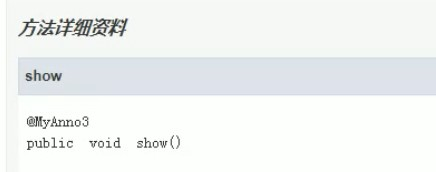
- @Inherited：描述注解是否被子类继承。@myAnnotation 被@Inherited 描述，那么如果@myAnnotation 描述一个类，那么这个类的子类也会从父类继承这个注解。
- @Repeatable：表示注解中属性值可以取多个，其中要了解容器注解。

  ```java
  //什么是容器注解呢？就是用来存放其它注解的地方。它本身也是一个注解。
  @interface Persons {//容器注解
      Person[]  value();
  }

  @Repeatable(Persons.class)//括号中填入容器注解
  @interface Person{
      String role() default "";
  }

  @Person(role="artist")
  @Person(role="coder")
  @Person(role="PM")
  public class SuperMan{

  }

  ```

## 2.6. 使用（解析）注解

- 本质：获取注解中定义的属性值，把配置文件的工作交给注解来完成，简化配置操作。后期注解大多数用来替换配置文件。
- 步骤：

1. 获取注解定义位置的对象（Class,Method,Field 等）
2. 获取指定的注解（getAnnotation）
3. 调用注解中的抽象方法获取配置属性值

```java
 //摘抄部分代码，详情可以去看代码文件

 // 1 解析注解
    // 获取该类的字节码文件对象
    Class<AnnotationTest> annotationTestClsss = AnnotationTest.class;

    // 2获取上边的注解对象
    ProAnnotation pro = annotationTestClsss.getAnnotation(ProAnnotation.class);// 其实就是在内存中区生成了一个该注解接口的子类实现对相关
    /*
    相当于：
    public class proImp1 implements ProAnnotation{
        public String className(){
            return "_1_java_base.base_strengthen.annotation.case_test.Person";
        }
        public String methodName(){
            return "eat";
        }
    }
    也就是说在调用getAnnotation时，就会把上面的那个类创建一个对象病返回给你，在通过接口接收
     */


      // 3调用注解对象中定义的抽象方法（也就是属性）获取返回值
      String className = pro.className();
      String methodName = pro.methodName();
```

## 2.7. 小结

- 以后大多数时候是使用注解而不是自定义注解
- 使用者：
  1. 编译器（检测程序是否编译正确，如@Override）
  2. 解析（测试）程序用（比如那个 TestCheck,如果没有这个程序，注解毫无意义）。
     - 进一步：当开发者使用了 Annotation 修饰了类、方法、Field 等成员之后，这些 Annotation 不会自己生效，必须由开发者提供相应的代码来提取并处理 Annotation 信息。这些处理提取和处理 Annotation 的代码统称为 APT（Annotation Processing Tool)。
- 注解基本上认为不是程序的一部分，可以理解为相当于一个标签
- 本次这里有两个 case，一个是通过注解代替配置文件，一个是通过注解检测是否有 bug 并输出到 bug.txt

# 3. 函数式接口

- 笔记文件
  [笔记文件](pdf/函数式接口-笔记.pdf)

- demo1-基础
  ```java
  /*
  函数式接口：有且只有一个抽象方法的接口，称之为函数式接口        lambda表达式就是重写抽象方法的。
  当然接口中可以包含其他的方法（默认，静态，私有等非抽象接口） !!!!!!!!!!!!!!!!!!!!记住，
  jdk8新特性，接口中可以有这些，但默认方法必须要用default修饰
  */

  /* 一、java8新特性
      1、函数式接口
          当接口里面只有一个抽象方法的时候，就是函数式接口，可以使用注解强制约束接口只能有一个抽象方法。
          注解：从java5开始引入注解，对字节码文件进行一些说明。
          @FunctionalInterface注解的作用：在编译时告诉编译器该接口只能有一个抽象方法。
          注：
          1、该注解在java.lang包下，不用引入
          2、Lambda表达式只能针对函数式接口使用

      2、接口里面的静态方法
      从java8开始，接口里面可以有静态方法，和普通类的静态方法类似，使用static修饰 ，但接口里面只能是public的
          [public] static <返回值类型><方法名>[形参列表]{
              //方法体
          }

      3、接口里面的默认方法
              从java8开始，除了可以在接口里面写静态方法，还可以写非静态方法，但是必须用 default 修饰。
          默认方法可以被继承。
          
          注：
          1、default方法和static方法均只能被public修饰
          2、如果继承了多个父接口，有重复的默认方法被继承到子接口，必须使用super引用明确指定调用哪个接口的默认方法。
          在子接口必须重写重复的方法，并使用下面的语法。
          <父接口名>.super.<重复方法名>([参数]);
          3、同样地，对于一个类同时实现了多个接口，而这些接口均含有同样的默认方法的情况和2类似。
          4、父接口的抽象方法，在子接口里面可以使用默认方法实现，这样实现类里面就无需再实现了。
                如果实现类再去实现的话就是方法的覆盖了。
          5、如果父接口有一个默认方法，在子接口里可以重写为抽象方法(去掉父接口的行为)。
          */

  @FunctionalInterface // 当不是抽象方法时编译失败
  interface MyFunctionalInterface {
      public abstract void method();
  }

  /*
  * 函数式接口的使用：一般可以作为方法的参数和返回值类型
  */
  public class Demo1 {
      public static void show(MyFunctionalInterface myinterface) {
          myinterface.method();
      }

      public static void main(String[] args) {
          // 调用show方法，方法的参数是一个接口，所以可以传递接口的实现类的对象（此处直接通过匿名内部类来写了）
          show(new MyFunctionalInterface() {
              @Override
              public void method() {
                  System.out.println("使用匿名内部类重写函数式接口中的方法");
              }
          });
          // 调用show方法，参数是一个函数式接口，所以可以传递lambda表达式
          show(() -> {
              System.out.println("使用lambda表达式，重写method方法");
          });

          // 简化lambda表达式
          show(() -> System.out.println("使用lambda表达式，重写method方法"));// 有且只有一条语句的话，大括号，分号省略

          /*
          * 匿名内部类和lambda表达式区别： 在这里匿名内部类会生成一个FunctionalInterfaceDemo1$1.class文件
          * 而lambda表达式不会。效率更高些。
          * 
          * 
          * 只要有函数式接口作为参数，就可以使用lambda表达式 lambda表达式其实就是在重写接口中唯一的方法
          */
      }
  }
  ```

- demo2-性能
  ```java  
  /* 
  函数式编程：

  1 lambda表达式延迟执行，提高效率
  性能浪费案例：看pdf
  当使用showlog方法时，会先拼接字符串，再传递两个参数，导致当level为2时，字符串就白拼接了，造成了性能浪费。
  在这里可以通过lambda表达式进行优化。
  */

  interface MessageBuildeer {
      public abstract String messageBuilder();// 返回拼接后的字符串
  }

  class showLog02 {
      // 旧版
      public static void showLog(int level, String message) {
          /*
          * if (level==1) { System.out.println(message); }
          */
      }

      // 优化：

      public static void showLog2(int level, MessageBuildeer mb) {
          if (level == 1) {
              // 日志等级如果是1级，那么就输出字符串。
              System.out.println(mb.messageBuilder());
          }
      }

      public static void main(String[] args) {
          String str1 = "Hello", str2 = "world";

          showLog(1, str1 + str2);

          showLog2(1, () -> {
              System.out.println("满足后执行，不满足条件不执行1");
              // 返回一个拼接好的字符串。
              return str1 + str2;
          });
          showLog2(2, () -> {
              System.out.println("满足后执行，不满足条件不执行2");// 该句不会打印
              // 返回一个拼接好的字符串。
              return str1 + str2;
          });
          /*
          * 使用lambda表达式作为参数传递，仅仅把参数传递到shoulog2中方法中，
          * 只有满足条件时（即日志等级是1级），才会调用接口MessageBuilder接口， 执行
          * messageBuilder(),进行字符串的拼接，不会造成性能的浪费。
          */

      }
  }
  ```

- demo3-练习
  ```java
  package _1_java_base.jdk8_new_feature._1functional_interface;
  //两个练习

  import java.util.Arrays;
  import java.util.Comparator;
  //1，Runable

  /*
      例如java.lang.Runnable接口就是一个函数式接口，
      假设有一个startThread方法使用该接口作为参数，那么就可以使用Lambda进行传参。
      这种情况其实和Thread类的构造方法参数为Runnable没有本质区别。
  */
  class RunnableDemo1 {
      // 定义一个方法startThread,方法的参数使用函数式接口Runnable
      public static void startThread(Runnable run) {
          // 开启多线程
          new Thread(run).start();
      }

      public static void main(String[] args) {
          // 调用startThread方法,方法的参数是一个接口,那么我们可以传递这个接口的匿名内部类
          startThread(new Runnable() {
              @Override
              public void run() {
                  System.out.println(Thread.currentThread().getName() + "-->" + "线程启动了");
              }
          });

          // 调用startThread方法,方法的参数是一个函数式接口,所以可以传递Lambda表达式
          startThread(() -> {
              System.out.println(Thread.currentThread().getName() + "-->" + "线程启动了");
          });

          // 优化Lambda表达式
          startThread(() -> System.out.println(Thread.currentThread().getName() + "-->" + "线程启动了"));
      }
  }

  // 2,comparable

  class ComparatorDemo {
      public static Comparator<String> getComparator() {
          return new Comparator<String>() {

              @Override
              public int compare(String o1, String o2) {
                  return o2.length() - o1.length();
              }

          };
      }

      // 优化：
      public static Comparator<String> getComparator2() {

          // 因为这里要返回函数式接口，所以这里也可以使用lambda表达式，不只是函数式接口作为参数时可以用，
          // 每当使用匿名内部类时，就要考虑使用lambda表达式
          return (String o1, String o2) -> {
              return o2.length() - o1.length();
          };
      }

      // 优化labmda表达式
      public static Comparator<String> getComparator3() {
          return (o1, o2) -> o2.length() - o1.length();// 参数类型可以省略（是因为泛型的原因，已经明确了类型），只有一行代码，所以return，大括号，分号省略（当没有大括号以及分号时，就时默认返回该句的值）
      }

      public static void main(String[] args) {
          String[] arr = { "adsf", "asfefef", "a" };
          Arrays.sort(arr, getComparator3());// 使用lambda表达式做出的比较器来进行排序
          System.out.println(Arrays.toString(arr));
      }
  }
  ```
- demo4-supplier
  ```java
  package _1_java_base.jdk8_new_feature._1functional_interface;

  import java.util.function.Supplier;

  /*
  * 常用函数式接口
  * 位于java.util.function下
  * 此处只说主要几个常用的。
  */

  //1.Supplier
  /* 
  java.util.function.Supplier<T>接口仅包含一个无参的方法：T get()。
  用来获取一个泛型参数指定类型的对象数据。
  由于这是一个函数式接口，这也就意味着对应的Lambda表达式需要“对外提供”一个符合泛型类型的对象数据。
  被称为生产形接口，指定接口的泛型是什么类型，接口中的get类型就会生产什么类型的数据
  */
  class SupplierDemo1 {
      // 定义一个方法，参数传递Supplier<String>接口，泛型执行get()会返回一个String
      private static String getString(Supplier<String> s) {
          return s.get();
      }

      public static void main(String[] args) {
          System.out.println(getString(() -> "sadfsaf"));// 已经简化过，过程看前面笔记。

      }
  }

  /*
  * 求数组中最大值，使用Supplier接口
  */
  class SupplierDemo2 {
      /*
      * 练习：求数组元素最大值 使用Supplier接口作为方法参数类型，通过Lambda表达式求出int数组中的最大值。
      * 提示：接口的泛型请使用java.lang.Integer类。
      */

      // 定义一个方法,用于获取int类型数组中元素的最大值,方法的参数传递Supplier接口,泛型使用Integer
      public static int getMax(Supplier<Integer> sup) {
          return sup.get();
      }

      public static void main(String[] args) {
          // 定义一个int类型的数组,并赋值
          int[] arr = { 100, 0, -50, 880, 99, 33, -30 };
          // 调用getMax方法,方法的参数Supplier是一个函数式接口,所以可以传递Lambda表达式
          int maxValue = getMax(() -> {
              // 获取数组的最大值,并返回
              // 定义一个变量,把数组中的第一个元素赋值给该变量,记录数组中元素的最大值
              int max = arr[0];
              // 遍历数组,获取数组中的其他元素
              for (int i : arr) {
                  // 使用其他的元素和最大值比较
                  if (i > max) {
                      // 如果i大于max,则替换max作为最大值
                      max = i;
                  }
              }
              // 返回最大值
              return max;
          });
          System.out.println("数组中元素的最大值是:" + maxValue);
      }
  }

  ```

- demo5-consumer
  ```java
  package _1_java_base.jdk8_new_feature._1functional_interface;

  import java.util.function.Consumer;

  //Consumer接口
  class ConsumerDemo1 {
      /*
      * java.util.function.Consumer<T>接口则正好与Supplier接口相反，它不是生产一个数据，而是消费一个数据，
      * 其数据类型由泛型决定。 Consumer接口中包含抽象方法void accept(T t)，意为消费一个指定泛型的数据。 消费方式自己定义
      */

      /*
      * 定义一个方法， 参数为String资源以及一个Consumer<String>接口 通过lambda表达式
      */
      public static void methodConsumer(String name, Consumer<String> c) {
          c.accept(name);
      }

      public static void main(String[] args) {
          methodConsumer("测试资源", (name) -> {
              // 消费方式：输出长度
              System.out.println("字符串长度为：" + name.length());
          });
      }
  }

  class ConsumerDemo2 {
      /*
      * 如果一个方法的参数和返回值全都是Consumer类型，那么就可以实现效果： 消费数据的时候，首先做一个操作，然后再做一个操作，实现组合。
      * 而这个方法就是Consumer接口中的default方法
      * 
      * 
      * Consumer<String> con1,con2; String s="aaa";
      * 
      * con1.accept(s); con2.accept(s); 等同于：
      * con1.andThen(con2).accept(s);//andThen用来连接连个接口，消费顺序从左到右。
      */

      public static void method(String s, Consumer<String> c1, Consumer<String> c2) {
          c1.andThen(c2).accept(s);
      }

      // 在这里一个c1用来将字符串变为大写，c2用来将字符串倒置，并输出
      public static void main(String[] args) {
          method("abcdefg", (s) -> {
              s = s.toUpperCase();
              s = s + "1";
              System.out.println(s);
          }, (s) -> {
              StringBuilder sb = new StringBuilder();
              sb.append(s);
              sb.reverse();
              s = sb.toString();
              System.out.println(s);
          });// lambda表达式中，如果只有一句，那么不加分号就相当于返回那句表达式的值
      }

      /*
      * ！！！！！！！！！！！！！！！！！！！！！！！！！！！！！！！！！！！！！！！！！！！！！！！！！。。
      * 执行结果： ABCDEFG1 gfedcba
      * 原因： 这里指的消费资源，一直是指的是消费给定的一个资源，即使该资源在一个accept中该改变，accept消费的也是在改变前的资源
      */
  }
  ```

- demo6-predicate
  ```java
  package _1_java_base.jdk8_new_feature._1functional_interface;

  import java.util.ArrayList;
  import java.util.function.Predicate;

  /*
  * 有时候我们需要对某种类型的数据进行判断，从而得到一个boolean值结果。
  * 这时可以使用java.util.function.Predicate<T>接口
  * 
  * boolean test(T t)方法：
  * 用来对指定数据类型进行判断的方法，
  * 符合条件返回true，否则返回false
  */
  class PredicateDemo1 {
      public static boolean CheckString(String s, Predicate<String> p) {
          return p.test(s);
      }

      public static void main(String[] args) {
          String s = "aaaaa";
          boolean b = CheckString(s, str -> str.length() == 3);// 返回字符串的长度是否等于3（lambda表达式能省略就多省略些。）
          System.out.println("长度是否等于3：" + b);
      }
  }

  /*
  *  and()方法：
  * 相当于&&符号，用于判断两个条件
  * 源码在pdf上
  */
  class PredicateDemo2{
      private static boolean checkString(String s,Predicate<String> p1,Predicate<String> p2) {
          return p1.and(p2).test(s);
          //等价于p1.test()&&p2.test()
      }
      /*
      定义一个方法，一个字符串，两个接口，用于判断：
      1. 字符串是长度是否大于5
      2. 字符串中是否有a
      两个条件是否同时存在。
      */
      public static void main(String[] args) {
          String s="adfadfdf";
        boolean b= checkString(s,str->str.length()>5,str->str.contains("a"));//lambda表达式中不能与local variable 名称相同
        System.out.println(b);
      }
  }

  /* 
  与and的“与”类似，默认方法or实现逻辑关系中的“或”
  这里就不再演示，把上面的and改成or就行了
  */

  /* 
      negate方法：取反
      使用方法：p1.negate().test(s);
      等价于 !p1.test(s);
  */

  /* 
  一个小应用
    */
  class DemoPredicate{
      public static ArrayList<String> filter(String arr[],Predicate<String> p1,Predicate<String> p2) {
          ArrayList<String> list=new ArrayList<String>();
          for(String s:arr){
              if(p1.and(p2).test(s)){
                  list.add(s);
              }
          }
          return list;
      }
      public static void main(String[] args) {
          String[] array= { "迪丽热巴,女", "古力娜扎,女", "马尔扎哈,男", "赵丽颖,女" };
        ArrayList<String> a= filter(array,s->{
          String temp=s.split(",")[0];
          return temp.length()>=4;
        },s->{
          String temp=s.split(",")[1];
          return temp.equals("女");
        });
        for(String s:a){
            System.out.println(s);
        }
      }
  }
  ```

- demo7-Function
  ```java
  package _1_java_base.jdk8_new_feature._1functional_interface;

  import java.util.function.Function;

  /*
  * java.util.function.Function<T,R>接口用来根据一个类型的数据得到另一个类型的数据，前者称为前置条件，后者称为后置条件
  * 把T类型转换为R类型
  * 当然如何操作都可以，并不一定是单纯的转换，所谓Function嘛,也能是Function<String,String> ，用来对字符串进行操作
  */

  /* 
  基本使用
  */
  class FunctionDemo1 {
      /*
      * 方法参数传递一个整数的String以及一个Function<String,Integer>， 将String转换为Integer
      */
      public static Integer change(String str, Function<String, Integer> fun) {
          Integer in = fun.apply(str);
          return in;
      }

      public static void main(String[] args) {
          String str = "1234";
          Integer i = change(str, s -> Integer.parseInt(s));
          System.out.println(i);
      }
  }

  /*
  * andThen默认方法 也就是进行两次操作
  * 
  */
  class FunctionDemo2 {
      public static void change(String s, Function<String, Integer> fun1, Function<Integer, String> fun2) {
          String ss = fun1.andThen(fun2).apply(s);
          System.out.println(ss);
      }

      public static void main(String[] args) {
          String str = "1111";
          //先转换为integer加2，再转换为字符串加上另一个字符串
          change(str, s -> Integer.parseInt(s)+2, i -> i + "" + "aaaa");
      }
  }
  
  // 注意 Function只是其中一个，还有DoubleFunction，ToDoublueFunction等等，只不过规定了输入或者输出类型，换汤不换药。查文档去吧
  ```

# 4. Stream 流，方法引用

- 笔记文件
  [笔记文件](pdf/Stream流、方法引用-笔记.pdf)


- demo1
  ```java
  package _1_java_base.jdk8_new_feature._2_stream;
  import java.util.ArrayList;
  import java.util.List;

  /*
  * 说到Stream便容易想到I/O Stream，而实际上，谁规定“流”就一定是“IO流”呢？
  * 在Java8中，得益于Lambda所带来的函数式编程，引入了一个全新的Stream概念，用于解决已有集合类库既有的弊端。
  */
  class Normal {
      public static void main(String[] args) {
          List<String> list = new ArrayList<>();
          list.add("张无忌");
          list.add("周芷若");
          list.add("赵敏");
          list.add("张强");
          list.add("张三丰");
          for (String tempString : list) {
              if (tempString.startsWith("张")) {
                  System.out.println(tempString);
              }
          }
          for (String tempString : list) {
              if (tempString.length() >= 3) {
                  System.out.println(tempString);
              }
          }
      }
  }

  /*
  * Stream是jdk1.8之后出现的，关注做什么，而不是怎么做 期中很多方法调用函数式接口
  */

  class ByStream {
      public static void main(String[] args) {
          List<String> list = new ArrayList<>();
          list.add("张无忌");
          list.add("周芷若");
          list.add("赵敏");
          list.add("张强");
          list.add("张三丰");

          // 集合中新方法 Steam。返回一个Stream<T>,Stream可以通过filter传入Predicate（此处直接使用的lambda表达式）来进行筛选
          list.stream().filter(name -> name.startsWith("张")).filter(name -> name.length() >= 3)// 此处进行内部迭代，增强for循环，Iterator都是外部迭代
                  .forEach(name -> System.out.println(name));
          ;
      }
  }

  /*
  * 看pdf!!!!!!!!!!!!!!!!!!!!!，了解详细概念
  */
  ```

- demo2-getstream
  ```java
  package _1_java_base.jdk8_new_feature._2_stream;

  import java.util.ArrayList;
  import java.util.HashMap;
  import java.util.HashSet;
  import java.util.List;
  import java.util.Map;
  import java.util.Set;
  import java.util.stream.Stream;

  /*
  java.util.stream.Stream<T>是Java 8新加入的最常用的流接口。（这并不是一个函数式接口。）
      获取一个流非常简单，有以下几种常用的方式：
      所有的Collection集合都可以通过stream默认方法获取流；(单列集合，map没有这个方法)
      Stream接口的静态方法of可以获取数组对应的流 
  */
  class getStreamDemo1 {
      public static void main(String[] args) {
          // 把集合转换为Stream流
          List list = new ArrayList<String>();
          Stream s = list.stream();

          Set<String> set = new HashSet<>();
          Stream s2 = set.stream();

          Map<String, String> m = new HashMap<String, String>();
          Set<Map.Entry<String, String>> se = m.entrySet();
          Stream s3 = se.stream();

          // Stream接口 of函数,参数为可变参数 public static<T> Stream<T> of(T... values)，传输数组或者多个T参数
          Stream<Integer> s4 = Stream.of(1, 2, 3, 4);
          Integer[] intarr={1,2,3,4};
          Stream<Integer> s5=Stream.of(intarr);
      }
  }
  ```

- demo3-commonmethod
  ```java
  package _1_java_base.jdk8_new_feature._2_stream;

  import java.util.ArrayList;
  import java.util.List;
  import java.util.stream.Stream;

  /*
  * 延迟方法：返回值类型仍然是Stream接口自身类型的方法，因此支持链式调用。（除了终结方法外，其余方法均为延迟方法。）
  * 终结方法：返回值类型不再是Stream接口自身类型的方法，因此不再支持类似StringBuilder那样的链式调用。本小节中，终结方法包括count和forEach方法。
  */
  class commonUsedMethodDemo1 {
          public static void main(String[] args) {
                  List<String> list = new ArrayList<>();
                  list.add("n");
                  list.add("m");
                  list.add("s");
                  list.add("l");
                  list.add("l");
                  // ————————————————————————————————————————————————————————————————————
                  /*
                  * foreach: void forEach(Consumer<? super T> action); 终结方法
                  * 用来遍历Stream中的数据，传入参数的是Consumer接口
                  */
                  list.stream().forEach(name -> System.out.println(name));// 此处不用加参数类型是因为List中已经明确类型。
                  // ————————————————————————————————————————————————————————————————————

                  /*
                  * filter 过滤，将一个流转化为另一个子集流 参数为接口Predicate
                  */
                  Stream<String> s2 = list.stream().filter(name -> name.length() >= 3);
                  s2.forEach(name -> System.out.println(name));

                  // ————————————————————————————————————————————————————————————————————
                  /*
                  *注意点：
                  * Stream属于管倒流，只能被消费一次 延迟方法中 第一个Stream调用完方法，数据就会流转到下一个流上，
                  * 第一个Stream就会关闭，就不能再调用方法了，否则会抛出异常
                  */
                  // ————————————————————————————————————————————————————————————————————
                  /*
                  * Map() 映射 把一个数据映射到为另一个数据，本质上就是Function接口 参数为接口Function
                  */
                  Stream<String> ss = Stream.of("111", "222", "333");
                  ss.map(str -> Integer.parseInt(str) + 1).forEach(i -> System.out.println(i));
                  // ————————————————————————————————————————————————————————————————————
                  /*
                  * count方法： 统计个数，返回Long类型整数 终结方法， 似Collection中的size方法，用来统计流中数据的个数
                  */

                  Long l = list.stream().count();
                  System.out.println(l);
                  // ————————————————————————————————————————————————————————————————————
                  /*
                  * limit(Long l)方法，对流中前n个元素进行截取，返回新的流 延迟方法
                  */
                  list.stream().limit(3).forEach(s -> System.out.println(s));
                  // ————————————————————————————————————————————————————————————————————

                  /*
                  * skip(Long l) 跳过前n个元素,只保留之后的元素，返回新的流 n过大会返回一个空流 延迟方法
                  */
                  list.stream().skip(3).forEach(s -> System.out.println(s));
                  // ————————————————————————————————————————————————————————————————————
                  /*
                  * concat(Stream s1,Stream s2)方法，Stream接口中的静态方法 用于连接两个流
                  */
                  Stream<String> stream1 = list.stream();
                  Stream<String> stream2 = Stream.of("a", "w", "s", "l");
                  Stream stream3 = Stream.concat(stream1, stream2);
                  stream3.forEach(s->System.out.println(s));

          }
  }
  ```

- demo4-test
  ```java
  package _1_java_base.jdk8_new_feature._2_stream;

  import java.util.ArrayList;
  import java.util.stream.Stream;

  class Person {
      private String name;

      public Person() {
      }

      public Person(String name) {
          this.name = name;
      }

      @Override
      public String toString() {
          return "Person{" + "name='" + name + '\'' + '}';
      }

      public String getName() {
          return name;
      }

      public void setName(String name) {
          this.name = name;
      }
  }

  public class Demo4_test {

      public static void main(String[] args) {
          // 第一支队伍
          ArrayList<String> one = new ArrayList<>();
          one.add("迪丽热巴");
          one.add("宋远桥");
          one.add("苏星河");
          one.add("石破天");
          one.add("石中玉");
          one.add("老子");
          one.add("庄子");
          one.add("洪七公");
          // 1. 第一个队伍只要名字为3个字的成员姓名；存储到一个新集合中。
          // 2. 第一个队伍筛选之后只要前3个人；存储到一个新集合中。
          Stream<String> oneStream = one.stream().filter(name -> name.length() == 3).limit(3);

          // 第二支队伍
          ArrayList<String> two = new ArrayList<>();
          two.add("古力娜扎");
          two.add("张无忌");
          two.add("赵丽颖");
          two.add("张三丰");
          two.add("尼古拉斯赵四");
          two.add("张天爱");
          two.add("张二狗");
          // 3. 第二个队伍只要姓张的成员姓名；存储到一个新集合中。
          // 4. 第二个队伍筛选之后不要前2个人；存储到一个新集合中。
          Stream<String> twoStream = two.stream().filter(name -> name.startsWith("张")).skip(2);

          // 5. 将两个队伍合并为一个队伍；存储到一个新集合中。
          // 6. 根据姓名创建Person对象；存储到一个新集合中。
          // 7. 打印整个队伍的Person对象信息。
          Stream.concat(oneStream, twoStream).map(name -> new Person(name)).forEach(p -> System.out.println(p));
      }
  }
  ```
- demo5函数引用。
  ```java
  package _1_java_base.jdk8_new_feature._3_function_reference;

  /*
  * 方法引用是为了解决；lambda表达式冗余问题
  * 就行写一个方法可以调用多次一样，lambda写一个lambda表达式也可以调用多次
  * 迄今为止转变：实现接口的类->匿名类->lambda表达式->方法引用，后三者在同一个位置可以相互替换
  */
  @FunctionalInterface
  interface printInterface {
      void printMethod(String s);
  }

  public class Demo1_base {
      // 定义一个方法，参数为函数式接口，对字符串进行打印
      public static void print(String s, printInterface p) {
          p.printMethod(s);
      }

      public static void main(String[] args) {
          // 调用方法，通过lambda表达式进行输出
          print("Hello World", s -> System.out.println(s));// 接口中抽象方法已经指定了参数类型

          /*
          * 分析： 通过lambda表达式，把参数s传给对象System.out,对象System.out调用Println方法 要求：对象和方法都已经存在
          * 此时可以通过方法引用来优化lambda表达式
          */
          print("Hello World", System.out::println);
          /*
          * 双冒号::为引用运算符，而它所在的表达式被称为方法引用。如果Lambda要表达的函数方案已经存在于某个方法的实现中，
          * 那么则可以通过双冒号来引用该方法作为Lambda的替代者，参数可以省略
          */

          /*
          * 语义分析 ：
          * 例如上例中，System.out对象中有一个重载的println(String)方法恰好就是我们所需要的。
          * 那么对于printString方法的函数式接口参数，对比下面两种写法，完全等效：
          * Lambda表达式写法：s ->System.out.println(s);
          * 方法引用写法：System.out::println
          * 第一种语义是指：拿到参数之后经Lambda之手，继而传递给System.out.println方法去处理。
          * 第二种等效写法的语义是指：直接让System.out中的println方法来取代Lambda。
          * 两种写法的执行效果完全一样，而第二种方法引用的写法复用了已有方案，更加简洁。注:Lambda
          * 中传递的参数一定是方法引用中的那个方法可以接收的类型,否则会抛出异常
          */
      }
  }
  ```

- staticmethodreference
  ```java
  package _1_java_base.jdk8_new_feature._3_function_reference;

  /*
      通过现有对象以及方法进行引用
      通过类中的静态方法进行引用
  */
  //
  class printClass{
      public void print(String s){
          System.out.println(s);
      }
      public static void printtoUpcase(String s){
          System.out.println(s.toUpperCase());
      }
  }
  public class Demo2_objAndStaticMethod {
      public static void mainPrint(String s,printInterface p) {
          p.printMethod(s);
      }
      public static void main(String[] args) {
          mainPrint("Hello World",new printClass()::print);//现有对象中的现有方法
          mainPrint("Hello World", printClass::printtoUpcase);//通过类中的静态方法
      }
  }

  ```

- superAndThis
  ```java
  package _1_java_base.jdk8_new_feature._3_function_reference;

  /*
      类中的lambda表达式，如果有继承关系，那么可以使用super引用来代替lambda
      如果使用调用本类方法，那么可以通过this引用来代替lambda
  */
  @FunctionalInterface
  interface greeAble {
      void greet();
  }

  class Father {
      public void sayHello() {
          System.out.println("Father:hello");
      }

      public void sayHello2(greeAble g) {
          g.greet();
      }
  }

  class son extends Father {
      public void sayHello1Son1(){
          sayHello2(()->new Father().sayHello());//使用lambda表达式
      }
      //通过super进行引用
      public void sayHello2Son() {
          sayHello2(super::sayHello);
      }

      public void sayHello(){
          System.out.println("Son:Hello");
      }
      public void sayHello(greeAble g){
          g.greet();
      }
      public void autoSayHello(){
          sayHello(this::sayHello);
      }
  }

  public class Demo3_SuperAndThis {
      public static void main(String[] args) {
          new son().sayHello1Son1();
          new son().sayHello2Son();
          new son().autoSayHello();
      }
  }
  ```

- constuctor
  ```java
  package _1_java_base.jdk8_new_feature._3_function_reference;

  class Person {
      private String name;

      public Person() {
      }

      public Person(String name) {
          this.name = name;
      }

      public String getName() {
          return name;
      }

      public void setName(String name) {
          this.name = name;
      }
  }

  /*
      定义一个创建Person对象的函数式接口
  */
  @FunctionalInterface
  interface PersonBuilder {
      //定义一个方法,根据传递的姓名,创建Person对象返回
      Person builderPerson(String name);
  }

  class Demo4_ClassConstructor {
      //定义一个方法,参数传递姓名和PersonBuilder接口,方法中通过姓名创建Person对象
      public static void printName(String name,PersonBuilder pb){
          Person person = pb.builderPerson(name);
          System.out.println(person.getName());
      }
      public static void main(String[] args) {
          //调用printName方法,方法的参数PersonBuilder接口是一个函数式接口,可以传递Lambda
          printName("艹",(String name)->{
              return new Person(name);
          });
          /*
              使用方法引用优化Lambda表达式
              构造方法new Person(String name) 已知
              创建对象已知 new
              就可以使用Person引用new创建对象
          */
          printName("草",Person::new);//使用Person类的带参构造方法,通过传递的姓名创建对象
      }
  }

  @FunctionalInterface
  interface ArrayBuilder{
      int[] arrayBuilder(int l);
  }
  class Demo4_ArrayConstructor {
      public static int[] getArray(int l,ArrayBuilder ab) {
          return ab.arrayBuilder(l);
      }
      public static void main(String[] args) {
          //lambfa表达式
          int[] a=getArray(4,l->new int[l]);
          System.out.println(a.length);

          //数组new方法引用
          int[] b=getArray(5, int[]::new);
          System.out.println(b.length);
      }
  }
  ```

# 5. MySQL和sql
> 看另一个md去

# 6. JDBC

## 6.1. JDBC 基本概念

- 概念：Java DataBase Connectivity :java 数据库连接，即通过 java 语言操作数据库。
- 本质：其实是官方（sun 公司）定义的一套操作所有关系型数据库的规则，即一套接口
  各个数据库厂商提供去实现这套接口，提供数据库驱动 jar 包，我们可以用这套接口编程，但真正执行的代码是驱动 jar 包中的实现类
  

## 6.2. JDBC 快速入门

- 步骤：
  1. 导入驱动 jar 包（此处是使用 mysql，导入 mysql-connector-java-5.1.48.jar）
     1. 复制到 lib 目录下，方便管理
     2. vscode：修改.classpath 文件；idea:add as library
  2. 编写代码， 注册驱动
  3. 获取数据库连接对象 Connection
  4. 定义 sql 语句
  5. 获取执行 sql 语句的对象 Statement
  6. 执行 sql，接收返回结果
  7. 处理结果
  8. 释放资源

## 6.3. JDBC 相关接口

> java 包中以下除 DriverManger 都是接口

- DriverManager:驱动管理对象

  - 功能：

    1. 注册驱动
       - static void registerDriver(Driver driver)
         > 写代码使用：Class.forName("com.mysql.jdbc.Driver");来进行驱动注册
         > 此后 Driver 类没有再使用过，查看源码发现
         > 是因为在类加载进内存时，会有代码自动执行，其中就包括 static void registerDriver(Driver driver)
         > （通过静态代码块）
         > 在 5 版本之后，如果没有注册驱动，jar 包中会自动注册驱动
         > 
         > 但最好写上
    2. 获取数据库连接

       - static Connection getConnection(String url, String user, String password)

         - url:指定连接的路径（包括 ip 端口以及数据库名称）

           - jdbc://ip 地址（域名）:端口号/数据库名称

             > 例："jdbc:mysql://localhost:3306/student"

           - 如果连接的是本机的 mysql 服务器，并且默认端口为 3306，那么可以简写为 jdbc:///student（即把 localhost:3306 省略）

         - user:
         - password:

- Connection：数据库连接对象
  - 功能：
    1. 获取执行 sql 的对象
       - Statement createStatement()
       - PreparedStatement prepareStatement(String sql)
    2. 管理事务
       - 开启事务：void setAutoCommit(boolean autoCommit) //设置为 false 即可
       - 提交事务：commit()
       - 回滚事务：rollback()
- Statement：执行（静态）sql 对象

  - 执行 sql：

    - boolean execute(String sql) //了解即可，不常用
    - int executeUpdate(String sql)
      > 执行 DML 语句语句以及 DDL 语句。
      > 返回值是影响的行数。可以通过判断是否大于 0 来判断是否执行成功
    - ResultSet executeQuery(String sql)

      > 返回结果集对象

  - 练习：见 JDBCDemo2_Practice

- ResultSet：结果集对象，封装查询结果
  - boolean next():游标向下移动一行（默认一开始会指向表头，不会指向任何一行数据），返回值代表移动之后的游标指向的行是否有数据
  - getXxx():获取数据（get 后接 java 中的数据类型）
    > 如 getInt()会返回 int 类型的值
    - 参数：
      1. int 类型：代表列的编号，从 1 开始的！！！
      2. String 类型：代表列的名称
  - 注意：
    - 使用步骤：
      1. 游标向下一定一行
      2. 判断是否有数据
      3. 获取数据或结束
      - 也就是一个循环遍历
- PreparedStatement：Statement 的子类，执行（动态/预编译）sql 的对象，功能更强大

  - SQL **注入问题**：在拼接 sql 时，有一些 sql 的特殊关键字参与字符串的拼接。会造成安全问题（JDBCDemo6）
    > sql="select _ from account where username='"+ username +"' and where password='"+password+"'";
    > 用户名随便输入，然后密码输入：a' or 'a'='a 这里首尾无引号
    > sql:select _ from account where username='adfjiohae' and password='a' or 'a'='a'
    > 最后构成： 式 1 and 式 2 or 式 3。 导致最后结果一直为 ture，会查出所有账户
  - 解决：通过 PreparedStatemnet

    - 预编译 SQL:参数通过?作为占位符替代

  - 常用执行方法
    > 

  - 步骤：

    1. 导入驱动 jar 包
    2. 编写代码， 注册驱动
    3. 获取数据库连接对象 Connection
    4. 定义 sql 语句

       - 注意：sql 的参数使用?作为占位符

         > select \* from account where username=? and password=?

    5. 获取执行 sql 语句的对象 PreparedStatement
       \*Connection 接口中： PreparedStatement prepareStatement(String sql)
    6. 给？赋值：
       - 方法：（PreparedStatement 中）
         - setXxx(参数 1,参数 2)
           - Xxx 是数值类型
           - 参数 1：?的位置
           - 参数 2：?的值
    7. 执行 sql，处理结果（不需要传递 sql 语句，传参是其父类 Statement 的）

       - 方法和 Statement 同名

    8. 释放资源

  - 注意：以后会一直使用 PreparedStatement 来完成操作
    - 可以防止 SQL 注入问题
    - 效率更高

## 6.4. JDBC 控制事务

> JDBCDemo7

- 事务定义：[跳转](#610-事务)
- 通过 Connection 对象来管理事务

1. 开启事务
   - setAutoCommit(boolean autoCommit):设置为 false 开启事务
2. 提交事务
   - 在 sql 都执行完后进行提交 conn.commit()
3. 回滚事务
   - 在 catch 中回滚事务 conn.rollback()

## 6.5. JDBC 练习

### 6.5.1. 工具类练习

- 目的：简化书写
- 分析：
  1. 注册驱动
  2. 抽取一个方法获取连接对象
     - 不传递参数但要保证工具类通用性：通过配置文件。
  3. 抽取一个方法释放资源

### 6.5.2. 登陆练习

- 目的：了解并通过 PreparedStatement 来解决 JDBC 注入问题

  ```java
  class JDBC_6_Demo2 {
      public static boolean ishasAccount(String username, String password) {
          Connection conn = null;
          PreparedStatement pstsm = null;
          ResultSet rs = null;
          String sql = "select * from account where username=? and password=?";
          //通过？作为通配符来解决JDBC注入问题
          try {
              conn = JDBCDemo5_Utils.gConnection();
              pstsm = conn.prepareStatement(sql);
              pstsm.setString(1, username);
              pstsm.setString(2, password);
              rs = pstsm.executeQuery();
              return rs.next();
          } catch (SQLException e) {
              e.printStackTrace();
              throw new RuntimeException();
          } finally {
              JDBCDemo5_Utils.close(pstsm, conn);
          }
      }

      public static void main(String[] args) {
          Scanner scan = new Scanner(System.in);
          System.out.println("请输入用户名");
          String username = scan.nextLine();
          System.out.println("请输入密码");
          String password = scan.nextLine();
          if (ishasAccount(username, password)) {
              System.out.println("登陆成功");
          } else {
              System.out.println("登录失败");
          }
      }
  }
  ```

### 6.5.3. JDBC 控制事务

- 了解在哪里开启，在哪里提交，在哪里回滚。[](#74-jdbc控制事务)

  ```java
  class JDBC_7_Demo1 {
      public static void main(String[] args) {
          Connection conn = null;
          PreparedStatement pstsm = null, pstsm2 = null;
          try {
              // 连接数据库
              conn = JDBCDemo5_Utils.gConnection();
              // sql语句定义
              String sql1 = "update student set score=1 where id =1";
              String sql2 = "update student set score=2 where id =2";
              // 开启事件
              conn.setAutoCommit(false);
              // 获得执行SQL对象
              pstsm = conn.prepareStatement(sql1);
              pstsm2 = conn.prepareStatement(sql2);

              // 执行第一条
              pstsm.executeUpdate();

              // 此处为错误中断
              int x = 1 / 0;

              // 执行第二条
              pstsm2.executeUpdate();

              // 提交
              conn.commit();
          } catch (Exception e) {
              e.printStackTrace();
              // 回滚
              try {
                  if (conn != null)//避免为null
                      conn.rollback();
              } catch (SQLException e1) {
                  e1.printStackTrace();
              }
          } finally {
              JDBCDemo5_Utils.close(pstsm, conn);
          }
      }
  }
  ```

## 6.6. 数据库连接池

### 6.6.1. 概念等

- 情景：
  > 获取连接的操作是向系统底层申请资源，是非常耗时的。而上几个 Demo 中，一直都是使用时创建连接对象，不用后关闭连接对象，十分耗时间
  > 因此可以一开始将连接对象放入到一个容器中，使用时拿出来，不用后放回去
- 概念：其实就是一个容器（集合），存放数据库连接。
  > 当系统初始化好后，容器被创建，容器中会申请一些连接对象，当用户访问数据库时，从容器中获取连接对象，当用户访问完后，会讲连接对象归还给容器
  - 好处：
    1. 节约资源
    2. 用户访问高效
- 实现

  - 标准接口：javax.sql.DataSource

    - 方法：

      - 获取连接：getConnection()

        > 会不断获取下一个连接

      - 归还连接：如果连接对象 conn 是从连接池中获取的，则 conn.close()不会关闭连接而是归还连接

  - 有数据库厂商来实现，不用我们实现（已两个为例）
    1. C3P0:数据库连接池技术(较老)
    2. Druid:数据库连接池技术，由阿里巴巴开发(较新)(最好的数据库连接池技术之一)

### 6.6.2. C3P0

- 步骤：

  1. 导入 jar 包 c3p0-0.9.5.2.jar mchange-commons-java-0.2.12.jar（为依赖包）
  2. 定义 c3p0.properties 或 c3p0-config.xml
     > 会自动寻找这两个文件
     > 路径：src 目录文件下（classpath 指的就是 src 目录）
     > 一般不使用硬编码（就是把一些设置直接卸载代码中），维护太麻烦。推荐使用配置文件
  3. 创建核心对象：ComboPooledDataSource 数据库连接池对象

     > 该对象实现的 DataSource 接口

  4. 获取连接：getConnection()

     > 会不断获取下一个连接

- 代码示例

  ```java
  class JDBC_8_Demo1 {
      public static void main(String[] args) throws Exception {
          // 注册驱动，加载到内存自动进行，这里没有多写

          // 1 创建数据库连接池对象
          DataSource ds = new ComboPooledDataSource();
          //此处什么也不传，默认使用c3p0-config.xml配置文件中的default-config
          //也可以传入String类型参数来指定设置的名字，比如"accountc3p0""
          //但将来也基本只会用默认设置

          // 2 获取连接对象
          Connection conn = ds.getConnection();

          // 3 打印
          // System.out.println(conn);
          // 会打印日志信息

          //将10个连接逐个打印
          for (int i = 0; i < 10; i++) {
              System.out.println(i + ":" + conn);
              if(i==5){
                  conn.close();//归还道数据连接池中
              }
              conn = ds.getConnection();
          }
      }
  }
  ```

- 复习笔记需要查阅文件：
  - JDBCDemo8_C3P0.java
  - c3p0-config.xml
  - 本文件

### 6.6.3. Druid

- 步骤：

  1. 导入 jar 包
  2. 定义配置文件
     > properties 形式
     > 可以交任意名称，可以放在任意目录下
     > 需要手动加载
  3. 加载配置文件 properties
  4. 获取数据库连接池对象

     > 通过工厂类 DruidDataSourceFactory 的 静态方法 createDataSource(properties 对象)来获取

  5. 通过 getConnection 获取连接

- 代码示例

  ```java
  class JDBC_9_Demo1 {
      public static void main(String[] args) throws Exception {
          // 注册驱动，加载到内存

          // 导入jar包
          // 定义配置文件

          // 加载配置文件
          Properties pro = new Properties();
          pro.load(JDBC_9_Demo1.class.getClassLoader().getResourceAsStream("druid.properties"));

          // 通过数据工厂类来获得数据连接池对象,传入Properties对象
          DataSource ds = DruidDataSourceFactory.createDataSource(pro);

          System.out.println(ds.getConnection());
      }
  }
  ```

### 6.6.4. 练习：工具类

1. 定义一个类 JDBCUtils
2. 提供静态代码块进行加载配置文件，初始化连接池对象
3. 提供方法：
4. 获取连接方法
5. 释放资源
6. 获取连接池方法

> 某些框架仅需要连接池即可

- 代码

  > 不想翻文件了，直接粘过来了

  ```java
  public class JDBCDemo9_2_Utils {
      /**
      * 加载配置文件
      */
      private static Properties pro = null;
      private static DataSource ds = null;
      static {
          pro = new Properties();
          try {
              pro.load(JDBC_9_Demo1.class.getClassLoader().getResourceAsStream("druid.properties"));
              ds = DruidDataSourceFactory.createDataSource(pro);
          } catch (IOException e) {
              e.printStackTrace();
          } catch (Exception e) {
              e.printStackTrace();
          }

      }

      /*
      复习：
      静态代码块：用staitc声明，jvm加载类时执行，仅执行一次
      构造代码块：类中直接用{}定义，每一次创建对象时执行。
      执行顺序优先级：静态块,main(),构造块,构造方法。
       */

      /**
      * 获取连接
      *
      * @throws Exception
      */
      public static Connection getConnection() throws Exception {
          return ds.getConnection();
      }

      /**
      * 关闭资源
      */
      public static void closeSource(ResultSet rs, Statement stsm, Connection conn) {
          if (rs != null) {
              try {
                  rs.close();
              } catch (SQLException e) {
                  e.printStackTrace();
              }
          }
          if (stsm != null) {
              try {
                  stsm.close();
              } catch (SQLException e) {
                  // TODO Auto-generated catch block
                  e.printStackTrace();
              }
          }
          if (conn != null) {
              try {
                  conn.close();//归还连接
              } catch (SQLException e) {
                  // TODO Auto-generated catch block
                  e.printStackTrace();
              }
          }

      }

      public static void closeSource(Statement stsm, Connection conn) {
          closeSource(null, stsm, conn);
      }

      /**
      * 获取连接池
      */

      public static DataSource getDataSource() {
          return ds;
      }
  }
  ```

## 6.7. Spring JDBC

### 6.7.1. 概念

- 是 Spring 对 JDBC 的简单封装，提供了 JdbcTemplate 来简化 JDBC 的开发

  > Spring 是 javaEE 的灵魂框架，这只是 Spring 的一小部分，之后会有 Spring 的专题

### 6.7.2. 步骤

1. 导入 jar 包
2. 创建 JdbcTemplate 对象，依赖于数据源 DataSource

   - JdbcTemplate template=new Jdbctemplate(ds);

     > 只需要传入 DataSource，而申请连接和释放资源以及归还到连接池都在框架内部自己做的。

3. 调用方法：

   - update:执行 DML 语句
   - queryForMap():查询结果，将结果集封装为 map 集合
   - queryForList():查询结果，将结果集封装为 list 集合
   - query():查询结果，将结果封装为 JavaBean 对象
     - 传入参数：
       - sql：命令语句
       - RowMapper 接口：
         - 可以自己实现，完成一条记录到一个类的映射
         - 可以使用 BeanPropertyRowMapper<自己定义的类>(自己定义的类.class);
           - 注意!：此处使用的自己定义的类中成员变量最好使用 Integer 和 Double，而不要使用基本数据类型，否则无法接收 null 会导致很多问题
             > 参见 JDBCDemo11_DML_DQL.java 文件
             > 其中自己定义的类要满足与数据库每个字段的映射
   - queryForObject():查寻结果，将结果封装为对象

     - 一般用于聚合函数的查寻

- 代码：看文件

### 6.7.3. 练习

- 注意：要使用 Junit 的话，必须要在 public class 中。一般不会看输出，而看颜色判断是否能成功运行

1. 修改 id 为 1 的 student 分数为 111
2. 添加一条记录
3. 删除刚刚添加的记录
4. 查询 id 为 1 的记录封装为 map 集合
   - 查询的结果集数量只能是一个
   - 字段名当作 key，字段值当作 value，封装为 Map。
5. 查询所有记录封装为 list 集合
   - 将每一条记录封装为 map 集合，再将 map 集合封装到 list 中
6. 查询所有记录，将其封装为 JDBC_11_Student 对象的 List 集合（较常见）
7. 查询总记录数

- 代码：
  ```java

    public class JDBCDemo11_DML_DQL {
        private JdbcTemplate template = new JdbcTemplate(JDBCDemo9_2_Utils.getDataSource());

        /**
        * 修改 id 为 1 的 student 分数为 111
        */
        @Test
        public void test1() {
            // 1.获取JdbcTemplate对象
            // 2. 定义sql
            String sql = "update student set score=111 where id=1";
            // 3.执行sql
            int count = template.update(sql);
            System.out.println(count);
        }

        /**
        * 添加一条记录
        */
        @Test
        public void test2() {
            String sql = "insert into student values(null,'八',19,818,null,null)";
            System.out.println(template.update(sql));
        }

        /**
        * 删除新的那条记录
        */
        @Test
        public void test3() {
            String sql = "delete from student where id =8";
            int count = template.update(sql);
            System.out.println(count);
        }

        /**
        * 查询 id 为 1 的account中的记录封装为 map 集合
        */
        @Test
        public void test4() {
            String sql = "select * from account where id=?";
            Map<String, Object> map = template.queryForMap(sql, 1);
            System.out.println(map);
            // 结果：{id=1, username=111, password=111}
            // 字段名当作key，字段值当作value，封装Map。
        }

        /**
        * 查询所有记录封装为 list 集合
        */
        @Test
        public void test5() {
            String sql = "select * from account";
            List<Map<String, Object>> list = template.queryForList(sql);
            System.out.println(list);
            // 结果：[{id=1, username=111, password=111}, {id=2, username=222, password=222}]
            // 将每一条记录封装为map集合，再将map集合封装到list中
        }

        /**
        * 查询所有记录，将其封装为 JDBC_11_Student 对象的 List 集合（较常见）
        */
        @Test
        public void test6_1() {
            String sql = "select * from student";
            List<JDBC_11_Student> list = template.query(sql, new RowMapper<JDBC_11_Student>() {
                @Override
                public JDBC_11_Student mapRow(ResultSet arg0, int arg1) throws SQLException {

                    // RowMapper接口每调用一次返回一个JDBC_11_Student对象
                    JDBC_11_Student temp = new JDBC_11_Student(arg0.getInt("id"), arg0.getString("name"),
                            arg0.getInt("age"), arg0.getDouble("score"), arg0.getDate("birthday"),
                            arg0.getDate("inserttime"));
                    return temp;
                }
            });

            System.out.println(list);
        }

        /**
        * 查询所有记录，将其封装为 JDBC_11_Student 对象的 List 集合（较常见）
        * 通过Spring中的BeanPropertyRowMapper，而不自己去重写mapRow方法。
        */
        @Test
        public void test6_2() {
            String sql = "select * from student";
            List<JDBC_11_Student> list = template.query(sql,
                    new BeanPropertyRowMapper<JDBC_11_Student>(JDBC_11_Student.class));
            list.stream().forEach(temp -> System.out.println(temp));
            // 疑问：inserttime为何为null
        }

        /**
        *  查询总记录数
        */
        @Test
        public void test7() {
            String sql="select count(id) from student";
            Long total=template.queryForObject(sql,long.class);
            System.out.println(total);
        }
    }
  ```

# 7. 代码生成(Emmet)

- 子：>
- 父：^
- 兄弟：+
- 分组(也就是局部)：()
- 内容：后面跟{}表示内容。如 ul>li{1}+li{2}+li{0}\*4
- 属性赋值：[]，一个中括号中只能有一个属性键值对。可以多写几个中括号
- 自增符号：\$
- 生成多个相同的：\*
- 随机文本：Lorem
- 输入 link:css 引入 css 样式文件，输入 script:src 引入 js
- ctrl+p（vscode）试试代码补全：
- 对于个别标签':'也有用 比如确定 input 类别 input:button 与 input[type=button]效果相同
- 生成带有类名的 div: . 直接加类名
- 生成带有 id 名的 div: # 直接加 id 名
- 生成带有 id 的某一类标签：标签类 + # + id 名
  > div>(header>ul>li\*4)+footer>p
  > p>(div#1>p)+div+div^p
  > 不在括号中加>是整个层次降低一次，比如 P>（各种样式），后面的各种样式都在 p 中。括号中是局部。有多个元素的括号后不能加>和^，因为无法分辨是哪个下面，那个上面
  > 多练才行，意外得十分不熟

# 8. XML

## 8.1. 概念

1. Extensible Markup Language 可扩展标记语言
   1. 可扩展：标签都是自定义的\<people\>
2. 功能
   1. 存储数据
      1. 各种配置文件
      2. 在网络中传输
3. xml 与 html 区别
   1. 发展：
      1. w3c 早期只发布 html
      2. 浏览器竞争导致 html 发展不顺利
      3. 提高‘兼容性’，尽管没有结束标签，没有引号也能正常解析
      4. 导致语法松散
      5. w3c 打算放弃 html，同时代替推出 xml，xml 语法要求十分严格
      6. 因为语法严格，并且效果普通，没有流行起来
      7. 转方向，向存储信息方向发展，与 properties 竞争
   2. 具体区别
      1. xml 标签都是自定义的，html 标签是预定义的
      2. xml 语法十分严格，html 语法松散
      3. xml 是存储数据的，html 是展示数据的

## 8.2. 语法

1. 基本语法
   1. xml 文档后缀名.xml
   2. 第一行必须定义为文档声明，不能有空行
   3. 必须有且只有一个根标签
   4. 属性值必须用引号引起来，单双都行
   5. 标签必须正确关闭 （自闭合的也行 如<br/>（此处不会渲染为换行））
   6. html 标签不区分大小写，而 xml 区分大小写
2. 组成部分
   1. 文档声明
   1. 格式：<?xml version="1.0" encoding="UTF-8"?>
      1. version：版本号。必须要写，有 1.1 版本，但不向下兼容，因此 1.0 为主流
      2. encoding 编码方式。非必须。告知解析引擎文档使用字符集。默认 ISO-8859-1
      3. standalone：是否独立。非必须，大多数不设置
         1. 取值：
            1. yes：不依赖其他文件（但尽管 yes 也能以来其他文件）
            2. no：依赖其他文件（约束）
   1. 指令 <?xml-stylesheet type="text/css" href="a.css"?>（了解）
      1. 相当于 css，现在基本不用
   1. 标签
      1. 命名规则
         1. 名称可以含字母、数字以及其他的字符
         2. 名称不能以数字或者标点符号开始
         3. 名称不能以字符 “xml”（或者 XML、Xml）开始
         4. 名称不能包含空格
         5. 可使用任何名称，没有保留
   1. 属性
      1. id 属性唯一。标签中的 id 不代表 id。只有还要学约束
   1. 文本
      1. CDATA 区
         1. 该区域中的内容会被原样展示，不用&amp 表示空格
         2. 格式：`<![CDATA[ ]]>`
3. 快速入门

## 8.3. 约束

- 背景：
  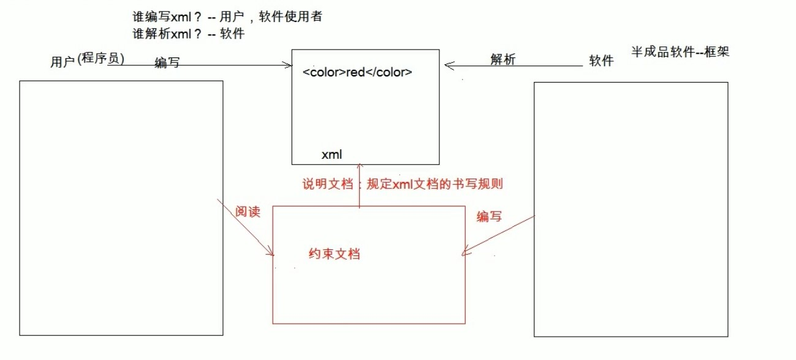

- 概念：规定 xml 的书写规则
- 要求：
  1. 能够在 xml 中引入约束文档
  2. 能够读懂约束文档（IDE 能够自动读取给出提示）
- 分类：

  1. DTD：简单的约束技术（可以做到标签的限定）

     1. 内部 dtd：将约束规则定义到 xml 中（不常用）

        ```dtd
        <!DOCTYPE students [
           <!ELEMENT students (student*)>
           <!ELEMENT student (name,age,sex)>
           <!ELEMENT name (#PCDATA)>
           <!ELEMENT age (#PCDATA)>
           <!ELEMENT sex (#PCDATA)>
           <!ATTLIST student number ID #REQUIRED>
        ]>

        ```

     2. 外部 dtd：将 dtd 约束规则定义到 dtd 文件中
        1. 本地：<!DOCTYPE student(根标签名) SYSTEM "./student.dtd"（dtd本地文件目录）>
        2. 网络：<!DOCTYPE student(根标签名) PUBLIC "dtd文件名字，随便" "dtd文件位置 url">

  2. Schema：一种复杂的约束技术（进一步可以做到内容的限定）

     1. 后缀名：xsd
     2. 引用方式：

        1. 填写 xml 文档的根元素
        2. 引入 xsi 前缀，xmlns:xsi="http://www.w3.org/2001/XMLSchema-instance"
        3. 引入 xsd 文件命名空间(可以引入多个文件)。 xsi:schemaLocation="http://www.itcast.cn/xml(这是命名) student.xsd(这是路径)"
        4. 为每个 xsd 约束声明一个前缀，作为标识 xmlns:a="http://www.itcast.cn/xml" 
          > 以 a 为 命名空间http://www.itcast.cn/xml的别名
          - 起别名原因：
            ```
            当引入多个约束文档时加前缀就变得很有用此时：

            如果有命名空间的话
            应该写成
            <http://www.itcast.cn/xml:students>
              <http://www.itcast.cn/xml:student>
              </http://www.itcast.cn/xml:student>
            </http://www.itcast.cn/xml:/students>
            每个标签前都要写（注意结束标签是在/后）

            因此可以简化书写，为命名空间起前缀： xmlns:a="http://www.itcast.cn/xml"
            之后写成
            <a:students>
            </a:students>

            当只有一个约束文档时，这样太麻烦，那么写成xmlns="http://www.itcast.cn/xml"
            就成了空前缀，默认前缀。直接写成：
            <student>
            </student>
            ```

        ```

        整体示例：
                        <!--默认命名空间为：http://www.w3.org/2001/XMLSchema-instance  -->
        <students xmlns="http://www.w3.org/2001/XMLSchema-instance"
                  xsi:schmelLocation="
                          http://www.itcast.cn/xml student.xsd            <!-- 一个student.xsd约束文件，命名空间为http://www.itcast.cn/xml -->
                          http://www.itcast1.cn/xml student1.xsd    "     <!-- 一个student1.xsd约束文件，命名空间为http://www.itcast1.cn/xml -->
                  xmlns:a="http://www.itcast.cn/xml"    <!-- 为命名空间http://www.itcast.cn/xml起别名为a -->
                  xmlns:b="http://www.itcast1.cn/xml"   <!-- 为命名空间http://www.itcast1.cn/xml起别名为b -->
        >
        </students>
        ```

        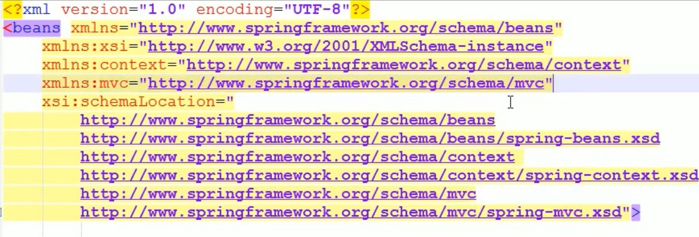

## 8.4. 解析

- 概念：操作 xml 文档，将文档中的数据读取到内存中
- 操作 xml 文档：

  - 解析（读取），将文档中的数据读取到内存中
  - 写入：将内存中的数据保存到 xml 文档中。持久化的存储

- 解析方式：

  - DOM：将标记语言文档一次性加载进内存，内存中会形成一颗 DOM 树（服务端使用）
    - 优点：操作比较方便，并且可以对文档进行 CRUD 的所有操作
    - 缺点：消耗内存
      - 注：如果代码写的不好，文档解析出的 DOM 树是文档体积的 1000-10000 倍左右
  - SAX：逐行读取，基于事件驱动的（移动端使用）
    - 优点：不占内存。读取一行，释放一行
    - 缺点：只能读取，不能增删改

- xml 常用解析器：

  - JAXP:sun 公司提供的解析器，支持 dom 和 sax 两种思想

    > 挺烂的，每人用

  - DOM4J:一款优秀的解析器
  - Jsoup:java 的 Html 解析器。但也可以用来解析 xml
  - PULL:Android 操作系统内置解析器 sax 方式

* JsouP

  - 快速入门
    1. 导入 jar 包
    2. 获取 Document 对象
    3. 获取对应标签 Element 对象
    4. 获取数据
  - 对象使用

    > 多查文档，这里知识列举比较重要的

    - Jsoup：工具类，parse()方法可以解析 html 或者 xml 文档，返回 Document

      - parse()方法：解析 html 和 xml

        1. parse(File in,String charseName) ：File 对象和字符集名称
        2. parse(String html):解析 xml 或 html 字符串（直接整个文档即可）
        3. parse​(URL url, int timeoutMillis)： 通过网络路径获取指定的 xml 或 html 文档,timeoutMillis 是超时时间

           > parse(new URL("https://www.w3school.com.cn"),10000)

    - Document；文档对象。代表内存中的 Dom 树
      > 继承 Element 类
      - 获取 Element 方法（从 Element 对象中继承的）
        - Element getElementById​(String id)：xml 中 id 是一个属性，用的不是特别多
        - Elements getElementsByTag​(String tagName)
        - Elements getElementsByAttribute​(String key)
        - Elements getElementsByAttributeValue​(String key, String value)根据属性键值对获得
        - ......
    - Elements：元素 Element 对象的集合，可以作为 ArrayList<Element>来使用
    - Element：元素对象，可以获得元素属性，名称，文本等

      - 获取子 element 方法（同上）：
        - Element getElementById​(String id)：xml 中 id 是一个属性，用的不是特别多
        - Elements getElementsByTag​(String tagName)
        - Elements getElementsByAttribute​(String key)
        - Elements getElementsByAttributeValue​(String key, String value)根据属性键值对获得
        - ......
      - 获取属性值

        - public String attr​(String attributeKey)

          > 属性名称不区分大小写。��� 该方法继承自 Node）

      - 获取文本内容
        - String Text() 获取**所有**子标签纯文本内容
        - String html() 获取 InnerHtml，即标签中的所有内容，包括子标签

  - Node：节点对象，是上面四个对象的父类

    - 是 Document 和 Element 的父类，非常多的常用函数都是 Node 中的

  - 快捷查询方式（两种都行，喜欢哪个用哪个）

    - selector：选择器（即 css）
      - Element select(String cssQuery)
        - 语法：参考 Selector 类来写选择器
    - Xpath ：w3c 提供的快捷查询 xml 的语法。XPath 即为 XML 路径语言（XML Path Language），它是一种用来确定 XML 文档中某部分位置的语言。

      - 使用 Jsoup 的 Xpath，需要独立导入 jar 包
      - JXpath 语法要额外学

        > [跳转](https://www.w3school.com.cn/xpath/xpath_syntax.asp)

# 9. tomcat

## 9.1. 回顾

1. 软件架构
   1. C/S：客户端/服务端
   2. B/S：浏览器端/服务端（javaee 开发大部分基于此）
2. 资源分类

   1. 静态资源：所有用户访问后得到结果相同，
      1. 如：html，css，JavaScrip
      2. 访问后直接返回给客户端，浏览器有静态资源解析引擎
   2. 动态资源：每个用户访问相同资源 ，可能得到的结果不相同

      1. 如：Servlet/jsp,php,asp。必须依赖 web 服务器
      2. 访问后会先将动态资源转换为静态资源，再返回给客户端

         > 

3. 网络通信三要素

   1. IP：电子设备（计算机）在网络中唯一标识。
   2. 端口：应用程序在计算机中的唯一标识 0~63356

      > 端口 0-65535 可以任选，但是 0-1024 一般被系统程序保留，比如 web 服务：80，tomcat 服务器：8080，数据库：3306。程序端口可以自动改

   3. 传输协议：规定了数据通信规则
      1. 基础协议
         1. tcp：安全协议 三次握手 速度稍慢
         2. udp：不安全协议，速度快

## 9.2. web 服务器软件

### 9.2.1. 概念

- 服务器：安装了服务器软件的计算机
- 服务器软件：接收用户的请求，处理请求做出响应
- web 服务器软件：接受用户请求，处理请求，做出响应
  - 在 web 服务器软件中，可以部署 web 项目，让用户通过浏览器来访问这些项目。比如 html 界面，css 资源等
  - 因为动态资源依赖 web 服务器软件，因此也被称为 web 容器
- 常见 java 相关 web 服务器软件

  - webLogic:oracle 公司，大型 javaEE 服务器，收费，支持所有 javaEE 规范

    > javaEE 是 java 语言在企业级开发中使用的技术规范总和，一共规定了 13 项大的规范

  - webSphere：IBM 公司，大型 javaEE 服务器，收费，支持所有 javaEE 规范
  - JBoss：JBoss 公司，大型 javaEE 服务器，收费，支持所有 javaEE 规范
  - tomcat：Apache 基金组织，中小型 javaEE 服务器，仅支持少量 javaEE 规范。开源免费

### 9.2.2. tomcat

- 开始
  - 下载
    - tomcat 官网
  - 安装
    - 解压即可（建议目录不要有空格和中文）
  - 卸载
    - 删除即可
- 目录结构（大多数项目目录结构差不多，因此很重要）
  - bin\：存放可执行文件（sh 在 linux 下可执行）
  - conf\：存放配置文件(xml 以及 properties 等)
  - lib\：存放依赖 jar 包
  - logs\：存放日志文件
  - temp\：存放临时数据
  - webapps\：存放 web 项目
  - work\：存放运行时数据。之后学 jsp 后再看，存放翻译和编译文件
- 启动：双击 bin 下的 startup.bat

  > 其实以后不常用这种方式，因为有 ide

  - 出现问题：

    1. 窗口一闪而过：JAVA_HOME 没有正确配置
    2. 启动报错：8080 被占用

       1. 杀死占用 8080 端口的进程

          1. netstat -ano
          2. 找到对应 PID（一个数字）

             > 

          3. 去任务管理器关闭那个进程

       2. 改变端口号
          1. conf 文件夹
          2. server.xml 文件
          3. 找 Connector 元素，里面有相关属性，有访问端口号
          4. 端口号改的不是一个两个，把所有 port 属性改了
          - 一般会降 tomcat 默认端口号修改为 80。是 http 协议默认端口号，在访问时就不用输入端口号了

  - 访问：
    - 本地：http://localhost:8080
    - 别人：http://【ip】:8080
  - 关闭：
    - 强制关闭：点击窗口叉号（不推荐）
    - 正常关闭：
      - bin 目录下 shutdown.bat
      - 窗口上按 ctrl+c

- 配置

  - 部署项目的方式：

    - 将文件夹放到 webapps 下

      - 直接

        - /hello：项目的访问路径-->虚拟目录

          > 该方式下虚拟路径名称与文件路径名称必须相同

      - 简化部署：打包成 war 包后，再放到 webapps 下（可以 winrar 压缩为 zip 后再改名）

        - 会自动解压缩，删除后也会自动删除解压文件夹

    - 配置 xml 文件
      - xml 文件最下面 host 标签中 添加 Context 标签
        ```xml
        <!--
          docBase:文件存放路径
        路径名称
        可以不同
              -->
        <Context docBase="" Path=""/>
        <!--
          缺点：在核心配置文件中添加木梳项目可能导致整个服务器崩溃
                一般不会在这里配置
        -->
        ```
    - 热部署方式（推荐）
      - conf/Catalina/localhost 下创建任意名称 xml 文件
      - 写一个 Context 标签，不能加 Path 属性
      - 虚拟目录是 xml 文件名称
        > 可以将 xml 文件删除或者后缀名加\_bak 来禁止访问一个项目
        > 修改后不需要重启服务器，而修改 serve 文件需要重启
      - ROOT.xml 的话则会作为**主目录**

  - 静态项目和动态项目
    - 目录结构
      - java 动态项目
        - 项目根目录
          - web-inf 目录
            - web.xml:web 项目核心配置文件
            - classes 目录：防止字节码文件
            - lib 目录：存放依赖 jar 包
          - 其他文件

  * 与 idea 集成
    - 添加 tomcat
      - 步骤：
        1. Run
        2. Edit Configurations
        3. Defaults
        4. Tomcat Server
        5. Local
        6. 选择 Tomcat 安装目录
    - 创建 web 项目
      1.  file
      2.  New
      3.  Moudle
      4.  Java EnterPrise（jsp3.0 对应 javaEE7）
      5.  此时 Application Server 默认 tomcat
      6.  下面 web Application 打上勾
      7.  勾上最下面 Creat web.xml （Server3.1 规范中，不勾也没事儿）
    - 改为热部署
      1. Run
      2. Edit Configurations
      3. tomcat 下某个服务器
      4. on update action 选项和 on frame deactivation
      5. 改为 Update resources
      6. （其实就是添加资源刷新，但因为 java 代码改得较多，所以不加 updata Classes 了）

- 线程池：
  - tomcat等服务器在一开始初始化时就会创建线程池（类似数据库连接池）。
  - 线程并不会真的关闭，而是放回到线程池中
  - 因此以后会涉及到ThreadLocal中数据的解绑（remove）。不能一直赖着一个线程。
  - 而且普通情况下，不解绑的话也会造成内存泄漏

# 10. 快捷键

# 11. Servlet 基础

## 11.1. 概念

- server applet:运行在服务端的小程序
  - servlet 就是一个接口，定义了 java 类被浏览器访问到（或被服务器识别到）的规则
  - 将来要自定义一个类，实现 Servlet 接口，复写方法。
- 图示

  > 

## 11.2. 快速入门

1. 创建 javaee 项目，勾选 web application,勾选 web.xml（Servlet3.0 版本后面再说）
2. 定义一个类，实现 Servlet 接口
3. 实现 5 个抽象方法
4. 配置 Servlet

> 实质就是让一个虚拟路径映射到一个实现 Servlet 接口的类。类中有相关方法。

## 11.3. 执行原理

1. 当服务器接收到客户端浏览器的请求后，会解析 url 请求的路径，获取访问的 servlet 的资源路径
2. 查找 web.xml 文件是否有对应的<url-pattern>标签及内容
3. 如果有，则再找到对应的<servlet-class>全类名
4. tomcat 会将字节码文件加载进内存，并创建其对象
5. 调用其方法
6. 图示：

   > 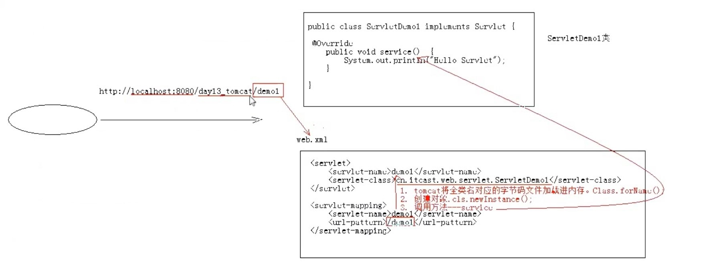

## 11.4. Servlet 中的生命周期

> servlet 类的对象并不需要我们自己创建，我们只需要声明 servlet 的类，
> 对象的创建和方法调用是由 web 服务器(容器)自动完成，response 和 request 对象也是服务器自动创建的
>  > 
>
> 面试题目：
> 意义/作用：更清楚得掌握内部运行原理，并且能够通过生命周期进行更加细致的程序设计

- 阶段：
  - 实例化阶段 调用构造方法实现
    - Servlet实现类本身就是一个java类，编译器会自动生成一个默认的空构造函数。所以也可以自己写一个空参的构造函数，完成一些操作
    - 但是千万不要只写带参的构造函数，这样服务器就没办法自动创建Servlet实现类，服务器也会报错
  - 初始化阶段 调用 init 方法
  - 请求处理阶段调用 service 方法，根据用户请求的方式调用 doGet 或 doPost 方法
  - 销毁阶段 调用 destroy 方法
- 过程：

  - 访问：
    - 第一次
      1. 实例化阶段
      2. 初始化阶段
      3. 请求处理
    - 再次访问：
      - 重用对象，只进行请求处理阶段
  - 销毁：
    - 服务器正常关闭时，销毁阶段

- init()方法：初始化方法，再 Servlet 创建时被执行，只执行一次

  - 什么时候被创建：

    - 默认情况下第一次被访问时，Servlet 被创建
    - web.xml 中修改可以改变设置
      ```xml
      <servlet>
        <servlet-name>demo1</servlet-name>
        <servlet-class>ServletTest</servlet-class><!--全类名-->
        <!--
        指定被创建时间，
        1. 第一次被访问时
            * load-on-startup为负数（默认-1）
        2. 在服务器启动时
            * load-on-startup为非负数即可
            -->
        <load-on-startup>1</load-on-startup>
      </servlet>
      ```

  - Servlet 的 init()方法只执行一次，说明一个 Servlet 在内存中只存在一个对象，Servlet 时单例的
    - 多个用户同时访问时，可能存在线程安全问题
    - 解决：
      - 加锁。才怪。性能影响太严重。根本不可能这样干
      - 尽量不要在 Servlet 中定义成员变量，而使用局部变量。即使定义了成员变量，也不要对其进行赋值

- service()方法：提供服务方法，每一次 Servlet 被访问时执行。执行多次
- destory()：销毁方法，在 Servlet 被销毁前执行（也就是服务器**正常**关闭时）
- 其他方法
  - servletConfig()：获取 ServletConfig 对象，也就是 ServletConfig 配置对象
  - getServletInfo()：获取 servlet 的一些信息，比如版本，作者（一般不会实现）

## 11.5. 多线程访问与两种参数

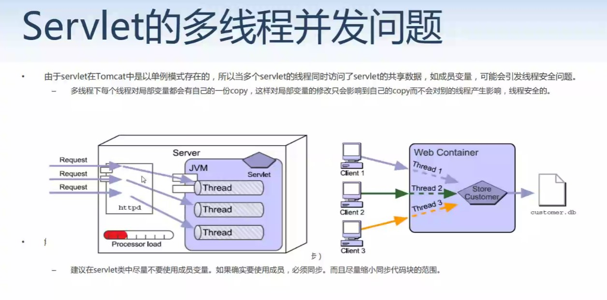

- servlet 是单实例多线程的，必须谨慎得为 Servlet 设置属性
  > 每一个访问都会开启一个线程
- 但可以可以通过 ServletConfig 来获取初始化参数

- 初始化参数

  - 位置：web.xml 的 servlet 节点中
    ```xml
    <servlet>
      <servlet-name>ParamDemo1</servlet-name>
      <servlet-class>ServletParamTest</servlet-class><!--全类名-->
      <init-param>
        <param-name> name1 </param-name>
        <param-value> value1 </param-value>
      </init-param>
    </servlet>
    ```
  - 获取方法:this.getInitParameter(String name);
    > this 指的是 Servlet 类，可以在 doGet 等方法中调用
    > 如果没有对应 name 就会返回 null
  - 范围：

  - 当前 Servlet 内部

- 上下文参数

  - 位置：web.xml 根节点内部，与 Servlet 并列
    ```xml
    <context-param>
        <param-name> name1 </param-name>
        <param-value> value1 </param-value>
    </context-param>
    ```
  - 获取方法

    - 获取上下文对象：ServletContext

      > 该对象详细请看下面 12.14

    - 获取上下文参数：servletcontext.getInitParameter(String name)

  - 应用范围：所有 Servlet，整个项目中

## 11.6. Servlet3.0

> 背景：
> 当有多个 Servlet 的时候需要重复配置很多次

- 好处：

  - 支持注解配置。可以不需要 web.xml

    > 复习：如果一个注解中有一个名称为 value 的属性，且你只想设置 value 属性(即其他属性都采用默认值或者你只有一个 value 属性)，
    > 那么可以省略掉“value=”部分。

* 步骤：

  1. 创建 Javaee，选择 Servlet3.0 以上，不用勾选 web.xml

     > javaee6 开始才支持 Servlet3.0

  2. 定义一个类，实现 Servlet 接口
  3. 复写方法
  4. 在类上使用注解进行配置

     > @WebServlet("资源路径") 。例：@WebServlet("/demo")

## 11.7. IDEA 与 tomcat 配置

- IDEA 会为每一个 tomcat 部署的项目单独建立一根配置

  ```
  tomcat log日志：
  Using CATALINA_BASE:   "C:\Users\稀落的星\.IntelliJIdea2019.3\system\tomcat\Tomcat_8_5_51_笔记"
  Using CATALINA_HOME:   "D:\learn\tomcat\apache-tomcat-8.5.51"
  Using CATALINA_TMPDIR: "D:\learn\tomcat\apache-tomcat-8.5.51\temp"
  Using JRE_HOME:        "D:\learn\ideaIU-2019.2.4.win\jbr"
  Using CLASSPATH:       "D:\learn\tomcat\apache-tomcat-8.5.51\bin\bootstrap.jar;D:\learn\tomcat\apache-tomca
  ```

  - C:\Users\稀落的星\.IntelliJIdea2019.3\system\tomcat\Tomcat*8_5_51*笔记 就是当前项目配置的位置
  - 可以发现，修改配置后 conf 中的端口后 service.xml 会改变
  - 以及 conf/Catalina/localhost 下也有热部署 xml 文件

- 工作空间项目（源码） 和 tomcat 部署的 web 项目（.java 编译后，以及 html，jsp 复制过去，在 out 目录下） 不再同一路径
  - tomcat 访问的是 tomcat 部署的 web 项目
    - 寻找设置文件夹下热部署的 xml 文件可以发现有这个属性：docBase="D:\learn\IdeaProject\笔记\out\artifacts\servlet_war_exploded"
  - WEB-INF 下的资源是不能被浏览器直接访问的（有其他技术可以访问到）
  - tomcat 中断点调试方式：在 Servlet 方法中打断点。然后 debug 方式启动
  ```
      某project下层级关系示例：（分辨一下对应关系）
      （通过指令 tree /f）
    ├─.idea
    │  │  encodings.xml
    │  │  misc.xml
    │  │  modules.xml
    │  │  uiDesigner.xml
    │  │  workspace.xml
    │  │
    │  ├─artifacts
    │  │      servlet_war_exploded.xml
    │  │
    │  ├─dictionaries
    │  │      .xml
    │  │
    │  └─inspectionProfiles
    │          Project_Default.xml
    │
    ├─out
    │  ├─artifacts
    │  │  └─servlet_war_exploded
    │  │      │  index.jsp
    │  │      │
    │  │      └─WEB-INF
    │  │          └─classes
    │  │              │  ServletTest.class
    │  │              │  ServletTest2.class
    │  │              │  ServletTest3.class
    │  │              │
    │  │              └─META-INF
    │  │                      servlet.kotlin_module
    │  │
    │  └─production
    │      └─servlet
    │          │  ServletTest.class
    │          │  ServletTest2.class
    │          │  ServletTest3.class
    │          │
    │          └─META-INF
    │                  servlet.kotlin_module
    │
    └─servlet
        │  servlet.iml
        │
        ├─src
        │      ServletTest.java
        │      ServletTest2.java
        │      ServletTest3.java
        │
        └─web
            │  index.jsp
            │
            └─WEB-INF
  ```

## 11.8. Servlet 体系结构及路径配置

> 背景：每次都要把所有 5 个方法都重载

- 体系结构图解
  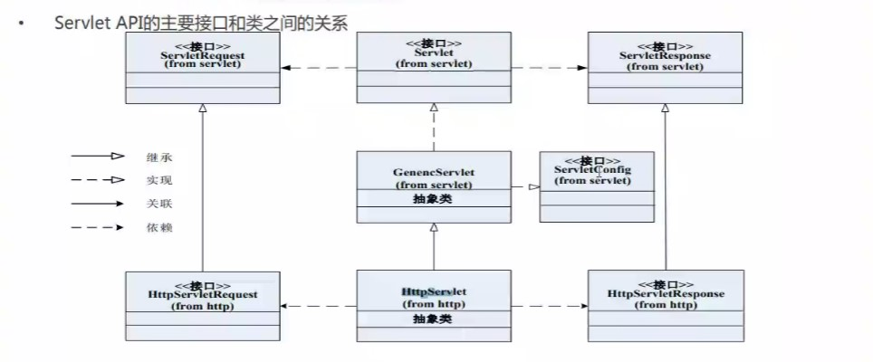

* Servlet 接口

  - GenericServlet 抽象类（其实并不用这个）
    - httpServlet 抽象类（而用这个）

* GenericcServlet

  - 原理：复写了 Servlet 的方法，将 service 做了抽象，而其他都是空实现（类似适配器）

* HttpServlet

  - 实质：对 http 协议的一种封装，简化操作。
  - 原理：实现 doGet 和 doPost 方法，service 中进行自动调用
    > 伪代码：
    > 
    > 实际代码：
    > 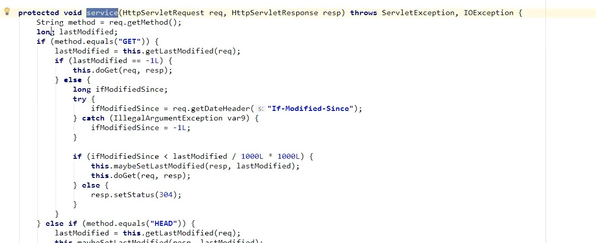
  - 该类使用原因：
    - 如果使用 Servlet 的话，当接受表单提交数据时，要判断提交方式为 post/get，再进行不同的处理
    - 为了方便，所以出现了 httpServlet 类，在内部进行了判断
  - 使用方式：
    1. 定义继承 HttpServlet 的类
    2. 复写 doGet()和 doPost 方法（类似于 Servlet 接口中的 service 方法）
       1. 浏览器访问时的直接请求是 get 方式
       2. 表单可以实现 post 方式，其他方式以后会学
          ```html
          <!-- 实现HttpServlet接口的类上注解内容为： @WebServlet("/demo3") -->
          <form action="/demo3" method="post">
            <!-- 通过这里的action属性来指定目的地 -->
            <input name="username" />
            <input type="submit" value="提交" />
          </form>
          ```
  - **其他**：
    - HttpServlet 也可以重写 构造，init()和 destory()方法
    - 但是不要重写 service 方法
      - 因为 service 方法要根据不同请求方式不同处理方法。HttpServlet 中已经从写了 Service 方法，其中调用 doGet 和 doPost 方法

* Servlet 相关配置
  1. urlpatten:Servlet 访问路径
     1. 一个 Servlet 可以定义多个访问路径
        > @WebServlet({"/d4","/dd4"})
        > 一般只会定义一个访问路径
  2. 路径定义规则
     1. /xxx
     2. /xxx/xxx:多层路径，目录结构
        1. 也有`/xxx/*，/*`。 \* 表示的是通配符
        2. 但当有`/*`以及`/demo`时，/demo 优先要更高
     3. \*.xxx：看似是文件，后缀名自定

## 11.9. HTTP 请求协议：

### 11.9.1. 基础概念

> 在 old 中有笔记，可以看看那里的，这里是复习+补充

- 概念：Hyper Text Transfer Protocol 超文本传输协议
- 传输协议：定义了客户端与服务端发送数据时的格式
- 特点：

  1. 基于 tcp/ip 的高级协议
  2. http 默认端口是 80
  3. 基于请求响应模型，一次请求，一次响应

     > 当访问一个网页时，请求次数不只为一次，每个单独的资源要访问一次
     > 
     > 上面的每一项都是一次请求和响应

  4. **无状态的：每次请求之间相互独立，不能交互数据**

- 历史版本
  - 1.0（每次请求响应后都会断开，在新建连接）
  - 1.1（复用连接，不会立马断掉，如果一段时间没有数据传输才会断开）

### 11.9.2. http 请求消息

- 请求消息数据格式

  - 例：（被 chrome 解析整理过了）
    > 
    >
    > 字符串格式示例：
    >
    > POST/login.htmlHTTP/1.1
    > Host:localhost
    > User-Agent:Mozilla/5.0(windows NT 6.1;Win64;x64;rv:60.0)Gecko/20100101 > Firefox/60.0
    > Accept:text/html,application/xhtml+xml,application/xml;q=0.9,\*/\*;q=0.8
    > Accept-Language:zh-CN,zh;q=0.8,zh-TW;q=0.7,zh-HK;q=0.5,en-US;q=0.3,en;q=0.2
    > Accept-Encoding:gzip,deflate
    > Regerer: http://localhost/login.html
    > Connection:keep-alive
    > Upgrade-Insecure-Requests:1
    >
    > username="1111"

  1. 请求行

     1. 格式： 请求方式 请求 url 请求协议/版本

        > 例:GET /login.html HTTP/1.1

     2. 请求方式：（http 有 7 种，常用的有两种）
        1. GET：
           > 浏览器直接访问 超链接 表单提交
           1. 请求参数在请求行中（也就是 url 后），后面会加上 ?键=值
           2. 请求的 url 长度有限制
           3. 不太安全
        2. POST：
           > 表单提交
           1. 请求参数在请求体中
           2. 请求 ur 长度没有限制。（因此文件上传用 post 方式）
           3. 相对安全（但拦截了请求消息头也能提取信息）

  2. 请求头

     1. 格式：
        > 请求头名称 1 : 请求头值 1
        > 请求头名称 2 : 请求头值 2-1,请求头值 2-2 (有多个值用逗号隔开)
        > 请求头名称 3 : 请求头值 3
     2. 常见请求头：

        1. User-Agent:浏览器告诉服务器自己的浏览器版本信息。

           1. 可以在服务器端获取该信息来解决浏览器的兼容性问题。

        2. Accept:告诉服务器该浏览器可以响应的什么样的文件格式
        3. Accept-Language：支持语言环境
        4. Referer:客户端浏览器告诉服务器，我（当前请求）从哪里来。
           > 在 www.baidu.com 转到一个链接时 referer="http://www.baidu.com"。当直接在地址栏输入时referer为null
           1. 作用：
              1. 防盗链：
                 ```java
                 if(referer.equals("自家网页")){
                   //返回有效资源
                 }else{
                   //草泥马的，盗链可耻
                 }
                 ```
              2. 统计工作：
                 ```java
                 //统计花钱去别的网站打广告，过来访问的次数有多少
                 if(referer.equals("打广告所在网站1")){
                   打广告所在网站++;
                 }
                 ```
        5. Connectiong:keep-alive 就是连接不会断，可以复用

  3. 请求空行

     1. 就是一个空行，用来分隔请求头和请求体。但是绝对必要

  4. 请求体 （正文）
     1. 格式：参数名=参数值
     2. 用处：用来封装 POST 请求消息的一些请求参数。
        > GET 是没有请求体的，POST 有。
        ```html
        <!-- 例： -->
        <form action="/demo3" method="post">
          <input name="username" />
          <input type="submit" value="提交" />
        </form>
        <!-- 点击提交后，请求体中会有 username=填入内容 -->
        ```
        

### 11.9.3. http 响应消息

- 响应消息数据格式

## 11.10. Request 对象

### 11.10.1. 原理：


1. request 和 response 对象是由服务器创建的，我们来使用它们
2. request 对象是用来获取请求消息的，response 对象是用来设置响应消息

### 11.10.2. Request

- 继承体系结构：

  - ServeltRequest 接口

    - HttpServletRequest 子接口

      - org.apache.catalina.connector.RequestFacade 类

        > //通过 System.out.println(rep);得到。tomcat 中实现 HttpServletRequest 接口的类。tomcat 是 apache 公司的

#### 11.10.2.1. Request 基本方法

- Request 功能：

  > **以下方法都是来自 HttpServletRequest 及 ServletRequest**

  - 获取请求消息

    - 获取请求行数据

      ```java
      //以GET /test/demo1?username=111 HTTP/1.1

      //获取请求方式
      String getMethod()

      //(重要)获取虚拟目录 /test
      String getContextPath()

      //获取Servlet路径 /demo1
      String getSErvletPath()

      //获取get方式请求参数 username=111
      String getQueryString()

      //(重要)获取请求uri test/demo1
      String getRequestURI()

      //（重要）获取请求URL http://localhost/test/demo1
      StringBuffer getRequestURL()

      //获取协议及其版本 HTTP/1.1
      String getProtocol()

      //获取客户机ip地址
      String getRemoteAddr()

      /*
      URL：统一资源定位符
      URI：统一资源标识符 代表范围更大
      */
      ```

    - 获取请求头数据

      ```java
      //(重要)通过请求头名称获取请求头的值
      String getHeader(String name)

      //获取所有请求头名称。返回一个枚举（其实就是一个简易版的迭代器）
      Enumeration<String> getHeadNames()

      //使用举例：
      //1. 遍历列出
      Enumeration<String> headNames=req.getHeaderNames();
      while(headNames.hasMoreElements()){
        String name=headNames.nextElement();
        System.out.println(req.getHeader(name));
      }

      //2. 防盗链
      String referer=req.getHeader("referer");
      if(!"http://www.zijia.com".equals(referer)){//判断条件用referer.contains("某网址片段")也行
        //通过response 一顿操作
      }else{
        //正常返回数据（通过response）
      }
      ```

    - 获取请求体数据

      > 只有 POST 请求方式，才有请求体，在请求体中封装了 POST 请求的请求参数
      > 其中将请求体数据封装成了流
      > 步骤：

      1. 获取流对象
      2. 再从流中获取数据

      ```java
      //获取字符输入流，只能操作字符数据
      BufferReader getReader()

      //获取字节输入流,可以操作所有类型的数据。返回值当作InputStream使用就行，因为它继承了InputStream （在文件上传中再进行讲解）
      ServletInputStream getInputStream();
      //----------------------------------------------------------------------
      @WebServlet("/demo5")
      public class ServletTest3 extends HttpServlet {
          @Override
          protected void doGet(HttpServletRequest req, HttpServletResponse resp) throws ServletException, IOException {
          }

          @Override
          protected void doPost(HttpServletRequest req, HttpServletResponse resp) throws ServletException, IOException {
              //获取请求消息体

              //1 获取字符流
              BufferedReader reader = req.getReader();
              //2 获取读取数据
              String line=null;
              while((line=reader.readLine())!=null){
                  System.out.println(line);
              }
          }

      }
      //结果为：username=131&passowrd=231312
      //和get方式中的格式相同
      ```

#### 11.10.2.2. 获取参数通用方法

- 其他功能（都很常用）
  - 获取请求参数（通用，get，post 都适用）：
    ```java
    小总结：get方式时，通过获取请求行数据中的 String getQueryString()方法 来获取请求参数。
    Post方式时,通过获取请求体数据中的 BufferReader getReader()方法 来获得请求参数的流
    ------------------------------------
    因为通用函数，get和post代码基本就相同了。可以在doGet中调用 this.doPost(req,resp) 来减少代码量
    ```
    - String getParameter（String name）:根据参数名称获取参数值 username=111&password=222
    - String[] getParameterValues(String name)：根据参数名称返回获取参数值的数组(有多个值时使用。复选框时也可以用) hobby=game&hobby=boll
      > 此时使用 getParameter 也不会报错，但是只会返回一个值.
      > 通常搭配 checkbox 使用
      ```html
      <form>
        <input type="checkbox" name="hobby" value="game" />游戏
        <input type="checkbox" name="hobby" value="boll" />球
        <input type="submit" value="注册" />
      </form>
      <!-- 两个都选中且当点击提交时，会有hobby=game&hobby=boll -->
      ```
      
    - Enumeration<String> getParameterNames():获取所有请求的参数名称
    - Map<String,String[]> getParameterMap():获取所有键值对
      > 值为数组是为了避免有的键有多个值。
      ```java
      //例：
      Map<String,String[]> map=req.getParameterMap();
      Set<String> set=map.keySet();
      for(String name:set){
        System.out.println(name);
        String[] values=map.get(name);
        for(String str:values){
          System.out.println(str);
        }
        System.out.println("----------------");
      }
      ```

#### 11.10.2.3. 中文乱码问题

- 中文乱码问题：
  - tomcat8 已经将 get 方式的中文乱码问题解决了
  - post 方式依旧会乱码
  - **解决：**在获取参数前，添加一句：req.setCharacterEncoding("utf-8")//此处的编码与网页编码一致
  - 原理：post 方式时，getParameter()内部依旧使用流的方式

#### 11.10.2.4. 请求转发

- 请求转发

  > 一种在服务器内部的资源跳转方式

  - 示意图：
    
  - 步骤：
    1. 通过 ServeltRequest 中的方法：RequestDispatcher getRequestDispatcher(String s) 获取请求转发器对象
    2. 使用 RequestDispatcher 进行转发：使用该对象中的 forward(ServeltRequest request,ServeltResponse response)方法进行转发
  - 示例

    ```java
    @WebServlet("/demo6")
    class ServletTest6 extends HttpServlet {
      @Override
      protected void doGet(HttpServletRequest req, HttpServletResponse resp) throws ServletException, IOException {
        this.doPost(req,resp);
      }

      @Override
      protected void doPost(HttpServletRequest req, HttpServletResponse resp) throws ServletException, IOException {
        System.out.println("ServletTest6被访问了,要转到ServletTest7");

        RequestDispatcher rp=req.getRequestDispatcher("/demo7");
        rp.forward(req,resp);
      }
    }

    @WebServlet("/demo7")
    class ServletTest7 extends HttpServlet {
      @Override
      protected void doGet(HttpServletRequest req, HttpServletResponse resp) throws ServletException, IOException {
        System.out.println("ServletTest7被访问了");
      }

      @Override
      protected void doPost(HttpServletRequest req, HttpServletResponse resp) throws ServletException, IOException {
         this.doGet(req,resp);
      }
    }
    ```

  - 特点（面试）：
    1. 浏览器地址栏路径一直是最初的路径，不会发生变化
    2. 只能转发到当前服务器内部资源中。（比如转发到 www.baidu.com 就不行）
    3. 多个资源间，使用的是同一个请求。（也就是访问最开始那个资源时的请求）

#### 11.10.2.5. 共享数据

- 共享数据
  > 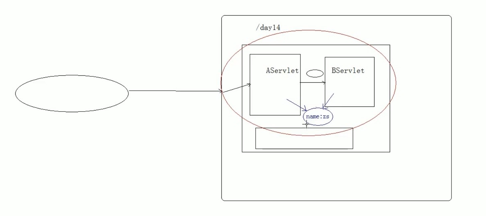
  > 红线圈住的是 request 域。
  - 域对象：一个有作用范围的对象，可以在范围内共享数据
  - request 域：代表一次请求的范围，一般用于请求转发的多个资源中共享数据（比如 ServeltA 转发到 ServletB，那么该次请求的 request 域为这两个 Servlet）
  - 方法：(ServletRequest 中)
    1. void setAttribute(String name,Object obj)存储数据
    2. Object getAttribute(String name)根据键获取值
    3. void removeAttribute(String name)根据键移除键值对

#### 11.10.2.6. 其他

- 获取 ServletContext

  > 该对象后面会讲使用

  - ServletContext getServletContext();

> 当两个 Servlet 类的对应虚拟地址相同时，服务器开启时会报错。

### 11.10.3. Request 案例

#### 11.10.3.1. 分析

- 用户需求：

  1. 编写 login.html 登陆界面
     > username 和 password 两个输入框
  2. 使用 Druid 连接池技术，操作 mysql，存放用户数据
  3. 使用 jdbcTemplate 技术封装 JDBC
  4. 登陆成功跳转 SuccessServlet 展示：登陆成功！ 用户名，欢迎您
  5. 登陆失败跳转 FailServlet 展示：登录失败，用户名或密码错误

- 案例分析：
  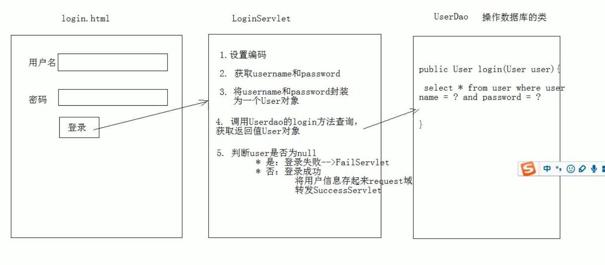

- 步骤：

  1. 创建项目，导入 html 页面，配置文件，jar 包

     > jar 包要放在 web 下的 WEB-INF(没有就创建一个)

  2. 创建数据库环境
  3. 创建用户实体类 cn.whitestarain.itcase.domain.user
  4. 创建 dao 包，用来和数据库连接，提供 login 方法

     > 和数据库链接使用的包都有 dao （database access object）

     - 在此之前，创建 util 包，用来存放数据库连接工具类，供 dao 包使用

  5. 编写 Servlet
     > form 中 action 里写：虚拟目录+Servlet 路径。以后会重点讲，现在只做了解
     1. LoginServlet：判断是否存在用户并进行转发到下面两个中的一个
     2. FailServlet
     3. SuccessServlet

#### 11.10.3.2. 代码：从上到下（不想看折叠或跳过）

- 目录结构：
  ```
  D:.
  │  1.txt
  │  loginDemo.iml
  │
  ├─src
  │  │  druid.properties
  │  │
  │  ├─cn
  │  │  └─whitestarrain
  │  │      └─itcast
  │  │          ├─dao
  │  │          │      DaoUser.java
  │  │          │
  │  │          ├─domain
  │  │          │      User.java
  │  │          │
  │  │          ├─util
  │  │          │      JDBCUtils.java
  │  │          │
  │  │          └─web
  │  │              └─servlet
  │  │                      FailServlet.java
  │  │                      LoginServlet.java
  │  │                      SuccessServlet.java
  │  │
  │  └─test
  │          test.java
  │
  └─web
      │  index.jsp
      │  login.html
      │
      └─WEB-INF
          └─lib
                  commons-logging-1.2.jar
                  druid-1.0.9.jar
                  mchange-commons-java-0.2.12.jar
                  mysql-connector-java-5.1.48-bin.jar
                  spring-beans-5.1.10.RELEASE.jar
                  spring-core-5.1.10.RELEASE.jar
                  spring-jdbc-5.1.10.RELEASE.jar
                  spring-tx-5.1.10.RELEASE.jar
  ```

```
driverClassName=com.mysql.jdbc.Driver
url=jdbc:mysql://127.0.0.1:3306/test
username=root
password=root
# 初始话连接数量
initialSize=5
# 最大连接数量
maxActive=10
# 超时时间
maxWait=3000
```

```java
package cn.whitestarrain.itcast.dao;

import cn.whitestarrain.itcast.util.JDBCUtils;
import cn.whitestarrain.itcast.domain.User;
import org.springframework.dao.DataAccessException;
import org.springframework.jdbc.core.BeanPropertyRowMapper;
import org.springframework.jdbc.core.JdbcTemplate;

/**
 * 操作数据库中User表的类
 *
 * @author 稀落的星
 */
public class DaoUser {

    /**
     * 声明一个JDBCTemplate对象共用
     */
    private JdbcTemplate template = new JdbcTemplate(JDBCUtils.getDataSource());
    //JdbcTemplate会自动关闭资源

    public User login(User loginUser) {

        try {
            String sql = "select * from user where name= ? and password= ?";
            return template.queryForObject(sql, new BeanPropertyRowMapper<User>(User.class), loginUser.getName(), loginUser.getPassword());
        } catch (DataAccessException e) {
            //当查询结果为0时，上面的 new BeanPropertyRowMapper会报错。后期会在这里记录日志，而不是打印在控制台
            e.printStackTrace();
            System.out.println("没有结果");
            return null;
        }

    }
}

```

```java
package cn.whitestarrain.itcast.domain;

/**
 * 用户实体类
 */
public class User {
    private int id;
    private String name;
    private String password;

    public int getId() {
        return id;
    }

    public String getName() {
        return name;
    }

    public String getPassword() {
        return password;
    }

    public void setId(int id) {
        this.id = id;
    }

    public void setName(String name) {
        this.name = name;
    }

    public void setPassword(String password) {
        this.password = password;
    }

    @Override
    public String toString() {
        return "User{" +
                "id=" + id +
                ", name='" + name + '\'' +
                ", password='" + password + '\'' +
                '}';
    }
}

```

```java
package cn.whitestarrain.itcast.util;

import com.alibaba.druid.pool.DruidDataSourceFactory;

import javax.sql.DataSource;
import java.io.IOException;
import java.io.InputStream;
import java.sql.Connection;
import java.sql.SQLException;
import java.util.Properties;

/**
 * JDBC工具类 Durid连接池
 * @author 稀落的星
 */
public class JDBCUtils {
    private static DataSource ds;

    static{
        // 1. 加载配置文件
        Properties pro=new Properties();
        //使用classLoader加载配置文件，获取字节输入流
        InputStream is = JDBCUtils.class.getClassLoader().getResourceAsStream("druid.properties");
        try {
            if (is != null) {
                pro.load(is);
            }else{
                System.out.println("获取键值对失败");
            }
        } catch (IOException e) {
            e.printStackTrace();
        }

        // 2. 初始化连接池对象
        try {
            ds = DruidDataSourceFactory.createDataSource(pro);
        } catch (Exception e) {
            e.printStackTrace();
        }
    }

    /**
     * 获取连接池对象
     */
    public static DataSource getDataSource(){
        return ds;
    }
    /**
     * 获取连接对象
     */
    public static Connection getConnnection() throws SQLException {
        return ds.getConnection();
    }
}
```

```java
package cn.whitestarrain.itcast.web.servlet;

import javax.servlet.ServletException;
import javax.servlet.annotation.WebServlet;
import javax.servlet.http.HttpServlet;
import javax.servlet.http.HttpServletRequest;
import javax.servlet.http.HttpServletResponse;
import java.io.IOException;

@WebServlet("/failServlet")
public class FailServlet extends HttpServlet {
    @Override
    protected void doPost(HttpServletRequest request, HttpServletResponse response) throws ServletException, IOException {
        response.setContentType("text/html;charset=utf-8");
        response.getWriter().write("登录失败，与户名或者密码错误");
    }

    @Override
    protected void doGet(HttpServletRequest request, HttpServletResponse response) throws ServletException, IOException {
        this.doPost(request,response);
    }
}

```

```java
package cn.whitestarrain.itcast.web.servlet;

import cn.whitestarrain.itcast.dao.DaoUser;
import cn.whitestarrain.itcast.domain.User;

import javax.servlet.ServletException;
import javax.servlet.annotation.WebServlet;
import javax.servlet.http.HttpServlet;
import javax.servlet.http.HttpServletRequest;
import javax.servlet.http.HttpServletResponse;
import java.io.IOException;

@WebServlet("/loginServlet")
public class LoginServlet extends HttpServlet {
    @Override
    protected void doGet(HttpServletRequest req, HttpServletResponse resp) throws ServletException, IOException {
        //设置编码
        req.setCharacterEncoding("utf-8");
        // 获得请求参数
        String username = req.getParameter("username");
        String password = req.getParameter("password");

        //封装user对象
        User loginuser = new User();
        loginuser.setPassword(password);
        loginuser.setName(username);

        //调用UserDao方法
        DaoUser daoUser = new DaoUser();
        User returnuser = daoUser.login(loginuser);
        if(returnuser!=null){
            //登陆成功
            req.setAttribute("user",returnuser);
            req.getRequestDispatcher("/successServlet").forward(req,resp);
        }else{
            req.getRequestDispatcher("/failServlet").forward(req,resp);
            //登陆失败
        }
    }

    @Override
    protected void doPost(HttpServletRequest req, HttpServletResponse resp) throws ServletException, IOException {
        this.doGet(req,resp);
    }
}
```

```java
package cn.whitestarrain.itcast.web.servlet;

import cn.whitestarrain.itcast.domain.User;

import javax.servlet.ServletException;
import javax.servlet.annotation.WebServlet;
import javax.servlet.http.HttpServlet;
import javax.servlet.http.HttpServletRequest;
import javax.servlet.http.HttpServletResponse;
import java.io.IOException;

/**
 * @author 稀落的星
 */
@WebServlet("/successServlet")
public class SuccessServlet extends HttpServlet {
    @Override
    protected void doPost(HttpServletRequest request, HttpServletResponse response) throws ServletException, IOException {
        User user = (User)request.getAttribute("user");
        response.setContentType("text/html;charset=utf-8");
        response.getWriter().write("登录成功，欢迎您");
        response.getWriter().write(user.getName());


    }

    @Override
    protected void doGet(HttpServletRequest request, HttpServletResponse response) throws ServletException, IOException {
        this.doPost(request,response);
    }
}

```

```html
<!DOCTYPE html>
<html lang="en">
  <head>
    <meta charset="UTF-8" />
    <title>login</title>
  </head>
  <body>
    <form action="/loginDemo/loginServlet">
      <!--虚拟目录+Servlet路径-->
      用户名：
      <label>
        <input type="text" placeholder="请输入用户名" name="username" /> </label
      ><br />
      密码：
      <label>
        <input type="text" placeholder="请输入密码" name="password" /> </label
      ><br />
      <input type="submit" value="登录" />
    </form>
  </body>
</html>
```

#### 11.10.3.3. BeanUtils 基本使用

> 主要用来简化数据封装，用来封装 JavaBean

- JavaBean:标准的 java 类

  > 这些类一般放到 domain 等命名的包里面

  - 格式要求
    1. 类必须被 public 修饰
    2. 必须提供空参构造器
    3. 成员变量必须被 private 修饰
    4. 提供公共 setter 和 getter 方法
  - 功能：封装数据

- 概念：
  - 成员变量：就是类中的成员变量
  - 属性：getter 和 setter 方法截取后的产物。虽说可以不一样，但是大多树情况下和成员变量相同。
    > 例如 getUsername() --> Username --> username
    ```java
    class Person(){
      String name=null;
      String test=null;
      public String getName(){
        return this.name;
      }
      public String getHehe(){//这里只是演示，以后正常写成一样就行了
        return this.test;
      }
    }
    /*
    这里的成员变量时name和test，对应属性为name和hehe
    */
    ```
- 方法：
  1. setProperty(Object bean,key,value):给某个对象中的某个属性赋特定值（必须是属性名称）
  2. getProperty(Object bean,key,value):获取某个对象中某个属性的值（必须是属性值）
  3. populate(Object bean,Map map):将 map 中键的值作为属性的名称，设置到传入的对象中

## 11.11. 路径

1. 绝对路径(以/开头)

   > 可以确定唯一资源

   1. 如http://localhost/Demo/login.html

      1. 此时可以省略协议以及服务器 ip，只写虚拟路径+资源路径：/Demo/login.html

   2. 规则：判断给谁用（判断资源访问请求从谁发出）
      1. 给客户端浏览器使用：用加虚拟目录（项目的访问路径）。**建议虚拟目录动态获取**
         > 动态获取的虚拟目录前面有/
         > 可以认为：重定向等的 / 表示：http://服务器ip:端口/
         1. 比如：网页中写的 a 标签跳转路径
         2. 超链接，form 表单路径
         3. 重定向
      2. 给服务器用：不需要加虚拟目录
         > 可以认为：请求转发的 / 表示：http://服务器ip:端口/项目名
         1. 比如：转发
   3. 动态访问虚拟路径：

      > 针对加有虚拟路径的绝对路径，当虚拟目录发生改变时，会有很多资源无法使用，因此推荐使用动态访问虚拟目录
      > 用在 jsp，重定向中。

      ```java
      String cont = resq.getContextPath();//动态获取虚拟目录
      resp.setRedirect(cont+"/login.html");//虚拟路径+资源路径

      //请求转发不需要使用获取虚拟路径
      ```

2. 相对路径(不以/开头)
   > 不可以确定唯一资源
   > 不管给哪方使用路径写法都相同，都是相对于当前路径跳转
   1. 如：./index.html 其中./可以省略
   2. 规则：确认当前的访问资源和目标资源的相对位置关系
      1. ./代表当前目录；../代表上一级目录
      2. 使用 jsp 推荐使用绝对路径
      3. 例：
         1. 现在：http://localhost/Demo/login.html
         2. 目标：http://localhost/Demo1/demo.html
         3. 相对路径：../Demo1/demo.html

## 11.12. HTTP 响应协议

### 11.12.1. HTTP 响应消息

```
示例：

HTTP/1.1 200 OK
Accept-Ranges: bytes
Content-Type: text/html;charset=UTF-8
Content-Length: 80
Date: Mon, 02 Mar 2020 14:21:37 GMT

<html>
  <head>
     <meta charset="utf-8"/>
     <title>首页</title>
  </head>
  <body>
     hello
  </body>
</html>
```

- 数据格式

  - 响应行
    - 格式：协议/版本 响应状态码 状态码描述
    - 响应状态码：服务器告诉客户端浏览器本次请求和响应的一个状态。(**更详细的网上一查就能查到，此处是常用状态码**)
      - 特征：状态码都是 3 位数字
      - 分类：
        - 1xx:服务器接收客户端消息但是没有接收完成，等待一段时间后发送 1xx 状态码，询问是否还有数据
        - 2xx:响应成功
        - 3xx:重定向。302（重定向）。304（访问缓存）
          > 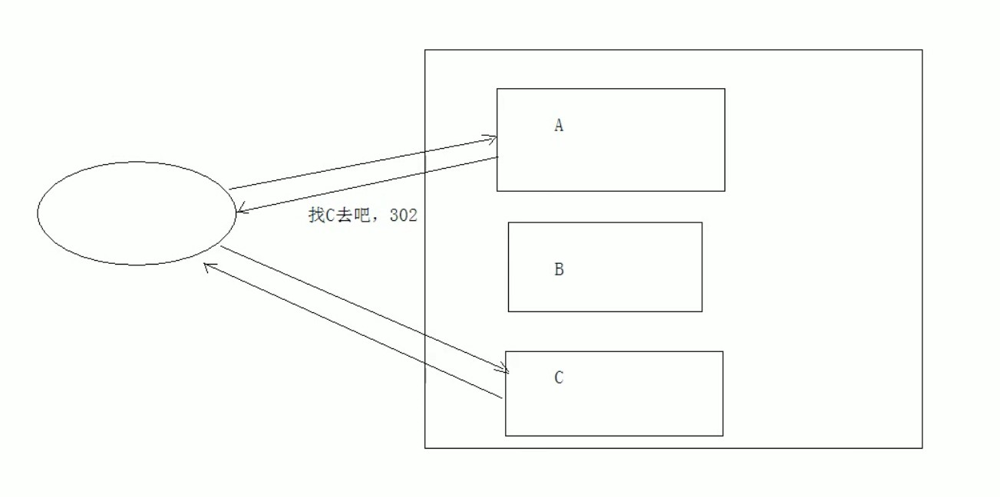
          > 请求 A 资源，响应 302 状态码，告诉客户端去访问 C。
          > 重定向也是资源跳转的一种方式<br /> > 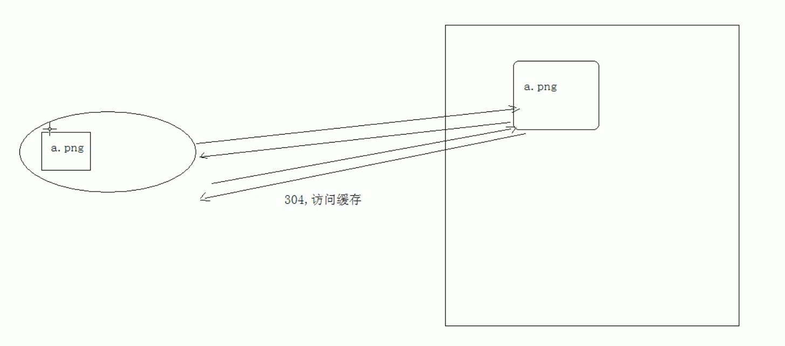
          > 访问缓存是指本地已经本次要访问的服务端的资源，去访问本地缓存即可，再次访问服务端过于浪费时间
        - 4xx：客户端错误
          > 代表:
          > 404：路径没有对应资源
          > 405：请求方式没有对应的 doXxx 方法。比如没有写 doGet 方法时，访问该 Servlet 会报 405 错误
        - 5xx：服务端错误
          > 代表
          > 500：服务器内部异常，会展示在页面上。此处是写了个除零的错误
          > 
  - 响应头：
    - 格式：头名称：值 键值对相识
    - 常见响应头:
      - Content-Type:服务器告诉客户端本次**响应体**的数据格式以及编码格式
      - Content-disposition:服务器告诉客户端以什么格式打开相应体数据
        - 值：
          - in-line:默认值，在当前页面里打开。也就是普通网页页面
          - attachment;filename=xxx:以附件形式打开响应体。文件下载时使用
      - Content-Length:响应体长度
      - Date：日期
  - 响应空行：分隔空行
  - 响应体：真实地传输的数据。

    > 有的是看得懂的 html 页面，也有些时看不懂的，比如图片的二进制数据

## 11.13. Responds 对象

### 11.13.1. 基本功能

- 设置响应行
  - 设置状态码：`void setStatus(int sc)`
- 设置响应头
  - 设置响应头中的一个键值对：`void setHeader(String name, String value)`
- 设置响应体：与 Request 获取输出流相对应，这里是设置输入流
  1. 获取输出流
     1. 字符输出流 `PrintWriter getWriter()`
     2. 字节输出流 `ServletOutputStream getOutputStream()`
        1. 当作 OutputStream 就行
  2. 使用输出流，将数据输出到客户端浏览器

> **额外补充**：

```java
设置响应消息头
对于一些常用的消息头， HttpServletResponse提供了一些特定的方法
来进行设置：
– setContentType(String mime)，设定Content-Type消息头；
– setContentLength(int length)，设定Content-Length消息头；
– addHeader(String name,String value)，新增String类型的值到名为name的
http头部；
– addIntHeader(String name,int value)，新增int类型的值到名为name的http头
部；
– addDateHeader(String name,long date)，新增long类型的值到名为name的
http头部；
– addCookie(Cookie c)，为Set-Cookie消息头增加一个值；
//----------------------------
创建响应正文
• 在Servlet中，向客户端输出的响应数据是通过输出流对象来完成的，HttpServletResponse接口提供了两个获取不同类型输出流对象的方法：
– getOutputStream()，返回字节输出流对象ServletOutputStream；
• ServletOutputStream对象主要用于输出二进制字节数据。例如，配合setContentType()方法响应输出一个图像、视频
等。
– getWriter()，返回字符输出流对象PrintWriter；
• PrintWriter对象主要用于输出字符文本内容，但其内部实现仍是将字符串转换成某种字符集编码的字节数组后再进行输
出。
• 当向ServletOutputStream或PrintWriter对象中写入数据后，Servlet容器会将这些数据作为响应消息的正文，然后再与响应状态行和各响应头组合成完整的响应报文输出到客户端，同时，
在Serlvet的service()方法结束后，容器还将检查getWriter()或getOutputStream()方法返回的输出流对象是否已经调用过close()方法，如果没有，容器将调用close()方法关闭该输出流对象。
//----------------------------
响应输出中文乱码问题
• 由于Java程序中的字符文本在内存中以Unicode编码的形式存在，因此PrintWriter对象在输出字符文本时，需要先将它们转换成其他某种字符集编码的字节数组后输出。
• PrintWriter对象默认使用ISO-8859-1字符集进行Unicode字符串到字节数组的转换，由于ISO-8859-1字符集中没有中文字符，因此Unicode编码的中文字符将被转换成无效的字符编码后输出给客户端，这就是Servlet中文输出乱
码问题的原因。
• ServletResponse接口中定义了三种方等方法来指定getWriter()方法返回的PrintWriter对象所使用的字符集编码。
– response.setCharacterEncoding("UTF-8");
• 只能用来设置PrintWriter输出流中字符的编码方式，它的优先权最高。
– response.setContentType("text/html;charset=UTF-8");
• 既可以设置PrintWriter输出流中字符的编码方式，也可以设置浏览器接收到这些字符后以什么编码方式来解码，它的优先权低于第一种方法。
– response.setLocale(new java.util.Locale("zh","CN"));
• 只能用来设置PrintWriter输出流中字符的编码方式，它的优先权最低，在已经使用前两种方法中的一个设置了编码方式以后，它将被覆盖而不再
起作用。
```

### 11.13.2. 重定向

- 图解：

  > 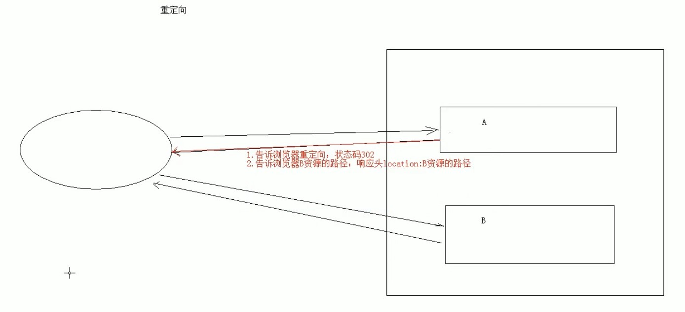

- 原理：设置状态码和 location 路径
- 将上面的原理封装：`resp.setRedirect("/Demo/ServletDemo")`
- 例：

  ```java
  @webServlet("/response1")
  public class LoginServlet extends HttpServlet {
    @Override
    protected void doGet(HttpServletRequest req, HttpServletResponse resp) throws ServletException, IOException {
        this.doPost(req, resp);
    }

    @Override
    protected void doPost(HttpServletRequest req, HttpServletResponse resp) throws ServletException, IOException {
        System.out.println("response1");
        //设置状态码为302
        resp.setStatus(302);
        //设置响应头location:
        resp.setHeader(location,"/Demo1/response2")

        //简单：
        //resp.setRedirect("/Demo1/response2");
    }
  }
  ```

### 11.13.3. 重定向和转发对比

> **面试重要题目**

- 重定向（redirect）特点：
  - 地址栏发生变化
  - 可以访问其他站点服务器资源。也就是可以：`resp.setRedirect("https://www.baidu.com")`
  - 转发是两次请求。不能使用 request 域共享数据
- 转发（forward）特点：
  - 转发地址栏路径不变
  - 转发之访问当前服务器下资源
  - 转发是一次请求，可以使用request域共享数据

> 当需要传递数据时可以使用转发，不需要时使用重定向。
> 之后还会有很多域对象

### 11.13.4. 案例解析

#### 11.13.4.1. 完成重定向

#### 11.13.4.2. 服务器输出字符数据到浏览器

- 获取的 Print 输出流不需要刷新！！

  - 原因：Print 流是通过 response 获取的，在响应完成之后 response 就会自动被销毁，流也会自动关闭并刷新，用 write 就行。

- 输出中文数据

  - 原因：编码解码所用字符集不同

    > new 的 response 对象对应字符编码是本地默认字符编码
    > tomcat 用 ISO-8859-1 编码编写，获取的 response 也是该编码

    - 解决原理(在获取流之前)：

      1.  设置响应编码：`resp.setCharacterEncoding("utf-8")`

          > 但因为下面那一个操作中包含 1 操作，所以该行代码也可以不写

      2.  设置响应消息头中的编码`resp.setHeader("content-type","text/html;charset=utf-8")`

    - 简单形式解决：`resp.setContextType("text/html;charset=utf-8")`

#### 11.13.4.3. 服务器数据字节数据到浏览器

```java
protected void doPost(HttpServletRequest request, HttpServletResponse response) throws ServletException, IOException {
      //获取字节输出流。
      //因为是自己创建，因此这里是操作系统默认的GBK编码
      ServletOutputStream print = response.getOutputStream();
      //输出数据。一般用来输出图片等。而不是纯文本
      print.write("你好".getBytes(StandardCharsets.UTF_8));
  }
```

#### 11.13.4.4. 验证码

> 这里只是简单地做个演示
> 实际上以后验证码不需要自己实现，**从网上找找比较美观的就行**

##### 11.13.4.4.1. 主要代码

```java
@WebServlet("/checkCode")
public class CheckCodeServlet extends HttpServlet {
    @Override
    protected void doGet(HttpServletRequest req, HttpServletResponse resp) throws ServletException, IOException {
        this.doPost(req, resp);
    }

    @Override
    protected void doPost(HttpServletRequest req, HttpServletResponse resp) throws ServletException, IOException {
        int height = 50;
        int width = 100;
        //1,创建一对象，在内存中画图片
        BufferedImage img = new BufferedImage(width, height, BufferedImage.TYPE_INT_RGB);
        //2.模糊图片
        //2.1填充背景色
        //获取画笔对象
        Graphics gra = img.getGraphics();
        gra.setColor(Color.PINK);
        gra.fillRect(0, 0, width, height);
        //2.2 画边框
        gra.setColor(Color.BLUE);
        //这个是画边框，默认1像素宽度
        gra.drawRect(0, 0, width - 1, height - 1);
        //2.3写验证码
        String str = "ABCDEFGHIGKLMNOPQRSTUVWXYZ0123456789";
        Random ran = new Random();
        int index = 0;
        for (int i = 0; i < 4; i++) {
            index = ran.nextInt(str.length());
            gra.drawString(str.charAt(index) + "", width/5*(i+1), height/2);
        }
        //2.4 画干扰线
        gra.setColor(Color.GREEN);

        for (int i=0;i<10;i++) {
            gra.drawLine(ran.nextInt(width),ran.nextInt(height),ran.nextInt(width),ran.nextInt(height));
        }

        //3. 将图片输出到页面展示
        ImageIO.write(img, "jpg", resp.getOutputStream());

    }
}

```

##### 11.13.4.4.2. 点击刷新的实现

```html
<!DOCTYPE html>
<html lang="en">
  <head>
    <meta charset="UTF-8" />
    <title>checkCode</title>
    <script>
      window.onload = function () {
        var img = document.getElementById("checkCode")
        img.onclick = function () {
          //加时间戳
          var date = new Date().getTime()
          img.src = "/Demo_war_exploded/checkCode?" + date //请求参数无意义，同时因为url不同了，可以重新访问服务器获取，而不是从本地缓存中拿
        }
      }
    </script>
  </head>
  <body>
    
  </body>
</html>
```

## 11.14. 跳转与转发代码执行时机

> 例：

```java
//重定向前循环sleep五秒
for (int i = 0; i < 5; i++) {
    System.out.println("before redirect:" + i);
    try {
        Thread.sleep(1000);
    } catch (InterruptedException e) {
        e.printStackTrace();
    }
}

//重定向
response.sendRedirect("result.jsp");

//重定向后循环sleep五秒
for (int i = 0; i < 5; i++) {
    System.out.println("after redirect:" + i);
    try {
        Thread.sleep(1000);
    } catch (InterruptedException e) {
        e.printStackTrace();
    }
}
```

- Servlet 中,重定向之后的代码是否会继续执行? 重定向是在所有代码执行完毕后跳转,还是执行到重定向代码时立即跳转?
  - 重定向之后的代码会继续执行
  - 当前程序所有代码执行完毕后,才会执行重定向跳转
  - 但重定向之后,加上 return,可让之后的代码不再执行
- 与重定向一样,转发之后的代码也会执行,所有代码执行完毕才跳转
- jsp 的本质就是 Servlet,所以 jsp 页面执行转发或者重定向,以上结论同样适用


## 11.15. ServletContext

### 11.15.1. 基本

- 概念：代表整个 web 应用，可以和 Servlet 程序的容器（tomcat）进行通信
- 创建时间:服务器启动时被创建
- 获取：
  - 方式（获取到的对象是同一个，地址也相等）：
    - 通过 request 对象获取：`requ.getServletContext()`
    - 通过 HttpServlet 获取：`this.getServletContext()` //继承了 HttpServlet

### 11.15.2. 功能

#### 11.15.2.1. 获取 MIME 类型

- MIME：

  - 概念：在互联网通信过程中定义的一种文件数据类型，
  - 格式：大类型/小类型 如：text/html image/jpg 响应中 content-type 的值
  - 获取：String getMimeType(String file) 参数如//a.jpg

    - 原理：通过扩展名对应 MIME 类型。具体映射关系在 tomcat 服务器下的 web.xml 文件中

      > 项目配置文件中所有其他 web.xml 的爹

- 演示：

  ```java
   String mimeType = req.getServletContext().getMimeType("a.jpg");
  ```

#### 11.15.2.2. ServletContext 域对象

- 方法：
  - setAttribute(String name,Object value)
  - getAttribute(String name)
  - removeAttribute(String name)
- 范围：
  - 可以共享所有用户的数据。
    - 比如不存在转发关系的 Servlet 之间也可以通过 Context 进行传递数据
    - 作用域很大并且并且生命周期很长
    - 因此使用很谨慎

#### 11.15.2.3. 获取文件的真实（服务器）路径

- 原因：
  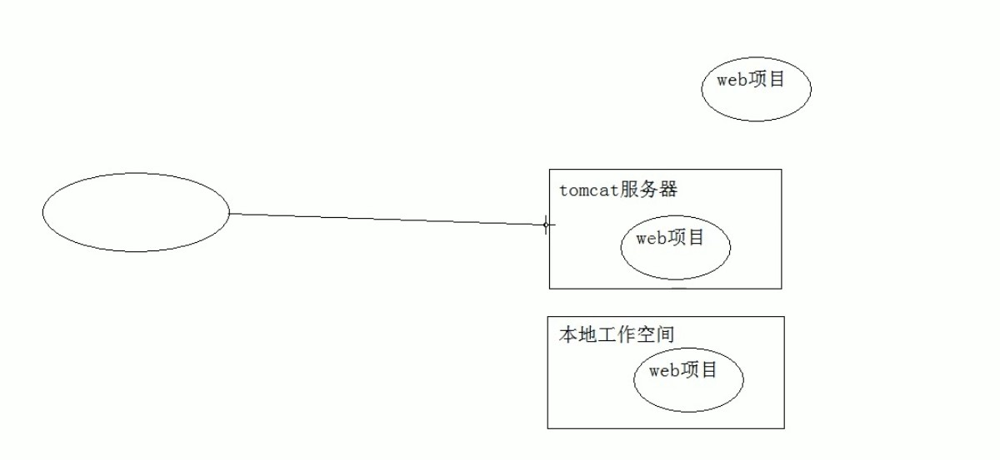

  > 将来会将项目部署在远程服务器上，根本没有工作空间这一说

> 重要

- 方法：

  - String getRealPath(String path)
  - 注意：
    - **如果是 WEB-INF 下的文件，要写"/WEB-INF/a.txt"** //（web 为默认根路径）
    - **如果是 src 目录下的文件，要写"/WEB-INF/classes/b.txt"** //编译到了这里
      > 路径写法要注意 ，具体的话看看工程目录里的 out 目录下的项目文件就行了
      > 如果只是获取 src 下文件的话可以使用 ClassLoader

- 例:getRealPath("a.txt")
  > 在本地工作空间部署的某个项目，当前获取的目录为：D:\learn\IdeaProject\note\out\artifacts\Demo_war_exploded\a.txt
  > 

## 11.16. 客户端下载文件案例

### 11.16.1. 需求：

- 页面显示超链接
- 点击超链接后弹出下载页面
- 完成图片文件下载

### 11.16.2. 分析

- 超链接指向的资源如果能被浏览器解析，就会在浏览器中展示，比如图片，如果不能解析，则弹出下载提示框。
- 需求：任何资源都必须弹出下载提示框
- 使用响应头设置资源打开方式为附件
  - content-disposition:attachment;filename=xxx

### 11.16.3. 步骤：

- 定义页面，编辑超链接 href 属性，指向 servlet，并传递资源名称作为参数
- 定义 servlet
  - 获取文件名称
  - 使用字节输入流加载文件进内存
    - 获取真实路径
  - 指定 response 的响应头：content-disposition:attachment;filename=xxx
  - 将数据写到 response 输出流

### 11.16.4. 中文文件名展示问题

- 描述：不同浏览器现实的中文名称都会乱码，并且乱码内容不同
- 解决：
  - 获取客户端使用的浏览器版本信息
  - 根据不同版本信息，设置 filename 的不同编码方式

> 因为新版 jdk 中没有 sun.misc.BASE64Encoder，所以 util 文件暂时无法使用，解决方式待定

# 12. Servlet 会话技术

## 12.1. 基本概念

- 会话：一次会话中包含多次请求和响应

  - 一次会话：浏览器第一次给服务器资源发送请求，会话建立，直到有一方断开为止
    > cookie 和会话关系不太大。
    > 一次会话的时间段，就是浏览器和 session 一一对应没有失效的时间段。
    >
    > 具体看后面

- 目的：在一次会话的范围内的多次请求间共享数据

  > http 协议是无状态的，每对请求与响应之间要通过会话技术进行交流

- 分类：

  - 客户端会话技术：cookie
  - 服务器端会话技术：session

- 设计这方面编程时，要一个请求一个响应得想

## 12.2. cookie

### 12.2.1. 概念：将数据保存在客户端的会话技术

### 12.2.2. 快速入门：

- 流程示例

  - 客户端请求服务端创建 cookie 对象，绑定数据

    - Cookie(String name, String value)

      > cookie 内部就是通过 map 的方式存储的

  - 服务端发送给客户端创建的 cookie 对象

    > 添加了 cookie 后以后每次请求中都会带有 cookie

    - resp.addCookie(Cookie cookie)
      > 注意，因为要将 cookie 写到客户端
      > 所以要使用重定向或其他（比如 getWriter().write,但要注意存储转发时的 cookie 更新时机），返回客户端存储一下 cookie

  - 服务端获取客户端发送的 cookie。

    - Cookie[] req.getCookies();

> 流程示例图示：
> 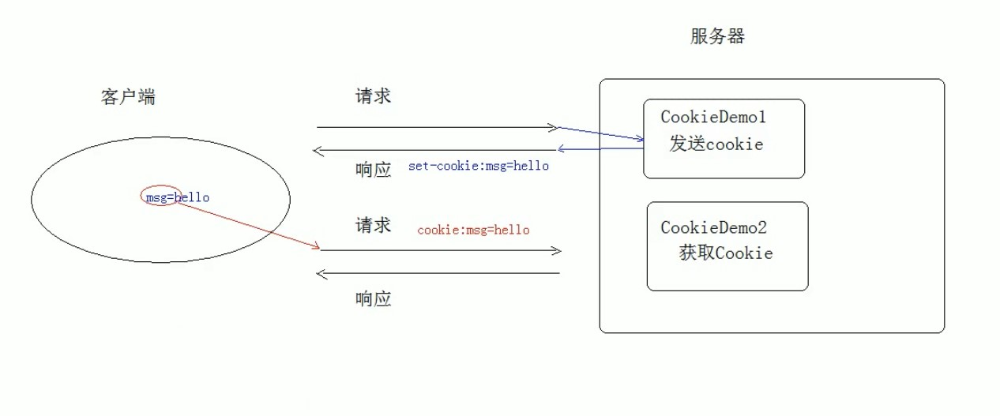

### 12.2.3. 实现原理

> **每次请求响应的具体过程** > 
>
> set-cookie 为响应头；cookie 为请求头
> 本地浏览器会把 cookie 保存下来
> 具体可以自己抓包试试

### 12.2.4. cookie 细节

- 一次可不可以发送多个 cookie
  - 可以
  - 创建多个 cookie 使用 resp.addCookie(String,String)添加
  - 注意：若 name 和路径都相同的话，值会覆盖。不同路径（比如一个服务器不同项目）的话，name 相同也没问题
    > 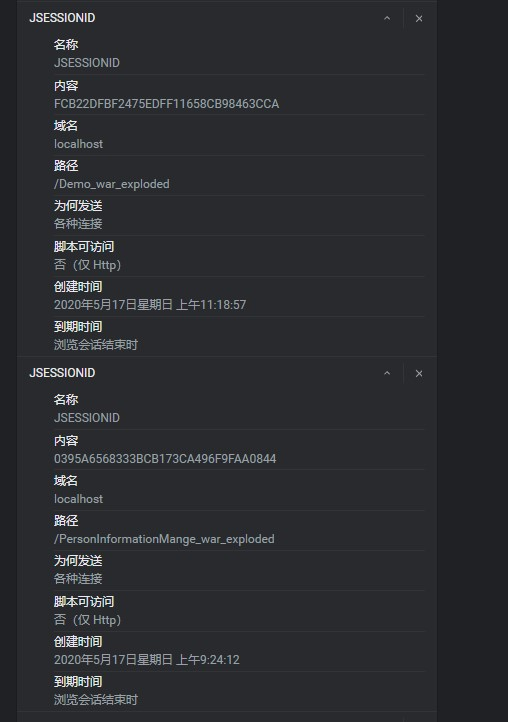
- cookie 在浏览器中能保存多少时间(生命周期)
  - 默认情况下，cookie 存在于浏览器内存中，浏览器关闭后，coolie 被销毁。浏览器开启时，会一直保存
  - 设置 cookie 声明周期，可以持久化存储
    - `cookie.setMaxAge(int seconds)`
      - 参数为正：持久化存储，将 cookie 数据写入硬盘的文件中。数值代表 cookie 存储时间（单位为秒），到时间后会自动删除
      - 参数为负：默认情况，cookie 仅存储在浏览器内存中
      - 参数为 0：**删除** cookie 信息
- cookie 是否能存中文
  - tomcat8 之前，cookie 中不能直接存储中文数据
    - 需要将中文数据转码，一般采用 url 编码，然后再转回来
  - tomcat8 之后，可以存储中文数据。但特殊字符还是不支持（比如空格），建议使用 url 编码存储，使用 url 解码解析
- cookie 能否共享

  - 假设在一个 tomcat 服务器中部署了多个 web 项目，那么这些 web 项目间 cookie 能否共享？
    - 默认情况下，不能共享
    - `cookie.setPath(String path)`:设置 cookie 的获取范围。默认情况下会设置当前的虚拟目录 "/Demo"
    - 设置成 "/" ，就是将范围设置为整个 tomcat 服务器，不同项目间可以共享
    - 也可以将范围设小
  - 不同的 tomcat 服务器间 cookie 共享问题
    - 可以调用 cookie.setDomain(String path)：如果设置一级域名相同，那么多个服务器间 cookie 可以共享
      > www.tieba.baidu.com 一级域名：baidu.com 二级域名：tieba
      > 如果设置 setDomain(".baidu.com") 那么 tieba.baidu.com 和 news.baidu.com 中 cookie 可以共享

- 注意：cookie.setValue()后，尽管 cookie 已经添加，依旧需要 response.addcookie(cookie)来放到响应头中，更新客户端的 cookie。
  - 因为如果不放的话 cookie 就发送不到客户端
  - request 只是将 cookie 从客户端带到服务端
  - 想要更新客户端的话需要将数据从服务端通过 response 带到客户端

### 12.2.5. uri 解码编码

- 使用：URLEncoder 对象中的静态方法

- 例：

```java

/**
 * @author liyu
 */
@WebServlet("/CookieServletDemo")
public class CookieServletDemo extends HttpServlet {

    @Override
    protected void doPost(HttpServletRequest request, HttpServletResponse response) throws ServletException, IOException {
        Cookie[] cookies = request.getCookies();
        response.setContentType("text/html;charset=utf-8");
        //记录是否有登录时间的cookie
        boolean flag=false;

        if (cookies!=null&&cookies.length>0) {
            for (Cookie cookie : cookies) {
                if("lastTime".equals(cookie.getName())){
                    flag=true;
                    //获取上次登录时间（编码后的数据）
                    String strDate = cookie.getValue();
                    //url解码
                    strDate= URLDecoder.decode(strDate, StandardCharsets.UTF_8);
                    //页面展示
                    response.getWriter().write("<h1>您好，您上次访问时间为："+strDate+"</h1>");

                    //更新cookie

                    Date date = new Date();
                    SimpleDateFormat sdf = new SimpleDateFormat();
                    sdf.applyPattern("yyyy年MM月dd日 HH:mm:ss");
                    //获取日期字符串
                    String fdate = sdf.format(date);
                    //对字符串进行编码
                    fdate = URLEncoder.encode(fdate, StandardCharsets.UTF_8);
                    //更新cookie值
                    cookie.setValue(fdate);
                    //注意：设置值后必须重新添加来更新
                    response.addCookie(cookie);
                    break;
                }
            }
        }
        if(!flag){
            //添加cookie
            Date date = new Date();
            SimpleDateFormat sdf = new SimpleDateFormat();
            sdf.applyPattern("yyyy年MM月dd日 HH:mm:ss");
            String fdate = sdf.format(date);
            //进行编码
            fdate = URLEncoder.encode(fdate, StandardCharsets.UTF_8);
            Cookie cookie = new Cookie("lastTime",fdate);
            cookie.setMaxAge(60*60*24*30);
            response.addCookie(cookie);

            //展示页面。同时也会将新的cookie值给客户端进行更新
            response.getWriter().write("<h1>您好，欢迎您首次访问</h1>");

        }
    }

    @Override
    protected void doGet(HttpServletRequest request, HttpServletResponse response) throws ServletException, IOException {
        this.doPost(request, response);
    }
}

```

### 12.2.6. cookie 的特点

1. cookie 存储数据在客户端

   - 客户端 cookie 数据容易丢失和篡改

2. 大小有限制：

   - 浏览器对于单个 cookie 的大小有限制（4kb 左右）
   - 对同一个域名下 cookie 的数量也有限制（20 个左右）
   - 一个浏览器存放 cookie 数量也有限制（300 个左右）

   > 不同浏览器可能不同

3. cookie 只能存储字符串

- 作用：

  - cookie 一般用于存储少量的不太敏感重要的数据
  - 在不登录的情况下完成服务器对客户端的身份识别

  > 比如百度搜索页面关闭搜索提示框，就算不登录也可以记录设置选项

- 局限性：
  > Cookie 的缺点主要集中在其安全性和隐私保护上，主要包括以下几种：
  - Cookie 可能被禁用，当用户非常注重个人隐私保护时，很可能会禁用浏览器的 Cookie 功能；
  - Cookie 可能被删除，因为每个 Cookie 都是硬盘上的一个文件，因此很有可能被用户删除；
  - Cookie 的大小和个数受限，不同浏览器有所区别，基本上单个 Cookie 保存的数据不能超过 4095 个字节，50 个/每个域名；
  - Cookie 安全性不够高，所有的 Cookie 都是以纯文本的形式记录于文件中，因此如果要保存用户名密码等信息时，最好事先经过加密处理。

### 12.2.7. url重写

> 在禁用cookie时使用该方式传递session的id信息。不过现在基本上不会禁用cookie，用的也很少了

- ` response.sendRedirect(response.encodeURL("GetSessionServlet")) `
  > 在url上拼接response中设置的cookie信息，重定向到GetSessionServlet时会携带cookie信息
- sendRedirect实现原理，为何时get方式，能否通过Filter改为post方式

- `	encodeRedirectURL(String url)`非通用，记住上面那个就行了


## 12.3. cookie 案例

- 记住上一次访问时间
  - 访问一个 Servlet，如果是第一次访问，则提示：你好，欢迎访问
  - 如果不是，则提示：欢迎回来，你上一次访问时间是：XXXXX
- 图解：
  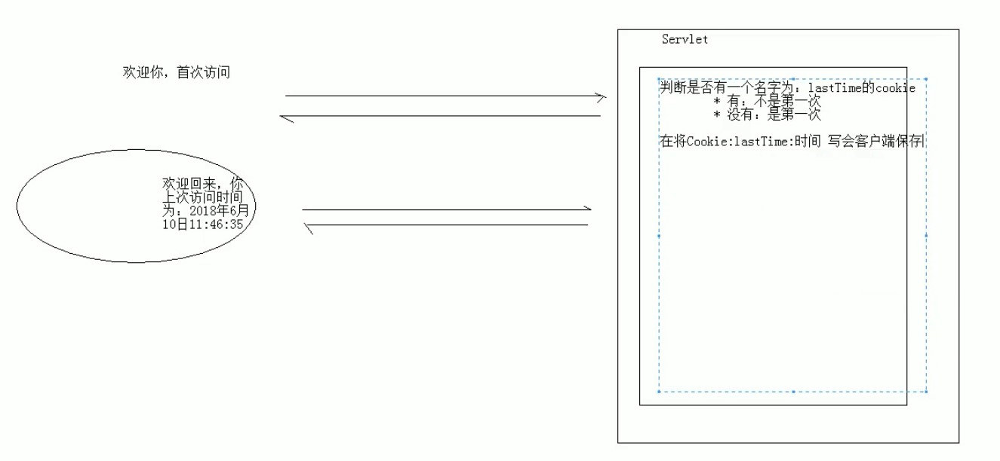
- 分析：

  - 使用 cookie 来完成
  - 通过 Servlet 来判断是否有 lastname 的 cookie

    - 有：不是第一次访问

      - 响应数据
      - 写回 cookie，更新(键相同会进行覆盖)

        > 不用 addCookie()写回的话不会更新

    - 没有：是第一次访问
      - 响应数据
      - 写回 cookie，添加

## 12.4. session

### 12.4.1. 概念：

- 服务器端会话技术，在**一次会话**的多次请求间共享数据，不需要请求转发，将数据保存在服务端的对象 HttpSession 中
  > 在浏览器不关闭（JSESSIONID 不失效）以及 session 失效之前，所有的请求和响应属于一次会话

### 12.4.2. ※原理※：

- session 也是一个域对象（HttpServletRequest，ServletContext）。session 的实现是依赖于 cookie 的

  > 单个客户端流程：
  > 
  > 多个客户端流程：
  > 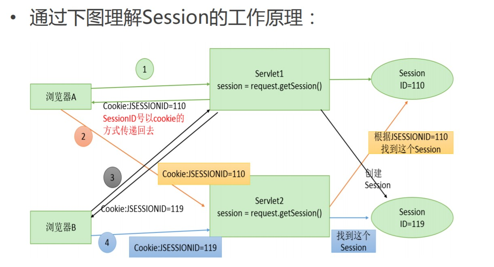

### 12.4.3. 快速入门

- 获取 session：request.getSession();
  - 重载：getSession(boolean)
    > 获取与客户端请求关联的当前的有效的 Session，若没有 Session 关联，当参数为真时，Session 被新建，为假时，返回空值
    - true:即默认
    - false:没有对应 session，不会自动创建，返回 null
      > **常用来判断是否过期**
- 设置共享数据：session.setAttribute()
- 在其他 servlet 中：request.getSeesion().getAttribute()
- 其他方法：
  - 设置 HttpSession 对象失效，同时也会解绑：void invalidate()
  - 设置非活动失效时间（单位为秒）：void setMaxInactiveInterval(int interval)
  - 获取非活动失效时间：int getMaxInactiveInterval()
  - 获取 HttpSession 对象标识 sessionid：String getId()
  - 获取 HttpSession 对象产生的时间，单位是毫秒：long getCreationTime()
  - 获取用户最后通过这个 HttpSession 对象送出请求的时间：long getLastAccessedTime()

### 12.4.4. session 细节

1. 当客户端关闭后，服务器不关闭，两次获取 session 是否为同一个

   - 默认情况下不是
   - 如果想要相同：添加一个键为 JSESSIONID 的 cookie 保存 seesion 的 id（也就是覆盖客户端 cookie）,然后设置存活时间。

     > 

2. 客户端不关闭，服务器关闭后，两次获取的 session 是否为同一个
   - 不是同一个，分配的 id 基本不可能相同。但很多情况下要确保数据不丢失（比如购物车，服务器重启后也不能变）
   - session 的钝化和活化：
     > tomcat 已经帮助完成了。tomcat 在服务器正常关闭时会将 session 对象序列化到 tomcat 服务器的 work 目录下。再此开启后会读取该文件并自动删除
     > 也就是说只要添加 cookie 保存 session 的 id 就可以使即使服务器和客户端哪方关也都可以保留数据以及映射
     > **注意：只有部署在 tomcat 服务器中才可以，部署在 idea 中的话可以钝化但活化无法成功**
     > 原因是 idea 会在服务器启动时，将配置文件夹里的 work 目录删掉，再重新创建一个 work 目录，其中的 session 文件已经被删除了
     - 钝化：在服务器关闭之前，将 session 序列化到硬盘上
     - 活化：在服务器关闭后，将 session 序列化文件转化到内存中
3. seesion 什么时候销毁

   1. 服务器关闭
   2. session 对象调用 invalidate();
   3. session 默认非活动时间后失效：30 分
    > 范围越小优先级越高
    - tomcat 服务器中 web.xml 中可以配置（分为单位）
      - 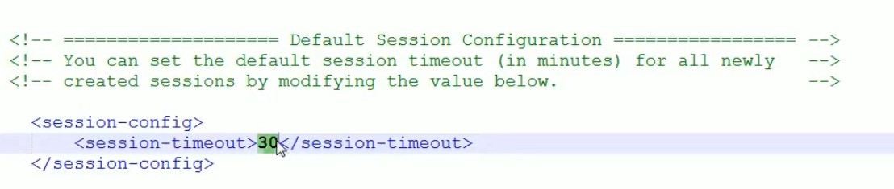
    - 项目中如果有web.xml也可以配置（分为单位）
    - setMaxInactiveInterval(int interval)（秒为单位）

4. 特点：

   1. session 用于存储一次会话的多次请求的数据，存在于服务端
   2. session 可以存储任意类型，任意大小的数据
   3. session 可以存中文。

- session 与 cookie 区别：
  - session 存储数据在服务器端，而 cookie 在客户端
  - session 没有大小限制，cookie 有
  - seesion 较安全，cookie 相对不太安全

## 12.5. session 案例

- 需求分析：

  - 访问带有验证码的登录页面 login.jsp
  - 用户输入用户名，密码以及验证码。
    - 如果用户名和密码输入有误，跳转登录页面，提示：用户名或密码错误
    - 如果验证码输入有误，跳转登录页面，提示：验证码错误
    - 如果全部输入正确，则跳转到主页 success.jsp,显示：用户名，欢迎您

- 分析：

  > 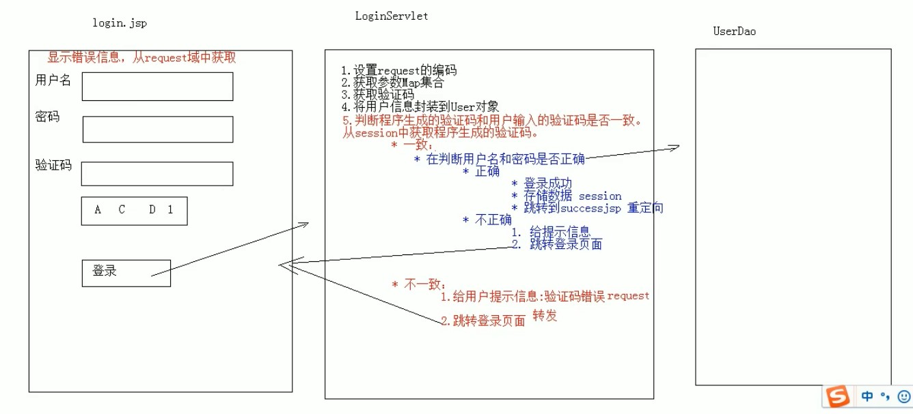

# 13. jsp

## 13.1. ※注意※

- jsp早已不受待见。这个看看就行。
  > 推荐开发架构：<br>
  > 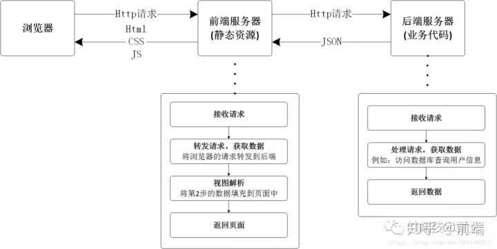

## 13.2. 基础

- 概念：java server pages:java 服务器端页面

  - 可以理解为一个特殊的页面，既可以定义 html 标签，也可以定义 java 代码
  - 用于简化书写

    > 比如之前 上次访问时间 那是动态生成的，将那句话插入 html 页面，就需要 jsp 技术来简化编写
- 组成元素：
  - 种类：
    - jsp脚本
    - jsp指令
    - jsp动作（基本不再使用，使用el表达式替代）
    - jsp注释
    - 内置对象
    - 静态内容（html标签）
  - 图解：
    > 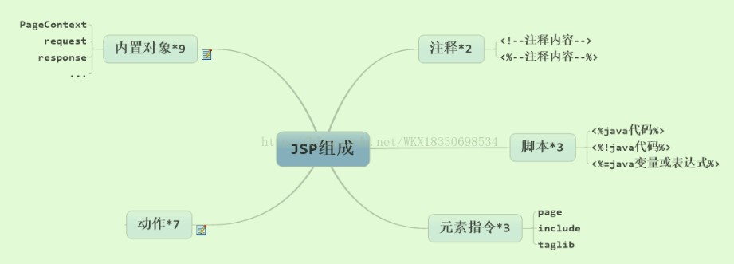


- 原理：

  - 图例：

    > 

  - 分析：

    - jsp 本质上就是一个 servlet
    - 在访问 jsp 时，项目配置文件夹下会产生一个 work 文件夹，用来存放临时生成文件，里面存放着 java 和 class 文件
      > 自己手动找找去
      - 其中 java 文件继承了 HttpJspBase 类（tomcat 服务器源码中），而 HttpJspBase 继承的 HttpServelt 类
      - 同时该 java 文件会将 html 标签通过输出流输出到客户端
    - 第一次访问时会翻译为java文件，然后再编译为class文件。
    - 之后访问时会直接使用class文件


- jsp 脚本

  - 概念：jsp 来定义 java 代码的方式
  - 种类：

    1. <% %>

       > 里面的代码在 **service 方法**中，service 方法中可以定义什么，该脚本就可以定义什么。
       > **注意**：java代码可以在不同<% %>中定义，就算一个大括号被分开，也没关系。所有<% %>为一个整体
      - 代码截断示例：
        ```jsp
        <%
            if ("abc".equals(user.getName())) {
        %>
        <%="您好" + user.getName()%>
        <%
        } else {
        %>
        <%="错误"%>
        <%
            }
        %>
        <!-- 翻译为： -->
        ```
        ```java
         if ("abc".equals(user.getName())) {
            out.write("/n")
            out.write("您好"+user.getName)
            out.write("/n")
         }else{
            out.write("/n")
            out.write("错误")
         }
        ```
        ```jsp
        <!-- 示例2： -->
        <%
        List<User> list = (List<User>) session.getAttribute("allUsers");
        for (int i = 0; i < list.size(); i++) {
        %>
        <tr>
            <td>
                <%=i+1%>
            </td>
            <td>
                <%=list.get(i).getUsername()%>
            </td>
            <td>
                <%=list.get(i).getTel()%>
            </td>
            <td>
                <a href="FindUserServlet?id=<%=list.get(i).getUserid()%>">修改</a>
                <a href="SelectUserServlet?id=<%=list.get(i).getUserid()%>">查看</a>
                <a href="DeleteUserServlet?id=<%=list.get(i).getUserid()%>">删除</a>
            </td>
        </tr>
        <%
            }
        %>
        ```
    2. <%! %>
       > 定义的代码在转换类中的成员位置，可以定义成员变量，方法，静态代码块等
       > 用的非常少，Servlet，jsp 中尽量不要定义成员变量，这样可能会引发一些线程安全问题（共同访问，修改时访问等）
    3. <%= %>
       > 相当于输出语句，定义的 java 代码会输出到页面上，System.out.print()中可以定义什么该脚本就可以定义什么。
       > 该脚本转换到 java 代码中的话位于 service 方法中，使用内置对象 out 进行输出
       > <% int i=3 %> <%= i %>。
       > 在标签中也可以这样用`<a href="findServlet?id=<%=user.id%> 修改 </a>" >`

- jsp 内置对象
  > 不需要获取和创建，可以直接使用的对象
  > 一共有 9 个，这里写三个
  - request
  - response
  - out:可以将数据输出到页面上，字符输出流，和 response.getWriter()类似
    - 区别：out 定义在哪个位置就在哪个位置输出，而 response.getWriter()定义在哪个位置都会在 out 之前输出
      > 原因：
      > 建议统一使用 out

## 13.3. 改进 cookie 案例

- 将 doPost 中的代码复制一下就行了

  > 截断：在代码中添加%> <% 来截断的代码，中间插入 html 标签。就算把大括号分割开也没问题，一个小技巧

- 但其实并不推荐，阅读性太差，展示和代码流程控制糅杂到一起了，这里只是试试

## 13.4. 指令，注释，内置对象

- jsp 指令

  - 作用：用于配置 jsp 页面，导入资源文件
  - 格式：<%@ 指令名称 属性名 1="属性值 1" 属性名 2="属性值 2" .....%>
  - 分类：

    - page:配置 jsp 页面

      - 常见属性：

        - contentType:等同于 secContentType()
          - 设置响应体的 memi 类型以及字符集
          - idea 等 IDE 中还可以自动设置当前本地 jsp 文件的编码
        - pageEncoding:在低级工具（比如记事本）中，可以通过该属性设置当前页面字符集
        - language:jsp 本来是打算兼容多种语言，但是现在只有 java。虽说如此，也要写上
        - buffer:out 缓冲区大小，默认 8kb
        - import:导入 java 的包，通常在 ide 里面自动完成即可。一个包一行

          > `<%@ page import="java.util.ArrayList"%>`

        - errorPage：错误页面，当前页面发生异常后（不管 isErrorPage 的值），会自动跳转到指定的错误页面
        - isErrorPage:标识当前页面是否是错误页面。
          - 默认是 false，不可以使用 exception
          - 当标注为 true 时，可以使用 exception 对象，用来抓异常，从哪跳转来的抓哪的，通常会写入日志文件。检查 bug 时很有用

    - include：导入页面资源文件，将其他页面导入到指定 jsp 中。
      > 为静态包含。比如用来重用动态的页眉，顶部菜单，或者导入资源文件和定义变量等。会在翻译阶段进行引入。会合并翻译生成一个java文件
      > 
      > jsp动作元素`<jsp:include page="a.jsp"></jsp:include>` 为动态包含，会生成两个java文件。
      >静态包含在两个文件中不允许有相同的变量，而动态包含允许。
      > 动态包含发生在：执行class文件阶段，动态加入
      > 
      > 两者使用都较少。
      > `<%@ incllue file="foot.jsp" %>`
    - taglib：导入资源
      > 一般用来导入标签库（比如后面的 JSTL）
      - `<%@ taglib prefix="c" uri="http://java.sun.com/jsp/jstl/core" %>`
        - perfix:前缀，自定义。jstl 一般默认定义为 c
        - uri:标签库具体位置

  - 例：

    > 

- jsp 注释：
  > 脚本中就是java代码，用java注释。而且生成的页面中注释不会被看见
  - html 注释：\<!-- 注释内容 -->
    - 只能注释 html 代码片段。
    - 客户端网页源代码中可以看见
  - jsp 特有：<%-- 注释内容 --%> ，推荐使用
    - 可以注释所有
    - 客户端网页源代码中没有注释部分内容
- jsp 全部内置对象

  > 变量名---类型---作用
  > 必须背下来
  > 一共有 9 个

  - 四个域对象

    - pageContext ····PageContext····当前页面共享数据。以及它的一些方法可以获取其他 8 个内置对象
      > 使用jsp动作元素时可能会用
    - request ····HttpServletRequest····一次请求访问的多个资源（通过转发来共享）
    - session ····HttpSession····一个会话的多个请求间
    - application ····ServletContext ····所有用户间共享数据

      > 域最大，唯一对象，服务器开启被创建，服务器关闭被销毁。可以再看看 12.14.ServletContext

  - 其他

    - response ····HttpServletResponse····响应对象
    - page ····Object····当前页面（Servlet）对象。源代码中就是将 this 赋值给 page
    - out ····JspWriter····输出对象，可以把数据输出到页面上
    - config ····ServletConfig····Servlet 配置对象

      > 暂时不讲

    - exception ····Throwable····异常对象。声明 isErrorPage 为 true 时才会有这个对象

## 13.5. jsp动作元素

> 基本上不用了。感兴趣可以去查资料

## 13.6. MVC 开发模式

- jsp 演变历史

  - 早期只有 servlet，只能使用 response 输出标签，非常麻烦
  - 后来就有了 jsp，简化了 servlet 的开发。
  - 但过度使用 jsp，java 中出现大量 java 代码，会导致难以分工，难于维护
  - 然后 javaweb 开发借鉴了 mvc 开发模式使得程序的设计更加合理

- MVC

  - model 模型--JavaBean
    - 完成具体的业务操作，如查询数据库，封装对象
  - view 视图--JSP
    - 展示数据
  - controller 控制器--Servlet
    - 获取用户输入/参数
    - 调用模型
    - 将模型返回数据交给视图展示

- 图解：

  > 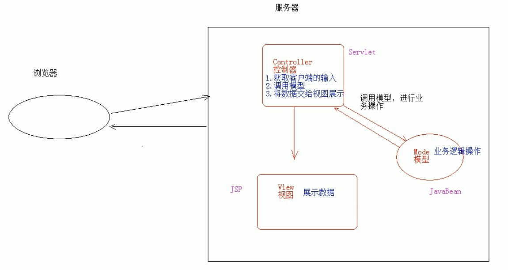

- 优缺点
  > 更多的查百科
  - 优点
    - 耦合性低，利于分工协作
    - 重用性高
  - 缺点
    - 使得项目架构变得复杂，对开发人员要求较高

> 因此，为了替换 jsp 中的 java 代码，可以使用 EL 表达式以及 JSTL 标签

## 13.7. EL 表达式

### 13.7.1. 基础

- 概念：Experssion Language:表达式语言
- 作用：替换和简化 jsp 页面中 java 页面的编写。**在标签的引号内部以及 javascript 中仍然可以使用**
- 语法：`${表达式}`
- 注意：
  - jsp 默认支持 el 表达式
  - 忽略 el 表达式方法：
    - 忽略所有：jsp 的 page 指令下 isELIgnored 可以设置是否忽略 EL 表达式
    - 忽略单个：加一个反斜线`\${}`。（转义字符）

### 13.7.2. 基本使用


- 运算
  - 运算符：
    - 算术运算符：+ - \* /(div) %(mod)
    - 比较运算符：> < == >= <= !=
    - 逻辑运算符：&&(and) ||(or) !(not)
    - **空运算符**：empty
      - 用于判断字符串，集合，数组对象是否为 null，以及长度是否为 0
      - `${empty list}`
      - `${not empty str}` 当不为 null 和空时才返回 true
- 获取值

  > el 表达式只能从域对象中获取值

  - 语法:

    - 通用：

      - \${域名称.键名}：从指定域中获取指定键的值
        - 域名称
          > el 中域名称及对应 jsp 内置对象。**注意：**el中的域对象只能使用getAttribute方法，而jsp内置对象就是普通对象
          - pageScope-->pageContext
          - requestScope-->request
          - sessionScope-->session
          - applicationScope-->application(ServletContext)
        - 例：
          > <%= request.getAttribute("checkcodeError") == null ? "" : request.getAttribute("checkcodeError") %>
          > 等价于：
          > \${requestScope.checkcodeError}
      - \${键名}：表示一次从最小的域中查找是否有该键对应的值，直到找到为止

        > 会依序从 Page、Request、Session、Application 范围查找。

    - 获取对象，list，map 集合的值

      - 对象：通过对象的属性来获取
        > 属性(property)：getter,setter 去掉 get，set 再将首字母变小写（同 javaBean）
        > 本质上会调用 getter，setter 方法
        - 例：`requestScope.user.name`
        - 假如想要获得特定格式的 Date，可以在 user 类中，添加 getDateStr()方法，用来返回特定格式的日期格式。再通过 dateStr 属性来调用
          > 这种 get 方法并没有对应成员变量，而是单纯为了格式化日期数据
          > 这叫做**逻辑视图**。以后会经常用
      - List：\${域名称.键名称[索引]}
        > 不加中括号和索引的话就会把 list 中的所有值打印出来。如[aaa,bbb]
        - 如果角标越界会返回空字符串，而不会抛出异常
        - 当然，如果 list 中装对象，也可以类似这样：`requestScope.list[0].name`
      - Map：

        - \${域名称.键名.key 名称}
        - \${map["键名称"]}

          > 要用引号引起来，单双都行

      - 例：`requestScope.map.gender`

  - 如果获得不到值，返回空字符串而不是 null

- 其他隐式对象

  > 类似 jsp 的内置对象
  > el 表达式中有 11 个内置对象，包括域对象
  > 

  - pageContext:

    1. 获取 jsp 其他 8 个内置对象
        > jsp 页面中动态获取虚拟目录`${pageContext.request.contextPath}`
        > 比如表单中的 action 属性的值，需要虚拟目录
        > 可以写成：

    ```html
    <form action="${pageContext.request.contextPath}/login.jsp"></form>
    ```

### 13.7.3. el函数


```jsp
使用前在Jsp页面的首部加上以下代码:
<%@ taglib prefix="fn" uri="http://java.sun.com/jsp/jstl/functions" %> 
下面是JSTL中自带的方法列表以及其描述:

函数名 函数说明 使用举例 
fn:contains 判断字符串是否包含另外一个字符串 <c:if test="${fn:contains(name, searchString)}"> 
fn:containsIgnoreCase 判断字符串是否包含另外一个字符串(大小写无关) <c:if test="${fn:containsIgnoreCase(name, searchString)}"> 
fn:endsWith 判断字符串是否以另外字符串结束 <c:if test="${fn:endsWith(filename, ".txt")}"> 
fn:escapeXml 把一些字符转成XML表示，例如 <字符应该转为< ${fn:escapeXml(param:info)} 
fn:indexOf 子字符串在母字符串中出现的位置 ${fn:indexOf(name, "-")} 
fn:join 将数组中的数据联合成一个新字符串，并使用指定字符格开 ${fn:join(array, ";")} 
fn:length 获取字符串的长度，或者数组的大小 ${fn:length(shoppingCart.products)} 
fn:replace 替换字符串中指定的字符 ${fn:replace(text, "-", "•")} 
fn:split 把字符串按照指定字符切分 ${fn:split(customerNames, ";")} 
fn:startsWith 判断字符串是否以某个子串开始 <c:if test="${fn:startsWith(product.id, "100-")}"> 
fn:substring 获取子串 ${fn:substring(zip, 6, -1)} 
fn:substringAfter 获取从某个字符所在位置开始的子串 
${fn:substringAfter(zip, "-")} 
fn:substringBefore 获取从开始到某个字符所在位置的子串 ${fn:substringBefore(zip, "-")} 
fn:toLowerCase 转为小写 ${fn.toLowerCase(product.name)} 
fn:toUpperCase 转为大写字符 ${fn.UpperCase(product.name)} 
fn:trim 去除字符串前后的空格 ${fn.trim(name)}
```

### 13.7.4. 其他要点：

  - **.和[]**

    ```
    []与.运算符
    EL 提供.和[]两种运算符来存取数据。
    两个可以混合使用
    当要存取的属性名称中包含一些特殊字符，如.或?等并非字母或数字的符号，就一定要使用 []。
    例如：
    ${user.My-Name}应当改为${user["My-Name"] }
    如果要动态取值时，就可以用[]来做，而.无法做到动态取值。例如：
    ${sessionScope.user[data]}中data 是一个变量
    ```

  - 禁用 el

    > <%@ page isELIgnored="true"%> 表示是否禁用 EL 语言,TRUE 表示禁止.FALSE 表示不禁止。JSP2.0 中默认的启用 EL 语言.

  - 关于四个域对象

    ```
    它们基本上就和JSP的pageContext、request、session和application一样；
    在EL中，这四个隐含对象只能用来取得范围属性值，即getAttribute(String name)，却不能取得
    其他相关信息。
    ```

  - param 和 paramValues

    ```
    输入有关的隐含对象
    与输入有关的隐含对象有两个：param和paramValues，它们是EL中比较特别的隐含对象。
    例如我们要取得用户的请求参数时，可以利用下列方法：
    request.getParameter(String name)
    request.getParameterValues(String name)
    在EL中则可以使用param和paramValues两者来取得数据。
    ${param.name}
    ${paramValues.name}

    注意：
    	param和paramValues--request.getParameter();
    	requestScope.key-- request.getAttribute("key");
    两者不同，一个是域中的共享数据，一个是请求参数

    不过因为逻辑处理基本都在servlet中做，jsp中基本用不到param
    ```

    ```
    param和paramValues:

    <%--    请求为：http://localhost:8080/Demo/temp.jsp?name=neu20182825&name=zhangsan--%>
    ${param.name}<br><%--这样只会获得第一个name的值--%>
    <%--    ${param.name[0]}<br> 这样会报错，多值时必须按照下面的写--%>
    ${paramValues.name[0]}<br>
    ${paramValues.name[1]}

    ```

  - cookie

    ```
    JSTL并没有提供设定cookie的动作，
    例：要取得cookie中有一个设定名称为userCountry的值，可以使用${cookie.userCountry}来取得它。
    相当于遍历request.getCookies()找到指定cookie的值
    ```

  - header 和 headerValues
    ```
    header 储存用户浏览器和服务端用来沟通的数据
    例：要取得用户浏览器的版本，可以使用${header["User-Agent"]}。
    另外在鲜少机会下，有可能同一标头名称拥有不同的值，此时必须改为使用headerValues 来取得这些值。
    ```
  - initParam
    ```
    initParam取得设定web站点的环境参数(Context)
    例：一般的方法String userid = (String)application.getInitParameter("userid");     （application为jsp中内置对象，类型为ServletContext）
    就相当于上下文参数：servletcontext.getInitParameter(String name)
    可以使用 ${initParam.userid}来取得名称为userid
    ```
  - pageContext 全部作用

    ```
    pageContext

    pageContext取得其他有关用户要求或页面的详细信息。
    ${pageContext.request.queryString}         取得请求的参数字符串
    ${pageContext.request.requestURL}         取得请求的URL，但不包括请求之参数字符串
    ${pageContext.request.contextPath}         服务的web application 的名称(虚拟路径，常用)
    ${pageContext.request.method}           取得HTTP 的方法(GET、POST)
    ${pageContext.request.protocol}         取得使用的协议(HTTP/1.1、HTTP/1.0)
    ${pageContext.request.remoteUser}         取得用户名称
    ${pageContext.request.remoteAddr }         取得用户的IP 地址
    ${pageContext.session.new}             判断session 是否为新的
    ${pageContext.session.id}               取得session 的ID
    ${pageContext.servletContext.serverInfo}   取得主机端的服务信息
    ```

- jsp标准动作:
  ```
  JSP标准动作、EL表达式和JSTL（JSP Standard Tag Library）都是为了实现JSP页面无脚本而提供的技术，使View层和Controller层真正分开。
  Java提供了JSP标准动作来实现在JSP页面中调用JavaBean。
  但是JSP标准动作不是万能的。JSP页面只依靠JSP标准动作是做不到页面无脚本的
  从JSP2.0之后，可以使用EL表达式来处理这样的问题
  jsp标准动作已经很少用了。
  ```


## 13.8. JSTL 标签

- 概念：JavaServer Pages Tag Library：jsp 标准标签库

  - 是由 Apache 组织提供的免费开源的 jsp 标签
  - 用于简化和替换 jsp 页面的 java 代码

- 步骤

  - 导入相关 jar 包
    - javax.servlet.jsp.jstl
    - jstl-impl
  - jsp 中导入标签库：使用 targlib 指令
    - http://java.sun.com/jsp/jstl/core 为高版本的核心标签库，推荐使用
  - 使用标签

- 基础标签
  - `<c:set scope="" var="" value=""></c:set>` 往域中添加数据
    > 也可以`<c:set/>`,进行单标签闭合
    - var“版本”用于设置作用域属性
      >如果“value”为null，“var”指定的属性将被删除！如果“var”指定的属性不存在，则会创建一个属性，但仅当“value”不为null时才会创建新属性。
    - -target“版本”用于设置bean属性或Map值。
      > 如果“target”是一个Map，“property”指定的是该Map的一个键；如果“target”是一个bean，“property”指定的是该bean的一个成员字段。
      ```jsp
      <!-- 
        不能同时有“var”和“target”属性。
        “scope” 是可选的，如果没有使用这个属性，则默认为页面作用域
       -->
      <c:set target="${petMap}" property="dogName" value="Clover" scope="session"/> 
      <!-- 
        如果“target”表达式为null，容器会抛出一个异常。
        如果“target”表达式不是一个Map或bean，容器会抛出一个异常。
        如果“target”表达式是一个bean，但是这个bean没有与“property”匹配的成员字段，容器会抛出一个异常。
       -->
      ```

  - `<c:out value="" default=""></c:out>` 输出，同`<%= %>`
  - `<c:remove var="" scope=""></c:remove> `删除域中数据


- 常用标签

  - if--if

    - test 属性为必须属性，接收 boolean 类型表达式，如果为 true，就显示 if 标签体内容
    - 一般 test 属性会结合 el 表达式一起使用
    - 该标签没有 else，只能再定义一个 if 标签

    ```jsp
    <c:if test="true">
      内容
    </c:if>

    <c:if test="${not empty list}">
      遍历集合
    </c:if>

    <!-- 也可以这样： 但很不常用-->
    <c:if test="true" scope="session" var="name1" value="value1">
    </c:if>
    ```

  - choose--switch

    ```jsp
    <c:choose>                                  <% -- 相当于switch -- %>
      <c:when test="${number==1}">1</c:when>    <% -- 相当于case -- %>
      <c:when test="${number==2}">2</c:when>
      <c:when test="${number==3}">3</c:when>
      <c:when test="${number==4}">4</c:when>
      <c:when test="${number==5}">5</c:when>
      <c:otherwise>0</c:otherwise>              <% -- 相当于default -- %>
    </c:choose>
    ```

  - foreach--for 循环

    - 属性：
      - 重复操作：
        - begin：开始值
        - end：结束值
        - var：临时变量
        - step：步长，每次循环加多少
        - varStatus：循环状态（非必要）
          - count：循环次数
          - index：容器中元素索引，从 0 开始
      - 遍历容器:
        - item：容器对象
        - var：容器中的临时变量
        - varStatus：循环状态（非必要）
          - count：循环次数
          - index：容器中元素索引，从 0 开始

    ```jsp
    <!-- 重复性操作 -->
    <c:forEach begin="1" end="10" var="i" step="1">
      ${i}<br>
    </c:forEach>

    <!-- 循环容器 -->
    <%
      List list=new ArrayList<String>();
      list.add("aaa");
      list.add("bbb");
      list.add("ccc");
      request.setAttribute("list",list);
    %>
    <c:foreach item="${list}" var="str" varStatus="s">
      ${s.count} ${s.index} ${str}<br>
    </c:foreach>
    ```
  - forTokens-字符串迭代
    > 标签用于实现类似java.util.StringTokenizer类的迭代功能，按照指定的分隔符对字符串进行迭代。用得很少
    ```jsp
    <!-- 
    items用于指定将要迭代的字符串；
    delims用于指定一个或多个分隔符；
    var用于将当前迭代的子字符串保存到page域中的属性名称；
    varStatus表示当前被迭代到的对象的状态信息，包括四个属性：index（表示当前迭代成员的索引值）、count（表示当前已迭代成员的数量）、
    first（表示当前迭代到的成员是否为第一个）、last（表示当前迭代到的成员是否为最后一个）；
    begin指定从第begin个子字符串开始进行迭代，begin的索引值从0开始编号；
    end指定迭代到第begin个字符串，begin的索引值从0开始编号；
    step指定迭代的步长，即每次迭代后的迭代因子增量。
     -->
    <c:set var="sourceStr" value="a|b|c|d|e" />
    <c:forTokens var="str" items="${sourceStr}" delims="|" varStatus="status">
      <c:out value="${status.count}"/>.<c:out value="${str}"/>&nbsp;
      <c:if test="${status.last}">
        <p>总共被分为<c:out value="${status.count}"/>段</p>
      </c:if>
    </c:forTokens>
    <!-- 
      结果：
      1.a 2.b 3.c 4.d 5.e
      总共被分为5段
     -->
    ```

## 13.9. 综合案例（用户信息管理）

- 简单功能
  - 登录
  - 列表查询
  - 添加
    > 
  - 删除
    > 
  - 修改
    > 
- 复杂功能
  - 删除选中
    > 
  - 列表分页
    - 好处：
      - 减轻服务器内存开销
      - 提升用户体验
    - 原理：
      >  > 
  - 条件（组合）查询
    > 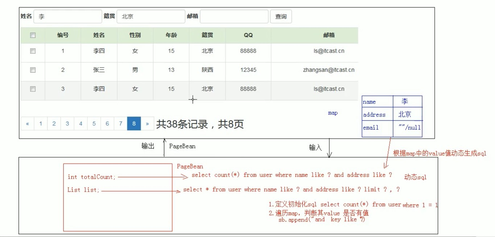

* 学到的小技巧：

  - hidden 的 input 存储数据

## 13.10. 三层架构

# 14. Filter

## 14.1. 基本

- web 过滤器：当访问服务器资源时，过滤器可以把请求拦截下来，完成一些特殊的功能：
  - 一般用于完成通用操作
    - 登录验证
    - 统一 uri 编码处理
    - 敏感字符过滤
- 快速入门
  1. 定义一个类实现 Filter 接口（javax.Servlet.Filter）
  2. 复写方法
    > 里面request有必要可以强转为HttpRequest
  3. 配置拦截路径
     > @WebFilter()
  4. 放行：`filterChain.doFilter(servletRequest,servletResponse)`

## 14.2. 细节

### 14.2.1. web.xml 配置

> 和 servlet 配置基本相同

```xml
<!-- 例： -->
<filter>
    <filter-name>demo1</filter-name>
    <filter-class>cn.itcast.web.filter.FilterDemo1</filter-class>
</filter>
<filter-mapping>
    <filter-name>demo1<filter-name>
    <url-pattern>/*</url-pattern>
</filter-mapping>
```

### 14.2.2. 执行流程

> 图解：
> 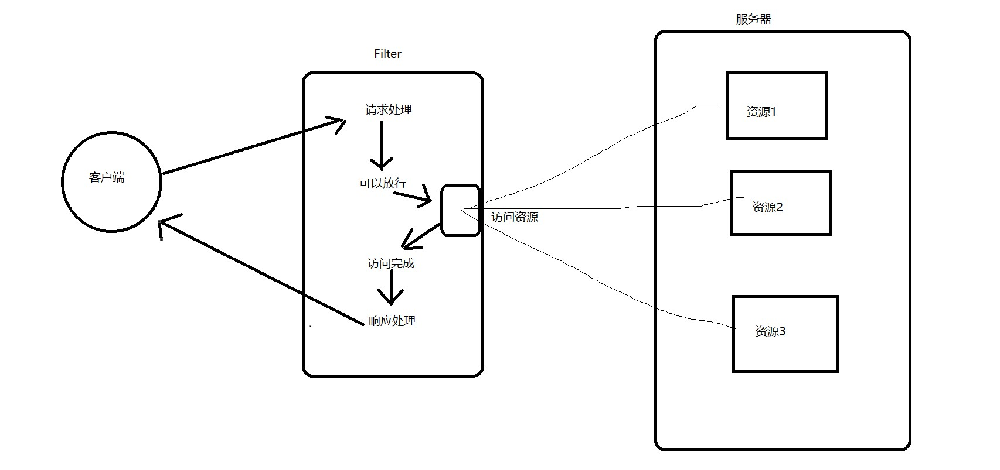

```java
@WebFilter("/*")
public void doFilter(ServletRequest req, ServletResponse resp, FilterChain chain) throws ServletException{
    //对request对象请求消息增强
    System.out.println("filterDemo2执行了....");

    //放行
    chain.doFilter(req,resp);

    //资源访问完毕，从这里开始继续执行
    //对response对象的响应消息增强
    System.out.println("filterDemo2回来了...");
}
```

1. 执行过滤器
2. 放行，获取后指向的资源
3. 回来执行过滤器放行代码下的代码

> **注意：在一次请求中， Filter 和 Servlet 的 Request 对象是同一个**

### 14.2.3. 生命周期

- init(FilterConfig config)
  - 在服务器启动时会创建 Filter 对象，然后调用 init 方法。
  - 一般用于加载资源
    - 比如读取web.xml中FilterConfig里配置的初始化参数
      ```xml
      <filter>
          <filter-name>demo1</filter-name>
          <filter-class>cn.itcast.web.filter.FilterDemo1</filter-class>

          <!-- 配置初始化参数 -->
          <init-param>
            <param-name>encode</param-name>
            <param-value>utf-8</param-value>
          </init-param>

      </filter>
      <filter-mapping>
          <filter-name>demo1<filter-name>
          <url-pattern>/*</url-pattern>
      </filter-mapping>
      ```
- doFilter()
  - 每一次请求被拦截资源时会执行。因此会多次执行
  - 进行逻辑性操作
- destory()
  - 服务器关闭后，Filter 对象被销毁，如果服务器正常关闭，则会正常执行 destory 方法
  - 一般用来释放资源

### 14.2.4. 配置详解

- 拦截路径配置
  - 具体资源路径：/index.jsp
    > 只拦截指定资源，用的比较少
  - 目录拦截：/user/\*
    > 拦截/user/下的所有资源
  - 后缀名拦截：\*.jsp
    > 访问所有指定后缀名资源时。**注意没有/**
  - 拦截所有资源：/\*
    > 拦截项目下所有资源
- 拦截方式配置：资源被访问的方式

  - 种类
    - 请求
    - 转发
  - 配置方式：

    - xml：设置`<dispacher></dispacher>`标签即可
    - 注解：设置 dispacherTypes 属性

      > 可以配置多个值 @WebFilter(value="/\*",dispatcherTypes={DispacherType.FORWOARD,DispacherType.REQUEST})

      - REQUEST：默认值。浏览器直接请求资源
      - FORWOARD：转发访问资源
      - INCLUDE：包含访问资源
      - ERROR：错误跳转资源
      - ASYIC：异步访问资源

### 14.2.5. 过滤器链

- 如果有两个过滤器，执行顺序：
  - 过滤器 1 前部分
  - 过滤器 2 前部分
  - 资源
  - 过滤器 2 后部分
  - 过滤器 1 后部分
- 过滤器先后问题：
  - 注解配置：按照类名的字符串比较规则，较小的先执行
  - web.xml 配置：filter-pattern 谁配置在上面，谁先执行


## 14.3. 案例

### 14.3.1. 案例需求

- 登录验证：
  - 访问资源，验证是否登录
  - 登录了就放行
  - 没有登录就跳转到登陆界面，提示您未登录，请先登录
  - 图解：
    > 
  - 注意：
    - request 对象一般会做个强转，强转成 HttpServlet 类型
    - 注意 css 和 js，图片，验证码等资源的过滤
- 敏感词汇过滤（看完下面代理模式再过来）
  > 通过动态代理
  - 需求：将指定词汇替换为\*\*
  - 步骤：
    - Filter 的 init()中读取敏感词汇文件存入数组
      - 注意：本地创建的字符输入流默认编码为系统默认编码，注意文件编码
    - 增强 getParameter 方法，对比数组，对返回值进行修改（也就是通过`if(method.getName().equals("getParameter"))`判断函数名来指定函数。）
      > 这样任何地方调用该方法都会对该方法的返回值进行处理
      > 注意还有 getParameterMap 和 getParameterValues 方法
    - 获得对应代理对象
    - 将代理对象对象放行

### 14.3.2. 代理模式

> 推荐阅读：https://blog.csdn.net/briblue/article/details/73928350

- 静态代理：有类文件来对应代理类。只能产生固定接口的代理
  > 用的比较少
  > 图解
  > 
- 动态代理：在内存中生成代理类。Proxy 能够动态产生不同接口类型的代理

  > **重要**。用的比较多。很多框架也是用动态代理

  - 图解：
    > 
  - 实现步骤：

    - 使用 Proxy.newProxyInstance()获取代理对象
      - 三个参数：
        - 类加载器：real.getClass()
        - 接口数组：real.getClass().getInterfaces()
          > 这样返回的代理对象和真实对象实现同一接口
        - 处理器(InvocationHandler 实现类或者匿名类)
          - 接口方法：invoke(){代理逻辑编写}：代理对象调用的所有方法都会触发该方法执行。同时拦截方法的执行，在内部可以通过 method.invode(object,args)的方式执行
            - 三个参数：
              - proxy:前面获取的代理对象
              - method：调用接口方法时，那个方法就会被封装传到这里。也就是代理对象调用方法的封装对象
              - args：代理对象调用方法时传入的参数
    - 在 invoke 函数中进行增强方法
      - 增强参数列表：对参数进行处理，比如倍率处理等等
      - 增强返回值类型：对返回结果进行处理
      - 增强方法体执行逻辑：在方法执行前进行其他逻辑操作
    - 使用代理对象调用方法

  - 代码示例；

    ```java
    @WebFilter(value={"/PageListServlet", "/SearchServlet"},dispatcherTypes={DispatcherType.FORWARD,DispatcherType.REQUEST})
    public class ParameterFilter implements Filter {
        @Override
        public void doFilter(ServletRequest req, ServletResponse resp, FilterChain chain) throws ServletException,
                IOException {

            ServletRequest proxy = (ServletRequest) Proxy.newProxyInstance(req.getClass().getClassLoader(), new Class[]{HttpServletRequest.class},
                    new InvocationHandler() {
                  // 不知道为啥req.getClass().getInterfaces()无法获得接口，所以凑活直接写上去接口的class了
                @Override
                public Object invoke(Object o, Method method, Object[] objects) throws Throwable {
                    // 因为是小项目就没有把这些数值存入文件，为了可扩展性最好把信息存入配置文件
                    Object result = method.invoke(req, objects);
                    if ("getParameter".equals(method.getName())) {
                        System.out.println(objects[0]);
                        if ("row".equals(objects[0].toString())) {
                            return result != null ? result : "5";
                        }
                        if ("currentPage".equals(objects[0].toString())) {
                            if (result == null) {
                                return "1";
                            } else if (Integer.parseInt(result.toString()) <= 0) {
                                return "1";
                            }
                        }
                    }
                    return result;
                }
            });
            chain.doFilter(proxy, resp);
        }

        @Override
        public void init(FilterConfig config) throws ServletException {

        }

        @Override
        public void destroy() {

        }
    }

    ```

# 15. Listener

> 用的很少。这里只说一个监听接口，其他自己查查文档

- 概念：web 三大组件之一

  > 三大组件：servlet Filter Listener

- 事件监听机制
  - 事件：一个动作
  - 事件源：事件发生地方
  - 监听器：一个对象
  - 注册监听：将事件源和监听器绑定在一起。当事件源上发生某个事件后执行监听器代码
- 监听对象（三个域对象）：
  - ServletContext
    - ServletContextListener
    - ServletContextAttributeListener
  - HttpSession
    - HttpSessionListener
    - HttpSessionIdListener
    - HttpSessionActivationListener
    - HttpSessionAttributeListener
    - HttpSessionBindingListener
  - ServletRequest
    - ServletRequestListener
    - ServletRequestAttributeListener
- 监听动作：
  - 域对象的创建和销毁
  - 域对象中属性的增加和删除
  - 监听绑定到HttpSession域中的某个对象的状态的事件监听器
- 可以用来统计登录人数等等，当然，也可以用servlet实现该功能


> **下面就说明一个示例**

- ServletContextListener 接口

  > 监听 ServletContext 对象的创建和销毁

  - void contextInitialized(ServletContextEvent sce)
    > ServletContext 创建时执行。也就是服务器启动时执行。
    > 一般用来加载文件。
    > 通过 ServletContextEvent 对象可以获得 ServletContext 对象。然后指定固定路径或者配置上下文参数来资源指定路径。
    > 然后通过 ServletContext 获取真实（全部）路径
  - void contextDestroyed(ServletContextEvent sce)
    > ServletDestoryed 销毁时执行。也就是服务器正常关闭时执行。

- 使用流程
  > 以后用框架开发的话，不需要这么麻烦
  - 定义一个类，实现 ServletContextServlet 接口
  - 实现方法
  - 配置
    - web.xml
      ```xml
      <listener>
        <listener-class>web.listener.TestListener</listener-class>
      </listener>
      ```
    - 注解:直接在类上写一个：`@WebListener`即可

# 16. JQuery

> 最好查文档去

## 16.1. 基础概念

> 注：$ 和 jquery 作用相同

- 概念：

  - jQuery 就是 JavaScript 语法写的一些函数，内部仍然是调用 JavaScript 实现的，所以并不是代替 JavaScript 的。使用 jQuery 的代码、编写 jQuery 的扩展插件等仍然需要 JavaScript 的技术，jQuery 本身就是一堆 JavaScript 函数。
  - 为的是简化开发，增强代码兼容性

- 版本说明：

  - 三大版本
    - 1.x:兼容 ie678,使用最为广泛的，官方只做 BUG 维护，功能不再新增。因此一般项目来说，使用 1.x 版本就可以了，最终版本：1.12.4(2016 年 5 月 20 日）
    - 2.x:不兼容 ie678,很少有人使用，官方只做 BUG 维护，功能不再新增。如果不考虑兼容低版本的浏览器可以使用 2.x,最终版本：2.2.4(2016 年 5 月 20 日）
    - 3.x:不兼容 ie678,只支持最新的浏览器。除非特殊要求，一般不会使用 3.x 版本的，很多老的 jQuery 插件不支持这个版本。目前该版本是官方主要更新维护的版本。最新版本：3.2.1(2017 年 3 月 20 日）
  - 格式：
    - jquery-xxx.js:开发版本，有良好的缩进和注释，可读性好。体积大，开发时可以看看
    - jquery-xxx.min.js:生产版本。没有缩进，程序使用，体积小，加载块

- JQuery 对象和 js 对象

  - 区别：
    - JQuery 对象在操作时更加方便。
    - 但要注意 JQuery 对象和 js 对象的方法是不通用的
  - 转换：
    - JQuery 转 js:jq[索引] 或 jq.get[索引]
    - js 转 JQuery:\$(js 对象)
      > 注意：this使用时要转换为JQuery对象：$(this)

- 基本语法学习
  - 事件绑定
    - `$("#test").click(function(){alter("绑定单击事件")})`
  - 入口函数
    - window.onclick=function(){} js 原生写法。
      > 也可以写成$(window).load(function(){})
      - 在包括图片等所有页面资源加载完成后执行。
      - 只能定义一次，否则会覆盖
    - \$(function(){}) JQuery 写法
      > $(document).ready()的简写。
      - 在 html 标签加载完成后执行，在上面的执行之前执行
      - 可以写多次，不会覆盖
  - 样式控制
    > 一个键为获取值 ，键值对为设置一个值，{"a":"valuea".....}为设置多个值
    - `$('#div1').css("background-Color","red")`
    - `$('#div1').css("backgroundColor","red")` 推荐。鼠标放上去有提示

## 16.2. 选择器

1. 基本选择器
   1. 标签选择器（元素选择器）
      > 语法： \$("html 标签名") 获得所有匹配标签名称的元素
   2. id 选择器
      > �����法： \$("#id 的属性值") 获得与指定 id 属性值匹配的元素
   3. 类选择器
      > 语法： \$(".class 的属性值") 获得与指定的 class 属性值匹配的元素
   4. 并集选择器：
      > 语法： \$("选择器 1,选择器 2....") 获取多个选择器选中的所有元素
2. 层级选择器
   1. 后代选择器
      > 语法： \$("A B ") 选择 A 元素内部的所有 B 元素
   2. 子选择器
      > 语法： \$("A > B") 选择 A 元素内部的所有 B 子元素
3. 属性选择器
   > 还有其他的，查文档去
   1. 属性名称选择器
      > 语法： \$("A[属性名]") 包含指定属性的选择器
   2. 属性选择器
      > 语法： \$("A[属性名='值']") 包含指定属性等于指定值的选择器
   3. 复合属性选择器
      > 语法： \$("A[属性名='值'][]...") 包含多个属性条件的选择器
4. 过滤选择器
   1. 首元素选择器
      > 语法： :first 获得选择的元素中的第一个元素
   2. 尾元素选择器
      > 语法： :last 获得选择的元素中的最后一个元素
   3. 非元素选择器
      > 语法： :not(selector) 不包括指定内容的元素
   4. 偶数选择器
      > 语法： :even 偶数，从 0 开始计数
   5. 奇数选择器
      > 语法： :odd 奇数，从 0 开始计数
   6. 等于索引选择器
      > 语法： :eq(index) 指定索引元素
   7. 大于索引选择器
      > 语法： :gt(index) 大于指定索引元素
   8. 小于索引选择器
      > 语法： :lt(index) 小于指定索引元素
   9. 标题选择器
      > 语法： :header 获得标题（h1~h6）元素，固定写法
5. 表单过滤选择器
   1. 可用元素选择器
      > 语法： :enabled 获得可用元素
   2. 不可用元素选择器
      > 语法： :disabled 获得不可用元素
   3. 选中选择器
      > 语法： :checked 获得单选/复选框选中的元素
   4. 选中选择器
      > 语法： :selected 获得下拉框选中的元素

## 16.3. DOM操作

- 内容
  - html()：设置或获取标签体内容，也可以设置标签
  - text()：设置或获取标签体内文本内容
  - val()：设置或者获取标签体的value值
    - 同时也可以对checkbox和select（下拉框）的值进行设置
- 属性
  - 通用属性操作
    > 参数为一个键是获取，一个键值对是设置
    - 方法
      - attr()：获取或设置元素属性值
      - removeAttr()：删除属性
      - prop()：获取或设置元素属性值
      - removeProp()：删除属性
    - attr和prop区别：
      > 相当于之前在webapi笔记中总结的.和getAtrribute，setAttribute的区别
      - 固有属性：使用prop
      - 自定义属性：attr
  - class属性操作
    > 参数为一个键是获取，一个键值对是设置
    - addClass()：添加class属性值
    - removeClass()：删除class属性值
    - toggleClass():切换class属性值。如果存在（不存在）就删除（添加）一个类名。
- 样式控制：
  > 数值类的，只写数值，默认px为单位。键值对中的键写不写引号都行
  - css()
    - height等值写成 300,"300","300px"都行
  - offset()
    - 值可以写成"300",300
    >定位方式会被设置成relative，top和left属性不会按照你设置的值。但最终会使offset称为设定的值

- 增删改查
  1. append()：父元素将子元素添加到内部末尾
    - 对象1.append(对象2)：对象2添加到对象2内部末尾。注意：如果对象2在原文档中存在的话，就相当于移动
  2. prepend()：父元素将子元素添加到内部开头
  3. appendTo()：
    - 对象1.appendTo(对象2):将对象1添加到对象2内部
  4. prependTo()
  5. after()：添加元素到对应元素后面
    - 对象1.after(对象2)：将对象2添加到对象1后面，兄弟关系
  6. before():添加元素到对应元素前面
  7. insertAfter:
    - 对象1.insertAfter(对象2)：将对象1添加到对象2后面，兄弟关系
  8. inserrtBefore
  9. remove():移除元素
    - 对象1.remove():移除对象1
  10. empty():清空元素
    - 对象1.empty()：将对象所有后代元素全部清空，保留当前对象以及其属性节点
  11. $(html标签)：创建html标签
    - 如：`$("<div>")` `<tr><td></td><td></td></tr>`

## 16.4. 动画

> 查文档吧，这一节笔记基本没啥用，就是一个总览

1. 默认显示和隐藏方式
  1. show([speed,[easing],[fn]])
    1. 参数：
      1. speed：动画的速度。三个预定义的值("slow","normal", "fast")或表示动画时长的毫秒数值(如：1000)
      2. easing：用来指定切换效果，默认是"swing"，可用参数"linear"
        - swing：动画执行时效果是 先慢，中间快，最后又慢
        - linear：动画执行时速度是匀速的
      3. fn：在动画完成时执行的函数，每个元素执行一次。
  2. hide([speed,[easing],[fn]])
  3. toggle([speed],[easing],[fn])

2. 滑动显示和隐藏方式
  1. slideDown([speed],[easing],[fn])
  2. slideUp([speed,[easing],[fn]])
  3. slideToggle([speed],[easing],[fn])

3. 淡入淡出显示和隐藏方式
  1. fadeIn([speed],[easing],[fn])
  2. fadeOut([speed],[easing],[fn])
  3. fadeToggle([speed,[easing],[fn]])

4. 动画：animate(键值对，时间，[回调方法])

5. 停止动画：stop()

- 特点：动画效果完了之后才会开始执行回调方法。这个个性在做动画时十分有用

## 16.5. 遍历

- js遍历：
  - for
  - foreach
- jquery遍历
  - 默认的隐式遍历
  - for
  - jq对象.each(function(index,element....))
    - 获取遍历对象：
      - this，但不能获取索引，为**js对象**
      - 在回调函数中定义参数：function(index,element)，一个保存索引，一个保存遍历的 **js**对象
    - 退出循环：
      - 返回true:相当于continue
      - 返回false：相当于break
      - 其它返回值将被忽略。
  - $.each(object, function(index,element....))
    - object可以是js也可以是jq对象
    - 回调函数each
    - 退出循环同each
  - for..of:（jquery3.0后才提供）
    - for(i of arr){}


## 16.6. 事件绑定

> 这只是入门，更多请查文档

- jquery标准绑定方式：
  - jq对象.事件方法(回调函数)
- on绑定事件 ， off解除绑定。都可以为本元素或者子元素绑定/解绑事件
  - jq对象.on("事件名称",回调函数)
  - jq对象.off("事件名称",回调函数)
    > 如果元素不是用delegete绑定的，那么只会解绑本元素事件，子元素事件不会解绑。反之，都会解绑
    - 不传入参数，就会解绑子父元素所有事件
- 事件切换
  - jq对象.toggle(fn,fn2,[fn3,fn4,...])
    > 1.9版本 .toggle() 方法删除,jQuery Migrate（迁移）插件可以恢复此功能。
    > 根据鼠标点的次数往后执行，执行完后循环执行
    > 根据参数不同会有不同作用
- delegete：为子元素或者未来的子元素绑定事件.undelegete:为子元素解绑事件
  > 不推荐 ，建议用on替换
- bind,unbind一次性绑定多个事件
- 其他
  - jb对象.focus(collback)：
    - 如果不传入回调函数，就会触发默认行为，让对象获得焦点
  - 表单对象.submit()
    - 提交表单
- return false：可以取消冒泡以及浏览器默认行为


## 16.7. 链式编程

> 但不建议写太长

- 概念：返回jq对象的函数可以继续调用其他函数，java中本来就有

## 16.8. 插件

- 机制原理：
  > 之后会将js和css封装到文件中
  - 种类
    - $.fn.extend(object)
      - 增强jq对象的功能
    - $.extend(object)
      - 增强$的原生方法
- 例：
  ```js
  //object中装方法
  $.fn.extend({
    check:function(){
      // this指向调用该方法的对象
      this.prop("check",true);
    }
    uncheck:function(){
      this.prop("check",false);
    }
  })
  //因为上面添加了check方法，所以可以使用check
  $("#btn-check").click(function(){
    $("#input[type="checkbox]").check();
  });
  //注意，这只是演示，实际业务中要难得多

  //---------------------------

  $.extend({
    max:function(a,b){
      return a>b?a:b
    }
  })
  $.(4,5)
  ```

- 使用：
  > http://www.htmleaf.com/jQuery/ 看着说明导入文件，用用就行了

## 16.9. jqueryUI

> 基本ui

- 使用
  > 这些要去源码中自己找来复制
  1. 引入jQueryUI的样式文件
  2. 引入jQuery
  3. 引入jQueryUI的js文件
  4. 使用jQueryUI功能

# 17. AJAX

## 17.1. 基本

- 概念：ASynchronous Javascript And XML，异步的javascript和xml
  - 目的：通过在后台与服务器进行少量数据交换，Ajax 可以使网页实现异步更新。这意味着可以在不重新加载整个网页的情况下，对网页的某部分进行更新。
  - 异步和同步：客户端和服务端通信的基础上。
    > 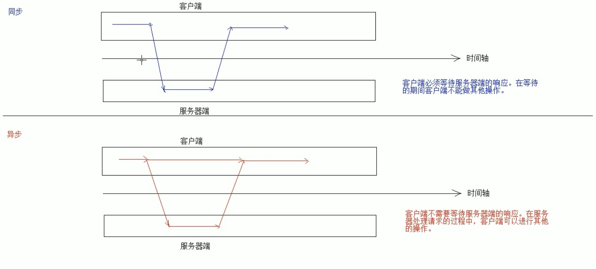
## 17.2. 原生js实现方式

> 用的不多。了解即可。参考下w3school文档就行了

## 17.3. JQuery方式

> 用的很多
- 种类：
  - $.ajax();
    - 语法：$.ajax(url,[settings])
      > 一般不会这样写，基本都是一个大括号，里面写键值对，具体查文档
      ```js
      $.ajax({
        url:"ajaxServlet",
        type:"POST",
        //data:"username=jack&age=20"//请求参数，或者按照下面的json格式写
        data:{"username"="jack","age"="23"},    //推荐
        success:function(data, textStatus, jqXHR){//响应成功后的回调函数

        },
        error:function(){//响应出错后（根据状态码判断）调用的回调函数

        },
        dataType:html//预期服务器返回的数据类型。如果不指定，jQuery 将自动根据 HTTP 包 MIME 信息来智能判断

        //其他属性自己查文档
      })
      ```
  - $.get(url, [data], [callback], [type])：发送get请求
    > 上面ajax的简化。这里的type是返回内容格式。data也可以使用两种格式
    ```js
    $.get("ajaxServlet",{
      "username":"jack",
      "age"="23"
    },function(data){
      alter(data);
    },"text")
    ```
  - $.post(url, [data], [callback], [type])：发送post请求
    > 上面ajax的简化。这里的type是返回内容格式。使用同$.get


## 17.4. JSON


- 概念：JavaScript Object Notation
  > javascript对象表示法
  - 目的：多用于存储和交换数据，类似于xml，比xml更小，更快，更易于解析

- 语法
  - 基本规则
    - 数据在键/值对中 
      - 键要用引号（单双都行）引起来，也可以不用引起来
      - 取值类型
        - 数字（整数或浮点数） 
        - 字符串（在双引号中） 
        - 逻辑值（true 或 false） 
        - 数组（在方括号中） 
        - 对象（在花括号中） 
          > 数组和对象可以相互嵌套，数组里存对象，对象里存数组都行
        - null 
    - 数据由逗号分隔 
      - 多个键值对用逗号隔开，最后一个不用
    - 花括号保存对象 
    - 方括号保存数组
  - 例：
    ```json
    {
      "employees": [
      { "firstName":"John" , "lastName":"Doe" },
      { "firstName":"Anna" , "lastName":"Smith" },
      { "firstName":"Peter" , "lastName":"Jones" }
      ]
    }

    ```
  - json对象与js对象区别
    > 
  - 获取值
    - 对象.键
    - 对象["键"]
    - 数组[索引]
  - 遍历：使用 for(var key in object) 循环

  - java对象和json对象相互转换
    - json解析器：Jsonlib,gson,fastjson,jackson(SpringMVC内置解析器)
    - java 转 json对象
      - 步骤：
        - 导入jackson相关jar包
          - jackson-annotation
          - jackson-core
          - jackson-databind
        - 创建jackson核心对象ObjectMapper
        - 调用ObjectMapper进行转换
          - writeValue(参数1,obj):有很多重载
            - 将obj数据转换为参数1，可以是**流**，也可以是文件
          - writeValueAsString(obj):将对象转为JSON字符串
      - 注解：
        - @JsonIgnore:排除属性。生成的Json字符串中会排除
        - @JsonFormat:属性值格式化。比如Data类型的
          - 有pattern属性，传入的字符串和SimpleDateFormate相同
      - 复杂对象转换：
        - List转Json：一个数组中放多个对象`[{},{},{}]`
        - map转Json：就是一个json对象`{"":"","":""}`
    - json 转 java对象
      > 很少用
      - 步骤：
        - 导包
        - 创建jackson核心对象ObjectMapper
        - 调用方法
          - readValue(json字符串，class)

## 17.5. 案例


- 注意点：
  - java转json传回来的是一个字符串
    - 在ajax的get或post方法中指明传回来的数据类型type指定为json
    - 不指定方法中的话，可以指定response.setContentType()中的memi类型。设为"application/json;charset=utf-8"
  - 因为要使用response.getWriter()，因此要注意中文乱码问题，设置response.setContentType()


# 18. Redis

## 18.1. 基础

- 概念：redis时一款高性能的NOSQL系列的非关系型数据库
  > 推荐阅读：https://baijiahao.baidu.com/s?id=1644537541383564235&wfr=spider&for=pc
- 详细
  ```
  1.1.什么是NOSQL
			NoSQL(NoSQL = Not Only SQL)，意即“不仅仅是SQL”，是一项全新的数据库理念，泛指非关系型的数据库。
			随着互联网web2.0网站的兴起，传统的关系数据库在应付web2.0网站，特别是超大规模和高并发的SNS类型的web2.0纯动态网站已经显得力不从心，暴露了很多难以克服的问题，而非关系型的数据库则由于其本身的特点得到了非常迅速的发展。NoSQL数据库的产生就是为了解决大规模数据集合多重数据种类带来的挑战，尤其是大数据应用难题。

			1.1.1.	NOSQL和关系型数据库比较
				优点：
					1）成本：nosql数据库简单易部署，基本都是开源软件，不需要像使用oracle那样花费大量成本购买使用，相比关系型数据库价格便宜。
					2）查询速度：nosql数据库将数据存储于缓存之中，关系型数据库将数据存储在硬盘中，自然查询速度远不及nosql数据库。
					3）存储数据的格式：nosql的存储格式是key,value形式、文档形式、图片形式等等，所以可以存储基础类型以及对象或者是集合等各种格式，而数据库则只支持基础类型。
					4）扩展性：关系型数据库有类似join这样的多表查询机制的限制导致扩展很艰难。

				缺点：
					1）维护的工具和资料有限，因为nosql是属于新的技术，不能和关系型数据库10几年的技术同日而语。
					2）不提供对sql的支持，如果不支持sql这样的工业标准，将产生一定用户的学习和使用成本。
					3）有的不提供关系型数据库对事务的处理。
          4）并不安全，数据存储在内存中可能未来得及持久化导致丢失

			1.1.2.	非关系型数据库的优势：
				1）性能NOSQL是基于键值对的，可以想象成表中的主键和值的对应关系，而且不需要经过SQL层的解析，所以性能非常高。
				2）可扩展性同样也是因为基于键值对，数据之间没有耦合性，所以非常容易水平扩展。

			1.1.3.	关系型数据库的优势：
				1）复杂查询可以用SQL语句方便的在一个表以及多个表之间做非常复杂的数据查询。
				2）事务支持使得对于安全性能很高的数据访问要求得以实现。对于这两类数据库，对方的优势就是自己的弱势，反之亦然。

			1.1.4.	总结
				关系型数据库与NoSQL数据库并非对立而是互补的关系，即通常情况下使用关系型数据库，在适合使用NoSQL的时候使用NoSQL数据库，
				让NoSQL数据库对关系型数据库的不足进行弥补。
				一般会将数据存储在关系型数据库中，在nosql数据库中备份存储关系型数据库的数据

  1.2.主流的NOSQL产品
    •	键值(Key-Value)存储数据库
        相关产品： Tokyo Cabinet/Tyrant、Redis、Voldemort、Berkeley DB
        典型应用： 内容缓存，主要用于处理大量数据的高访问负载。 
        数据模型： 一系列键值对
        优势： 快速查询
        劣势： 存储的数据缺少结构化
    •	列存储数据库
        相关产品：Cassandra, HBase, Riak
        典型应用：分布式的文件系统
        数据模型：以列簇式存储，将同一列数据存在一起
        优势：查找速度快，可扩展性强，更容易进行分布式扩展
        劣势：功能相对局限
    •	文档型数据库
        相关产品：CouchDB、MongoDB
        典型应用：Web应用（与Key-Value类似，Value是结构化的）
        数据模型： 一系列键值对
        优势：数据结构要求不严格
        劣势： 查询性能不高，而且缺乏统一的查询语法
    •	图形(Graph)数据库
        相关数据库：Neo4J、InfoGrid、Infinite Graph
        典型应用：社交网络
        数据模型：图结构
        优势：利用图结构相关算法。
        劣势：需要对整个图做计算才能得出结果，不容易做分布式的集群方案。
  1.3 什么是Redis
    Redis是用C语言开发的一个开源的高性能键值对（key-value）数据库，官方提供测试数据，50个并发执行100000个请求,读的速度是110000次/s,写的速度是81000次/s ，且Redis通过提供多种键值数据类型来适应不同场景下的存储需求，目前为止Redis支持的键值数据类型如下：
      1) 字符串类型 string
      2) 哈希类型 hash
      3) 列表类型 list
      4) 集合类型 set
      5) 有序集合类型 sortedset
    1.3.1 redis的应用场景
      •	缓存（数据查询、短连接、新闻内容、商品内容等等）
      •	聊天室的在线好友列表
      •	任务队列。（秒杀、抢购、12306等等）
      •	应用排行榜
      •	网站访问统计
      •	数据过期处理（可以精确到毫秒
      •	分布式集群架构中的session分离
  ```

- 特点及原理：
  > 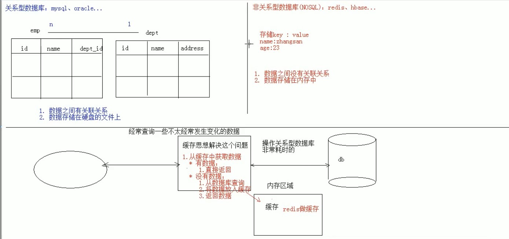

- 下载安装
  - 解压直接可以使用（默认端口6379）
  - 文件
    - redis.windows.conf:配置文件
    - redis.cli.exe:redis客户端
    - redis.server.exe:redis服务端

- 数据结构
  > key-value形式，key都是字符串，value有5种不同的数据结构
  - 类型：
    - 字符串：string 重复时会进行覆盖
    - 哈希 hash
    - 列表 list 允许重复
    - 集合 set 不允许重复
    - 有序集合 sortedset 不允许重复，自动排序
  - 示例图 
    > 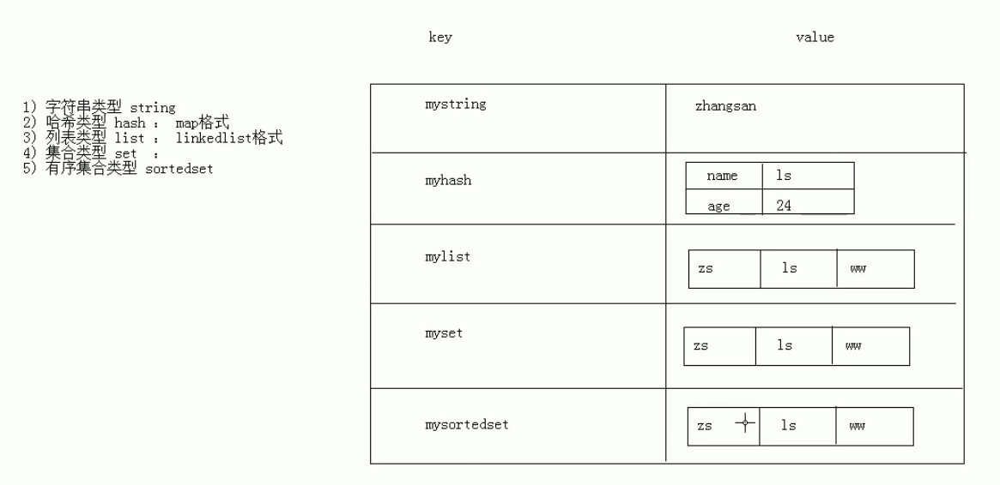

## 18.2. 基本命令操作

> 更多请查询redis官方文档

- 字符串类型
  - 存储 set key value
  - 获取 get key
  - 删除 del key
    > set username zhangsan 
    > get username

- 哈希
  - hset key field value
  - hget key  field
  - hgetall key 获取所有hash表中的键值对
  - hdel key field
    > hset myhash username wangwu
    > hget myhash username
    > hgetall myhash

- 列表
  > 可以添加一个元素到列表的头部或者尾部
  - 添加
    - lpush key value:列表头部添加一个元素
      > 在Redis2.4版本以前， lpush 只接受单个 value 值。
    - rpush key value:列表尾部添加一个元素
  - 查询
    - lrange key start end:获取一定范围的元素
      > lrange mylist 0 -1：这样会获取所有元素
  - 删除
    - lpop key:删除列表最左边的元素，并将元素返回
    - rpop key:删除最右边的元素，并将元素返回
    
- hash 
  - 添加:sadd key value
    > 在Redis2.4版本以前， SADD 只接受单个value 值。
  - 查询：smembers key：获取set中所有元素
  - 删除：srem key value:删除set集合中value元素

- sortedset
  ```
  Redis 有序集合和集合一样也是string类型元素的集合,且不允许重复的成员。
  不同的是每个元素都会关联一个double类型的分数。redis正是通过分数来为集合中的成员进行从小到大的排序。
  有序集合的成员是唯一的,但分数(score)却可以重复。
  集合是通过哈希表实现的，所以添加，删除，查找的复杂度都是O(1)。 集合中最大的成员数为 232 - 1 (4294967295, 每个集合可存储40多亿个成员)。
  ```
  - 存储：zadd key score value
    > score的大小表示权的大小，权高的在后面
    > zadd mysortedset 80 zhangsan
  - 获取：zrange key start end
    > 依旧0,-1为所有元素
  - 删除：zrem key value
    > 删除key对应sortedset中的value值


- 通用
  - keys 正则表达式：查询key值
  - type key ：查询key对应value的类型
  - del key：删除指定的键值对。（会删除整个list，set，而不是删除里面的元素）

## 18.3. 持久化

- 概念：
  - redis是一个内存数据库，当redis服务器重启或者电脑重启，数据就会丢失。
  - 持久化可以保存内存中的数据到硬盘中
- 机制
  - RDB：默认方式，不需要就行配置，默认使用这种机制。在一定的间隔事件中检测key的变化，进行持久化数据。频率设置根据实际需要进行改动
    > 推荐
    - redis.windows.conf文件中可以配置
      ```
      #   after 900 sec (15 min) if at least 1 key changed
      save 900 1
      #   after 300 sec (5 min) if at least 10 keys changed
      save 300 10
      #   after 60 sec if at least 10000 keys changed
      save 60 10000
      ```
    - 存储在redis文件夹下的rdb后缀名的文件中
    - 以指定配置文件启动或重新启动redis服务器：
      > D:\learn\redis-2.8.9>redis-server.exe redis.windows.conf
  - AOF：在日志中，记录每一条命令的操作。每执行一条命令都会进行记录
    > 不推荐。默认关闭
    - 修改appendonly 的值为yes，开启AOF
    - 设置：
      ```
      //配置文件中默认为这样。注释掉两个，开启一个
      # appendfsync always：每一次操作都进行持久化
      appendfsync everysec：每隔一秒操作一次持久化
      # appendfsync no：每隔不进行持久化
      ```
    - 持久化文件存储在redis文件夹下后缀名为aof的文件中

## 18.4. Jedis

### 18.4.1. 基本

- 概念：java操作redis数据库的工具，类似于jdbc
- 快速开始：
  - 下载jar包
    - commoms-pool(连接池)
    - jedis
  - 导入使用
  - 关闭连接
    ```java
    public void test1(){
      //1.获取连接
      Jedis jedis = new Jedis ("localhost",6379) ;//也可以空参，默认为"localhost",6379
      //2.操作
      jedis.set("usernaml","zhangsan");
      //3.关闭连接
      jedis.close();
    }
    ```

### 18.4.2. 方法

> 名称和命令的名字相同

- 操作string
  - set
  - get
  - setex(key,second,value)指定时间后自动删除
    > 以后可以用来存激活码什么的
- 操作hash
  - hset
  - hget
  - hgetAll()返回`Map<String,String>`
- 操作list
  - lpush/lpop
  - rpush/lpop
- 操作set
  - sadd
  - smembers() 返回Set<String>
- 操作sortedset
  - zadd

### 18.4.3. 连接池

- 概念：类似jdbc连接池

- 使用：
  - 创建JedisPool连接池对象
    - 也有空参方法，为默认配置
    - 也可以传入 JedisPoolConfig对象,host,port 来创建对象
      > JedisPoolConfig对象可以设置最大连接数
  - 获取连接并使用
    - getResouce()
  - 归还到连接池中
    - Jedis.close()

- 详细配置：
  ```
  #最大活动对象数     
  redis.pool.maxTotal=1000    
  #最大能够保持idel状态的对象数      
  redis.pool.maxIdle=100  
  #最小能够保持闲置状态的对象数   
  redis.pool.minIdle=50    
  #当池内没有返回对象时，最大等待时间    
  redis.pool.maxWaitMillis=10000    
  #当调用borrow Object方法时，是否进行有效性检查    
  redis.pool.testOnBorrow=true    
  #当调用return Object方法时，是否进行有效性检查    
  redis.pool.testOnReturn=true  
  #“空闲链接”检测线程，检测的周期，毫秒数。如果为负值，表示不运行“检测线程”。默认为-1.  
  redis.pool.timeBetweenEvictionRunsMillis=30000  
  #向调用者输出“链接”对象时，是否检测它的空闲超时；  
  redis.pool.testWhileIdle=true  
  # 对于“空闲链接”检测线程而言，每次检测的链接资源的个数。默认为3.  
  redis.pool.numTestsPerEvictionRun=50  
  #redis服务器的IP    
  redis.ip=xxxxxx  
  #redis服务器的Port    
  redis1.port=6379   
  ```
- 通过配置文件进行获取连接池
  - 要通过自己读取一个一个设置，推荐写一个工具类，获取连接

### 18.4.4. 案例

- 需求：
  - 在index.html页面，页面中有一个省份下拉列表
  - 当页面加载完毕后，发送ajax请求，加载所有省份

- 流程：
  > 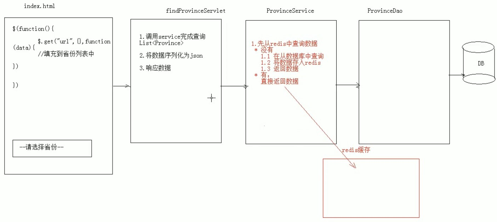
  ```java  
  public class ProvinceServiceImpl implements ProvinceService {
      //声明dao
      private ProvinceDao dao = new ProvinceDaoImpl();

      @Override
      public List<Province> findAll() {
          return dao.findAll();
      }

      /**
          使用redis缓存
      */

      @Override
      public String findAllJson() {
          //1.先从redis中查询数据
          //1.1获取redis客户端连接
          Jedis jedis = JedisPoolUtils.getJedis();
          String province_json = jedis.get("province");//province键对应的是json字符串

          //2判断 province_json 数据是否为null
          if(province_json == null || province_json.length() == 0){
              //redis中没有数据
              System.out.println("redis中没数据，查询数据库...");
              //2.1从数据中查询
              List<Province> ps = dao.findAll();
              //2.2将list序列化为json
              ObjectMapper mapper = new ObjectMapper();
              try {
                  province_json = mapper.writeValueAsString(ps);
              } catch (JsonProcessingException e) {
                  e.printStackTrace();
              }

              //2.3 将json数据存入redis
              jedis.set("province",province_json);
              //归还连接
              jedis.close();
          }else{
              System.out.println("redis中有数据，查询缓存...");
          }
          return province_json;
      }
  }
  ```
- 注意：
  - 使用redis缓存不经常发生变化的数据。
  - 数据库中的数据发生改变时要更将redis数据删除后再次存入。否则数据不会更新
  - 通常在service中进行redis数据更新

# 19. 新特性

## 19.1 Java8新特性


