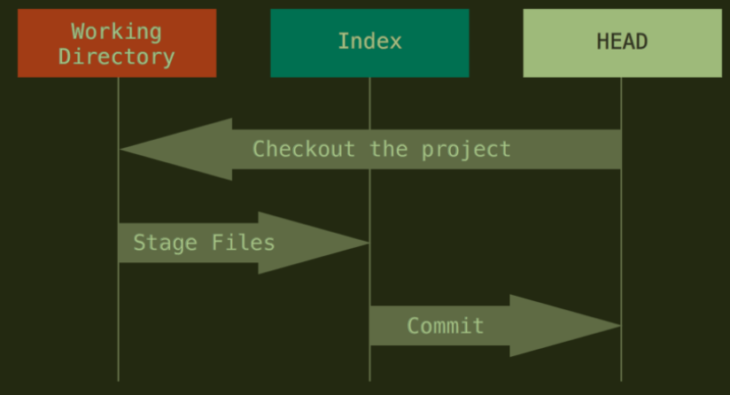

> 说明：此文件只是 git 常用指令，如果想要了解原理及指令的话去看 git 官方用户文档。十分推荐
> [文档地址](https://git-scm.com/book)

# 1. 日常使用

- git add 文件 跟踪文件，加入暂存区
- git commit -m "sign" 提交版本
- git commit --amend 撤销提交
- git commit --amend --no-edit（或者新字符串） 覆盖上次提交 但 id 会变
- git commit -am "sign" ：直接添加并 commit 上去但必须是已经追踪的文件，这条命令无法添加追踪 **所以不太推荐**
- git rm --cached 文件名 取消跟踪
  > git中*好要加转义字符，因为 因为 Git 有它自己的文件模式扩展匹配方式，所以我们不用 shell 来帮忙展开。
  > 比如：`git rm log/\*.log`.
  > 此命令删除 log/ 目录下扩展名为 .log 的所有文件
- git rm -r --cached . 清楚所有文件跟踪
- git rm 文件名 删除文件并取消跟踪
- git gc 垃圾回收命令
- git mv file_from file_to 重命名文件。git仓库中和当前文件都会修改。

- 用户信息：
  - git config -l 查看 git 配置可以使用 -l 参数(l 就是 list 的首字母,L 的小写):
  - 设置本地机器默认 commit 的昵称与 Email. 请使用有意义的名字与 email.
    - git config --global user.name "tiemaocsdn"
    - git config --global user.email "tiemaocsdn@qq.com"
    - git config --global push.default simple
  - 在某个项目根路径下面可以设置单独的 Email 与姓名.
    - git config user.name "tiemaocsdn"
    - git config user.email "tiemaocsdn@qq.com"
  - git config --global -e 可以编辑git设置

# 2. 查询

- git status 查看状态
- git status -s 查看状态 (简)
- git ls-files 列出追踪文件的目录
- git log --oneline
- git log --oneline --graph 会按分支排布
- git log --oneline --decorate --graph --all ，它会输出你的提交历史、各个分支的指向以及项目的分支分叉情况。
- gitk --all 图形化界面展现分支，十分推荐
- git reflog 所有活动
- 修改查询
  - git diff 显示为 add 的文件（unstaged）修改内容
  - git diff --cached 观看 add 后的修改内容（staged）。（Git 1.6.1 及更高版本还允许使用 git diff --staged，效果是相同的，但更好记些。）
  - git diff HARD 显示上面两种修改
- 分支查询
  - git branch 显示所有分支 在哪条分支上前面会有\*
  - git branch -v 显示所有分支以及每条分支上最新的提交
  - git branch -r 查看远程所有分支
  - git branch -a 显示所有分支，包括 FETCH_HARD 中的分支和远程分支 **推荐**
  - git branceh --merged 查看已经合并分支
  - get branch --no-merged 查看未合并分支
  - git branch -vv 查看所有本地分支与其对应远程分支，以及是否有领先，落后 **推荐**
    > 需要重点注意的一点是这些数字的值来自于你从每个服务器上最后一次抓取的数据。 这个命令并没有连接服务器，它只会告诉你关于本地缓存的服务器数据。 如果想要统计最新的领先与落后数字，需要在运行此命令前抓取所有的远程仓库。 可以像这样做：\$ git fetch --all; git branch -vv
- 远程仓库
  - git remote 查询所有远程仓库
  - git remote -v 此为 --verbose 的简写，取首字母，显示对应的克隆地址
- git log -p FETCH_HEAD 查看拉取信息

# 3. 远程仓库

- git remote add shortname url 添加远程仓库（名字默认使用 origin）。url 可以是 ssh 或者 https
- git remote show remote-name 查看某个远程仓库的详细信息
- git remote rename old_repo_name new_repo_name 注意，对远程仓库的重命名，也会使对应的远程分支名称发生变化，原来的 pb/master 分支现在成了 paul/master。
- git remote rm reponame 删除指定仓库名的仓库。对应分支也会被删除
- git checkout remote_repo/branch_name 切换到远程仓库分支，会显示 HEAD detached

# 4. 分支

## 4.1. 本地分支

- git branch branchname 创建新分支
- git checkout branch_name 切换到某条分支
- git checkout -b branch_name 建立的同时并切换到分支
- git branch -d branch_name 删除本地分支（只是指针，数据删除要在 gc 时）
- git branch -D branch_name 强制删除本地未 merge 的分支
- git branch -f branch_name HEAD~3或id 强制让某分支退回3个版本。在想查看以前代码版本或者无法通过回退到达的之前版本的时候很有用    **推荐**


## 4.2. 远程分支

- git push remoteRep --delete remote_branch_name 删除远程分支
- git checkout -b branch_name remote/remo_branch 或其他本地分支：以指定分支（本地分支或者 fetch 过来的远程分支，比如 origin/master）为起点建立新的分支，并进行跟踪。也就是 pull 时不指定会自动从指令中的远程分支拉取
- git checkout --track remoteRep/remote_branch 和上一个分支效果相同，只不过本地和远程分支名称会相同
- 另外，如果有远程分支比如 origin/abc ，执行 git checkout abc 时会自动创建本地 abc 分支并跟踪远程 abc 分支
- 设置远程分支：
  - 拉取分支
    - git fetch -u origin[/branch_name] 设置**已经fetch过来**的分支作为跟踪分支 
  - 设置分支
    - git push -u remote_Rep remote_branch
    - git branch -u remote_Rep/remote_branch local_branch
  - 区别
      ```
      举个例子：我要把本地分支mybranch1与远程仓库origin里的分支mybranch1建立关联。(也就是新建立仓库时)

      （如果使用下列途径1的话，首先，你要切换到mybranch1分支上（git checkout mybranch1））

      1. git push -u origin mybranch1 (push 并且作为建立关联)
      2. git branch --set-upstream-to=origin/mybranch1 mybranch1 (仅建立关联)

      这两种方式都可以达到目的。但是1方法更通用，因为你的远程库有可能并没有mybranch1分支，
      这种情况下你用2方法就不可行，连目标分支都不存在，怎么进行关联呢？
      所以可以总结一下：
      git push -u origin mybranch1 
      相当于 
      git push origin mybranch1 + git branch --set-upstream-to=origin/mybranch1 mybranch1
      ```

# 5. 拉取

1. git fetch --all ：这将更新 git remote 中所有的远程 repo 所包含分支的最新 commit-id, 将其记录到.git/FETCH_HEAD 文件中
2. git fetch remote_repo ： 这将更新名称为 remote_repo 的远程 repo 上的所有 branch 的最新 commit-id，将其记录。
3. git fetch remote_repo remote_branch_name ： 这将这将更新名称为 remote_repo 的远程 repo 上的分支： remote_branch_name
4. git fetch remote_repo remote_branch_name:local_branch_name ： 这将这将更新名称为 remote_repo 的远程 repo 上的分支： remote_branch_name ，并在本地创建 local_branch_name 本地分支保存远端分支的所有数据。

- git pull ：是 git fetch 与 git merge 的结合，默认从跟踪的远程仓库中抓取

# 6. 推送

- git push remote_repo_name local_branch：remote_branch 推送 三个参数可选。不写后面的话默认 origin 与 master:master
- git push remote_repo local_branch:remote_branch -f 强制 push，但这样会造成数据丢失，也可能出现错误， **十分不推荐**

# 7. 合并

- git merge other_branch 将指定分支合并到当前分支。指定分支既可以时本地分支，也可以时抓取过来的远程分支
  - 当你试图合并两个分支时， 如果顺着一个分支走下去能够到达另一个分支，那么 Git 在合并两者的时候， 只会简单的将指针向前推进（指针右移），因为这种情况下的合并操作没有需要解决的分歧——这就叫做 “快进（fast-forward）”
    - git merge --no-ff -m "sign" 禁止 fast-forward
  - 非直接祖先时，merge 是三方合并，分支处一个代码基，也就是两个分支的共同祖先，以及两个最新的
  - 在合并冲突后的任意时刻使用 git status 命令来查看那些因包含合并冲突而处于未合并（unmerged）状态的文件
  - 任何因包含合并冲突而有待解决的文件，都会以未合并状态标识出来。 Git 会在有冲突的文件中加入标准的冲突解决标记，这样你可以打开这些包含冲突的文件然后手动解决冲突。 出现冲突的文件会包含一些特殊区段，看起来像下面这个样子：
    ```
    <<<<<<< HEAD:index.html
    <div id="footer">contact : email.support@github.com</div>
    =======
    <div id="footer">
    please contact us at support@github.com
    </div>
    >>>>>>> iss53:index.html
    ```
  - 在你解决了所有文件里的冲突之后，对每个文件使用 git add 命令来将其标记为冲突已解决。

# 8. 储存

> 注意：当应用贮藏时工作目录中也可以有修改与未提交的文件——如果有任何东西不能干净地应用，Git 会产生合并冲突。

> 默认情况下，git stash 只会贮藏已修改和暂存的 已跟踪 文件。 如果指定 --include-untracked 或 -u 选项，Git 也会贮藏任何未跟踪文件。

- git stash 将修改内容储藏到栈上
- git apply 应用最新的存储
- git stash list 展示所有储藏
- git stash apply stash@{2} 应用指定的储藏（可以通过上一条指令）
- git statsh drop stash@{2} 删除指定储藏、
- git stash show stash@{2} 展示指定修改
- git stash branch branch_name 将 stash 中的修改应用到一个新分支上，再删除 stash
- git stash pop 来应用贮藏然后立即从栈上扔掉它。
- git stash pop --index
  ```
  说明：
  当add一些修改到暂存区后，如果
  git stash
  git stash pop
  那么所有修改都会在工作区保存而不是暂存区

  git stash
  git stash pop --index
  则会将之前在暂存区的修改再加到暂存区
  ```
- 冲突解决：
  > 只有当工作区干净时才能stash，否则会禁止stash
  - 修改文件
  - git add   (Git会把修改完的结果包括其它没有出现冲突的文件放入暂存区。)
  - 分歧
    - git commit：将修改作为下一个提交
    - git reset HEAD 取消暂存，恢复到git stash pop后该有的状态
  - git stash drop stash@{0}

# 9. 重置


- 三棵树：
  > 
  - HARD指针
  - 暂存区
  - 工作目录

- 三个深度
  > **reset 会修改HARD指向。soft mixed hard 三个深度，由浅入深，分别改动到 HARD指针，暂存区，工作目录层级** <br>
  > **但如果指定了文件目录，就会跳过 移动HARD指针 一步。**
  - git reset --soft version_id 或 HARD~版本数
  - git reset [--mixed] version_id 或 HARD~版本数
  - git reset --hard version_id 或 HARD~版本数 **慎用**
  > Git会将原先的Head保存为一个叫做 **ORIG_HEAD** 的标记不想查id可以用该标记返回

- 一些使用：
  - git reset [--mixed] . :取消暂存(不会修改文件)
  - git checkout .  : 取消所有未暂存的修改（会修改文件）
    > 小心使用
  - git reset filename ：取消指定文件暂存
  - git reset [--mixed] version_id filename ：将某文件回退到某一个版本
    - 现在是修改工作目录，未add和commit的状态
    - 如果想还原工作目录，要进行 get checkout filename
  - git checkout version_id filename ：效果与上面的差不多，区别看下图
  - git reset --soft version_id + git commit ：合并 commit，或者完成git commit --amend的操作


- reset 和 checkout：
  - 不带路径： git checkout [branch] 与运行 git reset --hard [branch] 非常相似。
    - 相同：
      - 都会更新三棵树
    - 区别：
      - checkout是安全的
      - reset是修改分支指向，而HARD跟着分支。而checkout是修改HARD本身指向
        > 
  - 带路径
    - 相同：
      - 像 带路径的reset 一样不会移动 HEAD
      - 同 git reset 和 git add 一样，checkout 也接受一个 --patch 选项，允许你根据选择一块一块地恢复文件内容。
    - 相当于:
      - git reset --hard [branch] file（如果 reset 允许你这样运行的话）
      - 当然，也是不安全的，会完全放弃修改

- 规则速查表
  > 


# 10. 变基

> 注意：如果提交存在于你的仓库之外，而别人可能基于这些提交进行开发，那么不要执行变基。

> 无论是通过变基，还是通过三方合并，整合的最终结果所指向的快照始终是一样的，只不过提交历史不同罢了。 变基是将一系列提交按照原有次序依次应用到另一分支上，而合并是把最终结果合在一起。

- 分支变基
  - git rebase basebranch 将当前所在分支 rebase 到指定分支
  - git rebase basebranch topicbranch 不需要切换分支，将 topicbranch 变基到 basebranch
    解决冲突后
    - 出现冲突的话：
      - 解决冲突
      - git add .
      - git rebase --continue
      - 完成后可以使用 git gc 回收垃圾
  - git rebase --abor ：任何时候都行，终止 rebase 操作，回到 rebase 开始前状态
  - git rebase --onto master server client：选中在 client 分支里但不在 server 分支里的修改，将它们在 master 分支上重放
    > 看官方文档吧
- commit 合并变基
  - git rebase -i 版本 Id 合并从此处到指定 id 的所有 commit
  - git rebase -i HARD~2 合并前两个 commit
    ```
    执行这个命令后会跳到一个vi编辑器 里面的提示有： pick：保留该commit（缩写:p） reword：保留该commit，但我需要修改该commit的注释（缩写:r） edit：保留该commit, 但我要停下来修改该提交(不仅仅修改注释)（缩写:e） squash：将该commit和前一个commit合并（缩写:s） fixup：将该commit和前一个commit合并，但我不要保留该提交的注释信息（缩写:f） exec：执行shell命令（缩写:x） drop：我要丢弃该commit（缩写:d）
    ```

# 11. gitignore

```
# 此为注释 – 将被 Git 忽略
# 忽略所有 .a 结尾的文件
*.a
# 但 lib.a 除外
!lib.a
# 仅仅忽略项目根目录下的 TODO 文件，不包括 subdir/TODO
/TODO
# 忽略 build/ 目录下的所有文件
build/
# 会忽略 doc/notes.txt 但不包括 doc/server/arch.txt
doc/*.txt
# 忽略 doc/ 目录下所有扩展名为 txt 的文件
doc/**/*.txt
```

# 12. 简单 linux 命令

```
ls -a 显示所有文件
touch 文件名 添加空文件
cat 显示文件内容
mkdir 创建文件夹
vi 通过vim进行编辑
```

# 13. 常见问题

- git乱码：
  - 右键->option->text
  - 设置为zh-cn utf-8
- gitk 乱码：
  - 执行：git config --global gui.encoding utf-8
  - 编码设置成常用的就行，也可以去掉--global，对指定仓库设置特定的编码

- connect to host ssh.github.com port 22: Connection timed out解决方法
  ```
  如果用端口443测试发现可以连接上github
  ssh -T -p 443 git@ssh.github.com

  就是端口22不能使用
  在./ssh 下找到congfig文件，如果没有就创建一个

  添加配置：
  Host github.com /*服务器地址为github地址*/

  User "XXX@XX.com" /*github上的注册邮箱为用户账号*/

  Hostname ssh.github.com /*服务器地址为github地址*/

  PreferredAuthentications publickey /*采用公匙*/

  IdentityFile ~/.ssh/id_rsa /*公匙文件路径*/

  Port 443 /*修改端口为443*/
  ```
