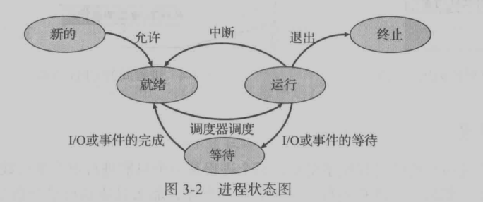
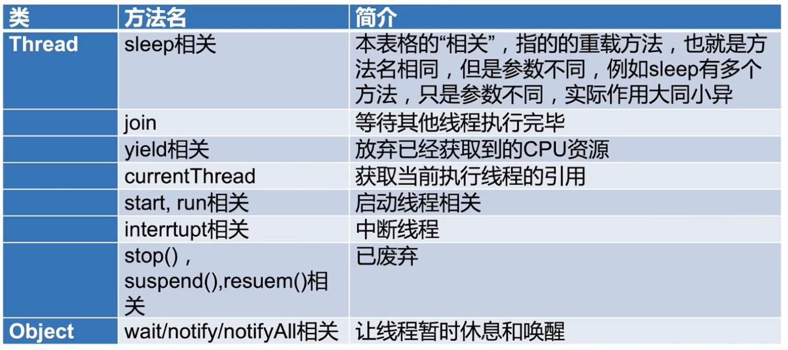
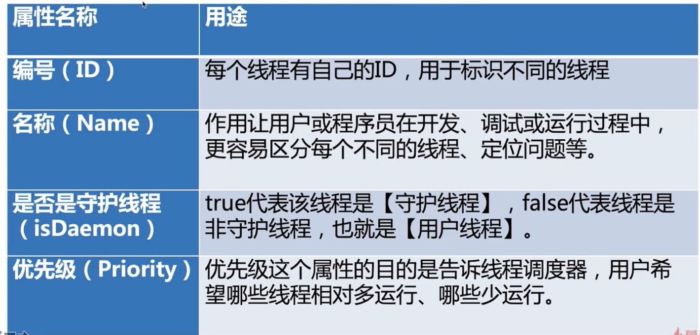

<!--Java并发核心知识体系精讲https://coding.imooc.com/class/362.html-->

# 1. synchronized详解

## 1.1. 简介

- 作用：能够保证在同一时刻最多只有一个线程执行该段代码，以达到保证并发安全的效果。
- 地位：
  - Synchronized是Java的关键字，被Java语言原生支持
  - 是最基本的互斥同步手段
  - 是并发编程中的元老级角色，是并发编程的必学内容

## 1.2. 使用方式

## 1.3. 常见情况

- 两个线程同时访问一个对象的同步方法。同一个锁。
- 两个线程访问的是两个对象的同步方法。不是一个锁。
- 两个线程访问的是synchronized的静态方法。同一个锁。
- 同时访问同步方法与非同步方法。互不影响。
- 访问同一个对象的不同的普通同步方法。同一个锁。
- 同时访问静态synchronized和非静态synchronized方法。不是同一个锁。
- 方法抛异常后，会释放锁
  > lock的话，不会释放锁。

## 1.4. 性质：可重入，不可中断


- 可重入：指的是同一线程的外层函数获得锁之后，内层函数可以直接再次获取该锁
  - 好处：避免死锁，提升封装度。
- 不可中断：一旦这个锁已经被别人获得了，如果我还想获得，我只能选择等待或者阻塞，直到别的线程释放这个锁。如果别人永远不释放锁，那么我只能永远地等下去。
  - 相比之下，未来会介绍的Lock类，可以拥有中断的能力
  - 第一点，如果我觉得我等的时间太长了，有权中断现在已经获取到锁的线程的执行；
  - 第二点，如果我觉得我等待的时间太长了不想再等了，也可以退出。

---

- 粒度(scope)：加锁范围
  - 线程：如synchronized
    - 也就是说尽管一个线程持有锁
    - 但因为粒度是线程
    - 所以可以再次获得锁（可重入）
  - 调用：pthread
    - 一个线程获得了锁
    - 但因为粒度是调用，
    - 把锁给了该线程的该次调用。
    - 因此在不释放锁的情况下，是无法再次获得锁的(不可重入)

## 1.5. 原理

### 1.5.1. 加锁和释放锁

#### 1.5.1.1. 概述

JVM基于进入和退出Monitor对象来实现方法的同步和代码块同步。每个对象都有一个Monitor与之关联,当其被占用就会处于锁定的状态。

**Monitor并不是一个对象**，只是习惯了这样一个称呼，他被保存在**对象头的Mark Word**中。

在Java虚拟机（HotSpot）中，Monitor是由ObjectMonitor实现的。

#### 1.5.1.2. 代码块的同步

测试代码如下：

```java
public class SynchronizedTest {
    private void test2(){
        synchronized (this){
            System.out.println(Thread.currentThread().getName()+"获取锁"+this.toString());
        }
    }
}
```

查看编译后的字节码文件如下(省略部分内容)：

```
...
 2 astore_1
 3 monitorenter  
 4 getstatic #2 <java/lang/System.out>
 ....
38 invokevirtual #11 <java/io/PrintStream.println>
41 aload_1
42 monitorexit
43 goto 51 (+8)
46 astore_2
47 aload_1
48 monitorexit
...
```

在编译后的字节码文件中出现了monitorenter和monitorexit两个指令，作用如下：

- monitorenter指令会尝试获取monitor的所有权，即会尝试获取对象的锁(保存在对象头中)。过程如下：
  - 如果monitor的进入数位0，则该线程进入monitor，然后将进入数设置为1，该线程即为monitor的所有者。
  - 如果线程已经占有了该monitor，则是重新进入，将monitor的进入数加1.
  - 如果其他线程已经占有了monitor则该线程进入阻塞状态，直到monitor的进入数为0，再尝试获取monitor所有权

- monitorexit指令的执行线程必须是monitor的持有者。指令执行时monitor的进入数减1，如果减1后计数器为0，则该线程将不再持有这个monitor，其他被这个monitor阻塞的线程可以尝试去获取这个 monitor 的所有权。
  - monitorexit指令出现了两次，第1次为同步正常退出释放锁；第2次为**发生异步退出释放锁**；

Synchronized的底层是通过一个monitor的对象来完成，其实wait/notify等方法也依赖于monitor对象，
这就是为什么只有在同步的块或者方法中才能调用wait/notify等方法，否则会抛出java.lang.IllegalMonitorStateException的异常的原因。

#### 1.5.1.3. 同步方法的同步

源代码如下

```java
public class SynchronizedTest {
    public   synchronized  void test() {
        System.out.println(Thread.currentThread().getName()+"获取锁"+this.toString());
    }
}
```

编译后字节码文件如下(省略部分内容)：

```
public synchronized void test();
    descriptor: ()V
    flags: ACC_PUBLIC, ACC_SYNCHRONIZED
    Code:
      stack=3, locals=1, args_size=1
...
```

对于同步方法，在字节码文件中没有使用monitorenter和monitorexit来完成同步(理论上可以)，但是多了一个ACC_SYNCHRONIZED的标记，
对于静态方法还会多出ACC_STATIC标记。JVM就是根据该标记来实现方法同步的。

当方法调用时，调用指令会检查方法的ACC_SYNCHRONIZED访问标记是否被设置，如果设置了执行线程将先法获取monitor，获取成功才能执行方法体，
方法体执行完成后释放monitor，在方法执行期间，任何一个其他的线程都无法再获取同一个monitor对象。

#### 1.5.1.4. 总结

两种同步方式本质上没有区别，只是方法的同步是一种隐式的方式来实现，无需通过字节码来完成。

两个指令的执行是JVM通过调用操作系统的互斥原语mutex来实现，

被阻塞的线程会被挂起、等待重新调度，会导致“用户态和内核态”两个态之间来回切换，对性能有较大影响。

### 1.5.2. 可重入

- JVM负责跟踪对象被加锁的次数
- 线程第一次给对象加锁的时候，计数变为1。每当这个相同的线程在此对象上再次获得锁时，计数会递增
- 每当任务离开时，计数递减，当计数为0的时候，锁被完全释放

### 1.5.3. 可见性保障

> 先了解JMM

一个代码块或者方法被synchronized修饰后，在执行完毕之后，被锁住的对象所做的任何修改都会在释放之前写会到主内存中。

## 1.6. 缺陷

> lock对下面的问题都有一定的处理措施。

- 效率低：锁的释放情况少、试图获得锁时不能设定超时、不能中断一个正在试图获得锁的线程
- 不够灵活（读写锁更灵活）:加锁和释放的时机单一，每个锁仅有单一的条件（某个对象）,可能是不够的
- 无法知道是否成功获取到锁

## 1.7. 常见问题

- 使用注意点：锁对象不能为空、作用域不宜过大、避免死锁

---

如何选择Lock和synchronized关键字？

> 尽量避免出错。

- 尽量不要使用lock和synchronized，使用java.util.concurrent包下的工具类。
- 相对于lock，优先使用synchronized，使用起来更简单。
- 当需要使用lock特性时，再使用lock

---

多线程访问同步方法的各种情况。

## 1.8. 思考题

竞争锁时的 锁调度机制。(不同JVM实现不同)

---

Synchronized使得同时只有一个线程可以执行，性能较差，有什么办法可以提升性能？

- 优化使用范围
- 使用读写锁

---

如何自己实现一个lock锁

---

锁的升级

# 2. 并发基础

## 2.1. 创建线程方式

### 2.1.1. 方式

> 准确地讲，创建线程只有一种方式，就是构造Thread类。儿实现线程的执行单元有两种方式
- 继承Thread类，并重写run方法；
- 实现Runnable接口的run方法；

### 2.1.2. 两者区别

> 通常优先使用“实现Runnable接口”这种方式来自定义线程类。
- 如果使用线程时不需要使用Thread类的诸多方法，显然使用Runnable接口更为轻量。
  > 使用Thread会建立一个独立的线程，而Runnable可以放入线程池，节约资源
- Runnable接口出现，降低了线程对象和线程任务的耦合性。
- 由于Java“单继承，多实现”的特性，Runnable接口使用起来比Thread更灵活。
- Runnable接口出现更符合面向对象，将线程单独进行对象的封装。

## 2.2. 启动线程

### 2.2.1. 启动方式：

- 错误方式：直接调用run()方法，会由main线程执行
- 正确方式：调用strat方法：会启动新线程

### 2.2.2. 源码解析

### 2.2.3. 面试题

```
一个线程两次调用start()方法会出现什么情况？为什么？

既然start()方法会调用run()方法，为什么我们选择调用
start()方法，而不是直接调用run()方法呢？
```


## 2.3. 停止线程

### 2.3.1. 原理介绍

- **使用Interrupt来通知，而不是强制**
  - 是一种合作机制，
  - 用一个线程通知一个线程停止工作
  - Java没有能力强行停止线程，是否停止交给线程本身判断。（通过isinterrupted方法判断是否有中断通知）
    > 原因：
    > 线程的调用者本身可能并不知道线程到底在干什么，
    > 因此把决定权交给线程本身。
    > 线程停止的时候可能会做一些扫尾工作

### 2.3.2. 最佳实践

- 代码执行过程中接受到interrupt通知
  - 代码执行过程中接受到interrupt通知，
  - 使用isinterrupted方法，判断是否有通知，跳转到return
  - 线程如果进行迭代运算的话，可以使用isinterrupted方法进行判断
- 线程在sleep等阻塞状态中接收到interrupt通知
  - 收到通知后，sleep方法会抛出异常
- 循环+阻塞的两种表现
    <details>
    <summary style="color:red;">情况1</summary>

    ```java
  /**
  * 描述：     try/catch里面放while，可以中断成功
  * 这种情况下，sleep会抛出异常，try/catch针对的是整个while，导致线程退出
  */
  public class RightWayStopThreadWithSleep {
      public static void main(String[] args) throws InterruptedException {
          Runnable runnable = () -> {
              int num = 0;
              try {
                  while (num <= 300 && !Thread.currentThread().isInterrupted()) {
                      if (num % 100 == 0) {
                          System.out.println(num + "是100的倍数");
                      }
                      num++;
                  }
                  Thread.sleep(1000);
              } catch (InterruptedException e) {
                  e.printStackTrace();
              }
          };
          Thread thread = new Thread(runnable);
          thread.start();
          Thread.sleep(500);
          thread.interrupt();
      }
  }
    ```
    </details>

  <details>
  <summary style="color:red;">情况2</summary>

  ```java
  /**
  * 描述：     如果while里面放try/catch，会导致中断失效
  * try/catch针对的是循环循环的单个执行，之后依旧有循环要执行
  * **而抛出异常时，会把interrupt通知的标记位清除。**
  */
  public class CantInterrupt {
      public static void main(String[] args) throws InterruptedException {
          Runnable runnable = () -> {
              int num = 0;
              while (num <= 10000 && !Thread.currentThread().isInterrupted()) {
                  if (num % 100 == 0) {
                      System.out.println(num + "是100的倍数");
                  }
                  num++;
                  try {
                      Thread.sleep(10);
                  } catch (InterruptedException e) {
                      e.printStackTrace();
                  }
              }
          };
          Thread thread = new Thread(runnable);
          thread.start();
          Thread.sleep(5000);
          thread.interrupt();
      }
  }
  ```
  </details>

#### 2.3.2.1. 通常的停止方式

#### 2.3.2.2. 正确方式interrupt方式

- 优先选择：传递中断。指编写函数调用接口时，要把Exception抛出，而调用代码中进行try/catch
  <details>
  <summary style="color:red;">代码</summary>

  ```java
  import threadcoreknowledge.createthreads.ThreadStyle;

  /**
  * 描述：     最佳实践：catch了InterruptedExcetion之后的优先选择：在方法签名中抛出异常 那么在run()就会强制try/catch
  */
  public class RightWayStopThreadInProd implements Runnable {

      @Override
      public void run() {
          while (true && !Thread.currentThread().isInterrupted()) {
              System.out.println("go");
              try {
                  throwInMethod();
              } catch (InterruptedException e) {
                  Thread.currentThread().interrupt();
                  //保存日志、停止程序
                  System.out.println("保存日志");
                  e.printStackTrace();
              }
          }
      }

      /**
      * 这里不能try/catch，
      * 否则在上面的while中，只会在一次执行时打印出异常信息， 剩下的照常执行
      *
      * 调用者也无法认知到异常的出现
      */
      private void throwInMethod() throws InterruptedException {
              Thread.sleep(2000);
      }

      public static void main(String[] args) throws InterruptedException {
          Thread thread = new Thread(new RightWayStopThreadInProd());
          thread.start();
          Thread.sleep(1000);
          thread.interrupt();
      }
  }
  ```
  </details>

- 不想或无法传递：恢复中断

- 不应屏蔽中断

### 2.3.3. 错误的停止方法

- 被弃用的stop,suspend和resume方法
- 用volatile设置标记位

### 2.3.4. 停止线程相关函数解析

- interupt方法原理
- 判断是否已经中断
  - static boolean interrupted()
  - boolean isinterrupted()

### 2.3.5. 常见概念

- JRE与JDK
- Java 7 和 Java SE 7
- JDK1.8和Java8

### 2.3.6. 面试题

```
如何停止一个线程
```

<br /><br />

```
如何处理不可中断的堵塞，（如抢锁时ReentrantLock.lock()或者SocketI/O时无法响应中断，那应该怎么让该线程）
```


## 2.4. 线程生命周期

### 2.4.1. 状态说明

- New:处于NEW状态的线程此时尚未启动
- Runnable:可以是等待cpu分配资源的状态，也可以是已经分配了资源正在运行中的状态
- Blocked:等待锁的释放以进入同步区域
- Waiting:没有设置
- Timed Waiting
- Terminated


### 2.4.2. 状态转化图示


---

<details>
<summary style="color:red;">操作系统线程状态对比</summary>


</details>

### 2.4.3. Java线程阻塞的代价

java的线程是映射到操作系统原生线程之上的，如果要阻塞或唤醒一个线程就需要操作系统介入，需要在户态与核心态之间切换，这种切换会消耗大量的系统资源，因为用户态与内核态都有各自专用的内存空间，专用的寄存器等，用户态切换至内核态需要传递给许多变量、参数给内核，内核也需要保护好用户态在切换时的一些寄存器值、变量等，以便内核态调用结束后切换回用户态继续工作。

如果线程状态切换是一个高频操作时，这将会消耗很多CPU处理时间；
如果对于那些需要同步的简单的代码块，获取锁挂起操作消耗的时间比用户代码执行的时间还要长，这种同步策略显然非常糟糕的。

synchronized会导致争用不到锁的线程进入阻塞状态，所以说它是java语言中一个重量级的同步操纵，被称为重量级锁，为了缓解上述性能问题，JVM从1.5开始，引入了轻量锁与偏向锁，默认启用了自旋锁，他们都属于乐观锁。

### 2.4.4. 阻塞状态

一般习惯而言，Blocked，Waiting，Timed Waiting三种情况都被称为阻塞状态

### 2.4.5. 面试题

```
Java线程有几种状态，生命周期是什么
```

## 2.5. Thread和Object相关重要方法

### 2.5.1. 方法概述



### 2.5.2. wait,notify,notifyAll方法

- 三个方法都是必须获得monitor锁后才能调用(也就是说在synchronized内)
- notify只能唤醒一个线程
- 三个方法都属于object类
- 类似于Condition的功能

### 2.5.3. sleep方法

- 作用：
  - 进入TIMED_WAITING状态
  - 只让线程在预期的时间执行，其他时候不要占用CPU资源

- 特点：不释放锁,synchronized和lock锁都不会释放

- sleep响应中断：
  > 前面也有提
  - 抛出InterruptedException
  - 清除中断状态

- 推荐写法：
  > 底层依旧是sleep方法
  ```java
  TimeUnit.SECONDS.sleep(1);
  ```
  - 支持秒，小时等单位。更容易阅读
  - 参数小于0也不会抛出异常
    > sleep参数小于0会抛异常

### 2.5.4. join 方法

- 作用：
  - 因为新的线程加入了我们，所以我们要等他执行完再出发
  - main等待thread1执行完毕，注意谁等谁
- 遇见中断
  <details>
  <summary style="color:red;">测试代码</summary>

  ```java
  /**
  * 描述：     演示join期间被中断的效果
  */
  public class JoinInterrupt {
      public static void main(String[] args) {
          Thread mainThread = Thread.currentThread();
          Thread thread1 = new Thread(new Runnable() {
              @Override
              public void run() {
                  try {
                      mainThread.interrupt();
                      Thread.sleep(5000);
                      System.out.println("Thread1 finished.");
                  } catch (InterruptedException e) {
                      System.out.println("子线程中断");
                  }
              }
          });
          thread1.start();
          System.out.println("等待子线程运行完毕");
          try {
              thread1.join();
          } catch (InterruptedException e) {
              System.out.println(Thread.currentThread().getName()+"主线程中断了");
              thread1.interrupt();
          }
          System.out.println("子线程已运行完毕");
      }
  }
  ```

  
  </details>

  - main线程等待thread-0运行完毕
  - thread-0的run方法中调用mian线程引用的interrupt方法
  - 主线程抛出异常，中断。作为解决方式，也将thread-0中断
  - 此时两个catch块中的代码是并行执行的

- join期间main方法的状态：**Waiting**

---

- join原理以及等价java代码

  !! 带补 !!

### 2.5.5. yield方法

- 作用：
  - 释放CPU时间片
  - 但不会释放自己的锁
- 定位；
  - JVM不保证遵循。
  - 实际开发中较少使用
  - （但是AQS等中使用较多）
- yield和sleep区别：
  - sleep后，线程会进入阻塞状态TIMED_WAITING
  - 但是调用yield方法后，依旧是Runnable状态

### 2.5.6. start和run

### 2.5.7. stop,suspend,resume方法

### 2.5.8. 面试题

```
为什么线程通信的方法wait(),notify()和notifyAll()被定义在
Object类里？而sleep定义在Thread类里？

如果调用Thread.wait会怎样
```

wait(),notify(),notifyAll()是锁级别的操作，而锁是属于对象的。而一个线程可以持有多把锁。

如果把这些方法定义在Thread类中，就无法实现以上逻辑

<br /><br />

线程退出时，会自动执行notify，会影响整体流程，因此不要使用Thread类作为锁对象。

---

```
用3种方式实现生产者模式
```

---

```
Java SE 8和Java 1.8和JDK 8是什么关系，是同一个东西吗？
```

---

```
Join和sleep和wait期间线程的状态分别是什么？为什么？
```

---

```
为什么wait()需要在同步代码块中使用，而sleep不需要
```
为了让通信变得可靠，防止死锁以及永久等待的发生。因为wait后，必须通过notify唤醒。线程间必须配合执行。

sleep基本就是作用于本身线程，和其他线程基本没有什么关系。

---

```
wait/notify,sleep异同
```

- 相同：
  - 阻塞
  - 响应中断
- 不同
  - wait/notify要在同步方法中
    > 原因说一下
  - wait/notify会释放锁
  - sleep必须指定时间，wait可以不指定时间
  - 所属类
    > 原因说一下

---

```
手写生产者，消费者模式
```

<details>
<summary style="color:red;">代码</summary>

```java
import java.util.ArrayList;
import java.util.Date;
import java.util.LinkedList;
import java.util.List;

/**
 * 描述：     用wait/notify来实现生产者消费者模式
 */
public class ProducerConsumerModel {
    public static void main(String[] args) {
        EventStorage eventStorage = new EventStorage();
        Producer producer = new Producer(eventStorage);
        Consumer consumer = new Consumer(eventStorage);
        new Thread(producer).start();
        new Thread(consumer).start();
    }
}

class Producer implements Runnable {

    private EventStorage storage;

    public Producer(
            EventStorage storage) {
        this.storage = storage;
    }

    @Override
    public void run() {
        for (int i = 0; i < 100; i++) {
            storage.put();
        }
    }
}

class Consumer implements Runnable {

    private EventStorage storage;

    public Consumer(
            EventStorage storage) {
        this.storage = storage;
    }

    @Override
    public void run() {
        for (int i = 0; i < 100; i++) {
            storage.take();
        }
    }
}

class EventStorage {

    private int maxSize;
    private LinkedList<Date> storage;

    public EventStorage() {
        maxSize = 10;
        storage = new LinkedList<>();
    }

    public synchronized void put() {
        while (storage.size() == maxSize) {
            try {
                wait();
            } catch (InterruptedException e) {
                e.printStackTrace();
            }
        }
        storage.add(new Date());
        System.out.println("仓库里有了" + storage.size() + "个产品。");
        notify();
    }

    public synchronized void take() {
        while (storage.size() == 0) {
            try {
                wait();
            } catch (InterruptedException e) {
                e.printStackTrace();
            }
        }
        System.out.println("拿到了" + storage.poll() + "，现在仓库还剩下" + storage.size());
        notify();
    }
}
```
</details>

---

```
一个线程只打印奇数，一个线程只打印偶数，交替打印
```

 <details>
 <summary style="color:red;">代码</summary>

 ```java
/**
 * 描述：     两个线程交替打印0~100的奇偶数，用wait和notify
 */
public class WaitNotifyPrintOddEveWait {

    private static int count = 0;
    private static final Object lock = new Object();

    public static void main(String[] args) {
        new Thread(new TurningRunner(), "偶数").start();
        new Thread(new TurningRunner(), "奇数").start();
    }

    //1. 拿到锁，我们就打印
    //2. 打印完，唤醒其他线程，自己就休眠
    static class TurningRunner implements Runnable {

        @Override
        public void run() {
            while (count <= 100) {
                synchronized (lock) {
                    //拿到锁就打印
                    System.out.println(Thread.currentThread().getName() + ":" + count++);
                    lock.notify();
                    if (count <= 100) {
                        try {
                            //如果任务还没结束，就让出当前的锁，并休眠
                            lock.wait();
                        } catch (InterruptedException e) {
                            e.printStackTrace();
                        }
                    }
                }
            }
        }
    }
}
 ```
 </details>

## 2.6. 线程属性

### 2.6.1. 总览



### 2.6.2. id

### 2.6.3. 名称

### 2.6.4. 守护线程

### 2.6.5. 线程优先级

### 2.6.6. 各属性总结

### 2.6.7. 面试题

```
什么时候我们需要设置守护线程？
```

---

```
我们应该如何应用线程优先级来帮助程序运行？有哪些禁忌？
```

---

```
不同的操作系统如何处理优先级问题？
```


## 2.7. 线程的未捕获异常

## 2.8. 多线程导致的问题

### 2.8.1. 线程安全

### 2.8.2. 性能问题

# 3. Java 内存模型

## 3.1. 三大结构模型

## 3.2. JMM 是什么

## 3.3. 重排序

## 3.4. 可见性

## 3.5. JMM 的抽象：本地内存和主内存

## 3.6. happens-before 原则

## 3.7. volatile 关键字

## 3.8. 并发编程三大特性

### 3.8.1. 可见性

### 3.8.2. 原子性

### 3.8.3. 有序性

# 4. 死锁

# 5. 常见问题

# 6. 线程池

<!--黑马程Java线程池深入浅出视频教程-->

## 6.1. 概述

- 线程池优势
  - 1:线程和任务分离,提升线程重用性;
  - 2:控制线程并发数量,降低服务器压力,统一管理所有线程;
  - 3:提升系统响应速度,假如创建线程用的时间为T1，执行任务用的时间为T2,销毁线程用的时间为T3，那么使用线程池就免去了T1和T3的时间；

- 基本构造方法
  ```java
  public ThreadPoolExecutor(int corePoolSize, //核心线程数量
                                int maximumPoolSize,//     最大线程数
                                long keepAliveTime, //       最大空闲时间
                                TimeUnit unit,         //        时间单位
                                BlockingQueue<Runnable> workQueue,   //   任务队列
                                ThreadFactory threadFactory,    // 线程工厂
                                RejectedExecutionHandler handler  //  饱和处理机制
  ) 
  ```
- 执行流程
  


- 4个参数的设计:
  - 1:核心线程数(corePoolSize)
    - 核心线程数的设计需要依据任务的处理时间和每秒产生的任务数量来确定,
    - 例如:执行一个任务需要0.1秒,系统百分之80的时间每秒都会产生100个任务,那么要想在1秒内处理完这100个任务,就需要10个线程,此时我们就可以设计核心线程数为10;
    - 当然实际情况不可能这么平均,所以我们一般按照8020原则设计即可,既按照百分之80的情况设计核心线程数,剩下的百分之20可以利用最大线程数处理;
  - 2:任务队列长度(workQueue)
    - 任务队列长度一般设计为: **核心线程数/单个任务执行时间*2** 即可;
    - 例如上面的场景中,核心线程数设计为10,单个任务执行时间为0.1秒,则队列长度可以设计为200;
  - 3:最大线程数(maximumPoolSize)
    - 最大线程数的设计除了需要参照核心线程数的条件外,还需要参照系统每秒产生的最大任务数决定:例如:上述环境中
    - 如果系统每秒最大产生的任务是1000个,那么, **最大线程数=(最大任务数-任务队列长度)*单个任务执行时间** 
    - 既: 最大线程数=(1000-200)*0.1=80个;
  - 4:最大空闲时间(keepAliveTime)
    - 这个参数的设计完全参考系统运行环境和硬件压力设定,没有固定的参考值
    - 用户可以根据经验和系统产生任务的时间间隔合理设置一个值即可;


## 6.2. 自定义线程池

- 任务类
  <details>
  <summary style="color:red;">代码</summary>

  ```java
  /*
      需求:
          自定义线程池练习,这是任务类,需要实现Runnable;
          包含任务编号,每一个任务执行时间设计为0.2秒
  */
  public class MyTask implements Runnable{
      private int id;
      //由于run方法是重写接口中的方法,因此id这个属性初始化可以利用构造方法完成

      public MyTask(int id) {
          this.id = id;
      }

      @Override
      public void run() {
          String name = Thread.currentThread().getName();
          System.out.println("线程:"+name+" 即将执行任务:"+id);
          try {
              Thread.sleep(200);
          } catch (InterruptedException e) {
              e.printStackTrace();
          }
          System.out.println("线程:"+name+" 完成了任务:"+id);
      }

      @Override
      public String toString() {
          return "MyTask{" +
                  "id=" + id +
                  '}';
      }
  }
  ```
  </details>

- 线程类
  <details>
  <summary style="color:red;">代码</summary>

  ```java
  import java.util.List;

  /*
      需求:
          编写一个线程类,需要继承Thread类,设计一个属性,用于保存线程的名字;
          设计一个集合,用于保存所有的任务;
  */
  public class MyWorker extends Thread{
      private String name;//保存线程的名字
      private List<Runnable> tasks;
      //利用构造方法,给成员变量赋值

      public MyWorker(String name, List<Runnable> tasks) {
          super(name);
          this.tasks = tasks;
      }

      @Override
      public void run() {
        //判断集合中是否有任务,只要有,就一直执行任务
          while (tasks.size()>0){
              Runnable r = tasks.remove(0);
              r.run();
          }
      }
  }
  ```
  </details>

- 线程池类
  <details>
  <summary style="color:red;">代码</summary>

  ```java
  import java.util.Collections;
  import java.util.LinkedList;
  import java.util.List;

  /*
      这是自定义的线程池类;

      成员变量:
          1:任务队列   集合  需要控制线程安全问题
          2:当前线程数量
          3:核心线程数量
          4:最大线程数量
          5:任务队列的长度
      成员方法
          1:提交任务;
              将任务添加到集合中,需要判断是否超出了任务总长度
          2:执行任务;
              判断当前线程的数量,决定创建核心线程还是非核心线程
  */
  public class MyThreadPool {
      // 1:任务队列   集合  需要控制线程安全问题
      private List<Runnable> tasks = Collections.synchronizedList(new LinkedList<>());
      //2:当前线程数量
      private int num;
      //3:核心线程数量
      private int corePoolSize;
      //4:最大线程数量
      private int maxSize;
      //5:任务队列的长度
      private int workSize;

      public MyThreadPool(int corePoolSize, int maxSize, int workSize) {
          this.corePoolSize = corePoolSize;
          this.maxSize = maxSize;
          this.workSize = workSize;
      }

      //1:提交任务;
      public void submit(Runnable r){
          //判断当前集合中任务的数量,是否超出了最大任务数量
          if(tasks.size()>=workSize){
              System.out.println("任务:"+r+"被丢弃了...");
          }else {
              tasks.add(r);
              //执行任务
              execTask(r);
          }
      }
      //2:执行任务;
      private void execTask(Runnable r) {
          //判断当前线程池中的线程总数量,是否超出了核心数,
          if(num < corePoolSize){
              new MyWorker("核心线程:"+num,tasks).start();
              num++;
          }else if(num < maxSize){
              new MyWorker("非核心线程:"+num,tasks).start();
              num++;
          }else {
              System.out.println("任务:"+r+" 被缓存了...");
          }
      }

  }
  ```
  </details>

- 执行测试类
  <details>
  <summary style="color:red;">代码</summary>

  ```java
  /*
      测试类:
          1: 创建线程池类对象;
          2: 提交多个任务
  */
  public class MyTest {
      public static void main(String[] args) {
          //1:创建线程池类对象;
          MyThreadPool pool = new MyThreadPool(2,4,20);
          //2: 提交多个任务
          for (int i = 0; i <30 ; i++) {
              //3:创建任务对象,并提交给线程池
              MyTask my = new MyTask(i);
              pool.submit(my);
          }
      }
  }
  ```
  </details>


## 6.3. ExecutorService接口

- ExecutorService接口是java内置的线程池接口,通过学习接口中的方法,可以快速的掌握java内置线程池的基本使用
- **常用方法**:
  - `void shutdown()`   启动一次顺序关闭，执行以前提交的任务，但不接受新任务。 
  - `List<Runnable> shutdownNow()` 停止所有正在执行的任务，暂停处理正在等待的任务，并返回等待执行的任务列表。 
  - `<T> Future<T> submit(Callable<T> task)`  执行带返回值的任务，返回一个Future对象。 
  - `Future<?> submit(Runnable task)`  执行 Runnable 任务，并返回一个表示该任务的 Future。 
  - `<T> Future<T> submit(Runnable task, T result)`  执行 Runnable 任务，并返回一个表示该任务的 Future。 

## 6.4. ThreadPoolExecutor

## 6.5. Executors工具类

用来获取常用线程池。

- 基本常用线程池
  - CachedThreadPool
    - static ExecutorService newCachedThreadPool() 创建一个默认的线程池对象,里面的线程可重用,且在第一次使用时才创建 
    - static ExecutorService newCachedThreadPool(ThreadFactory threadFactory) 程池中的所有线程都使用ThreadFactory来创建,这样的线程无需手动启动,自动执行; 
  - FixedThreadPool
    - static ExecutorService newFixedThreadPool(int nThreads)   创建一个可重用固定线程数的线程池
    - static ExecutorService newFixedThreadPool(int nThreads, ThreadFactory threadFactory) 建一个可重用固定线程数的线程池且线程池中的所有线程都使用ThreadFactory来创建。 
  - SingleThreadExecutor
    - static ExecutorService newSingleThreadExecutor() 建一个使用单个 worker 线程的 Executor，以无界队列方式来运行该线程。 
    - static ExecutorService newSingleThreadExecutor(ThreadFactory threadFactory) 建一个使用单个 worker 线程的 Executor，且线程池中的所有线程都使用ThreadFactory来创建。 

---

- 具有延迟功能以及定时功能的线程池
  - ScheduledExecutorService
    - static ScheduledExecutorService newScheduledThreadPool(int corePoolSize) 创建一个可重用固定线程数的线程池且允许延迟运行或定期执行任务;
    - static ScheduledExecutorService newScheduledThreadPool(int corePoolSize, ThreadFactory threadFactory) 创建一个可重用固定线程数的线程池且线程池中的所有线程都使用ThreadFactory来创建,且允许延迟运行或定期执行任务; 
    - static ScheduledExecutorService newSingleThreadScheduledExecutor() 创建一个单线程执行程序，它允许在给定延迟后运行命令或者定期地执行。 
    - static ScheduledExecutorService newSingleThreadScheduledExecutor(ThreadFactory threadFactory) 创建一个单线程执行程序，它可安排在给定延迟后运行命令或者定期地执行。 
  - ScheduledExecutorService常用方法
    - `<V> ScheduledFuture<V> schedule(Callable<V> callable, long delay, TimeUnit unit)`
      > 延迟时间单位是unit,数量是delay的时间后执行callable。 
    - `ScheduledFuture<?> schedule(Runnable command, long delay, TimeUnit unit)` 
      > 延迟时间单位是unit,数量是delay的时间后执行command。
    - `ScheduledFuture<?> scheduleAtFixedRate(Runnable command, long initialDelay, long period, TimeUnit unit)` 
      > 延迟时间单位是unit,数量是initialDelay的时间后,每间隔period时间重复执行一次command。 
    - `ScheduledFuture<?> scheduleWithFixedDelay(Runnable command, long initialDelay, long delay, TimeUnit unit)` 
      > 创建并执行一个在给定初始延迟后首次启用的定期操作，随后，在每一次执行终止和下一次执行开始之间都存在给定的延迟。 

## 6.6. Future

我们刚刚在学习java内置线程池使用时,没有考虑线程计算的结果,但开发中,我们有时需要利用线程进行一些计算,然后获取这些计算的结果,而java中的Future接口就是专门用于描述异步计算结果的,我们可以通过Future 对象获取线程计算的结果;

Future 的常用方法如下:

- boolean cancel(boolean mayInterruptIfRunning) 
  > 试图取消对此任务的执行。 
- V get() 
  > 如有必要，等待计算完成，然后获取其结果。 
- V get(long timeout, TimeUnit unit) 
  > 如有必要，最多等待为使计算完成所给定的时间之后，获取其结果（如果结果可用）。 
- boolean isCancelled() 
  > 如果在任务正常完成前将其取消，则返回 true。 
- boolean isDone() 
  > 如果任务已完成，则返回 true。 

<br /><br />

```java
/*
    练习异步计算结果
 */
public class FutureDemo {
    public static void main(String[] args) throws Exception {
        //1:获取线程池对象
        ExecutorService es = Executors.newCachedThreadPool();
        //2:创建Callable类型的任务对象
        Future<Integer> f = es.submit(new MyCall(1, 1));
        //3:判断任务是否已经完成
        //test1(f);
        boolean b = f.cancel(true);
        //System.out.println("取消任务执行的结果:"+b);
        //Integer v = f.get(1, TimeUnit.SECONDS);//由于等待时间过短,任务来不及执行完成,会报异常
        //System.out.println("任务执行的结果是:"+v);
    }
    //正常测试流程
    private static void test1(Future<Integer> f) throws InterruptedException, ExecutionException {
        boolean done = f.isDone();
        System.out.println("第一次判断任务是否完成:"+done);
        boolean cancelled = f.isCancelled();
        System.out.println("第一次判断任务是否取消:"+cancelled);
        Integer v = f.get();//一直等待任务的执行,直到完成为止
        System.out.println("任务执行的结果是:"+v);
        boolean done2 = f.isDone();
        System.out.println("第二次判断任务是否完成:"+done2);
        boolean cancelled2 = f.isCancelled();
        System.out.println("第二次判断任务是否取消:"+cancelled2);
    }
}
class MyCall implements Callable<Integer>{
    private int a;
    private int b;
    //通过构造方法传递两个参数

    public MyCall(int a, int b) {
        this.a = a;
        this.b = b;
    }

    @Override
    public Integer call() throws Exception {
        String name = Thread.currentThread().getName();
        System.out.println(name+"准备开始计算...");
        Thread.sleep(2000);
        System.out.println(name+"计算完成...");
        return a+b;
    }
}
```

## 6.7. sumbit 和 execute区别

https://www.jianshu.com/p/29610984f1dd

- 1、submit在执行过程中与execute不一样，不会抛出异常而是把异常保存在成员变量中，在FutureTask.get阻塞获取的时候再把异常抛出来。
- 2、Spring的@Schedule注解的内部实现就是使用submit，因此，如果你构建的任务内部有未检查异常，你是永远也拿不到这个异常的。
- 3、execute直接抛出异常之后线程就死掉了，submit保存异常线程没有死掉，因此execute的线程池可能会出现没有意义的情况，因为线程没有得到重用。而submit不会出现这种情况。


