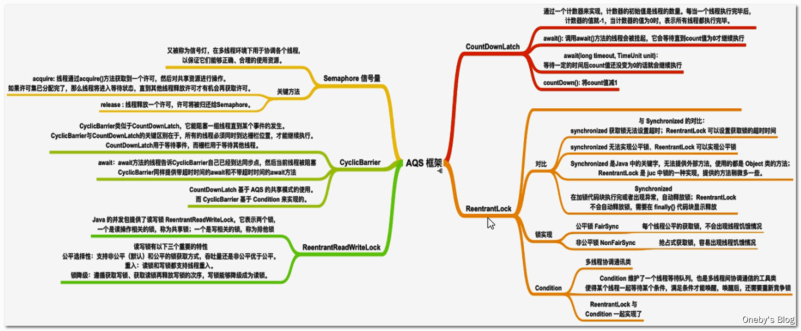

# 1. 并发编程三大特性

# 2. JMM

## 2.1. 基础结构

## 2.2. JMM 与 Java 内存区域划分的区别与联系

## 2.3. 原子操作

## 2.4. 重排序

## 2.5. 编程规则

### 2.5.1. as-if-serial

### 2.5.2. happens-before

# 3. volatile

## 3.1. 保证内存可见性

- 说明
- 原理:<br /> MESI 缓存一致性协议<br /> cpu 总线嗅探机制<br /> lock
- 总线风暴

## 3.2. 禁止重排序

- 说明
- 原理:<br />内存屏障

## 3.3. 不保证原子性

- 原因
- 解决
  - synchronized
  - Atomic(CAS)

# 4. 锁的变迁

- jdk1.5 之前:synchronized 重量锁
- jdk1.5
  - 原因
  - 变化:增加
    - Lock 锁
    - 并发容器
    - 线程池
  - 依据原理
    - Atomic--UnSafe--CAS
    - AQS
    - LockSupport
    - volatile
- jdk1.6
  - 变化:synchronized 锁的升级
  - 原因
- jdk1.8:增加 StampedLock

# 5. synchronized

## 5.1. 种使用方法

- 代码块
  - 自己指定对象锁
  - 底层原理：
    - monitorenter
    - monitorexit
    - 程序计数器
- 成员方法
  - this 对象锁
  - 底层原理：ACC_SYNCHRONIZED
- 静态方法
  - .class 类锁
  - 底层原理：ACC_SYNCHRONIZED，ACC_STATIC
- 注意：构造方法本身就属于线程安全的，不存在同步的构造方法一说。<br />不能加 synchronized

## 5.2. 锁的升级(不可逆)

- 无锁(CAS)
- 偏向锁
  - 原理
  - 锁的性质
  - 对象头中的内容
  - 升级过程
- 轻量锁
  - 原理
  - 锁的性质
  - 对象头中的内容
  - 升级过程
- 重量锁
  - 原理
  - 锁的性质
  - 对象头中的内容
  - 阻塞的好处(cpu)与代价(内核态)


## 5.3. synchronized 和 ReentrantLock 的区别

## 5.4. synchronized 和 volatile 的区别

# 6. CAS

- 乐观锁与悲观锁
- 概念
- 底层原理
- CAS 的应用：UnSafe 和 Atomic
- 问题
  - ABA 问题
    - AtomicStampedReference
    - AtomicMarkableReference
  - 循环时间长开销大
    - 解决思路是让 JVM 支持处理器提供的 pause 指令
  - 只能保证一个共享变量的原子操作
    - 使用 JDK 1.5 开始就提供的 AtomicReference 类保证对象之间的原子性，<br />把多个变量放到一个对象里面进行 CAS 操作；
    - 使用锁。锁内的临界区代码可以保证只有当前线程能操作。

# 7. Atomic

- 组成
  - 基本类型
  - 数组类型
  - 引用类型
  - 对象的属性修改类型
- AtomicInteger
  - 示例
  - 基本原理

# 8. 三种线程等待唤醒的方法(LockSupport)

> 主要是为了说LockSupport

## 8.1. Object类

### 8.1.1. 说明

Object类中的wait和notify方法实现线程等待和唤醒

> **1、正常情况：实现线程的等待和唤醒**

1. 代码

   ```java
   static Object objectLock = new Object();
   
   private static void synchronizedWaitNotify() {
       new Thread(() -> {
           synchronized (objectLock) {
               System.out.println(Thread.currentThread().getName() + "\t" + "------come in");
               try {
                   objectLock.wait(); // 等待
               } catch (InterruptedException e) {
                   e.printStackTrace();
               }
               System.out.println(Thread.currentThread().getName() + "\t" + "------被唤醒");
           }
       }, "A").start();
   
       new Thread(() -> {
           synchronized (objectLock) {
               objectLock.notify(); // 唤醒
               System.out.println(Thread.currentThread().getName() + "\t" + "------通知");
           }
       }, "B").start();
   }
   ```

2. 程序运行结果：A 线程先执行，执行 `objectLock.wait()` 后被阻塞，B 线程在 A 线程之后执行 `objectLock.notify()` 将 A线程唤醒

  ```
  A ---come in
  B ---通知
  A ---被唤醒
  ```

### 8.1.2. 异常情况

> **异常情况一：不在 synchronized 关键字中使用 wait() 和 notify() 方法**

1. 代码

   ```java
   static Object objectLock = new Object();
   
   private static void synchronizedWaitNotify() {
       new Thread(() -> {
           //synchronized (objectLock) {
           System.out.println(Thread.currentThread().getName() + "\t" + "------come in");
           try {
               objectLock.wait(); // 等待
           } catch (InterruptedException e) {
               e.printStackTrace();
           }
           System.out.println(Thread.currentThread().getName() + "\t" + "------被唤醒");
           //}
       }, "A").start();
   
       new Thread(() -> {
           //synchronized (objectLock) {
           objectLock.notify(); // 唤醒
           System.out.println(Thread.currentThread().getName() + "\t" + "------通知");
           //}
       }, "B").start();
   }
   ```

2. 程序运行结果：不在 synchronized 关键字中使用 wait() 和 notify() 方法 ，将抛出 `java.lang.IllegalMonitorStateException` 异常


> **异常情况二：先 notify() 后 wait()**

1. 代码

   ```java
   static Object objectLock = new Object();
   
   private static void synchronizedWaitNotify() {
       new Thread(() -> {
           try {
               TimeUnit.SECONDS.sleep(3L);
           } catch (InterruptedException e) {
               e.printStackTrace();
           }
           synchronized (objectLock) {
               System.out.println(Thread.currentThread().getName() + "\t" + "------come in");
               try {
                   objectLock.wait(); // 等待
               } catch (InterruptedException e) {
                   e.printStackTrace();
               }
               System.out.println(Thread.currentThread().getName() + "\t" + "------被唤醒");
           }
       }, "A").start();
   
       new Thread(() -> {
           synchronized (objectLock) {
               objectLock.notify(); // 唤醒
               System.out.println(Thread.currentThread().getName() + "\t" + "------通知");
           }
       }, "B").start();
   }
   ```

2. 程序运行结果：B 线程先执行 `objectLock.notify()`，A 线程再执行 `objectLock.wait()`，这样 A 线程无法被唤醒

---

- wait和notify方法必须要在同步块或者方法里面且成对出现使用
- 先wait后notify才OK

## 8.2. Condition接口

### 8.2.1. 说明

Condition接口中的await后signal方法实现线程的等待和唤醒

> **1、正常情况：实现线程的等待和唤醒**

1. 代码

   ```java
   static Lock lock = new ReentrantLock();
   static Condition condition = lock.newCondition();
   
   private static void lockAwaitSignal() {
       new Thread(() -> {
           lock.lock();
           try {
               System.out.println(Thread.currentThread().getName() + "\t" + "------come in");
               try {
                   condition.await();
               } catch (InterruptedException e) {
                   e.printStackTrace();
               }
               System.out.println(Thread.currentThread().getName() + "\t" + "------被唤醒");
           } finally {
               lock.unlock();
           }
       }, "A").start();
   
       new Thread(() -> {
           lock.lock();
           try {
               condition.signal();
               System.out.println(Thread.currentThread().getName() + "\t" + "------通知");
           } finally {
               lock.unlock();
           }
       }, "B").start();
   }
   ```

2. 程序运行结果：A 线程先执行，执行 `condition.await()` 后被阻塞，B 线程在 A 线程之后执行 `condition.signal()` 将 A线程唤醒

  ```
  A ---come in
  B ---通知
  A ---被唤醒
  ```

### 8.2.2. 异常情况

> **异常情况一：不在 lock() 和 unlock() 方法内使用 await() 和 signal() 方法**

1. 代码

   ```java
   static Lock lock = new ReentrantLock();
   static Condition condition = lock.newCondition();
   
   private static void lockAwaitSignal() {
       new Thread(() -> {
           //lock.lock();
           try {
               System.out.println(Thread.currentThread().getName() + "\t" + "------come in");
               try {
                   condition.await();
               } catch (InterruptedException e) {
                   e.printStackTrace();
               }
               System.out.println(Thread.currentThread().getName() + "\t" + "------被唤醒");
           } finally {
               //lock.unlock();
           }
       }, "A").start();
   
       new Thread(() -> {
           //lock.lock();
           try {
               condition.signal();
               System.out.println(Thread.currentThread().getName() + "\t" + "------通知");
           } finally {
               //lock.unlock();
           }
       }, "B").start();
   }
   ```

2. 程序运行结果：不在 lock() 和 unlock() 方法内使用 await() 和 signal() 方法，将抛出 `java.lang.IllegalMonitorStateException` 异常

> **异常情况二：先 signal() 后 await()**

1. 代码

   ```java
   static Lock lock = new ReentrantLock();
   static Condition condition = lock.newCondition();
   
   private static void lockAwaitSignal() {
       new Thread(() -> {
           try {
               TimeUnit.SECONDS.sleep(3L);
           } catch (InterruptedException e) {
               e.printStackTrace();
           }
           lock.lock();
           try {
               System.out.println(Thread.currentThread().getName() + "\t" + "------come in");
               try {
                   condition.await();
               } catch (InterruptedException e) {
                   e.printStackTrace();
               }
               System.out.println(Thread.currentThread().getName() + "\t" + "------被唤醒");
           } finally {
               lock.unlock();
           }
       }, "A").start();
   
       new Thread(() -> {
           lock.lock();
           try {
               condition.signal();
               System.out.println(Thread.currentThread().getName() + "\t" + "------通知");
           } finally {
               lock.unlock();
           }
       }, "B").start();
   }
   ```

2. 程序运行结果：B 线程先执行 `condition.signal()`，A 线程再执行 `condition.await()`，这样 A 线程无法被唤醒

  ```
  B ---通知
  A ---come in
  ```

---

> **传统的 synchronized 和 Lock 实现等待唤醒通知的约束**

- 线程先要获得并持有锁，必须在锁块（synchronized或lock）中
- 必须要先等待后唤醒，线程才能够被唤醒

## 8.3. LockSupport类

### 8.3.1. 是什么

- 用途：LockSupport 是用来创建锁和其他同步类的基本线程阻塞原语。
- 使用方式：
  - LockSupport中的park()和unpark()的作用分别是阻塞线程和解除阻塞线程，
  - 可以将其看作是线程等待唤醒机制(wait/notify)的加强版
- 原理：
  - LockSupport 类使用了一种名为 permit（许可）的概念来做到阻塞和唤醒线程的功能，
  - 每个线程都有一个许可（permit），permit 只有两个值 1 和0
  - **permit默认为0**
  - **可以把permit看成是一种（0, 1）信号量（Semaphore），但与 Semaphore 不同的是，许可的累加上限是 1**。

### 8.3.2. 主要方法


---

> **阻塞park**

- 使用：`LockSupport.park()`
- 作用:阻塞**当前线程**
- 注意：
  - permit 默认是 0，
  - 所以一开始调用 `park()` 方法，当前线程就会阻塞，
  - 直到别的线程将当前线程的 permit 设置为 1 时，`park()` 方法会被唤醒，然后会将 permit 再次设置为 0 并返回。

- 原理:park() 方法通过 Unsafe 类实现
  ```java
  // Disables the current thread for thread scheduling purposes unless the permit is available.
  public static void park() {
      UNSAFE.park(false, 0L);
  }
  ```

---

> **唤醒unpark()**

- 使用：`unpark(Thread)`
- 作用：唤醒处于阻断状态的指定线程
- 注意：
  - 调用 `unpark(thread)` 方法后，就会将 thread 线程的许可 permit 设置成 1
  - 注意多次调用 `unpark()`方法，**不会累加**，permit 值还是 1
  - 若此时有线程在阻塞，会自动唤醒 thread 线程，即之前阻塞线程中的`LockSupport.park()`方法会立即返回。

- 原理： `unpark()` 方法通过 Unsafe 类实现
  ```java
  // Makes available the permit for the given thread
  public static void unpark(Thread thread) {
      if (thread != null)
          UNSAFE.unpark(thread);
  }
  ```

### 8.3.3. 代码示例

1. 代码

   ```java
   private static void lockSupportParkUnpark() {
       Thread a = new Thread(() -> {
           System.out.println(Thread.currentThread().getName() + "\t" + "------come in");
           LockSupport.park(); // 线程 A 阻塞
           System.out.println(Thread.currentThread().getName() + "\t" + "------被唤醒");
       }, "A");
       a.start();
   
       new Thread(() -> {
           LockSupport.unpark(a); // B 线程唤醒线程 A
           System.out.println(Thread.currentThread().getName() + "\t" + "------通知");
       }, "B").start();
   }
   ```

2. 程序运行结果：A 线程先执行 `LockSupport.park()` 方法将通行证（permit）设置为 0，其实这并没有什么鸟用，因为 permit 初始值本来就为 0，然后 B 线程执行 `LockSupport.unpark(a)` 方法将 permit 设置为 1，此时 A 线程可以通行

  ```
  A ---come in
  B ---通知
  A ---被唤醒
  ```

### 8.3.4. 异常情况

> 先 unpark() 后 park()

1. 代码

   ```java
   private static void lockSupportParkUnpark() {
       Thread a = new Thread(() -> {
           try {
               TimeUnit.SECONDS.sleep(3L);
           } catch (InterruptedException e) {
               e.printStackTrace();
           }
           System.out.println(Thread.currentThread().getName() + "\t" + "------come in" + System.currentTimeMillis());
           LockSupport.park();
           System.out.println(Thread.currentThread().getName() + "\t" + "------被唤醒" + System.currentTimeMillis());
       }, "A");
       a.start();
   
       new Thread(() -> {
           LockSupport.unpark(a);
           System.out.println(Thread.currentThread().getName() + "\t" + "------通知");
       }, "B").start();
   }
   ```

2. 程序运行结果：因为引入了通行证的概念，所以先唤醒（`unpark()`）其实并不会有什么影响，从程序运行结果可以看出，A 线程执行 `LockSupport.park()` 时并没有被阻塞
  ```
  A ---come in
  B ---通知
  A ---被唤醒
  ```

---

> 异常情况：没有考虑到 permit 上限值为 1

1. 代码

   ```java
   private static void lockSupportParkUnpark() {
       Thread a = new Thread(() -> {
           try {
               TimeUnit.SECONDS.sleep(3L);
           } catch (InterruptedException e) {
               e.printStackTrace();
           }
           System.out.println(Thread.currentThread().getName() + "\t" + "------come in" + System.currentTimeMillis());
           LockSupport.park();
           LockSupport.park();
           System.out.println(Thread.currentThread().getName() + "\t" + "------被唤醒" + System.currentTimeMillis());
       }, "A");
       a.start();
   
       new Thread(() -> {
           LockSupport.unpark(a);
           LockSupport.unpark(a);
           System.out.println(Thread.currentThread().getName() + "\t" + "------通知");
       }, "B").start();
   }
   ```

2. 程序运行结果：由于 permit 的上限值为 1，所以执行两次 `LockSupport.park()` 操作将导致 A 线程阻塞
  ```
  B -----通知
  A -----come in1609053197873
  ```


### 8.3.5. 总结

- 以前的两种方式：
  - 以前的等待唤醒通知机制必须synchronized里面执行wait和notify，在lock里面执行await和signal，这上面这两个都必须要持有锁才能干

- LockSupport：俗称锁中断，LockSupport 解决了 synchronized 和 lock 的痛点
  - 优势1：LockSupport不用持有锁块，不用加锁，程序性能好
  - 优势2：无须注意唤醒和阻塞的先后顺序，不容易导致卡死

---

- **1、LockSupport是用来创建锁和其他同步类的基本线程阻塞原语**
  - LockSupport是一个线程阻塞工具类，所有的方法都是静态方法，可以让线程在任意位置阻塞，阻塞之后也有对应的唤醒方法。
  - 归根结底，LockSupport调用的Unsafe中的native代码。

- **2、LockSupport提供park()和unpark()方法实现阻塞线程和解除线程阻塞的过程**
  - LockSupport和每个使用它的线程都有一个许可(permit)关联。permit相当于1，0的开关，默认是0，
  - 调用一次unpark就加1变成1，调用一次park会消费permit，也就是将1变成0，同时park立即返回。
  - 如再次调用park会变成阻塞(因为permit为零了会阻塞在这里，一直到permit变为1)，这时调用unpark会把permit置为1。
  - 每个线程都有一个相关的permit，permit最多只有一个，重复调用unpark也不会积累凭证。

- **3、形象的理解**:线程阻塞需要消耗凭证(permit)，这个凭证最多只有1个。
  - 当调用park方法时
    - 如果有凭证，则会直接消耗掉这个凭证然后正常退出;
    - 如果无凭证，就必须阻塞等待凭证可用;
  - 而unpark则相反，它会增加一个凭证，但凭证最多只能有1个，累加无效。

### 8.3.6. 相关问题

- park 底层使用的是`UNSAFE.park`
- 为什么 LockSupport 也是核心基础类? AQS 框架借助于两个类：Unsafe(提供 CAS 操作)和 LockSupport(提供 park/unpark 操作)
- 写出分别通过 wait/notify 和 LockSupport 的 park/unpark 实现同步?
- LockSupport.park()会释放锁资源吗? 那么 Condition.await()呢?
- Thread.sleep()、Object.wait()、Condition.await()、LockSupport.park()的区别? **重点**
- 如果在 wait()之前执行了 notify()会怎样? 如果在 park()之前执行了 unpark()会怎样?

### 8.3.7. 底层原理

LockSupport和Atomic类都是调用的Unsafe类中的方法。

[Unsafe类park和unpark方法源码深入分析（mutex+cond)](https://blog.csdn.net/saintyyu/article/details/107426428)


# 9. AQS

## 9.1. 概念

- **AQS**是`AbstractQueuedSynchronizer`的简称，即`抽象队列同步器`，从字面意思上理解:
  - 抽象：抽象类，只实现一些主要逻辑，有些方法由子类实现；
  - 队列：使用先进先出（FIFO）队列存储数据；
  - 同步：实现了同步的功能。

- 作用：
  - AQS是一个用来构建锁和同步器的框架，使用AQS能简单且高效地构造出应用广泛的同步器
  - 只要子类实现它的几个`protected`方法就可以了，
  - 比如我们提到的ReentrantLock，Semaphore，ReentrantReadWriteLock，SynchronousQueue，FutureTask等等皆是基于AQS的。

---

一般我们说的 AQS 指的是 `java.util.concurrent.locks` 包下的 AbstractQueuedSynchronizer，但其实还有另外三种抽象队列同步器：`AbstractOwnableSynchronizer`、`AbstractQueuedLongSynchronizer` 和 `AbstractQueuedSynchronizer`


## 9.3. 底层依赖

- Unsafe(提供 CAS 操作)
- LockSupport(提供 park/unpark 操作)
  - LockSupport底层又是Unsafe

## 9.4. 原理

### 9.4.1. state

### 9.4.2. CLH

## 源码分析

待整理（重要）

[AQS源码分析](https://www.cnblogs.com/waterystone/p/4920797.html)

[AQS详解](https://www.cnblogs.com/chengxiao/archive/2017/07/24/7141160.html)

### 模板设计模式


### acquire

```java
public final void acquire(int arg) {
    if (!tryAcquire(arg) &&
        acquireQueued(addWaiter(Node.EXCLUSIVE), arg))
        selfInterrupt();
}
```

- aquire()方法为获取资源的入口
- tryAcquire()尝试直接去获取资源，如果成功则直接返回（这里体现了非公平锁，每个线程获取锁时会尝试直接抢占加塞一次，而CLH队列中可能还有别的线程在等待）；
- 如果无法获取资源就会执行addWaiter，addWaiter()将该线程加入等待队列的尾部，并标记为独占模式；
- acquireQueued()使线程阻塞在等待队列中获取资源，一直获取到资源后才返回。如果在整个等待过程中被中断过，则返回true，否则返回false。
- 如果线程在等待过程中被中断过，它是不响应的。只是获取资源后才再进行自我中断selfInterrupt()，将中断补上。


### release

### acquireShared

### releaseShared

## AQS组件

### 总览




### ReentrantLock

### ReentrantReadWriteLock

### Semaphore

### CountDownLatch

### CyclicBarrier

<!--

- 其他
  - AOS
  - AQLS

-->

## 其他通信工具类


## 自定义Mutex

# 10. 锁、通信工具类

- AQS 实现的锁(实现 Lock 接口)
  - ReentrantLock
    - 内部类 Sync 继承 AQS
    - Condition 底层使用 LockSupport
  - ReentrantReadWriteLock
    - 读锁和写锁都有继承 AQS 的内部类 Sync
- AQS 通信工具类
  - Semaphore
    - 内部有一个继承了 AQS 的同步器 Sync
  - CountDownLatch
    - 内部有一个继承了 AQS 的同步器 Sync
  - CyclicBarrier
    - 内部使用 ReentrantLock
- 非 AQS 的通信工具类
  - Exchanger
    - LockSupport
    - CAS(Atomic)
  - Phaser
    - 有使用 LockSupport

# 11. 锁的种类

## 11.1. 锁的有无

- 乐观锁
- 悲观锁

## 11.2. synchronized 的锁

- 无锁
- 偏向锁
- 轻量锁
- 重量锁

## 11.3. 锁的性质分类

### 11.3.1. 可重入锁和非可重入锁

- 表现
- 原理：粒度（加锁范围）
- 实例
  - 可重入锁
  - 不可重入锁
  - 可以切换

### 11.3.2. 公平锁与非公平锁

- 表现
- 原理
- 实例
  - 公平锁
  - 非公平锁
  - 可以切换

### 11.3.3. 读写锁和排它锁

- 表现
- 原理
- 实例
  - 读写锁
  - 排它锁
  - 可以切换
- 是否可中断

# 12. 并集合容器

- [什么是同步容器和并发容器](https://juejin.cn/post/6844903954719965192)

- 同步容器

  - vector:在面对多线程下的复合操作的时候也是需要通过客户端加锁的方式保证原子性
  - HashTable
  - Collections 下的各种 SynchronizedXXX

- 并发容器
  - Queue
    - BlockingQueue
      - ArrayBlockingQueue
      - LinkedBlockingQueue
      - DelayQueue
      - Priority BlockingQueue
      - SynchronousQueue
      - LinkedBlockingDeque
      - LinkedTransferQueue
    - ConcurrenLinkedQueue
      - [LinkedBlockingQueue 与 ConcurrentLinkedQueue 的区别](https://blog.csdn.net/lzxlfly/article/details/86710382)
  - ConcurrentMap
    - ConcurrentHashMap
    - ConcurrentNavigableMap
    - ConcurrentSkipListMap
  - CopyOnWrite
    - CopyOnWriteArrayList
    - CopyOnWriteArrayMap
    - CopyOnWriteArraySet

# 13. 线程池

## 13.1. 结构

- 任务(Runnable /Callable)
- 任务的执行(Executor)
- 异步计算的结果(Future)

## 13.2. 创建

### 13.2.1. ThreadPoolExecutor 构造方法参数的含义

- int corePoolSize：该线程池中核心线程数最大值
- int maximumPoolSize：该线程池中线程总数最大值 。
- long keepAliveTime：非核心线程闲置超时时长。
- TimeUnit unit：keepAliveTime 的单位。
- BlockingQueue workQueue：阻塞队列，维护着等待执行的 Runnable 任务对象。
- ThreadFactory threadFactory：<br />创建线程的工厂 ，用于批量创建线程，统一在创建线程时设置一些参数，<br/>如是否守护线程、线程的优先级等。<br />如果不指定，会新建一个默认的线程工厂。
- RejectedExecutionHandler handler 拒绝策略
  - AbortPolicy：默认拒绝处理策略，丢弃任务并抛出 RejectedExecutionException 异常。
  - DiscardPolicy：丢弃新来的任务，但是不抛出异常。
  - DiscardOldestPolicy：丢弃队列头部（最旧的）的任务，然后重新尝试执行程序（如果再次失败，重复此过程）。
  - CallerRunsPolicy：由调用线程处理该任务。

### 13.2.2. Executors 默认实现

(底层使用 ThreadPoolExecutor)

- FixedThreadPool
  - 参数设置
  - 执行过程
  - 弊端
- CachedThreadPool
  - 参数设置
  - 执行过程
  - 弊端
- SingleThreadExecutor
  - 参数设置
  - 执行过程
  - 弊端

### 13.2.3. 为什么不要用默认实现

(上面的默认实现有什么弊端)

## 13.3. 线程池工作流程

## 13.4. 非核心线程的回收

待补充（重要）

[深入讲解](https://segmentfault.com/a/1190000039815066)

## 13.5. ThreadPool 状态转换

- RUNNING
- SHUTDOWN
- STOP
- TIDYING
- TERMINATED

## 13.6. ScheduledThreadPool:

- 继承了 ThreadPoolExecutor
- 主要用来在给定的延迟后运行任务，或者定期执行任务
- 实际项目中会使`用quartz`

## 13.7. 参数如何设置

## 13.8. 异常线程处理

[异常线程处理](https://mp.weixin.qq.com/s?__biz=Mzg3NjU3NTkwMQ==&mid=2247505057&idx=1&sn=621ebc409b589478e2e05388e079d8c0&source=41#wechat_redirect)

# 14. ThreadLocal

看上面三种等待唤醒的方法

# 15. 常见区别

- sumbit() vs execute()
  - execute()方法不会返回结果
  - submit()会返回一个 FutureTask 对象，并可以获得结果
  - [异常处理](https://www.jianshu.com/p/29610984f1dd)
- Runnable vs Callable
- shutdown() vs shutdownNow()

# 16. 参考文献


