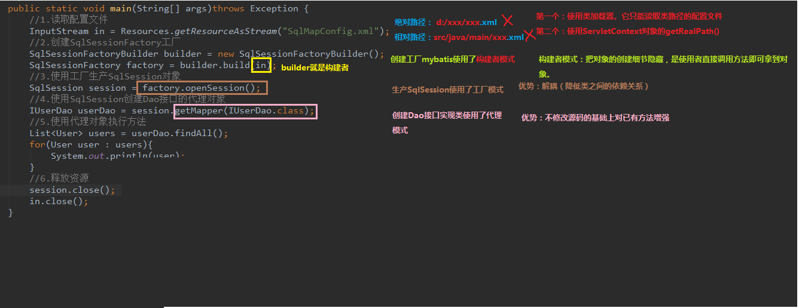

> 官方文档：https://mybatis.org/mybatis-3/zh/index.html

# 1. 基础

## 1.1. mubatis入门

- 框架：
    - 概念：
        - 半成品软件
        - 封装了很多细节，使开发者可以通过极简的方式实现功能，提高效率
    - 目的：对三层架构的封装
    - 三层架构
      > 
        - 持久层解决方案（非框架）
            - jdbc -- 规范
            - Spring的JDBCTemplate -- 简单封装
            - Apache的DBUtils
    - 持久层总图
      > 
- mybatis概述
    - 持久层框架，java编写
    - 封装了很多jdbc细节，使开发者只用关注sql语句本身，而不用关注注册驱动等繁杂过程
    - 它使用了ORM思想，实现了结果集的封装
        - Object Relation Mapping对象关系映射
        - 把数据库表和实体类及实体类的属性对应起来，使操作实体类就能操作数据库表
            > 实体类中的属性和数据库表中的字段名保持一致

## 1.2. mybatis环境搭建

> 此处主要是使用xml，注解会在后面演示
- mybatis环境搭建
    - maven导入包
        - mybatis
        - mysql-connect-java
        - log4j（也要导入配置文件）
        - junit
    - 创建实体类（实现Serializable接口？）
    - 创建dao接口
        ```java
        package com.itheima.dao;

        import com.itheima.domain.User;

        import java.util.List;

        /**
        * @author 黑马程序员
        * @Company http://www.ithiema.com
        *
        * 用户的持久层接口
        */
        public interface IUserDao {

                /**
                * 查询所有操作
                * @return
                */
                List<User> findAll();
        }
        ```
    - 创建一个xml文件（习惯名称：SqlMapConfig.xml）
    - 添加xml文件的mybatis约束
        ```xml
        <?xml version="1.0" encoding="UTF-8"?>
        <!DOCTYPE configuration  
            PUBLIC "-//mybatis.org//DTD Config 3.0//EN"  
            "http://mybatis.org/dtd/mybatis-3-config.dtd">

        ```
    - 配置xml文件
        ```xml
        <?xml version="1.0" encoding="UTF-8"?>
        <!DOCTYPE configuration
                        PUBLIC "-//mybatis.org//DTD Config 3.0//EN"
                        "http://mybatis.org/dtd/mybatis-3-config.dtd">
        
        <!-- mybatis的主配置文件 -->
        <configuration>
                <!-- 配置环境 -->
                <environments default="mysql"> <!-- 默认使用配置名称 -->

                        <!-- 配置mysql的环境-->
                        <environment id="mysql">
                                <!-- 配置事务的类型-->
                                <transactionManager type="JDBC"></transactionManager>

                                <!-- 配置数据源（连接池） -->
                                <!-- 一共有三种类型，后面再讲 -->
                                <dataSource type="POOLED">

                                        <!-- 配置连接数据库的4个基本信息 -->
                                        <property name="driver" value="com.mysql.jdbc.Driver"/>
                                        <property name="url" value="jdbc:mysql://localhost:3306/eesy_mybatis"/>
                                        <property name="username" value="root"/>
                                        <property name="password" value="1234"/>
                                </dataSource>
                        </environment>
                </environments>

                <!-- 指定映射配置文件的位置，映射配置文件指的是每个dao独立的配置文件 -->
                <mappers>
                        <mapper resource="com/itheima/dao/IUserDao.xml"/><!-- mapper路径 -->
                </mappers>
        </configuration>

        ```
    - 创建mapper文件，添加mapper约束
        ```xml
        <?xml version="1.0" encoding="UTF-8"?>
        <!DOCTYPE mapper
                        PUBLIC "-//mybatis.org//DTD Mapper 3.0//EN"
                        "http://mybatis.org/dtd/mybatis-3-mapper.dtd">
        ```
    - 添加配置
        ```xml
        <?xml version="1.0" encoding="UTF-8"?>
        <!DOCTYPE mapper
                        PUBLIC "-//mybatis.org//DTD Mapper 3.0//EN"
                        "http://mybatis.org/dtd/mybatis-3-mapper.dtd">

        <mapper namespace="com.itheima.dao.IUserDao">

                <!--配置查询所有-->
                <select id="findAll" resultType="com.itheima.domain.User"> <!-- 这里一定要与方法名称相对应，以及一定要告知封装到的实体类 -->
                        select * from user;
                </select>
        </mapper>
        ```
    - 注意事项
        - mybatis中将持久层（dao层）的操作接口名称叫做mapper，比如`UserDao`和`UserMapper`是相同意思
        - 在映射配置文件中要指明封装到的实体类的全限定类名
        - mybatis映射文件位置必须和dao接口的包结构相同。
            ```
            ├─src
            │  ├─main
            │  │  ├─java
            │  │  │  └─com
            │  │  │      └─itheima
            │  │  │          ├─dao
            │  │  │          │      IUserDao.java
            │  │  │          │
            │  │  │          └─domain
            │  │  │                  User.java
            │  │  │
            │  │  └─resources
            │  │      │  log4j.properties
            │  │      │  SqlMapConfig.xml
            │  │      │
            │  │      └─com
            │  │          └─itheima
            │  │              └─dao
            │  │                      IUserDao.xml
            │  │
            │  └─test
            │      └─java
            │          └─com
            │              └─itheima
            │                  └─test
            │                          MybatisTest.java
            ```
        - 映射配置文件的mapper标签，nampspace属性取值，必须是dao接口的全限定类名
        - 映射配置文件的操作配置，id属性的取值必须是dao接口的方法名
        - **遵从后三个条件后，就不用再写dao的实现类，而只通过mybatis实现**


## 1.3. mybatis入门案例

```java
/**
 * @author 黑马程序员
 * mybatis的入门案例
 */
public class MybatisTest {

    /**
     * 入门案例
     * @param args
     */
    public static void main(String[] args)throws Exception {
        //1.读取配置文件
                // 注意，配置文件路径的读取是按照编译后资源文件所在位置，而不是开发的目录结构。maven会把资源文件放到target/classes下，而不会按照开发目录编写
        InputStream in = Resources.getResourceAsStream("SqlMapConfig.xml");
        //2.创建SqlSessionFactory工厂
        SqlSessionFactoryBuilder builder = new SqlSessionFactoryBuilder();
        SqlSessionFactory factory = builder.build(in);
        //3.使用工厂生产SqlSession对象
        SqlSession session = factory.openSession();
        //4.使用SqlSession创建Dao接口的代理对象
        IUserDao userDao = session.getMapper(IUserDao.class);
        //5.使用代理对象执行方法
        List<User> users = userDao.findAll();
        for(User user : users){
            System.out.println(user);
        }
        //6.释放资源
        session.close();
        in.close();
    }
}


```
- 图解
    > 
- 注意：
    - **配置文件路径的读取是按照编译后资源文件所在位置，而不是开发的目录结构。**
    - **maven会把资源文件放到target/classes下，而不会按照开发目录编写**
    - 所以这里会有`InputStream in = Resources.getResourceAsStream("SqlMapConfig.xml");`

- 基于注解的入门案例
    - 把IUserDao.xml移除，在dao接口方法上使用@Select注解并且指定sql语句
    - 在SqlMapConfig.xml中配置mapper标签时，修改使用class属性指定dao接口的权限定类名
        ```xml
        <mapper resource="com/itheima/dao/IUserDao.xml"/>
        <!-- 改为 -->
        <mapper class="com.ithema.IUserDao">
        ```

## 1.4. 自定义实现dao类入门（了解）

- 明确：
    - 在实际开发中，越简便越好
    - 尽管使用mybatis框架，也支持自己写实现类
    - 但通常不采用使用dao实现类的方式，直接使用框架
    - 使用自定义实现类演示（看看就行）：
        ```java
        // test.java
        public static void main(String[] args)throws Exception {
                        //1.读取配置文件
                        InputStream in = Resources.getResourceAsStream("SqlMapConfig.xml");
                        //2.创建SqlSessionFactory工厂
                        SqlSessionFactoryBuilder builder = new SqlSessionFactoryBuilder();
                        SqlSessionFactory factory = builder.build(in);

                        // 3将工厂传进去
                        userdao = new UserDaoImpl(factory);

                        //6.使用对象执行方法
                        List<User> users = userDao.findAll();
                        for(User user : users){
                                System.out.println(user);
                        }
                        //7.释放资源
                        session.close();
                        in.close();
        }
        ```
        ```java
        //实现类
        /**
        * @author 黑马程序员
        */
        public class UserDaoImpl implements IUserDao {

                private SqlSessionFactory factory;

                public UserDaoImpl(SqlSessionFactory  factory){
                        this.factory = factory;
                }

                public List<User> findAll(){
                        //4.使用工厂创建SqlSession对象
                        SqlSession session = factory.openSession();
                        //5.使用session执行 查询所有 方法
                        // * 注意：这里使用的是namespage.id 只有id时不行的。指定这个是为了找到配置的sql语句
                        List<User> users = session.selectList("com.itheima.dao.IUserDao.findAll");
                        session.close();
                        //返回查询结果
                        return users;
                }
        }
        
        ```

## 1.5. 自定义mybatis框架

> 为了了解执行细节

- 分析
  - 基本思路分析
      > 
    - 流程图
        > 
- 在source/src下有相关实现代码。因为比较复杂这里就没细说

# 2. 基本使用

## 2.1. 单表crud操作

### 2.1.1. xml内容

- 查询
    - 单个查询（前面）
    - 模糊查询
        - 两种方式：
            - `select * from user where username like #{name}`
            - `select * from user where username like '%${value}%'`（不推荐）
        - 两种方式区别：
            > 
        ```xml
            <!-- 根据名称模糊查询 -->
            <select id="findByName" parameterType="string" resultType="com.ithema.domain.User">
                        <!-- 百分号要在调用时提供 -->
                        select * from user where username like #{name}

                    <!-- 也可以写成下面那样，百分号写到sql中，但是${}中只能写'value'，并且不安全。不推荐。 -->
                    <!-- select * from user where username like '%${value}%'-->
            </select>
        ```
    - 使用聚合函数
        ```xml
            <!-- 获取用户的总记录条数 -->
            <select id="findTotal" resultType="int">
                    select count(id) from user;
            </select>
        ```
- 插入
    - 使用`#{属性名}`来获取值（属性定义见javabean）
    - 注意：默认不会自动提交，需要调用`sqlSession.commit();`;
    - 示例：
    ```xml
    <!-- 保存用户 -->
    <insert id="saveUser" parameterType="com.itheima.domain.User">
        <!-- 配置插入操作后，获取插入数据的id -->
        <selectKey keyProperty="id" keyColumn="id" resultType="int" order="AFTER">
                <!-- 
                    keyProperty:对应类中的名称。saveUser(user)，后会读取对象数据进行插入，同时也会为对象中的id属性值
                    keyColumn:想要查询的数据库中的字段名称
                    resultType:返回值类型
                    order：什么时候进行这个操作（after就是指执行完下面的插入语句后）
                 -->
            select last_insert_id();
                        <!-- last_insert_id()为mysql中的一个函数 -->
        </selectKey>
                <!--上面一块只有在想获得插入记录的id时需要写上（id自增长）。 -->

        insert into user(username,address,sex,birthday)values(#{userName},#{userAddress},#{userSex},#{userBirthday});
    </insert>
    ```
- 更新
    - 参数类型名为全类名
    - 里面的要为属性名
    - 同样要进行手动提交
    - 示例
        ```xml
    <!-- 更新用户 -->
    <update id="updateUser" parameterType="com.itheima.domain.User">
        update user set username=#{userName},address=#{userAddress},sex=#{userAex},birthday=#{userBirthday} where id=#{userId}
    </update>
        ```
- 删除
    - 传入id删除用户
    - `parameterType`的类型可以是`int`,`Integer`,`java.lang.Integer`。
        > 原因在`typeAliases`标签
    - 当只有一个参数时`#{占位符}`，就行，占位符没有任何名称要求
    - 示例
    ```xml
    <!-- 删除用户-->
    <delete id="deleteUser" parameterType="java.lang.Integer">
        delete from user where id = #{uid}
    </delete>
    ```

### 2.1.2. java测试代码（全部）
```java
/**
* 测试mybatis的crud操作
*/
public class MybatisTest {

        private InputStream in;
        private SqlSession sqlSession;
        private IUserDao userDao;

        @Before//用于在测试方法执行之前执行
        public void init()throws Exception{
                //1.读取配置文件，生成字节输入流
                in = Resources.getResourceAsStream("SqlMapConfig.xml");
                //2.获取SqlSessionFactory
                SqlSessionFactory factory = new SqlSessionFactoryBuilder().build(in);
                //3.获取SqlSession对象
                sqlSession = factory.openSession();
                //4.获取dao的代理对象
                userDao = sqlSession.getMapper(IUserDao.class);
        }

        @After//用于在测试方法执行之后执行
        public void destroy()throws Exception{
                //手动提交事务
                sqlSession.commit();
                //6.释放资源
                sqlSession.close();
                in.close();
        }

        /**
        * 测试查询所有
        */
        @Test
        public void testFindAll(){
                //5.执行查询所有方法
                List<User> users = userDao.findAll();
                for(User user : users){
                        System.out.println(user);
                }

        }

        /**
        * 测试保存操作
        */
        @Test
        public void testSave(){
                User user = new User();
                user.setUserName("modify User property");
                user.setUserAddress("北京市顺义区");
                user.setUserSex("男");
                user.setUserBirthday(new Date());
                System.out.println("保存操作之前："+user);
                //5.执行保存方法
                userDao.saveUser(user);

                System.out.println("保存操作之后："+user);
        }

        /**
        * 测试更新操作
        */
        @Test
        public void testUpdate(){
                User user = new User();
                user.setUserId(50);
                user.setUserName("mybastis update user");
                user.setUserAddress("北京市顺义区");
                user.setUserSex("女");
                user.setUserBirthday(new Date());

                //5.执行保存方法
                userDao.updateUser(user);
        }

        /**
        * 测试删除操作
        */
        @Test
        public void testDelete(){
                //5.执行删除方法
                userDao.deleteUser(48);
        }

        /**
        * 测试删除操作
        */
        @Test
        public void testFindOne(){
                //5.执行查询一个方法
                User  user = userDao.findById(50);
                System.out.println(user);
        }

        /**
        * 测试模糊查询操作
        */
        @Test
        public void testFindByName(){
                //5.执行查询一个方法
                List<User> users = userDao.findByName("%王%");
        //        List<User> users = userDao.findByName("王");
                for(User user : users){
                        System.out.println(user);
                }
        }

        /**
        * 测试查询总记录条数
        */
        @Test
        public void testFindTotal(){
                //5.执行查询一个方法
                int count = userDao.findTotal();
                System.out.println(count);
        }
}

```

## 2.2. 参数和返回值

- ognl表达式（Object Graphic Navigation Language）
    > 对象名导航语言。<br>
    > 使用方式和jsp中的el表达式差不多
    - apache开发出的
    - 通过对象的取值方法获取数据。在写法上把get省略
        - 类中：`user.getUsername()`
        - ognl：`user.username`
    - mybatis中，因为parameterType已经提供了属性所属的类，所以直接使用`#{username}`即可
- parameterType
    - 传递单个参数
        - 传递简单对象
        - 传递pojo对象（javabean对象）
            - mybatis使用ognl表达式解析对象字段的值
        - 传递pojo包装对象（pojo对象作为某个对象的属性）（和下面javabean传参法类似）
            ```xml
                <!-- 根据queryVo的条件查询用户 -->
                <select id="findUserByVo" parameterType="com.itheima.domain.QueryVo" resultType="com.ithema.domain.User">
                        select * from user where username like #{user.username}
                        <!-- 相当于vo.getUser().getUsername() -->
                </select>
            ```
            ```java
                /**
                * 测试使用QueryVo作为查询条件
                */
                @Test
                public void testFindByVo(){
                        QueryVo vo = new QueryVo();
                        User user = new User();
                        user.setUserName("%王%");
                        vo.setUser(user);
                        //5.执行查询一个方法
                        List<User> users = userDao.findUserByVo(vo);
                        for(User u : users){
                                System.out.println(u);
                        }
                }
            ```
    - 传递多个参数
        - 顺序传参法
            > #{}里面的数字代表你传入参数的顺序。<br>
            > 这种方法不建议使用，sql层表达不直观，且一旦顺序调整容易出错。
            ```java
                public User selectUser(String name, int deptId);
            ```
            ```xml
                <select id="selectUser" resultMap="UserResultMap">
                        select * from user
                        where user_name = #{0} and dept_id = #{1}
                </select>
            ```
        - @Param注解传参法
            > #{}里面的名称对应的是注解 @Param括号里面修饰的名称。<br>
            > 这种方法在参数不多的情况还是比较直观的，推荐使用
            ```java
            public User selectUser(@Param("userName") String name, int @Param("deptId") deptId);
            ```
            ```xml
                <select id="selectUser" resultMap="UserResultMap">
                        select * from user
                        where user_name = #{userName} and dept_id = #{deptId}
                </select>
            ```
        - Map传参法
            > #{}里面的名称对应的是 Map里面的key名称。<br>
            > 这种方法适合传递多个参数，且参数易变能灵活传递的情况。
            ```java
            public User selectUser(Map<String, Object> params);
            ```
            ```xml
                <select id="selectUser" parameterType="java.util.Map" resultMap="UserResultMap">
                        select * from user
                        where user_name = #{userName} and dept_id = #{deptId}
                </select>
            ```
        - Java Bean传参法
            > #{}里面的名称对应的是 User类里面的成员属性。<br>
            > 这种方法很直观，但需要建一个实体类，扩展不容易，需要加属性，看情况使用。
            ```java
            public User selectUser(User params);
            ```
            ```xml
                <select id="selectUser" parameterType="com.test.User" resultMap="UserResultMap">
                        select * from user
                        where user_name = #{userName} and dept_id = #{deptId}
                </select>
            ```

- 返回值
    - 当对象中属性名称和数据库字段名称不相同时就会无法将数据封装
    - 解决方式：
        > 最好还是能属性名和列名相同
        - 查询时在sql语句中起别名。**执行效率高**
            > `select name as useName from user`
        - xml中进行配置。**效率低，但开发效率高**
            - 配置查询结果的列名和实体类的属性名的对应关系
                ```xml
                    <!-- 配置 查询结果的列名和实体类的属性名的对应关系 -->
                    <!-- id为这个映射的名称，type表示对应实体类。 -->
                    <!-- 因此一个map映射就能表示一张表到一个实体类的封装 -->
                    <resultMap id="userMap" type="com.ithema.domain.User">
                            <!-- 主键字段的对应 -->
                            <!-- 复合主键的话就多个id标签 -->
                            <id property="userId" column="id"></id>
                            <!-- property对应java中的属性名，严格区分大小写 -->
                            <!--非主键字段的对应。-->
                            <result property="userName" column="username"></result>
                            <result property="userAddress" column="address"></result>
                            <result property="userSex" column="sex"></result>
                            <result property="userBirthday" column="birthday"></result>
                    </resultMap>
                ```
            - 下面标签中的`resultType`属性换为`resultMap`属性
                ```xml
                    <!-- 当数据库字段名和类中属性名相同时会一一对应，不需要额外映射，使用resultType即可。 -->
                    <!-- 但不相同时 -->
                    <!-- 这里需要指定使用那个 resultMap -->
                    <select id="findByName" parameterType="string" resultMap="userMap">
                        select * from user where username like #{name}
                    </select>
                ```

## 2.3. dao编写（了解）

> 不多说了，了解即可
```java
public class UserDaoImpl implements IUserDao {

    private SqlSessionFactory factory;

    public UserDaoImpl(SqlSessionFactory factory){
        this.factory = factory;
    }

    @Override
    public List<User> findAll() {
        //1.根据factory获取SqlSession对象
        SqlSession session = factory.openSession();
        //2.调用SqlSession中的方法，实现查询列表
        List<User> users = session.selectList("com.itheima.dao.IUserDao.findAll");//参数就是能获取配置信息的key
        //3.释放资源
        session.close();
        return users;
    }

    @Override
    public void saveUser(User user) {
        //1.根据factory获取SqlSession对象
        SqlSession session = factory.openSession();
        //2.调用方法实现保存
        session.insert("com.itheima.dao.IUserDao.saveUser",user);
        //3.提交事务
        session.commit();
        //4.释放资源
        session.close();
    }

    @Override
    public void updateUser(User user) {
        //1.根据factory获取SqlSession对象
        SqlSession session = factory.openSession();
        //2.调用方法实现更新
        session.update("com.itheima.dao.IUserDao.updateUser",user);
        //3.提交事务
        session.commit();
        //4.释放资源
        session.close();
    }

    @Override
    public void deleteUser(Integer userId) {
        //1.根据factory获取SqlSession对象
        SqlSession session = factory.openSession();
        //2.调用方法实现更新
        session.update("com.itheima.dao.IUserDao.deleteUser",userId);
        //3.提交事务
        session.commit();
        //4.释放资源
        session.close();
    }

    @Override
    public User findById(Integer userId) {
        //1.根据factory获取SqlSession对象
        SqlSession session = factory.openSession();
        //2.调用SqlSession中的方法，实现查询一个
        User user = session.selectOne("com.itheima.dao.IUserDao.findById",userId);
        //3.释放资源
        session.close();
        return user;
    }

    @Override
    public List<User> findByName(String username) {
        //1.根据factory获取SqlSession对象
        SqlSession session = factory.openSession();
        //2.调用SqlSession中的方法，实现查询列表
        List<User> users = session.selectList("com.itheima.dao.IUserDao.findByName",username);
        //3.释放资源
        session.close();
        return users;
    }

    @Override
    public int findTotal() {
        //1.根据factory获取SqlSession对象
        SqlSession session = factory.openSession();
        //2.调用SqlSession中的方法，实现查询一个
        Integer count = session.selectOne("com.itheima.dao.IUserDao.findTotal");
        //3.释放资源
        session.close();
        return count;
    }
}

```

- 自定义dao实现类mybatis源码执行过程分析(**※重要**)：
    > 
- mybatis使用源码执行过程(**※重要**)：
    > 
    > 到达selectList的过程与自己写的dao实现类代码相对应

## 2.4. 配置细节

### 2.4.1. properties标签

- 可以在`configuration`标签内写。然后再进行调用
    ```xml
    <properties>
        <property name="driver" value="com.mysql.jdbc.Driver"></property>
        <property name="url" value="jdbc:mysql://localhost:3306/eesy_mybatis"></property>
        <property name="username" value="root"></property>
        <property name="password" value="1234"></property>
    </properties>

    <!--配置环境-->
    <environments default="mysql">
        <!-- 配置mysql的环境-->
        <environment id="mysql">
            <!-- 配置事务 -->
            <transactionManager type="JDBC"></transactionManager>

            <!--配置连接池-->
            <dataSource type="POOLED">
                <property name="driver" value="${driver}"></property>
                <property name="url" value="${url}"></property>
                <property name="username" value="${username}"></property>
                <property name="password" value="${password}"></property>
            </dataSource>
        </environment>
    </environments>
    ```
- 也可以使用外部文件
    - resource:直接用类路径就好（注意，是按照编译后的路径。）
    - url：
      - http，https协议
      - file协议
      ```properties
      jdbc.driver=com.mysql.jdbc.Driver
      jdbc.url=jdbc:mysql://localhost:3306/eesy_mybatis
      jdbc.username=root
      jdbc.password=1234
      ```
      ```xml
      <!-- 配置properties
          可以在标签内部配置连接数据库的信息。也可以通过属性引用外部配置文件信息
          resource属性： 常用的
              用于指定配置文件的位置，是按照类路径的写法来写，并且必须存在于类路径下。
          url属性：
              是要求按照Url的写法来写地址
              URL：Uniform Resource Locator 统一资源定位符。它是可以唯一标识一个资源的位置。
              它的写法：
                  http://localhost:8080/mybatisserver/demo1Servlet
                  协议      主机     端口       URI

              URI:Uniform Resource Identifier 统一资源标识符。它是在应用中可以唯一定位一个资源的。
        -->
      <properties url="file:///D:/IdeaProjects/day02_eesy_01mybatisCRUD/src/main/resources/jdbcConfig.properties">
      </properties>

          <!-- 在下方进行调用 -->
      ```

### 2.4.2. typeAliases

- 之所以String等类型可以写成好多种方式，是因为mybatis内部配置了别名
    > 
- 使用typeAliases标签配置别名.**只能配置domain中类的别名**
    - `typeAlias`标签
        > 放在SqlMapConfig.xml最上面，因为下面会用
    - `package`标签
        > 放在mappers中
    ```xml
    <!--使用typeAliases配置别名，它只能配置domain中类的别名 -->
    <typeAliases>
        <!--typeAlias用于配置别名。type属性指定的是实体类全限定类名。alias属性指定别名，当指定了别名就再区分大小写 
        <typeAlias type="com.itheima.domain.User" alias="user"></typeAlias>-->

        <!-- 用于指定要配置别名的包，当指定之后，该包下的实体类都会注册别名，并且类名就是别名，不再区分大小写-->
        <package name="com.itheima.domain"></package>
    </typeAliases>
    ```

### 2.4.3. mappers

- `mappers`内也可以配置`package`标签。**为整个包下的接口设置resource或class**
    ```xml
    <mappers>
        <!--<mapper resource="com/itheima/dao/IUserDao.xml"></mapper>-->
        <!-- package标签是用于指定dao接口所在的包,当指定了之后就不需要在写mapper以及resource或者class了 -->
        <package name="com.itheima.dao"></package>
    </mappers>
    ```

# 3. 深入

## 3.1. 连接池（原理了解）

> 自己去分析源码
- 连接池复习：
    > 
- mybatis连接池配置方式：
    - SqlMapConfig中的dataSource标签，type属性
        - 取值：
            - POOLED：采用传统的javax.sql.DataSource规范中的连接池
            - UNPOOLED：采用传统获取连接方式，虽然也实现了javax.sql.DataSource接口，但是并没有使用池的思想
            - JNDI：采用服务器提供的JNDI技术实现，来获取DataSource对象，不同服务器所能拿到的DataSource是不同的。**注意；如果不是web或maven的war工程是不能使用的**
                > 课程中用的tomcat服务器，采用的连接池是dbcp连接池
    - POOLED和UNPOOLED日志输出对比
        > 
    - POOLED源码过程分析
        > <br>
        > 

- JDNI扩展（了解）
    - 百科
        > JNDI(Java Naming and Directory Interface,Java命名和目录接口)是SUN公司提供的一种标准的Java命名系统接口，JNDI提供统一的客户端API，通过不同的访问提供者接口JNDI服务供应接口(SPI)的实现，由管理者将JNDI API映射为特定的命名服务和目录系统，使得Java应用程序可以和这些命名服务和目录服务之间进行交互。目录服务是命名服务的一种自然扩展。两者之间的关键差别是目录服务中对象不但可以有名称还可以有属性（例如，用户有email地址），而命名服务中对象没有属性
    - JDNI模仿window的注册表
        > 
    - 使用步骤
        - maven创建工程
        - webapp下创建META-INF目录
        - META-INF目录下创建context.xml文件
            ```xml
                <?xml version="1.0" encoding="UTF-8"?>
                <Context>
                <!-- 
                <Resource 
                name="jdbc/eesy_mybatis"						数据源的名称 	对应上面那幅图的name
                type="javax.sql.DataSource"						数据源类型
                auth="Container"								数据源提供者
                maxActive="20"									最大活动数
                maxWait="10000"									最大等待时间
                maxIdle="5"										最大空闲数
                username="root"									用户名
                password="1234"									密码
                driverClassName="com.mysql.jdbc.Driver"			驱动类
                url="jdbc:mysql://localhost:3306/eesy_mybatis"	连接url字符串
                />
                -->
                <Resource 
                name="jdbc/eesy_mybatis"
                type="javax.sql.DataSource"
                auth="Container"
                maxActive="20"
                maxWait="10000"
                maxIdle="5"
                username="root"
                password="1234"
                driverClassName="com.mysql.jdbc.Driver"
                url="jdbc:mysql://localhost:3306/eesy_mybatis"
                />
                </Context>
            ```
        - 如果不经过服务器，是无法访问数据库（连接池依赖于服务器）。所以测试可以在jsp中写。在一个普通测试文件中不行

## 3.2. 事务（原理了解）

> 自己去分析源码
- 默认不自动提交
- 创建SqlSession时，`openSession(true)`即可获得自动提交的SqlSession对象
- 注意**一般不会使用自动提交，在测试时可以用用**

## 3.3. 动态sql（会用即可）

> 更多查文档

- if标签：选择性连接
    ```xml
    <select id="findUserByCondition" resultMap="userMap" parameterType="user">
        select * from user where 1=1
                
                <!-- 这里test中要与对象属性名相同，大小写敏感 -->
                <!-- 不能使用&&，只能用and -->
        <if test="userName != null and userSex != null">
          and username = #{userName} and userSex = #{userSex}
        </if>
        <if test="userAddress != null">
            and userAddress = #{userAddress}
        </if>
    </select>
    ```
- where标签：代表where语句，能够省略`where 1=1`，自动添加`and`
    ```xml
    <select id="findUserByCondition" resultMap="userMap" parameterType="user">
        select * from user
        <where>
            <if test="userName != null">
                and username = #{userName}
            </if>
            <if test="userSex != null">
                and sex = #{userSex}
            </if>
        </where>
    </select>
    ```
- foreach标签：为了 in ....语句
    - SQL语句：select字段from user where id in(?)
    - <foreach>标签用于遍历集合，它的属性：
        - collection:代表要遍历的集合元素，注意编写时不要写#{}
        - open:代表语句的开始部分
        - close:代表结束部分
        - item:代表遍历集合的每个元素，生成的变量名
        - sperator:代表分隔符
    ```java
        public class QueryVo {

                private User user;

                private List<Integer> ids;

                // getter setter toString 略去
        }
    ```
    ```xml
        <!-- 根据queryvo中的Id集合实现查询用户列表 -->
    <select id="findUserInIds" resultMap="userMap" parameterType="queryvo">
        select * from user
        <where>
            <if test="ids != null and ids.size()>0">
                <foreach collection="ids" open="and id in (" close=")" item="uid" separator=",">
                    #{uid}
                </foreach>
            </if>
        </where>
    </select>
    ```

- 抽取重复sql（了解）
    ```xml
    <!-- 了解的内容：抽取重复的sql语句-->
        <!-- 注意，这里不能写分号 -->
    <sql id="defaultUser">
        select * from user
    </sql>

    <!-- 根据queryvo中的Id集合实现查询用户列表 -->
    <select id="findUserInIds" resultMap="userMap" parameterType="queryvo">
        <include refid="defaultUser"></include>
        <where>
            <if test="ids != null and ids.size()>0">
                <foreach collection="ids" open="and id in (" close=")" item="uid" separator=",">
                    #{uid}
                </foreach>
            </if>
        </where>
    </select>
    ```

## 3.4. 多表查询（掌握使用）


### 3.4.1. 一对一（多对一）

> 情景：一个用户能有多个账户，一个账户只能对应一个用户<br>
> JavaType和ofType都是用来指定对象类型的，但是JavaType是用来指定pojo中属性的类型，而ofType指定的是映射到list集合属性中pojo的类型。<br>
> association用javatype即可，collection用ofType即可

- 方式一：在domain中定义专门的 po 类作为输出类型，其中定义了 sql 查询结果集所有的字段。此方法较为简单，企业中使用普遍。
    - 没什么新的点，看看pdf吧
- 方式二：
    - 使用 resultMap，定义专门的 resultMap 用于映射一对一查询结果。
    - 从表对象中加入主表对象属性
        > 通过面向对象的(has a)关系可以得知，我们可以在 Account 类中加入一个 User 类的对象来代表这个账户是哪个用户的。
    - 示例：一个账户对应一个用户
        - 注意：`association`标签
        ```java
            public class Account implements Serializable {

                    private Integer id;
                    private Integer uid;
                    private Double money;
                    //从  主
                    //多对一关系，从表实体应该包含一个主表实体的对象引用
                    private User user;

                    //getter setter toString这里省略
        ```
        ```xml
            <?xml version="1.0" encoding="UTF-8"?>
            <!DOCTYPE mapper
                            PUBLIC "-//mybatis.org//DTD Mapper 3.0//EN"
                            "http://mybatis.org/dtd/mybatis-3-mapper.dtd">
            <mapper namespace="com.itheima.dao.IAccountDao">

                    <!-- 定义封装account和user的resultMap -->
                    <resultMap id="accountUserMap" type="account">
                            <id property="id" column="aid"></id>
                            <result property="uid" column="uid"></result>
                            <result property="money" column="money"></result>

                            <!-- 一对一的关系映射：配置封装user的内容-->
                            <!-- 此处column不用写。延迟加载时再说这个干嘛 -->
                            <association property="user" column="uid" javaType="user">
                                    <id property="id" column="id"></id>
                                    <result column="username" property="username"></result>
                                    <result column="address" property="address"></result>
                                    <result column="sex" property="sex"></result>
                                    <result column="birthday" property="birthday"></result>
                            </association>
                    </resultMap>

                    <!-- 查询所有 -->
                    <select id="findAll" resultMap="accountUserMap">
                            select u.*,a.id as aid,a.uid,a.money from account a , user u where u.id = a.uid;
                    </select>

                    <!--查询所有账户同时包含用户名和地址信息-->
                    <select id="findAllAccount" resultType="accountuser">
                            select a.*,u.username,u.address from account a , user u where u.id = a.uid;
                    </select>

            </mapper>
        ```

### 3.4.2. 一对多

> 注意，使用左外连接，就算user有重复也没关系，会根据主键往collection中添加<br>

- 方式一：新的po对象
- 方式二：
    - 使用resultMap，
    - 主表对象中加入从表对象集合
    - 示例：一个用户有多个账户
        ```java
        package com.itheima.domain;

        import java.io.Serializable;
        import java.util.Date;
        import java.util.List;

        /**
        * @author 黑马程序员
        * @Company http://www.ithiema.com
        */
        public class User implements Serializable {

                private Integer id;
                private String username;
                private String address;
                private String sex;
                private Date birthday;

                //主  从
                //一对多关系映射：主表实体应该包含从表实体的集合引用
                private List<Account> accounts;
                
                //getter setter toString略去
        }
        ```
        ```xml
            <?xml version="1.0" encoding="UTF-8"?>
            <!DOCTYPE mapper
                            PUBLIC "-//mybatis.org//DTD Mapper 3.0//EN"
                            "http://mybatis.org/dtd/mybatis-3-mapper.dtd">
            <mapper namespace="com.itheima.dao.IUserDao">

                    <!-- 定义User的resultMap-->
                    <resultMap id="userAccountMap" type="user">
                            <id property="id" column="id"></id>
                            <result property="username" column="username"></result>
                            <result property="address" column="address"></result>
                            <result property="sex" column="sex"></result>
                            <result property="birthday" column="birthday"></result>

                            <!-- 配置user对象中accounts集合的映射。 -->
                            <!-- ofType是集合中元素的属性 -->
                            <collection property="accounts" ofType="account">
                                    <id column="aid" property="id"></id>
                                    <result column="uid" property="uid"></result>
                                    <result column="money" property="money"></result>
                            </collection>
                    </resultMap>

                    <!-- 查询所有 -->
                    <select id="findAll" resultMap="userAccountMap">
                            select * from user u left outer join account a on u.id = a.uid
                    </select>

                    <!-- 根据id查询用户 -->
                    <select id="findById" parameterType="INT" resultType="user">
                            select * from user where id = #{uid}
                    </select>

            </mapper>
        ```


### 3.4.3. 多对多

> 也就是有中间表。进行两次左外连接<br>
> 注意，sql语句在换行时，最好每行结尾或开头**加一个空格**<br>
> mybatis会直接拼接，不会自动加空格

- 方式一：两个对象，各自包含对方的集合引用

- 示例：用户和角色
    - 情景
        - 一个用户可以有多个角色
        - 一个角色可以赋予多个用户
    - 步骤：
        - 建立两张表：用户表，角色表
            - 让用户表和角色表具有多对多的关系。需要使用中间表，中间表中包含各自的主键，在中间表中是外键。
        - 建立两个实体类：用户实体类和角色实体类
            - 让用户和角色的实体类能体现出来多对多的关系
            - 各自包含对方一个集合引用
        - 建立两个配置文件
            - 用户的配置文件
            - 角色的配置文件
        - 实现配置：
            - 当我们查询用户时，可以同时得到用户所包含的角色信息
            - 当我们查询角色时，可以同时得到角色的所赋予的用户信息
    - 代码：
        - 角色到用户。多对多
            ```xml
                <?xml version="1.0" encoding="UTF-8"?>
                <!DOCTYPE mapper
                                PUBLIC "-//mybatis.org//DTD Mapper 3.0//EN"
                                "http://mybatis.org/dtd/mybatis-3-mapper.dtd">
                <mapper namespace="com.itheima.dao.IRoleDao">

                        <!--定义role表的ResultMap-->
                        <resultMap id="roleMap" type="role">
                                <id property="roleId" column="rid"></id>
                                <result property="roleName" column="role_name"></result>
                                <result property="roleDesc" column="role_desc"></result>
                                <collection property="users" ofType="user">
                                        <id column="id" property="id"></id>
                                        <result column="username" property="username"></result>
                                        <result column="address" property="address"></result>
                                        <result column="sex" property="sex"></result>
                                        <result column="birthday" property="birthday"></result>
                                </collection>
                        </resultMap>

                        <!--查询所有-->
                        <select id="findAll" resultMap="roleMap">
                        <!-- 注意行首或行末写空格 -->
                            select u.*,r.id as rid,r.role_name,r.role_desc from role r
                                left outer join user_role ur  on r.id = ur.rid
                                left outer join user u on u.id = ur.uid
                        </select>
                </mapper>
            ```
            > 查询结果<br>
            > 
            ```java
            public class Role implements Serializable {

                    private Integer roleId;
                    private String roleName;
                    private String roleDesc;

                    //多对多的关系映射：一个角色可以赋予多个用户
                    private List<User> users;

                    // 省略getter setter toString
            }
            ```
        - 用户到角色。多对多
            ```xml
                <?xml version="1.0" encoding="UTF-8"?>
                <!DOCTYPE mapper
                                PUBLIC "-//mybatis.org//DTD Mapper 3.0//EN"
                                "http://mybatis.org/dtd/mybatis-3-mapper.dtd">
                <mapper namespace="com.itheima.dao.IUserDao">

                        <!-- 定义User的resultMap-->
                        <resultMap id="userMap" type="user">
                                <id property="id" column="id"></id>
                                <result property="username" column="username"></result>
                                <result property="address" column="address"></result>
                                <result property="sex" column="sex"></result>
                                <result property="birthday" column="birthday"></result>
                                <!-- 配置角色集合的映射 -->
                                <collection property="roles" ofType="role">
                                        <id property="roleId" column="rid"></id>
                                        <result property="roleName" column="role_name"></result>
                                        <result property="roleDesc" column="role_desc"></result>
                                </collection>
                        </resultMap>

                        <!-- 查询所有 -->
                        <!-- 和上面差不多，就是反一下 -->
                        <select id="findAll" resultMap="userMap">
                                select u.*,r.id as rid,r.role_name,r.role_desc from user u
                                left outer join user_role ur  on u.id = ur.uid
                                left outer join role r on r.id = ur.rid
                        </select>

                        <!-- 根据id查询用户 -->
                        <select id="findById" parameterType="INT" resultType="user">
                                select * from user where id = #{uid}
                        </select>

                </mapper>
            ```
            > 查询结果<br>
            > 
            ```java
                public class User implements Serializable {

                        private Integer id;
                        private String username;
                        private String address;
                        private String sex;
                        private Date birthday;

                        //多对多的关系映射：一个用户可以具备多个角色
                        private List<Role> roles;

                        //getter setter toString略去
                }
            ```

# 4. 加载和缓存

## 4.1. mybatis加载时机

### 4.1.1. 概念

- 问题：
    ```
        在一对多中，当我们有一个用户，它有100个账户。
        在查询用户的时候，要不要把关联的账户查出来？
        在查询账户的时候，要不要把关联的用户查出来？

        在查询用户时，用户下的账户信息应该是，什么时候使用，什么时候查询的。
        在查询账户时，账户的所属用户信息应该是随着账户查询时一起查询出来。
    ```
- 种类
    - 延迟加载
        > 按需加载，懒加载。只有在需要的时候才加载
        - 通常情景：
            - 一对多
            - 多对多
    - 立即加载
        > 只要一调用方法，就马上发起查询
        - 通常情景
            - 一对一
            - 多对一

### 4.1.2. 实现

- 原理：在用的时候调用指定select

- 一对一实现。使用association实现延迟加载
    ```xml
        <!-- SqlMapConfig中 -->
    <!--配置参数-->
    <settings>
        <!--全局开关，开启Mybatis支持延迟加载-->
        <setting name="lazyLoadingEnabled" value="true"/>
                <!-- 将积极加载改为按需加载 -->
        <setting name="aggressiveLazyLoading" value="false"></setting>
    </settings>
    ```
    ```xml
        <?xml version="1.0" encoding="UTF-8"?>
        <!DOCTYPE mapper
                        PUBLIC "-//mybatis.org//DTD Mapper 3.0//EN"
                        "http://mybatis.org/dtd/mybatis-3-mapper.dtd">
        <mapper namespace="com.itheima.dao.IAccountDao">

                <!-- 定义封装account和user的resultMap -->
                <resultMap id="accountUserMap" type="account">
                        <id property="id" column="id"></id>
                        <result property="uid" column="uid"></result>
                        <result property="money" column="money"></result>
                        <!-- 一对一的关系映射：配置封装user的内容
                        select属性指定的内容：查询用户的唯一标识。指向已定义的select标签。当不是本文件中的时要加namespace
                        用于加载复杂类型属性的映射语句的 ID，它会从 column 属性指定的列中检索数据，作为参数传递给目标 select 语句

                        column属性指定的内容：用户根据id查询时，所需要的 参数 的值
                        -->
                        <association property="user" column="uid" javaType="user" select="com.itheima.dao.IUserDao.findById"></association>
                </resultMap>

                <!-- 查询所有 -->
                <select id="findAll" resultMap="accountUserMap">
                        select * from account
                </select>

                <!-- 根据用户id查询账户列表 -->
                <select id="findAccountByUid" resultType="account">
                        select * from account where uid = #{uid}
                </select>

        </mapper>
    ```
> 日志对比<br>
> 左上为直接加载。右上为延迟加载，之后查询user。左下为延迟加载不查询user。<br>
> 

- 一对多实现
    ```xml
        <?xml version="1.0" encoding="UTF-8"?>
        <!DOCTYPE mapper
                        PUBLIC "-//mybatis.org//DTD Mapper 3.0//EN"
                        "http://mybatis.org/dtd/mybatis-3-mapper.dtd">
        <mapper namespace="com.itheima.dao.IUserDao">

                <!-- 定义User的resultMap-->
                <resultMap id="userAccountMap" type="user">
                        <id property="id" column="id"></id>
                        <result property="username" column="username"></result>
                        <result property="address" column="address"></result>
                        <result property="sex" column="sex"></result>
                        <result property="birthday" column="birthday"></result>
                        <!-- 配置user对象中accounts集合的映射 -->
                        <collection property="accounts" ofType="account" select="com.itheima.dao.IAccountDao.findAccountByUid" column="id"></collection>
                </resultMap>

                <!-- 查询所有 -->
                <select id="findAll" resultMap="userAccountMap">
                        select * from user
                </select>

                <!-- 根据id查询用户 -->
                <select id="findById" parameterType="INT" resultType="user">
                        select * from user where id = #{uid}
                </select>

        </mapper>
    ```

## 4.2. 缓存

### 4.2.1. 概念

- 概念：内存中的临时数据
- 目的：减少和数据库的交互次数，提高执行效率
- 适用于缓存：
    - 经常查询
    - 不经常改变
    - 数据的正确与否与最终结果影响不大（同步问题等可能导致数据差异）
- 不适用于缓存：
    - 经常改变的数据
    - 数据的正确与否对最终结果影响很大（商品库存，银行汇率，股市牌价）

### 4.2.2. 一级缓存

- 概念：SqlSession对象的缓存。
    - 当我们执行查询之后，查询的结果会同时存入到SqlSession为我们提供一块区域中。
    - 该区域的结构是一个Map。当我们再次查询同样的数据，mybatis会先去sqlsession中查询是否有，有的话直接拿出来用。（自动完成）
    - 当SqlSession对象消失时，mybatis的一级缓存也就消失了。
- 清除触发
    - 清除sqlsession对象
    - `sqlSession.clearCache()`
    - 调用sqlsession的修改
    - 调用sqlsession的删除
    - 调用sqlsession的添加
    - 调用sqlsession的commit()
    - 调用sqlsession的close

### 4.2.3. 二级缓存

- 概念：它指的是Mybatis中SqlSessionFactory对象的缓存。由同一个SqlSessionFactory对象创建的SqlSession共享其缓存。
- 结构：
    > 
    - 存放的是数据而不是对象，所以每次使用都会重新封装。所以每次查询出的对象都不是同一个
- 使用步骤（开启方式）：
    - 让Mybatis框架支持二级缓存（在SqlMapConfig.xml中配置）
        ```xml
            <!-- 该步不必要，默认为true -->
            <settings>
                    <setting name="cacheEnabled" value="true"/>
            </settings>
        ```
    - 让当前的映射文件支持二级缓存（在IUserDao.xml中配置）
        ```xml
        <!-- 映射文件，mapper标签下，开头 -->
        <!--开启user支持二级缓存-->
            <cache/>
        ```
    - 让当前的操作支持二级缓存（在select标签中配置）
        ```xml
            <!-- 根据id查询用户 -->
            <select id="findById" parameterType="INT" resultType="user" useCache="true">
                    select * from user where id = #{uid}
            </select>
        ```
- 测试java
    ```java
        @Test
        public void testFirstLevelCache(){
                SqlSession sqlSession1 = factory.openSession();
                IUserDao dao1 = sqlSession1.getMapper(IUserDao.class);
                User user1 = dao1.findById(41);
                System.out.println(user1);
                sqlSession1.close();//一级缓存消失

                SqlSession sqlSession2 = factory.openSession();
                IUserDao dao2 = sqlSession2.getMapper(IUserDao.class);
                User user2 = dao2.findById(41);
                System.out.println(user2);
                sqlSession2.close();
                
                // 以上代码只会查询数据库一次
                System.out.println(user1 == user2);// 因为对象会重新封装，所以会返回false
        }
    ```

# 5. 注解开发

## 5.1. 环境搭建

- 如果用package配置mappers的话，集合xml相同
- 不用的区别看前面
- 注意：
    - 只要路径下面有映射的xml文件，使用注解时就会报错。不管mappers中有没有配置
    - xml中的信息都能通过注解和java文件来找到
        > 

## 5.2. 单表CRUD

- 四个基本注解
    - @Select
    - @Insert
    - @Update
    - @Delete
- 代码
    ```java
        public interface IUserDao {

                /**
                * 查询所有用户
                * @return
                */
                @Select("select * from user")
                List<User> findAll();

                /**
                * 保存用户
                * @param user
                */
                @Insert("insert into user(username,address,sex,birthday)values(#{username},#{address},#{sex},#{birthday})")
                void saveUser(User user);

                /**
                * 更新用户
                * @param user
                */
                @Update("update user set username=#{username},sex=#{sex},birthday=#{birthday},address=#{address} where id=#{id}")
                void updateUser(User user);

                /**
                * 删除用户
                * @param userId
                */
                @Delete("delete from user where id=#{id} ")
                void deleteUser(Integer userId);

                /**
                * 根据id查询用户
                * @param userId
                * @return
                */
                @Select("select * from user  where id=#{id} ")
                User findById(Integer userId);

                /**
                * 根据用户名称模糊查询
                * @param username
                * @return
                */
        //    @Select("select * from user where username like #{username} ")
                @Select("select * from user where username like '%${value}%' ")
                List<User> findUserByName(String username);

                /**
                * 查询总用户数量
                * @return
                */
                @Select("select count(*) from user ")
                int findTotalUser();
        }

    ```

### 5.2.1. @Results

> 相当于resultMap

- 在定义并使用时，使用`Results`注解
- 再重复使用时，使用`ResultMap`注解

```java

@CacheNamespace(blocking = true)
public interface IUserDao {

    /**
     * 查询所有用户
     * @return
     */
    @Select("select * from user")
    @Results(id="userMap",value={
            @Result(id=true,column = "id",property = "userId"),
            @Result(column = "username",property = "userName"),
            @Result(column = "address",property = "userAddress"),
            @Result(column = "sex",property = "userSex"),
            @Result(column = "birthday",property = "userBirthday"),
            @Result(property = "accounts",column = "id",
                    many = @Many(select = "com.itheima.dao.IAccountDao.findAccountByUid",
                                fetchType = FetchType.LAZY))
    })
    List<User> findAll();

    /**
     * 根据id查询用户
     * @param userId
     * @return
     */
    @Select("select * from user  where id=#{id} ")
    @ResultMap("userMap")
    User findById(Integer userId);

    /**
     * 根据用户名称模糊查询
     * @param username
     * @return
     */
    @Select("select * from user where username like #{username} ")
    @ResultMap("userMap")
    List<User> findUserByName(String username);
}

```

### 5.2.2. 多表

- 一对一（多对一）
    ```java
    public interface IAccountDao {

            /**
            * 查询所有账户，并且获取每个账户所属的用户信息
            * @return
            */
            @Select("select * from account")
            @Results(id="accountMap",value = {
                            @Result(id=true,column = "id",property = "id"),
                            @Result(column = "uid",property = "uid"),
                            @Result(column = "money",property = "money"),
                            // one是指该对象对应一个user对象。此处user对应属性是一个对象																									立即加载
                            @Result(property = "user",column = "uid",one=@One(select="com.itheima.dao.IUserDao.findById",fetchType= FetchType.EAGER))
            })
            List<Account> findAll();

            /**
            * 根据用户id查询账户信息
            * @param userId
            * @return
            */
            @Select("select * from account where uid = #{userId}")
            List<Account> findAccountByUid(Integer userId);
    }

    ```

- 一对多
    ```java
    public interface IUserDao {

            /**
            * 查询所有用户
            * @return
            */
            @Select("select * from user")
            @Results(id="userMap",value={
                            @Result(id=true,column = "id",property = "userId"),
                            @Result(column = "username",property = "userName"),
                            @Result(column = "address",property = "userAddress"),
                            @Result(column = "sex",property = "userSex"),
                            @Result(column = "birthday",property = "userBirthday"),
                            /* 这里accounts属性名对应的属性是一个List集合 */
                            @Result(property = "accounts",column = "id",
                                            many = @Many(select = "com.itheima.dao.IAccountDao.findAccountByUid",
                                                                    fetchType = FetchType.LAZY))
            })
            List<User> findAll();

            /**
            * 根据id查询用户
            * @param userId
            * @return
            */
            @Select("select * from user  where id=#{id} ")
            @ResultMap("userMap")
            User findById(Integer userId);

            /**
            * 根据用户名称模糊查询
            * @param username
            * @return
            */
            @Select("select * from user where username like #{username} ")
            @ResultMap("userMap")
            List<User> findUserByName(String username);
    }
    ```

### 5.2.3. 二级缓存配置

- 一级缓存默认开启
- 二级缓存开启步骤
    - 全局开启支持
        > SqlMapConfig.xml中
    - dao接口上加一个`@CacheNamespace(blocking=true)`
        ```java
        @CacheNamespace(blocking = true)
        public interface IUserDao {

                /**
                * 查询所有用户
                * @return
                */
                @Select("select * from user")
                @Results(id="userMap",value={
                                @Result(id=true,column = "id",property = "userId"),
                                @Result(column = "username",property = "userName"),
                                @Result(column = "address",property = "userAddress"),
                                @Result(column = "sex",property = "userSex"),
                                @Result(column = "birthday",property = "userBirthday"),
                                @Result(property = "accounts",column = "id",
                                                many = @Many(select = "com.itheima.dao.IAccountDao.findAccountByUid",
                                                                        fetchType = FetchType.LAZY))
                })
                List<User> findAll();

                /**
                * 根据id查询用户
                * @param userId
                * @return
                */
                @Select("select * from user  where id=#{id} ")
                @ResultMap("userMap")
                User findById(Integer userId);

                /**
                * 根据用户名称模糊查询
                * @param username
                * @return
                */
                @Select("select * from user where username like #{username} ")
                @ResultMap("userMap")
                List<User> findUserByName(String username);
        }

        ```

