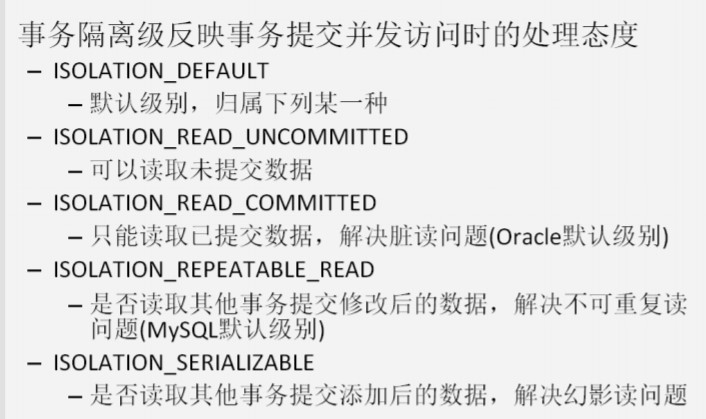
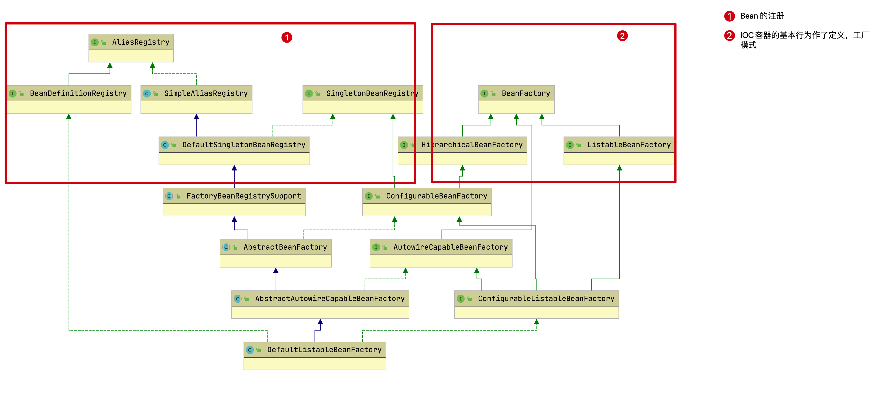
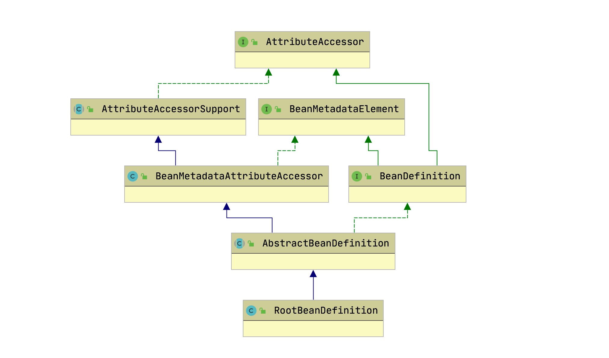
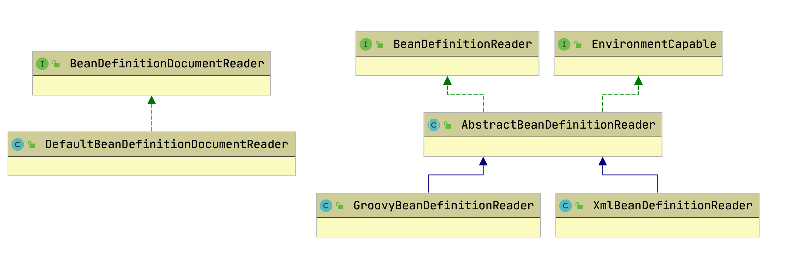
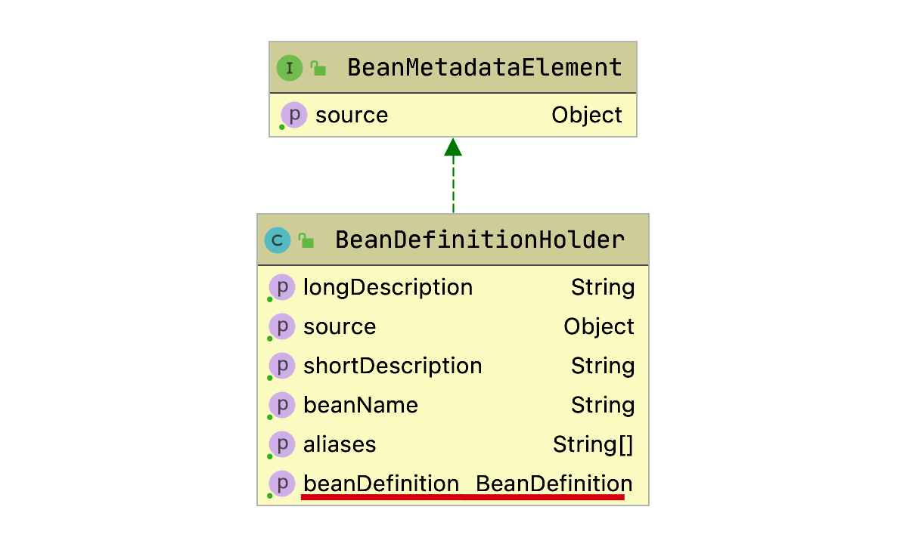
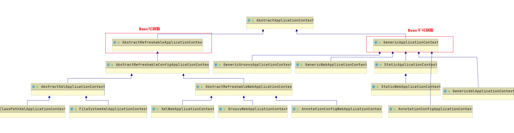
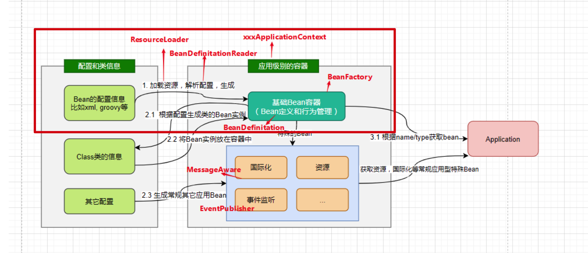
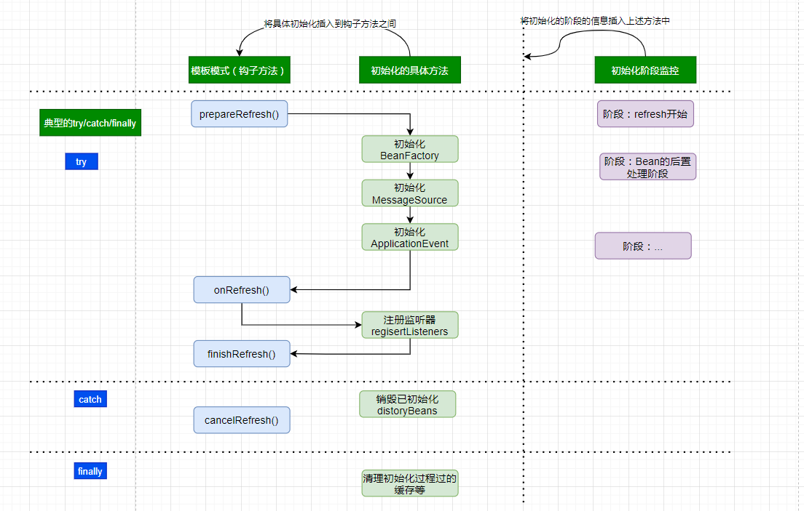
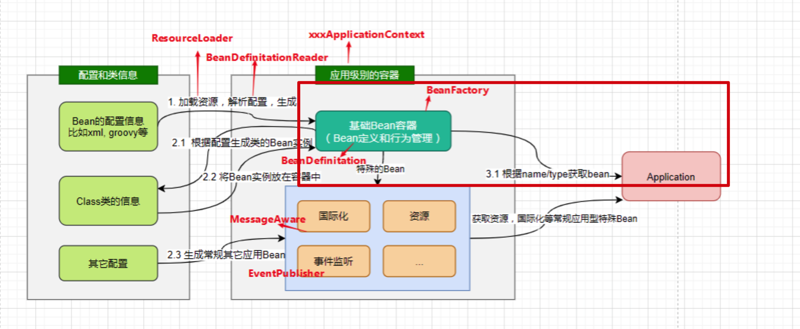

# 1. 基础

## 1.1. 基本概念

- spring 是什么

  > Spring 框架是一个开放源代码的 J2EE 应用程序框架，由 Rod Johnson 发起，是针对 bean 的生命周期进行管理的轻量级容器（lightweight container）。 Spring 解决了开发者在 J2EE 开发中遇到的许多常见的问题，提供了功能强大 IOC、AOP 及 Web MVC 等功能。Spring 可以单独应用于构筑应用程序，也可以和 Struts、Webwork、Tapestry 等众多 Web 框架组合使用，并且可以与 Swing 等桌面应用程序 AP 组合。因此， Spring 不仅仅能应用于 JEE 应用程序之中，也可以应用于桌面应用程序以及小应用程序之中。<br>

- 两大核心

  - IoC（Inverse Of Control：反转控制）
  - AOP（Aspect Oriented Programming：面向切面编程）

- 发展历程

  - 1997 年 IBM 提出了 EJB 的思想
  - 1998 年，SUN 制定开发标准规范 EJB1.0
  - 1999 年，EJB1.1 发布
  - 2001 年，EJB2.0 发布
  - 2003 年，EJB2.1 发布
  - 2006 年，EJB3.0 发布
  - Rod Johnson（spring 之父）
    - Expert One-to-One J2EE Design and Development(2002)
    - 阐述了 J2EE 使用 EJB 开发设计的优点及解决方案
    - Expert One-to-One J2EE Development without EJB(2004)
    - 阐述了 J2EE 开发不使用 EJB 的解决方式（Spring 雏形）
    - 2017 年 9 月份发布了 spring 的最新版本 spring 5.0 通用版（GA）

- 优势：[pdf](./资料/pdf/spring/spring5第一天.pdf)

- 体系结构
  > 

## 1.2. 程序耦合和解耦

- 解释：[pdf](./资料/pdf/spring/spring5第一天.pdf)

## 1.3. 工厂模式结构

- 概念：

  - Bean：在计算机英语中，有可重用组件的含义。
  - JavaBean：用 java 语言编写的可重用组件。
  - javabean > 实体类

- 看源码

## 1.4. IOC（控制反转）

### 1.4.1. 基础

- 概念：
  - 本来获取对象时是直接 new，由程序直接掌握控制权
  - 将获取对象的控制权交给工厂类，这种控制权的转移，就叫控制反转
  - 这样当找不到相关类时，编译时也不会出错，只有在运行时才会出错
- 作用：降低依赖，无法消除

- Spring 核心容器

  - 和前面工厂模式降低耦合相同
  - Spring 核心容器也就是一个 map 集合

- 使用步骤：

  - resource 下创建 bean.xml(名称随便)
  - 文件内容：

    ```xml
        <?xml version="1.0" encoding="UTF-8"?>
        <beans xmlns="http://www.springframework.org/schema/beans"
                xmlns:xsi="http://www.w3.org/2001/XMLSchema-instance"
                xsi:schemaLocation="http://www.springframework.org/schema/beans
                        https://www.springframework.org/schema/beans/spring-beans.xsd">

                <bean id="..." class="...">
                        <!-- collaborators and configuration for this bean go here -->
                        <!-- 	The id attribute is a string that identifies the individual bean definition. -->
                        <!-- 	The class attribute defines the type of the bean and uses the fully qualified classname. -->
                </bean>

                <bean id="..." class="...">
                        <!-- collaborators and configuration for this bean go here -->
                </bean>

                <!-- more bean definitions go here -->

        </beans>
    ```

  - 获取核心容器对象

    ```java
    ApplicationContext context = new ClassPathXmlApplicationContext("bean.xml");
    ```

  - 根据 id 获取 bean 对象

    ```java
    // 两种方式
    PetStoreService service = (AccountService)context.getBean("accountService");
    //或
    PetStoreService service = context.getBean("accountService", accountService.class);
    ```

- 核心容器的两个接口
  - 说明：
    > 接口图：<br> > 
    - BeanFactory：Spring 容器中的顶层接口
      - 说明：构建核心容器时，采用延迟加载的方式。什么时候根据 id 获取对象什么时候才创建对象
      - 使用时机：多对象使用
    - ApplicationContext：Spring 的顶级接口
      - 说明：构建核心容器时，采用立即加载的方式。读取后立即创建配置文件中的 class 对象
      - 使用时机：单例模式
      - 实现类
        - ClassPathXmlApplicationContext：加载类路径下的配置文件，要求配置文件必须在类路径下
        - FileSystemApplicationContext：可以加载磁盘任意路径下的配置文件。（必须有访问权限）
        - AnnocationConfigApplicationContext：读取注解来创建容器
  - 使用：
    - BeanFactory 是一个顶层接口，不适合直接使用
    - ApplicationContext 有继承 BeanFactory 接口，可以通过配置文件来设置延迟和立即加载
    - 见 Bean 对象作用范围

### 1.4.2. bean 四种创建方式

- 使用默认构造函数创建：
  > spring 中使用 bean 标签，仅配有 id 和 class 属性时，使用该种方式，没有默认构造函数时无法创建
  ```xml
  <bean id="accountService" class="com.itheima.service.impl.AccountServiceImpl"></bean>
  ```
- 使用某个类（工厂类）中的方法创建对象（jar 包中类方法的返回值的情景，无法调用默认构造函数）
  > id,factory-bean,factory-method 三个属性<br>
  ```xml
  <bean id="instanceFactory" class="com.itheima.factory.InstanceFactory"></bean>
  <bean id="accountService" factory-bean="instanceFactory" factory-method="getAccountService"></bean>
  ```
- 使用静态工厂中的静态方法创建对象（jar 包中类方法的返回值的情景，无法调用默认构造函数）
  > id,class,factory-method 三个属性<br>
  ```xml
  <bean id="accountService" class="com.itheima.factory.StaticFactory" factory-method="getAccountService"></bean>
  ```
- 通过 FactoryBean 来创建 bean 对象
  > UserFactoryBean 需要实现 FactoryBean 接口
  ```xml
  <!-- 通过FactoryBean 创建UserModel对象 -->
  <bean id="createByFactoryBean" class="com.javacode2018.lesson001.demo3.UserFactoryBean"/>
  ```

### 1.4.3. 名称定义规则

- 名称和别名可以通过 bean 元素中的 id 和 name 来定义，具体定义规则如下：：
  - 当 id 存在的时候，不管 name 有没有，取 id 为 bean 的名称
  - 当 id 不存在，此时需要看 name，name 的值可以通过,;或者空格分割，最后会按照分隔符得到一个 String 数组，数组的第一个元素作为 bean 的名称，其他的作为 bean 的别名
  - 当 id 和 name 都存在的时候，id 为 bean 名称，name 用来定义多个别名
  - 当 id 和 name 都不指定的时候，bean 名称自动生成，生成规则下面详细说明
- spring 容器允许使用者通过名称或者别名获取对应的 bean 对象。

### 1.4.4. bean 创建与销毁顺序

- 无依赖的 bean 创建顺序和定义的顺序一致，销毁顺序刚好相反
- 通过构造器强依赖的 bean，会先创建构造器参数中对应的 bean，然后才会创建当前 bean，销毁顺序刚好相反
- depend-on 可以指定档期 bean 依赖的 bean，通过这个可以确保 depend-on 指定的 bean 在当前 bean 创建之前先创建好，销毁顺序刚好相反

### 1.4.5. bean 对象作用范围

> bean 标签 scope 属性（用于指定 bean 对象作用范围）

- 基本 scope
  - singleton：单例的（默认值），可手动设置为懒加载
  - prototype：多例的
- spring web 容器中才有的 scope
  > spring mvc 中进行详细说明。
  - request：作用于 web 应用的请求范围
    > spring 中有个 web 容器接口 WebApplicationContext，这个里面对 request 作用域提供了支持。
  - session：作用于 web 应用的会话范围
  - global-session/application：作用于集群环境的会话范围（全局会话范围），当不是集群环境时，它就是 session
    > 
- 自定义 scope:
  - 实现 Scope 接口
  - 调用 org.springframework.beans.factory.config.ConfigurableBeanFactory#registerScope 方法注册 scope
  - [案例](http://www.itsoku.com/course/5/88)

### 1.4.6. bean 对象生命周期

- 说明：
  - 单例对象：
    - 容器创建，对象创建
    - 容器销毁，对象销毁
  - 多例对象
    - 当获取对象时，spring 框架创建
    - 使用过程中就不会销毁
    - 当对象没有对其他对象引用且长时间不用，由 java 回收机制进行回收
- 属性：
  - init-method:创建时调用
  - destory-method:销毁时调用
- 例：

  ```xml
  <bean id="accountService" class="com.itheima.service.impl.AccountServiceImpl"
      scope="singleton" init-method="init" destroy-method="destroy"></bean>
  ```

## 1.5. 依赖注入（Dependency Injection）

### 1.5.1. 基本说明

> DI—Dependency Injection，即依赖注入：

- 在当前类需要用到其他类的对象，由 spring 为我们提供，我们只需要在配置文件中说明依赖关系的维护就称之为依赖注入
- 注入就是为对象中的属性赋值，创建中（构造方法注入）或者创建后（set 注入）都行。
- 组件之间依赖关系由容器在运行期决定
- 形象的说，即由容器动态的将某个依赖关系注入到组件之中
- 依赖注入的目的并非为软件系统带来更多功能，而是为了提升组件重用的频率，并为系统搭建一个灵活、可扩展的平台。
- 通过依赖注入机制，我们只需要通过简单的配置，而无需任何代码就可指定目标需要的资源，完成自身的业务逻辑，而不需要关心具体的资源来自何处，由谁实现。

### 1.5.2. 允许注入的类型

> 如果是经常变化的数据并不适用于注入

- 基本类型和 String（看下面）
- 其他 bean 类型（在配置文件中或者注解配置过的 bean）（看下面）
- 复杂类型/集合类型（此处使用的是 set 注入方式，使用构造函数注入的话只需要把 property 标签换一下即可）

  ```xml
      <!-- 复杂类型的注入/集合类型的注入
              用于给List结构集合注入的标签：
                      list array set
              用于个Map结构集合注入的标签:
                      map  props

              注意！！！！：
              结构相同，标签可以互换
      -->
      <bean id="accountService3" class="com.itheima.service.impl.AccountServiceImpl3">
              <property name="myStrs">
                      <set>
                              <value>AAA</value>
                              <value>BBB</value>
                              <value>CCC</value>
                      </set>
              </property>

              <property name="myList">
                      <array>
                              <value>AAA</value>
                              <value>BBB</value>
                              <value>CCC</value>
                      </array>
              </property>

              <property name="mySet">
                      <list>
                              <value>AAA</value>
                              <value>BBB</value>
                              <value>CCC</value>
                      </list>
              </property>

              <property name="myMap">
                      <props>
                              <prop key="testC">ccc</prop>
                              <prop key="testD">ddd</prop>
                      </props>
              </property>

              <property name="myProps">
                      <map>
                              <entry key="testA" value="aaa"></entry>
                              <entry key="testB">
                                      <value>BBB</value>
                              </entry>
                      </map>
              </property>
      </bean>

  ```

### 1.5.3. 注入方式

#### 1.5.3.1. 使用构造函数手动注入

- 使用方式：
  - 使用的标签:constructor-arg
  - 标签出现的位置：bean 标签的内部
  - 标签中的属性
    - 对应三种注入方式，三选一即可
      - type：用于指定要注入的数据的数据类型，该数据类型也是构造函数中某个或某些参数的类型。
      - index：用于指定要注入的数据给构造函数中指定索引位置的参数赋值。索引的位置是从 0 开始
      - name：用于指定给构造函数中指定名称的参数赋值 （常用的）
    - 设置值，二选一
      - value：用于提供基本类型和 String 类型的数据。（字符串和数字类型会 spring 内会自动转换）
      - ref：用于指定其他的 bean 类型数据。它指的就是在 spring 的 Ioc 核心容器中出现过的 bean 对象
- 示例：

  ```xml
  <bean id="accountService" class="com.itheima.service.impl.AccountServiceImpl">
  <!-- name是构造函数中的参数名称。 -->
  <constructor-arg name="name" value="泰斯特"></constructor-arg>
  <constructor-arg name="age" value="18"></constructor-arg>
  <constructor-arg name="birthday" ref="now"></constructor-arg>

  </bean>
  <!-- 配置一个日期对象 -->
  <bean id="now" class="java.util.Date"></bean>
  ```

- 优势：在获取 bean 对象时，注入数据是必须的操作，否则对象无法创建成功。
- 弊端：改变了 bean 对象的实例化方式，使我们在创建对象时，如果用不到这些数据，也必须提供。同时，如果只想赋几个成员的值，就要重载构造函数

#### 1.5.3.2. 使用 set 方法手动注入

- 使用：
  - 涉及的标签：property
  - 出现的位置：bean 标签的内部
  - 标签的属性：
    - name：用于指定注入时所调用的 set 方法名称（也就是属性名称）
    - value：用于提供基本类型和 String 类型的数据
    - ref：用于指定其他的 bean 类型数据。它指的就是在 spring 的 Ioc 核心容器中出现过的 bean 对象
- 示例：

  ```xml
  <bean id="accountService2" class="com.itheima.service.impl.AccountServiceImpl2">
          <property name="name" value="TEST" ></property>
          <property name="age" value="21"></property>
          <property name="birthday" ref="now"></property>
  </bean>
  <bean id="now" class="java.util.Date"></bean>
  ```

- 优势： 创建对象时没有明确的限制，可以直接使用默认构造函数
- 弊端： 如果有某个成员必须有值，则获取对象时有可能 set 方法没有执行。（也就是忘了写）

#### 1.5.3.3. 自动注入

- 按照名称

  ```xml
  <!-- autowire：byName 配置按照name进行自动注入 -->
  <bean id="diAutowireByName1" class="com.javacode2018.lesson001.demo6.DiAutowireByName" autowire="byName"/>
  <!-- 当配置了自动注入，还可以使用手动的方式自动注入进行覆盖，手动的优先级更高一些 -->
  <bean id="diAutowireByName2" class="com.javacode2018.lesson001.demo6.DiAutowireByName" autowire="byName">
      <property name="service2" ref="service2-1"/>
  </bean>
  ```

- 按照类型

  ```xml
  <!-- autowire：byType 配置按照set参数类型进行自动注入 -->
  <bean id="diAutowireByType1" class="com.javacode2018.lesson001.demo6.DiAutowireByType" autowire="byType"/>
  ```

- 注入类型匹配的所有 bean
- 按照构造函数进行自动注入

  ```xml
  <bean id="" class="X类" autowire="constructor"/>
  ```

- 设置默认自动注入类型：`default-autowire`属性

  ```xml
  <beans xmlns="http://www.springframework.org/schema/beans"
        xmlns:xsi="http://www.w3.org/2001/XMLSchema-instance"
        xsi:schemaLocation="http://www.springframework.org/schema/beans
      http://www.springframework.org/schema/beans/spring-beans-4.3.xsd"
        default-autowire="byName">
  </beans>
  ```

## 1.6. IoC 和 DI 是什么关系

- 谁依赖于谁？
  - 应用程序依赖于 IoC 容器
- 为什么需要依赖？
  - 应用程序需要 IoC 容器来提供对象需要的外部资源
- 谁注入谁？
  - **很明显是 IoC 容器注入应用程序某个对象**
  - 应用程序依赖的对象
- 注入了什么？
  - 就是注入某个对象所需要的外部资源（包括对象、资源、常量数据）
- IoC 和 DI 由什么关系呢？
  - **控制反转是通过依赖注入实现的，其实它们是同一个概念的不同角度描述**
  - **通俗来说就是 IoC 是设计思想，DI 是实现方式**
  - 其实它们是同一个概念的不同角度描述
  - 由于控制反转概念比较含糊（可能只是理解为容器控制对象这一个层面，很难让人想到谁来维护对象关系），所以 2004 年大师级人物 Martin Fowler 又给出了一个新的名字：“依赖注入”，相对 IoC 而言，“依赖注入”明确描述了“被注入对象依赖 IoC 容器配置依赖对象”。通俗来说就是 IoC 是设计思想，DI 是实现方式。

## 1.7. 常用注入参数与配置

### 1.7.1. autowire

- 3 种自动注入方式详解及案例
  - 按名称自动注入
  - 按类型自动注入
  - 按构造器进行自动注入
- 按类型自动注入某种类型的所有 bean 给 List 和 Map（重点）
- autowire=default 介绍

### 1.7.2. depend-on

- depend-on 干预 bean 创建和销毁顺序

### 1.7.3. primary

- primary
  - 设为主要候选者，当有多个匹配的时，选择设置为 true 的 bean
  - 默认为 false
  - 如果多个 bean 设置`primary`为 true，依旧会报错

### 1.7.4. autowire-candidate

- autowire-candidate：设置当前 bean 在被其他对象作为自动注入对象的时候，是否作为候选 bean，默认值是 true
- 取值：
  - default：这个是默认值，autowire-candidate 如果不设置，其值就是 default
  - true：作为候选者
  - false：不作为候选者

### 1.7.5. lazy-init

- lazy-init: 配置 bean 是否是延迟加载

  - true：延迟初始化
  - false：实时初始化(默认)

- bean 被使用时机
  - 被其他 bean 作为依赖进行注入的时候，比如通过 property 元素的 ref 属性进行引用，通过构造器注入、通过 set 注入、通过自动注入，这些都会导致被依赖 bean 的创建
  - 开发者自己写代码向容器中查找 bean 的时候，如调用容器的 getBean 方法获取 bean。

### 1.7.6. bean 配置继承：abstract&parent

- bean 的 xml 配置中进行继承操作
- bean 元素的 abstract 属性为 true 的时候可以定义某个 bean 为一个抽象的 bean，相当于定义了一个 bean 模板，spring 容器并不会创建这个 bean，从容器中查找 abstract 为 true 的 bean 的时候，会报错 BeanIsAbstractException 异常
- bean 元素的 parent 属性可以指定当前 bean 的父 bean，子 bean 可以继承父 bean 中配置信息，也可以自定义配置信息，这样可以覆盖父 bean 中的配置

### 1.7.7. lookup-method 和 replace-method

- 背景

  - 单例依赖多例对象时
  - 因为单例只有一个对象，因此每次获取到的单例对象都是同一个
  - 这也导致单例对象中依赖的那个多例对象也一直是同一个

- 解决 1： 使用容器的 getBean 方法获取多例 bean

  - 获取容器可以使用：`ApplicationContextAware`接口
  - 这个接口有一个方法 setApplicationContexti，这个接口给了自定义的 bean 中获取 applicationContext 的能力
  - 当类实现这个接口之后，spring 容器创建 bean 对象的时候，如果 bean 实现了这个接口，那么容器会自动调用 setApplicationContext 方法
  - 将容器对象 applicationContext 传入，此时在我们的 bean 对象中就可以使用容器的任何方法了。

- 解决 2:`lookup-method`

  ```xml
  <?xml version="1.0" encoding="UTF-8"?>
  <beans xmlns="http://www.springframework.org/schema/beans"
        xmlns:xsi="http://www.w3.org/2001/XMLSchema-instance"
        xsi:schemaLocation="http://www.springframework.org/schema/beans
      http://www.springframework.org/schema/beans/spring-beans-4.3.xsd">
      <bean id="serviceA" class="com.javacode2018.lesson001.demo13.lookupmethod.ServiceA" scope="prototype"/>
      <bean id="serviceB" class="com.javacode2018.lesson001.demo13.lookupmethod.ServiceB">
          <lookup-method name="getServiceA" bean="serviceA"/>
      </bean>
  </beans>
  ```

  - 当调用 serviceB 中的 getServiceA 方法的时候，这个方法会拦截
  - 然后会按照 lookup-method 元素中 bean 属性的值作为 bean 的名称去容器中查找对应 bean，然后作为 getServiceA 的返回值返回
  - 即调用 getServiceA 方法的时候，会从 spring 容器中查找 id 为 serviceA 的 bean 然后返回。
  - **这个地方底层是使用 cglib 代理实现的**

  > `getServiceA`实际实现返回 null 就行了

- 解决 3：`replace-method`

  - 要调用 serviceB 中的 getServiceA 的时候
  - 可以对 serviceB 这个 bean 中的 getServiceA 方法进行拦截，把这个调用请求转发到一个替换者处理
  - 这就是 replaced-method 可以实现的功能，比 lookup-method 更强大更灵活。

  ```java
  // 替换者需要实现spring中的MethodReplacer接口

  public interface MethodReplacer {
      /**
      * @param obj 被替换方法的目标对象
      * @param method 目标对象的方法
      * @param args 方法的参数
      * @return return value for the method
      */
      Object reimplement(Object obj, Method method, Object[] args) throws Throwable;
      // 当调用目标对象需要被替换的方法的时候，这个调用请求会被转发到替换者的reimplement方法进行处理
  }
  ```

  ```xml
  <!-- 定义替换者bean -->
  <bean id="serviceBMethodReplacer" class="com.javacode2018.lesson001.demo14.ServiceBMethodReplacer" />
  ```

  ```xml
  <!-- 通过replaced-method元素配置目标bean需要被替换的方法 -->
  <bean id="serviceB" class="com.javacode2018.lesson001.demo14.ServiceB">
      <replaced-method name="getServiceA" replacer="serviceAMethodReplacer"/>
      <!-- name：用于指定当前bean需要被替换的方法 -->
      <!-- replacer：替换者，即实现了MethodReplacer接口的类对应的bean -->
  </bean>
  ```

# 2. 基于注解 ioc

## 2.1. 开始

- 创建 bean.xml 文件
- 导入依赖（不同于之前的）。

  ```xml
  <?xml version="1.0" encoding="UTF-8"?>
  <beans xmlns="http://www.springframework.org/schema/beans"
          xmlns:xsi="http://www.w3.org/2001/XMLSchema-instance"
          xmlns:context="http://www.springframework.org/schema/context"
          xsi:schemaLocation="http://www.springframework.org/schema/beans
                  https://www.springframework.org/schema/beans/spring-beans.xsd
                  http://www.springframework.org/schema/context
                  https://www.springframework.org/schema/context/spring-context.xsd">

  </beans>
  ```

- 添加要扫描的包（否则不知道注解位置）
  ```xml
  <context:component-scan base-package="com.whitestarrain"></context:component-scan>
  ```

## 2.2. 注入过程基本说明


> 所有对象在使用时都已经放到容器中了<br>
> 只有配置过，才能去注入。（bean 类型）
> **spring 就是一个大箱子，把之后用的装进去（配置），把要用的拿出来（注入）**

## 2.3. ioc 常用注解基本说明

- 用于创建对象
  - @Component
    - 作用：用于把当前类存入 spring 容器中（通常当某类不属于任何一层时使用）
    - 属性：
      - value:用于指定 bean 的 id，当不写时，默认为首字母改小写的当前类名
  - @Controller
    - 作用和@Component 完全相同。仅仅为了区分三层结构。一般在表现层
  - @Service
    - 作用和@Component 完全相同。仅仅为了区分三层结构。一般用在业务层
  - @Repository
    - 作用和@Component 完全相同。仅仅为了区分三层结构。一般用在持久层
- 用于注入数据

  - @AutoWired
    - 作用：自动按照类型注入。
      - 只要容器中有唯一的一个 bean 对象类型和要注入的变量类型匹配，就可以注入成功。
      - 如果没有任何匹配的类型（包括实现类），则报错
      - 如果有多个匹配时，首先按照类型筛选出来类型相同的几个，再用查找 id 和变量名相同的。如果没有则报错
    - 出现位置：变量上，方法上等
    - 细节：因为注解已经指定了变量位置，所以 setter 方法已经不是必须的了
    - 基本情况图解：
      > 
  - @Qualifier
    - 作用：
      - 在给类成员注入时不能单独使用，必须和@Autowired 一起使用。@Autowired 无法指定时，选择@Qualifier 中指定 id 所对应的类
      - 但是给方法参数注入时可以直接使用。具体看下面使用注解配置时的使用
        > 不是必须的，参数会自动按照和 Autowired 相同的方式去容器中找。如果有多个且不同名时，可以用该注解指定
    - 属性：
      - value:用于指定注入 bean 的 id
  - @Resource
    - 作用：直接按照 bean 的 id 进行注入
    - 属性：
      - name:用于指定 bean 的 id。（注意，不是 value）

  > 以上三个注解只能注入 bean 类型数据，基本类型无法进行注入
  >
  > 集合类型只能通过 xml 进行注入
  >
  > 如果不是自己创建的类，无法写注解，那么也只能通过 xml 注入，比如 jdbcTemplate

  - @Value()
    - 作用：用于注入基本类型和 String 类型数据
    - 属性：
      - value：用于指定数据的值，同时可以使用 spring 的 el 表达式（SpEL）
        > jsp 中，\$从四个域中获取数据。mybatis 中，\$从上面设置的 properties 中获取。Spring 中，看下面@PropertySource 注解

- 用于改变作用范围
  - @Scope
    - 作用：用于指定 bean 作用范围
    - 属性：
      - value：指定范围的取值。常用取值：singleton prototype。所有取值看上面，和 xml 中的相同
- 生命周期相关（了解）
  - @PostConstruct
    - 作用：用于指定初始化方法
  - @PreDestroy
    - 作用：用于指定销毁方法

---

- 示例：

  ```java
  @Service("accountService")
  //@Scope("prototype")
  public class AccountServiceImpl implements IAccountService {

  //    @Autowired
  //    @Qualifier("accountDao1")
      @Resource(name = "accountDao2")
      private IAccountDao accountDao = null;

      @PostConstruct
      public void  init(){
          System.out.println("初始化方法执行了");
      }

      @PreDestroy
      public void  destroy(){
          System.out.println("销毁方法执行了");
      }

      public void  saveAccount(){
          accountDao.saveAccount();
      }
  }
  ```

## 2.4. spring 使用注解脱离 xml

### 2.4.1. @AliasFor：对注解进行增强

- 作用：

  - `AnnocationA`注解`AnnocationB`
  - 需要在`AnnocationB`中设置`AnnocationA`的值

  ```java
  @Target(ElementType.TYPE)
  @Retention(RetentionPolicy.RUNTIME)
  @interface A14 {
      String value() default "a";//@0
  }

  @Target(ElementType.TYPE)
  @Retention(RetentionPolicy.RUNTIME)
  @A14 //@6
  @interface B14 { //@1
      String value() default "b";//@2
      @AliasFor(annotation = A14.class, value = "value") //@5
      String a14Value();
  }

  @B14(value = "路人甲Java",a14Value = "通过B14给A14的value参数赋值") //@3
  public class UseAnnotation14 {
      @Test
      public void test1() {
          //AnnotatedElementUtils是spring提供的一个查找注解的工具类
          System.out.println(AnnotatedElementUtils.getMergedAnnotation(UseAnnotation14.class, B14.class));
          System.out.println(AnnotatedElementUtils.getMergedAnnotation(UseAnnotation14.class, A14.class));
      }
  }
  ```

  ```
  @com.javacode2018.lesson001.demo18.B14(a14Value=通过B14给A14的value参数赋值, value=路人甲Java)
  @com.javacode2018.lesson001.demo18.A14(value=通过B14给A14的value参数赋值)
  ```

- 两个属性进行同步

  - `@AliasFor`的`annotation`不指定的话，默认是当前注解

    ```java
    @Target({ElementType.TYPE, ElementType.FIELD})
    @Retention(RetentionPolicy.RUNTIME)
    @interface A15 {
        @AliasFor("v2")//@1
        String v1() default "";
        @AliasFor("v1")//@2
        String v2() default "";
    }
    ```

  - 当@AliasFor 中不指定 value 或者 attribute 的时候，自动将@AliasFor 修饰的参数作为 value 和 attribute 的值，如下@AliasFor 注解的 value 参数值为 name

    ```java
    @Target(ElementType.TYPE)
    @Retention(RetentionPolicy.RUNTIME)
    @interface A16 {
        String name() default "a";//@0
    }
    @Target(ElementType.TYPE)
    @Retention(RetentionPolicy.RUNTIME)
    @A16
    @interface B16 { //@1
        @AliasFor(annotation = A16.class) //@5
        String name() default "b";//@2
    }
    @B16(name="我是v1") //@3
    public class UseAnnotation16 {
        @Test
        public void test1() throws NoSuchFieldException {
            //AnnotatedElementUtils是spring提供的一个查找注解的工具类
            System.out.println(AnnotatedElementUtils.getMergedAnnotation(UseAnnotation16.class, A16.class));
            System.out.println(AnnotatedElementUtils.getMergedAnnotation(UseAnnotation16.class, B16.class));
        }
    }
    ```

    ```
    @com.javacode2018.lesson001.demo18.A16(name=我是v1)
    @com.javacode2018.lesson001.demo18.B16(name=我是v1)
    ```

> 目的：**脱离 xml**<br>
> 下面的注解主要是为了将不得不写 xml 的配置用配置类的方式进行配置（比如 jdbcTemplate）<br>
> 推荐 jar 包中的类使用 xml 而不是下面的注解，因为有一定的复杂性

### 2.4.2. @Configuration,@Bean

#### 2.4.2.1. @Configuration

- 作用：

  - 加在类上
  - 让这个类的功能等同于一个 bean xml 配置文件
  - 以下等同：

    ```java
    @Configuration
    public class ConfigBean {
    }
    ```

    ```xml
    <?xml version="1.0" encoding="UTF-8"?>
    <beans xmlns="http://www.springframework.org/schema/beans"
          xmlns:xsi="http://www.w3.org/2001/XMLSchema-instance"
          xsi:schemaLocation="http://www.springframework.org/schema/beans
        http://www.springframework.org/schema/beans/spring-beans-4.3.xsd">
    </beans>
    ```

  - 当配置类作为 AnnotationConfigApplicationContext 对象创建的参数时，该注解可以不写。(可变参数，可传多个)

    ```java
    AnnotationConfigApplicationContext context = new AnnotationConfigApplicationContext(ConfigBean.class);
    ```

#### 2.4.2.2. @Bean

- 作用：

  - 用于把当前方法的返回值作为 bean 对象 **存入 spring 的 ioc 容器中**
  - 类似于 bean xml 配置文件中的 bean 元素，用来在 spring 容器中注册一个 bean。
  - @Bean 注解用在方法上，表示通过方法来定义一个 bean，默认将方法名称作为 bean 名称，将方法返回值作为 bean 对象，注册到 spring 容器中。

- 源码

  ```java
  @Target({ElementType.METHOD, ElementType.ANNOTATION_TYPE}) //@1
  @Retention(RetentionPolicy.RUNTIME)
  @Documented
  public @interface Bean {
      @AliasFor("name")
      String[] value() default {};
      @AliasFor("value")
      String[] name() default {};
      @Deprecated
      Autowire autowire() default Autowire.NO;
      boolean autowireCandidate() default true;
      String initMethod() default "";
      String destroyMethod() default AbstractBeanDefinition.INFER_METHOD;
  }
  ```

  - name：
    - 用于指定 bean 的 id。当不写时，默认值是当前方法的名称
    - 也可以为多个值，如`{v1,v2}`。多出来的将会用作别名
  - value: 和 name 是一样的，设置的时候，这 2 个参数只能选一个，原因是@AliasFor 导致的
  - autowire：这个参数上面标注了@Deprecated，表示已经过期了，不建议使用了
  - autowireCandidate：是否作为其他对象注入时候的候选 bean，对应 xml 中的`autowire-candidate`
  - initMethod：bean 初始化的方法，这个和生命周期有关，以后详解
  - destroyMethod：bean 销毁的方法，也是和生命周期相关的，以后详解

- 细节：
  - 当我们使用注解配置方法时，如果方法有 **参数** ，spring 框架会去容器中查找有没有可用的 bean 对象。
  - 查找的方式和 Autowired 注解的作用是一样的

#### 2.4.2.3. 使用@Bean 注册对象，加不加@Configuration

> **基本测试**

- 测试代码对比

  <details>
  <summary style="color:red;">展开</summary>

  - 有`@Configuration`

    ```java
    public class User {
    }

    @Configuration
    public class ConfigBean {
        //bean名称为方法默认值：user1
        @Bean
        public User user1() {
            return new User();
        }
        //bean名称通过value指定了：user2Bean
        @Bean("user2Bean")
        public User user2() {
            return new User();
        }
        //bean名称为：user3Bean，2个别名：[user3BeanAlias1,user3BeanAlias2]
        @Bean({"user3Bean", "user3BeanAlias1", "user3BeanAlias2"})
        public User user3() {
            return new User();
        }
    }

    @Test
    public void test1() {
        AnnotationConfigApplicationContext context = new AnnotationConfigApplicationContext(ConfigBean.class);//@1
        for (String beanName : context.getBeanDefinitionNames()) {
            //别名
            String[] aliases = context.getAliases(beanName);
            System.out.println(String.format("bean名称:%s,别名:%s,bean对象:%s",
                    beanName,
                    Arrays.asList(aliases),
                    context.getBean(beanName)));
        }
    }
    ```

  - 无`@Configuration`

    ```java
    public class ServiceA {
    }

    public class ServiceB {
        private ServiceA serviceA;
        public ServiceB(ServiceA serviceA) {
            this.serviceA = serviceA;
        }
        @Override
        public String toString() {
            return "ServiceB{" +
                    "serviceA=" + serviceA +
                    '}';
        }
    }
    public class ConfigBean1 {
        //bean名称为方法默认值：user1
        @Bean
        public User user1() {
            return new User();
        }
        //bean名称通过value指定了：user2Bean
        @Bean("user2Bean")
        public User user2() {
            return new User();
        }
        //bean名称为：user3Bean，2个别名：[user3BeanAlias1,user3BeanAlias2]
        @Bean({"user3Bean", "user3BeanAlias1", "user3BeanAlias2"})
        public User user3() {
            return new User();
        }
    }
    @Test
    public void test2() {
        AnnotationConfigApplicationContext context = new AnnotationConfigApplicationContext(ConfigBean1.class);
        for (String beanName : context.getBeanDefinitionNames()) {
            //别名
            String[] aliases = context.getAliases(beanName);
            System.out.println(String.format("bean名称:%s,别名:%s,bean对象:%s",
                    beanName,
                    Arrays.asList(aliases),
                    context.getBean(beanName)));
        }
    }
    ```

  - 有@Configuration 注解的
    ```
    bean名称:configBean,别名:[],bean对象:com.javacode2018.lesson001.demo20.ConfigBean$$EnhancerBySpringCGLIB$$dde45976@5e5d171f
    bean名称:user1,别名:[],bean对象:com.javacode2018.lesson001.demo20.User@24313fcc
    bean名称:user2Bean,别名:[],bean对象:com.javacode2018.lesson001.demo20.User@7d20d0b
    bean名称:user3Bean,别名:[user3BeanAlias2, user3BeanAlias1],bean对象:com.javacode2018.lesson001.demo20.User@77f1baf5
    ```
  - 没有@Configuration 注解的
    ```
    bean名称:configBean1,别名:[],bean对象:com.javacode2018.lesson001.demo20.ConfigBean1@402bba4f
    bean名称:user1,别名:[],bean对象:com.javacode2018.lesson001.demo20.User@795cd85e
    bean名称:user2Bean,别名:[],bean对象:com.javacode2018.lesson001.demo20.User@59fd97a8
    bean名称:user3Bean,别名:[user3BeanAlias2, user3BeanAlias1],bean对象:com.javacode2018.lesson001.demo20.User@f5ac9e4
    ```

  </details>

- 对比输出的最后 3 行，可以看出：
  - 有没有@Configuration 注解，@Bean 都会起效，都会将@Bean 修饰的方法作为 bean 注册到容器中
  - 两个内容的第一行有点不一样
    - 被@Configuration 修饰的 bean 最后输出的时候带有 EnhancerBySpringCGLIB 的字样
    - 而没有@Configuration 注解的 bean 没有 Cglib 的字样；
    - 有 EnhancerBySpringCGLIB 字样的说明这个 bean 被 cglib 处理过的，变成了一个代理对象。

> **实际作用**

- 测试代码

  <details>
  <summary style="color:red;">展开</summary>

  ```java
  @Configuration
  public class ConfigBean2 {
      @Bean
      public ServiceA serviceA() {
          System.out.println("调用serviceA()方法"); //@0
          return new ServiceA();
      }
      @Bean
      ServiceB serviceB1() {
          System.out.println("调用serviceB1()方法");
          ServiceA serviceA = this.serviceA(); //@1
          return new ServiceB(serviceA);
      }
      @Bean
      ServiceB serviceB2() {
          System.out.println("调用serviceB2()方法");
          ServiceA serviceA = this.serviceA(); //@2
          return new ServiceB(serviceA);
      }
  }

  @Test
  public void test3() {
      AnnotationConfigApplicationContext context = new AnnotationConfigApplicationContext(ConfigBean2.class);
      for (String beanName : context.getBeanDefinitionNames()) {
          //别名
          String[] aliases = context.getAliases(beanName);
          System.out.println(String.format("bean名称:%s,别名:%s,bean对象:%s",
                  beanName,
                  Arrays.asList(aliases),
                  context.getBean(beanName)));
      }
  }
  ```

  ```
  调用serviceA()方法
  调用serviceB1()方法
  调用serviceB2()方法
  bean名称:configBean2,别名:[],bean对象:com.javacode2018.lesson001.demo20.ConfigBean2$$EnhancerBySpringCGLIB$$ffa0178@77f1baf5
  bean名称:serviceA,别名:[],bean对象:com.javacode2018.lesson001.demo20.ServiceA@41a2befb
  bean名称:serviceB1,别名:[],bean对象:ServiceB{serviceA=com.javacode2018.lesson001.demo20.ServiceA@41a2befb}
  bean名称:serviceB2,别名:[],bean对象:ServiceB{serviceA=com.javacode2018.lesson001.demo20.ServiceA@41a2befb}
  ```

  </details>

  - 前三行可以看出，被@Bean 修饰的方法都只被调用了一次，这个很关键
  - 最后三行中可以看出都是同一个 ServiceA 对象，都是 ServiceA@41a2befb 这个实例

- 分析：

  - 被@Configuration 修饰的类，spring 容器中会通过 cglib 给这个类创建一个代理
  - 代理会拦截所有被@Bean 修饰的方法，默认情况（bean 为单例）下确保这些方法只被调用一次
    > 可以使用@Scope 注解修改作用范围
  - 从而确保这些 bean 是同一个 bean，即单例的。

- 注意：

  - 不管@Bean 所在的类上是否有@Configuration 注解，都可以将@Bean 修饰的方法作为一个 bean 注册到 spring 容器中
  - 但是如果没有`@Configuration`注解，上例中 `serviceA()`方法将被调用 3 次

- 原理：

  - spring 中用下面这个类处理@Configuration 这个注解：

  ```java
  org.springframework.context.annotation.ConfigurationClassPostProcessor
  ```

  - 主要这几个方法：

  ```java
  public void postProcessBeanDefinitionRegistry(BeanDefinitionRegistry registry)
  public void postProcessBeanFactory(ConfigurableListableBeanFactory beanFactory)
  public void enhanceConfigurationClasses(ConfigurableListableBeanFactory beanFactory) // 这个方法会创建cglib代理
  ```

### 2.4.3. @ComponentScan 与@ComponentScans

#### 2.4.3.1. 基本说明

- 说明

  - 注册 bean 的方式
    - xml 中 bean 元素的方式
    - @Bean 注解标注方法的方式
  - 通常情况下，项目中大部分类都需要交给 spring 去管理，按照上面这 2 种方式，代码量还是挺大的。
  - 为了更方便 bean 的注册，Spring 提供了批量的方式注册 bean，方便大量 bean 批量注册，spring 中的@ComponentScan 就是干这个事情的。

- 作用：
  - 这个注解会让 spring 去扫描某些包及其子包中所有的类
  - 将满足一定条件的类作为 bean 注册到 spring 容器容器中。

#### 2.4.3.2. 源码解析

- 源码

  ```java
  @Retention(RetentionPolicy.RUNTIME)
  @Target(ElementType.TYPE)
  @Documented
  @Repeatable(ComponentScans.class) // @ComponentScans为容器注解
  public @interface ComponentScan {
      @AliasFor("basePackages")
      String[] value() default {};
      @AliasFor("value")
      String[] basePackages() default {};
      Class<?>[] basePackageClasses() default {};
      Class<? extends BeanNameGenerator> nameGenerator() default BeanNameGenerator.class;
      Class<? extends ScopeMetadataResolver> scopeResolver() default AnnotationScopeMetadataResolver.class;
      ScopedProxyMode scopedProxy() default ScopedProxyMode.DEFAULT;
      String resourcePattern() default "**/*.class";
      boolean useDefaultFilters() default true;
      Filter[] includeFilters() default {};
      Filter[] excludeFilters() default {};
      boolean lazyInit() default false;
  }
  ```

- 属性说明

  - 控制需要扫描哪些包
    - value：指定需要扫描的包，如：com.javacode2018
    - basePackages：作用同 value；value 和 basePackages 不能同时存在设置，可二选一
      - 注意：指定包名的方式扫描存在的一个隐患，若包被重名了，会导致扫描会失效，
    - basePackageClasses：指定一些类，spring 容器会扫描这些类所在的包及其子包中的类
      - 一般情况下面我们使用 basePackageClasses 的方式来指定需要扫描的包
      - 这个参数可以指定一些类型，默认会扫描这些类所在的包及其子包中所有的类，这种方式可以有效避免包重名的问题
        > 可以在需要扫描的包中定义一个标记的接口或者类，他们的唯一的作用是作为 basePackageClasses 的值，其他没有任何用途
  - 控制过滤器有哪些
    - useDefaultFilters：对扫描的类是否启用默认过滤器，默认为 true
    - includeFilters：过滤器：用来配置被扫描出来的那些类会被作为组件注册到容器中
    - excludeFilters：过滤器，和 includeFilters 作用刚好相反，用来对扫描的类进行排除的，被排除的类不会被注册到容器中
  - nameGenerator：自定义 bean 名称生成器
  - resourcePattern：需要扫描包中的那些资源，默认是：\*/\.class，即会扫描指定包中所有的 class 文件
  - lazyInit：是否延迟初始化被注册的 bean

- 工作过程
  - Spring 会扫描指定的包，且会递归下面子包，得到一批类的数组
  - 然后这些类会经过上面的各种过滤器，最后剩下的类会被注册到容器中
  - 默认情况：
    - 默认情况下，任何参数都不设置的情况下，此时，会将@ComponentScan 修饰的类所在的包作为扫描包
    - 默认情况下 useDefaultFilters 为 true，这个为 true 的时候，spring 容器内部会使用默认过滤器，规则是
      - 凡是类上有@Repository、@Service、@Controller、@Component 这几个注解中的任何一个的
        > 这 4 个注解本质上是没有任何差别，都可以用在类上面，
        > 表示这个类被 spring 容器扫描的时候，可以作为一个 bean 组件注册到 spring 容器中。
      - 那么这个类就会被作为 bean 注册到 spring 容器中
    - 所以默认情况下，只需在类上加上这几个注解中的任何一个，这些类就会自动交给 spring 容器来管理了。

#### 2.4.3.3. 过滤器详解

- 源码

  ```java
  @Retention(RetentionPolicy.RUNTIME)
  @Target({})
  @interface Filter {
      FilterType type() default FilterType.ANNOTATION;
      @AliasFor("classes")
      Class<?>[] value() default {};
      @AliasFor("value")
      Class<?>[] classes() default {};
      String[] pattern() default {};
  }
  ```

- 可以看出 Filter 也是一个注解，参数：
  - type：过滤器的类型，是个枚举类型，5 种类型
    - ANNOTATION：通过注解的方式来筛选候选者，即判断候选者是否有指定的注解
    - ASSIGNABLE_TYPE：通过指定的类型来筛选候选者，即判断候选者是否是指定的类型
    - ASPECTJ：ASPECTJ 表达式方式，即判断候选者是否匹配 ASPECTJ 表达式
    - REGEX：正则表达式方式，即判断候选者的完整名称是否和正则表达式匹配
    - CUSTOM：用户自定义过滤器来筛选候选者，对候选者的筛选交给用户自己来判断
  - value：和参数 classes 效果一样，二选一
  - classes：3 种情况如下
    - 当 type=FilterType.ANNOTATION 时，通过 classes 参数可以指定一些注解，用来判断被扫描的类上是否有 classes 参数指定的注解
    - 当 type=FilterType.ASSIGNABLE_TYPE 时，通过 classes 参数可以指定一些类型，用来判断被扫描的类是否是 classes 参数指定的类型
    - 当 type=FilterType.CUSTOM 时，表示这个过滤器是用户自定义的，classes 参数就是用来指定用户自定义的过滤器，自定义的过滤器需要实现 org.springframework.core.type.filter.TypeFilter 接口
  - pattern：2 种情况如下
    - 当 type=FilterType.ASPECTJ 时，通过 pattern 来指定需要匹配的 ASPECTJ 表达式的值
    - 当 type=FilterType.REGEX 时，通过 pattern 来自正则表达式的值

#### 2.4.3.4. 示例

> **basePackageClasses**

<details>
<summary style="color:red;">展开</summary>

```java
package com.javacode2018.lesson001.demo22.test6.beans;
public interface ScanClass {
}
```

```java
package com.javacode2018.lesson001.demo22.test6.beans;
import org.springframework.stereotype.Component;
@Component
public class Service1 {
}
```

```java
package com.javacode2018.lesson001.demo22.test6.beans;
import org.springframework.stereotype.Component;
@Component
public class Service2 {
}
```

```java
package com.javacode2018.lesson001.demo22.test6;
import com.javacode2018.lesson001.demo22.test6.beans.ScanClass;
import org.springframework.context.annotation.ComponentScan;
@ComponentScan(basePackageClasses = ScanClass.class)
public class ScanBean6 {
}
```

```java
@Test
public void test6() {
    AnnotationConfigApplicationContext context = new AnnotationConfigApplicationContext(ScanBean6.class);
    for (String beanName : context.getBeanDefinitionNames()) {
        System.out.println(beanName + "->" + context.getBean(beanName));
    }
}
```

```
service1->com.javacode2018.lesson001.demo22.test6.beans.Service1@79924b
service2->com.javacode2018.lesson001.demo22.test6.beans.Service2@7b9a4292
```

</details>

> **`includeFilter`，注册自定义注解标注的类**

<details>
<summary style="color:red;">自定义@MyBean</summary>

```java
package com.javacode2018.lesson001.demo22.test3;
import java.lang.annotation.*;
@Documented
@Target(ElementType.TYPE)
@Retention(RetentionPolicy.RUNTIME)
public @interface MyBean {
}
```

```java
package com.javacode2018.lesson001.demo22.test3;
@MyBean
public class Service1 {
}
```

```java
package com.javacode2018.lesson001.demo22.test3;
import org.springframework.stereotype.Component;
@Component
public class Service2 {
}
```

```java
package com.javacode2018.lesson001.demo22.test3;
import org.springframework.context.annotation.ComponentScan;
import org.springframework.context.annotation.FilterType;
@ComponentScan(includeFilters = {
        @ComponentScan.Filter(type = FilterType.ANNOTATION, classes = MyBean.class)
})
public class ScanBean3 {
}
```

```java
@Test
public void test3() {
    AnnotationConfigApplicationContext context = new AnnotationConfigApplicationContext(ScanBean3.class);
    for (String beanName : context.getBeanDefinitionNames()) {
        System.out.println(beanName + "->" + context.getBean(beanName));
    }
}
```

```
service1->com.javacode2018.lesson001.demo22.test3.Service1@6b81ce95
service2->com.javacode2018.lesson001.demo22.test3.Service2@2a798d51
```

- 结果：Service1 上标注了@MyBean 注解，被注册到容器了，但是 Service2 上没有标注@MyBean，也被注册到了容器中
- 原因： Service2 上标注了@Compontent 注解，而@CompontentScan 注解中的 useDefaultFilters 默认是 true
  - 表示也会启用默认的过滤器，而默认的过滤器会将标注有@Component、@Repository、@Service、@Controller
  - 这几个注解的类也注册到容器中

</details>

<details>
<summary style="color:red;">自定义注解支持设置bean名称</summary>

```java
@Documented
@Target(ElementType.TYPE)
@Retention(RetentionPolicy.RUNTIME)
@Component
public @interface MyBean {
    @AliasFor(annotation = Component.class)
    String value() default "";
}
```

</details>

> **扫描包含特定类型的类**

<details>
<summary style="color:red;">展开</summary>

```java
@ComponentScan(
        useDefaultFilters = false, //不启用默认过滤器
        includeFilters = {
                @ComponentScan.Filter(type = FilterType.ASSIGNABLE_TYPE, classes = IService.class) //@1
        })
public class ScanBean4 {
}
```

</details>

> **excludeFilters**

配置排除的过滤器，满足这些过滤器的类不会被注册到容器中，用法和 includeFilters 相同

#### 2.4.3.5. 自定义 filter

- 步骤
  1. 设置@Filter 中 type 的类型为：FilterType.CUSTOM
  2. 自定义过滤器类，需要实现接口：org.springframework.core.type.filter.TypeFilter
  3. 设置@Filter 中的 classses 为自定义的过滤器类型

#### 2.4.3.6. @ComponentScan 重复使用

> 因为@ComponentScan 有设置容器注解@ComponentScans

- 重复使用

  ```java
  @ComponentScan(basePackageClasses = ScanClass.class)
  @ComponentScan(
          useDefaultFilters = false, //不启用默认过滤器
          includeFilters = {
                  @ComponentScan.Filter(type = FilterType.ASSIGNABLE_TYPE, classes = IService.class)
          })
  public class ScanBean7 {
  }
  ```

- 另一种写法

  ```java
  @ComponentScans({
          @ComponentScan(basePackageClasses = ScanClass.class),
          @ComponentScan(
                  useDefaultFilters = false, //不启用默认过滤器
                  includeFilters = {
                          @ComponentScan.Filter(type = FilterType.ASSIGNABLE_TYPE, classes = IService.class)
                  })})
  public class ScanBean7 {
  }
  ```

#### 2.4.3.7. 注解处理入口与流程

- `@CompontentScan`注解是被下面这个类处理的

  ```java
  org.springframework.context.annotation.ConfigurationClassPostProcessor
  ```

  - 这个类非常非常关键，主要用户 bean 的注册
  - 还处理了以下注解：
    ```java
    @Configuration
    @Bean
    @PropertySource
    @Import
    @ImportResource
    @Compontent
    ```
  - 内部会递归处理这些注解，完成 bean 的注册

- 以@CompontentScan 来说一下过程
  - 第一次扫描之后会得到一批需要注册的类，然后会对这些需要注册的类进行遍历，判断是否有上面任意一个注解
  - 如果有，会将这个类交给 ConfigurationClassPostProcessor 继续处理，直到递归完成所有 bean 的注册。

### 2.4.4. @import

#### 2.4.4.1. 问题引入

- 如果需要注册的类是在第三方的 jar 中，那么我们如果想注册这些 bean 有 2 种方式：

  - 通过@Bean 标注方法的方式，一个个来注册
  - @CompontentScan 的方式：
    - 默认的@CompontentScan 是无能为力的，默认情况下只会注册@Compontent 标注的类
    - 此时只能自定义@CompontentScan 中的过滤器来实现了
  - 这 2 种方式都不是太好，每次有变化，调整的代码都比较多。

- 通常我们的项目中有很多子模块，可能每个模块都是独立开发的，最后通过 jar 的方式引进来
  - 每个模块中都有各自的@Configuration、@Bean 标注的类
  - 或者使用@CompontentScan 标注的类，被@Configuration、@Bean、@CompontentScan 标注的类，
  - 统称为 bean 配置类
  - 配置类可以用来注册 bean，此时如果我们只想使用其中几个模块的配置类，怎么办？

#### 2.4.4.2. 基本说明

- 作用：
  - @Import 可以用来批量导入需要注册的各种类，如普通的类、配置类
  - 并且完成普通类和配置类中所有 bean 的注册
- 源码

  ```java
  @Target(ElementType.TYPE)
  @Retention(RetentionPolicy.RUNTIME)
  @Documented
  public @interface Import {
      /**
      * {@link Configuration @Configuration}, {@link ImportSelector},
      * {@link ImportBeanDefinitionRegistrar}, or regular component classes to import.
      */
      Class<?>[] value();
  }
  ```

  - @Import 可以使用在任何类型上，通常情况下，类和注解上用的比较多。
  - value：
    - 一个 Class 数组，设置需要导入的类
    - 可以是@Configuration 标注的列
    - 可以是 ImportSelector 接口或者 ImportBeanDefinitionRegistrar 接口类型的
    - 或者需要导入的普通组件类。

- 使用步骤
  - 将@Import 标注在类上，设置 value 参数
  - 将@Import 标注的类作为 AnnotationConfigApplicationContext 构造参数创建 AnnotationConfigApplicationContext 对象
  - 使用 AnnotationConfigApplicationContext 对象

#### 2.4.4.3. value 取值类型

##### value 为普通的类

<details>
<summary style="color:red;">展开示例</summary>

```java
@Import({Service1.class, Service2.class})
public class MainConfig1 {
}
```

</details>

- 通过`@Import`可以将类注册到容器中
- bean 名称为完整的类名，
- 如果有`@Component`，则使用设置的值

##### value 为@Configuration 标注的类

<details>
<summary style="color:red;">展开示例</summary>

```java
/**
 * 模块1配置类
 */
@Configuration
public class ConfigModule1 {
    @Bean
    public String module1() {
        return "我是模块1配置类！";
    }
}

```

```java
/**
 * 模块2配置类
 */
@Configuration
public class ConfigModule2 {
    @Bean
    public String module2() {
        return "我是模块2配置类！";
    }
}
```

```java

/**
 * 通过Import来汇总多个@Configuration标注的配置类
 */
@Import({ConfigModule1.class, ConfigModule2.class}) //@1
public class MainConfig2 {
}
```

```java
@Test
public void test3() {
    //1.通过AnnotationConfigApplicationContext创建spring容器，参数为@Import标注的类
    AnnotationConfigApplicationContext context = new AnnotationConfigApplicationContext(MainConfig3.class);
    //2.输出容器中定义的所有bean信息
    for (String beanName : context.getBeanDefinitionNames()) {
        System.out.println(String.format("%s->%s", beanName, context.getBean(beanName)));
    }
}
```

```
mainConfig2->com.javacode2018.lesson001.demo24.test2.MainConfig2@ba2f4ec
com.javacode2018.lesson001.demo24.test2.ConfigModule1->com.javacode2018.lesson001.demo24.test2.ConfigModule1$$EnhancerBySpringCGLIB$$700e65cd@1c1bbc4e
module1->我是模块1配置类！
com.javacode2018.lesson001.demo24.test2.ConfigModule2->com.javacode2018.lesson001.demo24.test2.ConfigModule2$$EnhancerBySpringCGLIB$$a87108ee@55fe41ea
module2->我是模块2配置类！
```

</details>

- `@Configuration`和其中的`@Bean`注释的类都会注册倒容器中

##### value 为@CompontentScan 标注的类

<details>
<summary style="color:red;">展开示例</summary>

```java
/**
 * 通过@Import导入多个@CompontentScan标注的配置类
 */
@Import({CompontentScanModule1.class, CompontentScanModule2.class}) //@1
public class MainConfig3 {
}
```

</details>

- 所有`@ComponentScan`都会起作用

##### value 为 ImportBeanDefinitionRegistrar 接口类型

- ImportBeanDefinitionRegistrar 接口

  - 这个接口提供了通过 spring 容器 api 的方式直接向容器中注册 bean。
  - 2 个默认方法，都可以用来调用 spring 容器 api 来注册 bean。

  ```java
  public interface ImportBeanDefinitionRegistrar {
      /**
        importingClassMetadata: AnnotationMetadata类型的，通过这个可以获取被@Import注解标注的类所有注解的信息。
        registry: BeanDefinitionRegistry类型，是一个接口，内部提供了注册bean的各种方法。
                  基本上所有bean工厂都实现了这个接口，让bean工厂拥有bean注册的各种能力。
        importBeanNameGenerator: BeanNameGenerator类型，是一个接口，内部有一个方法，用来生成bean的名称。
      */
      default void registerBeanDefinitions(AnnotationMetadata importingClassMetadata,
                                          BeanDefinitionRegistry registry,
                                          BeanNameGenerator importBeanNameGenerator) {
          registerBeanDefinitions(importingClassMetadata, registry);
      }
      default void registerBeanDefinitions(AnnotationMetadata importingClassMetadata, BeanDefinitionRegistry registry) {
      }
  }
  ```

- 用法：
  1. 定义 ImportBeanDefinitionRegistrar 接口实现类，在 registerBeanDefinitions 方法中使用 registry 来注册 bean
  2. 使用@Import 来导入步骤 1 中定义的类
  3. 使用步骤 2 中@Import 标注的类作为 AnnotationConfigApplicationContext 构造参数创建 spring 容器
  4. 使用 AnnotationConfigApplicationContext 操作 bean

<details>
<summary style="color:red;">展开示例</summary>

- 示例

  ```java
  public class Service1 {
  }
  ```

  ```java
  public class Service2 {
      private Service1 service1;
      public Service1 getService1() {
          return service1;
      }
      public void setService1(Service1 service1) {
          this.service1 = service1;
      }
      @Override
      public String toString() {
          return "Service2{" +
                  "service1=" + service1 +
                  '}';
      }
  }
  ```

  ```java
  public class MyImportBeanDefinitionRegistrar implements ImportBeanDefinitionRegistrar {
      @Override
      public void registerBeanDefinitions(AnnotationMetadata importingClassMetadata, BeanDefinitionRegistry registry) {
          //定义一个bean：Service1
          BeanDefinition service1BeanDinition = BeanDefinitionBuilder.genericBeanDefinition(Service1.class).getBeanDefinition();
          //注册bean
          registry.registerBeanDefinition("service1", service1BeanDinition);
          //定义一个bean：Service2，通过addPropertyReference注入service1
          BeanDefinition service2BeanDinition = BeanDefinitionBuilder.genericBeanDefinition(Service2.class).
                  addPropertyReference("service1", "service1").
                  getBeanDefinition();
          //注册bean
          registry.registerBeanDefinition("service2", service2BeanDinition);
      }
  }
  ```

  > 上面效果同下

  ```java
  <bean id="service1" class="com.javacode2018.lesson001.demo24.test4.Service1" />
  <bean id="service2" class="com.javacode2018.lesson001.demo24.test4.Service2">
      <property name="service1" ref="service1"/>
  </bean>
  ```

  ```java
    /**
    * 通过@Import导入ImportBeanDefinitionRegistrar 接口实现类
    */
    @Import({MyImportBeanDefinitionRegistrar .class})
    public class MainConfig4 {
    }
  ```

  ```java
  @Test
  public void test4() {
      //1.通过AnnotationConfigApplicationContext创建spring容器，参数为@Import标注的类
      AnnotationConfigApplicationContext context = new AnnotationConfigApplicationContext(MainConfig4.class);
      //2.输出容器中定义的所有bean信息
      for (String beanName : context.getBeanDefinitionNames()) {
          System.out.println(String.format("%s->%s", beanName, context.getBean(beanName)));
      }
  }
  ```

  ```
  service1->com.javacode2018.lesson001.demo24.test4.Service1@62150f9e
  service2->Service2{service1=com.javacode2018.lesson001.demo24.test4.Service1@62150f9e}
  ```

</details>

##### value 为 ImportSelector 接口类型

- 作用

  - 返回需要导入的类名的数组
  - 可以是任何普通类，配置类（@Configuration、@Bean、@CompontentScan 等标注的类）
  - 然后根据`@import(cls)`的方式递归处理

- 源码

  ```java
  public interface ImportSelector {
      /**
        * 返回需要导入的类名的数组，可以是任何普通类，配置类（@Configuration、@Bean、@CompontentScan等标注的类）
        * @importingClassMetadata：用来获取被@Import标注的类上面所有的注解信息
        */
      String[] selectImports(AnnotationMetadata importingClassMetadata);
  }
  ```

- 使用步骤
  1. 定义 ImportSelector 接口实现类，在 selectImports 返回需要导入的类的名称数组
  2. 使用@Import 来导入步骤 1 中定义的类
  3. 使用步骤 2 中@Import 标注的类作为 AnnotationConfigApplicationContext 构造参数创建 spring 容器
  4. 使用 AnnotationConfigApplicationContext 操作 bean

<details>
<summary style="color:red;">展开示例</summary>

```java
public class Service1 {
}
```

```java
@Configuration
public class Module1Config {
    @Bean
    public String name() {
        return "公众号：路人甲java";
    }
    @Bean
    public String address() {
        return "上海市";
    }
}
```

```java
public class MyImportSelector implements ImportSelector {
    @Override
    public String[] selectImports(AnnotationMetadata importingClassMetadata) {
        return new String[]{
                Service1.class.getName(),
                Module1Config.class.getName()
        };
    }
}
```

```java
/**
 * 通过@Import导入MyImportSelector接口实现类
 */
@Import({MyImportSelector.class})
public class MainConfig5 {
}
```

```java
@Test
public void test5() {
    //1.通过AnnotationConfigApplicationContext创建spring容器，参数为@Import标注的类
    AnnotationConfigApplicationContext context = new AnnotationConfigApplicationContext(MainConfig5.class);
    //2.输出容器中定义的所有bean信息
    for (String beanName : context.getBeanDefinitionNames()) {
        System.out.println(String.format("%s->%s", beanName, context.getBean(beanName)));
    }
}
```

```
com.javacode2018.lesson001.demo24.test5.Service1->com.javacode2018.lesson001.demo24.test5.Service1@45b4c3a9
name->公众号：路人甲java
address->上海市
```

</details>

##### value 为 DeferredImportSelector 接口类型

- 基本说明

  - springboot 中的核心功能@EnableAutoConfiguration 就是靠 DeferredImportSelector 来实现的。
  - DeferredImportSelector 是 ImportSelector 的子接口
  - 既然是 ImportSelector 的子接口，所以也可以通过@Import 进行导入，这个接口和 ImportSelector 不同地方有两点：
    - 延迟导入
    - 指定导入的类的处理顺序

- 延迟导入

  - 如果@Import 的 value 包含了
    - 多个普通类
    - 多个@Configuration 标注的配置类
    - 多个 ImportSelector 接口的实现类
    - 多个 ImportBeanDefinitionRegistrar 接口的实现类
    - 还有 DeferredImportSelector 接口实现类
  - 此时 spring 处理这些被导入的类的时候
    - 会将 DeferredImportSelector 类型的放在最后处理
    - 会先处理其他被导入的类，其他类会按照 value 所在的前后顺序进行处理
  - 那么是可以做很多事情的
    - 比如我们可以在 DeferredImportSelector 导入的类中判断一下容器中是否已经注册了某个 bean
    - 如果没有注册过，那么再来注册。
  - 以后会谈到另外一个注解@Conditional
    - 这个注解可以按条件来注册 bean
    - 比如可以判断某个 bean 不存在的时候才进行注册
    - 某个类存在的时候才进行注册等等各种条件判断
    - 通过@Conditional 来结合 DeferredImportSelector 可以做很多事情。

- 指定导入的类的处理顺序

  - 说明：
    - 当@Import 中有多个 DeferredImportSelector 接口的实现类时候，可以指定他们的顺序
    - **value 的值越小，优先级越高**
    - 指定顺序常见 2 种方式
  - 实现 Ordered 接口的方式

    ```java
    public interface Ordered {
        int HIGHEST_PRECEDENCE = Integer.MIN_VALUE;
        int LOWEST_PRECEDENCE = Integer.MAX_VALUE;
        int getOrder();
    }
    ```

    ```java
    public class DeferredImportSelector1 implements DeferredImportSelector, Ordered {
        @Override
        public String[] selectImports(AnnotationMetadata importingClassMetadata) {
            return new String[]{Configuration1.class.getName()};
        }
        @Override
        public int getOrder() {
            return 2;
        }
    }
    ```

  - 使用 Order 注解的方式

    ```java
    @Retention(RetentionPolicy.RUNTIME)
    @Target({ElementType.TYPE, ElementType.METHOD, ElementType.FIELD})
    @Documented
    public @interface Order {
        int value() default Ordered.LOWEST_PRECEDENCE;
    }
    ```

#### 2.4.4.4. 综合案例与@EnableXxx 实现原理

- 需求
  > 类似手动实现 aop
  - 创建一个代理类，通过代理来间接访问需要统计耗时的 bean 对象
  - 拦截 bean 的创建，给 bean 实例生成代理

<details>
<summary style="color:red;">展开实现</summary>

- service 类

  ```java
  import org.springframework.stereotype.Component;
  @Component
  public class Service1 {
      public void m1() {
          System.out.println(this.getClass() + ".m1()");
      }
  }
  ```

  ```java
  import org.springframework.stereotype.Component;
  @Component
  public class Service2 {
      public void m1() {
          System.out.println(this.getClass() + ".m1()");
      }
  }
  ```

- 创建统计耗时的代理类

  > 使用 cglib 来实现

  ```java
  public class CostTimeProxy implements MethodInterceptor {
      //目标对象
      private Object target;
      public CostTimeProxy(Object target) {
          this.target = target;
      }
      @Override
      public Object intercept(Object o, Method method, Object[] objects, MethodProxy methodProxy) throws Throwable {
          long starTime = System.nanoTime();
          //调用被代理对象（即target）的方法，获取结果
          Object result = method.invoke(target, objects); //@1
          long endTime = System.nanoTime();
          System.out.println(method + "，耗时(纳秒)：" + (endTime - starTime));
          return result;
      }
      /**
      * 创建任意类的代理对象
      *
      * @param target
      * @param <T>
      * @return
      */
      public static <T> T createProxy(T target) {
          CostTimeProxy costTimeProxy = new CostTimeProxy(target);
          Enhancer enhancer = new Enhancer();
          enhancer.setCallback(costTimeProxy);
          enhancer.setSuperclass(target.getClass());
          return (T) enhancer.create();
      }
  }
  ```

- 拦截 bean 实例的创建，返回代理对象

  > 需要用到 spring 中的一个接口：

  ```java
  org.springframework.beans.factory.config.BeanPostProcessor
  public interface BeanPostProcessor {
      /**
      * bean初始化之后会调用的方法
      */
      @Nullable
      default Object postProcessBeforeInitialization(Object bean, String beanName) throws BeansException {
          return bean;
      }
      /**
      * bean初始化之后会调用的方法
      */
      @Nullable
      default Object postProcessAfterInitialization(Object bean, String beanName) throws BeansException {
          return bean;
      }
  }
  ```

  - 这个接口是 bean 处理器，内部有 2 个方法，分别在 bean 初始化前后会进行调用

- 创建一个 BeanPostProcessor 实现类：

  ```java
  public class MethodCostTimeProxyBeanPostProcessor implements BeanPostProcessor {
      @Nullable
      @Override
      public Object postProcessAfterInitialization(Object bean, String beanName) throws BeansException {
          if (bean.getClass().getName().toLowerCase().contains("service")) {
              return CostTimeProxy.createProxy(bean);  // 使用上面创建代理类来给当前bean对象创建一个代理
          } else {
              return bean;
          }
      }
  }
  ```

- 将 MethodCostTimeProxyBeanPostProcessor 注册到容器中才会起作用

  - 通过`@Import`结合`ImportSelector`的方式来导入这个类，将其注册到容器中。

  ```java
  public class MethodCostTimeImportSelector implements ImportSelector {
      @Override
      public String[] selectImports(AnnotationMetadata importingClassMetadata) {
          return new String[]{MethodCostTimeProxyBeanPostProcessor.class.getName()};
      }
  }
  ```

- 用@Import 来导入 MethodCostTimeImportSelector

  - 当然，其他方式将`MethodCostTimeProxyBeanPostProcessor`注册倒容器中也没问题
  - `@ComponentScan`和`@Bean`用在这里有些太大了
  - 也考虑用`@Import('普通类')`的方式

  ```java
  @Target(ElementType.TYPE)
  @Retention(RetentionPolicy.RUNTIME)
  @Import(MethodCostTimeImportSelector.class)
  public @interface EnableMethodCostTime {
  }
  ```

- 总的配置类

  ```java
  @ComponentScan
  @EnableMethodCostTime // 此处使用了@EnableMethodCostTime注解
                        // 而@EnableMethodCostTime注解上使用了@Import(MethodCostTimeImportSelector.class)
                        // 此时MethodCostTimeImportSelector类中的MethodCostTimeProxyBeanPostProcessor会被注册到容器
                        // 会拦截bean的创建，创建耗时代理对象。
  public class MainConfig6 {
  }
  ```

- 测试用例

  ```java
  @Test
  public void test6() {
      //1.通过AnnotationConfigApplicationContext创建spring容器，参数为@Import标注的类
      AnnotationConfigApplicationContext context = new AnnotationConfigApplicationContext(MainConfig6.class);
      Service1 service1 = context.getBean(Service1.class);
      Service2 service2 = context.getBean(Service2.class);
      service1.m1();
      service2.m1();
  }
  ```

  ```
  class com.javacode2018.lesson001.demo24.test6.Service1.m1()
  public void com.javacode2018.lesson001.demo24.test6.Service1.m1()，耗时(纳秒)：74200
  class com.javacode2018.lesson001.demo24.test6.Service2.m1()
  public void com.javacode2018.lesson001.demo24.test6.Service2.m1()，耗时(纳秒)：33800
  ```

- @EnableXXX

  - 如果我们不想开启方法耗时统计，只需要将 MainConfig6 上的@EnableMethodCostTime 去掉就可以了
  - 以@EnableXXX 开头的注解 基本上都是通过上面这种方式(`@Import`)实现的

  ```java
  @EnableAspectJAutoProxy
  @EnableCaching
  @EnableAsync
  ```

  </details>

#### 2.4.4.5. 源码

- 前面介绍的@Configuration、@Bean、@CompontentScan、@CompontentScans 都是被这个类处理的

  ```java
  org.springframework.context.annotation.ConfigurationClassPostProcessor
  ```

### 2.4.5. @Conditional

#### 2.4.5.1. 基本说明(@Conditional 与 Condition 注解)

- 说明

  - @Conditional 注解是从 spring4.0 才有的，可以用在任何类型或者方法上面
  - 通过@Conditional 注解可以配置一些条件判断，当所有条件都满足的时候，被@Conditional 标注的目标才会被 spring 容器处理。

- 源码

  ```java
  @Target({ElementType.TYPE, ElementType.METHOD})
  @Retention(RetentionPolicy.RUNTIME)
  @Documented
  public @interface Conditional {
      Class<? extends Condition>[] value();
  }
  ```

  - 这个注解只有一个 value 参数，Condition 类型的数组
  - Condition 是一个接口，表示一个条件判断，内部有个方法返回 true 或 false
  - 当所有 Condition 都成立的时候，@Conditional 的结果才成立。

  ```java
  @FunctionalInterface
    public interface Condition {
        /**
        * 判断条件是否匹配
        * context：条件上下文，ConditionContext接口类型的，可以用来获取容器中的信息
        * metadata：用来获取被@Conditional标注的对象上的所有注解信息
        */
        boolean matches(ConditionContext context, AnnotatedTypeMetadata metadata);
    }
  ```

  ```java
  // Condition是一个函数式接口，内部只有一个matches方法，用来判断条件是否成立的，有2个参数。
  public interface ConditionContext {
      /**
      * 返回bean定义注册器，可以通过注册器获取bean定义的各种配置信息
      */
      BeanDefinitionRegistry getRegistry();
      /**
      * 返回ConfigurableListableBeanFactory类型的bean工厂，相当于一个ioc容器对象
      */
      @Nullable
      ConfigurableListableBeanFactory getBeanFactory();
      /**
      * 返回当前spring容器的环境配置信息对象
      */
      Environment getEnvironment();
    /**
    * 返回资源加载器
    */
    ResourceLoader getResourceLoader();
    /**
    * 返回类加载器
    */
    @Nullable
    ClassLoader getClassLoader();
  }
  ```

#### 2.4.5.2. Spring 对配置类处理过程

- Spring 对配置类的处理主要分为 2 个阶段：

  > **spring 中处理这 2 个过程会循环进行(因为可能递归处理配置类)，直到完成所有配置类的解析及所有 bean 的注册**

  - 配置类解析阶段:会得到一批配置类的信息，和一些需要注册的 bean

    > 配置类如下：

    - 类上有@Compontent 注解
    - 类上有@Configuration 注解
    - 类上有@CompontentScan 注解
    - 类上有@Import 注解
    - 类上有@ImportResource 注解
    - 类中有@Bean 标注的方法

    > 判断一个类是不是一个配置类，可以看是否符合下面这个方法，
    > `org.springframework.context.annotation.ConfigurationClassUtils#isConfigurationCandidate`

  - bean 注册阶段:将配置类解析阶段得到的配置类和需要注册的 bean 注册到 spring 容器中

- 主要流程:配置类解阶段、bean 注册阶段

  ```
  源码： org.springframework.context.annotation.ConfigurationClassPostProcessor#processConfigBeanDefinitions
  ```

  - 1)通常会通过`new AnnotationConfigApplicationContext()`传入多个配置类来启动 spring 容器
  - 2. **配置类解析阶段** ：spring 对传入的多个配置类进行解析 ：
    - 这个过程就是处理配置类上面 6 中注解的过程
    - 此过程中又会发现很多新的配置类
    - 此时会对这些新产生的配置类进行同样的过程解析
    - 比如@Import 导入的一批新的类刚好也符合配置类
    - 而被@CompontentScan 扫描到的一些类刚好也是配置类
  - 3. **bean 注册阶段** ：
    - 配置类解析后，会得到一批配置类和一批需要注册的 bean
    - 此时 spring 容器 **会将这批配置类作为 bean 注册到 spring 容器**
    - 同样 **也会将这批需要注册的 bean 注册到 spring 容器**
  - 4)经过上面第 3 个阶段之后，spring 容器中会注册很多新的 bean，这些新的 bean 中可能又有很多新的配置类
    - Spring 从容器中将所有 bean 拿出来，遍历一下
    - 会 **过滤得到一批未处理的新的配置类** ，继续交给第 2 步进行处理
  - 5)step2 到 step5，这个过程会经历很多次，直到完成所有配置类的解析和 bean 的注册

#### 2.4.5.3. @Conditional 在配置类处理流程上的作用

- 可以在配置类上面加上@Conditional 注解
  - 来控制是否需要解析这个配置类
  - 配置类如果不被解析，那么这个配置上面 6 种注解的解析都会被跳过
  - 同时如果配置类不会被注册到容器，那么这个配置类解析所产生的所有新的配置类及所产生的所有新的 bean 都不会被注册到容器
- 可以在被注册的 bean 上面加上@Conditional 注解
  - 来控制这个 bean 是否需要注册到 spring 容器中

---

- 注意：
  - 一个配置类被 spring 处理有 2 个阶段：配置类解析阶段、bean 注册阶段（将配置类作为 bean 被注册到 spring 容器)。
  - 如果将 Condition 接口的实现类作为配置类上@Conditional 中，那么这个条件会对两个阶段都有效
  - 此时通过 Condition 是无法精细的控制某个阶段的
  - 如果 **想控制某个阶段，比如可以让他解析，但是不能让他注册，此时就就需要用到另外一个接口了：ConfigurationCondition**

#### 2.4.5.4. ConfigurationCondition 接口

- ConfigurationCondition 接口相对于 Condition 接口多了一个 getConfigurationPhase 方法
- 用来指定条件判断的阶段，是在解析配置类的时候过滤还是在创建 bean 的时候过滤。

- 源码

  ```java
  public interface ConfigurationCondition extends Condition {
      /**
      * 条件判断的阶段，是在解析配置类的时候过滤还是在创建bean的时候过滤
      */
      ConfigurationPhase getConfigurationPhase();
      /**
      * 表示阶段的枚举：2个值
      */
      enum ConfigurationPhase {
          /**
          * 配置类解析阶段，如果条件为false，配置类将不会被解析
          */
          PARSE_CONFIGURATION,
          /**
          * bean注册阶段，如果为false，bean将不会被注册
          */
          REGISTER_BEAN
      }
  }
  ```

#### 2.4.5.5. 使用步骤

- 自定义一个类，实现`Condition`或`ConfigurationCondition`接口，实现 matches 方法
- 在目标对象上使用`@Conditional`注解，并指定 value 的为自定义的 Condition 类型
- 启动 spring 容器加载资源，此时`@Conditional`就会起作用了

#### 2.4.5.6. 示例

> [示例](http://www.itsoku.com/course/5/102)

##### 案例 1：阻止配置类的处理

```java
public class MyCondition1 implements Condition {
    @Override
    public boolean matches(ConditionContext context, AnnotatedTypeMetadata metadata) {
        return false;
    }
}
```

```java
// 使用了@Conditional注解，matches返回true时才会解析这个配置类
@Conditional(MyCondition1.class)
@Configuration
public class MainConfig3 {
    @Bean
    public String name() {
        return "test";
    }
    @Bean
    public String address() {
        return "上海市";
    }
}
```

```java
public class ConditionTest {
    @Test
    public void test3() {
        AnnotationConfigApplicationContext context = new AnnotationConfigApplicationContext(MainConfig3.class);
        Map<String, String> serviceMap = context.getBeansOfType(String.class);
        serviceMap.forEach((beanName, bean) -> {
            System.out.println(String.format("%s->%s", beanName, bean));
        });
    }
}
```

```
没有任何输出
```

##### 案例 2：阻止 bean 的注册

```java
@Configuration
public class MainConfig4 {
    // name方法上面使用了@Conditional注解，这个条件会在name这个bean注册到容器之前会进行判断
    // 当条件为true的时候，name这个bean才会被注册到容器。
    @Conditional(MyCondition1.class) //@1
    @Bean
    public String name() {
        return "路人甲Java";
    }
    @Bean
    public String address() {
        return "上海市";
    }
}
```

```
address->上海市
```

##### 案例 3：bean 不存在的时候才注册

##### 案例 4：根据环境选择配置类

##### 案例 5：Condition 指定优先级

##### 案例 6：ConfigurationCondition 使用

```java
public class MyConfigurationCondition1 implements ConfigurationCondition {
    @Override
    public ConfigurationPhase getConfigurationPhase() {
        return ConfigurationPhase.REGISTER_BEAN; //@1
    }
    @Override
    public boolean matches(ConditionContext context, AnnotatedTypeMetadata metadata) {
        //获取spring容器
        ConfigurableListableBeanFactory beanFactory = context.getBeanFactory();
        //判断容器中是否存在Service类型的bean
        boolean existsService = !beanFactory.getBeansOfType(Service.class).isEmpty();
        return existsService;
    }
}
```

#### 2.4.5.7. 源码

- @Conditional 注解是被下面这个类处理的(又是这个类)

  ```java
  org.springframework.context.annotation.ConfigurationClassPostProcessor
  ```

#### 2.4.5.8. 总结

```
@Conditional注解可以标注在spring需要处理的对象上（配置类、@Bean方法），相当于加了个条件判断，通过判断的结果，让spring觉得是否要继续处理被这个注解标注的对象
spring处理配置类大致有2个过程：解析配置类、注册bean，这两个过程中都可以使用@Conditional来进行控制spring是否需要处理这个过程
Condition默认会对2个过程都有效
ConfigurationCondition控制得更细一些，可以控制到具体那个阶段使用条件判断
```

### 注解实现依赖注入

#### @Autowired

#### @Resource

#### @Primary

#### @Qulifier

### 其他

#### @Scope

#### @DependsOn

#### @ImportResource

#### @@Lazy

## 2.5. xml 和注解实现单表 crud

> 具体见源码

- 过程：
  - 按照普通过程创建三层架构的文件
  - 注意：所有实现类都不要写，用接口即可
  - 配置 xml 时从顶向底配置，然后缺哪个配哪个，保证能配全
- bean.xml

  ```xml
  <?xml version="1.0" encoding="UTF-8"?>
      <beans xmlns="http://www.springframework.org/schema/beans"
                  xmlns:xsi="http://www.w3.org/2001/XMLSchema-instance"
                  xsi:schemaLocation="http://www.springframework.org/schema/beans
                      http://www.springframework.org/schema/beans/spring-beans.xsd">
              <!-- 配置Service -->
              <bean id="accountService" class="com.itheima.service.impl.AccountServiceImpl">
                      <!-- 注入dao -->
                      <property name="accountDao" ref="accountDao"></property>
              </bean>

              <!--配置Dao对象-->
              <bean id="accountDao" class="com.itheima.dao.impl.AccountDaoImpl">
                      <!-- 注入QueryRunner -->
                      <property name="runner" ref="runner"></property>
              </bean>

              <!--配置QueryRunner-->
              <bean id="runner" class="org.apache.commons.dbutils.QueryRunner" scope="prototype">
                      <!--注入数据源-->
                      <constructor-arg name="ds" ref="dataSource"></constructor-arg>
              </bean>

              <!-- 配置数据源 -->
              <bean id="dataSource" class="com.mchange.v2.c3p0.ComboPooledDataSource">
                      <!--连接数据库的必备信息-->
                      <property name="driverClass" value="com.mysql.jdbc.Driver"></property>
                      <property name="jdbcUrl" value="jdbc:mysql://localhost:3306/eesy"></property>
                      <property name="user" value="root"></property>
                      <property name="password" value="1234"></property>
              </bean>
      </beans>
  ```

## 2.6. spring 和 junit 整合

- 分析：

  - 应用程序的入口:main 方法
  - junit 单元测试中，没有 main 方法也能执行
    - junit 集成了一个 main 方法
    - 该方法就会判断当前测试类中哪些方法有 @Test 注解
    - junit 就让有 Test 注解的方法执行
  - junit 不会管我们是否采用 spring 框架
    - 在执行测试方法时，junit 根本不知道我们是不是使用了 spring 框架
    - 所以也就不会为我们读取配置文件/配置类创建 spring 核心容器
  - 由以上三点可知
    - 当测试方法执行时，没有 Ioc 容器，就算写了 Autowired 注解，也无法实现注入

- 过程：
  - 导入 spring 整合 junit 的 jar(坐标)
  - 使用 Junit 提供的一个注解@Runwith，把原有的 main 方法替换了，替换成 spring 提供的
  - 告知 spring 的运行器，spring 和 ioc 创建是基于 xml 还是注解的，并且说明位置。使用@ContextConfiguration
    - locations：指定 xml 文件的位置，加上 classpath 关键字，表示在类路径下。
      > `@ContextConfiguration(locations="classpath:bean.xml")`
    - classes：指定注解类所在地位置
      > `@ContextConfiguration(classes = SpringConfiguration.class)`
  - 已经给足创建容器的信息了，现在只要使用注解注入即可

<br>

> 注意：当我们使用 spring 5.x 版本的时候，要求 junit 的 jar 必须是 4.12 及以上

```java
    @RunWith(SpringJUnit4ClassRunner.class)
    @ContextConfiguration(classes = SpringConfiguration.class)
    public class AccountServiceTest {

            @Autowired
            private IAccountService as = null;

            @Test
            public void testFindAll() {
                    //3.执行方法
                    List<Account> accounts = as.findAllAccount();
                    for(Account account : accounts){
                            System.out.println(account);
                    }
            }

            @Test
            public void testFindOne() {
                    //3.执行方法
                    Account account = as.findAccountById(1);
                    System.out.println(account);
            }
    }

```

# 3. AOP

## 3.1. 案例引入

### 3.1.1. ThreadLocal 解决

<a id="ConnectionUtils"></a>

- 问题：比如在进行转账操作时，开启一个连接减少用户 1 的钱，开启另一个连接增加用户 2 的钱。不同连接是无法放在一个事务中的。
- 解决：使用 ThreadLocal，每一个线程只对应一个连接。

  ```java
  /**
  * 连接的工具类，它用于从数据源中获取一个连接，并且实现和线程的绑定
  */
  public class ConnectionUtils {

          private ThreadLocal<Connection> tl = new ThreadLocal<Connection>();

          private DataSource dataSource;

          public void setDataSource(DataSource dataSource) {
                  this.dataSource = dataSource;
          }

          /**
          * 获取当前线程上的连接
          * @return
          */
          public Connection getThreadConnection() {
                  try{
                          //1.先从ThreadLocal上获取
                          Connection conn = tl.get();
                          //2.判断当前线程上是否有连接
                          if (conn == null) {
                                  //3.从数据源中获取一个连接，并且存入ThreadLocal中
                                  conn = dataSource.getConnection();
                                  tl.set(conn);
                          }
                          //4.返回当前线程上的连接
                          return conn;
                  }catch (Exception e){
                          throw new RuntimeException(e);
                  }
          }

          /**
          * 把连接和线程解绑
          */
          public void removeConnection(){
                  tl.remove();
          }
  }

  ```

  ```java
  /**
  * 和事务管理相关的工具类，它包含了，开启事务，提交事务，回滚事务和释放连接
  */
  public class TransactionManager {

          private ConnectionUtils connectionUtils;

          public void setConnectionUtils(ConnectionUtils connectionUtils) {
                  this.connectionUtils = connectionUtils;
          }

          /**
          * 开启事务
          */
          public  void beginTransaction(){
                  try {
                          connectionUtils.getThreadConnection().setAutoCommit(false);
                  }catch (Exception e){
                          e.printStackTrace();
                  }
          }

          /**
          * 提交事务
          */
          public  void commit(){
                  try {
                          connectionUtils.getThreadConnection().commit();
                  }catch (Exception e){
                          e.printStackTrace();
                  }
          }

          /**
          * 回滚事务
          */
          public  void rollback(){
                  try {
                          connectionUtils.getThreadConnection().rollback();
                  }catch (Exception e){
                          e.printStackTrace();
                  }
          }

          /**
          * 释放连接
          */
          public  void release(){
                  try {
                          connectionUtils.getThreadConnection().close();//还回连接池中
                          connectionUtils.removeConnection();	//必须解绑
                  }catch (Exception e){
                          e.printStackTrace();
                  }
          }
  }
  ```

  ```java
  /**
  * 账户的业务层实现类
  *
  * 事务控制应该都是在业务层
  */
  public class AccountServiceImpl implements IAccountService{

          private IAccountDao accountDao;
          private TransactionManager txManager;

          public void setTxManager(TransactionManager txManager) {
                  this.txManager = txManager;
          }

          public void setAccountDao(IAccountDao accountDao) {
                  this.accountDao = accountDao;
          }

          @Override
          public List<Account> findAllAccount() {
                  try {
                          //1.开启事务
                          txManager.beginTransaction();
                          //2.执行操作
                          List<Account> accounts = accountDao.findAllAccount();
                          //3.提交事务
                          txManager.commit();
                          //4.返回结果
                          return accounts;
                  }catch (Exception e){
                          //5.回滚操作
                          txManager.rollback();
                          throw new RuntimeException(e);
                  }finally {
                          //6.释放连接
                          txManager.release();
                  }

          }
  }
  ```

  ```xml
  <?xml version="1.0" encoding="UTF-8"?>
  <beans xmlns="http://www.springframework.org/schema/beans"
              xmlns:xsi="http://www.w3.org/2001/XMLSchema-instance"
              xsi:schemaLocation="http://www.springframework.org/schema/beans
                  http://www.springframework.org/schema/beans/spring-beans.xsd">

          <!-- 配置Service -->
          <bean id="accountService" class="com.itheima.service.impl.AccountServiceImpl">
                  <!-- 注入dao -->
                  <property name="accountDao" ref="accountDao"></property>
                  <!-- 注入事务管理器 -->
                  <property name="txManger" ref="txManger"></property>
          </bean>

          <!--配置Dao对象-->
          <bean id="accountDao" class="com.itheima.dao.impl.AccountDaoImpl">
                  <!-- 注入QueryRunner -->
                  <property name="runner" ref="runner"></property>
                  <!-- 注入ConnectionUtils -->
                  <property name="connectionUtils" ref="connectionUtils"></property>
          </bean>

          <!--配置QueryRunner-->
          <bean id="runner" class="org.apache.commons.dbutils.QueryRunner" scope="prototype"></bean>

          <!-- 配置数据源 -->
          <bean id="dataSource" class="com.mchange.v2.c3p0.ComboPooledDataSource">
                  <!--连接数据库的必备信息-->
                  <property name="driverClass" value="com.mysql.jdbc.Driver"></property>
                  <property name="jdbcUrl" value="jdbc:mysql://localhost:3306/eesy"></property>
                  <property name="user" value="root"></property>
                  <property name="password" value="1234"></property>
          </bean>

          <!-- 配置Connection的工具类 ConnectionUtils -->
          <bean id="connectionUtils" class="com.itheima.utils.ConnectionUtils">
                  <!-- 注入数据源-->
                  <property name="dataSource" ref="dataSource"></property>
          </bean>

          <!-- 配置事务管理器-->
          <bean id="txManager" class="com.itheima.utils.TransactionManager">
                  <!-- 注入ConnectionUtils -->
                  <property name="connectionUtils" ref="connectionUtils"></property>
          </bean>
  </beans>
  ```

> 新问题：方法称耦合度过高

### 3.1.2. 代理

- 动态代理
  - 特点：字节码随用随创建，随用随加载
  - 作用：不修改源码的基础上对方法增强
- 基于接口的动态代理

  - 涉及的类：Proxy
    > 提供者：JDK 官方
  - 要求：被代理类最少实现一个接口，如果没有则不能使用
  - 方法：newProxyInstance
    - 参数
      - ClassLoader：类加载器
        - 它是用于加载代理对象字节码的。和被代理对象使用相同的类加载器。固定写法。
      - Class[]：字节码数组
        - 它是用于让代理对象和被代理对象有相同方法。固定写法。
      - InvocationHandler：用于提供增强的代码
        - 它是让我们写如何代理。我们一般都是些一个该接口的实现类，通常情况下都是匿名内部类，但不是必须的。
        - 此接口的实现类都是谁用谁写。
  - 示例：

    ```java
    /**
    * 模拟一个消费者
    */
    public class Client {

        public static void main(String[] args) {
            final Producer producer = new Producer();

                /**
                * 动态代理：
                *  分类：
                *      基于接口的动态代理
                *      基于子类的动态代理
                *  如何创建代理对象：
                *      使用Proxy类中的newProxyInstance方法
                *  创建代理对象的要求：
                *      被代理类最少实现一个接口，如果没有则不能使用
                */
            IProducer proxyProducer = (IProducer) Proxy.newProxyInstance(producer.getClass().getClassLoader(),
                producer.getClass().getInterfaces(),
                new InvocationHandler() {
                    /**
                    * 作用：执行被代理对象的任何接口方法都会经过该方法
                    * 方法参数的含义
                    * @param proxy   代理对象的引用（一般不用）
                    * @param method  当前执行的方法
                    * @param args    当前执行方法所需的参数
                    * @return        和被代理对象方法有相同的返回值
                    * @throws Throwable
                    */
                    @Override
                    public Object invoke(Object proxy, Method method, Object[] args) throws Throwable {
                            //提供增强的代码
                            Object returnValue = null;

                            //1.获取方法执行的参数
                            Float money = (Float)args[0];
                            //2.判断当前方法是不是销售
                            if("saleProduct".equals(method.getName())) {
                                    returnValue = method.invoke(producer, money*0.8f);
                            }
                            return returnValue;
                    }
                });
            proxyProducer.saleProduct(10000f);
        }
    }

    ```

- 基于子类的动态代理

  - 涉及的类：Enhancer
    > 提供者：第三方 cglib 库
  - 如何创建代理对象：使用 Enhancer 类中的 create 方法
    - 参数：
      - Class：字节码。它是用于指定被代理对象的字节码。
      - Callback：用于提供增强的代码
        - 它是让我们写如何代理。我们一般都是些一个该接口的实现类，通常情况下都是匿名内部类，但不是必须的。
        - 此接口的实现类都是谁用谁写。
        - 我们一般写的都是该接口的子接口实现类：MethodInterceptor
  - 要求：被代理类不能是最终类
  - 示例：

    ```java
    /**
    * 模拟一个消费者
    */
    public class Client {

            public static void main(String[] args) {
                    final Producer producer = new Producer();

                    /**
                    *  create方法的参数：
                    *      Class：字节码
                    *          它是用于指定被代理对象的字节码。
                    *
                    *      Callback：用于提供增强的代码
                    *          它是让我们写如何代理。我们一般都是些一个该接口的实现类，通常情况下都是匿名内部类，但不是必须的。
                    *          此接口的实现类都是谁用谁写。
                    *          我们一般写的都是该接口的子接口实现类：MethodInterceptor
                    */
                    Producer cglibProducer = (Producer)Enhancer.create(producer.getClass(), new MethodInterceptor() {
                            /**
                            * 执行被代理对象的任何方法都会经过该方法
                            * @param proxy （基本用不上）
                            * @param method
                            * @param args
                            *    以上三个参数和基于接口的动态代理中invoke方法的参数是一样的
                            * @param methodProxy ：当前执行方法的代理对象（基本用不上）
                            * @return
                            * @throws Throwable
                            */
                            @Override
                            public Object intercept(Object proxy, Method method, Object[] args, MethodProxy methodProxy) throws Throwable {
                                    //提供增强的代码
                                    Object returnValue = null;

                                    //1.获取方法执行的参数
                                    Float money = (Float)args[0];
                                    //2.判断当前方法是不是销售
                                    if("saleProduct".equals(method.getName())) {
                                            returnValue = method.invoke(producer, money*0.8f);
                                    }
                                    return returnValue;
                            }
                    });
                    cglibProducer.saleProduct(12000f);
            }
    }

    ```

### 3.1.3. 动态代理解决

- 账户管理实现类

  ```java
  /**
  * 账户的业务层实现类
  *
  * 事务控制应该都是在业务层
  */
  public class AccountServiceImpl implements IAccountService{

          private IAccountDao accountDao;

          public void setAccountDao(IAccountDao accountDao) {
                  this.accountDao = accountDao;
          }

          @Override
          public List<Account> findAllAccount() {
              return accountDao.findAllAccount();
          }
  }

  ```

- 创建账户管理代理类的工厂类

  ```java
  /**
  * 用于创建Service的代理对象的工厂
  */
  public class BeanFactory {

          private IAccountService accountService;

          private TransactionManager txManager;

          public void setTxManager(TransactionManager txManager) {
                  this.txManager = txManager;
          }

          public final void setAccountService(IAccountService accountService) {
                  this.accountService = accountService;
          }

          /**
          * 获取Service代理对象
          * @return
          */
          public IAccountService getAccountService() {
                  return (IAccountService)Proxy.newProxyInstance(accountService.getClass().getClassLoader(),
                                  accountService.getClass().getInterfaces(),
                                  new InvocationHandler() {
                                          /**
                                          * 添加事务的支持
                                          *
                                          * @param proxy
                                          * @param method
                                          * @param args
                                          * @return
                                          * @throws Throwable
                                          */
                                          @Override
                                          public Object invoke(Object proxy, Method method, Object[] args) throws Throwable {

                                                  if("test".equals(method.getName())){
                                                          return method.invoke(accountService,args);
                                                  }

                                                  Object rtValue = null;
                                                  try {
                                                          //1.开启事务
                                                          txManager.beginTransaction();
                                                          //2.执行操作
                                                          rtValue = method.invoke(accountService, args);
                                                          //3.提交事务
                                                          txManager.commit();
                                                          //4.返回结果
                                                          return rtValue;
                                                  } catch (Exception e) {
                                                          //5.回滚操作
                                                          txManager.rollback();
                                                          throw new RuntimeException(e);
                                                  } finally {
                                                          //6.释放连接
                                                          txManager.release();
                                                  }
                                          }
                                  });

          }
  }
  ```

- 依赖项

  ```xml
  <?xml version="1.0" encoding="UTF-8"?>
  <beans xmlns="http://www.springframework.org/schema/beans"
              xmlns:xsi="http://www.w3.org/2001/XMLSchema-instance"
              xsi:schemaLocation="http://www.springframework.org/schema/beans
                  http://www.springframework.org/schema/beans/spring-beans.xsd">

          <!--配置代理的service-->
          <bean id="proxyAccountService" factory-bean="beanFactory" factory-method="getAccountService"></bean>

          <!--配置beanfactory-->
          <bean id="beanFactory" class="com.itheima.factory.BeanFactory">
                  <!-- 注入service -->
                  <property name="accountService" ref="accountService"></property>
                  <!-- 注入事务管理器 -->
                  <property name="txManager" ref="txManager"></property>
          </bean>

          <!-- 配置Service -->
          <bean id="accountService" class="com.itheima.service.impl.AccountServiceImpl">
                  <!-- 注入dao -->
                  <property name="accountDao" ref="accountDao"></property>
          </bean>

          <!--配置Dao对象-->
          <bean id="accountDao" class="com.itheima.dao.impl.AccountDaoImpl">
                  <!-- 注入QueryRunner -->
                  <property name="runner" ref="runner"></property>
                  <!-- 注入ConnectionUtils -->
                  <property name="connectionUtils" ref="connectionUtils"></property>
          </bean>

          <!--配置QueryRunner-->
          <bean id="runner" class="org.apache.commons.dbutils.QueryRunner" scope="prototype"></bean>

          <!-- 配置数据源 -->
          <bean id="dataSource" class="com.mchange.v2.c3p0.ComboPooledDataSource">
                  <!--连接数据库的必备信息-->
                  <property name="driverClass" value="com.mysql.jdbc.Driver"></property>
                  <property name="jdbcUrl" value="jdbc:mysql://localhost:3306/eesy"></property>
                  <property name="user" value="root"></property>
                  <property name="password" value="1234"></property>
          </bean>

          <!-- 配置Connection的工具类 ConnectionUtils -->
          <bean id="connectionUtils" class="com.itheima.utils.ConnectionUtils">
                  <!-- 注入数据源-->
                  <property name="dataSource" ref="dataSource"></property>
          </bean>

          <!-- 配置事务管理器-->
          <bean id="txManager" class="com.itheima.utils.TransactionManager">
                  <!-- 注入ConnectionUtils -->
                  <property name="connectionUtils" ref="connectionUtils"></property>
          </bean>
  </beans>
  ```

> 问题：依赖太过繁琐

## 3.2. AOP 基础

- 概念：
  > 在软件业，AOP 为 Aspect Oriented Programming 的缩写 <br />
  > 意为：面向切面编程，通过预编译方式和运行期间动态代理实现程序功能的统一维护的一种技术。 <br />
  > AOP 是 OOP 的延续，是软件开发中的一个热点，也是 Spring 框架中的一个重要内容，是函数式编程的一种衍生范型 <br />
  > 利用 AOP 可以对业务逻辑的各个部分进行隔离，从而使得业务逻辑各部分之间的耦合度降低，提高程序的可重用性，同时提高了开发的效率
- 作用：在程序运行期间，不修改源码对已有方法进行增强。
- 优势：
  - 减少重复代码
  - 提高开发效率
  - 维护方便
- 实现方式：
  - 静态代理
  - 动态代理

> 实则就是上面的案例引入

### 3.2.1. 术语

> 目的：通过配置的方式实现案例引入中的功能

- Joinpoint(连接点):
  > 所谓连接点是指那些被拦截到的点。在 spring 中,这些点指的是方法,因为 spring 只支持方法类型的连接点。（被拦截即可）
- Pointcut(切入点):
  > 所谓切入点是指我们要对哪些 Joinpoint 进行拦截的定义。（被拦截且增强）
- Advice(通知/增强):

  > 所谓通知是指拦截到 Joinpoint 之后所要做的事情就是通知。

  - 通知的类型：
    > 就是拦截后的增强
    - 前置通知：在切入点方法执行之前执行
    - 后置通知：在切入点方法正常执行之后执行。它和异常通知永远只能执行一个
    - 异常通知：它和后置通知永远只能执行一个
    - 最终通知：无论切入点方法是否正常执行它都会在其后面执行
    - 环绕通知：**_可以做到上面的所有_**，就相当于动态代理。
  - 图解：
    > 
  - 执行顺序说明：

    <details>
      <summary style="color:red;">展开</summary>

    - 没有异常情况下的执行顺序：
      - around before advice
      - before advice
      - target method 执行
      - around after advice
      - after advice
      - afterReturning
    - 有异常情况下的执行顺序：
      - around before advice
      - before advice
      - target method 执行
      - around after advice
      - after advice
      - afterThrowing
      - java.lang.RuntimeException: 异常发生

    </details>

- Introduction(引介):
  > 引介是一种特殊的通知在不修改类代码的前提下, Introduction 可以在运行期为类动态地添加一些方法或 Field。
- Target(目标对象):
  > 代理的目标对象。即被代理对象
- Weaving(织入):
  > 是指把增强应用到目标对象来创建新的代理对象的**过程**。<br>
  > spring 采用动态代理织入，而 AspectJ 采用编译期织入和类装载期织入。
- Proxy（代理）:
  > 一个类被 AOP 织入增强后，就产生一个结果代理类。
- Aspect(切面):
  > 是切入点和通知（引介）的结合。<br>
  > 即切入点方法和通知方法的对应关系

### 3.2.2. aop 作用

- 开发阶段（我们做的）
  - 编写核心业务代码（开发主线）：大部分程序员来做，要求熟悉业务需求。
  - 把公用代码抽取出来，制作成通知。（开发阶段最后再做）：AOP 编程人员来做。
  - 在配置文件中，声明切入点与通知间的关系，即切面。：AOP 编程人员来做。
- 运行阶段（Spring 框架完成的）
  - Spring 框架监控切入点方法的执行。一旦监控到切入点方法被运行，使用代理机制，动态创建目标对象的代理对象，根据通知类别，在代理对象的对应位置，将通知对应的功能织入，完成完整的代码逻辑运行。

## 3.3. Spring 中的 AOP 配置

### 3.3.1. xml 配置

- 步骤：

  - 导包：
    - spring-context
    - aspectjweaver:切入点表达式相关
  - 创建 bean.xml(约束不同)，进行配置
  - AOP 配置步骤
    - 使用 aop:config 标签表明开始 AOP 的配置
    - 使用 aop:aspect 标签表明配置切面
      - id 属性：是给切面提供一个唯一标识。尽量起得易懂
      - ref 属性：是指定通知类 bean 的 Id。
    - 在 aop:aspect 标签的内部使用对应标签来配置通知的类型
      - aop:before：表示配置前置通知
        - method 属性：用于指定 Logger 类中哪个方法是前置通知
        - pointcut 属性：用于指定切入点表达式，该表达式的含义指的是对业务层中哪些方法增强

- 切入点表达式写法：（就是用 aspectjweaver 解析的）

  - 关键字：execution(表达式)
  - 表达式：
    > `访问修饰符 返回值 包名.包名.包名...类名.方法名(参数列表)`
  - 标准的表达式写法：
    > `public void com.itheima.service.impl.AccountServiceImpl.saveAccount()`
  - 访问修饰符可以省略
    > `void com.itheima.service.impl.AccountServiceImpl.saveAccount()`
  - 返回值可以使用通配符，表示任意返回值
    > `* com.itheima.service.impl.AccountServiceImpl.saveAccount()`
  - 包名可以使用通配符，表示任意包。但是有几级包，就需要写几个\*.
    > `* *.*.*.*.AccountServiceImpl.saveAccount())` (任意包下的 AccountServiceImpl 类)
  - 包名可以使用..表示当前包及其子包
    > `* *..AccountServiceImpl.saveAccount()` (任意包下的 AccountServiceImpl 类)
  - 类名和方法名都可以使用\*来实现通配
    > `* *..*.*()`<!-- 任意包下任意类的任意没有参数的方法 -->
  - 参数列表：
    - 可以直接写数据类型：
      - 基本类型直接写名称：int
      - 引用类型写包名.类名的方式：java.lang.String
        > `* *..*.*(int,java.lang.String)`
      - 可以使用通配符表示任意类型，但是必须有参数
        > `* *..*.*(*,*)`
      - 可以使用..表示有无参数均可，有参数可以是任意类型
        > `* *..*.*(..)`
    - 全通配写法：
      > `* *..*.*(..)`
  - 实际开发中切入点表达式的**通常**写法：
    - 切到业务层实现类下的所有方法
      > `* com.itheima.service.impl.*.*(..)`

- 示例：

  ```xml
  <?xml version="1.0" encoding="UTF-8"?>
  <beans xmlns="http://www.springframework.org/schema/beans"
              xmlns:xsi="http://www.w3.org/2001/XMLSchema-instance"
              xmlns:aop="http://www.springframework.org/schema/aop"
              xsi:schemaLocation="http://www.springframework.org/schema/beans
                  http://www.springframework.org/schema/beans/spring-beans.xsd
                  http://www.springframework.org/schema/aop
                  http://www.springframework.org/schema/aop/spring-aop.xsd">

          <!-- 配置srping的Ioc,把service对象配置进来-->
          <bean id="accountService" class="com.itheima.service.impl.AccountServiceImpl"></bean>

          <!-- 配置Logger类 -->
          <bean id="logger" class="com.itheima.utils.Logger"></bean>

          <!--配置AOP-->
          <aop:config>
                  <!--配置切面 -->
                  <aop:aspect id="logAdvice" ref="logger"><!-- 配置通知类 -->
                          <!-- 配置通知的类型，并且建立通知方法和切入点方法的关联-->
                          <!-- 我们现在示例是让printLog方法在切入点方法执行之前之前：所以是前置通知 --><!-- 配置通知类里面的方法和切入点 -->
                          <aop:before method="printLog" pointcut="execution(* com.itheima.service.impl.*.*(..))"></aop:before>
                  </aop:aspect>
          </aop:config>

  </beans>
  ```

  ```java
  /**
  * 账户的业务层实现类
  */
  public class AccountServiceImpl implements IAccountService{

          @Override
          public void saveAccount() {
                  System.out.println("执行了保存");
          }

          @Override
          public void updateAccount(int i) {
                  System.out.println("执行了更新"+i);

          }

          @Override
          public int deleteAccount() {
                  System.out.println("执行了删除");
                  return 0;
          }
  }
  ```

  ```java
  /**
  * 用于记录日志的工具类，它里面提供了公共的代码
  */
  public class Logger {
          /**
          * 用于打印日志：计划让其在切入点方法执行之前执行（切入点方法就是业务层方法）
          */
          public  void printLog(){
                  System.out.println("Logger类中的pringLog方法开始记录日志了。。。");
          }
  }
  ```

- 其他通知类型：

  ```xml
  <?xml version="1.0" encoding="UTF-8"?>
  <beans xmlns="http://www.springframework.org/schema/beans"
              xmlns:xsi="http://www.w3.org/2001/XMLSchema-instance"
              xmlns:aop="http://www.springframework.org/schema/aop"
              xsi:schemaLocation="http://www.springframework.org/schema/beans
                  http://www.springframework.org/schema/beans/spring-beans.xsd
                  http://www.springframework.org/schema/aop
                  http://www.springframework.org/schema/aop/spring-aop.xsd">

          <!-- 配置srping的Ioc,把service对象配置进来-->
          <bean id="accountService" class="com.itheima.service.impl.AccountServiceImpl"></bean>

          <!-- 配置Logger类 -->
          <bean id="logger" class="com.itheima.utils.Logger"></bean>

          <!--配置AOP-->
          <aop:config>
                  <!-- 配置切入点表达式 id属性用于指定表达式的唯一标识。expression属性用于指定表达式内容
                              此标签写在aop:aspect标签内部只能当前切面使用。
                              它还可以写在aop:aspect外面，此时就变成了所有切面可用。但一定要放在切面之前，否则会报错
                      -->
                  <aop:pointcut id="pt1" expression="execution(* com.itheima.service.impl.*.*(..))"></aop:pointcut>
                  <!--配置切面 -->
                  <aop:aspect id="logAdvice" ref="logger">
                          <!-- 配置前置通知：在切入点方法执行之前执行
                          <aop:before method="beforePrintLog" pointcut-ref="pt1" ></aop:before>-->

                          <!-- 配置后置通知：在切入点方法正常执行之后值。它和异常通知永远只能执行一个
                          <aop:after-returning method="afterReturningPrintLog" pointcut-ref="pt1"></aop:after-returning>-->

                          <!-- 配置异常通知：在切入点方法执行产生异常之后执行。它和后置通知永远只能执行一个
                          <aop:after-throwing method="afterThrowingPrintLog" pointcut-ref="pt1"></aop:after-throwing>-->

                          <!-- 配置最终通知：无论切入点方法是否正常执行它都会在其后面执行
                          <aop:after method="afterPrintLog" pointcut-ref="pt1"></aop:after>-->

                          <!-- 配置环绕通知 详细的注释请看Logger类中-->
                          <aop:around method="aroundPringLog" pointcut-ref="pt1"></aop:around>
                  </aop:aspect>
          </aop:config>

  </beans>
  ```

  ```java
  package com.itheima.service.impl;

  import com.itheima.service.IAccountService;

  /**
  * 账户的业务层实现类
  */
  public class AccountServiceImpl implements IAccountService{

          @Override
          public void saveAccount() {
                  System.out.println("执行了保存");
  //        int i=1/0;
          }

          @Override
          public void updateAccount(int i) {
                  System.out.println("执行了更新"+i);

          }

          @Override
          public int deleteAccount() {
                  System.out.println("执行了删除");
                  return 0;
          }
  }

  ```

  ```java
  package com.itheima.utils;

  import org.aspectj.lang.ProceedingJoinPoint;

  /**
  * 用于记录日志的工具类，它里面提供了公共的代码
  */
  public class Logger {

          /**
          * 前置通知
          */
          public  void beforePrintLog(){
                  System.out.println("前置通知Logger类中的beforePrintLog方法开始记录日志了。。。");
          }

          /**
          * 后置通知
          */
          public  void afterReturningPrintLog(){
                  System.out.println("后置通知Logger类中的afterReturningPrintLog方法开始记录日志了。。。");
          }
          /**
          * 异常通知
          */
          public  void afterThrowingPrintLog(){
                  System.out.println("异常通知Logger类中的afterThrowingPrintLog方法开始记录日志了。。。");
          }

          /**
          * 最终通知
          */
          public  void afterPrintLog(){
                  System.out.println("最终通知Logger类中的afterPrintLog方法开始记录日志了。。。");
          }

          /**
          * 环绕通知
          * 问题：
          *      当我们配置了环绕通知之后，切入点方法没有执行，而通知方法执行了。
          * 分析：
          *      !!!通过对比动态代理中的环绕通知代码，发现动态代理的环绕通知有明确的切入点方法调用，
          * 		 !!!而我们的代码中没有。
          * 解决：
          **       Spring框架为我们提供了一个接口：ProceedingJoinPoint。该接口有一个方法proceed()，此方法就相当于明确调用切入点方法。
          **      该接口可以作为环绕通知的方法参数，在程序执行时，spring框架会为我们提供该接口的实现类供我们使用。
          *
          * spring中的环绕通知：
          **      它是spring框架为我们提供的一种可以在代码中手动控制增强方法何时执行的方式。就是一种动态代理。
          */
          public Object aroundPringLog(ProceedingJoinPoint pjp){
                  Object rtValue = null;
                  try{
                          Object[] args = pjp.getArgs();//得到方法执行所需的参数

                          System.out.println("Logger类中的aroundPringLog方法开始记录日志了。。。前置");//前置通知

                          rtValue = pjp.proceed(args);//明确调用业务层方法（切入点方法）

                          System.out.println("Logger类中的aroundPringLog方法开始记录日志了。。。后置");//后置通知

                          return rtValue;
                  }catch (Throwable t){// exception拦不住，必须要用Throwable
                          System.out.println("Logger类中的aroundPringLog方法开始记录日志了。。。异常");//异常通知
                          throw new RuntimeException(t);
                  }finally {
                          System.out.println("Logger类中的aroundPringLog方法开始记录日志了。。。最终");//最终通知
                  }
          }
  }

  ```

### 3.3.2. 注解配置

> 注意，较早版本中，使用注解时异常通知和后置通知都在最终通知之后执行,**_这是 spring 中的问题_**<br> > **_但使用环绕通知可以避免_**<br>
> 因此使用注解时推荐使用环绕通知。<br>
> 新版已修复

- 创建 bean.xml

  > 比之前多一个 context 的命名空间

  ```xml
  <?xml version="1.0" encoding="UTF-8"?>
  <beans xmlns="http://www.springframework.org/schema/beans"
              xmlns:xsi="http://www.w3.org/2001/XMLSchema-instance"
              xmlns:aop="http://www.springframework.org/schema/aop"
              xmlns:context="http://www.springframework.org/schema/context"
              xsi:schemaLocation="http://www.springframework.org/schema/beans
                  http://www.springframework.org/schema/beans/spring-beans.xsd
                  http://www.springframework.org/schema/aop
                  http://www.springframework.org/schema/aop/spring-aop.xsd
                  http://www.springframework.org/schema/context
                  http://www.springframework.org/schema/context/spring-context.xsd">

          <!-- 配置spring创建容器时要扫描的包-->
          <context:component-scan base-package="com.itheima"></context:component-scan>

          <!-- 配置spring开启注解AOP的支持 -->
          <aop:aspectj-autoproxy></aop:aspectj-autoproxy>
  </beans>
  ```

- 开启支持（两种方式）

  - xml 中开启切面注解支持
    > `<aop:aspectj-autoproxy></aop:aspectj-autoproxy>`
  - 注解开启
    ```java
    @Configuration
    @ComponentScan(basePackages="com.itheima")
    @EnableAspectJAutoProxy //开启切面注解支持
    public class SpringConfiguration {
    }
    ```

- 使用注解进行配置：

  ```java
      package com.itheima.utils;
      import org.aspectj.lang.ProceedingJoinPoint;
      import org.aspectj.lang.annotation.*;
      import org.springframework.stereotype.Component;

      /**
      * 用于记录日志的工具类，它里面提供了公共的代码
      */
      @Component("logger")
      @Aspect//表示当前类是一个切面类
      public class Logger {

              /**
              * 指定切入点
              */
              @Pointcut("execution(* com.itheima.service.impl.*.*(..))")
              private void pt1(){}//方法名为切入点

              /**
              * 前置通知
              */
              @Before("pt1()")// 引用时必须带着括号
              public  void beforePrintLog(){
                      System.out.println("前置通知Logger类中的beforePrintLog方法开始记录日志了。。。");
              }

              /**
              * 后置通知
              */
              @AfterReturning("pt1()")
              public  void afterReturningPrintLog(){
                      System.out.println("后置通知Logger类中的afterReturningPrintLog方法开始记录日志了。。。");
              }
              /**
              * 异常通知
              */
              @AfterThrowing("pt1()")
              public  void afterThrowingPrintLog(){
                      System.out.println("异常通知Logger类中的afterThrowingPrintLog方法开始记录日志了。。。");
              }

              @After("pt1()")
              public  void afterPrintLog(){
                      System.out.println("最终通知Logger类中的afterPrintLog方法开始记录日志了。。。");
              }

              @Around("pt1()")
              public Object aroundPringLog(ProceedingJoinPoint pjp){
                      Object rtValue = null;
                      try{
                              Object[] args = pjp.getArgs();//得到方法执行所需的参数

                              System.out.println("Logger类中的aroundPringLog方法开始记录日志了。。。前置");

                              rtValue = pjp.proceed(args);//明确调用业务层方法（切入点方法）

                              System.out.println("Logger类中的aroundPringLog方法开始记录日志了。。。后置");

                              return rtValue;
                      }catch (Throwable t){
                              System.out.println("Logger类中的aroundPringLog方法开始记录日志了。。。异常");
                              throw new RuntimeException(t);
                      }finally {
                              System.out.println("Logger类中的aroundPringLog方法开始记录日志了。。。最终");
                      }
              }
      }

  ```

## 3.4. AOP 避坑指南

[资料](https://www.liaoxuefeng.com/wiki/1252599548343744/1310052317134882)

# 4. JDBCTemplate

## 4.1. 作用说明：

### 4.1.1. 案例引入 aop 方式代理

```xml
<?xml version="1.0" encoding="UTF-8"?>
<beans xmlns="http://www.springframework.org/schema/beans"
       xmlns:xsi="http://www.w3.org/2001/XMLSchema-instance"
       xmlns:aop="http://www.springframework.org/schema/aop"
       xsi:schemaLocation="http://www.springframework.org/schema/beans
        http://www.springframework.org/schema/beans/spring-beans.xsd
        http://www.springframework.org/schema/aop
        http://www.springframework.org/schema/aop/spring-aop.xsd">

     <!-- 配置Service -->
    <bean id="accountService" class="com.itheima.service.impl.AccountServiceImpl">
        <!-- 注入dao -->
        <property name="accountDao" ref="accountDao"></property>
    </bean>

    <!--配置Dao对象-->
    <bean id="accountDao" class="com.itheima.dao.impl.AccountDaoImpl">
        <!-- 注入QueryRunner -->
        <property name="runner" ref="runner"></property>
        <!-- 注入ConnectionUtils -->
        <property name="connectionUtils" ref="connectionUtils"></property>
    </bean>

    <!--配置QueryRunner-->
    <bean id="runner" class="org.apache.commons.dbutils.QueryRunner" scope="prototype"></bean>

    <!-- 配置数据源 -->
    <bean id="dataSource" class="com.mchange.v2.c3p0.ComboPooledDataSource">
        <!--连接数据库的必备信息-->
        <property name="driverClass" value="com.mysql.jdbc.Driver"></property>
        <property name="jdbcUrl" value="jdbc:mysql://localhost:3306/eesy"></property>
        <property name="user" value="root"></property>
        <property name="password" value="1234"></property>
    </bean>

    <!-- 配置Connection的工具类 ConnectionUtils -->
    <bean id="connectionUtils" class="com.itheima.utils.ConnectionUtils">
        <!-- 注入数据源-->
        <property name="dataSource" ref="dataSource"></property>
    </bean>

    <!-- 配置事务管理器-->
    <bean id="txManager" class="com.itheima.utils.TransactionManager">
        <!-- 注入ConnectionUtils -->
        <property name="connectionUtils" ref="connectionUtils"></property>
    </bean>

    <!--配置aop-->
    <aop:config>
        <!--配置通用切入点表达式-->
        <aop:pointcut id="pt1" expression="execution(* com.itheima.service.impl.*.*(..))"></aop:pointcut>
        <aop:aspect id="txAdvice" ref="txManager">
            <!--配置前置通知：开启事务-->
            <aop:before method="beginTransaction" pointcut-ref="pt1"></aop:before>
            <!--配置后置通知：提交事务-->
            <aop:after-returning method="commit" pointcut-ref="pt1"></aop:after-returning>
            <!--配置异常通知：回滚事务-->
            <aop:after-throwing method="rollback" pointcut-ref="pt1"></aop:after-throwing>
            <!--配置最终通知：释放连接-->
            <aop:after method="release" pointcut-ref="pt1"></aop:after>
        </aop:aspect>
    </aop:config>
</beans>
```

```java
package com.itheima.utils;

import javax.sql.DataSource;
import java.sql.Connection;

/**
 * 连接的工具类，它用于从数据源中获取一个连接，并且实现和线程的绑定
 */
public class ConnectionUtils {

    private ThreadLocal<Connection> tl = new ThreadLocal<Connection>();

    private DataSource dataSource;

    public void setDataSource(DataSource dataSource) {
        this.dataSource = dataSource;
    }

    /**
     * 获取当前线程上的连接
     * @return
     */
    public Connection getThreadConnection() {
        try{
            //1.先从ThreadLocal上获取
            Connection conn = tl.get();
            //2.判断当前线程上是否有连接
            if (conn == null) {
                //3.从数据源中获取一个连接，并且存入ThreadLocal中
                conn = dataSource.getConnection();
                tl.set(conn);
            }
            //4.返回当前线程上的连接
            return conn;
        }catch (Exception e){
            throw new RuntimeException(e);
        }
    }

    /**
     * 把连接和线程解绑
     */
    public void removeConnection(){
        tl.remove();
    }
}

```

```java
package com.itheima.utils;

/**
 * 和事务管理相关的工具类，它包含了，开启事务，提交事务，回滚事务和释放连接
 */
public class TransactionManager {

    private ConnectionUtils connectionUtils;

    public void setConnectionUtils(ConnectionUtils connectionUtils) {
        this.connectionUtils = connectionUtils;
    }

    /**
     * 开启事务
     */
    public  void beginTransaction(){
        try {
            connectionUtils.getThreadConnection().setAutoCommit(false);
        }catch (Exception e){
            e.printStackTrace();
        }
    }

    /**
     * 提交事务
     */
    public  void commit(){
        try {
            connectionUtils.getThreadConnection().commit();
        }catch (Exception e){
            e.printStackTrace();
        }
    }

    /**
     * 回滚事务
     */
    public  void rollback(){
        try {
            connectionUtils.getThreadConnection().rollback();
        }catch (Exception e){
            e.printStackTrace();
        }
    }

    /**
     * 释放连接
     */
    public  void release(){
        try {
            connectionUtils.getThreadConnection().close();//还回连接池中
            connectionUtils.removeConnection();
        }catch (Exception e){
            e.printStackTrace();
        }
    }
}
```

### 4.1.2. template 说明

- template 内部使用的就是 ThreadLocal，实现了线程安全。
- 因为 template 也是线程绑定连接，所以也可以通过 aop 实现事务控制。原理与上面类似。只不过一个用的 spring 内部的，一个用的自定义的

## 4.2. 其他具体内容

> 这里只记录之前没记录过的

### 4.2.1. 内置 datasource

- spring 内置 datasource
  ```java
  DriverManagerDataSource ds = new DriverManagerDataSource();
  ds.setDriverClassName("com.mysql.jdbc.Driver");
  ds.setUrl("jdbc:mysql://localhost:3306/eesy");
  ds.setUsername("root");
  ds.setPassword("1234");
  ```
- 两个查询方法区别：
  > 

### 4.2.2. 两种 dao 中使用 jdbcTemplate

- 使用 spring 注入
- 继承`JdbcDaoSupport`类（Spring 提供）

  - 目的：抽取前面的代码：
    ```java
        //被抽取代码(使用注解时)：
        @Autowired
        private JdbcTemplate jdbcTemplate;
    ```
    ```java
    // 被抽取代码(使用xml时)：
    private JdbcTemplate jdbcTemplate;
    public void setJdbcTemplate(JdbcTemplate jdbcTemplate) {
            this.jdbcTemplate = jdbcTemplate;
    }
    ```
  - 作用：会自动进行配置和注入
  - 使用：继承后直接使用`getJdbcTemplate()`即可获取
  - 注意：使用该方式时，因为`JdbcDaoSupport`在 jar 中，使用注解配置较困难。因此：
    - 第一种：使用注解配置：不抽取（因为包含注解也就两行）
    - 第二种：使用 xml 配置：抽取
  - 示例：

    ```java
    /**
    * 账户的持久层实现类
    */
    public class AccountDaoImpl extends JdbcDaoSupport implements IAccountDao {

            @Override
            public Account findAccountById(Integer accountId) {
                /* 下面的getJdbcTemplate直接使用 */
                    List<Account> accounts = super.getJdbcTemplate().query("select * from account where id = ?",new BeanPropertyRowMapper<Account>(Account.class),accountId);
                    return accounts.isEmpty()?null:accounts.get(0);
            }

            @Override
            public Account findAccountByName(String accountName) {
                    List<Account> accounts = super.getJdbcTemplate().query("select * from account where name = ?",new BeanPropertyRowMapper<Account>(Account.class),accountName);
                    if(accounts.isEmpty()){
                            return null;
                    }
                    if(accounts.size()>1){
                            throw new RuntimeException("结果集不唯一");
                    }
                    return accounts.get(0);
            }

            @Override
            public void updateAccount(Account account) {
                    super.getJdbcTemplate().update("update account set name=?,money=? where id=?",account.getName(),account.getMoney(),account.getId());
            }
    }

    ```

  - 原理仿照：

    ```java
    // 自定义类
    package com.itheima.dao.impl;
     //此类用于抽取dao中的重复代码
    public class JdbcDaoSupport {

            private JdbcTemplate jdbcTemplate;
            /* 两个方式获得template */
            public void setJdbcTemplate(JdbcTemplate jdbcTemplate) {
                    this.jdbcTemplate = jdbcTemplate;
            }

            public void setDataSource(DataSource dataSource) {
                    if(jdbcTemplate == null){
                            jdbcTemplate = createJdbcTemplate(dataSource);// 注入datasource就会创建template
                    }
            }

            public JdbcTemplate getJdbcTemplate() {
                    return jdbcTemplate;
            }

            private JdbcTemplate createJdbcTemplate(DataSource dataSource){
                    return new JdbcTemplate(dataSource);
            }
    }
    ```

    ```xml
    <?xml version="1.0" encoding="UTF-8"?>
    <beans xmlns="http://www.springframework.org/schema/beans"
                xmlns:xsi="http://www.w3.org/2001/XMLSchema-instance"
                xsi:schemaLocation="http://www.springframework.org/schema/beans
                    http://www.springframework.org/schema/beans/spring-beans.xsd">

            <!-- 配置账户的持久层-->
            <bean id="accountDao" class="com.itheima.dao.impl.AccountDaoImpl">
                    <!--<property name="jdbcTemplate" ref="jdbcTemplate"></property>-->
                    <property name="dataSource" ref="dataSource"></property>
            </bean>

            <!-- 配置JdbcTemplate -->
            <!-- <bean id="jdbcTemplate" class="org.springframework.jdbc.core.JdbcTemplate">
                    <property name="dataSource" ref="dataSource"></property>
            </bean> -->

            <!-- 配置数据源-->
            <bean id="dataSource" class="org.springframework.jdbc.datasource.DriverManagerDataSource">
                    <property name="driverClassName" value="com.mysql.jdbc.Driver"></property>
                    <property name="url" value="jdbc:mysql://localhost:3306/eesy"></property>
                    <property name="username" value="root"></property>
                    <property name="password" value="1234"></property>
            </bean>
    </beans>
    ```

# 5. 事务控制

## 5.1. 原理

### 5.1.1. 基于 AOP 和 xml

```xml
<?xml version="1.0" encoding="UTF-8"?>
<beans xmlns="http://www.springframework.org/schema/beans"
       xmlns:xsi="http://www.w3.org/2001/XMLSchema-instance"
       xmlns:aop="http://www.springframework.org/schema/aop"
       xsi:schemaLocation="http://www.springframework.org/schema/beans
        http://www.springframework.org/schema/beans/spring-beans.xsd
        http://www.springframework.org/schema/aop
        http://www.springframework.org/schema/aop/spring-aop.xsd">

     <!-- 配置Service -->
    <bean id="accountService" class="com.itheima.service.impl.AccountServiceImpl">
        <!-- 注入dao -->
        <property name="accountDao" ref="accountDao"></property>
    </bean>

    <!--配置Dao对象-->
    <bean id="accountDao" class="com.itheima.dao.impl.AccountDaoImpl">
        <!-- 注入QueryRunner -->
        <property name="runner" ref="runner"></property>
        <!-- 注入ConnectionUtils -->
        <property name="connectionUtils" ref="connectionUtils"></property>
    </bean>

    <!--配置QueryRunner-->
    <bean id="runner" class="org.apache.commons.dbutils.QueryRunner" scope="prototype"></bean>

    <!-- 配置数据源 -->
    <bean id="dataSource" class="com.mchange.v2.c3p0.ComboPooledDataSource">
        <!--连接数据库的必备信息-->
        <property name="driverClass" value="com.mysql.jdbc.Driver"></property>
        <property name="jdbcUrl" value="jdbc:mysql://localhost:3306/eesy"></property>
        <property name="user" value="root"></property>
        <property name="password" value="1234"></property>
    </bean>

    <!-- 配置Connection的工具类 ConnectionUtils -->
    <bean id="connectionUtils" class="com.itheima.utils.ConnectionUtils">
        <!-- 注入数据源-->
        <property name="dataSource" ref="dataSource"></property>
    </bean>

    <!-- 配置事务管理器-->
    <bean id="txManager" class="com.itheima.utils.TransactionManager">
        <!-- 注入ConnectionUtils -->
        <property name="connectionUtils" ref="connectionUtils"></property>
    </bean>

    <!--配置aop-->
    <aop:config>
        <!--配置通用切入点表达式-->
        <aop:pointcut id="pt1" expression="execution(* com.itheima.service.impl.*.*(..))"></aop:pointcut>
        <aop:aspect id="txAdvice" ref="txManager">
            <!--配置前置通知：开启事务-->
            <aop:before method="beginTransaction" pointcut-ref="pt1"></aop:before>
            <!--配置后置通知：提交事务-->
            <aop:after-returning method="commit" pointcut-ref="pt1"></aop:after-returning>
            <!--配置异常通知：回滚事务-->
            <aop:after-throwing method="rollback" pointcut-ref="pt1"></aop:after-throwing>
            <!--配置最终通知：释放连接-->
            <aop:after method="release" pointcut-ref="pt1"></aop:after>
        </aop:aspect>
    </aop:config>
</beans>
```

<a href="#ConnectionUtils">两个相关类跳转</a>

> 表面上比较直接，实际已经与切面过。对比前面案例导入中的实现类

```java
package com.itheima.dao.impl;

import com.itheima.dao.IAccountDao;
import com.itheima.domain.Account;
import com.itheima.utils.ConnectionUtils;
import org.apache.commons.dbutils.QueryRunner;
import org.apache.commons.dbutils.handlers.BeanHandler;
import org.apache.commons.dbutils.handlers.BeanListHandler;

import java.util.List;

/**
 * 账户的持久层实现类
 */
public class AccountDaoImpl implements IAccountDao {

    private QueryRunner runner;
    private ConnectionUtils connectionUtils;

    public void setRunner(QueryRunner runner) {
        this.runner = runner;
    }

    public void setConnectionUtils(ConnectionUtils connectionUtils) {
        this.connectionUtils = connectionUtils;
    }

    @Override
    public List<Account> findAllAccount() {
        try{
            return runner.query(connectionUtils.getThreadConnection(),"select * from account",new BeanListHandler<Account>(Account.class));
        }catch (Exception e) {
            throw new RuntimeException(e);
        }
    }

    @Override
    public Account findAccountById(Integer accountId) {
        try{
            return runner.query(connectionUtils.getThreadConnection(),"select * from account where id = ? ",new BeanHandler<Account>(Account.class),accountId);
        }catch (Exception e) {
            throw new RuntimeException(e);
        }
    }
```

### 5.1.2. 基于 AOP 和注解

> 上面的改改就行。不写了

## 5.2. spring 中的事务控制

### 5.2.1. 前提明细

- 第一：JavaEE 体系进行分层开发，事务处理位于业务层，Spring 提供了分层设计业务层的事务处理解决方案。
- 第二：spring 框架为我们提供了一组事务控制的接口。具体在后面的第二小节介绍。这组接口是在 spring-tx-5.0.2.RELEASE.jar 中。
- 第三：spring 的事务控制都是基于 AOP 的，它既可以使用编程的方式实现，也可以使用配置的方式实现。我们学习的重点是使用配置的方式实现。

### 5.2.2. api 介绍

- PlatformTransactionManager

  - 说明：事务管理器接口
  - 方法：
    - `TransactionStatus getTransaction(TransactionDefinition definition)`：获取事务状态信息
    - `void commit()`:提交事务
    - `void rollback()`:回滚事务
  - 实现类：
    - org.springframework.jdbc.datasource.DataSourceTransactionManager 使用 SpringJDBC 或 iBatis 进行持久化数据时使用
    - org.springframework.orm.hibernate5.HibernateTransactionManager 使用 Hibernate 版本进行持久化数据时使用

- TransactionDefinition

  - 说明：事务定义信息对象
  - 方法：

    - `String getName()`：获取事务名称
    - `int getIsolationLevel()`：设置隔离等级
      > 
    - `int getProagationBehavior()`：获取事务传播行为。也就是什么情况下必须有事务（增删改）

      - 取值：
        - REQUIRED:如果当前没有事务，就新建一个事务，如果已经存在一个事务中，加入到这个事务中。一般的选择（默认值）
        - SUPPORTS:支持当前事务，如果当前没有事务，就以非事务方式执行（没有事务）
        - MANDATORY：使用当前的事务，如果当前没有事务，就抛出异常
        - REQUERS_NEW:新建事务，如果当前在事务中，把当前事务挂起。
        - NOT_SUPPORTED:以非事务方式执行操作，如果当前存在事务，就把当前事务挂起
        - NEVER:以非事务方式运行，如果当前存在事务，抛出异常
        - NESTED:如果当前存在事务，则在嵌套事务内执行。如果当前没有事务，则执行 REQUIRED 类似的操作。

    - `int getTimeOut()`：提交或者回滚多长时间就过期了
      > 默认值是-1，没有超时限制。如果有，以秒为单位进行设置。
    - `boolean isReadOnly()`：
      > 建议查询设置为只读

- TransactionStatus
  - 说明：事务运行状态
  - 方法：
    - `void flush()`:刷新事务
    - `boolean hasSavepoint()`:获取是否存在存储点
      - 存储点：设置后事务按步提交，回滚时也会按步回滚
    - `boolean isCompleted()`:获取事务是否完成
    - `boolean isNewTransaction()`:获取事务是否为新的事务
    - `boolean isRollbackOnly()`:获取事务是否回滚
    - `void setRollbackOnly()`:设置事务回滚

### 5.2.3. 分析

```xml
 <!--配置aop-->
    <aop:config>
        <!--配置通用切入点表达式-->
        <aop:pointcut id="pt1" expression="execution(* com.itheima.service.impl.*.*(..))"></aop:pointcut>
        <aop:aspect id="txAdvice" ref="txManager">
            <!--配置前置通知：开启事务-->
            <aop:before method="beginTransaction" pointcut-ref="pt1"></aop:before><!-- 前面可以默认改成不自动提交 -->
            <!--配置后置通知：提交事务-->
            <aop:after-returning method="commit" pointcut-ref="pt1"></aop:after-returning><!-- 异常和后置只能执行一个 -->
            <!--配置异常通知：回滚事务-->
            <aop:after-throwing method="rollback" pointcut-ref="pt1"></aop:after-throwing><!-- 异常和后置只能执行一个 -->
            <!--配置最终通知：释放连接-->
            <aop:after method="release" pointcut-ref="pt1"></aop:after><!-- 最后一步肯定是这个 -->
        </aop:aspect>
    </aop:config>

    <!--所以说事务配置都是固定化了，交给spring完成即可  -->
```

### 5.2.4. 声明式事务使用方式

#### 5.2.4.1. 基于 xml

- 事务配置一次后，以后再写方法都没问题。而注解要每个方法都配置（具体看下面）。

- 配置方式：
  - 配置事务管理器
  - 配置事务的通知
    - 此时我们需要导入事务的约束 tx 名称空间和约束，同时也需要 aop 的
    - 使用 tx:advice 标签配置事务通知
      - 属性：
        - id：给事务通知起一个唯一标识
        - transaction-manager：给事务通知提供一个事务管理器引用
  - 配置 AOP 中的通用切入点表达式
  - 建立事务通知和切入点表达式的对应关系
  - 配置事务的属性
    - 是在事务的通知 tx:advice 标签的内部
      - 属性：
        - isolation：用于指定事务的隔离级别。默认值是 DEFAULT，表示使用数据库的默认隔离级别。
        - propagation：用于指定事务的传播行为。默认值是 REQUIRED，表示一定会有事务，进行增删改时选择。查询方法可以选择 SUPPORTS。
        - read-only：用于指定事务是否只读。只有查询方法才能设置为 true。默认值是 false，表示读写。
        - timeout：用于指定事务的超时时间，默认值是-1，表示永不超时。如果指定了数值，以秒为单位。
        - rollback-for：用于指定一个异常，当产生该异常时，事务回滚，产生其他异常时，事务不回滚。没有默认值。表示任何异常都回滚。
        - no-rollback-for：用于指定一个异常，当产生该异常时，事务不回滚，产生其他异常时事务回滚。没有默认值。表示任何异常都回滚。

```xml
<?xml version="1.0" encoding="UTF-8"?>
<beans xmlns="http://www.springframework.org/schema/beans"
       xmlns:xsi="http://www.w3.org/2001/XMLSchema-instance"
       xmlns:aop="http://www.springframework.org/schema/aop"
       xmlns:tx="http://www.springframework.org/schema/tx"
       xsi:schemaLocation="
        http://www.springframework.org/schema/beans
        http://www.springframework.org/schema/beans/spring-beans.xsd
        http://www.springframework.org/schema/tx
        http://www.springframework.org/schema/tx/spring-tx.xsd
        http://www.springframework.org/schema/aop
        http://www.springframework.org/schema/aop/spring-aop.xsd">

    <!-- 配置业务层-->
    <bean id="accountService" class="com.itheima.service.impl.AccountServiceImpl">
        <property name="accountDao" ref="accountDao"></property>
    </bean>

    <!-- 配置账户的持久层-->
    <bean id="accountDao" class="com.itheima.dao.impl.AccountDaoImpl">
        <property name="dataSource" ref="dataSource"></property>
    </bean>

    <!-- 配置数据源-->
    <bean id="dataSource" class="org.springframework.jdbc.datasource.DriverManagerDataSource">
        <property name="driverClassName" value="com.mysql.jdbc.Driver"></property>
        <property name="url" value="jdbc:mysql://localhost:3306/eesy"></property>
        <property name="username" value="root"></property>
        <property name="password" value="1234"></property>
    </bean>

    <!-- spring中基于XML的声明式事务控制配置步骤
        1、配置事务管理器
        2、配置事务的通知
                此时我们需要导入事务的约束 tx名称空间和约束，同时也需要aop的
                使用tx:advice标签配置事务通知
                    属性：
                        id：给事务通知起一个唯一标识
                        transaction-manager：给事务通知提供一个事务管理器引用
        3、配置AOP中的通用切入点表达式
        4、建立事务通知和切入点表达式的对应关系
        5、配置事务的属性
               是在事务的通知tx:advice标签的内部

     -->
    <!-- 配置事务管理器 -->
    <bean id="transactionManager" class="org.springframework.jdbc.datasource.DataSourceTransactionManager">
        <property name="dataSource" ref="dataSource"></property>
    </bean>

    <!-- 配置事务的通知-->
    <tx:advice id="txAdvice" transaction-manager="transactionManager">
        <!-- 配置事务的属性
                isolation：用于指定事务的隔离级别。默认值是DEFAULT，表示使用数据库的默认隔离级别。
                propagation：用于指定事务的传播行为。默认值是REQUIRED，表示一定会有事务，进行增删改时选择。查询方法可以选择SUPPORTS。
                read-only：用于指定事务是否只读。只有查询方法才能设置为true。默认值是false，表示读写。
                timeout：用于指定事务的超时时间，默认值是-1，表示永不超时。如果指定了数值，以秒为单位。
                rollback-for：用于指定一个异常，当产生该异常时，事务回滚，产生其他异常时，事务不回滚。没有默认值。表示任何异常都回滚。
                no-rollback-for：用于指定一个异常，当产生该异常时，事务不回滚，产生其他异常时事务回滚。没有默认值。表示任何异常都回滚。
        -->
        <tx:attributes>
                        <!-- 按照方法名称进行匹配。部分匹配优先级更高。同时因为名称已经写死，所以以后添加方法时要按照下面的规范 -->
            <tx:method name="*" propagation="REQUIRED" read-only="false"/>
            <tx:method name="find*" propagation="SUPPORTS" read-only="true"></tx:method>
        </tx:attributes>
    </tx:advice>

    <!-- 配置aop-->
    <aop:config>
        <!-- 配置切入点表达式-->
        <aop:pointcut id="pt1" expression="execution(* com.itheima.service.impl.*.*(..))"></aop:pointcut>
        <!--建立切入点表达式和事务通知的对应关系 -->
        <aop:advisor advice-ref="txAdvice" pointcut-ref="pt1"></aop:advisor>
    </aop:config>
</beans>
```

```java
/**
 * 账户的持久层实现类
 */
public class AccountDaoImpl extends JdbcDaoSupport implements IAccountDao {

    @Override
    public Account findAccountById(Integer accountId) {
        List<Account> accounts = super.getJdbcTemplate().query("select * from account where id = ?",new BeanPropertyRowMapper<Account>(Account.class),accountId);
        return accounts.isEmpty()?null:accounts.get(0);
    }
        // 其他方法省略
}
```

```java
package com.itheima.service.impl;

import com.itheima.dao.IAccountDao;
import com.itheima.domain.Account;
import com.itheima.service.IAccountService;

/**
 * 账户的业务层实现类
 *
 * 事务控制应该都是在业务层
 */
public class AccountServiceImpl implements IAccountService{

    private IAccountDao accountDao;

    public void setAccountDao(IAccountDao accountDao) {
        this.accountDao = accountDao;
    }

    @Override
    public Account findAccountById(Integer accountId) {
        return accountDao.findAccountById(accountId);

    }
    @Override
    public void transfer(String sourceName, String targetName, Float money) {
        System.out.println("transfer....");
            //2.1根据名称查询转出账户
            Account source = accountDao.findAccountByName(sourceName);
            //2.2根据名称查询转入账户
            Account target = accountDao.findAccountByName(targetName);
            //2.3转出账户减钱
            source.setMoney(source.getMoney()-money);
            //2.4转入账户加钱
            target.setMoney(target.getMoney()+money);
            //2.5更新转出账户
            accountDao.updateAccount(source);

            int i=1/0;

            //2.6更新转入账户
            accountDao.updateAccount(target);
    }
}

```

#### 5.2.4.2. 基于注解

1. 配置事务管理器
2. 开启 spring 对注解事务的支持
3. 在需要事务支持的地方使用@Transactional 注解。该注解内部也可以进行事务属性配置

- 缺点：每个方法都要配置，而 xml 只需要配置一次

```xml
<?xml version="1.0" encoding="UTF-8"?>
<beans xmlns="http://www.springframework.org/schema/beans"
       xmlns:xsi="http://www.w3.org/2001/XMLSchema-instance"
       xmlns:aop="http://www.springframework.org/schema/aop"
       xmlns:tx="http://www.springframework.org/schema/tx"
       xmlns:context="http://www.springframework.org/schema/context"
       xsi:schemaLocation="
        http://www.springframework.org/schema/beans
        http://www.springframework.org/schema/beans/spring-beans.xsd
        http://www.springframework.org/schema/tx
        http://www.springframework.org/schema/tx/spring-tx.xsd
        http://www.springframework.org/schema/aop
        http://www.springframework.org/schema/aop/spring-aop.xsd
        http://www.springframework.org/schema/context
        http://www.springframework.org/schema/context/spring-context.xsd">

    <!-- 配置spring创建容器时要扫描的包-->
    <context:component-scan base-package="com.itheima"></context:component-scan>

    <!-- 配置JdbcTemplate-->
    <bean id="jdbcTemplate" class="org.springframework.jdbc.core.JdbcTemplate">
        <property name="dataSource" ref="dataSource"></property>
    </bean>

    <!-- 配置数据源-->
    <bean id="dataSource" class="org.springframework.jdbc.datasource.DriverManagerDataSource">
        <property name="driverClassName" value="com.mysql.jdbc.Driver"></property>
        <property name="url" value="jdbc:mysql://localhost:3306/eesy"></property>
        <property name="username" value="root"></property>
        <property name="password" value="1234"></property>
    </bean>

    <!-- spring中基于注解 的声明式事务控制配置步骤
        1、配置事务管理器
        2、开启spring对注解事务的支持
        3、在需要事务支持的地方使用@Transactional注解。该注解内部也可以进行属性配置
     -->
    <!-- 配置事务管理器 -->
    <bean id="transactionManager" class="org.springframework.jdbc.datasource.DataSourceTransactionManager">
        <property name="dataSource" ref="dataSource"></property>
    </bean>

    <!-- 开启spring对注解事务的支持-->
    <tx:annotation-driven transaction-manager="transactionManager"></tx:annotation-driven>

</beans>
```

```java
/**
 * 账户的业务层实现类
 *
 * 事务控制应该都是在业务层
 */
@Service("accountService")
@Transactional(propagation= Propagation.SUPPORTS,readOnly=true)//只读型事务的配置
public class AccountServiceImpl implements IAccountService{

    @Autowired
    private IAccountDao accountDao;

    @Override
    public Account findAccountById(Integer accountId) {
        return accountDao.findAccountById(accountId);

    }

    //需要的是读写型事务配置
    @Transactional(propagation= Propagation.REQUIRED,readOnly=false)
    @Override
    public void transfer(String sourceName, String targetName, Float money) {
        System.out.println("transfer....");
            //2.1根据名称查询转出账户
            Account source = accountDao.findAccountByName(sourceName);
            //2.2根据名称查询转入账户
            Account target = accountDao.findAccountByName(targetName);
            //2.3转出账户减钱
            source.setMoney(source.getMoney()-money);
            //2.4转入账户加钱
            target.setMoney(target.getMoney()+money);
            //2.5更新转出账户
            accountDao.updateAccount(source);

            int i=1/0;

            //2.6更新转入账户
            accountDao.updateAccount(target);
    }
}

```

#### 5.2.4.3. 基于纯注解

```java
package config;

import org.springframework.context.annotation.ComponentScan;
import org.springframework.context.annotation.Configuration;
import org.springframework.context.annotation.Import;
import org.springframework.context.annotation.PropertySource;
import org.springframework.transaction.annotation.EnableTransactionManagement;

/**
 * spring的配置类，相当于bean.xml
 */
@Configuration
@ComponentScan("com.itheima")
@Import({JdbcConfig.class,TransactionConfig.class})
@PropertySource("jdbcConfig.properties")
@EnableTransactionManagement
public class SpringConfiguration {
}
```

```java
package config;

import org.springframework.context.annotation.Bean;
import org.springframework.jdbc.datasource.DataSourceTransactionManager;
import org.springframework.transaction.PlatformTransactionManager;

import javax.sql.DataSource;

/**
 * 和事务相关的配置类
 */
public class TransactionConfig {

    /**
     * 用于创建事务管理器对象
     * @param dataSource
     * @return
     */
    @Bean(name="transactionManager")
    public PlatformTransactionManager createTransactionManager(DataSource dataSource){
        return new DataSourceTransactionManager(dataSource);
    }
}

```

```java
package config;

import org.springframework.beans.factory.annotation.Value;
import org.springframework.context.annotation.Bean;
import org.springframework.jdbc.core.JdbcTemplate;
import org.springframework.jdbc.datasource.DriverManagerDataSource;

import javax.sql.DataSource;

/**
 * 和连接数据库相关的配置类
 */
public class JdbcConfig {

    @Value("${jdbc.driver}")
    private String driver;

    @Value("${jdbc.url}")
    private String url;

    @Value("${jdbc.username}")
    private String username;

    @Value("${jdbc.password}")
    private String password;

    /**
     * 创建JdbcTemplate
     * @param dataSource
     * @return
     */
    @Bean(name="jdbcTemplate")
    public JdbcTemplate createJdbcTemplate(DataSource dataSource){
        return new JdbcTemplate(dataSource);
    }

    /**
     * 创建数据源对象
     * @return
     */
    @Bean(name="dataSource")
    public DataSource createDataSource(){
        DriverManagerDataSource ds = new DriverManagerDataSource();
        ds.setDriverClassName(driver);
        ds.setUrl(url);
        ds.setUsername(username);
        ds.setPassword(password);
        return ds;
    }
}
```

### 编程式(硬编码)事务使用方式

## 5.3. 事务失效情况分析

### 5.3.1. 事务不生效

#### 5.3.1.1. 访问权限问题

- 说明：
  - 事务方法被定义为了 private
  - spring 要求被代理方法必须是 public 的。
- 示例

  ```java
  @Service
  public class UserService {

      @Transactional
      private void add(UserModel userModel) {
          saveData(userModel);
          updateData(userModel);
      }
  }
  ```

- 源码解析

  - 在`AbstractFallbackTransactionAttributeSource`类的`computeTransactionAttribute`方法中有个判断
  - 如果目标方法不是 public，则`TransactionAttribute`返回 null，即不支持事务。

  ```java
  protected TransactionAttribute computeTransactionAttribute(Method method, @Nullable Class<?> targetClass) {
      // Don't allow no-public methods as required.
      if (allowPublicMethodsOnly() && !Modifier.isPublic(method.getModifiers())) {
        return null;
      }

      // The method may be on an interface, but we need attributes from the target class.
      // If the target class is null, the method will be unchanged.
      Method specificMethod = AopUtils.getMostSpecificMethod(method, targetClass);

      // First try is the method in the target class.
      TransactionAttribute txAttr = findTransactionAttribute(specificMethod);
      if (txAttr != null) {
        return txAttr;
      }

      // Second try is the transaction attribute on the target class.
      txAttr = findTransactionAttribute(specificMethod.getDeclaringClass());
      if (txAttr != null && ClassUtils.isUserLevelMethod(method)) {
        return txAttr;
      }

      if (specificMethod != method) {
        // Fallback is to look at the original method.
        txAttr = findTransactionAttribute(method);
        if (txAttr != null) {
          return txAttr;
        }
        // Last fallback is the class of the original method.
        txAttr = findTransactionAttribute(method.getDeclaringClass());
        if (txAttr != null && ClassUtils.isUserLevelMethod(method)) {
          return txAttr;
        }
      }
      return null;
    }
  ```

#### 5.3.1.2. 方法使用 final 或者 static 修饰

- 说明

  - 有时候，某个方法不想被子类重新，这时可以将该方法定义成 final 的。
  - 普通方法这样定义是没问题的，但如果将事务方法定义成 final，会导致事务失效。

- 示例：

  ```java
  @Service
  public class UserService {

      @Transactional
      public final void add(UserModel userModel){
          saveData(userModel);
          updateData(userModel);
      }
  }
  ```

- 解析
  - 可能会知道 spring 事务底层使用了 aop，也就是通过 jdk 动态代理或者 cglib，帮我们生成了代理类，在代理类中实现的事务功能。
  - 但如果某个方法用 final 修饰了，那么在它的代理类中，就无法重写该方法，而添加事务功能。
  - 注意：如果某个方法是 static 的，同样无法通过动态代理，变成事务方法。

#### 5.3.1.3. 同类方法内部调用

- 说明：事务方法调用事务方法，会导致事务失效
- 示例

  ```java
  @Service
  public class UserService {

      @Autowired
      private UserMapper userMapper;

      @Transactional // 有没有这个注解不影响，见下面解析
      public void add(UserModel userModel) {
          userMapper.insertUser(userModel);
          updateStatus(userModel);
      }

      @Transactional
      public void updateStatus(UserModel userModel) {
          doSameThing();
      }
  }
  ```

- 解析

  - updateStatus 方法拥有事务的能力是因为 spring aop 生成代理了对象，
    > 生成代理对象后，注入代理对象，所以用的是代理对象的方法。直接内部调用不会使用代理方法
  - 但是这种方法直接调用了 this 对象的方法，所以 updateStatus 方法不会生成事务。
  - 由此可见，在同一个类中的方法直接内部调用，会导致事务失效。

  ```java
  @Service
  class A{
      @Transactinal
      method b(){...}

      method a(){    //标记1
          b();
      }
  }

  // Spring扫描注解后，创建了另外一个代理类
  // 并为有注解的方法插入一个startTransaction()方法：

  class proxy$A{
      A objectA = new A();
      method b(){    //标记2
          startTransaction();
          objectA.b();
      }

      method a(){    //标记3
          objectA.a();    //由于a()没有注解，所以不会启动transaction
                          // 而是直接调用A的实例的a()方法
      }
  }

  // 当我们调用A的bean的a()方法的时候，也是被proxy$A拦截，执行proxy$A.a()（标记3）
  // 然而，由以上代码可知，这时候它调用的是objectA.a()，也就是由原来的bean来调用a()方法了
  // 所以代码跑到了“标记1”
  // 由此可见，“标记2”并没有被执行到，所以startTransaction()方法也没有运行。
  ```

- 解决方式：

  - 新加一个 Service 方法，两个方法分到不同的类中

    - 这个方法非常简单，只需要新加一个 Service 方法
    - 把@Transactional 注解加到新 Service 方法上，把需要事务执行的代码移到新方法中。具体代码如下：

      ```java
      @Servcie
      public class ServiceA {
        @Autowired
        prvate ServiceB serviceB;

        public void save(User user) {
              queryData1();
              queryData2();
              serviceB.doSave(user);
        }
      }

      @Servcie
      public class ServiceB {

          @Transactional(rollbackFor=Exception.class)
          public void doSave(User user) {
            addData1();
            updateData2();
          }

      }
      ```

  - 如果不想再新加一个 Service 类，在该 Service 类中注入自己也是一种选择。

    ```java
    @Servcie
    public class ServiceA {
      @Autowired
      prvate ServiceA serviceA;

      public void save(User user) {
            queryData1();
            queryData2();
            serviceA.doSave(user);
      }

      @Transactional(rollbackFor=Exception.class)
      public void doSave(User user) {
          addData1();
          updateData2();
        }
    }

    ```

    - spring ioc 内部的三级缓存保证了它，不会出现循环依赖问题。

  - 通过 AopContent 类，在该 Service 类中使用 AopContext.currentProxy()获取代理对象

    - 上面的方法 2 确实可以解决问题，但是代码看起来并不直观，
    - 还可以通过在该 Service 类中使用 AOPProxy 获取代理对象，实现相同的功能。具体代码如下：

    ```java
    @Servcie
    public class ServiceA {

      public void save(User user) {
            queryData1();
            queryData2();
            ((ServiceA)AopContext.currentProxy()).doSave(user);
      }

      @Transactional(rollbackFor=Exception.class)
      public void doSave(User user) {
          addData1();
          updateData2();
        }
    }
    ```

#### 5.3.1.4. 未被 spring 管理

- 说明

  - 在使用 spring 事务的前提是：对象要被 spring 管理，需要创建 bean 实例。
  - 通常情况下，我们通过@Controller、@Service、@Component、@Repository 等注解，可以自动实现 bean 实例化和依赖注入的功能。
  - 如果不交给 spring 管理，就无法生成代理类，使用 Spring 事务

- 示例

  ```java
  //@Service
  public class UserService {

      @Transactional
      public void add(UserModel userModel) {
          saveData(userModel);
          updateData(userModel);
      }
  }
  ```

#### 5.3.1.5. 多线程调用

- 示例

  ```java
  @Slf4j
  @Service
  public class UserService {

      @Autowired
      private UserMapper userMapper;
      @Autowired
      private RoleService roleService;

      @Transactional
      public void add(UserModel userModel) throws Exception {
          userMapper.insertUser(userModel);
          new Thread(() -> {
              roleService.doOtherThing();
          }).start();
      }
  }

  @Service
  public class RoleService {

      @Transactional
      public void doOtherThing() {
          System.out.println("保存role表数据");
      }
  }
  ```

- 说明/解析

  - 从上面的例子中，事务方法 add 中，调用了事务方法 doOtherThing，但是事务方法 doOtherThing 是在另外一个线程中调用的。
  - **这样会导致两个方法不在同一个线程中，获取到的数据库连接不一样，从而是两个不同的事务**
  - 如果想 doOtherThing 方法中抛了异常，add 方法也回滚是不可能的。
  - spring 的事务是通过数据库连接来实现的。当前线程中保存了一个 map，key 是数据源，value 是数据库连接。

    ```java
    private static final ThreadLocal<Map<Object, Object>> resources = new NamedThreadLocal<>("Transactional resources");
    ```

    - 同一个事务，其实是指同一个数据库连接
    - 只有拥有同一个数据库连接才能同时提交和回滚
    - 如果在不同的线程，拿到的数据库连接肯定是不一样的，所以是不同的事务。

#### 5.3.1.6. 原始 SSM 项目，重复扫描导致事务失效

#### 5.3.1.7. 表不支持事务

- 说明：myisam 引擎的表不支持事务

#### 5.3.1.8. 未开启事务

- 说明：

  - springboot 通过 DataSourceTransactionManagerAutoConfiguration 类，已经自动开启了事务。
  - 但使用的是传统的 spring 项目，则需要在 applicationContext.xml 文件中，手动配置事务相关参数
    - 如果忘了配置，事务肯定是不会生效的。

  ```xml

  <!-- 配置事务管理器 -->
  <bean class="org.springframework.jdbc.datasource.DataSourceTransactionManager" id="transactionManager">
      <property name="dataSource" ref="dataSource"></property>
  </bean>
  <tx:advice id="advice" transaction-manager="transactionManager">
      <tx:attributes>
          <tx:method name="*" propagation="REQUIRED"/>
      </tx:attributes>
  </tx:advice>
  <!-- 用切点把事务切进去 -->
  <aop:config>
      <aop:pointcut expression="execution(* com.susan.*.*(..))" id="pointcut"/>
      <aop:advisor advice-ref="advice" pointcut-ref="pointcut"/>
  </aop:config>
  ```

### 5.3.2. 事务不回滚

#### 5.3.2.1. 错误的传播特性

- 说明

  - 在使用`@Transactional`注解时，是可以指定`propagation`参数的。
  - 该参数的作用是指定事务的传播特性，spring 目前支持 7 种传播特性：
    - `REQUIRED` 如果当前上下文中存在事务，那么加入该事务，如果不存在事务，创建一个事务，这是默认的传播属性值。
    - `SUPPORTS` 如果当前上下文存在事务，则支持事务加入事务，如果不存在事务，则使用非事务的方式执行。
    - `MANDATORY` 如果当前上下文中存在事务，否则抛出异常。
    - `REQUIRES_NEW` 每次都会新建一个事务，并且同时将上下文中的事务挂起，执行当前新建事务完成以后，上下文事务恢复再执行。
    - `NOT_SUPPORTED` 如果当前上下文中存在事务，则挂起当前事务，然后新的方法在没有事务的环境中执行。
    - `NEVER` 如果当前上下文中存在事务，则抛出异常，否则在无事务环境上执行代码。
    - `NESTED` 如果当前上下文中存在事务，则嵌套事务执行，如果不存在事务，则新建事务。

- 示例：如果我们在手动设置 propagation 参数的时候，把传播特性设置错了，比如：

  ```java
  @Service
  public class UserService {

      @Transactional(propagation = Propagation.NEVER)
      public void add(UserModel userModel) {
          saveData(userModel);
          updateData(userModel);
      }
  }
  ```

  - 可以看到 add 方法的事务传播特性定义成了 Propagation.NEVER，这种类型的传播特性不支持事务，如果有事务则会抛异常。
  - 目前只有这三种传播特性才会创建新事务：REQUIRED，REQUIRES_NEW，NESTED。

#### 5.3.2.2. 自己捕获了异常

- 说明：
  - 事务不会回滚，最常见的问题是：开发者在代码中手动 try...catch 了异常。
  - 这种情况下 spring 事务当然不会回滚，因为开发者自己捕获了异常，又没有手动抛出，换句话说就是把异常吞掉了。
  - 如果想要 spring 事务能够正常回滚，必须抛出它能够处理的异常。如果没有抛异常，则 spring 认为程序是正常的。
- 示例

  ```java
  @Slf4j
  @Service
  public class UserService {

      @Transactional
      public void add(UserModel userModel) {
          try {
              saveData(userModel);
              updateData(userModel);
          } catch (Exception e) {
              log.error(e.getMessage(), e);
          }
      }
  }
  ```

#### 5.3.2.3. 手动抛了别的异常

- 即使开发者没有手动捕获异常，但如果抛的异常不正确，spring 事务也不会回滚。
- 示例

  ```java
  @Slf4j
  @Service
  public class UserService {

      @Transactional
      public void add(UserModel userModel) throws Exception {
          try {
              saveData(userModel);
              updateData(userModel);
          } catch (Exception e) {
              log.error(e.getMessage(), e);
              throw new Exception(e);
          }
      }
  }
  ```

  - 上面的这种情况，开发人员自己捕获了异常，又手动抛出了异常：Exception，事务同样不会回滚。
  - 因为 spring 事务， **默认情况下只会回滚 RuntimeException（运行时异常）和 Error（错误）**
  - 对于普通的 Exception（非运行时异常），它不会回滚。

#### 5.3.2.4. 自定义了回滚异常

- 说明：

  - 在使用@Transactional 注解声明事务时，有时我们想自定义回滚的异常，spring 也是支持的
  - 可以通过设置 rollbackFor 参数，来完成这个功能。

- 但如果这个参数的值设置错了，就会引出一些莫名其妙的问题，例如：

  ```java
  @Slf4j
  @Service
  public class UserService {

      @Transactional(rollbackFor = BusinessException.class)
      public void add(UserModel userModel) throws Exception {
        saveData(userModel);
        updateData(userModel);
      }
  }
  ```

  - 如果在执行上面这段代码，保存和更新数据时，程序报错了，抛了 SqlException、DuplicateKeyException 等异常
  - 而 BusinessException 是我们自定义的异常，报错的异常不属于 BusinessException，所以事务也不会回滚。
  - 即使 rollbackFor 有默认值，但阿里巴巴开发者规范中，还是要求开发者重新指定该参数。
  - 这是因为如果使用默认值，一旦程序抛出了 Exception，事务不会回滚，这会出现很大的 bug。
  - **所以，建议一般情况下，将该参数设置成：Exception 或 Throwable** 。

#### 5.3.2.5. 嵌套事务回滚多了

- 示例：

  ```java
  public class UserService {

      @Autowired
      private UserMapper userMapper;

      @Autowired
      private RoleService roleService;

      @Transactional
      public void add(UserModel userModel) throws Exception {
          userMapper.insertUser(userModel);
          roleService.doOtherThing();
      }
  }

  @Service
  public class RoleService {

      @Transactional(propagation = Propagation.NESTED)
      public void doOtherThing() {
          System.out.println("保存role表数据");
      }
  }
  ```

  - 这种情况使用了嵌套的内部事务
  - 原本是希望调用 roleService.doOtherThing 方法时，如果出现了异常，只回滚 doOtherThing 方法里的内容，不回滚 userMapper.insertUser 里的内容
  - 即回滚保存点。但事实是，insertUser 也回滚了。
  - 因为 doOtherThing 方法出现了异常，没有手动捕获，会继续往上抛，到外层 add 方法的代理方法中捕获了异常。
  - 所以，这种情况是直接回滚了整个事务，不只回滚单个保存点。

- 怎么样才能只回滚保存点呢？

  ```java
  @Slf4j
  @Service
  public class UserService {

      @Autowired
      private UserMapper userMapper;

      @Autowired
      private RoleService roleService;

      @Transactional
      public void add(UserModel userModel) throws Exception {

          userMapper.insertUser(userModel);
          try {
              roleService.doOtherThing();
          } catch (Exception e) {
              log.error(e.getMessage(), e);
          }
      }
  }
  ```

  - 可以将内部嵌套事务放在 try/catch 中，并且不继续往上抛异常。
  - 这样就能保证，如果内部嵌套事务中出现异常，只回滚内部事务，而不影响外部事务。

### 5.3.3. 其他

#### 5.3.3.1. 大事务问题

- 示例：通常情况下，我们会在方法上@Transactional 注解，填加事务功能

  ```java
  @Service
  public class UserService {

      @Autowired
      private RoleService roleService;

      @Transactional
      public void add(UserModel userModel) throws Exception {
        query1();
        query2();
        query3();
        roleService.save(userModel);
        update(userModel);
      }
  }

  @Service
  public class RoleService {

      @Autowired
      private RoleService roleService;

      @Transactional
      public void save(UserModel userModel) throws Exception {
        query4();
        query5();
        query6();
        saveData(userModel);
      }
  }
  ```

  - 但@Transactional 注解，如果被加到方法上，有个缺点就是整个方法都包含在事务当中了。
  - 上面的这个例子中，在 UserService 类中，其实只有这两行才需要事务：

    ```java
    roleService.save(userModel);
    update(userModel);
    ```

  - 在 RoleService 类中，只有这一行需要事务：

    ```
    saveData(userModel);
    ```

  - 现在的这种写法，会导致所有的 query 方法也被包含在同一个事务当中。
  - 如果 query 方法非常多，调用层级很深，而且有部分查询方法比较耗时的话，会造成整个事务非常耗时，而从造成大事务问题。

- 具体解决：[让人头痛的大事务问题到底要如何解决？](https://mp.weixin.qq.com/s?__biz=MzkwNjMwMTgzMQ==&mid=2247490259&idx=1&sn=1dd11c5f49103ca303a61fc82ce406e0&source=41#wechat_redirect)

#### 5.3.3.2. 编程式事务

- 说明：

  - 上面的内容都是基于`@Transactional`注解的，主要说的是它的事务问题，我们把这种事务叫做：`声明式事务`。
  - 其实，spring 还提供了另外一种创建事务的方式，即通过手动编写代码实现的事务，我们把这种事务叫做：`编程式事务`。

- 示例

  ```java
  @Autowired
  private TransactionTemplate transactionTemplate;

  ...

  public void save(final User user) {
        queryData1();
        queryData2();
        transactionTemplate.execute((status) => {
            addData1();
            updateData2();
            return Boolean.TRUE;
        })
  }
  ```

  - 在 spring 中为了支持编程式事务，专门提供了一个类：TransactionTemplate，在它的 execute 方法中，就实现了事务的功能。
  - 相较于`@Transactional`注解声明式事务，更建议大家使用，基于`TransactionTemplate`的编程式事务。主要原因如下：
    - 避免由于 spring aop 问题，导致事务失效的问题。
    - 能够更小粒度的控制事务的范围，更直观。

## 多数据源的事务管理

## 事务消息

## 事务拦截器

# Spring 中使用注解实现相关功能

## @PropertySource、@Value 注解及动态刷新实现

### 6.1.1. @PropertySource

- 作用：

  - 用于指定 properties 文件的位置
  - 属性:value：指定文件的名称和路径。（关键字：classpath，表示类路径下）

    ```java
    @PropertySource("classpath:jdbcConfig.properties")
    ```

- 示例：

  ```java
  @Configuration//可以省略
  @ComponentScan("com.itheima")
  @Import(JdbcConfig.class)
  @PropertySource("classpath:jdbcConfig.properties")
  public class SpringConfiguration {
  }
  ```

  ```java
  /**
  * 和spring连接数据库相关的配置类
  */
  public class JdbcConfig {

      @Value("${jdbc.driver}")
      private String driver;

      @Value("${jdbc.url}")
      private String url;

      @Value("${jdbc.username}")
      private String username;

      @Value("${jdbc.password}")
      private String password;

      /**
      * 用于创建一个QueryRunner对象
      * @param dataSource
      * @return
      */
      @Bean(name="runner")
      @Scope("prototype")
      public QueryRunner createQueryRunner(@Qualifier("ds2") DataSource dataSource){
                                                                                  //这个不是必须的，参数会自动按照和Autowired相同的方式去容器中找。如果有多个且不同名时，可以用该注解指定
          return new QueryRunner(dataSource);
      }

      /**
      * 创建数据源对象
      * @return
      */
      @Bean(name="ds2")
      public DataSource createDataSource(){
          try {
              ComboPooledDataSource ds = new ComboPooledDataSource();
              ds.setDriverClass(driver);
              ds.setJdbcUrl(url);
              ds.setUser(username);
              ds.setPassword(password);
              return ds;
          }catch (Exception e){
              throw new RuntimeException(e);
          }
      }

      @Bean(name="ds1")
      public DataSource createDataSource1(){
          try {
              ComboPooledDataSource ds = new ComboPooledDataSource();
              ds.setDriverClass(driver);
              ds.setJdbcUrl("jdbc:mysql://localhost:3306/eesy02");
              ds.setUser(username);
              ds.setPassword(password);
              return ds;
          }catch (Exception e){
              throw new RuntimeException(e);
          }
      }
  }

  ```

## 国际化

## Spring 中的事件

## @Scheduled & @EnableScheduling 定时器详解

## SPEL 表达式进行计算

## 缓存使用

> 缓存使用 @EnableCaching、@Cacheable、@CachePut、@CacheEvict、@Caching、@CacheConfig

### 基本使用

### @EnableCaching 集成 redis

# 6. Spring IOC 实现原理

> 从顶层构建对 IoC 容器的设计理解，而不是过早沉溺于代码的细节

## 6.1. IOC 体系设计

### 6.1.1. 站在设计者的角度考虑设计 IOC 容器

- 在设计时，首先需要考虑的是 IOC 容器的功能（输入和输出), 承接前面的文章，我们初步的画出 IOC 容器的整体功能。

  

- 在此基础上，我们初步的去思考，如果作为一个 IOC 容器的设计者，主体上应该包含哪几个部分：

  - 加载 Bean 的配置（比如 xml 配置）
    - 比如不同类型资源的加载，解析成生成统一 Bean 的定义
  - 根据 Bean 的定义加载生成 Bean 的实例，并放置在 Bean 容器中
    - 比如 Bean 的依赖注入，Bean 的嵌套，Bean 存放（缓存）等
  - 除了基础 Bean 外，还有常规针对企业级业务的特别 Bean
    - 比如国际化 Message，事件 Event 等生成特殊的类结构去支撑
  - 对容器中的 Bean 提供统一的管理和调用
    - 比如用工厂模式管理，提供方法根据名字/类的类型等从容器中获取 Bean
  - ...

  > (这种思考的过程才是建设性的，知识体系的构建才是高效的

### 6.1.2. BeanFactory 和 BeanRegistry:IOC 容器功能规范和 Bean 的注册

#### 6.1.2.1. 基本说明

- 说明

  - Spring Bean 的创建是典型的工厂模式
  - 这一系列的 Bean 工厂，也即 IOC 容器为开发者管理对象间的依赖关系提供了很多便利和基础服务
  - 在 Spring 中有许多的 IOC 容器的实现供用户选择和使用，这是 IOC 容器的基础
  - 在顶层的结构设计主要围绕着 BeanFactory 和 xxxRegistry 进行
    - BeanFactory： 工厂模式定义了 IOC 容器的基本功能规范
    - BeanRegistry： 向 IOC 容器手工注册 BeanDefinition 对象的方法

- 相互关系如下：

  

#### 6.1.2.2. BeanFactory 定义的功能规范

- BeanFactory 作为最顶层的一个接口类，它定义了 IOC 容器的基本功能规范
- BeanFactory 有三个子类
  - ListableBeanFactory
  - HierarchicalBeanFactory
  - AutowireCapableBeanFactory
- 看下 BeanFactory 接口如下：

  ```java
  public interface BeanFactory {

      // 用于取消引用实例并将其与FactoryBean创建的bean区分开来
      // 例如，如果命名的bean是FactoryBean，则获取将返回Factory，而不是Factory返回的实例。
      String FACTORY_BEAN_PREFIX = "&";

      //根据bean的名字和Class类型等来得到bean实例
      Object getBean(String name) throws BeansException;
      Object getBean(String name, Class requiredType) throws BeansException;
      Object getBean(String name, Object... args) throws BeansException;
      <T> T getBean(Class<T> requiredType) throws BeansException;
      <T> T getBean(Class<T> requiredType, Object... args) throws BeansException;

      //返回指定bean的Provider
      <T> ObjectProvider<T> getBeanProvider(Class<T> requiredType);
      <T> ObjectProvider<T> getBeanProvider(ResolvableType requiredType);

      //检查工厂中是否包含给定name的bean，或者外部注册的bean
      boolean containsBean(String name);

      //检查所给定name的bean是否为单例/原型
      boolean isSingleton(String name) throws NoSuchBeanDefinitionException;
      boolean isPrototype(String name) throws NoSuchBeanDefinitionException;

      //判断所给name的类型与type是否匹配
      boolean isTypeMatch(String name, ResolvableType typeToMatch) throws NoSuchBeanDefinitionException;
      boolean isTypeMatch(String name, Class<?> typeToMatch) throws NoSuchBeanDefinitionException;

      //获取给定name的bean的类型
      @Nullable
      Class<?> getType(String name) throws NoSuchBeanDefinitionException;

      //返回给定name的bean的别名
      String[] getAliases(String name);

  }
  ```

#### 6.1.2.3. 继承 BeanFactory 的接口

- 目的： **主要是为了区分在 Spring 内部在操作过程中对象的传递和转化过程中，对对象的数据访问所做的限制**
- 主要接口：
  - ListableBeanFactory：
    - 该接口定义了访问容器中 Bean 基本信息的若干方法
    - 如查看 Bean 的个数、获取某一类型 Bean 的配置名、查看容器中是否包括某一 Bean 等方法
  - HierarchicalBeanFactory：
    - 父子级联 IoC 容器的接口，子容器可以通过接口方法访问父容器
    - 通过 HierarchicalBeanFactory 接口， Spring 的 IoC 容器可以建立父子层级关联的容器体系
    - 子容器可以访问父容器中的 Bean，但父容器不能访问子容器的 Bean
    - Spring 使用父子容器实现了很多功能，比如在 Spring MVC 中
      - 展现层 Bean 位于一个子容器中，而业务层和持久层的 Bean 位于父容器中
      - 这样，展现层 Bean 就可以引用业务层和持久层的 Bean，而业务层和持久层的 Bean 则看不到展现层的 Bean
  - ConfigurableBeanFactory：
    - 是一个重要的接口，增强了 IoC 容器的可定制性
    - 它定义了设置类装载器、属性编辑器、容器初始化后置处理器等方法
  - ConfigurableListableBeanFactory:
    - ListableBeanFactory 和 ConfigurableBeanFactory 的融合
  - AutowireCapableBeanFactory：
    - 定义了将容器中的 Bean 按某种规则（如按名字匹配、按类型匹配等）进行自动装配的方法；

### 6.1.3. 注册 Bean 倒 BeanFactory

- 使用 BeanRegistry 将 Bean 注册倒 BeanFactory 中
- Spring 配置文件中每一个`<bean>`节点元素在 Spring 容器里都通过一个 BeanDefinition 对象表示
- BeanDefinition 描述了 Bean 的配置信息
- 而 BeanDefinitionRegistry 接口提供了向容器手工注册 BeanDefinition 对象的方法。

### 6.1.4. BeanDefinition:各种 Bean 与相互关系

#### 6.1.4.1. 基本说明

- 目的：
  - Bean 对象存在依赖嵌套等关系，所以设计者设计了 BeanDefinition，它用来对 Bean 对象及关系定义
- 要点：
  - BeanDefinition 定义了各种 Bean 对象及其相互的关系
  - BeanDefinitionReader 这是 BeanDefinition 的解析器
  - BeanDefinitionHolder 这是 BeanDefination 的包装类，用来存储 BeanDefinition，name 以及 aliases 等。

#### 6.1.4.2. BeanDefinition 继承体系

- SpringIOC 容器管理了我们定义的各种 Bean 对象及其相互的关系
- Bean 对象在 Spring 实现中是以 BeanDefinition 来描述的
- 其继承体系如下

  

#### 6.1.4.3. BeanDefinitionReader

- Bean 的解析过程非常复杂，功能被分的很细，
- 因为这里需要被扩展的地方很多，必须保证有足够的灵活性，以应对可能的变化
- Bean 的解析主要就是对 Spring 配置文件的解析
- 这个解析过程主要通过下图中的类完成：



#### 6.1.4.4. BeanDefinitionHolder

- BeanDefinitionHolder 这是 BeanDefination 的包装类，用来存储 BeanDefinition，name 以及 aliases 等

  

### 6.1.5. ApplicationContext：IOC 接口设计和实现

#### 6.1.5.1. 基本说明

- IoC 容器的接口类是 ApplicationContext
- 很显然它必然继承 BeanFactory，对 Bean 规范（最基本的 ioc 容器的实现）进行定义
- 而 ApplicationContext 表示的是 **应用的上下文**
- 除了对 Bean 的管理外，还至少应该包含了
  - 访问资源： 对不同方式的 Bean 配置（即资源）进行加载。(实现 ResourcePatternResolver 接口)
  - 国际化: 支持信息源，可以实现国际化。（实现 MessageSource 接口）
  - 应用事件: 支持应用事件。(实现 ApplicationEventPublisher 接口)

#### 6.1.5.2. ApplicationContext 接口的设计

- 整体结构

  

  - HierarchicalBeanFactory 和 ListableBeanFactory
    - ApplicationContext 继承了 HierarchicalBeanFactory 和 ListableBeanFactory 接口
    - 在此基础上，还通过多个其他的接口扩展了 BeanFactory 的功能
  - ApplicationEventPublisher：
    - 让容器拥有发布应用上下文事件的功能，包括容器启动事件、关闭事件等
    - 实现了 `ApplicationListener` 事件监听接口的 Bean 可以接收到容器事件，并对事件进行响应处理
    - 在 ApplicationContext 抽象实现类 AbstractApplicationContext 中，我们可以发现存在一个 ApplicationEventMulticaster
    - 它负责保存所有监听器，以便在容器产生上下文事件时通知这些事件监听者
  - MessageSource：
    - 为应用提供 i18n 国际化消息访问的功能；
  - ResourcePatternResolver ：
    - 所有 ApplicationContext 实现类都实现了类似于 PathMatchingResourcePatternResolver 的功能
    - 可以通过带前缀的 Ant 风格的资源文件路径装载 Spring 的配置文件
  - LifeCycle：
    - 该接口是 Spring 2.0 加入的，该接口提供了 start()和 stop()两个方法，主要用于控制异步处理过程
    - 在具体使用时，该接口同时被 ApplicationContext 实现及具体 Bean 实现
    - ApplicationContext 会将 start/stop 的信息传递给容器中所有实现了该接口的 Bean
    - 以达到管理和控制 JMX、任务调度等目的

#### 6.1.5.3. ApplicationContext 接口的实现

- 在考虑 ApplicationContext 接口的实现时

  - 关键的点在于， **不同 Bean 的配置方式（比如 xml,groovy,annotation 等）有着不同的资源加载方式**
  - 这便衍生除了众多 ApplicationContext 的实现类。

  

- 第一， **从类结构设计上看， 围绕着是否需要 Refresh 容器衍生出两个抽象类**

  - GenericApplicationContext： 是初始化的时候就创建容器，往后的每次 refresh 都不会更改
  - AbstractRefreshableApplicationContext：
    - AbstractRefreshableApplicationContext 及子类的每次 refresh 都是先清除已有(如果不存在就创建)的容器，然后再重新创建
    - AbstractRefreshableApplicationContext 及子类 **无法做到 GenericApplicationContext 混合搭配从不同源头获取 bean 的定义信息**

- 第二， **从加载的源来看（比如 xml,groovy,annotation 等）， 衍生出众多类型的 ApplicationContext** , 典型比如:

  - FileSystemXmlApplicationContext：
    - 从文件系统下的一个或多个 xml 配置文件中加载上下文定义，也就是说系统盘符中加载 xml 配置文件
  - ClassPathXmlApplicationContext：
    - 从类路径下的一个或多个 xml 配置文件中加载上下文定义，适用于 xml 配置的方式
  - AnnotationConfigApplicationContext：
    - 从一个或多个基于 java 的配置类中加载上下文定义，适用于 java 注解的方式
  - ConfigurableApplicationContext：
    - 扩展于 ApplicationContext
    - 它新增加了两个主要的方法： refresh()和 close()
    - 让 ApplicationContext 具有启动、刷新和关闭应用上下文的能力
    - 在应用上下文关闭的情况下调用 refresh()即可启动应用上下文
    - 在已经启动的状态下，调用 refresh()则清除缓存并重新装载配置信息
    - 而调用 close()则可关闭应用上下文
    - 这些接口方法为容器的控制管理带来了便利，但作为开发者，我们并不需要过多关心这些方法。

- 第三， **更进一步理解** ：

  - 设计者在设计时 AnnotationConfigApplicationContext 继承的是 GenericApplicationContext
    - 因为基于注解的配置，是不太会被运行时修改的，这意味着不需要进行动态 Bean 配置和刷新容器
    - 所以只需要 GenericApplicationContext
  - 而基于 XML 这种配置文件
    - 这种文件是容易修改的，需要动态性刷新 Bean 的支持
    - 所以 XML 相关的配置必然继承 AbstractRefreshableApplicationContext
    - 且存在多种 xml 的加载方式（位置不同的设计），所以必然会设计出 AbstractXmlApplicationContext
    - 其中包含对 XML 配置解析成 BeanDefination 的过程
  - 可以从上图发现:AnnotationWebConfigApplicationContext 却是继承了 AbstractRefreshableApplicationContext 而不是 GenericApplicationContext

    - 因为用户可以通过 ApplicationContextInitializer 来设置 contextInitializerClasses（context-param / init-param）
    - 在这种情况下用户倾向于刷新 Bean 的
    - 所以设计者选择让 AnnotationWebConfigApplicationContext 继承了 AbstractRefreshableApplicationContext
    - （如下是源码中 Spring 设计者对它的解释）

    ```java
    /**
      * <p>As an alternative to setting the "contextConfigLocation" parameter, users may
      * implement an {@link org.springframework.context.ApplicationContextInitializer
      * ApplicationContextInitializer} and set the
      * {@linkplain ContextLoader#CONTEXT_INITIALIZER_CLASSES_PARAM "contextInitializerClasses"}
      * context-param / init-param. In such cases, users should favor the {@link #refresh()}
      * and {@link #scan(String...)} methods over the {@link #setConfigLocation(String)}
      * method, which is primarily for use by {@code ContextLoader}.
      */
    ```

### 6.1.6. 设计总结

- 从顶层构建理解 ioc 容器：

  

## 6.2. ioc 容器初始化流程

> 自己打开 ide 看看，debug 一下，比较清晰。下面的说明基本上是根据调用链进行的说明
>
> 下面的代码都往里，往外好几层

### 6.2.1. 引入

- 通过阅读源码的方式，说明：

  - Spring 如何实现将资源配置（以 xml 配置为例）通过加载，解析
  - 并生成 BeanDefination 注册到 IoC 容器中的

  

### 6.2.2. 整体流程

#### 6.2.2.1. 初始化的入口

> IOC 容器初始化过程

- 说明

  - 对于 xml 配置的 Spring 应用，在 main()方法中实例化 ClasspathXmlApplicationContext 即可创建一个 IoC 容器
  - 可以从这个构造方法开始，探究一下 IoC 容器的初始化过程。

- 代码

  ```java
  // create and configure beans
  ApplicationContext context = new ClassPathXmlApplicationContext("aspects.xml", "daos.xml", "services.xml");
  ```

  ```java
  public ClassPathXmlApplicationContext(String... configLocations) throws BeansException {
      this(configLocations, true, (ApplicationContext)null);
  }

  public ClassPathXmlApplicationContext(String[] configLocations, boolean refresh, @Nullable ApplicationContext parent) throws BeansException {
      // 设置Bean资源加载器
      super(parent);

      // 设置配置路径
      this.setConfigLocations(configLocations);

      // 初始化容器
      if (refresh) {
          this.refresh();
      }
  }
  ```

#### 6.2.2.2. 设置资源解析器和环境

- 调用父类容器 AbstractApplicationContext 的构造方法(`super(parent)`方法)，为容器设置好 Bean 资源加载器

  ```java
  public AbstractApplicationContext(@Nullable ApplicationContext parent) {
      // 默认构造函数初始化容器id, name, 状态 以及 资源解析器
      this();

      // 将父容器的Environment合并到当前容器
      this.setParent(parent);
  }
  ```

- 通过 AbstractApplicationContext 默认构造函数初始化容器 id, name, 状态 以及 资源解析器

  ```java
  public AbstractApplicationContext() {
      this.logger = LogFactory.getLog(this.getClass());
      this.id = ObjectUtils.identityToString(this);
      this.displayName = ObjectUtils.identityToString(this);
      this.beanFactoryPostProcessors = new ArrayList();
      this.active = new AtomicBoolean();
      this.closed = new AtomicBoolean();
      this.startupShutdownMonitor = new Object();
      this.applicationStartup = ApplicationStartup.DEFAULT;
      this.applicationListeners = new LinkedHashSet();
      this.resourcePatternResolver = this.getResourcePatternResolver();
  }
  // Spring资源加载器
  protected ResourcePatternResolver getResourcePatternResolver() {
      return new PathMatchingResourcePatternResolver(this);
  }
  ```

- 通过 AbstractApplicationContext 的 setParent(parent)方法将父容器的 Environment 合并到当前容器

  ```java
  public void setParent(@Nullable ApplicationContext parent) {
      this.parent = parent;
      if (parent != null) {
          Environment parentEnvironment = parent.getEnvironment();
          if (parentEnvironment instanceof ConfigurableEnvironment) {
              this.getEnvironment().merge((ConfigurableEnvironment)parentEnvironment);
          }
      }
  }
  ```

#### 6.2.2.3. 设置配置路径

- 在设置容器的资源加载器之后，接下来 FileSystemXmlApplicationContet 执行 setConfigLocations 方法通过调用其父类 AbstractRefreshableConfigApplicationContext 的方法进行对 Bean 定义资源文件的定位

  ```java
  public void setConfigLocations(@Nullable String... locations) {
      if (locations != null) {
          Assert.noNullElements(locations, "Config locations must not be null");
          this.configLocations = new String[locations.length];

          for(int i = 0; i < locations.length; ++i) {
              // 解析配置路径
              this.configLocations[i] = this.resolvePath(locations[i]).trim();
          }
      } else {
          this.configLocations = null;
      }
  }
  protected String resolvePath(String path) {
      // 从上一步Environment中解析
      return this.getEnvironment().resolveRequiredPlaceholders(path);
  }
  ```

#### 6.2.2.4. 初始化的主体流程(refresh 方法)

> **基本说明**

- Spring IoC 容器对 Bean 定义资源的载入是从 refresh()函数开始的
- **refresh()是一个模板方法**
- refresh()方法的作用是：
  - 在创建 IoC 容器前，如果已经有容器存在，则需要把已有的容器销毁和关闭
  - 以保证在 refresh 之后使用的是新建立起来的 IoC 容器
- refresh 的作用类似于对 IoC 容器的重启，在新建立好的容器中对容器进行初始化，对 Bean 定义资源进行载入。

```java
	@Override
	public void refresh() throws BeansException, IllegalStateException {
		synchronized (this.startupShutdownMonitor) {
			// Prepare this context for refreshing.
			prepareRefresh();

			// Tell the subclass to refresh the internal bean factory.
			ConfigurableListableBeanFactory beanFactory = obtainFreshBeanFactory();

			// Prepare the bean factory for use in this context.
			prepareBeanFactory(beanFactory);

			try {
				// Allows post-processing of the bean factory in context subclasses.
				postProcessBeanFactory(beanFactory);

				// Invoke factory processors registered as beans in the context.
				invokeBeanFactoryPostProcessors(beanFactory);

				// Register bean processors that intercept bean creation.
				registerBeanPostProcessors(beanFactory);

				// Initialize message source for this context.
				initMessageSource();

				// Initialize event multicaster for this context.
				initApplicationEventMulticaster();

				// Initialize other special beans in specific context subclasses.
				onRefresh();

				// Check for listener beans and register them.
				registerListeners();

				// Instantiate all remaining (non-lazy-init) singletons.
				finishBeanFactoryInitialization(beanFactory);

				// Last step: publish corresponding event.
				finishRefresh();
			}

			catch (BeansException ex) {
				if (logger.isWarnEnabled()) {
					logger.warn("Exception encountered during context initialization - " +
							"cancelling refresh attempt: " + ex);
				}

				// Destroy already created singletons to avoid dangling resources.
				destroyBeans();

				// Reset 'active' flag.
				cancelRefresh(ex);

				// Propagate exception to caller.
				throw ex;
			}

			finally {
				// Reset common introspection caches in Spring's core, since we
				// might not ever need metadata for singleton beans anymore...
				resetCommonCaches();
			}
		}
	}
```

> **资源类加载处理型顶层思路**

- **这里的设计上是一个非常典型的资源类加载处理模型的思路** ，头脑中需要形成如下图的顶层思路

  

  - 模板方法设计模式，模板方法中使用典型的钩子方法
  - 将具体的初始化加载方法插入到钩子方法之间
  - 将初始化的阶段封装，用来记录当前初始化到什么阶段；常见的设计是 xxxPhase/xxxStage；
  - 资源加载初始化有失败等处理，必然是 try/catch/finally...

#### 6.2.2.5. refresh 中的 obtainFreshBeanFactory

- 初始化 BeanFactory 之 obtainFreshBeanFactory

  - AbstractApplicationContext 的 obtainFreshBeanFactory()方法调用子类容器的 refreshBeanFactory()方法
  - 启动容器载入 Bean 定义资源文件的过程

  ```java
  protected ConfigurableListableBeanFactory obtainFreshBeanFactory() {
      // 这里使用了委派设计模式
      // 父类定义了抽象的refreshBeanFactory()方法，具体实现调用子类容器的refreshBeanFactory()方法
      refreshBeanFactory();
      return getBeanFactory();
  }
  ```

  - AbstractApplicationContext 类中只抽象定义了 refreshBeanFactory()方法
  - 容器真正调用的是其子类 AbstractRefreshableApplicationContext 实现的 refreshBeanFactory()方法;
  - 在创建 IoC 容器前，如果已经有容器存在，则需要把已有的容器销毁和关闭，以保证在 refresh 之后使用的是新建立起来的 IoC 容器

  ```java
  // AbstractRefreshableApplicationContext

  protected final void refreshBeanFactory() throws BeansException {
      // 如果已经有容器存在，则需要把已有的容器销毁和关闭，以保证在refresh之后使用的是新建立起来的IoC容器
      if (hasBeanFactory()) {
          destroyBeans();
          closeBeanFactory();
      }
      try {
          // 创建DefaultListableBeanFactory，并调用loadBeanDefinitions(beanFactory)装载bean定义
          DefaultListableBeanFactory beanFactory = createBeanFactory();
          beanFactory.setSerializationId(getId());
          customizeBeanFactory(beanFactory); // 对IoC容器进行定制化，如设置启动参数，开启注解的自动装配等
          loadBeanDefinitions(beanFactory); // 调用载入Bean定义的方法，主要这里又使用了一个委派模式，在当前类中只定义了抽象的loadBeanDefinitions方法，具体的实现调用子类容器
          this.beanFactory = beanFactory;
      }
      catch (IOException ex) {
          throw new ApplicationContextException("I/O error parsing bean definition source for " + getDisplayName(), ex);
      }
  }
  ```

- 初始化 BeanFactory 之 loadBeanDefinitions

  - AbstractRefreshableApplicationContext 中只定义了抽象的 loadBeanDefinitions 方法
  - 容器真正调用的是其子类 AbstractXmlApplicationContext 对该方法的实现

  ```java
  protected void loadBeanDefinitions(DefaultListableBeanFactory beanFactory) throws BeansException, IOException {
      // 创建XmlBeanDefinitionReader，即创建Bean读取器，并通过回调设置到容器中去，容器使用该读取器读取Bean定义资源
      XmlBeanDefinitionReader beanDefinitionReader = new XmlBeanDefinitionReader(beanFactory);

      // 配置上下文的环境，资源加载器、解析器
      beanDefinitionReader.setEnvironment(this.getEnvironment());
      beanDefinitionReader.setResourceLoader(this);
      beanDefinitionReader.setEntityResolver(new ResourceEntityResolver(this)); // 为Bean读取器设置SAX xml解析器

      // 允许子类自行初始化（比如校验机制），并提供真正的加载方法
      initBeanDefinitionReader(beanDefinitionReader); // 当Bean读取器读取Bean定义的Xml资源文件时，启用Xml的校验机制
      loadBeanDefinitions(beanDefinitionReader);
  }

  protected void loadBeanDefinitions(XmlBeanDefinitionReader reader) throws BeansException, IOException {
      // 加载XML配置方式里的Bean定义的资源
      Resource[] configResources = getConfigResources();
      if (configResources != null) {
          reader.loadBeanDefinitions(configResources);
      }
      // 加载构造函数里配置的Bean配置文件，即{"aspects.xml", "daos.xml", "services.xml"}
      String[] configLocations = getConfigLocations();
      if (configLocations != null) {
          reader.loadBeanDefinitions(configLocations);
      }
  }
  ```

  - Xml Bean 读取器(XmlBeanDefinitionReader)调用其父类 AbstractBeanDefinitionReader 的 reader.loadBeanDefinitions 方法读取 Bean 定义资源
  - 由于我们使用 ClassPathXmlApplicationContext 作为例子分析，因此 getConfigResources 的返回值为 null，因此程序执行`reader.loadBeanDefinitions(configLocations)`分支。

- AbstractBeanDefinitionReader 读取 Bean 定义资源

  ```java
  @Override
  public int loadBeanDefinitions(String location) throws BeanDefinitionStoreException {
      return loadBeanDefinitions(location, null);
  }

  public int loadBeanDefinitions(String location, @Nullable Set<Resource> actualResources) throws BeanDefinitionStoreException {
      ResourceLoader resourceLoader = getResourceLoader();
      if (resourceLoader == null) {
          throw new BeanDefinitionStoreException(
                  "Cannot load bean definitions from location [" + location + "]: no ResourceLoader available");
      }

      // 模式匹配类型的解析器，这种方式是加载多个满足匹配条件的资源
      if (resourceLoader instanceof ResourcePatternResolver) {
          try {
              // 获取到要加载的资源
              Resource[] resources = ((ResourcePatternResolver) resourceLoader).getResources(location);
              int count = loadBeanDefinitions(resources); // 委派调用其子类XmlBeanDefinitionReader的方法，实现加载功能
              if (actualResources != null) {
                  Collections.addAll(actualResources, resources);
              }
              if (logger.isTraceEnabled()) {
                  logger.trace("Loaded " + count + " bean definitions from location pattern [" + location + "]");
              }
              return count;
          }
          catch (IOException ex) {
              throw new BeanDefinitionStoreException(
                      "Could not resolve bean definition resource pattern [" + location + "]", ex);
          }
      }
      else {
          // 只能通过绝对路径URL加载单个资源.
          Resource resource = resourceLoader.getResource(location);
          int count = loadBeanDefinitions(resource);
          if (actualResources != null) {
              actualResources.add(resource);
          }
          if (logger.isTraceEnabled()) {
              logger.trace("Loaded " + count + " bean definitions from location [" + location + "]");
          }
          return count;
      }
  }
  ```

  - 从对 AbstractBeanDefinitionReader 的 loadBeanDefinitions 方法源码分析可以看出该方法做了以下两件事：

    - 首先，调用资源加载器的获取资源方法`resourceLoader.getResource(location)`，获取到要加载的资源
    - 其次，真正执行加载功能是其子类`XmlBeanDefinitionReader`的`loadBeanDefinitions`方法

      

- XmlBeanDefinitionReader 加载 Bean 定义资源

  ```java

  e
  {
  ;
  }

  {
  ;
  {
  ;
  }

  ;

  {
  (
  ;
  }

  {
  ;
  {
  ;
  }
  ;
  }
  {
  (
  ;
  }
  {
  ;
  {
  ;
  }
  }
  }

  /**
      * 本质上是加载XML配置的Bean。
      * @param inputSource the SAX InputSource to read from
      * @param resource the resource descriptor for the XML file
      */
  protected int doLoadBeanDefinitions(InputSource inputSource, Resource resource)
          throws BeanDefinitionStoreException {

      try {
          Document doc = doLoadDocument(inputSource, resource); // 将Bean定义资源转换成Document对象
                                                                // Document对象用来记录xml和html文档的信息
          int count = registerBeanDefinitions(doc, resource);
          if (logger.isDebugEnabled()) {
              logger.debug("Loaded " + count + " bean definitions from " + resource);
          }
          return count;
      }
      catch (BeanDefinitionStoreException ex) {
          throw ex;
      }
      catch (SAXParseException ex) {
          throw new XmlBeanDefinitionStoreException(resource.getDescription(),
                  "Line " + ex.getLineNumber() + " in XML document from " + resource + " is invalid", ex);
      }
      catch (SAXException ex) {
          throw new XmlBeanDefinitionStoreException(resource.getDescription(),
                  "XML document from " + resource + " is invalid", ex);
      }
      catch (ParserConfigurationException ex) {
          throw new BeanDefinitionStoreException(resource.getDescription(),
                  "Parser configuration exception parsing XML from " + resource, ex);
      }
      catch (IOException ex) {
          throw new BeanDefinitionStoreException(resource.getDescription(),
                  "IOException parsing XML document from " + resource, ex);
      }
      catch (Throwable ex) {
          throw new BeanDefinitionStoreException(resource.getDescription(),
                  "Unexpected exception parsing XML document from " + resource, ex);
      }
  }

  // 使用配置的DocumentLoader加载XML定义文件为Document.
  protected Document doLoadDocument(InputSource inputSource, Resource resource) throws Exception {
      return this.documentLoader.loadDocument(inputSource, getEntityResolver(), this.errorHandler,
              getValidationModeForResource(resource), isNamespaceAware());
  }
  ```

- DocumentLoader 将 Bean 定义资源转换为 Document 对象

  ```java

  {
  ,
  ;
  }

  // 使用标准的JAXP将载入的Bean定义资源转换成document对象
  @Override
  public Document loadDocument(InputSource inputSource, EntityResolver entityResolver,
          ErrorHandler errorHandler, int validationMode, boolean namespaceAware) throws Exception {

      // 创建文件解析器工厂
      DocumentBuilderFactory factory = createDocumentBuilderFactory(validationMode, namespaceAware);
      if (logger.isTraceEnabled()) {
          logger.trace("Using JAXP provider [" + factory.getClass().getName() + "]");
      }
      // 创建文档解析器
      DocumentBuilder builder = createDocumentBuilder(factory, entityResolver, errorHandler);
      return builder.parse(inputSource); // 解析
  }

  protected DocumentBuilderFactory createDocumentBuilderFactory(int validationMode, boolean namespaceAware)
          throws ParserConfigurationException {

      DocumentBuilderFactory factory = DocumentBuilderFactory.newInstance();
      factory.setNamespaceAware(namespaceAware);

      // 设置解析XML的校验
      if (validationMode != XmlValidationModeDetector.VALIDATION_NONE) {
          factory.setValidating(true);
          if (validationMode == XmlValidationModeDetector.VALIDATION_XSD) {
              // Enforce namespace aware for XSD...
              factory.setNamespaceAware(true);
              try {
                  factory.setAttribute(SCHEMA_LANGUAGE_ATTRIBUTE, XSD_SCHEMA_LANGUAGE);
              }
              catch (IllegalArgumentException ex) {
                  ParserConfigurationException pcex = new ParserConfigurationException(
                          "Unable to validate using XSD: Your JAXP provider [" + factory +
                          "] does not support XML Schema. Are you running on Java 1.4 with Apache Crimson? " +
                          "Upgrade to Apache Xerces (or Java 1.5) for full XSD support.");
                  pcex.initCause(ex);
                  throw pcex;
              }
          }
      }

      return factory;
  }
  ```

  - 该解析过程调用 JavaEE 标准的 JAXP 标准进行处理
  - 至此 Spring IoC 容器根据定位的 Bean 定义资源文件，将其加载读入并转换成为 Document 对象过程完成
  - 接下来我们要继续分析 Spring IoC 容器将载入的 Bean 定义资源文件转换为 Document 对象之后
  - 是如何将其解析为 Spring IoC 管理的 Bean 对象并将其注册到容器中的

- XmlBeanDefinitionReader 解析载入的 Bean 定义资源文件

  ```java
  // 按照Spring的Bean语义要求将Bean定义资源解析并转换为容器内部数据结构
  public int registerBeanDefinitions(Document doc, Resource resource) throws BeanDefinitionStoreException {
      BeanDefinitionDocumentReader documentReader = createBeanDefinitionDocumentReader();
      int countBefore = getRegistry().getBeanDefinitionCount();
      // 解析过程入口，这里使用了委派模式，具体的解析实现过程有实现类DefaultBeanDefinitionDocumentReader完成
      documentReader.registerBeanDefinitions(doc, createReaderContext(resource));
      return getRegistry().getBeanDefinitionCount() - countBefore;  // 返回此次解析了多少个对象
  }

  // 创建BeanDefinitionDocumentReader对象，解析Document对象
  protected BeanDefinitionDocumentReader createBeanDefinitionDocumentReader() {
      return BeanUtils.instantiateClass(this.documentReaderClass);
  }

  /**
      * Create the {@link XmlReaderContext} to pass over to the document reader.
      */
  public XmlReaderContext createReaderContext(Resource resource) {
      return new XmlReaderContext(resource, this.problemReporter, this.eventListener,
              this.sourceExtractor, this, getNamespaceHandlerResolver());
  }
  ```

  - Bean 定义资源的载入解析分为以下两个过程：
    - 首先，通过调用 XML 解析器将 Bean 定义资源文件转换得到 Document 对象，但是这些 Document 对象并没有按照 Spring 的 Bean 规则进行解析。这一步是载入的过程
    - 其次，在完成通用的 XML 解析之后，按照 Spring 的 Bean 规则对 Document 对象进行解析。
  - 按照 Spring 的 Bean 规则对 Document 对象解析的过程是在接口 BeanDefinitionDocumentReader 的实现类 DefaultBeanDefinitionDocumentReader 中实现的。

- DefaultBeanDefinitionDocumentReader 对 Bean 定义的 Document 对象解析

  - BeanDefinitionDocumentReader 接口通过 registerBeanDefinitions 方法调用其实现类 DefaultBeanDefinitionDocumentReader 对 Document 对象进行解析

  ```java
  @Override
  public void registerBeanDefinitions(Document doc, XmlReaderContext readerContext) {
      this.readerContext = readerContext;
      doRegisterBeanDefinitions(doc.getDocumentElement());
  }

  // 注册<beans/>配置的Beans
  @SuppressWarnings("deprecation")  // for Environment.acceptsProfiles(String...)
  protected void doRegisterBeanDefinitions(Element root) {
      // Any nested <beans> elements will cause recursion in this method. In
      // order to propagate and preserve <beans> default-* attributes correctly,
      // keep track of the current (parent) delegate, which may be null. Create
      // the new (child) delegate with a reference to the parent for fallback purposes,
      // then ultimately reset this.delegate back to its original (parent) reference.
      // this behavior emulates a stack of delegates without actually necessitating one.
      BeanDefinitionParserDelegate parent = this.delegate;
      this.delegate = createDelegate(getReaderContext(), root, parent);

      if (this.delegate.isDefaultNamespace(root)) {
          String profileSpec = root.getAttribute(PROFILE_ATTRIBUTE);
          if (StringUtils.hasText(profileSpec)) {
              String[] specifiedProfiles = StringUtils.tokenizeToStringArray(
                      profileSpec, BeanDefinitionParserDelegate.MULTI_VALUE_ATTRIBUTE_DELIMITERS);
              // We cannot use Profiles.of(...) since profile expressions are not supported
              // in XML config. See SPR-12458 for details.
              if (!getReaderContext().getEnvironment().acceptsProfiles(specifiedProfiles)) {
                  if (logger.isDebugEnabled()) {
                      logger.debug("Skipped XML bean definition file due to specified profiles [" + profileSpec +
                              "] not matching: " + getReaderContext().getResource());
                  }
                  return;
              }
          }
      }

      preProcessXml(root);
      parseBeanDefinitions(root, this.delegate); // 从Document的根元素开始进行Bean定义的Document对象
      postProcessXml(root);

      this.delegate = parent;
  }
  ```

- BeanDefinitionParserDelegate 解析 Bean 定义资源文件生成 BeanDefinition

  ```java
  /**
      * Parse the elements at the root level in the document:
      * "import", "alias", "bean".
      * @param root the DOM root element of the document
      */
  protected void parseBeanDefinitions(Element root, BeanDefinitionParserDelegate delegate) {
      if (delegate.isDefaultNamespace(root)) {
          NodeList nl = root.getChildNodes();
          for (int i = 0; i < nl.getLength(); i++) {
              Node node = nl.item(i);
              if (node instanceof Element) {
                  Element ele = (Element) node;
                  if (delegate.isDefaultNamespace(ele)) {
                      parseDefaultElement(ele, delegate);
                  }
                  else {
                      delegate.parseCustomElement(ele);
                  }
              }
          }
      }
      else {
          delegate.parseCustomElement(root);
      }
  }

  private void parseDefaultElement(Element ele, BeanDefinitionParserDelegate delegate) {

      // 如果元素节点是<Import>导入元素，进行导入解析
      if (delegate.nodeNameEquals(ele, IMPORT_ELEMENT)) {
          importBeanDefinitionResource(ele);
      }
      // 如果元素节点是<Alias>别名元素，进行别名解析
      else if (delegate.nodeNameEquals(ele, ALIAS_ELEMENT)) {
          processAliasRegistration(ele);
      }
      // 如果元素节点<Bean>元素, 按照Spring的Bean规则解析元素
      else if (delegate.nodeNameEquals(ele, BEAN_ELEMENT)) {
          processBeanDefinition(ele, delegate);
      }
      // 如果元素节点<Beans>元素，即它是嵌套类型的
      else if (delegate.nodeNameEquals(ele, NESTED_BEANS_ELEMENT)) {
          // 递归解析
          doRegisterBeanDefinitions(ele);
      }
  }
  ```

- 解析过后的 BeanDefinition 在 IoC 容器中的注册

  ```java
  /**
      * Process the given bean element, parsing the bean definition
      * and registering it with the registry.
      */
  protected void processBeanDefinition(Element ele, BeanDefinitionParserDelegate delegate) {
      BeanDefinitionHolder bdHolder = delegate.parseBeanDefinitionElement(ele);
      if (bdHolder != null) {
          bdHolder = delegate.decorateBeanDefinitionIfRequired(ele, bdHolder);
          try {
              // 注册最终的装饰实例
              BeanDefinitionReaderUtils.registerBeanDefinition(bdHolder, getReaderContext().getRegistry());
          }
          catch (BeanDefinitionStoreException ex) {
              getReaderContext().error("Failed to register bean definition with name '" +
                      bdHolder.getBeanName() + "'", ele, ex);
          }
          // Send registration event.
          getReaderContext().fireComponentRegistered(new BeanComponentDefinition(bdHolder));
      }
  }
  ```

- DefaultListableBeanFactory 向 IoC 容器注册解析后的 BeanDefinition

  ```java
  /** Map of bean definition objects, keyed by bean name. */
  private final Map<String, BeanDefinition> beanDefinitionMap = new ConcurrentHashMap<>(256);

  /** Map from bean name to merged BeanDefinitionHolder. */
  private final Map<String, BeanDefinitionHolder> mergedBeanDefinitionHolders = new ConcurrentHashMap<>(256);

  @Override
  public void registerBeanDefinition(String beanName, BeanDefinition beanDefinition)
          throws BeanDefinitionStoreException {

      Assert.hasText(beanName, "Bean name must not be empty");
      Assert.notNull(beanDefinition, "BeanDefinition must not be null");

      if (beanDefinition instanceof AbstractBeanDefinition) {
          try {
              ((AbstractBeanDefinition) beanDefinition).validate();
          }
          catch (BeanDefinitionValidationException ex) {
              throw new BeanDefinitionStoreException(beanDefinition.getResourceDescription(), beanName,
                      "Validation of bean definition failed", ex);
          }
      }

      BeanDefinition existingDefinition = this.beanDefinitionMap.get(beanName);
      // 如果已经注册
      if (existingDefinition != null) {
          // 检查是否可以覆盖
          if (!isAllowBeanDefinitionOverriding()) {
              throw new BeanDefinitionOverrideException(beanName, beanDefinition, existingDefinition);
          }
          else if (existingDefinition.getRole() < beanDefinition.getRole()) {
              // e.g. was ROLE_APPLICATION, now overriding with ROLE_SUPPORT or ROLE_INFRASTRUCTURE
              if (logger.isInfoEnabled()) {
                  logger.info("Overriding user-defined bean definition for bean '" + beanName +
                          "' with a framework-generated bean definition: replacing [" +
                          existingDefinition + "] with [" + beanDefinition + "]");
              }
          }
          else if (!beanDefinition.equals(existingDefinition)) {
              if (logger.isDebugEnabled()) {
                  logger.debug("Overriding bean definition for bean '" + beanName +
                          "' with a different definition: replacing [" + existingDefinition +
                          "] with [" + beanDefinition + "]");
              }
          }
          else {
              if (logger.isTraceEnabled()) {
                  logger.trace("Overriding bean definition for bean '" + beanName +
                          "' with an equivalent definition: replacing [" + existingDefinition +
                          "] with [" + beanDefinition + "]");
              }
          }
          // 覆盖
          this.beanDefinitionMap.put(beanName, beanDefinition);
      }
      else {
          if (hasBeanCreationStarted()) {
              // Cannot modify startup-time collection elements anymore (for stable iteration)
              synchronized (this.beanDefinitionMap) {
                  this.beanDefinitionMap.put(beanName, beanDefinition);
                  List<String> updatedDefinitions = new ArrayList<>(this.beanDefinitionNames.size() + 1);
                  updatedDefinitions.addAll(this.beanDefinitionNames);
                  updatedDefinitions.add(beanName);
                  this.beanDefinitionNames = updatedDefinitions;
                  removeManualSingletonName(beanName);
              }
          }
          else {
              // Still in startup registration phase
              this.beanDefinitionMap.put(beanName, beanDefinition);
              this.beanDefinitionNames.add(beanName);
              removeManualSingletonName(beanName);
          }
          //重置所有已经注册过的BeanDefinition的缓存
          this.frozenBeanDefinitionNames = null;
      }

      if (existingDefinition != null || containsSingleton(beanName)) {
          resetBeanDefinition(beanName);
      }
      else if (isConfigurationFrozen()) {
          clearByTypeCache();
      }
  }
  ```

  - 至此，Bean 定义资源文件中配置的 Bean 被解析过后，已经注册到 IoC 容器(beanDefinitionMap)中，被容器管理起来，真正完成了 IoC 容器初始化所做的全部工作
  - 现在 IoC 容器中已经建立了整个 Bean 的配置信息，这些 BeanDefinition 信息已经可以使用，并且可以被检索
  - IoC 容器的作用就是对这些注册的 Bean 定义信息进行处理和维护
  - 这些的注册的 Bean 定义信息是 IoC 容器控制反转的基础，正是有了这些注册的数据，容器才可以进行依赖注入

### 6.2.3. 总结


- 初始化的入口在容器实现中的 refresh()调用来完成
- 对 bean 定义载入 IOC 容器使用的方法是 loadBeanDefinition,其中的大致过程如下
  - 通过 ResourceLoader 来完成资源文件位置的定位
    - DefaultResourceLoader 是默认的实现，同时上下文本身就给出了 ResourceLoader 的实现，可以从类路径，文件系统, URL 等方式来定为资源位置
    - 如果是 XmlBeanFactory 作为 IOC 容器，那么需要为它指定 bean 定义的资源，也就是说 bean 定义文件时通过抽象成 Resource 来被 IOC 容器处理的
  - 通过 BeanDefinitionReader 来完成定义信息的解析和 Bean 信息的注册
    - 往往使用的是 XmlBeanDefinitionReader 来解析 bean 的 xml 定义文件
      - 实际的处理过程是委托给 BeanDefinitionParserDelegate 来完成的，从而得到 bean 的定义信息
      - 这些信息在 Spring 中使用 BeanDefinition 对象来表示
      - 这个名字可以让我们想到 loadBeanDefinition,RegisterBeanDefinition 这些相关的方法
      - 他们都是为处理 BeanDefinitin 服务的
  - 容器解析得到 BeanDefinition 以后，需要把它在 IOC 容器中注册
    - 这由 IOC 实现 BeanDefinitionRegistry 接口来实现
    - 注册过程就是在 IOC 容器内部维护的一个 HashMap 来保存得到的 BeanDefinition 的过程
    - 这个 HashMap 是 IoC 容器持有 bean 信息的场所，以后对 bean 的操作都是围绕这个 HashMap 来实现的
- 然后我们就可以通过 BeanFactory 和 ApplicationContext 来享受到 Spring IOC 的服务了
  - 在使用 IOC 容器的时候，我们注意到除了少量粘合代码
  - 绝大多数以正确 IoC 风格编写的应用程序代码完全不用关心如何到达工厂，因为容器将把这些对象与容器管理的其他对象钩在一起
  - 基本的策略是把工厂放到已知的地方，最好是放在对预期使用的上下文有意义的地方，以及代码将实际需要访问工厂的地方
  - Spring 本身提供了对声明式载入 web 应用程序用法的应用程序上下文,并将其存储在 ServletContext 中的框架实现

## 6.3. Bean 实例化，循环依赖与生命周期

### 6.3.1. 引入

- 前言
  - 前面，了解了 IOC 设计要点和设计结构；以及 Spring 如何实现将资源配置（以 xml 配置为例）通过加载，解析，生成 BeanDefination 并注册到 IoC 容器中的；
  - 容器中存放的是 Bean 的定义即 BeanDefinition 放到 beanDefinitionMap 中，本质上是一个`ConcurrentHashMap<String, Object>`
  - 并且 BeanDefinition 接口中包含了这个类的 Class 信息以及是否是单例等
- 现在对 从 BeanDefinition 中实例化 Bean 对象 的过程进行说明

  

- 有这三个主要问题：
  - BeanFactory 中 getBean 的主体思路
  - Spring 如何解决循环依赖问题
  - Spring 中 Bean 的生命周期

### 6.3.2. 基本思路

- BeanFactory 中获取 Bean 的方法：

  ```java
  // 根据bean的名字和Class类型等来得到bean实例
  Object getBean(String name) throws BeansException;
  Object getBean(String name, Class requiredType) throws BeansException;
  Object getBean(String name, Object... args) throws BeansException;
  <T> T getBean(Class<T> requiredType) throws BeansException;
  <T> T getBean(Class<T> requiredType, Object... args) throws BeansException;
  ```

- 已知：

  - 最终的将 Bean 的定义即 BeanDefinition 放到 beanDefinitionMap 中
  - 本质上是一个`ConcurrentHashMap<String, Object>`
  - 并且 BeanDefinition 接口中包含了这个类的 Class 信息以及是否是单例等；

  

- 那么实现 getBean 的思路：

  - 从 beanDefinitionMap 通过 beanName 获得 BeanDefinition
  - 从 BeanDefinition 中获得 beanClassName
  - 通过反射初始化 beanClassName 的实例 instance
    - 构造函数从 BeanDefinition 的 getConstructorArgumentValues()方法获取
    - 属性值从 BeanDefinition 的 getPropertyValues()方法获取
  - 返回 beanName 的实例 instance

  > 由于 BeanDefinition 还有单例的信息，如果是无参构造函数的实例还可以放在一个缓存中，
  > 这样下次获取这个单例的实例时只需要从缓存中获取，如果获取不到再通过上述步骤获取。
  >
  > Spring 还需要考虑各种设计上的问题，比如 beanDefinition 中其它定义，循环依赖等

### 6.3.3. Spring 中 Bean 实例化主体流程

- BeanFactory 实现 getBean 方法在 AbstractBeanFactory 中，这个方法重载都是调用 doGetBean 方法进行实现的

  ```java
  public Object getBean(String name) throws BeansException {
    return doGetBean(name, null, null, false);
  }
  public <T> T getBean(String name, Class<T> requiredType) throws BeansException {
    return doGetBean(name, requiredType, null, false);
  }
  public Object getBean(String name, Object... args) throws BeansException {
    return doGetBean(name, null, args, false);
  }
  public <T> T getBean(String name, @Nullable Class<T> requiredType, @Nullable Object... args)
      throws BeansException {
    return doGetBean(name, requiredType, args, false);
  }
  ```

- `doGetBean`方法，对整体思路和设计要点进行说明

  ```java
  // 参数typeCheckOnly：bean实例是否包含一个类型检查
  protected <T> T doGetBean(
        String name, @Nullable Class<T> requiredType, @Nullable Object[] args, boolean typeCheckOnly)
        throws BeansException {

    // 解析bean的真正name，如果bean是工厂类，name前缀会加&，需要去掉
    String beanName = transformedBeanName(name);
    Object beanInstance;

    // Eagerly check singleton cache for manually registered singletons.
    // 首先尝试从单例缓存中获取
    Object sharedInstance = getSingleton(beanName);
    if (sharedInstance != null && args == null) {
      // 无参单例从缓存中获取
      beanInstance = getObjectForBeanInstance(sharedInstance, name, beanName, null);
    }

    else {
      // 如果bean实例还在创建中，则直接抛出异常
      if (isPrototypeCurrentlyInCreation(beanName)) {
        throw new BeanCurrentlyInCreationException(beanName);
      }

      // 如果 bean definition 存在于父的bean工厂中，委派给父Bean工厂获取
      BeanFactory parentBeanFactory = getParentBeanFactory();
      if (parentBeanFactory != null && !containsBeanDefinition(beanName)) {
        // Not found -> check parent.
        String nameToLookup = originalBeanName(name);
        if (parentBeanFactory instanceof AbstractBeanFactory) {
          return ((AbstractBeanFactory) parentBeanFactory).doGetBean(
              nameToLookup, requiredType, args, typeCheckOnly);
        }
        else if (args != null) {
          // Delegation to parent with explicit args.
          return (T) parentBeanFactory.getBean(nameToLookup, args);
        }
        else if (requiredType != null) {
          // No args -> delegate to standard getBean method.
          return parentBeanFactory.getBean(nameToLookup, requiredType);
        }
        else {
          return (T) parentBeanFactory.getBean(nameToLookup);
        }
      }

      if (!typeCheckOnly) {
        // 将当前bean实例放入alreadyCreated集合里，标识这个bean准备创建了
        markBeanAsCreated(beanName);
      }

      StartupStep beanCreation = this.applicationStartup.start("spring.beans.instantiate")
          .tag("beanName", name);
      try {
        if (requiredType != null) {
          beanCreation.tag("beanType", requiredType::toString);
        }
        RootBeanDefinition mbd = getMergedLocalBeanDefinition(beanName);
        checkMergedBeanDefinition(mbd, beanName, args);

        // 确保它的依赖也被初始化了.
        String[] dependsOn = mbd.getDependsOn();
        if (dependsOn != null) {
          for (String dep : dependsOn) {
            if (isDependent(beanName, dep)) {
              throw new BeanCreationException(mbd.getResourceDescription(), beanName,
                  "Circular depends-on relationship between '" + beanName + "' and '" + dep + "'");
            }
            registerDependentBean(dep, beanName);
            try {
              getBean(dep); // 初始化它依赖的Bean
            }
            catch (NoSuchBeanDefinitionException ex) {
              throw new BeanCreationException(mbd.getResourceDescription(), beanName,
                  "'" + beanName + "' depends on missing bean '" + dep + "'", ex);
            }
          }
        }

        // 创建Bean实例：单例
        if (mbd.isSingleton()) {
          sharedInstance = getSingleton(beanName, () -> { // getSingleon 是父类 DefaultSingletonBeanRegistry 中的方法
                                                          // DefaultSingletonBeanRegistry中有三级缓存
            try {
              // 真正创建bean的方法
              return createBean(beanName, mbd, args);
            }
            catch (BeansException ex) {
              // Explicitly remove instance from singleton cache: It might have been put there
              // eagerly by the creation process, to allow for circular reference resolution.
              // Also remove any beans that received a temporary reference to the bean.
              destroySingleton(beanName);
              throw ex;
            }
          });
          beanInstance = getObjectForBeanInstance(sharedInstance, name, beanName, mbd);
        }
        // 创建Bean实例：原型
        else if (mbd.isPrototype()) {
          // It's a prototype -> create a new instance.
          Object prototypeInstance = null;
          try {
            beforePrototypeCreation(beanName);
            prototypeInstance = createBean(beanName, mbd, args);
          }
          finally {
            afterPrototypeCreation(beanName);
          }
          beanInstance = getObjectForBeanInstance(prototypeInstance, name, beanName, mbd);
        }
        // 创建Bean实例：根据bean的scope创建
        else {
          String scopeName = mbd.getScope();
          if (!StringUtils.hasLength(scopeName)) {
            throw new IllegalStateException("No scope name defined for bean ´" + beanName + "'");
          }
          Scope scope = this.scopes.get(scopeName);
          if (scope == null) {
            throw new IllegalStateException("No Scope registered for scope name '" + scopeName + "'");
          }
          try {
            Object scopedInstance = scope.get(beanName, () -> {
              beforePrototypeCreation(beanName);
              try {
                return createBean(beanName, mbd, args);
              }
              finally {
                afterPrototypeCreation(beanName);
              }
            });
            beanInstance = getObjectForBeanInstance(scopedInstance, name, beanName, mbd);
          }
          catch (IllegalStateException ex) {
            throw new ScopeNotActiveException(beanName, scopeName, ex);
          }
        }
      }
      catch (BeansException ex) {
        beanCreation.tag("exception", ex.getClass().toString());
        beanCreation.tag("message", String.valueOf(ex.getMessage()));
        cleanupAfterBeanCreationFailure(beanName);
        throw ex;
      }
      finally {
        beanCreation.end();
      }
    }

    return adaptBeanInstance(name, beanInstance, requiredType);
  }
  ```

  - 解析 bean 的真正 name，如果 bean 是工厂类，name 前缀会加&，需要去掉
  - 无参单例先从缓存中尝试获取
  - 如果 bean 实例还在创建中，则直接抛出异常
  - 如果 bean definition 存在于父的 bean 工厂中，委派给父 Bean 工厂获取
  - 标记这个 beanName 的实例正在创建
  - 确保它的依赖也被初始化
  - 真正创建
    - 单例时
    - 原型时
    - 根据 bean 的 scope 创建

- `doCreateBean`方法，创建 Bean 流程(3 步)

  ```java
  protected Object doCreateBean(final String beanName, final RootBeanDefinition mbd, final @Nullable Object[] args)
        throws BeanCreationException {

      // Instantiate the bean.
      BeanWrapper instanceWrapper = null;
      if (mbd.isSingleton()) {
        instanceWrapper = this.factoryBeanInstanceCache.remove(beanName);
      }
      // bean初始化第一步：默认调用无参构造实例化Bean
      //                   构造参数依赖注入，就是发生在这一步
      if (instanceWrapper == null) {
        instanceWrapper = createBeanInstance(beanName, mbd, args);
      }
      final Object bean = instanceWrapper.getWrappedInstance();
      Class<?> beanType = instanceWrapper.getWrappedClass();
      if (beanType != NullBean.class) {
        mbd.resolvedTargetType = beanType;
      }

      // Allow post-processors to modify the merged bean definition.
      synchronized (mbd.postProcessingLock) {
        if (!mbd.postProcessed) {
          try {
            applyMergedBeanDefinitionPostProcessors(mbd, beanType, beanName);
          }
          catch (Throwable ex) {
            throw new BeanCreationException(mbd.getResourceDescription(), beanName,
                "Post-processing of merged bean definition failed", ex);
          }
          mbd.postProcessed = true;
        }
      }

      // Eagerly cache singletons to be able to resolve circular references
      // even when triggered by lifecycle interfaces like BeanFactoryAware.
      boolean earlySingletonExposure = (mbd.isSingleton() && this.allowCircularReferences &&
          isSingletonCurrentlyInCreation(beanName));
      if (earlySingletonExposure) {
        if (logger.isTraceEnabled()) {
          logger.trace("Eagerly caching bean '" + beanName +
              "' to allow for resolving potential circular references");
        }
        addSingletonFactory(beanName, () -> getEarlyBeanReference(beanName, mbd, bean));
      }

      // Bean初始化第三步：调用初始化方法，完成bean的初始化操作（AOP发生在此步骤）
      // Initialize the bean instance.
      Object exposedObject = bean;
      try {
      // bean初始化第二步：填充属性（DI依赖注入发生在此步骤）
        populateBean(beanName, mbd, instanceWrapper);
        exposedObject = initializeBean(beanName, exposedObject, mbd);
      }
      catch (Throwable ex) {
        if (ex instanceof BeanCreationException && beanName.equals(((BeanCreationException) ex).getBeanName())) {
          throw (BeanCreationException) ex;
        }
        else {
          throw new BeanCreationException(
              mbd.getResourceDescription(), beanName, "Initialization of bean failed", ex);
        }
      }

      if (earlySingletonExposure) {
        Object earlySingletonReference = getSingleton(beanName, false);
        if (earlySingletonReference != null) {
          if (exposedObject == bean) {
            exposedObject = earlySingletonReference;
          }
          else if (!this.allowRawInjectionDespiteWrapping && hasDependentBean(beanName)) {
            String[] dependentBeans = getDependentBeans(beanName);
            Set<String> actualDependentBeans = new LinkedHashSet<>(dependentBeans.length);
            for (String dependentBean : dependentBeans) {
              if (!removeSingletonIfCreatedForTypeCheckOnly(dependentBean)) {
                actualDependentBeans.add(dependentBean);
              }
            }
            if (!actualDependentBeans.isEmpty()) {
              throw new BeanCurrentlyInCreationException(beanName,
                  "Bean with name '" + beanName + "' has been injected into other beans [" +
                  StringUtils.collectionToCommaDelimitedString(actualDependentBeans) +
                  "] in its raw version as part of a circular reference, but has eventually been " +
                  "wrapped. This means that said other beans do not use the final version of the " +
                  "bean. This is often the result of over-eager type matching - consider using " +
                  "'getBeanNamesForType' with the 'allowEagerInit' flag turned off, for example.");
            }
          }
        }
      }

      // Register bean as disposable.
      try {
        registerDisposableBeanIfNecessary(beanName, bean, mbd);
      }
      catch (BeanDefinitionValidationException ex) {
        throw new BeanCreationException(
            mbd.getResourceDescription(), beanName, "Invalid destruction signature", ex);
      }

      return exposedObject;
    }
  ```

### 6.3.4. 重点：循环依赖问题

#### 6.3.4.1. 什么是循环依赖

- 多个 bean 之间相互依赖，形成了一个闭环。
- 比如：A 依赖于 B、B 依赖于 C、C 依赖于 A。

#### 6.3.4.2. 如何检测循环依赖

- 检测循环依赖比较简单，使用一个列表来记录正在创建中的 bean
- bean 创建之前，先去记录中看一下自己是否已经在列表中了，如果在，说明存在循环依赖
- 如果不在，则将其加入到这个列表，bean 创建完毕之后，将其再从这个列表中移除。

```java
// doGetBean->createBean->doCreateBean->beforeSingletonCreation

protected void beforeSingletonCreation(String beanName) {
  if (!this.inCreationCheckExclusions.contains(beanName) && !this.singletonsCurrentlyInCreation.add(beanName)) {
    throw new BeanCurrentlyInCreationException(beanName);
  }
}
```

- singletonsCurrentlyInCreation 就是用来记录目前正在创建中的 bean 名称列表
- this.singletonsCurrentlyInCreation.add(beanName)返回 false，说明 beanName 已经在当前列表中了
- 此时会抛循环依赖的异常 BeanCurrentlyInCreationException

#### 6.3.4.3. 解决基础：三级缓存

- 三级缓存

  - 第一层缓存（singletonObjects）：单例对象缓存池，已经实例化并且属性赋值，这里的对象是成熟对象
  - 第二层缓存（earlySingletonObjects）：单例对象早起暴露的缓存池，已经实例化但尚未属性赋值，这里的对象是半成品对象
  - 第三层缓存（singletonFactories）: 单例工厂的缓存

  ```java
  // DefaultSingletonBeanRegistry

  /** Cache of singleton objects: bean name --> bean instance */
  private final Map<String, Object> singletonObjects = new ConcurrentHashMap<String, Object>(256);

  /** Cache of early singleton objects: bean name --> bean instance */
  private final Map<String, Object> earlySingletonObjects = new HashMap<String, Object>(16);

  /** Cache of singleton factories: bean name --> ObjectFactory */
  private final Map<String, ObjectFactory<?>> singletonFactories = new HashMap<String, ObjectFactory<?>>(16);
  ```

- 从缓存中获取单例对象

  ```java
  // AbstractBeanFactory.doGetBean中的：
  // Object sharedInstance = getSingleton(beanName);
  // 会调用到以下方法

  protected Object getSingleton(String beanName, boolean allowEarlyReference) { // allowEarlyReference ：是否容许从singletonFactories中经过getObject拿到对象
    // Spring首先从singletonObjects（一级缓存）中尝试获取
    Object singletonObject = this.singletonObjects.get(beanName);
    // 若是获取不到而且对象在建立中，则尝试从earlySingletonObjects(二级缓存)中获取
    if (singletonObject == null && isSingletonCurrentlyInCreation(beanName)) {
                                  // isSingletonCurrentlyInCreation()：
                                  // 判断当前单例bean是否正在建立中
                                  // 也就是没有初始化完成(好比A的构造器依赖了B对象因此得先去建立B对象
                                  // 或则在A的populateBean过程当中依赖了B对象，得先去建立B对象，这时的A就是处于建立中的状态。)
      synchronized (this.singletonObjects) {
          // 尝试从二级缓存中获取
          singletonObject = this.earlySingletonObjects.get(beanName);
          if (singletonObject == null && allowEarlyReference) {
            ObjectFactory<?> singletonFactory = this.singletonFactories.get(beanName);
            if (singletonFactory != null) {
              //若是仍是获取不到而且容许从singletonFactories经过getObject获取，则经过singletonFactory.getObject()(三级缓存)获取
                singletonObject = singletonFactory.getObject();
                //若是获取到了则将singletonObject放入到earlySingletonObjects,也就是将三级缓存提高到二级缓存中
                this.earlySingletonObjects.put(beanName, singletonObject);
                // 从三级缓存中移除
                this.singletonFactories.remove(beanName);
            }
          }
      }
    }
    return (singletonObject != NULL_OBJECT ? singletonObject : null);
  }
  ```

  - 分析 getSingleton()的整个过程:
  - Spring 首先从一级缓存 singletonObjects 中获取。
  - 若是获取不到，而且对象正在建立中，就再从二级缓存 earlySingletonObjects 中获取
  - 若是仍是获取不到且容许 singletonFactories 经过 getObject()获取，就从三级缓存 singletonFactory.getObject()(三级缓存)获取
  - 若是获取到了则从三级缓存移动到了二级缓存。

#### 6.3.4.4. Spring 解决循环依赖分析

> **主要依靠三级缓存 singletonFactories**

- 第三级缓存定义

```java
public interface ObjectFactory<T> {
    T getObject() throws BeansException;
}
```

- 在 bean 建立过程当中，有两处比较重要的匿名内部类实现了该接口

  - 一处是 Spring 利用其建立 bean 的时候(`doGetBean`中的部分代码)

    ```java
    // Create bean instance.
    if (mbd.isSingleton()) {
      sharedInstance = getSingleton(beanName, () -> {
        try {
          return createBean(beanName, mbd, args);
        }
        catch (BeansException ex) {
          // Explicitly remove instance from singleton cache: It might have been put there
          // eagerly by the creation process, to allow for circular reference resolution.
          // Also remove any beans that received a temporary reference to the bean.
          destroySingleton(beanName);
          throw ex;
        }
      });
      bean = getObjectForBeanInstance(sharedInstance, name, beanName, mbd);
    }
    ```

  - 另外一处就是:

    ```java
    //        (getSingleton中一个匿名函数类 的参数中调用)
    //                          ↓
    // 调用链：doGetBean -> creatBean -> doCreateBean -> addSingletonFactory
                                                  // ↘->createBeanInstance

    addSingletonFactory(beanName, () -> getEarlyBeanReference(beanName, mbd, bean)); // 感觉这里就是闭包
    ```

- `addSingletonFactory`这里就是解决循环依赖的关键

  - 这段代码发生在`createBeanInstance`以后，也就是说单例对象此时已经被建立出来的
  - 这个对象已经被生产出来了，虽然还不完美（尚未进行初始化的第二步和第三步），可是已经能被人认出来了（根据对象引用能定位到堆中的对象）
  - 因此 Spring 此时将这个对象提早曝光出来让你们认识，让你们使用。

  ```
  1. 好比“A对象setter依赖B对象，B对象setter依赖A对象”
  2. A首先完成了初始化的第一步，而且将本身提早曝光到singletonFactories中
  3. 此时进行初始化的第二步，发现本身依赖对象B，此时就尝试去get(B)，发现B尚未被create，因此走create流程
  4. B在初始化第一步的时候发现本身依赖了对象A，因而尝试get(A)
  5. 尝试一级缓存singletonObjects(确定没有，由于A还没初始化彻底)，尝试二级缓存earlySingletonObjects（也没有），尝试三级缓存singletonFactories
  6. 因为A经过ObjectFactory将本身提早曝光了，因此B可以经过ObjectFactory.getObject拿到A对象(半成品)
  7. B拿到A对象后顺利完成了初始化阶段一、二、三，彻底初始化以后将本身放入到一级缓存singletonObjects中
  8. 此时返回A中，A此时能拿到B的对象顺利完成本身的初始化阶段二、三，最终A也完成了初始化，进去了一级缓存singletonObjects中
  9. 并且更加幸运的是，因为B拿到了A的对象引用，因此B如今hold住的A对象完成了初始化。
  ```

#### 6.3.4.5. 循环依赖相关问题

- Spring 为什么不能解决构造器的循环依赖？
  - 构造器注入形成的循环依赖： 也就是 beanB 需要在 beanA 的构造函数中完成初始化
  - beanA 也需要在 beanB 的构造函数中完成初始化，这种情况的结果就是两个 bean 都不能完成初始化，循环依赖难以解决
  - Spring 解决循环依赖主要是依赖三级缓存，但是的在调用构造方法之前还未将其放入三级缓存之中
  - 因此后续的依赖调用构造方法的时候并不能从三级缓存中获取到依赖的 Bean，因此不能解决。
- Spring 为什么不能解决 prototype 作用域循环依赖？
  - 这种循环依赖同样无法解决，因为 spring 不会缓存‘prototype’作用域的 bean
  - 而 spring 中循环依赖的解决正是通过缓存来实现的。
- ServiceA 多例，ServiceB 多例
  - 多实例 Bean 是每次调用一次 getBean 都会执行一次构造方法并且给属性赋值
  - 此时不管是任何方式都是无法解决循环依赖的问题，最终都会报错，因为每次去获取依赖的 bean 都会重新创建。
- ServiceA 单例，ServiceB 多例

  - 若使用构造器的方式相互注入，是无法完成注入操作的，会报错。

    ```
    待debug
    ```

  - 若采用 set 方式注入，所有 bean 都还未创建的情况下，若去容器中获取 serviceB，会报错

    ```
    1. 从容器中获取serviceB
    2. serviceB由于是多例的，所以缓存中肯定是没有的
    3. 检查serviceB是在正在创建的bean名称列表中，没有
    4. 准备创建serviceB
    5. 将serviceB放入正在创建的bean名称列表中
    6. 实例化serviceB（由于serviceB是多例的，所以不会提前暴露，必须是单例的才会暴露）
    7. 准备填充serviceB属性，发现需要注入serviceA
    8. 从容器中查找serviceA
    9. 尝试从3级缓存中找serviceA，找不到
    10.准备创建serviceA
    11.将serviceA放入正在创建的bean名称列表中
    12.实例化serviceA
    13.由于serviceA是单例的，将早期serviceA暴露出去，丢到第3级缓存中
    14.准备填充serviceA的属性，发现需要注入serviceB
    15.从容器中获取serviceB
    16.先从缓存中找serviceB，找不到
    17.检查serviceB是在正在创建的bean名称列表中,发现已经存在了，抛出循环依赖的异常
    ```

    ```
    不是去获取serviceB，而是先去获取serviceA呢，会不会报错？
    ```

- 那么其它循环依赖如何解决？(那么实际开发中，类似的依赖是如何解决？)

  - 生成代理对象产生的循环依赖
    > 这类循环依赖问题解决方法很多，主要有：
    - 使用@Lazy 注解，延迟加载
    - 使用@DependsOn 注解，指定加载先后关系
    - 修改文件名称，改变循环依赖类的加载顺序
  - 使用@DependsOn 产生的循环依赖
    - 这类循环依赖问题要找到@DependsOn 注解循环依赖的地方，迫使它不循环依赖就可以解决问题
  - 多例循环依赖
    - 这类循环依赖问题可以通过把 bean 改成单例的解决。
  - 构造器循环依赖
    - 这类循环依赖问题可以通过使用@Lazy 注解解决

- 如果只使用 2 级缓存，直接将刚实例化好的 bean 暴露给二级缓存出是否可以

  - 不行
  - 这样做是可以解决：早期暴露给其他依赖者的 bean 和最终暴露的 bean 不一致的问题。
  - 若将刚刚实例化好的 bean 直接丢到二级缓存中暴露出去，如果后期这个 bean 对象被更改了
    - 比如可能在上面加了一些拦截器，将其包装为一个代理了
  - 那么暴露出去的 bean 和最终的这个 bean 就不一样的
  - 将自己暴露出去的时候是一个原始对象，而自己最终却是一个代理对象
  - 最终会导致被暴露出去的和最终的 bean 不是同一个 bean 的，将产生意想不到的效果
  - 而三级缓存就可以发现这个问题，会报错。

- 单例 bean 解决了循环依赖，还存在什么问题？
  - 循环依赖的情况下，由于注入的是早期的 bean，此时早期的 bean 中还未被填充属性，初始化等各种操作
  - 也就是说此时 bean 并没有被完全初始化完毕，此时若直接拿去使用，可能存在有问题的风险。

### 6.3.5. Bean 生命周期

#### 6.3.5.1. 基本说明

- 注意：

  - **Spring 只帮我们管理单例模式 Bean 的完整生命周期**
  - 对于 prototype 的 bean ，Spring 在创建好交给使用者之后则不会再管理后续的生命周期

- 说明：

  - Spring 容器可以管理 singleton 作用域 Bean 的生命周期
    - 在此作用域下，Spring 能够精确地知道该 Bean 何时被创建，何时初始化完成，以及何时被销毁
  - 而对于 prototype 作用域的 Bean
    - Spring 只负责创建
    - 当容器创建了 Bean 的实例后，Bean 的实例就交给客户端代码管理
    - Spring 容器将不再跟踪其生命周期
    - 每次客户端请求 prototype 作用域的 Bean 时，Spring 容器都会创建一个新的实例
    - 并且不会管那些被配置成 prototype 作用域的 Bean 的生命周期

- 相关使用：
  - 了解 Spring 生命周期的意义就在于，可以利用 Bean 在其存活期间的指定时刻完成一些相关操作
  - 这种时刻可能有很多，但一般情况下，会在 Bean 被初始化后和被销毁前执行一些相关操作。

#### 6.3.5.2. 生命周期说明


- 生命周期流程
  - 如果 BeanFactoryPostProcessor 和 Bean 关联, 则调用 postProcessBeanFactory 方法.(即首**先尝试从 Bean 工厂中获取 Bean**)
  - 如果 InstantiationBeanPostProcessor 和 Bean 关联，则调用 postProcessBeforeInitialzation 方法
  - 根据配置情况调用 Bean 构造方法**实例化 Bean**。
  - 利用依赖注入完成 Bean 中所有**属性值的配置注入**。
  - 如果 InstantiationBeanPostProcessor 和 Bean 关联，则调用 postProcessAfterInitialization 方法和 postProcessProperties
  - 调用 xxxAware 接口 (上图只是给了几个例子)
    - 第一类 Aware 接口
      - 如果 Bean 实现了 BeanNameAware 接口，则 Spring 调用 Bean 的 setBeanName() 方法传入当前 Bean 的 id 值。
      - 如果 Bean 实现了 BeanClassLoaderAware 接口，则 Spring 调用 setBeanClassLoader() 方法传入 classLoader 的引用。
      - 如果 Bean 实现了 BeanFactoryAware 接口，则 Spring 调用 setBeanFactory() 方法传入当前工厂实例的引用。
    - 第二类 Aware 接口
      - 如果 Bean 实现了 EnvironmentAware 接口，则 Spring 调用 setEnvironment() 方法传入当前 Environment 实例的引用。
      - 如果 Bean 实现了 EmbeddedValueResolverAware 接口，则 Spring 调用 setEmbeddedValueResolver() 方法传入当前 StringValueResolver 实例的引用。
      - 如果 Bean 实现了 ApplicationContextAware 接口，则 Spring 调用 setApplicationContext() 方法传入当前 ApplicationContext 实例的引用。
      - ...
  - 如果 BeanPostProcessor 和 Bean 关联，则 Spring 将调用该接口的预初始化方法 postProcessBeforeInitialzation() 对 Bean 进行加工操作，此处非常重要，Spring 的 AOP 就是利用它实现的。
  - 如果 Bean 实现了 InitializingBean 接口，则 Spring 将调用 afterPropertiesSet() 方法。(或者有执行@PostConstruct 注解的方法)
  - 如果在配置文件中通过 **init-method** 属性指定了初始化方法，则调用该初始化方法。
  - 如果 BeanPostProcessor 和 Bean 关联，则 Spring 将调用该接口的初始化方法 postProcessAfterInitialization()。此时，Bean 已经可以被应用系统使用了。
  - 如果在 `<bean>` 中指定了该 Bean 的作用范围为 scope="singleton"，则将该 Bean 放入 Spring IoC 的缓存池中，将触发 Spring 对该 Bean 的生命周期管理；如果在 `<bean>` 中指定了该 Bean 的作用范围为 scope="prototype"，则将该 Bean 交给调用者，调用者管理该 Bean 的生命周期，Spring 不再管理该 Bean。
  - 如果 Bean 实现了 DisposableBean 接口，则 Spring 会调用 destory() 方法将 Spring 中的 Bean 销毁；(或者有执行@PreDestroy 注解的方法)
  - 如果在配置文件中通过 **destory-method** 属性指定了 Bean 的销毁方法，则 Spring 将调用该方法对 Bean 进行销毁。
- **Bean 的完整生命周期经历了各种方法调用，这些方法可以划分为以下几类**：(结合上图，需要有如下顶层思维)
  - **Bean 自身的方法**： 这个包括了 Bean 本身调用的方法和通过配置文件中`<bean>`的 init-method 和 destroy-method 指定的方法
  - **Bean 级生命周期接口方法**： 这个包括了 BeanNameAware、BeanFactoryAware、ApplicationContextAware；当然也包括 InitializingBean 和 DiposableBean 这些接口的方法（可以被@PostConstruct 和@PreDestroy 注解替代)
  - **容器级生命周期接口方法**： 这个包括了 InstantiationAwareBeanPostProcessor 和 BeanPostProcessor 这两个接口实现，一般称它们的实现类为“后处理器”。
  - **工厂后处理器接口方法**： 这个包括了 AspectJWeavingEnabler, ConfigurationClassPostProcessor, CustomAutowireConfigurer 等等非常有用的工厂后处理器　　接口的方法。工厂后处理器也是容器级的。在应用上下文装配配置文件之后立即调用。

#### 6.3.5.3. 生命周期案例

#### 6.3.5.4. 生命周期源码

# 7. Spring AOP 实现原理

## 7.1. 切面实现

## 7.2. 代理创建

### 7.2.1. Cglib 代理

### 7.2.2. JDK 代理

# 8. SpringMVC

## 8.1. 基本流程

## 8.2. DispatcherServlet 初始化过程

## 8.3. DispatcherServlet 处理请求过程

## 父子容器

# 9. SPEL

# 10. 参考资料

- [ ] **[java 充电社-Spring 教程](http://www.itsoku.com/course/5)**
  > 复习的话，绝对要读一遍。也可以当常用 api 的手册
- [ ] [spring boot 配置类注册深入解析](https://blog.csdn.net/ac_dao_di/article/details/123876295)
  > 看完上面那个，看看这个，整个走一遍流程来梳理
- [x] [Spring 事务失效的 12 个场景](https://z.itpub.net/article/detail/18A4D9564A61EC7AF8EAA66FCA251444)
- [ ] [事务失效的场景？](https://segmentfault.com/a/1190000022420927)
- [ ] [@Transactional 提交时间点的分析](https://mp.weixin.qq.com/s/how7s_dxWGmmDja14WIAXw)
- [ ] [spring：我是如何解决循环依赖的？](https://mp.weixin.qq.com/s?__biz=MzkwNjMwMTgzMQ==&mid=2247490271&idx=1&sn=e4476b631c48882392bd4cd06d579ae9&source=41#wechat_redirect)
  <!-- TODO:spring细节和源码 -->
- [ ] [java 全栈知识体系-Spring 框架知识体系详解](https://www.pdai.tech/md/spring/spring.html)
- [ ] [大场面试题第三季](https://blog.csdn.net/oneby1314/category_10692968.html)
- [ ]上下文
  - [ServletContext 及 context 上下文对象理解（servlet 之三）](https://www.jianshu.com/p/e65a95b67cab)
  - [spring 中的 Web 上下文（ServletContext），Spring 上下文（WebApplicationContext），SpringMVC 上下文](https://blog.csdn.net/ystyaoshengting/article/details/102871279)
- [ ] [spring 创建 bean 对象](https://blog.csdn.net/b1303110335/article/details/118610956)
- [ ] [bean 生命周期详解](http://www.itsoku.com/course/5/105)
