> 该文件中的内容主要从参考资料中整理修改得到，为的是构建一个体系比较完整的JUC知识点框架。<br />
> 详细内容会不断补充整理。

# 1. Java并发编程体系说明

**详见思维导图**

# 2. 并发编程三大特性

- 原子性：就是说一个操作不能被打断，要么执行完要么不执行，类似事务操作
  - Java 基本类型数据的访问大都是原子操作
  - long 和 double 类型是 64 位，在 32 位 JVM 中会将 64 位数据的读写操作分成两次 32 位来处理
  - 所以 long 和 double 在 32 位 JVM 中是非原子操作也就是说在并发访问时是线程非安全的，要想保证原子性就得对访问该数据的地方进行同步操作，譬如 synchronized 等。

- 可见性：
  - 就是说当一个线程对共享变量做了修改后其他线程可以立即感知到该共享变量的改变，
  - 从 Java 内存模型我们就能看出来多线程访问共享变量都要经过线程工作内存到主存的复制和主存到线程工作内存的复制操作
  - 所以普通共享变量就无法保证可见性了；Java 提供了 volatile 修饰符来保证变量的可见性，每次使用 volatile 变量都会主动从主存中刷新
    - 除此之外 **synchronized、Lock、final 都可以保证变量的可见性**。

- 有序性：
  - 就是说 Java 内存模型中的**指令重排不会影响单线程的执行顺序，但是会影响多线程并发执行的正确性**
  - 所以在并发中我们必须要想办法保证并发代码的有序性；在 Java 里可以通过 volatile 关键字保证一定的有序性，
  - 还可以通过 synchronized、Lock 来保证有序性，因为 synchronized、Lock 保证了每一时刻只有一个线程执行同步代码相当于单线程执行，所以自然不会有有序性的问题；
  - 除此之外 Java 内存模型通过 happens-before 原则如果能推导出来两个操作的执行顺序就能先天保证有序性，否则无法保证

# 3. JMM

## 3.1. 基础说明

- 并发编程模型的两个关键问题
  - 线程间如何通信？
    > 即：线程之间以何种机制来交换信息
  - 线程间如何同步？
    > 即：线程以何种机制来控制不同线程间操作发生的相对顺序

- 解决
  - 两个并发模型
    - 消息传递并发模型
    - 共享内存并发模型(**在Java中，使用的是共享内存并发模型**)
  - 区别
    > 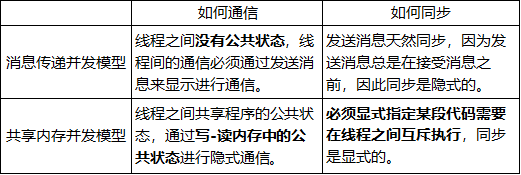-

## 3.2. 抽象结构

### 3.2.1. 运行时内存的划分

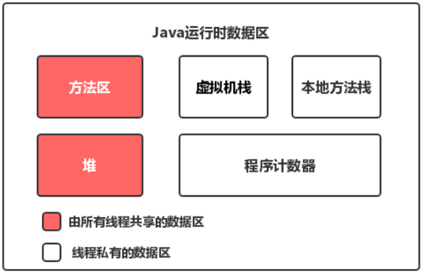

- 对于每一个线程来说，栈都是私有的，而堆是共有的。
- 也就是说在栈中的变量（局部变量、方法定义参数、异常处理器参数）不会在线程之间共享，也就不会有内存可见性（下文会说到）的问题，也不受内存模型的影响。而在堆中的变量是共享的，称为**共享变量**
- 所以，**内存可见性**是针对的**共享变量**。

### 3.2.2. 为什么会内存不可见

- 既然堆是共享的，为什么在堆中会有内存不可见问题？
  - 这是因为现代计算机为了**高效**，往往会在**高速缓存区**中缓存共享变量，因为cpu访问缓存区比访问内存要快得多。
  - 线程之间的共享变量存在主内存中，每个线程都有一个私有的**本地内存**，**存储了该线程以读、写共享变量的副本**。
- 本地内存：
  - **本地内存是Java内存模型的一个抽象概念，并不真实存在**。
  - **它涵盖了缓存、写缓冲区、寄存器等**。

<p style="color:red;">
待详细说明
</p>

### 3.2.3. JMM模型

- Java内存模型（简称JMM）:控制Java线程之间的通信，从抽象的角度来说，JMM定义了线程和主内存之间的抽象关系。
  > 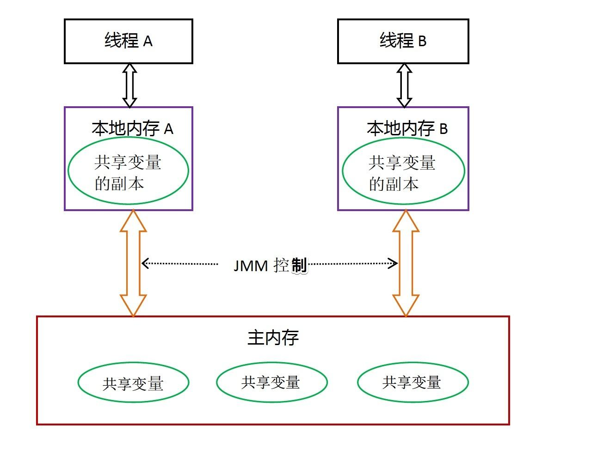
  - 所有的共享变量都存在主内存中。
  - 每个线程都保存了一份该线程使用到的共享变量的副本。
  - 如果线程A与线程B之间要通信的话，必须经历下面2个步骤：
    - 线程A将本地内存A中更新过的共享变量刷新到主内存中去。
    - 线程B到主内存中去读取线程A之前已经更新过的共享变量。
    - **所以，线程A无法直接访问线程B的工作内存，线程间通信必须经过主内存。**

- 注意
  - 根据JMM的规定，**线程对共享变量的所有操作都必须在自己的本地内存中进行，不能直接从主内存中读取**。
  - 所以线程B并不是直接去主内存中读取共享变量的值
    - 而是先在本地内存B中找到这个共享变量，发现这个共享变量已经被更新了，
    - 然后本地内存B去主内存中读取这个共享变量的新值，并拷贝到本地内存B中，
    - 最后线程B再读取本地内存B中的新值。
  - **JMM通过控制主内存与每个线程的本地内存之间的交互，来提供内存可见性保证**。
    - 可以让其他线程知道共享变量被更新了。这就是JMM的功劳了，也是JMM存在的必要性之一。
    > Java中的volatile关键字可以保证多线程操作共享变量的可见性以及禁止指令重排序， <br />
    > synchronized关键字不仅保证可见性，同时也保证了原子性（互斥性）。<br />
    > 在更底层，JMM通过内存屏障来实现内存的可见性以及禁止重排序。<br />
    > 为了程序员的方便理解，提出了happens-before，它更加的简单易懂，从而避免了程序员为了理解内存可见性而去学习复杂的重排序规则以及这些规则的具体实现方法。

### 3.2.4. JMM与Java内存区域划分的区别与联系

- 区别
  - 两者是不同的概念层次。
  - JMM是抽象的，他是用来描述一组规则，通过这个规则来控制各个变量的访问方式，围绕原子性、有序性、可见性等展开的。
  - 而Java运行时内存的划分是具体的，是JVM运行Java程序时，必要的内存划分。

- 联系
  - 都存在私有数据区域和共享数据区域。
  - 一般来说，JMM中的主内存属于共享数据区域，他是包含了堆和方法区
  - 同样，JMM中的本地内存属于私有数据区域，包含了程序计数器、本地方法栈、虚拟机栈，TLAB。

<p style="color:red;">
待解决  JMM本地内存到底是什么
</p>

### 3.2.5. JMM 缓存不一致性问题解决方式：

- 总线加锁
  ```
  cpu从主内存读取数据到高速缓存，会在总线对这个数据加锁，这样其它cpu没法
  去读或写这个数据，直到这个cpu使用完数据释放锁之后其它cpu才能读取该数据
  ```
- MESI缓存一致性协议+cpu总线嗅探机制(volatile处详细说明)

## 3.3. JMM原子操作

> <details>
> <summary style="color:red;">示例展示</summary>
>
> 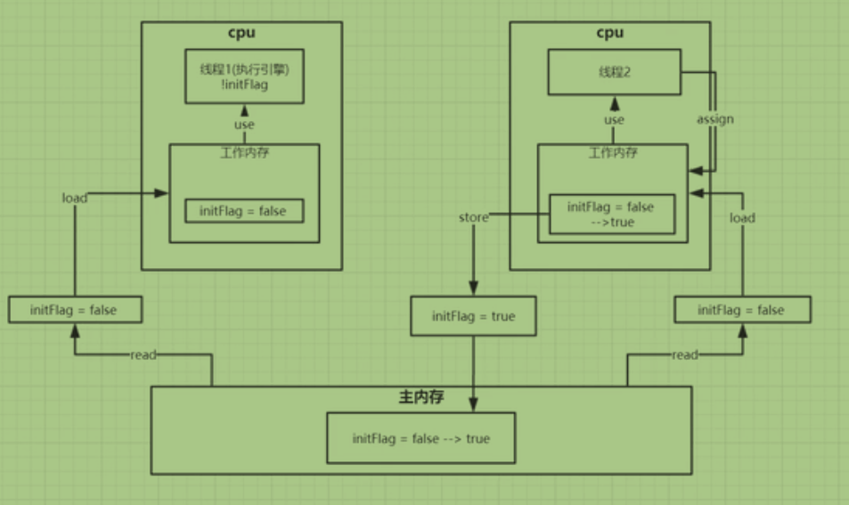
>
> > **线程与线程之间是无法交互的。只有通过主内存才可以交互**
> </details>

- read(读取）:从主内存读取数据
- unlock(解锁）:将主内存变量解锁，解锁后其他线程可以锁定该变量
- lock(锁定）:将主内存变量加锁，标识为线程独占状态。其他线程将无法读或写
- write(写入）:将store过去的变量值赋值给主内存中的变量
- store(存储）:将工作内存数据写入主内存
- assign(赋值）:将计算好的值重新赋值到工作内存中
- use(使用）:从工作内存读取数据来计算
- load(载入）:将主内存读取到的数据写入工作内存

## 3.4. 重排序

### 3.4.1. 说明

- 在不影响单线程程序执行结果的前提下，计算机为了最大限度的发挥机器性能，会对机器指令重排序优化
  > 

- 代码示例
  ```java
  for(int i = 0;i<1000000;i++){
    x = 0;
    y = 0;
    a = 0;
    b = 0;
    Thread one = new Thread(()->{
      a = y;
      x = 1;
    });
    Thread two = new Thread(()->{
        b = x;
        y = 1;
    });
  }
  // 最终结果可能有三种：
  // a = 0;b = 0，两个线程争抢资源,执行了前面的代码，后才执行赋1操作
  // a = 1;b = 0，one线程执行了赋1操作后，再执行two线程的b = x
  // a = 1;b = 1，发生了重排序
  ```

### 3.4.2. 重排序规范

#### 3.4.2.1. as-if-serial

- 不管怎么重排序，**单线程**程序的执行结果不能被改变。
  - 也就是说编译器和处理器不会对**存在数据依赖关系**的操作做重排序。

- 示例

  ```java
  a = x;
  y = a;
  ```

#### 3.4.2.2. happens-before

```
是一个给程序员使用的规则，只要程序员在写代码的时候遵循happens-before规则，JVM就能保证指令在多线程之间的顺序性符合程序员的预期。
```

```
happens-before关系本质上和as-if-serial语义是一回事。

as-if-serial语义保证单线程内重排序后的执行结果和程序代码本身应有的结果是一致的，
happens-before关系保证正确同步的多线程程序的执行结果不被重排序改变。
```

- 引入：就像上面发生重排序的例子。
  - 一方面，程序员需要JMM提供一个强的内存模型来编写代码；
    > 指的是有更多规定，意外情况越少越好。
  - 另一方面，编译器和处理器希望JMM对它们的束缚越少越好，这样它们就可以最可能多的做优化来提高性能，希望的是一个弱的内存模型。
    > 指的是希望通过重排序优化性能
  - 而对于程序员，JMM提供了happens-before规则（JSR-133规范），满足了程序员的需求--**简单易懂，并且提供了足够强的内存可见性保证**。
  - 换言之，程序员只要遵循happens-before规则，那他写的程序就能保证在JMM中具有强的内存可见性。

- happens-before关系的定义如下：
  - 如果一个操作happens-before另一个操作，那么第一个操作的执行结果将对第二个操作可见，而且第一个操作的执行顺序排在第二个操作之前。
  - **两个操作之间存在happens-before关系，并不意味着Java平台的具体实现必须要按照happens-before关系指定的顺序来执行**
  - **如果重排序之后的执行结果，与按happens-before关系来执行的结果一致，那么JMM也允许这样的重排序。**

- 原则：
  - 1.程序顺序原则
    - 一段代码在单线程中执行的结果是有序的
    - 注意是执行结果，因为虚拟机、处理器会对指令进行重排序
    - 虽然重排序了，但是并不会影响程序的执行结果，所以程序最终执行的结果与顺序执行的结果是一致的
    - 故而这个规则只对单线程有效，在多线程环境下无法保证正确性。
  - 2.锁规则：解锁（unlock)操作必然发生在后续的同一个锁的加锁（lock)之前，也就是说，如果对于一个锁解锁后，再加锁，那么加锁的动作必须在解锁动作之后（同一个锁）。
  - 3.volatile规则：
    - volatile变量的写，先发生于读，这保证了volatile变量的可见性
    - 简单的理解就是，volatile变量在每次被线程访问时，都强迫从主内存中读该变量的值
      - 通俗点讲就是如果一个线程先去写一个volatile变量，然后一个线程去读这个变量
      - 这个写操作一定是happens-before读操作的
    - 而当该变量发生变化时，又会强迫将最新的值刷新到主内存
    - 任何时刻，不同的线程总是能够看到该变量的最新值。
  - 4.线程启动规则：
    - 线程的start()方法先于它的每一个动作
    - 即如果线程A在执行线程B的start方法之前修改了共享变量的值，那么当线程B执行start方法时，线程A对共享变量的修改对线程B可见
  - 5.传递性：
    - 即A happens-before B , B happens-before C，那么A happens-before C
  - 6.线程终止规则：
    - 线程的所有操作先于线程的终结
    - Thread.join()方法的作用是等待当前执行的线程终止，假设在线程B终止之前，修改了共享变量
    - 线程A从线程B的join方法成功返回后，线程B对共享变量的修改将对线程A可见。
  - 7.线程中断规则：
    - 对线程interrupt()方法的调用先行发生于被中断线程的代码检测到中断事件的发生
    - 可以通过Thread.interrupted()方法检测线程是否中断。
  - 8.对象终结规则
    - 对象的构造函数执行，结束先于finalize()方法

# 4. volatile

```
解释一下volatile

首先简单地说一下作用
谈一下JMM
谈一下JMM原子操作
说一下volatile底层原理：MESI缓存一致性协议以及总线嗅探机制
```

## 4.1. 保证内存可见性

- 说明
  - 保证多线程之间的共享变量的内存可见性
  - 如果一个变量用volatile修饰
  - 尽管每个线程都有该变量的副本，
  - 但是任一线程修改了自己变量副本的值
  - 其他线程都可以马上感知到
- 原理:
  - MESI 缓存一致性协议
  - cpu 总线嗅探机制
  - lock

- 原理流程说明

  > <details>
  > <summary style="color:red;">图解</summary>
  >
  > 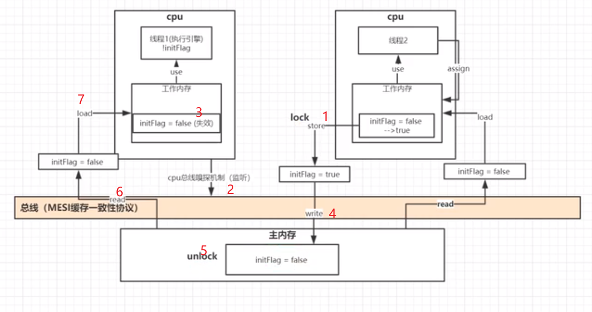
  >
  > </details>

  - volatile底层实现主要是通过汇编lock前缀指令。
  - lock会将当前处理器缓存行的数据**立即写回到系统内存**
    - cpu和内存间的数据交互都会经过总线
    - 当一个线程执行store原子操作时。数据会通过总线到主内存。
    - store时会进行一个lock原子操作
  - 这个写回内存的操作会引起在其他CPU里缓存了该内存地址的数据无效（MESI）
    - 上面也提到了，会经过总线
    - MESI缓存一致性性协议中有一个cpu总线嗅探机制
    - cpu总线嗅探机制会一直监控着经过总线的数据流动
    - 如果经过总线的数据，在其他的cpu的工作内存中也有副本，那么其他cpu中的副本就会被置为无效
    - 因为被设置为了无效，其他cpu会重新从主内存中重新read。如果有锁会等待
      > 注意，这就是上面进行lock的原因。如果不进行lock，在回写之前进行read，会读到原来的值
    - 回写(write原子操作)完后会进行unlock原子操作。之后unlock后才能被读取到

- 总线风暴

## 4.2. 禁止重排序

- 说明:volatile与普通变量的重排序规则:
    - 如果第一个操作是volatile读，那无论第二个操作是什么，都不能重排序；
    - 如果第二个操作是volatile写，那无论第一个操作是什么，都不能重排序；
    - 如果第一个操作是volatile写，第二个操作是volatile读，那不能重排序。

- 原理:内存屏障

  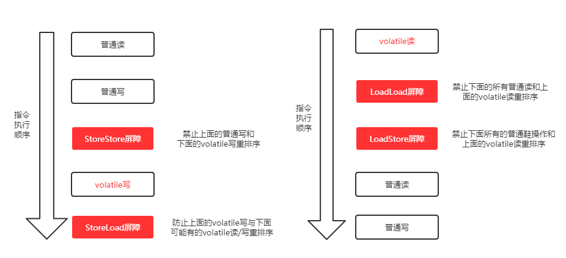

  > 注：下述Load代表读操作，Store代表写操作

  - LoadLoad屏障：对于这样的语句Load1; LoadLoad; Load2，在Load2及后续读取操作要读取的数据被访问前，保证Load1要读取的数据被读取完毕。
  - StoreStore屏障：对于这样的语句Store1; StoreStore; Store2，在Store2及后续写入操作执行前，这个屏障会把Store1强制刷新到内存，保证Store1的写入操作对其它处理器可见。
  - LoadStore屏障：对于这样的语句Load1; LoadStore; Store2，在Store2及后续写入操作被刷出前，保证Load1要读取的数据被读取完毕。
  - StoreLoad屏障：对于这样的语句Store1; StoreLoad; Load2，在Load2及后续所有读取操作执行前，保证Store1的写入对所有处理器可见。它的开销是四种屏障中最大的（冲刷写缓冲器，清空无效化队列）。在大多数处理器的实现中，这个屏障是个万能屏障，兼具其它三种内存屏障的功能

- 示例

  ```java
  // step 1，是普通变量的写，step 2是volatile变量的写，那符合第2个规则，这两个steps不能重排序
  // 而step 3是volatile变量读，step 4是普通变量读，符合第1个规则，同样不能重排序。

  // 声明变量
  int a = 0; // 声明普通变量
  volatile boolean flag = false; // 声明volatile变量

  // 以下两个变量的读操作是可以重排序的
  int i = a; // 普通变量读
  boolean j = flag; // volatile变量读
  ```

## 4.3. 不保证原子性

```
情景：10个线程，同时对一个volatile标志的变量num进行1000次++。最后num为多少？

小于等于10000
```

- 原因说明：
  - 现在以2个线程A,B进行说明
  - A线程对工作内存中的num进行++，为1。
  - B线程也对工作内存中的num进行了++，为1
  - 可能A线程较快完成++操作，最先加锁，因此B线程工作内存中的num的值失效。此次失效，**导致了一次`++`的丢失。**
  - 如果下一次B进行第二次++（A和B总共三次），且抢到了锁，那么回写为2，而不是3（丢失一次++）
  - 也就是说**MESI缓存一致性协议中经过总线的数据会导致其他cpu工作内存副本失效**这一点会导致volatile不保证原子性
- 解决
  - synchronized
  - Atomic(CAS)

## 4.4. volatile与锁

- volatile与锁
  - 在保证内存可见性这一点上，volatile有着与锁相同的内存语义，所以可以作为一个“轻量级”的锁来使用。
  - 但由于volatile仅仅保证对单个volatile变量的读/写具有原子性，而锁可以保证整个临界区代码的执行具有原子性。
  - **所以在功能上，锁比volatile更强大；在性能上，volatile更有优势。**

# 5. 锁的变迁

- jdk1.5 之前:synchronized 重量锁
- jdk1.5
  - 原因
  - 变化:增加
    - Lock 锁
    - 并发容器
    - 线程池
  - 依据原理
    - Atomic--UnSafe--CAS
    - AQS
    - LockSupport
    - volatile
- jdk1.6
  - 变化:synchronized 锁的升级
  - 原因
- jdk1.8:增加 StampedLock

# 6. synchronized

## 6.1. 3种使用方法

- 代码块
  - 自己指定对象锁
  - 底层原理：
    - monitorenter
    - monitorexit
    - 程序计数器
- 成员方法
  - this 对象锁
  - 底层原理：ACC_SYNCHRONIZED
- 静态方法
  - .class 类锁
  - 底层原理：ACC_SYNCHRONIZED，ACC_STATIC
- 注意：构造方法本身就属于线程安全的，不存在同步的构造方法一说。<br />不能加 synchronized

## 6.2. 锁的升级(不可逆)

- 无锁(CAS)
- 偏向锁
  - 原理
  - 锁的性质
  - 对象头中的内容
  - 升级过程
- 轻量锁
  - 原理
  - 锁的性质
  - 对象头中的内容
  - 升级过程
- 重量锁
  - 原理
  - 锁的性质
  - 对象头中的内容
  - 阻塞的好处(cpu)与代价(内核态)

## 6.3. synchronized 和 ReentrantLock 的区别

## 6.4. synchronized 和 volatile 的区别

# 7. CAS

## 7.1. 乐观锁与悲观锁

## 7.2. 概念与原理

```
如果有一个多个线程共享的变量i原本等于5，我现在在线程A中，想把它设置为新的值6;
我们使用CAS来做这个事情；
首先我们用i去与5对比，发现它等于5，说明没有被其它线程改过，那我就把它设置为新的值6，此次CAS成功，i的值被设置成了6；
如果不等于5，说明i被其它线程改过了（比如现在i的值为2），那么我就什么也不做，此次CAS失败，i的值仍然为2。
```

- V ar
  > 可以理解成本地内存中变量的值
- E xpected
  > 预期值E本质上指的是“旧值”。也就是主内存中的值
- N ew
  > 要赋的新值。

## 7.3. java 中 CAS 的实现-unsafe

## 7.4. java 中 CAS 的应用-Atomic

## 7.5. 问题

### 7.5.1. ABA 问题

  - AtomicStampedReference
  - AtomicMarkableReference

### 7.5.2. 循环时间长开销大

- 解决思路是让 JVM 支持处理器提供的 pause 指令

### 7.5.3. 只能保证一个共享变量的原子操作

- 使用 JDK 1.5 开始就提供的 AtomicReference 类保证对象之间的原子性，<br />把多个变量放到一个对象里面进行 CAS 操作；
- 使用锁。锁内的临界区代码可以保证只有当前线程能操作。

# 8. Atomic

## 8.1. 组成

- 基本类型
- 数组类型
- 引用类型
- 对象的属性修改类型

## 8.2. AtomicInteger

- 示例
- 基本原理

## 8.3. 源码

# 9. LockSupport与三种线程等待唤醒的方法

## 9.1. Object类

### 9.1.1. 说明

Object类中的wait和notify方法实现线程等待和唤醒

> **1、正常情况：实现线程的等待和唤醒**

1. 代码

   ```java
   static Object objectLock = new Object();

   private static void synchronizedWaitNotify() {
       new Thread(() -> {
           synchronized (objectLock) {
               System.out.println(Thread.currentThread().getName() + "\t" + "------come in");
               try {
                   objectLock.wait(); // 等待
               } catch (InterruptedException e) {
                   e.printStackTrace();
               }
               System.out.println(Thread.currentThread().getName() + "\t" + "------被唤醒");
           }
       }, "A").start();

       new Thread(() -> {
           synchronized (objectLock) {
               objectLock.notify(); // 唤醒
               System.out.println(Thread.currentThread().getName() + "\t" + "------通知");
           }
       }, "B").start();
   }
   ```

2. 程序运行结果：A 线程先执行，执行 `objectLock.wait()` 后被阻塞，B 线程在 A 线程之后执行 `objectLock.notify()` 将 A线程唤醒

  ```
  A ---come in
  B ---通知
  A ---被唤醒
  ```

### 9.1.2. 异常情况

> **异常情况一：不在 synchronized 关键字中使用 wait() 和 notify() 方法**

1. 代码

   ```java
   static Object objectLock = new Object();

   private static void synchronizedWaitNotify() {
       new Thread(() -> {
           //synchronized (objectLock) {
           System.out.println(Thread.currentThread().getName() + "\t" + "------come in");
           try {
               objectLock.wait(); // 等待
           } catch (InterruptedException e) {
               e.printStackTrace();
           }
           System.out.println(Thread.currentThread().getName() + "\t" + "------被唤醒");
           //}
       }, "A").start();

       new Thread(() -> {
           //synchronized (objectLock) {
           objectLock.notify(); // 唤醒
           System.out.println(Thread.currentThread().getName() + "\t" + "------通知");
           //}
       }, "B").start();
   }
   ```

2. 程序运行结果：不在 synchronized 关键字中使用 wait() 和 notify() 方法 ，将抛出 `java.lang.IllegalMonitorStateException` 异常

> **异常情况二：先 notify() 后 wait()**

1. 代码

   ```java
   static Object objectLock = new Object();

   private static void synchronizedWaitNotify() {
       new Thread(() -> {
           try {
               TimeUnit.SECONDS.sleep(3L);
           } catch (InterruptedException e) {
               e.printStackTrace();
           }
           synchronized (objectLock) {
               System.out.println(Thread.currentThread().getName() + "\t" + "------come in");
               try {
                   objectLock.wait(); // 等待
               } catch (InterruptedException e) {
                   e.printStackTrace();
               }
               System.out.println(Thread.currentThread().getName() + "\t" + "------被唤醒");
           }
       }, "A").start();

       new Thread(() -> {
           synchronized (objectLock) {
               objectLock.notify(); // 唤醒
               System.out.println(Thread.currentThread().getName() + "\t" + "------通知");
           }
       }, "B").start();
   }
   ```

2. 程序运行结果：B 线程先执行 `objectLock.notify()`，A 线程再执行 `objectLock.wait()`，这样 A 线程无法被唤醒

---

- wait和notify方法必须要在同步块或者方法里面且成对出现使用
- 先wait后notify才OK

## 9.2. Condition接口

### 9.2.1. 说明

Condition接口中的await后signal方法实现线程的等待和唤醒

> **1、正常情况：实现线程的等待和唤醒**

1. 代码

   ```java
   static Lock lock = new ReentrantLock();
   static Condition condition = lock.newCondition();

   private static void lockAwaitSignal() {
       new Thread(() -> {
           lock.lock();
           try {
               System.out.println(Thread.currentThread().getName() + "\t" + "------come in");
               try {
                   condition.await();
               } catch (InterruptedException e) {
                   e.printStackTrace();
               }
               System.out.println(Thread.currentThread().getName() + "\t" + "------被唤醒");
           } finally {
               lock.unlock();
           }
       }, "A").start();

       new Thread(() -> {
           lock.lock();
           try {
               condition.signal();
               System.out.println(Thread.currentThread().getName() + "\t" + "------通知");
           } finally {
               lock.unlock();
           }
       }, "B").start();
   }
   ```

2. 程序运行结果：A 线程先执行，执行 `condition.await()` 后被阻塞，B 线程在 A 线程之后执行 `condition.signal()` 将 A线程唤醒

  ```
  A ---come in
  B ---通知
  A ---被唤醒
  ```

### 9.2.2. 异常情况

> **异常情况一：不在 lock() 和 unlock() 方法内使用 await() 和 signal() 方法**

1. 代码

   ```java
   static Lock lock = new ReentrantLock();
   static Condition condition = lock.newCondition();

   private static void lockAwaitSignal() {
       new Thread(() -> {
           //lock.lock();
           try {
               System.out.println(Thread.currentThread().getName() + "\t" + "------come in");
               try {
                   condition.await();
               } catch (InterruptedException e) {
                   e.printStackTrace();
               }
               System.out.println(Thread.currentThread().getName() + "\t" + "------被唤醒");
           } finally {
               //lock.unlock();
           }
       }, "A").start();

       new Thread(() -> {
           //lock.lock();
           try {
               condition.signal();
               System.out.println(Thread.currentThread().getName() + "\t" + "------通知");
           } finally {
               //lock.unlock();
           }
       }, "B").start();
   }
   ```

2. 程序运行结果：不在 lock() 和 unlock() 方法内使用 await() 和 signal() 方法，将抛出 `java.lang.IllegalMonitorStateException` 异常

> **异常情况二：先 signal() 后 await()**

1. 代码

   ```java
   static Lock lock = new ReentrantLock();
   static Condition condition = lock.newCondition();

   private static void lockAwaitSignal() {
       new Thread(() -> {
           try {
               TimeUnit.SECONDS.sleep(3L);
           } catch (InterruptedException e) {
               e.printStackTrace();
           }
           lock.lock();
           try {
               System.out.println(Thread.currentThread().getName() + "\t" + "------come in");
               try {
                   condition.await();
               } catch (InterruptedException e) {
                   e.printStackTrace();
               }
               System.out.println(Thread.currentThread().getName() + "\t" + "------被唤醒");
           } finally {
               lock.unlock();
           }
       }, "A").start();

       new Thread(() -> {
           lock.lock();
           try {
               condition.signal();
               System.out.println(Thread.currentThread().getName() + "\t" + "------通知");
           } finally {
               lock.unlock();
           }
       }, "B").start();
   }
   ```

2. 程序运行结果：B 线程先执行 `condition.signal()`，A 线程再执行 `condition.await()`，这样 A 线程无法被唤醒

  ```
  B ---通知
  A ---come in
  ```

---

> **传统的 synchronized 和 Lock 实现等待唤醒通知的约束**

- 线程先要获得并持有锁，必须在锁块（synchronized或lock）中
- 必须要先等待后唤醒，线程才能够被唤醒

## 9.3. LockSupport类

### 9.3.1. 基本说明

- 用途：LockSupport 是用来创建锁和其他同步类的基本线程阻塞原语。
- 使用方式：
  - LockSupport中的park()和unpark()的作用分别是阻塞线程和解除阻塞线程，
  - 可以将其看作是线程等待唤醒机制(wait/notify)的加强版
- 原理：
  - LockSupport 类使用了一种名为 permit（许可）的概念来做到阻塞和唤醒线程的功能，
  - 每个线程都有一个许可（permit），permit 只有两个值 1 和0
  - **permit默认为0**
  - **可以把permit看成是一种（0, 1）信号量（Semaphore），但与 Semaphore 不同的是，许可的累加上限是 1**。

### 9.3.2. 主要方法

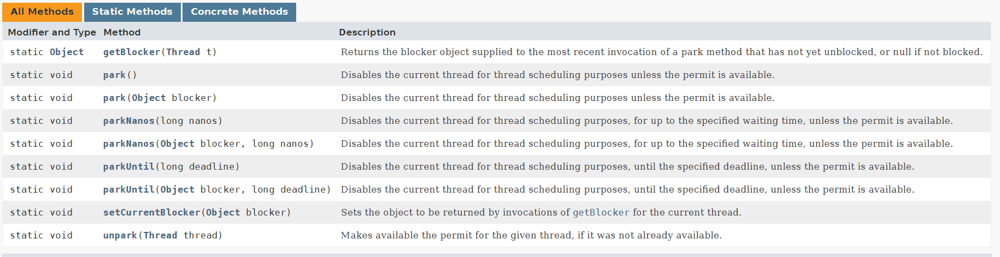

> **阻塞park**

- 使用：`LockSupport.park()`
- 作用:阻塞**当前线程**
- 注意：
  - permit 默认是 0，
  - 所以一开始调用 `park()` 方法，当前线程就会阻塞，
  - 直到别的线程将当前线程的 permit 设置为 1 时，`park()` 方法会被唤醒，然后会将 permit 再次设置为 0 并返回。

- 原理:park() 方法通过 Unsafe 类实现
  ```java
  // Disables the current thread for thread scheduling purposes unless the permit is available.
  public static void park() {
      UNSAFE.park(false, 0L);
  }
  ```

> **唤醒unpark()**

- 使用：`unpark(Thread)`
- 作用：唤醒处于阻断状态的指定线程
- 注意：
  - 调用 `unpark(thread)` 方法后，就会将 thread 线程的许可 permit 设置成 1
  - 注意多次调用 `unpark()`方法，**不会累加**，permit 值还是 1
  - 若此时有线程在阻塞，会自动唤醒 thread 线程，即之前阻塞线程中的`LockSupport.park()`方法会立即返回。

- 原理： `unpark()` 方法通过 Unsafe 类实现
  ```java
  // Makes available the permit for the given thread
  public static void unpark(Thread thread) {
      if (thread != null)
          UNSAFE.unpark(thread);
  }
  ```

### 9.3.3. 代码示例

#### 9.3.3.1. 基本示例

1. 代码

   ```java
   private static void lockSupportParkUnpark() {
       Thread a = new Thread(() -> {
           System.out.println(Thread.currentThread().getName() + "\t" + "------come in");
           LockSupport.park(); // 线程 A 阻塞
           System.out.println(Thread.currentThread().getName() + "\t" + "------被唤醒");
       }, "A");
       a.start();

       new Thread(() -> {
           LockSupport.unpark(a); // B 线程唤醒线程 A
           System.out.println(Thread.currentThread().getName() + "\t" + "------通知");
       }, "B").start();
   }
   ```

2. 程序运行结果：A 线程先执行 `LockSupport.park()` 方法将通行证（permit）设置为 0，其实这并没有什么鸟用，因为 permit 初始值本来就为 0，然后 B 线程执行 `LockSupport.unpark(a)` 方法将 permit 设置为 1，此时 A 线程可以通行

  ```
  A ---come in
  B ---通知
  A ---被唤醒
  ```

#### 9.3.3.2. 异常情况

> 先 unpark() 后 park()

1. 代码

   ```java
   private static void lockSupportParkUnpark() {
       Thread a = new Thread(() -> {
           try {
               TimeUnit.SECONDS.sleep(3L);
           } catch (InterruptedException e) {
               e.printStackTrace();
           }
           System.out.println(Thread.currentThread().getName() + "\t" + "------come in" + System.currentTimeMillis());
           LockSupport.park();
           System.out.println(Thread.currentThread().getName() + "\t" + "------被唤醒" + System.currentTimeMillis());
       }, "A");
       a.start();

       new Thread(() -> {
           LockSupport.unpark(a);
           System.out.println(Thread.currentThread().getName() + "\t" + "------通知");
       }, "B").start();
   }
   ```

2. 程序运行结果：因为引入了通行证的概念，所以先唤醒（`unpark()`）其实并不会有什么影响，从程序运行结果可以看出，A 线程执行 `LockSupport.park()` 时并没有被阻塞
  ```
  A ---come in
  B ---通知
  A ---被唤醒
  ```

---

> 异常情况：没有考虑到 permit 上限值为 1

1. 代码

   ```java
   private static void lockSupportParkUnpark() {
       Thread a = new Thread(() -> {
           try {
               TimeUnit.SECONDS.sleep(3L);
           } catch (InterruptedException e) {
               e.printStackTrace();
           }
           System.out.println(Thread.currentThread().getName() + "\t" + "------come in" + System.currentTimeMillis());
           LockSupport.park();
           LockSupport.park();
           System.out.println(Thread.currentThread().getName() + "\t" + "------被唤醒" + System.currentTimeMillis());
       }, "A");
       a.start();

       new Thread(() -> {
           LockSupport.unpark(a);
           LockSupport.unpark(a);
           System.out.println(Thread.currentThread().getName() + "\t" + "------通知");
       }, "B").start();
   }
   ```

2. 程序运行结果：由于 permit 的上限值为 1，所以执行两次 `LockSupport.park()` 操作将导致 A 线程阻塞
  ```
  B -----通知
  A -----come in1609053197873
  ```

### 9.3.4. 中断异常

- **线程如果因为调用park而阻塞的话，能够响应中断请求(中断状态被设置成true)，但是不会抛出InterruptedException。仅仅会isInterrupted()返回true**

### 9.3.5. 总结

- 以前的两种方式：
  - 以前的等待唤醒通知机制必须synchronized里面执行wait和notify，在lock里面执行await和signal，这上面这两个都必须要持有锁才能干

- LockSupport：俗称锁中断，LockSupport 解决了 synchronized 和 lock 的痛点
  - 优势1：LockSupport不用持有锁块，不用加锁，程序性能好
  - 优势2：无须注意唤醒和阻塞的先后顺序，不容易导致卡死

---

- 说明： **LockSupport是用来创建锁和其他同步类的基本线程阻塞原语**
  - LockSupport是一个线程阻塞工具类，所有的方法都是静态方法，可以让线程在任意位置阻塞，阻塞之后也有对应的唤醒方法。
  - 归根结底，LockSupport调用的Unsafe中的native代码。

- 特点： **LockSupport提供park()和unpark()方法实现阻塞线程和解除线程阻塞的过程**
  - **许可默认是被占用的**
    - LockSupport和每个使用它的线程都有一个许可(permit)关联。permit相当于1，0的开关，默认是0
    - 在调用unpark前，调用park的话，会直接阻塞
    - 调用一次unpark就加1变成1，调用一次park会消费permit，也就是将1变成0，同时park立即返回。
  - **LockSupport是不可重入的**
    - 如再次调用park会变成阻塞(因为permit为零了会阻塞在这里，一直到permit变为1)，这时调用unpark会把permit置为1。
    - 每个线程都有一个相关的permit，permit最多只有一个，**重复调用unpark也不会积累凭证**。

- 流程要点： 线程阻塞需要消耗凭证(permit)，这个凭证最多只有1个。
  - 当调用park方法时
    - 如果有凭证，则会直接消耗掉这个凭证然后正常退出;
    - 如果无凭证，就必须阻塞等待凭证可用;
  - 而unpark则相反，它会增加一个凭证，但**凭证最多只能有1个，累加无效**。

### 9.3.6. 相关问题

- park 底层使用的是`UNSAFE.park`
- 为什么 LockSupport 也是核心基础类? AQS 框架借助于两个类：Unsafe(提供 CAS 操作)和 LockSupport(提供 park/unpark 操作)
- 写出分别通过 wait/notify 和 LockSupport 的 park/unpark 实现同步?
- LockSupport.park()会释放锁资源吗? 那么 Condition.await()呢?
- Thread.sleep()、Object.wait()、Condition.await()、LockSupport.park()的区别? **重点**
- 如果在 wait()之前执行了 notify()会怎样? 如果在 park()之前执行了 unpark()会怎样?

### 9.3.7. 底层原理

LockSupport和Atomic类都是调用的Unsafe类中的方法。

[Unsafe类park和unpark方法源码深入分析（mutex+cond)](https://blog.csdn.net/saintyyu/article/details/107426428)

# 10. AQS

## 10.1. 概念

- **AQS**是`AbstractQueuedSynchronizer`的简称，即`抽象队列同步器`，从字面意思上理解:
  - 抽象：抽象类，只实现一些主要逻辑，有些方法由子类实现；
  - 队列：使用先进先出（FIFO）队列存储数据；
  - 同步：实现了同步的功能。

- 作用：
  - AQS是一个用来构建锁和同步器的框架，使用AQS能简单且高效地构造出应用广泛的同步器
  - 只要子类实现它的几个`protected`方法就可以了，
  - 比如我们提到的ReentrantLock，Semaphore，ReentrantReadWriteLock，SynchronousQueue，FutureTask等等皆是基于AQS的。

---

一般我们说的 AQS 指的是 `java.util.concurrent.locks` 包下的 AbstractQueuedSynchronizer，但其实还有另外三种抽象队列同步器：`AbstractOwnableSynchronizer`、`AbstractQueuedLongSynchronizer` 和 `AbstractQueuedSynchronizer`

## 10.2. 底层依赖

> **AQS框架借助于两个类：Unsafe(提供CAS操作)和LockSupport(提供park/unpark操作)**

- Unsafe(提供 CAS 操作)
- LockSupport(提供 park/unpark 操作)
  - LockSupport底层又是Unsafe

## 10.3. 原理

### 10.3.1. state

- state 是 AQS 中的核心字段，用 volatile int 修饰，表示同步状态
- 不同实现中 state 的含义：
  - ReentrantLock：state 表示重入次数，0 为未锁定，>0 为已锁定
  - Semaphore：state 表示剩余许可数
  - CountDownLatch：state 表示计数值
  - ReentrantReadWriteLock：高 16 位为读锁数量，低 16 位为写锁重入次数
- 操作方式：通过 getState()、setState()、compareAndSetState() 三个方法访问
- compareAndSetState() 使用 Unsafe.compareAndSwapInt 实现原子更新
- 设计目的：子类通过操作 state 实现自定义的获取/释放语义，AQS 框架根据 state 决定线程是否阻塞

### 10.3.2. CLH

- CLH 队列是 AQS 内部维护的 FIFO 双向链表，用于管理等待获取锁的线程
- 节点结构（Node 内部类）：
  - thread：等待的线程引用
  - waitStatus：节点状态（CANCELLED=1, SIGNAL=-1, CONDITION=-2, PROPAGATE=-3）
  - prev：前驱节点
  - next：后继节点
  - nextWaiter：条件队列中的下一个节点 / 标记共享或独占模式
- 入队过程（addWaiter）：
  - 创建 Node 封装当前线程
  - CAS 将 Node 设置为 tail（尾节点）
  - 如果 CAS 失败，通过 enq() 自旋入队
- waitStatus 含义：
  - SIGNAL(-1)：当前节点释放锁后需要唤醒后继节点
  - CANCELLED(1)：节点已取消（超时或中断）
  - 0：初始状态

### 10.3.3. 条件队列

[AQS中的两个队列](https://blog.csdn.net/disiwei1012/article/details/78596731)

## 10.4. 源码分析

待整理（重要）

[AQS源码分析](https://www.cnblogs.com/waterystone/p/4920797.html)

[AQS详解](https://www.cnblogs.com/chengxiao/archive/2017/07/24/7141160.html)

- ReentrantLock流程
  > 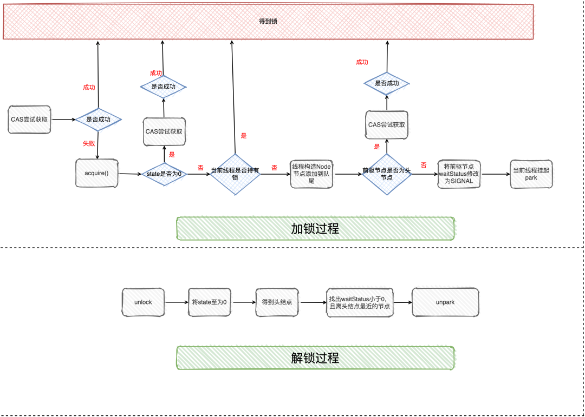

### 10.4.1. 模板设计模式

- AQS 采用模板方法设计模式，将通用的入队、出队、阻塞、唤醒等逻辑封装在父类中
- 子类只需实现以下几个 protected 方法即可定义锁的语义：
  - tryAcquire(int arg)：独占模式尝试获取资源，成功返回 true
  - tryRelease(int arg)：独占模式尝试释放资源
  - tryAcquireShared(int arg)：共享模式尝试获取资源，返回值 >= 0 表示成功
  - tryReleaseShared(int arg)：共享模式尝试释放资源
  - isHeldExclusively()：判断当前线程是否独占资源
- 设计优势：
  - 子类无需关心线程排队和唤醒的细节
  - 同一套框架支持独占锁（ReentrantLock）和共享锁（Semaphore、CountDownLatch）
  - 公平/非公平策略只需在 tryAcquire 中控制是否检查队列

### 10.4.2. acquire

```java
public final void acquire(int arg) {
    if (!tryAcquire(arg) &&
        acquireQueued(addWaiter(Node.EXCLUSIVE), arg))
        selfInterrupt();
}
```

- aquire()方法为获取资源的入口
- tryAcquire()尝试直接去获取资源，如果成功则直接返回（这里体现了非公平锁，每个线程获取锁时会尝试直接抢占加塞一次，而CLH队列中可能还有别的线程在等待）；
- 如果无法获取资源就会执行addWaiter，addWaiter()将该线程加入等待队列的尾部，并标记为独占模式；
- acquireQueued()使线程阻塞在等待队列中获取资源，一直获取到资源后才返回。如果在整个等待过程中被中断过，则返回true，否则返回false。
- 如果线程在等待过程中被中断过，它是不响应的。只是获取资源后才再进行自我中断selfInterrupt()，将中断补上。

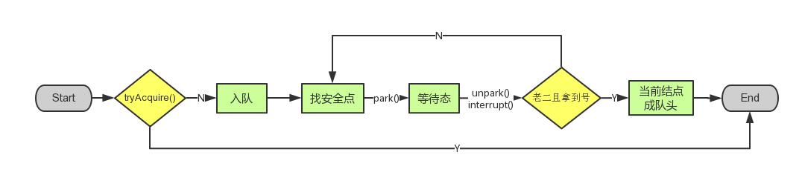

### 10.4.3. release

```java
public final boolean release(int arg) {
    if (tryRelease(arg)) {
        Node h = head;
        if (h != null && h.waitStatus != 0)
            unparkSuccessor(h);
        return true;
    }
    return false;
}
```

- release() 是独占模式下释放资源的入口
- tryRelease() 由子类实现，尝试释放资源（如将 state 减 1）
- 释放成功后，检查头节点的 waitStatus，如果有后继节点在等待，则调用 unparkSuccessor() 唤醒
- unparkSuccessor()：找到队列中下一个需要唤醒的节点，调用 LockSupport.unpark() 唤醒对应线程
- 被唤醒的线程会在 acquireQueued() 中继续自旋尝试获取资源

### 10.4.4. acquireShared

```java
public final void acquireShared(int arg) {
    if (tryAcquireShared(arg) < 0)
        doAcquireShared(arg);
}
```

- acquireShared() 是共享模式下获取资源的入口
- tryAcquireShared() 由子类实现：返回值 < 0 表示获取失败；= 0 表示成功但无剩余资源；> 0 表示成功且有剩余资源
- 获取失败时进入 doAcquireShared()：
  - 将当前线程包装为 Node.SHARED 模式加入队列尾部
  - 自旋 + park 等待直到获取成功
  - 与独占模式不同：获取成功后会传播唤醒后续的共享节点（setHeadAndPropagate）
- 传播机制确保多个共享线程可以同时被唤醒（如 Semaphore 一次释放多个许可）

### 10.4.5. releaseShared

```java
public final boolean releaseShared(int arg) {
    if (tryReleaseShared(arg)) {
        doReleaseShared();
        return true;
    }
    return false;
}
```

- releaseShared() 是共享模式下释放资源的入口
- tryReleaseShared() 由子类实现，尝试释放共享资源
- doReleaseShared()：唤醒后继节点，并确保传播（多个线程可能同时调用释放）
- 与 release() 的区别：doReleaseShared() 使用 CAS + 循环确保并发释放的正确性
- 典型应用：CountDownLatch.countDown() 将 state 减 1，当 state 变为 0 时唤醒所有等待线程

## 10.5. AQS组件

### 10.5.1. 总览

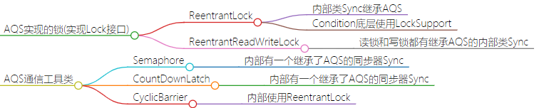

### 10.5.2. ReentrantLock

- Object.wait()相当于把线程加入锁的 **唯一一个** 等待队列
  > 看下面重量锁的多个队列
- 而ReentrantLock中，获得的每个Condition都可以看作一个队列。
  - condition.await()相当于把线程加入该condition的等待队列

- 实现原理：
  - 内部类 Sync 继承 AQS，state 表示重入次数（0 表示未锁定）
  - lock()：CAS 将 state 从 0 设为 1，成功则获取锁；失败则进入 AQS 排队
  - 重入：同一线程再次获取锁时，state 递增，释放时递减，直到 state=0 才真正释放
  - 公平锁（FairSync）：tryAcquire 中先检查队列是否有前驱节点，有则不抢占
  - 非公平锁（NonfairSync）：tryAcquire 中直接 CAS 抢占，不检查队列
- 与 synchronized 对比：支持公平锁、可中断、超时获取、多 Condition 队列

### 10.5.3. ReentrantReadWriteLock

- 用途：读多写少场景，允许多个线程同时读，但写时互斥
- 实现原理：
  - 将 AQS 的 state 拆分为高 16 位（读锁计数）和低 16 位（写锁计数）
  - 读锁（共享锁）：tryAcquireShared，当没有写锁或写锁是当前线程时可获取
  - 写锁（独占锁）：tryAcquire，当没有任何读锁和写锁时可获取
  - 锁降级：持有写锁的线程可以再获取读锁，然后释放写锁（写锁降级为读锁）
  - 不支持锁升级：持有读锁时不能获取写锁（会死锁）
- 使用示例：
  ```java
  ReentrantReadWriteLock rwLock = new ReentrantReadWriteLock();
  rwLock.readLock().lock();    // 读操作
  rwLock.readLock().unlock();
  rwLock.writeLock().lock();   // 写操作
  rwLock.writeLock().unlock();
  ```

### 10.5.4. Semaphore

- 用途：控制同时访问某个资源的线程数量（信号量），常用于限流
- 实现原理：
  - AQS 的 state 表示剩余许可数
  - acquire()：调用 acquireShared，将 state 减 1，如果 state < 0 则阻塞
  - release()：调用 releaseShared，将 state 加 1，唤醒等待线程
  - 支持公平和非公平模式
- 使用示例：
  ```java
  Semaphore semaphore = new Semaphore(3); // 最多3个线程并发
  semaphore.acquire();  // 获取许可
  try {
      // 访问共享资源
  } finally {
      semaphore.release();  // 释放许可
  }
  ```
- 典型场景：数据库连接池限流、接口限流

### 10.5.5. CountDownLatch

- 用途：等待一组线程全部完成后再继续执行（倒计数门闩）
- 实现原理：
  - AQS 的 state 初始化为计数值 N
  - countDown()：调用 releaseShared，将 state 减 1
  - await()：调用 acquireShared，当 state != 0 时阻塞
  - 当 state 减为 0 时，所有 await 的线程被唤醒
- 特点：一次性使用，计数器归零后不可重置
- 使用示例：
  ```java
  CountDownLatch latch = new CountDownLatch(3);
  // 三个子线程各自完成后调用 latch.countDown()
  latch.await(); // 主线程等待所有子线程完成
  ```
- 典型场景：主线程等待多个子任务完成后汇总结果

### 10.5.6. CyclicBarrier

<!--

- 其他
  - AOS
  - AQLS

-->

## 10.6. 其他通信工具类


## 10.7. 自定义Mutex

# 11. 锁、通信工具类

## 11.1. AQS 实现的锁(实现 Lock 接口)

### 11.1.1. ReentrantLock

- 内部类 Sync 继承 AQS
- Condition 底层使用 LockSupport

### 11.1.2. ReentrantReadWriteLock

- 读锁和写锁都有继承 AQS 的内部类 Sync

## 11.2. AQS 通信工具类

### 11.2.1. Semaphore

- 内部有一个继承了 AQS 的同步器 Sync

### 11.2.2. CountDownLatch

- 内部有一个继承了 AQS 的同步器 Sync

### 11.2.3. CyclicBarrier

- 内部使用 ReentrantLock

## 11.3. 非 AQS 的通信工具类

### 11.3.1. Exchanger

- LockSupport
- CAS(Atomic)

### 11.3.2. Phaser

- 有使用 LockSupport

# 12. 锁的种类总结

## 12.1. 锁的有无

- 乐观锁
  - 认为数据一般不会产生冲突，只在提交更新时检查是否有冲突
  - 实现方式：CAS 操作、版本号机制（数据库 version 字段）
  - 适用场景：读多写少，冲突概率低
  - Java 中的实现：AtomicInteger、AtomicLong 等 Atomic 类
- 悲观锁
  - 认为数据随时可能被其他线程修改，每次操作前都加锁
  - 实现方式：synchronized、ReentrantLock、数据库 SELECT FOR UPDATE
  - 适用场景：写多读少，冲突概率高
  - 缺点：线程阻塞和唤醒带来上下文切换开销

## 12.2. synchronized 的锁

- 无锁
- 偏向锁
- 轻量锁
- 重量锁

## 12.3. 锁的性质分类

### 12.3.1. 可重入锁和非可重入锁

- 表现
  - 可重入锁：同一线程可以多次获取同一把锁而不会死锁
  - 非可重入锁：同一线程再次获取已持有的锁会导致死锁
- 原理：粒度（加锁范围）
  - 可重入锁内部维护一个计数器，同一线程每次获取锁 +1，释放锁 -1，计数为 0 时真正释放
  - 非可重入锁不记录持有者，不区分是否是同一线程
- 实例
  - 可重入锁：synchronized、ReentrantLock
  - 不可重入锁：自旋锁的简单实现（不判断线程身份）
  - 可以切换：无，锁的可重入性由实现决定

### 12.3.2. 公平锁与非公平锁

- 表现
  - 公平锁：线程按照请求顺序获取锁（FIFO），先来先得
  - 非公平锁：允许插队，新来的线程有机会直接抢占锁
- 原理
  - 公平锁：tryAcquire 时检查 AQS 队列中是否有等待的前驱节点，有则排队
  - 非公平锁：tryAcquire 时直接 CAS 抢占，不检查队列
- 实例
  - 公平锁：`new ReentrantLock(true)`
  - 非公平锁：`new ReentrantLock(false)`（默认）、synchronized
  - 可以切换：ReentrantLock 构造参数指定
- 性能对比：非公平锁吞吐量更高（减少线程唤醒开销），但可能导致线程饥饿

### 12.3.3. 读写锁和排它锁

- 表现
  - 读写锁（共享锁/独占锁）：读读不互斥，读写互斥，写写互斥
  - 排它锁（独占锁/互斥锁）：任何操作都互斥
- 原理
  - 读写锁：AQS state 高16位记录读锁数量，低16位记录写锁数量
  - 排它锁：AQS state 只有 0（未锁）和 非0（已锁）两种状态
- 实例
  - 读写锁：ReentrantReadWriteLock、StampedLock（JDK 1.8）
  - 排它锁：synchronized、ReentrantLock
  - 可以切换：无，由锁类型决定
- 是否可中断
  - synchronized 不可中断
  - ReentrantLock.lockInterruptibly() 支持中断
  - ReentrantReadWriteLock 的读写锁均支持可中断获取

# 13. 并发容器

- [什么是同步容器和并发容器](https://juejin.cn/post/6844903954719965192)

- 同步容器

  - vector:在面对多线程下的复合操作的时候也是需要通过客户端加锁的方式保证原子性
  - HashTable
  - Collections 下的各种 SynchronizedXXX

- 并发容器
  - Queue
    - BlockingQueue
      - ArrayBlockingQueue
      - LinkedBlockingQueue
      - DelayQueue
      - Priority BlockingQueue
      - SynchronousQueue
      - LinkedBlockingDeque
      - LinkedTransferQueue
    - ConcurrenLinkedQueue
      - [LinkedBlockingQueue 与 ConcurrentLinkedQueue 的区别](https://blog.csdn.net/lzxlfly/article/details/86710382)
  - ConcurrentMap
    - ConcurrentHashMap
    - ConcurrentNavigableMap
    - ConcurrentSkipListMap
  - CopyOnWrite
    - CopyOnWriteArrayList
    - CopyOnWriteArrayMap
    - CopyOnWriteArraySet

# 14. 线程池

## 14.1. 结构

- 任务(Runnable /Callable)
- 任务的执行(Executor)
- 异步计算的结果(Future)

## 14.2. 创建

### 14.2.1. ThreadPoolExecutor 构造方法参数的含义

- int corePoolSize：该线程池中核心线程数最大值
- int maximumPoolSize：该线程池中线程总数最大值 。
- long keepAliveTime：非核心线程闲置超时时长。
- TimeUnit unit：keepAliveTime 的单位。
- BlockingQueue workQueue：阻塞队列，维护着等待执行的 Runnable 任务对象。
- ThreadFactory threadFactory：<br />创建线程的工厂 ，用于批量创建线程，统一在创建线程时设置一些参数，<br/>如是否守护线程、线程的优先级等。<br />如果不指定，会新建一个默认的线程工厂。
- RejectedExecutionHandler handler 拒绝策略
  - AbortPolicy：默认拒绝处理策略，丢弃任务并抛出 RejectedExecutionException 异常。
  - DiscardPolicy：丢弃新来的任务，但是不抛出异常。
  - DiscardOldestPolicy：丢弃队列头部（最旧的）的任务，然后重新尝试执行程序（如果再次失败，重复此过程）。
  - CallerRunsPolicy：由调用线程处理该任务。

### 14.2.2. Executors 默认实现 (底层使用 ThreadPoolExecutor)

>  **ThreadPoolExecutor（最基本）**

- 组成：可以设置核心线程数，最大线程数，超时时间等。
- 执行规则：
  > <details>
  > <summary style="color:red;">图示</summary>
  >
  > 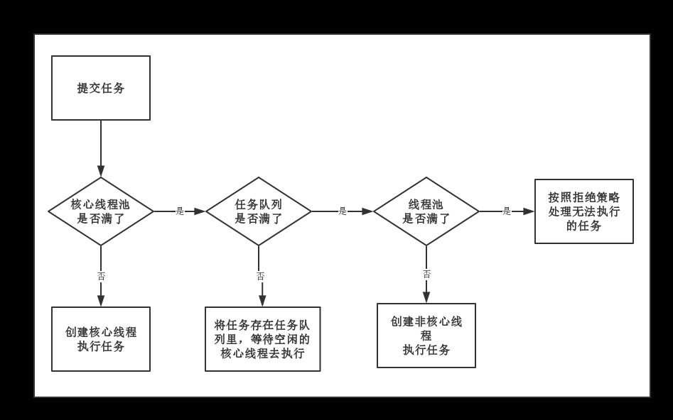
  > </details

  - 如果线程未达到核心线程数量，那么直接启动一个核心线程。
  - 如果线程达到核心线程的数量，任务会被插入到任务队列（workQueue）排队。
  - 如果任务队列已满导致步骤2无法插入到任务队列，那么开启一个非核心线程执行。
  - 如果步骤3的线程数量达到线程池规定数目（maxmumPoolSize），那么拒绝执行此任务。

> **FixedThreadPool（可重用固定线程数）**

- 组成：只有核心线程，无非核心线程，无超时机制，阻塞队列无界。
- 使用：
  - 当线程处于空闲状态时，只要线程池不被关闭它们就并不会被回收。
  - 当所有线程都处于活动状态，新任务就会处于等待状态，直到有线程空闲出来。
  - 适用于执行长期任务。
- 底层实现
  ```java
  public static ExecutorService newFixedThreadPool(int nThreads) {
          return new ThreadPoolExecutor(nThreads, nThreads,
                                        0L, TimeUnit.MILLISECONDS,
                                        new LinkedBlockingQueue<Runnable>());
  }
  ```

> **CachedThreadPool (按需创建)**

- 组成：线程数量不定，没有核心线程，只有非核心线程，每个线程空闲等待的时间为60s，采用SynchronousQueue队列。
- 使用：
  - 当线程都处于活动状态时，线程池会创建新线程来执行任务，否则就会复用空闲的线程。
  - 当所有线程都处于闲置状态，线程会逐渐因为超时被停止，线程池中就没有线程，几乎不占系统资源。
  - 这种线程池适用于大量耗时少的任务
- 底层实现
  ```java
  public static ExecutorService newCachedThreadPool() {
      return new ThreadPoolExecutor(0, Integer.MAX_VALUE,
                                    60L, TimeUnit.SECONDS,
                                    new SynchronousQueue<Runnable>());
  }
  ```

> **ScheduledThreadPool(定时延时执行)**

- 组成：核心线程数固定，非核心线程数没有限制，非核心线程闲置时会被立即回收。
- 使用：
  - 主要用于执行定时任务和周期性重复任务。
- 底层实现
  ```java
  public static ScheduledExecutorService newScheduledThreadPool(int corePoolSize) {
      return new ScheduledThreadPoolExecutor(corePoolSize);
  }

  //ScheduledThreadPoolExecutor():
  public ScheduledThreadPoolExecutor(int corePoolSize) {
      super(corePoolSize, Integer.MAX_VALUE,
            DEFAULT_KEEPALIVE_MILLIS, MILLISECONDS,
            new DelayedWorkQueue());
  }
  ```

> **SingleThreadExecutor（单核fixed）**
  - 组成：只有一个核心线程，存活时间无限
  - 底层实现
    ```java
    public static ExecutorService newSingleThreadExecutor() {
        return new FinalizableDelegatedExecutorService
            (new ThreadPoolExecutor(1, 1,
                                    0L, TimeUnit.MILLISECONDS,
                                    new LinkedBlockingQueue<Runnable>()));
    }
    ```

### 14.2.3. 为什么不要用默认实现

- 阿里巴巴 Java 开发手册明确规定：线程池不允许使用 Executors 去创建，而是通过 ThreadPoolExecutor 手动创建
- FixedThreadPool 和 SingleThreadExecutor 的问题：
  - 使用 LinkedBlockingQueue（无界队列），允许的请求队列长度为 Integer.MAX_VALUE
  - 可能导致大量请求堆积，造成 OOM（OutOfMemoryError）
- CachedThreadPool 的问题：
  - maximumPoolSize 为 Integer.MAX_VALUE，允许创建的线程数量为 Integer.MAX_VALUE
  - 可能创建大量线程，导致 OOM 或线程调度开销过大
- ScheduledThreadPool 的问题：
  - maximumPoolSize 为 Integer.MAX_VALUE，同样有创建过多线程的风险
- 正确做法：使用 ThreadPoolExecutor 构造方法，明确指定核心参数
  ```java
  new ThreadPoolExecutor(
      corePoolSize,
      maximumPoolSize,
      keepAliveTime, TimeUnit.SECONDS,
      new ArrayBlockingQueue<>(queueCapacity), // 有界队列
      new ThreadPoolExecutor.CallerRunsPolicy() // 合理的拒绝策略
  );
  ```

## 14.3. 常用方法

- 1.shutDown()  关闭线程池，不影响已经提交的任务
- 2.shutDownNow() 关闭线程池，并尝试去终止正在执行的线程
- 3.allowCoreThreadTimeOut(boolean value) 允许核心线程闲置超时时被回收
- 4.submit 一般情况下我们使用execute来提交任务，但是有时候可能也会用到submit，使用submit的好处是submit有返回值。
- 5.beforeExecute()  任务执行前执行的方法
- 6.afterExecute() 任务执行结束后执行的方法
- 7.terminated()  线程池关闭后执行的方法

## 14.4. 线程池工作流程

- 任务提交后的完整处理流程：
  - 1. 判断核心线程数是否已满（当前线程数 < corePoolSize）
    - 未满：创建新的核心线程执行任务
    - 已满：进入步骤 2
  - 2. 判断工作队列是否已满（workQueue.offer(task)）
    - 未满：将任务加入工作队列等待
    - 已满：进入步骤 3
  - 3. 判断最大线程数是否已满（当前线程数 < maximumPoolSize）
    - 未满：创建新的非核心线程执行任务
    - 已满：执行拒绝策略（RejectedExecutionHandler）
- 关键源码：ThreadPoolExecutor.execute() 方法
  ```java
  public void execute(Runnable command) {
      int c = ctl.get();
      if (workerCountOf(c) < corePoolSize) {       // 步骤1
          if (addWorker(command, true)) return;
      }
      if (isRunning(c) && workQueue.offer(command)) { // 步骤2
          // double-check
      } else if (!addWorker(command, false)) {       // 步骤3
          reject(command);                            // 拒绝策略
      }
  }
  ```
- 注意：即使核心线程空闲，新任务也不会复用空闲核心线程（除非队列满了），而是先入队

## 14.5. 非核心线程的回收

- 回收机制：非核心线程空闲超过 keepAliveTime 后被回收销毁
- 实现原理（源码分析）：
  - Worker 线程在 runWorker() 方法中循环调用 getTask() 从队列获取任务
  - getTask() 中使用 workQueue.poll(keepAliveTime, TimeUnit) 带超时地获取任务
  - 如果超时返回 null，说明该线程已空闲超过 keepAliveTime
  - getTask() 返回 null 后，runWorker() 退出循环，线程执行结束被 GC 回收
- 核心线程是否回收：
  - 默认不回收核心线程（使用 workQueue.take() 无限等待）
  - 设置 allowCoreThreadTimeOut(true) 后，核心线程也会被回收
- 判断逻辑（getTask 中）：
  ```java
  boolean timed = allowCoreThreadTimeOut || wc > corePoolSize;
  // timed 为 true 时使用 poll 带超时；为 false 时使用 take 阻塞等待
  ```
- 注意：线程池不区分"核心线程"和"非核心线程"对象，只关心当前线程总数是否超过 corePoolSize

[深入讲解](https://segmentfault.com/a/1190000039815066)

## 14.6. ThreadPool 状态转换

- RUNNING：线程池创建后的初始状态，接受新任务并处理队列中的任务
- SHUTDOWN：调用 shutdown() 后进入，不接受新任务，但继续处理队列中已有的任务
- STOP：调用 shutdownNow() 后进入，不接受新任务，不处理队列任务，并中断正在执行的任务
- TIDYING：所有任务终止，workerCount 为 0，线程池进入 TIDYING 状态后会调用 terminated() 钩子方法
- TERMINATED：terminated() 方法执行完毕后进入最终状态
- 状态转换路径：
  - RUNNING -> SHUTDOWN：调用 shutdown()
  - RUNNING -> STOP：调用 shutdownNow()
  - SHUTDOWN -> STOP：调用 shutdownNow()
  - SHUTDOWN -> TIDYING：队列为空且工作线程数为 0
  - STOP -> TIDYING：工作线程数为 0
  - TIDYING -> TERMINATED：terminated() 执行完毕
- 源码中状态用 ctl 的高 3 位表示，低 29 位表示线程数量

## 14.7. ScheduledThreadPool:

- 继承了 ThreadPoolExecutor
- 主要用来在给定的延迟后运行任务，或者定期执行任务
- 实际项目中会使`用quartz`

## 14.8. 参数如何设置

- CPU 密集型任务：线程数 = CPU 核心数 + 1
  - 原因：CPU 密集型很少阻塞，线程数过多反而增加上下文切换开销
  - 额外的 1 个线程用于当某线程偶尔由于页缺失等原因暂停时保持 CPU 利用率
- IO 密集型任务：线程数 = CPU 核心数 * 2（或更多）
  - 原因：IO 操作时线程阻塞，需要更多线程来保持 CPU 利用率
  - 更精确的公式：线程数 = CPU 核心数 * (1 + IO 耗时 / CPU 计算耗时)
- 混合型任务：拆分为 CPU 密集和 IO 密集两个线程池分别设置
- 队列选择：
  - 有界队列（ArrayBlockingQueue）：防止内存溢出，需配合合理的拒绝策略
  - 无界队列（LinkedBlockingQueue）：maximumPoolSize 参数失效，可能导致 OOM
  - 同步队列（SynchronousQueue）：不缓存任务，适合任务量波动大的场景
- 美团动态线程池方案：
  - 将线程池参数配置化（配置中心），支持运行时动态调整
  - 通过 setCorePoolSize() 和 setMaximumPoolSize() 动态修改
  - 配合监控告警，根据队列积压情况自动调整参数

## 14.9. 异常线程处理

[异常线程处理](https://mp.weixin.qq.com/s?__biz=Mzg3NjU3NTkwMQ==&mid=2247505057&idx=1&sn=621ebc409b589478e2e05388e079d8c0&source=41#wechat_redirect)

## 14.10. jdk线程池实现和线程复用原理

- 线程复用核心原理：Worker 线程不是执行完一个任务就销毁，而是循环从队列中获取新任务执行
- 实现机制（ThreadPoolExecutor 内部类 Worker）：
  - Worker 继承 AQS 并实现 Runnable，本身是一个线程任务
  - Worker.run() 调用 runWorker(this)
  - runWorker() 核心逻辑：
    ```java
    while (task != null || (task = getTask()) != null) {
        w.lock();
        try {
            beforeExecute(wt, task);
            task.run();  // 执行用户提交的任务
            afterExecute(task, null);
        } finally {
            task = null;
            w.completedTasks++;
            w.unlock();
        }
    }
    ```
  - 关键：通过 while 循环不断调用 getTask() 从 workQueue 中取任务
  - 线程本身不销毁，只是不断执行不同的 Runnable.run()，实现线程复用
- getTask() 的阻塞机制：
  - 核心线程：workQueue.take()，无限阻塞等待，线程不会退出
  - 非核心线程：workQueue.poll(keepAliveTime)，超时返回 null，线程退出循环后销毁
- 与直接 new Thread 的区别：
  - new Thread 每次创建新线程，执行完即销毁，创建/销毁开销大
  - 线程池的 Worker 线程常驻内存，循环复用执行多个任务

# 15. ThreadLocal

待做

[ThreadLocal详解](https://www.cnblogs.com/fsmly/p/11020641.html)

<!--

- ThreadLocal提供了线程内存储变量的能力
  - 这些变量不同之处在于每一个线程读取的变量是对应的互相独立的
  - 通过get和set方法就可以得到当前线程对应的值。
- ThreadLocalMap
  - ThreadLocal的静态内部类ThreadLocalMap为每个Thread都维护了一个数组table
  - ThreadLocal确定了一个数组下标，而这个下标就是value存储的对应位置。
  - 对于某一ThreadLocal来讲，他的索引值i是确定的，在不同线程之间访问时访问的是不同的table数组的同一位置即都为table[i]，只不过这个不同线程之间的table是独立的。
  - 对于同一线程的不同ThreadLocal来讲，这些ThreadLocal实例共享一个table数组，然后每个ThreadLocal实例在table中的索引i是不同的。

- ThreadLocal和Synchronized都是为了解决多线程中相同变量的访问冲突问题，不同的点是
  - Synchronized是通过线程等待，牺牲时间来解决访问冲突
  - ThreadLocal是通过每个线程单独一份存储空间，牺牲空间来解决冲突，并且相比于Synchronized，ThreadLocal具有线程隔离的效果，只有在线程内才能获取到对应的值，线程外则不能访问到想要的值。

-->

# 16. Disruptor

- 概述：Disruptor 是 LMAX 开源的高性能并发框架，基于环形缓冲区（RingBuffer）实现线程间通信
- 核心思想：
  - 使用环形数组（RingBuffer）替代队列，预分配内存避免 GC
  - 无锁设计，通过 CAS 和内存屏障实现线程安全
  - 消除伪共享（False Sharing），通过缓存行填充提高性能
- 核心组件：
  - RingBuffer：环形缓冲区，固定大小（必须为 2 的幂），存放事件对象
  - Sequence：序号，生产者和消费者各自维护，表示当前进度
  - Sequencer：序号生成器，协调生产者和消费者的序号
  - EventHandler：事件处理器（消费者逻辑）
  - WaitStrategy：等待策略（BusySpinWaitStrategy、YieldingWaitStrategy、BlockingWaitStrategy）
- 与 BlockingQueue 对比：
  - Disruptor 无锁设计，吞吐量远高于 ArrayBlockingQueue
  - 预分配对象避免频繁 GC
  - 支持多消费者并行消费和消费者依赖关系编排
- 适用场景：高频交易系统、日志框架（Log4j2 AsyncLogger）、网关消息处理等对延迟敏感的场景

# 17. 常见区别

- sumbit() vs execute()
  - execute()方法不会返回结果
  - submit()会返回一个 FutureTask 对象，并可以获得结果
  - [异常处理](https://www.jianshu.com/p/29610984f1dd)
- Runnable vs Callable
- shutdown() vs shutdownNow()

# 18. 面试题

```
(阿里)用两个线程，一个输出字母，一个输出数字，交替输出1A2B3D...26Z
- LockSupport
- synchronized
- ReentrantLock
- Latch
- 任务队列
- ....很多很多
```

```
java同步方式有哪些

- synchronized
- volatile
- ReentrantLock
- ThreadLocal
- 阻塞队列，LinkedBlockingQueue
- 原子变量AtomicInteger 等
```

# 19. 参考文献

- **[《深入浅出java多线程》](https://redspider.gitbook.io/concurrent)**
- **[多线程与高并发](https://www.cnblogs.com/Zs-book1/p/14318992.html)**
- [异常线程处理](https://mp.weixin.qq.com/s?__biz=Mzg3NjU3NTkwMQ==&mid=2247505057&idx=1&sn=621ebc409b589478e2e05388e079d8c0&source=41#wechat_redirect)
- [并发编程之submit和execute区别](https://www.jianshu.com/p/29610984f1dd)
- [ThreadLocal详解](https://www.cnblogs.com/fsmly/p/11020641.html)
- [Java魔法类：Unsafe应用解析](https://tech.meituan.com/2019/02/14/talk-about-java-magic-class-unsafe.html)
<!-- TODO:java并发，下面笔记看一下吧，你到底是个java程序员 -->
- [ ] [Juc_并发编程](https://blog.csdn.net/TZ845195485/article/details/109210095)
- [ ] [大厂面试题第三季](https://blog.csdn.net/oneby1314/article/details/113789332)
- [ ] [如何设置线程池参数？美团给出了一个让面试官虎躯一震的回答。](https://www.cnblogs.com/thisiswhy/p/12690630.html)


