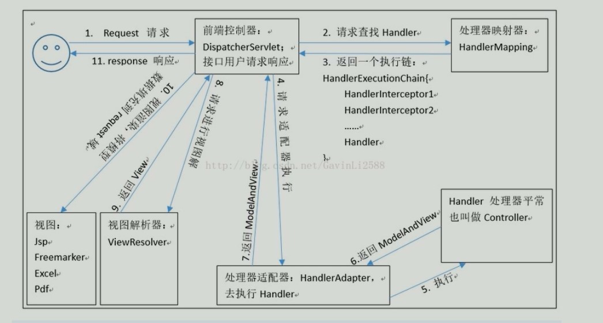
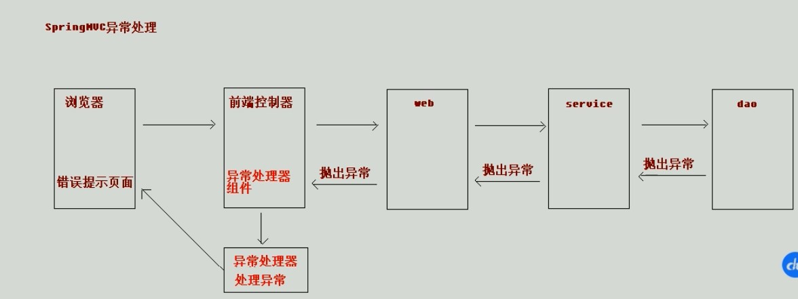

> **具体笔记查看资料中的pdf文件。时间原因并未自己整理**。

> **代码参考尽量看随堂笔记，而不是大纲笔记**

# 1. 基本概念

```
SpringMVC 是一种基于 Java 的实现 MVC 设计模型的请求驱动类型的轻量级 Web 框架，属于 Spring
FrameWork 的后续产品，已经融合在 Spring Web Flow 里面。Spring 框架提供了构建 Web 应用程序的全功
能 MVC 模块。使用 Spring 可插入的 MVC 架构，从而在使用 Spring 进行 WEB 开发时，可以选择使用 Spring
的 Spring MVC 框架或集成其他 MVC 开发框架，如 Struts1(现在一般不用)，Struts2 等。
SpringMVC 已经成为目前最主流的 MVC 框架之一，并且随着 Spring3.0 的发布，全面超越 Struts2，成
为最优秀的 MVC 框架。
它通过一套注解，让一个简单的 Java 类成为处理请求的控制器，而无须实现任何接口。同时它还支持
RESTful 编程风格的请求。
```

# 2. 其他

- 原理图解：
    > 
    > <br>
    > 

- 只配置了两个
    - web.xml中配置了前端控制器并指定springmvc.xml位置
    - springmvc.xml中只配置了视图解析器
    - 只配置了两个是因为配置了注解支持（mvc:annotation-driven）后
    - 处理器映射器，处理器适配器等都已经自动配置，替代了手动配置

- springMVC 和 springboot之前版本 都不会过滤静态资源

- controller类中，如果没有返回值，就默认传controller对应路径到视图解析器中查询jsp或html文件

- model 默认会存储到request域中，通过SessionAttributes指定可以存到session中


- 使用原生api上传文件

    ```java
    package cn.itcast.controller;

    import com.sun.jersey.api.client.Client;
    import com.sun.jersey.api.client.WebResource;
    import org.apache.commons.fileupload.FileItem;
    import org.apache.commons.fileupload.disk.DiskFileItemFactory;
    import org.apache.commons.fileupload.servlet.ServletFileUpload;
    import org.springframework.stereotype.Controller;
    import org.springframework.web.bind.annotation.RequestMapping;
    import org.springframework.web.multipart.MultipartFile;

    import javax.servlet.http.HttpServletRequest;
    import java.io.File;
    import java.util.List;
    import java.util.UUID;

    @Controller
    @RequestMapping("/user")
    public class UserController {

        /**
        * 跨服务器文件上传
        * @return
        */
        @RequestMapping("/fileupload3")
        public String fileuoload3(MultipartFile upload) throws Exception {
            System.out.println("跨服务器文件上传...");

            // 定义上传文件服务器路径
            String path = "http://localhost:9090/uploads/";

            // 说明上传文件项
            // 获取上传文件的名称
            String filename = upload.getOriginalFilename();
            // 把文件的名称设置唯一值，uuid
            String uuid = UUID.randomUUID().toString().replace("-", "");
            filename = uuid+"_"+filename;

            // 创建客户端的对象
            Client client = Client.create();

            // 和图片服务器进行连接
            WebResource webResource = client.resource(path + filename);

            // 上传文件
            webResource.put(upload.getBytes());

            return "success";
        }

        /**
        * SpringMVC文件上传
        * @return
        */
        @RequestMapping("/fileupload2")
        public String fileuoload2(HttpServletRequest request, MultipartFile upload) throws Exception {
            System.out.println("springmvc文件上传...");

            // 使用fileupload组件完成文件上传
            // 上传的位置
            String path = request.getSession().getServletContext().getRealPath("/uploads/");
            // 判断，该路径是否存在
            File file = new File(path);
            if(!file.exists()){
                // 创建该文件夹
                file.mkdirs();
            }

            // 说明上传文件项
            // 获取上传文件的名称
            String filename = upload.getOriginalFilename();
            // 把文件的名称设置唯一值，uuid
            String uuid = UUID.randomUUID().toString().replace("-", "");
            filename = uuid+"_"+filename;
            // 完成文件上传
            upload.transferTo(new File(path,filename));

            return "success";
        }

        /**
        * 文件上传
        * @return
        */
        @RequestMapping("/fileupload1")
        public String fileuoload1(HttpServletRequest request) throws Exception {
            System.out.println("文件上传...");

            // 使用fileupload组件完成文件上传
            // 上传的位置
            String path = request.getSession().getServletContext().getRealPath("/uploads/");
            // 判断，该路径是否存在
            File file = new File(path);
            if(!file.exists()){
                // 创建该文件夹
                file.mkdirs();
            }

            // 解析request对象，获取上传文件项
            DiskFileItemFactory factory = new DiskFileItemFactory();
            ServletFileUpload upload = new ServletFileUpload(factory);
            // 解析request
            List<FileItem> items = upload.parseRequest(request);
            // 遍历
            for(FileItem item:items){
                // 进行判断，当前item对象是否是上传文件项
                if(item.isFormField()){
                    // 说明普通表单向
                }else{
                    // 说明上传文件项
                    // 获取上传文件的名称
                    String filename = item.getName();
                    // 把文件的名称设置唯一值，uuid
                    String uuid = UUID.randomUUID().toString().replace("-", "");
                    filename = uuid+"_"+filename;
                    // 完成文件上传
                    item.write(new File(path,filename));
                    // 删除临时文件
                    item.delete();
                }
            }

            return "success";
        }

    }

    ```


- springmvc文件上传图解：
    > 


- springmvc异常页面跳转图解：
    > 

- spring整合springMVC:
    > 

- Spring容器 SpringMVC容器 web容器的关系:
    > [链接](https://blog.csdn.net/haohaizijhz/article/details/90674774)
    > <br>
    > [详细过程解析](https://blog.csdn.net/J080624/article/details/83444209)

- Spring配置Mybatis时
    - 配置SqlSessionFactoryBean时，只有datasource是必要的，此时可以把SqlMapConfig删了
    - 不过也可以留着进行其他配置
        ```xml
        <!-- sqlSessionFactory -->
        <bean id="sqlSessionFactory" class="org.mybatis.spring.SqlSessionFactoryBean">
            <!-- 加载 MyBatis 的配置文件 -->
            <property name="configLocation" value="mybatis/SqlMapConfig.xml"/>
            <!-- 数据源 -->
            <property name="dataSource" ref="dataSource"/>
        </bean>
        ```
