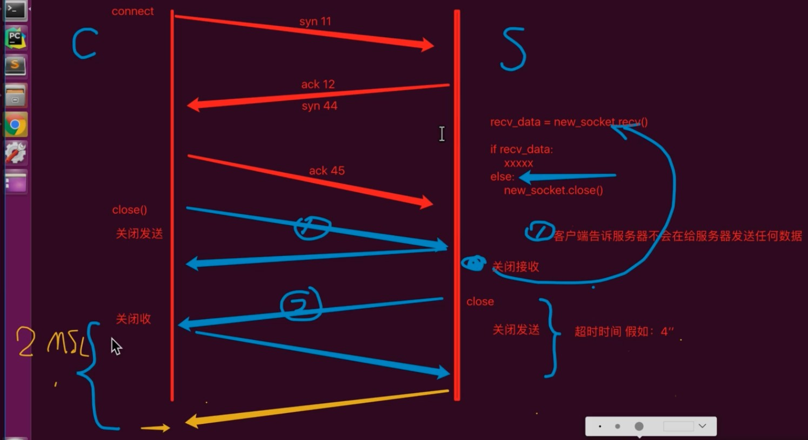
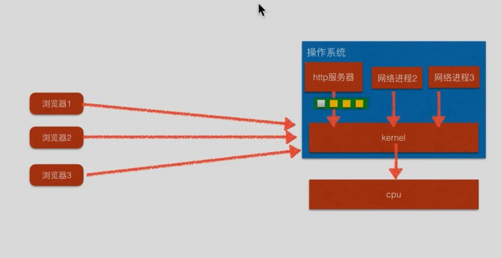
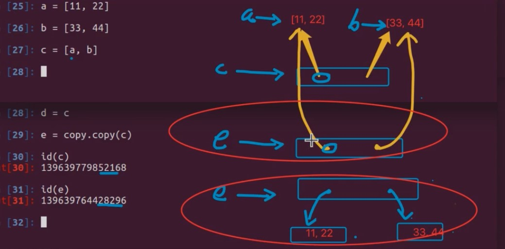

> 只整理了一些注意点

# 1. python 基础

> 这里只写注意点

- 运算符

  - // 整除
  - \*\* 幂
  - str 也可以使用 \*

- 数字型变量：

  > **数字型变量间可以直接进行运算**

  - int
  - float
  - bool
    - 非 0 为 True
    - 0 位 False

- 非数字性变量

  - str
    - str 和数字间不能通过`+`拼接
  - 列表
  - 元组
  - 字典

- input("请输入内容")得到数值类型都是字符串

- 一个变量赋什么类型的值都行

- print 函数

  - 里面的参数间有逗号的话，输出时两两之间会有空格
  - 两个字符串间用空格隔开的话，输出时不会有空格

- 格式化字符串

  > 和 c 不同

  - `print("格式化字符串" % (参数，单个参数时可以省略括号))`
  - print("%d",10\*10)
    > 输出 10 次 10
  - print("%d",(10\*10))
    > 输出 100

- 和 java 相同，函数不能在定义前进行调用。但当函数 A 内部调用另一个函数 B 时，则函数 B 的定义可以在函数 A 之后
- 函数的文档注释添加在函数声明的下方，使用多行注释

  ```py
  def function(p1,p2)

      """这是函数注释

      :p1 这是参数1的注释
      :p2 这是参数2的注释
      """
  ```

- for

  - 可以搭配 else 使用。如果没用通过 break 结束循环，最终就睡执行 else

- 四个高级类型

  - 四个

    - 列表(list)

      > 相当于 java 中的数组

      - 一个列表中可以存储不同的类型(甚至列表)，和 js 相同
        > js 中数组就是对象，索引就是属性名<br>
        > python 中 List 也是对象
        - 超出索引会报错
        - `del`关键字：**本质上将变量从内存中删除**，也可以用来删除指定列表中指定索引数据（和`pop(index)`作用相同）。了解即可
        - 只有全是同类型数据才可以排序
        - extend 和 append 区别
        - 对于列表，+=操作并不是相加并赋值，本质上就是 extend

    - 元组(tuple)

      > 类似于数组

      - 用 () 定义。通过[]获取指定索引的数据
      - 元组数据无法修改，通常用来保存不同类型数据
      - a=(5)，类型为**int**。a=(5,)类型为元组
      - 用途
        - 作为函数的参数或返回值
          - `return 1,2,3`返回的就是一个元组
        - 格式化字符串后面本质就是一个元组
          ```py
          t = ("zhangsan", 175.7,18)
          print("名字：%s，身高:%.2f,年龄：%d" % t)
          str="名字：%s，身高:%.2f,年龄：%d" % t
          ```
        - 可以将列表转换为元组，保护数据安全。也可以讲元组转换为列表，进行修改
          > ` tuble(list)``list(tuble) `
        - 有类似 es6 的特性
          > `a,b=(1,2)` 或者 `a,b=1,2`<br> > `a,b=(b,a)`这样可以用来交换数值

    - 字典

      > 相当于 map

      - 通过{}定义
      - 只要是不可变类型就可以作为键 比如 int 元组
      - 可以通过`map["key"]`进行取值和修改值
      - update 方法进行添加键值对

    - str
      - 三个数值字符串判断
      - isspace():\t\n 也是空白字符
      - index 方法找不到会报错，find 方法找不到会返回-1
      - replace 会返回修改后的值，不会修改字符串本身
      - 字符串倒序索引：最后一个元素索引是-1

  - 序列类型共同运算
    > 更多查文档，还有很多内容
    - +
    - [num:num:num]
      - 步长为负的时候会从右向左切
      - 高级类型中字典不能进行切片
    - in / not in
    - \*
      - 高级类型中字典不支持
    - del
      - **作为关键字和函数使用两种方式效果相同**
    - len
    - max
      - 高级类型中，如果是字典，只对 key 进行比较
    - min
      - 高级类型中，如果是字典，只对 key 进行比较
    - cmp(已被取消)，使用\> < = <= >=
      - 字典不能比较大小

- python 不允许函数内部修改全局变量的值，修改的话就会在函数内部创建一个同名局部变量

  - 全局变量最好命名在最上方，最前面加个 g*或 gl*
  - 想要修改就要使用`global`关键字
    ```py
    def test:
        global g_num
        g_num=99 # 修改全局变量
    ```

- python 中函数中的形参允许默认值，并且带有默认值的形参要在最后
  - 想要无视参数顺序特别指定参数的值，可以将形参名写上，比如：`end=""`

* python 函数的多值参数
  > \*和\*\*为主要，后面的名称随意，不过一般是一下
  - \*args：表示元组
  - \*\*kwargs:表示字典
    ```py
    def test(*args,**kwargs):
        print(args)
        print(kwargs)
    test(1,2,3,4,"name"=1,2="value")
    ```
  - 将实参前加\*或\*\*进行元组或字典的拆包
    > 不拆包的话就会称为`(g_nums,g_kw)`这样的一个元组
    ```py
    g_nums=[1,2,3]
    g_kw={
        "name1"="value1",
        "name2"="value2"
    }
    test(*g_nums,**g_kw)
    ```

# 2. 面向对象及之后

- 创建对象：`对象名 标识符=类名()`

- 内置对象命名：`__method_name__`

- 对象新增方法`obj.new_attr='newvalue'`

  > 和 js 相同，但**不推荐**

- self 就相当于 this

- python 的构造函数`__init__`用来添加属性，其中 self 不可省略
  ```py
  class TempClass:
  def __init__(self,name):
      self.new_name=name
      print(self.new_name)
  def testmethod(self):
      print(dir(self))
  ```
- python 的`__del__`方法以后再具体讲

  - `del v`才可以删除，并在删除时自动调用`__del__`。调用`__del__`方法并不会删除对象

- `__str__`相当于 toString()方法。必须返回一个字符串。在`print(obj)`时调用

- python 会讲括号中的代码连接到一起，不会有语法错误，当 return 后面代码过长时可以用括号括起来

- `print(list)`是，是不会一个一个调用列表中对象的`__str__`方法的，只会输出地址。**因为不知道列表中的是不是对象**

- `None`相当于`null`

- python 中※
  - `is` `not is`用来判断`内存地址`是否相等
  - `==`用来判断值是否相等。底层是调用`__eq__`。如果设置为一直返回 ture，那么与 None 比较也是 true
- `is`要更快些，推荐使用`is`判断是否为 None

* python 中属性名前加`__`（两个下划线），就成了私有属性或方法。不能通过对象直接访问。dir 也不能查到
* 当然，也可以访问到私有属性方法，但不推荐。方法：`对象名._类名__私有方法或属性名`

  ```py
  class TempClass:
  def __init__(self, name):
      self.new_name = name
      self.__serect='serect'
      print(self.new_name)

  temp=TempClass('temp')
  print(temp._TempClass__serect)
  ```

* 继承语法

  ```py
  class Son(Father):
      pass
  ```

* 子类方法中调用父类方法

  ```py
  class Son(Father):
      def father_method:
          # 创建特殊类对象来调用父类的方法
          super().father_method()
          pass

  # python2.x中使用该种（不推荐使用）。同时如果使用子类名字调用的话会出现递归死循环
  FatherClassName.method(self)
  ```

* python 支持多继承

  - 根据继承顺序，优先级从高到低。同名方法，优先级高的覆盖低的

  ```py
  class Son(Father1,Father2):
      pass
  ```

* python 的方法搜索顺序（MRO,method resolution order）

  - 内置属性`__mro__`可以查看方法搜索顺序

* python3 版本的 新式类 和以前的 旧式类
  - 新式类：以 object 类为基类。python3 中默认继承
  - 旧式类：不以 object 为基类。python2 中不会默认继承
  - 内置属性方法就是从 object 中继承的
  - 新式类和旧式类在多继承时方法的搜索顺序是不同的
  - 为了兼容性，推荐这样写：
    ```py
    def temp(object):
        pass
    ```
* 因为 python 是动态语言，所以就没也强制类型转换

* 类对象（推荐看看课件）

  - 对象各自拥有自己的实例属性。
  - 但 python 中实例化的方法只有一份，对象调用时将 self 传入并进行调用
  - 和 java 相同，类也是对象，方法实例存在与类对象中，而不是对象实例中
  - 类属性定义

    ```py
    class Temp:

        count=0  # 类属性。不写在构造方法中

        def __init__(self):
            Temp.count+=1  # 类属性count加一。既可以通过类名，也可以通过对象
    ```

  - 属性获取时，先从对象中查找，再从类中查找。

    - 既可以通过类名获取（**推荐**）
    - 也可以通过对象名获取（这样若进行赋值的话，(回顾 python 添加对象属性的方法)，会给对象内部添加同名属性。而调用时也会先从对象中查找）

  - 类方法定义
    ```py
    @classmethod
    def ClassMethod(cls):
        pass
    ```
  - 哪一个类的类方法，cls 就是哪个类对象的引用
  - 方法内部可以通过`cls`访问类属性和类方法
  - 通过`类名.类方法`调用时，不需要传递`cls`参数

- 静态方法

  - 不访问实例属性方法，也不访问类属性方法
  - 不需要`self`作为第一个参数
  - 定义
    ```py
    class Temp:
        @staticmethod
        def StaticMethod():
            # 不访问实例属性和实例方法
            pass
    Temp.StaticMethod() # 通过类名调用
    ```
  - 调用：通过类名进行调用
  - 也就是说除了实例属性方法其他都用类调用

- 示例

  ```py
  """
  设计一个 Game 类
  属性：
      定义一个 类属性 top_score 记录游戏的 历史最高分
      定义一个 实例属性 player_name 记录 当前游戏的玩家姓名
  方法：
      静态方法 show_help 显示游戏帮助信息
      类方法 show_top_score 显示历史最高分
      实例方法 start_game 开始当前玩家的游戏
  主程序步骤
      1) 查看帮助信息
      2) 查看历史最高分
      3) 创建游戏对象，开始游戏
  """
  class Game(object):

          # 游戏最高分，类属性
          top_score = 0

          @staticmethod
          def show_help():
                  print("帮助信息：让僵尸走进房间")

          @classmethod
          def show_top_score(cls):
                  print("游戏最高分是 %d" % cls.top_score)

          def __init__(self, player_name):
                  self.player_name = player_name

          def start_game(self):
                  print("[%s] 开始游戏..." % self.player_name)

                  # 使用类名.修改历史最高分
                  Game.top_score = 999

  # 1. 查看游戏帮助
  Game.show_help()

  # 2. 查看游戏最高分
  Game.show_top_score()

  # 3. 创建游戏对象，开始游戏
  game = Game("小明")

  game.start_game()

  # 4. 游戏结束，查看游戏最高分
  Game.show_top_score()
  ```

- `__new__`方法

  - 在内存中为对象返回空间
  - 返回对象的引用（该引用便传递给`__init__`）

- 异常捕获语法

  ```py
  try:
          # 尝试执行的代码
          pass
  except 错误类型1:
          # 针对错误类型1，对应的代码处理
          pass
  except 错误类型2:
          # 针对错误类型2，对应的代码处理
          pass
  except (错误类型3, 错误类型4):
          # 针对错误类型3 和 4，对应的代码处理
          pass
  except Exception as result:
          # 打印错误信息
          print(result)
  else:
          # 没有异常才会执行的代码
          pass
  finally:
          # 无论是否有异常，都会执行的代码
          print("无论是否有异常，都会执行的代码")
  ```

- 模块的`__file__`可以查看模块真实路径
- 模块导入时会执行所有无缩进的代码
- 模块的`__name__`属性

  - 模块直接运行时值为`__main__`，以此来防止导入时执行测试代码
  - 如果模块被其他模块导入，值就是模块名

  ```py
  if __name__=="__main__"
      # 测试代码
      pass
  ```

- 包下有必须有一个特殊文件`__init__.py`，用来表示给外界提供使用的模块名

  - 提供使用的模块

  ```py
  from . import moudle1
  from . import moudle2
  ```

  - 导入一个包就会导入所有提供使用的模块

- 如果子类的父类不是 object，那么要手动在`__init__`中调用一下 `super.__init__`，保证从父类继承的东西能正常使用

- with 方式：
  ```py
  # 使用该方式会自动关闭流
  try:
      with open(file_name, "rb") as f:
          content = f.read()
  except Exception as e:
      print(e)
  ```
  ```py
  # 等同于：
  try:
      f = open(file_name,"rb")
      content = f.read()
  except Exception as e:
      print(e)
  finally:
      f.close()
  ```
- enumerate()会将可迭代数据转化为枚举类型：

  ```py
  l = ["1","2","3"]
  e = enumerate(l)
  for i,v in e:
      print(i,v)

  ```

* 通过进程池创建的进程，主进程运行完后不会等待直接关闭，因此`p.join`至关重要
* 进程池中进程间通信要用 multiprocessing.Manager().Queue
* print 中 \r 可以进行删除屏幕输出
* python2 中，range 和 xrange 区别（迭代器）,python3 中已经将 range 换成了 xrange
* 除了 for 循环能接收可迭代对象，list、tuple 等也能接收。
  ```py
  li = list(FibIterator(15))
  print(li)
  tp = tuple(FibIterator(6))
  print(tp)
  ```
* 三次挥手四次握手

  - 关闭的是 socket 的收发，操作 j 系统底层的收发并没有被关闭，为了收发确认回答消息会开着
  - 之所以把中间那两次分开，为的是在调用 close 后再服务端再发送确认，要使合起来的话，close 无法放到两次的中间
  - 在客户端端口 close 后，在 2 倍的 msl 内（就是一个往返时间）客户端会等待服务端会不会因为没收到回复而再次发送确认，如果没收到才会关闭端口
  - 在 socket close 或者终止进程后直接关闭端口的设置：
    ```
    对于一个socket，可以设置很多不同的选项，对于那些一般用途的服务器，一个最让人感兴趣的socket选项是SO_REUSEADDR,通常地，
    在一个服务器进程终止后，操作系统会保留几分钟它的端口，
    从而防止其他进程（甚至包括本服务器自己的另外一个实例）在超市之前使用这个端口，
    如果你设置了SO_REUSEADDR的标记为true,操作系统就会在服务器socket被关闭或者服务器进程终止后马上释放该服务器的端口。
    这样做，可以使调试程序更简单。
    level:
    SOL_SOCKET:通用套接字选项.
    IPPROTO_IP:IP选项.
    IPPROTO_TCP:TCP选项.
    ```
  - 图：
    > 

* 响应中的 Content-Length 用于告诉什么时候传完，这在长连接时是必要的（http/1.1）

* 普通情况下服务器占用一定的内存空间，操作系统占用一定的内存空间
  - 每次要检测 socket 是否有接收数据时，都会讲服务器中的 socket 数据复制到 kernel 中，再进行检测
  - 效率低
* epoll 则是在两者内存空间之外开辟 kernel 和服务器公用的空间，省去了复制数据的时间
  - 同时不是通过轮训的方式，而是以事件通知的方式哪个 socket 的数据到了，哪个就运行，类似 事件
  - [参考博客](https://blog.csdn.net/xiajun07061225/article/details/9250579)
  - 图片：
    > 
* 服务器速度： 多进程<多线程<协程<单进程,线程非阻塞<<epoll

* cmd 中 arp -a 查看 arp 协议中 ip 与 mac 映射
* GIL（全局解释器锁）:

  - python 很早之前就出现了
  - 当时没有考虑并发问题，导致最早使用的 c 语言 python 解析器 cpython 有 GIL 问题
  - 使用 cpython 解析器的 python 程序中的多线程是假的多线程，同一时间只有一个线程在执行
  - 互相抢 GIL 锁
  - 而且 GIL 难以去除，曾经尝试去除后效率变低
  - 所以使用 c 语言解析器时，要使用多进程而不是多线程
  - 但多线程依旧会比单线程性能有所提升，因为遇到 IO 堵塞会自动释放 GIL 锁
  - GIL 导致多线程合计只能利用一个核的 100%（利用率可能分布在多个核上，可以在 linux 上验证）
  - 因此多线程和协程适合 IO 密集型程序（充分利用等待时间）。
  - 多进程适合计算密集型程序（充分利用多个核计算能力）
  - GIL 解决方式：
    - 换 python 解释器
    - 用其他语言来写线程中要执行的函数（python 可以调用 java，cc++，js 等语言。比如 python 可以通过 c 编译出的.so 文件来调用 c 语言里的函数）
  - 额外：numpy 没有 gil 锁，是它速度快的原因之一

* 深拷贝，浅拷贝
  - 只看一层：
    - c 语言中，将一个数组复制给一个变量时，默认也会将数据复制一份，这是深拷贝
    - 而 python 中只会复制引用，称为浅拷贝
    - python 的 copy 模块下有 deepcopy 函数来完成深拷贝，会将数据复制一份
  - copy 与 deepcopy 区别
    > 
    - 简单解释
      - copy 只会深拷贝第一层，剩下的浅拷贝(上面那个拷贝 e)
      - deepcopy 深拷贝所有，递归深拷贝（下面那个拷贝的 e）
      - 例外:
        - 在拷贝元组时，如果元组里面都是不可修改的数据，比如常量，元组，因为不可修改，所以 copy 和 deepcopy 只会拷贝元组的引用，而不会拷贝元组本身
        - 但是如果元组内为数组引用时
          - copy:依旧拷贝引用
          - deepcopy:会进行多层的深拷贝
    - 总结：
      - 如果每层全为可变类型
        - copy：只深拷贝第一层
        - deepcopy：递归深拷贝所有
      - 如果每层全部是不可类型数据：
        - copy：只拷贝引用
        - deepcopy：只拷贝引用
      - 拷贝引用指向数据为不可变类型，但存在可变数据
        - copy：只拷贝引用
        - deepcopy：递归深拷贝所有
    - 特殊情况：
      - 切片[:]：相当于 copy。浅拷贝
      - 字典：会拷贝一份字典中的 key 以及字典中 value 的 引用 。浅拷贝
      - 函数中传递对象时传递的是引用，如果想传递副本数据，就要在调用函数式参数传递处使用 deepcopy

- 多模块开发

  - 多模块开发时，会有一个 main 模块，多个功能模块，以及一个公用数据模块
  - 有一个模块用来存储公用数据
  - 导入模块 import m
  - 获取或者修改模块的中全局变量的值 m.FLAG
  - 因为是通过访问模块 m 来修改 FLAG，所以这样可以正常进行
  - 但是如果 from m import FLAG
  - 这样在方法中进行 FLAG = True 时
  - 公用数据模块中的数据并不会被修改
  - 原因是导入的 FLAG 为全局变量，默认会在局部作用域中声明一个局部变量 FLAG，而无法修改全局变量
  - 解决方法是 global FLAG
  - 又如过是一个 list，调用方法进行修改可以正常进行（引用指向不变），但不声明 global 时重新赋值的话会出问题

- 使用类名调用父类方法时，如果多继承的两个父类都来源于同一个更上层的类，那么就会调用两次。
- 问题：多继承时调用 super 无法调用到父类：
  - MRO 中调用顺序是由 python 解析器中的 C3 算法计算得到的
  - C3 算法保证每一个父类或更上层的类中方法的只调用 一次
  - 在使用 super()调用构造方法时，会按照 MRO 中的顺序进行执行**init**方法
  - 而不是单纯的找父类！！
  - super()中不传入参数，就从当前类开始串 MRO
  - 如果 super(son1,self),就从 son1 开始串 MRO(不包括 son1)，执行 init
  - 图片：
    > 
- 调用父类方法方式：

  - 直接 父类名字.方法
  - super()
  - super(类名,self)

- 继承不是复制

- 对象创建过程：
  - **new**创建内存空间
  - 将指向内存空间的引用传递给**init**中的 self
  - 对内存空间进行初始化
- 类对象与实例对象
  - 实例对象只有属性各有一份
  - 实例对象对于类方法，类属性，普通方法，静态方法都共有
  - 实例对象可以调用类方法，静态方法，普通属性
  - 但类对象只能调用类方法和静态方法
- property 属性：
  - 作用类似 java 中的逻辑视图
  - 具体使用查看笔记
- **init**不是构造方法

  - 其他语言中通过构造方法进行内存的开辟与数据的初始化
  - 而 python 中使用**new**完成内存的开辟，使用**init**完成数据的初始化

- Python 各种推导式:https://blog.csdn.net/yjk13703623757/article/details/79490476
- 列表切片后可以直接重新设置值
- 名字重整：类中定义的私有属性会别重整为 ‘\_类名私有属性名’
- 多个装饰器进行装饰时，装饰顺序是从下到上，这样会得到执行顺序从上到下的结果。func()只执行一遍

  > 

- 全局变量，类，函数查找方式：

  - 一开始会默认导入 builtins 模块
  - 当调用某个变量，函数，对象时，会先去 builtins.globlas()返回的字典中找
    > 返回的字典中存储着一些自己定义的全局变量，函数，类等。key 为变量名，函数名，类名，value 为指向实际存储内存空间的引用
    > <br>
    > globas 返回值中也包含指向 builtins 模块的引用，为**bulitins**
  - 如果找不到，就去 builtins 模块中找
    > builtins 模块中存储着预定义的一些函数等。比如 print

- 类创建了实例对象，而元类 type 创建了类对象

  > 解析器解析代码时，默认就是用 type 创建的类
  > <br>
  > 类名为 type 第一个参数，继承的父类元祖为 type 第二个参数，类下定义的所有**类属性**和方法为第三个参数。（注意，想要定义实例属性就要写**init**方法）

  - 所以可以通过传递 meteclass 的值来指定调用其他函数或者类来创建类
    > 原理：函数名加括号是调用函数，返回类对象。类名加括号是返回**new**和**init**后的对象

- 判断语句语法糖：
  ```python
  a = 1 if 3>2 else 4
  ```
- eval 可以实现字符串向 python 数据类型的转换

- 正则相关
  - `re.findall("aaa(.*)bbb",str)`:会返回括号中分组的内容，而不是整个字符串。所以京城使用 findall()[0]，而不是 search
  - 点号默认匹配不到\n，re 的每个方法都可以指定.的模式，例：
    - re.match("","",re.DOTALL) (默认情况)
    - re.match("","",re.DOALL)
  - \s 匹配空格,\r,\n\,tab 等
