# iptables概念

## 防火墙相关概念

此处先描述一些相关概念。

从逻辑上讲。防火墙可以大体分为主机防火墙和网络防火墙。

- 主机防火墙：针对于单个主机进行防护。
- 网络防火墙：往往处于网络入口或边缘，针对于网络入口进行防护，服务于防火墙背后的本地局域网。

网络防火墙和主机防火墙并不冲突，可以理解为，网络防火墙主外（集体）， 主机防火墙主内（个人）。

从物理上讲，防火墙可以分为硬件防火墙和软件防火墙。

- 硬件防火墙：在硬件级别实现部分防火墙功能，另一部分功能基于软件实现，性能高，成本高。
- 软件防火墙：应用软件处理逻辑运行于通用硬件平台之上的防火墙，性能低，成本低。


那么在此处，我们就来聊聊Linux的iptables

**iptables** 其实不是真正的防火墙，我们可以把它理解成一个客户端代理，
用户通过iptables这个代理，将用户的安全设定执行到对应的”安全框架”中，这个”安全框架”才是真正的防火墙，
这个框架的名字叫**netfilter**

netfilter才是防火墙真正的安全框架（framework），netfilter位于内核空间。

**iptables其实是一个命令行工具** ，位于用户空间，我们用这个工具操作真正的框架。

netfilter/iptables（下文中简称为iptables）组成Linux平台下的包过滤防火墙，
与大多数的Linux软件一样，这个包过滤防火墙是免费的，它可以代替昂贵的商业防火墙解决方案，
完成封包过滤、封包重定向和网络地址转换（NAT）等功能。

Netfilter是Linux操作系统核心层内部的一个数据包处理模块，它具有如下功能：

- 网络地址转换(Network Address Translate)
- 数据包内容修改
- 以及数据包过滤的防火墙功能

所以说，虽然我们使用service iptables start启动iptables”服务”，但是其实准确的来说， **iptables并没有一个守护进程** ，
所以并不能算是真正意义上的服务，而应该算是内核提供的功能。

## iptables基础

我们知道iptables是按照规则来办事的，我们就来说说规则（rules）:

- 规则其实就是网络管理员预定义的条件，规则一般的定义为”如果数据包头符合这样的条件，就这样处理这个数据包”。
- **规则存储在内核空间的信息包过滤表** 中，
- 这些规则分别指定了源地址、目的地址、传输协议（如TCP、UDP、ICMP）和服务类型（如HTTP、FTP和SMTP）等。
- 当数据包与规则匹配时，iptables就根据规则所定义的方法来处理这些数据包，
    - 如放行（accept）、拒绝（reject）和丢弃（drop）等。
- 配置防火墙的主要工作就是添加、修改和删除这些规则。

这样说可能并不容易理解，我们来换个容易理解的角度，从头说起:

- 当客户端访问服务器的web服务时，客户端发送报文到网卡，
  - 而tcp/ip协议栈是属于内核的一部分，所以，客户端的信息会通过内核的TCP协议传输到用户空间中的web服务中，
  - 而此时，客户端报文的目标终点为web服务所监听的套接字（IP：Port）上，
- 当web服务需要响应客户端请求时，
  - web服务发出的响应报文的目标终点则为客户端，
  - 这个时候，web服务所监听的IP与端口反而变成了原点，
- 我们说过，netfilter才是真正的防火墙，它是内核的一部分，所以，如果我们想要防火墙能够达到”防火”的目的，则需要在内核中设置关卡，所有进出的报文都要通过这些关卡，经过检查后，符合放行条件的才能放行，符合阻拦条件的则需要被阻止，
- 于是，就出现了 **input关卡和output关卡** ，而这些关卡在iptables中不被称为”关卡”,而被称为 **”链”** 。

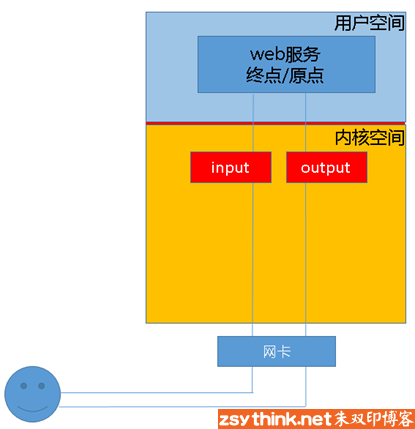

其实我们上面描述的场景并不完善，因为客户端发来的报文访问的目标地址可能并不是本机，而是其他服务器，
当本机的内核支持IP_FORWARD时，我们可以将报文转发给其他服务器，所以，这个时候，我们就会提到iptables中的其他”关卡”，也就是其他”链”，
他们就是  “路由前”、”转发”、”路由后”，他们的英文名是  **PREROUTING** 、 **FORWARD** 、 **POSTROUTING**

也就是说，当我们启用了防火墙功能时，报文需要经过如下关卡，也就是说， **根据实际情况的不同，报文经过”链”可能不同** 。
如果报文需要转发，那么报文则不会经过input链发往用户空间，而是直接在内核空间中经过forward链和postrouting链转发出去的。

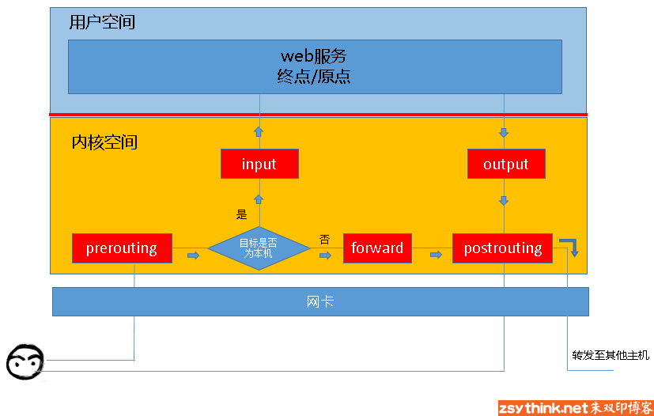

所以，根据上图，我们能够想象出某些常用场景中，报文的流向：

- 到本机某进程的报文：PREROUTING –> INPUT
- 由本机转发的报文：PREROUTING –> FORWARD –> POSTROUTING
- 由本机的某进程发出报文（通常为响应报文）：OUTPUT –> POSTROUTING

## 链的概念

现在，我们想象一下，这些”关卡”在iptables中为什么被称作”链”呢？我们知道，防火墙的作用就在于对经过的报文匹配”规则”，然后执行对应的”动作”,所以，当报文经过这些关卡的时候，则必须匹配这个关卡上的规则，但是，这个关卡上可能不止有一条规则，而是有很多条规则，当我们把这些规则串到一个链条上的时候，就形成了”链”,所以，我们把每一个”关卡”想象成如下图中的模样，这样来说，把他们称为”链”更为合适，每个经过这个”关卡”的报文， **都要将这条”链”上的所有规则匹配一遍，如果有符合条件的规则，则执行规则对应的动作** 。


## 表的概念

我们再想想另外一个问题，我们对每个”链”上都放置了一串规则，但是这些规则有些很相似，比如，A类规则都是对IP或者端口的过滤，B类规则是修改报文，那么这个时候，我们是不是能把实现相同功能的规则放在一起呢，必须能的。

我们 **把具有相同功能的规则的集合叫做”表”** ，所以说，不同功能的规则，我们可以放置在不同的表中进行管理，而iptables已经为我们定义了4种表，每种表对应了不同的功能，而我们定义的规则也都逃脱不了这4种功能的范围，所以，学习iptables之前，我们必须先搞明白每种表 的作用。

iptables为我们提供了如下规则的分类，或者说，iptables为我们提供了如下”表”

- filter表：负责过滤功能，防火墙；内核模块：iptables_filter
- nat表：network address translation，网络地址转换功能；内核模块：iptable_nat
- mangle表：拆解报文，做出修改，并重新封装 的功能；iptable_mangle
- raw表：关闭nat表上启用的连接追踪机制；iptable_raw

也就是说，我们自定义的所有规则，都是这四种分类中的规则，或者说，所有规则都存在于这4张”表”中。

## 表链关系

但是我们需要注意的是，某些”链”中注定不会包含”某类规则”，让我们看看每个”链”上的规则都存在于哪些”表”中。

我们还是以图为例，先看看prerouting”链”上的规则都存在于哪些表中。

注意：下图只用于说明prerouting链上的规则存在于哪些表中，并没有描述表的顺序。

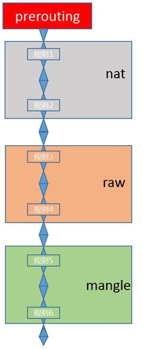

这幅图是什么意思呢？它的意思是说，prerouting”链”只拥有nat表、raw表和mangle表所对应的功能，所以，prerouting中的规则只能存放于nat表、raw表和mangle表中。

那么，根据上述思路，我们来总结一下， 或者说，每个”链”中的规则都存在于哪些”表”中

- PREROUTING    的规则可以存在于：raw表，mangle表，nat表。
- INPUT      的规则可以存在于：mangle表，filter表，（centos7中还有nat表，centos6中没有）。
- FORWARD     的规则可以存在于：mangle表，filter表。
- OUTPUT     的规则可以存在于：raw表mangle表，nat表，filter表。
- POSTROUTING    的规则可以存在于：mangle表，nat表。

但是，**我们在实际的使用过程中，往往是通过”表”作为操作入****口，对规则进行定义的** 表（功能）<–>  链（钩子）：

- raw   表中的规则可以被哪些链使用：PREROUTING，OUTPUT
- mangle  表中的规则可以被哪些链使用：PREROUTING，INPUT，FORWARD，OUTPUT，POSTROUTING
- nat   表中的规则可以被哪些链使用：PREROUTING，OUTPUT，POSTROUTING（centos7中还有INPUT，centos6中没有）
- filter  表中的规则可以被哪些链使用：INPUT，FORWARD，OUTPUT

其实我们还需要注意一点，因为数据包经过一个”链”的时候，会将当前链的所有规则都匹配一遍，但是匹配时总归要有顺序，iptables为我们定义了4张”表”,当他们处于同一条”链”时，执行的优先级如下。

优先级次序（由高而低）： **raw –> mangle –> nat –> filter**

示意图：

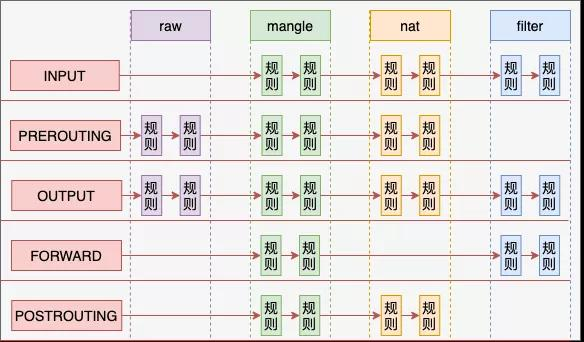

为了更方便的管理，我们还 **可以在某个表里面创建自定义链** ，将针对某个应用程序所设置的规则放置在这个自定义链中，但是 **自定义链接不能直接使用，只能被某个默认的链当做动作去调用才能起作用**

## 数据经过防火墙的流程

结合上述所有的描述，我们可以将数据包通过防火墙的流程总结为下图：


我们在写Iptables规则的时候，要时刻牢记这张路由次序图，灵活配置规则。

我们将经常用到的对应关系重新写在此处，方便对应图例查看。

链的规则存放于哪些表中（从链到表的对应关系）：

- PREROUTING  的规则可以存在于：raw表，mangle表，nat表。
- INPUT     的规则可以存在于：mangle表，filter表，（centos7中还有nat表，centos6中没有）。
- FORWARD    的规则可以存在于：mangle表，filter表。
- OUTPUT    的规则可以存在于：raw表mangle表，nat表，filter表。
- POSTROUTING  的规则可以存在于：mangle表，nat表。

表中的规则可以被哪些链使用（从表到链的对应关系）：

- raw   表中的规则可以被哪些链使用：PREROUTING，OUTPUT
- mangle  表中的规则可以被哪些链使用：PREROUTING，INPUT，FORWARD，OUTPUT，POSTROUTING
- nat   表中的规则可以被哪些链使用：PREROUTING，OUTPUT，POSTROUTING（centos7中还有INPUT，centos6中没有）
- filter  表中的规则可以被哪些链使用：INPUT，FORWARD，OUTPUT

下图中nat表在centos7中的情况就不再标明。

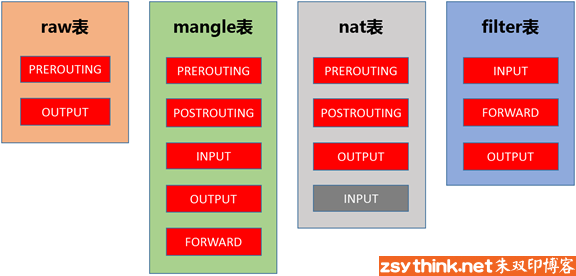

## 规则的概念

说了一圈又说回来了，在上述描述中我们一直在提规则，可是没有细说，现在说说它。

先说说规则的概念，然后再通俗的解释它。

规则： **根据指定的匹配条件来尝试匹配每个流经此处的报文，一旦匹配成功，则由规则后面指定的处理动作进行处理** ；

那么我们来通俗的解释一下什么是iptables的规则，之前打过一个比方，每条”链”都是一个”关卡”，每个通过这个”关卡”的报文都要匹配这个关卡上的规则，如果匹配，则对报文进行对应的处理，比如说，你我二人此刻就好像两个”报文”，你我二人此刻都要入关，可是城主有命，只有器宇轩昂的人才能入关，不符合此条件的人不能入关，于是守关将士按照城主制定的”规则”，开始打量你我二人，最终，你顺利入关了，而我已被拒之门外，因为你符合”器宇轩昂”的标准，所以把你”放行”了，而我不符合标准，所以没有被放行，其实，”器宇轩昂”就是一种”匹配条件”，”放行”就是一种”动作”，”匹配条件”与”动作”组成了规则。

了解了规则的概念，那我们来聊聊规则的组成部分,此处只是大概的将规则的结构列出，后面的文章中会单独对规则进行总结。

规则由匹配条件和处理动作组成。

### 匹配条件

匹配条件分为基本匹配条件与扩展匹配条件

- **基本匹配条件：** 源地址Source IP，目标地址 Destination IP

- **扩展匹配条件：**
  - 除了基本匹配条件可以用于匹配，还有很多其他的条件可以用于匹配，这些条件泛称为扩展条件，
  - 这些扩展条件其实也是netfilter中的一部分，只是以模块的形式存在，
    - 如果想要使用这些条件，则需要依赖对应的扩展模块。
  - 比如：源端口Source Port, 目标端口Destination Port

### 处理动作

处理动作在iptables中被称为target（这样说并不准确，我们暂且这样称呼），动作也可以分为 **基本动作和扩展动作** 。

此处列出一些常用的动作，之后的文章会对它们进行详细的示例与总结：

- **ACCEPT**：允许数据包通过。
- **DROP**：直接丢弃数据包，不给任何回应信息，这时候客户端会感觉自己的请求泥牛入海了，过了超时时间才会有反应。
- **REJECT**：拒绝数据包通过，必要时会给数据发送端一个响应的信息，客户端刚请求就会收到拒绝的信息。
- **SNAT**：源地址转换，解决内网用户用同一个公网地址上网的问题。
- **MASQUERADE**：是SNAT的一种特殊形式，适用于动态的、临时会变的ip上。
- **DNAT**：目标地址转换。
- **REDIRECT**：在本机做端口映射。
- **LOG**：在/var/log/messages文件中记录日志信息，然后将数据包传递给下一条规则，也就是说除了记录以外不对数据包做任何其他操作，仍然让下一条规则去匹配。

# iptables实际操作

**在进行iptables实验时，请务必在测试机上进行**

## 规则查询

之前在iptables的概念中已经提到过，在实际操作iptables的过程中，是以”表”作为操作入口的，如果你经常操作关系型数据库，那么当你听到”表”这个词的时候，你可能会联想到另一个词—-“增删改查”，当我们定义iptables规则时，所做的操作其实类似于”增删改查”，那么，我们就先从最简单的”查”操作入手，开始实际操作iptables。

在之前的文章中，我们已经总结过，iptables为我们预定义了4张表，它们分别是raw表、mangle表、nat表、filter表，不同的表拥有不同的功能。

filter负责过滤功能，比如允许哪些IP地址访问，拒绝哪些IP地址访问，允许访问哪些端口，禁止访问哪些端口，filter表会根据我们定义的规则进行过滤，filter表应该是我们最常用到的表了，所以此处，我们以filter表为例，开始学习怎样实际操作iptables。

怎样查看filter表中的规则呢？使用如下命令即可查看。

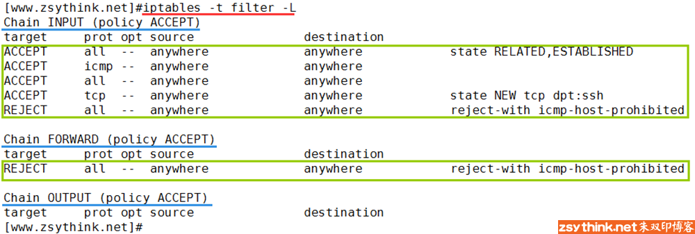

- 使用-t选项，指定要操作的表，-
- 使用-L选项，查看-t选项对应的表的规则，-L选项的意思是，列出规则，
- 所以，上述命令的含义为列出filter表的所有规则，
- 注意，上图中显示的规则（绿色标注的部分为规则）是Centos6启动iptables以后默认设置的规则，我们暂且不用在意它们，
- 上图中，显示出了3条链（蓝色标注部分为链），INPUT链、FORWARD链、OUTPUT链，每条链中都有自己的规则，
- 前文中，我们打过一个比方，把”链”比作”关卡”，不同的”关卡”拥有不同的能力，所以，从上图中可以看出，INPUT链、FORWARD链、OUTPUT链都拥有”过滤”的能力，
- 所以，当我们要定义某条”过滤”的规则时，我们会在filter表中定义，
- 但是具体在哪条”链”上定义规则呢？
  - 这取决于我们的工作场景。比如，我们需要禁止某个IP地址访问我们的主机，我们则需要在INPUT链上定义规则。
  - 因为，我们在理论总结中已经提到过，报文发往本机时，会经过PREROUTING链与INPUT链（如果你没有明白，请回顾前文），
  - 所以，如果我们想要禁止某些报文发往本机，我们只能在PREROUTING链和INPUT链中定义规则，
  - 但是PREROUTING链并不存在于filter表中，换句话说就是，PREROUTING关卡天生就没有过滤的能力，所以，我们只能在INPUT链中定义，
  - 当然，如果是其他工作场景，可能需要在FORWARD链或者OUTPUT链中定义过滤规则。

话说回来，我们继续聊怎样查看某张表中的规则。

刚才提到，我们可以使用`iptables -t filter -L`命令列出filter表中的所有规则，那么举一反三，我们也可以查看其它表中的规则，示例如下。

```bash
iptables -t raw -L
iptables -t mangle -L
iptables -t nat -L
```

其实，我们可以省略-t filter，当没有使用-t选项指定表时，默认为操作filter表，即iptables -L表示列出filter表中的所有规则。

我们还可以只查看指定表中的指定链的规则，比如，我们只查看filter表中INPUT链的规则，示例如下（注意大小写）。

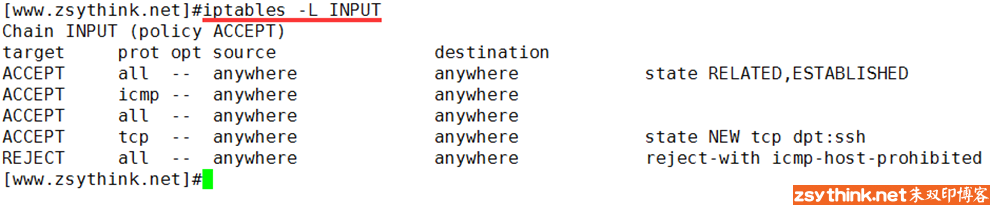

上图中只显示了filter表中INPUT链中的规则（省略-t选项默认为filter表），当然，你也可以指定只查看其他链，其实，我们查看到的信息还不是最详细的信息，我们可以使用-v选项，查看出更多的、更详细的信息，示例如下。

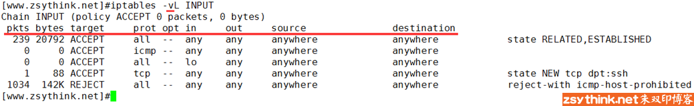

可以看到，使用-v选项后，iptables为我们展示的信息更多了，那么，这些字段都是什么意思呢？我们来总结一下，看不懂没关系，等到实际使用的时候，自然会明白，此处大概了解一下即可。

其实，这些字段就是规则对应的属性，说白了就是规则的各种信息，那么我们来总结一下这些字段的含义。

- **pkts**:对应规则匹配到的报文的个数。
- **bytes**:对应匹配到的报文包的大小总和。
- **target**:规则对应的target，往往表示规则对应的”动作”，即规则匹配成功后需要采取的措施。
- **prot**:表示规则对应的协议，是否只针对某些协议应用此规则。
- **opt**:表示规则对应的选项。
- **in**:表示数据包由哪个接口(网卡)流入，即从哪个网卡来。
- **out**:表示数据包将由哪个接口(网卡)流出，即到哪个网卡去。
- **source**:表示规则对应的源头地址，可以是一个IP，也可以是一个网段。
- **destination**:表示规则对应的目标地址。可以是一个IP，也可以是一个网段。

细心如你一定发现了，上图中的源地址与目标地址都为anywhere，看来，iptables默认为我们进行了名称解析，但是在规则非常多的情况下如果进行名称解析，效率会比较低，所以，在没有此需求的情况下，我们可以使用-n选项，表示不对IP地址进行名称反解，直接显示IP地址，示例如下。

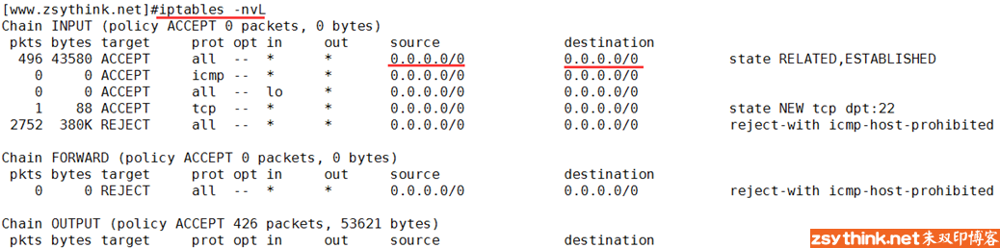

如上图所示，规则中的源地址与目标地址已经显示为IP，而非转换后的名称。

当然，我们也可以只查看某个链的规则，并且不让IP进行反解，这样更清晰一些，比如 iptables -nvL INPUT

如果你习惯了查看有序号的列表，你在查看iptables表中的规则时肯定会很不爽，没有关系，满足你，使用–line-numbers即可显示规则的编号，示例如下。

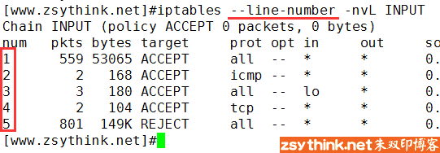

–line-numbers选项并没有对应的短选项，不过我们缩写成–line时，centos中的iptables也可以识别。

我知道你目光如炬，你可能早就发现了，表中的每个链的后面都有一个括号，括号里面有一些信息，如下图红色标注位置，那么这些信息都代表了什么呢？我们来看看。

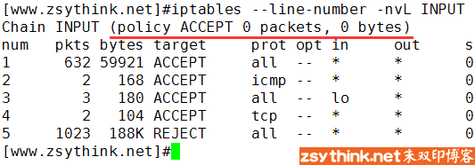

上图中INPUT链后面的括号中包含policy ACCEPT ，0 packets，0bytes 三部分。

- **policy**表示当前链的默认策略，
  - policy  ACCEPT表示上图中INPUT的链的默认动作为ACCEPT，
    - 换句话说就是，默认接受通过INPUT关卡的所有请求，
    - 所以我们在配置INPUT链的具体规则时，应该将需要拒绝的请求配置到规则中，
    - 说白了就是”黑名单”机制，默认所有人都能通过，只有指定的人不能通过，
    - 当我们把INPUT链默认动作设置为接受(ACCEPT)，就表示所有人都能通过这个关卡，
    - 此时就应该在具体的规则中指定需要拒绝的请求，就表示只有指定的人不能通过这个关卡，这就是黑名单机制，
  - **但是**，你一定发现了，上图中所显示出的规则，大部分都是接受请求(ACCEPT)，并不是想象中的拒绝请求(DROP或者REJECT)，
    - 这与我们所描述的黑名单机制不符啊，按照道理来说，默认动作为接受，就应该在具体的规则中配置需要拒绝的人，
    - 但是上图中并不是这样的，之所以出现上图中的情况，是因为IPTABLES的工作机制导致到，
    - 上例其实是 **利用了这些”机制”，完成了所谓的”白名单”机制** ，并不是我们所描述的”黑名单”机制，
    - 我们此处暂时不用关注这一点，之后会进行详细的举例并解释，
  - 此处我们只要明白policy对应的动作为链的默认动作即可，或者换句话说，我们只要理解，policy为链的默认策略即可。
- **packets**表示当前链（上例为INPUT链）默认策略匹配到的包的数量，
  - 0 packets表示默认策略匹配到0个包。
- **bytes**表示当前链默认策略匹配到的所有包的大小总和。

其实，我们可以把packets与bytes称作”计数器”，上图中的计数器记录了默认策略匹配到的报文数量与总大小，”计数器”只会在使用-v选项时，才会显示出来。

当被匹配到的包达到一定数量时，计数器会自动将匹配到的包的大小转换为可读性较高的单位，如下图所示。

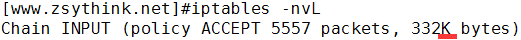

如果你想要查看精确的计数值，而不是经过可读性优化过的计数值，那么你可以使用-x选项，表示显示精确的计数值，示例如下。

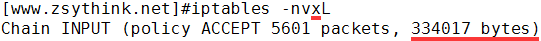

每张表中的每条链都有自己的计数器，链中的每个规则也都有自己的计数器，没错，就是每条规则对应的pkts字段与bytes字段的信息。

---

- 命令整理

好了，我们已经会使用命令简单的查看iptables表的规则了，为了方便以后回顾，我们将上文中的相关命令总结一下。

```
iptables -t 表名 -L
```

查看对应表的所有规则，-t选项指定要操作的表，省略”-t 表名”时，默认表示操作filter表，-L表示列出规则，即查看规则。

```
iptables -t 表名 -L 链名
```

查看指定表的指定链中的规则。

```
iptables -t 表名 -v -L
```

查看指定表的所有规则，并且显示更详细的信息（更多字段），-v表示verbose，表示详细的，冗长的，当使用-v选项时，会显示出”计数器”的信息，由于上例中使用的选项都是短选项，所以一般简写为iptables -t 表名 -vL

```
iptables -t 表名 -n -L
```

表示查看表的所有规则，并且在显示规则时，不对规则中的IP或者端口进行名称反解，-n选项表示不解析IP地址。

```
iptables --line-numbers -t 表名 -L
```

表示查看表的所有规则，并且显示规则的序号，–line-numbers选项表示显示规则的序号，注意，此选项为长选项，不能与其他短选项合并，不过此选项可以简写为–line，注意，简写后仍然是两条横杠，仍然是长选项。

```
iptables -t 表名 -v -x -L
```

表示查看表中的所有规则，并且显示更详细的信息(-v选项)，不过，计数器中的信息显示为精确的计数值，而不是显示为经过可读优化的计数值，-x选项表示显示计数器的精确值。

实际使用中，为了方便，往往会将短选项进行合并，所以，如果将上述选项都糅合在一起，可以写成如下命令，此处以filter表为例。

```
iptables --line -t filter -nvxL
```

当然，也可以只查看某张表中的某条链，此处以filter表的INPUT链为例

```
iptables --line -t filter -nvxL INPUT
```

好了，怎样使用iptables命令进行基本的查看操作，就先总结到这里吧，下一篇文章会总结iptables规则的”增、删、改”操作，直达链接如下：****

## 规则管理

> **注意：在参照本文进行iptables实验时，请务必在个人的测试机上进行，因为如果iptables规则设置不当，有可能使你无法连接到远程主机中。**

为了准备一个从零开始的环境，我们将centos6默认提供的规则清空，以便我们进行实验，使用iptables -F INPUT命令清空filter表INPUT链中的规则，后面我们会单独对清除规则的相关命令进行总结，此处不用纠结此命令。

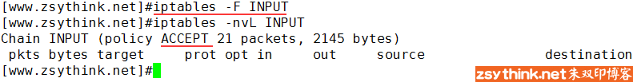

清空INPUT链以后，filter表中的INPUT链已经不存在任何的规则，但是可以看出，INPUT链的默认策略是ACCEPT，也就是说，INPUT链默认”放行”所有发往本机的报文，当没有任何规则时，会接受所有报文，当报文没有被任何规则匹配到时，也会默认放行报文。

那么此刻，我们就在另外一台机器上，使用ping命令，向当前机器发送报文，如下图所示，ping命令可以得到回应，证明ping命令发送的报文已经正常的发送到了防火墙所在的主机，ping命令所在机器IP地址为146，当前测试防火墙主机的IP地址为156，我们就用这样的环境，对iptables进行操作演示。

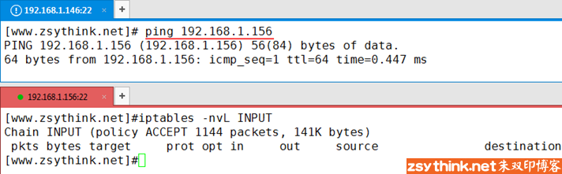

### 增加规则

那么此处，我们就在156上配置一条规则，拒绝192.168.1.146上的所有报文访问当前机器，之前一直在说，规则由匹配条件与动作组成，那么”拒绝192.168.1.146上的所有报文访问当前机器”这条规则中，报文的”源地址为192.168.1.146″则属于匹配条件，如果报文来自”192.168.1.146″，则表示满足匹配条件，而”拒绝”这个报文，就属于对应的动作，好了，那么怎样用命令去定义这条规则呢？使用如下命令即可

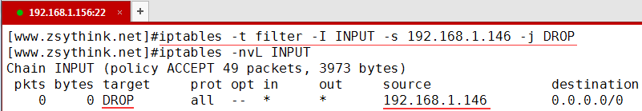

- 使用`-t`选项指定了要操作的表，此处指定了操作filter表，与之前的查看命令一样，不使用-t选项指定表时，默认为操作filter表。
- 使用`-I`选项，指明将”规则”插入至哪个链中，-I表示insert，即插入的意思，所以-I INPUT表示将规则插入于INPUT链中，即添加规则之意。
- 使用`-s`选项，指明”匹配条件”中的”源地址”，即如果报文的源地址属于-s对应的地址，那么报文则满足匹配条件，-s为source之意，表示源地址。
- 使用`-j`选项，指明当”匹配条件”被满足时，所对应的动作，上例中指定的动作为DROP，在上例中，当报文的源地址为192.168.1.146时，报文则被DROP（丢弃）。

再次查看filter表中的INPUT链，发现规则已经被添加了，在iptables中，动作被称之为”target”，所以，上图中taget字段对应的动作为DROP。

那么此时，我们再通过192.168.1.146去ping主机156，看看能否ping通。

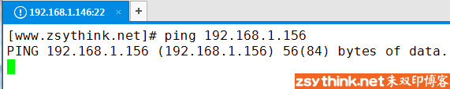

如上图所示，ping  156主机时，PING命令一直没有得到回应，看来我们的iptables规则已经生效了，ping发送的报文压根没有被156主机接受，而是被丢弃了，所以更不要说什么回应了，好了，我们已经成功的配置了一条iptables规则，看来，我们已经入门了。

还记得我们在前文中说过的”计数器”吗？此时，我们再次查看iptables中的规则，可以看到，已经有24个包被对应的规则匹配到，总计大小2016bytes。

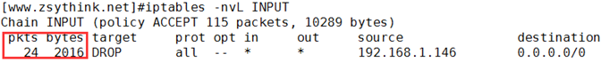

此刻，我们来做一个实验。

现在INPUT链中已经存在了一条规则，它拒绝了所有来自192.168.1.146主机中的报文，如果此时，我们在这条规则之后再配置一条规则，后面这条规则规定，接受所有来自192.168.1.146主机中的报文，那么，iptables是否会接受来自146主机的报文呢？我们动手试试。

使用如下命令在filter表的INPUT链中追加一条规则，这条规则表示接受所有来自192.168.1.146的发往本机的报文。

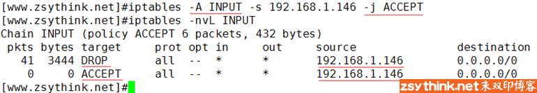

上图中的命令并没有使用-t选项指定filter表，我们一直在说，不使用-t选项指定表时表示默认操作filter表。

上图中，使用-A选项，表示在对应的链中”追加规则”，-A为append之意，所以，-A  INPUT则表示在INPUT链中追加规则，而之前示例中使用的-I选项则表示在链中”插入规则”，聪明如你一定明白了，它们的本意都是添加一条规则，只是 **-A表示在链的尾部追加规则** ， **-I表示在链的首部插入规则而已** 。

使用-j选项，指定当前规则对应的动作为ACCEPT。

执行完添加规则的命令后，再次查看INPUT链，发现规则已经成功”追加”至INPUT链的末尾，那么现在，第一条规则指明了丢弃所有来自192.168.1.146的报文，第二条规则指明了接受所有来自192.168.1.146的报文，那么结果到底是怎样的呢？实践出真知，在146主机上再次使用ping命令向156主机发送报文，发现仍然是ping不通的，看来第二条规则并没有生效。

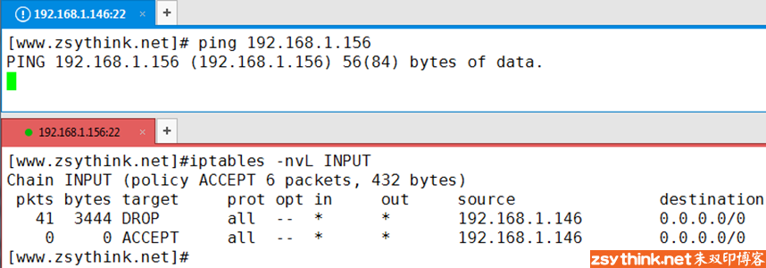

而且从上图中第二条规则的计数器可以看到，根本没有任何报文被第二条规则匹配到。

聪明如你一定在猜想，发生上述情况，会不会与规则的先后顺序有关呢？测试一下不就知道了，我们再添加一条规则，新规则仍然规定接受所有来自192.168.1.146主机中的报文，只是这一次，我们将新规则添加至INPUT链的最前面试试。

在添加这条规则之前，我们先把146上的ping命令强制停止了，然后使用如下命令，在filter表的INPUT链的前端添加新规则。


好了，现在第一条规则就是接受所有来自192.168.1.146的报文，而且此时计数是0，此刻，我们再从146上向156发起ping请求。

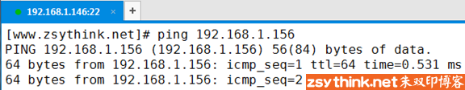

146上已经可以正常的收到响应报文了，那么回到156查看INPUT链的规则，第一条规则的计数器已经显示出了匹配到的报文数量。


规则的顺序很重要， **如果报文已经被前面的规则匹配到，iptables则会对报文执行对应的动作，即使后面的规则也能匹配到当前报文，很有可能也没有机会再对报文执行相应的动作了** ，就以上图为例，报文先被第一条规则匹配到了，于是当前报文被”放行”了，因为报文已经被放行了，所以，即使上图中的第二条规则即使能够匹配到刚才”放行”的报文，也没有机会再对刚才的报文进行丢弃操作了。这就是iptables的工作机制。

之前在总结查看命令时提到过，使用–line-number选项可以列出规则的序号，如下图所示


我们也可以在添加规则时，指定新增规则的编号，这样我们就能在任意位置插入规则了，我们只要把刚才的命令稍作修改即可，如下。

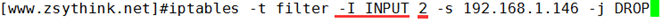

仍然使用-I选项进行插入规则操作，-I INPUT 2表示在INPUT链中新增规则，新增的规则的编号为2，好了，自己动手试试吧。

### 删除规则

注意：在参照本文进行iptables实验时，请务必在个人的测试机上进行。

此刻，如果我们想要删除filter表中INPUT中的一条规则，该怎么做呢？

有两种办法

方法一：根据规则的编号去删除规则

方法二：根据具体的匹配条件与动作删除规则

那么我们先看看方法一，先查看一下filter表中INPUT链中的规则

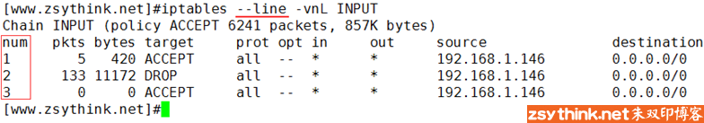

假如我们想要删除上图中的第3条规则，则可以使用如下命令。

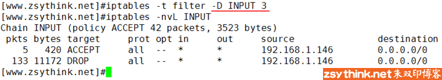

上例中，使用了-t选项指定了要操作的表（没错，省略-t默认表示操作filter表），使用-D选项表示删除指定链中的某条规则，-D INPUT 3表示删除INPUT链中的第3条规则。

当然，我们也可以根据具体的匹配条件与动作去删除规则，比如，删除下图中源地址为192.168.1.146，动作为ACCEPT的规则，于是，删除规则的命令如下。

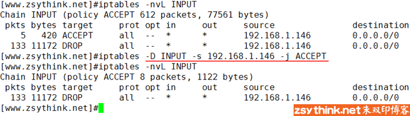

上图中，删除对应规则时，仍然使用-D选项，-D  INPUT表示删除INPUT链中的规则，剩下的选项与我们添加规则时一毛一样，-s表示以对应的源地址作为匹配条件，-j  ACCEPT表示对应的动作为接受，所以，上述命令表示删除INPUT链中源地址为192.168.1.146，动作为ACCEPT的规则。

而删除指定表中某条链中的所有规则的命令，我们在一开始就使用到了，就是”iptables -t 表名 -F 链名”

-F选项为flush之意，即冲刷指定的链，即删除指定链中的所有规则，但是注意，此操作相当于删除操作，在没有保存iptables规则的情况下，请慎用。

其实，-F选项不仅仅能清空指定链上的规则，其实它还能清空整个表中所有链上的规则，不指定链名，只指定表名即可删除表中的所有规则，命令如下

iptables -t 表名 -F

不过再次强调，在没有保存iptables规则时，请勿随便清空链或者表中的规则，除非你明白你在干什么。

### 修改规则

注意：在参照本文进行iptables实验时，请务必在个人的测试机上进行。

那么，我们怎样修改某条规则中的动作呢？比如，我想把如下规则中的动作从DROP改为REJECT，改怎么办呢？

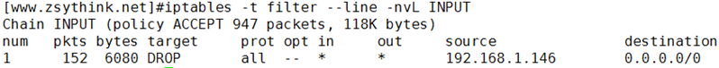

我们可以使用-R选项修改指定的链中的规则，在修改规则时指定规则对应的编号即可(有坑，慎行)，示例命令如下

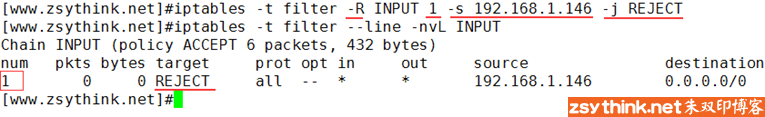

上例中，-R选项表示修改指定的链，使用-R INPUT 1表示修改INPUT链的第1条规则，使用-j REJECT表示将INPUT链中的第一条规则的动作修改为REJECT，注意：上例中， **`-s`选项以及对应的源地址不可省略 ，即使我们已经指定了规则对应的编号，但是在使用-R选项修改某个规则时，必须指定规则对应的原本的匹配条件（如果有多个匹配条件，都需要指定）** 。

**如果上例中的命令没有使用-s指定对应规则中原本的源地址，那么在修改完成后，你修改的规则中的源地址会自动变为0.0.0.0/0（此IP表示匹配所有网段的IP地址）** ，而此时，-j对应的动作又为REJECT，所以在执行上述命令时如果没有指明规则原本的源地址，那么所有IP的请求都被拒绝了（因为没有指定原本的源地址，当前规则的源地址自动变为0.0.0.0/0），如果你正在使用ssh远程到服务器上进行iptables设置，那么你的ssh请求也将会被阻断。

既然使用-R选项修改规则时，必须指明规则原本的匹配条件，那么我们则可以理解为，只能通过-R选项修改规则对应的动作了，所以我觉得，如果你想要修改某条规则，还不如先将这条规则删除，然后在同样位置再插入一条新规则，这样更好，当然，如果你只是为了修改某条规则的动作， **那么使用-R选项时，不要忘了指明规则原本对应的匹配条件** 。

好了，上例中，我们已经将规则中的动作从DROP改为了REJECT，那么DROP与REJECT有什么不同呢？从字面上理解，DROP表示丢弃，REJECT表示拒绝，REJECT表达的意思好像更坚决一点，我们再次从146主机上向156主机上发起ping请求，看看与之前动作为DROP时有什么不同。

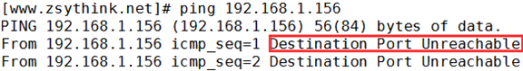

如上图所示，当156主机中的iptables规则对应的动作为REJECT时，从146上进行ping操作时，直接就提示”目标不可达”，并没有像之前那样卡在那里，看来，REJECT比DROP更加”干脆”。

其实，我们还可以修改指定链的”默认策略”，没错，就是下图中标注的默认策略。

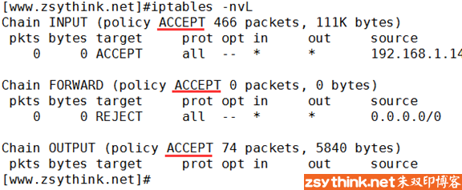

每张表的每条链中，都有自己的默认策略，我们也可以理解为默认”动作”。

当报文没有被链中的任何规则匹配到时，或者，当链中没有任何规则时，防火墙会按照默认动作处理报文，我们可以修改指定链的默认策略，使用如下命令即可。

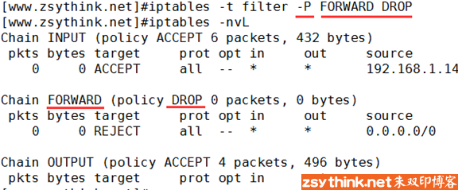

使用-t指定要操作的表，使用-P选项指定要修改的链，上例中，-P FORWARD DROP表示将表中FORWRD链的默认策略改为DROP。

### 保存规则

在默认的情况下，我们对”防火墙”所做出的修改都是”临时的”，换句话说就是，当重启iptables服务或者重启服务器以后，我们平常添加的规则或者对规则所做出的修改都将消失，为了防止这种情况的发生，我们需要将规则”保存”。

centos7与centos6中的情况稍微有些不同，我们先说centos6中怎样保存iptables规则。

**centos6中**，使用”service iptables  save”命令即可保存规则，规则默认保存在/etc/sysconfig/iptables文件中，如果你刚刚安装完centos6，在刚开始使用iptables时，会发现filter表中会有一些默认的规则，这些默认提供的规则其实就保存在/etc/sysconfig/iptables中，  保存规则的示例如下。

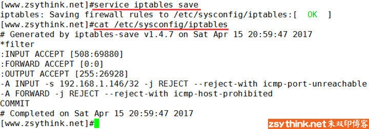

如上图所示，文件中保存了filter表中每条链的默认策略，以及每条链中的规则，由于其他表中并没有设置规则，也没有使用过其他表，所以文件中只保存了filter表中的规则。

当我们对规则进行了修改以后，如果想要修改永久生效，必须使用service iptables  save保存规则，当然，如果你误操作了规则，但是并没有保存，那么使用service iptables  restart命令重启iptables以后，规则会再次回到上次保存/etc/sysconfig/iptables文件时的模样。

从现在开始，最好养成及时保存规则的好习惯。

**centos7中**，已经不再使用init风格的脚本启动服务，而是使用unit文件，所以，在centos7中已经不能再使用类似service iptables start这样的命令了，所以service iptables  save也无法执行，同时，在centos7中，使用firewall替代了原来的iptables  service，不过不用担心，我们只要通过yum源安装iptables与iptables-services即可（iptables一般会被默认安装，但是iptables-services在centos7中一般不会被默认安装），在centos7中安装完iptables-services后，即可像centos6中一样，通过service iptables save命令保存规则了，规则同样保存在/etc/sysconfig/iptables文件中。

此处给出centos7中配置iptables-service的步骤

```
#配置好yum源以后安装iptables-service

# yum install -y iptables-services

#停止firewalld

# systemctl stop firewalld

#禁止firewalld自动启动

# systemctl disable firewalld

#启动iptables

# systemctl start iptables

#将iptables设置为开机自动启动，以后即可通过iptables-service控制iptables服务

# systemctl enable iptables
```

上述配置过程只需一次，以后即可在centos7中愉快的使用service iptables save命令保存iptables规则了。

**其他通用方法**

还可以使用另一种方法保存iptables规则，就是使用iptables-save命令

使用iptables-save并不能保存当前的iptables规则，但是可以将当前的iptables规则以”保存后的格式”输出到屏幕上。

所以，我们可以使用iptables-save命令，再配合重定向，将规则重定向到/etc/sysconfig/iptables文件中即可。

iptables-save > /etc/sysconfig/iptables

我们也可以将/etc/sysconfig/iptables中的规则重新载入为当前的iptables规则，但是注意，未保存入/etc/sysconfig/iptables文件中的修改将会丢失或者被覆盖。

使用iptables-restore命令可以从指定文件中重载规则，示例如下

iptables-restore < /etc/sysconfig/iptables

再次提醒：重载规则时，现有规则将会被覆盖。

### 命令整理

上文已经详细的举例并描述了怎样进行iptables规则管理，为了以后能够快速的回顾，我们把上述命令总结一下。

**添加规则**

注意点：添加规则时，规则的顺序非常重要

在指定表的指定链的尾部添加一条规则，-A选项表示在对应链的末尾添加规则，省略-t选项时，表示默认操作filter表中的规则

```
命令语法：iptables -t 表名 -A 链名 匹配条件 -j 动作

示例：iptables -t filter -A INPUT -s 192.168.1.146 -j DROP
```

在指定表的指定链的首部添加一条规则，-I选型表示在对应链的开头添加规则

```
命令语法：iptables -t 表名 -I 链名 匹配条件 -j 动作

示例：iptables -t filter -I INPUT -s 192.168.1.146 -j ACCEPT
```

在指定表的指定链的指定位置添加一条规则

```
命令语法：iptables -t 表名 -I 链名 规则序号 匹配条件 -j 动作

示例：iptables -t filter -I INPUT 5 -s 192.168.1.146 -j REJECT
```

设置指定表的指定链的默认策略（默认动作），并非添加规则。

```
命令语法：iptables -t 表名 -P 链名 动作

示例：iptables -t filter -P FORWARD ACCEPT
```

上例表示将filter表中FORWARD链的默认策略设置为ACCEPT

**删除规则**

注意点：如果没有保存规则，删除规则时请慎重

按照规则序号删除规则，删除指定表的指定链的指定规则，-D选项表示删除对应链中的规则。

```
命令语法：iptables -t 表名 -D 链名 规则序号

示例：iptables -t filter -D INPUT 3
```

上述示例表示删除filter表中INPUT链中序号为3的规则。

按照具体的匹配条件与动作删除规则，删除指定表的指定链的指定规则。

```
命令语法：iptables -t 表名 -D 链名 匹配条件 -j 动作

示例：iptables -t filter -D INPUT -s 192.168.1.146 -j DROP
```

上述示例表示删除filter表中INPUT链中源地址为192.168.1.146并且动作为DROP的规则。

删除指定表的指定链中的所有规则，-F选项表示清空对应链中的规则，执行时需三思。

```
命令语法：iptables -t 表名 -F 链名

示例：iptables -t filter -F INPUT
```

删除指定表中的所有规则，执行时需三思。

```
命令语法：iptables -t 表名 -F

示例：iptables -t filter -F
```

**修改规则**

注意点：如果使用-R选项修改规则中的动作，那么必须指明原规则中的原匹配条件，例如源IP，目标IP等。

修改指定表中指定链的指定规则，-R选项表示修改对应链中的规则，使用-R选项时要同时指定对应的链以及规则对应的序号，并且规则中原本的匹配条件不可省略。

```
命令语法：iptables -t 表名 -R 链名 规则序号 规则原本的匹配条件 -j 动作

示例：iptables -t filter -R INPUT 3 -s 192.168.1.146 -j ACCEPT
```

上述示例表示修改filter表中INPUT链的第3条规则，将这条规则的动作修改为ACCEPT， -s 192.168.1.146为这条规则中原本的匹配条件，如果省略此匹配条件，修改后的规则中的源地址可能会变为0.0.0.0/0。

其他修改规则的方法：先通过编号删除规则，再在原编号位置添加一条规则。

修改指定表的指定链的默认策略（默认动作），并非修改规则，可以使用如下命令。

```
命令语法：iptables -t 表名 -P 链名 动作

示例：iptables -t filter -P FORWARD ACCEPT
```

上例表示将filter表中FORWARD链的默认策略修改为ACCEPT

**保存规则**

保存规则命令如下，表示将iptables规则保存至/etc/sysconfig/iptables文件中，如果对应的操作没有保存，那么当重启iptables服务以后

```
service iptables save
```

注意点：centos7中使用默认使用firewalld，如果想要使用上述命令保存规则，需要安装iptables-services，具体配置过程请回顾上文。

或者使用如下方法保存规则

```
iptables-save > /etc/sysconfig/iptables
```

可以使用如下命令从指定的文件载入规则，注意：重载规则时，文件中的规则将会覆盖现有规则。

```
iptables-restore < /etc/sysconfig/iptables
```

# iptables匹配条件

## 基本匹配条件

### 匹配条件：源IP地址

还是从我们最常用的”源地址”说起吧，我们知道，使用-s选项作为匹配条件，可以匹配报文的源地址，但是之前的示例中，我们每次指定源地址，都只是指定单个IP，示例如下。

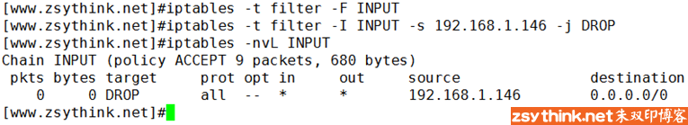

其实，我们也可以在指定源地址时，一次指定多个，用”逗号”隔开即可，示例如下。

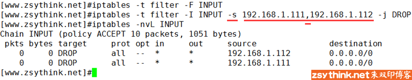

可以看出，上例中，一次添加了两条规则，两条规则只是源地址对应的IP不同，注意，上例中的”逗号”两侧均不能包含空格，多个IP之间必须与逗号相连。

除了能指定具体的IP地址，还能指定某个网段，示例如下

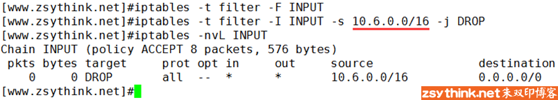

上例表示，如果报文的源地址IP在10.6.0.0/16网段内，当报文经过INPUT链时就会被DROP掉。

其实，我们还可以对匹配条件取反，先看示例，如下。

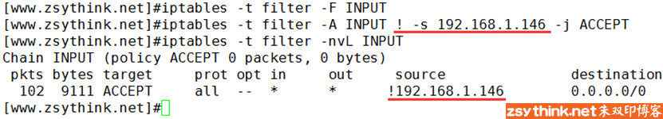

上图中，使用”! -s 192.168.1.146″表示对 -s 192.168.1.146这个匹配条件取反， -s  192.168.1.146表示报文源IP地址为192.168.1.146即可满足匹配条件，使用 “!”  取反后则表示，报文源地址IP只要不为192.168.1.146即满足条件，那么，上例中规则表达的意思就是，只要发往本机的报文的源地址不是192.168.1.146，就接受报文。

按照上例中的配置，如果此时从146主机上向防火墙所在的主机发送ping请求，146主机能得到回应吗？（此处不考虑其他链，只考虑filter表的INPUT链）

答案是：能，也就是说，按照上例的配置，146主机仍然能够ping通当前主机，为什么呢？我们来分析一下。

上例中，filter表的INPUT链中只有一条规则，这条规则要表达的意思就是：

只要报文的源IP不是192.168.1.146，那么就接受此报文，但是，某些小伙伴可能会误会，把上例中的规则理解成如下含义，

只要报文的源IP是192.168.1.146，那么就不接受此报文，这种理解与上述理解看似差别不大，其实完全不一样，这样理解是错误的，上述理解才是正确的。

换句话说就是，报文的源IP不是192.168.1.146时，会被接收，并不能代表，报文的源IP是192.168.1.146时，会被拒绝。

上例中，因为并没有任何一条规则指明源IP是192.168.1.146时，该执行怎样的动作，所以，当来自192.168.1.146的报文经过INPUT链时，并不能匹配上例中的规则，于是，此报文就继续匹配后面的规则，可是，上例中只有一条规则，这条规则后面没有其他可以匹配的规则，于是，此报文就会去匹配当前链的默认动作(默认策略)，而上例中，INPUT链的默认动作为ACCEPT，所以，来自146的ping报文就被接收了，如果，把上例中INPUT链的默认策略改为DROP，那么，146的报文将会被丢弃，146上的ping命令将得不到任何回应，但是如果将INPUT链的默认策略设置为DROP，当INPUT链中没有任何规则时，所有外来报文将会被丢弃，包括我们ssh远程连接。

好了，我们通过上例，不仅了解到了怎样对匹配条件取反，还加深了我们对默认策略的了解，一举两得，我们继续聊。

### 匹配条件：目标IP地址

除了可以通过-s选项指定源地址作为匹配条件，我们还可以使用-d选项指定”目标地址”作为匹配条件。

源地址表示报文从哪里来，目标地址表示报文要到哪里去。

除了127.0.0.1回环地址以外，当前机器有两个IP地址，IP如下。

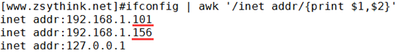

假设，我们想要拒绝146主机发来的报文，但是我们只想拒绝146向156这个IP发送报文，并不想要防止146向101这个IP发送报文，我们就可以指定目标地址作为匹配条件，示例如下。

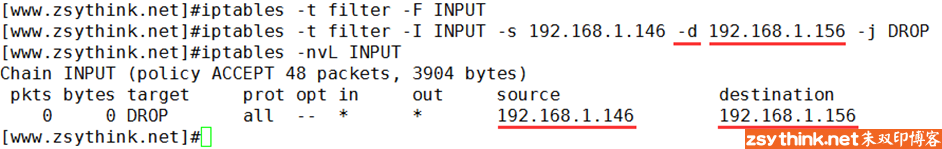

上例表示只丢弃从146发往156这个IP的报文，但是146发往101这个IP的报文并不会被丢弃，如果我们不指定任何目标地址，则目标地址默认为0.0.0.0/0，同理，如果我们不指定源地址，源地址默认为0.0.0.0/0，0.0.0.0/0表示所有IP，示例如下。

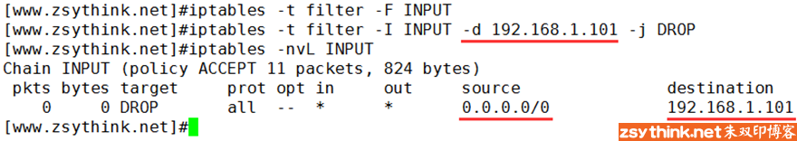

上例表示，所有IP发送往101的报文都将被丢弃。

与-s选项一样，-d选项也可以使用”叹号”进行取反，也能够同时指定多个IP地址，使用”逗号”隔开即可。

但是请注意，不管是-s选项还是-d选项， **取反操作与同时指定多个IP的操作不能同时使用** 。

**需要明确的一点就是：当一条规则中有多个匹配条件时，这多个匹配条件之间，默认存在”与”的关系** 。

说白了就是，当一条规则中存在多个匹配条件时，报文必须同时满足这些条件，才算做被规则匹配。

就如下例所示，下图中的规则包含有两个匹配条件，源地址与目标地址，报文必须同时能被这两个条件匹配，才算作被当前规则匹配，也就是说，下例中，报文必须来自146，同时报文的目标地址必须为101，才会被如下规则匹配，两个条件必须同时满足。

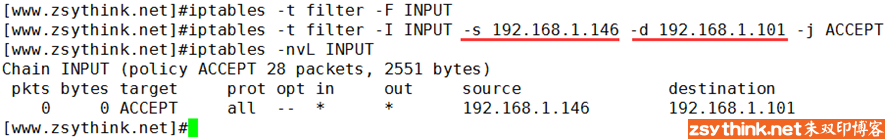

我们除了能够使用-s选项和-d选项匹配源IP与目标IP以外，还能够匹配”源端口”与”目标端口”，但是我们一会儿再聊怎样匹配端口，我们先聊聊其他选项。

### 匹配条件：协议类型

我们可以使用-p选项，指定需要匹配的报文的协议类型。

假设，我们只想要拒绝来自146的tcp类型的请求，那么可以进行如下设置

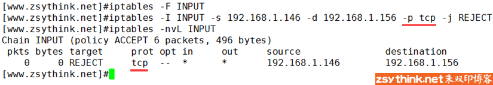

上图中，防火墙拒绝了来自146的tcp报文发往156这个IP，那么我们来测试一下，我们在146上使用ssh连接101这个IP试试（ssh协议的传输层协议属于tcp协议类型）

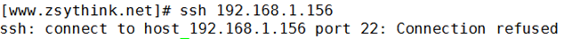

如上图所示，ssh连接被拒绝了，那么我们使用ping命令试试 (ping命令使用icmp协议)，看看能不能ping通156。

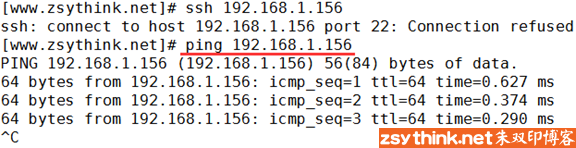

可以看到，PING命令可以ping通156，证明icmp协议并没有被规则匹配到，只有tcp类型的报文被匹配到了。

那么，-p选项都支持匹配哪些协议呢？我们总结一下

centos6中，-p选项支持如下协议类型

- tcp
- udp
- udplite
- icmp
- esp
- ah
- sctp

centos7中，-p选项支持如下协议类型

- tcp
- udp
- udplite
- icmp
- icmpv6
- esp
- ah
- sctp
- mh

当不使用-p指定协议类型时，默认表示所有类型的协议都会被匹配到，与使用-p all的效果相同。

### 匹配条件：网卡接口

我们再来认识一个新的匹配条件，当本机有多个网卡时，我们可以使用 -i 选项去匹配报文是通过哪块网卡流入本机的。

我们先动手做个小例子，对-i选项有一个初步的了解以后，再结合理论去看。

当前主机的网卡名称为eth4，如下图


假设想要拒绝由网卡eth4流入的ping请求报文，则可以进行如下设置。

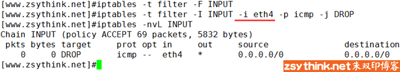

上图中，使用-i选项，指定网卡名称，使用-p选项，指定了需要匹配的报文协议类型，上例表示丢弃由eth4网卡流入的icmp类型的报文。

是不是很容易理解，但是，我们需要考虑一个问题， **-i选项是用于匹配报文流入的网卡的** ，也就是说，从本机发出的报文是不可能会使用到-i选项的，因为这些由本机发出的报文压根不是从网卡流入的，而是要通过网卡发出的，从这个角度考虑，-i选项的使用是有限制的。

为了更好的解释-i选项，我们回顾一下在理论总结中的一张iptables全局报文流向图，如下。


既然-i选项是用于判断报文是从哪个网卡流入的，那么，-i选项只能用于上图中的PREROUTING链、INPUT链、FORWARD链，这是-i选项的特殊性，因为它只是用于判断报文是从哪个网卡流入的，所以只能在上图中”数据流入流向”的链中与FORWARD链中存在，而上图中的”数据发出流向”经过的链中，是不可能使用-i选项的，比如上图中的OUTPUT链与POSTROUTING链，他们都不能使用-i选项。

理解完-i选项，再来理解-o选项就好办了。

当主机有多块网卡时，可以 **使用-o选项，匹配报文将由哪块网卡流出** ，没错，-o选项与-i选项是相对的，-i选项用于匹配报文从哪个网卡流入，-o选项用于匹配报文将从哪个网卡流出。

**`-i`选项只能用于PREROUTING链、INPUT链、FORWARD链** ，那么 **`-o`选项只能用于FORWARD链、OUTPUT链、POSTROUTING链**

因为-o选项是用于匹配报文将由哪个网卡”流出”的，所以与上图中的”数据进入流向”中的链没有任何缘分，所以，-o选项只能用于FORWARD链、OUTPUT链、POSTROUTING链中。

**FORWARD能同时使用-i选项与-o选项**

## 扩展匹配条件

好了，现在，我们就要聊聊，怎样匹配报文的”源端口”与”目标端口”。

在上文中，我们总结了”源地址”与”目标地址”以后，就顺便提到了”源端口”与”目标端口”，但是，为什么刚才不介绍”源端口”与”目标端口”，非要现在介绍呢？这是因为”源端口”与”目标端口”属于扩展匹配条件，”源地址”与”目标地址”属于基本匹配条件，上文中介绍到的匹配条件，都属于基本匹配条件，所以，我们单独把”源端口”与”目标端口”，放在后面总结，是为了引出扩展匹配条件的概念。

那么，先来了解一下，什么是扩展匹配条件。

不是基本匹配条件的就是扩展匹配条件，这样说好像是句废话，我们可以这样理解，基本匹配条件我们可以直接使用， **而如果想要使用扩展匹配条件，则需要依赖一些扩展模块** ，或者说，在使用扩展匹配条件之前，需要指定相应的扩展模块才行，这样说不容易明白，我们做个例子，就能够明白。

我们知道，sshd服务的默认端口为22，当我们使用ssh工具远程连接主机时，默认会连接服务端的22号端口，假设，我们现在想要使用iptables设置一条规则，拒绝来自192.168.1.146的ssh请求，我们就可以拒绝146上的报文能够发往本机的22号端口，这个时候，就需要用到”目标端口”选项。

使用选项--dport可以匹配报文的目标端口，--dport意为destination-port，即表示目标端口。

注意，与之前的选项不同，--dport前有两条”横杠”，而且，使用--dport选项时，必须事先指定了使用哪种协议，即必须先使用-p选项，示例如下


上图中，我们就使用了扩展匹配条件–dport，指定了匹配报文的目标端口，如果外来报文的目标端口为本机的22号端口（ssh默认端口），则拒绝之，而在使用–dport之前，我们使用-m选项，指定了对应的扩展模块为tcp，也就是说，如果想要使用--dport这个扩展匹配条件，则必须依靠某个扩展模块完成，上例中，这个扩展模块就是tcp扩展模块，最终，我们使用的是tcp扩展模块中的dport扩展匹配条件。

现在，我们再回过头来看看扩展匹配条件的概念，就更加明白了。

扩展匹配条件被使用时，则需要依赖一些扩展模块，或者说，在使用扩展匹配条件之前，需要指定相应的扩展模块才行。

现在你明白了吗？ **-m tcp表示使用tcp扩展模块，--dport表示tcp扩展模块中的一个扩展匹配条件，可用于匹配报文的目标端口** 。

注意，-p tcp与 -m tcp并不冲突，-p用于匹配报文的协议，-m 用于指定扩展模块的名称，正好，这个扩展模块也叫tcp。

其实，上例中，我们可以省略-m选项，示例如下。

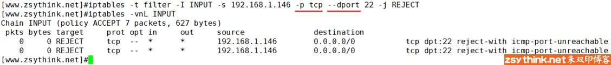

**当使用-p选项指定了报文的协议时，如果在没有使用-m指定对应的扩展模块名称的情况下，使用了扩展匹配条件，  iptables默认会调用与-p选项对应的协议名称相同的模块**

上例中，我们使用-p选项指定了协议名称，使用扩展匹配条件–dport指定了目标端口，在使用扩展匹配条件的时候，如果没有使用-m指定使用哪个扩展模块，iptables会默认使用”-m 协议名”，而协议名就是-p选项对应的协议名，上例中，-p 对应的值为tcp，所以默认调用的扩展模块就为-m  tcp，如果-p对应的值为udp，那么默认调用的扩展模块就为-m udp。

所以，上例中，其实”隐式”的指定了扩展模块，只是没有表现出来罢了。

所以， **在使用扩展匹配条件时，一定要注意，如果这个扩展匹配条件所依赖的扩展模块名正好与-p对应的协议名称相同，那么则可省略-m选项，否则则不能省略-m选项** ，必须使用-m选项指定对应的扩展模块名称，这样说可能还是不是特别明了，在后续的举例中，我们会更加明了的理解这些概念。

有”目标端口”，就有”源端口”，代表”源端口”的扩展匹配条件为--sport

使用--sport可以判断报文是否从指定的端口发出，即匹配报文的源端口是否与指定的端口一致，--sport表示source-port，即表示源端口之意。

因为我们已经搞明白了dport，那么sport我就不再赘述了，示例如下

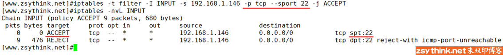

上例中，隐含了”-m tcp”之意，表示使用了tcp扩展模块的–sport扩展匹配条件。

扩展匹配条件是可以取反的，同样是使用”!”进行取反，比如 “! --dport 22″，表示目标端口不是22的报文将会被匹配到。

不管是–sport还是–dsport，都能够指定一个端口范围，比如，--dport 22:25表示目标端口为22到25之间的所有端口，即22端口、23端口、24端口、25端口，示例如下

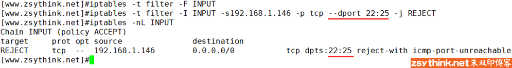

也可以写成如下图中的模样，下图中第一条规则表示匹配0号到22号之间的所有端口，下图中的第二条规则表示匹配80号端口以及其以后的所有端口（直到65535）。

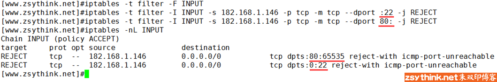

刚才聊到的两个扩展匹配条件都是tcp扩展模块的，其实，tcp扩展模块还有一个比较有用的扩展匹配条件叫做”--tcp-flags”，但是由于篇幅原因，以后再对这个扩展匹配条件进行总结。

借助tcp扩展模块的--sport或者--dport都可以指定一个连续的端口范围，但是无法同时指定多个离散的、不连续的端口，如果想要同时指定多个离散的端口，需要借助另一个扩展模块，”multiport”模块。

我们可以使用multiport模块的--sports扩展条件同时指定多个离散的源端口。

我们可以使用multiport模块的--dports扩展条件同时指定多个离散的目标端口。

示例如下

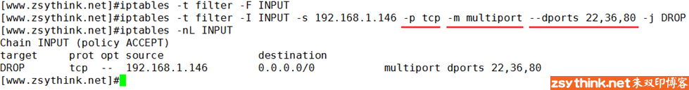

上图示例表示，禁止来自146的主机上的tcp报文访问本机的22号端口、36号端口以及80号端口。

上图中，”-m multiport --dports 22,36,80″表示使用了multiport扩展模块的--dports扩展条件，以同时指定了多个离散的端口，每个端口之间用逗号隔开。

上图中的-m multiport是不能省略的，如果你省略了-m  multiport，就相当于在没有指定扩展模块的情况下，使用了扩展条件（”--dports”），那么上例中，iptables会默认调用”-m  tcp”，但是，”--dports扩展条件”并不属于”tcp扩展模块”,而是属于”multiport扩展模块”，所以，这时就会报错。

综上所述，当使用--dports或者--sports这种扩展匹配条件时，必须使用-m指定模块的名称。

其实，使用multiport模块的--sports与--dpors时，也可以指定连续的端口范围，并且能够在指定连续的端口范围的同时，指定离散的端口号，示例如下。

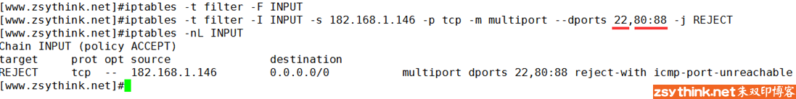

上例中的命令表示拒绝来自192.168.1.146的tcp报文访问当前主机的22号端口以及80到88之间的所有端口号，是不是很方便？有没有很灵活？

不过需要注意， **multiport扩展只能用于tcp协议与udp协议** ，即配合-p tcp或者-p udp使用。

再回过头看之前的概念，我想，你应该就更加明白了。

今天，我们只是初步的认识了扩展模块，以及扩展匹配条件，还有一些模块我们并没有总结，好饭不怕晚，后续会有对它们的总结。

---

**基本匹配条件总结**

-s用于匹配报文的源地址,可以同时指定多个源地址，每个IP之间用逗号隔开，也可以指定为一个网段。

```
#示例如下

iptables -t filter -I INPUT -s 192.168.1.111,192.168.1.118 -j DROP

iptables -t filter -I INPUT -s 192.168.1.0/24 -j ACCEPT

iptables -t filter -I INPUT ! -s 192.168.1.0/24 -j ACCEPT
```

-d用于匹配报文的目标地址,可以同时指定多个目标地址，每个IP之间用逗号隔开，也可以指定为一个网段。

```
#示例如下

iptables -t filter -I OUTPUT -d 192.168.1.111,192.168.1.118 -j DROP

iptables -t filter -I INPUT -d 192.168.1.0/24 -j ACCEPT

iptables -t filter -I INPUT ! -d 192.168.1.0/24 -j ACCEPT
```

-p用于匹配报文的协议类型,可以匹配的协议类型tcp、udp、udplite、icmp、esp、ah、sctp等（centos7中还支持icmpv6、mh）。

```
#示例如下

iptables -t filter -I INPUT -p tcp -s 192.168.1.146 -j ACCEPT

iptables -t filter -I INPUT ! -p udp -s 192.168.1.146 -j ACCEPT
```

-i用于匹配报文是从哪个网卡接口流入本机的，由于匹配条件只是用于匹配报文流入的网卡，所以在OUTPUT链与POSTROUTING链中不能使用此选项。

```
#示例如下

iptables -t filter -I INPUT -p icmp -i eth4 -j DROP

iptables -t filter -I INPUT -p icmp ! -i eth4 -j DROP
```

-o用于匹配报文将要从哪个网卡接口流出本机，于匹配条件只是用于匹配报文流出的网卡，所以在INPUT链与PREROUTING链中不能使用此选项。

```
#示例如下

iptables -t filter -I OUTPUT -p icmp -o eth4 -j DROP

iptables -t filter -I OUTPUT -p icmp ! -o eth4 -j DROP
```

**扩展匹配条件总结**

我们来总结一下今天认识的两个扩展模块，以及其中的扩展条件（并非全部，只是这篇文章中介绍过的）

tcp扩展模块

常用的扩展匹配条件如下：

-p tcp -m tcp --sport 用于匹配tcp协议报文的源端口，可以使用冒号指定一个连续的端口范围

-p tcp -m tcp --dport 用于匹配tcp协议报文的目标端口，可以使用冒号指定一个连续的端口范围

```
#示例如下

iptables -t filter -I OUTPUT -d 192.168.1.146 -p tcp -m tcp --sport 22 -j REJECT

iptables -t filter -I INPUT -s 192.168.1.146 -p tcp -m tcp --dport 22:25 -j REJECT

iptables -t filter -I INPUT -s 192.168.1.146 -p tcp -m tcp --dport :22 -j REJECT

iptables -t filter -I INPUT -s 192.168.1.146 -p tcp -m tcp --dport 80: -j REJECT

iptables -t filter -I OUTPUT -d 192.168.1.146 -p tcp -m tcp ! --sport 22 -j ACCEPT
```

multiport扩展模块

常用的扩展匹配条件如下：

-p tcp -m multiport --sports 用于匹配报文的源端口，可以指定离散的多个端口号,端口之间用”逗号”隔开

-p udp -m multiport --dports 用于匹配报文的目标端口，可以指定离散的多个端口号，端口之间用”逗号”隔开

```
#示例如下

iptables -t filter -I OUTPUT -d 192.168.1.146 -p udp -m multiport --sports 137,138 -j REJECT

iptables -t filter -I INPUT -s 192.168.1.146 -p tcp -m multiport --dports 22,80 -j REJECT

iptables -t filter -I INPUT -s 192.168.1.146 -p tcp -m multiport ! --dports 22,80 -j REJECT

iptables -t filter -I INPUT -s 192.168.1.146 -p tcp -m multiport --dports 80:88 -j REJECT

iptables -t filter -I INPUT -s 192.168.1.146 -p tcp -m multiport --dports 22,80:88 -j REJECT
```

好吧，感谢大家稀稀拉拉的赞赏和评论，希望这篇文章中的内容能对你有所帮助。

## 常用扩展模块

### iprange扩展模块

之前我们已经总结过，在不使用任何扩展模块的情况下，使用-s选项或者-d选项即可匹配报文的源地址与目标地址，而且在指定IP地址时，可以同时指定多个IP地址，每个IP用”逗号”隔开，但是，-s选项与-d选项并不能一次性的指定一段连续的IP地址范围，如果我们需要指定一段连续的IP地址范围，可以使用iprange扩展模块。

使用iprange扩展模块可以指定”一段连续的IP地址范围”，用于匹配报文的源地址或者目标地址。

iprange扩展模块中有两个扩展匹配条件可以使用

--src-range

--dst-range

没错，见名知意，上述两个选项分别用于匹配报文的源地址所在范围与目标地址所在范围。

示例如下：


上例表示如果报文的源IP地址如果在192.168.1.127到192.168.1.146之间，则丢弃报文，IP段的始末IP使用”横杠”连接，--src-range与--dst-range和其他匹配条件一样，能够使用”!”取反，有了前文中的知识作为基础，此处就不再赘述了。

### string扩展模块

使用string扩展模块，可以指定要匹配的字符串，如果报文中包含对应的字符串，则符合匹配条件。

比如，如果报文中包含字符”OOXX”，我们就丢弃当前报文。

首先，我们在IP为146的主机上启动http服务，然后在默认的页面目录中添加两个页面，页面中的内容分别为”OOXX”和”Hello World”，如下图所示，在没有配置任何规则时，126主机可以正常访问146主机上的这两个页面。

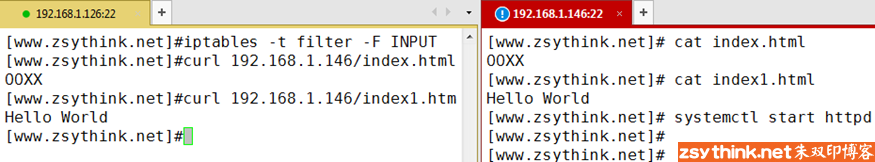

那么，我们想要达到的目的是，如果报文中包含”OOXX”字符，我们就拒绝报文进入本机，所以，我们可以在126上进行如下配置。


上图中，’-m string’表示使用string模块，’--algo bm’表示使用bm算法去匹配指定的字符串，’ --string “OOXX” ‘则表示我们想要匹配的字符串为”OOXX”

设置完上图中的规则后，由于index.html中包含”OOXX”字符串，所以，146的回应报文无法通过126的INPUT链，所以无法获取到页面对应的内容。

那么，我们来总结一下string模块的常用选项

--algo：用于指定匹配算法，可选的算法有bm与kmp，此选项为必须选项，我们不用纠结于选择哪个算法，但是我们必须指定一个。

--string：用于指定需要匹配的字符串。

### time扩展模块

我们可以通过time扩展模块，根据时间段区匹配报文，如果报文到达的时间在指定的时间范围以内，则符合匹配条件。

比如，”我想要自我约束，每天早上9点到下午6点不能看网页”，擦，多么残忍的规定，如果你想要这样定义，可以尝试使用如下规则。


上图中”-m time”表示使用time扩展模块，--timestart选项用于指定起始时间，--timestop选项用于指定结束时间。

如果你想要换一种约束方法，只有周六日不能看网页，那么可以使用如下规则。


没错，如你所见，使用--weekdays选项可以指定每个星期的具体哪一天，可以同时指定多个，用逗号隔开，除了能够数字表示”星期几”,还能用缩写表示，例如：Mon, Tue, Wed, Thu, Fri, Sat, Sun

当然，你也可以将上述几个选项结合起来使用，比如指定只有周六日的早上9点到下午6点不能浏览网页。


聪明如你一定想到了，既然有--weekdays选项了，那么有没有--monthdays选项呢？必须有啊！

使用--monthdays选项可以具体指定的每个月的哪一天，比如，如下图设置表示指明每月的22号，23号。


前文已经总结过，当一条规则中同时存在多个条件时，多个条件之间默认存在”与”的关系，所以，下图中的设置表示匹配的时间必须为星期5，并且这个”星期5″同时还需要是每个月的22号到28号之间的一天，所以，下图中的设置表示每个月的第4个星期5


除了使用--weekdays选项与--monthdays选项，还可以使用--datestart 选项与-datestop选项，指定具体的日期范围，如下。


上图中指定的日期范围为2017年12月24日到2017年12月27日

上述选项中，--monthdays与--weekdays可以使用”!”取反，其他选项不能取反。

### connlimit扩展模块

使用connlimit扩展模块，可以限制每个IP地址同时链接到server端的链接数量，注意：我们不用指定IP，其默认就是针对”每个客户端IP”，即对单IP的并发连接数限制。

比如，我们想要限制，每个IP地址最多只能占用两个ssh链接远程到server端，我们则可以进行如下限制。


上例中，使用”-m connlimit”指定使用connlimit扩展，使用”--connlimit-above 2″表示限制每个IP的链接数量上限为2，再配合-p tcp --dport 22，即表示限制每个客户端IP的ssh并发链接数量不能高于2。

centos6中，我们可以对--connlimit-above选项进行取反，没错，老规矩，使用”!”对此条件进行取反，示例如下


上例表示，每个客户端IP的ssh链接数量只要不超过两个，则允许链接。

但是聪明如你一定想到了，上例的规则并不能表示：每个客户端IP的ssh链接数量超过两个则拒绝链接（与前文中的举例原理相同，此处不再赘述，如果你不明白，请参考之前的文章）。也就是说，即使我们配置了上例中的规则，也不能达到”限制”的目的，所以我们通常并不会对此选项取反，因为既然使用了此选项，我们的目的通常就是”限制”连接数量。

centos7中iptables为我们提供了一个新的选项，--connlimit-upto，这个选项的含义与”! --commlimit-above”的含义相同，即链接数量未达到指定的连接数量之意，所以综上所述，--connlimit-upto选项也不常用。

刚才说过，--connlimit-above默认表示限制”每个IP”的链接数量，其实，我们还可以配合--connlimit-mask选项，去限制”某类网段”的链接数量，示例如下：

（注：下例需要一定的网络知识基础，如果你还不了解它们，可以选择先跳过此选项或者先去学习部分的网络知识）


上例中，”--connlimit-mask  24″表示某个C类网段，没错，mask为掩码之意，所以将24转换成点分十进制就表示255.255.255.0，所以，上图示例的规则表示，一个最多包含254个IP的C类网络中，同时最多只能有2个ssh客户端连接到当前服务器，看来资源很紧俏啊！254个IP才有2个名额，如果一个IP同时把两个连接名额都占用了，那么剩下的253个IP连一个连接名额都没有了，那么，我们再看看下例，是不是就好多了。


上例中，”--connlimit-mask  27″表示某个C类网段，通过计算后可以得知，这个网段中最多只能有30台机器（30个IP），这30个IP地址最多只能有10个ssh连接同时连接到服务器端，是不是比刚才的设置大方多了，当然，这样并不能避免某个IP占用所有连接的情况发生，假设，报文来自192.168.1.40这个IP，按照掩码为27进行计算，这个IP属于192.168.1.32/27网段，如果192.168.1.40同时占用了10个ssh连接，那么当192.168.1.51这个IP向服务端发起ssh连接请求时，同样会被拒绝，因为192.168.1.51这个IP按照掩码为27进行计算，也是属于192.168.1.32/27网段，所以他们共享这10个连接名额。

聪明如你一定明白了，在不使用--connlimit-mask的情况下，连接数量的限制是针对”每个IP”而言的，当使用了--connlimit-mask选项以后，则可以针对”某类IP段内的一定数量的IP”进行连接数量的限制，这样就能够灵活许多，不是吗？

### limit扩展模块

刚才认识了connlimit模块，现在来认识一下limit模块。

connlimit模块是对连接数量进行限制的，limit模块是对”报文到达速率”进行限制的。

用大白话说就是，如果我想要限制单位时间内流入的包的数量，就能用limit模块。

我们可以以秒为单位进行限制，也可以以分钟、小时、天作为单位进行限制。

比如，限制每秒中最多流入3个包，或者限制每分钟最多流入30个包，都可以。

那么，我们来看一个最简单的示例，假设，我们想要限制，外部主机对本机进行ping操作时，本机最多每6秒中放行一个ping包，那么，我们可以进行如下设置（注意，只进行如下设置有可能无法实现限制功能，请看完后面的内容）


上例中，”-p icmp”表示我们针对ping请求添加了一条规则（ping使用icmp协议），”-m limit”表示使用limit模块， “--limit 10/minute -j  ACCEPT”表示每分钟最多放行10个包，就相当于每6秒钟最多放行一个包，换句话说，就是每过6秒钟放行一个包，那么配置完上述规则后，我们在另外一台机器上对当前机器进行ping操作，看看是否能够达到限制的目的，如下图所示。


我们发现，刚才配置的规则并没有如我们想象中的一样，ping请求的响应速率完全没有发生任何变化，为什么呢？我们一起来分析一下。

我们再来回顾一下刚才配置的规则。


其实，我们可以把上图中的规则理解为如下含义。

每6秒放行一个包，那么iptables就会计时，每6秒一个轮次，到第6秒时，达到的报文就会匹配到对应的规则，执行对应的动作，而上图中的动作是ACCEPT。

那么在第6秒之前到达的包，则无法被上述规则匹配到。

之前总结过，报文会匹配链中的每一条规则，如果没有任何一条规则能够匹配到，则匹配默认动作（链的默认策略）。

既然第6秒之前的包没有被上述规则匹配到，而我们又没有在INPUT链中配置其他规则，所以，第6秒之前的包肯定会被默认策略匹配到，那么我们看看默认策略是什么。


现在再想想，我想你应该明白为什么刚才的ping的响应速率没有变化了。

因为，上例中，第六秒的报文的确被对应的规则匹配到了，于是执行了”放行”操作，第6秒之前的报文没有被上图中配置的规则匹配到，但是被默认策略匹配到了，而恰巧，默认动作也是ACCEPT，所以，相当于所有的ping报文都被放行了，怪不得与没有配置规则时的速率一毛一样了。

那么，知错就改，聪明如你一定想到了，我们可以修改INPUT链的默认策略，或者在上例限制规则的后面再加入一条规则，将”漏网之鱼”匹配到即可，示例如下。


如上图所示，第一条规则表示每分钟最多放行10个icmp包，也就是6秒放行一个，第6秒的icmp包会被上例中的第一条规则匹配到，第6秒之前的包则不会被第一条规则匹配到，于是被后面的拒绝规则匹配到了，那么，此刻，我们再来试试，看看ping的报文放行速率有没有发生改变。

如下图所示


刚开始还真吓我一跳，难道配置的规则还是有问题？

结果发现，只有前5个ping包没有受到限制，之后的ping包已经开始受到了规则的限制了。

从上图可以看出，除了前5个ping包以外，之后的ping包差不多每6秒才能ping通一次，看来，之后的ping包已经受到了规则的控制，被限制了流入防火墙的速率了，那么，前5个ping包是什么鬼？为什么它们不受规则限制呢？其实，这个现象正好引出另一个话题，出现上图中的情况，是因为另一个选项：”--limit-burst”

limit-burst选项是干什么用的呢？我们先用不准确的大白话描述一遍，”--limit-burst”可以指定”空闲时可放行的包的数量”，其实，这样说并不准确，但是我们可以先这样大概的理解，在不使用”--limit-burst”选项明确指定放行包的数量时，默认值为5，所以，才会出现上图中的情况，前5个ping包并没有受到任何速率限制，之后的包才受到了规则的限制。

如果想要彻底了解limit模块的工作原理，我们需要先了解一下”令牌桶”算法，因为limit模块使用了令牌桶算法。

我们可以这样想象，有一个木桶，木桶里面放了5块令牌，而且这个木桶最多也只能放下5块令牌，所有报文如果想要出关入关，都必须要持有木桶中的令牌才行，这个木桶有一个神奇的功能，就是每隔6秒钟会生成一块新的令牌，如果此时，木桶中的令牌不足5块，那么新生成的令牌就存放在木桶中，如果木桶中已经存在5块令牌，新生成的令牌就无处安放了，只能溢出木桶（令牌被丢弃），如果此时有5个报文想要入关，那么这5个报文就去木桶里找令牌，正好一人一个，于是他们5个手持令牌，快乐的入关了，此时木桶空了，再有报文想要入关，已经没有对应的令牌可以使用了，但是，过了6秒钟，新的令牌生成了，此刻，正好来了一个报文想要入关，于是，这个报文拿起这个令牌，就入关了，在这个报文之后，如果很长一段时间内没有新的报文想要入关，木桶中的令牌又会慢慢的积攒了起来，直到达到5个令牌，并且一直保持着5个令牌，直到有人需要使用这些令牌，这就是令牌桶算法的大致逻辑。

那么，就拿刚才的”令牌桶”理论类比我们的命令，”--limit”选项就是用于指定”多长时间生成一个新令牌的”，”--limit-burst”选项就是用于指定”木桶中最多存放几个令牌的”，现在，你明白了吗？？示例如下


上例表示，令牌桶中最多能存放3个令牌，每分钟生成10个令牌（即6秒钟生成一个令牌）。

之前说过，使用”--limit”选项时，可以选择的时间单位有多种，如下

/second

/minute

/hour

/day

比如，3/second表示每秒生成3个”令牌”，30/minute表示没分钟生成30个”令牌”。

我不知道我到底解释清楚没有，我感觉我解释清楚了，哥们儿你赶紧动手试试吧。

---

**iprange模块**

包含的扩展匹配条件如下

--src-range：指定连续的源地址范围

--dst-range：指定连续的目标地址范围

```
#示例

iptables -t filter -I INPUT -m iprange --src-range 192.168.1.127-192.168.1.146 -j DROP

iptables -t filter -I OUTPUT -m iprange --dst-range 192.168.1.127-192.168.1.146 -j DROP

iptables -t filter -I INPUT -m iprange ! --src-range 192.168.1.127-192.168.1.146 -j DROP
```

**string模块**

常用扩展匹配条件如下

--algo：指定对应的匹配算法，可用算法为bm、kmp，此选项为必需选项。

--string：指定需要匹配的字符串

```
#示例

iptables -t filter -I INPUT -p tcp --sport 80 -m string --algo bm --string "OOXX" -j REJECT

iptables -t filter -I INPUT -p tcp --sport 80 -m string --algo bm --string "OOXX" -j REJECT
```

**time模块**

常用扩展匹配条件如下

--timestart：用于指定时间范围的开始时间，不可取反

--timestop：用于指定时间范围的结束时间，不可取反

--weekdays：用于指定”星期几”，可取反

--monthdays：用于指定”几号”，可取反

--datestart：用于指定日期范围的开始日期，不可取反

--datestop：用于指定日期范围的结束时间，不可取反

```
#示例

iptables -t filter -I OUTPUT -p tcp --dport 80 -m time --timestart 09:00:00 --timestop 19:00:00 -j REJECT

iptables -t filter -I OUTPUT -p tcp --dport 443 -m time --timestart 09:00:00 --timestop 19:00:00 -j REJECT

iptables -t filter -I OUTPUT -p tcp --dport 80  -m time --weekdays 6,7 -j REJECT

iptables -t filter -I OUTPUT -p tcp --dport 80  -m time --monthdays 22,23 -j REJECT

iptables -t filter -I OUTPUT -p tcp --dport 80  -m time ! --monthdays 22,23 -j REJECT

iptables -t filter -I OUTPUT -p tcp --dport 80  -m time --timestart 09:00:00 --timestop 18:00:00 --weekdays 6,7 -j REJECT

iptables -t filter -I OUTPUT -p tcp --dport 80  -m time --weekdays 5 --monthdays 22,23,24,25,26,27,28 -j REJECT

iptables -t filter -I OUTPUT -p tcp --dport 80  -m time --datestart 2017-12-24 --datestop 2017-12-27 -j REJECT
```

**connlimit 模块**

常用的扩展匹配条件如下

--connlimit-above：单独使用此选项时，表示限制每个IP的链接数量。

--connlimit-mask：此选项不能单独使用，在使用--connlimit-above选项时，配合此选项，则可以针对”某类IP段内的一定数量的IP”进行连接数量的限制，如果不明白可以参考上文的详细解释。

```
#示例

iptables -I INPUT -p tcp --dport 22 -m connlimit --connlimit-above 2 -j REJECT

iptables -I INPUT -p tcp --dport 22 -m connlimit --connlimit-above 20 --connlimit-mask 24 -j REJECT

iptables -I INPUT -p tcp --dport 22 -m connlimit --connlimit-above 10 --connlimit-mask 27 -j REJECT
```

**limit模块**

常用的扩展匹配条件如下

--limit-burst：类比”令牌桶”算法，此选项用于指定令牌桶中令牌的最大数量，上文中已经详细的描述了”令牌桶”的概念，方便回顾。

--limit：类比”令牌桶”算法，此选项用于指定令牌桶中生成新令牌的频率，可用时间单位有second、minute 、hour、day。

```
#示例 #注意，如下两条规则需配合使用，具体原因上文已经解释过，忘记了可以回顾。

iptables -t filter -I INPUT -p icmp -m limit --limit-burst 3 --limit 10/minute -j ACCEPT

iptables -t filter -A INPUT -p icmp -j REJECT
```

# reference

- [iptables详解](https://www.zsythink.net/archives/category/运维相关/iptables)


