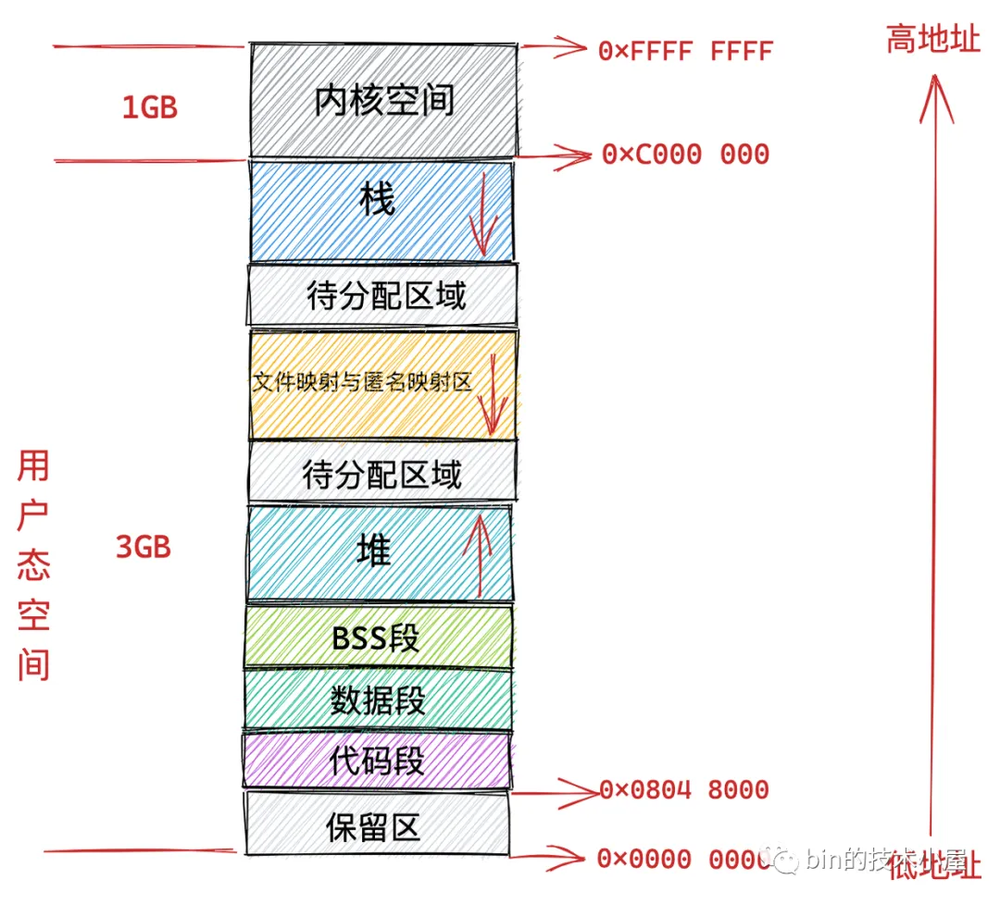
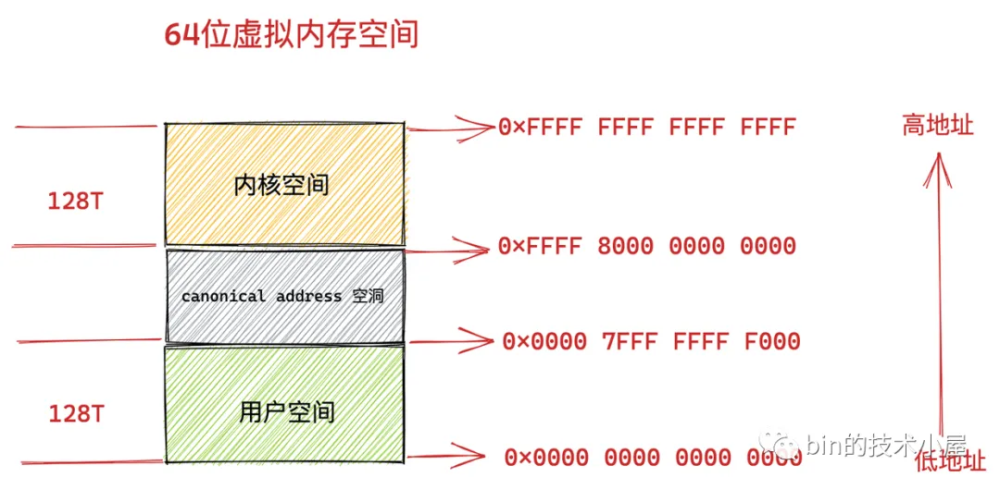
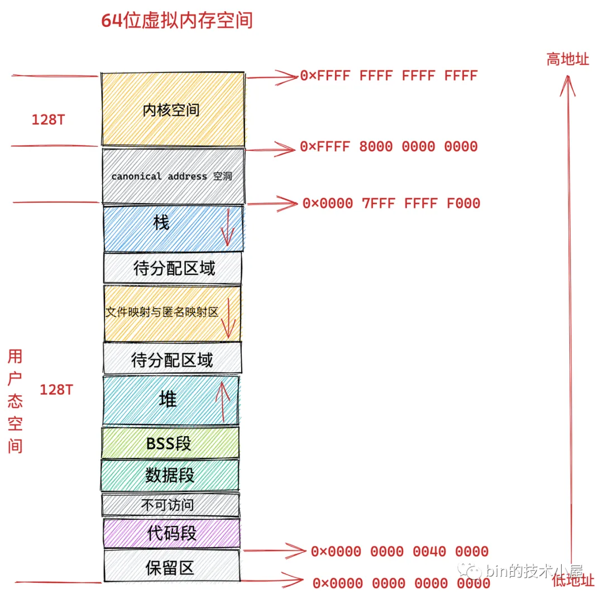

# 进程调度

Linux 内核通过 CFS（完全公平调度器）等调度算法管理进程的 CPU 时间分配，支持实时调度和普通调度两大类策略。

# 内存管理

32位:

64位:

# 网络协议栈

Linux 网络协议栈实现了从链路层到应用层的完整协议处理，包括 TCP/IP、socket 接口以及 Netfilter 框架等。

# 文件系统

Linux 通过 VFS（虚拟文件系统）提供统一的文件操作接口，支持 ext4、XFS、Btrfs 等多种文件系统实现。

# 设备通信

内核通过字符设备、块设备和网络设备三种接口抽象硬件访问，驱动程序在内核空间与硬件交互。

# 参考资料

- [《Linux内核精通》笔记](https://github.com/0voice/linux_kernel_wiki)
- [glibc内存管理](https://mp.weixin.qq.com/s/pdv5MMUQ9ACpeCpyGnxb1Q)
- [聊聊Linux 内核](https://mp.weixin.qq.com/mp/appmsgalbum?__biz=Mzg2MzU3Mjc3Ng==&action=getalbum&album_id=2559805446807928833&scene=173&from_msgid=&from_itemidx=&count=3&nolastread=1#wechat_redirect)
- [ebpf](https://github.com/ebpf-io/ebpf.io-website)

