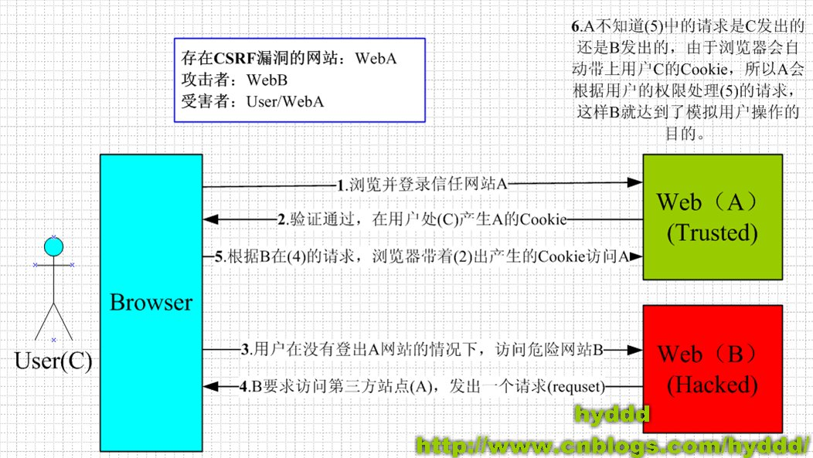

# 引入：CSRF 攻击

## CSRF 是什么？

- CSRF(cross-site request forgery)
  - 中文名称：`跨站请求伪造`，
  - 也被称为：`one click attack/session riding`(很形象)
  - 缩写为 `CSRF/XSRF`;

```
CSRF这种攻击方式在2000年已经被国外的安全人员提出，但在国内，直到06年才开始被关注，
08年，国内外的多个大型社区和交互网站分别爆出CSRF漏洞，
如：NYTimes.com（纽约时报）、Metafilter（一个大型的BLOG网站），YouTube和百度HI......而现在，
互联网上的许多站点仍对此毫无防备，以至于安全业界称CSRF为“沉睡的巨人”。
```

## CSRF 可以做什么？

- 你可以这么理解`CSRF`:`攻击者盗用了你的身份,以你的名义发送恶意请求`。`CSRF`能够做的事情包括：
  - 以你的名义发送邮件，发消息
  - 盗取你的账号
  - 购买商品
  - 虚拟货币转账

## CSRF 原理



- 从图中我们可以看到，要完成一次`CSRF`攻击，受害者必须一次完成两个步骤

  - **1.登陆受信任网站 A，并在本地生成 cookie**
  - **2.在不退出 A 的情况下，访问了危险网站 B**

- `如果不满足以上条件的中的任何一个，就不会受到攻击`。但是我们平时无法保证以下情况:
  - 1.你不能保证你登陆了一个网站后，不再打开一个 tab 页面并访问另外的网站。
  - 2.你不能保证你关闭浏览器后，你本地的 cookie 马上过期，你上次的会话已经结束
  - 3.上图中所谓的攻击网站，可能是一个存在其他漏洞的可信任的经常被人访问的网站。

## 几种常见的攻击类型

## 特点

## CSRF 的防御

跨域请求：CORS

### 同源策略

### CSRF token

### 双重 Cookie 验证

### SameSite Cookie 属性

## 其他防范策略

# 历史案例

### WordPress 的 CSRF 漏洞

### YouTube 的 CSRF 漏洞

# 参考

- [浅谈 CSRF 攻击方式](https://www.cnblogs.com/hyddd/archive/2009/04/09/1432744.html?login=1)
- [MDN 文档-跨资源共享(CORS)](https://developer.mozilla.org/zh-CN/docs/Web/HTTP/CORS)
- [前端安全系列（二）：如何防止 CSRF 攻击？](https://tech.meituan.com/2018/10/11/fe-security-csrf.html)
