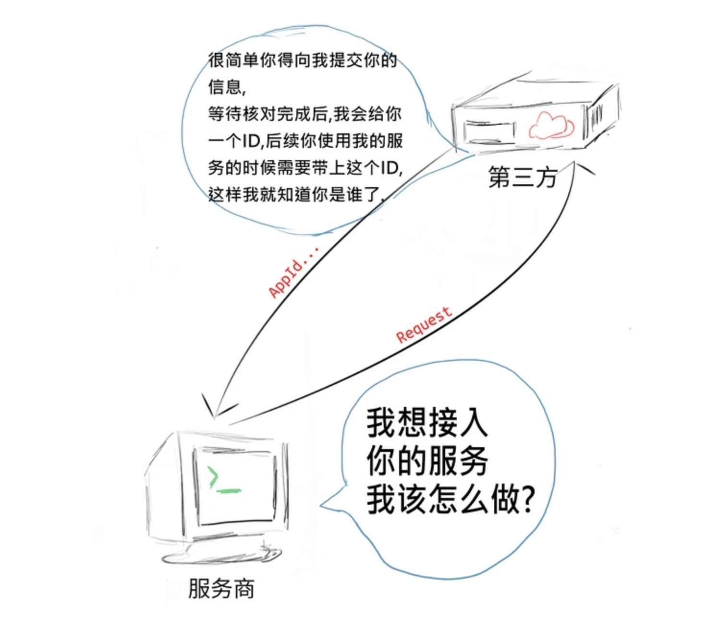
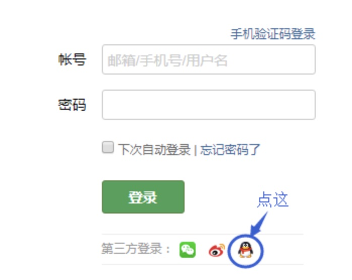
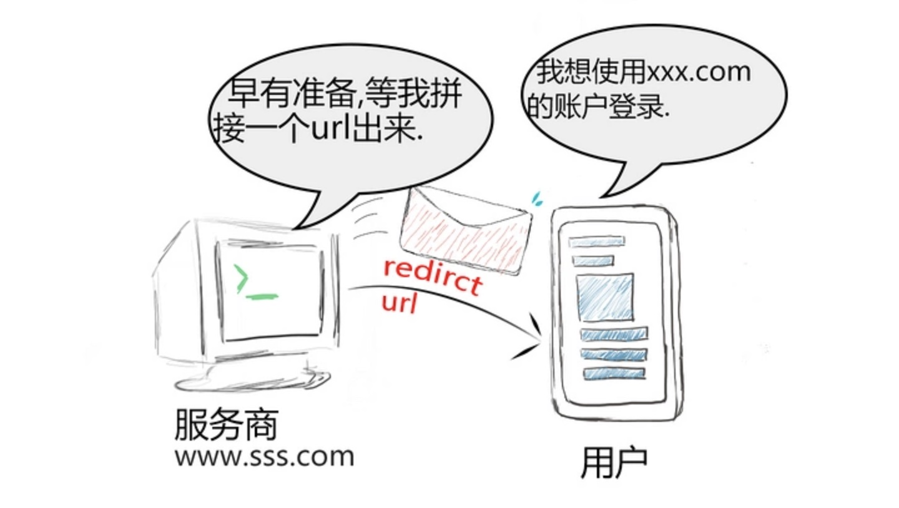
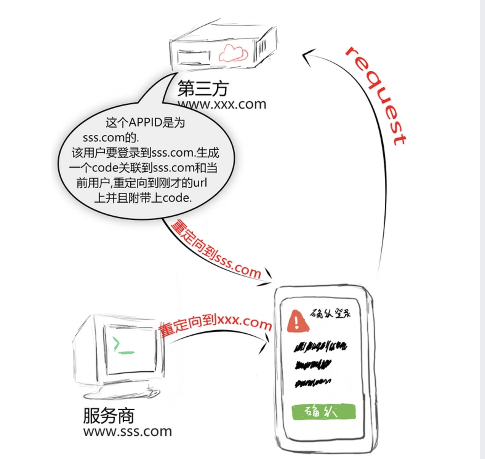
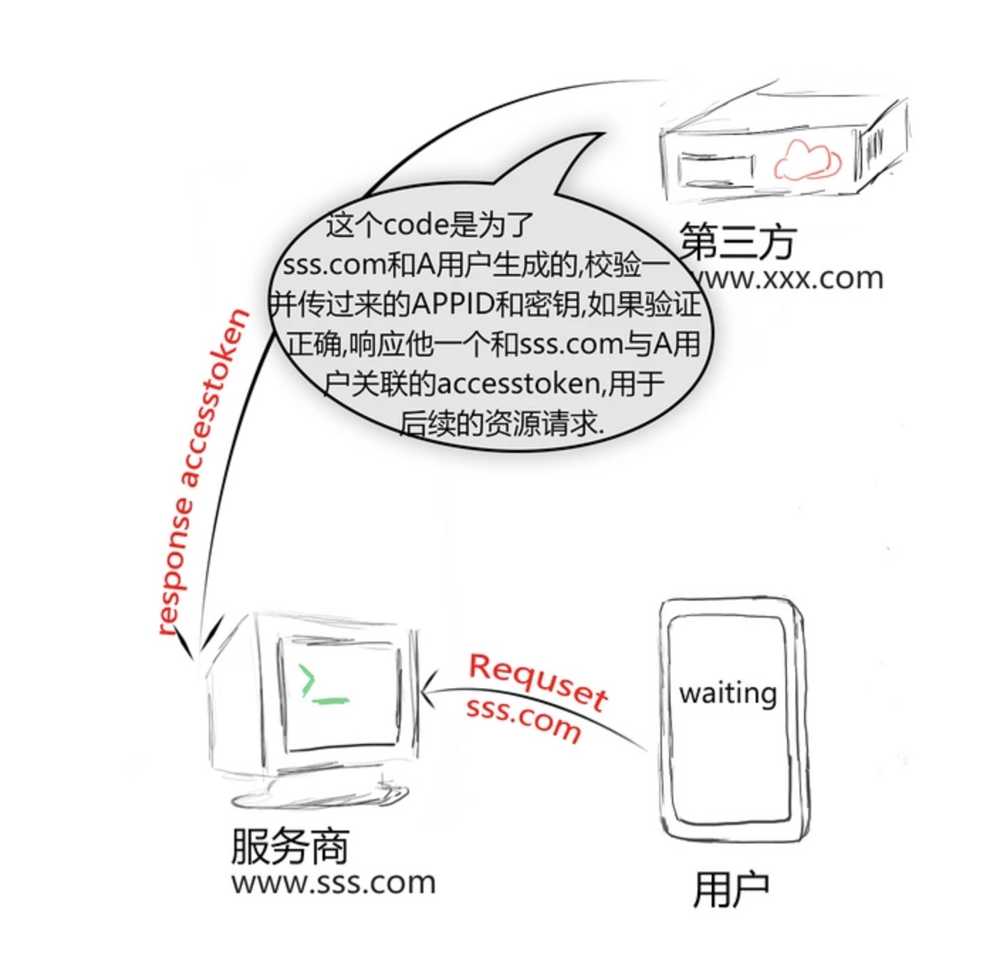
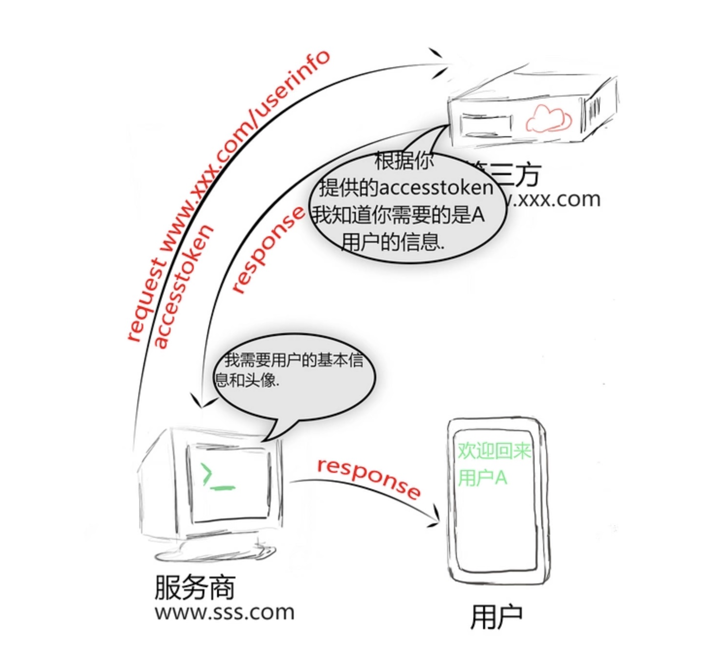

# 1. 说明

`概念`：OAuth（开放授权）是一个开放标准，允许用户让第三方应用访问该用户在某一网站上存储的私密的资源（如基本消息，照片，联系人列表），

而无需将 **用户名** 和 **密码** 提供给第三方应用。

# 2. 应用场景

- 背景：现在一般登陆都会采用 **第三方授权** 登陆，比较常见就是微信、qq、微博授权登陆。

- 例子：这里以微信授权登陆为例
  - 现在我在未注册的情况下去访问`A网站`,
  - **A网站** 为了提高用户体验，可以省去你在这次网站申请注册的步骤，让你通过`微信`授权登陆去拿去你在微信上的基本信息。

- 问题:
  > 如果拿到`微信用户`基本信息给到**A网站**，直接给**A网站**我登陆微信的账号密码，后果会十分严重
  - 这个也太不安全了，我只想给A网站我的在微信上的基本信息，而不是所有信息，通过用户密码可以获取我的所有信息。
  - 用户只有修改密码，才能收回赋予"A网站"的权力。但是这样做，会使得其他所有获得用户授权的第三方应用程序全部失效。
  - 只要有一个第三方应用程序被破解，就会导致用户密码泄漏，以及所有被密码保护的数据泄漏。

- OAuth作用：**OAuth就是为了解决上面这些问题而诞生的。**

- 三个身份：
  - 用户:
    - 准备登录一个新网站的用户
  - 服务商(A网站)
    - 用户将使用第三方账户登录这个网站
    - 对于用户来说就不需要走复杂的注册流程。
  - 第三方平台（微信）:
    - 上面来讲 **微信** 就是第三方平台
    - 为了保证安全：
      - 就在A网站在通过微信授权登陆之前，需要提供资质到微信
      - 微信审核,审核通过后给要求接入的服务商一个**唯一凭证**,标明服务商身份。
      - (也就是进行服务商的注册)


- 目的： **我们要做的就是将这两者进行连接起来，先到第三方平台资质审核，审核通过后，用户去第三方平台授权登录后，就可以获取用户基本信息，完成登陆。**

# 3. OAuth的思路

## 3.1. 说明

> 这里还是以 `服务商(A网站)`，和 `第三方平台（微信）`授权登录来缕这个思路。

- OAuth在 **服务商(A网站)** 与 **第三方平台(微信)** 之间，设置了一个授权层（authorization layer）。
  - **服务商** 不能直接登录 **第三方平台**，只能登录授权层，以此将用户与服务商(A网站)区分开来。
  - **服务商(A网站)** 登录授权层所用的`令牌`（token），与用户的密码不同。用户可以在登录的时候，指定授权层令牌的权限范围和有效期。

- **服务商(A网站)** 登录授权层以后，**第三方平台** 根据令牌的权限范围和有效期，向 **服务商(A网站)** 开放用户储存的资料。

## 3.2. 接入前准备（资质审核）

- 如果一个服务商需要使用第三方平台的服务，那么首先是需要**向第三方平台提供资料**
- **第三方平台审核通过**后，会给服务商一个唯一标识的ID,这样通过第三方平台授权的时候，第三方平台就知道是哪个商户了。
  > 这个部分每家平台都不一样,具体如何获取你的APPID请参考对应平台的指南.
  ```
  appid 代表你的应用唯一ID
  appsecret 对应的密钥
  ```
  > 

- **注意**: 第三方平台给的不一定都是是APPID这个名称，而且有的给的多，有的给的少，不过都是用来验证身份的。

## 3.3. 用户要使用第三方登陆


- 在这个流程中服务器(A网站)接受到了用户想要第三方登录的请求,我们使用之前获取的APPID(不同平台叫法和参数可能不同),然后拼接为成第三方平台指定的url
  > 
  ```html
  www.xxx.com/oauth2.0/authorize?appid=123456&redirect=www.sss.com/login
  ```
- 然后直接重定向到这个url.
  > 
  ```
  # 参数
  appid 我们的应用对于第三方平台的唯一id
  redirect 用户同意授权后被重定向的地址,一般来说都是本应用的首页或者登录页面,在本例中就是www.sss.com/login这个地址.
  其他参数 根据第三方平会有不同的额外参数.
  ```
- 然后将用户重定向到这个url中,此时用户会跳转到www.xxx.com(因为如果用户授权成功，你总要回调服务商接口，来告诉它，已经授权成功).

## 3.4. 用户授权成功

- 用户授权成功后，微信就会请求上面redirect参数中的接口地址，带上授权成功的参数code
  > 
  ```html
  www.sss.com/login?code=xxxxx
  ```

## 3.5. 获取用户token(令牌)

- 此时我们的`www.sss.com/login`接受到了一个含有code的请求,我们知道这个是一个第三方登录授权后的请求.
- 我们再次拼接一个url(不同平台地址规则不同),但是一般来说这个请求会有如下的参数:
  ```
  code 用户授权后重定向带回来的code
  appid 应用唯一id
  appsecret 应用对应的密钥
  ```
- 在这个例子中我们请求服务器的url可能是这个样子的:
  ```html
  www.xxx.com/oauth2/access_token?appid=xxxx&secert=xxxx&code=xxxx
  ```
  > 

- 除此以外你还会获取到用户的基本信息例如用户的唯一id之类的，后续的请求用户的信息需要使用accesstoken进行请求。

## 3.6. 获取用户基本信息

- 利用accesstoken我们向服务器获取了用户的名字,显示在了我们的应用中, 后续的资源获取就是这个模式(不同平台资源获取地址以及方式有可能稍有不同).
  > 

## 3.7. 补充

- 微信认证成功后，我会会把accesstoken存放在`cookie`中，这样不用每次都需要用户去授权认证，而是我们后台去请问微信，这个时候用户是不会感知的。
- accesstoken不是一直有效的，它会有过期时间的，就好比微信扫码登陆中accesstoken有效时间是2小时。
- 那么accesstoken时效，是不是就要用户重新授权登陆了，当然也不是，如果没2小时都要重新授权登陆那体验也太差了。这里会有个叫`refresh_token`，
  - 它是在你第一次获取accesstoken一起给你的,也就是说如果你的accesstoken时效了，你还可以通过refresh_token去获取用户信息。
  - 这么说refresh_token的时效时间肯定要比accesstoken长，微信扫码登陆refresh_token有效时间是30天
- 也就是当refresh_token也失效的时候，才会需要用户重新授权登陆。

具体的可以看看微信扫码登陆的官方文档：[网站应用微信登录开发指南](https://developers.weixin.qq.com/doc/oplatform/Website_App/WeChat_Login/Wechat_Login.html)
