<!-
```bash
cat -n ansi_common_lisp.md | grep '```' | awk 'NR%2{print $1}' | xargs -I {} sed -i '{}s/```/```lisp/g' ansi_common_lisp.md
```
-->

# 第一章：简介

[约翰麦卡锡](http://zh.wikipedia.org/zh-cn/约翰·麦卡锡)和他的学生于 1958 年展开 Lisp 的初次实现工作。 Lisp 是继 FORTRAN 之后，仍在使用的最古老的程序语言。 [λ](http://acl.readthedocs.org/en/latest/zhCN/notes-cn.html#notes-1) 更值得注意的是，它仍走在程序语言技术的最前面。懂 Lisp 的程序员会告诉你，有某种东西使 Lisp 与众不同。

Lisp 与众不同的部分原因是，它被设计成能够自己进化。你能用 Lisp 定义新的 Lisp 操作符。当新的抽象概念风行时（如面向对象程序设计），我们总是发现这些新概念在 Lisp 是最容易来实现的。Lisp 就像生物的 DNA 一样，这样的语言永远不会过时。

## 1.1 新的工具 (New Tools)

为什么要学 Lisp？因为它让你能做一些其它语言做不到的事情。如果你只想写一个函数来返回小于 `n` 的数字总和，那么用 Lisp 和 C 是差不多的：

```lisp
; Lisp                   /* C */
(defun sum (n)           int sum(int n){
  (let ((s 0))             int i, s = 0;
    (dotimes (i n s)       for(i = 0; i < n; i++)
      (incf s i))))          s += i;
                            return(s);
                          }
```

如果你只想做这种简单的事情，那用什么语言都不重要。假设你想写一个函数，输入一个数 `n` ，返回把 `n` 与传入参数 (argument)相加的函数。

```lisp
; Lisp
(defun addn (n)
  #'(lambda (x)
      (+ x n)))
```

在 C 语言中 `addn` 怎么实现？你根本写不出来。

你可能会想，谁会想做这样的事情？程序语言教你不要做它们没有提供的事情。你得针对每个程序语言，用其特定的思维来写程序，而且想得到你所不能描述的东西是很困难的。当我刚开始编程时 ── 用 Baisc ── 我不知道什么是递归，因为我根本不知道有这个东西。我是用 Basic 在思考。我只能用迭代的概念表达算法，所以我怎么会知道递归呢？

如果你没听过[词法闭包 「Lexical Closure」](http://zh.wikipedia.org/zh-cn/闭包_(计算机科学)) (上述 `addn` 的范例)，相信我， Lisp 程序员一直在使用它。很难找到任何长度的 Common Lisp 程序，没有用到闭包的好处。在 112 页前，你自己会持续使用它。

闭包仅是其中一个我们在别的语言找不到的抽象概念之一。另一个更有价值的 Lisp 特点是， Lisp 程序是用 Lisp 的数据结构来表示。这表示你可以写出会写程序的程序。人们真的需要这个吗？没错 ── 它们叫做宏，有经验的程序员也一直在使用它。学到 173 页你就可以自己写出自己的宏了。

有了宏、闭包以及运行期类型，Lisp 凌驾在面向对象程序设计之上。如果你了解上面那句话，也许你不应该阅读此书。你得充分了解 Lisp 才能明白为什么此言不虚。但这不是空泛之言。这是一个重要的论点，并且在 17 章用程序相当明确的证明了这点。

第二章到第十三章会循序渐进地介绍所有你需要理解第 17 章程序的概念。你的努力会有所回报：你会感到在 C++ 编程是窒碍难行的，就像有经验的 C++ 程序员用 Basic 编程会感到窒息一样。更加鼓舞人心的是，如果我们思考为什么会有这种感觉。 编写 Basic 对于平常用 C++ 编程是令人感到窒息的，是因为有经验的 C++ 程序员知道一些用 Basic 不可能表达出来的技术。同样地，学习 Lisp 不仅教你学会一门新的语言 ── 它教你崭新的并且更强大的程序思考方法。

## 1.2 新的技术 (New Techniques)

如上一节所提到的， Lisp 赋予你别的语言所没有的工具。不仅仅如此，就 Lisp 带来的新特性来说 ── 自动内存管理 (automatic memory management)，显式类型 (manifest typing)，闭包 (closures)等 ── 每一项都使得编程变得如此简单。结合起来，它们组成了一个关键的部分，使得一种新的编程方式是有可能的。

Lisp 被设计成可扩展的：让你定义自己的操作符。这是可能的，因为 Lisp 是由和你程序一样的函数与宏所构成的。所以扩展 Lisp 就和写一个 Lisp 程序一样简单。事实上，它是如此的容易（和有用），以至于扩展语言自身成了标准实践。当你在用 Lisp 语言編程时，你也在创造一个适合你的程序的语言。你由下而上地，也由上而下地工作。

几乎所有的程序，都可以从订作适合自己所需的语言中受益。然而越复杂的程序，由下而上的程序设计就显得越有价值。一个由下而上所设计出来的程序，可写成一系列的层，每层担任上一层的程序语言。 [TeX](http://en.wikipedia.org/wiki/TeX) 是最早使用这种方法所写的程序之一。你可以用任何语言由下而上地设计程序，但 Lisp 是本质上最适合这种方法的工具。

由下而上的编程方法，自然发展出可扩展的软件。如果你把由下而上的程序设计的原则，想成你程序的最上层，那这层就成为使用者的程序语言。正因可扩展的思想深植于 Lisp 当中，使得 Lisp 成为实现可扩展软件的理想语言。三个 1980 年代最成功的程序提供 Lisp 作为扩展自身的语言: [GNU Emacs](http://www.gnu.org/software/emacs/) ， [Autocad](http://www.autodesk.com.tw/adsk/servlet/pc/index?siteID=1170616&id=14977606) ，和 [Interleaf](http://en.wikipedia.org/wiki/Interleaf) 。

由下而上的编程方法，也是得到可重用软件的最好方法。写可重用软件的本质是把共同的地方从细节中分离出来，而由下而上的编程方法本质地创造这种分离。与其努力撰写一个庞大的应用，不如努力创造一个语言，用相对小的努力在这语言上撰写你的应用。和应用相关的特性集中在最上层，以下的层可以组成一个适合这种应用的语言 ── 还有什么比程序语言更具可重用性的呢？

Lisp 让你不仅编写出更复杂的程序，而且写的更快。 Lisp 程序通常很简短 ── Lisp 给了你更高的抽象化，所以你不用写太多代码。就像 [Frederick Brooks](http://en.wikipedia.org/wiki/Fred_Brooks) 所指出的，编程所花的时间主要取决于程序的长度。因此仅仅根据这个单独的事实，就可以推断出用 Lisp 编程所花的时间较少。这种效果被 Lisp 的动态特点放大了：在 Lisp 中，编辑-编译-测试循环短到使编程像是即时的。

更高的抽象化与互动的环境，能改变各个机构开发软件的方式。术语*快速建型*描述了一种始于 Lisp 的编程方法：在 Lisp 里，你可以用比写规格说明更短的时间，写一个原型出来，而这种原型是高度抽象化的，可作为一个比用英语所写的更好的规格说明。而且 Lisp 让你可以轻易的从原型转成产品软件。当写一个考虑到速度的 Common Lisp 程序时，通过现代编译器的编译，Lisp 与其他的高阶语言所写的程序运行得一样快。

除非你相当熟悉 Lisp ，这个简介像是无意义的言论和冠冕堂皇的声明。*Lisp 凌驾面向对象程序设计？* *你创造适合你程序的语言？* *Lisp 编程是即时的？* 这些说法是什么意思？现在这些说法就像是枯竭的湖泊。随着你学到更多实际的 Lisp 特色，见过更多可运行的程序，这些说法就会被实际经验之水所充满，而有了明确的形状。

## 1.3 新的方法 (New Approach)

本书的目标之一是不仅是教授 Lisp 语言，而是教授一种新的编程方法，这种方法因为有了 Lisp 而有可能实现。这是一种你在未来会见得更多的方法。随着开发环境变得更强大，程序语言变得更抽象， Lisp 的编程风格正逐渐取代旧的*规划-然后-实现* (*plan-and-implement*)的模式。

在旧的模式中，错误永远不应该出现。事前辛苦订出缜密的规格说明，确保程序完美的运行。理论上听起来不错。不幸地，规格说明是人写的，也是人来实现的。实际上结果是， *规划-然后-实现* 模型不太有效。

身为 OS/360 的项目经理， [Frederick Brooks](http://en.wikipedia.org/wiki/Fred_Brooks) 非常熟悉这种传统的模式。他也非常熟悉它的后果：

> 任何 OS/360 的用户很快的意识到它应该做得更好...再者，产品推迟，用了更多的内存，成本是估计的好几倍，效能一直不好，直到第一版后的好几个版本更新，效能才算还可以。

而这却描述了那个时代最成功系统之一。

旧模式的问题是它忽略了人的局限性。在旧模式中，你打赌规格说明不会有严重的缺失，实现它们不过是把规格转成代码的简单事情。经验显示这实在是非常坏的赌注。打赌规格说明是误导的，程序到处都是臭虫 (bug) 会更保险一点。

这其实就是新的编程模式所假设的。设法尽量降低错误的成本，而不是希望人们不犯错。错误的成本是修补它所花费的时间。使用强大的语言跟好的开发环境，这种成本会大幅地降低。编程风格可以更多地依靠探索，较少地依靠事前规划。

规划是一种必要之恶。它是评估风险的指标：越是危险，预先规划就显得更重要。强大的工具降低了风险，也降低了规划的需求。程序的设计可以从最有用的信息来源中受益：过去实作程序的经验。

Lisp 风格从 1960 年代一直朝着这个方向演进。你在 Lisp 中可以如此快速地写出原型，以致于你已历经好几个设计和实现的循环，而在旧的模式当中，你可能才刚写完规格说明。你不必担心设计的缺失，因为你将更快地发现它们。你也不用担心有那么多臭虫。当你用函数式风格来编程，你的臭虫只有局部的影响。当你使用一种很抽象的语言，某些臭虫(如[迷途指针](http://zh.wikipedia.org/zh-cn/迷途指针))不再可能发生，而剩下的臭虫很容易找出，因为你的程序更短了。当你有一个互动的开发环境，你可以即时修补臭虫，不必经历 编辑，编译，测试的漫长过程。

Lisp 风格会这么演进是因为它产生的结果。听起来很奇怪，少的规划意味着更好的设计。技术史上相似的例子不胜枚举。一个相似的变革发生在十五世纪的绘画圈里。在油画流行前，画家使用一种叫做[蛋彩](http://zh.wikipedia.org/zh-cn/蛋彩畫)的材料来作画。蛋彩不能被混和或涂掉。犯错的代价非常高，也使得画家变得保守。后来随着油画颜料的出现，作画风格有了大幅地改变。油画“允许你再来一次”这对困难主题的处理，像是画人体，提供了决定性的有利条件。

新的材料不仅使画家更容易作画了。它使新的更大胆的作画方式成为可能。 Janson 写道：

> 如果没有油画颜料，弗拉芒大师们的征服可见的现实的口号就会大打折扣。于是，从技术的角度来说，也是如此，但他们当之无愧地称得上是“现代绘画之父”，油画颜料从此以后成为画家的基本颜料。

做为一种介质，蛋彩与油画颜料一样美丽。但油画颜料的弹性给想像力更大的发挥空间 ── 这是决定性的因素。

程序设计正经历着相同的改变。新的介质像是“动态的面向对象语言” ── 即 Lisp 。这不是说我们所有的软件在几年内都要用 Lisp 来写。从蛋彩到油画的转变也不是一夜完成的；油彩一开始只在领先的艺术中心流行，而且经常混合着蛋彩来使用。我们现在似乎正处于这个阶段。 Lisp 被大学，研究室和某些顶尖的公司所使用。同时，从 Lisp 借鉴的思想越来越多地出现在主流语言中：交互式编程环境 (interactive programming environment)、[垃圾回收(garbage collection)](http://zh.wikipedia.org/zh-cn/垃圾回收_(計算機科學))、运行期类型 (run-time typing)，仅举其中几个。

强大的工具正降低探索的风险。这对程序员来说是好消息，因为意味者我们可以从事更有野心的项目。油画的确有这个效果。采用油画后的时期正是绘画的黄金时期。类似的迹象正在程序设计的领域中发生


# 第二章：欢迎来到 Lisp

本章的目的是让你尽快开始编程。本章结束时，你会掌握足够多的 Common Lisp 知识来开始写程序。

## 2.1 形式 (Form)

人可以通过实践来学习一件事，这对于 Lisp 来说特别有效，因为 Lisp 是一门交互式的语言。任何 Lisp 系统都含有一个交互式的前端，叫做*顶层*(toplevel)。你在顶层输入 Lisp 表达式，而系统会显示它们的值。

Lisp 通常会打印一个提示符告诉你，它正在等待你的输入。许多 Common Lisp 的实现用 `>` 作为顶层提示符。本书也沿用这个符号。

一个最简单的 Lisp 表达式是整数。如果我们在提示符后面输入 `1` ，

```lisp
> 1
1
>
```

系统会打印出它的值，接着打印出另一个提示符，告诉你它在等待更多的输入。

在这个情况里，打印的值与输入的值相同。数字 `1` 称之为对自身求值。当我们输入需要做某些计算来求值的表达式时，生活变得更加有趣了。举例来说，如果我们想把两个数相加，我们输入像是：

```lisp
> (+ 2 3)
5
```

在表达式 `(+ 2 3)` 里， `+` 称为操作符，而数字 `2` 跟 `3` 称为实参。

在日常生活中，我们会把表达式写作 `2 + 3` ，但在 Lisp 里，我们把 `+` 操作符写在前面，接着写实参，再把整个表达式用一对括号包起来： `(+ 2 3)` 。这称为*前序*表达式。一开始可能觉得这样写表达式有点怪，但事实上这种表示法是 Lisp 最美妙的东西之一。

举例来说，我们想把三个数加起来，用日常生活的表示法，要写两次 `+` 号，

```lisp
2 + 3 + 4
```

而在 Lisp 里，只需要增加一个实参：

```lisp
(+ 2 3 4)
```

日常生活中用 `+` 时，它必须有两个实参，一个在左，一个在右。前序表示法的灵活性代表着，在 Lisp 里， `+` 可以接受任意数量的实参，包含了没有实参：

```lisp
> (+)
0
> (+ 2)
2
> (+ 2 3)
5
> (+ 2 3 4)
9
> (+ 2 3 4 5)
14
```

由于操作符可接受不定数量的实参，我们需要用括号来标明表达式的开始与结束。

表达式可以嵌套。即表达式里的实参，可以是另一个复杂的表达式：

```lisp
> (/ (- 7 1) (- 4 2))
3
```

上面的表达式用中文来说是， (七减一) 除以 (四减二) 。

Lisp 表示法另一个美丽的地方是：它就是如此简单。所有的 Lisp 表达式，要么是 `1` 这样的数原子，要么是包在括号里，由零个或多个表达式所构成的列表。以下是合法的 Lisp 表达式：

```lisp
2 (+ 2 3) (+ 2 3 4) (/ (- 7 1) (- 4 2))
```

稍后我们将理解到，所有的 Lisp 程序都采用这种形式。而像是 C 这种语言，有着更复杂的语法：算术表达式采用中序表示法；函数调用采用某种前序表示法，实参用逗号隔开；表达式用分号隔开；而一段程序用大括号隔开。

在 Lisp 里，我们用单一的表示法，来表达所有的概念。

## 2.2 求值 (Evaluation)

上一小节中，我们在顶层输入表达式，然后 Lisp 显示它们的值。在这节里我们深入理解一下表达式是如何被求值的。

在 Lisp 里， `+` 是函数，然而如 `(+ 2 3)` 的表达式，是函数调用。

当 Lisp 对函数调用求值时，它做下列两个步骤：

> 1. 首先从左至右对实参求值。在这个例子当中，实参对自身求值，所以实参的值分别是 `2` 跟 `3` 。
> 2. 实参的值传入以操作符命名的函数。在这个例子当中，将 `2` 跟 `3` 传给 `+` 函数，返回 `5` 。

如果实参本身是函数调用的话，上述规则同样适用。以下是当 `(/ (- 7 1) (- 4 2))` 表达式被求值时的情形：

> 1. Lisp 对 `(- 7 1)` 求值: `7` 求值为 `7` ， `1` 求值为 `1` ，它们被传给函数 `-` ，返回 `6` 。
> 2. Lisp 对 `(- 4 2)` 求值: `4` 求值为 `4` ， `2` 求值为 `2` ，它们被传给函数 `-` ，返回 `2` 。
> 3. 数值 `6` 与 `2` 被传入函数 `/` ，返回 `3` 。

但不是所有的 Common Lisp 操作符都是函数，不过大部分是。函数调用都是这么求值。由左至右对实参求值，将它们的数值传入函数，来返回整个表达式的值。这称为 Common Lisp 的求值规则。

逃离麻烦

如果你试着输入 Lisp 不能理解的东西，它会打印一个错误讯息，接着带你到一种叫做*中断循环*（break loop）的顶层。 中断循环给予有经验的程序员一个机会，来找出错误的原因，不过最初你只会想知道如何从中断循环中跳出。 如何返回顶层取决于你所使用的 Common Lisp 实现。在这个假定的实现环境中，输入 `:abort` 跳出：

```lisp
> (/ 1 0)
Error: Division by zero
      Options: :abort, :backtrace
>> :abort
>
```

附录 A 演示了如何调试 Lisp 程序，并给出一些常见的错误例子。

一个不遵守 Common Lisp 求值规则的操作符是 `quote` 。 `quote` 是一个特殊的操作符，意味着它自己有一套特别的求值规则。这个规则就是：什么也不做。 `quote` 操作符接受一个实参，并完封不动地返回它。

```lisp
> (quote (+ 3 5))
(+ 3 5)
```

为了方便起见，Common Lisp 定义 `'` 作为 `quote` 的缩写。你可以在任何的表达式前，贴上一个 `'` ，与调用 `quote` 是同样的效果：

```lisp
> '(+ 3 5)
(+ 3 5)
```

使用缩写 `'` 比使用整个 `quote` 表达式更常见。

Lisp 提供 `quote` 作为一种*保护*表达式不被求值的方式。下一节将解释为什么这种保护很有用。

## 2.3 数据 (Data)

Lisp 提供了所有在其他语言找的到的，以及其他语言所找不到的数据类型。一个我们已经使用过的类型是*整数*（integer），整数用一系列的数字来表示，比如： `256` 。另一个 Common Lisp 与多数语言有关，并很常见的数据类型是*字符串*（string），字符串用一系列被双引号包住的字符串表示，比如： `"ora et labora"` [[3\]](https://acl.readthedocs.io/en/latest/zhCN/ch2-cn.html#id2) 。整数与字符串一样，都是对自身求值的。

| [[3\]](https://acl.readthedocs.io/en/latest/zhCN/ch2-cn.html#id1) | “ora et labora” 是拉丁文，意思是祷告与工作。 |
| ------------------------------------------------------------ | -------------------------------------------- |
|                                                              |                                              |

有两个通常在别的语言所找不到的 Lisp 数据类型是*符号*（symbol）与*列表*（lists），*符号*是英语的单词 (words)。无论你怎么输入，通常会被转换为大写：

```lisp
> 'Artichoke
ARTICHOKE
```

符号（通常）不对自身求值，所以要是想引用符号，应该像上例那样用 `'` 引用它。

*列表*是由被括号包住的零个或多个元素来表示。元素可以是任何类型，包含列表本身。使用列表必须要引用，不然 Lisp 会以为这是个函数调用：

```lisp
> '(my 3 "Sons")
(MY 3 "Sons")
> '(the list (a b c) has 3 elements)
(THE LIST (A B C) HAS 3 ELEMENTS)
```

注意引号保护了整个表达式（包含内部的子表达式）被求值。

你可以调用 `list` 来创建列表。由于 `list` 是函数，所以它的实参会被求值。这里我们看一个在函数 `list` 调用里面，调用 `+` 函数的例子：

```lisp
> (list 'my (+ 2 1) "Sons")
(MY 3 "Sons")
```

我们现在来到领悟 Lisp 最卓越特性的地方之一。*Lisp的程序是用列表来表示的*。如果实参的优雅与弹性不能说服你 Lisp 表示法是无价的工具，这里应该能使你信服。这代表着 Lisp 程序可以写出 Lisp 代码。 Lisp 程序员可以（并且经常）写出能为自己写程序的程序。

不过得到第 10 章，我们才来考虑这种程序，但现在了解到列表和表达式的关系是非常重要的，而不是被它们搞混。这也就是为什么我们需要 `quote` 。如果一个列表被引用了，则求值规则对列表自身来求值；如果没有被引用，则列表被视为是代码，依求值规则对列表求值后，返回它的值。

```lisp
> (list '(+ 2 1) (+ 2 1))
((+ 2 1) 3)
```

这里第一个实参被引用了，所以产生一个列表。第二个实参没有被引用，视为函数调用，经求值后得到一个数字。

在 Common Lisp 里有两种方法来表示空列表。你可以用一对不包括任何东西的括号来表示，或用符号 `nil` 来表示空表。你用哪种表示法来表示空表都没关系，但它们都会被显示为 `nil` ：

```lisp
> ()
NIL
> nil
NIL
```

你不需要引用 `nil` （但引用也无妨），因为 `nil` 是对自身求值的。

## 2.4 列表操作 (List Operations)

用函数 `cons` 来构造列表。如果传入的第二个实参是列表，则返回由两个实参所构成的新列表，新列表为第一个实参加上第二个实参：

```lisp
> (cons 'a '(b c d))
(A B C D)
```

可以通过把新元素建立在空表之上，来构造一个新列表。上一节所看到的函数 `list` ，不过就是一个把几个元素加到 `nil` 上的快捷方式：

```lisp
> (cons 'a (cons 'b nil))
(A B)
> (list 'a 'b)
(A B)
```

取出列表元素的基本函数是 `car` 和 `cdr` 。对列表取 `car` 返回第一个元素，而对列表取 `cdr` 返回第一个元素之后的所有元素：

```lisp
> (car '(a b c))
A
> (cdr '(a b c))
(B C)
```

你可以把 `car` 与 `cdr` 混合使用来取得列表中的任何元素。如果我们想要取得第三个元素，我们可以：

```lisp
> (car (cdr (cdr '(a b c d))))
C
```

不过，你可以用更简单的 `third` 来做到同样的事情：

```lisp
> (third '(a b c d))
C
```

## 2.5 真与假 (Truth)

在 Common Lisp 里，符号 `t` 是表示逻辑 `真` 的缺省值。与 `nil` 相同， `t` 也是对自身求值的。如果实参是一个列表，则函数 `listp` 返回 `真` ：

```lisp
> (listp '(a b c))
T
```

函数的返回值将会被解释成逻辑 `真` 或逻辑 `假` 时，则称此函数为谓词（*predicate*）。在 Common Lisp 里，谓词的名字通常以 `p` 结尾。

逻辑 `假` 在 Common Lisp 里，用 `nil` ，即空表来表示。如果我们传给 `listp` 的实参不是列表，则返回 `nil` 。

```lisp
> (listp 27)
NIL
```

由于 `nil` 在 Common Lisp 里扮演两个角色，如果实参是一个空表，则函数 `null` 返回 `真` 。

```lisp
> (null nil)
T
```

而如果实参是逻辑 `假` ，则函数 `not` 返回 `真` ：

```lisp
> (not nil)
T
```

`null` 与 `not` 做的是一样的事情。

在 Common Lisp 里，最简单的条件式是 `if` 。通常接受三个实参：一个 *test* 表达式，一个 *then* 表达式和一个 *else* 表达式。若 `test` 表达式求值为逻辑 `真` ，则对 `then` 表达式求值，并返回这个值。若 `test` 表达式求值为逻辑 `假` ，则对 `else` 表达式求值，并返回这个值：

```lisp
> (if (listp '(a b c))
      (+ 1 2)
      (+ 5 6))
3
> (if (listp 27)
      (+ 1 2)
      (+ 5 6))
11
```

与 `quote` 相同， `if` 是特殊的操作符。不能用函数来实现，因为实参在函数调用时永远会被求值，而 `if` 的特点是，只有最后两个实参的其中一个会被求值。 `if` 的最后一个实参是选择性的。如果忽略它的话，缺省值是 `nil` ：

```lisp
> (if (listp 27)
     (+ 1 2))
NIL
```

虽然 `t` 是逻辑 `真` 的缺省表示法，任何非 `nil` 的东西，在逻辑的上下文里通通被视为 `真` 。

```lisp
> (if 27 1 2)
1
```

逻辑操作符 `and` 和 `or` 与条件式类似。两者都接受任意数量的实参，但仅对能影响返回值的几个实参求值。如果所有的实参都为 `真` （即非 `nil` ），那么 `and` 会返回最后一个实参的值：

```lisp
> (and t (+ 1 2))
3
```

如果其中一个实参为 `假` ，那之后的所有实参都不会被求值。 `or` 也是如此，只要碰到一个为 `真` 的实参，就停止对之后所有的实参求值。

以上这两个操作符称为*宏*。宏和特殊的操作符一样，可以绕过一般的求值规则。第十章解释了如何编写你自己的宏。

## 2.6 函数 (Functions)

你可以用 `defun` 来定义新函数。通常接受三个以上的实参：一个名字，一组用列表表示的实参，以及一个或多个组成函数体的表达式。我们可能会这样定义 `third` ：

```lisp
> (defun our-third (x)
   (car (cdr (cdr x))))
OUR-THIRD
```

第一个实参说明此函数的名称将是 `our-third` 。第二个实参，一个列表 `(x)` ，说明这个函数会接受一个形参： `x` 。这样使用的占位符符号叫做*变量*。当变量代表了传入函数的实参时，如这里的 `x` ，又被叫做*形参*。

定义的剩余部分， `(car (cdr (cdr x)))` ，即所谓的函数主体。它告诉 Lisp 该怎么计算此函数的返回值。所以调用一个 `our-third` 函数，对于我们作为实参传入的任何 `x` ，会返回 `(car (cdr (cdr x)))` ：

```lisp
> (our-third '(a b c d))
C
```

既然我们已经讨论过了变量，理解符号是什么就更简单了。符号是变量的名字，符号本身就是以对象的方式存在。这也是为什么符号，必须像列表一样被引用。列表必须被引用，不然会被视为代码。符号必须要被引用，不然会被当作变量。

你可以把函数定义想成广义版的 Lisp 表达式。下面的表达式测试 `1` 和 `4` 的和是否大于 `3` ：

```lisp
> (> (+ 1 4) 3)
T
```

通过将这些数字替换为变量，我们可以写个函数，测试任两数之和是否大于第三个数：

```lisp
> (defun sum-greater (x y z)
   (> (+ x y) z))
SUM-GREATER
> (sum-greater 1 4 3)
T
```

Lisp 不对程序、过程以及函数作区别。函数做了所有的事情（事实上，函数是语言的主要部分）。如果你想要把你的函数之一作为主函数（*main* function），可以这么做，但平常你就能在顶层中调用任何函数。这表示当你编程时，你可以把程序拆分成一小块一小块地来做调试。

## 2.7 递归 (Recursion)

上一节我们所定义的函数，调用了别的函数来帮它们做事。比如 `sum-greater` 调用了 `+` 和 `>` 。函数可以调用任何函数，包括自己。自己调用自己的函数是*递归*的。 Common Lisp 函数 `member` ，测试某个东西是否为列表的成员。下面是定义成递归函数的简化版：

```lisp
> (defun our-member (obj lst)
   (if (null lst)
       nil
   (if (eql (car lst) obj)
       lst
       (our-member obj (cdr lst)))))
OUR-MEMBER
```

谓词 `eql` 测试它的两个实参是否相等；此外，这个定义的所有东西我们之前都学过了。下面是运行的情形：

```lisp
> (our-member 'b '(a b c))
(B C)
> (our-member 'z '(a b c))
NIL
```

下面是 `our-member` 的定义对应到英语的描述。为了知道一个对象 `obj` 是否为列表 `lst` 的成员，我们

> 1. 首先检查 `lst` 列表是否为空列表。如果是空列表，那 `obj` 一定不是它的成员，结束。
> 2. 否则，若 `obj` 是列表的第一个元素时，则它是列表的成员。
> 3. 不然只有当 `obj` 是列表其余部分的元素时，它才是列表的成员。

当你想要了解递归函数是怎么工作时，把它翻成这样的叙述有助于你理解。

起初，许多人觉得递归函数很难理解。大部分的理解难处，来自于对函数使用了错误的比喻。人们倾向于把函数理解为某种机器。原物料像实参一样抵达；某些工作委派给其它函数；最后组装起来的成品，被作为返回值运送出去。如果我们用这种比喻来理解函数，那递归就自相矛盾了。机器怎可以把工作委派给自己？它已经在忙碌中了。

较好的比喻是，把函数想成一个处理的过程。在过程里，递归是在自然不过的事情了。日常生活中我们经常看到递归的过程。举例来说，假设一个历史学家，对欧洲历史上的人口变化感兴趣。研究文献的过程很可能是：

> 1. 取得一个文献的复本
> 2. 寻找关于人口变化的资讯
> 3. 如果这份文献提到其它可能有用的文献，研究它们。

过程是很容易理解的，而且它是递归的，因为第三个步骤可能带出一个或多个同样的过程。

所以，别把 `our-member` 想成是一种测试某个东西是否为列表成员的机器。而是把它想成是，决定某个东西是否为列表成员的规则。如果我们从这个角度来考虑函数，那么递归的矛盾就不复存在了。

## 2.8 阅读 Lisp (Reading Lisp)

上一节我们所定义的 `our-member` 以五个括号结尾。更复杂的函数定义更可能以七、八个括号结尾。刚学 Lisp 的人看到这么多括号会感到气馁。这叫人怎么读这样的程序，更不用说编了？怎么知道哪个括号该跟哪个匹配？

答案是，你不需要这么做。 Lisp 程序员用缩排来阅读及编写程序，而不是括号。当他们在写程序时，他们让文字编辑器显示哪个括号该与哪个匹配。任何好的文字编辑器，特别是 Lisp 系统自带的，都应该能做到括号匹配（paren-matching）。在这种编辑器中，当你输入一个括号时，编辑器指出与其匹配的那一个。如果你的编辑器不能匹配括号，别用了，想想如何让它做到，因为没有这个功能，你根本不可能编 Lisp 程序 [[1\]](https://acl.readthedocs.io/en/latest/zhCN/ch2-cn.html#id5) 。

有了好的编辑器之后，括号匹配不再会是问题。而且由于 Lisp 缩排有通用的惯例，阅读程序也不是个问题。因为所有人都使用一样的习惯，你可以忽略那些括号，通过缩排来阅读程序。

任何有经验的 Lisp 黑客，会发现如果是这样的 `our-member` 的定义很难阅读：

```lisp
(defun our-member (obj lst) (if (null lst) nil (if
(eql (car lst) obj) lst (our-member obj (cdr lst)))))
```

但如果程序适当地缩排时，他就没有问题了。可以忽略大部分的括号而仍能读懂它：

```lisp
defun our-member (obj lst)
 if null lst
    nil
    if eql (car lst) obj
       lst
       our-member obj (cdr lst)
```

事实上，这是你在纸上写 Lisp 程序的实用方法。等输入程序至计算机的时候，可以利用编辑器匹配括号的功能。

## 2.9 输入输出 (Input and Output)

到目前为止，我们已经利用顶层偷偷使用了 I/O 。对实际的交互程序来说，这似乎还是不太够。在这一节，我们来看几个输入输出的函数。

最普遍的 Common Lisp 输出函数是 `format` 。接受两个或两个以上的实参，第一个实参决定输出要打印到哪里，第二个实参是字符串模版，而剩余的实参，通常是要插入到字符串模版，用打印表示法（printed representation）所表示的对象。下面是一个典型的例子：

```lisp
> (format t "~A plus ~A equals ~A. ~%" 2 3 (+ 2 3))
2 plus 3 equals 5.
NIL
```

注意到有两个东西被打印出来。第一行是 `format` 印出来的。第二行是调用 `format` 函数的返回值，就像平常顶层会打印出来的一样。通常像 `format` 这种函数不会直接在顶层调用，而是在程序内部里使用，所以返回值不会被看到。

`format` 的第一个实参 `t` ，表示输出被送到缺省的地方去。通常是顶层。第二个实参是一个用作输出模版的字符串。在这字符串里，每一个 `~A` 表示了被填入的位置，而 `~%` 表示一个换行。这些被填入的位置依序由后面的实参填入。

标准的输入函数是 `read` 。当没有实参时，会读取缺省的位置，通常是顶层。下面这个函数，提示使用者输入，并返回任何输入的东西：

```lisp
(defun askem (string)
 (format t "~A" string)
 (read))
```

它的行为如下：

```lisp
> (askem "How old are you?")
How old are you?29

29
```

记住 `read` 会一直永远等在这里，直到你输入了某些东西，并且（通常要）按下回车。因此，不打印明确的提示信息是很不明智的，程序会给人已经死机的印象，但其实它是在等待输入。

第二件关于 `read` 所需要知道的事是，它很强大： `read` 是一个完整的 Lisp 解析器（parser）。不仅是可以读入字符，然后当作字符串返回它们。它解析它所读入的东西，并返回产生出来的 Lisp 对象。在上述的例子，它返回一个数字。

`askem` 的定义虽然很短，但体现出一些我们在之前的函数没看过的东西。函数主体可以有不只一个表达式。函数主体可以有任意数量的表达式。当函数被调用时，会依序求值，函数会返回最后一个的值。

在之前的每一节中，我们坚持所谓“纯粹的” Lisp ── 即没有副作用的 Lisp 。副作用是指，表达式被求值后，对外部世界的状态做了某些改变。当我们对一个如 `(+ 1 2)` 这样纯粹的 Lisp 表达式求值时，没有产生副作用。它只返回一个值。但当我们调用 `format` 时，它不仅返回值，还印出了某些东西。这就是一种副作用。

当我们想要写没有副作用的程序时，则定义多个表达式的函数主体就没有意义了。最后一个表达式的值，会被当成函数的返回值，而之前表达式的值都被舍弃了。如果这些表达式没有副作用，你没有任何理由告诉 Lisp ，为什么要去对它们求值。

## 2.10 变量 (Variables)

`let` 是一个最常用的 Common Lisp 的操作符之一，它让你引入新的局部变量（local variable）：

```lisp
> (let ((x 1) (y 2))
     (+ x y))
3
```

一个 `let` 表达式有两个部分。第一个部分是一组创建新变量的指令，指令的形式为 *(variable expression)* 。每一个变量会被赋予相对应表达式的值。上述的例子中，我们创造了两个变量， `x` 和 `y` ，分别被赋予初始值 `1` 和 `2` 。这些变量只在 `let` 的函数体内有效。

一组变量与数值之后，是一个有表达式的函数体，表达式依序被求值。但这个例子里，只有一个表达式，调用 `+` 函数。最后一个表达式的求值结果作为 `let` 的返回值。以下是一个用 `let` 所写的，更有选择性的 `askem` 函数：

```lisp
(defun ask-number ()
 (format t "Please enter a number. ")
 (let ((val (read)))
   (if (numberp val)
       val
       (ask-number))))
```

这个函数创建了变量 `val` 来储存 `read` 所返回的对象。因为它知道该如何处理这个对象，函数可以先观察你的输入，再决定是否返回它。你可能猜到了， `numberp` 是一个谓词，测试它的实参是否为数字。

如果使用者不是输入一个数字， `ask-number` 会持续调用自己。最后得到一个只接受数字的函数：

```lisp
> (ask-number)
Please enter a number. a
Please enter a number. (ho hum)
Please enter a number. 52
52
```

我们已经看过的这些变量都叫做局部变量。它们只在特定的上下文里有效。另外还有一种变量叫做全局变量（global variable），是在任何地方都是可视的。 [[2\]](https://acl.readthedocs.io/en/latest/zhCN/ch2-cn.html#id6)

你可以给 `defparameter` 传入符号和值，来创建一个全局变量：

```lisp
> (defparameter *glob* 99)
*GLOB*
```

全局变量在任何地方都可以存取，除了在定义了相同名字的区域变量的表达式里。为了避免这种情形发生，通常我们在给全局变量命名时，以星号作开始与结束。刚才我们创造的变量可以念作 “星-glob-星” (star-glob-star)。

你也可以用 `defconstant` 来定义一个全局的常量：

```lisp
(defconstant limit (+ *glob* 1))
```

我们不需要给常量一个独一无二的名字，因为如果有相同名字存在，就会有错误产生 (error)。如果你想要检查某些符号，是否为一个全局变量或常量，使用 `boundp` 函数：

```lisp
> (boundp '*glob*)
T
```

## 2.11 赋值 (Assignment)

在 Common Lisp 里，最普遍的赋值操作符（assignment operator）是 `setf` 。可以用来给全局或局部变量赋值：

```lisp
> (setf *glob* 98)
98
> (let ((n 10))
   (setf n 2)
   n)
2
```

如果 `setf` 的第一个实参是符号（symbol），且符号不是某个局部变量的名字，则 `setf` 把这个符号设为全局变量：

```lisp
> (setf x (list 'a 'b 'c))
(A B C)
```

也就是说，通过赋值，你可以隐式地创建全局变量。 不过，一般来说，还是使用 `defparameter` 明确地创建全局变量比较好。

你不仅可以给变量赋值。传入 `setf` 的第一个实参，还可以是表达式或变量名。在这种情况下，第二个实参的值被插入至第一个实参所引用的位置：

```lisp
> (setf (car x) 'n)
N
> x
(N B C)
```

`setf` 的第一个实参几乎可以是任何引用到特定位置的表达式。所有这样的操作符在附录 D 中被标注为 “可设置的”（“settable”）。你可以给 `setf` 传入（偶数）个实参。一个这样的表达式

```lisp
(setf a 'b
      c 'd
      e 'f)
```

等同于依序调用三个单独的 `setf` 函数：

```lisp
(setf a 'b)
(setf c 'd)
(setf e 'f)
```

## 2.12 函数式编程 (Functional Programming)

函数式编程意味着撰写利用返回值而工作的程序，而不是修改东西。它是 Lisp 的主流范式。大部分 Lisp 的内置函数被调用是为了取得返回值，而不是副作用。

举例来说，函数 `remove` 接受一个对象和一个列表，返回不含这个对象的新列表：

```lisp
> (setf lst '(c a r a t))
(C A R A T)
> (remove 'a lst)
(C R T)
```

为什么不干脆说 `remove` 从列表里移除一个对象？因为它不是这么做的。原来的表没有被改变：

```lisp
> lst
(C A R A T)
```

若你真的想从列表里移除某些东西怎么办？在 Lisp 通常你这么做，把这个列表当作实参，传入某个函数，并使用 `setf` 来处理返回值。要移除所有在列表 `x` 的 `a` ，我们可以说：

```lisp
(setf x (remove 'a x))
```

函数式编程本质上意味着避免使用如 `setf` 的函数。起初可能觉得这根本不可能，更遑论去做了。怎么可以只凭返回值来建立程序？

完全不用到副作用是很不方便的。然而，随着你进一步阅读，会惊讶地发现需要用到副作用的地方很少。副作用用得越少，你就更上一层楼。

函数式编程最重要的优点之一是，它允许交互式测试（interactive testing）。在纯函数式的程序里，你可以测试每个你写的函数。如果它返回你预期的值，你可以有信心它是对的。这额外的信心，集结起来，会产生巨大的差别。当你改动了程序里的任何一个地方，会得到即时的改变。而这种即时的改变，使我们有一种新的编程风格。类比于电话与信件，让我们有一种新的通讯方式。

## 2.13 迭代 (Iteration)

当我们想重复做一些事情时，迭代比递归来得更自然。典型的例子是用迭代来产生某种表格。这个函数

```lisp
(defun show-squares (start end)
  (do ((i start (+ i 1)))
      ((> i end) 'done)
    (format t "~A ~A~%" i (* i i))))
```

列印从 `start` 到 `end` 之间的整数的平方：

```lisp
> (show-squares 2 5)
2 4
3 9
4 16
5 25
DONE
```

`do` 宏是 Common Lisp 里最基本的迭代操作符。和 `let` 类似， `do` 可以创建变量，而第一个实参是一组变量的规格说明列表。每个元素可以是以下的形式

```lisp
(variable initial update)
```

其中 *variable* 是一个符号， *initial* 和 *update* 是表达式。最初每个变量会被赋予 *initial* 表达式的值；每一次迭代时，会被赋予 *update* 表达式的值。在 `show-squares` 函数里， `do` 只创建了一个变量 `i` 。第一次迭代时， `i` 被赋与 `start` 的值，在接下来的迭代里， `i` 的值每次增加 `1` 。

第二个传给 `do` 的实参可包含一个或多个表达式。第一个表达式用来测试迭代是否结束。在上面的例子中，测试表达式是 `(> i end)` 。接下来在列表中的表达式会依序被求值，直到迭代结束。而最后一个值会被当作 `do` 的返回值来返回。所以 `show-squares` 总是返回 `done` 。

`do` 的剩余参数组成了循环的函数体。在每次迭代时，函数体会依序被求值。在每次迭代过程里，变量被更新，检查终止测试条件，接着（若测试失败）求值函数体。

作为对比，以下是递归版本的 `show-squares` ：

```lisp
(defun show-squares (i end)
   (if (> i end)
     'done
     (progn
       (format t "~A ~A~%" i (* i i))
       (show-squares (+ i 1) end))))
```

唯一的新东西是 `progn` 。 `progn` 接受任意数量的表达式，依序求值，并返回最后一个表达式的值。

为了处理某些特殊情况， Common Lisp 有更简单的迭代操作符。举例来说，要遍历列表的元素，你可能会使用 `dolist` 。以下函数返回列表的长度：

```lisp
(defun our-length (lst)
  (let ((len 0))
    (dolist (obj lst)
      (setf len (+ len 1)))
    len))
```

这里 `dolist` 接受这样形式的实参*(variable expression)*，跟着一个具有表达式的函数主体。函数主体会被求值，而变量相继与表达式所返回的列表元素绑定。因此上面的循环说，对于列表 `lst` 里的每一个 `obj` ，递增 `len` 。很显然这个函数的递归版本是：

```lisp
(defun our-length (lst)
 (if (null lst)
     0
     (+ (our-length (cdr lst)) 1)))
```

也就是说，如果列表是空表，则长度为 `0` ；否则长度就是对列表取 `cdr` 的长度加一。递归版本的 `our-length` 比较易懂，但由于它不是尾递归（tail-recursive）的形式 (见 13.2 节)，效率不是那么高。

## 2.14 函数作为对象 (Functions as Objects)

函数在 Lisp 里，和符号、字符串或列表一样，是稀松平常的对象。如果我们把函数的名字传给 `function` ，它会返回相关联的对象。和 `quote` 类似， `function` 是一个特殊操作符，所以我们无需引用（quote）它的实参：

```lisp
> (function +)
#<Compiled-Function + 17BA4E>
```

这看起来很奇怪的返回值，是在典型的 Common Lisp 实现里，函数可能的打印表示法。

到目前为止，我们仅讨论过，不管是 Lisp 打印它们，还是我们输入它们，看起来都是一样的对象。但这个惯例对函数不适用。一个像是 `+` 的内置函数 ，在内部可能是一段机器语言代码（machine language code）。每个 Common Lisp 实现，可以选择任何它喜欢的外部表示法（external representation）。

如同我们可以用 `'` 作为 `quote` 的缩写，也可以用 `#'` 作为 `function` 的缩写：

```lisp
> #'+
#<Compiled-Function + 17BA4E>
```

这个缩写称之为升引号（sharp-quote）。

和别种对象类似，可以把函数当作实参传入。有个接受函数作为实参的函数是 `apply` 。`apply` 接受一个函数和实参列表，并返回把传入函数应用在实参列表的结果：

```lisp
> (apply #'+ '(1 2 3))
6
> (+ 1 2 3)
6
```

`apply` 可以接受任意数量的实参，只要最后一个实参是列表即可：

```lisp
> (apply #'+ 1 2 '(3 4 5))
15
```

函数 `funcall` 做的是一样的事情，但不需要把实参包装成列表。

```lisp
> (funcall #'+ 1 2 3)
6
```

什么是 `lambda` ？

`lambda` 表达式里的 `lambda` 不是一个操作符。而只是个符号。 在早期的 Lisp 方言里， `lambda` 存在的原因是：由于函数在内部是用列表来表示， 因此辨别列表与函数的方法，就是检查第一个元素是否为 `lambda` 。

在 Common Lisp 里，你可以用列表来表达函数， 函数在内部会被表示成独特的函数对象。因此不再需要 lambda 了。 如果需要把函数记为

> ```lisp
> ((x) (+ x 100))
> ```

而不是

> ```lisp
> (lambda (x) (+ x 100))
> ```

也是可以的。

但 Lisp 程序员习惯用符号 `lambda` ，来撰写函数， 因此 Common Lisp 为了传统，而保留了 `lambda` 。

`defun` 宏，创建一个函数并给函数命名。但函数不需要有名字，而且我们不需要 `defun` 来定义他们。和大多数的 Lisp 对象一样，我们可以直接引用函数。

要直接引用整数，我们使用一系列的数字；要直接引用一个函数，我们使用所谓的*lambda 表达式*。一个 `lambda` 表达式是一个列表，列表包含符号 `lambda` ，接着是形参列表，以及由零个或多个表达式所组成的函数体。

下面的 `lambda` 表达式，表示一个接受两个数字并返回两者之和的函数：

```lisp
(lambda (x y)
 (+ x y))
```

列表 `(x y)` 是形参列表，跟在它后面的是函数主体。

一个 `lambda` 表达式可以作为函数名。和普通的函数名称一样， lambda 表达式也可以是函数调用的第一个元素，

```lisp
> ((lambda (x) (+ x 100)) 1)
101
```

而通过在 `lambda` 表达式前面贴上 `#'` ，我们得到对应的函数，

```lisp
> (funcall #'(lambda (x) (+ x 100))
          1)
```

`lambda` 表示法除上述用途以外，还允许我们使用匿名函数。

## 2.15 类型 (Types)

Lisp 处理类型的方法非常灵活。在很多语言里，变量是有类型的，得声明变量的类型才能使用它。在 Common Lisp 里，数值才有类型，而变量没有。你可以想像每个对象，都贴有一个标明其类型的标签。这种方法叫做*显式类型*（*manifest typing*）。你不需要声明变量的类型，因为变量可以存放任何类型的对象。

虽然从来不需要声明类型，但出于效率的考量，你可能会想要声明变量的类型。类型声明在第 13.3 节时讨论。

Common Lisp 的内置类型，组成了一个类别的层级。对象总是不止属于一个类型。举例来说，数字 27 的类型，依普遍性的增加排序，依序是 `fixnum` 、 `integer` 、 `rational` 、 `real` 、 `number` 、 `atom` 和 `t` 类型。（数值类型将在第 9 章讨论。）类型 `t` 是所有类型的基类（supertype）。所以每个对象都属于 `t` 类型。

函数 `typep` 接受一个对象和一个类型，然后判定对象是否为该类型，是的话就返回真：

```lisp
> (typep 27 'integer)
T
```

我们会在遇到各式内置类型时来讨论它们。

## 2.16 展望 (Looking Forward)

本章仅谈到 Lisp 的表面。然而，一种非比寻常的语言形象开始出现了。首先，这个语言用单一的语法，来表达所有的程序结构。语法基于列表，列表是一种 Lisp 对象。函数本身也是 Lisp 对象，函数能用列表来表示。而 Lisp 本身就是 Lisp 程序。几乎所有你定义的函数，与内置的 Lisp 函数没有任何区别。

如果你对这些概念还不太了解，不用担心。 Lisp 介绍了这么多新颖的概念，在你能驾驭它们之前，得花时间去熟悉它们。不过至少要了解一件事：在这些概念当中，有着优雅到令人吃惊的概念。

[Richard Gabriel](http://en.wikipedia.org/wiki/Richard_P._Gabriel) 曾经半开玩笑的说， C 是拿来写 Unix 的语言。我们也可以说， Lisp 是拿来写 Lisp 的语言。但这是两种不同的论述。一个可以用自己编写的语言和一种适合编写某些特定类型应用的语言，是有着本质上的不同。这开创了新的编程方法：你不但在语言之中编程，还把语言改善成适合程序的语言。如果你想了解 Lisp 编程的本质，理解这个概念是个好的开始。

## Chapter 2 总结 (Summary)

1. Lisp 是一种交互式语言。如果你在顶层输入一个表达式， Lisp 会显示它的值。
2. Lisp 程序由表达式组成。表达式可以是原子，或一个由操作符跟着零个或多个实参的列表。前序表示法代表操作符可以有任意数量的实参。
3. Common Lisp 函数调用的求值规则： 依序对实参从左至右求值，接着把它们的值传入由操作符表示的函数。 `quote` 操作符有自己的求值规则，它完封不动地返回实参。
4. 除了一般的数据类型， Lisp 还有符号跟列表。由于 Lisp 程序是用列表来表示的，很轻松就能写出能编程的程序。
5. 三个基本的列表函数是 `cons` ，它创建一个列表； `car` ，它返回列表的第一个元素；以及 `cdr` ，它返回第一个元素之后的所有东西。
6. 在 Common Lisp 里， `t` 表示逻辑 `真` ，而 `nil` 表示逻辑 `假` 。在逻辑的上下文里，任何非 `nil` 的东西都视为 `真` 。基本的条件式是 `if` 。 `and` 与 `or` 是相似的条件式。
7. Lisp 主要由函数所组成。可以用 `defun` 来定义新的函数。
8. 自己调用自己的函数是递归的。一个递归函数应该要被想成是过程，而不是机器。
9. 括号不是问题，因为程序员通过缩排来阅读与编写 Lisp 程序。
10. 基本的 I/O 函数是 `read` ，它包含了一个完整的 Lisp 语法分析器，以及 `format` ，它通过字符串模板来产生输出。
11. 你可以用 `let` 来创造新的局部变量，用 `defparameter` 来创造全局变量。
12. 赋值操作符是 `setf` 。它的第一个实参可以是一个表达式。
13. 函数式编程代表避免产生副作用，也是 Lisp 的主导思维。
14. 基本的迭代操作符是 `do` 。
15. 函数是 Lisp 的对象。可以被当成实参传入，并且可以用 lambda 表达式来表示。
16. 在 Lisp 里，是数值才有类型，而不是变量。

## Chapter 2 习题 (Exercises)

1. 描述下列表达式求值之后的结果：

```lisp
(a) (+ (- 5 1) (+ 3 7))

(b) (list 1 (+ 2 3))

(c) (if (listp 1) (+ 1 2) (+ 3 4))

(d) (list (and (listp 3) t) (+ 1 2))
```

1. 给出 3 种不同表示 `(a b c)` 的 `cons 表达式` 。
2. 使用 `car` 与 `cdr` 来定义一个函数，返回一个列表的第四个元素。
3. 定义一个函数，接受两个实参，返回两者当中较大的那个。
4. 这些函数做了什么？

```lisp
(a) (defun enigma (x)
      (and (not (null x))
           (or (null (car x))
               (enigma (cdr x)))))

(b) (defun mystery (x y)
      (if (null y)
          nil
          (if (eql (car y) x)
              0
              (let ((z (mystery x (cdr y))))
                (and z (+ z 1))))))
```

1. 下列表达式， `x` 该是什么，才会得到相同的结果？

```lisp
(a) > (car (x (cdr '(a (b c) d))))
    B
(b) > (x 13 (/ 1 0))
    13
(c) > (x #'list 1 nil)
    (1)
```

1. 只使用本章所介绍的操作符，定义一个函数，它接受一个列表作为实参，如果有一个元素是列表时，就返回真。
2. 给出函数的迭代与递归版本：

1. 接受一个正整数，并打印出数字数量的点。
2. 接受一个列表，并返回 `a` 在列表里所出现的次数。

1. 一位朋友想写一个函数，返回列表里所有非 `nil` 元素的和。他写了此函数的两个版本，但两个都不能工作。请解释每一个的错误在哪里，并给出正确的版本。

```lisp
(a) (defun summit (lst)
      (remove nil lst)
      (apply #'+ lst))

(b) (defun summit (lst)
      (let ((x (car lst)))
        (if (null x)
            (summit (cdr lst))
            (+ x (summit (cdr lst))))))
```

脚注

| [[1\]](https://acl.readthedocs.io/en/latest/zhCN/ch2-cn.html#id3) | 在 vi，你可以用 :set sm 来启用括号匹配。在 Emacs，M-x lisp-mode 是一个启用的好方法。 |
| ------------------------------------------------------------ | ------------------------------------------------------------ |
|                                                              |                                                              |

| [[2\]](https://acl.readthedocs.io/en/latest/zhCN/ch2-cn.html#id4) | 真正的区别是词法变量（lexical）与特殊变量（special variable），但到第六章才会讨论这个主题。 |
| ------------------------------------------------------------ | ------------------------------------------------------------ |
|                                                              |                                                              |

# 第三章：列表

列表是 Lisp 的基本数据结构之一。在最早的 Lisp 方言里，列表是唯一的数据结构： “Lisp” 这个名字起初是 “LISt Processor” 的缩写。但 Lisp 已经超越这个缩写很久了。 Common Lisp 是一个有着各式各样数据结构的通用性程序语言。

Lisp 程序开发通常呼应着开发 Lisp 语言自身。在最初版本的 Lisp 程序，你可能使用很多列表。然而之后的版本，你可能换到快速、特定的数据结构。本章描述了你可以用列表所做的很多事情，以及使用它们来演示一些普遍的 Lisp 概念。

## 3.1 构造 (Conses)

在 2.4 节我们介绍了 `cons` , `car` , 以及 `cdr` ，基本的 List 操作函数。 `cons` 真正所做的事情是，把两个对象结合成一个有两部分的对象，称之为 *Cons* 对象。概念上来说，一个 *Cons* 是一对指针；第一个是 `car` ，第二个是 `cdr` 。

*Cons* 对象提供了一个方便的表示法，来表示任何类型的对象。一个 *Cons* 对象里的一对指针，可以指向任何类型的对象，包括 *Cons* 对象本身。它利用到我们之后可以用 `cons` 来构造列表的可能性。

我们往往不会把列表想成是成对的，但它们可以这样被定义。任何非空的列表，都可以被视为一对由列表第一个元素及列表其余元素所组成的列表。 Lisp 列表体现了这个概念。我们使用 *Cons* 的一半来指向列表的第一个元素，然后用另一半指向列表其余的元素(可能是别的 *Cons* 或 `nil` )。 Lisp 的惯例是使用 `car` 代表列表的第一个元素，而用 `cdr` 代表列表的其余的元素。所以现在 `car` 是列表的第一个元素的同义词，而 `cdr` 是列表的其余的元素的同义词。列表不是不同的对象，而是像 *Cons* 这样的方式连结起来。

当我们想在 `nil` 上面建立东西时，

```lisp
> (setf x (cons 'a nil))
(A)
```


图 3.1 一个元素的列表

产生的列表由一个 *Cons* 所组成，见图 3.1。这种表达 *Cons* 的方式叫做箱子表示法 (box notation)，因为每一个 Cons 是用一个箱子表示，内含一个 `car` 和 `cdr` 的指针。当我们调用 `car` 与 `cdr` 时，我们得到指针指向的地方：

```lisp
> (car x)
A
> (cdr x)
NIL
```

当我们构造一个多元素的列表时，我们得到一串 *Cons* (a chain of conses):

```lisp
> (setf y (list 'a 'b 'c))
(A B C)
```

产生的结构见图 3.2。现在当我们想得到列表的 `cdr` 时，它是一个两个元素的列表。


图 3.2 三个元素的列表

```lisp
> (cdr y)
(B C)
```

在一个有多个元素的列表中， `car` 指针让你取得元素，而 `cdr` 让你取得列表内其余的东西。

一个列表可以有任何类型的对象作为元素，包括另一个列表：

```lisp
> (setf z (list 'a (list 'b 'c) 'd))
(A (B C) D)
```

当这种情况发生时，它的结构如图 3.3 所示；第二个 *Cons* 的 `car` 指针也指向一个列表：

```lisp
> (car (cdr z))
(B C)
```


图 3.3 嵌套列表

前两个我们构造的列表都有三个元素；只不过 `z` 列表的第二个元素也刚好是一个列表。像这样的列表称为*嵌套*列表，而像 `y` 这样的列表称之为*平坦*列表 (*flat*list)。

如果参数是一个 *Cons* 对象，函数 `consp` 返回真。所以我们可以这样定义 `listp` :

```lisp
(defun our-listp (x)
  (or (null x) (consp x)))
```

因为所有不是 *Cons* 对象的东西，就是一个原子 (atom)，判断式 `atom` 可以这样定义：

```lisp
(defun our-atom (x) (not (consp x)))
```

注意， `nil` 既是一个原子，也是一个列表。

## 3.2 等式 (Equality)

每一次你调用 `cons` 时， Lisp 会配置一块新的内存给两个指针。所以如果我们用同样的参数调用 `cons` 两次，我们得到两个数值看起来一样，但实际上是两个不同的对象：

```lisp
> (eql (cons 'a nil) (cons 'a nil))
NIL
```

如果我们也可以询问两个列表是否有相同元素，那就很方便了。 Common Lisp 提供了这种目的另一个判断式： `equal` 。而另一方面 `eql` 只有在它的参数是相同对象时才返回真，

```lisp
> (setf x (cons 'a nil))
(A)
> (eql x x)
T
```

本质上 `equal` 若它的参数打印出的值相同时，返回真：

```lisp
> (equal x (cons 'a nil))
T
```

这个判断式对非列表结构的别种对象也有效，但一种仅对列表有效的版本可以这样定义：

```lisp
> (defun our-equal (x y)
    (or (eql x y)
        (and (consp x)
             (consp y)
             (our-equal (car x) (car y))
             (our-equal (cdr x) (cdr y)))))
```

这个定义意味着，如果某个 `x` 和 `y` 相等( `eql` )，那么他们也相等( `equal` )。

**勘误:** 这个版本的 `our-equal` 可以用在符号的列表 (list of symbols)，而不是列表 (list)。

## 3.3 为什么 Lisp 没有指针 (Why Lisp Has No Pointers)

一个理解 Lisp 的秘密之一是意识到变量是有值的，就像列表有元素一样。如同 *Cons* 对象有指针指向他们的元素，变量有指针指向他们的值。

你可能在别的语言中使用过显式指针 (explicitly pointer)。在 Lisp，你永远不用这么做，因为语言帮你处理好指针了。我们已经在列表看过这是怎么实现的。同样的事情发生在变量身上。举例来说，假设我们想要把两个变量设成同样的列表：

```lisp
 > (setf x '(a b c))
(A B C)
> (setf y x)
(A B C)
```

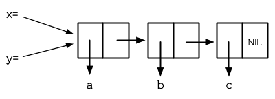

图 3.4 两个变量设为相同的列表

当我们把 `x` 的值赋给 `y` 时，究竟发生什么事呢？内存中与 `x` 有关的位置并没有包含这个列表，而是一个指针指向它。当我们给 `y` 赋一个相同的值时， Lisp 复制的是指针，而不是列表。（图 3.4 显式赋值 `x` 给 `y` 后的结果）无论何时，你将某个变量的值赋给另个变量时，两个变量的值将会是 `eql` 的：

```lisp
> (eql x y)
T
```

Lisp 没有指针的原因是因为每一个值，其实概念上来说都是一个指针。当你赋一个值给变量或将这个值存在数据结构中，其实被储存的是指向这个值的指针。当你要取得变量的值，或是存在数据结构中的内容时， Lisp 返回指向这个值的指针。但这都在台面下发生。你可以不加思索地把值放在结构里，或放“在”变量里。

为了效率的原因， Lisp 有时会选择一个折衷的表示法，而不是指针。举例来说，因为一个小整数所需的内存空间，少于一个指针所需的空间，一个 Lisp 实现可能会直接处理这个小整数，而不是用指针来处理。但基本要点是，程序员预设可以把任何东西放在任何地方。除非你声明你不愿这么做，不然你能够在任何的数据结构，存放任何类型的对象，包括结构本身。

## 3.4 建立列表 (Building Lists)

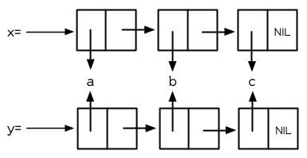

图 3.5 复制的结果

函数 `copy-list` 接受一个列表，然后返回此列表的复本。新的列表会有同样的元素，但是装在新的 *Cons* 对象里：

```lisp
> (setf x '(a b c)
        y (copy-list x))
(A B C)
```

图 3.5 展示出结果的结构; 返回值像是有着相同乘客的新公交。我们可以把 `copy-list` 想成是这么定义的：

```lisp
(defun our-copy-list (lst)
 (if (atom lst)
     lst
     (cons (car lst) (our-copy-list (cdr lst)))))
```

这个定义暗示着 `x` 与 `(copy-list x)` 会永远 `equal` ，并永远不 `eql` ，除非 `x` 是 `NIL` 。

最后，函数 `append` 返回任何数目的列表串接 (concatenation)：

```lisp
> (append '(a b) '(c d) 'e)
(A B C D . E)
```

通过这么做，它复制所有的参数，除了最后一个

## 3.5 示例：压缩 (Example: Compression)

作为一个例子，这节将演示如何实现简单形式的列表压缩。这个算法有一个令人印象深刻的名字，*游程编码*(run-length encoding)。

```lisp
(defun compress (x)
  (if (consp x)
      (compr (car x) 1 (cdr x))
      x))

(defun compr (elt n lst)
  (if (null lst)
      (list (n-elts elt n))
      (let ((next (car lst)))
        (if (eql next elt)
            (compr elt (+ n 1) (cdr lst))
            (cons (n-elts elt n)
                  (compr next 1 (cdr lst)))))))

(defun n-elts (elt n)
  (if (> n 1)
      (list n elt)
      elt))
```

图 3.6 游程编码 (Run-length encoding)：压缩

在餐厅的情境下，这个算法的工作方式如下。一个女服务生走向有四个客人的桌子。“你们要什么？” 她问。“我要特餐，” 第一个客人说。 “我也是，” 第二个客人说。“听起来不错，” 第三个客人说。每个人看着第四个客人。 “我要一个 cilantro soufflé，” 他小声地说。 (译注：蛋奶酥上面洒香菜跟酱料）

瞬息之间，女服务生就转身踩着高跟鞋走回柜台去了。 “三个特餐，” 她大声对厨师说，“还有一个香菜蛋奶酥。”

图 3.6 展示了如何实现这个压缩列表演算法。函数 `compress` 接受一个由原子组成的列表，然后返回一个压缩的列表：

```lisp
> (compress '(1 1 1 0 1 0 0 0 0 1))
((3 1) 0 1 (4 0) 1)
```

当相同的元素连续出现好几次，这个连续出现的序列 (sequence)被一个列表取代，列表指明出现的次数及出现的元素。

主要的工作是由递归函数 `compr` 所完成。这个函数接受三个参数： `elt` ， 上一个我们看过的元素； `n` ，连续出现的次数；以及 `lst` ，我们还没检查过的部分列表。如果没有东西需要检查了，我们调用 `n-elts` 来取得 `n elts` 的表示法。如果 `lst` 的第一个元素还是 `elt` ，我们增加出现的次数 `n` 并继续下去。否则我们得到，到目前为止的一个压缩的列表，然后 `cons` 这个列表在 `compr` 处理完剩下的列表所返回的东西之上。

要复原一个压缩的列表，我们调用 `uncompress` (图 3.7)

```lisp
> (uncompress '((3 1) 0 1 (4 0) 1))
(1 1 1 0 1 0 0 0 0 1)
(defun uncompress (lst)
  (if (null lst)
      nil
      (let ((elt (car lst))
            (rest (uncompress (cdr lst))))
        (if (consp elt)
            (append (apply #'list-of elt)
                    rest)
            (cons elt rest)))))

(defun list-of (n elt)
  (if (zerop n)
      nil
      (cons elt (list-of (- n 1) elt))))
```

图 3.7 游程编码 (Run-length encoding)：解压缩

这个函数递归地遍历这个压缩列表，逐字复制原子并调用 `list-of` ，展开成列表。

```lisp
> (list-of 3 'ho)
(HO HO HO)
```

我们其实不需要自己写 `list-of` 。内置的 `make-list` 可以办到一样的事情 ── 但它使用了我们还没介绍到的关键字参数 (keyword argument)。

图 3.6 跟 3.7 这种写法不是一个有经验的Lisp 程序员用的写法。它的效率很差，它没有尽可能的压缩，而且它只对由原子组成的列表有效。在几个章节内，我们会学到解决这些问题的技巧。

```lisp
载入程序

在这节的程序是我们第一个实质的程序。
当我们想要写超过数行的函数时，
通常我们会把程序写在一个文件，
然后使用 load 让 Lisp 读取函数的定义。
如果我们把图 3.6 跟 3.7 的程序，
存在一个文件叫做，“compress.lisp”然后输入

(load "compress.lisp")

到顶层，或多或少的，
我们会像在直接输入顶层一样得到同样的效果。

注意：在某些实现中，Lisp 文件的扩展名会是“.lsp”而不是“.lisp”。
```

## 3.6 存取 (Access)

Common Lisp 有额外的存取函数，它们是用 `car` 跟 `cdr` 所定义的。要找到列表特定位置的元素，我们可以调用 `nth` ，

```lisp
> (nth 0 '(a b c))
A
```

而要找到第 `n` 个 `cdr` ，我们调用 `nthcdr` ：

```lisp
> (nthcdr 2 '(a b c))
(C)
```

`nth` 与 `nthcdr` 都是零索引的 (zero-indexed); 即元素从 `0` 开始编号，而不是从 `1` 开始。在 Common Lisp 里，无论何时你使用一个数字来参照一个数据结构中的元素时，都是从 `0` 开始编号的。

两个函数几乎做一样的事; `nth` 等同于取 `nthcdr` 的 `car` 。没有检查错误的情况下， `nthcdr` 可以这么定义：

```lisp
(defun our-nthcdr (n lst)
  (if (zerop n)
      lst
      (our-nthcdr (- n 1) (cdr lst))))
```

函数 `zerop` 仅在参数为零时，才返回真。

函数 `last` 返回列表的最后一个 *Cons* 对象：

```lisp
> (last '(a b c))
(C)
```

这跟取得最后一个元素不一样。要取得列表的最后一个元素，你要取得 `last` 的 `car` 。

Common Lisp 定义了函数 `first` 直到 `tenth` 可以取得列表对应的元素。这些函数不是 *零索引的* (zero-indexed)：

`(second x)` 等同于 `(nth 1 x)` 。

此外， Common Lisp 定义了像是 `caddr` 这样的函数，它是 `cdr` 的 `cdr` 的 `car` 的缩写 ( `car` of `cdr` of `cdr` )。所有这样形式的函数 `cxr` ，其中 x 是一个字符串，最多四个 `a` 或 `d` ，在 Common Lisp 里都被定义好了。使用 `cadr` 可能会有异常 (exception)产生，在所有人都可能会读的代码里使用这样的函数，可能不是个好主意。

## 3.7 映射函数 (Mapping Functions)

Common Lisp 提供了数个函数来对一个列表的元素做函数调用。最常使用的是 `mapcar` ，接受一个函数以及一个或多个列表，并返回把函数应用至每个列表的元素的结果，直到有的列表没有元素为止：

```lisp
> (mapcar #'(lambda (x) (+ x 10))
          '(1 2 3))
(11 12 13)

> (mapcar #'list
          '(a b c)
          '(1 2 3 4))
((A 1) (B 2) (C 3))
```

相关的 `maplist` 接受同样的参数，将列表的渐进的下一个 `cdr` 传入函数。

```lisp
> (maplist #'(lambda (x) x)
           '(a b c))
((A B C) (B C) (C))
```

其它的映射函数，包括 `mapc` 我们在 89 页讨论（译注：5.4 节最后），以及 `mapcan` 在 202 页（译注：12.4 节最后）讨论。

## 3.8 树 (Trees)

*Cons* 对象可以想成是二叉树， `car` 代表左子树，而 `cdr` 代表右子树。举例来说，列表

`(a (b c) d)` 也是一棵由图 3.8 所代表的树。 （如果你逆时针旋转 45 度，你会发现跟图 3.3 一模一样）

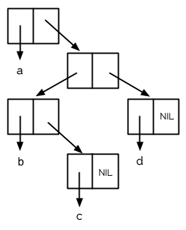

图 3.8 二叉树 (Binary Tree)

Common Lisp 有几个内置的操作树的函数。举例来说， `copy-tree` 接受一个树，并返回一份副本。它可以这么定义：

```lisp
(defun our-copy-tree (tr)
  (if (atom tr)
       tr
       (cons (our-copy-tree (car tr))
             (our-copy-tree (cdr tr)))))
```

把这跟 36 页的 `copy-list` 比较一下； `copy-tree` 复制每一个 *Cons* 对象的 `car` 与 `cdr` ，而 `copy-list` 仅复制 `cdr` 。

没有内部节点的二叉树没有太大的用处。 Common Lisp 包含了操作树的函数，不只是因为我们需要树这个结构，而是因为我们需要一种方法，来操作列表及所有内部的列表。举例来说，假设我们有一个这样的列表：

```lisp
(and (integerp x) (zerop (mod x 2)))
```

而我们想要把各处的 `x` 都换成 `y` 。调用 `substitute` 是不行的，它只能替换序列 (sequence)中的元素：

```lisp
> (substitute 'y 'x '(and (integerp x) (zerop (mod x 2))))
(AND (INTEGERP X) (ZEROP (MOD X 2)))
```

这个调用是无效的，因为列表有三个元素，没有一个元素是 `x` 。我们在这所需要的是 `subst` ，它替换树之中的元素。

```lisp
> (subst 'y 'x '(and (integerp x) (zerop (mod x 2))))
(AND (INTEGERP Y) (ZEROP (MOD Y 2)))
```

如果我们定义一个 `subst` 的版本，它看起来跟 `copy-tree` 很相似：

```lisp
> (defun our-subst (new old tree)
    (if (eql tree old)
        new
        (if (atom tree)
            tree
            (cons (our-subst new old (car tree))
                  (our-subst new old (cdr tree))))))
```

操作树的函数通常有这种形式， `car` 与 `cdr` 同时做递归。这种函数被称之为是 *双重递归* (doubly recursive)。

## 3.9 理解递归 (Understanding Recursion)

学生在学习递归时，有时候是被鼓励在纸上追踪 (trace)递归程序调用 (invocation)的过程。 (288页「译注：[附录 A 追踪与回溯](http://acl.readthedocs.org/en/latest/zhCN/appendix-A-cn.html)」可以看到一个递归函数的追踪过程。)但这种练习可能会误导你：一个程序员在定义一个递归函数时，通常不会特别地去想函数的调用顺序所导致的结果。

如果一个人总是需要这样子思考程序，递归会是艰难的、没有帮助的。递归的优点是它精确地让我们更抽象地来设计算法。你不需要考虑真正函数时所有的调用过程，就可以判断一个递归函数是否是正确的。

要知道一个递归函数是否做它该做的事，你只需要问，它包含了所有的情况吗？举例来说，下面是一个寻找列表长度的递归函数：

```lisp
> (defun len (lst)
    (if (null lst)
        0
        (+ (len (cdr lst)) 1)))
```

我们可以借由检查两件事情，来确信这个函数是正确的：

1. 对长度为 `0` 的列表是有效的。
2. 给定它对于长度为 `n` 的列表是有效的，它对长度是 `n+1` 的列表也是有效的。

如果这两点是成立的，我们知道这个函数对于所有可能的列表都是正确的。

我们的定义显然地满足第一点：如果列表( `lst` ) 是空的( `nil` )，函数直接返回 `0` 。现在假定我们的函数对长度为 `n` 的列表是有效的。我们给它一个 `n+1` 长度的列表。这个定义说明了，函数会返回列表的 `cdr` 的长度再加上 `1` 。 `cdr` 是一个长度为 `n` 的列表。我们经由假定可知它的长度是 `n` 。所以整个列表的长度是 `n+1` 。

我们需要知道的就是这些。理解递归的秘密就像是处理括号一样。你怎么知道哪个括号对上哪个？你不需要这么做。你怎么想像那些调用过程？你不需要这么做。

更复杂的递归函数，可能会有更多的情况需要讨论，但是流程是一样的。举例来说， 41 页的 `our-copy-tree` ，我们需要讨论三个情况： 原子，单一的 *Cons* 对象， `n+1` 的 *Cons* 树。

第一个情况（长度零的列表）称之为*基本用例*( *base case* )。当一个递归函数不像你想的那样工作时，通常是处理基本用例就错了。下面这个不正确的 `member` 定义，是一个常见的错误，整个忽略了基本用例：

```lisp
(defun our-member (obj lst)
  (if (eql (car lst) obj)
      lst
      (our-member obj (cdr lst))))
```

我们需要初始一个 `null` 测试，确保在到达列表底部时，没有找到目标时要停止递归。如果我们要找的对象没有在列表里，这个版本的 `member` 会陷入无穷循环。附录 A 更详细地讨论了这种问题。

能够判断一个递归函数是否正确只不过是理解递归的上半场，下半场是能够写出一个做你想做的事情的递归函数。 6.9 节讨论了这个问题。

## 3.10 集合 (Sets)

列表是表示小集合的好方法。列表中的每个元素都代表了一个集合的成员：

```lisp
> (member 'b '(a b c))
(B C)
```

当 `member` 要返回“真”时，与其仅仅返回 `t` ，它返回由寻找对象所开始的那部分。逻辑上来说，一个 *Cons* 扮演的角色和 `t` 一样，而经由这么做，函数返回了更多资讯。

一般情况下， `member` 使用 `eql` 来比较对象。你可以使用一种叫做关键字参数的东西来重写缺省的比较方法。多数的 Common Lisp 函数接受一个或多个关键字参数。这些关键字参数不同的地方是，他们不是把对应的参数放在特定的位置作匹配，而是在函数调用中用特殊标签，称为关键字，来作匹配。一个关键字是一个前面有冒号的符号。

一个 `member` 函数所接受的关键字参数是 `:test` 参数。

如果你在调用 `member` 时，传入某个函数作为 `:test` 参数，那么那个函数就会被用来比较是否相等，而不是用 `eql` 。所以如果我们想找到一个给定的对象与列表中的成员是否相等( `equal` )，我们可以：

```lisp
> (member '(a) '((a) (z)) :test #'equal)
((A) (Z))
```

关键字参数总是选择性添加的。如果你在一个调用中包含了任何的关键字参数，他们要摆在最后; 如果使用了超过一个的关键字参数，摆放的顺序无关紧要。

另一个 `member` 接受的关键字参数是 `:key` 参数。借由提供这个参数，你可以在作比较之前，指定一个函数运用在每一个元素：

```lisp
> (member 'a '((a b) (c d)) :key #'car)
((A B) (C D))
```

在这个例子里，我们询问是否有一个元素的 `car` 是 `a` 。

如果我们想要使用两个关键字参数，我们可以使用其中一个顺序。下面这两个调用是等价的：

```lisp
> (member 2 '((1) (2)) :key #'car :test #'equal)
((2))
> (member 2 '((1) (2)) :test #'equal :key #'car)
((2))
```

两者都询问是否有一个元素的 `car` 等于( `equal` ) 2。

如果我们想要找到一个元素满足任意的判断式像是── `oddp` ，奇数返回真──我们可以使用相关的 `member-if` ：

```lisp
> (member-if #'oddp '(2 3 4))
(3 4)
```

我们可以想像一个限制性的版本 `member-if` 是这样写成的：

```lisp
(defun our-member-if (fn lst)
  (and (consp lst)
       (if (funcall fn (car lst))
           lst
           (our-member-if fn (cdr lst)))))
```

函数 `adjoin` 像是条件式的 `cons` 。它接受一个对象及一个列表，如果对象还不是列表的成员，才构造对象至列表上。

```lisp
> (adjoin 'b '(a b c))
(A B C)
> (adjoin 'z '(a b c))
(Z A B C)
```

通常的情况下它接受与 `member` 函数同样的关键字参数。

集合论中的并集 (union)、交集 (intersection)以及补集 (complement)的实现，是由函数 `union` 、 `intersection` 以及 `set-difference` 。

这些函数期望两个（正好 2 个）列表（一样接受与 `member` 函数同样的关键字参数）。

```lisp
> (union '(a b c) '(c b s))
(A C B S)
> (intersection '(a b c) '(b b c))
(B C)
> (set-difference '(a b c d e) '(b e))
(A C D)
```

因为集合中没有顺序的概念，这些函数不需要保留原本元素在列表被找到的顺序。举例来说，调用 `set-difference` 也有可能返回 `(d c a)` 。

## 3.11 序列 (Sequences)

另一种考虑一个列表的方式是想成一系列有特定顺序的对象。在 Common Lisp 里，*序列*( *sequences* )包括了列表与向量 (vectors)。本节介绍了一些可以运用在列表上的序列函数。更深入的序列操作在 4.4 节讨论。

函数 `length` 返回序列中元素的数目。

```lisp
> (length '(a b c))
3
```

我们在 24 页 (译注：2.13节 `our-length` )写过这种函数的一个版本（仅可用于列表）。

要复制序列的一部分，我们使用 `subseq` 。第二个（需要的）参数是第一个开始引用进来的元素位置，第三个（选择性）参数是第一个不引用进来的元素位置。

```lisp
> (subseq '(a b c d) 1 2)
(B)
>(subseq '(a b c d) 1)
(B C D)
```

如果省略了第三个参数，子序列会从第二个参数给定的位置引用到序列尾端。

函数 `reverse` 返回与其参数相同元素的一个序列，但顺序颠倒。

```lisp
> (reverse '(a b c))
(C B A)
```

一个回文 (palindrome) 是一个正读反读都一样的序列 —— 举例来说， `(abba)` 。如果一个回文有偶数个元素，那么后半段会是前半段的镜射 (mirror)。使用 `length` 、 `subseq` 以及 `reverse` ，我们可以定义一个函数

```lisp
(defun mirror? (s)
  (let ((len (length s)))
    (and (evenp len)
         (let ((mid (/ len 2)))
           (equal (subseq s 0 mid)
                  (reverse (subseq s mid)))))))
```

来检测是否是回文：

```lisp
> (mirror? '(a b b a))
T
```

Common Lisp 有一个内置的排序函数叫做 `sort` 。它接受一个序列及一个比较两个参数的函数，返回一个有同样元素的序列，根据比较函数来排序：

```lisp
> (sort '(0 2 1 3 8) #'>)
(8 3 2 1 0)
```

你要小心使用 `sort` ，因为它是*破坏性的*(*destructive*)。考虑到效率的因素， `sort` 被允许修改传入的序列。所以如果你不想你本来的序列被改动，传入一个副本。

使用 `sort` 及 `nth` ，我们可以写一个函数，接受一个整数 `n` ，返回列表中第 `n` 大的元素：

```lisp
(defun nthmost (n lst)
  (nth (- n 1)
       (sort (copy-list lst) #'>)))
```

我们把整数减一因为 `nth` 是零索引的，但如果 `nthmost` 是这样的话，会变得很不直观。

```lisp
(nthmost 2 '(0 2 1 3 8))
```

多努力一点，我们可以写出这个函数的一个更有效率的版本。

函数 `every` 和 `some` 接受一个判断式及一个或多个序列。当我们仅输入一个序列时，它们测试序列元素是否满足判断式：

```lisp
> (every #'oddp '(1 3 5))
T
> (some #'evenp '(1 2 3))
T
```

如果它们输入多于一个序列时，判断式必须接受与序列一样多的元素作为参数，而参数从所有序列中一次提取一个：

```lisp
> (every #'> '(1 3 5) '(0 2 4))
T
```

如果序列有不同的长度，最短的那个序列，决定需要测试的次数。

## 3.12 栈 (Stacks)

用 *Cons* 对象来表示的列表，很自然地我们可以拿来实现下推栈 (pushdown stack)。这太常见了，以致于 Common Lisp 提供了两个宏给堆使用： `(push x y)` 把 `x` 放入列表 `y` 的前端。而 `(pop x)` 则是将列表 x 的第一个元素移除，并返回这个元素。

两个函数都是由 `setf` 定义的。如果参数是常数或变量，很简单就可以翻译出对应的函数调用。

表达式

```lisp
(push obj lst)
```

等同于

```lisp
(setf lst (cons obj lst))
```

而表达式

```lisp
(pop lst)
```

等同于

```lisp
(let ((x (car lst)))
  (setf lst (cdr lst))
  x)
```

所以，举例来说：

```lisp
> (setf x '(b))
(B)
> (push 'a x)
(A B)
> x
(A B)
> (setf y x)
(A B)
> (pop x)
(A)
> x
(B)
> y
(A B)
```

以上，全都遵循上述由 `setf` 所给出的相等式。图 3.9 展示了这些表达式被求值后的结构。

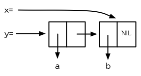

图 3.9 push 及 pop 的效果

你可以使用 `push` 来定义一个给列表使用的互动版 `reverse` 。

```lisp
(defun our-reverse (lst)
  (let ((acc nil))
    (dolist (elt lst)
      (push elt acc))
    acc))
```

在这个版本，我们从一个空列表开始，然后把 `lst` 的每一个元素放入空表里。等我们完成时，`lst` 最后一个元素会在最前端。

`pushnew` 宏是 `push` 的变种，使用了 `adjoin` 而不是 `cons` ：

```lisp
 > (let ((x '(a b)))
     (pushnew 'c x)
     (pushnew 'a x)
     x)
(C A B)
```

在这里， `c` 被放入列表，但是 `a` 没有，因为它已经是列表的一个成员了。

## 3.13 点状列表 (Dotted Lists)

调用 `list` 所构造的列表，这种列表精确地说称之为正规列表(*proper*list )。一个正规列表可以是 `NIL` 或是 `cdr` 是正规列表的 *Cons* 对象。也就是说，我们可以定义一个只对正规列表返回真的判断式： [[3\]](https://acl.readthedocs.io/en/latest/zhCN/ch3-cn.html#id5)

```lisp
(defun proper-list? (x)
  (or (null x)
      (and (consp x)
           (proper-list? (cdr x)))))
```

至目前为止，我们构造的列表都是正规列表。

然而， `cons` 不仅是构造列表。无论何时你需要一个具有两个字段 (field)的列表，你可以使用一个 *Cons* 对象。你能够使用 `car` 来参照第一个字段，用 `cdr` 来参照第二个字段。

```lisp
> (setf pair (cons 'a 'b))
(A . B)
```

因为这个 *Cons* 对象不是一个正规列表，它用点状表示法来显示。在点状表示法，每个 *Cons* 对象的 `car` 与 `cdr` 由一个句点隔开来表示。这个 *Cons* 对象的结构展示在图 3.10 。


图3.10 一个成对的 *Cons* 对象 (A cons used as a pair)

一个非正规列表的 *Cons* 对象称之为点状列表 (dotted list)。这不是个好名字，因为非正规列表的 Cons 对象通常不是用来表示列表： `(a . b)` 只是一个有两部分的数据结构。

你也可以用点状表示法表示正规列表，但当 Lisp 显示一个正规列表时，它会使用普通的列表表示法：

```lisp
> '(a . (b . (c . nil)))
(A B C)
```

顺道一提，注意列表由点状表示法与图 3.2 箱子表示法的关联性。

还有一个过渡形式 (intermediate form)的表示法，介于列表表示法及纯点状表示法之间，对于 `cdr` 是点状列表的 *Cons* 对象：

```lisp
> (cons 'a (cons 'b (cons 'c 'd)))
(A B C . D)
```

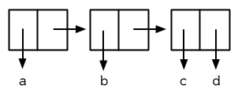

图 3.11 一个点状列表 (A dotted list)

这样的 *Cons* 对象看起来像正规列表，除了最后一个 cdr 前面有一个句点。这个列表的结构展示在图 3.11 ; 注意它跟图3.2 是多么的相似。

所以实际上你可以这么表示列表 `(a b)` ，

```lisp
(a . (b . nil))
(a . (b))
(a b . nil)
(a b)
```

虽然 Lisp 总是使用后面的形式，来显示这个列表。

## 3.14 关联列表 (Assoc-lists)

用 *Cons* 对象来表示映射 (mapping)也是很自然的。一个由 *Cons* 对象组成的列表称之为*关联列表*(*assoc-list*or *alist*)。这样的列表可以表示一个翻译的集合，举例来说：

```lisp
> (setf trans '((+ . "add") (- . "subtract")))
((+ . "add") (- . "subtract"))
```

关联列表很慢，但是在初期的程序中很方便。 Common Lisp 有一个内置的函数 `assoc` ，用来取出在关联列表中，与给定的键值有关联的 *Cons* 对：

```lisp
> (assoc '+ trans)
(+ . "add")
> (assoc '* trans)
NIL
```

如果 `assoc` 没有找到要找的东西时，返回 `nil` 。

我们可以定义一个受限版本的 `assoc` ：

```lisp
(defun our-assoc (key alist)
  (and (consp alist)
       (let ((pair (car alist)))
        (if (eql key (car pair))
            pair
            (our-assoc key (cdr alist))))))
```

和 `member` 一样，实际上的 `assoc` 接受关键字参数，包括 `:test` 和 `:key` 。 Common Lisp 也定义了一个 `assoc-if` 之于 `assoc` ，如同 `member-if` 之于 `member` 一样。

## 3.15 示例：最短路径 (Example: Shortest Path)

图 3.12 包含一个搜索网络中最短路径的程序。函数 `shortest-path` 接受一个起始节点，目的节点以及一个网络，并返回最短路径，如果有的话。

在这个范例中，节点用符号表示，而网络用含以下元素形式的关联列表来表示：

*(node . neighbors)*

所以由图 3.13 展示的最小网络 (minimal network)可以这样来表示：

```lisp
(setf min '((a b c) (b c) (c d)))
(defun shortest-path (start end net)
  (bfs end (list (list start)) net))

(defun bfs (end queue net)
  (if (null queue)
      nil
      (let ((path (car queue)))
        (let ((node (car path)))
          (if (eql node end)
              (reverse path)
              (bfs end
                   (append (cdr queue)
                           (new-paths path node net))
                   net))))))

(defun new-paths (path node net)
  (mapcar #'(lambda (n)
              (cons n path))
          (cdr (assoc node net))))
```

图 3.12 广度优先搜索(breadth-first search)


图 3.13 最小网络

要找到从节点 `a` 可以到达的节点，我们可以：

```lisp
> (cdr (assoc 'a min))
(B C)
```

图 3.12 程序使用广度优先的方式搜索网络。要使用广度优先搜索，你需要维护一个含有未探索节点的队列。每一次你到达一个节点，检查这个节点是否是你要的。如果不是，你把这个节点的子节点加入队列的尾端，并从队列起始选一个节点，从这继续搜索。借由总是把较深的节点放在队列尾端，我们确保网络一次被搜索一层。

图 3.12 中的代码较不复杂地表示这个概念。我们不仅想要找到节点，还想保有我们怎么到那的纪录。所以与其维护一个具有节点的队列 (queue)，我们维护一个已知路径的队列，每个已知路径都是一列节点。当我们从队列取出一个元素继续搜索时，它是一个含有队列前端节点的列表，而不只是一个节点而已。

函数 `bfs` 负责搜索。起初队列只有一个元素，一个表示从起点开始的路径。所以 `shortest-path` 调用 `bfs` ，并传入 `(list (list start))` 作为初始队列。

`bfs` 函数第一件要考虑的事是，是否还有节点需要探索。如果队列为空， `bfs` 返回 `nil` 指出没有找到路径。如果还有节点需要搜索， `bfs` 检查队列前端的节点。如果节点的 `car` 部分是我们要找的节点，我们返回这个找到的路径，并且为了可读性的原因我们反转它。如果我们没有找到我们要找的节点，它有可能在现在节点之后，所以我们把它的子节点（或是每一个子路径）加入队列尾端。然后我们递回地调用 `bfs` 来继续搜寻剩下的队列。

因为 `bfs` 广度优先地搜索，第一个找到的路径会是最短的，或是最短之一：

```lisp
> (shortest-path 'a 'd min)
(A C D)
```

这是队列在我们连续调用 `bfs` 看起来的样子：

```lisp
((A))
((B A) (C A))
((C A) (C B A))
((C B A) (D C A))
((D C A) (D C B A))
```

在队列中的第二个元素变成下一个队列的第一个元素。队列的第一个元素变成下一个队列尾端元素的 `cdr` 部分。

在图 3.12 的代码不是搜索一个网络最快的方法，但它给出了列表具有多功能的概念。在这个简单的程序中，我们用三种不同的方式使用了列表：我们使用一个符号的列表来表示路径，一个路径的列表来表示在广度优先搜索中的队列 [[4\]](https://acl.readthedocs.io/en/latest/zhCN/ch3-cn.html#id6) ，以及一个关联列表来表示网络本身。

## 3.16 垃圾 (Garbages)

有很多原因可以使列表变慢。列表提供了顺序存取而不是随机存取，所以列表取出一个指定的元素比数组慢，同样的原因，录音带取出某些东西比在光盘上慢。电脑内部里， *Cons* 对象倾向于用指针表示，所以走访一个列表意味着走访一系列的指针，而不是简单地像数组一样增加索引值。但这两个所花的代价与配置及回收 *Cons* 核 (cons cells)比起来小多了。

*自动内存管理*(*Automatic memory management*)是 Lisp 最有价值的特色之一。 Lisp 系统维护着一段內存称之为堆(*Heap*)。系统持续追踪堆当中没有使用的内存，把这些内存发放给新产生的对象。举例来说，函数 `cons` ，返回一个新配置的 *Cons* 对象。从堆中配置内存有时候通称为 *consing* 。

如果内存永远没有释放， Lisp 会因为创建新对象把内存用完，而必须要关闭。所以系统必须周期性地通过搜索堆 (heap)，寻找不需要再使用的内存。不需要再使用的内存称之为垃圾 (*garbage*)，而清除垃圾的动作称为垃圾回收 (*garbage collection*或 GC)。

垃圾是从哪来的？让我们来创造一些垃圾：

```lisp
> (setf lst (list 'a 'b 'c))
(A B C)
> (setf lst nil)
NIL
```

一开始我们调用 `list` ， `list` 调用 `cons` ，在堆上配置了一个新的 *Cons* 对象。在这个情况我们创出三个 *Cons* 对象。之后当我们把 `lst` 设为 `nil` ，我们没有任何方法可以再存取 `lst` ，列表 `(a b c)` 。 [[5\]](https://acl.readthedocs.io/en/latest/zhCN/ch3-cn.html#id7)

因为我们没有任何方法再存取列表，它也有可能是不存在的。我们不再有任何方式可以存取的对象叫做垃圾。系统可以安全地重新使用这三个 *Cons* 核。

这种管理內存的方法，给程序员带来极大的便利性。你不用显式地配置 (allocate)或释放 (dellocate)內存。这也表示了你不需要处理因为这么做而可能产生的臭虫。內存泄漏 (Memory leaks)以及迷途指针 (dangling pointer)在 Lisp 中根本不可能发生。

但是像任何的科技进步，如果你不小心的话，自动內存管理也有可能对你不利。使用及回收堆所带来的代价有时可以看做 `cons` 的代价。这是有理的，除非一个程序从来不丢弃任何东西，不然所有的 *Cons* 对象终究要变成垃圾。 Consing 的问题是，配置空间与清除內存，与程序的常规运作比起来花费昂贵。近期的研究提出了大幅改善內存回收的演算法，但是 consing 总是需要代价的，在某些现有的 Lisp 系统中，代价是昂贵的。

除非你很小心，不然很容易写出过度显式创建 cons 对象的程序。举例来说， `remove` 需要复制所有的 `cons` 核，直到最后一个元素从列表中移除。你可以借由使用破坏性的函数避免某些 consing，它试着去重用列表的结构作为参数传给它们。破坏性函数会在 12.4 节讨论。

当写出 `cons` 很多的程序是如此简单时，我们还是可以写出不使用 `cons` 的程序。典型的方法是写出一个纯函数风格，使用很多列表的第一版程序。当程序进化时，你可以在代码的关键部分使用破坏性函数以及/或别种数据结构。但这很难给出通用的建议，因为有些 Lisp 实现，內存管理处理得相当好，以致于使用 `cons` 有时比不使用 `cons` 还快。这整个议题在 13.4 做更进一步的细部讨论。

无论如何 consing 在原型跟实验时是好的。而且如果你利用了列表给你带来的灵活性，你有较高的可能写出后期可存活下来的程序。

## Chapter 3 总结 (Summary)

1. 一个 *Cons* 是一个含两部分的数据结构。列表用链结在一起的 *Cons* 组成。
2. 判断式 `equal` 比 `eql` 来得不严谨。基本上，如果传入参数印出来的值一样时，返回真。
3. 所有 Lisp 对象表现得像指针。你永远不需要显式操作指针。
4. 你可以使用 `copy-list` 复制列表，并使用 `append` 来连接它们的元素。
5. 游程编码是一个餐厅中使用的简单压缩演算法。
6. Common Lisp 有由 `car` 与 `cdr` 定义的多种存取函数。
7. 映射函数将函数应用至逐项的元素，或逐项的列表尾端。
8. 嵌套列表的操作有时被考虑为树的操作。
9. 要判断一个递归函数是否正确，你只需要考虑是否包含了所有情况。
10. 列表可以用来表示集合。数个内置函数把列表当作集合。
11. 关键字参数是选择性的，并不是由位置所识别，是用符号前面的特殊标签来识别。
12. 列表是序列的子类型。 Common Lisp 有大量的序列函数。
13. 一个不是正规列表的 *Cons* 称之为点状列表。
14. 用 cons 对象作为元素的列表，可以拿来表示对应关系。这样的列表称为关联列表(assoc-lists)。
15. 自动内存管理拯救你处理内存配置的烦恼，但制造过多的垃圾会使程序变慢。

## Chapter 3 习题 (Exercises)

1. 用箱子表示法表示以下列表：

```lisp
(a) (a b (c d))
(b) (a (b (c (d))))
(c) (((a b) c) d)
(d) (a (b . c) d)
```

1. 写一个保留原本列表中元素顺序的 `union` 版本：

```lisp
> (new-union '(a b c) '(b a d))
(A B C D)
```

1. 定义一个函数，接受一个列表并返回一个列表，指出相等元素出现的次数，并由最常见至最少见的排序：

```lisp
> (occurrences '(a b a d a c d c a))
((A . 4) (C . 2) (D . 2) (B . 1))
```

1. 为什么 `(member '(a) '((a) (b)))` 返回 nil？
2. 假设函数 `pos+` 接受一个列表并返回把每个元素加上自己的位置的列表：

```lisp
> (pos+ '(7 5 1 4))
(7 6 3 7)
```

使用 (a) 递归 (b) 迭代 (c) `mapcar` 来定义这个函数。

1. 经过好几年的审议，政府委员会决定列表应该由 `cdr` 指向第一个元素，而 `car` 指向剩下的列表。定义符合政府版本的以下函数：

```lisp
(a) cons
(b) list
(c) length (for lists)
(d) member (for lists; no keywords)
```

**勘误:** 要解决 3.6 (b)，你需要使用到 6.3 节的参数 `&rest` 。

1. 修改图 3.6 的程序，使它使用更少 cons 核。 （提示：使用点状列表）
2. 定义一个函数，接受一个列表并用点状表示法印出：

```lisp
> (showdots '(a b c))
(A . (B . (C . NIL)))
NIL
```

1. 写一个程序来找到 3.15 节里表示的网络中，最长有限的路径 (不重复)。网络可能包含循环。

脚注

| [[3\]](https://acl.readthedocs.io/en/latest/zhCN/ch3-cn.html#id2) | 这个叙述有点误导，因为只要是对任何东西都不返回 nil 的函数，都不是正规列表。如果给定一个环状 cdr 列表(cdr-circular list)，它会无法终止。环状列表在 12.7 节 讨论。 |
| ------------------------------------------------------------ | ------------------------------------------------------------ |
|                                                              |                                                              |

| [[4\]](https://acl.readthedocs.io/en/latest/zhCN/ch3-cn.html#id3) | 12.3 小节会展示更有效率的队列实现方式。 |
| ------------------------------------------------------------ | --------------------------------------- |
|                                                              |                                         |

| [[5\]](https://acl.readthedocs.io/en/latest/zhCN/ch3-cn.html#id4) | 事实上，我们有一种方式来存取列表。全局变量 `*` , `**` , 以及 `***` 总是设定为最后三个顶层所返回的值。这些变量在除错的时候很有用。 |
| ------------------------------------------------------------ | ------------------------------------------------------------ |
|                                                              |                                                              |


# 第四章：特殊数据结构

在之前的章节里，我们讨论了列表，Lisp 最多功能的数据结构。本章将演示如何使用 Lisp 其它的数据结构：数组（包含向量与字符串），结构以及哈希表。它们或许不像列表这么灵活，但存取速度更快并使用了更少空间。

Common Lisp 还有另一种数据结构：实例（instance）。实例将在 11 章讨论，讲述 CLOS。

## 4.1 数组 (Array)

在 Common Lisp 里，你可以调用 `make-array` 来构造一个数组，第一个实参为一个指定数组维度的列表。要构造一个 `2 x 3` 的数组，我们可以：

```lisp
> (setf arr (make-array '(2 3) :initial-element nil))
#<Simple-Array T (2 3) BFC4FE>
```

Common Lisp 的数组至少可以达到七个维度，每个维度至少可以容纳 1023 个元素。

`:initial-element` 实参是选择性的。如果有提供这个实参，整个数组会用这个值作为初始值。若试着取出未初始化的数组内的元素，其结果为未定义（undefined）。

用 `aref` 取出数组内的元素。与 Common Lisp 的存取函数一样， `aref` 是零索引的（zero-indexed）：

```lisp
> (aref arr 0 0)
NIL
```

要替换数组的某个元素，我们使用 `setf` 与 `aref` ：

```lisp
> (setf (aref arr 0 0) 'b)
B
> (aref arr 0 0)
B
```

要表示字面常量的数组（literal array），使用 `#na` 语法，其中 `n` 是数组的维度。举例来说，我们可以这样表示 `arr` 这个数组：

```lisp
#2a((b nil nil) (nil nil nil))
```

如果全局变量 `*print-array*` 为真，则数组会用以下形式来显示：

```lisp
> (setf *print-array* t)
T
> arr
#2A((B NIL NIL) (NIL NIL NIL))
```

如果我们只想要一维的数组，你可以给 `make-array` 第一个实参传一个整数，而不是一个列表：

```lisp
> (setf vec (make-array 4 :initial-element nil))
#(NIL NIL NIL NIL)
```

一维数组又称为向量（*vector*）。你可以通过调用 `vector` 来一步骤构造及填满向量，向量的元素可以是任何类型：

```lisp
> (vector "a" 'b 3)
#("a" b 3)
```

字面常量的数组可以表示成 `#na` ，字面常量的向量也可以用这种语法表达。

可以用 `aref` 来存取向量，但有一个更快的函数叫做 `svref` ，专门用来存取向量。

```lisp
> (svref vec 0)
NIL
```

在 `svref` 内的 “sv” 代表“简单向量”（“simple vector”），所有的向量缺省是简单向量。 [[1\]](https://acl.readthedocs.io/en/latest/zhCN/ch4-cn.html#id5)

## 4.2 示例：二叉搜索 (Example: Binary Search)

作为一个示例，这小节演示如何写一个在排序好的向量里搜索对象的函数。如果我们知道一个向量是排序好的，我们可以比（65页） `find` 做的更好， `find` 必须依序检查每一个元素。我们可以直接跳到向量中间开始找。如果中间的元素是我们要找的对象，搜索完毕。要不然我们持续往左半部或往右半部搜索，取决于对象是小于或大于中间的元素。

图 4.1 包含了一个这么工作的函数。其实这两个函数： `bin-search` 设置初始范围及发送控制信号给 `finder` ， `finder` 寻找向量 `vec` 内 `obj` 是否介于 `start` 及 `end` 之间。

```lisp
(defun bin-search (obj vec)
  (let ((len (length vec)))
    (and (not (zerop len))
         (finder obj vec 0 (- len 1)))))

(defun finder (obj vec start end)
  (let ((range (- end start)))
    (if (zerop range)
        (if (eql obj (aref vec start))
            obj
            nil)
        (let ((mid (+ start (round (/ range 2)))))
          (let ((obj2 (aref vec mid)))
            (if (< obj obj2)
                (finder obj vec start (- mid 1))
                (if (> obj obj2)
                    (finder obj vec (+ mid 1) end)
                    obj)))))))
```

图 4.1: 搜索一个排序好的向量

如果要找的 `range` 缩小至一个元素，而如果这个元素是 `obj` 的话，则 `finder` 直接返回这个元素，反之返回 `nil` 。如果 `range` 大于 `1` ，我们設置 `middle` ( `round` 返回离实参最近的整数) 為 `obj2` 。如果 `obj` 小于 `obj2` ，则递归地往向量的左半部寻找。如果 `obj` 大于 `obj2` ，则递归地往向量的右半部寻找。剩下的一个选择是 `obj=obj2` ，在这个情况我们找到要找的元素，直接返回这个元素。

如果我们插入下面这行至 `finder` 的起始处：

```lisp
(format t "~A~%" (subseq vec start (+ end 1)))
```

我们可以观察被搜索的元素的数量，是每一步往左减半的：

```lisp
> (bin-search 3 #(0 1 2 3 4 5 6 7 8 9))
#(0 1 2 3 4 5 6 7 8 9)
#(0 1 2 3)
#(3)
3
```

## 4.3 字符与字符串 (Strings and Characters)

字符串是字符组成的向量。我们用一系列由双引号包住的字符，来表示一个字符串常量，而字符 `c` 用 `#\c` 表示。

每个字符都有一个相关的整数 ── 通常是 ASCII 码，但不一定是。在多数的 Lisp 实现里，函数 `char-code` 返回与字符相关的数字，而 `code-char` 返回与数字相关的字符。

字符比较函数 `char<` （小于）， `char<=` （小于等于)， `char=` （等于)， `char>=` （大于等于) ， `char>` （大于)，以及 `char/=` （不同)。他们的工作方式和 146 页（译注 9.3 节)比较数字用的操作符一样。

```lisp
> (sort "elbow" #'char<)
"below"
```

由于字符串是字符向量，序列与数组的函数都可以用在字符串。你可以用 `aref` 来取出元素，举例来说，

```lisp
> (aref "abc" 1)
#\b
```

但针对字符串可以使用更快的 `char` 函数：

```lisp
> (char "abc" 1)
#\b
```

可以使用 `setf` 搭配 `char` （或 `aref` ）来替换字符串的元素：

```lisp
> (let ((str (copy-seq "Merlin")))
   (setf (char str 3) #\k)
   str)
```

如果你想要比较两个字符串，你可以使用通用的 `equal` 函数，但还有一个比较函数，是忽略字母大小写的 `string-equal` ：

```lisp
> (equal "fred" "fred")
T
> (equal "fred" "Fred")
NIL
>(string-equal "fred" "Fred")
T
```

Common Lisp 提供大量的操控、比较字符串的函数。收录在附录 D，从 364 页开始。

有许多方式可以创建字符串。最普遍的方式是使用 `format` 。将第一个参数设为 `nil` 来调用 `format` ，使它返回一个原本会印出来的字符串：

```lisp
> (format nil "~A or ~A" "truth" "dare")
"truth or dare"
```

但若你只想把数个字符串连结起来，你可以使用 `concatenate` ，它接受一个特定类型的符号，加上一个或多个序列：

```lisp
> (concatenate 'string "not " "to worry")
"not to worry"
```

## 4.4 序列 (Sequences)

在 Common Lisp 里，序列类型包含了列表与向量（因此也包含了字符串）。有些用在列表的函数，实际上是序列函数，包括 `remove` 、 `length` 、 `subseq` 、 `reverse` 、 `sort` 、 `every` 以及 `some` 。所以 46 页（译注 3.11 小节的 `mirror?` 函数）我们所写的函数，也可以用在其他种类的序列上：

```lisp
> (mirror? "abba")
T
```

我们已经看过四种用来取出序列元素的函数： 给列表使用的 `nth` ， 给向量使用的 `aref` 及 `svref` ，以及给字符串使用的 `char` 。 Common Lisp 也提供了通用的 `elt` ，对任何种类的序列都有效：

```lisp
> (elt '(a b c) 1)
B
```

针对特定类型的序列，特定的存取函数会比较快，所以使用 `elt` 是没有意义的，除非在代码当中，有需要支持通用序列的地方。

使用 `elt` ，我们可以写一个针对向量来说更有效率的 `mirror?` 版本：

```lisp
(defun mirror? (s)
  (let ((len (length s)))
    (and (evenp len)
         (do ((forward 0 (+ forward 1))
              (back (- len 1) (- back 1)))
             ((or (> forward back)
                  (not (eql (elt s forward)
                            (elt s back))))
              (> forward back))))))
```

这个版本也可用在列表，但这个实现更适合给向量使用。频繁的对列表调用 `elt` 的代价是昂贵的，因为列表仅允许顺序存取。而向量允许随机存取，从任何元素来存取每一个元素都是廉价的。

许多序列函数接受一个或多个，由下表所列的标准关键字参数：

| 参数      | 用途                 | 缺省值   |
| :-------- | :------------------- | :------- |
| :key      | 应用至每个元素的函数 | identity |
| :test     | 作来比较的函数       | eql      |
| :from-end | 若为真，反向工作。   | nil      |
| :start    | 起始位置             | 0        |
| :end      | 若有给定，结束位置。 | nil      |

一个接受所有关键字参数的函数是 `position` ，返回序列中一个元素的位置，未找到元素时则返回 `nil` 。我们使用 `position` 来演示关键字参数所扮演的角色。

```lisp
> (position #\a "fantasia")
1
> (position #\a "fantasia" :start 3 :end 5)
4
```

第二个例子我们要找在第四个与第六个字符间，第一个 `a` 所出现的位置。 `:start` 关键字参数是第一个被考虑的元素位置，缺省是序列的第一个元素。 `:end` 关键字参数，如果有给的话，是第一个不被考虑的元素位置。

如果我们给入 `:from-end` 关键字参数，

```lisp
> (position #\a "fantasia" :from-end t)
7
```

我们得到最靠近结尾的 `a` 的位置。但位置是像平常那样计算；而不是从尾端算回来的距离。

`:key` 关键字参数是序列中每个元素在被考虑之前，应用至元素上的函数。如果我们说，

```lisp
> (position 'a '((c d) (a b)) :key #'car)
1
```

那么我们要找的是，元素的 `car` 部分是符号 `a` 的第一个元素。

`:test` 关键字参数接受需要两个实参的函数，并定义了怎样是一个成功的匹配。缺省函数为 `eql` 。如果你想要匹配一个列表，你也许想使用 `equal` 来取代：

```lisp
> (position '(a b) '((a b) (c d)))
NIL
> (position '(a b) '((a b) (c d)) :test #'equal)
0
```

`:test` 关键字参数可以是任何接受两个实参的函数。举例来说，给定 `<` ，我们可以询问第一个使第一个参数比它小的元素位置：

```lisp
> (position 3 '(1 0 7 5) :test #'<)
2
```

使用 `subseq` 与 `position` ，我们可以写出分开序列的函数。举例来说，这个函数

```lisp
(defun second-word (str)
  (let ((p1 (+ (position #\  str) 1)))
    (subseq str p1 (position #\  str :start p1))))
```

返回字符串中第一个单字空格后的第二个单字：

```lisp
> (second-word "Form follows function")
"follows"
```

要找到满足谓词的元素，其中谓词接受一个实参，我们使用 `position-if` 。它接受一个函数与序列，并返回第一个满足此函数的元素：

```lisp
> (position-if #'oddp '(2 3 4 5))
1
```

`position-if` 接受除了 `:test` 之外的所有关键字参数。

有许多相似的函数，如给序列使用的 `member` 与 `member-if` 。分别是， `find` （接受全部关键字参数）与 `find-if` （接受除了 `:test` 之外的所有关键字参数）：

```lisp
> (find #\a "cat")
#\a

> (find-if #'characterp "ham")
#\h
```

不同于 `member` 与 `member-if` ，它们仅返回要寻找的对象。

通常一个 `find-if` 的调用，如果解读为 `find` 搭配一个 `:key` 关键字参数的话，会显得更清楚。举例来说，表达式

```lisp
(find-if #'(lambda (x)
             (eql (car x) 'complete))
         lst)
```

可以更好的解读为

```lisp
(find 'complete lst :key #'car)
```

函数 `remove` （22 页）以及 `remove-if` 通常都可以用在序列。它们跟 `find` 与 `find-if` 是一样的关系。另一个相关的函数是 `remove-duplicates` ，仅保留序列中每个元素的最后一次出现。

```lisp
> (remove-duplicates "abracadabra")
"cdbra"
```

这个函数接受前表所列的所有关键字参数。

函数 `reduce` 用来把序列压缩成一个值。它至少接受两个参数，一个函数与序列。函数必须是接受两个实参的函数。在最简单的情况下，一开始函数用序列前两个元素作为实参来调用，之后接续的元素作为下次调用的第二个实参，而上次返回的值作为下次调用的第一个实参。最后调用最终返回的值作为 `reduce` 整个函数的返回值。也就是说像是这样的表达式：

```lisp
(reduce #'fn '(a b c d))
```

等同于

```lisp
(fn (fn (fn 'a 'b) 'c) 'd)
```

我们可以使用 `reduce` 来扩充只接受两个参数的函数。举例来说，要得到三个或多个列表的交集(intersection)，我们可以：

```lisp
> (reduce #'intersection '((b r a d 's) (b a d) (c a t)))
(A)
```

## 4.5 示例：解析日期 (Example: Parsing Dates)

作为序列操作的示例，本节演示了如何写程序来解析日期。我们将编写一个程序，可以接受像是 “16 Aug 1980” 的字符串，然后返回一个表示日、月、年的整数列表。

```lisp
(defun tokens (str test start)
  (let ((p1 (position-if test str :start start)))
    (if p1
        (let ((p2 (position-if #'(lambda (c)
                                   (not (funcall test c)))
                               str :start p1)))
          (cons (subseq str p1 p2)
                (if p2
                    (tokens str test p2)
                    nil)))
        nil)))

(defun constituent (c)
  (and (graphic-char-p c)
       (not (char= c #\ ))))
```

图 4.2 辨别符号 (token)

图 4.2 里包含了某些在这个应用里所需的通用解析函数。第一个函数 `tokens` ，用来从字符串中取出语元 （token）。给定一个字符串及测试函数，满足测试函数的字符组成子字符串，子字符串再组成列表返回。举例来说，如果测试函数是对字母返回真的 `alpha-char-p` 函数，我们得到：

```lisp
> (tokens "ab12 3cde.f" #'alpha-char-p 0)
("ab" "cde" "f")
```

所有不满足此函数的字符被视为空白 ── 他们是语元的分隔符，但永远不是语元的一部分。

函数 `constituent` 被定义成用来作为 `tokens` 的实参。

在 Common Lisp 里，*图形字符*是我们可见的字符，加上空白字符。所以如果我们用 `constituent` 作为测试函数时，

```lisp
> (tokens "ab12 3cde.f gh" #'constituent 0)
("ab12" "3cde.f" "gh")
```

则语元将会由空白区分出来。

图 4.3 包含了特别为解析日期打造的函数。函数 `parse-date` 接受一个特别形式组成的日期，并返回代表这个日期的整数列表：

```lisp
> (parse-date "16 Aug 1980")
(16 8 1980)
(defun parse-date (str)
  (let ((toks (tokens str #'constituent 0)))
    (list (parse-integer (first toks))
          (parse-month (second toks))
          (parse-integer (third toks)))))

(defconstant month-names
  #("jan" "feb" "mar" "apr" "may" "jun"
    "jul" "aug" "sep" "oct" "nov" "dec"))

(defun parse-month (str)
  (let ((p (position str month-names
                         :test #'string-equal)))
    (if p
        (+ p 1)
        nil)))
```

图 4.3 解析日期的函数

`parse-date` 使用 `tokens` 来解析日期字符串，接着调用 `parse-month` 及 `parse-integer` 来转译年、月、日。要找到月份，调用 `parse-month` ，由于使用的是 `string-equal` 来匹配月份的名字，所以输入可以不分大小写。要找到年和日，调用内置的 `parse-integer` ， `parse-integer` 接受一个字符串并返回对应的整数。

如果需要自己写程序来解析整数，也许可以这么写：

```lisp
(defun read-integer (str)
  (if (every #'digit-char-p str)
      (let ((accum 0))
        (dotimes (pos (length str))
          (setf accum (+ (* accum 10)
                         (digit-char-p (char str pos)))))
        accum)
    nil))
```

这个定义演示了在 Common Lisp 中，字符是如何转成数字的 ── 函数 `digit-char-p` 不仅测试字符是否为数字，同时返回了对应的整数。

## 4.6 结构 (Structures)

结构可以想成是豪华版的向量。假设你要写一个程序来追踪长方体。你可能会想用三个向量元素来表示长方体：高度、宽度及深度。与其使用原本的 `svref` ，不如定义像是下面这样的抽象，程序会变得更容易阅读，

```lisp
(defun block-height (b) (svref b 0))
```

而结构可以想成是，这些函数通通都替你定义好了的向量。

要想定义结构，使用 `defstruct` 。在最简单的情况下，只要给出结构及字段的名字便可以了：

```lisp
(defstruct point
  x
  y)
```

这里定义了一个 `point` 结构，具有两个字段 `x` 与 `y` 。同时隐式地定义了 `make-point` 、 `point-p` 、 `copy-point` 、 `point-x` 及 `point-y` 函数。

2.3 节提过， Lisp 程序可以写出 Lisp 程序。这是目前所见的明显例子之一。当你调用 `defstruct` 时，它自动生成了其它几个函数的定义。有了宏以后，你将可以自己来办到同样的事情（如果需要的话，你甚至可以自己写出 `defstruct` ）。

每一个 `make-point` 的调用，会返回一个新的 `point` 。可以通过给予对应的关键字参数，来指定单一字段的值：

```lisp
(setf p (make-point :x 0 :y 0))
#S(POINT X 0 Y 0)
```

存取 `point` 字段的函数不仅被定义成可取出数值，也可以搭配 `setf` 一起使用。

```lisp
> (point-x p)
0
> (setf (point-y p) 2)
2
> p
#S(POINT X 0 Y 2)
```

定义结构也定义了以结构为名的类型。每个点的类型层级会是，类型 `point` ，接着是类型 `structure` ，再来是类型 `atom` ，最后是 `t` 类型。所以使用 `point-p` 来测试某个东西是不是一个点时，也可以使用通用性的函数，像是 `typep` 来测试。

```lisp
> (point-p p)
T
> (typep p 'point)
T
```

我们可以在本来的定义中，附上一个列表，含有字段名及缺省表达式，来指定结构字段的缺省值。

```lisp
(defstruct polemic
  (type (progn
          (format t "What kind of polemic was it? ")
          (read)))
  (effect nil))
```

如果 `make-polemic` 调用没有给字段指定初始值，则字段会被设成缺省表达式的值：

```lisp
> (make-polemic)
What kind of polemic was it? scathing
#S(POLEMIC :TYPE SCATHING :EFFECT NIL)
```

结构显示的方式也可以控制，以及结构自动产生的存取函数的字首。以下是做了前述两件事的 `point` 定义：

```lisp
(defstruct (point (:conc-name p)
                  (:print-function print-point))
  (x 0)
  (y 0))

(defun print-point (p stream depth)
  (format stream "#<~A, ~A>" (px p) (py p)))
```

`:conc-name` 关键字参数指定了要放在字段前面的名字，并用这个名字来生成存取函数。预设是 `point-` ；现在变成只有 `p` 。不使用缺省的方式使代码的可读性些微降低了，只有在需要常常用到这些存取函数时，你才会想取个短点的名字。

`:print-function` 是在需要显示结构出来看时，指定用来打印结构的函数 ── 需要显示的情况比如，要在顶层显示时。这个函数需要接受三个实参：要被印出的结构，在哪里被印出，第三个参数通常可以忽略。 [[2\]](https://acl.readthedocs.io/en/latest/zhCN/ch4-cn.html#id6) 我们会在 7.1 节讨论流（stream）。现在来说，只要知道流可以作为参数传给 `format` 就好了。

函数 `print-point` 会用缩写的形式来显示点：

```lisp
> (make-point)
#<0,0>
```

## 4.7 示例：二叉搜索树 (Example: Binary Search Tree)

由于 `sort` 本身系统就有了，极少需要在 Common Lisp 里编写排序程序。本节将演示如何解决一个与此相关的问题，这个问题尚未有现成的解决方案：维护一个已排序的对象集合。本节的代码会把对象存在二叉搜索树里（ *binary search tree* ）或称作 BST。当二叉搜索树平衡时，允许我们可以在与时间成 `log n` 比例的时间内，来寻找、添加或是删除元素，其中 `n` 是集合的大小。


图 4.4: 二叉搜索树

二叉搜索树是一种二叉树，给定某个排序函数，比如 `<` ，每个元素的左子树都 `<` 该元素，而该元素 `<` 其右子树。图 4.4 展示了根据 `<` 排序的二叉树。

图 4.5 包含了二叉搜索树的插入与寻找的函数。基本的数据结构会是 `node` （节点），节点有三个部分：一个字段表示存在该节点的对象，以及各一个字段表示节点的左子树及右子树。可以把节点想成是有一个 `car` 和两个 `cdr` 的一个 cons 核（cons cell）。

```lisp
(defstruct (node (:print-function
                  (lambda (n s d)
                    (format s "#<~A>" (node-elt n)))))
  elt (l nil) (r nil))

(defun bst-insert (obj bst <)
  (if (null bst)
      (make-node :elt obj)
      (let ((elt (node-elt bst)))
        (if (eql obj elt)
            bst
            (if (funcall < obj elt)
                (make-node
                   :elt elt
                   :l (bst-insert obj (node-l bst) <)
                   :r (node-r bst))
                (make-node
                   :elt elt
                   :r (bst-insert obj (node-r bst) <)
                   :l (node-l bst)))))))

(defun bst-find (obj bst <)
  (if (null bst)
      nil
      (let ((elt (node-elt bst)))
        (if (eql obj elt)
            bst
            (if (funcall < obj elt)
                (bst-find obj (node-l bst) <)
                (bst-find obj (node-r bst) <))))))

(defun bst-min (bst)
  (and bst
       (or (bst-min (node-l bst)) bst)))

(defun bst-max (bst)
  (and bst
       (or (bst-max (node-r bst)) bst)))
```

图 4.5 二叉搜索树：查询与插入

一棵二叉搜索树可以是 `nil` 或是一个左子、右子树都是二叉搜索树的节点。如同列表可由连续调用 `cons` 来构造，二叉搜索树将可以通过连续调用 `bst-insert` 来构造。这个函数接受一个对象，一棵二叉搜索树及一个排序函数，并返回将对象插入的二叉搜索树。和 `cons` 函数一样， `bst-insert` 不改动做为第二个实参所传入的二叉搜索树。以下是如何使用这个函数来构造一棵叉搜索树：

```lisp
> (setf nums nil)
NIL
> (dolist (x '(5 8 4 2 1 9 6 7 3))
    (setf nums (bst-insert x nums #'<)))
NIL
```

图 4.4 显示了此时 `nums` 的结构所对应的树。

我们可以使用 `bst-find` 来找到二叉搜索树中的对象，它与 `bst-insert` 接受同样的参数。先前叙述所提到的 `node` 结构，它像是一个具有两个 `cdr` 的 cons 核。如果我们把 16 页的 `our-member` 拿来与 `bst-find` 比较的话，这样的类比更加明确。

与 `member` 相同， `bst-find` 不仅返回要寻找的元素，也返回了用寻找元素做为根节点的子树：

```lisp
> (bst-find 12 nums #'<)
NIL
> (bst-find 4 nums #'<)
#<4>
```

这使我们可以区分出无法找到某个值，以及成功找到 `nil` 的情况。

要找到二叉搜索树的最小及最大的元素是很简单的。要找到最小的，我们沿着左子树的路径走，如同 `bst-min` 所做的。要找到最大的，沿着右子树的路径走，如同 `bst-max` 所做的：

```lisp
> (bst-min nums)
#<1>
> (bst-max nums)
#<9>
```

要从二叉搜索树里移除元素一样很快，但需要更多代码。图 4.6 演示了如何从二叉搜索树里移除元素。

```lisp
(defun bst-remove (obj bst <)
  (if (null bst)
      nil
      (let ((elt (node-elt bst)))
        (if (eql obj elt)
            (percolate bst)
            (if (funcall < obj elt)
                (make-node
                   :elt elt
                   :l (bst-remove obj (node-l bst) <)
                   :r (node-r bst))
                (make-node
                   :elt elt
                   :r (bst-remove obj (node-r bst) <)
                   :l (node-l bst)))))))

(defun percolate (bst)
  (cond ((null (node-l bst))
         (if (null (node-r bst))
             nil
             (rperc bst)))
        ((null (node-r bst)) (lperc bst))
        (t (if (zerop (random 2))
               (lperc bst)
               (rperc bst)))))

(defun rperc (bst)
  (make-node :elt (node-elt (node-r bst))
             :l (node-l bst)
             :r (percolate (node-r bst))))
```

图 4.6 二叉搜索树：移除

**勘误:** 此版 `bst-remove` 的定义已被汇报是坏掉的，请参考 [这里](https://gist.github.com/2868263) 获得修复版。

函数 `bst-remove` 接受一个对象，一棵二叉搜索树以及排序函数，并返回一棵与本来的二叉搜索树相同的树，但不包含那个要移除的对象。和 `remove` 一样，它不改动做为第二个实参所传入的二叉搜索树：

```lisp
> (setf nums (bst-remove 2 nums #'<))
#<5>
> (bst-find 2 nums #'<)
NIL
```

此时 `nums` 的结构应该如图 4.7 所示。 （另一个可能性是 `1` 取代了 `2` 的位置。）


图 4.7: 二叉搜索树

移除需要做更多工作，因为从内部节点移除一个对象时，会留下一个空缺，需要由其中一个孩子来填补。这是 `percolate` 函数的用途。当它替换一个二叉搜索树的树根（topmost element）时，会找其中一个孩子来替换，并用此孩子的孩子来填补，如此这般一直递归下去。

为了要保持树的平衡，如果有两个孩子时， `perlocate` 随机择一替换。表达式 `(random 2)` 会返回 `0` 或 `1` ，所以 `(zerop (random 2))` 会返回真或假。

```lisp
(defun bst-traverse (fn bst)
  (when bst
    (bst-traverse fn (node-l bst))
    (funcall fn (node-elt bst))
    (bst-traverse fn (node-r bst))))
```

图 4.8 二叉搜索树：遍历

一旦我们把一个对象集合插入至二叉搜索树时，中序遍历会将它们由小至大排序。这是图 4.8 中， `bst-traverse` 函数的用途：

```lisp
> (bst-traverse #'princ nums)
13456789
NIL
```

（函数 `princ` 仅显示单一对象）

本节所给出的代码，提供了一个二叉搜索树实现的脚手架。你可能想根据应用需求，来充实这个脚手架。举例来说，这里所给出的代码每个节点只有一个 `elt` 字段；在许多应用里，有两个字段会更有意义， `key` 与 `value` 。本章的这个版本把二叉搜索树视为集合看待，从这个角度看，重复的插入是被忽略的。但是代码可以很简单地改动，来处理重复的元素。

二叉搜索树不仅是维护一个已排序对象的集合的方法。他们是否是最好的方法，取决于你的应用。一般来说，二叉搜索树最适合用在插入与删除是均匀分布的情况。有一件二叉搜索树不擅长的事，就是用来维护优先队列（priority queues）。在一个优先队列里，插入也许是均匀分布的，但移除总是在一个另一端。这会导致一个二叉搜索树变得不平衡，而我们期望的复杂度是 `O(log(n))` 插入与移除操作，将会变成 `O(n)` 。如果用二叉搜索树来表示一个优先队列，也可以使用一般的列表，因为二叉搜索树最终会作用的像是个列表。

## 4.8 哈希表 (Hash Table)

第三章演示过列表可以用来表示集合（sets）与映射（mappings）。但当列表的长度大幅上升时（或是 10 个元素），使用哈希表的速度比较快。你通过调用 `make-hash-table` 来构造一个哈希表，它不需要传入参数：

```lisp
> (setf ht (make-hash-table))
#<Hash-Table BF0A96>
```

和函数一样，哈希表总是用 `#<...>` 的形式来显示。

一个哈希表，与一个关联列表类似，是一种表达对应关系的方式。要取出与给定键值有关的数值，我们调用 `gethash` 并传入一个键值与哈希表。预设情况下，如果没有与这个键值相关的数值， `gethash` 会返回 `nil` 。

```lisp
> (gethash 'color ht)
NIL
NIL
```

在这里我们首次看到 Common Lisp 最突出的特色之一：一个表达式竟然可以返回多个数值。函数 `gethash` 返回两个数值。第一个值是与键值有关的数值，第二个值说明了哈希表是否含有任何用此键值来储存的数值。由于第二个值是 `nil` ，我们知道第一个 `nil` 是缺省的返回值，而不是因为 `nil` 是与 `color` 有关的数值。

大部分的实现会在顶层显示一个函数调用的所有返回值，但仅期待一个返回值的代码，只会收到第一个返回值。 5.5 节会说明，代码如何接收多个返回值。

要把数值与键值作关联，使用 `gethash` 搭配 `setf` ：

```lisp
> (setf (gethash 'color ht) 'red)
RED
```

现在如果我们再次调用 `gethash` ，我们会得到我们刚插入的值：

```lisp
> (gethash 'color ht)
RED
T
```

第二个返回值证明，我们取得了一个真正储存的对象，而不是预设值。

存在哈希表的对象或键值可以是任何类型。举例来说，如果我们要保留函数的某种讯息，我们可以使用哈希表，用函数作为键值，字符串作为词条（entry）：

```lisp
> (setf bugs (make-hash-table))
#<Hash-Table BF4C36>
> (push "Doesn't take keyword arguments."
        (gethash #'our-member bugs))
("Doesn't take keyword arguments.")
```

由于 `gethash` 缺省返回 `nil` ，而 `push` 是 `setf` 的缩写，可以轻松的给哈希表新添一个词条。 （有困扰的 `our-member` 定义在 16 页。）

可以用哈希表来取代用列表表示集合。当集合变大时，哈希表的查询与移除会来得比较快。要新增一个成员到用哈希表所表示的集合，把 `gethash` 用 `setf` 设成 `t` ：

```lisp
> (setf fruit (make-hash-table))
#<Hash-Table BFDE76>
> (setf (gethash 'apricot fruit) t)
T
```

然后要测试是否为成员，你只要调用：

```lisp
> (gethash 'apricot fruit)
T
T
```

由于 `gethash` 缺省返回真，一个新创的哈希表，会很方便地是一个空集合。

要从集合中移除一个对象，你可以调用 `remhash` ，它从一个哈希表中移除一个词条：

```lisp
> (remhash 'apricot fruit)
T
```

返回值说明了是否有词条被移除；在这个情况里，有。

哈希表有一个迭代函数： `maphash` ，它接受两个实参，接受两个参数的函数以及哈希表。该函数会被每个键值对调用，没有特定的顺序：

```lisp
> (setf (gethash 'shape ht) 'spherical
        (gethash 'size ht) 'giant)
GIANT

> (maphash #'(lambda (k v)
               (format t "~A = ~A~%" k v))
           ht)
SHAPE = SPHERICAL
SIZE = GIANT
COLOR = RED
NIL
```

`maphash` 总是返回 `nil` ，但你可以通过传入一个会累积数值的函数，把哈希表的词条存在列表里。

哈希表可以容纳任何数量的元素，但当哈希表空间用完时，它们会被扩张。如果你想要确保一个哈希表，从特定数量的元素空间大小开始时，可以给 `make-hash-table` 一个选择性的 `:size` 关键字参数。做这件事情有两个理由：因为你知道哈希表会变得很大，你想要避免扩张它；或是因为你知道哈希表会是很小，你不想要浪费内存。 `:size` 参数不仅指定了哈希表的空间，也指定了元素的数量。平均来说，在被扩张前所能够容纳的数量。所以

```lisp
(make-hash-table :size 5)
```

会返回一个预期存放五个元素的哈希表。

和任何牵涉到查询的结构一样，哈希表一定有某种比较键值的概念。预设是使用 `eql` ，但你可以提供一个额外的关键字参数 `:test` 来告诉哈希表要使用 `eq` ， `equal` ，还是 `equalp` ：

```lisp
> (setf writers (make-hash-table :test #'equal))
#<Hash-Table C005E6>
> (setf (gethash '(ralph waldo emerson) writers) t)
T
```

这是一个让哈希表变得有效率的取舍之一。有了列表，我们可以指定 `member` 为判断相等性的谓词。有了哈希表，我们可以预先决定，并在哈希表构造时指定它。

大多数 Lisp 编程的取舍（或是生活，就此而论）都有这种特质。起初你想要事情进行得流畅，甚至赔上效率的代价。之后当代码变得沉重时，你牺牲了弹性来换取速度。

## Chapter 4 总结 (Summary)

1. Common Lisp 支持至少 7 个维度的数组。一维数组称为向量。
2. 字符串是字符的向量。字符本身就是对象。
3. 序列包括了向量与列表。许多序列函数都接受标准的关键字参数。
4. 处理字符串的函数非常多，所以用 Lisp 来解析字符串是小菜一碟。
5. 调用 `defstruct` 定义了一个带有命名字段的结构。它是一个程序能写出程序的好例子。
6. 二叉搜索树见长于维护一个已排序的对象集合。
7. 哈希表提供了一个更有效率的方式来表示集合与映射 (mappings)。

## Chapter 4 习题 (Exercises)

1. 定义一个函数，接受一个平方数组（square array，一个相同维度的数组 `(n n)` )，并将它顺时针转 90 度。

```lisp
> (quarter-turn #2A((a b) (c d)))
#2A((C A) (D B))
```

你会需要用到 361 页的 `array-dimensions` 。

1. 阅读 368 页的 `reduce` 说明，然后用它来定义：

```lisp
(a) copy-list
(b) reverse（针对列表）
```

1. 定义一个结构来表示一棵树，其中每个节点包含某些数据及三个小孩。定义：

```lisp
(a) 一个函数来复制这样的树（复制完的节点与本来的节点是不相等（ `eql` ）的）
(b) 一个函数，接受一个对象与这样的树，如果对象与树中各节点的其中一个字段相等时，返回真。
```

1. 定义一个函数，接受一棵二叉搜索树，并返回由此树元素所组成的，一个由大至小排序的列表。
2. 定义 `bst-adjoin` 。这个函数应与 `bst-insert` 接受相同的参数，但应该只在对象不等于任何树中对象时将其插入。

**勘误:** `bst-adjoin` 的功能与 `bst-insert` 一模一样。

1. 任何哈希表的内容可以由关联列表（assoc-list）来描述，其中列表的元素是 `(k . v)` 的形式，对应到哈希表中的每一个键值对。定义一个函数：

```lisp
(a) 接受一个关联列表，并返回一个对应的哈希表。
(b) 接受一个哈希表，并返回一个对应的关联列表。
```

脚注

| [[1\]](https://acl.readthedocs.io/en/latest/zhCN/ch4-cn.html#id2) | 一个简单数组大小是不可调整、元素也不可替换的，并不含有填充指针（fill-pointer）。数组缺省是简单的。简单向量是个一维的简单数组，可以含有任何类型的元素。 |
| ------------------------------------------------------------ | ------------------------------------------------------------ |
|                                                              |                                                              |

| [[2\]](https://acl.readthedocs.io/en/latest/zhCN/ch4-cn.html#id3) | 在 ANSI Common Lisp 里，你可以给一个 `:print-object` 的关键字参数来取代，它只需要两个实参。也有一個宏叫做 `print-unreadable-object` ，能用则用，可以用 `#<...>` 的语法来显示对象。 |
| ------------------------------------------------------------ | ------------------------------------------------------------ |
|                                                              |                                                              |

# 第五章：控制流

2.2 节介绍过 Common Lisp 的求值规则，现在你应该很熟悉了。本章的操作符都有一个共同点，就是它们都违反了求值规则。这些操作符让你决定在程序当中何时要求值。如果普通的函数调用是 Lisp 程序的树叶的话，那这些操作符就是连结树叶的树枝。

## 5.1 区块 (Blocks)

Common Lisp 有三个构造区块（block）的基本操作符： `progn` 、 `block` 以及 `tagbody` 。我们已经看过 `progn` 了。在 `progn` 主体中的表达式会依序求值，并返回最后一个表达式的值：

```lisp
> (progn
    (format t "a")
    (format t "b")
    (+ 11 12))
ab
23
```

由于只返回最后一个表达式的值，代表着使用 `progn` （或任何区块）涵盖了副作用。

一个 `block` 像是带有名字及紧急出口的 `progn` 。第一个实参应为符号。这成为了区块的名字。在主体中的任何地方，可以停止求值，并通过使用 `return-from` 指定区块的名字，来立即返回数值：

```lisp
> (block head
    (format t "Here we go.")
    (return-from head 'idea)
    (format t "We'll never see this."))
Here we go.
IDEA
```

调用 `return-from` 允许你的程序，从代码的任何地方，突然但优雅地退出。第二个传给 `return-from` 的实参，用来作为以第一个实参为名的区块的返回值。在 `return-from` 之后的表达式不会被求值。

也有一个 `return` 宏，它把传入的参数当做封闭区块 `nil` 的返回值：

```lisp
> (block nil
    (return 27))
27
```

许多接受一个表达式主体的 Common Lisp 操作符，皆隐含在一个叫做 `nil` 的区块里。比如，所有由 `do` 构造的迭代函数：

```lisp
> (dolist (x '(a b c d e))
    (format t "~A " x)
    (if (eql x 'c)
        (return 'done)))
A B C
DONE
```

使用 `defun` 定义的函数主体，都隐含在一个与函数同名的区块，所以你可以：

```lisp
(defun foo ()
  (return-from foo 27))
```

在一个显式或隐式的 `block` 外，不论是 `return-from` 或 `return` 都不会工作。

使用 `return-from` ，我们可以写出一个更好的 `read-integer` 版本：

```lisp
(defun read-integer (str)
  (let ((accum 0))
    (dotimes (pos (length str))
      (let ((i (digit-char-p (char str pos))))
        (if i
            (setf accum (+ (* accum 10) i))
            (return-from read-integer nil))))
    accum))
```

68 页的版本在构造整数之前，需检查所有的字符。现在两个步骤可以结合，因为如果遇到非数字的字符时，我们可以舍弃计算结果。出现在主体的原子（atom）被解读为标签（labels)；把这样的标签传给 `go` ，会把控制权交给标签后的表达式。以下是一个非常丑的程序片段，用来印出一至十的数字：

```lisp
> (tagbody
    (setf x 0)
    top
      (setf x (+ x 1))
      (format t "~A " x)
      (if (< x 10) (go top)))
1 2 3 4 5 6 7 8 9 10
NIL
```

这个操作符主要用来实现其它的操作符，不是一般会用到的操作符。大多数迭代操作符都隐含在一个 `tagbody` ，所以是可能可以在主体里（虽然很少想要）使用标签及 `go` 。

如何决定要使用哪一种区块建构子呢（block construct）？几乎任何时候，你会使用 `progn` 。如果你想要突然退出的话，使用 `block` 来取代。多数程序员永远不会显式地使用 `tagbody` 。

## 5.2 语境 (Context)

另一个我们用来区分表达式的操作符是 `let` 。它接受一个代码主体，但允许我们在主体内设置新变量：

```lisp
> (let ((x 7)
        (y 2))
    (format t "Number")
    (+ x y))
Number
9
```

一个像是 `let` 的操作符，创造出一个新的词法语境（lexical context）。在这个语境里有两个新变量，然而在外部语境的变量也因此变得不可视了。

概念上说，一个 `let` 表达式等同于函数调用。在 2.14 节证明过，函数可以用名字来引用，也可以通过使用一个 lambda 表达式从字面上来引用。由于 lambda 表达式是函数的名字，我们可以像使用函数名那样，把 lambda 表达式作为函数调用的第一个实参：

```lisp
> ((lambda (x) (+ x 1)) 3)
4
```

前述的 `let` 表达式，实际上等同于：

```lisp
((lambda (x y)
   (format t "Number")
   (+ x y))
 7
 2)
```

如果有关于 `let` 的任何问题，应该是如何把责任交给 `lambda` ，因为进入一个 `let` 等同于执行一个函数调用。

这个模型清楚的告诉我们，由 `let` 创造的变量的值，不能依赖其它由同一个 `let` 所创造的变量。举例来说，如果我们试着：

```lisp
(let ((x 2)
      (y (+ x 1)))
  (+ x y))
```

在 `(+ x 1)` 中的 `x` 不是前一行所设置的值，因为整个表达式等同于：

```lisp
((lambda (x y) (+ x y)) 2
                        (+ x 1))
```

这里明显看到 `(+ x 1)` 作为实参传给函数，不能引用函数内的形参 `x` 。

所以如果你真的想要新变量的值，依赖同一个表达式所设立的另一个变量？在这个情况下，使用一个变形版本 `let*` ：

```lisp
> (let* ((x 1)
         (y (+ x 1)))
    (+ x y))
3
```

一个 `let*` 功能上等同于一系列嵌套的 `let` 。这个特别的例子等同于：

```lisp
(let ((x 1))
  (let ((y (+ x 1)))
    (+ x y)))
```

`let` 与 `let*` 将变量初始值都设为 `nil` 。`nil` 为初始值的变量，不需要依附在列表内:

```lisp
> (let (x y)
    (list x y))
(NIL NIL)
```

`destructuring-bind` 宏是通用化的 `let` 。其接受单一变量，一个模式 (pattern) ── 一个或多个变量所构成的树 ── 并将它们与某个实际的树所对应的部份做绑定。举例来说：

```lisp
> (destructuring-bind (w (x y) . z) '(a (b c) d e)
    (list w x y z))
(A B C (D E))
```

若给定的树（第二个实参）没有与模式匹配（第一个参数）时，会产生错误。

## 5.3 条件 (Conditionals)

最简单的条件式是 `if` ；其余的条件式都是基于 `if` 所构造的。第二简单的条件式是 `when` ，它接受一个测试表达式（test expression）与一个代码主体。若测试表达式求值返回真时，则对主体求值。所以

```lisp
(when (oddp that)
  (format t "Hmm, that's odd.")
  (+ that 1))
```

等同于

```lisp
(if (oddp that)
    (progn
      (format t "Hmm, that's odd.")
      (+ that 1)))
```

`when` 的相反是 `unless` ；它接受相同的实参，但仅在测试表达式返回假时，才对主体求值。

所有条件式的母体 (从正反两面看) 是 `cond` ， `cond` 有两个新的优点：允许多个条件判断，与每个条件相关的代码隐含在 `progn` 里。 `cond` 预期在我们需要使用嵌套 `if` 的情况下使用。 举例来说，这个伪 member 函数

```lisp
(defun our-member (obj lst)
  (if (atom lst)
      nil
      (if (eql (car lst) obj)
          lst
          (our-member obj (cdr lst)))))
```

也可以定义成：

```lisp
(defun our-member (obj lst)
  (cond ((atom lst) nil)
        ((eql (car lst) obj) lst)
        (t (our-member obj (cdr lst)))))
```

事实上，Common Lisp 实现大概会把 `cond` 翻译成 `if` 的形式。

总得来说呢， `cond` 接受零个或多个实参。每一个实参必须是一个具有条件式，伴随着零个或多个表达式的列表。当 `cond` 表达式被求值时，测试条件式依序求值，直到某个测试条件式返回真才停止。当返回真时，与其相关联的表达式会被依序求值，而最后一个返回的数值，会作为 `cond` 的返回值。如果符合的条件式之后没有表达式的话：

```lisp
> (cond (99))
99
```

则会返回条件式的值。

由于 `cond` 子句的 `t` 条件永远成立，通常我们把它放在最后，作为缺省的条件式。如果没有子句符合时，则 `cond` 返回 `nil` ，但利用 `nil` 作为返回值是一种很差的风格 (这种问题可能发生的例子，请看 292 页)。译注: **Appendix A, unexpected nil** 小节。

当你想要把一个数值与一系列的常量比较时，有 `case` 可以用。我们可以使用 `case` 来定义一个函数，返回每个月份中的天数：

```lisp
(defun month-length (mon)
  (case mon
    ((jan mar may jul aug oct dec) 31)
    ((apr jun sept nov) 30)
    (feb (if (leap-year) 29 28))
    (otherwise "unknown month")))
```

一个 `case` 表达式由一个实参开始，此实参会被拿来与每个子句的键值做比较。接着是零个或多个子句，每个子句由一个或一串键值开始，跟随着零个或多个表达式。键值被视为常量；它们不会被求值。第一个参数的值被拿来与子句中的键值做比较 (使用 `eql` )。如果匹配时，子句剩余的表达式会被求值，并将最后一个求值作为 `case` 的返回值。

缺省子句的键值可以是 `t` 或 `otherwise` 。如果没有子句符合时，或是子句只包含键值时，

```lisp
> (case 99 (99))
NIL
```

则 `case` 返回 `nil` 。

`typecase` 宏与 `case` 相似，除了每个子句中的键值应为类型修饰符 (type specifiers)，以及第一个实参与键值比较的函数使用 `typep` 而不是 `eql` (一个 `typecase` 的例子在 107 页)。 **译注: 6.5 小节。**

## 5.4 迭代 (Iteration)

最基本的迭代操作符是 `do` ，在 2.13 小节介绍过。由于 `do` 包含了隐式的 `block` 及 `tagbody` ，我们现在知道是可以在 `do` 主体内使用 `return` 、 `return-from` 以及 `go` 。

2.13 节提到 `do` 的第一个参数必须是说明变量规格的列表，列表可以是如下形式：

```lisp
(variable  initial  update)
```

`initial` 与 `update` 形式是选择性的。若 `update` 形式忽略时，每次迭代时不会更新变量。若 `initial` 形式也忽略时，变量会使用 `nil` 来初始化。

在 23 页的例子中（译注: 2.13 节），

```lisp
(defun show-squares (start end)
  (do ((i start (+ i 1)))
      ((> i end) 'done)
    (format t "~A ~A~%" i (* i i))))
```

`update` 形式引用到由 `do` 所创造的变量。一般都是这么用。如果一个 `do` 的 `update` 形式，没有至少引用到一个 `do` 创建的变量时，反而很奇怪。

当同时更新超过一个变量时，问题来了，如果一个 `update` 形式，引用到一个拥有自己的 `update` 形式的变量时，它会被更新呢？或是获得前一次迭代的值？使用 `do` 的话，它获得后者的值：

```lisp
> (let ((x 'a))
    (do ((x 1 (+ x 1))
         (y x x))
        ((> x 5))
      (format t "(~A ~A)  " x y)))
(1 A)  (2 1)  (3 2)  (4 3)  (5 4)
NIL
```

每一次迭代时， `x` 获得先前的值，加上一； `y` 也获得 `x` 的前一次数值。

但也有一个 `do*` ，它有着和 `let` 与 `let*` 一样的关系。任何 `initial` 或 `update` 形式可以参照到前一个子句的变量，并会获得当下的值：

```lisp
> (do* ((x 1 (+ x 1))
      (y x x))
     ((> x 5))
  (format t "(~A ~A) " x y))
(1 1) (2 2) (3 3) (4 4) (5 5)
NIL
```

除了 `do` 与 `do*` 之外，也有几个特别用途的迭代操作符。要迭代一个列表的元素，我们可以使用 `dolist` :

```lisp
> (dolist (x '(a b c d) 'done)
    (format t "~A " x))
A B C D
DONE
```

当迭代结束时，初始列表内的第三个表达式 (译注: `done` ) ，会被求值并作为 `dolist` 的返回值。缺省是 `nil` 。

有着同样的精神的是 `dotimes` ，给定某个 `n` ，将会从整数 `0` ，迭代至 `n-1` :

```lisp
(dotimes (x 5 x)
  (format t "~A " x))
0 1 2 3 4
5
```

`dolist` 与 `dotimes 初始列表的第三个表达式皆可省略，省略时为 ``nil` 。注意该表达式可引用到迭代过程中的变量。

（译注：第三个表达式即上例之 `x` ，可以省略，省略时 `dotimes` 表达式的返回值为 `nil` 。）

do 的重点 (THE POINT OF do)

在 “The Evolution of Lisp” 里，Steele 与 Garbriel 陈述了 do 的重点， 表达的实在太好了，值得整个在这里引用过来：

撇开争论语法不谈，有件事要说明的是，在任何一个编程语言中，一个循环若一次只能更新一个变量是毫无用处的。 几乎在任何情况下，会有一个变量用来产生下个值，而另一个变量用来累积结果。如果循环语法只能产生变量， 那么累积结果就得借由赋值语句来“手动”实现…或有其他的副作用。具有多变量的 do 循环，体现了产生与累积的本质对称性，允许可以无副作用地表达迭代过程：

```lisp
(defun factorial (n)
  (do ((j n (- j 1))
       (f 1 (* j f)))
    ((= j 0) f)))
```

当然在 step 形式里实现所有的实际工作，一个没有主体的 do 循环形式是较不寻常的。

函数 `mapc` 和 `mapcar` 很像，但不会 `cons` 一个新列表作为返回值，所以使用的唯一理由是为了副作用。它们比 `dolist` 来得灵活，因为可以同时遍历多个列表：

```lisp
> (mapc #'(lambda (x y)
          (format t "~A ~A  " x y))
      '(hip flip slip)
      '(hop flop slop))
HIP HOP  FLIP FLOP  SLIP SLOP
(HIP FLIP SLIP)
```

总是返回 `mapc` 的第二个参数。

## 5.5 多值 (Multiple Values)

曾有人这么说，为了要强调函数式编程的重要性，每个 Lisp 表达式都返回一个值。现在事情不是这么简单了；在 Common Lisp 里，一个表达式可以返回零个或多个数值。最多可以返回几个值取决于各家实现，但至少可以返回 19 个值。

多值允许一个函数返回多件事情的计算结果，而不用构造一个特定的结构。举例来说，内置的 `get-decoded-time` 返回 9 个数值来表示现在的时间：秒，分，时，日期，月，年，天，以及另外两个数值。

多值也使得查询函数可以分辨出 `nil` 与查询失败的情况。这也是为什么 `gethash` 返回两个值。因为它使用第二个数值来指出成功还是失败，我们可以在哈希表里储存 `nil` ，就像我们可以储存别的数值那样。

`values` 函数返回多个数值。它一个不少地返回你作为数值所传入的实参：

```lisp
> (values 'a nil (+ 2 4))
A
NIL
6
```

如果一个 `values` 表达式，是函数主体最后求值的表达式，它所返回的数值变成函数的返回值。多值可以原封不地通过任何数量的返回来传递：

```lisp
> ((lambda () ((lambda () (values 1 2)))))
1
2
```

然而若只预期一个返回值时，第一个之外的值会被舍弃：

```lisp
> (let ((x (values 1 2)))
    x)
1
```

通过不带实参使用 `values` ，是可能不返回值的。在这个情况下，预期一个返回值的话，会获得 `nil` :

```lisp
> (values)
> (let ((x (values)))
    x)
NIL
```

要接收多个数值，我们使用 `multiple-value-bind` :

```lisp
> (multiple-value-bind (x y z) (values 1 2 3)
    (list x y z))
(1 2 3)

> (multiple-value-bind (x y z) (values 1 2)
    (list x y z))
(1 2 NIL)
```

如果变量的数量大于数值的数量，剩余的变量会是 `nil` 。如果数值的数量大于变量的数量，多余的值会被舍弃。所以只想印出时间我们可以这么写:

```lisp
> (multiple-value-bind (s m h) (get-decoded-time)
    (format t "~A:~A:~A" h m s))
"4:32:13"
```

你可以借由 `multiple-value-call` 将多值作为实参传给第二个函数：

```lisp
> (multiple-value-call #'+ (values 1 2 3))
6
```

还有一个函数是 `multiple-value-list` :

```lisp
> (multiple-value-list (values 'a 'b 'c))
(A B C)
```

看起来像是使用 `#'list` 作为第一个参数的来调用 `multiple-value-call` 。

## 5.6 中止 (Aborts)

你可以使用 `return` 在任何时候离开一个 `block` 。有时候我们想要做更极端的事，在数个函数调用里将控制权转移回来。要达成这件事，我们使用 `catch` 与 `throw` 。一个 `catch` 表达式接受一个标签（tag），标签可以是任何类型的对象，伴随着一个表达式主体：

```lisp
(defun super ()
  (catch 'abort
    (sub)
    (format t "We'll never see this.")))

(defun sub ()
  (throw 'abort 99))
```

表达式依序求值，就像它们是在 `progn` 里一样。在这段代码里的任何地方，一个带有特定标签的 `throw` 会导致 `catch` 表达式直接返回：

```lisp
> (super)
99
```

一个带有给定标签的 `throw` ，为了要到达匹配标签的 `catch` ，会将控制权转移 (因此杀掉进程)给任何有标签的 `catch` 。如果没有一个 `catch` 符合欲匹配的标签时， `throw` 会产生一个错误。

调用 `error` 同时中断了执行，本来会将控制权转移到调用树（calling tree）的更高点，取而代之的是，它将控制权转移给 Lisp 错误处理器（error handler）。通常会导致调用一个中断循环（break loop）。以下是一个假定的 Common Lisp 实现可能会发生的事情：

```lisp
> (progn
    (error "Oops!")
    (format t "After the error."))
Error: Oops!
       Options: :abort, :backtrace
>>
```

译注：2 个 `>>` 显示进入中断循环了。

关于错误与状态的更多讯息，参见 14.6 小节以及附录 A。

有时候你想要防止代码被 `throw` 与 `error` 打断。借由使用 `unwind-protect` ，可以确保像是前述的中断，不会让你的程序停在不一致的状态。一个 `unwind-protect` 接受任何数量的实参，并返回第一个实参的值。然而即便是第一个实参的求值被打断时，剩下的表达式仍会被求值：

```lisp
> (setf x 1)
1
> (catch 'abort
    (unwind-protect
      (throw 'abort 99)
      (setf x 2)))
99
> x
2
```

在这里，即便 `throw` 将控制权交回监测的 `catch` ， `unwind-protect` 确保控制权移交时，第二个表达式有被求值。无论何时，一个确切的动作要伴随着某种清理或重置时， `unwind-protect` 可能会派上用场。在 121 页提到了一个例子。

## 5.7 示例：日期运算 (Example: Date Arithmetic)

在某些应用里，能够做日期的加减是很有用的 ── 举例来说，能够算出从 1997 年 12 月 17 日，六十天之后是 1998 年 2 月 15 日。在这个小节里，我们会编写一个实用的工具来做日期运算。我们会将日期转成整数，起始点设置在 2000 年 1 月 1 日。我们会使用内置的 `+` 与 `-` 函数来处理这些数字，而当我们转换完毕时，再将结果转回日期。

要将日期转成数字，我们需要从日期的单位中，算出总天数有多少。举例来说，2004 年 11 月 13 日的天数总和，是从起始点至 2004 年有多少天，加上从 2004 年到 2004 年 11 月有多少天，再加上 13 天。

有一个我们会需要的东西是，一张列出非润年每月份有多少天的表格。我们可以使用 Lisp 来推敲出这个表格的内容。我们从列出每月份的长度开始：

```lisp
> (setf mon '(31 28 31 30 31 30 31 31 30 31 30 31))
(31 28 31 30 31 30 31 31 30 31 30 31)
```

我们可以通过应用 `+` 函数至这个列表来测试总长度：

```lisp
> (apply #'+ mon)
365
```

现在如果我们反转这个列表并使用 `maplist` 来应用 `+` 函数至每下一个 `cdr` 上，我们可以获得从每个月份开始所累积的天数：

```lisp
> (setf nom (reverse mon))
(31 30 31 30 31 31 30 31 30 31 28 31)
> (setf sums (maplist #'(lambda (x)
                          (apply #'+ x))
                      nom))
(365 334 304 273 243 212 181 151 120 90 59 31)
```

这些数字体现了从二月一号开始已经过了 31 天，从三月一号开始已经过了 59 天……等等。

我们刚刚建立的这个列表，可以转换成一个向量，见图 5.1，转换日期至整数的代码。

```lisp
(defconstant month
  #(0 31 59 90 120 151 181 212 243 273 304 334 365))

(defconstant yzero 2000)

(defun leap? (y)
  (and (zerop (mod y 4))
       (or (zerop (mod y 400))
           (not (zerop (mod y 100))))))

(defun date->num (d m y)
  (+ (- d 1) (month-num m y) (year-num y)))

(defun month-num (m y)
  (+ (svref month (- m 1))
     (if (and (> m 2) (leap? y)) 1 0)))

(defun year-num (y)
  (let ((d 0))
    (if (>= y yzero)
        (dotimes (i (- y yzero) d)
          (incf d (year-days (+ yzero i))))
        (dotimes (i (- yzero y) (- d))
          (incf d (year-days (+ y i)))))))

(defun year-days (y) (if (leap? y) 366 365))
```

**图 5.1 日期运算：转换日期至数字**

典型 Lisp 程序的生命周期有四个阶段：先写好，然后读入，接着编译，最后执行。有件 Lisp 非常独特的事情之一是，在这四个阶段时， Lisp 一直都在那里。可以在你的程序编译 (参见 10.2 小节)或读入时 (参见 14.3 小节) 来调用 Lisp。我们推导出 `month` 的过程演示了，如何在撰写一个程序时使用 Lisp。

效率通常只跟第四个阶段有关系，运行期（run-time）。在前三个阶段，你可以随意的使用列表拥有的威力与灵活性，而不需要担心效率。

若你使用图 5.1 的代码来造一个时光机器（time machine），当你抵达时，人们大概会不同意你的日期。即使是相对近的现在，欧洲的日期也曾有过偏移，因为人们会获得更精准的每年有多长的概念。在说英语的国家，最后一次的不连续性出现在 1752 年，日期从 9 月 2 日跳到 9 月 14 日。

每年有几天取决于该年是否是润年。如果该年可以被四整除，我们说该年是润年，除非该年可以被 100 整除，则该年非润年 ── 而要是它可以被 400 整除，则又是润年。所以 1904 年是润年，1900 年不是，而 1600 年是。

要决定某个数是否可以被另个数整除，我们使用函数 `mod` ，返回相除后的余数：

```lisp
> (mod 23 5)
3
> (mod 25 5)
0
```

如果第一个实参除以第二个实参的余数为 0，则第一个实参是可以被第二个实参整除的。函数 `leap?` 使用了这个方法，来决定它的实参是否是一个润年：

```lisp
> (mapcar #'leap? '(1904 1900 1600))
(T NIL T)
```

我们用来转换日期至整数的函数是 `date->num` 。它返回日期中每个单位的天数总和。要找到从某月份开始的天数和，我们调用 `month-num` ，它在 `month` 中查询天数，如果是在润年的二月之后，则加一。

要找到从某年开始的天数和， `date->num` 调用 `year-num` ，它返回某年一月一日相对于起始点（2000.01.01）所代表的天数。这个函数的工作方式是从传入的实参 `y` 年开始，朝着起始年（2000）往上或往下数。

```lisp
(defun num->date (n)
  (multiple-value-bind (y left) (num-year n)
    (multiple-value-bind (m d) (num-month left y)
      (values d m y))))

(defun num-year (n)
  (if (< n 0)
      (do* ((y (- yzero 1) (- y 1))
            (d (- (year-days y)) (- d (year-days y))))
           ((<= d n) (values y (- n d))))
      (do* ((y yzero (+ y 1))
            (prev 0 d)
            (d (year-days y) (+ d (year-days y))))
           ((> d n) (values y (- n prev))))))

(defun num-month (n y)
  (if (leap? y)
      (cond ((= n 59) (values 2 29))
            ((> n 59) (nmon (- n 1)))
            (t        (nmon n)))
      (nmon n)))

(defun nmon (n)
  (let ((m (position n month :test #'<)))
    (values m (+ 1 (- n (svref month (- m 1)))))))

(defun date+ (d m y n)
  (num->date (+ (date->num d m y) n)))
```

**图 5.2 日期运算：转换数字至日期**

图 5.2 展示了代码的下半部份。函数 `num->date` 将整数转换回日期。它调用了 `num-year` 函数，以日期的格式返回年，以及剩余的天数。再将剩余的天数传给 `num-month` ，分解出月与日。

和 `year-num` 相同， `num-year` 从起始年往上或下数，一次数一年。并持续累积天数，直到它获得一个绝对值大于或等于 `n` 的数。如果它往下数，那么它可以返回当前迭代中的数值。不然它会超过年份，然后必须返回前次迭代的数值。这也是为什么要使用 `prev` ， `prev` 在每次迭代时会存入 `days` 前次迭代的数值。

函数 `num-month` 以及它的子程序（subroutine） `nmon` 的行为像是相反地 `month-num` 。他们从常数向量 `month` 的数值到位置，然而 `month-num` 从位置到数值。

图 5.2 的前两个函数可以合而为一。与其返回数值给另一个函数， `num-year` 可以直接调用 `num-month` 。现在分成两部分的代码，比较容易做交互测试，但是现在它可以工作了，下一步或许是把它合而为一。

有了 `date->num` 与 `num->date` ，日期运算是很简单的。我们在 `date+` 里使用它们，可以从特定的日期做加减。如果我们想透过 `date+` 来知道 1997 年 12 月 17 日六十天之后的日期:

```lisp
> (multiple-value-list (date+ 17 12 1997 60))
(15 2 1998)
```

我们得到，1998 年 2 月 15 日。

## Chapter 5 总结 (Summary)

1. Common Lisp 有三个基本的区块建构子： `progn` ；允许返回的 `block` ；以及允许 `goto` 的 `tagbody` 。很多内置的操作符隐含在区块里。
2. 进入一个新的词法语境，概念上等同于函数调用。
3. Common Lisp 提供了适合不同情况的条件式。每个都可以使用 `if` 来定义。
4. 有数个相似迭代操作符的变种。
5. 表达式可以返回多个数值。
6. 计算过程可以被中断以及保护，保护可使其免于中断所造成的后果。

## Chapter 5 练习 (Exercises)

1. 将下列表达式翻译成没有使用 `let` 与 `let*` ，并使同样的表达式不被求值 2 次。

```lisp
(a) (let ((x (car y)))
      (cons x x))
(b) (let* ((w (car x))
           (y (+ w z)))
      (cons w y))
```

1. 使用 `cond` 重写 29 页的 `mystery` 函数。（译注: 第二章的练习第 5 题的 (b) 部分)
2. 定义一个返回其实参平方的函数，而当实参是一个正整数且小于等于 5 时，不要计算其平方。
3. 使用 `case` 与 `svref` 重写 `month-num` (图 5.1)。
4. 定义一个迭代与递归版本的函数，接受一个对象 x 与向量 v ，并返回一个列表，包含了向量 v 当中，所有直接在 `x` 之前的对象：

```lisp
> (precedes #\a "abracadabra")
(#\c #\d #\r)
```

1. 定义一个迭代与递归版本的函数，接受一个对象与列表，并返回一个新的列表，在原本列表的对象之间加上传入的对象：

```lisp
> (intersperse '- '(a b c d))
(A - B - C - D)
```

1. 定义一个接受一系列数字的函数，并在若且唯若每一对（pair）数字的差为一时，返回真，使用

```lisp
(a) 递归
(b) do
(c) mapc 与 return
```

1. 定义一个单递归函数，返回两个值，分别是向量的最大与最小值。
2. 图 3.12 的程序在找到一个完整的路径时，仍持续遍历伫列。在搜索范围大时，这可能会产生问题。

```lisp
(a) 使用 catch 与 throw 来变更程序，使其找到第一个完整路径时，直接返回它。
(b) 重写一个做到同样事情的程序，但不使用 catch 与 throw。
```

# 第六章：函数

理解函数是理解 Lisp 的关键之一。概念上来说，函数是 Lisp 的核心所在。实际上呢，函数是你手边最有用的工具之一。

## 6.1 全局函数 (Global Functions)

谓词 `fboundp` 告诉我们，是否有个函数的名字与给定的符号绑定。如果一个符号是函数的名字，则 `symbol-function` 会返回它：

```lisp
> (fboundp '+)
T
> (symbol-function '+)
#<Compiled-function + 17BA4E>
```

可通过 `symbol-function` 给函数配置某个名字：

```lisp
(setf (symbol-function 'add2)
  #'(lambda (x) (+ x 2)))
```

新的全局函数可以这样定义，用起来和 `defun` 所定义的函数一样：

```lisp
> (add2 1)
3
```

实际上 `defun` 做了稍微多的工作，将某些像是

```lisp
(defun add2 (x) (+ x 2))
```

翻译成上述的 `setf` 表达式。使用 `defun` 让程序看起来更美观，并或多或少帮助了编译器，但严格来说，没有 `defun` 也能写程序。

通过把 `defun` 的第一个实参变成这种形式的列表 `(setf f)` ，你定义了当 `setf` 第一个实参是 `f` 的函数调用时，所会发生的事情。下面这对函数把 `primo` 定义成 `car` 的同义词：

```lisp
(defun primo (lst) (car lst))

(defun (setf primo) (val lst)
  (setf (car lst) val))
```

在函数名是这种形式 `(setf f)` 的函数定义中，第一个实参代表新的数值，而剩余的实参代表了传给 `f` 的参数。

现在任何 `primo` 的 `setf` ，会是上面后者的函数调用：

```lisp
> (let ((x (list 'a 'b 'c)))
    (setf (primo x) 480)
    x)
(480 b c)
```

不需要为了定义 `(setf primo)` 而定义 `primo` ，但这样的定义通常是成对的。

由于字符串是 Lisp 表达式，没有理由它们不能出现在代码的主体。字符串本身是没有副作用的，除非它是最后一个表达式，否则不会造成任何差别。如果让字符串成为 `defun` 定义的函数主体的第一个表达式，

```lisp
(defun foo (x)
  "Implements an enhanced paradigm of diversity"
  x)
```

那么这个字符串会变成函数的文档字符串（documentation string）。要取得函数的文档字符串，可以通过调用 `documentation` 来取得：

```lisp
> (documentation 'foo 'function)
"Implements an enhanced paradigm of diversity"
```

## 6.2 局部函数 (Local Functions)

通过 `defun` 或 `symbol-function` 搭配 `setf` 定义的函数是全局函数。你可以像存取全局变量那样，在任何地方存取它们。定义局部函数也是有可能的，局部函数和局部变量一样，只在某些上下文内可以访问。

局部函数可以使用 `labels` 来定义，它是一种像是给函数使用的 `let` 。它的第一个实参是一个新局部函数的定义列表，而不是一个变量规格说明的列表。列表中的元素为如下形式：

```lisp
(name parameters . body)
```

而 `labels` 表达式剩余的部份，调用 `name` 就等于调用 `(lambda parameters . body)` 。

```lisp
> (labels ((add10 (x) (+ x 10))
           (consa  (x) (cons 'a x)))
    (consa (add10 3)))
(A . 13)
```

`labels` 与 `let` 的类比在一个方面上被打破了。由 `labels` 表达式所定义的局部函数，可以被其他任何在此定义的函数引用，包括自己。所以这样定义一个递归的局部函数是可能的：

```lisp
> (labels ((len (lst)
             (if (null lst)
                 0
                 (+ (len (cdr lst)) 1))))
    (len '(a b c)))
3
```

5.2 节展示了 `let` 表达式如何被理解成函数调用。 `do` 表达式同样可以被解释成调用递归函数。这样形式的 `do` :

```lisp
(do ((x a (b x))
     (y c (d y)))
    ((test x y) (z x y))
  (f x y))
```

等同于

```lisp
(labels ((rec (x y)
           (cond ((test x y)
                  (z x y))
                 (t
                  (f x y)
                  (rec (b x) (d y))))))
  (rec a c))
```

这个模型可以用来解决，任何你对于 `do` 行为仍有疑惑的问题。

## 6.3 参数列表 (Parameter Lists)

2.1 节我们演示过，有了前序表达式， `+` 可以接受任何数量的参数。从那时开始，我们看过许多接受不定数量参数的函数。要写出这样的函数，我们需要使用一个叫做剩余（ *rest* ）参数的东西。

如果我们在函数的形参列表里的最后一个变量前，插入 `&rest` 符号，那么当这个函数被调用时，这个变量会被设成一个带有剩余参数的列表。现在我们可以明白 `funcall` 是如何根据 `apply` 写成的。它或许可以定义成：

```lisp
(defun our-funcall (fn &rest args)
  (apply fn args))
```

我们也看过操作符中，有的参数可以被忽略，并可以缺省设成特定的值。这样的参数称为选择性参数（optional parameters）。（相比之下，普通的参数有时称为必要参数「required parameters」) 如果符号 `&optional` 出现在一个函数的形参列表时，

```lisp
(defun philosoph (thing &optional property)
  (list thing 'is property))
```

那么在 `&optional` 之后的参数都是选择性的，缺省为 `nil` :

```lisp
> (philosoph 'death)
(DEATH IS NIL)
```

我们可以明确指定缺省值，通过将缺省值附在列表里给入。这版的 `philosoph`

```lisp
(defun philosoph (thing &optional (property 'fun))
  (list thing 'is property))
```

有着更鼓舞人心的缺省值：

```lisp
> (philosoph 'death)
(DEATH IS FUN)
```

选择性参数的缺省值可以不是常量。可以是任何的 Lisp 表达式。若这个表达式不是常量，它会在每次需要用到缺省值时被重新求值。

一个关键字参数（keyword parameter）是一种更灵活的选择性参数。如果你把符号 `&key` 放在一个形参列表，那在 `&key` 之后的形参都是选择性的。此外，当函数被调用时，这些参数会被识别出来，参数的位置在哪不重要，而是用符号标签（译注: `:` ）识别出来：

```lisp
> (defun keylist (a &key x y z)
    (list a x y z))
KEYLIST

> (keylist 1 :y 2)
(1 NIL 2 NIL)

> (keylist 1 :y 3 :x 2)
(1 2 3 NIL)
```

和普通的选择性参数一样，关键字参数缺省值为 `nil` ，但可以在形参列表中明确地指定缺省值。

关键字与其相关的参数可以被剩余参数收集起来，并传递给其他期望收到这些参数的函数。举例来说，我们可以这样定义 `adjoin` ：

```lisp
(defun our-adjoin (obj lst &rest args)
  (if (apply #'member obj lst args)
      lst
      (cons obj lst)))
```

由于 `adjoin` 与 `member` 接受一样的关键字，我们可以用剩余参数收集它们，再传给 `member` 函数。

5.2 节介绍过 `destructuring-bind` 宏。在通常情况下，每个模式（pattern）中作为第一个参数的子树，可以与函数的参数列表一样复杂：

```lisp
(destructuring-bind ((&key w x) &rest y) '((:w 3) a)
  (list w x y))
(3 NIL (A))
```

## 6.4 示例：实用函数 (Example: Utilities)

2.6 节提到过，Lisp 大部分是由 Lisp 函数组成，这些函数与你可以自己定义的函数一样。这是程序语言中一个有用的特色：你不需要改变你的想法来配合语言，因为你可以改变语言来配合你的想法。如果你想要 Common Lisp 有某个特定的函数，自己写一个，而这个函数会成为语言的一部分，就跟内置的 `+` 或 `eql` 一样。

有经验的 Lisp 程序员，由上而下（top-down）也由下而上 (bottom-up)地工作。当他们朝着语言撰写程序的同时，也打造了一个更适合他们程序的语言。通过这种方式，语言与程序结合的更好，也更好用。

写来扩展 Lisp 的操作符称为实用函数（utilities）。当你写了更多 Lisp 程序时，会发现你开发了一系列的程序，而在一个项目写过许多的实用函数，下个项目里也会派上用场。

专业的程序员常发现，手边正在写的程序，与过去所写的程序有很大的关联。这就是软件重用让人听起来很吸引人的原因。但重用已经被联想成面向对象程序设计。但软件不需要是面向对象的才能重用 ── 这是很明显的，我们看看程序语言（换言之，编译器），是重用性最高的软件。

要获得可重用软件的方法是，由下而上地写程序，而程序不需要是面向对象的才能够由下而上地写出。实际上，函数式风格相比之下，更适合写出重用软件。想想看 `sort` 。在 Common Lisp 你几乎不需要自己写排序程序； `sort` 是如此的快与普遍，以致于它不值得我们烦恼。这才是可重用软件。

```lisp
(defun single? (lst)
  (and (consp lst) (null (cdr lst))))

(defun append1 (lst obj)
  (append lst (list obj)))

(defun map-int (fn n)
  (let ((acc nil))
    (dotimes (i n)
      (push (funcall fn i) acc))
    (nreverse acc)))

(defun filter (fn lst)
  (let ((acc nil))
    (dolist (x lst)
      (let ((val (funcall fn x)))
        (if val (push val acc))))
    (nreverse acc)))

(defun most (fn lst)
  (if (null lst)
      (values nil nil)
      (let* ((wins (car lst))
             (max (funcall fn wins)))
        (dolist (obj (cdr lst))
          (let ((score (funcall fn obj)))
            (when (> score max)
              (setf wins obj
                    max  score))))
        (values wins max))))
```

**图 6.1 实用函数**

你可以通过撰写实用函数，在程序里做到同样的事情。图 6.1 挑选了一组实用的函数。前两个 `single?` 与 `append1` 函数，放在这的原因是要演示，即便是小程序也很有用。前一个函数 `single?` ，当实参是只有一个元素的列表时，返回真。

```lisp
> (single? '(a))
T
```

而后一个函数 `append1` 和 `cons` 很像，但在列表后面新增一个元素，而不是在前面:

```lisp
> (append1 '(a b c) 'd)
(A B C D)
```

下个实用函数是 `map-int` ，接受一个函数与整数 `n` ，并返回将函数应用至整数 `0` 到 `n-1` 的结果的列表。

这在测试的时候非常好用（一个 Lisp 的优点之一是，互动环境让你可以轻松地写出测试）。如果我们只想要一个 `0` 到 `9` 的列表，我们可以：

```lisp
> (map-int #'identity 10)
(0 1 2 3 4 5 6 7 8 9)
```

然而要是我们想要一个具有 10 个随机数的列表，每个数介于 0 至 99 之间（包含 99），我们可以忽略参数并只要:

```lisp
> (map-int #'(lambda (x) (random 100))
           10)
(85 50 73 64 28 21 40 67 5 32)
```

`map-int` 的定义说明了 Lisp 构造列表的标准做法（idiom）之一。我们创建一个累积器 `acc` ，初始化是 `nil` ，并将之后的对象累积起来。当累积完毕时，反转累积器。 [[1\]](https://acl.readthedocs.io/en/latest/zhCN/ch6-cn.html#id5)

我们在 `filter` 中看到同样的做法。 `filter` 接受一个函数与一个列表，将函数应用至列表元素上时，返回所有非 `nil` 元素:

```lisp
> (filter #'(lambda (x)
              (and (evenp x) (+ x 10)))
          '(1 2 3 4 5 6 7))
(12 14 16)
```

另一种思考 `filter` 的方式是用通用版本的 `remove-if` 。

图 6.1 的最后一个函数， `most` ，根据某个评分函数（scoring function），返回列表中最高分的元素。它返回两个值，获胜的元素以及它的分数:

```lisp
> (most #'length '((a b) (a b c) (a)))
(A B C)
3
```

如果平手的话，返回先驰得点的元素。

注意图 6.1 的最后三个函数，它们全接受函数作为参数。 Lisp 使得将函数作为参数传递变得便捷，而这也是为什么，Lisp 适合由下而上程序设计的原因之一。成功的实用函数必须是通用的，当你可以将细节作为函数参数传递时，要将通用的部份抽象起来就变得容易许多。

本节给出的函数是通用的实用函数。可以用在任何种类的程序。但也可以替特定种类的程序撰写实用函数。确实，当我们谈到宏时，你可以凌驾于 Lisp 之上，写出自己的特定语言，如果你想这么做的话。如果你想要写可重用软件，看起来这是最靠谱的方式。

## 6.5 闭包 (Closures)

函数可以如表达式的值，或是其它对象那样被返回。以下是接受一个实参，并依其类型返回特定的结合函数：

```lisp
(defun combiner (x)
  (typecase x
    (number #'+)
    (list #'append)
    (t #'list)))
```

在这之上，我们可以创建一个通用的结合函数:

```lisp
(defun combine (&rest args)
  (apply (combiner (car args))
         args))
```

它接受任何类型的参数，并以适合它们类型的方式结合。（为了简化这个例子，我们假定所有的实参，都有着一样的类型。）

```lisp
> (combine 2 3)
5
> (combine '(a b) '(c d))
(A B C D)
```

2.10 小节提过词法变量（lexical variables）只在被定义的上下文内有效。伴随这个限制而来的是，只要那个上下文还有在使用，它们就保证会是有效的。

如果函数在词法变量的作用域里被定义时，函数仍可引用到那个变量，即便函数被作为一个值返回了，返回至词法变量被创建的上下文之外。下面我们创建了一个把实参加上 `3` 的函数：

```lisp
> (setf fn (let ((i 3))
             #'(lambda (x) (+ x i))))
#<Interpreted-Function C0A51E>
> (funcall fn 2)
5
```

当函数引用到外部定义的变量时，这外部定义的变量称为自由变量（free variable）。函数引用到自由的词法变量时，称之为闭包（closure）。 [[2\]](https://acl.readthedocs.io/en/latest/zhCN/ch6-cn.html#id6) 只要函数还存在，变量就必须一起存在。

闭包结合了函数与环境（environment）；无论何时，当一个函数引用到周围词法环境的某个东西时，闭包就被隐式地创建出来了。这悄悄地发生在像是下面这个函数，是一样的概念:

```lisp
(defun add-to-list (num lst)
  (mapcar #'(lambda (x)
              (+ x num))
          lst))
```

这函数接受一个数字及列表，并返回一个列表，列表元素是元素与传入数字的和。在 lambda 表达式里的变量 `num` 是自由的，所以像是这样的情况，我们传递了一个闭包给 `mapcar` 。

一个更显着的例子会是函数在被调用时，每次都返回不同的闭包。下面这个函数返回一个加法器（adder）:

```lisp
(defun make-adder (n)
  #'(lambda (x)
      (+ x n)))
```

它接受一个数字，并返回一个将该数字与其参数相加的闭包（函数）。

```lisp
> (setf add3 (make-adder 3))
#<Interpreted-Function COEBF6>
> (funcall add3 2)
5
> (setf add27 (make-adder 27))
#<Interpreted-Function C0EE4E>
> (funcall add27 2)
29
```

我们可以产生共享变量的数个闭包。下面我们定义共享一个计数器的两个函数:

```lisp
(let ((counter 0))
  (defun reset ()
    (setf counter 0))
  (defun stamp ()
    (setf counter (+ counter 1))))
```

这样的一对函数或许可以用来创建时间戳章（time-stamps）。每次我们调用 `stamp` 时，我们获得一个比之前高的数字，而调用 `reset` 我们可以将计数器归零:

```lisp
> (list (stamp) (stamp) (reset) (stamp))
(1 2 0 1)
```

你可以使用全局计数器来做到同样的事情，但这样子使用计数器，可以保护计数器被非预期的引用。

Common Lisp 有一个内置的函数 `complement` 函数，接受一个谓词，并返回谓词的补数（complement）。比如：

```lisp
> (mapcar (complement #'oddp)
          '(1 2 3 4 5 6))
(NIL T NIL T NIL T)
```

有了闭包以后，很容易就可以写出这样的函数：

```lisp
(defun our-complement (f)
  #'(lambda (&rest args)
      (not (apply f args))))
```

如果你停下来好好想想，会发现这是个非凡的小例子；而这仅是冰山一角。闭包是 Lisp 特有的美妙事物之一。闭包开创了一种在别的语言当中，像是不可思议的程序设计方法。

## 6.6 示例：函数构造器 (Example: Function Builders)

Dylan 是 Common Lisp 与 Scheme 的混合物，有着 Pascal 一般的语法。它有着大量返回函数的函数：除了上一节我们所看过的 complement ，Dylan 包含: `compose` 、 `disjoin` 、 `conjoin` 、 `curry` 、 `rcurry` 以及 `always` 。图 6.2 有这些函数的 Common Lisp 实现，而图 6.3 演示了一些从定义延伸出的等价函数。

```lisp
(defun compose (&rest fns)
  (destructuring-bind (fn1 . rest) (reverse fns)
    #'(lambda (&rest args)
        (reduce #'(lambda (v f) (funcall f v))
                rest
                :initial-value (apply fn1 args)))))

(defun disjoin (fn &rest fns)
  (if (null fns)
      fn
      (let ((disj (apply #'disjoin fns)))
        #'(lambda (&rest args)
            (or (apply fn args) (apply disj args))))))

(defun conjoin (fn &rest fns)
  (if (null fns)
      fn
      (let ((conj (apply #'conjoin fns)))
        #'(lambda (&rest args)
            (and (apply fn args) (apply conj args))))))

(defun curry (fn &rest args)
  #'(lambda (&rest args2)
      (apply fn (append args args2))))

(defun rcurry (fn &rest args)
  #'(lambda (&rest args2)
      (apply fn (append args2 args))))

(defun always (x) #'(lambda (&rest args) x))
```

**图 6.2 Dylan 函数建构器**

首先， `compose` 接受一个或多个函数，并返回一个依序将其参数应用的新函数，即，

```lisp
(compose #'a #'b #'c)
```

返回一个函数等同于

```lisp
#'(lambda (&rest args) (a (b (apply #'c args))))
```

这代表着 `compose` 的最后一个实参，可以是任意长度，但其它函数只能接受一个实参。

下面我们建构了一个函数，先给取参数的平方根，取整后再放回列表里，接着返回:

```lisp
> (mapcar (compose #'list #'round #'sqrt)
          '(4 9 16 25))
((2) (3) (4) (5))
```

接下来的两个函数， `disjoin` 及 `conjoin` 同接受一个或多个谓词作为参数： `disjoin` 当任一谓词返回真时，返回真，而 `conjoin` 当所有谓词返回真时，返回真。

```lisp
> (mapcar (disjoin #'integerp #'symbolp)
          '(a "a" 2 3))
(T NIL T T)
> (mapcar (conjoin #'integerp #'symbolp)
          '(a "a" 2 3))
(NIL NIL NIL T)
```

若考虑将谓词定义成集合， `disjoin` 返回传入参数的联集（union），而 `conjoin` 则是返回传入参数的交集（intersection）。

```lisp
      cddr = (compose #'cdr #'cdr)
      nth  = (compose #'car #'nthcdr)
      atom = (compose #'not #'consp)
           = (rcurry #'typep 'atom)
        <= = (disjoin #'< #'=)
     listp = (disjoin #'< #'=)
           = (rcurry #'typep 'list)
        1+ = (curry #'+ 1)
           = (rcurry #'+ 1)
        1- = (rcurry #'- 1)
    mapcan = (compose (curry #'apply #'nconc) #'mapcar
complement = (curry #'compose #'not)
```

**图 6.3 某些等价函数**

函数 `curry` 与 `rcurry` （“right curry”）精神上与前一小节的 `make-adder` 相同。两者皆接受一个函数及某些参数，并返回一个期望剩余参数的新函数。下列任一个函数等同于 `(make-adder 3)` :

```lisp
(curry #'+ 3)
(rcurry #'+ 3)
```

当函数的参数顺序重要时，很明显可以看出 `curry` 与 `rcurry` 的差别。如果我们 `curry #'-` ，我们得到一个用其参数减去某特定数的函数，

```lisp
(funcall (curry #'- 3) 2)
1
```

而当我们 `rcurry #'-` 时，我们得到一个用某特定数减去其参数的函数:

```lisp
(funcall (rcurry #'- 3) 2)
-1
```

最后， `always` 函数是 Common Lisp 函数 `constantly` 。接受一个参数并原封不动返回此参数的函数。和 `identity` 一样，在很多需要传入函数参数的情况下很有用。

## 6.7 动态作用域 (Dynamic Scope)

2.11 小节解释过局部与全局变量的差别。实际的差别是词法作用域（lexical scope）的词法变量（lexical variable），与动态作用域（dynamic scope）的特别变量（special variable）的区别。但这俩几乎是没有区别，因为局部变量几乎总是是词法变量，而全局变量总是是特别变量。

在词法作用域下，一个符号引用到上下文中符号名字出现的地方。局部变量缺省有着词法作用域。所以如果我们在一个环境里定义一个函数，其中有一个变量叫做 `x` ，

```lisp
(let ((x 10))
  (defun foo ()
    x))
```

则无论 `foo` 被调用时有存在其它的 `x` ，主体内的 `x` 都会引用到那个变量:

```lisp
> (let ((x 20)) (foo))
10
```

而动态作用域，我们在环境中函数被调用的地方寻找变量。要使一个变量是动态作用域的，我们需要在任何它出现的上下文中声明它是 `special` 。如果我们这样定义 `foo` ：

```lisp
(let ((x 10))
  (defun foo ()
    (declare (special x))
    x))
```

则函数内的 `x` 就不再引用到函数定义里的那个词法变量，但会引用到函数被调用时，当下所存在的任何特别变量 `x` :

```lisp
> (let ((x 20))
    (declare (special x))
    (foo))
20
```

新的变量被创建出来之后， 一个 `declare` 调用可以在代码的任何地方出现。 `special` 声明是独一无二的，因为它可以改变程序的行为。 13 章将讨论其它种类的声明。所有其它的声明，只是给编译器的建议；或许可以使程序运行的更快，但不会改变程序的行为。

通过在顶层调用 `setf` 来配置全局变量，是隐式地将变量声明为特殊变量:

```lisp
> (setf x 30)
30
> (foo)
30
```

在一个文件里的代码，如果你不想依赖隐式的特殊声明，可以使用 `defparameter` 取代，让程序看起来更简洁。

动态作用域什么时候会派上用场呢？通常用来暂时给某个全局变量赋新值。举例来说，有 11 个变量来控制对象印出的方式，包括了 `*print-base*` ，缺省是 `10` 。如果你想要用 16 进制显示数字，你可以重新绑定 `*print-base*` :

```lisp
> (let ((*print-base* 16))
    (princ 32))
20
32
```

这里显示了两件事情，由 `princ` 产生的输出，以及它所返回的值。他们代表着同样的数字，第一次在被印出时，用 16 进制显示，而第二次，因为在 `let` 表达式外部，所以是用十进制显示，因为 `*print-base*` 回到之前的数值， `10` 。

## 6.8 编译 (Compilation)

Common Lisp 函数可以独立被编译或挨个文件编译。如果你只是在顶层输入一个 `defun` 表达式：

```lisp
> (defun foo (x) (+ x 1))
FOO
```

许多实现会创建一个直译的函数（interpreted function）。你可以将函数传给 `compiled-function-p` 来检查一个函数是否有被编译:

```lisp
> (compiled-function-p #'foo)
NIL
```

若你将 `foo` 函数名传给 `compile` :

```lisp
> (compile 'foo)
FOO
```

则这个函数会被编译，而直译的定义会被编译出来的取代。编译与直译函数的行为一样，只不过对 `compiled-function-p` 来说不一样。

你可以把列表作为参数传给 `compile` 。这种 `compile` 的用法在 161 页 (译注: 10.1 小节)。

有一种函数你不能作为参数传给 `compile` ：一个像是 `stamp` 或是 `reset` 这种，在顶层明确使用词法上下文输入的函数 (即 `let` ) [[3\]](https://acl.readthedocs.io/en/latest/zhCN/ch6-cn.html#id7) 在一个文件里面定义这些函数，接着编译然后载入文件是可以的。这么限制直译的代码的是实作的原因，而不是因为在词法上下文里明确定义函数有什么问题。

通常要编译 Lisp 代码不是挨个函数编译，而是使用 `compile-file` 编译整个文件。这个函数接受一个文件名，并创建一个原始码的编译版本 ── 通常会有同样的名称，但不同的扩展名。当编译过的文件被载入时， `compiled-function-p` 应给所有定义在文件内的函数返回真。

当一个函数包含在另一个函数内时，包含它的函数会被编译，而且内部的函数也会被编译。所以 `make-adder` (108 页)被编译时，它会返回编译的函数:

```lisp
> (compile 'make-adder)
MAKE-ADDER
> (compiled-function-p (make-adder 2))
T
```

## 6.9 使用递归 (Using Recursion)

比起多数别的语言，递归在 Lisp 中扮演了一个重要的角色。这主要有三个原因：

1. 函数式程序设计。递归演算法有副作用的可能性较低。
2. 递归数据结构。 Lisp 隐式地使用了指标，使得递归地定义数据结构变简单了。最常见的是用在列表：一个列表的递归定义，列表为空表，或是一个 `cons` ，其中 `cdr` 也是个列表。
3. 优雅性。Lisp 程序员非常关心它们的程序是否美丽，而递归演算法通常比迭代演算法来得优雅。

学生们起初会觉得递归很难理解。但 3.9 节指出了，如果你想要知道是否正确，不需要去想递归函数所有的调用过程。

同样的如果你想写一个递归函数。如果你可以描述问题是怎么递归解决的，通常很容易将解法转成代码。要使用递归来解决一个问题，你需要做两件事：

1. 你必须要示范如何解决问题的一般情况，通过将问题切分成有限小并更小的子问题。
2. 你必须要示范如何通过 ── 有限的步骤，来解决最小的问题 ── 基本用例。

如果这两件事完成了，那问题就解决了。因为递归每次都将问题变得更小，而一个有限的问题终究会被解决的，而最小的问题仅需几个有限的步骤就能解决。

举例来说，下面这个找到一个正规列表（proper list）长度的递归算法，我们每次递归时，都可以找到更小列表的长度：

1. 在一般情况下，一个正规列表的长度是它的 `cdr` 加一。
2. 基本用例，空列表长度为 `0` 。

当这个描述翻译成代码时，先处理基本用例；但公式化递归演算法时，我们通常从一般情况下手。

前述的演算法，明确地描述了一种找到正规列表长度的方法。当你定义一个递归函数时，你必须要确定你在分解问题时，问题实际上越变越小。取得一个正规列表的 `cdr` 会给出 `length` 更小的子问题，但取得环状列表（circular list）的 `cdr` 不会。

这里有两个递归算法的示例。假定参数是有限的。注意第二个示例，我们每次递归时，将问题分成两个更小的问题：

第一个例子， `member` 函数，我们说某物是列表的成员，需满足：如果它是第一个元素的成员或是 `member` 的 `cdr` 的成员。但空列表没有任何成员。

第二个例子， `copy-tree` 一个 `cons` 的 `copy-tree` ，是一个由 `cons` 的 `car` 的 `copy-tree` 与 `cdr` 的 `copy-tree` 所组成的。一个原子的 `copy-tree` 是它自己。

一旦你可以这样描述算法，要写出递归函数只差一步之遥。

某些算法通常是这样表达最自然，而某些算法不是。你可能需要翻回前面，试试不使用递归来定义 `our-copy-tree` (41 页，译注: 3.8 小节)。另一方面来说，23 页 (译注: 2.13 节) 迭代版本的 `show-squares` 可能更容易比 24 页的递归版本要容易理解。某些时候是很难看出哪个形式比较自然，直到你试着去写出程序来。

如果你关心效率，有两个你需要考虑的议题。第一，尾递归（tail-recursive），会在 13.2 节讨论。一个好的编译器，使用循环或是尾递归的速度，应该是没有或是区别很小的。然而如果你需要使函数变成尾递归的形式时，或许直接用迭代会更好。

另一个需要铭记在心的议题是，最显而易见的递归算法，不一定是最有效的。经典的例子是费氏函数。它是这样递归地被定义的，

> 1. Fib(0) = Fib(1) = 1
> 2. Fib(n) = Fib(n-1)+Fib(n-2)

直接翻译这个定义，

```lisp
(defun fib (n)
  (if (<= n 1)
      1
      (+ (fib (- n 1))
         (fib (- n 2)))))
```

这样是效率极差的。一次又一次的重复计算。如果你要找 `(fib 10)` ，这个函数计算 `(fib 9)` 与 `(fib 8)` 。但要计算出 `(fib 9)` ，它需要再次计算 `(fib 8)` ，等等。

下面是一个算出同样结果的迭代版本:

```lisp
(defun fib (n)
  (do ((i n (- i 1))
       (f1 1 (+ f1 f2))
       (f2 1 f1))
      ((<= i 1) f1)))
```

迭代的版本不如递归版本来得直观，但是效率远远高出许多。这样的事情在实践中常发生吗？非常少 ── 这也是为什么所有的教科书都使用一样的例子 ── 但这是需要注意的事。

## Chapter 6 总结 (Summary)

1. 命名函数是一个存在符号的 `symbol-function` 部分的函数。 `defun` 宏隐藏了这样的细节。它也允许你定义文档字符串（documentation string），并指定 `setf` 要怎么处理函数调用。
2. 定义局部函数是有可能的，与定义局部变量有相似的精神。
3. 函数可以有选择性参数（optional）、剩余（rest）以及关键字（keyword）参数。
4. 实用函数是 Lisp 的扩展。他们是由下而上编程的小规模示例。
5. 只要有某物引用到词法变量时，它们会一直存在。闭包是引用到自由变量的函数。你可以写出返回闭包的函数。
6. Dylan 提供了构造函数的函数。很简单就可以使用闭包，然后在 Common Lisp 中实现它们。
7. 特别变量（special variable）有动态作用域 (dynamic scope)。
8. Lisp 函数可以单独编译，或（更常见）编译整个文件。
9. 一个递归演算法通过将问题细分成更小丶更小的子问题来解决问题。

## Chapter 6 练习 (Exercises)

1. 定义一个 `tokens` 版本 (67 页)，接受 `:test` 与 `:start` 参数，缺省分别是 `#'constituent` 与 `0` 。(译注: 67 页在 4.5 小节)
2. 定义一个 `bin-search` (60 页)的版本，接受 `:key` , `:test` , `start` 与 `end` 参数，有着一般的意义与缺省值。(译注: 60 页在 4.1 小节)
3. 定义一个函数，接受任何数目的参数，并返回传入的参数。
4. 修改 `most` 函数 (105 页)，使其返回 2 个数值，一个列表中最高分的两个元素。(译注: 105 页在 6.4 小节)
5. 用 `filter` (105 页) 来定义 `remove-if` （没有关键字）。(译注: 105 页在 6.4 小节)
6. 定义一个函数，接受一个参数丶一个数字，并返回目前传入参数中最大的那个。
7. 定义一个函数，接受一个参数丶一个数字，若传入参数比上个参数大时，返回真。函数第一次调用时应返回 `nil` 。
8. 假设 `expensive` 是一个接受一个参数的函数，一个介于 0 至 100 的整数（包含 100)，返回一个耗时的计算结果。定义一个函数 `frugal` 来返回同样的答案，但仅在没见过传入参数时调用 `expensive` 。
9. 定义一个像是 `apply` 的函数，但在任何数字印出前，缺省用 8 进制印出。

脚注

| [[1\]](https://acl.readthedocs.io/en/latest/zhCN/ch6-cn.html#id2) | 在这个情况下， `nreverse` (在 222 页描述)和 `reverse` 做一样的事情，但更有效率。 |
| ------------------------------------------------------------ | ------------------------------------------------------------ |
|                                                              |                                                              |

| [[2\]](https://acl.readthedocs.io/en/latest/zhCN/ch6-cn.html#id3) | “闭包”这个名字是早期的 Lisp 方言流传而来。它是从闭包需要在动态作用域里实现的方式衍生而来。 |
| ------------------------------------------------------------ | ------------------------------------------------------------ |
|                                                              |                                                              |

| [[3\]](https://acl.readthedocs.io/en/latest/zhCN/ch6-cn.html#id4) | 以前的 ANSI Common Lisp， `compile` 的第一个参数也不能是一个已经编译好的函数。 |
| ------------------------------------------------------------ | ------------------------------------------------------------ |
|                                                              |                                                              |

# 第七章：输入与输出

Common Lisp 有着威力强大的 I/O 工具。针对输入以及一些普遍读取字符的函数，我们有 `read` ，包含了一个完整的解析器 (parser)。针对输出以及一些普遍写出字符的函数，我们有 `format` ，它自己几乎就是一个语言。本章介绍了所有基本的概念。

Common Lisp 有两种流 (streams)，字符流与二进制流。本章描述了字符流的操作；二进制流的操作涵盖在 14.2 节。

## 7.1 流 (Streams)

流是用来表示字符来源或终点的 Lisp 对象。要从文件读取或写入，你将文件作为流打开。但流与文件是不一样的。当你在顶层读入或印出时，你也可以使用流。你甚至可以创建可以读取或写入字符串的流。

输入缺省是从 `*standard-input*` 流读取。输出缺省是在 `*standard-output*` 流。最初它们大概会在相同的地方：一个表示顶层的流。

我们已经看过 `read` 与 `format` 是如何在顶层读取与印出。前者接受一个应是流的选择性参数，缺省是 `*standard-input*` 。 `format` 的第一个参数也可以是一个流，但当它是 `t` 时，输出被送到 `*standard-output*` 。所以我们目前为止都只用到缺省的流而已。我们可以在任何流上面做同样的 I/O 操作。

路径名（pathname）是一种指定一个文件的可移植方式。路径名包含了六个部分：host、device、directory、name、type 及 version。你可以通过调用 `make-pathname` 搭配一个或多个对应的关键字参数来产生一个路径。在最简单的情况下，你可以只指明名字，让其他的部分留为缺省：

```lisp
> (setf path (make-pathname :name "myfile"))
      #P"myfile"
```

开启一个文件的基本函数是 `open` 。它接受一个路径名 [[1\]](https://acl.readthedocs.io/en/latest/zhCN/ch7-cn.html#id5) 以及大量的选择性关键字参数，而若是开启成功时，返回一个指向文件的流。

你可以在创建流时，指定你想要怎么使用它。 无论你是要写入流、从流读取或者同时进行读写操作，都可以通过 `direction` 参数设置。三个对应的数值是 `:input` , `:output` , `:io` 。如果是用来输出的流， `if-exists` 参数说明了如果文件已经存在时该怎么做；通常它应该是 `:supersede` (译注: 取代)。所以要创建一个可以写至 `"myfile"` 文件的流，你可以：

```lisp
> (setf str (open path :direction :output
                       :if-exists :supersede))
#<Stream C017E6>
```

流的打印表示法因实现而异。

现在我们可以把这个流作为第一个参数传给 `format` ，它会在流印出，而不是顶层：

```lisp
> (format str "Something~%")
NIL
```

如果我们在此时检查这个文件，可能有输出，也可能没有。某些实现会将输出累积成一块 (chunks)再输出。直到我们将流关闭，它也许一直不会出现：

```lisp
> (close str)
NIL
```

当你使用完时，永远记得关闭文件；在你还没关闭之前，内容是不保证会出现的。现在如果我们检查文件 “myfile” ，应该有一行：

```lisp
Something
```

如果我们只想从一个文件读取，我们可以开启一个具有 `:direction :input` 的流 ：

```lisp
> (setf str (open path :direction :input))
#<Stream C01C86>
```

我们可以对一个文件使用任何输入函数。7.2 节会更详细的描述输入。这里作为一个示例，我们将使用 `read-line` 从文件来读取一行文字：

```lisp
> (read-line str)
"Something"
> (close str)
NIL
```

当你读取完毕时，记得关闭文件。

大部分时间我们不使用 `open` 与 `close` 来操作文件的 I/O 。 `with-open-file` 宏通常更方便。它的第一个参数应该是一个列表，包含了变数名、伴随着你想传给 `open` 的参数。在这之后，它接受一个代码主体，它会被绑定至流的变数一起被求值，其中流是通过将剩余的参数传给 `open` 来创建的。之后这个流会被自动关闭。所以整个文件写入动作可以表示为：

```lisp
(with-open-file (str path :direction :output
                          :if-exists :supersede)
  (format str "Something~%"))
```

`with-open-file` 宏将 `close` 放在 `unwind-protect` 里 (参见 92 页，译注: 5.6 节)，即使一个错误打断了主体的求值，文件是保证会被关闭的。

## 7.2 输入 (Input)

两个最受欢迎的输入函数是 `read-line` 及 `read` 。前者读入换行符 (newline)之前的所有字符，并用字符串返回它们。它接受一个选择性流参数 (optional stream argument)；若流忽略时，缺省为 `*standard-input*` :

```lisp
> (progn
    (format t "Please enter your name: ")
    (read-line))
Please enter your name: Rodrigo de Bivar
"Rodrigo de Bivar"
NIL
```

译注：Rodrigo de Bivar 人称熙德 (El Cid)，十一世纪的西班牙民族英雄。

如果你想要原封不动的输出，这是你该用的函数。(第二个返回值只在 `read-line` 在遇到换行符之前，用尽输入时返回真。)

在一般情况下， `read-line` 接受四个选择性参数: 一个流；一个参数用来决定遇到 `end-of-file` 时，是否产生错误；若前一个参数为 `nil` 时，该返回什么；第四个参数 (在 235 页讨论)通常可以省略。

所以要在顶层显示一个文件的内容，我们可以使用下面这个函数：

```lisp
(defun pseudo-cat (file)
  (with-open-file (str file :direction :input)
    (do ((line (read-line str nil 'eof)
               (read-line str nil 'eof)))
        ((eql line 'eof))
      (format t "~A~%" line))))
```

如果我们想要把输入解析为 Lisp 对象，使用 `read` 。这个函数恰好读取一个表达式，在表达式结束时停止读取。所以可以读取多于或少于一行。而当然它所读取的内容必须是合法的 Lisp 语法。

如果我们在顶层使用 `read` ，它会让我们在表达式里面，想用几个换行符就用几个：

```lisp
> (read)
(a
b
c)
(A B C)
```

换句话说，如果我们在一行里面输入许多表达式， `read` 会在第一个表达式之后，停止处理字符，留下剩余的字符给之后读取这个流的函数处理。所以如果我们在一行输入多个表达式，来回应 `ask-number` (20 页。译注：2.10 小节)所印出提示符，会发生如下情形:

```lisp
> (ask-number)
Please enter a number. a b
Please enter a number. Please enter a number. 43
43
```

两个连续的提示符 (successive prompts)在第二行被印出。第一个 `read` 调用会返回 `a` ，而它不是一个数字，所以函数再次要求一个数字。但第一个 `read` 只读取到 `a` 的结尾。所以下一个 `read` 调用返回 `b` ，导致了下一个提示符。

你或许想要避免使用 `read` 来直接处理使用者的输入。前述的函数若使用 `read-line` 来获得使用者输入会比较好，然后对结果字符串调用 `read-from-string` 。这个函数接受一个字符串，并返回第一个读取的表达式:

```lisp
> (read-from-string "a b c")
A
2
```

它同时返回第二个值，一个指出停止读取字符串时的位置的数字。

在一般情况下， `read-from-string` 可以接受两个选择性参数与三个关键字参数。两个选择性参数是 `read` 的第三、第四个参数: 一个 end-of-file (这个情况是字符串) 決定是否报错，若不报错该返回什么。关键字参数 `:start` 及 `:end` 可以用来划分从字符串的哪里开始读。

所有的这些输入函数是由基本函数 (primitive) `read-char` 所定义的，它读取一个字符。它接受四个与 `read` 及 `read-line` 一样的选择性参数。Common Lisp 也定义一个函数叫做 `peek-char` ，跟 `read-char` 类似，但不会将字符从流中移除。

## 7.3 输出 (Output)

三个最简单的输出函数是 `prin1` , `princ` 以及 `terpri` 。这三个函数的最后一个参数皆为选择性的流参数，缺省是 `*standard-output*` 。

`prin1` 与 `princ` 的差别大致在于 `prin1` 给程序产生输出，而 `princ` 给人类产生输出。所以举例来说， `prin1` 会印出字符串左右的双引号，而 `princ` 不会:

```lisp
> (prin1 "Hello")
"Hello"
"Hello"
> (princ "Hello")
Hello
"Hello"
```

两者皆返回它们的第一个参数 (译注: 第二个值是返回值) ── 顺道一提，是用 `prin1` 印出。 `terpri` 仅印出一新行。

有这些函数的背景知识在解释更为通用的 `format` 是很有用的。这个函数几乎可以用在所有的输出。他接受一个流 (或 `t` 或 `nil` )、一个格式化字符串 (format string)以及零个或多个额外的参数。格式化字符串可以包含特定的格式化指令 (format directives)，这些指令前面有波浪号 `~` 。某些格式化指令作为字符串的占位符 (placeholder)使用。这些位置会被格式化字符串之后，所给入参数的表示法所取代。

如果我们把 `t` 作为第一个参数，输出会被送至 `*standard-output*` 。如果我们给 `nil` ， `format` 会返回一个它会如何印出的字符串。为了保持简短，我们会在所有的示例里演示怎么做。

由于每人的观点不同， `format` 可以是令人惊讶的强大或是极为可怕的复杂。有大量的格式化指令可用，而只有少部分会被大多数程序设计师使用。两个最常用的格式化指令是 `~A` 以及 `~%` 。(你使用 `~a` 或 `~A` 都没关系，但后者较常见，因为它让格式化指令看起来一目了然。) 一个 `~A` 是一个值的占位符，它会像是用 `princ` 印出一般。一个 `~%` 代表着一个换行符 (newline)。

```lisp
> (format nil "Dear ~A, ~% Our records indicate..."
                                              "Mr. Malatesta")
      "Dear Mr. Malatesta,
         Our records indicate..."
```

这里 `format` 返回了一个值，由一个含有换行符的字符串组成。

`~S` 格式化指令像是 `~A` ，但它使用 `prin1` 印出对象，而不是 `princ` 印出:

```lisp
> (format t "~S  ~A" "z" "z")
"z" z
NIL
```

格式化指令可以接受参数。 `~F` 用来印出向右对齐 (right-justified)的浮点数，可接受五个参数:

1. 要印出字符的总数。缺省是数字的长度。
2. 小数之后要印几位数。缺省是全部。
3. 小数点要往右移几位 (即等同于将数字乘 10)。缺省是没有。
4. 若数字太长无法满足第一个参数时，所要印出的字符。如果没有指定字符，一个过长的数字会尽可能使用它所需的空间被印出。
5. 数字开始印之前左边的字符。缺省是空白。

下面是一个有五个参数的罕见例子:

```lisp
? (format nil "~10,2,0,'*,' F" 26.21875)
"     26.22"
```

这是原本的数字取至小数点第二位、(小数点向左移 0 位)、在 10 个字符的空间里向右对齐，左边补满空白。注意作为参数给入是写成 `'*` 而不是 `#\*` 。由于数字塞得下 10 个字符，不需要使用第四个参数。

所有的这些参数都是选择性的。要使用缺省值你可以直接忽略对应的参数。如果我们想要做的是，印出一个小数点取至第二位的数字，我们可以说:

```lisp
> (format nil "~,2,,,F" 26.21875)
"26.22"
```

你也可以忽略一系列的尾随逗号 (trailing commas)，前面指令更常见的写法会是:

```lisp
> (format nil "~,2F" 26.21875)
"26.22"
```

**警告:** 当 `format` 取整数时，它不保证会向上进位或向下舍入。就是说 `(format nil "~,1F" 1.25)` 可能会是 `"1.2"` 或 `"1.3"` 。所以如果你使用 `format` 来显示资讯时，而使用者期望看到某种特定取整数方式的数字 (如: 金额数量)，你应该在印出之前先显式地取好整数。

## 7.4 示例：字符串代换 (Example: String Substitution)

作为一个 I/O 的示例，本节演示如何写一个简单的程序来对文本文件做字符串替换。我们即将写一个可以将一个文件中，旧的字符串 `old` 换成某个新的字符串 `new` 的函数。最简单的实现方式是将输入文件里的每一个字符与 `old` 的第一个字符比较。如果没有匹配，我们可以直接印出该字符至输出。如果匹配了，我们可以将输入的下一个字符与 `old` 的第二个字符比较，等等。如果输入字符与 `old` 完全相等时，我们有一个成功的匹配，则我们印出 `new` 至文件。

而要是 `old` 在匹配途中失败了，会发生什么事呢？举例来说，假设我们要找的模式 (pattern)是 `"abac"` ，而输入文件包含的是 `"ababac"` 。输入会一直到第四个字符才发现不匹配，也就是在模式中的 `c` 以及输入的 `b` 才发现。在此时我们可以将原本的 `a` 写至输出文件，因为我们已经知道这里没有匹配。但有些我们从输入读入的字符还是需要留着: 举例来说，第三个 `a` ，确实是成功匹配的开始。所以在我们要实现这个算法之前，我们需要一个地方来储存，我们已经从输入读入的字符，但之后仍然需要的字符。

一个暂时储存输入的队列 (queue)称作缓冲区 (buffer)。在这个情况里，因为我们知道我们不需要储存超过一个预定的字符量，我们可以使用一个叫做环状缓冲区 `ring buffer` 的资料结构。一个环状缓冲区实际上是一个向量。是使用的方式使其成为环状: 我们将之后的元素所输入进来的值储存起来，而当我们到达向量结尾时，我们重头开始。如果我们不需要储存超过 `n` 个值，则我们只需要一个长度为 `n` 或是大于 `n` 的向量，这样我们就不需要覆写正在用的值。

在图 7.1 的代码，实现了环状缓冲区的操作。 `buf` 有五个字段 (field): 一个包含存入缓冲区的向量，四个其它字段用来放指向向量的索引 (indices)。两个索引是 `start` 与 `end` ，任何环状缓冲区的使用都会需要这两个索引: `start` 指向缓冲区的第一个值，当我们取出一个值时， `start` 会递增 (incremented)； `end` 指向缓冲区的最后一个值，当我们插入一个新值时， `end` 会递增。

另外两个索引， `used` 以及 `new` ，是我们需要给这个应用的基本环状缓冲区所加入的东西。它们会介于 `start` 与 `end` 之间。实际上，它总是符合

```lisp
start ≤ used ≤ new ≤ end
```

你可以把 `used` 与 `new` 想成是当前匹配 (current match) 的 `start` 与 `end` 。当我们开始一轮匹配时， `used` 会等于 `start` 而 `new` 会等于 `end` 。当下一个字符 (successive character)匹配时，我们需要递增 `used` 。当 `used` 与 `new` 相等时，我们将开始匹配时，所有存在缓冲区的字符读入。我们不想要使用超过从匹配时所存在缓冲区的字符，或是重复使用同样的字符。因此这个 `new` 索引，开始等于 `end` ，但它不会在一轮匹配我们插入新字符至缓冲区一起递增。

函数 `bref` 接受一个缓冲区与一个索引，并返回索引所在位置的元素。借由使用 `index` 对向量的长度取 `mod` ，我们可以假装我们有一个任意长的缓冲区。调用 `(new-buf n)` 会产生一个新的缓冲区，能够容纳 `n` 个对象。

要插入一个新值至缓冲区，我们将使用 `buf-insert` 。它将 `end` 递增，并把新的值放在那个位置 (译注: 递增完的位置)。相反的 `buf-pop` 返回一个缓冲区的第一个数值，接着将 `start` 递增。任何环状缓冲区都会有这两个函数。

```lisp
(defstruct buf
  vec (start -1) (used -1) (new -1) (end -1))

(defun bref (buf n)
  (svref (buf-vec buf)
         (mod n (length (buf-vec buf)))))

(defun (setf bref) (val buf n)
  (setf (svref (buf-vec buf)
               (mod n (length (buf-vec buf))))
        val))

(defun new-buf (len)
  (make-buf :vec (make-array len)))

(defun buf-insert (x b)
  (setf (bref b (incf (buf-end b))) x))

(defun buf-pop (b)
  (prog1
    (bref b (incf (buf-start b)))
    (setf (buf-used b) (buf-start b)
          (buf-new  b) (buf-end   b))))

(defun buf-next (b)
  (when (< (buf-used b) (buf-new b))
    (bref b (incf (buf-used b)))))

(defun buf-reset (b)
  (setf (buf-used b) (buf-start b)
        (buf-new  b) (buf-end   b)))

(defun buf-clear (b)
  (setf (buf-start b) -1 (buf-used  b) -1
        (buf-new   b) -1 (buf-end   b) -1))

(defun buf-flush (b str)
  (do ((i (1+ (buf-used b)) (1+ i)))
      ((> i (buf-end b)))
    (princ (bref b i) str)))
```

**图 7.1 环状缓冲区的操作**

接下来我们需要两个特别为这个应用所写的函数: `buf-next` 从缓冲区读取一个值而不取出，而 `buf-reset` 重置 `used` 与 `new` 到初始值，分别是 `start` 与 `end` 。如果我们已经把至 `new` 的值全部读取完毕时， `buf-next` 返回 `nil` 。区别这个值与实际的值不会产生问题，因为我们只把值存在缓冲区。

最后 `buf-flush` 透过将所有作用的元素，写至由第二个参数所给入的流，而 `buf-clear` 通过重置所有的索引至 `-1` 将缓冲区清空。

在图 7.1 定义的函数被图 7.2 所使用，包含了字符串替换的代码。函数 `file-subst` 接受四个参数；一个查询字符串，一个替换字符串，一个输入文件以及一个输出文件。它创建了代表每个文件的流，然后调用 `stream-subst` 来完成实际的工作。

第二个函数 `stream-subst` 使用本节开始所勾勒的算法。它一次从输入流读一个字符。直到输入字符匹配要寻找的字符串时，直接写至输出流 (1)。当一个匹配开始时，有关字符在缓冲区 `buf` 排队等候 (2)。

变数 `pos` 指向我们想要匹配的字符在寻找字符串的所在位置。如果 `pos` 等于这个字符串的长度，我们有一个完整的匹配，则我们将替换字符串写至输出流，并清空缓冲区 (3)。如果在这之前匹配失败，我们可以将缓冲区的第一个元素取出，并写至输出流，之后我们重置缓冲区，并从 `pos` 等于 0 重新开始 (4)。

```lisp
(defun file-subst (old new file1 file2)
  (with-open-file (in file1 :direction :input)
     (with-open-file (out file2 :direction :output
                                :if-exists :supersede)
       (stream-subst old new in out))))

(defun stream-subst (old new in out)
  (let* ((pos 0)
         (len (length old))
         (buf (new-buf len))
         (from-buf nil))
    (do ((c (read-char in nil :eof)
            (or (setf from-buf (buf-next buf))
                (read-char in nil :eof))))
        ((eql c :eof))
      (cond ((char= c (char old pos))
             (incf pos)
             (cond ((= pos len)            ; 3
                    (princ new out)
                    (setf pos 0)
                    (buf-clear buf))
                   ((not from-buf)         ; 2
                    (buf-insert c buf))))
            ((zerop pos)                   ; 1
             (princ c out)
             (when from-buf
               (buf-pop buf)
               (buf-reset buf)))
            (t                             ; 4
             (unless from-buf
               (buf-insert c buf))
             (princ (buf-pop buf) out)
             (buf-reset buf)
             (setf pos 0))))
    (buf-flush buf out)))
```

**图 7.2 字符串替换**

下列表格展示了当我们将文件中的 `"baro"` 替换成 `"baric"` 所发生的事，其中文件只有一个单字 `"barbarous"` :

| CHARACTER | SOURCE | MATCH | CASE | OUTPUT | BUFFER   |
| :-------- | :----- | :---- | :--- | :----- | :------- |
| b         | file   | b     | 2    |        | b        |
| a         | file   | a     | 2    |        | b a      |
| r         | file   | r     | 2    |        | b a r    |
| b         | file   | o     | 4    | b      | b.a r b. |
| a         | buffer | b     | 1    | a      | a.r b.   |
| r         | buffer | b     | 1    | r      | r.b.     |
| b         | buffer | b     | 1    |        | r b:     |
| a         | file   | a     | 2    |        | r b:a    |
| r         | file   | r     | 2    |        | r b:a    |
| o         | file   | o     | 3    | baric  | r b:a r  |
| u         | file   | b     | 1    | u      |          |
| a         | file   | b     | 1    | s      |          |

第一栏是当前字符 ── `c` 的值；第二栏显示是从缓冲区或是直接从输入流读取；第三栏显示需要匹配的字符 ── `old` 的第 **posth** 字符；第四栏显示那一个条件式 (case)被求值作为结果；第五栏显示被写至输出流的字符；而最后一栏显示缓冲区之后的内容。在最后一栏里， `used` 与 `new` 的位置一样，由一个冒号 ( `:` colon)表示。

在文件 `"test1"` 里有如下文字：

```lisp
The struggle between Liberty and Authority is the most conspicuous feature
in the portions of history with which we are earliest familiar, particularly
in that of Greece, Rome, and England.
```

在我们对 `(file-subst " th" " z" "test1" "test2")` 求值之后，读取文件 `"test2"` 为:

```lisp
The struggle between Liberty and Authority is ze most conspicuous feature
in ze portions of history with which we are earliest familiar, particularly
in zat of Greece, Rome, and England.
```

为了使这个例子尽可能的简单，图 7.2 的代码只将一个字符串换成另一个字符串。很容易扩展为搜索一个模式而不是一个字面字符串。你只需要做的是，将 `char=` 调用换成一个你想要的更通用的匹配函数调用。

## 7.5 宏字符 (Macro Characters)

一个宏字符 (macro character)是获得 `read` 特别待遇的字符。比如小写的 `a` ，通常与小写 `b` 一样处理，但一个左括号就不同了: 它告诉 Lisp 开始读入一个列表。

一个宏字符或宏字符组合也称作 `read-macro` (读取宏) 。许多 Common Lisp 预定义的读取宏是缩写。比如说引用 (Quote): 读入一个像是 `'a` 的表达式时，它被读取器展开成 `(quote a)` 。当你输入引用的表达式 (quoted expression)至顶层时，它们在读入之时就会被求值，所以一般来说你看不到这样的转换。你可以透过显式调用 `read` 使其现形:

```lisp
> (car (read-from-string "'a"))
QUOTE
```

引用对于读取宏来说是不寻常的，因为它用单一字符表示。有了一个有限的字符集，你可以在 Common Lisp 里有许多单一字符的读取宏，来表示一个或更多字符。

这样的读取宏叫做派发 (dispatching)读取宏，而第一个字符叫做派发字符 (dispatching character)。所有预定义的派发读取宏使用井号 ( `#` )作为派发字符。我们已经见过好几个。举例来说， `#'` 是 `(function ...)` 的缩写，同样的 `'` 是 `(quote ...)` 的缩写。

其它我们见过的派发读取宏包括 `#(...)` ，产生一个向量； `#nA(...)` 产生数组； `#\` 产生一个字符； `#S(n ...)` 产生一个结构。当这些类型的每个对象被 `prin1` 显示时 (或是 `format` 搭配 `~S`)，它们使用对应的读取宏 [[2\]](https://acl.readthedocs.io/en/latest/zhCN/ch7-cn.html#id6) 。这表示着你可以写出或读回这样的对象:

```lisp
> (let ((*print-array* t))
    (vectorp (read-from-string (format nil "~S"
                                       (vector 1 2)))))
T
```

当然我们拿回来的不是同一个向量，而是具有同样元素的新向量。

不是所有对象被显示时都有着清楚 (distinct)、可读的形式。举例来说，函数与哈希表，倾向于这样 `#<...>` 被显示。实际上 `#<...>` 也是一个读取宏，但是特别用来产生当遇到 `read` 的错误。函数与哈希表不能被写出与读回来，而这个读取宏确保使用者不会有这样的幻觉。 [[3\]](https://acl.readthedocs.io/en/latest/zhCN/ch7-cn.html#id7)

当你定义你自己的事物表示法时 (举例来说，结构的印出函数)，你要将此准则记住。要不使用一个可以被读回来的表示法，或是使用 `#<...>` 。

## Chapter 7 总结 (Summary)

1. 流是输入的来源或终点。在字符流里，输入输出是由字符组成。
2. 缺省的流指向顶层。新的流可以由开启文件产生。
3. 你可以解析对象、字符组成的字符串、或是单独的字符。
4. `format` 函数提供了完整的输出控制。
5. 为了要替换文本文件中的字符串，你需要将字符读入缓冲区。
6. 当 `read` 遇到一个宏字符像是 `'` ，它调用相关的函数。

## Chapter 7 练习 (Exercises)

1. 定义一个函数，接受一个文件名并返回一个由字符串组成的列表，来表示文件里的每一行。
2. 定义一个函数，接受一个文件名并返回一个由表达式组成的列表，来表示文件里的每一行。
3. 假设有某种格式的文件文件，注解是由 `%` 字符表示。从这个字符开始直到行尾都会被忽略。定义一个函数，接受两个文件名称，并拷贝第一个文件的内容去掉注解，写至第二个文件。
4. 定义一个函数，接受一个二维浮点数组，将其用简洁的栏位显示。每个元素应印至小数点二位，一栏十个字符宽。（假设所有的字符可以容纳）。你会需要 `array-dimensions` (参见 361 页，译注: Appendix D)。
5. 修改 `stream-subst` 来允许万用字符 (wildcard) 可以在模式中使用。若字符 `+` 出现在 `old` 里，它应该匹配任何输入字符。
6. 修改 `stream-subst` 来允许模式可以包含一个用来匹配任何数字的元素，以及一个可以匹配任何英文字符的元素或是一个可以匹配任何字符的元素。模式必须可以匹配任何特定的输入字符。(提示: `old` 可以不是一个字符串。)

脚注

| [[1\]](https://acl.readthedocs.io/en/latest/zhCN/ch7-cn.html#id2) | 你可以给一个字符串取代路径名，但这样就不可携了 (portable)。 |
| ------------------------------------------------------------ | ----------------------------------------------------------- |
|                                                              |                                                             |

| [[2\]](https://acl.readthedocs.io/en/latest/zhCN/ch7-cn.html#id3) | 要让向量与数组这样被显示，将 `*print-array*` 设为真。 |
| ------------------------------------------------------------ | ----------------------------------------------------- |
|                                                              |                                                       |

| [[3\]](https://acl.readthedocs.io/en/latest/zhCN/ch7-cn.html#id4) | Lisp 不能只用 `#'` 来表示函数，因为 `#'` 本身无法提供表示闭包的方式。 |
| ------------------------------------------------------------ | ------------------------------------------------------------ |
|                                                              |                                                              |

# 第八章：符号

我们一直在使用符号。符号，在看似简单的表面之下，又好像没有那么简单。起初最好不要纠结于背后的实现机制。可以把符号当成数据对象与名字那样使用，而不需要理解两者是如何关联起来的。但到了某个时间点，停下来思考背后是究竟是如何工作会是很有用的。本章解释了背后实现的细节。

## 8.1 符号名 (Symbol Names)

第二章描述过，符号是变量的名字，符号本身以对象所存在。但 Lisp 符号的可能性，要比在多数语言仅允许作为变量名来得广泛许多。实际上，符号可以用任何字符串当作名字。可以通过调用 `symbol-name` 来获得符号的名字：

```lisp
> (symbol-name 'abc)
"ABC"
```

注意到这个符号的名字，打印出来都是大写字母。缺省情况下， Common Lisp 在读入时，会把符号名字所有的英文字母都转成大写。代表 Common Lisp 缺省是不分大小写的：

```lisp
> (eql 'abc 'Abc)
T
> (CaR '(a b c))
A
```

一个名字包含空白，或其它可能被读取器认为是重要的字符的符号，要用特殊的语法来引用。任何存在垂直杠 (vertical bar)之间的字符序列将被视为符号。可以如下这般在符号的名字中，放入任何字符：

```lisp
> (list '|Lisp 1.5| '|| '|abc| '|ABC|)
(|Lisp 1.5| || |abc| ABC)
```

当这种符号被读入时，不会有大小写转换，而宏字符与其他的字符被视为一般字符。

那什么样的符号不需要使用垂直杠来参照呢？基本上任何不是数字，或不包含读取器视为重要的字符的符号。一个快速找出你是否可以不用垂直杠来引用符号的方法，是看看 Lisp 如何印出它的。如果 Lisp 没有用垂直杠表示一个符号，如上述列表的最后一个，那么你也可以不用垂直杠。

记得，垂直杠是一种表示符号的特殊语法。它们不是符号的名字之一：

```lisp
> (symbol-name '|a b c|)
"a b c"
```

(如果想要在符号名称内使用垂直杠，可以放一个反斜线在垂直杠的前面。)

译注: 反斜线是 `\` (backslash)。

## 8.2 属性列表 (Property Lists)

在 Common Lisp 里，每个符号都有一个属性列表（property-list）或称为 `plist` 。函数 `get` 接受符号及任何类型的键值，然后返回在符号的属性列表中，与键值相关的数值：

```lisp
> (get 'alizarin 'color)
NIL
```

它使用 `eql` 来比较各个键。若某个特定的属性没有找到时， `get` 返回 `nil` 。

要将值与键关联起来时，你可以使用 `setf` 及 `get` :

```lisp
> (setf (get 'alizarin 'color) 'red)
RED
> (get 'alizarin 'color)
RED
```

现在符号 `alizarin` 的 `color` 属性是 `red` 。


**图 8.1 符号的结构**

```lisp
> (setf (get 'alizarin 'transparency) 'high)
HIGH
> (symbol-plist 'alizarin)
(TRANSPARENCY HIGH COLOR RED)
```

注意，属性列表不以关联列表（assoc-lists）的形式表示，虽然用起来感觉是一样的。

在 Common Lisp 里，属性列表用得不多。他们大部分被哈希表取代了（4.8 小节）。

## 8.3 符号很不简单 (Symbols Are Big)

当我们输入名字时，符号就被悄悄地创建出来了，而当它们被显示时，我们只看的到符号的名字。某些情况下，把符号想成是表面所见的东西就好，别想太多。但有时候符号不像看起来那么简单。

从我们如何使用和检查符号的方式来看，符号像是整数那样的小对象。而符号实际上确实是一个对象，差不多像是由 `defstruct` 定义的那种结构。符号可以有名字、 主包（home package）、作为变量的值、作为函数的值以及带有一个属性列表。图 8.1 演示了符号在内部是如何表示的。

很少有程序会使用很多符号，以致于值得用其它的东西来代替符号以节省空间。但需要记住的是，符号是实际的对象，不仅是名字而已。当两个变量设成相同的符号时，与两个变量设成相同列表一样：两个变量的指针都指向同样的对象。

## 8.4 创建符号 (Creating Symbols)

8.1 节演示了如何取得符号的名字。另一方面，用字符串生成符号也是有可能的。但比较复杂一点，因为我们需要先介绍包（package）。

概念上来说，包是将名字映射到符号的符号表（symbol-tables）。每个普通的符号都属于一个特定的包。符号属于某个包，我们称为符号被包扣押（intern）了。函数与变量用符号作为名称。包借由限制哪个符号可以访问来实现模块化（modularity），也是因为这样，我们才可以引用到函数与变量。

大多数的符号在读取时就被扣押了。在第一次输入一个新符号的名字时，Lisp 会产生一个新的符号对象，并将它扣押到当下的包里（缺省是 `common-lisp-user` 包)。但也可以通过给入字符串与选择性包参数给 `intern` 函数，来扣押一个名称为字符串名的符号:

```lisp
> (intern "RANDOM-SYMBOL")
RANDOM-SYMBOL
NIL
```

选择性包参数缺省是当前的包，所以前述的表达式，返回当前包里的一个符号，此符号的名字是 “RANDOM-SYMBOL”，若此符号尚未存在时，会创建一个这样的符号出来。第二个返回值告诉我们符号是否存在；在这个情况，它不存在。

不是所有的符号都会被扣押。有时候有一个自由的（uninterned）符号是有用的，这和公用电话本是一样的原因。自由的符号叫做 *gensyms* 。我们将会在第 10 章讨论宏（Macro）时，理解 `gensym` 的作用。

## 8.5 多重包 (Multiple Packages)

大的程序通常切分为多个包。如果程序的每个部分都是一个包，那么开发程序另一个部分的某个人，将可以使用符号来作为函数名或变量名，而不必担心名字在别的地方已经被用过了。

在没有提供定义多个命名空间的语言里，工作于大项目的程序员，通常需要想出某些规范（convention），来确保他们不会使用同样的名称。举例来说，程序员写显示相关的代码（display code）可能用 `disp_` 开头的名字，而写数学相关的代码（math code）的程序员仅使用由 `math_` 开始的代码。所以若是数学相关的代码里，包含一个做快速傅立叶转换的函数时，可能会叫做 `math_fft` 。

包不过是提供了一种便捷方式来自动办到此事。如果你将函数定义在单独的包里，可以随意使用你喜欢的名字。只有你明确导出（ `export` ）的符号会被别的包看到，而通常前面会有包的名字(或修饰符)。

举例来说，假设一个程序分为两个包， `math` 与 `disp` 。如果符号 `fft` 被 `math` 包导出，则 `disp` 包里可以用 `math:fft` 来参照它。在 `math` 包里，可以只用 `fft` 来参照。

下面是你可能会放在文件最上方，包含独立包的代码：

```lisp
(defpackage "MY-APPLICATION"
            (:use "COMMON-LISP" "MY-UTILITIES")
            (:nicknames "APP")
            (:export "WIN" "LOSE" "DRAW"))

(in-package my-application)
```

`defpackage` 定义一个新的包叫做 `my-application` [[1\]](https://acl.readthedocs.io/en/latest/zhCN/ch8-cn.html#id4) 它使用了其他两个包， `common-lisp` 与 `my-utilities` ，这代表着可以不需要用包修饰符（package qualifiers）来存取这些包所导出的符号。许多包都使用了 `common-lisp` 包 ── 因为你不会想给 Lisp 自带的操作符与变量再加上修饰符。

`my-application` 包本身只输出三个符号: `WIN` 、 `LOSE` 以及 `DRAW` 。由于调用 `defpackage` 给了 `my-application` 一个匿称 `app` ，则别的包可以这样引用到这些符号，比如 `app:win` 。

`defpackage` 伴随着一个 `in-package` ，确保当前包是 `my-application` 。所有其它未修饰的符号会被扣押至 `my-application` ── 除非之后有别的 `in-package` 出现。当一个文件被载入时，当前的包总是被重置成载入之前的值。

## 8.6 关键字 (Keywords)

在 `keyword` 包的符号 (称为关键字)有两个独特的性质：它们总是对自己求值，以及可以在任何地方引用它们，如 `:x` 而不是 `keyword:x` 。我们首次在 44 页 (译注: 3.10 小节）介绍关键字参数时， `(member '(a) '((a) (z)) test: #'equal)` 比 `(member '(a) '((a) (z)) :test #'equal)` 读起来更自然。现在我们知道为什么第二个较别扭的形式才是对的。 `test` 前的冒号字首，是关键字的识别符。

为什么使用关键字而不用一般的符号？因为关键字在哪都可以存取。一个函数接受符号作为实参，应该要写成预期关键字的函数。举例来说，这个函数可以安全地在任何包里调用:

```lisp
(defun noise (animal)
  (case animal
    (:dog :woof)
    (:cat :meow)
    (:pig :oink)))
```

但如果是用一般符号写成的话，它只在被定义的包内正常工作，除非关键字也被导出了。

## 8.7 符号与变量 (Symbols and Variables)

Lisp 有一件可能会使你困惑的事情是，符号与变量的从两个非常不同的层面互相关联。当符号是特别变量（special variable）的名字时，变量的值存在符号的 value 栏位（图 8.1）。 `symbol-value` 函数引用到那个栏位，所以在符号与特殊变量的值之间，有直接的连接关系。

而对于词法变量（lexical variables）来说，事情就完全不一样了。一个作为词法变量的符号只不过是个占位符（placeholder）。编译器会将其转为一个寄存器（register）或内存位置的引用位址。在最后编译出来的代码中，我们无法追踪这个符号 (除非它被保存在调试器「debugger」的某个地方)。因此符号与词法变量的值之间是没有连接的；只要一有值，符号就消失了。

## 8.8 示例：随机文本 (Example: Random Text)

如果你要写一个操作单词的程序，通常使用符号会比字符串来得好，因为符号概念上是原子性的（atomic）。符号可以用 `eql` 一步比较完成，而字符串需要使用 `string=` 或 `string-equal` 逐一字符做比较。作为一个示例，本节将演示如何写一个程序来产生随机文本。程序的第一部分会读入一个示例文件（越大越好），用来累积之后所给入的相关单词的可能性（likeilhood）的信息。第二部分在每一个单词都根据原本的示例，产生一个随机的权重（weight）之后，随机走访根据第一部分所产生的网络。

产生的文字将会是部分可信的（locally plausible），因为任两个出现的单词也是输入文件里，两个同时出现的单词。令人惊讶的是，获得看起来是 ── 有意义的整句 ── 甚至整个段落是的频率相当高。

图 8.2 包含了程序的上半部，用来读取示例文件的代码。

```lisp
(defparameter *words* (make-hash-table :size 10000))

(defconstant maxword 100)

(defun read-text (pathname)
  (with-open-file (s pathname :direction :input)
    (let ((buffer (make-string maxword))
          (pos 0))
      (do ((c (read-char s nil :eof)
              (read-char s nil :eof)))
          ((eql c :eof))
        (if (or (alpha-char-p c) (char= c #\'))
            (progn
              (setf (aref buffer pos) c)
              (incf pos))
            (progn
              (unless (zerop pos)
                (see (intern (string-downcase
                               (subseq buffer 0 pos))))
                (setf pos 0))
              (let ((p (punc c)))
                (if p (see p)))))))))

(defun punc (c)
  (case c
    (#\. '|.|) (#\, '|,|) (#\; '|;|)
    (#\! '|!|) (#\? '|?|) ))

(let ((prev `|.|))
  (defun see (symb)
    (let ((pair (assoc symb (gethash prev *words*))))
      (if (null pair)
          (push (cons symb 1) (gethash prev *words*))
          (incf (cdr pair))))
    (setf prev symb)))
```

**图 8.2 读取示例文件**

从图 8.2 所导出的数据，会被存在哈希表 `*words*` 里。这个哈希表的键是代表单词的符号，而值会像是下列的关联列表（assoc-lists）:

```lisp
((|sin| . 1) (|wide| . 2) (|sights| . 1))
```

使用[弥尔顿的失乐园](http://zh.wikipedia.org/wiki/失樂園)作为示例文件时，这是与键 `|discover|` 有关的值。它指出了 “discover” 这个单词，在诗里面用了四次，与 “wide” 用了两次，而 “sin” 与 ”sights” 各一次。(译注: 诗可以在这里找到 http://www.paradiselost.org/ )

函数 `read-text` 累积了这个信息。这个函数接受一个路径名（pathname），然后替每一个出现在文件中的单词，生成一个上面所展示的关联列表。它的工作方式是，逐字读取文件的每个字符，将累积的单词存在字符串 `buffer` 。 `maxword` 设成 `100` ，程序可以读取至多 100 个单词，对英语来说足够了。

只要下个字符是一个字（由 `alpha-char-p` 决定）或是一撇 (apostrophe) ，就持续累积字符。任何使单词停止累积的字符会送给 `see` 。数种标点符号（punctuation）也被视为是单词；函数 `punc` 返回标点字符的伪单词（pseudo-word）。

函数 `see` 注册每一个我们看过的单词。它需要知道前一个单词，以及我们刚确认过的单词 ── 这也是为什么要有变量 `prev` 存在。起初这个变量设为伪单词里的句点；在 `see` 函数被调用后， `prev` 变量包含了我们最后见过的单词。

在 `read-text` 返回之后， `*words*` 会包含输入文件的每一个单词的条目（entry）。通过调用 `hash-table-count` 你可以了解有多少个不同的单词存在。鲜少有英文文件会超过 10000 个单词。

现在来到了有趣的部份。图 8.3 包含了从图 8.2 所累积的数据来产生文字的代码。 `generate-text` 函数导出整个过程。它接受一个要产生几个单词的数字，以及选择性传入前一个单词。使用缺省值，会让产生出来的文件从句子的开头开始。

```lisp
(defun generate-text (n &optional (prev '|.|))
  (if (zerop n)
      (terpri)
      (let ((next (random-next prev)))
        (format t "~A " next)
        (generate-text (1- n) next))))

(defun random-next (prev)
  (let* ((choices (gethash prev *words*))
         (i (random (reduce #'+ choices
                            :key #'cdr))))
    (dolist (pair choices)
      (if (minusp (decf i (cdr pair)))
          (return (car pair))))))
```

**图 8.3 产生文字**

要取得一个新的单词， `generate-text` 使用前一个单词，接着调用 `random-next` 。 `random-next` 函数根据每个单词出现的机率加上权重，随机选择伴随输入文本中 `prev` 之后的单词。

现在会是测试运行下程序的好时机。但其实你早看过一个它所产生的示例： 就是本书开头的那首诗，是使用弥尔顿的失乐园作为输入文件所产生的。

(译注: 诗可在这里看，或是浏览书的第 vi 页)

Half lost on my firmness gains more glad heart,

Or violent and from forage drives

A glimmering of all sun new begun

Both harp thy discourse they match’d,

Forth my early, is not without delay;

For their soft with whirlwind; and balm.

Undoubtedly he scornful turn’d round ninefold,

Though doubled now what redounds,

And chains these a lower world devote, yet inflicted?

Till body or rare, and best things else enjoy’d in heav’n

To stand divided light at ev’n and poise their eyes,

Or nourish, lik’ning spiritual, I have thou appear.

── Henley

## Chapter 8 总结 (Summary)

1. 符号的名字可以是任何字符串，但由 `read` 创建的符号缺省会被转成大写。
2. 符号带有相关联的属性列表，虽然他们不需要是相同的形式，但行为像是 assoc-lists 。
3. 符号是实质的对象，比较像结构，而不是名字。
4. 包将字符串映射至符号。要在包里给符号创造一个条目的方法是扣留它。符号不需要被扣留。
5. 包通过限制可以引用的名称增加模块化。缺省的包会是 user 包，但为了提高模块化，大的程序通常分成数个包。
6. 可以让符号在别的包被存取。关键字是自身求值并在所有的包里都可以存取。
7. 当一个程序用来操作单词时，用符号来表示单词是很方便的。

## Chapter 8 练习 (Exercises)

1. 可能有两个同名符号，但却不 `eql` 吗？
2. 估计一下用字符串表示 “FOO” 与符号表示 foo 所使用内存空间的差异。
3. 只使用字符串作为实参 来调用 137 页的 `defpackage` 。应该使用符号比较好。为什么使用字符串可能比较危险呢？
4. 加入需要的代码，使图 7.1 的代码可以放在一个叫做 `"RING"` 的包里，而图 7.2 的代码放在一个叫做 `"FILE"` 包里。不需要更动现有的代码。
5. 写一个确认引用的句子是否是由 Henley 生成的程序 (8.8 节)。
6. 写一版 Henley，接受一个单词，并产生一个句子，该单词在句子的中间。

脚注

| [[1\]](https://acl.readthedocs.io/en/latest/zhCN/ch8-cn.html#id2) | 调用 `defpackage` 里的名字全部大写的缘故在 8.1 节提到过，符号的名字缺省被转成大写。 |
| ------------------------------------------------------------ | ------------------------------------------------------------ |
|                                                              |                                                              |

# 第九章：数字[¶](https://acl.readthedocs.io/en/latest/zhCN/ch9-cn.html#id1)

处理数字是 Common Lisp 的强项之一。Common Lisp 有着丰富的数值类型，而 Common Lisp 操作数字的特性与其他语言比起来更受人喜爱。

## 9.1 类型 (Types)

Common Lisp 提供了四种不同类型的数字：整数、浮点数、比值与复数。本章所讲述的函数适用于所有类型的数字。有几个不能用在复数的函数会特别说明。

整数写成一串数字：如 `2001` 。浮点数是可以写成一串包含小数点的数字，如 `253.72` ，或是用科学表示法，如 `2.5372e2` 。比值是写成由整数组成的分数：如 `2/3` 。而复数 `a+bi` 写成 `#c(a b)` ，其中 `a` 与 `b` 是任两个类型相同的实数。

谓词 `integerp` 、 `floatp` 以及 `complexp` 针对相应的数字类型返回真。图 9.1 展示了数值类型的层级。

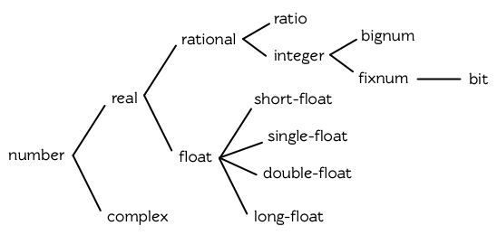

**图 9.1: 数值类型**

要决定计算过程会返回何种数字，以下是某些通用的经验法则：

1. 如果数值函数接受一个或多个浮点数作为参数，则返回值会是浮点数 (或是由浮点数组成的复数)。所以 `(+ 1.0 2)` 求值为 `3.0` ，而 `(+ #c(0 1.0) 2)` 求值为 `#c(2.0 1.0)` 。
2. 可约分的比值会被转换成最简分数。所以 `(/ 10 2)` 会返回 `5` 。
3. 若计算过程中复数的虚部变成 `0` 时，则复数会被转成实数 。所以 `(+ #c(1 -1) #c(2 1))` 求值成 `3` 。

第二、第三个规则可以在读入参数时直接应用，所以：

```lisp
> (list (ratiop 2/2) (complexp #c(1 0)))
(NIL NIL)
```

## 9.2 转换及取出 (Conversion and Extraction)

Lisp 提供四种不同类型的数字的转换及取出位数的函数。函数 `float` 将任何实数转换成浮点数:

```lisp
> (mapcar #'float '(1 2/3 .5))
(1.0 0.6666667 0.5)
```

将数字转成整数未必需要转换，因为它可能牵涉到某些资讯的丧失。函数 `truncate` 返回任何实数的整数部分:

```lisp
> (truncate 1.3)
1
0.29999995
```

第二个返回值 `0.29999995` 是传入的参数减去第一个返回值。(会有 0.00000005 的误差是因为浮点数的计算本身就不精确。)

函数 `floor` 与 `ceiling` 以及 `round` 也从它们的参数中导出整数。使用 `floor` 返回小于等于其参数的最大整数，而 `ceiling` 返回大于或等于其参数的最小整数，我们可以将 `mirror?` (46 页，译注: 3.11 节)改成可以找出所有回文（palindromes）的版本:

```lisp
(defun palindrome? (x)
  (let ((mid (/ (length x) 2)))
    (equal (subseq x 0 (floor mid))
           (reverse (subseq x (ceiling mid))))))
```

和 `truncate` 一样， `floor` 与 `ceiling` 也返回传入参数与第一个返回值的差，作为第二个返回值。

```lisp
> (floor 1.5)
1
0.5
```

实际上，我们可以把 `truncate` 想成是这样定义的:

```lisp
(defun our-truncate (n)
    (if (> n 0)
        (floor n)
        (ceiling n)))
```

函数 `round` 返回最接近其参数的整数。当参数与两个整数的距离相等时， Common Lisp 和很多程序语言一样，不会往上取（round up）整数。而是取最近的偶数：

```lisp
> (mapcar #'round '(-2.5 -1.5 1.5 2.5))
(-2 -2 2 2)
```

在某些数值应用中这是好事，因为舍入误差（rounding error）通常会互相抵消。但要是用户期望你的程序将某些值取整数时，你必须自己提供这个功能。 [[1\]](https://acl.readthedocs.io/en/latest/zhCN/ch9-cn.html#id5) 与其他的函数一样， `round` 返回传入参数与第一个返回值的差，作为第二个返回值。

函数 `mod` 仅返回 `floor` 返回的第二个返回值；而 `rem` 返回 `truncate` 返回的第二个返回值。我们在 94 页（译注： 5.7 节）曾使用 `mod` 来决定一个数是否可被另一个整除，以及 127 页（译注： 7.4 节）用来找出环状缓冲区（ring buffer）中，元素实际的位置。

关于实数，函数 `signum` 返回 `1` 、 `0` 或 `-1` ，取决于它的参数是正数、零或负数。函数 `abs` 返回其参数的绝对值。因此 `(* (abs x) (signum x))` 等于 `x` 。

```lisp
> (mapcar #'signum '(-2 -0.0 0.0 0 .5 3))
(-1 -0.0 0.0 0 1.0 1)
```

在某些应用里， `-0.0` 可能自成一格（in its own right），如上所示。实际上功能上几乎没有差别，因为数值 `-0.0` 与 `0.0` 有着一样的行为。

比值与复数概念上是两部分的结构。(译注：像 **Cons** 这样的两部分结构) 函数 `numerator` 与 `denominator` 返回比值或整数的分子与分母。（如果数字是整数，前者返回该数，而后者返回 `1` 。）函数 `realpart` 与 `imgpart` 返回任何数字的实数与虚数部分。（如果数字不是复数，前者返回该数字，后者返回 `0` 。）

函数 `random` 接受一个整数或浮点数。这样形式的表达式 `(random n)` ，会返回一个大于等于 `0` 并小于 `n` 的数字，并有着与 `n` 相同的类型。

## 9.3 比较 (Comparison)

谓词 `=` 比较其参数，当数值上相等时 ── 即两者的差为零时，返回真。

```lisp
> (= 1 1.0)
T
> (eql 1 1.0)
NIL
```

`=` 比起 `eql` 来得宽松，但参数的类型需一致。

用来比较数字的谓词为 `<` （小于）、 `<=` （小于等于）、 `=` （等于）、 `>=` （大于等于）、 `>` (大于) 以及 `/=` （不相等）。以上所有皆接受一个或多个参数。只有一个参数时，它们全返回真。

```lisp
(<= w x y z)
```

等同于二元操作符的结合（conjunction），应用至每一对参数上:

```lisp
(and (<= w x) (<= x y) (<= y z))
```

由于 `/=` 若它的两个参数不等于时会返回真，表达式

```lisp
(/= w x y z)
```

等同于

```lisp
(and (/= w x) (/= w y) (/= w z)
     (/= x y) (/= y z) (/= y z))
```

特殊的谓词 `zerop` 、 `plusp` 与 `minusp` 接受一个参数，分别于参数 `=` 、 `>` 、 `<` 零时，返回真。虽然 `-0.0` （如果实现有使用它）前面有个负号，但它 `=` 零，

```lisp
> (list (minusp -0.0) (zerop -0.0))
(NIL T)
```

因此对 `-0.0` 使用 `zerop` ，而不是 `minusp` 。

谓词 `oddp` 与 `evenp` 只能用在整数。前者只对奇数返回真，后者只对偶数返回真。

本节定义的谓词中，只有 `=` 、 `/=` 与 `zerop` 可以用在复数。

函数 `max` 与 `min` 分别返回其参数的最大值与最小值。两者至少需要给一个参数:

```lisp
> (list (max 1 2 3 4 5) (min 1 2 3 4 5))
(5 1)
```

如果参数含有浮点数的话，结果的类型取决于各家实现。

## 9.4 算术 (Arithematic)

用来做加减的函数是 `+` 与 `-` 。两者皆接受任何数量的参数，包括没有参数，在没有参数的情况下返回 `0` 。（译注: `-` 在没有参数的情况下会报错，至少要一个参数）一个这样形式的表达式 `(- n)` 返回 `-n` 。一个这样形式的表达式

```lisp
(- x y z)
```

等同于

```lisp
(- (- x y) z)
```

有两个函数 `1+` 与 `1-` ，分别将参数加 `1` 与减 `1` 后返回。 `1-` 有一点误导，因为 `(1- x)` 返回 `x-1` 而不是 `1-x` 。

宏 `incf` 及 `decf` 分别递增与递减数字。这样形式的表达式 `(incf x n)` 类似于 `(setf x (+ x n))` 的效果，而 `(decf x n)` 类似于 `(setf x (- x n))` 的效果。这两个形式里，第二个参数皆是选择性给入的，缺省值为 `1` 。

用来做乘法的函数是 `*` 。接受任何数量的参数。没有参数时返回 `1` 。否则返回参数的乘积。

除法函数 `/` 至少要给一个参数。这样形式的调用 `(/ n)` 等同于 `(/ 1 n)` ，

```lisp
> (/ 3)
1/3
```

而这样形式的调用

```lisp
(/ x y z)
```

等同于

```lisp
(/ (/ x y) z)
```

注意 `-` 与 `/` 两者在这方面的相似性。

当给定两个整数时， `/` 若第一个不是第二个的倍数时，会返回一个比值:

```lisp
> (/ 365 12)
365/12
```

举例来说，如果你试着找出平均每一个月有多长，可能会有解释器在逗你玩的感觉。在这个情况下，你需要的是，对比值调用 `float` ，而不是对两个整数做 `/` 。

```lisp
> (float 365/12)
30.416666
```

## 9.5 指数 (Exponentiation)

要找到 xn𝑥𝑛 调用 `(expt x n)` ，

```lisp
> (expt 2 5)
32
```

而要找到 lognx𝑙𝑜𝑔𝑛𝑥 调用 `(log x n)` :

```lisp
> (log 32 2)
5.0
```

通常返回一个浮点数。

要找到 ex𝑒𝑥 有一个特别的函数 `exp` ，

```lisp
> (exp 2)
7.389056
```

而要找到自然对数，你可以使用 `log` 就好，因为第二个参数缺省为 `e` :

```lisp
> (log 7.389056)
2.0
```

要找到立方根，你可以调用 `expt` 用一个比值作为第二个参数，

```lisp
> (expt 27 1/3)
3.0
```

但要找到平方根，函数 `sqrt` 会比较快:

```lisp
> (sqrt 4)
2.0
```

## 9.6 三角函数 (Trigometric Functions)

常量 `pi` 是 `π` 的浮点表示法。它的精度取决于各家实现。函数 `sin` 、 `cos` 及 `tan` 分别可以找到正弦、余弦及正交函数，其中角度以径度表示：

```lisp
> (let ((x (/ pi 4)))
    (list (sin x) (cos x) (tan x)))
(0.7071067811865475d0 0.7071067811865476d0 1.0d0)
;;; 译注: CCL 1.8  SBCL 1.0.55 下的结果是
;;; (0.7071067811865475D0 0.7071067811865476D0 0.9999999999999999D0)
```

这些函数都接受负数及复数参数。

函数 `asin` 、 `acos` 及 `atan` 实现了正弦、余弦及正交的反函数。参数介于 `-1` 与 `1` 之间（包含）时， `asin` 与 `acos` 返回实数。

双曲正弦、双曲余弦及双曲正交分别由 `sinh` 、 `cosh` 及 `tanh` 实现。它们的反函数同样为 `asinh` 、 `acosh` 以及 `atanh` 。

## 9.7 表示法 (Representations)

Common Lisp 没有限制整数的大小。可以塞进一个字（word）内存的小整数称为定长数(fixnums)。在计算过程中，整数无法塞入一个字时，Lisp 切换至使用多个字的表示法（一个大数 「bignum」）。所以整数的大小限制取决于实体内存，而不是语言。

常量 `most-positive-fixnum` 与 `most-negative-fixnum` 表示一个实现不使用大数所可表示的最大与最小的数字大小。在很多实现里，它们为：

```lisp
> (values most-positive-fixnum most-negative-fixnum)
536870911
-536870912
;;; 译注: CCL 1.8 的结果为
1152921504606846975
-1152921504606846976
;;; SBCL 1.0.55 的结果为
4611686018427387903
-4611686018427387904
```

谓词 `typep` 接受一个参数及一个类型名称，并返回指定类型的参数。所以，

```lisp
> (typep 1 'fixnum)
T
> (type (1+ most-positive-fixnum) 'bignum)
T
```

浮点数的数值限制是取决于各家实现的。 Common Lisp 提供了至多四种类型的浮点数：短浮点 `short-float` 、 单浮点 `single-float` 、双浮点 `double-float` 以及长浮点 `long-float` 。Common Lisp 的实现是不需要用不同的格式来表示这四种类型（很少有实现这么干）。

一般来说，短浮点应可塞入一个字，单浮点与双浮点提供普遍的单精度与双精度浮点数的概念，而长浮点，如果想要的话，可以是很大的数。但实现可以不对这四种类型做区别，也是完全没有问题的。

你可以指定你想要何种格式的浮点数，当数字是用科学表示法时，可以通过将 `e` 替换为 `s` `f` `d` `l` 来得到不同的浮点数。（你也可以使用大写，这对长浮点来说是个好主意，因为 `l` 看起来太像 `1` 了。）所以要表示最大的 `1.0` 你可以写 `1L0` 。

（译注: `s` 为短浮点、 `f` 为单浮点、 `d` 为双浮点、 `l` 为长浮点。）

在给定的实现里，用十六个全局常量标明了每个格式的限制。它们的名字是这种形式: `m-s-f` ，其中 `m` 是 `most` 或 `least` ， `s` 是 `positive` 或 `negative` ，而 `f` 是四种浮点数之一。 [λ](http://acl.readthedocs.org/en/latest/zhCN/notes-cn.html#notes-150)

浮点数下溢（underflow）与溢出（overflow），都会被 Common Lisp 视为错误 :

```lisp
> (* most-positive-long-float 10)
Error: floating-point-overflow
```

## 9.8 范例：追踪光线 (Example: Ray-Tracing)

作为一个数值应用的范例，本节示范了如何撰写一个光线追踪器 (ray-tracer)。光线追踪是一个高级的 (deluxe)渲染算法: 它产生出逼真的图像，但需要花点时间。

要产生一个 3D 的图像，我们至少需要定义四件事: 一个观测点 (eye)、一个或多个光源、一个由一个或多个平面所组成的模拟世界 (simulated world)，以及一个作为通往这个世界的窗户的平面 (图像平面「image plane」)。我们产生出的是模拟世界投影在图像平面区域的图像。

光线追踪独特的地方在于，我们如何找到这个投影: 我们一个一个像素地沿着图像平面走，追踪回到模拟世界里的光线。这个方法带来三个主要的优势: 它让我们容易得到现实世界的光学效应 (optical effect)，如透明度 (transparency)、反射光 (reflected light)以及产生阴影 (cast shadows)；它让我们可以直接用任何我们想要的几何的物体，来定义出模拟的世界，而不需要用多边形 (polygons)来建构它们；以及它很简单实现。

```lisp
(defun sq (x) (* x x))

(defun mag (x y z)
  (sqrt (+ (sq x) (sq y) (sq z))))

(defun unit-vector (x y z)
  (let ((d (mag x y z)))
    (values (/ x d) (/ y d) (/ z d))))

(defstruct (point (:conc-name nil))
  x y z)

(defun distance (p1 p2)
  (mag (- (x p1) (x p2))
       (- (y p1) (y p2))
       (- (z p1) (z p2))))

(defun minroot (a b c)
  (if (zerop a)
      (/ (- c) b)
      (let ((disc (- (sq b) (* 4 a c))))
        (unless (minusp disc)
          (let ((discrt (sqrt disc)))
            (min (/ (+ (- b) discrt) (* 2 a))
                 (/ (- (- b) discrt) (* 2 a))))))))
```

**图 9.2 实用数学函数**

图 9.2 包含了我们在光线追踪器里会需要用到的一些实用数学函数。第一个 `sq` ，返回其参数的平方。下一个 `mag` ，返回一个给定 `x` `y` `z` 所组成向量的大小 (magnitude)。这个函数被接下来两个函数用到。我们在 `unit-vector` 用到了，此函数返回三个数值，来表示与单位向量有着同样方向的向量，其中向量是由 `x` `y` `z` 所组成的:

```lisp
> (multiple-value-call #'mag (unit-vector 23 12 47))
1.0
```

我们在 `distance` 也用到了 `mag` ，它返回三维空间中，两点的距离。（定义 `point` 结构来有一个 `nil` 的 `conc-name` 意味着栏位存取的函数会有跟栏位一样的名字: 举例来说， `x` 而不是 `point-x` 。)

最后 `minroot` 接受三个实数， `a` , `b` 与 `c` ，并返回满足等式 ax2+bx+c=0𝑎𝑥2+𝑏𝑥+𝑐=0 的最小实数 `x` 。当 `a` 不为 00 时，这个等式的根由下面这个熟悉的式子给出:

x=−b±b2−4ac−−−−−−−√2a𝑥=−𝑏±𝑏2−4𝑎𝑐2𝑎

图 9.3 包含了定义一个最小光线追踪器的代码。 它产生通过单一光源照射的黑白图像，与观测点 (eye)处于同个位置。 (结果看起来像是闪光摄影术 (flash photography)拍出来的)

`surface` 结构用来表示模拟世界中的物体。更精确的说，它会被 `included` 至定义具体类型物体的结构里，像是球体 (spheres)。 `surface` 结构本身只包含一个栏位: 一个 `color` 范围从 0 (黑色) 至 1 (白色)。

```lisp
(defstruct surface color)

(defparameter *world* nil)
(defconstant eye (make-point :x 0 :y 0 :z 200))

(defun tracer (pathname &optional (res 1))
  (with-open-file (p pathname :direction :output)
    (format p "P2 ~A ~A 255" (* res 100) (* res 100))
    (let ((inc (/ res)))
      (do ((y -50 (+ y inc)))
          ((< (- 50 y) inc))
        (do ((x -50 (+ x inc)))
            ((< (- 50 x) inc))
          (print (color-at x y) p))))))

(defun color-at (x y)
  (multiple-value-bind (xr yr zr)
                       (unit-vector (- x (x eye))
                                    (- y (y eye))
                                    (- 0 (z eye)))
    (round (* (sendray eye xr yr zr) 255))))

(defun sendray (pt xr yr zr)
  (multiple-value-bind (s int) (first-hit pt xr yr zr)
    (if s
        (* (lambert s int xr yr zr) (surface-color s))
        0)))

(defun first-hit (pt xr yr zr)
  (let (surface hit dist)
    (dolist (s *world*)
      (let ((h (intersect s pt xr yr zr)))
        (when h
          (let ((d (distance h pt)))
            (when (or (null dist) (< d dist))
              (setf surface s hit h dist d))))))
    (values surface hit)))

(defun lambert (s int xr yr zr)
  (multiple-value-bind (xn yn zn) (normal s int)
    (max 0 (+ (* xr xn) (* yr yn) (* zr zn)))))
```

**图 9.3 光线追踪。**

图像平面会是由 x 轴与 y 轴所定义的平面。观测者 (eye) 会在 z 轴，距离原点 200 个单位。所以要在图像平面可以被看到，插入至 `*worlds*` 的表面 (一开始为 `nil`)会有着负的 z 座标。图 9.4 说明了一个光线穿过图像平面上的一点，并击中一个球体。


**图 9.4: 追踪光线。**

函数 `tracer` 接受一个路径名称，并写入一张图片至对应的文件。图片文件会用一种简单的 ASCII 称作 PGM 的格式写入。默认情况下，图像会是 100x100 。我们 PGM 文件的标头 (headers) 会由标签 `P2` 组成，伴随着指定图片宽度 (breadth)与高度 (height)的整数，初始为 100，单位为 pixel，以及可能的最大值 (255)。文件剩余的部份会由 10000 个介于 0 (黑)与 1 (白)整数组成，代表着 100 条 100 像素的水平线。

图片的解析度可以通过给入明确的 `res` 来调整。举例来说，如果 `res` 是 `2` ，则同样的图像会被渲染成 200x200 。

图片是一个在图像平面 100x100 的正方形。每一个像素代表着穿过图像平面抵达观测点的光的数量。要找到每个像素光的数量， `tracer` 调用 `color-at` 。这个函数找到从观测点至该点的向量，并调用 `sendray` 来追踪这个向量回到模拟世界的轨迹； `sandray` 会返回一个数值介于 0 与 1 之间的亮度 (intensity)，之后会缩放成一个 0 至 255 的整数来显示。

要决定一个光线的亮度， `sendray` 需要找到光是从哪个物体所反射的。要办到这件事，我们调用 `first-hit` ，此函数研究在 `*world*` 里的所有平面，并返回光线最先抵达的平面（如果有的话）。如果光没有击中任何东西， `sendray` 仅返回背景颜色，按惯例是 `0` (黑色)。如果光线有击中某物的话，我们需要找出在光击中时，有多少数量的光照在该平面。

[朗伯定律](http://zh.wikipedia.org/zh-tw/比尔－朗伯定律) 告诉我们，由平面上一点所反射的光的强度，正比于该点的单位法向量 (unit normal vector) *N* (这里是与平面垂直且长度为一的向量)与该点至光源的单位向量 *L* 的点积 (dot-product):

i=N⋅L𝑖=𝑁·𝐿

如果光刚好照到这点， *N* 与 *L* 会重合 (coincident)，则点积会是最大值， `1` 。如果将在这时候将平面朝光转 90 度，则 *N* 与 *L* 会垂直，则两者点积会是 `0` 。如果光在平面后面，则点积会是负数。

在我们的程序里，我们假设光源在观测点 (eye)，所以 `lambert` 使用了这个规则来找到平面上某点的亮度 (illumination)，返回我们追踪的光的单位向量与法向量的点积。

在 `sendray` 这个值会乘上平面的颜色 (即便是有好的照明，一个暗的平面还是暗的)来决定该点之后总体亮度。

为了简单起见，我们在模拟世界里会只有一种物体，球体。图 9.5 包含了与球体有关的代码。球体结构包含了 `surface` ，所以一个球体会有一种颜色以及 `center` 和 `radius` 。调用 `defsphere` 添加一个新球体至世界里。

```lisp
(defstruct (sphere (:include surface))
  radius center)

(defun defsphere (x y z r c)
  (let ((s (make-sphere
             :radius r
             :center (make-point :x x :y y :z z)
             :color  c)))
    (push s *world*)
    s))

(defun intersect (s pt xr yr zr)
  (funcall (typecase s (sphere #'sphere-intersect))
           s pt xr yr zr))

(defun sphere-intersect (s pt xr yr zr)
  (let* ((c (sphere-center s))
         (n (minroot (+ (sq xr) (sq yr) (sq zr))
                     (* 2 (+ (* (- (x pt) (x c)) xr)
                             (* (- (y pt) (y c)) yr)
                             (* (- (z pt) (z c)) zr)))
                     (+ (sq (- (x pt) (x c)))
                        (sq (- (y pt) (y c)))
                        (sq (- (z pt) (z c)))
                        (- (sq (sphere-radius s)))))))
    (if n
        (make-point :x  (+ (x pt) (* n xr))
                    :y  (+ (y pt) (* n yr))
                    :z  (+ (z pt) (* n zr))))))

(defun normal (s pt)
  (funcall (typecase s (sphere #'sphere-normal))
           s pt))

(defun sphere-normal (s pt)
  (let ((c (sphere-center s)))
    (unit-vector (- (x c) (x pt))
                 (- (y c) (y pt))
                 (- (z c) (z pt)))))
```

**图 9.5 球体。**

函数 `intersect` 判断与何种平面有关，并调用对应的函数。在此时只有一种， `sphere-intersect` ，但 `intersect` 是写成可以容易扩展处理别种物体。

我们要怎么找到一束光与一个球体的交点 (intersection)呢？光线是表示成点 p=⟨x0,y0,x0⟩𝑝=〈𝑥0,𝑦0,𝑥0〉 以及单位向量 v=⟨xr,yr,xr⟩𝑣=〈𝑥𝑟,𝑦𝑟,𝑥𝑟〉 。每个在光上的点可以表示为 p+nv𝑝+𝑛𝑣 ，对于某个 *n* ── 即 ⟨x0+nxr,y0+nyr,z0+nzr⟩〈𝑥0+𝑛𝑥𝑟,𝑦0+𝑛𝑦𝑟,𝑧0+𝑛𝑧𝑟〉 。光击中球体的点的距离至中心 ⟨xc,yc,zc⟩〈𝑥𝑐,𝑦𝑐,𝑧𝑐〉 会等于球体的半径 *r* 。所以在下列这个交点的方程序会成立:

r=(x0+nxr−xc)2+(y0+nyr−yc)2+(z0+nzr−zc)2−−−−−−−−−−−−−−−−−−−−−−−−−−−−−−−−−−−−−−−−−−−√𝑟=(𝑥0+𝑛𝑥𝑟−𝑥𝑐)2+(𝑦0+𝑛𝑦𝑟−𝑦𝑐)2+(𝑧0+𝑛𝑧𝑟−𝑧𝑐)2

这会给出

an2+bn+c=0𝑎𝑛2+𝑏𝑛+𝑐=0

其中

a=x2r+y2r+z2rb=2((x0−xc)xr+(y0−yc)yr+(z0−zc)zr)c=(x0−xc)2+(y0−yc)2+(z0−zc)2−r2𝑎=𝑥𝑟2+𝑦𝑟2+𝑧𝑟2𝑏=2((𝑥0−𝑥𝑐)𝑥𝑟+(𝑦0−𝑦𝑐)𝑦𝑟+(𝑧0−𝑧𝑐)𝑧𝑟)𝑐=(𝑥0−𝑥𝑐)2+(𝑦0−𝑦𝑐)2+(𝑧0−𝑧𝑐)2−𝑟2

要找到交点我们只需要找到这个二次方程序的根。它可能是零、一个或两个实数根。没有根代表光没有击中球体；一个根代表光与球体交于一点 (擦过 「grazing hit」)；两个根代表光与球体交于两点 (一点交于进入时、一点交于离开时)。在最后一个情况里，我们想要两个根之中较小的那个； *n* 与光离开观测点的距离成正比，所以先击中的会是较小的 *n* 。所以我们调用 `minroot` 。如果有一个根， `sphere-intersect` 返回代表该点的 ⟨x0+nxr,y0+nyr,z0+nzr⟩〈𝑥0+𝑛𝑥𝑟,𝑦0+𝑛𝑦𝑟,𝑧0+𝑛𝑧𝑟〉 。

图 9.5 的另外两个函数， `normal` 与 `sphere-normal` 类比于 `intersect` 与 `sphere-intersect` 。要找到垂直于球体很简单 ── 不过是从该点至球体中心的向量而已。

图 9.6 示范了我们如何产生图片； `ray-test` 定义了 38 个球体（不全都看的见）然后产生一张图片，叫做 “sphere.pgm” 。

(译注：PGM 可移植灰度图格式，更多信息参见 [wiki](http://en.wikipedia.org/wiki/Portable_graymap) )

```lisp
(defun ray-test (&optional (res 1))
  (setf *world* nil)
  (defsphere 0 -300 -1200 200 .8)
  (defsphere -80 -150 -1200 200 .7)
  (defsphere 70 -100 -1200 200 .9)
  (do ((x -2 (1+ x)))
      ((> x 2))
    (do ((z 2 (1+ z)))
        ((> z 7))
      (defsphere (* x 200) 300 (* z -400) 40 .75)))
  (tracer (make-pathname :name "spheres.pgm") res))
```

**图 9.6 使用光线追踪器**

图 9.7 是产生出来的图片，其中 `res` 参数为 10。


**图 9.7: 追踪光线的图**

一个实际的光线追踪器可以产生更复杂的图片，因为它会考虑更多，我们只考虑了单一光源至平面某一点。可能会有多个光源，每一个有不同的强度。它们通常不会在观测点，在这个情况程序需要检查至光源的向量是否与其他平面相交，这会在第一个相交的平面上产生阴影。将光源放置于观测点让我们不需要考虑这麽复杂的情况，因为我们看不见在阴影中的任何点。

一个实际的光线追踪器不仅追踪光第一个击中的平面，也会加入其它平面的反射光。一个实际的光线追踪器会是有颜色的，并可以模型化出透明或是闪耀的平面。但基本的算法会与图 9.3 所演示的差不多，而许多改进只需要递回的使用同样的成分。

一个实际的光线追踪器可以是高度优化的。这里给出的程序为了精简写成，甚至没有如 Lisp 程序员会最佳化的那样，就仅是一个光线追踪器而已。仅加入类型与行内宣告 (13.3 节)就可以让它变得两倍以上快。

## Chapter 9 总结 (Summary)

1. Common Lisp 提供整数 (integers)、比值 (ratios)、浮点数 (floating-point numbers)以及复数 (complex numbers)。
2. 数字可以被约分或转换 (converted)，而它们的位数 (components)可以被取出。
3. 用来比较数字的谓词可以接受任意数量的参数，以及比较下一数对 (successive pairs) ── /= 函数除外，它是用来比较所有的数对 (pairs)。
4. Common Lisp 几乎提供你在低阶科学计算机可以看到的数值函数。同样的函数普遍可应用在多种类型的数字上。
5. Fixnum 是小至可以塞入一个字 (word)的整数。它们在必要时会悄悄但花费昂贵地转成大数 (bignum)。Common Lisp 提供最多四种浮点数。每一个浮点表示法的限制是实现相关的 (implementation-dependent)常量。
6. 一个光线追踪器 (ray-tracer)通过追踪光线来产生图像，使得每一像素回到模拟的世界。

## Chapter 9 练习 (Exercises)

1. 定义一个函数，接受一个实数列表，若且唯若 (iff)它们是非递减 (nondecreasing)顺序时返回真。
2. 定义一个函数，接受一个整数 `cents` 并返回四个值，将数字用 `25-` , `10-` , `5-` , `1-` 来显示，使用最少数量的硬币。(译注: `25-` 是 25 美分，以此类推)
3. 一个遥远的星球住着两种生物， wigglies 与 wobblies 。 Wigglies 与 wobblies 唱歌一样厉害。每年都有一个比赛来选出十大最佳歌手。下面是过去十年的结果:

| YEAR     | 1    | 2    | 3    | 4    | 5    | 6    | 7    | 8    | 9    | 10   |
| :------- | :--- | :--- | :--- | :--- | :--- | :--- | :--- | :--- | :--- | :--- |
| WIGGLIES | 6    | 5    | 6    | 4    | 5    | 5    | 4    | 5    | 6    | 5    |
| WOBBLIES | 4    | 5    | 4    | 6    | 5    | 5    | 6    | 5    | 4    | 5    |

写一个程序来模拟这样的比赛。你的结果实际上有建议委员会每年选出 10 个最佳歌手吗？

1. 定义一个函数，接受 8 个表示二维空间中两个线段端点的实数，若线段没有相交，则返回假，或返回两个值表示相交点的 `x` 座标与 `y` 座标。
2. 假设 `f` 是一个接受一个 (实数) 参数的函数，而 `min` 与 `max` 是有着不同正负号的非零实数，使得 `f` 对于参数 `i` 有一个根 (返回零)并满足 `min < i < max` 。定义一个函数，接受四个参数， `f` , `min` , `max` 以及 `epsilon` ，并返回一个 `i` 的近似值，准确至正负 `epsilon` 之内。
3. *Honer’s method* 是一个有效率求出多项式的技巧。要找到 ax3+bx2+cx+d𝑎𝑥3+𝑏𝑥2+𝑐𝑥+𝑑 你对 `x(x(ax+b)+c)+d` 求值。定义一个函数，接受一个或多个参数 ── x 的值伴随着 *n* 个实数，用来表示 `(n-1)` 次方的多项式的系数 ── 并用 *Honer’s method* 计算出多项式的值。

译注: [Honer’s method on wiki](http://en.wikipedia.org/wiki/Horner's_method)

1. 你的 Common Lisp 实现使用了几个位元来表示定长数？
2. 你的 Common Lisp 实现提供几种不同的浮点数？

脚注

| [[1\]](https://acl.readthedocs.io/en/latest/zhCN/ch9-cn.html#id2) | 当 `format` 取整显示时，它不保证会取成偶数或奇数。见 125 页 (译注: 7.4 节)。 |
| ------------------------------------------------------------ | ------------------------------------------------------------ |
|                                                              |                                                              |

# 第十章：宏

Lisp 代码是由 Lisp 对象的列表来表示。2.3 节宣称这让 Lisp 可以写出**可自己写程序的程序**。本章将示范如何跨越表达式与代码的界线。

## 10.1 求值 (Eval)

如何产生表达式是很直观的：调用 `list` 即可。我们没有考虑到的是，如何使 Lisp 将列表视为代码。这之间缺少的一环是函数 `eval` ，它接受一个表达式，将其求值，然后返回它的值:

```lisp
> (eval '(+ 1 2 3))
6
> (eval '(format t "Hello"))
Hello
NIL
```

如果这看起很熟悉的话，这是应该的。这就是我们一直交谈的那个 `eval` 。下面这个函数实现了与顶层非常相似的东西:

```lisp
(defun our-toplevel ()
  (do ()
      (nil)
    (format t "~%> ")
    (print (eval (read)))))
```

也是因为这个原因，顶层也称为**读取─求值─打印循环** (read-eval-print loop, REPL)。

调用 `eval` 是跨越代码与列表界线的一种方法。但它不是一个好方法:

1. 它的效率低下： `eval` 处理的是原始列表 (raw list)，或者当下编译它，或者用直译器求值。两种方法都比执行编译过的代码来得慢许多。
2. 表达式在没有词法语境 (lexical context)的情况下被求值。举例来说，如果你在一个 `let` 里调用 `eval` ，传给 `eval` 的表达式将无法引用由 `let` 所设置的变量。

有许多更好的方法 (下一节叙述)来利用产生代码的这个可能性。当然 `eval` 也是有用的，唯一合法的用途像是在顶层循环使用它。

对于程序员来说， `eval` 的主要价值大概是作为 Lisp 的概念模型。我们可以想像 Lisp 是由一个长的 `cond` 表达式定义而成:

```lisp
(defun eval (expr env)
  (cond ...
        ((eql (car expr) 'quote) (cdr expr))
        ...
        (t (apply (symbol-function (car expr))
                  (mapcar #'(lambda (x)
                              (eval x env))
                          (cdr expr))))))
```

许多表达式由预设子句 (default clause)来处理，预设子句获得 `car` 所引用的函数，将 `cdr` 所有的参数求值，并返回将前者应用至后者的结果。 [[1\]](https://acl.readthedocs.io/en/latest/zhCN/ch10-cn.html#id5)

但是像 `(quote x)` 那样的句子就不能用这样的方式来处理，因为 `quote` 就是为了防止它的参数被求值而存在的。所以我们需要给 `quote` 写一个特别的子句。这也是为什么本质上将其称为特殊操作符 (special operator): 一个需要被实现为 `eval` 的一个特殊情况的操作符。

函数 `coerce` 与 `compile` 提供了一个类似的桥梁，让你把列表转成代码。你可以 `coerce` 一个 lambda 表达式，使其成为函数，

```lisp
> (coerce '(lambda (x) x) 'function)
#<Interpreted-Function BF9D96>
```

而如果你将 `nil` 作为第一个参数传给 `compile` ，它会编译作为第二个参数传入的 lambda 表达式。

```lisp
> (compile nil '(lambda (x) (+ x 2)))
#<Compiled-Function BF55BE>
NIL
NIL
```

由于 `coerce` 与 `compile` 可接受列表作为参数，一个程序可以在动态执行时 (on the fly)构造新函数。但与调用 `eval` 比起来，这不是一个从根本解决的办法，并且需抱有同样的疑虑来检视这两个函数。

函数 `eval` , `coerce` 与 `compile` 的麻烦不是它们跨越了代码与列表之间的界线，而是它们在执行期做这件事。跨越界线的代价昂贵。大多数情况下，在编译期做这件事是没问题的，当你的程序执行时，几乎不用成本。下一节会示范如何办到这件事。

## 10.2 宏 (Macros)

写出能写程序的程序的最普遍方法是通过定义宏。*宏*是通过转换 (transformation)而实现的操作符。你通过说明你一个调用应该要翻译成什么，来定义一个宏。这个翻译称为宏展开(macro-expansion)，宏展开由编译器自动完成。所以宏所产生的代码，会变成程序的一个部分，就像你自己输入的程序一样。

宏通常通过调用 `defmacro` 来定义。一个 `defmacro` 看起来很像 `defun` 。但是与其定义一个函数调用应该产生的值，它定义了该怎么翻译出一个函数调用。举例来说，一个将其参数设为 `nil` 的宏可以定义成如下:

```lisp
(defmacro nil! (x)
  (list 'setf x nil))
```

这定义了一个新的操作符，称为 `nil!` ，它接受一个参数。一个这样形式 `(nil! a)` 的调用，会在求值或编译前，被翻译成 `(setf a nil)` 。所以如果我们输入 `(nil! x)` 至顶层，

```lisp
> (nil! x)
NIL
> x
NIL
```

完全等同于输入表达式 `(setf x nil)` 。

要测试一个函数，我们调用它，但要测试一个宏，我们看它的展开式 (expansion)。

函数 `macroexpand-1` 接受一个宏调用，并产生它的展开式:

```lisp
> (macroexpand-1 '(nil! x))
(SETF X NIL)
T
```

一个宏调用可以展开成另一个宏调用。当编译器（或顶层）遇到一个宏调用时，它持续展开它，直到不可展开为止。

理解宏的秘密是理解它们是如何被实现的。在台面底下，它们只是转换成表达式的函数。举例来说，如果你传入这个形式 `(nil! a)` 的表达式给这个函数

```lisp
(lambda (expr)
  (apply #'(lambda (x) (list 'setf x nil))
         (cdr expr)))
```

它会返回 `(setf a nil)` 。当你使用 `defmacro` ，你定义一个类似这样的函数。 `macroexpand-1` 全部所做的事情是，当它看到一个表达式的 `car` 是宏时，将表达式传给对应的函数。

## 10.3 反引号 (Backquote)

反引号读取宏 (read-macro)使得从模版 (templates)建构列表变得有可能。反引号广泛使用在宏定义中。一个平常的引用是键盘上的右引号 (apostrophe)，然而一个反引号是一个左引号。(译注: open quote 左引号，closed quote 右引号)。它称作“反引号”是因为它看起来像是反过来的引号 (titled backwards)。

(译注: 反引号是键盘左上方数字 1 左边那个: \` ，而引号是 enter 左边那个 `'`)

一个反引号单独使用时，等于普通的引号:

```lisp
> `(a b c)
(A B C)
```

和普通引号一样，单一个反引号保护其参数被求值。

反引号的优点是，在一个反引号表达式里，你可以使用 `,` （逗号）与 `,@` （comma-at）来重启求值。如果你在反引号表达式里，在某个东西前面加逗号，则它会被求值。所以我们可以使用反引号与逗号来建构列表模版:

```lisp
> (setf a 1 b 2)
2
> `(a is ,a and b is ,b)
(A IS 1 AND B IS 2)
```

通过使用反引号取代调用 `list` ，我们可以写出会产生出展开式的宏。举例来说 `nil!` 可以定义为:

```lisp
(defmacro nil! (x)
  `(setf ,x nil))
```

`,@` 与逗号相似，但将（本来应该是列表的）参数扒开。将列表的元素插入模版来取代列表。

```lisp
> (setf lst '(a b c))
(A B C)
> `(lst is ,lst)
(LST IS (A B C))
> `(its elements are ,@lst)
(ITS ELEMENTS ARE A B C)
```

`,@` 在宏里很有用，举例来说，在用剩余参数表示代码主体的宏。假设我们想要一个 `while` 宏，只要初始测试表达式为真，对其主体求值:

```lisp
> (let ((x 0))
    (while (< x 10)
       (princ x)
       (incf x)))
0123456789
NIL
```

我们可以通过使用一个剩余参数 (rest parameter) ，搜集主体的表达式列表，来定义一个这样的宏，接着使用 comma-at 来扒开这个列表放至展开式里:

```lisp
(defmacro while (test &rest body)
  `(do ()
       ((not ,test))
     ,@body))
```

## 10.4 示例：快速排序法(Example: Quicksort)

图 10.1 包含了重度依赖宏的一个示例函数 ── 一个使用快速排序演算法 [λ](http://acl.readthedocs.org/en/latest/zhCN/notes-cn.html#notes-164) 来排序向量的函数。这个函数的工作方式如下:

```lisp
(defun quicksort (vec l r)
  (let ((i l)
        (j r)
        (p (svref vec (round (+ l r) 2))))    ; 1
    (while (<= i j)                           ; 2
      (while (< (svref vec i) p) (incf i))
      (while (> (svref vec j) p) (decf j))
      (when (<= i j)
        (rotatef (svref vec i) (svref vec j))
        (incf i)
        (decf j)))
    (if (>= (- j l) 1) (quicksort vec l j))    ; 3
    (if (>= (- r i) 1) (quicksort vec i r)))
  vec)
```

**图 10.1 快速排序。**

1. 开始你通过选择某个元素作为主键（ *pivot* ）。许多实现选择要被排序的序列中间元素。
2. 接着你分割（partition）向量，持续交换元素，直到所有主键左边的元素小于主键，右边的元素大于主键。
3. 最后，如果左右分割之一有两个或更多元素时，你递归地应用这个算法至向量的那些分割上。

每一次递归时，分割越变越小，直到向量完整排序为止。

在图 10.1 的实现里，接受一个向量以及标记欲排序范围的两个整数。这个范围当下的中间元素被选为主键 ( `p` )。接着从左右两端开始产生分割，并将左边太大或右边太小的元素交换过来。(将两个参数传给 `rotatef` 函数，交换它们的值。)最后，如果一个分割含有多个元素时，用同样的流程来排序它们。

除了我们前一节定义的 `while` 宏之外，图 10.1 也用了内置的 `when` , `incf` , `decf` 以及 `rotatef` 宏。使用这些宏使程序看起来更加简洁与清晰。

## 10.5 设计宏 (Macro Design)

撰写宏是一种独特的程序设计，它有着独一无二的目标与问题。能够改变编译器所看到的东西，就像是能够重写它一样。所以当你开始撰写宏时，你需要像语言设计者一样思考。

本节快速给出宏所牵涉问题的概要，以及解决它们的技巧。作为一个例子，我们会定义一个称为 `ntimes` 的宏，它接受一个数字 *n* 并对其主体求值 *n* 次。

```lisp
> (ntimes 10
    (princ "."))
..........
NIL
```

下面是一个不正确的 `ntimes` 定义，说明了宏设计中的某些议题:

```lisp
(defmacro ntimes (n &rest body)
  `(do ((x 0 (+ x 1)))
       ((>= x ,n))
     ,@body))
```

这个定义第一眼看起来可能没问题。在上面这个情况，它会如预期的工作。但实际上它在两个方面坏掉了。

一个宏设计者需要考虑的问题之一是，不小心引入的变量捕捉 (variable capture)。这发生在当一个在宏展开式里用到的变量，恰巧与展开式即将插入的语境里，有使用同样名字作为变量的情况。不正确的 `ntimes` 定义创造了一个变量 `x` 。所以如果这个宏在已经有 `x` 作为名字的地方被调用时，它可能无法做到我们所预期的:

```lisp
> (let ((x 10))
    (ntimes 5
       (setf x (+ x 1)))
    x)
10
```

如果 `ntimes` 如我们预期般的执行，这个表达式应该会对 `x` 递增五次，最后返回 `15` 。但因为宏展开刚好使用 `x` 作为迭代变量， `setf` 表达式递增那个 `x` ，而不是我们要递增的那个。一旦宏调用被展开，前述的展开式变成:

```lisp
> (let ((x 10))
    (do ((x 0 (+ x 1)))
        ((>= x 5))
      (setf x (+ x 1)))
    x)
```

最普遍的解法是不要使用任何可能会被捕捉的一般符号。取而代之的我们使用 gensym (8.4 小节)。因为 `read` 函数 `intern` 每个它见到的符号，所以在一个程序里，没有可能会有任何符号会 `eql` gensym。如果我们使用 gensym 而不是 `x` 来重写 `ntimes` 的定义，至少对于变量捕捉来说，它是安全的:

```lisp
(defmacro ntimes (n &rest body)
  (let ((g (gensym)))
    `(do ((,g 0 (+ ,g 1)))
         ((>= ,g ,n))
       ,@body)))
```

但这个宏在另一问题上仍有疑虑: 多重求值 (multiple evaluation)。因为第一个参数被直接插入 `do` 表达式，它会在每次迭代时被求值。当第一个参数是有副作用的表达式，这个错误非常清楚地表现出来:

```lisp
> (let ((v 10))
    (ntimes (setf v (- v 1))
      (princ ".")))
.....
NIL
```

由于 `v` 一开始是 `10` ，而 `setf` 返回其第二个参数的值，应该印出九个句点。实际上它只印出五个。

如果我们看看宏调用所展开的表达式，就可以知道为什么:

```lisp
> (let ((v 10))
    (do ((#:g1 0 (+ #:g1 1)))
        ((>= #:g1 (setf v (- v 1))))
      (princ ".")))
```

每次迭代我们不是把迭代变量 (gensym 通常印出前面有 `#:` 的符号)与 `9` 比较，而是与每次求值时会递减的表达式比较。这如同每次我们查看地平线时，地平线都越来越近。

避免非预期的多重求值的方法是设置一个变量，在任何迭代前将其设为有疑惑的那个表达式。这通常牵扯到另一个 gensym:

```lisp
(defmacro ntimes (n &rest body)
  (let ((g (gensym))
        (h (gensym)))
    `(let ((,h ,n))
       (do ((,g 0 (+ ,g 1)))
           ((>= ,g ,h))
         ,@body))))
```

终于，这是一个 `ntimes` 的正确定义。

非预期的变量捕捉与多重求值是折磨宏的主要问题，但不只有这些问题而已。有经验后，要避免这样的错误与避免更熟悉的错误一样简单，比如除以零的错误。

你的 Common Lisp 实现是一个学习更多有关宏的好地方。借由调用展开至内置宏，你可以理解它们是怎么写的。下面是大多数实现对于一个 `cond` 表达式会产生的展开式:

```lisp
> (pprint (macroexpand-1 '(cond (a b)
                                (c d e)
                                (t f))))
(IF A
    B
    (IF C
        (PROGN D E)
        F))
```

函数 `pprint` 印出像代码一样缩排的表达式，这在检视宏展开式时特别有用。

## 10.6 通用化引用 (Generalized Reference)

由于一个宏调用可以直接在它出现的地方展开成代码，任何展开为 `setf` 表达式的宏调用都可以作为 `setf` 表达式的第一个参数。 举例来说，如果我们定义一个 `car` 的同义词，

```lisp
(defmacro cah (lst) `(car ,lst))
```

然后因为一个 `car` 调用可以是 `setf` 的第一个参数，而 `cah` 一样可以:

```lisp
> (let ((x (list 'a 'b 'c)))
    (setf (cah x) 44)
    x)
(44 B C)
```

撰写一个展开成一个 `setf` 表达式的宏是另一个问题，是一个比原先看起来更为困难的问题。看起来也许你可以这样实现 `incf` ，只要

```lisp
(defmacro incf (x &optional (y 1)) ; wrong
  `(setf ,x (+ ,x ,y)))
```

但这是行不通的。这两个表达式不相等:

```lisp
(setf (car (push 1 lst)) (1+ (car (push 1 lst))))

(incf (car (push 1 lst)))
```

如果 `lst` 是 `nil` 的话，第二个表达式会设成 `(2)` ，但第一个表达式会设成 `(1 2)` 。

Common Lisp 提供了 `define-modify-macro` 作为写出对于 `setf` 限制类别的宏的一种方法 它接受三个参数: 宏的名字，额外的参数 (隐含第一个参数 `place`)，以及产生出 `place` 新数值的函数名。所以我们可以将 `incf` 定义为

```lisp
(define-modify-macro our-incf (&optional (y 1)) +)
```

另一版将元素推至列表尾端的 `push` 可写成：

```lisp
(define-modify-macro append1f (val)
  (lambda (lst val) (append lst (list val))))
```

后者会如下工作:

```lisp
> (let ((lst '(a b c)))
    (append1f lst 'd)
    lst)
(A B C D)
```

顺道一提， `push` 与 `pop` 都不能定义为 modify-macros，前者因为 `place` 不是其第一个参数，而后者因为其返回值不是更改后的对象。

## 10.7 示例：实用的宏函数 (Example: Macro Utilities)

6.4 节介绍了实用函数 (utility)的概念，一种像是构造 Lisp 的通用操作符。我们可以使用宏来定义不能写作函数的实用函数。我们已经见过几个例子: `nil!` , `ntimes` 以及 `while` ，全部都需要写成宏，因为它们全都需要某种控制参数求值的方法。本节给出更多你可以使用宏写出的多种实用函数。图 10.2 挑选了几个实践中证实值得写的实用函数。

```lisp
(defmacro for (var start stop &body body)
  (let ((gstop (gensym)))
    `(do ((,var ,start (1+ ,var))
          (,gstop ,stop))
         ((> ,var ,gstop))
       ,@body)))

(defmacro in (obj &rest choices)
  (let ((insym (gensym)))
    `(let ((,insym ,obj))
       (or ,@(mapcar #'(lambda (c) `(eql ,insym ,c))
                     choices)))))

(defmacro random-choice (&rest exprs)
  `(case (random ,(length exprs))
     ,@(let ((key -1))
         (mapcar #'(lambda (expr)
                     `(,(incf key) ,expr))
                 exprs))))

(defmacro avg (&rest args)
  `(/ (+ ,@args) ,(length args)))

(defmacro with-gensyms (syms &body body)
  `(let ,(mapcar #'(lambda (s)
                     `(,s (gensym)))
                 syms)
     ,@body))

(defmacro aif (test then &optional else)
  `(let ((it ,test))
     (if it ,then ,else)))
```

**图 10.2: 实用宏函数**

第一个 `for` ，设计上与 `while` 相似 (164 页，译注: 10.3 节)。它是给需要使用一个绑定至一个值的范围的新变量来对主体求值的循环:

```lisp
> (for x 1 8
          (princ x))
12345678
NIL
```

这比写出等效的 `do` 来得省事，

```lisp
(do ((x 1 (+ x 1)))
    ((> x 8))
  (princ x))
```

这非常接近实际的展开式:

```lisp
(do ((x 1 (1+ x))
     (#:g1 8))
    ((> x #:g1))
  (princ x))
```

宏需要引入一个额外的变量来持有标记范围 (range)结束的值。 上面在例子里的 `8` 也可是个函数调用，这样我们就不需要求值好几次。额外的变量需要是一个 gensym ，为了避免非预期的变量捕捉。

图 10.2 的第二个宏 `in` ，若其第一个参数 `eql` 任何自己其他的参数时，返回真。表达式我们可以写成:

```lisp
(in (car expr) '+ '- '*)
```

我们可以改写成:

```lisp
(let ((op (car expr)))
  (or (eql op '+)
      (eql op '-)
      (eql op '*)))
```

确实，第一个表达式展开后像是第二个，除了变量 `op` 被一个 gensym 取代了。

下一个例子 `random-choice` ，随机选取一个参数求值。在 74 页 (译注: 第 4 章的图 4.6)我们需要随机在两者之间选择。 `random-choice` 宏实现了通用的解法。一个像是这样的调用:

```lisp
(random-choice (turn-left) (turn-right))
```

会被展开为:

```lisp
(case (random 2)
  (0 (turn-left))
  (1 (turn-right)))
```

下一个宏 `with-gensyms` 主要预期用在宏主体里。它不寻常，特别是在特定应用中的宏，需要 gensym 几个变量。有了这个宏，与其

```lisp
(let ((x (gensym)) (y (gensym)) (z (gensym)))
        ...)
```

我们可以写成

```lisp
(with-gensyms (x y z)
        ...)
```

到目前为止，图 10.2 定义的宏，没有一个可以定义成函数。作为一个规则，写成宏是因为你不能将它写成函数。但这个规则有几个例外。有时候你或许想要定义一个操作符来作为宏，好让它在编译期完成它的工作。宏 `avg` 返回其参数的平均值，

```lisp
> (avg 2 4 8)
14/3
```

是一个这种例子的宏。我们可以将 `avg` 写成函数，

```lisp
(defun avg (&rest args)
  (/ (apply #'+ args) (length args)))
```

但它会需要在执行期找出参数的数量。只要我们愿意放弃应用 `avg` ，为什么不在编译期调用 `length` 呢？

图 10.2 的最后一个宏是 `aif` ，它在此作为一个故意变量捕捉的例子。它让我们可以使用变量 `it` 来引用到一个条件式里的测试参数所返回的值。也就是说，与其写成

```lisp
(let ((val (calculate-something)))
  (if val
      (1+ val)
      0))
```

我们可以写成

```lisp
(aif (calculate-something)
     (1+ it)
     0)
```

**小心使用** ( *Use judiciously*)，预期的变量捕捉可以是一个无价的技巧。Common Lisp 本身在多处使用它: 举例来说 `next-method-p` 与 `call-next-method` 皆依赖于变量捕捉。

像这些宏明确演示了为何要撰写替你写程序的程序。一旦你定义了 `for` ，你就不需要写整个 `do` 表达式。值得写一个宏只为了节省打字吗？非常值得。节省打字是程序设计的全部；一个编译器的目的便是替你省下使用机械语言输入程序的时间。而宏允许你将同样的优点带到特定的应用里，就像高阶语言带给程序语言一般。通过审慎的使用宏，你也许可以使你的程序比起原来大幅度地精简，并使程序更显着地容易阅读、撰写及维护。

如果仍对此怀疑，考虑看看如果你没有使用任何内置宏时，程序看起来会是怎么样。所有宏产生的展开式，你会需要用手产生。你也可以将这个问题用在另一方面。当你在撰写一个程序时，扪心自问，我需要撰写宏展开式吗？如果是的话，宏所产生的展开式就是你需要写的东西。

## 10.8 源自 Lisp (On Lisp)

现在宏已经介绍过了，我们看过更多的 Lisp 是由超乎我们想像的 Lisp 写成。许多不是函数的 Common Lisp 操作符是宏，而他们全部用 Lisp 写成的。只有二十五个 Common Lisp 内置的操作符是特殊操作符。

[John Foderaro](http://www.franz.com/about/bios/jkf.lhtml) 将 Lisp 称为“可程序的程序语言。” [λ](http://acl.readthedocs.org/en/latest/zhCN/notes-cn.html#notes-173) 通过撰写你自己的函数与宏，你将 Lisp 变成任何你想要的语言。 (我们会在 17 章看到这个可能性的图形化示范)无论你的程序适合何种形式，你确信你可以将 Lisp 塑造成适合它的语言。

宏是这个灵活性的主要成分之一。它们允许你将 Lisp 变得完全认不出来，但仍然用一种有原则且高效的方法来实作。在 Lisp 社区里，宏是个越来越感兴趣的主题。可以使用宏办到惊人之事是很清楚的，但更确信的是宏背后还有更多需要被探索。如果你想的话，可以通过你来发现。Lisp 永远将进化放在程序员手里。这是它为什么存活的原因。

## Chapter 10 总结 (Summary)

1. 调用 `eval` 是让 Lisp 将列表视为代码的一种方法，但这是不必要而且效率低落的。
2. 你通过叙说一个调用会展开成什么来定义一个宏。台面底下，宏只是返回表达式的函数。
3. 一个使用反引号定义的主体看起来像它会产生出的展开式 (expansion)。
4. 宏设计者需要注意变量捕捉及多重求值。宏可以通过漂亮印出 (pretty-printing)来测试它们的展开式。
5. 多重求值是大多数展开成 `setf` 表达式的问题。
6. 宏比函数来得灵活，可以用来定义许多实用函数。你甚至可以使用变量捕捉来获得好处。
7. Lisp 存活的原因是它将进化交给程序员的双手。宏是使其可能的部分原因之一。

## Chapter 10 练习 (Exercises)

1. 如果 `x` 是 `a` ， `y` 是 `b` 以及 `z` 是 `(c d)` ，写出反引用表达式仅包含产生下列结果之一的变量:

```lisp
(a) ((C D) A Z)

(b) (X B C D)

(c) ((C D A) Z)
```

1. 使用 `cond` 来定义 `if` 。
2. 定义一个宏，接受一个数字 *n* ，伴随着一个或多个表达式，并返回第 *n* 个表达式的值:

```lisp
> (let ((n 2))
    (nth-expr n (/ 1 0) (+ 1 2) (/ 1 0)))
3
```

1. 定义 `ntimes` (167 页，译注: 10.5 节)使其展开成一个 (区域)递归函数，而不是一个 `do` 表达式。
2. 定义一个宏 `n-of` ，接受一个数字 *n* 与一个表达式，返回一个 *n* 个渐进值:

```lisp
> (let ((i 0) (n 4))
    (n-of n (incf i)))
(1 2 3 4)
```

1. 定义一个宏，接受一变量列表以及一个代码主体，并确保变量在代码主体被求值后恢复 (revert)到原本的数值。
2. 下面这个 `push` 的定义哪里错误？

```lisp
(defmacro push (obj lst)
  `(setf ,lst (cons ,obj ,lst)))

举出一个不会与实际 push 做一样事情的函数调用例子。
```

1. 定义一个将其参数翻倍的宏:

```lisp
> (let ((x 1))
    (double x)
    x)
2
```

脚注

| [[1\]](https://acl.readthedocs.io/en/latest/zhCN/ch10-cn.html#id2) | 要真的复制一个 Lisp 的话， `eval` 会需要接受第二个参数 (这里的 `env`) 来表示词法环境 (lexical enviroment)。这个模型的 `eval` 是不正确的，因为它在对参数求值前就取出函数，然而 Common Lisp 故意没有特别指出这两个操作的顺序。 |
| ------------------------------------------------------------ | ------------------------------------------------------------ |
|                                                              |                                                              |

# 第十一章：Common Lisp 对象系统[¶](https://acl.readthedocs.io/en/latest/zhCN/ch11-cn.html#common-lisp)

Common Lisp 对象系统，或称 CLOS，是一组用来实现面向对象编程的操作集。由于它们有着同样的历史，通常将这些操作视为一个群组。 [λ](http://acl.readthedocs.org/en/latest/zhCN/notes-cn.html#notes-176) 技术上来说，它们与其他部分的 Common Lisp 没什么大不同： `defmethod` 和 `defun` 一样，都是整合在语言中的一个部分。

## 11.1 面向对象编程 Object-Oriented Programming

面向对象编程意味着程序组织方式的改变。这个改变跟已经发生过的处理器运算处理能力分配的变化雷同。在 1970 年代，一个多用户的计算机系统代表着，一个或两个大型机连接到大量的[哑终端](http://zh.wikipedia.org/wiki/哑终端)(dumb terminal)。现在更可能的是大量相互通过网络连接的工作站 (workstation)。系统的运算处理能力现在分布至个体用户上，而不是集中在一台大型的计算机上。

面向对象编程所带来的变革与上例非常类似，前者打破了传统程序的组织方式。不再让单一的程序去操作那些数据，而是告诉数据自己该做什么，程序隐含在这些新的数据“对象”的交互过程之中。

举例来说，假设我们要算出一个二维图形的面积。一个办法是写一个单独的函数，让它检查其参数的类型，然后视类型做处理，如图 11.1 所示。

```lisp
(defstruct rectangle
  height width)

(defstruct circle
  radius)

(defun area (x)
  (cond ((rectangle-p x)
         (* (rectangle-height x) (rectangle-width x)))
        ((circle-p x)
         (* pi (expt (circle-radius x) 2)))))

> (let ((r (make-rectangle)))
    (setf (rectangle-height r) 2
          (rectangle-width r) 3)
    (area r))
6
```

**图 11.1: 使用结构及函数来计算面积**

使用 CLOS 我们可以写出一个等效的程序，如图 11.2 所示。在面向对象模型里，我们的程序被拆成数个独一无二的方法，每个方法为某些特定类型的参数而生。图 11.2 中的两个方法，隐性地定义了一个与图 11.1 相似作用的 `area` 函数，当我们调用 `area` 时，Lisp 检查参数的类型，并调用相对应的方法。

```lisp
(defclass rectangle ()
  (height width))

(defclass circle ()
  (radius))

(defmethod area ((x rectangle))
  (* (slot-value x 'height) (slot-value x 'width)))

(defmethod area ((x circle))
  (* pi (expt (slot-value x 'radius) 2)))

> (let ((r (make-instance 'rectangle)))
    (setf (slot-value r 'height) 2
          (slot-value r 'width) 3)
    (area r))
6
```

**图 11.2: 使用类型与方法来计算面积**

通过这种方式，我们将函数拆成独一无二的方法，面向对象暗指*继承* (*inheritance*) ── 槽（slot）与方法（method）皆有继承。在图 11.2 中，作为第二个参数传给 `defclass` 的空列表列出了所有基类。假设我们要定义一个新类，上色的圆形 (colored-circle)，则上色的圆形有两个基类， `colored` 与 `circle` ：

```lisp
(defclass colored ()
  (color))

(defclass colored-circle (circle colored)
  ())
```

当我们创造 `colored-circle` 类的实例 (instance)时，我们会看到两个继承：

1. `colored-circle` 的实例会有两个槽：从 `circle` 类继承而来的 `radius` 以及从 `colored` 类继承而来的 `color` 。
2. 由于没有特别为 `colored-circle` 定义的 `area` 方法存在，若我们对 `colored-circle` 实例调用 `area` ，我们会获得替 `circle` 类所定义的 `area` 方法。

从实践层面来看，面向对象编程代表着以方法、类、实例以及继承来组织程序。为什么你会想这么组织程序？面向对象方法的主张之一说这样使得程序更容易改动。如果我们想要改变 `ob` 类对象所显示的方式，我们只需要改动 `ob` 类的 `display` 方法。如果我们希望创建一个新的类，大致上与 `ob` 相同，只有某些方面不同，我们可以创建一个 `ob` 类的子类。在这个子类里，我们仅改动我们想要的属性，其他所有的属性会从 `ob` 类默认继承得到。要是我们只是想让某个 `ob` 对象和其他的 `ob` 对象不一样，我们可以新建一个 `ob` 对象，直接修改这个对象的属性即可。若是当时的程序写的很讲究，我们甚至不需要看程序中其他的代码一眼，就可以完成种种的改动。 [λ](http://acl.readthedocs.org/en/latest/zhCN/notes-cn.html#notes-178)

## 11.2 类与实例 (Class and Instances)

在 4.6 节时，我们看过了创建结构的两个步骤：我们调用 `defstruct` 来设计一个结构的形式，接着通过一个像是 `make-point` 这样特定的函数来创建结构。创建实例 (instances)同样需要两个类似的步骤。首先我们使用 `defclass` 来定义一个类别 (Class):

```lisp
(defclass circle ()
  (radius center))
```

这个定义说明了 `circle` 类别的实例会有两个槽 (*slot*)，分别名为 `radius` 与 `center` （槽类比于结构里的字段 「field」）。

要创建这个类的实例，我们调用通用的 `make-instance` 函数，而不是调用一个特定的函数，传入的第一个参数为类别名称：

```lisp
> (setf c (make-instance 'circle))
#<CIRCLE #XC27496>
```

要给这个实例的槽赋值，我们可以使用 `setf` 搭配 `slot-value` ：

```lisp
> (setf (slot-value c 'radius) 1)
1
```

与结构的字段类似，未初始化的槽的值是未定义的 (undefined)。

## 11.3 槽的属性 (Slot Properties)

传给 `defclass` 的第三个参数必须是一个槽定义的列表。如上例所示，最简单的槽定义是一个表示其名称的符号。在一般情况下，一个槽定义可以是一个列表，第一个是槽的名称，伴随着一个或多个属性 (property)。属性像关键字参数那样指定。

通过替一个槽定义一个访问器 (accessor)，我们隐式地定义了一个可以引用到槽的函数，使我们不需要再调用 `slot-value` 函数。如果我们如下更新我们的 `circle` 类定义，

```lisp
(defclass circle ()
  ((radius :accessor circle-radius)
   (center :accessor circle-center)))
```

那我们能够分别通过 `circle-radius` 及 `circle-center` 来引用槽：

```lisp
> (setf c (make-instance 'circle))
#<CIRCLE #XC5C726>

> (setf (circle-radius c) 1)
1

> (circle-radius c)
1
```

通过指定一个 `:writer` 或是一个 `:reader` ，而不是 `:accessor` ，我们可以获得访问器的写入或读取行为。

要指定一个槽的缺省值，我们可以给入一个 `:initform` 参数。若我们想要在 `make-instance` 调用期间就将槽初始化，我们可以用 `:initarg` 定义一个参数名。 [[1\]](https://acl.readthedocs.io/en/latest/zhCN/ch11-cn.html#id8) 加入刚刚所说的两件事，现在我们的类定义变成：

```lisp
(defclass circle ()
  ((radius :accessor circle-radius
           :initarg :radius
           :initform 1)
   (center :accessor circle-center
           :initarg :center
           :initform (cons 0 0))))
```

现在当我们创建一个 `circle` 类的实例时，我们可以使用关键字参数 `:initarg` 给槽赋值，或是將槽的值设为 `:initform` 所指定的缺省值。

```lisp
> (setf c (make-instance 'circle :radius 3))
#<CIRCLE #XC2DE0E>
> (circle-radius c)
3
> (circle-center c)
(0 . 0)
```

注意 `initarg` 的优先级比 `initform` 要高。

我们可以指定某些槽是共享的 ── 也就是每个产生出来的实例，共享槽的值都会是一样的。我们通过声明槽拥有 `:allocation :class` 来办到此事。（另一个办法是让一个槽有 `:allocation :instance` ，但由于这是缺省设置，不需要特别再声明一次。）当我们在一个实例中，改变了共享槽的值，则其它实例共享槽也会获得相同的值。所以我们会想要使用共享槽来保存所有实例都有的相同属性。

举例来说，假设我们想要模拟一群成人小报 (a flock of tabloids)的行为。（**译注**：可以看看[什么是 tabloids](http://tinyurl.com/9n4dckk)。）在我们的模拟中，我们想要能够表示一个事实，也就是当一家小报采用一个头条时，其它小报也会跟进的这个行为。我们可以通过让所有的实例共享一个槽来实现。若 `tabloid` 类别像下面这样定义，

```lisp
(defclass tabloid ()
  ((top-story :accessor tabloid-story
              :allocation :class)))
```

那么如果我们创立两家小报，无论一家的头条是什么，另一家的头条也会是一样的：

```lisp
> (setf daily-blab (make-instance 'tabloid)
        unsolicited-mail (make-instance 'tabloid))
#<TABLOID #x302000EFE5BD>
> (setf (tabloid-story daily-blab) 'adultery-of-senator)
ADULTERY-OF-SENATOR
> (tabloid-story unsolicited-mail)
ADULTERY-OF-SENATOR
```

**译注**： ADULTERY-OF-SENATOR 参议员的性丑闻。

若有给入 `:documentation` 属性的话，用来作为 `slot` 的文档字符串。通过指定一个 `:type` ，你保证一个槽里只会有这种类型的元素。类型声明会在 13.3 节讲解。

## 11.4 基类 (Superclasses)

`defclass` 接受的第二个参数是一个列出其基类的列表。一个类别继承了所有基类槽的联集。所以要是我们将 `screen-circle` 定义成 `circle` 与 `graphic` 的子类，

```lisp
(defclass graphic ()
  ((color :accessor graphic-color :initarg :color)
   (visible :accessor graphic-visible :initarg :visible
            :initform t)))

(defclass screen-circle (circle graphic) ())
```

则 `screen-circle` 的实例会有四个槽，分别从两个基类继承而来。一个类别不需要自己创建任何新槽； `screen-circle` 的存在，只是为了提供一个可创建同时从 `circle` 及 `graphic` 继承的实例。

访问器及 `:initargs` 参数可以用在 `screen-circle` 的实例，就如同它们也可以用在 `circle` 或 `graphic` 类别那般：

```lisp
> (graphic-color (make-instance 'screen-circle
                                :color 'red :radius 3))
RED
```

我们可以使每一个 `screen-circle` 有某种缺省的颜色，通过在 `defclass` 里替这个槽指定一个 `:initform` ：

```lisp
(defclass screen-circle (circle graphic)
  ((color :initform 'purple)))
```

现在 `screen-circle` 的实例缺省会是紫色的：

```lisp
> (graphic-color (make-instance 'screen-circle))
PURPLE
```

## 11.5 优先级 (Precedence)

我们已经看过类别是怎样能有多个基类了。当一个实例的方法同时属于这个实例所属的几个类时，Lisp 需要某种方式来决定要使用哪个方法。优先级的重点在于确保这一切是以一种直观的方式发生的。

每一个类别，都有一个优先级列表：一个将自身及自身的基类从最具体到最不具体所排序的列表。在目前看过的例子中，优先级还不是需要讨论的议题，但在更大的程序里，它会是一个需要考虑的议题。

以下是一个更复杂的类别层级：

```lisp
(defclass sculpture () (height width depth))

(defclass statue (sclpture) (subject))

(defclass metalwork () (metal-type))

(defclass casting (metalwork) ())

(defclass cast-statue (statue casting) ())
```

图 11.3 包含了一个表示 `cast-statue` 类别及其基类的网络。


**图 11.3: 类别层级**

要替一个类别建构一个这样的网络，从最底层用一个节点表示该类别开始。接着替类别最近的基类画上节点，其顺序根据 `defclass` 调用里的顺序由左至右画，再来给每个节点重复这个过程，直到你抵达一个类别，这个类别最近的基类是 `standard-object` ── 即传给 `defclass` 的第二个参数为 `()` 的类别。最后从这些类别往上建立链接，到表示 `standard-object` 节点为止，接着往上加一个表示类别 `t` 的节点与一个链接。结果会是一个网络，最顶与最下层各为一个点，如图 11.3 所示。

一个类别的优先级列表可以通过如下步骤，遍历对应的网络计算出来：

1. 从网络的底部开始。
2. 往上走，遇到未探索的分支永远选最左边。
3. 如果你将进入一个节点，你发现此节点右边也有一条路同样进入该节点时，则从该节点退后，重走刚刚的老路，直到回到一个节点，这个节点上有尚未探索的路径。接着返回步骤 2。
4. 当你抵达表示 `t` 的节点时，遍历就结束了。你第一次进入每个节点的顺序就决定了节点在优先级列表的顺序。

这个定义的结果之一（实际上讲的是规则 3）在优先级列表里，类别不会在其子类别出现前出现。

图 11.3 的箭头演示了一个网络是如何遍历的。由这个图所决定出的优先级列表为： `cast-statue` , `statue` , `sculpture` , `casting` , `metalwork` , `standard-object` , `t` 。有时候会用 *specific* 这个词，作为在一个给定的优先级列表中来引用类别的位置的速记法。优先级列表从最高优先级排序至最低优先级。

优先级的主要目的是，当一个通用函数 (generic function)被调用时，决定要用哪个方法。这个过程在下一节讲述。另一个优先级重要的地方是，当一个槽从多个基类继承时。408 页的备注解释了当这情况发生时的应用规则。 [λ](http://acl.readthedocs.org/en/latest/zhCN/notes-cn.html#notes-183)

## 11.6 通用函数 (Generic Functions)

一个通用函数 (generic function) 是由一个或多个方法组成的一个函数。方法可用 `defmethod` 来定义，与 `defun` 的定义形式类似：

```lisp
(defmethod combine (x y)
  (list x y))
```

现在 `combine` 有一个方法。若我们在此时调用 `combine` ，我们会获得由传入的两个参数所组成的一个列表：

```lisp
> (combine 'a 'b)
(A B)
```

到现在我们还没有做任何一般函数做不到的事情。一个通用函数不寻常的地方是，我们可以继续替它加入新的方法。

首先，我们定义一些可以让新的方法引用的类别：

```lisp
(defclass stuff () ((name :accessor name :initarg :name)))
(defclass ice-cream (stuff) ())
(defclass topping (stuff) ())
```

这里定义了三个类别： `stuff` ，只是一个有名字的东西，而 `ice-cream` 与 `topping` 是 `stuff` 的子类。

现在下面是替 `combine` 定义的第二个方法：

```lisp
(defmethod combine ((ic ice-cream) (top topping))
  (format nil "~A ice-cream with ~A topping."
          (name ic)
          (name top)))
```

在这次 `defmethod` 的调用中，参数被特化了 (*specialized*)：每个出现在列表里的参数都有一个类别的名字。一个方法的特化指出它是应用至何种类别的参数。我们刚定义的方法仅能在传给 `combine` 的参数分别是 `ice-cream` 与 `topping` 的实例时。

而当一个通用函数被调用时， Lisp 是怎么决定要用哪个方法的？Lisp 会使用参数的类别与参数的特化匹配且优先级最高的方法。这表示若我们用 `ice-cream` 实例与 `topping` 实例去调用 `combine` 方法，我们会得到我们刚刚定义的方法：

```lisp
> (combine (make-instance 'ice-cream :name 'fig)
           (make-instance 'topping :name 'treacle))
"FIG ice-cream with TREACLE topping"
```

但使用其他参数时，我们会得到我们第一次定义的方法：

```lisp
> (combine 23 'skiddoo)
(23 SKIDDOO)
```

因为第一个方法的两个参数皆没有特化，它永远只有最低优先权，并永远是最后一个调用的方法。一个未特化的方法是一个安全手段，就像 `case` 表达式中的 `otherwise` 子句。

一个方法中，任何参数的组合都可以特化。在这个方法里，只有第一个参数被特化了：

```lisp
(defmethod combine ((ic ice-cream) x)
  (format nil "~A ice-cream with ~A."
          (name ic)
          x))
```

若我们用一个 `ice-cream` 的实例以及一个 `topping` 的实例来调用 `combine` ，我们仍然得到特化两个参数的方法，因为它是最具体的那个：

```lisp
> (combine (make-instance 'ice-cream :name 'grape)
           (make-instance 'topping :name 'marshmallow))
"GRAPE ice-cream with MARSHMALLOW topping"
```

然而若第一个参数是 `ice-cream` 而第二个参数不是 `topping` 的实例的话，我们会得到刚刚上面所定义的那个方法：

```lisp
> (combine (make-instance 'ice-cream :name 'clam)
           'reluctance)
"CLAM ice-cream with RELUCTANCE"
```

当一个通用函数被调用时，参数决定了一个或多个可用的方法 (*applicable* methods)。如果在调用中的参数在参数的特化约定内，我们说一个方法是可用的。

如果没有可用的方法，我们会得到一个错误。如果只有一个，它会被调用。如果多于一个，最具体的会被调用。最具体可用的方法是由调用传入参数所属类别的优先级所决定的。由左往右审视参数。如果有一个可用方法的第一个参数，此参数特化给某个类，其类的优先级高于其它可用方法的第一个参数，则此方法就是最具体的可用方法。平手时比较第二个参数，以此类推。 [[2\]](https://acl.readthedocs.io/en/latest/zhCN/ch11-cn.html#id9)

在前面的例子里，很容易看出哪个是最具体的可用方法，因为所有的对象都是单继承的。一个 `ice-cream` 的实例是，按顺序来， `ice-cream` ， `stuff` ， `standard-object` ， 以及 `t` 类别的成员。

方法不需要在由 `defclass` 定义的类别层级来做特化。他们也可以替类型做特化（更精准的说，可以反映出类型的类别）。以下是一个给 `combine` 用的方法，对数字做了特化：

```lisp
(defmethod combine ((x number) (y number))
  (+ x y))
```

方法甚至可以对单一的对象做特化，用 `eql` 来决定：

```lisp
(defmethod combine ((x (eql 'powder)) (y (eql 'spark)))
  'boom)
```

单一对象特化的优先级比类别特化来得高。

方法可以像一般 Common Lisp 函数一样有复杂的参数列表，但所有组成通用函数方法的参数列表必须是一致的 (*congruent*)。参数的数量必须一致，同样数量的选择性参数（如果有的话），要嘛一起使用 `&rest` 或是 `&key` 参数，或者一起不要用。下面的参数列表对是全部一致的，

```lisp
(x)             (a)
(x &optional y) (a &optional b)
(x y &rest z)   (a b &key c)
(x y &key z)    (a b &key c d)
```

而下列的参数列表对不是一致的：

```lisp
(x)             (a b)
(x &optional y) (a &optional b c)
(x &optional y) (a &rest b)
(x &key x y)    (a)
```

只有必要参数可以被特化。所以每个方法都可以通过名字及必要参数的特化独一无二地识别出来。如果我们定义另一个方法，有着同样的修饰符及特化，它会覆写掉原先的。所以通过说明

```lisp
(defmethod combine ((x (eql 'powder)) (y (eql 'spark)))
  'kaboom)
```

我们重定义了当 `combine` 方法的参数是 `powder` 与 `spark` 时， `combine` 方法干了什么事儿。

## 11.7 辅助方法 (Auxiliary Methods)

方法可以通过如 `:before` ， `:after` 以及 `:around` 等辅助方法来增强。 `:before` 方法允许我们说：“嘿首先，先做这个。” 最具体的 `:before` 方法**优先**被调用，作为其它方法调用的序幕 (prelude)。 `:after` 方法允许我们说 “P.S. 也做这个。” 最具体的 `:after` 方法**最后**被调用，作为其它方法调用的闭幕 (epilogue)。在这之间，我们运行的是在这之前仅视为方法的方法，而准确地说应该叫做主方法 (*primary method*)。这个主方法调用所返回的值为方法的返回值，甚至 `:after` 方法在之后被调用也不例外。

`:before` 与 `:after` 方法允许我们将新的行为包在调用主方法的周围。 `:around` 方法提供了一个更戏剧的方式来办到这件事。如果 `:around` 方法存在的话，会调用的是 `:around` 方法而不是主方法。则根据它自己的判断， `:around` 方法自己可能会调用主方法（通过函数 `call-next-method` ，这也是这个函数存在的目的）。

这称为标准方法组合机制 (*standard method combination*)。在标准方法组合机制里，调用一个通用函数会调用

1. 最具体的 `:around` 方法，如果有的话。

2. 否则，依序，

   > 1. 所有的 `:before` 方法，从最具体到最不具体。
   > 2. 最具体的主方法
   > 3. 所有的 `:after` 方法，从最不具体到最具体

返回值为 `:around` 方法的返回值（情况 1）或是最具体的主方法的返回值（情况 2）。

辅助方法通过在 `defmethod` 调用中，在方法名后加上一个修饰关键字 (qualifying keyword)来定义。如果我们替 `speaker` 类别定义一个主要的 `speak` 方法如下：

```lisp
(defclass speaker () ())

(defmethod speak ((s speaker) string)
        (format t "~A" string))
```

则使用 `speaker` 实例来调用 `speak` 仅印出第二个参数：

```lisp
> (speak (make-instance 'speaker)
         "I'm hungry")
I'm hungry
NIL
```

通过定义一个 `intellectual` 子类，将主要的 `speak` 方法用 `:before` 与 `:after` 方法包起来，

```lisp
(defclass intellectual (speaker) ())

(defmethod speak :before ((i intellectual) string)
  (princ "Perhaps "))

(defmethod speak :after ((i intellectual) string)
  (princ " in some sense"))
```

我们可以创建一个说话前后带有惯用语的演讲者：

```lisp
> (speak (make-instance 'intellectual)
         "I am hungry")
Perhaps I am hungry in some sense
NIL
```

如同先前标准方法组合机制所述，所有的 `:before` 及 `:after` 方法都被调用了。所以如果我们替 `speaker` 基类定义 `:before` 或 `:after` 方法，

```lisp
(defmethod speak :before ((s speaker) string)
  (princ "I think "))
```

无论是哪个 `:before` 或 `:after` 方法被调用，整个通用函数所返回的值，是最具体主方法的返回值 ── 在这个情况下，为 `format` 函数所返回的 `nil` 。

而在有 `:around` 方法时，情况就不一样了。如果有一个替传入通用函数特别定义的 `:around` 方法，则优先调用 `:around` 方法，而其它的方法要看 `:around` 方法让不让它们被运行。一个 `:around` 或主方法，可以通过调用 `call-next-method` 来调用下一个方法。在调用下一个方法前，它使用 `next-method-p` 来检查是否有下个方法可调用。

有了 `:around` 方法，我们可以定义另一个，更谨慎的， `speaker` 的子类别：

```lisp
(defclass courtier (speaker) ())

(defmethod speak :around ((c courtier) string)
  (format t "Does the King believe that ~A?" string)
  (if (eql (read) 'yes)
      (if (next-method-p) (call-next-method))
      (format t "Indeed, it is a preposterous idea. ~%"))
  'bow)
```

当传给 `speak` 的第一个参数是 `courtier` 类的实例时，朝臣 (courtier)的舌头有了 `:around` 方法保护，就不会被割掉了：

```lisp
> (speak (make-instance 'courtier) "kings will last")
Does the King believe that kings will last? yes
I think kings will last
BOW
> (speak (make-instance 'courtier) "kings will last")
Does the King believe that kings will last? no
Indeed, it is a preposterous idea.
BOW
```

记得由 `:around` 方法所返回的值即通用函数的返回值，这与 `:before` 与 `:after` 方法的返回值不一样。

## 11.8 方法组合机制 (Method Combination)

在标准方法组合中，只有最具体的主方法会被调用（虽然它可以通过 `call-next-method` 来调用其它方法）。但我们可能会想要把所有可用的主方法的结果汇总起来。

用其它组合手段来定义方法也是有可能的 ── 举例来说，一个返回所有可用主方法的和的通用函数。*操作符* (*Operator*)方法组合可以这么理解，想像它是 Lisp 表达式的求值后的结果，其中 Lisp 表达式的第一个元素是某个操作符，而参数是按照具体性调用可用主方法的结果。如果我们定义 `price` 使用 `+` 来组合数值的通用函数，并且没有可用的 `:around` 方法，它会如它所定义的方式动作：

```lisp
(defun price (&rest args)
  (+ (apply 〈most specific primary method〉 args)
     .
     .
     .
     (apply 〈least specific primary method〉 args)))
```

如果有可用的 `:around` 方法的话，它们根据优先级决定，就像是标准方法组合那样。在操作符方法组合里，一个 `around` 方法仍可以通过 `call-next-method` 调用下个方法。然而主方法就不可以使用 `call-next-method` 了。

我们可以指定一个通用函数的方法组合所要使用的类型，借由在 `defgeneric` 调用里加入一个 `method-combination` 子句：

```lisp
(defgeneric price (x)
  (:method-combination +))
```

现在 `price` 方法会使用 `+` 方法组合；任何替 `price` 定义的 `defmethod` 必须有 `+` 来作为第二个参数。如果我们使用 `price` 来定义某些类型，

```lisp
(defclass jacket () ())
(defclass trousers () ())
(defclass suit (jacket trousers) ())

(defmethod price + ((jk jacket)) 350)
(defmethod price + ((tr trousers)) 200)
```

则可获得一件正装的价钱，也就是所有可用方法的总和：

```lisp
> (price (make-instance 'suit))
550
```

下列符号可以用来作为 `defmethod` 的第二个参数或是作为 `defgeneric` 调用中，`method-combination` 的选项：

```lisp
+    and    append    list    max    min    nconc    or    progn
```

你也可以使用 `standard` ，yields 标准方法组合。

一旦你指定了通用函数要用何种方法组合，所有替该函数定义的方法必须用同样的机制。而现在如果我们试着使用另个操作符（ `:before` 或 `after` ）作为 `defmethod` 给 `price` 的第二个参数，则会抛出一个错误。如果我们想要改变 `price` 的方法组合机制，我们需要通过调用 `fmakunbound` 来移除整个通用函数。

## 11.9 封装 (Encapsulation)

面向对象的语言通常会提供某些手段，来区别对象的表示法以及它们给外在世界存取的介面。隐藏实现细节带来两个优点：你可以改变实现方式，而不影响对象对外的样子，而你可以保护对象在可能的危险方面被改动。隐藏细节有时候被称为封装 (*encapsulated*)。

虽然封装通常与面向对象编程相关联，但这两个概念其实是没相干的。你可以只拥有其一，而不需要另一个。我们已经在 108 页 (**译注：** 6.5 小节。)看过一个小规模的封装例子。函数 `stamp` 及 `reset` 通过共享一个计数器工作，但调用时我们不需要知道这个计数器，也保护我们不可直接修改它。

在 Common Lisp 里，包是标准的手段来区分公开及私有的信息。要限制某个东西的存取，我们将它放在另一个包里，并且针对外部介面，仅输出需要用的名字。

我们可以通过输出可被改动的名字，来封装一个槽，但不是槽的名字。举例来说，我们可以定义一个 `counter` 类别，以及相关的 `increment` 及 `clear` 方法如下：

```lisp
(defpackage "CTR"
  (:use "COMMON-LISP")
  (:export "COUNTER" "INCREMENT" "CLEAR"))

(in-package ctr)

(defclass counter () ((state :initform 0)))

(defmethod increment ((c counter))
  (incf (slot-value c 'state)))

(defmethod clear ((c counter))
  (setf (slot-value c 'state) 0))
```

在这个定义下，在包外部的代码只能够创造 `counter` 的实例，并调用 `increment` 及 `clear` 方法，但不能够存取 `state` 。

如果你想要更进一步区别类的内部及外部介面，并使其不可能存取一个槽所存的值，你也可以这么做。只要在你将所有需要引用它的代码定义完，将槽的名字 unintern：

```lisp
(unintern 'state)
```

则没有任何合法的、其它的办法，从任何包来引用到这个槽。 [λ](http://acl.readthedocs.org/en/latest/zhCN/notes-cn.html#notes-191)

## 11.10 两种模型 (Two Models)

面向对象编程是一个令人疑惑的话题，部分的原因是因为有两种实现方式：消息传递模型 (message-passing model)与通用函数模型 (generic function model)。一开始先有的消息传递。通用函数是广义的消息传递。

在消息传递模型里，方法属于对象，且方法的继承与槽的继承概念一样。要找到一个物体的面积，我们传给它一个 `area` 消息：

```lisp
tell obj area
```

而这调用了任何对象 `obj` 所拥有或继承来的 area 方法。

有时候我们需要传入额外的参数。举例来说，一个 `move` 方法接受一个说明要移动多远的参数。如我我们想要告诉 `obj` 移动 10 个单位，我们可以传下面的消息：

```lisp
(move obj 10)
```

消息传递模型的局限性变得清晰。在消息传递模型里，我们仅特化 (specialize) 第一个参数。 牵扯到多对象时，没有规则告诉方法该如何处理 ── 而对象回应消息的这个模型使得这更加难处理了。

在消息传递模型里，方法是对象所有的，而在通用函数模型里，方法是特别为对象打造的 (specialized)。 如果我们仅特化第一个参数，那么通用函数模型和消息传递模型就是一样的。但在通用函数模型里，我们可以更进一步，要特化几个参数就几个。这也表示了，功能上来说，消息传递模型是通用函数模型的子集。如果你有通用函数模型，你可以仅特化第一个参数来模拟出消息传递模型。

## Chapter 11 总结 (Summary)

1. 在面向对象编程中，函数 `f` 通过定义拥有 `f` 方法的对象来隐式地定义。对象从它们的父母继承方法。
2. 定义一个类别就像是定义一个结构，但更加啰嗦。一个共享的槽属于一整个类别。
3. 一个类别从基类中继承槽。
4. 一个类别的祖先被排序成一个优先级列表。理解优先级算法最好的方式就是通过视觉。
5. 一个通用函数由一个给定名称的所有方法所组成。一个方法通过名称及特化参数来识别。参数的优先级决定了当调用一个通用函数时会使用哪个方法。
6. 方法可以通过辅助方法来增强。标准方法组合机制意味着如果有 `:around` 方法的话就调用它；否则依序调用 `:before` ，最具体的主方法以及 `:after` 方法。
7. 在操作符方法组合机制中，所有的主方法都被视为某个操作符的参数。
8. 封装可以通过包来实现。

1. 面向对象编程有两个模型。通用函数模型是广义的消息传递模型。

## Chapter 11 练习 (Exercises)

1. 替图 11.2 所定义的类定义访问器、 initforms 以及 initargs 。重写相关的代码使其再也不用调用 `slot-value` 。
2. 重写图 9.5 的代码，使得球体与点为类别，而 `intersect` 及 `normal` 为通用函数。
3. 假设有若干类别定义如下：

```lisp
(defclass a (c d)   ...)  (defclass e ()  ...)
(defclass b (d c)   ...)  (defclass f (h) ...)
(defclass c ()      ...)  (defclass g (h) ...)
(defclass d (e f g) ...)  (defclass h ()  ...)
```

1. 画出表示类别 `a` 祖先的网络以及列出 `a` 的实例归属的类别，从最相关至最不相关排列。
2. 替类别 `b` 也做 (a) 小题的要求。

1. 假定你已经有了下列函数：

`precedence` ：接受一个对象并返回其优先级列表，列表由最具体至最不具体的类组成。

`methods` ：接受一个通用函数并返回一个列出所有方法的列表。

`specializations` ：接受一个方法并返回一个列出所有特化参数的列表。返回列表中的每个元素是类别或是这种形式的列表 `(eql x)` ，或是 `t` （表示该参数没有被特化）。

使用这些函数（不要使用 `compute-applicable-methods` 及 `find-method` ），定义一个函数 `most-spec-app-meth` ，该函数接受一个通用函数及一个列出此函数被调用过的参数，如果有最相关可用的方法的话，返回它。

1. 不要改变通用函数 `area` 的行为（图 11.2），
2. 举一个只有通用函数的第一个参数被特化会很难解决的问题的例子。

脚注

| [[1\]](https://acl.readthedocs.io/en/latest/zhCN/ch11-cn.html#id4) | Initarg 的名称通常是关键字，但不需要是。 |
| ------------------------------------------------------------ | ---------------------------------------- |
|                                                              |                                          |

| [[2\]](https://acl.readthedocs.io/en/latest/zhCN/ch11-cn.html#id6) | 我们不可能比较完所有的参数而仍有平手情形存在，因为这样我们会有两个有着同样特化的方法。这是不可能的，因为第二个的定义会覆写掉第一个。 |
| ------------------------------------------------------------ | ------------------------------------------------------------ |
|                                                              |                                                              |

# 第十二章：结构

3.3 节中介绍了 Lisp 如何使用指针允许我们将任何值放到任何地方。这种说法是完全有可能的，但这并不一定都是好事。

例如，一个对象可以是它自已的一个元素。这是好事还是坏事，取决于程序员是不是有意这样设计的。

## 12.1 共享结构 (Shared Structure)

多个列表可以共享 `cons` 。在最简单的情况下，一个列表可以是另一个列表的一部分。

```lisp
> (setf part (list 'b 'c))
(B C)
> (setf whole (cons 'a part))
(A B C)
```


**图 12.1 共享结构**

执行上述操作后，第一个 `cons` 是第二个 `cons` 的一部分 (事实上，是第二个 `cons` 的 `cdr` )。在这样的情况下，我们说，这两个列表是共享结构 (Share Structure)。这两个列表的基本结构如图 12.1 所示。

其中，第一个 `cons` 是第二个 `cons` 的一部分 (事实上，是第二个 `cons` 的 `cdr` )。在这样的情况下，我们称这两个列表为共享结构 (Share Structure)。这两个列表的基本结构如图 12.1 所示。

使用 `tailp` 判断式来检测一下。将两个列表作为它的输入参数，如果第一个列表是第二个列表的一部分时，则返回 `T` ：

```lisp
> (tailp part whole)
T
```

我们可以把它想像成：

```lisp
(defun our-tailp (x y)
  (or (eql x y)
      (and (consp y)
                         (our-tailp x (cdr y)))))
```

如定义所表明的，每个列表都是它自己的尾端， `nil` 是每一个正规列表的尾端。

在更复杂的情况下，两个列表可以是共享结构，但彼此都不是对方的尾端。在这种情况下，他们都有一个共同的尾端，如图 12.2 所示。我们像这样构建这种情况：

```lisp
(setf part (list 'b 'c)
                        whole1 (cons 1 part)
                        whole2 (cons 2 part))
```

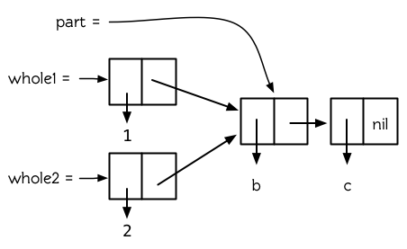

**图 12.2 被共享的尾端**

现在 `whole1` 和 `whole2` 共享结构，但是它们彼此都不是对方的一部分。

当存在嵌套列表时，重要的是要区分是列表共享了结构，还是列表的元素共享了结构。顶层列表结构指的是，直接构成列表的那些 `cons` ，而不包含那些用于构造列表元素的 `cons` 。图 12.3 是一个嵌套列表的顶层列表结构 (**译者注：**图 12.3 中上面那三个有黑色阴影的 `cons` 即构成顶层列表结构的 `cons` )。

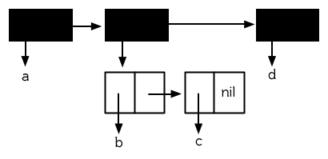

**图 12.3 顶层列表结构**

两个 `cons` 是否共享结构，取决于我们把它们看作是列表还是[树](http://zh.wikipedia.org/wiki/树_(数据结构))。可能存在两个嵌套列表，当把它们看作树时，它们共享结构，而看作列表时，它们不共享结构。图 12.4 构建了这种情况，两个列表以一个元素的形式包含了同一个列表，代码如下：

```lisp
(setf element (list 'a 'b)
      holds1 (list 1 element 2)
      holds2 (list element 3))
```

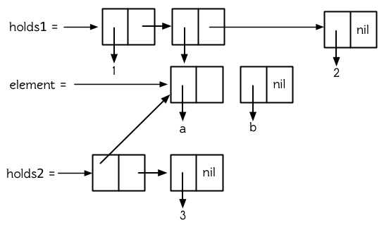

**图 12.4 共享子树**

虽然 `holds1` 的第二个元素和 `holds2` 的第一个元素共享结构 (其实是相同的)，但如果把 `holds1` 和 `holds2` 看成是列表时，它们不共享结构。仅当两个列表共享顶层列表结构时，才能说这两个列表共享结构，而 `holds1` 和 `holds2` 没有共享顶层列表结构。

如果我们想避免共享结构，可以使用复制。函数 `copy-list` 可以这样定义：

```lisp
(defun our-copy-list (lst)
   (if (null lst)
       nil
       (cons (car lst) (our-copy-list (cdr lst)))))
```

它返回一个不与原始列表共享顶层列表结构的新列表。函数 `copy-tree` 可以这样定义：

```lisp
(defun our-copy-tree (tr)
   (if (atom tr)
        tr
        (cons (our-copy-tree (car tr))
              (our-copy-tree (cdr tr)))))
```

它返回一个连原始列表的树型结构也不共享的新列表。图 12.5 显示了对一个嵌套列表使用 `copy-list` 和 `copy-tree` 的区别。


**图 12.5 两种复制**

## 12.2 修改 (Modification)

为什么要避免共享结构呢？之前讨论的共享结构问题仅仅是个智力练习，到目前为止，并没使我们在实际写程序的时候有什么不同。当修改一个被共享的结构时，问题出现了。如果两个列表共享结构，当我们修改了其中一个，另外一个也会无意中被修改。

上一节中，我们介绍了怎样构建一个是其它列表的尾端的列表：

```lisp
(setf whole (list 'a 'b 'c)
      tail (cdr whole))
```

因为 `whole` 的 `cdr` 与 `tail` 是相等的，无论是修改 `tail` 还是 `whole` 的 `cdr` ，我们修改的都是同一个 `cons` ：

```lisp
> (setf (second tail ) 'e)
E
> tail
(B E)
> whole
(A B E)
```

同样的，如果两个列表共享同一个尾端，这种情况也会发生。

一次修改两个对象并不总是错误的。有时候这可能正是你想要的。但如果无意的修改了共享结构，将会引入一些非常微妙的 bug。Lisp 程序员要培养对共享结构的意识，并且在这类错误发生时能够立刻反应过来。当一个列表神秘的改变了的时候，很有可能是因为改变了其它与之共享结构的对象。

真正危险的不是共享结构，而是改变被共享的结构。为了安全起见，干脆避免对结构使用 `setf` (以及相关的运算，比如： `pop` ， `rplaca` 等)，这样就不会遇到问题了。如果某些时候不得不修改列表结构时，要搞清楚要修改的列表的来源，确保它不要和其它不需要改变的对象共享结构。如果它和其它不需要改变的对象共享了结构，或者不能预测它的来源，那么复制一个副本来进行改变。

当你调用别人写的函数的时候要加倍小心。除非你知道它内部的操作，否则，你传入的参数时要考虑到以下的情况：

1.它对你传入的参数可能会有破坏性的操作

2.你传入的参数可能被保存起来，如果你调用了一个函数，然后又修改了之前作为参数传入该函数的对象，那么你也就改变了函数已保存起来作为它用的对象[1]。

在这两种情况下，解决的方法是传入一个拷贝。

在 Common Lisp 中，一个函数调用在遍历列表结构 (比如， `mapcar` 或 `remove-if` 的参数)的过程中不允许修改被遍历的结构。关于评估这样的代码的重要性并没有明确的规定。

## 12.3 示例：队列 (Example: Queues)

共享结构并不是一个总让人担心的特性。我们也可以对其加以利用的。这一节展示了怎样用共享结构来表示[队列](http://zh.wikipedia.org/wiki/队列)。队列对象是我们可以按照数据的插入顺序逐个检出数据的仓库，这个规则叫做[先进先出 (FIFO, first in, first out)](http://zh.wikipedia.org/zh-cn/先進先出)。

用列表表示[栈 (stack)](http://zh.wikipedia.org/wiki/栈)比较容易，因为栈是从同一端插入和检出。而表示队列要困难些，因为队列的插入和检出是在不同端。为了有效的实现队列，我们需要找到一种办法来指向列表的两个端。

图 12.6 给出了一种可行的策略。它展示怎样表示一个含有 a，b，c 三个元素的队列。一个队列就是一对列表，最后那个 `cons` 在相同的列表中。这个列表对由被称作头端 (front)和尾端 (back)的两部分组成。如果要从队列中检出一个元素，只需在其头端 `pop`，要插入一个元素，则创建一个新的 `cons` ，把尾端的 `cdr` 设置成指向这个 `cons` ，然后将尾端指向这个新的 `cons` 。

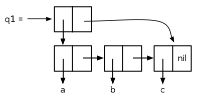

**图 12.6 一个队列的结构**

```lisp
(defun make-queue () (cons nil nil))

(defun enqueue (obj q)
  (if (null (car q))
      (setf (cdr q) (setf (car q) (list obj)))
      (setf (cdr (cdr q)) (list obj)
            (cdr q) (cdr (cdr q))))
  (car q))

(defun dequeue (q)
  (pop (car q)))
```

**图 12.7 队列实现**

图 12.7 中的代码实现了这一策略。其用法如下：

```lisp
> (setf q1 (make-queue))
(NIL)
> (progn (enqueue 'a q1)
         (enqueue 'b q1)
         (enqueue 'c q1))
(A B C)
```

现在， `q1` 的结构就如图 12.6 那样：

```lisp
> q1
((A B C) C)
```

从队列中检出一些元素：

```lisp
> (dequeue q1)
A
> (dequeue q1)
B
> (enqueue 'd q1)
(C D)
```

## 12.4 破坏性函数 (Destructive Functions)

Common Lisp 包含一些允许修改列表结构的函数。为了提高效率，这些函数是具有破坏性的。虽然它们可以回收利用作为参数传给它们的 `cons` ，但并不是因为想要它们的副作用而调用它们 (**译者注：**因为这些函数的副作用并没有任何保证，下面的例子将说明问题)。

比如， `delete` 是 `remove` 的一个具有破坏性的版本。虽然它可以破坏作为参数传给它的列表，但它并不保证什么。在大多数的 Common Lisp 的实现中，会出现下面的情况：

```lisp
> (setf lst '(a r a b i a) )
(A R A B I A)
> (delete 'a lst )
(R B I)
> lst
(A R B I)
```

正如 `remove` 一样，如果你想要副作用，应该对返回值使用 `setf` ：

```lisp
(setf lst (delete 'a lst))
```

破坏性函数是怎样回收利用传给它们的列表的呢？比如，可以考虑 `nconc` —— `append` 的破坏性版本。[2]下面是两个参数版本的实现，其清楚地展示了两个已知列表是怎样被缝在一起的：

```lisp
(defun nconc2 ( x y)
    (if (consp x)
        (progn
           (setf (cdr (last x)) y)
            x)
         y))
```

我们找到第一个列表的最后一个 *Cons* 核 (cons cells)，把它的 `cdr` 设置成指向第二个列表。一个正规的多参数的 `nconc` 可以被定义成像附录 B 中的那样。

函数 `mapcan` 类似 `mapcar` ，但它是用 `nconc` 把函数的返回值 (必须是列表) 拼接在一起的：

```lisp
> (mapcan #'list
          '(a b c)
          '(1 2 3 4))
( A 1 B 2 C 3)
```

这个函数可以定义如下：

```lisp
(defun our-mapcan (fn &rest lsts )
       (apply #'nconc (apply #'mapcar fn lsts)))
```

使用 `mapcan` 时要谨慎，因为它具有破坏性。它用 `nconc` 拼接返回的列表，所以这些列表最好不要再在其它地方使用。

这类函数在处理某些问题的时候特别有用，比如，收集树在某层上的所有子结点。如果 `children` 函数返回一个节点的孩子节点的列表，那么我们可以定义一个函数返回某节点的孙子节点的列表如下：

```lisp
(defun grandchildren (x)
   (mapcan #'(lambda (c)
                (copy-list (children c)))
           (children x)))
```

这个函数调用 `copy-list` 时存在一个假设 —— `chlidren` 函数返回的是一个已经保存在某个地方的列表，而不是构建了一个新的列表。

一个 `mapcan` 的无损变体可以这样定义：

```lisp
(defun mappend (fn &rest lsts )
    (apply #'append (apply #'mapcar fn lsts)))
```

如果使用 `mappend` 函数，那么 `grandchildren` 的定义就可以省去 `copy-list` ：

```lisp
(defun grandchildren (x)
   (mappend #'children (children x)))
```

## 12.5 示例：二叉搜索树 (Example: Binary Search Trees)

在某些情况下，使用破坏性操作比使用非破坏性的显得更自然。第 4.7 节中展示了如何维护一个具有二分搜索格式的有序对象集 (或者说维护一个[二叉搜索树 (BST)](http://zh.wikipedia.org/zh-cn/二元搜尋樹))。第 4.7 节中给出的函数都是非破坏性的，但在我们真正使用BST的时候，这是一个不必要的保护措施。本节将展示如何定义更符合实际应用的具有破坏性的插入函数和删除函数。

图 12.8 展示了如何定义一个具有破坏性的 `bst-insert` (第 72 页「**译者注：**第 4.7 节」)。相同的输入参数，能够得到相同返回值。唯一的区别是，它将修改作为第二个参数输入的 BST。 在第 2.12 节中说过，具有破坏性并不意味着一个函数调用具有副作用。的确如此，如果你想使用 `bst-insert!` 构造一个 BST，你必须像调用 `bst-insert` 那样调用它：

```lisp
> (setf *bst* nil)
NIL
> (dolist (x '(7 2 9 8 4 1 5 12))
(setf *bst* (bst-insert! x *bst* #'<)))
NIL
(defun bst-insert! (obj bst <)
  (if (null bst)
      (make-node :elt obj)
      (progn (bsti obj bst <)
             bst)))

(defun bsti (obj bst <)
  (let ((elt (node-elt bst)))
    (if (eql obj elt)
        bst
        (if (funcall < obj elt)
            (let ((l (node-l bst)))
              (if l
                  (bsti obj l <)
                  (setf (node-l bst)
                        (make-node :elt obj))))
            (let ((r (node-r bst)))
              (if r
                  (bsti obj r <)
                  (setf (node-r bst)
                        (make-node :elt obj))))))))
```

**图 12.8: 二叉搜索树：破坏性插入**

你也可以为 BST 定义一个类似 push 的功能，但这超出了本书的范围。(好奇的话，可以参考第 409 页 「**译者注：**即备注 204 」 的宏定义。)

与 `bst-remove` (第 74 页「**译者注：**第 4.7 节」) 对应，图 12.9 展示了一个破坏性版本的 `bst-delete` 。同 `delete` 一样，我们调用它并不是因为它的副作用。你应该像调用 `bst-remove` 那样调用 `bst-delete` ：

```lisp
> (setf *bst* (bst-delete 2 *bst* #'<) )
#<7>
> (bst-find 2 *bst* #'<)
NIL
(defun bst-delete (obj bst <)
  (if bst (bstd obj bst nil nil <))
  bst)

(defun bstd (obj bst prev dir <)
  (let ((elt (node-elt bst)))
    (if (eql elt obj)
        (let ((rest (percolate! bst)))
          (case dir
            (:l (setf (node-l prev) rest))
            (:r (setf (node-r prev) rest))))
      (if (funcall < obj elt)
          (if (node-l bst)
              (bstd obj (node-l bst) bst :l <))
          (if (node-r bst)
              (bstd obj (node-r bst) bst :r <))))))

(defun percolate! (bst)
  (cond ((null (node-l bst))
         (if (null (node-r bst))
             nil
             (rperc! bst)))
        ((null (node-r bst)) (lperc! bst))
        (t (if (zerop (random 2))
               (lperc! bst)
               (rperc! bst)))))

(defun lperc! (bst)
  (setf (node-elt bst) (node-elt (node-l bst)))
  (percolate! (node-l bst)))

(defun rperc! (bst)
  (setf (node-elt bst) (node-elt (node-r bst)))
  (percolate! (node-r bst)))
```

**图 12.9: 二叉搜索树：破坏性删除**

**译注:** 此范例已被回报为错误的，一个修复的版本请造访[这里](https://gist.github.com/2868339)。

## 12.6 示例：双向链表 (Example: Doubly-Linked Lists)

普通的 Lisp 列表是单向链表，这意味着其指针指向一个方向：我们可以获取下一个元素，但不能获取前一个。在[双向链表](http://zh.wikipedia.org/wiki/双向链表)中，指针指向两个方向，我们获取前一个元素和下一个元素都很容易。这一节将介绍如何创建和操作双向链表。

图 12.10 展示了如何用结构来实现双向链表。将 `cons` 看成一种结构，它有两个字段：指向数据的 `car` 和指向下一个元素的 `cdr` 。要实现一个双向链表，我们需要第三个字段，用来指向前一个元素。图 12.10 中的 `defstruct` 定义了一个含有三个字段的对象 `dl` (用于“双向链接”)，我们将用它来构造双向链表。`dl` 的 `data` 字段对应一个 `cons` 的 `car`，`next` 字段对应 `cdr` 。 `prev` 字段就类似一个 `cdr` ，指向另外一个方向。(图 12.11 是一个含有三个元素的双向链表。) 空的双向链表为 `nil` ，就像空的列表一样。

```lisp
(defstruct (dl (:print-function print-dl))
  prev data next)

(defun print-dl (dl stream depth)
  (declare (ignore depth))
  (format stream "#<DL ~A>" (dl->list dl)))

(defun dl->list (lst)
  (if (dl-p lst)
      (cons (dl-data lst) (dl->list (dl-next lst)))
      lst))

(defun dl-insert (x lst)
  (let ((elt (make-dl :data x :next lst)))
    (when (dl-p lst)
      (if (dl-prev lst)
          (setf (dl-next (dl-prev lst)) elt
                (dl-prev elt) (dl-prev lst)))
      (setf (dl-prev lst) elt))
    elt))

(defun dl-list (&rest args)
  (reduce #'dl-insert args
          :from-end t :initial-value nil))

(defun dl-remove (lst)
  (if (dl-prev lst)
      (setf (dl-next (dl-prev lst)) (dl-next lst)))
  (if (dl-next lst)
      (setf (dl-prev (dl-next lst)) (dl-prev lst)))
  (dl-next lst))
```

**图 12.10: 构造双向链表**

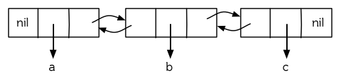

**图 12.11: 一个双向链表。**

为了便于操作，我们为双向链表定义了一些实现类似 `car` ， `cdr` ， `consp` 功能的函数：`dl-data` ， `dl-next` 和 `dl-p` 。 `dl->list` 是 `dl` 的打印函数(`print-function`)，其返回一个包含 `dl` 所有元素的普通列表。

函数 `dl-insert` 就像针对双向链表的 `cons` 操作。至少，它就像 `cons` 一样，是一个基本构建函数。与 `cons` 不同的是，它实际上要修改作为第二个参数传递给它的双向链表。在这种情况下，这是自然而然的。我们 `cons` 内容到普通列表前面，不需要对普通列表的 `rest` (**译者注：** `rest` 即 `cdr` 的另一种表示方法，这里的 `rest` 是对通过 `cons` 构建后列表来说的，即修改之前的列表) 做任何修改。但是要在双向链表的前面插入元素，我们不得不修改列表的 `rest` (这里的 `rest` 即指没修改之前的双向链表) 的 `prev` 字段来指向这个新元素。

几个普通列表可以共享同一个尾端。因为双向链表的尾端不得不指向它的前一个元素，所以不可能存在两个双向链表共享同一个尾端。如果 `dl-insert` 不具有破坏性，那么它不得不复制其第二个参数。

单向链表(普通列表)和双向链表另一个有趣的区别是，如何持有它们。我们使用普通列表的首端，来表示单向链表，如果将列表赋值给一个变量，变量可以通过保存指向列表第一个 `cons` 的指针来持有列表。但是双向链表是双向指向的，我们可以用任何一个点来持有双向链表。 `dl-insert` 另一个不同于 `cons` 的地方在于 `dl-insert` 可以在双向链表的任何位置插入新元素，而 `cons` 只能在列表的首端插入。

函数 `dl-list` 是对于 `dl` 的类似 `list` 的功能。它接受任意多个参数，它会返回一个包含以这些参数作为元素的 `dl` ：

```lisp
> (dl-list 'a 'b 'c)
#<DL (A B C)>
```

它使用了 `reduce` 函数 (并设置其 `from-end` 参数为 `true`，`initial-value` 为 `nil`)，其功能等价于

```lisp
(dl-insert 'a (dl-insert 'b (dl-insert 'c nil)) )
```

如果将 `dl-list` 定义中的 `#'dl-insert` 换成 `#'cons`，它就相当于 `list` 函数了。下面是 `dl-list` 的一些常见用法：

```lisp
> (setf dl (dl-list 'a 'b))
#<DL (A B)>
> (setf dl (dl-insert 'c dl))
#<DL (C A B)>
> (dl-insert 'r (dl-next dl))
#<DL (R A B)>
> dl
#<DL (C R A B)>
```

最后，`dl-remove` 的作用是从双向链表中移除一个元素。同 `dl-insert` 一样，它也是具有破坏性的。

## 12.7 环状结构 (Circular Structure)

将列表结构稍微修改一下，就可以得到一个环形列表。存在两种环形列表。最常用的一种是其顶层列表结构是一个环的，我们把它叫做 `cdr-circular` ，因为环是由一个 `cons` 的 `cdr` 构成的。

构造一个单元素的 `cdr-circular` 列表，可以将一个列表的 `cdr` 设置成列表自身：

```lisp
> (setf x (list 'a))
(A)
> (progn (setf (cdr x) x) nil)
NIL
```

这样 `x` 就是一个环形列表，其结构如图 12.12 (左) 所示。


**图 12.12 环状列表。**

如果 Lisp 试着打印我们刚刚构造的结构，将会显示 (a a a a a …… —— 无限个 `a`)。但如果设置全局变量 `*print-circle*` 为 `t` 的话，Lisp 就会采用一种方式打印出一个能代表环形结构的对象：

```lisp
> (setf *print-circle* t )
T
> x
#1=(A . #1#)
```

如果你需要，你也可以使用 `#n=` 和 `#n#` 这两个读取宏，来自己表示共享结构。

`cdr-cicular` 列表十分有用，比如，可以用来表示缓冲区、池。下面这个函数，可以将一个普通的非空列表，转换成一个对应的 `cdr-cicular` 列表：

```lisp
(defun circular (lst)
        (setf (cdr (last lst)) lst))
```

另外一种环状列表叫做 `car-circular` 列表。`car-circular` 列表是一个树，并将其自身当作自己的子树的结构。因为环是通过一个 `cons` 的 `car` 形成的，所以叫做 `car-circular`。这里构造了一个 `car-circular` ，它的第二个元素是它自身：

```lisp
> (let ((y (list 'a )))
(setf (car y) y)
     y)
#i=(#i#)
```

图 12.12 (右) 展示了其结构。这个 `car-circular` 是一个正规列表。 `cdr-circular` 列表都不是正规列表，除开一些特殊情况 `car-circular` 列表是正规列表。

一个列表也可以既是 `car-circular` ，又是 `cdr-circular` 。 一个 `cons` 的 `car` 和 `cdr` 均是其自身：

```lisp
> (let ((c (cons 11)) )
     (setf (car c) c
            (cdr c) c)
     c)
#1=(#1# . #1#)
```

很难想像这样的一个列表有什么用。实际上，了解环形列表的主要目的就是为了避免因为偶然因素构造出了环形列表，因为，将一个环形列表传给一个函数，如果该函数遍历这个环形列表，它将进入死循环。

环形结构的这种问题在列表以外的其他对象中也存在。比如，一个数组可以将数组自身当作其元素：

```lisp
> (setf *print-array* t )
T
> (let ((a (make-array 1)) )
          (setf (aref a 0) a)
          a)
#1=#(#1#)
```

实际上，任何可以包含元素的对象都可能包含其自身作为元素。

用 `defstruct` 构造出环形结构是相当常见的。比如，一个结构 `c` 是一颗树的元素，它的 `parent` 字段所指向的结构 `p` 的 `child` 字段也恰好指向 `c` 。

```lisp
> (progn (defstruct elt
          (parent nil ) (child nil) )
     (let ((c (make-elt) )
               (p (make-elt)) )
          (setf (elt-parent c) p
                    (elt-child p) c)
          c) )
#1=#S(ELT PARENT #S(ELT PARENT NIL CHILD #1#) CHILD NIL)
```

要实现像这样一个结构的打印函数 (`print-function`)，我们需要将全局变量 `*print-circle*` 绑定为 `t` ，或者避免打印可能构成环的字段。

## 12.8 常量结构 (Constant Structure)

因为常量实际上是程序代码的一部分，所以我们也不应该修改他们，或者是不经意地写了自重写的代码。一个通过 `quote` 引用的列表是一个常量，所以一定要小心，不要修改被引用的列表的任何 `cons`。比如，如果我们用下面的代码，来测试一个符号是不是算术运算符：

```lisp
(defun arith-op (x)
(member x '(+ - * /)))
```

如果被测试的符号是算术运算符，它的返回值将至少一个被引用列表的一部分。如果我们修改了其返回值，

```lisp
> (nconc (arith-op '*) '(as i t were))
(* / AS IT WERE)
```

那么我就会修改 `arith-op` 函数中的一个列表，从而改变了这个函数的功能：

```lisp
> (arith-op 'as )
(AS IT WERE)
```

写一个返回常量结构的函数，并不一定是错误的。但当你考虑使用一个破坏性的操作是否安全的时候，你必须考虑到这一点。

有几个其它方法来实现 `arith-op`，使其不返回被引用列表的部分。一般地，我们可以通过将其中的所有引用( `quote` ) 替换成 `list` 来确保安全，这使得它每次被调用都将返回一个新的列表：

```lisp
(defun arith-op (x)
        (member x (list '+ '- '* '/)))
```

这里，使用 `list` 是一种低效的解决方案，我们应该使用 `find` 来替代 `member`：

```lisp
(defun arith-op (x)
        (find x '(+ - * /)))
```

这一节讨论的问题似乎只与列表有关，但实际上，这个问题存在于任何复杂的对象中：数组，字符串，结构，实例等。你不应该逐字地去修改程序的代码段。

即使你想写自修改程序，通过修改常量来实现并不是个好办法。编译器将常量编译成了代码，破坏性的操作可能修改它们的参数，但这些都是没有任何保证的事情。如果你想写自修改程序，正确的方法是使用闭包 (见 6.5 节)。

## Chapter 12 总结 (Summary)

1. 两个列表可以共享一个尾端。多个列表可以以树的形式共享结构，而不是共享顶层列表结构。可通过拷贝方式来避免共用结构。
2. 共享结构通常可以被忽略，但如果你要修改列表，则需要特别注意。因为修改一个含共享结构的列表可能修改所有共享该结构的列表。
3. 队列可以被表示成一个 `cons` ，其的 `car` 指向队列的第一个元素， `cdr` 指向队列的最后一个元素。
4. 为了提高效率，破坏性函数允许修改其输入参数。
5. 在某些应用中，破坏性的实现更适用。
6. 列表可以是 `car-circular` 或 `cdr-circular` 。 Lisp 可以表示圆形结构和共享结构。
7. 不应该去修改的程序代码段中的常量形式。

## Chapter 12 练习 (Exercises)

1. 画三个不同的树，能够被打印成 `((A) (A) (A))` 。写一个表达式来生成它们。
2. 假设 `make-queue` ， `enqueue` 和 `dequeue` 是按照图 12.7 中的定义，用箱子表式法画出下面每一步所得到的队列的结构图：

```lisp
> (setf q (make-queue))
(NIL)
> (enqueue 'a q)
(A)
> (enqueue 'b q)
(A B)
> (dequeue q)
A
```

1. 定义一个函数 `copy-queue` ，可以返回一个 queue 的拷贝。
2. 定义一个函数，接受两个输入参数 `object` 和 `queue` ，能将 `object` 插入到 `queue` 的首端。
3. 定义一个函数，接受两个输入参数 `object` 和 `queue`，能具有破坏性地将 `object` 的第一个实例 ( `eql` 等价地) 移到 `queue` 的首端。
4. 定义一个函数，接受两个输入参数 `object` 和 `lst` ( `lst` 可能是 `cdr-circular` 列表)，如果 `object` 是 `lst` 的成员时返回真。
5. 定义一个函数，如果它的参数是一个 `cdr-circular` 则返回真。
6. 定义一个函数，如果它的参数是一个 `car-circular` 则返回真。

脚注

| [1]  | 比如，在 Common Lisp 中，修改一个被用作符号名的字符串被认为是一种错误，因为内部的定义并没声明它是从参数复制来的，所以必须假定修改传入内部的任何参数中的字符串来创建新的符号是错误的。 |
| ---- | ------------------------------------------------------------ |
|      |                                                              |

| [2]  | 函数名称中 n 的含义是 “non-consing”。一些具有破坏性的函数以 n 开头。 |
| ---- | ------------------------------------------------------------ |
|      |                                                              |

# 第十三章：速度

Lisp 实际上是两种语言：一种能写出快速执行的程序，一种则能让你快速的写出程序。 在程序开发的早期阶段，你可以为了开发上的便捷舍弃程序的执行速度。一旦程序的结构开始固化，你就可以精炼其中的关键部分以使得它们执行的更快。

由于各个 Common Lisp 实现间的差异，很难针对优化给出通用的建议。在一个实现上使程序变快的修改也许在另一个实现上会使得程序变慢。这是难免的事儿。越强大的语言，离机器底层就越远，离机器底层越远，语言的不同实现沿着不同路径趋向它的可能性就越大。因此，即便有一些技巧几乎一定能够让程序运行的更快，本章的目的也只是建议而不是规定。

## 13.1 瓶颈规则 (The Bottleneck Rule)

不管是什么实现，关于优化都可以整理出三点规则：它应该关注瓶颈，它不应该开始的太早，它应该始于算法。

也许关于优化最重要的事情就是要意识到，程序中的大部分执行时间都是被少数瓶颈所消耗掉的。 正如[高德纳](http://en.wikipedia.org/wiki/Donald_Knuth)所说，“在一个与 I/O 无关 (Non-I/O bound) 的程序中，大部分的运行时间集中在大概 3% 的源代码中。” [λ](http://acl.readthedocs.org/en/latest/zhCN/notes-cn.html#notes-213) 优化程序的这一部分将会使得它的运行速度明显的提升；相反，优化程序的其他部分则是在浪费时间。

因此，优化程序时关键的第一步就是找到瓶颈。许多 Lisp 实现都提供性能分析器 (profiler) 来监视程序的运行并报告每一部分所花费的时间量。 为了写出最为高效的代码，性能分析器非常重要，甚至是必不可少的。 如果你所使用的 Lisp 实现带有性能分析器，那么请在进行优化时使用它。另一方面，如果实现没有提供性能分析器的话，那么你就不得不通过猜测来寻找瓶颈，而且这种猜测往往都是错的！

瓶颈规则的一个推论是，不应该在程序的初期花费太多的精力在优化上。[高德纳](http://en.wikipedia.org/wiki/Donald_Knuth)对此深信不疑：“过早的优化是一切 (至少是大多数) 问题的源头。” [λ](http://acl.readthedocs.org/en/latest/zhCN/notes-cn.html#notes-214) 在刚开始写程序的时候，通常很难看清真正的瓶颈在哪，如果这个时候进行优化，你很可能是在浪费时间。优化也会使程序的修改变得更加困难，边写程序边优化就像是在用风干非常快的颜料来画画一样。

在适当的时候做适当的事情，可以让你写出更优秀的程序。 Lisp 的一个优点就是能让你用两种不同的工作方式来进行开发：很快地写出运行较慢的代码，或者，放慢写程序的速度，精雕细琢，从而得出运行得较快的代码。

在程序开发的初期阶段，工作通常在第一种模式下进行，只有当性能成为问题的时候，才切换到第二种模式。 对于非常底层的语言，比如汇编，你必须优化程序的每一行。但这么做会浪费你大部分的精力，因为瓶颈仅仅是其中很小的那部分代码。一个更加抽象的语言能够让你把主要精力集中在瓶颈上， 达到事半功倍的效果。

当真正开始优化的时候，还必须从最顶端入手。 在使用各种低层次的编码技巧 (low-level coding tricks) 之前，请先确保你已经使用了最为高效的算法。 这么做的潜在好处相当大 ── 甚至可能大到你都不再需要玩那些奇淫技巧。 当然本规则还是要和前一个规则保持平衡。 有些时候，关于算法的决策必须尽早进行。

## 13.2 编译 (Compilation)

有五个参数可以控制代码的编译方式： *speed* (速度)代表编译器产生代码的速度； *compilation-speed* (编译速度)代表程序被编译的速度； *safety* (安全) 代表要对目标代码进行错误检查的数量； *space* (空间)代表目标代码的大小和内存需求量；最后， *debug* (调试)代表为了调试而保留的信息量。

交互与解释 (INTERACTIVE VS. INTERPRETED)

Lisp 是一种交互式语言 (Interactive Language)，但是交互式的语言不必都是解释型的。早期的 Lisp 都通过解释器实现，因此认为 Lisp 的特质都依赖于它是被解释的想法就这么产生了。但这种想法是错误的：Common Lisp 既是编译型语言，又是解释型语言。

至少有两种 Common Lisp 实现甚至都不包含解释器。在这些实现中，输入到顶层的表达式在求值前会被编译。因此，把顶层叫做解释器的这种说法，不仅是落伍的，甚至还是错误的。

编译参数不是真正的变量。它们在声明中被分配从 `0` (最不重要) 到 `3` (最重要) 的权值。如果一个主要的瓶颈发生在某个函数的内层循环中，我们或许可以添加如下的声明：

```lisp
(defun bottleneck (...)
  (do (...)
      (...)
    (do (...)
        (...)
      (declare (optimize (speed 3) (safety 0)))
      ...)))
```

一般情况下，应该在代码写完并且经过完善测试之后，才考虑加上那么一句声明。

要让代码在任何情况下都尽可能地快，可以使用如下声明：

```lisp
(declaim (optimize (speed 3)
                   (compilation-speed 0)
                   (safety 0)
                   (debug 0)))
```

考虑到前面提到的瓶颈规则 [[1\]](https://acl.readthedocs.io/en/latest/zhCN/ch13-cn.html#id9) ，这种苛刻的做法可能并没有什么必要。

另一类特别重要的优化就是由 Lisp 编译器完成的尾递归优化。当 *speed* (速度)的权值最大时，所有支持尾递归优化的编译器都将保证对代码进行这种优化。

如果在一个调用返回时调用者中没有残余的计算，该调用就被称为尾递归。下面的代码返回列表的长度：

```lisp
(defun length/r (lst)
  (if (null lst)
      0
      (1+ (length/r (cdr lst)))))
```

这个递归调用不是尾递归，因为当它返回以后，它的值必须传给 `1+` 。相反，这是一个尾递归的版本，

```lisp
(defun length/rt (lst)
  (labels ((len (lst acc)
             (if (null lst)
                 acc
                 (len (cdr lst) (1+ acc)))))
    (len lst 0)))
```

更准确地说，局部函数 `len` 是尾递归调用，因为当它返回时，调用函数已经没什么事情可做了。 和 `length/r` 不同的是，它不是在递归回溯的时候构建返回值，而是在递归调用的过程中积累返回值。 在函数的最后一次递归调用结束之后， `acc` 参数就可以作为函数的结果值被返回。

出色的编译器能够将一个尾递归编译成一个跳转 (goto)，因此也能将一个尾递归函数编译成一个循环。在典型的机器语言代码中，当第一次执行到表示 `len` 的指令片段时，栈上会有信息指示在返回时要做些什么。由于在递归调用后没有残余的计算，该信息对第二层调用仍然有效：第二层调用返回后我们要做的仅仅就是从第一层调用返回。 因此，当进行第二层调用时，我们只需给参数设置新的值，然后跳转到函数的起始处继续执行就可以了，没有必要进行真正的函数调用。

另一个利用函数调用抽象，却没有开销的方法是使函数内联编译。对于那些调用开销比函数体的执行代价还高的小型函数来说，这种技术非常有价值。例如，以下代码用于判断列表是否仅有一个元素：

```lisp
(declaim (inline single?))

(defun single? (lst)
  (and (consp lst) (null (cdr lst))))
```

因为这个函数是在全局被声明为内联的，引用了 `single?` 的函数在编译后将不需要真正的函数调用。 [[2\]](https://acl.readthedocs.io/en/latest/zhCN/ch13-cn.html#id10) 如果我们定义一个调用它的函数，

```lisp
(defun foo (x)
  (single? (bar x)))
```

当 `foo` 被编译后， `single?` 函数体中的代码将会被编译进 `foo` 的函数体，就好像我们直接写以下代码一样：

```lisp
(defun foo (x)
  (let ((lst (bar x)))
    (and (consp lst) (null (cdr lst)))))
```

内联编译有两个限制： 首先，递归函数不能内联。 其次，如果一个内联函数被重新定义，我们就必须重新编译调用它的任何函数，否则调用仍然使用原来的定义。

在一些早期的 Lisp 方言中，有时候会使用宏（ 10.2 节）来避免函数调用。这种做法在 Common Lisp 中通常是没有必要的。

不同 Lisp 编译器的优化方式千差万别。 如果你想了解你的编译器为某个函数生成的代码，试着调用 `disassemble` 函数：它接受一个函数或者函数名，并显示该函数编译后的形式。 即便你看到的东西是完全无法理解的，你仍然可以使用 `disassemble` 来判断声明是否起效果：编译函数的两个版本，一个使用优化声明，另一个不使用优化声明，然后观察由 `disassemble` 显示的两组代码之间是否有差异。 同样的技巧也可以用于检验函数是否被内联编译。 不论情况如何，都请优先考虑使用编译参数，而不是手动调优的方式来优化代码。

## 13.3 类型声明 (Type Declarations)

如果 Lisp 不是你所学的第一门编程语言，那么你也许会感到困惑，为什么这本书还没说到类型声明这件事来？毕竟，在很多流行的编程语言中，类型声明是必须要做的。

在不少编程语言里，你必须为每个变量声明类型，并且变量也只可以持有与该类型相一致的值。 这种语言被称为*强类型*(*strongly typed*) 语言。 除了给程序员们徒增了许多负担外，这种方式还限制了你能做的事情。 使用这种语言，很难写出那些需要多种类型的参数一起工作的函数，也很难定义出可以包含不同种类元素的数据结构。 当然，这种方式也有它的优势，比如无论何时当编译器碰到一个加法运算，它都能够事先知道这是一个什么类型的加法运算。如果两个参数都是整数类型，编译器可以直接在目标代码中生成一个固定 (hard-wire) 的整数加法运算。

正如 2.15 节所讲，Common Lisp 使用一种更加灵活的方式：显式类型 (manifest typing) [[3\]](https://acl.readthedocs.io/en/latest/zhCN/ch13-cn.html#id11) 。有类型的是值而不是变量。变量可以用于任何类型的对象。

当然，这种灵活性需要付出一定的速度作为代价。 由于 `+` 可以接受好几种不同类型的数，它不得不在运行时查看每个参数的类型来决定采用哪种加法运算。

在某些时候，如果我们要执行的全都是整数的加法，那么每次查看参数类型的这种做法就说不上高效了。 Common Lisp 处理这种问题的方法是：让程序员尽可能地提示编译器。 比如说，如果我们提前就能知道某个加法运算的两个参数是定长数 (fixnums) ，那么就可以对此进行声明，这样编译器就会像 C 语言的那样为我们生成一个固定的整数加法运算。

因为显式类型也可以通过声明类型来生成高效的代码，所以强类型和显式类型两种方式之间的差别并不在于运行速度。 真正的区别是，在强类型语言中，类型声明是强制性的，而显式类型则不强加这样的要求。 在 Common Lisp 中，类型声明完全是可选的。它们可以让程序运行的更快，但(除非错误)不会改变程序的行为。

全局声明以 `declaim` 伴随一个或多个声明的形式来实现。一个类型声明是一个列表，包含了符号 `type` ，后跟一个类型名，以及一个或多个变量组成。举个例子，要为一个全局变量声明类型，可以这么写：

```lisp
(declaim (type fixnum *count*))
```

在 ANSI Common Lisp 中，可以省略 `type` 符号，将声明简写为：

```lisp
(declaim (fixnum *count*))
```

局部声明通过 `declare` 完成，它接受的参数和 `declaim` 的一样。 声明可以放在那些创建变量的代码体之前：如 `defun` 、 `lambda` 、 `let` 、 `do` ，诸如此类。 比如说，要把一个函数的参数声明为定长数，可以这么写：

```lisp
(defun poly (a b x)
  (declare (fixnum a b x))
  (+ (* a (expt x 2)) (* b x)))
```

在类型声明中的变量名指的就是该声明所在的上下文中的那个变量 ── 那个通过赋值可以改变它的值的变量。

你也可以通过 `the` 为某个表达式的值声明类型。 如果我们提前就知道 `a` 、 `b` 和 `x` 是足够小的定长数，并且它们的和也是定长数的话，那么可以进行以下声明：

```lisp
(defun poly (a b x)
  (declare (fixnum a b x))
  (the fixnum (+ (the fixnum (* a (the fixnum (expt x 2))))
                 (the fixnum (* b x)))))
```

看起来是不是很笨拙啊？幸运的是有两个原因让你很少会这样使用 `the` 把你的数值运算代码变得散乱不堪。其一是很容易通过宏，来帮你插入这些声明。其二是某些实现使用了特殊的技巧，即便没有类型声明的定长数运算也能足够快。

Common Lisp 中有相当多的类型 ── 恐怕有无数种类型那么多，如果考虑到你可以自己定义新的类型的话。 类型声明只在少数情况下至关重要，可以遵照以下两条规则来进行：

1. 当函数可以接受若干不同类型的参数(但不是所有类型)时，可以对参数的类型进行声明。如果你知道一个对 `+` 的调用总是接受定长数类型的参数，或者一个对 `aref` 的调用第一个参数总是某种特定种类的数组，那么进行类型声明是值得的。
2. 通常来说，只有对类型层级中接近底层的类型进行声明，才是值得的：将某个东西的类型声明为 `fixnum` 或者 `simple-array` 也许有用，但将某个东西的类型声明为 `integer` 或者 `sequence` 或许就没用了。

类型声明对内容复杂的对象特别重要，这包括数组、结构和对象实例。这些声明可以在两个方面提升效率：除了可以让编译器来决定函数参数的类型以外，它们也使得这些对象可以在内存中更高效地表示。

如果对数组元素的类型一无所知的话，这些元素在内存中就不得不用一块指针来表示。但假如预先就知道数组包含的元素仅仅是 ── 比方说 ── 双精度浮点数 (double-floats)，那么这个数组就可以用一组实际的双精度浮点数来表示。这样数组将占用更少的空间，因为我们不再需要额外的指针指向每一个双精度浮点数；同时，对数组元素的访问也将更快，因为我们不必沿着指针去读取和写元素。

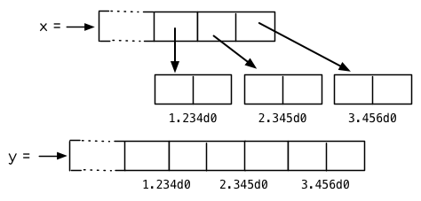

**图 13.1：指定元素类型的效果**

你可以通过 `make-array` 的 `:element-type` 参数指定数组包含值的种类。这样的数组被称为*特化数组*(specialized array)。 图 13.1 为我们展示了如下代码在多数实现上求值后发生的事情：

```lisp
(setf x (vector 1.234d0 2.345d0 3.456d0)
      y (make-array 3 :element-type 'double-float)
      (aref y 0) 1.234d0
      (aref y 1) 2.345d0
      (aref y 2）3.456d0))
```

图 13.1 中的每一个矩形方格代表内存中的一个字 (a word of memory)。这两个数组都由未特别指明长度的头部 (header) 以及后续 三个元素的某种表示构成。对于 `x` 来说，每个元素都由一个指针表示。此时每个指针碰巧都指向双精度浮点数，但实际上我们可以存储任何类型的对象到这个向量中。对 `y` 来说，每个元素实际上都是双精度浮点数。 `y` 更快而且占用更少空间，但意味着它的元素只能是双精度浮点数。

注意我们使用 `aref` 来引用 `y` 的元素。一个特化的向量不再是一个简单向量，因此我们不再能够通过 `svref` 来引用它的元素。

除了在创建数组时指定元素的类型，你还应该在使用数组的代码中声明数组的维度以及它的元素类型。一个完整的向量声明如下：

```lisp
(declare (type (vector fixnum 20) v))
```

以上代码声明了一个仅含有定长数，并且长度固定为 `20` 的向量。

```lisp
(setf a (make-array '(1000 1000)
                    :element-type 'single-float
                    :initial-element 1.0s0))

(defun sum-elts (a)
  (declare (type (simple-array single-float (1000 1000))
                 a))
  (let ((sum 0.0s0))
    (declare (type single-float sum))
    (dotimes (r 1000)
      (dotimes (c 1000)
        (incf sum (aref a r c))))
    sum))
```

**图 13.2 对数组元素求和**

最为通用的数组声明形式由数组类型以及紧接其后的元素类型和一个维度列表构成：

```lisp
(declare (type (simple-array fixnum (4 4)) ar))
```

图 13.2 展示了如何创建一个 1000×1000 的单精度浮点数数组，以及如何编写一个将该数组元素相加的函数。数组以行主序 (row-major order)存储，遍历时也应尽可能按此顺序进行。

我们将用 `time` 来比较 `sum-elts` 在有声明和无声明两种情况下的性能。 `time` 宏显示表达式求值所花费时间的某种度量(取决于实现)。对被编译的函数求取时间才是有意义的。在某个实现中，如果我们以获取最快速代码的编译参数编译 `sum-elts` ，它将在不到半秒的时间内返回：

```lisp
> (time (sum-elts a))
User Run Time = 0.43 seconds
1000000.0
```

如果我们把 *sum-elts* 中的类型声明去掉并重新编译它，同样的计算将花费超过5秒的时间：

```lisp
> (time (sum-elts a))
User Run Time = 5.17 seconds
1000000.0
```

类型声明的重要性 ── 特别是对数组和数来说 ── 怎么强调都不过分。上面的例子中，仅仅两行代码就可以让 `sum-elts` 变快 12 倍。

## 13.4 避免垃圾 (Garbage Avoidance)

Lisp 除了可以让你推迟考虑变量的类型以外，它还允许你推迟对内存分配的考虑。 在程序的早期阶段，暂时忽略内存分配和臭虫等问题，将有助于解放你的想象力。 等到程序基本固定下来以后，就可以开始考虑怎么减少动态分配，从而让程序运行得更快。

但是，并不是构造（consing）用得少的程序就一定快。 多数 Lisp 实现一直使用着差劲的垃圾回收器，在这些实现中，过多的内存分配容易让程序运行变得缓慢。 因此，『高效的程序应该尽可能地减少 `cons` 的使用』这种观点，逐渐成为了一种传统。 最近这种传统开始有所改变，因为一些实现已经用上了相当先进（sophisticated）的垃圾回收器，它们实行一种更为高效的策略：创建新的对象，用完之后抛弃而不是进行回收。

本节介绍了几种方法，用于减少程序中的构造。 但构造数量的减少是否有利于加快程序的运行，这一点最终还是取决于实现。 最好的办法就是自己去试一试。

减少构造的办法有很多种。 有些办法对程序的修改非常少。 例如，最简单的方法就是使用破坏性函数。 下表罗列了一些常用的函数，以及这些函数对应的破坏性版本。

| 安全              | 破坏性            |
| :---------------- | :---------------- |
| append            | nconc             |
| reverse           | nreverse          |
| remove            | delete            |
| remove-if         | delete-if         |
| remove-duplicates | delete-duplicates |
| subst             | nsubst            |
| subst-if          | nsubst-if         |
| union             | nunion            |
| intersection      | nintersection     |
| set-difference    | nset-difference   |

当确认修改列表是安全的时候，可以使用 `delete` 替换 `remove` ，用 `nreverse` 替换 `reverse` ，诸如此类。

即便你想完全摆脱构造，你也不必放弃在运行中 (on the fly)创建对象的可能性。 你需要做的是避免在运行中为它们分配空间和通过垃圾回收收回空间。通用方案是你自己预先分配内存块 (block of memory)，以及明确回收用过的块。*预先*可能意味着在编译期或者某些初始化例程中。具体情况还应具体分析。

例如，当情况允许我们利用一个有限大小的堆栈时，我们可以让堆栈在一个已经分配了空间的向量中增长或缩减，而不是构造它。Common Lisp 内置支持把向量作为堆栈使用。如果我们传给 `make-array` 可选的 `fill-pointer` 参数，我们将得到一个看起来可扩展的向量。 `make-array` 的第一个参数指定了分配给向量的存储量，而 `fill-pointer` 指定了初始有效长度：

```lisp
> (setf *print-array* t)
T
> (setf vec (make-array 10 :fill-pointer 2
                           :initial-element nil))
#(NIL NIL)
```

我们刚刚制造的向量对于操作序列的函数来说，仍好像只含有两个元素，

```lisp
> (length vec)
2
```

但它能够增长直到十个元素。因为 `vec` 有一个填充指针，我们可以使用 `vector-push` 和 `vector-pop` 函数推入和弹出元素，就像它是一个列表一样：

```lisp
> (vector-push 'a vec)
2
> vec
#(NIL NIL A)
> (vector-pop vec)
A
> vec
#(NIL NIL)
```

当我们调用 `vector-push` 时，它增加填充指针并返回它过去的值。只要填充指针小于 `make-array` 的第一个参数，我们就可以向这个向量中推入新元素；当空间用尽时， `vector-push` 返回 `nil` 。目前我们还可以向 `vec` 中推入八个元素。

使用带有填充指针的向量有一个缺点，就是它们不再是简单向量了。我们不得不使用 `aref` 来代替 `svref` 引用元素。代价需要和潜在的收益保持平衡。

```lisp
(defconstant dict (make-array 25000 :fill-pointer 0))

(defun read-words (from)
  (setf (fill-pointer dict) 0)
  (with-open-file (in from :direction :input)
    (do ((w (read-line in nil :eof)
            (read-line in nil :eof)))
        ((eql w :eof))
      (vector-push w dict))))

(defun xform (fn seq) (map-into seq fn seq))

(defun write-words (to)
  (with-open-file (out to :direction :output
                          :if-exists :supersede)
    (map nil #'(lambda (x)
                 (fresh-line out)
                 (princ x out))
             (xform #'nreverse
                    (sort (xform #'nreverse dict)
                          #'string<)))))
```

**图 13.3 生成同韵字辞典**

当应用涉及很长的序列时，你可以用 `map-into` 代替 `map` 。 `map-into` 的第一个参数不是一个序列类型，而是用来存储结果的，实际的序列。这个序列可以是该函数接受的其他序列参数中的任何一个。所以，打个比方，如果你想为一个向量的每个元素加 1，你可以这么写：

```lisp
(setf v (map-into v #'1+ v))
```

图 13.3 展示了一个使用大向量应用的例子：一个生成简单的同韵字辞典 (或者更确切的说，一个不完全韵辞典)的程序。函数 `read-line` 从一个每行仅含有一个单词的文件中读取单词，而函数 `write-words` 将它们按照字母的逆序打印出来。比如，输出的起始可能是

```lisp
a amoeba alba samba marimba...
```

结束是

```lisp
...megahertz gigahertz jazz buzz fuzz
```

利用填充指针和 `map-into` ，我们可以把程序写的既简单又高效。

在数值应用中要当心大数 (bignums)。大数运算需要构造，因此也就会比较慢。 即使程序的最后结果为大数，但是，通过调整计算，将中间结果保存在定长数中，这种优化也是有可能的。

另一个避免垃圾回收的方法是，鼓励编译器在栈上分配对象而不是在堆上。 如果你知道只是临时需要某个东西，你可以通过将它声明为 `dynamic extent` 来避免在堆上分配空间。

通过一个动态范围 (dynamic extent)变量声明，你告诉编译器，变量的值应该和变量保持相同的生命期。 什么时候值的生命期比变量长呢？这里有个例子：

```lisp
(defun our-reverse (lst)
  (let ((rev nil))
    (dolist (x lst)
      (push x rev))
    rev))
```

在 `our-reverse` 中，作为参数传入的列表以逆序被收集到 `rev` 中。当函数返回时，变量 `rev` 将不复存在。 然而，它的值 ── 一个逆序的列表 ── 将继续存活：它被送回调用函数，一个知道它的命运何去何从的地方。

相比之下，考虑如下 `adjoin` 实现：

```lisp
(defun our-adjoin (obj lst &rest args)
  (if (apply #'member obj lst args)
      lst
      (cons obj lst)))
```

在这个例子里，我们可以从函数的定义看出， `args` 参数中的值 (列表) 哪儿也没去。它不必比存储它的变量活的更久。在这种情形下把它声明为动态范围的就比较有意义。如果我们加上这样的声明：

```lisp
(defun our-adjoin (obj lst &rest args)
  (declare (dynamic-extent args))
  (if (apply #'member obj lst args)
      lst
      (cons obj lst)))
```

那么编译器就可以 (但不是必须)在栈上为 `args` 分配空间，在 `our-adjoin` 返回后，它将自动被释放。

## 13.5 示例: 存储池 (Example: Pools)

对于涉及数据结构的应用，你可以通过在一个存储池 (pool)中预先分配一定数量的结构来避免动态分配。当你需要一个结构时，你从池中取得一份，当你用完后，再把它送回池中。为了演示存储池的使用，我们将快速的编写一段记录港口中船舶数量的程序原型 (prototype of a program)，然后用存储池的方式重写它。

```lisp
(defparameter *harbor* nil)

(defstruct ship
  name flag tons)

(defun enter (n f d)
  (push (make-ship :name n :flag f :tons d)
        *harbor*))

(defun find-ship (n)
  (find n *harbor* :key #'ship-name))

(defun leave (n)
  (setf *harbor*
        (delete (find-ship n) *harbor*)))
```

**图 13.4 港口**

图 13.4 中展示的是第一个版本。 全局变量 `harbor` 是一个船只的列表， 每一艘船只由一个 `ship` 结构表示。 函数 `enter` 在船只进入港口时被调用； `find-ship` 根据给定名字 (如果有的话) 来寻找对应的船只；最后， `leave` 在船只离开港口时被调用。

一个程序的初始版本这么写简直是棒呆了，但它会产生许多的垃圾。当这个程序运行时，它会在两个方面构造：当船只进入港口时，新的结构将会被分配；而 `harbor` 的每一次增大都需要使用构造。

我们可以通过在编译期分配空间来消除这两种构造的源头 (sources of consing)。图 13.5 展示了程序的第二个版本，它根本不会构造。

```lisp
(defconstant pool (make-array 1000 :fill-pointer t))

(dotimes (i 1000)
  (setf (aref pool i) (make-ship)))

(defconstant harbor (make-hash-table :size 1100
                                     :test #'eq))

(defun enter (n f d)
  (let ((s (if (plusp (length pool))
               (vector-pop pool)
               (make-ship))))
    (setf (ship-name s)        n
          (ship-flag s)        f
          (ship-tons s)        d
          (gethash n harbor) s)))

(defun find-ship (n) (gethash n harbor))

(defun leave (n)
  (let ((s (gethash n harbor)))
    (remhash n harbor)
    (vector-push s pool)))
```

**图 13.5 港口（第二版）**

严格说来，新的版本仍然会构造，只是不在运行期。在第二个版本中， `harbor` 从列表变成了哈希表，所以它所有的空间都在编译期分配了。 一千个 `ship` 结构体也会在编译期被创建出来，并被保存在向量池(vector pool) 中。(如果 `:fill-pointer` 参数为 `t` ，填充指针将指向向量的末尾。) 此时，当 `enter` 需要一个新的结构时，它只需从池中取来一个便是，无须再调用 `make-ship` 。 而且当 `leave` 从 `harbor` 中移除一艘 `ship` 时，它把它送回池中，而不是抛弃它。

我们使用存储池的行为实际上是肩负起内存管理的工作。这是否会让我们的程序更快仍取决于我们的 Lisp 实现怎样管理内存。总的说来，只有在那些仍使用着原始垃圾回收器的实现中，或者在那些对 GC 的不可预见性比较敏感的实时应用中才值得一试。

## 13.6 快速操作符 (Fast Operators)

本章一开始就宣称 Lisp 是两种不同的语言。就某种意义来讲这确实是正确的。如果你仔细看过 Common Lisp 的设计，你会发现某些特性主要是为了速度，而另外一些主要为了便捷性。

例如，你可以通过三个不同的函数取得向量给定位置上的元素： `elt` 、 `aref` 、 `svref` 。如此的多样性允许你把一个程序的性能提升到极致。 所以如果你可以使用 `svref` ，完事儿！ 相反，如果对某段程序来说速度很重要的话，或许不应该调用 `elt` ，它既可以用于数组也可以用于列表。

对于列表来说，你应该调用 `nth` ，而不是 `elt` 。然而只有单一的一个函数 ── `length` ── 用于计算任何一个序列的长度。为什么 Common Lisp 不单独为列表提供一个特定的版本呢？因为如果你的程序正在计算一个列表的长度，它在速度上已经输了。在这个 例子中，就像许多其他的例子一样，语言的设计暗示了哪些会是快速的而哪些不是。

另一对相似的函数是 `eql` 和 `eq` 。前者是验证同一性 (identity) 的默认判断式，但如果你知道参数不会是字符或者数字时，使用后者其实更快。两个对象 *eq* 只有当它们处在相同的内存位置上时才成立。数字和字符可能不会与任何特定的内存位置相关，因此 `eq` 不适用于它们 (即便多数实现中它仍然能用于定长数)。对于其他任何种类的参数， `eq` 和 `eql` 将返回相同的值。

使用 `eq` 来比较对象总是最快的，因为 Lisp 所需要比较的仅仅是指向对象的指针。因此 `eq` 哈希表 (如图 13.5 所示) 应该会提供最快的访问。 在一个 `eq` 哈希表中， `gethash` 可以只根据指针查找，甚至不需要查看它们指向的是什么。然而，访问不是唯一要考虑的因素； *eq* 和 *eql* 哈希表在拷贝型垃圾回收算法 (copying garbage collection algorithm)中会引起额外的开销，因为垃圾回收后需要对一些哈希值重新进行计算 (rehashing)。如果这变成了一个问题，最好的解决方案是使用一个把定长数作为键值的 `eql` 哈希表。

当被调函数有一个余留参数时，调用 `reduce` 可能是比 `apply` 更高效的一种方式。例如，相比

```lisp
(apply #'+ '(1 2 3))
```

写成如下可以更高效：

```lisp
(reduce #'+ '(1 2 3))
```

它不仅有助于调用正确的函数，还有助于按照正确的方式调用它们。余留、可选和关键字参数 是昂贵的。只使用普通参数，函数调用中的参量会被调用者简单的留在被调者能够找到的地方。但其他种类的参数涉及运行时的处理。关键字参数是最差的。针对内置函数，优秀的编译器采用特殊的办法把使用关键字参量的调用编译成快速代码 (fast code)。但对于你自己编写的函数，避免在程序中对速度敏感的部分使用它们只有好处没有坏处。另外，不把大量的参量都放到余留参数中也是明智的举措，如果这可以避免的话。

不同的编译器有时也会有一些它们独到优化。例如，有些编译器可以针对键值是一个狭小范围中的整数的 `case` 语句进行优化。查看你的用户手册来了解那些实现特有的优化的建议吧。

## 13.7 二阶段开发 (Two-Phase Development)

在以速度至上的应用中，你也许想要使用诸如 C 或者汇编这样的低级语言来重写一个 Lisp 程序的某部分。你可以对用任何语言编写的程序使用这一技巧 ── C 程序的关键部分经常用汇编重写 ── 但语言越抽象，用两阶段（two phases）开发程序的好处就越明显。

Common Lisp 没有规定如何集成其他语言所编写的代码。这部分留给了实现决定，而几乎所有的实现都提供了某种方式来实现它。

使用一种语言编写程序然后用另一种语言重写它其中部分看起来可能是一种浪费。事实上，经验显示这是一种好的开发软件的方式。先针对功能、然后是速度比试着同时达成两者来的简单。

如果编程完全是一个机械的过程 ── 简单的把规格说明翻译为代码 ── 在一步中把所有的事情都搞定也许是合理的。但编程永远不是如此。不论规格说明多么精确， 编程总是涉及一定量的探索 ── 通常比任何人能预期到的还多的多。

一份好的规格说明，也许会让编程看起来像是简单的把它们翻译成代码的过程。这是一个普遍的误区。编程必定涉及探索，因为规格说明必定含糊不清。如果它们不含糊的话，它们就都算不上规格说明。

在其他领域，尽可能精准的规格说明也许是可取的。如果你要求一块金属被切割成某种形状，最好准确的说出你想要的。但这个规则不适用于软件，因为程序和规格说明由相同的东西构成：文本。你不可能编写出完全合意的规格说明。如果规格说明有那么精确的话，它们就变成程序了。 [λ](http://acl.readthedocs.org/en/latest/zhCN/notes-cn.html#notes-229)

对于存在着可观数量的探索的应用 (再一次，比任何人承认的还要多，将实现分成两个阶段是值得的。而且在第一阶段中你所使用的手段 (medium) 不必就是最后的那个。例如，制作铜像的标准方法是先从粘土开始。你先用粘土做一个塑像出来，然后用它做一个模子，在这个模子中铸造铜像。在最后的塑像中是没有丁点粘土的，但你可以从铜像的形状中认识到它发挥的作用。试想下从一开始就只用一块儿铜和一个凿子来制造这么个一模一样的塑像要多难啊！出于相同的原因，首先用 Lisp 来编写程序，然后用 C 改写它，要比从头开始就用 C 编写这个程序要好。

## Chapter 13 总结 (Summary)

1. 不应过早开始优化，应该关注瓶颈，而且应该从算法开始。
2. 有五个不同的参数控制编译。它们可以在本地声明也可以在全局声明。
3. 优秀的编译器能够优化尾递归，将一个尾递归的函数转换为一个循环。内联编译是另一种避免函数调用的方法。
4. 类型声明并不是必须的，但它们可以让一个程序更高效。类型声明对于处理数值和数组的代码特别重要。
5. 少的构造可以让程序更快，特别是在使用着原始的垃圾回收器的实现中。解决方案是使用破坏性函数、预先分配空间块、以及在栈上分配。
6. 某些情况下，从预先分配的存储池中提取对象可能是有价值的。
7. Common Lisp 的某些部分是为了速度而设计的，另一些则为了灵活性。
8. 编程必定存在探索的过程。探索和优化应该被分开 ── 有时甚至需要使用不同的语言。

## Chapter 13 练习 (Exercises)

1. 检验你的编译器是否支持 (observe)内敛声明。
2. 将下述函数重写为尾递归形式。它被编译后能快多少？

```lisp
(defun foo (x)
  (if (zerop x)
      0
      (1+ (foo (1- x)))))

注意：你需要增加额外的参数。
```

1. 为下述程序增加声明。你能让它们变快多少？

```lisp
(a) 在 5.7 节中的日期运算代码。
(b) 在 9.8 节中的光线跟踪器 (ray-tracer)。
```

1. 重写 3.15 节中的广度优先搜索的代码让它尽可能减少使用构造。
2. 使用存储池修改 4.7 节中的二叉搜索的代码。

脚注

| [[1\]](https://acl.readthedocs.io/en/latest/zhCN/ch13-cn.html#id4) | 较早的实现或许不提供 `declaim` ；需要使用 `proclaim` 并且引用这些参量 (quote the argument)。 |
| ------------------------------------------------------------ | ------------------------------------------------------------ |
|                                                              |                                                              |

| [[2\]](https://acl.readthedocs.io/en/latest/zhCN/ch13-cn.html#id5) | 为了让内联声明 (inline declaration) 有效，你同时必须设置编译参数，告诉它你想获得最快的代码。 |
| ------------------------------------------------------------ | ------------------------------------------------------------ |
|                                                              |                                                              |

| [[3\]](https://acl.readthedocs.io/en/latest/zhCN/ch13-cn.html#id6) | 有两种方法可以描述 Lisp 声明类型 (typing) 的方式：从类型信息被存放的位置或者从它被使用的时间。显示类型 (manifest typing) 的意思是类型信息与数据对象 (data objects) 绑定，而运行时类型(run-time typing) 的意思是类型信息在运行时被使用。实际上，两者是一回事儿。 |
| ------------------------------------------------------------ | ------------------------------------------------------------ |
|                                                              |                                                              |

# 第十四章：进阶议题

本章是选择性阅读的。本章描述了 Common Lisp 里一些更深奥的特性。Common Lisp 像是一个冰山：大部分的功能对于那些永远不需要他们的多数用户是看不见的。你或许永远不需要自己定义包 (Package)或读取宏 (read-macros)，但当你需要时，有些例子可以让你参考是很有用的。

## 14.1 类型标识符 (Type Specifiers)

类型在 Common Lisp 里不是对象。举例来说，没有对象对应到 `integer` 这个类型。我们像是从 `type-of` 函数里所获得的，以及作为传给像是 `typep` 函数的参数，不是一个类型，而是一个类型标识符 (type specifier)。

一个类型标识符是一个类型的名称。最简单的类型标识符是像是 `integer` 的符号。这些符号形成了 Common Lisp 里的类型层级。在层级的最顶端是类型 `t` ── 所有的对象皆为类型 `t` 。而类型层级不是一棵树。从 `nil` 至顶端有两条路，举例来说：一条从 `atom` ，另一条从 `list` 与 `sequence` 。

一个类型实际上只是一个对象集合。这意味着有多少类型就有多少个对象的集合：一个无穷大的数目。我们可以用原子的类型标识符 (atomic type specifiers)来表示某些集合：比如 `integer` 表示所有整数集合。但我们也可以建构一个复合类型标识符 (compound type specifiers)来参照到任何对象的集合。

举例来说，如果 `a` 与 `b` 是两个类型标识符，则 `(or a b)` 表示分别由 `a` 与 `b` 类型所表示的联集 (union)。也就是说，一个类型 `(or a b)` 的对象是类型 `a` 或 类型 `b` 。

如果 `circular?` 是一个对于 `cdr` 为环状的列表返回真的函数，则你可以使用适当的序列集合来表示： [[1\]](https://acl.readthedocs.io/en/latest/zhCN/ch14-cn.html#id4)

```lisp
(or vector (and list (not (satisfies circular?))))
```

某些原子的类型标识符也可以出现在复合类型标识符。要表示介于 1 至 100 的整数（包含），我们可以用：

```lisp
(integer 1 100)
```

这样的类型标识符用来表示一个有限的类型 (finite type)。

在一个复合类型标识符里，你可以通过在一个参数的位置使用 `*` 来留下某些未指定的信息。所以

```lisp
(simple-array fixnum (* *))
```

描述了指定给 `fixnum` 使用的二维简单数组 (simple array)集合，而

```lisp
(simple-array fixnum *)
```

描述了指定给 `finxnum` 使用的简单数组集合 (前者的超类型 「supertype」)。尾随的星号可以省略，所以上个例子可以写为：

```lisp
(simple-array fixnum)
```

若一个复合类型标识符没有传入参数，你可以使用一个原子。所以 `simple-array` 描述了所有简单数组的集合。

如果有某些复合类型标识符你想重复使用，你可以使用 `deftype` 定义一个缩写。这个宏与 `defmacro` 相似，但会展开成一个类型标识符，而不是一个表达式。通过表达

```lisp
(deftype proseq ()
        '(or vector (and list (not (satisfies circular?)))))
```

我们定义了 `proseq` 作为一个新的原子类型标识符：

```lisp
> (typep #(1 2) 'proseq)
T
```

如果你定义一个接受参数的类型标识符，参数会被视为 Lisp 形式（即没有被求值），与 `defmacro` 一样。所以

```lisp
(deftype multiple-of (n)
  `(and integer (satisfies (lambda (x)
                             (zerop (mod x ,n))))))
```

(译注: 注意上面代码是使用反引号 \` )

定义了 (multiple-of n) 当成所有 `n` 的倍数的标识符：

```lisp
> (type 12 '(multiple-of 4))
T
```

类型标识符会被直译 (interpreted)，因此很慢，所以通常你最好定义一个函数来处理这类的测试。

## 14.2 二进制流 (Binary Streams)

第 7 章曾提及的流有二进制流 (binary streams)以及字符流 (character streams)。一个二进制流是一个整数的来源及/或终点，而不是字符。你通过指定一个整数的子类型来创建一个二进制流 ── 当你打开流时，通常是用 `unsigned-byte` ── 来作为 `:element-type` 的参数。

关于二进制流的 I/O 函数仅有两个， `read-byte` 以及 `write-byte` 。所以下面是如何定义复制一个文件的函数：

```lisp
(defun copy-file (from to)
  (with-open-file (in from :direction :input
                           :element-type 'unsigned-byte)
    (with-open-file (out to :direction :output
                            :element-type 'unsigned-byte)
      (do ((i (read-byte in nil -1)
              (read-byte in nil -1)))
          ((minusp i))
        (declare (fixnum i))
        (write-byte i out)))))
```

仅通过指定 `unsigned-byte` 给 `:element-type` ，你让操作系统选择一个字节 (byte)的长度。举例来说，如果你明确地想要读写 7 比特的整数，你可以使用：

```lisp
(unsigned-byte 7)
```

来传给 `:element-type` 。

## 14.3 读取宏 (Read-Macros)

7.5 节介绍过宏字符 (macro character)的概念，一个对于 `read` 有特别意义的字符。每一个这样的字符，都有一个相关联的函数，这函数告诉 `read` 当遇到这个字符时该怎么处理。你可以变更某个已存在宏字符所相关联的函数，或是自己定义新的宏字符。

函数 `set-macro-character` 提供了一种方式来定义读取宏 (read-macros)。它接受一个字符及一个函数，因此当 `read` 碰到该字符时，它返回调用传入函数后的结果。

Lisp 中最古老的读取宏之一是 `'` ，即 `quote` 。我们可以定义成：

```lisp
(set-macro-character #\'
        #'(lambda (stream char)
                (list (quote quote) (read stream t nil t))))
```

当 `read` 在一个普通的语境下遇到 `'` 时，它会返回在当前流和字符上调用这个函数的结果。(这个函数忽略了第二个参数，第二个参数永远是引用字符。)所以当 `read` 看到 `'a` 时，会返回 `(quote a)` 。

译注: `read` 函数接受的参数 `(read &optional stream eof-error eof-value recursive)`

现在我们明白了 `read` 最后一个参数的用途。它表示无论 `read` 调用是否在另一个 `read` 里。传给 `read` 的参数在几乎所有的读取宏里皆相同：传入参数有流 (stream)；接着是第二个参数， `t` ，说明了 `read` 若读入的东西是 end-of-file 时，应不应该报错；第三个参数说明了不报错时要返回什么，因此在这里也就不重要了；而第四个参数 `t` 说明了这个 `read` 调用是递归的。

(译注：困惑的话可以看看 [read 的定义](https://gist.github.com/3467235) )

你可以（通过使用 `make-dispatch-macro-character` ）来定义你自己的派发宏字符（dispatching macro character），但由于 `#` 已经是一个宏字符，所以你也可以直接使用。六个 `#` 打头的组合特别保留给你使用： `#!` 、 `#?` 、 `##[` 、 `##]` 、 `#{` 、 `#}` 。

你可以通过调用 `set-dispatch-macro-character` 定义新的派发宏字符组合，与 `set-macro-character` 类似，除了它接受两个字符参数外。下面的代码定义了 `#?` 作为返回一个整数列表的读取宏。

```lisp
(set-dispatch-macro-character #\# #\?
  #'(lambda (stream char1 char2)
      (list 'quote
            (let ((lst nil))
              (dotimes (i (+ (read stream t nil t) 1))
                (push i lst))
              (nreverse lst)))))
```

现在 `#?n` 会被读取成一个含有整数 `0` 至 `n` 的列表。举例来说：

```lisp
> #?7
(1 2 3 4 5 6 7)
```

除了简单的宏字符，最常定义的宏字符是列表分隔符 (list delimiters)。另一个保留给用户的字符组是 `#{` 。以下我们定义了一种更复杂的左括号：

```lisp
(set-macro-character #\} (get-macro-character #\)))

(set-dispatch-macro-character #\# #\{
  #'(lambda (stream char1 char2)
      (let ((accum nil)
            (pair (read-delimited-list #\} stream t)))
        (do ((i (car pair) (+ i 1)))
            ((> i (cadr pair))
             (list 'quote (nreverse accum)))
          (push i accum)))))
```

这定义了一个这样形式 `#{x y}` 的表达式，使得这样的表达式被读取为所有介于 `x` 与 `y` 之间的整数列表，包含 `x` 与 `y` ：

```lisp
> #{2 7}
(2 3 4 4 5 6 7)
```

函数 `read-delimited-list` 正是为了这样的读取宏而生的。它的第一个参数是被视为列表结束的字符。为了使 `}` 被识别为分隔符，必须先给它这个角色，所以程序在开始的地方调用了 `set-macro-character` 。

如果你想要在定义一个读取宏的文件里使用该读取宏，则读取宏的定义应要包在一个 `eval-when` 表达式里，来确保它在编译期会被求值。不然它的定义会被编译，但不会被求值，直到编译文件被载入时才会被求值。

## 14.4 包 (Packages)

一个包是一个将名字映对到符号的 Lisp 对象。当前的包总是存在全局变量 `*package*` 里。当 Common Lisp 启动时，当前的包会是 `*common-lisp-user*` ，通常称为用户包 (user package)。函数 `package-name` 返回包的名字，而 `find-package` 返回一个给定名称的包:

```lisp
> (package-name *package*)
"COMMON-LISP-USER"
> (find-package "COMMON-LISP-USER")
#<Package "COMMON-LISP-USER" 4CD15E>
```

通常一个符号在读入时就被 interned 至当前的包里面了。函数 `symbol-package` 接受一个符号并返回该符号被 interned 的包。

```lisp
(symbol-package 'sym)
#<Package "COMMON-LISP-USER" 4CD15E>
```

有趣的是，这个表达式返回它该返回的值，因为表达式在可以被求值前必须先被读入，而读取这个表达式导致 `sym` 被 interned。为了之后的用途，让我们给 `sym` 一个值:

```lisp
> (setf sym 99)
99
```

现在我们可以创建及切换至一个新的包：

```lisp
> (setf *package* (make-package 'mine
                                :use '(common-lisp)))
#<Package "MINE" 63390E>
```

现在应该会听到诡异的背景音乐，因为我们来到一个不一样的世界了： 在这里 `sym` 不再是本来的 `sym` 了。

```lisp
MINE> sym
Error: SYM has no value
```

为什么会这样？因为上面我们设为 99 的 `sym` 与 `mine` 里的 `sym` 是两个不同的符号。 [[2\]](https://acl.readthedocs.io/en/latest/zhCN/ch14-cn.html#id5) 要在用户包之外参照到原来的 `sym` ，我们必须把包的名字加上两个冒号作为前缀：

```lisp
MINE> common-lisp-user::sym
99
```

所以有着相同打印名称的不同符号能够在不同的包内共存。可以有一个 `sym` 在 `common-lisp-user` 包，而另一个 `sym` 在 `mine` 包，而他们会是不一样的符号。这就是包存在的意义。如果你在分开的包内写你的程序，你大可放心选择函数与变量的名字，而不用担心某人使用了同样的名字。即便是他们使用了同样的名字，也不会是相同的符号。

包也提供了信息隐藏的手段。程序应通过函数与变量的名字来参照它们。如果你不让一个名字在你的包之外可见的话，那么另一个包中的代码就无法使用或者修改这个名字所参照的对象。

通常使用两个冒号作为包的前缀也是很差的风格。这么做你就违反了包本应提供的模块性。如果你不得不使用一个双冒号来参照到一个符号，这是因为某人根本不想让你用。

通常我们应该只参照被输出 ( *exported* )的符号。如果我们回到用户包里，并输出一个被 interned 的符号，

```lisp
MINE> (in-package common-lisp-user)
#<Package "COMMON-LISP-USER" 4CD15E>
> (export 'bar)
T
> (setf bar 5)
5
```

我们使这个符号对于其它的包是可视的。现在当我们回到 `mine` ，我们可以仅使用单冒号来参照到 `bar` ，因为他是一个公开可用的名字：

```lisp
> (in-package mine)
#<Package "MINE" 63390E>
MINE> common-lisp-user:bar
5
```

通过把 `bar` 输入 ( `import` )至 `mine` 包，我们就能进一步让 `mine` 和 `user` 包可以共享 `bar` 这个符号：

```lisp
MINE> (import 'common-lisp-user:bar)
T
MINE> bar
5
```

在输入 `bar` 之后，我们根本不需要用任何包的限定符 (package qualifier)，就能参照它了。这两个包现在共享了同样的符号；不可能会有一个独立的 `mine:bar` 了。

要是已经有一个了怎么办？在这种情况下， `import` 调用会产生一个错误，如下面我们试着输入 `sym` 时便知：

```lisp
MINE> (import 'common-lisp-user::sym)
Error: SYM is already present in MINE.
```

在此之前，当我们试着在 `mine` 包里对 `sym` 进行了一次不成功的求值，我们使 `sym` 被 interned 至 `mine` 包里。而因为它没有值，所以产生了一个错误，但输入符号名的后果就是使这个符号被 intern 进这个包。所以现在当我们试着输入 `sym` 至 `mine` 包里，已经有一个相同名称的符号了。

另一个方法来获得别的包内符号的存取权是使用( `use` )它：

```lisp
MINE> (use-package 'common-lisp-user)
T
```

现在所有由用户包 (译注: common-lisp-user 包）所输出的符号，可以不需要使用任何限定符在 `mine` 包里使用。(如果 `sym` 已经被用户包输出了，这个调用也会产生一个错误。)

含有自带操作符及变量名字的包叫做 `common-lisp` 。由于我们将这个包的名字在创建 `mine` 包时作为 `make-package` 的 `:use` 参数，所有的 Common Lisp 自带的名字在 `mine` 里都是可视的:

```lisp
MINE> #'cons
#<Compiled-Function CONS 462A3E>
```

在编译后的代码中, 通常不会像这样在顶层进行包的操作。更常见的是包的调用会包含在源文件里。通常，只要把 `in-package` 和 `defpackage` 放在源文件的开头就可以了，正如 137 页所示。

这种由包所提供的模块性实际上有点奇怪。我们不是对象的模块 (modules)，而是名字的模块。

每一个使用了 `common-lisp` 的包，都可以存取 `cons` ，因为 `common-lisp` 包里有一个叫这个名字的函数。但这会导致一个名字为 `cons` 的变量也会在每个使用了 `common-lisp` 包里是可视的。如果包使你困惑，这就是主要的原因；因为包不是基于对象而是基于名字。

## 14.5 Loop 宏 (The Loop Facility)

`loop` 宏最初是设计来帮助无经验的 Lisp 用户来写出迭代的代码。与其撰写 Lisp 代码，你用一种更接近英语的形式来表达你的程序，然后这个形式被翻译成 Lisp。不幸的是， `loop` 比原先设计者预期的更接近英语：你可以在简单的情况下使用它，而不需了解它是如何工作的，但想在抽象层面上理解它几乎是不可能的。

如果你是曾经计划某天要理解 `loop` 怎么工作的许多 Lisp 程序员之一，有一些好消息与坏消息。好消息是你并不孤单：几乎没有人理解它。坏消息是你永远不会理解它，因为 ANSI 标准实际上并没有给出它行为的正式规范。

这个宏唯一的实际定义是它的实现方式，而唯一可以理解它（如果有人可以理解的话）的方法是通过实例。ANSI 标准讨论 `loop` 的章节大部分由例子组成，而我们将会使用同样的方式来介绍相关的基础概念。

第一个关于 `loop` 宏我们要注意到的是语法 ( *syntax* )。一个 `loop` 表达式不是包含子表达式而是子句 (*clauses*)。這些子句不是由括号分隔出来；而是每种都有一个不同的语法。在这个方面上， `loop` 与传统的 Algol-like 语言相似。但其它 `loop` 独特的特性，使得它与 Algol 不同，也就是在 `loop` 宏里调换子句的顺序与会发生的事情没有太大的关联。

一个 `loop` 表达式的求值分为三个阶段，而一个给定的子句可以替多于一个的阶段贡献代码。这些阶段如下：

1. *序幕* (*Prologue*)。 被求值一次来做为迭代过程的序幕。包括了将变量设至它们的初始值。
2. *主体* (*Body*) 每一次迭代时都会被求值。
3. *闭幕* (*Epilogue*) 当迭代结束时被求值。决定了 `loop` 表达式的返回值（可能返回多个值）。

我们会看几个 `loop` 子句的例子，并考虑何种代码会贡献至何个阶段。

举例来说，最简单的 `loop` 表达式，我们可能会看到像是下列的代码：

```lisp
> (loop for x from 0 to 9
        do (princ x))
0123456789
NIL
```

这个 `loop` 表达式印出从 `0` 至 `9` 的整数，并返回 `nil` 。第一个子句，

```lisp
for x from 0 to 9
```

贡献代码至前两个阶段，导致 `x` 在序幕中被设为 `0` ，在主体开头与 `9` 来做比较，在主体结尾被递增。第二个子句，

```lisp
do (princ x)
```

贡献代码给主体。

一个更通用的 `for` 子句说明了起始与更新的形式 (initial and update form)。停止迭代可以被像是 `while` 或 `until` 子句来控制。

```lisp
> (loop for x = 8 then (/ x 2)
        until (< x 1)
        do (princ x))
8421
NIL
```

你可以使用 `and` 来创建复合的 `for` 子句，同时初始及更新两个变量：

```lisp
> (loop for x from 1 to 4
        and y from 1 to 4
        do (princ (list x y)))
(1 1)(2 2)(3 3)(4 4)
NIL
```

要不然有多重 `for` 子句时，变量会被循序更新。

另一件在迭代代码通常会做的事是累积某种值。举例来说：

```lisp
> (loop for x in '(1 2 3 4)
        collect (1+ x))
(2 3 4 5)
```

在 `for` 子句使用 `in` 而不是 `from` ，导致变量被设为一个列表的后续元素，而不是连续的整数。

在这个情况里， `collect` 子句贡献代码至三个阶段。在序幕，一個匿名累加器 (anonymous accumulator)設為 `nil` ；在主体裡， `(1+ x)` 被累加至這個累加器，而在闭幕时返回累加器的值。

这是返回一个特定值的第一个例子。有用来明确指定返回值的子句，但没有这些子句时，一个 `collect` 子句决定了返回值。所以我们在这里所做的其实是重复了 `mapcar` 。

`loop` 最常见的用途大概是蒐集调用一个函数数次的结果：

```lisp
> (loop for x from 1 to 5
        collect (random 10))
(3 8 6 5 0)
```

这里我们获得了一个含五个随机数的列表。这跟我们定义过的 `map-int` 情况类似 (105 页「译注: 6.4 小节。」)。如果我们有了 `loop` ，为什么还需要 `map-int` ？另一个人也可以说，如果我们有了 `map-int` ，为什么还需要 `loop` ？

一个 `collect` 子句也可以累积值到一个有名字的变量上。下面的函数接受一个数字的列表并返回偶数与奇数列表：

```lisp
(defun even/odd (ns)
  (loop for n in ns
        if (evenp n)
           collect n into evens
           else collect n into odds
        finally (return (values evens odds))))
```

一个 `finally` 子句贡献代码至闭幕。在这个情况它指定了返回值。

一个 `sum` 子句和一个 `collect` 子句类似，但 `sum` 子句累积一个数字，而不是一个列表。要获得 `1` 至 `n` 的和，我们可以写：

```lisp
(defun sum (n)
  (loop for x from 1 to n
        sum x))
```

`loop` 更进一步的细节在附录 D 讨论，从 325 页开始。举个例子，图 14.1 包含了先前章节的两个迭代函数，而图 14.2 演示了将同样的函数翻译成 `loop` 。

```lisp
(defun most (fn lst)
  (if (null lst)
      (values nil nil)
      (let* ((wins (car lst))
             (max (funcall fn wins)))
        (dolist (obj (cdr lst))
          (let ((score (funcall fn obj)))
            (when (> score max)
              (setf wins obj
                    max  score))))
        (values wins max))))

(defun num-year (n)
  (if (< n 0)
      (do* ((y (- yzero 1) (- y 1))
            (d (- (year-days y)) (- d (year-days y))))
           ((<= d n) (values y (- n d))))
      (do* ((y yzero (+ y 1))
            (prev 0 d)
            (d (year-days y) (+ d (year-days y))))
           ((> d n) (values y (- n prev))))))
```

**图 14.1 不使用 loop 的迭代函数**

```lisp
(defun most (fn lst)
  (if (null lst)
      (values nil nil)
      (loop with wins = (car lst)
            with max = (funcall fn wins)
            for obj in (cdr lst)
            for score = (funcall fn obj)
            when (> score max)
                 (do (setf wins obj
                           max score)
            finally (return (values wins max))))))

(defun num-year (n)
  (if (< n 0)
      (loop for y downfrom (- yzero 1)
            until (<= d n)
            sum (- (year-days y)) into d
            finally (return (values (+ y 1) (- n d))))
      (loop with prev = 0
            for y from yzero
            until (> d n)
            do (setf prev d)
            sum (year-days y) into d
            finally (return (values (- y 1)
                                    (- n prev))))))
```

**图 14.2 使用 loop 的迭代函数**

一个 `loop` 的子句可以参照到由另一个子句所设置的变量。举例来说，在 `even/odd` 的定义里面， `finally` 子句参照到由两个 `collect` 子句所创建的变量。这些变量之间的关系，是 `loop` 定义最含糊不清的地方。考虑下列两个表达式：

```lisp
(loop for y = 0 then z
      for x from 1 to 5
      sum 1 into z
      finally (return y z))

(loop for x from 1 to 5
      for y = 0 then z
      sum 1 into z
      finally (return y z))
```

它们看起来够简单 ── 每一个有四个子句。但它们返回同样的值吗？它们返回的值多少？你若试着在标准中想找答案将徒劳无功。每一个 `loop` 子句本身是够简单的。但它们组合起来的方式是极为复杂的 ── 而最终，甚至标准里也没有明确定义。

由于这类原因，使用 `loop` 是不推荐的。推荐 `loop` 的理由，你最多可以说，在像是图 14.2 这般经典的例子中， `loop` 让代码看起来更容易理解。

## 14.6 状况 (Conditions)

在 Common Lisp 里，状况 (condition)包括了错误以及其它可能在执行期发生的情况。当一个状况被捕捉时 (signalled)，相应的处理程序 (handler)会被调用。处理错误状况的缺省处理程序通常会调用一个中断循环 (break-loop)。但 Common Lisp 提供了多样的操作符来捕捉及处理错误。要覆写缺省的处理程序，甚至是自己写一个新的处理程序也是有可能的。

多数的程序员不会直接处理状况。然而有许多更抽象的操作符使用了状况，而要了解这些操作符，知道背后的原理是很有用的。

Common lisp 有数个操作符用来捕捉错误。最基本的是 `error` 。一个调用它的方法是给入你会给 `format` 的相同参数：

```lisp
> (error "Your report uses ~A as a verb." 'status)
Error: Your report uses STATUS as a verb
                         Options: :abort, :backtrace
>>
```

如上所示，除非这样的状况被处理好了，不然执行就会被打断。

用来捕捉错误的更抽象操作符包括了 `ecase` 、 `check-type` 以及 `assert` 。前者与 `case` 相似，要是没有键值匹配时会捕捉一个错误：

```lisp
> (ecase 1 (2 3) (4 5))
Error: No applicable clause
                         Options: :abort, :backtrace
>>
```

普通的 `case` 在没有键值匹配时会返回 `nil` ，但由于利用这个返回值是很差的编码风格，你或许会在当你没有 `otherwise` 子句时使用 `ecase` 。

`check-type` 宏接受一个位置，一个类型名以及一个选择性字符串，并在该位置的值不是预期的类型时，捕捉一个可修正的错误 (correctable error)。一个可修正错误的处理程序会给我们一个机会来提供一个新的值：

```lisp
> (let ((x '(a b c)))
                (check-type (car x) integer "an integer")
                x)
Error: The value of (CAR X), A, should be an integer.
Options: :abort, :backtrace, :continue
>> :continue
New value of (CAR X)? 99
(99 B C)
>
```

在这个例子里， `(car x)` 被设为我们提供的新值，并重新执行，返回了要是 `(car x)` 本来就包含我们所提供的值所会返回的结果。

这个宏是用更通用的 `assert` 所定义的， `assert` 接受一个测试表达式以及一个有着一个或多个位置的列表，伴随着你可能传给 `error` 的参数：

```lisp
> (let ((sandwich '(ham on rye)))
    (assert (eql (car sandwich) 'chicken)
            ((car sandwich))
            "I wanted a ~A sandwich." 'chicken)
    sandwich)
Error: I wanted a CHICKEN sandwich.
Options: :abort, :backtrace, :continue
>> :continue
New value of (CAR SANDWICH)? 'chicken
(CHICKEN ON RYE)
```

要建立新的处理程序也是可能的，但大多数程序员只会间接的利用这个可能性，通过使用像是 `ignore-errors` 的宏。如果它的参数没产生错误时像在 `progn` 里求值一样，但要是在求值过程中，不管什么参数报错，执行是不会被打断的。取而代之的是， `ignore-errors` 表达式会直接返回两个值： `nil` 以及捕捉到的状况。

举例来说，如果在某个时候，你想要用户能够输入一个表达式，但你不想要在输入是语法上不合时中断执行，你可以这样写：

```lisp
(defun user-input (prompt)
  (format t prompt)
  (let ((str (read-line)))
    (or (ignore-errors (read-from-string str))
        nil)))
```

若输入包含语法错误时，这个函数仅返回 `nil` :

```lisp
> (user-input "Please type an expression")
Please type an expression> #%@#+!!
NIL
```

脚注

| [[1\]](https://acl.readthedocs.io/en/latest/zhCN/ch14-cn.html#id2) | 虽然标准没有提到这件事，你可以假定 `and` 以及 `or` 类型标示符仅考虑它们所要考虑的参数，与 `or` 及 `and` 宏类似。 |
| ------------------------------------------------------------ | ------------------------------------------------------------ |
|                                                              |                                                              |

| [[2\]](https://acl.readthedocs.io/en/latest/zhCN/ch14-cn.html#id3) | 某些 Common Lisp 实现，当我们不在用户包下时，会在顶层提示符前打印包的名字。 |
| ------------------------------------------------------------ | ------------------------------------------------------------ |
|                                                              |                                                              |

# 第十五章：示例：推论

接下来三章提供了大量的 Lisp 程序例子。选择这些例子来说明那些较长的程序所采取的形式，和 Lisp 所擅长解决的问题类型。

在这一章中我们将要写一个基于一组 `if-then` 规则的推论程序。这是一个经典的例子 —— 不仅在于其经常出现在教科书上，还因为它反映了 Lisp 作为一个“符号计算”语言的本意。这个例子散发着很多早期 Lisp 程序的气息。

## 15.1 目标 (The Aim)

在这个程序中，我们将用一种熟悉的形式来表示信息：包含单个判断式，以及跟在之后的零个或多个参数所组成的列表。要表示 Donald 是 Nancy 的家长，我们可以这样写：

```lisp
(parent donald nancy)
```

事实上，我们的程序是要表示一些从已有的事实作出推断的规则。我们可以这样来表示规则：

```lisp
(<- head body)
```

其中， `head` 是 **那么...部分** (then-part)， `body` 是 **如果...部分** (if-part)。在 `head` 和 `body` 中我们使用以问号为前缀的符号来表示变量。所以下面这个规则：

```lisp
(<- (child ?x ?y) (parent ?y ?x))
```

表示：如果 y 是 x 的家长，那么 x 是 y 的孩子；更恰当地说，我们可以通过证明 `(parent y x)` 来证明 `(child x y)` 的所表示的事实。

可以把规则中的 *body* 部分(if-part) 写成一个复杂的表达式，其中包含 `and` , `or` 和 `not` 等逻辑操作。所以当我们想要表达 “如果 x 是 y 的家长，并且 x 是男性，那么 x 是 y 的父亲” 这样的规则，我们可以写：

```lisp
(<- (father ?x ?y) (and (parent ?x ?y) (male ?x)))
```

一些规则可能依赖另一些规则所产生的事实。比如，我们写的第一个规则是为了证明 `(child x y)` 的事实。如果我们定义如下规则：

```lisp
(<- (daughter ?x ?y) (and (child ?x ?y) (female ?x)))
```

然后使用它来证明 `(daughter x y)` 可能导致程序使用第一个规则去证明 `(child x y)` 。

表达式的证明可以回溯任意数量的规则，只要它最终结束于给出的已知事实。这个过程有时候被称为反向链接 (backward-chaining)。之所以说 *反向* (backward) 是因为这一类推论先考虑 *head* 部分，这是为了在继续证明 *body* 部分之前检查规则是否有效。*链接* (chaining) 来源于规则之间的依赖关系，从我们想要证明的内容到我们的已知条件组成一个链接 (尽管事实上它更像一棵树)。 [λ](http://acl.readthedocs.org/en/latest/zhCN/notes-cn.html#notes-248)

## 15.2 匹配 (Matching)

我们需要有一个函数来做模式匹配以完成我们的反向链接 (back-chaining) 程序，这个函数能够比较两个包含变量的列表，它会检查在给变量赋值后是否可以使两个列表相等。举例，如果 `?x` 和 `?y` 是变量，那么下面两个列表：

```lisp
(p ?x ?y c ?x)
(p  a  b c  a)
```

当 `?x = a` 且 `?y = b` 时匹配，而下面两个列表：

```lisp
(p ?x b ?y a)
(p ?y b  c a)
```

当 `?x = ?y = c` 时匹配。

我们有一个 `match` 函数，它接受两棵树，如果这两棵树能匹配，则返回一个关联列表（assoc-list）来显示他们是如何匹配的：

```lisp
(defun match (x y &optional binds)
  (cond
   ((eql x y) (values binds t))
   ((assoc x binds) (match (binding x binds) y binds))
   ((assoc y binds) (match x (binding y binds) binds))
   ((var? x) (values (cons (cons x y) binds) t))
   ((var? y) (values (cons (cons y x) binds) t))
   (t
    (when (and (consp x) (consp y))
      (multiple-value-bind (b2 yes)
                           (match (car x) (car y) binds)
        (and yes (match (cdr x) (cdr y) b2)))))))

(defun var? (x)
  (and (symbolp x)
       (eql (char (symbol-name x) 0) #\?)))

(defun binding (x binds)
  (let ((b (assoc x binds)))
    (if b
        (or (binding (cdr b) binds)
            (cdr b)))))
```

**图 15.1: 匹配函数。**

```lisp
> (match '(p a b c a) '(p ?x ?y c ?x))
((?Y . B) (?X . A))
T
> (match '(p ?x b ?y a) '(p ?y b c a))
((?Y . C) (?X . ?Y))
T
> (match '(a b c) '(a a a))
NIL
```

当 `match` 函数逐个元素地比较它的参数时候，它把 `binds` 参数中的值分配给变量，这被称为绑定 (bindings)。如果成功匹配， `match` 函数返回生成的绑定；否则，返回 `nil` 。当然并不是所有成功的匹配都会产生绑定，我们的 `match` 函数就像 `gethash` 函数那样返回第二个值来表明匹配成功：

```lisp
> (match '(p ?x) '(p ?x))
NIL
T
```

如果 `match` 函数像上面那样返回 `nil` 和 `t` ，表明这是一个没有产生绑定的成功匹配。下面用中文来描述 `match` 算法是如何工作的：

1. 如果 x 和 y 在 `eql` 上相等那么它们匹配；否则，
2. 如果 x 是一个已绑定的变量，并且绑定匹配 y ，那么它们匹配；否则，
3. 如果 y 是一个已绑定的变量，并且绑定匹配 x ，那么它们匹配；否则，
4. 如果 x 是一个未绑定的变量，那么它们匹配，并且为 x 建立一个绑定；否则，
5. 如果 y 是一个未绑定的变量，那么它们匹配，并且为 y 建立一个绑定；否则，
6. 如果 x 和 y 都是 `cons` ，并且它们的 `car` 匹配，由此产生的绑定又让 `cdr` 匹配，那么它们匹配。

下面是一个例子，按顺序来说明以上六种情况：

```lisp
> (match '(p ?v  b ?x  d (?z ?z))
         '(p  a ?w  c ?y ( e  e))
         '((?v . a) (?w . b)))
((?Z . E) (?Y . D) (?X . C) (?V . A) (?W . B))
T
```

`match` 函数通过调用 `binding` 函数在一个绑定列表中寻找变量（如果有的话）所关联的值。这个函数必须是递归的，因为有这样的情况 “匹配建立一个绑定列表，而列表中变量只是间接关联到它的值： `?x` 可能被绑定到一个包含 `(?x . ?y)` 和 `(?y . a)` 的列表”：

```lisp
> (match '(?x a) '(?y ?y))
((?Y . A) (?X . ?Y))
T
```

先匹配 `?x` 和 `?y` ，然后匹配 `?y` 和 `a` ，我们间接确定 `?x` 是 `a` 。

## 15.3 回答查询 (Answering Queries)

在介绍了绑定的概念之后，我们可以更准确的说一下我们的程序将要做什么：它得到一个可能包含变量的表达式，根据我们给定的事实和规则返回使它正确的所有绑定。比如，我们只有下面这个事实：

```lisp
(parent donald nancy)
```

然后我们想让程序证明：

```lisp
(parent ?x ?y)
```

它会返回像下面这样的表达：

```lisp
(((?x . donald) (?y . nancy)))
```

它告诉我们只有一个可以让这个表达式为真的方法： `?x` 是 `donald` 并且 `?y` 是 `nancy` 。

在通往目标的路上，我们已经有了一个的重要部分：一个匹配函数。 下面是用来定义规则的一段代码：

```lisp
(defvar *rules* (make-hash-table))

(defmacro <- (con &optional ant)
  `(length (push (cons (cdr ',con) ',ant)
                 (gethash (car ',con) *rules*))))
```

**图 15.2 定义规则**

规则将被包含于一个叫做 `*rules*` 的哈希表，通过头部 (head) 的判断式构建这个哈系表。这样做加强了我们无法使用判断式中的变量的限制。虽然我们可以通过把所有这样的规则放在分离的列表中来消除限制，但是如果这样做，当我们需要证明某件事的时侯不得不和每一个列表进行匹配。

我们将要使用同一个宏 `<-` 去定义事实 (facts)和规则 (rules)。一个事实将被表示成一个没有 *body* 部分的规则。这和我们对规则的定义保持一致。一个规则告诉我们你可以通过证明 *body* 部分来证明 *head* 部分，所以没有 *body* 部分的规则意味着你不需要通过证明任何东西来证明 *head* 部分。这里有两个对应的例子：

```lisp
> (<- (parent donald nancy))
1
> (<- (child ?x ?y) (parent ?y ?x))
1
```

调用 `<-` 返回的是给定判断式下存储的规则数量；用 `length` 函数来包装 `push` 能使我们免于看到顶层中的一大堆返回值。

下面是我们的推论程序所需的大多数代码：

```lisp
(defun prove (expr &optional binds)
  (case (car expr)
    (and (prove-and (reverse (cdr expr)) binds))
    (or  (prove-or (cdr expr) binds))
    (not (prove-not (cadr expr) binds))
    (t   (prove-simple (car expr) (cdr expr) binds))))

(defun prove-simple (pred args binds)
  (mapcan #'(lambda (r)
              (multiple-value-bind (b2 yes)
                                   (match args (car r)
                                          binds)
                (when yes
                  (if (cdr r)
                      (prove (cdr r) b2)
                      (list b2)))))
          (mapcar #'change-vars
                  (gethash pred *rules*))))

(defun change-vars (r)
  (sublis (mapcar #'(lambda (v) (cons v (gensym "?")))
                  (vars-in r))
          r))

(defun vars-in (expr)
  (if (atom expr)
      (if (var? expr) (list expr))
    (union (vars-in (car expr))
           (vars-in (cdr expr)))))
```

**图 15.3: 推论。**

上面代码中的 `prove` 函数是推论进行的枢纽。它接受一个表达式和一个可选的绑定列表作为参数。如果表达式不包含逻辑操作，它调用 `prove-simple` 函数，前面所说的链接 (chaining)正是在这个函数里产生的。这个函数查看所有拥有正确判断式的规则，并尝试对每一个规则的 *head* 部分和它想要证明的事实做匹配。对于每一个匹配的 *head* ，使用匹配所产生的新的绑定在 *body* 上调用 `prove` 。对 `prove` 的调用所产生的绑定列表被 `mapcan` 收集并返回：

```lisp
> (prove-simple 'parent '(donald nancy) nil)
(NIL)
> (prove-simple 'child '(?x ?y) nil)
(((#:?6 . NANCY) (#:?5 . DONALD) (?Y . #:?5) (?X . #:?6)))
```

以上两个返回值指出有一种方法可以证明我们的问题。（一个失败的证明将返回 nil。）第一个例子产生了一组空的绑定，第二个例子产生了这样的绑定： `?x` 和 `?y` 被（间接）绑定到 `nancy` 和 `donald` 。

顺便说一句，这是一个很好的例子来实践 2.13 节提出的观点。因为我们用函数式的风格来写这个程序，所以可以交互式地测试每一个函数。

第二个例子返回的值里那些 *gensyms* 是怎么回事？如果我们打算使用含有变量的规则，我们需要避免两个规则恰好包含相同的变量。如果我们定义如下两条规则：

```lisp
(<- (child ?x ?y) (parent ?y ?x))

(<- (daughter ?y ?x) (and (child ?y ?x) (female ?y)))
```

第一条规则要表达的意思是：对于任何的 `x` 和 `y` ， 如果 `y` 是 `x` 的家长，则 `x` 是 `y` 的孩子。第二条则是：对于任何的 `x` 和 `y` ， 如果 `y` 是 `x` 的孩子并且 `y` 是女性，则 `y` 是 `x` 的女儿。在每一条规则内部，变量之间的关系是显著的，但是两条规则使用了相同的变量并非我们刻意为之。

如果我们使用上面所写的规则，它们将不会按预期的方式工作。如果我们尝试证明“ a 是 b 的女儿”，匹配到第二条规则的 *head* 部分时会将 `a` 绑定到 `?y` ，将 `b` 绑定到 ?x。我们无法用这样的绑定匹配第一条规则的 *head* 部分：

```lisp
> (match '(child ?y ?x)
         '(child ?x ?y)
         '((?y . a) (?x . b)))
NIL
```

为了保证一条规则中的变量只表示规则中各参数之间的关系，我们用 *gensyms* 来代替规则中的所有变量。这就是 `change-vars` 函数的目的。一个 *gensym* 不可能在另一个规则中作为变量出现。但是因为规则可以是递归的，我们必须防止出现一个规则和自身冲突的可能性，所以在定义和使用一个规则时都要调用 `chabge-vars` 函数。

现在只剩下定义用以证明复杂表达式的函数了。下面就是需要的函数：

```lisp
(defun prove-and (clauses binds)
  (if (null clauses)
      (list binds)
      (mapcan #'(lambda (b)
                  (prove (car clauses) b))
              (prove-and (cdr clauses) binds))))

(defun prove-or (clauses binds)
  (mapcan #'(lambda (c) (prove c binds))
          clauses))

(defun prove-not (clause binds)
  (unless (prove clause binds)
    (list binds)))
```

**图 15.4 逻辑操作符 (Logical operators)**

操作一个 `or` 或者 `not` 表达式是非常简单的。操作 `or` 时，我们提取在 `or` 之间的每一个表达式返回的绑定。操作 `not` 时，当且仅当在 `not` 里的表达式产生 `none` 时，返回当前的绑定。

`prove-and` 函数稍微复杂一点。它像一个过滤器，它用之后的表达式所建立的每一个绑定来证明第一个表达式。这将导致 `and` 里的表达式以相反的顺序被求值。除非调用 `prove` 中的 `prove-and` 函数则会先逆转它们。

现在我们有了一个可以工作的程序，但它不是很友好。必须要解析 `prove-and` 返回的绑定列表是令人厌烦的，它们会变得更长随着规则变得更加复杂。下面有一个宏来帮助我们更愉快地使用这个程序：

```lisp
(defmacro with-answer (query &body body)
  (let ((binds (gensym)))
    `(dolist (,binds (prove ',query))
       (let ,(mapcar #'(lambda (v)
                         `(,v (binding ',v ,binds)))
                     (vars-in query))
         ,@body))))
```

**图 15.5 介面宏 (Interface macro)**

它接受一个 `query` （不被求值）和若干表达式构成的 `body` 作为参数，把 `query` 所生成的每一组绑定的值赋给 `query` 中对应的模式变量，并计算 `body` 。

```lisp
> (with-answer (parent ?x ?y)
    (format t "~A is the parent of ~A.~%" ?x ?y))
DONALD is the parent of NANCY.
NIL
```

这个宏帮我们做了解析绑定的工作，同时为我们在程序中使用 `prove` 提供了一个便捷的方法。下面是这个宏展开的情况：

```lisp
(with-answer (p ?x ?y)
  (f ?x ?y))

;;将被展开成下面的代码

(dolist (#:g1 (prove '(p ?x ?y)))
  (let ((?x (binding '?x #:g1))
        (?y (binding '?y #:g1)))
    (f ?x ?y)))
```

**图 15.6: with-answer 调用的展开式**

下面是使用它的一个例子：

```lisp
(<- (parent donald nancy))
(<- (parent donald debbie))
(<- (male donald))
(<- (father ?x ?y) (and (parent ?x ?y) (male ?x)))
(<- (= ?x ?y))
(<- (sibling ?x ?y) (and (parent ?z ?x)
                         (parent ?z ?y)
                         (not (= ?x ?y))))

;;我们可以像下面这样做出推论

> (with-answer (father ?x ?y)
    (format t "~A is the father of ~A.~%" ?x ?y))
DONALD is the father of DEBBIE.
DONALD is the father of NANCY.
NIL
> (with-answer (sibling ?x ?y))
    (format t "~A is the sibling of ~A.~%" ?x ?y))
DEBBLE is the sibling of NANCY.
NANCY is the  sibling of DEBBIE.
NIL
```

**图 15.7: 使用中的程序**

## 15.4 分析 (Analysis)

看上去，我们在这一章中写的代码，是用简单自然的方式去实现这样一个程序。事实上，它的效率非常差。我们在这里是其实是做了一个解释器。我们能够把这个程序做得像一个编译器。

这里做一个简单的描述。基本的思想是把整个程序打包到两个宏 `<-` 和 `with-answer` ，把已有程序中在*运行期*做的多数工作搬到*宏展开期*（在 10.7 节的 `avg` 可以看到这种构思的雏形) 用函数取代列表来表示规则，我们不在运行时用 `prove` 和 `prove-and` 这样的函数来解释表达式，而是用相应的函数把表达式转化成代码。当一个规则被定义的时候就有表达式可用。为什么要等到使用的时候才去分析它呢？这同样适用于和 `<-` 调用了相同的函数来进行宏展开的 `with-answer` 。

听上去好像比我们已经写的这个程序复杂很多，但其实可能只是长了两三倍。想要学习这种技术的读者可以看 *On Lisp* 或者 *Paradigms of Artificial Intelligence Programming* ，这两本书有一些使用这种风格写的示例程序。

# 第十六章：示例：生成 HTML

本章的目标是完成一个简单的 HTML 生成器 —— 这个程序可以自动生成一系列包含超文本链接的网页。除了介绍特定 Lisp 技术之外，本章还是一个典型的自底向上编程（bottom-up programming）的例子。 我们以一些通用 HTML 实用函数作为开始，继而将这些例程看作是一门编程语言，从而更好地编写这个生成器。

## 16.1 超文本标记语言 (HTML)

HTML （HyperText Markup Language，超文本标记语言）用于构建网页，是一种简单、易学的语言。本节就对这种语言作概括性介绍。

当你使用*网页浏览器*阅览网页时，浏览器从远程服务器获取 HTML 文件，并将它们显示在你的屏幕上。每个 HTML 文件都包含任意多个*标签*（tag），这些标签相当于发送给浏览器的指令。


**图 16.1 一个 HTML 文件**

图 16.1 给出了一个简单的 HTML 文件，图 16.2 展示了这个 HTML 文件在浏览器里显示时大概是什么样子。


**图 16.2 一个网页**

注意在尖角括号之间的文本并没有被显示出来，这些用尖角括号包围的文本就是标签。 HTML 的标签分为两种，一种是成双成对地出现的：

```lisp
<tag>...</tag>
```

第一个标签标志着某种情景（environment）的开始，而第二个标签标志着这种情景的结束。 这种标签的一个例子是 `<h2>` ：所有被 `<h2>` 和 `</h2>` 包围的文本，都会使用比平常字体尺寸稍大的字体来显示。

另外一些成双成对出现的标签包括：创建带编号列表的 `<ol>` 标签（ol 代表 ordered list，有序表），令文本居中的 `<center>` 标签，以及创建链接的 `<a>` 标签（a 代表 anchor，锚点）。

被 `<a>` 和 `</a>` 包围的文本就是超文本（hypertext）。 在大多数浏览器上，超文本都会以一种与众不同的方式被凸显出来 —— 它们通常会带有下划线 —— 并且点击这些文本会让浏览器跳转到另一个页面。 在标签 `a` 之后的部分，指示了链接被点击时，浏览器应该跳转到的位置。

一个像

```lisp
<a href="foo.html">
```

这样的标签，就标识了一个指向另一个 HTML 文件的链接，其中这个 HTML 文件和当前网页的文件夹相同。 当点击这个链接时，浏览器就会获取并显示 `foo.html` 这个文件。

当然，链接并不一定都要指向相同文件夹下的 HTML 文件，实际上，一个链接可以指向互联网的任何一个文件。

和成双成对出现的标签相反，另一种标签没有结束标记。 在图 16.1 里有一些这样的标签，包括：创建一个新文本行的 `<br>` 标签（br 代表 break ，断行），以及在列表情景中，创建一个新列表项的 `<li>` 标签（li 代表 list item ，列表项）。

HTML 还有不少其他的标签，但是本章要用到的标签，基本都包含在图 16.1 里了。

## 16.2 HTML 实用函数 (HTML Utilities)

```lisp
(defmacro as (tag content)
  `(format t "<~(~A~)>~A</~(~A~)>"
           ',tag ,content ',tag))

(defmacro with (tag &rest body)
  `(progn
     (format t "~&<~(~A~)>~%" ',tag)
     ,@body
     (format t "~&</~(~A~)>~%" ',tag)))

(defmacro brs (&optional (n 1))
  (fresh-line)
  (dotimes (i n)
    (princ "<br>"))
  (terpri))
```

**图 16.3 标签生成例程**

本节会定义一些生成 HTML 的例程。 图 16.3 包含了三个基本的、生成标签的例程。 所有例程都将它们的输出发送到 `*standard-output*` ；可以通过重新绑定这个变量，将输出重定向到一个文件。

宏 `as` 和 `with` 都用于在标签之间生成表达式。其中 `as` 接受一个字符串，并将它打印在两个标签之间：

```lisp
> (as center "The Missing Lambda")
<center>The Missing Lambda</center>
NIL
```

`with` 则接受一个代码体（body of code），并将它放置在两个标签之间：

```lisp
> (with center
    (princ "The Unbalanced Parenthesis"))
<center>
The Unbalanced Parenthesis
</center>
NIL
```

两个宏都使用了 `~(...~)` 来进行格式化，从而将标签转化为小写字母的标签。 HTML 并不介意标签是大写还是小写，但是在包含许许多多标签的 HTML 文件中，小写字母的标签可读性更好一些。

除此之外， `as` 倾向于将所有输出都放在同一行，而 `with` 则将标签和内容都放在不同的行里。 （使用 `~&` 来进行格式化，以确保输出从一个新行中开始。） 以上这些工作都只是为了让 HTML 更具可读性，实际上，标签之外的空白并不影响页面的显示方式。

图 16.3 中的最后一个例程 `brs` 用于创建多个文本行。 在很多浏览器中，这个例程都可以用于控制垂直间距。

```lisp
(defun html-file (base)
  (format nil "~(~A~).html" base))

(defmacro page (name title &rest body)
  (let ((ti (gensym)))
    `(with-open-file (*standard-output*
                      (html-file ,name)
                      :direction :output
                      :if-exists :supersede)
       (let ((,ti ,title))
         (as title ,ti)
         (with center
           (as h2 (string-upcase ,ti)))
         (brs 3)
         ,@body))))
```

**图 16.4 HTML 文件生成例程**

图 16.4 包含用于生成 HTML 文件的例程。 第一个函数根据给定的符号（symbol）返回一个文件名。 在一个实际应用中，这个函数可能会返回指向某个特定文件夹的路径（path）。 目前来说，这个函数只是简单地将 `.html` 后缀追加到给定符号名的后边。

宏 `page` 负责生成整个页面，它的实现和 `with-open-file` 很相似： `body` 中的表达式会被求值，求值的结果通过 `*standard-output*` 所绑定的流，最终被写入到相应的 HTML 文件中。

6.7 小节展示了如何临时性地绑定一个特殊变量。 在 113 页的例子中，我们在 `let` 的体内将 `*print-base*` 绑定为 `16` 。 这一次，通过将 `*standard-output*` 和一个指向 HTML 文件的流绑定，只要我们在 `page` 的函数体内调用 `as` 或者 `princ` ，输出就会被传送到 HTML 文件里。

`page` 宏的输出先在顶部打印 `title` ，接着求值 `body` 中的表达式，打印 `body` 部分的输出。

如果我们调用

```lisp
(page 'paren "The Unbalanced Parenthesis"
  (princ "Something in his expression told her..."))
```

这会产生一个名为 `paren.html` 的文件（文件名由 `html-file` 函数生成），文件中的内容为：

```lisp
<title>The Unbalanced Parenthesis</title>
<center>
<h2>THE UNBALANCED PARENTHESIS</h2>
</center>
<br><br><br>
Something in his expression told her...
```

除了 `title` 标签以外，以上输出的所有 HTML 标签在前面已经见到过了。 被 `<title>` 标签包围的文本并不显示在网页之内，它们会显示在浏览器窗口，用作页面的标题。

```lisp
(defmacro with-link (dest &rest body)
  `(progn
     (format t "<a href=\"~A\">" (html-file ,dest))
     ,@body
     (princ "</a>")))

(defun link-item (dest text)
  (princ "<li>")
  (with-link dest
    (princ text)))

(defun button (dest text)
  (princ "[ ")
  (with-link dest
    (princ text))
  (format t " ]~%"))
```

**图 16.5 生成链接的例程**

图片 16.5 给出了用于生成链接的例程。 `with-link` 和 `with` 很相似：它根据给定的地址 `dest` ，创建一个指向 HTML 文件的链接。 而链接内部的文本，则通过求值 `body` 参数中的代码段得出：

```lisp
> (with-link 'capture
    (princ "The Captured Variable"))
<a href="capture.html">The Captured Variable</a>
"</a>"
```

`with-link` 也被用在 `link-item` 当中，这个函数接受一个字符串，并创建一个带链接的列表项：

```lisp
> (link-item 'bq "Backquote!")
<li><a href="bq.html">Backquote!</a>
"</a>"
```

最后， `button` 也使用了 `with-link` ，从而创建一个被方括号包围的链接：

```lisp
> (button 'help "Help")
[ <a href="help.html">Help</a> ]
NIL
```

## 16.3 迭代式实用函数 (An Iteration Utility)

在这一节，我们先暂停一下编写 HTML 生成器的工作，转到编写迭代式例程的工作上来。

你可能会问，怎样才能知道，什么时候应该编写主程序，什么时候又应该编写子例程？

实际上，这个问题，没有答案。

通常情况下，你总是先开始写一个程序，然后发现需要写一个新的例程，于是你转而去编写新例程，完成它，接着再回过头去编写原来的程序。 时间关系，要在这里演示这个开始-完成-又再开始的过程是不太可能的，这里只展示这个迭代式例程的最终形态，需要注意的是，这个程序的编写并不如想象中的那么简单。 程序通常需要经历多次重写，才会变得简单。

```lisp
(defun map3 (fn lst)
  (labels ((rec (curr prev next left)
             (funcall fn curr prev next)
             (when left
               (rec (car left)
                    curr
                    (cadr left)
                    (cdr left)))))
    (when lst
      (rec (car lst) nil (cadr lst) (cdr lst)))))
```

**图 16.6 对树进行迭代**

图 16.6 里定义的新例程是 `mapc` 的一个变种。它接受一个函数和一个列表作为参数，对于传入列表中的每个元素，它都会用三个参数来调用传入函数，分别是元素本身，前一个元素，以及后一个元素。（当没有前一个元素或者后一个元素时，使用 `nil` 代替。）

```lisp
> (map3 #'(lambda (&rest args) (princ args))
        '(a b c d))
(A NIL B) (B A C) (C B D) (D C NIL)
NIL
```

和 `mapc` 一样， `map3` 总是返回 `nil` 作为函数的返回值。需要这类例程的情况非常多。在下一个小节就会看到，这个例程是如何让每个页面都实现“前进一页”和“后退一页”功能的。

`map3` 的一个常见功能是，在列表的两个相邻元素之间进行某些处理：

```lisp
> (map3 #'(lambda (c p n)
            (princ c)
            (if n (princ " | ")))
        '(a b c d))
A | B | C | D
NIL
```

程序员经常会遇到上面的这类问题，但只要花些功夫，定义一些例程来处理它们，就能为后续工作节省不少时间。

## 16.4 生成页面 (Generating Pages)

一本书可以有任意数量的大章，每个大章又有任意数量的小节，而每个小节又有任意数量的分节，整本书的结构呈现出一棵树的形状。

尽管网页使用的术语和书本不同，但多个网页同样可以被组织成树状。

本节要构建的是这样一个程序，它生成多个网页，这些网页带有以下结构： 第一页是一个目录，目录中的链接指向各个*节点*（section）页面。 每个节点包含一些指向*项*（item）的链接。 而一个项就是一个包含纯文本的页面。

除了页面本身的链接以外，根据页面在树状结构中的位置，每个页面都会带有前进、后退和向上的链接。 其中，前进和后退链接用于在同级（sibling）页面中进行导航。 举个例子，点击一个项页面中的前进链接时，如果这个项的同一个节点下还有下一个项，那么就跳到这个新项的页面里。 另一方面，向上链接将页面跳转到树形结构的上一层 —— 如果当前页面是项页面，那么返回到节点页面；如果当前页面是节点页面，那么返回到目录页面。 最后，还会有索引页面：这个页面包含一系列链接，按字母顺序排列所有项。


**图 16.7 网站的结构**

图 16.7 展示了生成程序创建的页面所形成的链接结构。

```lisp
(defparameter *sections* nil)

(defstruct item
  id title text)

(defstruct section
  id title items)

(defmacro defitem (id title text)
  `(setf ,id
         (make-item :id     ',id
                    :title  ,title
                    :text   ,text)))

(defmacro defsection (id title &rest items)
  `(setf ,id
         (make-section :id    ',id
                       :title ,title
                       :items (list ,@items))))

(defun defsite (&rest sections)
  (setf *sections* sections))
```

**图 16.8 定义一个网站**

图 16.8 包含定义页面所需的数据结构。程序需要处理两类对象：项和节点。这两类对象的结构很相似，不过节点包含的是项的列表，而项包含的是文本块。

节点和项两类对象都带有 `id` 域。 标识符（id）被用作符号（symbol），并达到以下两个目的：在 `defitem` 和 `defsection` 的定义中， 标识符会被设置到被创建的项或者节点当中，作为我们引用它们的一种手段；另一方面，标识符还会作为相应文件的前缀名（base name），比如说，如果项的标识符为 `foo` ，那么项就会被写到 `foo.html` 文件当中。

节点和项也同时带有 `title` 域。这个域的值应该为字符串，并且被用作相应页面的标题。

在节点里，项的排列顺序由传给 `defsection` 的参数决定。 与此类似，在目录里，节点的排列顺序由传给 `defsite` 的参数决定。

```lisp
(defconstant contents "contents")
(defconstant index    "index")

(defun gen-contents (&optional (sections *sections*))
  (page contents contents
    (with ol
      (dolist (s sections)
        (link-item (section-id s) (section-title s))
        (brs 2))
      (link-item index (string-capitalize index)))))

(defun gen-index (&optional (sections *sections*))
  (page index index
    (with ol
      (dolist (i (all-items sections))
        (link-item (item-id i) (item-title i))
        (brs 2)))))

(defun all-items (sections)
  (let ((is nil))
    (dolist (s sections)
      (dolist (i (section-items s))
        (setf is (merge 'list (list i) is #'title<))))
    is))

(defun title< (x y)
  (string-lessp (item-title x) (item-title y)))
```

**图 16.9 生成索引和目录**

图 16.9 包含的函数用于生成索引和目录。 常量 `contents` 和 `index` 都是字符串，它们分别用作 `contents` 页面的标题和 `index` 页面的标题；另一方面，如果有其他页面包含了目录和索引这两个页面，那么这两个常量也会作为这些页面文件的前缀名。

函数 `gen-contents` 和 `gen-index` 非常相似。 它们都打开一个 HTML 文件，生成标题和链接列表。 不同的地方是，索引页面的项必须是有序的。 有序列表通过 `all-items` 函数生成，它遍历各个项并将它加入到保存已知项的列表当中，并使用 `title<` 函数作为排序函数。 注意，因为 `title<` 函数对大小写敏感，所以在对比标题前，输入必须先经过 `string-lessp` 处理，从而忽略大小写区别。

实际程序中的对比操作通常更复杂一些。举个例子，它们需要忽略无意义的句首词汇，比如 `"a"` 和 `"the"` 。

```lisp
(defun gen-site ()
  (map3 #'gen-section *sections*)
  (gen-contents)
  (gen-index))

(defun gen-section (sect <sect sect>)
  (page (section-id sect) (section-title sect)
    (with ol
      (map3 #'(lambda (item <item item>)
                (link-item (item-id item)
                           (item-title item))
                (brs 2)
                (gen-item sect item <item item>))
            (section-items sect)))
    (brs 3)
    (gen-move-buttons (if <sect (section-id <sect))
                      contents
                      (if sect> (section-id sect>)))))

(defun gen-item (sect item <item item>)
  (page (item-id item) (item-title item)
    (princ (item-text item))
    (brs 3)
    (gen-move-buttons (if <item (item-id <item))
                      (section-id sect)
                      (if item> (item-id item>)))))

(defun gen-move-buttons (back up forward)
  (if back (button back "Back"))
  (if up (button up "Up"))
  (if forward (button forward "Forward")))
```

**图 16.10 生成网站、节点和项**

图 16.10 包含其余的代码： `gen-site` 生成整个页面集合，并调用相应的函数，生成节点和项。

所有页面的集合包括目录、索引、各个节点以及各个项的页面。 目录和索引的生成由图 16.9 中的代码完成。 节点和项由分别由生成节点页面的 `gen-section` 和生成项页面的 `gen-item` 完成。

这两个函数的开头和结尾非常相似。 它们都接受一个对象、对象的左兄弟、对象的右兄弟作为参数；它们都从对象的 `title` 域中提取标题内容；它们都以调用 `gen-move-buttons` 作为结束，其中 `gen-move-buttons` 创建指向左兄弟的后退按钮、指向右兄弟的前进按钮和指向双亲（parent）对象的向上按钮。 它们的不同在于函数体的中间部分： `gen-section` 创建有序列表，列表中的链接指向节点包含的项，而 `gen-item` 创建的项则链接到相应的文本页面。

项所包含的内容完全由用户决定。 比如说，将 HTML 标签作为内容也是完全没问题的。 项的文本当然也可以由其他程序来生成。

图 16.11 演示了如何手工地定义一个微型网页。 在这个例子中，列出的项都是 Fortune 饼干公司新推出的产品。

```lisp
(defitem des "Fortune Cookies: Dessert or Fraud?" "...")

(defitem case "The Case for Pessimism" "...")

(defsection position "Position Papers" des case)

(defitem luck "Distribution of Bad Luck" "...")

(defitem haz "Health Hazards of Optimism" "...")

(defsection abstract "Research Abstracts" luck haz)

(defsite position abstract)
```

**图 16.11 一个微型网站**

# 第十七章：示例：对象

在本章里，我们将使用 Lisp 来自己实现面向对象语言。这样子的程序称为嵌入式语言 (*embedded language*)。嵌入一个面向对象语言到 Lisp 里是一个绝佳的例子。同時作为一个 Lisp 的典型用途，並演示了面向对象的抽象是如何多自然地在 Lisp 基本的抽象上构建出来。

## 17.1 继承 (Inheritance)

11.10 小节解释过通用函数与消息传递的差别。

在消息传递模型里，

1. 对象有属性，
2. 并回应消息，
3. 并从其父类继承属性与方法。

当然了，我们知道 CLOS 使用的是通用函数模型。但本章我们只对于写一个迷你的对象系统 (minimal object system)感兴趣，而不是一个可与 CLOS 匹敌的系统，所以我们将使用消息传递模型。

我们已经在 Lisp 里看过许多保存属性集合的方法。一种可能的方法是使用哈希表来代表对象，并将属性作为哈希表的条目保存。接着可以通过 `gethash` 来存取每个属性：

```lisp
(gethash 'color obj)
```

由于函数是数据对象，我们也可以将函数作为属性保存起来。这表示我们也可以有方法；要调用一个对象特定的方法，可以通过 `funcall` 一下哈希表里的同名属性：

```lisp
(funcall (gethash 'move obj) obj 10)
```

我们可以在这个概念上，定义一个 Smalltalk 风格的消息传递语法，

```lisp
(defun tell (obj message &rest args)
  (apply (gethash message obj) obj args))
```

所以想要一个对象 `obj` 移动 10 单位，我们可以说：

```lisp
(tell obj 'move 10)
```

事实上，纯 Lisp 唯一缺少的原料是继承。我们可以通过定义一个递归版本的 `gethash` 来实现一个简单版，如图 17.1 。现在仅用共 8 行代码，便实现了面向对象编程的 3 个基本元素。

```lisp
(defun rget (prop obj)
  (multiple-value-bind (val in) (gethash prop obj)
    (if in
        (values val in)
        (let ((par (gethash :parent obj)))
          (and par (rget prop par))))))

(defun tell (obj message &rest args)
  (apply (rget message obj) obj args))
```

**图 17.1：继承**

让我们用这段代码，来试试本来的例子。我们创建两个对象，其中一个对象是另一个的子类：

```lisp
> (setf circle-class (make-hash-table)
        our-circle   (make-hash-table)
        (gethash :parent our-circle) circle-class
        (gethash 'radius our-circle) 2)
2
```

`circle-class` 对象会持有给所有圆形使用的 `area` 方法。它是接受一个参数的函数，该参数为传来原始消息的对象：

```lisp
> (setf (gethash 'area circle-class)
        #'(lambda (x)
            (* pi (expt (rget 'radius x) 2))))
#<Interpreted-Function BF1EF6>
```

现在当我们询问 `our-circle` 的面积时，会根据此类所定义的方法来计算。我们使用 `rget` 来读取一个属性，用 `tell` 来调用一个方法：

```lisp
> (rget 'radius our-circle)
2
T
> (tell our-circle 'area)
12.566370614359173
```

在开始改善这个程序之前，值得停下来想想我们到底做了什么。仅使用 8 行代码，我们使纯的、旧的、无 CLOS 的 Lisp ，转变成一个面向对象语言。我们是怎么完成这项壮举的？应该用了某种秘诀，才会仅用了 8 行代码，就实现了面向对象编程。

的确有一个秘诀存在，但不是编程的奇技淫巧。这个秘诀是，Lisp 本来就是一个面向对象的语言了，甚至说，是种更通用的语言。我们需要做的事情，不过就是把本来就存在的抽象，再重新包装一下。

## 17.2 多重继承 (Multiple Inheritance)

到目前为止我们只有单继承 ── 一个对象只可以有一个父类。但可以通过使 `parent` 属性变成一个列表来获得多重继承，并重新定义 `rget` ，如图 17.2 所示。

在只有单继承的情况下，当我们想要从对象取出某些属性，只需要递归地延着祖先的方向往上找。如果对象本身没有我们想要属性的有关信息，可以检视其父类，以此类推。有了多重继承后，我们仍想要执行同样的搜索，但这件简单的事，却被对象的祖先可形成一个图，而不再是简单的树给复杂化了。不能只使用深度优先来搜索这个图。有多个父类时，可以有如图 17.3 所示的层级存在： `a` 起源于 `b` 及 `c` ，而他们都是 `d` 的子孙。一个深度优先（或说高度优先）的遍历结果会是 `a` , `b` , `d`, `c` , `d` 。而如果我们想要的属性在 `d` 与 `c` 都有的话，我们会获得存在 `d` 的值，而不是存在 `c` 的值。这违反了子类可覆写父类提供缺省值的原则。

如果我们想要实现普遍的继承概念，就不应该在检查其子孙前，先检查该对象。在这个情况下，适当的搜索顺序会是 `a` , `b` , `c` , `d` 。那如何保证搜索总是先搜子孙呢？最简单的方法是用一个对象，以及按正确优先顺序排序的，由祖先所构成的列表。通过调用 `traverse` 开始，建构一个列表，表示深度优先遍历所遇到的对象。如果任一个对象有共享的父类，则列表中会有重复元素。如果仅保存最后出现的复本，会获得一般由 CLOS 定义的优先级列表。（删除所有除了最后一个之外的复本，根据 183 页所描述的算法，规则三。）Common Lisp 函数 `delete-duplicates` 定义成如此作用的，所以我们只要在深度优先的基础上调用它，我们就会得到正确的优先级列表。一旦优先级列表创建完成， `rget` 根据需要的属性搜索第一个符合的对象。

我们可以通过利用优先级列表的优点，举例来说，一个爱国的无赖先是一个无赖，然后才是爱国者：

```lisp
> (setf scoundrel           (make-hash-table)
        patriot             (make-hash-table)
        patriotic-scoundrel (make-hash-table)
        (gethash 'serves scoundrel) 'self
        (gethash 'serves patriot) 'country
        (gethash :parents patriotic-scoundrel)
                 (list scoundrel patriot))
(#<Hash-Table C41C7E> #<Hash-Table C41F0E>)
> (rget 'serves patriotic-scoundrel)
SELF
T
```

到目前为止，我们有一个强大的程序，但极其丑陋且低效。在一个 Lisp 程序生命周期的第二阶段，我们将这个初步框架提炼成有用的东西。

## 17.3 定义对象 (Defining Objects)

第一个我们需要改善的是，写一个用来创建对象的函数。我们程序表示对象以及其父类的方式，不需要给用户知道。如果我们定义一个函数来创建对象，用户将能够一个步骤就创建出一个对象，并指定其父类。我们可以在创建一个对象的同时，顺道构造优先级列表，而不是在每次当我们需要找一个属性或方法时，才花费庞大代价来重新构造。

如果我们要维护优先级列表，而不是在要用的时候再构造它们，我们需要处理列表会过时的可能性。我们的策略会是用一个列表来保存所有存在的对象，而无论何时当某些父类被改动时，重新给所有受影响的对象生成优先级列表。这代价是相当昂贵的，但由于查询比重定义父类的可能性来得高许多，我们会省下许多时间。这个改变对我们的程序的灵活性没有任何影响；我们只是将花费从频繁的操作转到不频繁的操作。

图 17.4 包含了新的代码。 [λ](http://acl.readthedocs.org/en/latest/zhCN/notes-cn.html#notes-273) 全局的 `*objs*` 会是一个包含所有当前对象的列表。函数 `parents` 取出一个对象的父类；相反的 `(setf parents)` 不仅配置一个对象的父类，也调用 `make-precedence` 来重新构造任何需要变动的优先级列表。这些列表与之前一样，由 `precedence` 来构造。

用户现在不用调用 `make-hash-table` 来创建对象，调用 `obj` 来取代， `obj` 一步完成创建一个新对象及定义其父类。我们也重定义了 `rget` 来利用保存优先级列表的好处。

```lisp
(defvar *objs* nil)

(defun parents (obj) (gethash :parents obj))

(defun (setf parents) (val obj)
  (prog1 (setf (gethash :parents obj) val)
         (make-precedence obj)))

(defun make-precedence (obj)
  (setf (gethash :preclist obj) (precedence obj))
  (dolist (x *objs*)
    (if (member obj (gethash :preclist x))
        (setf (gethash :preclist x) (precedence x)))))

(defun obj (&rest parents)
  (let ((obj (make-hash-table)))
    (push obj *objs*)
    (setf (parents obj) parents)
    obj))

(defun rget (prop obj)
  (dolist (c (gethash :preclist obj))
    (multiple-value-bind (val in) (gethash prop c)
      (if in (return (values val in))))))
```

**图 17.4：创建对象**

## 17.4 函数式语法 (Functional Syntax)

另一个可以改善的空间是消息调用的语法。 `tell` 本身是无谓的杂乱不堪，这也使得动词在第三顺位才出现，同时代表着我们的程序不再可以像一般 Lisp 前序表达式那样阅读:

```lisp
(tell (tell obj 'find-owner) 'find-owner)
```

我们可以使用图 17.5 所定义的 `defprop` 宏，通过定义作为函数的属性名称来摆脱这种 `tell` 语法。若选择性参数 `meth?` 为真的话，会将此属性视为方法。不然会将属性视为槽，而由 `rget` 所取回的值会直接返回。一旦我们定义了属性作为槽或方法的名字，

```lisp
(defmacro defprop (name &optional meth?)
  `(progn
     (defun ,name (obj &rest args)
       ,(if meth?
          `(run-methods obj ',name args)
          `(rget ',name obj)))
     (defun (setf ,name) (val obj)
       (setf (gethash ',name obj) val))))

(defun run-methods (obj name args)
  (let ((meth (rget name obj)))
    (if meth
        (apply meth obj args)
        (error "No ~A method for ~A." name obj))))
```

**图 17.5: 函数式语法**

```lisp
(defprop find-owner t)
```

我们就可以在函数调用里引用它，则我们的代码读起来将会再次回到 Lisp 本来那样：

```lisp
(find-owner (find-owner obj))
```

我们的前一个例子在某种程度上可读性变得更高了：

```lisp
> (progn
    (setf scoundrel           (obj)
          patriot             (obj)
          patriotic-scoundrel (obj scoundrel patriot))
    (defprop serves)
    (setf (serves scoundrel) 'self
          (serves patriot) 'country)
    (serves patriotic-scoundrel))
SELF
T
```

## 17.5 定义方法 (Defining Methods)

到目前为止，我们借由叙述如下的东西来定义一个方法：

```lisp
(defprop area t)

(setf circle-class (obj))

(setf (area circle-class)
      #'(lambda (c) (* pi (expt (radius c) 2))))
(defmacro defmeth (name obj parms &rest body)
  (let ((gobj (gensym)))
    `(let ((,gobj ,obj))
       (setf (gethash ',name ,gobj)
             (labels ((next () (get-next ,gobj ',name)))
               #'(lambda ,parms ,@body))))))

(defun get-next (obj name)
  (some #'(lambda (x) (gethash name x))
        (cdr (gethash :preclist obj))))
```

**图 17.6 定义方法。**

在一个方法里，我们可以通过给对象的 `:preclist` 的 `cdr` 获得如内置 `call-next-method` 方法的效果。所以举例来说，若我们想要定义一个特殊的圆形，这个圆形在返回面积的过程中印出某个东西，我们可以说：

```lisp
(setf grumpt-circle (obj circle-class))

(setf (area grumpt-circle)
      #'(lambda (c)
          (format t "How dare you stereotype me!~%")
          (funcall (some #'(lambda (x) (gethash 'area x))
                         (cdr (gethash :preclist c)))
                   c)))
```

这里 `funcall` 等同于一个 `call-next-method` 调用，但他..

图 17.6 的 `defmeth` 宏提供了一个便捷方式来定义方法，并使得调用下个方法变得简单。一个 `defmeth` 的调用会展开成一个 `setf` 表达式，但 `setf` 在一個 `labels` 表达式里定义了 `next` 作为取出下个方法的函数。这个函数与 `next-method-p` 类似（第 188 页「譯註: 11.7 節」），但返回的是我们可以调用的东西，同時作為 `call-next-method` 。 [λ](http://acl.readthedocs.org/en/latest/zhCN/notes-cn.html#notes-273) 前述两个方法可以被定义成：

```lisp
(defmeth area circle-class (c)
  (* pi (expt (radius c) 2)))

(defmeth area grumpy-circle (c)
  (format t "How dare you stereotype me!~%")
  (funcall (next) c))
```

顺道一提，注意 `defmeth` 的定义也利用到了符号捕捉。方法的主体被插入至函数 `next` 是局部定义的一个上下文里。

## 17.6 实例 (Instances)

到目前为止，我们还没有将类别与实例做区别。我们使用了一个术语来表示两者，*对象*(*object*)。将所有的对象视为一体是优雅且灵活的，但这非常没效率。在许多面向对象应用里，继承图的底部会是复杂的。举例来说，模拟一个交通情况，我们可能有少于十个对象来表示车子的种类，但会有上百个对象来表示特定的车子。由于后者会全部共享少数的优先级列表，创建它们是浪费时间的，并且浪费空间来保存它们。

图 17.7 定义一个宏 `inst` ，用来创建实例。实例就像其他对象一样（现在也可称为类别），有区别的是只有一个父类且不需维护优先级列表。它们也没有包含在列表 `*objs**` 里。在前述例子里，我们可以说：

```lisp
(setf grumpy-circle (inst circle-class))
```

由于某些对象不再有优先级列表，函数 `rget` 以及 `get-next` 现在被重新定义，检查这些对象的父类来取代。获得的效率不用拿灵活性交换。我们可以对一个实例做任何我们可以给其它种对象做的事，包括创建一个实例以及重定义其父类。在后面的情况里， `(setf parents)` 会有效地将对象转换成一个“类别”。

## 17.7 新的实现 (New Implementation)

我们到目前为止所做的改善都是牺牲灵活性交换而来。在这个系统的开发后期，一个 Lisp 程序通常可以牺牲些许灵活性来获得好处，这里也不例外。目前为止我们使用哈希表来表示所有的对象。这给我们带来了超乎我们所需的灵活性，以及超乎我们所想的花费。在这个小节里，我们会重写我们的程序，用简单向量来表示对象。

```lisp
(defun inst (parent)
  (let ((obj (make-hash-table)))
    (setf (gethash :parents obj) parent)
    obj))

(defun rget (prop obj)
  (let ((prec (gethash :preclist obj)))
    (if prec
        (dolist (c prec)
          (multiple-value-bind (val in) (gethash prop c)
            (if in (return (values val in)))))
      (multiple-value-bind (val in) (gethash prop obj)
        (if in
            (values val in)
            (rget prop (gethash :parents obj)))))))

(defun get-next (obj name)
  (let ((prec (gethash :preclist obj)))
    (if prec
        (some #'(lambda (x) (gethash name x))
              (cdr prec))
      (get-next (gethash obj :parents) name))))
```

**图 17.7: 定义实例**

这个改变意味着放弃动态定义新属性的可能性。目前我们可通过引用任何对象，给它定义一个属性。现在当一个类别被创建时，我们会需要给出一个列表，列出该类有的新属性，而当实例被创建时，他们会恰好有他们所继承的属性。

在先前的实现里，类别与实例没有实际区别。一个实例只是一个恰好有一个父类的类别。如果我们改动一个实例的父类，它就变成了一个类别。在新的实现里，类别与实例有实际区别；它使得将实例转成类别不再可能。

在图 17.8-17.10 的代码是一个完整的新实现。图片 17.8 给创建类别与实例定义了新的操作符。类别与实例用向量来表示。表示类别与实例的向量的前三个元素包含程序自身要用到的信息，而图 17.8 的前三个宏是用来引用这些元素的：

```lisp
(defmacro parents (v) `(svref ,v 0))
(defmacro layout (v) `(the simple-vector (svref ,v 1)))
(defmacro preclist (v) `(svref ,v 2))

(defmacro class (&optional parents &rest props)
  `(class-fn (list ,@parents) ',props))

(defun class-fn (parents props)
  (let* ((all (union (inherit-props parents) props))
         (obj (make-array (+ (length all) 3)
                          :initial-element :nil)))
    (setf (parents obj)  parents
          (layout obj)   (coerce all 'simple-vector)
          (preclist obj) (precedence obj))
    obj))

(defun inherit-props (classes)
  (delete-duplicates
    (mapcan #'(lambda (c)
                (nconc (coerce (layout c) 'list)
                       (inherit-props (parents c))))
            classes)))

(defun precedence (obj)
  (labels ((traverse (x)
             (cons x
                   (mapcan #'traverse (parents x)))))
    (delete-duplicates (traverse obj))))

(defun inst (parent)
  (let ((obj (copy-seq parent)))
    (setf (parents obj)  parent
          (preclist obj) nil)
    (fill obj :nil :start 3)
    obj))
```

**图 17.8: 向量实现：创建**

1. `parents` 字段取代旧实现中，哈希表条目里 `:parents` 的位置。在一个类别里， `parents` 会是一个列出父类的列表。在一个实例里， `parents` 会是一个单一的父类。
2. `layout` 字段是一个包含属性名字的向量，指出类别或实例的从第四个元素开始的设计 (layout)。
3. `preclist` 字段取代旧实现中，哈希表条目里 `:preclist` 的位置。它会是一个类别的优先级列表，实例的话就是一个空表。

因为这些操作符是宏，他们全都可以被 `setf` 的第一个参数使用（参考 10.6 节）。

`class` 宏用来创建类别。它接受一个含有其基类的选择性列表，伴随着零个或多个属性名称。它返回一个代表类别的对象。新的类别会同时有自己本身的属性名，以及从所有基类继承而来的属性。

```lisp
> (setf *print-array* nil
        gemo-class (class nil area)
        circle-class (class (geom-class) radius))
#<Simple-Vector T 5 C6205E>
```

这里我们创建了两个类别： `geom-class` 没有基类，且只有一个属性， `area` ； `circle-class` 是 `gemo-class` 的子类，并添加了一个属性， `radius` 。 [[1\]](https://acl.readthedocs.io/en/latest/zhCN/ch17-cn.html#id8) `circle-class` 类的设计

```lisp
> (coerce (layout circle-class) 'list)
(AREA RADIUS)
```

显示了五个字段里，最后两个的名称。 [[2\]](https://acl.readthedocs.io/en/latest/zhCN/ch17-cn.html#id9)

`class` 宏只是一个 `class-fn` 的介面，而 `class-fn` 做了实际的工作。它调用 `inherit-props` 来汇整所有新对象的父类，汇整成一个列表，创建一个正确长度的向量，并适当地配置前三个字段。（ `preclist` 由 `precedence` 创建，本质上 `precedence` 没什么改变。）类别余下的字段设置为 `:nil` 来指出它们尚未初始化。要检视 `circle-class` 的 `area` 属性，我们可以：

```lisp
> (svref circle-class
         (+ (position 'area (layout circle-class)) 3))
:NIL
```

稍后我们会定义存取函数来自动办到这件事。

最后，函数 `inst` 用来创建实例。它不需要是一个宏，因为它仅接受一个参数：

```lisp
> (setf our-circle (inst circle-class))
#<Simple-Vector T 5 C6464E>
```

比较 `inst` 与 `class-fn` 是有益学习的，它们做了差不多的事。因为实例仅有一个父类，不需要决定它继承什么属性。实例可以仅拷贝其父类的设计。它也不需要构造一个优先级列表，因为实例没有优先级列表。创建实例因此与创建类别比起来来得快许多，因为创建实例在多数应用里比创建类别更常见。

```lisp
(declaim (inline lookup (setf lookup)))

(defun rget (prop obj next?)
  (let ((prec (preclist obj)))
    (if prec
        (dolist (c (if next? (cdr prec) prec) :nil)
          (let ((val (lookup prop c)))
            (unless (eq val :nil) (return val))))
        (let ((val (lookup prop obj)))
          (if (eq val :nil)
              (rget prop (parents obj) nil)
              val)))))

(defun lookup (prop obj)
  (let ((off (position prop (layout obj) :test #'eq)))
    (if off (svref obj (+ off 3)) :nil)))

(defun (setf lookup) (val prop obj)
  (let ((off (position prop (layout obj) :test #'eq)))
    (if off
        (setf (svref obj (+ off 3)) val)
        (error "Can't set ~A of ~A." val obj))))
```

**图 17.9: 向量实现：存取**

现在我们可以创建所需的类别层级及实例，以及需要的函数来读写它们的属性。图 17.9 的第一个函数是 `rget` 的新定义。它的形状与图 17.7 的 `rget` 相似。条件式的两个分支，分别处理类别与实例。

1. 若对象是一个类别，我们遍历其优先级列表，直到我们找到一个对象，其中欲找的属性不是 `:nil` 。如果没有找到，返回 `:nil` 。
2. 若对象是一个实例，我们直接查找属性，并在没找到时递回地调用 `rget` 。

`rget` 与 `next?` 新的第三个参数稍后解释。现在只要了解如果是 `nil` ， `rget` 会像平常那样工作。

函数 `lookup` 及其反相扮演着先前 `rget` 函数里 `gethash` 的角色。它们使用一个对象的 `layout` ，来取出或设置一个给定名称的属性。这条查询是先前的一个复本：

```lisp
> (lookup 'area circle-class)
:NIL
```

由于 `lookup` 的 `setf` 也定义了，我们可以给 `circle-class` 定义一个 `area` 方法，通过：

```lisp
(setf (lookup 'area circle-class)
      #'(lambda (c)
          (* pi (expt (rget 'radius c nil) 2))))
```

在这个程序里，和先前的版本一样，没有特别区别出方法与槽。一个“方法”只是一个字段，里面有着一个函数。这将很快会被一个更方便的前端所隐藏起来。

```lisp
(declaim (inline run-methods))

(defmacro defprop (name &optional meth?)
  `(progn
     (defun ,name (obj &rest args)
       ,(if meth?
            `(run-methods obj ',name args)
            `(rget ',name obj nil)))
     (defun (setf ,name) (val obj)
       (setf (lookup ',name obj) val))))

(defun run-methods (obj name args)
  (let ((meth (rget name obj nil)))
    (if (not (eq meth :nil))
        (apply meth obj args)
        (error "No ~A method for ~A." name obj))))

(defmacro defmeth (name obj parms &rest body)
  (let ((gobj (gensym)))
    `(let ((,gobj ,obj))
       (defprop ,name t)
       (setf (lookup ',name ,gobj)
             (labels ((next () (rget ,gobj ',name t)))
               #'(lambda ,parms ,@body))))))
```

**图 17.10: 向量实现：宏介面**

图 17.10 包含了新的实现的最后部分。这个代码没有给程序加入任何威力，但使程序更容易使用。宏 `defprop` 本质上没有改变；现在仅调用 `lookup` 而不是 `gethash` 。与先前相同，它允许我们用函数式的语法来引用属性：

```lisp
> (defprop radius)
(SETF RADIUS)
> (radius our-circle)
:NIL
> (setf (radius our-circle) 2)
2
```

如果 `defprop` 的第二个选择性参数为真的话，它展开成一个 `run-methods` 调用，基本上也没什么改变。

最后，函数 `defmeth` 提供了一个便捷方式来定义方法。这个版本有三件新的事情：它隐含了 `defprop` ，它调用 `lookup` 而不是 `gethash` ，且它调用 `regt` 而不是 278 页的 `get-next` (译注: 图 17.7 的 `get-next` )来获得下个方法。现在我们理解给 `rget` 添加额外参数的理由。它与 `get-next` 非常相似，我们同样通过添加一个额外参数，在一个函数里实现。若这额外参数为真时， `rget` 取代 `get-next` 的位置。

现在我们可以达到先前方法定义所有的效果，但更加清晰：

```lisp
(defmeth area circle-class (c)
  (* pi (expt (radius c) 2)))
```

注意我们可以直接调用 `radius` 而无须调用 `rget` ，因为我们使用 `defprop` 将它定义成一个函数。因为隐含的 `defprop` 由 `defmeth` 实现，我们也可以调用 `area` 来获得 `our-circle` 的面积：

```lisp
> (area our-circle)
12.566370614359173
```

## 17.8 分析 (Analysis)

我们现在有了一个适合撰写实际面向对象程序的嵌入式语言。它很简单，但就大小来说相当强大。而在典型应用里，它也会是快速的。在一个典型的应用里，操作实例应比操作类别更常见。我们重新设计的重点在于如何使得操作实例的花费降低。

在我们的程序里，创建类别既慢且产生了许多垃圾。如果类别不是在速度为关键考量时创建，这还是可以接受的。会需要速度的是存取函数以及创建实例。这个程序里的没有做编译优化的存取函数大约与我们预期的一样快。 [λ](http://acl.readthedocs.org/en/latest/zhCN/notes-cn.html#notes-284) 而创建实例也是如此。且两个操作都没有用到构造 (consing)。除了用来表达实例的向量例外。会自然的以为这应该是动态地配置才对。但我们甚至可以避免动态配置实例，如果我们使用像是 13.4 节所提出的策略。

我们的嵌入式语言是 Lisp 编程的一个典型例子。只不过是一个嵌入式语言就可以是一个例子了。但 Lisp 的特性是它如何从一个小的、受限版本的程序，进化成一个强大但低效的版本，最终演化成快速但稍微受限的版本。

Lisp 恶名昭彰的缓慢不是 Lisp 本身导致（Lisp 编译器早在 1980 年代就可以产生出与 C 编译器一样快的代码），而是由于许多程序员在第二个阶段就放弃的事实。如同 Richard Gabriel 所写的，

> 要在 Lisp 撰写出性能极差的程序相当简单；而在 C 这几乎是不可能的。 [λ](http://acl.readthedocs.org/en/latest/zhCN/notes-cn.html#notes-284-2)

这完全是一个真的论述，但也可以解读为赞扬或贬低 Lisp 的论点：

1. 通过牺牲灵活性换取速度，你可以在 Lisp 里轻松地写出程序；在 C 语言里，你没有这个选择。
2. 除非你优化你的 Lisp 代码，不然要写出缓慢的软件根本易如反掌。

你的程序属于哪一种解读完全取决于你。但至少在开发初期，Lisp 使你有牺牲执行速度来换取时间的选择。

有一件我们示例程序没有做的很好的事是，它不是一个称职的 CLOS 模型（除了可能没有说明难以理解的 `call-next-method` 如何工作是件好事例外）。如大象般庞大的 CLOS 与这个如蚊子般微小的 70 行程序之间，存在多少的相似性呢？当然，这两者的差别是出自于教育性，而不是探讨有多相似。首先，这使我们理解到“面向对象”的广度。我们的程序比任何被称为是面向对象的都来得强大，而这只不过是 CLOS 的一小部分威力。

我们程序与 CLOS 不同的地方是，方法是属于某个对象的。这个方法的概念使它们与对第一个参数做派发的函数相同。而当我们使用函数式语法来调用方法时，这看起来就跟 Lisp 的函数一样。相反地，一个 CLOS 的通用函数，可以派发它的任何参数。一个通用函数的组件称为方法，而若你将它们定义成只对第一个参数特化，你可以制造出它们是某个类或实例的方法的错觉。但用面向对象编程的消息传递模型来思考 CLOS 最终只会使你困惑，因为 CLOS 凌驾在面向对象编程之上。

CLOS 的缺点之一是它太庞大了，并且 CLOS 费煞苦心的隐藏了面向对象编程，其实只不过是改写 Lisp 的这个事实。本章的例子至少阐明了这一点。如果我们满足于旧的消息传递模型，我们可以用一页多一点的代码来实现。面向对象编程不过是 Lisp 可以做的小事之一而已。更发人深省的问题是，Lisp 除此之外还能做些什么？

脚注

| [[1\]](https://acl.readthedocs.io/en/latest/zhCN/ch17-cn.html#id4) | 当类别被显示时， `*print-array*` 应当是 `nil` 。 任何类别的 `preclist` 的第一个元素都是类别本身，所以试图显示类别的内部结构会导致一个无限循环。 |
| ------------------------------------------------------------ | ------------------------------------------------------------ |
|                                                              |                                                              |

| [[2\]](https://acl.readthedocs.io/en/latest/zhCN/ch17-cn.html#id5) | 这个向量被 coerced 成一个列表，只是为了看看里面有什么。有了 `*print-array*` 被设成 `nil` ，一个向量的内容应该不会显示出来。 |
| ------------------------------------------------------------ | ------------------------------------------------------------ |
|                                                              |                                                              |

