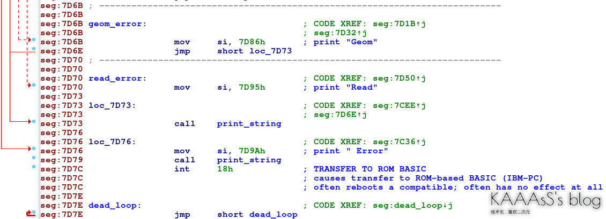
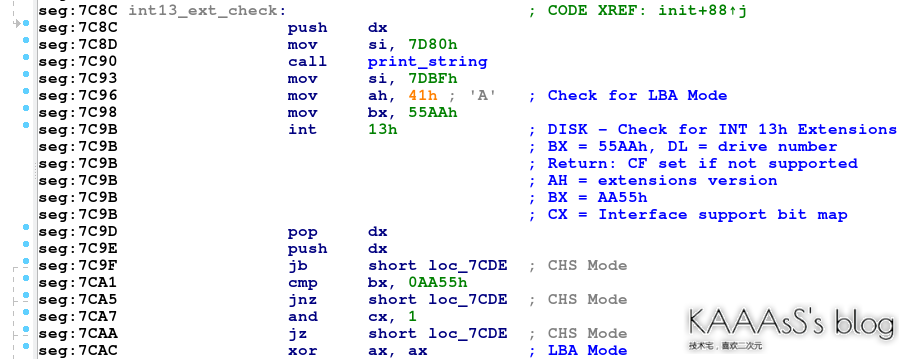
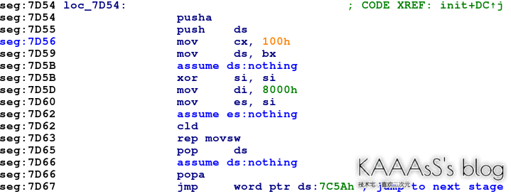

TODO: archlinux

# 1. 引导基本说明

- 引导(Boot)
  - 对于PC来说，启动电脑的目的是为了启动操作系统。而操作系统无外乎就是某些特定的程序。
  - 但是如今，我们通常会将操作系统程序安装在外存，也就是硬盘上。
  - 因此，我们就需要 **先将操作系统程序读入并装载至内存，并设置初始环境** ，这一步被称为引导（Boot）操作系统。
- 引导程序位置
  - 不过 **由于操作系统多种多样，引导操作系统的方式也不尽相同** 。
  - 因此，如果 把引导操作系统的程序也随操作系统放在硬盘上。那么谁来引导操作系统的引导程序呢？
  - 很显然，这个引导程序不能安装在硬盘上。毕竟，我们就是要引导硬盘上的程序。
  - 因此， **这个程序通常安装在主板的ROM、Flash上** 。
- 引导程序作用
  - **将操作系统程序读入并装载至内存，并设置初始环境** 
  - 引导时我们也需要访问、识别其他硬件设备（除了硬盘，还有光驱、USB等等），因此这个程序 **也需要具备访问其他硬件设备的能力** 。
  - 此外它 **还要在操作系统的启动过程中，给操作系统提供访问硬件设备的方法** 。
  - 因此事实上，这个 **引导程序已经承担起了部分操作系统的工作** 。

- BIOS（Basic Input/Output System）
  - 引导程序就是一个操作系统，BISO（Basic Input/Output System）
  - 它运行在实模式(windows的一种保护模式)，如今几乎只用于从其他设备引导系统或进行设备调试。
  - 它就是电脑通电后运行的第一个程序。
  - **支持Legacy和UEFI两种模式**
    - Legacy模式只支持MBR类型分区，
    - 而UEFI支持MBR和GBT两种类型的分区

# 2. Legacy Boot与MBR

## 2.1. 说明

- Legacy Boot:
  - 使用BIOS的引导方式就称为Legacy。
  - 从名字可以看出（Legacy指遗产），这种引导方式是非常古老的。
- **MBR（Master Boot Record，主引导记录）**
  - 引导程序, MBR是 **直接写在引导扇区的，并不是以文件的形式存在**
  - **MBR总共分为三段** ：
    > 不难看出，MBR实际上除了引导系统，还记录了磁盘的分区。
    - 引导代码（446字节）
    - 硬盘分区表（64字节）
    - MBR标志（2字节，固定是0x55AA）

## 2.2. 引导流程

- BIOS引导流程解析：
  - 在BIOS启动流程中，电脑通电后就会开始执行BIOS程序。
  - BIOS在通电后首先进行自检（POST），然后BIOS会识别并加载各种设备，比如CPU、RAM、DMA、硬盘、光驱等等。
  - 之后，BIOS将会查找所有引导设备，并尝试运行其上的引导程序。
    - 这个查找顺序就是我们在BIOS设置页面设定的启动顺序。
    - 对于每个引导设备，BIOS加载它的第一个扇区（共512字节，称为引导扇区），这个扇区就放着MBR。
    - 不过有一个问题，就是 **引导代码仅仅只有446字节** 。
      - 在BIOS被设计的那个年代，446字节也许够用，但是对于当代的PC系统446字节就显得捉襟见肘了。
      - 怎么办呢？其实也好办，只要再 **套一层娃——用MBR来引导操作系统的引导程序** 。

- Legacy Boot的整体过程大概就是这样了：
  - BIOS启动，进行自检
  - 按照顺序遍历设备，找到有MBR的启动设备
  - MBR引导操作系统的引导程序（Linux通常是Grub，Windows则是bootmgr）
  - 操作系统的引导程序引导操作系统

## 2.3. MBR测试

- 在Linux下，我们可以使用指令dump出MBR。
- 虽然我目前的磁盘是GPT的（不同的分区方式，下一篇就讲），但是为了防止为MBR设计的程序错误修改磁盘，因此GPT盘的第一个扇区通常会写入保护MBR（Protective MBR）。
- 使用gdisk指令就可以查看磁盘当前是否写入了MBR：

  ```
  $ sudo gdisk /dev/nvme0n1
  GPT fdisk (gdisk) version 1.0.5

  The protective MBR's 0xEE partition is oversized! Auto-repairing.

  Partition table scan:
    MBR: protective
    BSD: not present
    APM: not present
    GPT: present

  Found valid GPT with protective MBR; using GPT.

  Command (? for help): q
  ```
- 可以看到MBR段是protective。使用dd指令，就可以将MBR dump到mbr.bin文件。

  ```

  $ sudo dd if=/dev/nvme0n1 of=mbr.bin bs=1 count=512
  $ hexdump mbr.bin -C | tail -n 5                   
  000001c0  02 00 ee ff ff ff 01 00  00 00 ff ff ff ff 00 00  |................|
  000001d0  00 00 00 00 00 00 00 00  00 00 00 00 00 00 00 00  |................|
  *
  000001f0  00 00 00 00 00 00 00 00  00 00 00 00 00 00 55 aa  |..............U.|
  00000200
  ```
- 可以看到，末尾的标志确实是0x55AA。不过由于 **保护性MBR只是为了防止磁盘受更改，因此它的代码段并没有实际用于启动的代码** 。

## 2.4. 实际MBR

- 实际使用中的MBR还真不太好找。
  - 如今，Windows已经唯一指定UEFI了，因此我们只能在其他阵营里找MBR。
  - 我最终选择采用Linux的Live OS的MBR来进行分析。
  - Live OS通常是用来安装或检修Linux系统的阉割版Linux，类似于Windows阵营的PE系统。
  - 你可以在这里找到它的十六进制格式：https://pastebin.com/DE2hkQQj。
- Linux通常使用Grub进行引导，比如这个Live OS。
  - 因此这一段MBR当然就是Grub写入的MBR了（grub-install指令）。
  - 在偏移180h处，可以看到6位字符`GRUB \0`，这就是Grub MBR的标志。
- 在Grub MBR的标志之后，是一些错误信息：“Geom”、“Hard”、“Disk”、“Read”、“ Error”。
  - Grub用单词的形式存储这些错误信息来节省空间。
  - 而之后的代码段就是用来打印错误信息了。
- 我们可以从错误信息的打印开始对引导逻辑进行分析。
  - 在反汇编时要注意，由于BIOS是运行在实模式下的，因此要做特殊的配置。
  - 此外，MBR在运行时会被BIOS装载到内存地址0x7C00，因此需要对反汇编器的段位置进行调整。
  - 反汇编后可以看到，错误文本后是一段打印字符串的子程序。

    
  - 在其余位置，可以找到它的调用。一般的调用过程是先打印错误的项目，然后再打印“ Error”。

    
  - 在显示错误之后，程序进入死循环，等待用户重启。既然知道了错误信息的打印，顺藤摸瓜，就可以找到相关的启动代码了。

## 2.5. Grub MBR为例的磁盘引导

- 最开始的若干代码仅仅是初始化运行环境。之后在`7C8C`时，程序开始检查BIOS所支持的磁盘读写模式。

  

  - 在BIOS下，通常有两种方式对磁盘进行读写：CHS模式和LBA模式。
    - CHS（cylinders-heads-sectors）是比较原始的读取方式，它使用(磁头, 磁道, 扇区)对某一扇区进行定位。
    - 而LBA（Logical Block Address）是之后扩展的读取方式，它只需要给出目标区块的偏移就可以进行读取了。
    - 对于磁盘来说，一个区块等同于一个扇区。此处的一系列判断实际上是为了判断BIOS是否支持LBA读取，之后选择具体的读取模式。
    - 因为两个模式的读取实际上大同小异，所以我们直接来分析较为简单LBA模式。
  - 这里拼装了调用所需的参数（即disk address packet），而7DB0处就是下一阶段程序在硬盘上的位置了（严格来说是这个程序在硬盘上第一个扇区的位置）。

- 读取完毕后，程序跳转至[7C5A]，也就是下一阶段代码在内存中的位置。
  - 对于Grub来说通常是0x8000。由此，MBR所负责的引导部分（Grub中称为Stage1）结束。

  

- 这段程序的源码位于Grub项目的[boot.S](https://github.com/coreos/grub/blob/2.02-coreos/grub-core/boot/i386/pc/boot.S)

## 2.6. MBR只是程序

- 确实。你或许会问，那后66字节算什么呢，那些难道也是程序嘛？
  - 确实，一般来说那些都不是程序。
  - 但是你细品MBR的加载过程，其实只是运行了一段程序而已，所以你完全可以在后64字节写程序（最后2字节的标志还是要留的）。
- 之前我提到，BIOS实际上是一个低层次的操作系统。
  - 所以你完全可以用这510字节写点引导之外的程序。
  - 事实上，还真有人干过这事。YouTube频道主8-Bit Guy就介绍过两个[写在引导扇区的游戏](https://www.youtube.com/watch?v=1UzTf0Qo37A&ab_channel=The8-BitGuy)
  - 好家伙，系统都不进了，搁BIOS那玩游戏呢。

# 3. UEFI 与 GPT

## 3.1. MBR 的缺点

> MBR 的缺点主要在于他是个程序。

- 引导程序和磁盘分区原本是不太相关的两个事情，但是 MBR 却用一种及其原始的方式把它们混合在了一起。
- 此外，MBR 程序本身也带来了不少麻烦。
- 由于 MBR 运行在实模式，因此它的编写与引导过程的其它程序有诸多不同。
- 而且由于 MBR 是直接写在引导扇区的，并不是以文件的形式存在，因此对 MBR 进行管理也十分麻烦。
- 缺少程序校验也使黑客可以通过更改 MBR，让病毒在操作系统引导前就完成载入。
- 总而言之，MBR 的设计真的太过时了。

## 3.2. UEFI

- 来源：
  - UEFI（Unified Extensible Firmware Interface，统一可扩展固件接口）
  - 就是为了替代 BIOS 与 MBR 而诞生的。
  - UEFI 的前身是 Intel 开发的 EFI，在标准化后就改名为 UEFI。
- 定位
  - 从名字就可以看出，UEFI 是 **介于系统固件和操作系统中间的软件界面** 。
  - 因此，它的定位并不是和 BIOS 类似的操作系统，而仅仅是一系列固件接口程序。
  - 而这意味着 UEFI **并不会使用中断，也没有完整的内存分配机制** 。
  - 这使得 UEFI 专注于硬件交互和系统引导，也简化了硬件驱动开发的流程。
- 兼容性：
  - UEFI 的一大特点就是灵活。
  - 比如 UEFI 的驱动程序是使用 EBC（EFI Byte Code）编写的，
  - 运行时 UEFI 固件会在 DXE（Driver Execution Environment，驱动程序运行环境）下实时解释执行，类似于 Java 字节码和 JVM 的关系。
  - 因此， **UEFI 下的驱动程序是与 CPU 架构无关的，兼容性相对更好** 。

## 3.3. GPT

- 作用：
  - GPT，即 GUID Partition Table(全局唯一标识分区表)
  - UEFI 的另一个功能就是引导。而由于操作系统程序存在于磁盘中，因此 UEFI 也需要分区表。
  - GPT就是 UEFI 标准中的分区表。 **不同于 MBR，GPT 只负责分区** 。
- 内容：
  > GPT 以 LBA 编址，与存储介质的形态无关，因此可以兼容各种设备。
  - GPT 总共占用磁盘开头的 34 个 LBA，包含了
    - 保护 MBR
      - 位于开头的 LBA（或前 512 字节）
      - 它具有 MBR 标志位但是并不保存实际分区数据，
      - 只是用于防止针对 MBR 设计的程序对 GPT 结构进行破坏。
    - GPT 头
    - GPT 数据
  - 此外，GPT 通常还会占用磁盘最后 33 个 LBA，用来 **备份当前的分区表** 。

- 特点：
  - GPT 最明显的一个特点就是使用 GUID 来标志磁盘分区和分区类型。
  - 比如
    - 对于 MBR 分区表，GPT 将它的分区类型标志为 `024DEE41-33E7-11D3-9D69-0008C781F39F`
    - 而 EFI 系统分区将被标志为 `C12A7328-F81F-11D2-BA4B-00A0C93EC93B`。
  - **对于不同的系统不同分区类型，都可以使用各自的分区类型标志** 
    - 因此 GPT 的分区信息较 MBR 更加丰富。

- 测试：
  - 在 Linux 下，使用 `gdisk` 指令即可对 GPT 分区表的磁盘进行操作。
    > 可以看到，gdisk 识别出了不同的分区类型。

    ```
    $ sudo gdisk /dev/nvme0n1
    GPT fdisk (gdisk) version 1.0.5

    The protective MBR's 0xEE partition is oversized! Auto-repairing.

    Partition table scan:
      MBR: protective
      BSD: not present
      APM: not present
      GPT: present

    Found valid GPT with protective MBR; using GPT.

    Command (? for help): p
    Disk /dev/nvme0n1: 500118192 sectors, 238.5 GiB
    Model: INTEL SSDPEKKW256G8                     
    Sector size (logical/physical): 512/512 bytes
    Disk identifier (GUID): 4C0FC2FD-B8CF-11E9-A0C4-7470FD38587D
    Partition table holds up to 128 entries
    Main partition table begins at sector 2 and ends at sector 33
    First usable sector is 34, last usable sector is 500118158
    Partitions will be aligned on 2048-sector boundaries
    Total free space is 6105 sectors (3.0 MiB)

    Number  Start (sector)    End (sector)  Size       Code  Name
      1            2048         1230846   600.0 MiB   EF00  EFI system partition
      2         1230848       415408788   197.5 GiB   0700  Basic data partition
      3       415410176       416720895   640.0 MiB   2700  
      4       416722944       500117503   39.8 GiB    8300  Linux data partition
    ```
  - windows 下
    - win+r打开输入`diskpart`
    - 打开的窗口中输入`list disk`
    - Gpt下面带 `*` 就是GPT模式

    

## 3.4. ESP 和 UEFI引导

- ESP（EFI system partition，EFI 系统分区）
  - 是 GPT 的一种 **特殊的分区类型** 。
  - ESP  **专门用来存放引导相关的文件** ，因此会被特殊标记，并在启动时自动搜索引导程序。
  - 和 MBR 不同， **ESP 中的引导程序是以文件的形式存储的** ，因此 ESP 本身也是格式化的（通常是 FAT32）。
  - 文件的形式给 UEFI 带来了远超 MBR 的引导能力，部分引导程序甚至可以通过配置文件来实现自定义。

- 路径：
  - 在 linux 下， **ESP 通常会被挂载为 /boot/efi** 
  - ESP 磁盘的 EFI 文件夹下存放了各种启动引导程序（包括 Bootloader 和 Boot Manager）。
  - ESP 可以同时存放多个引导程序。
    - UEFI 标准规定，引导程序必须放置在 ESP 磁盘的 `/EFI/id/` 下，并且以.efi 为后缀名，
    - 比如 Manjaro 默认的引导位于 /EFI/Manjaro/grubx64.efi。
- 引导顺序:
  - 启动时系统会扫描相关引导程序，并按预先设定的顺序进行引导。
  -  **使用 efibootmgr 指令可以查看当前的引导顺序** 

    ```
    $ efibootmgr
    BootCurrent: 0004
    Timeout: 2 seconds
    BootOrder: 0004,0000,0005,0006,0007,0001,0002,0003
    Boot0000* Windows Boot Manager
    Boot0001* UEFI:CD/DVD Drive
    Boot0002* UEFI:Removable Device
    Boot0003* UEFI:Network Device
    Boot0004* rEFInd Boot Manager
    Boot0005* Manjaro
    Boot0006* UEFI: PXE IP4 Realtek PCIe GBE Family Controller
    Boot0007* UEFI: PXE IP6 Realtek PCIe GBE Family Controller
    ```
  - 使用 -o 选项可以对启动顺序进行调节。具体操作可以查看 man。

- UEFI shell：
  - 除了从 ESP 进行引导（不仅限于磁盘，还有 USB 设备等等），UEFI 标准还提供了 UEFI Shell 以便在 shell 环境下执行、调试 UEFI 程序。

## 3.5. 引导程序

- 引导程序分类：其实分为 Bootloader 和 Boot Manager。
  - Bootloader 仅仅是用于引导系统的程序，
  - 而 Boot Manager 是 Bootloader 的管理程序，可以实现如 **多系统选择引导** 等等功能。
    - 不过如今，Bootloader 大多集成了 Boot Manager 的功能。
    - 比如 Windows 阵营的 `Windows Boot Manager`，Linux 阵营中的 `Grub2`。
    - 它们都可以承担多系统引导的工作。而专门化的 Boot Manager 比如 rEFInd，目前更多承担的是可定制化启动和美化的工作。
    - 不过 **在 UEFI 中，它们都统一以 EFI 文件夹下的.efi 文件的形式存在** 。
    - 以 Grub2 为例，你可以通过如下指令生成 Grub2 的引导程序

      ```bash
      grub-install --target=x86_64-efi --efi-directory=/boot/efi --bootloader-id=Manjaro
      ```
- 通过 EFI，原本的启动引导过程得到了极大的简化。原本的 MBR 下，一个可能的引导过程为
  - BIOS 启动，寻找引导设备
  - 运行 MBR
  - MBR 查找磁盘上活动分区
  - 运行活动分区内的引导程序 PBR
  - 由 PBR 载入、引导磁盘上的操作系统

- 而简化后的 UEFI 在引导过程中: 只需要寻找并执行 ESP 内的引导程序即可

# 4. Live CD

[Linux 引导那些事儿](https://zdyxry.github.io/2019/12/01/Linux-%E5%BC%95%E5%AF%BC%E9%82%A3%E4%BA%9B%E4%BA%8B%E5%84%BF/)

# 5. 多系统安装引导说明

```
# 设置字体
setfont /usr/share/kbd/consolefonts/LatGrkCyr-12x22.psfu.gz
```

- /mnt/efi ，多个系统会共享

- 安装完arch后，想要引导多系统：
  ```
  # 引导多系统
  pacman -S os-prober
  
  vim /etc/default/grub
  
  # 添加
  GRUB_DISABLE_OS_PROBER=false
  
  # 更新引导程序配置
  update-grub
  
  # 重启
  ```

# 6. 固态硬盘类型

## 6.1. NVMe

## 6.2. SATA

# 7. 文件系统

## 7.1. btrfs

## 7.2. ext4

# 8. archlinux安装

## 8.1. 基础安装

## 8.2. 图形化界面

## 8.3. 系统备份

因为用的btrfs文件系统，因此系统崩了后，用启动盘进入后，挂载@,@home两个分卷到`/`,`/home`后，change root 后再进行操作或者备份还原就行（非root需要su到指定用户）

# 9. linux 图形化接口

- x windows

# 10. linux 桌面环境

## 10.1. DE(Desktop Enviroment, 桌面环境)

- KDE、Gnome、Xfce、Cinammon这些应该叫“桌面环境(Desktop Enviroment，DE)”，
- 同时也自带了“窗口管理器(Windows Manager，WM)”，
  - KDE 的 kwin

## 10.2. WM(Windows Manager, 窗口管理器)

- KDE 的kwin，
  - 其窗口排布设计是采用浮动式的，类似于windows或mac的体验，注重鼠标操作；
- i3wm和dwm是目前平铺式桌面中的佼佼者，它们自己本身就是一个窗口管理器WM，二者的体验相似，都可以做到个性化定制
  - i3wm、dwm之流则直接舍弃了DE，只有一个WM，且采用平铺式的窗口排布，因而体验与windows/mac完全不同，主要是通过键盘操作(当然也可以用鼠标操作)

## 10.3. DM (Display Manager, 显式管理器)

- 显示管理器(DM)又叫做登陆管理器，如sddm、lightdm等，其作用仅仅只是在你开机后，让你输入用户名和密码登陆
- 然后引导进入桌面，至此任务完成，之后就交给kde或i3wm管理桌面了。
- **可以不需要DM，直接通过startx脚本命令进入桌面** 。


# 11. 参考资料

- 基础理论
  - [ ] [Arch入门指南](https://zhuanlan.zhihu.com/p/561081661)
  - [ ] [Linux 引导那些事儿](https://zdyxry.github.io/2019/12/01/Linux-%E5%BC%95%E5%AF%BC%E9%82%A3%E4%BA%9B%E4%BA%8B%E5%84%BF/)
  - [x] [关于启动引导的那些事儿（上）](https://cloud.tencent.com/developer/article/1934547)
  - [x] [关于启动引导的那些事儿（下）](https://blog.kaaass.net/archives/1422)
- arch 安装
  - [ ] [arch基础安装](https://arch.icekylin.online/guide/rookie/basic-install.html)
  - [ ] [最全Arch Linux安装教程——打造真正属于你的操作系统](https://www.bilibili.com/video/BV11J411a7Tp/?from=search&seid=16049395152824050336&vd_source=6040768a03c22f9dac8d817ab002d7ab)
  - [ ] [arch-wiki libinput](https://wiki.archlinux.org/title/libinput)
  - [ ] [Life With Arch: 触摸板改用Synaptics驱动](https://www.jianshu.com/p/2212d452119b?utm_campaign=maleskine&utm_content=note&utm_medium=seo_notes&utm_source=recommendation)
  - [ ] [Archlinux Timeshift系统备份与还原 ](https://www.cnblogs.com/Likfees/p/14806538.html)
  - [ ] [Linux 下 MacBook 触摸板设置](https://harttle.land/2019/05/01/linux-macbook-trackpad-settings.html)
    > macbook上实际无法实现惯性功能
- dwm 工具链（待尝试）
  - [suckless极简主义开发团队](https://suckless.org/)
  - [ ] [从零开始配置自己的Arch Linux桌面（极简）](https://zhuanlan.zhihu.com/p/112536524)
    > dwm工具链相关软件，推荐看下
  - [ ] [入坑dwm](https://zhuanlan.zhihu.com/p/183861786)
  - [ ] [BSPWM vs dwm , i3 , awesome](https://zhuanlan.zhihu.com/p/273461212)
  - [ ] [Plasma中使用其他的窗口管理器](https://userbase.kde.org/Tutorials/Using_Other_Window_Managers_with_Plasma/zh-cn)
- 其他相关
  - [ ] [鸟哥的linux私房菜-x window system](http://shouce.jb51.net/vbird-linux-basic-4/201.html)
