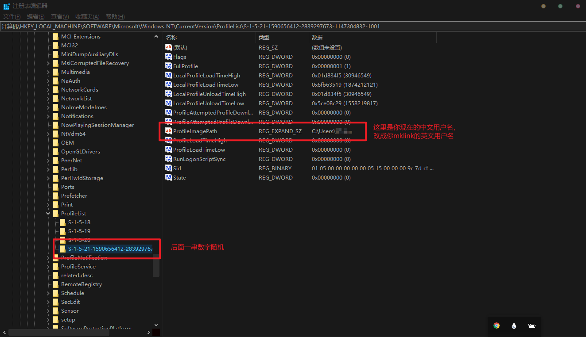

> 用来记录一些有的没的

# win10中文用户名问题

- 问题：免密登录linux时，中文用户名乱码，显示无法找到.ssh文件夹

- 设置软链接
  ```bash
  mklink /J C:\users\英文用户名 C:\users\当前中文用户名
  ```

- 修改注册表
  ```
  计算机\HKEY_LOCAL_MACHINE\SOFTWARE\Microsoft\Windows NT\CurrentVersion\ProfileList
  ```

  

