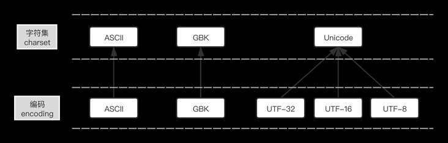
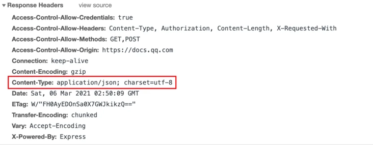

# 算法说明

## 编码

### 字符集和字符编码



- 字符集和编码
  - 字符集(Character Set):是一个系统支持的所有抽象字符的集合。 **把字符直接编号为数(字符->码点)**
    - 定义系统能处理哪些字符。
    - 字符是各种文字和符号的总称，包括各国家文字、标点符号、图形符号、数字等。
      > 如unicode字符集中也包括Emoji字符，[emoji字符编码查询](https://apps.timwhitlock.info/emoji/tables/unicode#block-2-dingbats)
    - 码点（Code Point）：有些地方翻译为码值或内码。是指在某个字符集中，根据某种编码规则将字符编码后得到的值
      - 比如在ASCII字符集中，字母A经过ASCII编码得到的值是65，那么65就是字符A在ASCII字符集中的码点。
    - 常见字符集有：ASCII字符集、GB2312字符集、BIG5字符集、GB18030字符集、Unicode字符集等。
  - 编码(Encoding):则规定这些字符在计算机内部的表示方式。 **把字符转换为数**。
    - **是一套法则**，使用该法则能够对自然语言的字符的一个集合（如字母表或音节表），与其他东西的一个集合（如号码或电脉冲）进行配对。
    - 即**在符号集合与数字系统之间建立对应关系**，它是信息处理的一项基本技术。
    - 通常人们用符号集合（一般情况下就是文字）来表达信息。
    - 而以计算机为基础的信息处理系统则是利用元件（硬件）不同状态的组合来存储和处理信息的。
    - 元件不同状态的组合能代表数字系统的数字，因此字符编码就是**将符号转换为**计算机可以接受的数字系统的**数**，称为数字代码。
  - 关系
    - **每个字符集都有自己对应的字符编码**, ASCII字符集就有ASCII编码

      <details>
      <summary style="color:red;">ASCII编码表</summary>

      
      </details>
    - 但是每个字符集不止有一种字符编码。如unicode字符集有直译的UTF-32编码(4个字节)，也有变长字节编码utf-16(2或4个字节),utf-8(1-4个字节)等。

### 流程说明（网页传输为例）

> 使用mysql的 `hex(convert("[字符串]",using [编码]))` 获取指定16进制

#### 编码

> java服务器为例

- html文件读取：
  - 说明
    - 以指定编码的方式存储在磁盘，读取到内存时会解码为unicode码值的形式
    - 以`utf-8`方式存储再磁盘中时，需要以`utf-8`方式进行解码为`unicode`码值
      ```java
      new BufferedReader(new InputStreamReader(connection.getInputStream(),"utf-8"));
      ```
  - 以`编码`两字为例：
    - 磁盘中的值为：`E7BC96E7A081`。
      ```sql
      SELECT HEX(CONVERT('编码' USING utf8));
      ```
    - 显示在IDE中时，内存中的值为：`00007F1600007801`。
      ```sql
      SELECT HEX(CONVERT('编码' USING utf32));
      -- utf32编码就是unicode->码值的映射
      ```

- 数据发送时，再编码为指定编码格式
  ```java
  // 将内存中的unicode码值以什么形式编码后发送（以节省发送字节数）
  new BufferedWriter(new OutputStreamWriter(new FileOutputStream(file),"utf-8"));
  ```

--- 

- JVM中unicode的桥梁作用：
  - JVM内存都是采用Unicode进行编码，一个char占2个bytes。
  - 在接收到IO字节流、向IO输出字节流的时候，都是**以Unicode为桥梁**，**IO输入会先转为Unicode，输出会从Unicode转为相应编码**。
  - 所以从外部接收的数据，想让JVM自身能正确存储、显示，实质就是先正确利用发送方的编码方式来解读bytes，存为Unicode的char stream过程。

#### 识别

- 检测文件头的字节顺序标识（Byte Order Mark，BOM）
  ```
  EF BB BF UTF-8
  FE FF UTF-16/UCS-2, big endian
  FF FE UTF-16/UCS-2, little endian
  FF FE 00 00 UTF-32/UCS-4, little endian.
  00 00 FE FF UTF-32/UCS-4, big-endian.
  ```

- 软件自己根据编码规则猜测当前文件的编码。
  - 响应体中的content-type字段中的编码信息

    
  - html和xml文档中的编码声明：
  ```xml
  <!-- html -->
  <meta charset="UTF-8">
  <!-- xml -->
  <?xml version="1.0" encoding="UTF-8"?>

  <!-- 疑问：解析后才能看到这个字符串吧，怎么回事儿？ -->
  ```

- 缺省或者提示用户输入

#### 解码

- 浏览器拿到二进制的数据后，解码为码值。
  ```sql
  -- utf-8解码为unicode码值为例
  SELECT CONVERT(0xE7BC96E7A081 USING utf8);
  ```

### unicode与utf-8

#### UCS-2，UCS-4以及UTF

- UCS-2
  - Unicode是为整合全世界的所有语言文字而诞生的。
  - 任何文字在Unicode中都对应一个值， 这个值称为码值（code point）。
  - 码值通常写成 U+ABCD 的格式。而文字和代码点之间的对应关系就是UCS-2（Universal Character Set coded in 2 octets）
  - 顾名思义，UCS-2是用两个字节来表示码值，其取值范围为 U+0000～U+FFFF。
- UCS-4
  - 为了能表示更多的文字，人们又提出了UCS-4
  - 即用四个字节表示代码点。它的范围为 U+00000000～U+7FFFFFFF
  - 其中 U+00000000～U+0000FFFF和UCS-2是一样的。

- 注意
  - UCS-2和UCS-4只规定了代码点和文字之间的对应关系
  - **并没有规定代码点在计算机中如何存储**。
  - 规定存储方式的称为UTF（Unicode Transformation Format），
  - 也就是我们上面提到的UTF8格式和下面将要提到的UTF16、UTF32格式。

#### unicode->utf-8映射规则

- 对于单字节的符号
    ```
  字节的第一位设为 0，后面的7位为这个符号的 Unicode 码，
  因此对于英文字母，UTF-8 编码和 ASCII 码是相同的。 
    ```
- 对于n字节的符号（n>1）
  ```
  第一个字节的前 n 位都设为 1，第 n+1 位设为 0，
  后面字节的前两位一律设为 10，
  剩下的没有提及的二进制位，全部为这个符号的 Unicode 码 。
  ```
- 举个例子：
  ```
  比如说一个字符的 Unicode 编码是 130，显然按照 UTF-8 的规则一个字节是表示不了它
  （因为如果是一个字节的话前面的一位必须是 0），所以需要两个字节(n = 2)。
  根据规则，第一个字节的前 2 位都设为 1，第 3(2+1) 位设为 0，
  则第一个字节为：110X XXXX，后面字节的前两位一律设为 10，后面只剩下一个字节，所以后面的字节为：10XX XXXX。
  所以它的格式为 110XXXXX 10XXXXXX 。
  ```

#### utf-8出现的原因/作用

```
虽然unicode编码能做到将不同国家的字符进行统一，使得乱码问题得以解决，
但是如果内容全是英文unicode编码比ASCII编码需要多一倍的存储空间，同时如果传输需要多一倍的传输。
当传输文件比较小的时候，内存资源和网络带宽尚能承受，
当文件传输达到上TB的时候，如果"硬传"，则需要消耗的资源就不可小觑了。
为了解决这个问题，一种可变长的编码“utf-8”就应运而生了，把英文变长1个字节，汉字3个字节，
特别生僻的变成4-6个字节，如果传输大量的英文，utf8的作用就很明显了。

所以utf-8编码在做网络传输和文件保存的时候，将unicode编码转换成utf-8编码，才能更好的发挥其作用；
当从文件中读取数据到内存中的时候，将utf-8编码转换为unicode编码，亦为良策。
```


#### unicode的大头小头

- 说明
  - 以汉字`严`为例，Unicode 码是`4E25`，需要用两个字节存储，一个字节是`4E`，另一个字节是`25`。
  - 存储的时候，`4E`在前，`25`在后，这就是 **Big endian** 方式；`25`在前，`4E`在后，这是 **Little endian** 方式。
- Unicode 规范定义，每一个文件的最前面分别加入一个表示编码顺序的字符，
  - 这个字符的名字叫做"零宽度非换行空格"（zero width no-break space），用`FEFF`表示。
  - 这正好是两个字节，而且`FF`比`FE`大`1`。
  - 如果一个文本文件的头两个字节是`FE FF`，就表示该文件采用大头方式；
  - 如果头两个字节是`FF FE`，就表示该文件采用小头方式。


#### 文件头编码标识

```
EF BB BF UTF-8
FE FF UTF-16/UCS-2, big endian
FF FE UTF-16/UCS-2, little endian
FF FE 00 00 UTF-32/UCS-4, little endian.
00 00 FE FF UTF-32/UCS-4, big-endian.
```

### 现代编码模型（扩展）

> ### 说明

- 现代编码模型自底向上分为五个层次：
  - 第1层 抽象字符表ACR(Abstract Character Repertoire)：明确字符的范围(即确定支持哪些字符)
  - 第2层 编号字符集CCS(Coded Character Set)：用数字编号表示字符(即用数字给抽象字符表ACR中的字符进行编号)
  - 第3层 字符编码方式CEF(Character Encoding Form)：将字符编号编码为逻辑上的码元序列(即逻辑字符编码)
  - 第4层 字符编码模式CES(Character Encoding Scheme)：将逻辑上的码元序列映射为物理上的字节序列(即物理字符编码)
  - 第5层 传输编码语法TES(Transfer Encoding Syntax)：将字节序列作进一步的适应性编码处理

- 来源：[Unicode Technical Report (UTR统一码技术报告)](http://www.unicode.org/reports/tr17/#Repertoire)

> ### 抽象字符表 ACR (Abstract Character Repertoire)

- **抽象字符** (Abstract Character) [维基](https://zh.wikipedia.org/wiki/%E5%AD%97%E7%AC%A6_(%E8%AE%A1%E7%AE%97%E6%9C%BA%E7%A7%91%E5%AD%A6))
  - 字符是指字母、数字、标点、表意文字（如汉字）、符号、或者其他文本形式的书写“原子”。
  - 例： `a`,`啊`,`あ`,` α`,`Д`等，都是**抽象的字符**。
  - 像`a`这样的字符是有形的，但在计算机中，有许多的字符是空白的，甚至是不可打印的。
  - 比如ASCII字符集中的NULL，就是一个抽象字符。
  - 注意\x00,\000,NULL,0 这些写法都只是这个抽象字符的某种表现形式，而不是这个抽象字符本身。

- **抽象字符集** ACR (Abstract Character Repertoire)
  - 是现代编码模型的最底层，指的是**字符与抽象字符的集合**。
  - 它是一个集合，通过枚举指明了所属的所有字符与抽象字符。因为是集合，所以也是**无序的**
  - 已经有了很多标准的字符集定义: [Character Sets](https://www.iana.org/assignments/character-sets/character-sets.xhtml)
    - 比如US-ASCII, UCS(Unicode), GBK这些我们耳熟能详的名字，都是(或者至少是)抽象字符集。
    - US-ASCII定义了128个抽象字符的集合。GBK挑选了两万多个中日韩汉字和其他一些字符组成字符集，而UCS则尝试去容纳一切的抽象字符。它们都是抽象字符集。
    - 抽象字符 英文字母`A`同时属于US-ASCII, UCS, GBK这三个字符集。
    - 抽象字符 中文文字`蛤`不属于US-ASCII，属于GBK字符集，也属于UCS字符集。
    - 抽象文字 Emoji `😊`不属于US-ASCII与GBK字符集，但属于UCS字符集。

- 注意：
  - 抽象字符集也是有**开放**与**封闭**之分的。
  - ASCII抽象字符集定义了128个抽象字符，再也不会增加。这是一个封闭字符集。
  - Unicode尝试收纳所有的字符，一直在不断地扩张之中

- 例：我可以自己定义一个字符的集合，叫这个集合为haha字符集。
  ```python
  haha_acr = { 'a', '吼', 'あ', ' α', 'Д' }
  ```

> ### 编码字符集 CCS (Coded Character Set)

- **编码字符集**
  - 是一个每个所属字符都分配了**码位**的抽象**字符集**。
  - **编码字符集(CCS)**也经常简单叫做**字符集(Character Set)**
  - 这样的叫法经常会将**抽象字符集ACR**与**编码字符集CCS**搞混。不过大多时候人们也不在乎这种事情。

- 码值/码位
  - 为了更好的描述，操作字符，我们可以为抽象字符集中的每个字符关联一个数字编号，这个数字编号称之为**码位(Code Point)**。
  - 通常根据习惯，我们为字符分配的**码位**通常都是非负整数，习惯上用十六进制表示。且一个编码字符集中字符与码位的映射是**一一映射**。
  - 字符`吼`与码位`0x1`关联，这时候，在haha编码字符集中，`吼`就不再是一个单纯的抽象字符了，而是一个**编码字符(Coded Chacter)**，且拥有**码位** `0x1`。

- 与抽象字符集区别
  - **抽象字符集**是抽象字符的集合，而集合是的无序的
  - 抽象字符集并没有用，因为我们只能判断某个字符是否属于某个字符集，却无法方便地引用
  - 如果说抽象字符集是一个Set，那么编码字符集就可以类比为一个Dict。
    - 它的key是字符，而value则是码位。

- 注意：
  - 按照目前最新Unicode 9.0.0的标准，UCS理论上收录了128,237个字符,也就是0x1F4ED个
  - 不过如果进行一些尝试会发现，实际能用的最大的码位点在0x1F6D0 ，也就是128,720，超过了收录的字符数
  - **码位**是非负整数没错，但这不代表它一定是连续分配的。
  - 出现这种情况只有一个原因
    - 那就是UCS的码位分配不是连续的，中间有一段空洞，即存在一段码位，没有分配对应的字符。
    - 实际上，UCS实际分配的是`0x0000~0x0xD7FF` 与 `0xE000~0x10FFFF`这两段。
      > **0x0000~0xD7FF** | **0xE000~0x10FFFF** 称为**Unicode标量值(Unicode scala value)**，也就是实际值
    - 中间`0xD800~0xDFFF`这2048个码位留作它用，并不对应实际的字符。
      > - **0xD800~0xDBFF** 称为**High-surrogate**
      > - **0xDC00~0xDFFF** 称为**Low-surrogate**
    - 如果直接尝试去输出这个码位段的'字符'，结果会告诉你这是个非法字符。
      ```python
      >>> print u'\UDDDD'
      File "<stdin>", line 1
      SyntaxError: (unicode error) 'unicodeescape' codec can't decode bytes in position 0-5: truncated \UXXXXXXXX escape
      ```

- 例：为haha抽象字符集进行编码，就可以得到haha编码字符集。
  ```python
  haha_ccs = { 'a' : 0x0, '吼':0x1 , 'あ':0x2 , ' α':0x3 , 'Д':0x4  }
  ```

> ### 字符编码表 CEF (Character Encoding Form)

> ### 字符编码方案 CES (Character Encoding Schema)

> ### 传输编码语法 TES (Transfer Encoding Syntax)

## 编码算法

#### URL 编码

#### Base64 编码

## 哈希(hash)算法/摘要(digest)算法

### 算法说明

| 算法       | 输出长度（位） | 输出长度（字节） |
| :--------- | :------------- | :--------------- |
| MD5        | 128 bits       | 16 bytes         |
| SHA-1      | 160 bits       | 20 bytes         |
| RipeMD-160 | 160 bits       | 20 bytes         |
| SHA-256    | 256 bits       | 32 bytes         |
| SHA-512    | 512 bits       | 64 bytes         |

### java 库-BouncyCastle

## Hmac 算法

> ak/sk

## 对称加密算法

### 算法说明

| 算法 | 密钥长度    | 工作模式             | 填充模式                                |
| :--- | :---------- | :------------------- | :-------------------------------------- |
| DES  | 56/64       | ECB/CBC/PCBC/CTR/... | NoPadding/PKCS5Padding/...              |
| AES  | 128/192/256 | ECB/CBC/PCBC/CTR/... | NoPadding/PKCS5Padding/PKCS7Padding/... |
| IDEA | 128         | ECB                  | PKCS5Padding/PKCS7Padding/...           |

### 示例

## 口令加密算法

### 说明

### 示例

## 密钥交换算法

### 说明

### 实现

## 非对称加密算法

## 签名算法

## 数字证书

# 应用与问题

## mysql处理emoji

## Https 的连接与中间人攻击

# 参考资料

- [廖雪峰-加密与安全](https://www.liaoxuefeng.com/wiki/1252599548343744/1255943717668160)
- [字符集和字符编码（Charset & Encoding）](https://www.runoob.com/w3cnote/charset-encoding.html)
- [Unicode 和 UTF-8 的关系](https://blog.csdn.net/zhusongziye/article/details/84261211)
- [字符编码笔记：ASCII，Unicode 和 UTF-8](https://www.ruanyifeng.com/blog/2007/10/ascii_unicode_and_utf-8.html)
- **[阮一峰的网络日志](https://www.ruanyifeng.com/blog/2007/10/ascii_unicode_and_utf-8.html)**
- [十分钟搞清字符集和字符编码](http://cenalulu.github.io/linux/character-encoding/)
- [Java中的编码问题：接收、转码、输出](https://blog.csdn.net/ts_dchs/article/details/73011259)
- [字符编码掠影：现代编码模型](https://www.zhihu.com/question/31833164/answer/115069547?spm=a2c6h.12873639.0.0.50534cadpacQ2r)
