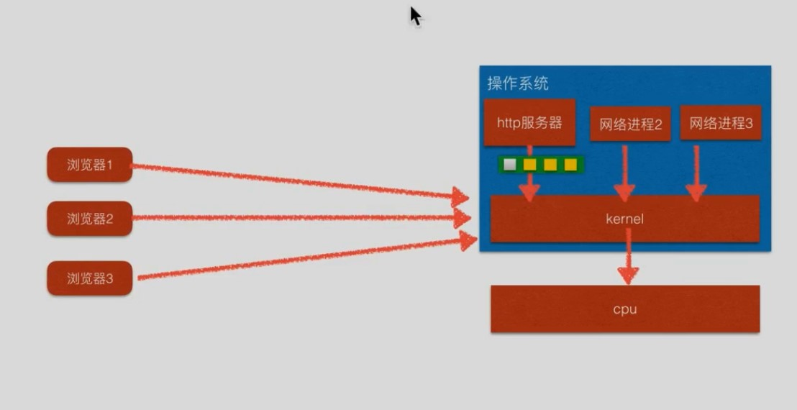
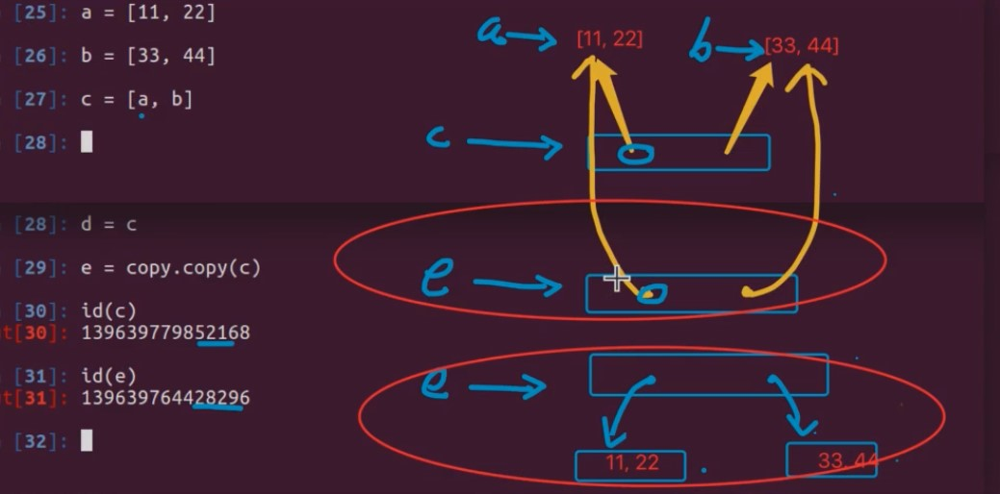

> 只整理了一些注意点

# 1. python基础

> 这里只写注意点

- 运算符
    - // 整除
    - ** 幂
    - str也可以使用 *

- 数字型变量：
    > **数字型变量间可以直接进行运算**
    - int
    - float
    - bool
        - 非0为True
        - 0位False

- 非数字性变量
    - str
        - str和数字间不能通过`+`拼接
    - 列表
    - 元组
    - 字典

- input("请输入内容")得到数值类型都是字符串

- 一个变量赋什么类型的值都行

- print函数
    - 里面的参数间有逗号的话，输出时两两之间会有空格
    - 两个字符串间用空格隔开的话，输出时不会有空格

- 格式化字符串
    > 和c不同
    - `print("格式化字符串" % (参数，单个参数时可以省略括号))`
    - print("%d",10*10)
        > 输出10次10
    - print("%d",(10*10))
        > 输出100

- 和java相同，函数不能在定义前进行调用。但当函数A内部调用另一个函数B时，则函数B的定义可以在函数A之后
- 函数的文档注释添加在函数声明的下方，使用多行注释
    ```py
    def function(p1,p2)

        """这是函数注释 
        
        :p1 这是参数1的注释
        :p2 这是参数2的注释
        """
    ```

- for
    - 可以搭配else使用。如果没用通过break结束循环，最终就睡执行else

- 四个高级类型
    - 四个
        - 列表(list)
            > 相当于java中的数组
            - 一个列表中可以存储不同的类型(甚至列表)，和js相同
                > js中数组就是对象，索引就是属性名<br>
                > python中List也是对象
                - 超出索引会报错
                - `del`关键字：**本质上将变量从内存中删除**，也可以用来删除指定列表中指定索引数据（和`pop(index)`作用相同）。了解即可
                - 只有全是同类型数据才可以排序
                - extend 和 append 区别
                - 对于列表，+=操作并不是相加并赋值，本质上就是extend

        - 元组(tuple)
            > 类似于数组
            - 用 () 定义。通过[]获取指定索引的数据
            - 元组数据无法修改，通常用来保存不同类型数据
            - a=(5)，类型为**int**。a=(5,)类型为元组
            - 用途
                - 作为函数的参数或返回值
                    - `return 1,2,3`返回的就是一个元组
                - 格式化字符串后面本质就是一个元组
                    ```py
                    t = ("zhangsan", 175.7,18)
                    print("名字：%s，身高:%.2f,年龄：%d" % t)
                    str="名字：%s，身高:%.2f,年龄：%d" % t
                    ```
                - 可以将列表转换为元组，保护数据安全。也可以讲元组转换为列表，进行修改
                    > `tuble(list)``list(tuble)`
                - 有类似es6的特性
                    > `a,b=(1,2)` 或者 `a,b=1,2`<br>
                    > `a,b=(b,a)`这样可以用来交换数值

        - 字典
            > 相当于 map
            - 通过{}定义
            - 只要是不可变类型就可以作为键 比如int 元组
            - 可以通过`map["key"]`进行取值和修改值
            - update方法进行添加键值对

        - str
            - 三个数值字符串判断
            - isspace():\t\n也是空白字符
            - index方法找不到会报错，find方法找不到会返回-1
            - replace会返回修改后的值，不会修改字符串本身
            - 字符串倒序索引：最后一个元素索引是-1
    - 序列类型共同运算
        > 更多查文档，还有很多内容
        - +
        - [num:num:num]
            - 步长为负的时候会从右向左切
            - 高级类型中字典不能进行切片
        - in / not in
        - *
            - 高级类型中字典不支持
        - del
            - **作为关键字和函数使用两种方式效果相同**
        - len
        - max
            - 高级类型中，如果是字典，只对key进行比较
        - min
            - 高级类型中，如果是字典，只对key进行比较
        - cmp(已被取消)，使用\> < = <= >=
            - 字典不能比较大小

- python不允许函数内部修改全局变量的值，修改的话就会在函数内部创建一个同名局部变量
    - 全局变量最好命名在最上方，最前面加个g_或gl_
    - 想要修改就要使用`global`关键字
        ```py
        def test:
            global g_num
            g_num=99 # 修改全局变量
        ```

- python中函数中的形参允许默认值，并且带有默认值的形参要在最后
    - 想要无视参数顺序特别指定参数的值，可以将形参名写上，比如：`end=""`


- python函数的多值参数
    > *和**为主要，后面的名称随意，不过一般是一下
    - *args：表示元组
    - **kwargs:表示字典
        ```py
        def test(*args,**kwargs):
            print(args)
            print(kwargs)
        test(1,2,3,4,"name"=1,2="value")
        ```
    - 将实参前加*或**进行元组或字典的拆包
        > 不拆包的话就会称为`(g_nums,g_kw)`这样的一个元组
        ```py
        g_nums=[1,2,3]
        g_kw={
            "name1"="value1",
            "name2"="value2"
        }
        test(*g_nums,**g_kw)
        ```

# 2. 面向对象及之后

- 创建对象：`对象名 标识符=类名()`

- 内置对象命名：`__method_name__`

- 对象新增方法`obj.new_attr='newvalue'`
    > 和js相同，但**不推荐**

- self就相当于this

- python的构造函数`__init__`用来添加属性，其中self不可省略
    ```py
    class TempClass:
    def __init__(self,name):
        self.new_name=name
        print(self.new_name)
    def testmethod(self):
        print(dir(self))
    ```
- python的`__del__`方法以后再具体讲
    - `del v`才可以删除，并在删除时自动调用`__del__`。调用`__del__`方法并不会删除对象

- `__str__`相当于toString()方法。必须返回一个字符串。在`print(obj)`时调用

- python会讲括号中的代码连接到一起，不会有语法错误，当return后面代码过长时可以用括号括起来

- `print(list)`是，是不会一个一个调用列表中对象的`__str__`方法的，只会输出地址。**因为不知道列表中的是不是对象**

- `None`相当于`null`

- python中※
    - `is` `not is`用来判断`内存地址`是否相等
    - `==`用来判断值是否相等。底层是调用`__eq__`。如果设置为一直返回ture，那么与None比较也是true
- `is`要更快些，推荐使用`is`判断是否为None


- python中属性名前加`__`（两个下划线），就成了私有属性或方法。不能通过对象直接访问。dir也不能查到
- 当然，也可以访问到私有属性方法，但不推荐。方法：`对象名._类名__私有方法或属性名`
    ```py
    class TempClass:
    def __init__(self, name):
        self.new_name = name
        self.__serect='serect'
        print(self.new_name)

    temp=TempClass('temp')
    print(temp._TempClass__serect)
    ```

- 继承语法
    ```py
    class Son(Father):
        pass
    ```

- 子类方法中调用父类方法
    ```py
    class Son(Father):
        def father_method:
            # 创建特殊类对象来调用父类的方法
            super().father_method()
            pass

    # python2.x中使用该种（不推荐使用）。同时如果使用子类名字调用的话会出现递归死循环
    FatherClassName.method(self)
    ```

- python支持多继承
    - 根据继承顺序，优先级从高到低。同名方法，优先级高的覆盖低的
    ```py
    class Son(Father1,Father2):
        pass
    ```

- python的方法搜索顺序（MRO,method resolution order）
    - 内置属性`__mro__`可以查看方法搜索顺序

- python3版本的 新式类 和以前的 旧式类
    - 新式类：以object类为基类。python3中默认继承
    - 旧式类：不以object为基类。python2中不会默认继承
    - 内置属性方法就是从object中继承的
    - 新式类和旧式类在多继承时方法的搜索顺序是不同的
    - 为了兼容性，推荐这样写：
        ```py
        def temp(object):
            pass
        ```
- 因为python是动态语言，所以就没也强制类型转换

- 类对象（推荐看看课件）
    - 对象各自拥有自己的实例属性。
    - 但python中实例化的方法只有一份，对象调用时将self传入并进行调用
    - 和java相同，类也是对象，方法实例存在与类对象中，而不是对象实例中
    - 类属性定义
        ```py
        class Temp:

            count=0  # 类属性。不写在构造方法中 

            def __init__(self):
                Temp.count+=1  # 类属性count加一。既可以通过类名，也可以通过对象
        ```
    - 属性获取时，先从对象中查找，再从类中查找。
        - 既可以通过类名获取（**推荐**）
        - 也可以通过对象名获取（这样若进行赋值的话，(回顾python添加对象属性的方法)，会给对象内部添加同名属性。而调用时也会先从对象中查找）

    - 类方法定义
        ```py
        @classmethod
        def ClassMethod(cls):
            pass
        ```
    - 哪一个类的类方法，cls就是哪个类对象的引用
    - 方法内部可以通过`cls`访问类属性和类方法
    - 通过`类名.类方法`调用时，不需要传递`cls`参数


- 静态方法
    - 不访问实例属性方法，也不访问类属性方法
    - 不需要`self`作为第一个参数
    - 定义
        ```py
        class Temp:
            @staticmethod
            def StaticMethod():
                # 不访问实例属性和实例方法
                pass
        Temp.StaticMethod() # 通过类名调用
        ```
    - 调用：通过类名进行调用
    - 也就是说除了实例属性方法其他都用类调用

- 示例
    ```py
    """ 
    设计一个 Game 类
    属性：
        定义一个 类属性 top_score 记录游戏的 历史最高分
        定义一个 实例属性 player_name 记录 当前游戏的玩家姓名
    方法：
        静态方法 show_help 显示游戏帮助信息
        类方法 show_top_score 显示历史最高分
        实例方法 start_game 开始当前玩家的游戏
    主程序步骤
        1) 查看帮助信息
        2) 查看历史最高分
        3) 创建游戏对象，开始游戏 
    """
    class Game(object):

            # 游戏最高分，类属性
            top_score = 0

            @staticmethod
            def show_help():
                    print("帮助信息：让僵尸走进房间")
                    
            @classmethod
            def show_top_score(cls):
                    print("游戏最高分是 %d" % cls.top_score)

            def __init__(self, player_name):
                    self.player_name = player_name

            def start_game(self):
                    print("[%s] 开始游戏..." % self.player_name)
                    
                    # 使用类名.修改历史最高分
                    Game.top_score = 999

    # 1. 查看游戏帮助
    Game.show_help()

    # 2. 查看游戏最高分
    Game.show_top_score()

    # 3. 创建游戏对象，开始游戏
    game = Game("小明")

    game.start_game()

    # 4. 游戏结束，查看游戏最高分
    Game.show_top_score()
    ```

- `__new__`方法
    - 在内存中为对象返回空间
    - 返回对象的引用（该引用便传递给`__init__`）

- 异常捕获语法
    ```py
    try:
            # 尝试执行的代码
            pass
    except 错误类型1:
            # 针对错误类型1，对应的代码处理
            pass
    except 错误类型2:
            # 针对错误类型2，对应的代码处理
            pass
    except (错误类型3, 错误类型4):
            # 针对错误类型3 和 4，对应的代码处理
            pass
    except Exception as result:
            # 打印错误信息
            print(result)
    else:
            # 没有异常才会执行的代码
            pass
    finally:
            # 无论是否有异常，都会执行的代码
            print("无论是否有异常，都会执行的代码")
    ```

- 模块的`__file__`可以查看模块真实路径
- 模块导入时会执行所有无缩进的代码
- 模块的`__name__`属性
    - 模块直接运行时值为`__main__`，以此来防止导入时执行测试代码
    - 如果模块被其他模块导入，值就是模块名
    ```py
    if __name__=="__main__"
        # 测试代码
        pass
    ```

- 包下有必须有一个特殊文件`__init__.py`，用来表示给外界提供使用的模块名
    - 提供使用的模块
    ```py
    from . import moudle1
    from . import moudle2
    ```
    - 导入一个包就会导入所有提供使用的模块

- 如果子类的父类不是object，那么要手动在`__init__`中调用一下 `super.__init__`，保证从父类继承的东西能正常使用

- with 方式：
    ```py
    # 使用该方式会自动关闭流
    try:
        with open(file_name, "rb") as f:
            content = f.read()
    except Exception as e:
        print(e)
    ```
    ```py
    # 等同于：
    try:
        f = open(file_name,"rb")
        content = f.read()
    except Exception as e:
        print(e)
    finally:
        f.close()
    ```
- enumerate()会将可迭代数据转化为枚举类型：
    ```py
    l = ["1","2","3"]
    e = enumerate(l)
    for i,v in e:
        print(i,v)

    ```


- 通过进程池创建的进程，主进程运行完后不会等待直接关闭，因此`p.join`至关重要
- 进程池中进程间通信要用 multiprocessing.Manager().Queue
- print中 \r 可以进行删除屏幕输出
- python2中，range 和 xrange 区别（迭代器）,python3中已经将range换成了xrange
- 除了for循环能接收可迭代对象，list、tuple等也能接收。
    ```py
    li = list(FibIterator(15))
    print(li)
    tp = tuple(FibIterator(6))
    print(tp)
    ```
- 三次挥手四次握手
    - 关闭的是socket的收发，操作j系统底层的收发并没有被关闭，为了收发确认回答消息会开着
    - 之所以把中间那两次分开，为的是在调用close后再服务端再发送确认，要使合起来的话，close无法放到两次的中间
    - 在客户端端口close后，在2倍的msl内（就是一个往返时间）客户端会等待服务端会不会因为没收到回复而再次发送确认，如果没收到才会关闭端口
    - 在socket close或者终止进程后直接关闭端口的设置：
        ```
        对于一个socket，可以设置很多不同的选项，对于那些一般用途的服务器，一个最让人感兴趣的socket选项是SO_REUSEADDR,通常地，
        在一个服务器进程终止后，操作系统会保留几分钟它的端口，
        从而防止其他进程（甚至包括本服务器自己的另外一个实例）在超市之前使用这个端口，
        如果你设置了SO_REUSEADDR的标记为true,操作系统就会在服务器socket被关闭或者服务器进程终止后马上释放该服务器的端口。
        这样做，可以使调试程序更简单。
        level:
        SOL_SOCKET:通用套接字选项.
        IPPROTO_IP:IP选项.
        IPPROTO_TCP:TCP选项.
        ```
    - 图：
        > 

- 响应中的Content-Length用于告诉什么时候传完，这在长连接时是必要的（http/1.1）

- 普通情况下服务器占用一定的内存空间，操作系统占用一定的内存空间
    - 每次要检测socket是否有接收数据时，都会讲服务器中的socket数据复制到kernel中，再进行检测
    - 效率低
- epoll则是在两者内存空间之外开辟kernel和服务器公用的空间，省去了复制数据的时间
    - 同时不是通过轮训的方式，而是以事件通知的方式哪个socket的数据到了，哪个就运行，类似 事件
    - [参考博客](https://blog.csdn.net/xiajun07061225/article/details/9250579)
    - 图片：
        > 
- 服务器速度： 多进程<多线程<协程<单进程,线程非阻塞<<epoll

- cmd中 arp -a 查看arp协议中ip与mac映射
- GIL（全局解释器锁）:
    - python很早之前就出现了
    - 当时没有考虑并发问题，导致最早使用的c语言python解析器cpython有GIL问题
    - 使用cpython解析器的python程序中的多线程是假的多线程，同一时间只有一个线程在执行
    - 互相抢GIL锁
    - 而且GIL难以去除，曾经尝试去除后效率变低
    - 所以使用c语言解析器时，要使用多进程而不是多线程
    - 但多线程依旧会比单线程性能有所提升，因为遇到IO堵塞会自动释放GIL锁
    - GIL导致多线程合计只能利用一个核的100%（利用率可能分布在多个核上，可以在linux上验证）
    - 因此多线程和协程适合IO密集型程序（充分利用等待时间）。
    - 多进程适合计算密集型程序（充分利用多个核计算能力）
    - GIL解决方式：
        - 换python解释器
        - 用其他语言来写线程中要执行的函数（python可以调用java，cc++，js等语言。比如python可以通过c编译出的.so文件来调用c语言里的函数）
    - 额外：numpy没有gil锁，是它速度快的原因之一

- 深拷贝，浅拷贝
    - 只看一层：
        - c语言中，将一个数组复制给一个变量时，默认也会将数据复制一份，这是深拷贝
        - 而python中只会复制引用，称为浅拷贝
        - python的copy模块下有deepcopy函数来完成深拷贝，会将数据复制一份
    - copy与deepcopy区别
        > 
        - 简单解释
            - copy只会深拷贝第一层，剩下的浅拷贝(上面那个拷贝e)
            - deepcopy深拷贝所有，递归深拷贝（下面那个拷贝的e）
            - 例外:
                - 在拷贝元组时，如果元组里面都是不可修改的数据，比如常量，元组，因为不可修改，所以copy和deepcopy只会拷贝元组的引用，而不会拷贝元组本身
                - 但是如果元组内为数组引用时
                    - copy:依旧拷贝引用
                    - deepcopy:会进行多层的深拷贝
        - 总结：
            - 如果每层全为可变类型
                - copy：只深拷贝第一层
                - deepcopy：递归深拷贝所有
            - 如果每层全部是不可类型数据：
                - copy：只拷贝引用
                - deepcopy：只拷贝引用
            - 拷贝引用指向数据为不可变类型，但存在可变数据
                - copy：只拷贝引用
                - deepcopy：递归深拷贝所有
        - 特殊情况：
            - 切片[:]：相当于copy。浅拷贝
            - 字典：会拷贝一份字典中的key以及字典中value的 引用 。浅拷贝
            - 函数中传递对象时传递的是引用，如果想传递副本数据，就要在调用函数式参数传递处使用deepcopy


- 多模块开发
    - 多模块开发时，会有一个main模块，多个功能模块，以及一个公用数据模块
    - 有一个模块用来存储公用数据
    - 导入模块import m
    - 获取或者修改模块的中全局变量的值   m.FLAG
    - 因为是通过访问模块m来修改FLAG，所以这样可以正常进行
    - 但是如果 from m import FLAG
    - 这样在方法中进行 FLAG = True时
    - 公用数据模块中的数据并不会被修改
    - 原因是导入的FLAG为全局变量，默认会在局部作用域中声明一个局部变量FLAG，而无法修改全局变量
    - 解决方法是 global FLAG
    - 又如过是一个list，调用方法进行修改可以正常进行（引用指向不变），但不声明global时重新赋值的话会出问题

- 使用类名调用父类方法时，如果多继承的两个父类都来源于同一个更上层的类，那么就会调用两次。
- 问题：多继承时调用super无法调用到父类：
    - MRO中调用顺序是由python解析器中的C3算法计算得到的
    - C3算法保证每一个父类或更上层的类中方法的只调用 一次
    - 在使用super()调用构造方法时，会按照MRO中的顺序进行执行__init__方法
    - 而不是单纯的找父类！！
    - super()中不传入参数，就从当前类开始串MRO
    - 如果super(son1,self),就从son1开始串MRO(不包括son1)，执行init
    - 图片：
        > 
- 调用父类方法方式：
    - 直接 父类名字.方法
    - super()
    - super(类名,self)

- 继承不是复制

- 对象创建过程：
    - __new__创建内存空间
    - 将指向内存空间的引用传递给__init__中的self
    - 对内存空间进行初始化
- 类对象与实例对象
    - 实例对象只有属性各有一份
    - 实例对象对于类方法，类属性，普通方法，静态方法都共有
    - 实例对象可以调用类方法，静态方法，普通属性
    - 但类对象只能调用类方法和静态方法
- property属性：
    - 作用类似java中的逻辑视图
    - 具体使用查看笔记
- __init__不是构造方法
    - 其他语言中通过构造方法进行内存的开辟与数据的初始化
    - 而python中使用__new__完成内存的开辟，使用__init__完成数据的初始化

- Python各种推导式:https://blog.csdn.net/yjk13703623757/article/details/79490476
- 列表切片后可以直接重新设置值
- 名字重整：类中定义的私有属性会别重整为 ‘_类名私有属性名’
- 多个装饰器进行装饰时，装饰顺序是从下到上，这样会得到执行顺序从上到下的结果。func()只执行一遍
    > 

- 全局变量，类，函数查找方式：
    - 一开始会默认导入builtins模块
    - 当调用某个变量，函数，对象时，会先去builtins.globlas()返回的字典中找
        > 返回的字典中存储着一些自己定义的全局变量，函数，类等。key为变量名，函数名，类名，value为指向实际存储内存空间的引用
        > <br>
        > globas返回值中也包含指向builtins模块的引用，为__bulitins__
    - 如果找不到，就去builtins模块中找
        > builtins模块中存储着预定义的一些函数等。比如print

- 类创建了实例对象，而元类type创建了类对象
    > 解析器解析代码时，默认就是用type创建的类
    > <br>
    > 类名为type第一个参数，继承的父类元祖为type第二个参数，类下定义的所有**类属性**和方法为第三个参数。（注意，想要定义实例属性就要写__init__方法）
    - 所以可以通过传递meteclass的值来指定调用其他函数或者类来创建类
        > 原理：函数名加括号是调用函数，返回类对象。类名加括号是返回__new__和__init__后的对象

- 判断语句语法糖：
    ```python
    a = 1 if 3>2 else 4
    ```
- eval可以实现字符串向python数据类型的转换

- 正则相关 
    - `re.findall("aaa(.*)bbb",str)`:会返回括号中分组的内容，而不是整个字符串。所以京城使用findall()[0]，而不是search
    - 点号默认匹配不到\n，re的每个方法都可以指定.的模式，例：
        - re.match("","",re.DOTALL)  (默认情况)
        - re.match("","",re.DOALL)
    - \s匹配空格,\r,\n\,tab等
