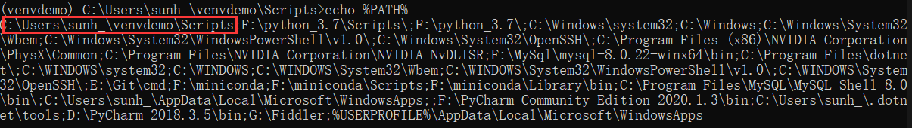

# venv 工具

## 说明

```bash
python -m venv -h
```

```
positional arguments:
  ENV_DIR               A directory to create the environment in.

optional arguments:
  -h, --help            show this help message and exit
  --system-site-packages
                        Give the virtual environment access to the system
                        site-packages dir.
                        代表使用全局环境中的第三方库（否则虚拟环境直接是纯洁的第三方库）

  --symlinks            Try to use symlinks rather than copies, when symlinks
                        are not the default for the platform.

  --copies              Try to use copies rather than symlinks, even when
                        symlinks are the default for the platform.

  --clear               Delete the contents of the environment directory if it
                        already exists, before environment creation.

  --upgrade             Upgrade the environment directory to use this version
                        of Python, assuming Python has been upgraded in-place.

  --without-pip         Skips installing or upgrading pip in the virtual
                        environment (pip is bootstrapped by default)
                        代表不安装pip（一般都是要装的，所以默认就行）

  --prompt PROMPT       Provides an alternative prompt prefix for this
                        environment.
```

## 基本使用

- 创建虚拟环境

  ```
  python -m venv <venv name>
  ```

- 激活

  ```bash
  # <venv name>/Scripts 下

  activate activate.bat Activate.ps1
  ```

- 关闭

  ```bash
  # <venv name>/Scripts 下

  deactivate.bat 
  ```

## 基本原理

- 其实激活虚拟环境就是在环境变量PATH中插入激活的虚拟环境的路径
- 虚拟环境的环境变量就排在了原生pathon的环境变量的前面。

  

  

- 关闭虚拟环境也就是将环境变量PATH从去除掉，从而关闭虚拟环境。

## 保存和复制虚拟环境

- 使用`pip freeze >requirements.txt`命令将虚拟环境的库，冻结后存到requirements.txt文件里。
- 只需要通过`pip install -r requiremnets.txt`即可安装此项目运行需要的包。

# pipenv

# 参考

- [ ] [Python虚拟环境](https://blog.csdn.net/qq_44643484/article/details/123251333)
- [ ] [Python依赖管理那些事](https://zhuanlan.zhihu.com/p/71594408)
- [ ] [Python依赖包管理](https://ziqiangxu.github.io/blog/Python/%E4%B8%BA%E4%BB%80%E4%B9%88%E4%BD%BF%E7%94%A8pipenv.html)
