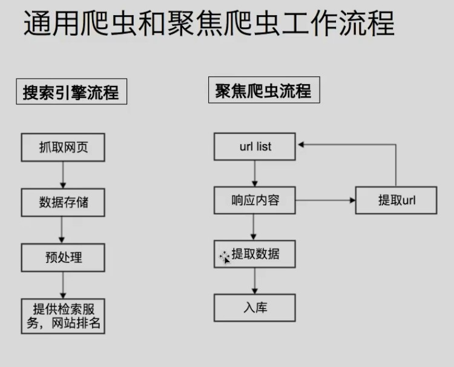
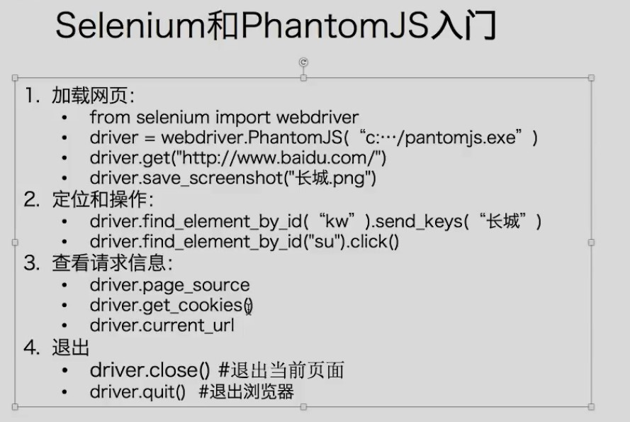

# 1. 基础知识

## 1.1. 应用场景

- 通过程序从网站上获取相应的数据
  - 用于直接呈现
    - 比如 baidu 搜索引擎就相当于一个大型爬虫
    - 以及某些新闻网站
  - 用于数据分析
    - 比如 微指数 网站

## 1.2. 基础

- 基本概念：
  ```
  网络爬虫（又被称为网页蜘蛛，网络机器人）就是模拟客户端
  发送网络请求，接收请求响应，一种按照一定的规则，自动地
  抓取互联网信息的程序。
  只要是浏览器能做的事情，原则上，爬虫都能够做
  ```
- 分类：

  - 通用爬虫：通常指搜索引擎爬虫
  - 聚焦爬虫：针对特定网站的爬虫

- 工作原理：

  >  > <br>
  > pagerank 网站排名算法，可以了解下

- ROBOTS 协议

  - 定义： 网站通过 Robots 协议告诉搜索引擎哪些页面可以抓取，哪些页面不可以抓取
  - 示例：
    > 

- 静态和动态网页：
  - 静态网页只要请求一次即可抓到数据
  - 动态网页
    - 通过 ajax 获取
    - 通过 js 生成（比如某些链接的参数）
  - 注意：浏览器中的网页是很多请求响应获得的资源渲染的，爬虫一次只能爬一个响应。

# 2. request 模块使用

## 2.1. 基本

- 1.requests 的底层实现就是 urllib
- 2.requests 在 python2 和 python3 中通用，方法完全一样
- 3.requests 简单易用
- 4.Requests 能够自动帮助我们解压（gzip 压缩的等）网页内容

## 2.2. 常用 api

> 遇事不决查文档 https://requests.readthedocs.io/zh_CN/latest/

- 注意：

  - requests 模块用来发送请求
  - response 用来存储接收的响应信息，response.request 用来接收对应的**请求信息**

- 请求方法

  > 会默认设置请求头<br>
  > 默认为：{'User-Agent': 'python-requests/2.24.0', 'Accept-Encoding': 'gzip, deflate', 'Accept': '\*/\*', 'Connection': 'keep-alive'}
  > <br>因此以后都要自己手写，防止根据 User-Agent 被反爬

  - requests.get()
    > header 和 params 都是字典类型<br>
    > 例：requests.get("https://www.baidu.com/s",headers=headers,params=params)
    - 设置 header：get(url,headers=headers)
    - 设置参数：
      > **注意**：参数在内部都会进行 url 编码，查询 response.request.url 可以发现<br>
      - get(url,params=params)
        > ? 可有可无
      - 字符串格式化：使用%或 format
  - requests.post()
    > 例：requests.post("http://www.baidu.com",data=data,headers=headers)<br>
    > data 和 headers 都是字典。data 相当于 get 请求中的 params
  - requests.delete()
  - requests.put()
  - requests.head()
  - requests.options()

- cookie:

  - 写在 header 中
  - 在请求方法中`cookies = cookies`

- 解决解码：

  - 使用 response.content.decode("utf-8")
  - 使用 response.encodeing="utf-8"
  - response.text
    > 默认 ISO 编码进行解码

- 获取其他信息
  - response.status_code：获取状态码
  - response.headers：获取响应头
  - response.request.url：获取请求地址。
  - response.url：获取响应地址（在重定向时请求响应地址会不同）

* 其他：
  - assert 语句：判断一个表达式是否正确，否则抛出错误
    > 可以在判断状态码不为 200 时使用
  - 字符串格式化方式；
    - %
    - str.format
      > "https://www.baidu.com/s?wd={}".format("python")
  - python test4.py 1,2,3
    - 这个命令会把["test4.py",1,2,3]传递到 sys.argv 这个数组中。
  - ~/.bashrc 可以设置 alias（命令别名）
  - pprint 模块可以在打印 dict 等时优化控制台输出

## 2.3. 使用代理

- 代理：
  - 反向代理：
    - 如 nginx
    - 访问 nginx 服务器的地址，nginx 再访问资源服务器地址。
    - 浏览器本身不知道资源服务器地址，通过 nginx 获得资源
  - 正向代理：
    - 如 shadowsocks,http 代理
    - 访问谷歌服务器资源，http 代理返回资源
    - 浏览器本身就知到目的服务器地址，通过代理做中转
- 使用：
  - 代码示例：
    ```python
    proxies = {
        "http":"http://1217.0.0.1:8080", # 为http服务的代理
        "https":"https://1217.0.0.1:8080" # 为https服务的代理
    }
    request.get("http://www.baidu.com",proxies=proxies)
    ```
- 可用性：

  - 为 requests 添加超时参数
  - 通过在线工具测试

- python 中客户端 session

  > 注意：指的不是服务器中的 session

  - 作用：
    - 通过 session 发送请求，会把返回的 cookie 保存在 session 中
    - session 发送请求时能自动携带内部的 cookie
  - 示例；

    ```python
    session = request.session()
    post_url = "https://www.test.com/login"
    post_data = {
        "username":"user",
        "password":"password"
    }
    headers = {
        "user-agent": "Mozilla/5.0 (Windows NT 10.0; Win64; x64) AppleWebKit/537.36 (KHTML, like Gecko) Chrome/84.0.4147.105 Safari/537.36"
    }
    # 进行登录，获得cookie
    session.post(post_url,data = post_data,headers = headers)

    # 让session带着cookie去进行访问
    response = session.get("https://www.test.com/test",headers = headers)
    ```

## 2.4. 常用方法

- cookiejar 对象和 dict 相互转换：
  - cookiejar->dict: request.utils.dict_from_cookiejar(response.cookies)
  - dict->cookiejar: request.utils.cookiejar_from_dict(cookie)
    > 因为 cookiejar 中包含 cookie 作用路径等其他信息，所以从字典转 cookiejar 会有很多信息会设置成默认值（因此该方法用的并不多）
- url 解码，编码：

  - 解码：request.utils.unquote("")
  - 编码：request.utils.quote("")

- ssl 证书：
  - 情况:
    - https 网站需要购买 ssl 证书经过认证，确保安全性
    - 如果没有 ssl 证书
      - 浏览器中请求，就会提示：“您的链接不是私密链接”
      - 代码请求，就会报 SSLError
  - 忽略证书进行访问：
    - `response = request.get("https://www.12306.cn",verify = false)`
      > verify = false 关闭验证
- 设置超时：
  - 目的：防止一个请求卡住
  - 方法：
    - `response.get(url,timeout = 10)`。 10 秒的超时参数
    - 如果发生超时会产生异常
    - 通过 retrying 模块中的 @retry 可以设置重试次数（当然也可以自己写，但 retry 更方便）
- 多线程爬虫：
  - queue.put()将 item 放入队列。
  - queue.get()获得 item。一般和 tast_done()搭配使用
  - queue.task_done()告诉队列，该任务的处理已经完成,并从队列中弹出。因为有 join，所以该方法很好用，保证在数据处理完后再接触 join 阻塞
  - queue.join() 进行阻塞，直到队列中所有的元素都被接收和处理完毕。（要在把子线程设为守护线程后使用。t.setDaemon(True)）

# 3. 数据提取方式

## 3.1. 结构化数据处理

- 结构化数据：json,xml 等

- json 处理：

  - 转换：
    > 
  - json 字符串<-->python 数据类型
    - json.loads(str)：返回字典类型对象
    - json.dumps(dict)：把 python 类型转化为 json 字符串。
      > 虽说也可以使用 str()来转，但可读性会很差
      - json.dumps(dict,ensure_ascii=False)：不以 ascii 方式写入，避免中文变为 unicode 编码（\uxxxx）
      - json.dumps(dict,indent = 2)，以两个空格的长度为一个缩进
  - 包含 json 的类文件对象<--->python 数据类型

    > 类文件对象：有 read，write 方法的就是类文件对象。

    - json.load()
    - json.dump()

    ```python
    with open("test.json","r",encoding = "utf-8") as f:
        obj = json.load(f)

    with open("new_test.json","w",encoding = "utf-8") as f:
        json.dump(obj,f,ensure_ascii = False)
    ```

  - 注意：
    - json 都是使用双引号
    - 一个 json 文件中如果包含多个 json 字符串，是无法直接读取的

- 正则表达式：

  - `re.findall("aaa(.*)bbb",str)`:会返回括号中分组的内容，而不是整个字符串。所以京城使用 findall()[0]，而不是 search
  - 点号默认匹配不到\n，re 的每个方法都可以指定.的模式，例：
    - re.match("","",re.DOTALL) (默认情况)
    - re.match("","",re.DOALL)
  - \s 匹配空格,\r,\n\,tab 等

- xml 处理：

  - 导入：`from lxml import etree`
  - 基本使用：

    ```python
    #利用etree.HTML，将字符串解析为HTML文档
    # text 为byte类型
    html = etree.HTML(text)

    div_list = html.xpath("//div[@class = active]")  # 返回的是一个列表。所有class为active的div
    ```

  - 具体看 xpath 使用笔记

## 3.2. 非结构化数据处理

- 非结构化数据：html 等
- html 处理
  - xpath
- csv 文件：
  - 通过 , 分隔列
  - 行就是行
  - 可以通过 excel 打开

# 4. 动态网页数据提取

- Selenium
  ```
  Selenium是一个Web的自动化测试工具，最初是为网站自动化测试而开发的，
  Selenium 可以直接运行在浏览器上，它支持所有主流的浏览器（包括PhantomJS这
  些无界面的浏览器）,可以接收指令，让浏览器自动加载页面，获取需要的数据，甚
  至页面截屏
  ```
- PhantomJS
  ```
  PhantomJS是一个基于Webkit的“无界面”（headless)浏览器，它会把网站
  加载到内存并执行页面上的JavaScript
  ```
- Selenium 常用方法：
  > 
- 页面元素定位方法：
  > 
  - 因为是获取元素，使用 xpath 时不能使用@定位到属性或者使用 text()定位到节点，要使用 element.get_attribute("herf")，element.text
  - find_element 找不到会立刻报错。find_elements 找不到会返回空列表
  - 如果页面中含有 iframe，frame，需要调用 driver.swich_to.frame()切换到 frame 中
- cookie 相关方法：

  > 

- Selenium 只有在第一次请求时才会等待页面加载数据和执行 js。之后需要 time.sleep()
  > 

# 5. ocr

- Tesseract
  ```
  Tesseract 是一个 OCR 库,目前由 Google 赞助(Google 也是一家以 OCR 和机器学习技术闻名于世的公司)。Tesseract 是目前公认最优秀、最精确的开源 OCR 系统，除了极高的精确度，Tesseract 也具有很高的灵活性。它可以通过训练识别出任何字体，也可以识别出任何 Unicode 字符。
  ```

# 6. MongoDB

> 基本上所有内容都在文档中，**去查文档**

## 6.1. window 平台安装

- 下载 [链接](https://www.mongodb.com/try/download/community)
  > 可以选择安装版和压缩包版的。安装版功能全，压缩包版只有 服务端，客户端，分片三个应用，不包含备份等功能
- 找一个位置解压
- 寻找一个地方创建存放数据的目录
  ```
  data/
      conf	-->配置文件目录
          mongod.conf		-->配置文件
      db		-->数据库目录
      log		-->日志文件目录
          mongodb.log		-->日志记录文件
  ```
- 现在就可以启动数据库了
  ```
  D:\mongodb\bin>mongod --path=/data/db
  启动数据库时一定要指定存放数据库文件的目录
  ```
- 为了方便，将 MongoDB 服务器作为 Windows 服务运行。**一定要在管理员模式的 cmd 下运行，启动服务时也要**
  - 此处时直接指定的 log 路径和数据库文件路径
  - 也可以通过指定配置文件位置的方式进行服务安装或数据库启动
  - 配置文件不会自动加载，所以位置放到哪里都行
  ```
  F:\mongodb\bin>mongod --dbpath "f:\data\db" --logpath "f:\data\log\mongodb.log" --serviceName "mongodb" --serviceDisplayName "mongodb" --install
  ```
- 启动常用参数

  | 参数                 | 描述                                                                 |
  | :------------------- | :------------------------------------------------------------------- |
  | --bind_ip            | 绑定服务 IP，若绑定 127.0.0.1，则只能本机访问，不指定默认本地所有 IP |
  | --logpath            | 定 MongoDB 日志文件，注意是指定文件不是目录                          |
  | --logappend          | 使用追加的方式写日志                                                 |
  | --dbpath             | 指定数据库路径                                                       |
  | --port               | 指定服务端口号，默认端口 27017                                       |
  | --serviceName        | 指定服务名称                                                         |
  | --serviceDisplayName | 指定服务名称，有多个 mongodb 服务时执行。                            |
  | --install            | 指定作为一个 Windows 服务安装。                                      |

## 6.2. 概念解析

| SQL 术语/概念 | MongoDB 术语/概念 | 解释/说明                              |
| :------------ | :---------------- | :------------------------------------- |
| database      | database          | 数据库                                 |
| table         | collection        | 数据库表/集合                          |
| row           | document          | 数据记录行/文档                        |
| column        | field             | 数据字段/域                            |
| index         | index             | 索引                                   |
| table joins   |                   | 表连接,MongoDB 不支持                  |
| primary key   | primary key       | 主键,MongoDB 自动将\_id 字段设置为主键 |


## 6.3. 数据类型

| 数据类型           | 描述                                                                                                       |
| :----------------- | :--------------------------------------------------------------------------------------------------------- |
| Object ID          | 对象 ID。用于创建文档的 ID。                                                                               |
| String             | 字符串。存储数据常用的数据类型。在 MongoDB 中，UTF-8 编码的字符串才是合法的。                              |
| Integer            | 整型数值。用于存储数值。根据你所采用的服务器，可分为 32 位或 64 位。                                       |
| Boolean            | 布尔值。用于存储布尔值（true/false）。和 json 相同，true 和 false 首字母都要小写                           |
| Double             | 双精度浮点值。用于存储浮点值。                                                                             |
| Arrays             | 用于将数组或列表或多个值存储为一个键。                                                                     |
| Object             | 用于内嵌文档。就是一个 json，或者文档。类似于 python 中字典的嵌套                                          |
| Null               | 用于创建空值。                                                                                             |
| Timestamp          | 时间戳。记录文档修改或添加的具体时间。                                                                     |
| Date               | 日期时间。用 UNIX 时间格式来存储当前日期或时间。你可以指定自己的日期时间：创建 Date 对象，传入年月日信息。 |
| Symbol             | 符号。该数据类型基本上等同于字符串类型，但不同的是，它一般用于采用特殊符号类型的语言。                     |
| Min/Max keys       | 将一个值与 BSON（二进制的 JSON）元素的最低值和最高值相对比。                                               |
| Binary Data        | 二进制数据。用于存储二进制数据。                                                                           |
| Code               | 代码类型。用于在文档中存储 JavaScript 代码。                                                               |
| Regular expression | 正则表达式类型。用于存储正则表达式。                                                                       |

- 创建 Date: `new Date('YYYY-MM-DD')`
  > 对应 python 中的 `datetime`类型
- 每个文档都有一个属性，为\_id，保证文档的唯一性
  ```
  可以自己去设置_id插入文档，如果没有提供，那么MongoDB为每个文档提供了一个独特的_id,类型为objectlD
  ```
- objectlD 是一个 12 字节的十六进制数：
  - 前 4 个字节为当前时间戳
  - 接下来 3 个字节的机器 ID
  - 接下来的 2 个字节中 MongoDB 的服务进程 id
  - 最后 3 个字节是简单的增量值

## 6.4. 常用命令

- 关于数据库基础命令：
  - 列出所有数据库：`show dbs` / `show databases`
  - 切换到指定数据库：`use db_name`
  - 展示当前使用数据库： `db`
  - 删除当前使用的数据库： `db.dropDatabase()`
  - 创建数据库；**不需要创建，直接 use**
    ```
    use test1000
    ```
- 关于集合基础命令

  - 创建集合
    - 不手动创建集合：在向不存在集合的数据库中添加数据时，集合会被创建出来
      ```
      db.collection3.insert(document)
      ```
    - 手动创建集合：
      - `db.createCollection(name,[options])`
        ```
        db.createCollection("testCollection",{capped:true,size:10})
        capped:默认为false不限制上限，设置为true限制上限
        size:指定capped为true时，需要指定size上限值，到达上限时，数据先进先出
        一般不会设置上限值
        ```
  - 查看集合：`show collections`
  - 删除集合：`db.集合名称.drop()`

- 集合的增删改查
  - 插入数据(json 文档)：
    - `db.集合名称.insert(document)`
      > key 写不写引号都行
      ```
      db.collection1.insert({_id:10010,name:"li",age:12})
      ```
  - 保存数据
    - `db.集合名称.save()`
      > 如果已存在该\_id，则更新数据，否则就添加数据<br>
      > 如果用 insert 时，\_id 相同时会插入失败
  - 查询：
    - `db.集合名称.find()`
  - 更新数据
    - `db.集合名称.update(<query>,<update>,{multi:<boolean>})`
      - 参数 query:查询条件
      - 参数 update:更新操作符
      - 参数 multi:可选，默认是 false,表示只更新找到的第一条记录，值为 true 表示把满足条件的文档全部更新
        > 如果想要更新多条，只能使用`$set`
    - 示例：
      ```
      db.collction1.update({name:'li'},{name:'liu'}) 更新一条。同时将文档内容 替换 为{name:'liu'}，这里不是更新，而是完全替换。
      db.collction1.update({name:'li'},{$set:{name:'liu'}}) 更新找到的第一条。只会更新name键对应的值
      db.collction1.update({},{$set:{gender:'male'}},{multi:true}) 更新所有
      ```
  - 删除数据：
    - `db.集合名称.remove(<query>,{justOne:<boolean>})`
      - query:查询语句
      - jusetOne:是否只删除一条，默认全删，设置为 false 后会删除第一条查到的

## 6.5. 高级查询

- 数据查询：
  - `find(<query>)`：根据条件查询
  - `findOne(<query>)`：根据条件查询一个
  - `pretty`：格式化查询结果
- 比较运算符
  - 等于：默认就是等于，没有等于运算符
  - 小于：\$lt (less than)
  - 小于等于：\$lte (less than equal)
  - 大于：\$gt (greater than)
  - 大于等于：\$gte
  - 不等于：\$ne
  ```
  db.collection2.find({age:{$get:18}})
  查找age大于18数据
  ```
- 范围查询：
  - $in/$nin：在某个范围内的：
  ```
  db.collection2.find({age:{$in:[18,28,38]}})
  查询age等于18，或28，或38的人
  ```
- 逻辑运算符：
  - and：在 json 中写多个条件即可
  - or：\$or
  ```
  db.collection1.find({age:18,gender:'male'})
  db.collection1.find($or:[{age:18},{gender:'male'}])
  db.collection1.find($or:[{age:{$gte:20},{gender:{$in:['male',"female]}}])
  ```
- 正则表达式

  - 两种方式
    - / /
    - \$regex
  - 例：

    ```
    db.collection2.find({name:/^li/})
    以li为开头name

    db.collection2.find({name:{$regex:'iu$'}})
    以iu为结尾的name
    ```

- limit 和 skip
  > 相当于 mysql 中的分页查询
  - limit():读取指定数量的文档
    - `db.集合名称.find().limit(int)`
  - skip：用于跳过指定数量的文档
    - `db.集合名称.find().skip(int)`
  ```
  db.conllection2.find().limit(2).skip(2)
  db.conllection2.find().skip(2).limit(2)
  两条执行效果相同，都是取第三，四条数据
  但数据量大时，推荐先skip后limit
  ```
- 自定义查询
  > 使用**js**
  - \$where
  ```
  db.collection2.find({
    $where.function(){
      return this.age>30;
    }
  })
  ```
- 投影

  - `find(<query>,<resultFilter>)`
    - `key:1`表示展示，不写就不展示
    - \_id 默认一直显示，`_id:0`关闭显示
  - sort():进行排序
    - 1 表示正序
    - -1 表示降序
    - 优先级依次递减

  ```
  db.collection2.find({age:18},{name:1,_id:0})

  db.collection2.find().sort({age:1}) 按照age升序方式进行排序
  db.collection2.find().sort({age:-1,gender:-1}) 按照age降序方式进行排序，先按age排后，再按gender排
  ```

- 个数统计
  - count()
    > 下面两种方式相同
    - `db.集合名称.find(<query>).count()`
    - `db.集合名称.count(<query>)`
- 消除重复
  - `distinct('字段名',<query>)`
  ```
  db.collection2.distinct('name',{age:{$gt:18}})
  查询取出所有年龄大于18的人的姓名，同时对姓名进行去重
  ```

## 6.6. 备份恢复

- 备份：`mongodump -h dbhost -d dbhome -o dbdirectory`
  > 本地备份的话，只用写-d,-o 就行了
  - -h:服务器地址，也可以指定端口号
  - -d:要备份的数据库名称
  - -o:备份数据的存放位置，此目录中存放着备份出来的数据
- 恢复：`mongorestore -h dbhost -d dbname -dir dbdirectory`
  > 本地恢复只用写 -d,-dir 即可
  - -h:服务器地址
  - -d:需要恢复到的哪个数据库中
  - -dir:备份数据所在位置

## 6.7. 聚合 aggregate

- 定义：
  ```
  聚合（aggregate)是基于数据处理的聚合管道，每个文档通过一个由多个阶段
  (stage)组成的管道，可以对每个阶段的管道进行分组、过滤等功能，然后经过
  一系列的处理，输出相应的结果。
  ```
- 格式：`db.集合名称.aggregate({管道：{表达式})`

  ```
  例：
  db.mycol.aggregate([{$group : {_id : "$by_user", num_tutorial : {$sum : 1}}}])
  ```

- 管道操作符

  - \$group：将集合中的文档分组，可用于统计结果。

    - \_id 后的是\$+分组依据字段<br>
    - **将所有文档作为一组，可以：\_id:null**<br>
    - 除了分组依据\_id 必须写，其他的 key 名自己取。想改\_id 的名，使用\$project
    - 取字段的值，使用\$
    - 也能在分组后利用管道传来的值继续分组，比如去重

    ```
    db.collection2.aggregate({$group:{_id:"$age"}})
    db.collection2.aggregate({$group:{_id:"$age",count:{$sum:1}}})
    以age进行分组，同时计算每个分组中的个数

    db.collection2.aggregate(
      {
        $group:{
          _id:null,
          counter:{$sum:1},  # 文档数量
          avgAge:{$avg:'$age'} # 年龄平均值
        }
      }
    )
    ```

  - \$project：修改输入文档的结构。可以用来重命名、增加或删除域，也可以用于创建计算结果以及嵌套文档。
    ```
    db.collection2.aggregate(
      {
        $group:{
          _id:'$gender',
          counter:{$sum:1},  # 文档数量
          avgAge:{$avg:'$age'} # 年龄平均值
        }
      }
    )
    # 这样的话结果中就只还有_id,counter和avgAge三个字段了，默认情况下_id字段是被包含的，如果要想不包含_id话可以这样:
    db.collection2.aggregate(
      {
        $group:{
          _id:'$gender',
          counter:{$sum:1},  # 文档数量
          avgAge:{$avg:'$age'} # 年龄平均值
        },
        # 管道传过来的是{_id:'value',counter:'value',avgAge:'value'}
        $project : {
          _id:0 ,        #_id默认显示
          gender:'$_id', # gender为key，_id的值为value。
          counter: 1 ,
          avgAge: 1
        }
      }
    )
    ```
  - $match：用于过滤数据，只输出符合条件的文档。$match 使用 MongoDB 的标准查询操作。
    - 与 find 的区别是，find 直接返回结果，match 返回的结果会在管道中进一步操作
    ```
    db.collection2.aggregate(
      {
        $match:{
          $and:[
            {age:{$gt:12}},
            {age:{$lt:15}}
          ]
        }
      },
      {
        $group:{
          _id:'$gender',
          count:{$sum:1}
        }
      },
      {
        $project:{
          gender:'$_id',
          _id:0,
          count:1
        }
      }
    )
    ```
  - \$sort：将输入文档排序后输出。
    ```
    db.collection2.aggregate(
      {
        $group:{
          _id:'$age'
        }
      },
      {
        $sort:{_id:-1}  # 因为管道中只有_id，_id的值就是age的值
      },
      {
        $project:{
          _id:0,
          age:'$_id'
        }
      }
    )
    # 所有age升序排列
    ```
  - \$skip：在聚合管道中跳过指定数量的文档，并返回余下的文档。
    ```
    db.article.aggregate(
      { $skip : 5 });
    ```
  - \$limit：用来限制 MongoDB 聚合管道返回的文档数。
    ```
    db.article.aggregate(
      { $limit: 5 });
    ```
  - \$unwind：将文档中的某一个数组类型字段拆分成多条，每条包含数组中的一个值。
    > 
    - 当数组为空时，默认会删除
    - 若不想删除，添加参数`preserveNullAndEmptyArrays`
      ```
      db.collection2.aggregate({
        $unwind:{
          path:'$字段名称',
          preserveNullAndEmptyArrays:<boolean> # 防止数据丢失
        }
      })
      ```
  - \$geoNear：输出接近某一地理位置的有序文档。

| 操作符    | 作用                                                                                   |
| :-------- | :------------------------------------------------------------------------------------- |
| \$group   | 将集合中的文档分组，可用于统计结果。                                                   |
| \$match   | 用于过滤数据，只输出符合条件的文档。\$match 使用 MongoDB 的标准查询操作。              |
| \$project | 修改输入文档的结构。可以用来重命名、增加或删除域，也可以用于创建计算结果以及嵌套文档。 |
| \$sort    | 将输入文档排序后输出。                                                                 |
| \$limit   | 用来限制 MongoDB 聚合管道返回的文档数。                                                |
| \$skip    | 在聚合管道中跳过指定数量的文档，并返回余下的文档。                                     |
| \$unwind  | 将文档中的某一个数组类型字段拆分成多条，每条包含数组中的一个值。                       |
| \$geoNear | 输出接近某一地理位置的有序文档。                                                       |

- 聚合表达式
  ```
    | 表达式     | 描述                                           | 实例                                                                                  |
    | :--------- | :--------------------------------------------- | :------------------------------------------------------------------------------------ |
    | $sum      | 计算总和。\$sum:1 表示以一倍计数               | db.mycol.aggregate([{$group : {_id : "$by_user", num_tutorial : {$sum : "$likes"}}}]) |
    | $avg      | 计算平均值                                     | db.mycol.aggregate([{$group : {_id : "$by_user", num_tutorial : {$avg : "$likes"}}}]) |
    | $min      | 获取集合中所有文档对应值得最小值。             | db.mycol.aggregate([{$group : {_id : "$by_user", num_tutorial : {$min : "$likes"}}}]) |
    | $max      | 获取集合中所有文档对应值得最大值。             | db.mycol.aggregate([{$group : {_id : "$by_user", num_tutorial : {$max : "$likes"}}}]) |
    | $push     | 在结果文档中插入值到一个数组中。               | db.mycol.aggregate([{$group : {_id : "$by_user", url : {$push: "$url"}}}])            |
    | $addToSet | 在结果文档中插入值到一个数组中，但不创建副本。 | db.mycol.aggregate([{$group : {_id : "$by_user", url : {$addToSet : "$url"}}}])       |
    | $first    | 根据资源文档的排序获取第一个文档数据。         | db.mycol.aggregate([{$group : {_id : "$by_user", first_url : {$first : "$url"}}}])    |
    | $last     | 根据资源文档的排序获取最后一个文档数据         | db.mycol.aggregate([{$group : {_id : "$by_user", last_url : {$last : "$url"}}}])      |
  ```

## 6.8. 索引

> _id也是索引，不过为了查询速度重新创建一个索引

- 插入测试数据：
  > - `for(i=0;i<10000;i++){db.collection1.insert({name:'test'+i,age:i})}`

- 查看查询时间：
  - `db.collection1.find(<query>).explain('executionStats')`

- 创建索引：
  > 1表示升序，-1表示降序，两者基本上没区别<br>
  > 但若经常升序排序，就用-1，反之就用-1
  - `db.collection1.ensureIndex({字段名:1/-1})` 创建索引
  - `db.collection1.ensureIndex({字段名1:1/-1},{字段名1:1/-1})` 多个字段创建索引
  - `db.collection1.ensureIndex({字段名:1/-1},{unique:true})`创建唯一索引
    > 可以为关键字段建立索引进行自动去重

- 查看所有索引：
  - `db.collection1.getIndexes()`

- 删除索引：
  - `db.collection1.dropIndex('索引名称')`

## 6.9. mysql redis mongodb

- mongodb mysql redis的区别和使用场景
  - mysql是关系型数据库，支持事物
  - mongodb,redis非关系型数据库，不支持事物
  - mysql,mongodb,redis的使用根据如何方便进行选择
    - 希望速度快的时候，选择mongodb或者是redis
    - 数据量过大的时候，选择频繁使用的数据存入redis,其他的存入mongodb
    - mongodb不用提前建表建数据库，使用方便，字段数量不确定的时候使用 mongodb
    - 后续需要用到数据之间的关系，此时考虑mysql
- 爬虫数据去重，实现增量式爬虫
  - 使用数据库建立关键字段（一个或者多个）建立索引进行去重
  - 根据url地址进行去重
    - 使用场景：
      - url地址对应的数据不会变的情况，urt地址能够唯一判别一个条数据的情况
    - 思路
      - url存在redis中
      - 拿到url地址，判断url在redis的url的集合中是够存在
      - 存在：说明url已经被请求过，不再请求
      - 不存在：url地址没有被请求过，请求，把该url存入redis的集合中
    - 布隆过滤器进行去重
      > redis不难实现
      - 使用多个加密算法加密urL地址，得到多个值
      - 往对应值的位置把结果设置为1
      - 新来一个url地址，一样通过加密算法生成多个值
      - 如果对应位置的值全为1,说明这个url地址已经抓过
      - 否则没有抓过，就把对应位置的值设置为1
    - 根据数据本身进行去重
      - 选择特定的字段，使用加密算法（md5,sha1)讲字段进行假面，生成字 符串，存入redis的集合中
      - 后续新来一条数据，同样的方法进行加密，如果得到的字符串在redis中 存在，说明数据存在，对数据进行更新，否则说明数据不存在，直接插入

## 6.10. pymongo

- 实例化和插入
  > 
  > <br>本机的话，实例化时传不传address和port都行<br>
  > 插入数据返回_id
- 查询和更新
  > 
- 删除
  > 

- redis和mongodb都不用手动断开连接

# 7. scrapy

# 8. scrapy redis
