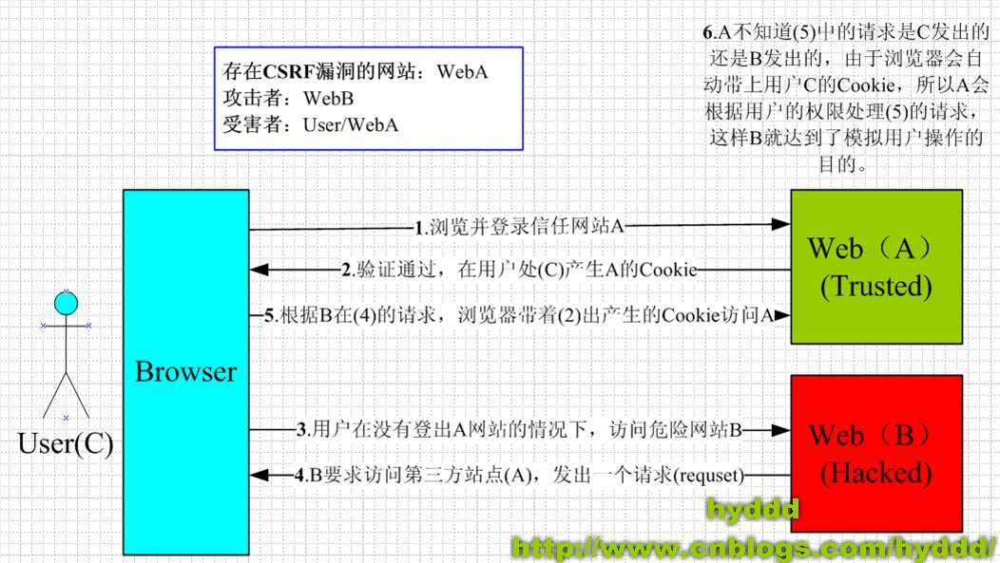

# 1. 引入：CSRF 攻击

## 1.1. CSRF 是什么？

- CSRF(cross-site request forgery)
  - 中文名称：`跨站请求伪造`，
  - 也被称为：`one click attack/session riding`(很形象)
  - 缩写为 `CSRF/XSRF`;

```
CSRF这种攻击方式在2000年已经被国外的安全人员提出，但在国内，直到06年才开始被关注，
08年，国内外的多个大型社区和交互网站分别爆出CSRF漏洞，
如：NYTimes.com（纽约时报）、Metafilter（一个大型的BLOG网站），YouTube和百度HI......而现在，
互联网上的许多站点仍对此毫无防备，以至于安全业界称CSRF为“沉睡的巨人”。
```

## 1.2. CSRF 可以做什么？

- 你可以这么理解`CSRF`:`攻击者盗用了你的身份,以你的名义发送恶意请求`。`CSRF`能够做的事情包括：
  - 以你的名义发送邮件，发消息
  - 盗取你的账号
  - 购买商品
  - 虚拟货币转账

## 1.3. CSRF 原理



- 从图中我们可以看到，要完成一次`CSRF`攻击，受害者必须一次完成两个步骤

  - **1.登陆受信任网站 A，并在本地生成 cookie**
  - **2.在不退出 A 的情况下，访问了危险网站 B**

- `如果不满足以上条件的中的任何一个，就不会受到攻击`。但是我们平时无法保证以下情况:
  - 1.你不能保证你登陆了一个网站后，不再打开一个 tab 页面并访问另外的网站。
  - 2.你不能保证你关闭浏览器后，你本地的 cookie 马上过期，你上次的会话已经结束
  - 3.上图中所谓的攻击网站，可能是一个存在其他漏洞的可信任的经常被人访问的网站。

## 1.4. 几种常见的攻击类型

- GET类型的CSRF：
  - 攻击者在页面中嵌入一个img标签，src指向目标操作的URL
  - 例如：``
  - 用户浏览该页面时，浏览器自动发起GET请求并携带cookie
  - 防御：敏感操作不应使用GET请求

- POST类型的CSRF：
  - 攻击者构造一个隐藏的自动提交表单
  - 例如：`<form action="http://bank.com/transfer" method="POST">` 配合JS自动submit
  - 用户访问恶意页面时，表单自动提交到目标网站
  - 比GET型更隐蔽，但原理相同

- 链接型CSRF：
  - 需要用户主动点击链接触发
  - 攻击者将恶意链接伪装成正常内容（如"领取红包"）
  - 用户点击后发起带cookie的请求
  - 危害相对较小，因为需要用户交互

## 1.5. 特点

- 攻击特点：
  - 攻击发起在第三方网站，而非目标网站本身
  - 攻击者不能获取到cookie，只是利用浏览器自动携带cookie的机制
  - 攻击者无法拿到请求的响应内容（受同源策略限制）
  - 通常是跨域请求，但也可能是同站子域攻击
  - CSRF通常是一次性的，不像XSS可以持续窃取数据

- 与XSS的区别：
  - XSS：在目标网站注入恶意脚本，可读取cookie和页面数据
  - CSRF：在第三方网站发起请求，利用浏览器自动携带cookie，但无法读取响应
  - XSS可以用来发起CSRF攻击，但CSRF不依赖XSS

## 1.6. CSRF 的防御

跨域请求：CORS

### 1.6.1. 同源策略

- 同源策略(Same-Origin Policy)：
  - 浏览器限制跨域请求：不同源的页面无法读取另一个源的响应数据
  - 但同源策略不阻止跨域请求的发送，只阻止读取响应
  - 所以同源策略本身无法完全防御CSRF（请求已经发出并执行了）
  - 需要在服务端验证请求来源：检查Origin和Referer头部
  - 服务端拒绝来自非法来源的请求：`if (referer not in whitelist) reject`

### 1.6.2. CSRF token

- 原理：服务端生成一个随机token，嵌入到表单或请求头中
  - token对攻击者不可见（因为同源策略阻止跨域读取页面内容）
  - 服务端验证请求中的token是否与session中存储的一致
  - 攻击者无法获取token，所以伪造的请求不会携带正确的token

- 实现方式：
  - 服务端在渲染页面时将token写入表单hidden字段
  - 前后端分离时，通过接口获取token并放入请求头（如 X-CSRF-Token）
  - 服务端在每次请求时校验token有效性

- 注意事项：
  - token应与用户session绑定
  - token应有时效性，定期刷新
  - GET请求不应携带token（可能通过Referer泄露）

### 1.6.3. 双重 Cookie 验证

- 原理：利用攻击者不能读取目标站cookie值的特点
  - 服务端将token写入cookie（如 csrf_token=abc123）
  - 前端发请求时从cookie中读出该值，放入请求参数或自定义header中
  - 服务端验证cookie中的token与请求参数中的token是否一致

- 优点：
  - 不需要服务端存储token（无状态）
  - 实现相对简单

- 缺点：
  - 如果攻击者能通过XSS读取cookie则失效
  - 子域名可以写入父域cookie，可能被绕过

### 1.6.4. SameSite Cookie 属性

- 原理：通过设置Cookie的SameSite属性，限制第三方网站发起的请求不携带cookie
  - `SameSite=Strict`：完全禁止第三方网站携带该cookie，最安全但影响用户体验
  - `SameSite=Lax`：GET请求（链接跳转）允许携带，POST/Ajax/img等不携带
  - `SameSite=None`：不限制，需配合Secure属性（仅HTTPS）

- 优点：
  - 浏览器层面的防护，几乎零成本
  - Chrome 80+ 默认SameSite=Lax

- 注意：
  - 旧版浏览器不支持，不能作为唯一防御手段
  - Strict模式下从外部链接跳转到本站会丢失登录态

## 1.7. 其他防范策略

- 验证码：关键操作前要求用户输入验证码，有效但影响用户体验
- 自定义请求头：如X-Requested-With，浏览器跨域时不会自动携带自定义头
- 限制cookie有效期：缩短session过期时间，减少攻击窗口

# 2. 历史案例

## 2.1. WordPress 的 CSRF 漏洞

- 漏洞描述：
  - WordPress 曾存在评论功能的CSRF漏洞
  - 攻击者可以构造恶意页面，当已登录的管理员访问时，自动以管理员身份发布评论
  - 更严重的是，评论内容可以包含恶意脚本（配合存储型XSS）
  - 通过CSRF+XSS组合攻击，可以实现管理员权限提升甚至后台RCE

- 攻击方式：
  - 构造包含自动提交表单的页面，action指向WordPress评论接口
  - 管理员访问后自动提交带有恶意内容的评论
  - 该漏洞在后续版本中通过nonce（一次性token）机制修复

## 2.2. YouTube 的 CSRF 漏洞

- 漏洞描述：
  - 2008年YouTube被曝出多个CSRF漏洞
  - 攻击者可以以用户身份执行以下操作：
    - 将视频添加到用户的收藏夹
    - 订阅/取消订阅频道
    - 将用户添加到好友列表
    - 修改频道信息

- 攻击方式：
  - YouTube的这些操作使用GET请求且未做CSRF防护
  - 攻击者只需在页面中嵌入对应URL的img标签即可触发
  - 例如：``
  - 该漏洞影响面极广，因为YouTube用户基数庞大

# 3. 参考

- [浅谈 CSRF 攻击方式](https://www.cnblogs.com/hyddd/archive/2009/04/09/1432744.html?login=1)
- [MDN 文档-跨资源共享(CORS)](https://developer.mozilla.org/zh-CN/docs/Web/HTTP/CORS)
- [前端安全系列（二）：如何防止 CSRF 攻击？](https://tech.meituan.com/2018/10/11/fe-security-csrf.html)
