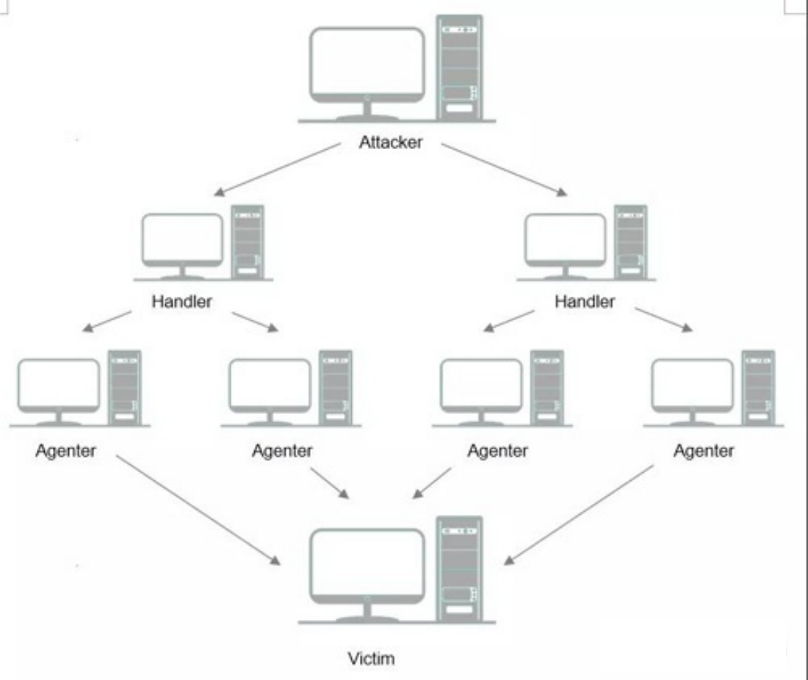
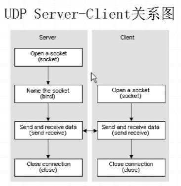
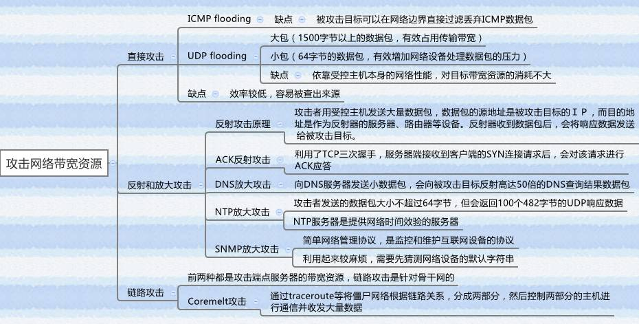
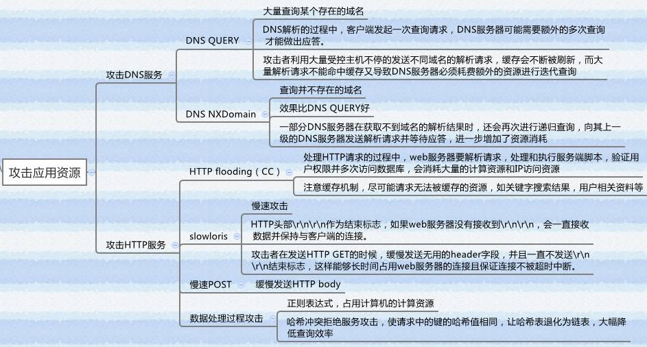
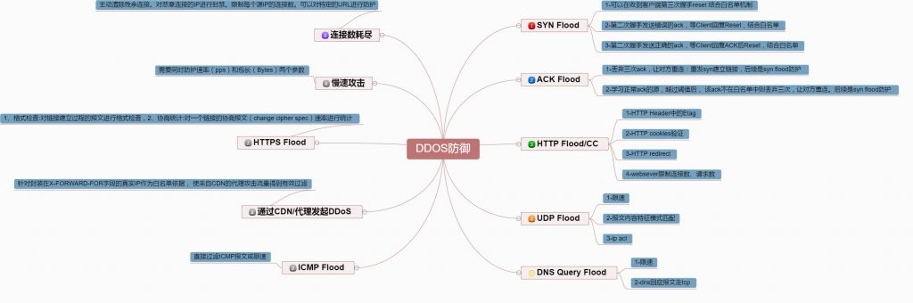

# 1. 概述

- DDos的前身 DoS (Denial of Service)攻击，其含义是 **拒绝服务攻击** ，
  - 这种攻击行为使网站服务器 **充斥大量的要求回复的信息** ，
  - 消耗网络带宽或系统资源， **导致网络或系统不胜负荷而停止提供正常的网络服务** 。
- 而DDoS分布式拒绝服务，则主要利用 Internet 上现有机器及系统的漏洞，攻占大量联网主机，使其 **成为攻击者的代理** 。
  - 当被控制的机器达到一定数量后，攻击者通过发送指令操纵这些攻击机同时向目标主机或网络发起DoS攻击，
  - 大量消耗其网络带和系统资源，导致该网络或系统瘫痪或停止提供正常的网络服务。
  - 由于DDos的分布式特征，它具有了比Dos远为强大的攻击力和破坏性。

# 2. 原理

## 2.1. 基本结构

- 一个比较完善的DDos攻击体系分成四大部分，分别是
  - 攻击者( attacker也可以称为master)
  - 控制傀儡机( handler)
  - 攻击傀儡机( demon，又可称agent)
  - 受害着( victim)

- 第2和第3部分，分别用做控制和实际发起攻击。
  - 第2部分的控制机只发布令而不参与实际的攻击，
  - 第3部分攻击傀儡机上发出DDoS的实际攻击包
  - 对第2和第3部分计算机，攻击者有控制权或者是部分的控制权，并把相应的DDoS程序上传到这些平台上，
  - 这些程序与正常的程序一样运行并等待来自攻击者的指令，通常它还会利用各种手段隐藏自己不被别人发现。
  - 在平时，这些傀儡机器并没有什么异常，只是一旦攻击者连接到它们进行控制，并发出指令的时候，攻击愧儡机就成为攻击者去发起攻击了。

## 2.2. 结构组织(即傀儡机)目的

- 一个重要目的是 **隔离网络联系，保护攻击者，使其不会在攻击进行时受到监控系统的跟踪** 。
- 同时也能够更好地协调进攻，
  - 因为攻击执行器的数目太多，同时由一个系统来发布命令会造成控制系统的网络阻塞，影响攻击的突然性和协同性。
  - 而且，流量的突然增大也容易暴露攻击者的位置和意图。
- 寻找傀儡机整个过程可分为：
  - 扫描大量主机以寻找可入侵主机目标；
  - 有安全漏洞的主机并获取控制权；
  - 入侵主机中安装攻击程序；
  - 用己入侵主机继续进行扫描和入侵。

## 2.3. 攻击特点

- 当受控制的攻击代理机达到攻击者满意的数量时，攻击者就可以通过攻击主控机随时发出击指令。
- 攻击主控机非常隐蔽以定位
  - 由于 **攻击主控机** 的位置非常灵活，而且发布命令的时间很短，所以 **非常隐蔽以定位** 。
  - **一旦攻击的命令传送到攻击操纵机，主控机就可以关闭或脱离网络，以逃避追踪要着** ，攻击操纵机将命令发布到各个攻击代理机。
- 数据包无法识别它的来源
  - 在攻击代理机接到攻击命令后，就开始向目标主机发出大量的服务请求数据包。
  - 这些数据包经过伪装，使被攻击者无法识别它的来源。
  - 而且攻击者所用的协议都是一些非常常见的协议和服务。
  - 这样，系统管理员就难于区分恶意请求和正连接请求，从而无法有效分离出攻击数据包
- 请求的服务往往要消耗较大的系统资源
  - 如CP或网络带宽。
  - 如果数百台甚至上千台攻击代理机同时攻击一个目标，就会导致目标主机网络和系统资源的耗尽，从而停止服务。
  - 有时，甚至会导致系统崩溃。
- 可以阻塞目标网络的防火墙和路由器等网络设备，进一步加重网络拥塞状况。
  - 导致目标主机根本无法为用户提供任何服务。

## 2.4. 攻击类型

### 2.4.1. 概述

**往简单说，其实就是利用 tcp/udp 协议规律，通过占用协议栈资源或者发起大流量拥塞，达到消耗目标机器性能或者网络的目的**

tcp和udp连接过程

### 2.4.2. 容积攻击

#### 2.4.2.1. 说明

- 容积型 DDoS 攻击的目的是 **用海量流量充塞网络，耗尽预期受害方资源的带宽** 。
- 海量攻击流量阻断了合法用户对应用程序或服务的访问，造成流量无法正常流入或流出。
- 容积攻击使用的攻击途径是由一种恶意软件感染的众多系统和设备组成的僵尸网络。
- 在攻击者的控制下，爬虫程序发出恶意流量，耗尽所有可用带宽，造成攻击目标与互联网之间的连接拥塞。
- 不可预见的僵尸流量造成的冲击可能大大减慢或阻止对于 Web 资源或面向互联网的服务的访问。
- 由于爬虫程序会取代合法设备，以放大带宽密集型 DDoS 攻击，但用户往往毫不知情，因此受害企业很难发现恶意流量。
- 恶意攻击者使用的容积 DDoS 攻击媒介分为很多种。许多攻击者都利用反射和放大攻击技术来造成目标网络或服务不堪重负。

#### 2.4.2.2. UDP 泛洪 DDoS 攻击

#### 2.4.2.3. ICMP 泛洪 DDoS 攻击

### 2.4.3. 协议攻击

#### 2.4.3.1. 说明

- 协议攻击通过 **尝试利用协议通信的恶意连接请求来消耗并耗尽各种网络基础架构资源（如服务器或防火墙）的计算容量** 。
- 协议攻击可以用每秒数据包数量 (pps) 和每秒比特数 (bps) 来衡量。
- 同步 (SYN) 泛洪攻击和 Smurf DDoS 是基于协议的 DDoS 攻击的两种常见类型。

#### 2.4.3.2. SYN 泛洪 DDoS 攻击

#### 2.4.3.3. Smurf DDoS 攻击

### 2.4.4. 应用层攻击

- 应用层攻击是通过向应用程序发送大量恶意请求实现的，以每秒请求数 (RPS) 来衡量。
- 这类攻击也称为 **第 7 层 DDoS 攻击** ，针对并 **破坏特定的网络应用程序** ，而不是整个网络。
- 虽然这类 DDoS 攻击难以预防和抵御，但发动起来却相对比较容易。

# 3. 攻击识别

# 4. 防护

# 5. 参考资料

- [ ] [DDoS攻击原理是什么?DDoS攻击原理及防护措施介绍](https://zhuanlan.zhihu.com/p/112894574)
- [ ] [什么是 DDoS 攻击？](https://www.akamai.com/zh/glossary/what-is-ddos#:~:text=DDoS%20%E9%98%B2%E6%8A%A4%0A)
- [ ] [DDoS 攻击与防御：从原理到实践 ](https://zhuanlan.zhihu.com/p/43449162)
