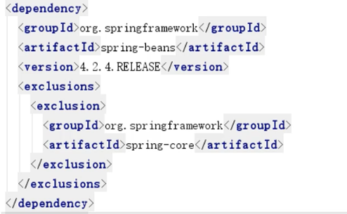
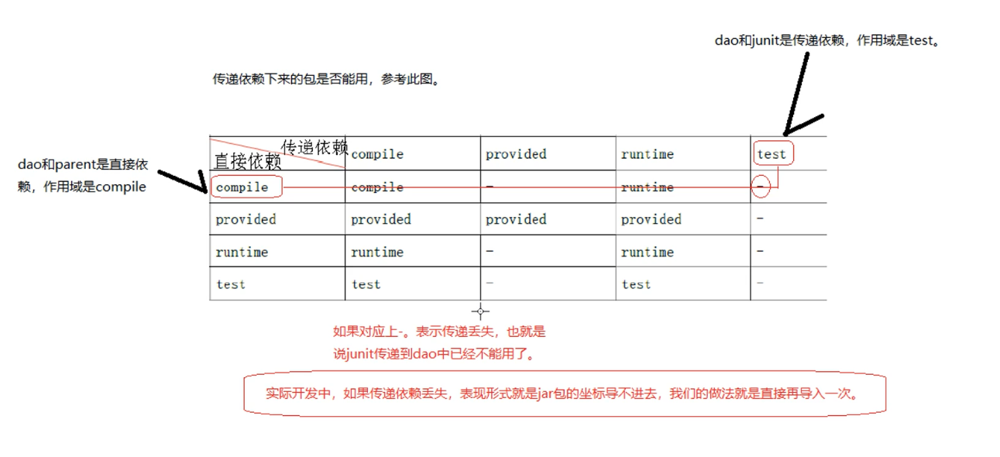

# 1. maven 基础

- maven 常用命令
  - clean
  - compile
  - test
  - package
  - install
  - deploy：打包上传到私服
- maven生命周期；
  - 清理生命周期
  - 默认生命周期
  - 站点生命周期

- 解决jar包冲突：
  - 方式一： 第一声明优先原则：哪个jar包的坐标在靠上的位置，这个jar包就是先声明的。 先声明的jar包坐标下的依赖包，可以优先进入项目中。
  - 方式二：
    - 相关概念：
      - 直接依赖：项目中直接导入的jar包，是该项目的直接以来包
      - 传递依赖：项目中没有直接导入的包，可以通过项目直接依赖jar包传递到项目中去
        > 比如A1依赖B1，B2，导入A1时，也会导入B1，B2
    - 路径近者优先原则，直接依赖比传递依赖路径近，也就是直接依赖优先级大于传递依赖
    - 若都是传递依赖，旧导入声明顺序靠上的
  - 方式三：使用exclusion直接排除依赖 **(推荐使用)**
    - 当要排除某个jar包下的依赖包时使用
      > 
    - 不用写版本号，只指定哪个包即可

- 锁住依赖
  - 注意：仅仅会锁住版本，而不会导入。必须在下面复制一份导入依赖才行
  ```
    maven工程是可以分父子依赖关系的。
    凡是依赖别的项目后，拿到的别的项目的依赖包，都属于传递依赖。
    比如：当前A项目，被B项目依赖。那么我们A项目中所有jar包都会传递到B项目中。
    B项目开发者，如果再在B项目中导入一套ssm框架的jar包，对于B项目是直接依赖。
    那么直接依赖的jar包就会把我们A项目传递过去的jar包覆盖掉。
    为了防止以上情况的出现。我们可以把A项目中主要jar包的坐标锁住，那么其他依赖该项目的项目中，
    即便是有同名jar包直接依赖，也无法覆盖。
  ```
  ```xml
    <!-- 锁定jar包版本 -->
  <dependencyManagement>
    <dependency>
    ...
    </dependency>
  </dependencyManagement>
  ```

- SSM框架依赖
  ```xml
  <?xml version="1.0" encoding="UTF-8"?>

  <project xmlns="http://maven.apache.org/POM/4.0.0" xmlns:xsi="http://www.w3.org/2001/XMLSchema-instance"
    xsi:schemaLocation="http://maven.apache.org/POM/4.0.0 http://maven.apache.org/xsd/maven-4.0.0.xsd">
    <modelVersion>4.0.0</modelVersion>

    <groupId>com.itheima</groupId>
    <artifactId>maven_day02_1</artifactId>
    <version>1.0-SNAPSHOT</version>
    <packaging>war</packaging>

    <!--maven工程要导入jar包的坐标，就必须要考虑解决jar包冲突。
        解决jar包冲突的方式一：
        第一声明优先原则：哪个jar包的坐标在靠上的位置，这个jar包就是先声明的。
        先声明的jar包坐标下的依赖包，可以优先进入项目中。

        maven导入jar包中的一些概念：
        直接依赖：项目中直接导入的jar包，就是该项目的直接依赖包。
        传递依赖：项目中没有直接导入的jar包，可以通过项目直接依赖jar包传递到项目中去。

        解决jar包冲突的方式二：
        路径近者优先原则。直接依赖路径比传递依赖路径近，那么最终项目进入的jar包会是路径近的直接依赖包。

        解决jar包冲突的方式三【推荐使用】：
        直接排除法。
        当我们要排除某个jar包下依赖包，在配置exclusions标签的时候，内部可以不写版本号。
        因为此时依赖包使用的版本和默认和本jar包一样。
        -->
      <!-- 统一管理jar包版本 -->
      <properties>
        <spring.version>5.0.2.RELEASE</spring.version>
        <slf4j.version>1.6.6</slf4j.version>
        <log4j.version>1.2.12</log4j.version>
        <shiro.version>1.2.3</shiro.version>
        <mysql.version>5.1.6</mysql.version>
        <mybatis.version>3.4.5</mybatis.version>
        <spring.security.version>5.0.1.RELEASE</spring.security.version>
      </properties>

      <!--
      maven工程是可以分父子依赖关系的。
      凡是依赖别的项目后，拿到的别的项目的依赖包，都属于传递依赖。
      比如：当前A项目，被B项目依赖。那么我们A项目中所有jar包都会传递到B项目中。
      B项目开发者，如果再在B项目中导入一套ssm框架的jar包，对于B项目是直接依赖。
      那么直接依赖的jar包就会把我们A项目传递过去的jar包覆盖掉。
      为了防止以上情况的出现。我们可以把A项目中主要jar包的坐标锁住，那么其他依赖该项目的项目中，
      即便是有同名jar包直接依赖，也无法覆盖。
      -->
      <!-- 锁定jar包版本 -->
      <dependencyManagement>
        <dependencies>
          <dependency>
            <groupId>org.springframework</groupId>
            <artifactId>spring-context</artifactId>
            <version>${spring.version}</version>
          </dependency>
          <dependency>
            <groupId>org.springframework</groupId>
            <artifactId>spring-web</artifactId>
            <version>${spring.version}</version>
          </dependency>
          <dependency>
            <groupId>org.springframework</groupId>
            <artifactId>spring-webmvc</artifactId>
            <version>${spring.version}</version>
          </dependency>
          <dependency>
            <groupId>org.springframework</groupId>
            <artifactId>spring-tx</artifactId>
            <version>${spring.version}</version>
          </dependency>
          <dependency>
            <groupId>org.springframework</groupId>
            <artifactId>spring-test</artifactId>
            <version>${spring.version}</version>
          </dependency>
          <dependency>
            <groupId>org.mybatis</groupId>
            <artifactId>mybatis</artifactId>
            <version>${mybatis.version}</version>
          </dependency>
        </dependencies>
      </dependencyManagement>

      <!-- 项目依赖jar包 -->
      <dependencies>
        <!-- spring -->
        <dependency>
          <groupId>org.aspectj</groupId>
          <artifactId>aspectjweaver</artifactId>
          <version>1.6.8</version>
        </dependency>
        <dependency>
          <groupId>org.springframework</groupId>
          <artifactId>spring-aop</artifactId>
          <version>${spring.version}</version>
        </dependency>
        <dependency>
          <groupId>org.springframework</groupId>
          <artifactId>spring-context</artifactId>
          <version>${spring.version}</version>
        </dependency>
        <dependency>
          <groupId>org.springframework</groupId>
          <artifactId>spring-context-support</artifactId>
          <version>${spring.version}</version>
        </dependency>
        <dependency>
          <groupId>org.springframework</groupId>
          <artifactId>spring-web</artifactId>
          <version>${spring.version}</version>
        </dependency>
        <dependency>
          <groupId>org.springframework</groupId>
          <artifactId>spring-orm</artifactId>
          <version>${spring.version}</version>
        </dependency>
        <dependency>
          <groupId>org.springframework</groupId>
          <artifactId>spring-beans</artifactId>
          <version>${spring.version}</version>
        </dependency>
        <dependency>
          <groupId>org.springframework</groupId>
          <artifactId>spring-core</artifactId>
          <version>${spring.version}</version>
        </dependency>
        <dependency>
          <groupId>org.springframework</groupId>
          <artifactId>spring-test</artifactId>
          <version>${spring.version}</version>
        </dependency>
        <dependency>
          <groupId>org.springframework</groupId>
          <artifactId>spring-webmvc</artifactId>
          <version>${spring.version}</version>
        </dependency>
        <dependency>
          <groupId>org.springframework</groupId>
          <artifactId>spring-tx</artifactId>
          <version>${spring.version}</version>
        </dependency>
        <dependency>
          <groupId>junit</groupId>
          <artifactId>junit</artifactId>
          <version>4.12</version>
          <scope>test</scope>
        </dependency>
        <dependency>
          <groupId>mysql</groupId>
          <artifactId>mysql-connector-java</artifactId>
          <version>${mysql.version}</version>
        </dependency>
        <dependency>
          <groupId>javax.servlet</groupId>
          <artifactId>javax.servlet-api</artifactId>
          <version>3.1.0</version>
          <scope>provided</scope>
        </dependency>
        <dependency>
          <groupId>javax.servlet.jsp</groupId>
          <artifactId>jsp-api</artifactId>
          <version>2.0</version>
          <scope>provided</scope>
        </dependency>
        <dependency>
          <groupId>jstl</groupId>
          <artifactId>jstl</artifactId>
          <version>1.2</version>
        </dependency>
        <!-- log start -->
        <dependency>
          <groupId>log4j</groupId>
          <artifactId>log4j</artifactId>
          <version>${log4j.version}</version>
        </dependency>
        <dependency>
          <groupId>org.slf4j</groupId>
          <artifactId>slf4j-api</artifactId>
          <version>${slf4j.version}</version>
        </dependency>
        <dependency>
          <groupId>org.slf4j</groupId>
          <artifactId>slf4j-log4j12</artifactId>
          <version>${slf4j.version}</version>
        </dependency>
        <!-- log end -->
        <dependency>
          <groupId>org.mybatis</groupId>
          <artifactId>mybatis</artifactId>
          <version>${mybatis.version}</version>
        </dependency>
        <dependency>
          <groupId>org.mybatis</groupId>
          <artifactId>mybatis-spring</artifactId>
          <version>1.3.0</version>
        </dependency>
        <dependency>
          <groupId>c3p0</groupId>
          <artifactId>c3p0</artifactId>
          <version>0.9.1.2</version>
          <type>jar</type>
          <scope>compile</scope>
        </dependency>
        <dependency>
          <groupId>com.github.pagehelper</groupId>
          <artifactId>pagehelper</artifactId>
          <version>5.1.2</version>
        </dependency>
        <dependency>
          <groupId>org.springframework.security</groupId>
          <artifactId>spring-security-web</artifactId>
          <version>${spring.security.version}</version>
        </dependency>
        <dependency>
          <groupId>org.springframework.security</groupId>
          <artifactId>spring-security-config</artifactId>
          <version>${spring.security.version}</version>
        </dependency>
        <dependency>
          <groupId>org.springframework.security</groupId>
          <artifactId>spring-security-core</artifactId>
          <version>${spring.security.version}</version>
        </dependency>
        <dependency>
          <groupId>org.springframework.security</groupId>
          <artifactId>spring-security-taglibs</artifactId>
          <version>${spring.security.version}</version>
        </dependency>
        <dependency>
          <groupId>com.alibaba</groupId>
          <artifactId>druid</artifactId>
          <version>1.0.9</version>
        </dependency>
        <dependency>
          <groupId>junit</groupId>
          <artifactId>junit</artifactId>
          <version>4.12</version>
        </dependency>
      </dependencies>
      <!-- 添加tomcat7插件 -->
      <build>
        <plugins>
          <plugin>
            <groupId>org.apache.tomcat.maven</groupId>
            <artifactId>tomcat7-maven-plugin</artifactId>
            <version>2.2</version>
          </plugin>
        </plugins>
      </build>
  </project>
  ```

# 2. maven进阶

## 2.1. 多模块开发

```
情景：
电商系统
顾客端需要查看发票信息
管理端需要查看发票信息
共用一套dao代码即可，如何实现
```

- maven解决代码可冲用和便于维护问题方式:
  ```
  maven把一个完整的项目，分成不同的独立模块，这些模块都有各自独立的坐标，以及pom文件。
  哪个地方需要其中某个模块， 就直接引用该模块的坐标即可。

  今后如果公司开发一个新项目，我们先考虑问题不是dao,service,utils,domain如何编写，I 
  我们要考虑的是，dao,servic,utils,domain这些模块是否已经存在，如果存在直接引用。
  ```
  - 拆分：分模块构建
  - 聚合：引用模块


- 示例：
  - idea中创建一个工程，作为主模块（只要有一个pom即可）
    - 注意：工程和模块都不是一个完整的项目，一个项目看的是代码，和工程和模块没有关系
    - 工程天生只能使用自己内部资源。后天可以和其他工程和模块建立关系
    - 模块天生不是独立的。模块一被创建，就可以**使用父工程所有资源**
    - 子模块间一开始没有任何关系，通过坐标依赖引入。
      - 平级是继承
    - 父子模块间继承关系是先天的。
      - 上下级是继承（也可以说成依赖）
  - idea中创建三个子模块，dao，service，web。
    - 此时子模块的pom中就有parent的坐标
    - 子模块会使用父模块的groupId和version，然后使用自己定义的artifactId
    - 父模块中也会自动添加三个子模块
    - web模块可以使用骨架或者自己搭建，使用骨架的话，把pom清理到和其他两个相同
    - dao模块对应spring配置文件中，只保留dao层
    - service模块对应spring配置文件中，只保留service层
    - web模块下的application.xml通过import引入上面两个xml
  - 示例结构：
    ```
    maven_day02_parent
    │  maven_day02_parent.iml
    │  pom.xml
    │
    ├─maven_day02_dao
    │  │  maven_day02_dao.iml
    │  │  pom.xml
    │  │
    │  └─src
    │      ├─main
    │      │  ├─java
    │      │  │  └─com
    │      │  │      └─itheima
    │      │  │          ├─dao
    │      │  │          │      ItemsDao.java
    │      │  │          │
    │      │  │          └─domain
    │      │  │                  Items.java
    │      │  │
    │      │  └─resources
    │      │      ├─com
    │      │      │  └─itheima
    │      │      │      └─dao
    │      │      │              ItemsDao.xml
    │      │      │
    │      │      └─spring
    │      │              applicationContext-dao.xml
    │      │
    │      └─test
    │          └─java
    ├─maven_day02_service
    │  │  maven_day02_service.iml
    │  │  pom.xml
    │  │
    │  └─src
    │      ├─main
    │      │  ├─java
    │      │  │  └─com
    │      │  │      └─itheima
    │      │  │          └─service
    │      │  │              │  ItemsService.java
    │      │  │              │
    │      │  │              └─impl
    │      │  │                      ItemsServiceImpl.java
    │      │  │
    │      │  └─resources
    │      │      └─spring
    │      │              applicationContext-service.xml
    │      │
    │      └─test
    │          └─java
    └─maven_day02_web
        │  maven_day02_web.iml
        │  pom.xml
        │
        └─src
            └─main
                ├─java
                │  └─com
                │      └─itheima
                │          └─controller
                │                  ItemsController.java
                │
                ├─resources
                │      applicationContext.xml
                │      log4j.properties
                │      springmvc.xml
                │
                └─webapp
                    │  index.jsp
                    │
                    └─WEB-INF
                        │  web.xml
                        │
                        └─pages
                                itemDetail.jsp
    ```
  - 测试三种方式：
    - 右侧maven管理器，root模块，开启tomcat
    - root模块install，上传到本地（为了让web模块查找到依赖），再在web模块中使用maven的tomcat插件
    - 使用外部tomcat
  - 了解：
    > 
