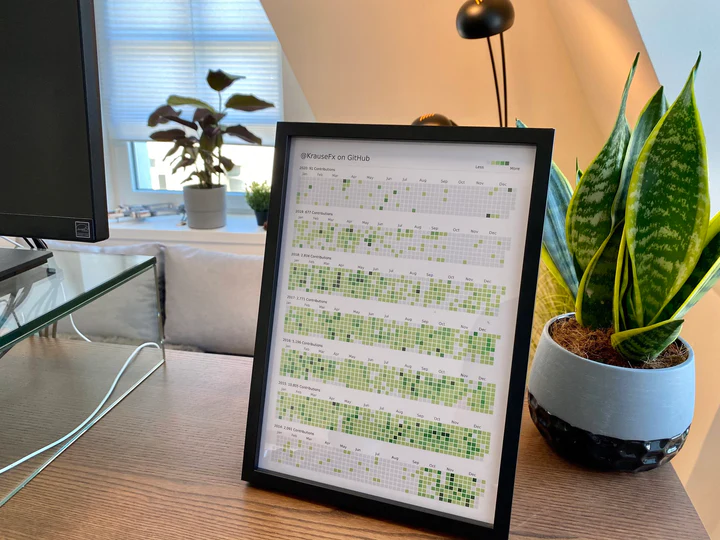

# 字体

## Nerd Font

打上icon patch的字体

3.0 版本后，icon 码点有变化，需要确定好自己环境下icon的码点 3.0 版本还是 3.0 之前的版本

https://github.com/ryanoasis/nerd-fonts/issues/1190

## Iosevka: 等宽字体

https://github.com/be5invis/Iosevka

## victor-mono: 关键字手写体

https://github.com/rubjo/victor-mono

# workflow

## search

### grep

### ag

### ripgreg

### fzf

[fzf theme generator](https://vitormv.github.io/fzf-themes/)

### fd

[fd](https://github.com/sharkdp/fd?tab=readme-ov-file)

简单、快速、友好的 find 替代品

## quick cd

### z

### zoxide

### z.lua

## file manager

### ranger

### lf

## stow: symlink manager

管理文件夹之间的映射

[参考](https://github.com/chaneyzorn/dotfiles)

使用 [GNU Stow](https://www.gnu.org/software/stow/) 管理的 linux 配置文件.

Gnu Stow 使用两个文件夹来管理两个文件树之间的映射，分别是：

- `stow dir`：默认为当前文件夹
- `target dir`：默认为当前文件夹的父文件夹

`stow dir`下每一个顶层的子文件夹都是一个单独的文件树,
`target dir`下是多个这样的文件树在同一起始路径的层叠展开，后者的文件树使用**符号链接**指向前者的文件树。

### 收集配置文件场景

第一次收集配置文件时，推荐使用`--adopt`选项转移配置文件。具体操作如下：

1. 在家目录下创建`stow dir`， 比如命名为 dotfiles。

2. 在`stow dir`下分门别类的创建好各类配置文件的文件夹，比如专门放置 bash 相关配置文件的文件夹。

3. 在 bash 文件夹下创建对应的配置文件，文件内容为空即可，比如`.bashrc`，`.bash_profile`。

4. 在`stow dir`下执行`stow --adopt bash`，这一命令分别对比`target dir`（也即是家目录）和 bash 目录的结构，
   并将家目录下同树结构的文件采纳到`stow dir`下：将`.bashrc`移到bash目录覆盖掉对应的空配置文件，
   并在家目录创建符号链接指向转移过来的配置文件。

5. 重复上述 2-4 步，陆续添加其他文件夹和配置文件。

收集到配置文件后，我们一般使用 git 来管理，这样可以方便的跟踪修改，也可以方便的拉取到另一台电脑上。
实际上，我们上面使用的`--adopt` 命令可以结合 git 来方便的对比两台电脑间配置文件的不同。
`--adopt`选项会处理 stow 遇到的冲突文件，并统一采用`target dir`下的文件**替换**`stow dir` 下的文件，
当`stow dir`被 git 管理时，被替换的文件就可以方便的和仓库中的文件对比，方面你修改，采纳，或者删除。

**注意**: `--adopt`选项会修改`stow dir`下的内容，非第一次收集配置文件，或者`stow dir`没有被版本控制软件管理前，请谨慎使用。

### 将收集的配置文件应用到新的系统中

将项目拉取到新的机器的家目录，切换到`stow dir`，执行`stow -S bash`可以将bash的配置文件展开到家目录下。
你也可以使用多个组合命令：`stow -S pkg1 pkg2 -D pkg3 pkg4 -S pkg5 -R pkg6`

- `-d` 指定 stow 文件夹
- `-t` 指定 target 文件夹
- `-D` 移除已创建的文件树
- `-S` 创建指定的文件树
- `-R` 移除并重新创建指定的文件树

- `--ignore=regexp` 忽略`stow dir`下指定匹配模式的文件
- `--defer=regexp` 跳过`target dir`下指定匹配模式的文件
- `--override=regexp` 强制替换`target dir`下指定匹配模式的文件

- `--no-folding` stow 默认创建最少的符号链接。这一选项会使 stow 逐一创建每一个文件的符号链接，而不是创建一整个文件夹的链接。
- `--dotfiles` 在 stow dir 下的文件名如果有`dot-`前缀，在创建链接时，链接名字会替换为以`.`为前缀，
  比如：`～/.zshrc -> dotfiles/zsh/dot-zshrc`

GNU Stow 不会对冲突的文件做任何处理，并中断所有操作，我没有找到一个快捷的覆盖已存在文件的选项，
`-D` 和 `--override=regexp` 并不能对已存在的文件进行覆盖替换，除非它是符号链接或者文件夹并已经处于`stow dir`的管理之下。

如果因为文件已经存在而发生了冲突，一个直接的办法是先删掉已存在的文件。而另一个方法则是结合使用 `--adopt`选项和 git。
首先将已存在的配置文件全部采纳到 git 管理之下的 stow dir，然后选择性的采纳，修改，或舍弃，
使用 git 的 commit 和 checkout，你可以方便的取舍冲突的配置文件。
如果你知道stow更好的方法，请在 issue 中告诉我，谢谢～

更多信息请参见 [GNU Stow 手册页](https://www.gnu.org/software/stow/manual/stow.html)

### 软件包备份和恢复

```sh
# 获取当前系统中主动安装的包
pacman -Qqet > pkglist.txt
# 从列表文件安装软件包
pacman -S --needed - < pkglist.txt
# 如果其中包含AUR等外部包，需要过滤后再执行
pacman -S --needed $(comm -12 <(pacman -Slq | sort) <(sort pkglist.txt))
# 移除没有列在文件中的包
pacman -Rsu $(comm -23 <(pacman -Qq | sort) <(sort pkglist.txt))
```

更多信息请参见 [pacman archlinux wiki](https://wiki.archlinux.org/index.php/Pacman/Tips_and_tricks#Install_packages_from_a_list)

## leetcode

### leetcode-cli

- [链接](https://github.com/skygragon/leetcode-cli)
- 说明：拿命令行进行刷题

  

- 注意：
  - 官方那个默认连美国leetcode
  - 而且leetcode.cn装插件还需要全局翻墙(proxifier)
  - 登录上去后，还有404报错
- 解决：用下面这个修改过的就行
  - `npm install -g ketankr9/leetcode-cli`。
  - [参考链接](https://github.com/skygragon/leetcode-cli/issues/201)

### leetgo

- [leetgo](https://github.com/j178/leetgo)
- 支持leetcode-cn

## monitor

### htop

[htop](https://github.com/htop-dev/htop)

### bashtop

[bashtop](https://github.com/aristocratos/bashtop)

## delta: git pager

`~/.gitconfig`:

```
[core]
    pager = delta

[interactive]
    diffFilter = delta --color-only

[delta]
    navigate = true    # use n and N to move between diff sections

    # delta detects terminal colors automatically; set one of these to disable auto-detection
    # dark = true
    # light = true

[merge]
    conflictstyle = diff3

[diff]
    colorMoved = default
```

## thefuck: autofix command

- [thefuck](https://github.com/nvbn/thefuck)

## bat: better cat

## tldr: cheatsheet

# charm 开源终端工具集

[charm](https://github.com/charmbracelet)

## vhs

制作终端gif

# Development

## croc 文件传输

- 基于go语言

## cloc 代码统计

代码行数统计工具

- perl版本
- node版本

## utools

## regex101 正则工具

- [regex101](https://github.com/nedrysoft/regex101)

## calcurse 终端日历

vim like 键位的日程管理工具

## whistle http 抓包工具

[whistle](https://github.com/avwo/whistle)

## Charles 手机端抓包工具

## curl 获取ip

```
curl http://ifconfig.me
```

## madness markdown预览server

[madness](https://github.com/DannyBen/madness)

支持docker部署

## jq json处理命令行工具

## Tengine

淘宝基于 nginx 进行优化开发的版本

# gf2

[gf](https://github.com/nakst/gf)

GDB 前端

# 软件

## logseq 笔记软件

支持markdown，org mode，支持双链

也支持进行日程管理，可以考虑作为emacs org的代替品。

## 音乐可视化 cava

https://github.com/karlstav/cava

## KeyCastOW

监听并显示按键

## Arc 浏览器

高颜值，极简：https://arc.net/

## Digital-Logic-Sim

简单的数字逻辑模拟器:

- [官网](https://sebastian.itch.io/digital-logic-sim)
- [github](https://github.com/SebLague/Digital-Logic-Sim)

# 杂项,图片,gif,taag

## github 图标制作

- [链接](https://shields.io/)
- 示例

  

## 抖动字gif生成

- [链接](https://aidn.jp/ugomoji/)
- 示例

  

## 生成taag

- [链接](https://patorjk.com/software/taag/)
- 示例

  ```
            _____                    _____                    _____                        _____                    _____                    _____                    _____
           /\    \                  /\    \                  /\    \                      /\    \                  /\    \                  /\    \                  /\    \
          /::\____\                /::\    \                /::\____\                    /::\    \                /::\    \                /::\    \                /::\    \
         /::::|   |               /::::\    \              /:::/    /                    \:::\    \              /::::\    \              /::::\    \              /::::\    \
        /:::::|   |              /::::::\    \            /:::/   _/___                   \:::\    \            /::::::\    \            /::::::\    \            /::::::\    \
       /::::::|   |             /:::/\:::\    \          /:::/   /\    \                   \:::\    \          /:::/\:::\    \          /:::/\:::\    \          /:::/\:::\    \
      /:::/|::|   |            /:::/__\:::\    \        /:::/   /::\____\                   \:::\    \        /:::/__\:::\    \        /:::/__\:::\    \        /:::/  \:::\    \
     /:::/ |::|   |           /::::\   \:::\    \      /:::/   /:::/    /                   /::::\    \      /::::\   \:::\    \      /::::\   \:::\    \      /:::/    \:::\    \
    /:::/  |::|   | _____    /::::::\   \:::\    \    /:::/   /:::/   _/___                /::::::\    \    /::::::\   \:::\    \    /::::::\   \:::\    \    /:::/    / \:::\    \
   /:::/   |::|   |/\    \  /:::/\:::\   \:::\    \  /:::/___/:::/   /\    \              /:::/\:::\    \  /:::/\:::\   \:::\    \  /:::/\:::\   \:::\    \  /:::/    /   \:::\ ___\
  /:: /    |::|   /::\____\/:::/__\:::\   \:::\____\|:::|   /:::/   /::\____\            /:::/  \:::\____\/:::/  \:::\   \:::\____\/:::/  \:::\   \:::\____\/:::/____/  ___\:::|    |
  \::/    /|::|  /:::/    /\:::\   \:::\   \::/    /|:::|__/:::/   /:::/    /           /:::/    \::/    /\::/    \:::\  /:::/    /\::/    \:::\  /:::/    /\:::\    \ /\  /:::|____|
   \/____/ |::| /:::/    /  \:::\   \:::\   \/____/  \:::\/:::/   /:::/    /           /:::/    / \/____/  \/____/ \:::\/:::/    /  \/____/ \:::\/:::/    /  \:::\    /::\ \::/    /
           |::|/:::/    /    \:::\   \:::\    \       \::::::/   /:::/    /           /:::/    /                    \::::::/    /            \::::::/    /    \:::\   \:::\ \/____/
           |::::::/    /      \:::\   \:::\____\       \::::/___/:::/    /           /:::/    /                      \::::/    /              \::::/    /      \:::\   \:::\____\
           |:::::/    /        \:::\   \::/    /        \:::\__/:::/    /            \::/    /                       /:::/    /               /:::/    /        \:::\  /:::/    /
           |::::/    /          \:::\   \/____/          \::::::::/    /              \/____/                       /:::/    /               /:::/    /          \:::\/:::/    /
           /:::/    /            \:::\    \               \::::::/    /                                            /:::/    /               /:::/    /            \::::::/    /
          /:::/    /              \:::\____\               \::::/    /                                            /:::/    /               /:::/    /              \::::/    /
          \::/    /                \::/    /                \::/____/                                             \::/    /                \::/    /                \::/____/
           \/____/                  \/____/                  ~~                                                    \/____/                  \/____/

  ```

## 在线代码高亮工具

- 往word里面粘贴用的
- [链接](https://highlightcode.com/)

## 统计github提交生成图片

- [code prints](https://codeprints.dev/)

  

## CR常见术语

- CR: Code Review. 请求代码审查。
- PR： pull request. 拉取请求，给其他项目提交代码。
- MR： merge request. 合并请求。
- LGTM： Looks Good To Me.对我来说，还不错。表示认可这次PR，同意merge合并代码到远程仓库。
- WIP: Work In Progress. 进展中，主要针对改动较多的 PR，可以先提交部分，标题或 Tag 加上 WIP，表示尚未完成，这样别人可以先 review 已提交的部分。
- PTAL: Please Take A Look. 请帮我看下, 邀请别人review自己的代码。
- ACK: Acknowledgement. 承认，同意。表示接受代码的改动。
- NACK/NAK: Negative acknowledgement. 不同意，不接受这次的改动。
- RFC: Request For Comment. 请求进行讨论，表示认为某个想法很好，邀请大家一起讨论一下。
- ASAP: As Soon As Possible. 请尽快完成。
- IIRC: If I Recall Correctly. 如果我没有记错的话。
- IMO: In My Opinion. 在我看来。
- TBD: To Be Done. 未完成，待续。
- TL;DR: Too Long; Didn't Read. 太长懒得看。常见于README文档。

# 参考

- [awesome tuis](https://github.com/rothgar/awesome-tuis)
