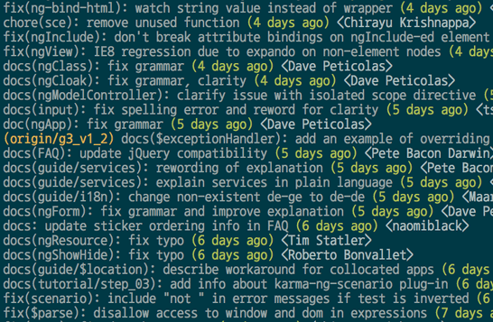

- **`git <command> -h`** 查看简单帮助
- **`git help <command>`** 查看详细帮助

# 1. 基本命令整理

> 说明：此文件只是 git 常用指令，如果想要了解原理及指令的话去看 git 官方用户文档。十分推荐 <br />
> [文档地址](https://git-scm.com/book) <br />
> [学习网站内容整理](https://learngitbranching.js.org/?locale=zh_CN)

## 1.1. 添加暂存与提交

- 添加暂存
  - `git add` 文件 跟踪文件，加入暂存区
  - `git add [file1] [file2] ...` 添加指定文件到暂存区
  - `git add [dir]` 添加指定目录到暂存区，包括子目录
  - `git add .` 添加当前目录的所有文件到暂存区
  - `git add -p`  添加每个变化前，都会要求确认 对于同一个文件的多处变化，可以实现分次提交
- 修改提交
  - `git commit -m "sign"` 提交版本
  - `git commit --amend` 修正提交，将修改并入上一次提交
  - `git commit --amend [file1] [file2] ...` 重做上一次commit，并包括指定文件的新变化
  - `git commit --amend --no-edit（或者新字符串）` 覆盖上次提交 但 id 会变
  - `git commit --amend --date='Mon Jul 15 00:47:47 2024 +0800'` 修改 AuthorDate
  - `GIT_COMMITTER_DATE="Mon Jul 15 00:47:47 2024 +0800" git commit` 修改 CommitDate
  - `git commit -am "sign"` ：直接添加并 commit 上去但必须是已经追踪的文件，这条命令无法添加追踪 **所以不太推荐**
  - `git commit -v` 提交时显示所有diff信息
    > git中*好要加转义字符，因为 因为 Git 有它自己的文件模式扩展匹配方式，所以我们不用 shell 来帮忙展开。 <br />
    > 比如：`git rm log/\*.log`. <br />
    > 此命令删除 log/ 目录下扩展名为 .log 的所有文件 <br />

- `git gc` 垃圾回收命令

## 1.2. 配置

- `git config --list` 显示当前的Git配置
- `git config -e [--global]` 编辑Git配置文件
- 设置本地机器默认 commit 的昵称与 Email. 请使用有意义的名字与 email.
  - `git config --global user.name "tiemaocsdn"`
  - `git config --global user.email "tiemaocsdn@qq.com"`
  - `git config --global push.default simple`
- 在某个项目根路径下面可以设置单独的 Email 与姓名.
  - `git config user.name "tiemaocsdn"`
  - `git config user.email "tiemaocsdn@qq.com"`

## 1.3. 删除/移动文件

- 删除
  - `git rm [file1] [file2] ...` 删除工作区文件，并且将这次删除放入暂存区，工作区文件也会删除
  - `git rm -r --cached .` 清楚所有文件跟踪
  - `git rm --cached [file]` 停止追踪指定文件，但该文件会保留在工作区
- 移动
  - `git mv [file-original] [file-renamed]` 改名文件，工作区会修改，并且将这个改名放入暂存区

## 1.4. 状态和历史查询

- 状态信息
  - `git status` 查看状态
  - `git status -s` 查看状态 (简)
- 跟踪文件信息
  - `git ls-files` 列出追踪文件的目录
- 各种log信息
  - `git log --oneline`
  - `git log --pretty=fuller` 输出 AuthorDate 和 CommitDate
  - `git log --oneline --graph` 会按分支排布
  - `git log --oneline --decorate --graph --all` ，它会输出你的提交历史、各个分支的指向以及项目的分支分叉情况。
  - `git log --follow file_path` 展示出所有修改指定文件的提交
  - `git log -p file_path` **查看某个文件的详细修改历史**
  - `git log -p FETCH_HEAD` 查看拉取信息
  - `git log -S [keyword]` **搜索提交历史，根据关键词**
  - `git log -S [regex]` 搜索提交历史，根据正则表达式
  - `git log --stat` 查看每次提交的修改统计
  - `git log --follow [file]` 显示某个文件的版本历史，包括文件改名
  - `git log <commit_start> <commit_end> [^<not_from_commit>]` 查看从commit_start开始到commit_end结束的提交,且不来自于no_from_commit
  - `git log --since="2023-09-10" --before="2023-09-30"` 查看指定时间内的提交统计
  - `git log -L110,110:path/to/file` 查看指定文件指定行的各版本修改
  - `git shortlog -sn` 显示所有提交过的用户，按提交次数排序
  - `git reflog --all` HEAD移动记录
  - `gitk --all` 图形化界面展现分支，十分推荐。**加上all更全面直观**
- diff查询
  - `git diff` 显示为 add 的文件（unstaged）修改内容
  - `git diff --stat startRef endRef` 显示两个提交间文件单位的差异
    ```
    例：
    README.md                                       |   4 +-
    base/design_patterns/design_pattern.md          |  78 +-
    ```
  - `git diff --cached` 观看 add 后的修改内容（staged）。（Git 1.6.1 及更高版本还允许使用 git diff --staged，效果是相同的，但更好记些。）
  - `git diff HARD` 显示上面两种修改
  - `git diff ref1 ref2 --stat` 显示区别，以文件为单位
  - `git blame [file]` 显示指定文件是什么人在什么时间修改过
  - `git diff --shortstat "@{0 day ago}"` 显示今天你写了多少行代码
  - `git show ref` 显示某次提交的元数据和内容变化
    > 等同于`git diff ref~1 ref`
  - `git show --name-only [commit]` 显示某次提交发生变化的文件
  - `git show [commit]:[filename]` 显示某次提交时，某个文件的内容
  - `git diff -L :function_name:path_to_file`: 查看某个函数的修改历史
    - 默认是按照c的语法check的
    - 如果想要支持其他语言，需要在.gitatrributes里面加上

      ```
      *.py diff=python
      *.rb diff=ruby
      ...
      ```


- 提交状况统计

  ```bash
  # 统计所有用户的修改行数
  log_option='<options>' && git log --format='%aN' ${log_option} | sort -u | while read name; do echo -en "$name\t"; git log --author="$name" --pretty=tformat: --numstat ${log_option} | awk '{ add += $1; subs += $2; } END { printf "added lines: %s, removed lines: %s \n", add, subs}' -; done

  # options 详见log文档或上述示例

  # 统计开发分支修改行数
  log_option="dev_branch master $(git merge-base dev_branch master)"

  # 也可以管道输入到`column -t` 命令中进行格式化
  ```

## 1.5. 远程仓库

- `git remote` 查询所有远程仓库
- `git remote -v` 此为 --verbose 的简写，取首字母，显示对应的克隆地址
- `git remote add shortname url` 添加远程仓库（名字默认使用 origin）。url 可以是 ssh 或者 https
- `git remote show remote-name` 查看某个远程仓库的详细信息
- `git remote rename old_repo_name new_repo_name` 注意，对远程仓库的重命名，也会使对应的远程分支名称发生变化，原来的 pb/master 分支现在成了 paul/master。
- `git remote rm reponame` 删除指定仓库名的仓库。对应分支也会被删除

- github使用https上传代码，需要配置token
  ```
  https://<token>@github.com/<user_name>/<repo_name>.git/
  ```

- 将本仓库的修改强制提交到远程机器的指定git库下

  ```bash
  # 如果 git-receive-pack 没有在PATH中，需要指定： --receive-pack=/path/to/git-receive-pack
  git push -f ssh://wsain@192.168.100.10:[port]/path/to/gitrepo branch_name
  ssh wsain@192.168.100.10 -p port -t 'cd /path/to/gitrepo && git reset --hard HEAD'
  ```

## 1.6. 分支

### 1.6.1. 本地分支

- `git branch branchname` 创建新分支
- `git checkout branch_name` 切换到某条分支
- `git checkout -b branch_name [ref]` 建立的同时并切换到分支，可以指定指向的commit节点，默认HEAD
- `git branch -d branch_name` 删除本地分支（只是指针，数据删除要在 gc 时）
- `git branch -D branch_name` 强制删除本地未 merge 的分支
- `git branch -f branch_name ref` **强制移动branch指向**
- 分支查询
  - `git branch` 显示所有分支 在哪条分支上前面会有\*
  - `git branch -v` 显示所有分支以及每条分支上最新的提交
  - `git branch -r` 查看远程所有分支
  - `git branch -a` 显示所有分支，包括 FETCH_HARD 中的分支和远程分支 **推荐**
  - `git branch --merged` 查看已经合并分支
  - `get branch --no-merged` 查看未合并分支
  - `git branch -vv` 查看所有本地分支与其对应远程分支，以及是否有领先，落后 **推荐**
    > 需要重点注意的一点是这些数字的值来自于你从每个服务器上最后一次抓取的数据。 这个命令并没有连接服务器，它只会告诉你关于本地缓存的服务器数据。 如果想要统计最新的领先与落后数字，需要在运行此命令前抓取所有的远程仓库。 可以像这样做：\$ git fetch --all; git branch -vv
- `git rev-parse HEAD` 获取当前位置的hash值

### 1.6.2. 远程分支

- `git checkout remote_repo/branch_name` 切换到远程仓库分支，会显示 HEAD detached
- 删除远程分支
  - `git branch -dr [remote/branch]`
  - `git push remoteRep --delete remote_branch_name`
- `git checkout -b branch_name remote/remo_branch` 以指定分支（本地分支或者 fetch 过来的远程分支，比如 origin/master）为起点建立新的分支，并进行跟踪
  > 也就是`git checkout -b branch_name [ref]`
- `git checkout remote_branch_name` 自动创建与远程分支同名的分支，并且会自动关联。`git checkout -b branch_name remote/remo_branch`的简写
  > 比如，如果有远程分支比如 origin/abc ，执行 git checkout abc 时会自动创建本地 abc 分支并跟踪远程 abc 分支
- `git branch --track [branch] [remote-branch]`:新建一个分支，与指定的远程分支建立追踪关系
- `git checkout -` 切换到上一个分支
- 建立追踪关系
  - 拉取分支时
    - `git fetch -u origin[/branch_name]` 设置**已经fetch过来**的分支作为跟踪分支
  - 对已有的本地分支分支建立追踪关系
    - `git push -u remote_Rep remote_branch`
    - `git branch -u remote_Rep/remote_branch local_branch`
  - 区别
      ```
      举个例子：我要把本地分支mybranch1与远程仓库origin里的分支mybranch1建立关联。(也就是新建立仓库时)

      （如果使用下列途径1的话，首先，你要切换到mybranch1分支上（git checkout mybranch1））

      1. git push -u origin mybranch1 (push 并且作为建立关联)
      2. git branch --set-upstream-to=origin/mybranch1 mybranch1 (仅建立关联)

      这两种方式都可以达到目的。但是1方法更通用，因为你的远程库有可能并没有mybranch1分支，
      这种情况下你用2方法就不可行，连目标分支都不存在，怎么进行关联呢？
      所以可以总结一下：
      git push -u origin mybranch1
      相当于
      git push origin mybranch1 + git branch --set-upstream-to=origin/mybranch1 mybranch1
      ```

## 1.7. 标签

- `git tag` 列出所有tag
- `git tag [tag]` 新建一个tag在当前commit
- `git tag [tag] [commit]` 新建一个tag在指定commit
- `git tag -d [tag]` 删除本地tag
- `git push origin :refs/tags/[tagName]` 删除远程tag
- `git show [tag]` 查看tag信息
- `git push [remote] [tag]` 提交指定tag
- `git push [remote] --tags` 提交所有tag
- `git checkout -b [branch] [tag]` 新建一个分支，指向某个tag

## 1.8. 拉取

- `git fetch --all` ：这将更新 git remote 中所有的远程 repo 所包含分支的最新 commit-id, 将其记录到.git/FETCH_HEAD 文件中
- `git fetch remote_repo` ： 这将更新名称为 remote_repo 的远程 repo 上的所有 branch 的最新 commit-id，将其记录。
- `git fetch remote_repo remote_branch_name` ： 这将这将更新名称为 remote_repo 的远程 repo 上的分支： remote_branch_name
- `git fetch remote_repo remote_branch_name:local_branch_name` ： 这将这将更新名称为 remote_repo 的远程 repo 上的分支： remote_branch_name ，并在本地创建 local_branch_name 本地分支保存远端分支的所有数据。

- `git pull`：是 git fetch 与 git merge 的结合，默认从跟踪的远程仓库中抓取

## 1.9. 推送

- `git push remote_repo_name local_ref:remote_branch` 推送 三个参数可选。不写后面的话默认 origin 与 master:master
- `git push remote_repo local_branch:remote_branch -f` 强制 push，但这样会造成数据丢失，也可能出现错误， **十分不推荐**
- `git push [remote] --all` 推送所有分支到远程仓库。 **别用**

## 1.10. 合并

- fast-forward
  - `git merge other_branch` 将指定分支合并到当前分支。指定分支既可以时本地分支，也可以时抓取过来的远程分支
    ```
    当你试图合并两个分支时， 如果顺着一个分支走下去能够到达另一个分支
    那么 Git 在合并两者的时候， 只会简单的将指针向前推进（指针右移）
    因为这种情况下的合并操作没有需要解决的分歧——这就叫做 “快进（fast-forward）”
    ```
  - `git merge --no-ff -m "sign"` 禁止 fast-forward

- 冲突解决
  - 非直接祖先时，merge 是三方合并，分支处一个代码基，也就是两个分支的共同祖先，以及两个最新的
  - 在合并冲突后的任意时刻使用 git status 命令来查看那些因包含合并冲突而处于未合并（unmerged）状态的文件
  - 任何因包含合并冲突而有待解决的文件，都会以未合并状态标识出来。 Git 会在有冲突的文件中加入标准的冲突解决标记，这样你可以打开这些包含冲突的文件然后手动解决冲突。 出现冲突的文件会包含一些特殊区段，看起来像下面这个样子：

    ```
    <<<<<<< HEAD:index.html
    <div id="footer">contact : email.support@github.com</div>
    =======
    <div id="footer">
    please contact us at support@github.com
    </div>
    >>>>>>> iss53:index.html
    ```
  - 在你解决了所有文件里的冲突之后，对每个文件使用 git add 命令来将其标记为冲突已解决。

- 合并前查看两个分支的冲突
  - `git merge-base branch1 branch2` 得到共同祖先`<base-commit-id>`
  - `git merge-tree <base-commit-id> branch1 branch2` 可以查看冲突信息

## 1.11. 储存

> 注意：当应用贮藏时工作目录中也可以有修改与未提交的文件——如果有任何东西不能干净地应用，Git 会产生合并冲突。

> 默认情况下，git stash 只会贮藏已修改和暂存的 已跟踪 文件。 如果指定 --include-untracked 或 -u 选项，Git 也会贮藏任何未跟踪文件。

- `git stash` 将修改内容储藏到栈上
- `git stash save "comment"` 将修改内容储藏到栈上，并添加注释
- `git stash show -p stash@{<number>} > <name>.patch` 将stash的内容保存为一个patch
  - First the stats: `git apply --stat a_file.patch`
  - Then a dry run to detect errors: `git apply --check a_file.patch`
  - just apply patch: `git apply a_file.patch`
  - apply patch as commit: `git am --signoff < a_file.patch`
    - Don't forget if you have `autocrlf=false` for Windows only development you'll need to pass `--keep-cr` to am to keep those CRLFs
    - patch need `git format-patch` add commit info
- `git apply` 应用最新的存储
- `git stash list` 展示所有储藏
- `git stash apply stash@{2}` 应用指定的储藏（可以通过上一条指令）
- `git statsh drop stash@{2}` 删除指定储藏、
- `git stash show stash@{2}` 展示指定修改
- `git stash branch branch_name` 将 stash 中的修改应用到一个新分支上，再删除 stash
- `git stash pop` 来应用贮藏然后立即从栈上扔掉它。
- `git stash pop --index`
  ```
  说明：
  当add一些修改到暂存区后，如果
  git stash
  git stash pop
  那么所有修改都会在工作区保存而不是暂存区

  git stash
  git stash pop --index
  则会将之前在暂存区的修改再加到暂存区
  ```
- 冲突解决：
  > 只有当工作区干净时才能stash，否则会禁止stash
  - 修改文件
  - git add (Git会把修改完的结果包括其它没有出现冲突的文件放入暂存区。)
  - 分歧
    - git commit：将修改作为下一个提交
    - git reset HEAD 取消暂存，恢复到git stash pop后该有的状态
  - git stash drop stash@{0}
- `git fsck --lost-found`: 打印出所有dangling commit, 可找回意外丢失的 stash 修改
  - git statsh pop 后的得到的 commit-id，如果未丢失，也可以直接 `git apply`

## 1.12. 重置

- 三棵树：
  > 
  - HARD指针
  - 暂存区
  - 工作目录

- 三个深度
  > **reset 会修改HARD指向。soft mixed hard 三个深度，由浅入深，分别改动到 HARD指针，暂存区，工作目录层级** <br />
  > **但如果指定了文件目录，就会跳过 移动HARD指针 一步。**
  - `git reset --soft ref` 或 HARD~版本数
  - `git reset [--mixed] ref` 或 HARD~版本数
  - `git reset --hard ref` **慎用**

  > Git会将原先的Head保存为一个叫做 **ORIG_HEAD** 的标记不想查id可以用该标记返回

- 一些使用：
  - `git checkout version_id filename` 分支不动，将指定文件内容重置为指定提交下文件的内容 **对工作目录不安全**
  - `git checkout ref ./` 分支不动，将所有文件内容重置为指定提交下文件的内容。 **对工作目录不安全**
  - `git checkout .`  : 取消所有未暂存的修改（会修改文件） **不推荐简略写法**
    > 等同于`git checkout HEAD .`
    > 小心使用
  - `git reset [--mixed] .` :取消暂存(不会修改文件)
    > reset 一般都自己在自己分支上用，省略HEAD
  - `git reset filename` ：取消指定文件暂存
  - `git reset [--mixed] version_id filename` 将文件回退到某个版本，工作区不变，暂存区变
  - `git reset --soft version_id + git commit`：合并 commit，或者完成git commit --amend的操作

- **规则速查表**
  > HEAD 一列中的 REF 表示该命令移动了 HEAD 指向的分支引用，而 HEAD 则表示只移动了 HEAD 自身。

  |                             | HEAD | Index | Workdir | WD Safe? |
  | :-------------------------- | :--- | :---- | :------ | :------- |
  | **Commit Level**            |      |       |         |          |
  | `reset --soft [commit]`     | REF  | NO    | NO      | YES      |
  | `reset [commit]`            | REF  | YES   | NO      | YES      |
  | `reset --hard [commit]`     | REF  | YES   | YES     | **NO**   |
  | `checkout <commit>`         | HEAD | YES   | YES     | YES      |
  | **File Level**              |      |       |         |          |
  | `reset [commit] <paths>`    | NO   | YES   | NO      | YES      |
  | `checkout [commit] <paths>` | NO   | YES   | YES     | **NO**   |

- `git revert [commit]` 新建一个commit，用来撤销指定commit,后者的所有变化都将被前者抵消，并且应用到当前分支
- `git revert -m 1/2 [merge_commit]` revert 一个merge
  - 可以使用 `git show merge_commit` 来查看 1 和 2 对应的两个 merge 的 commit_id
  > Adding the option -m 1 to the git revert command tells Git that you want to keep the parent side of the merge (the branch you merged into).
  > If you want to keep the side of the branch merged, you change the 1 to a 2 instead.

## 1.13. 变基

> 注意：如果提交存在于你的仓库之外，而别人可能基于这些提交进行开发，那么不要执行变基。

> 无论是通过变基，还是通过三方合并，整合的最终结果所指向的快照始终是一样的，只不过提交历史不同罢了。 变基是将一系列提交按照原有次序依次应用到另一分支上，而合并是把最终结果合在一起。

- 分支变基
  - `git rebase basebranch` 将当前所在分支 rebase 到指定分支
  - `git rebase basebranch topicbranch` 不需要切换分支，将 topicbranch 变基到 basebranch
    解决冲突后
    - 出现冲突的话：
      - 解决冲突
      - git add .
      - git rebase --continue
      - 完成后可以使用 git gc 回收垃圾
  - `git rebase --abort` ：任何时候都行，终止 rebase 操作，回到 rebase 开始前状态
  - `git rebase --onto master server client`：选中在 client 分支里但不在 server 分支里的修改，将它们在 master 分支上重放
    > 看官方文档吧
- commit 合并变基
  - `git rebase -i ref` 合并从此处到指定 id 的所有 commit
  - `git rebase -i HARD~2` 合并前两个 commit
- fixup
  - `git commit --fixup <commit-id>`: 提交一个commit-id的fixup
  - `git rebase [-i] --autosquash <commit-id>` 自动合并 fixup。（和rebase -i 然后squash效果相同）
- 修改merge节点之前的 commit
  - `git rebase --rebase-merges -i <commit>`

## 1.14. cherry-pick和patch

- `git cherry-pick ref` 应用提交，总之十分重要的命令
- `git cherry-pick commit1..commit2` 应用提交(commit1,commit2]
  > 两个点
- `git format-patch ref` 当前到指定位置的修改打为patch
- `git apply --check patch_path` 检查是否合法
- `git apply patch_path` 打补丁
- `git am --signoff < patch_path` 打补丁，补丁中需要带着提交人的信息。可通过`git format-patch`添加
  > (使用-s或--signoff选项，可以commit信息中加入Signed-off-by信息)

## 1.15. 清理

- `git clean` 用来清理未track的文件
- `git clean -n` 是一次clean的演习, 告诉你哪些文件会被删除. 记住他不会真正的删除文件, 只是一个提醒
- `git clean -n -e 'temp.patch'` 清理的时候，跳过`temp.patch`
- `git clean -f` 删除当前目录下所有没有track过的文件. 他不会删除.gitignore文件里面指定的文件夹和文件, 不管这些文件有没有被track过
- `git clean -f <path>` 删除指定路径下的没有被track过的文件
- `git clean -df` 删除当前目录下没有被track过的文件和文件夹
- `git clean -xf` 删除当前目录下所有没有track过的文件. 不管他是否是.gitignore文件里面指定的文件夹和文件
- `git reset --hard`和`git clean -f`: 结合使用能让工作目录完全回退到最近一次commit的时候

## 1.16. 错误二分查找代码

- `git bisect start [start_hash] [end_hash]` 开始二分查找
- 最开始从中间的提交开始，本地测试后确定代码又没有问题，执行下面命令。
  - `git bisect good` 表示当前版本没有问题，就会往后取，切到后半的中点
  - `git bisect bad` 表示当前版本有问题，就会往前取，切到前半的中点
- 不断重复，找到第一个引入错误的提交

  ```
  b47892 is the first bad commit
  ```
- 然后退出二分查找： `git bisect reset`

## 1.17. git bare

## 1.18. git submodule

创建子模块是，会自动创建一个.gitmodules维护子模块的信息

- `git submodule add <url>`: 添加子模块
- `git submodule update --remote [--merge] [submodule]`: 拉取同步子模块远程提交
- `git submodule update --init --recursive`: 根据.gitmodules，初始化或更新子模块
- `git submodule sync --recursive`: 子模块url变化时，拉取新的url。操作后需要重新 `git submodule update --init --recursive`
- `git push --recurse-submodules=check`: 检查子模块哪些需要push，并建议后续的push方式
- `git submodule foreach 'git stash'`: 子模块遍历运行

## 1.19. git worktree

- `git worktree add ../hotfix`
- `git worktree remove`
- `git worktree list`
- `git worktree move`
- `git worktree lock`
- `git worktree unlock`
- `git worktree prune`: 手动删除了 worktree 对应的目录后，清理 worktree 信息
- `git worktree repair`

## 1.20. 配置文件

### 1.20.1. gitignore

- 说明

  ```
  # 此为注释 – 将被 Git 忽略
  # 忽略所有 .a 结尾的文件
  *.a
  # 但 lib.a 除外
  !lib.a
  # 仅仅忽略项目根目录下的 TODO 文件，不包括 subdir/TODO
  /TODO
  # 忽略 build/ 目录下的所有文件
  build/
  # 会忽略 doc/notes.txt 但不包括 doc/server/arch.txt
  doc/*.txt
  # 忽略 doc/ 目录下所有扩展名为 txt 的文件
  doc/**/*.txt
  ```

- 只不忽略一个文件

  ```
  比如一个三级目录，只不忽略一个文件/fileTemplates/includes/File Header.java，就要这么写

  /*
  !/fileTemplates
  /fileTemplates/*
  !/fileTemplates/includes
  /fileTemplates/includes/*
  !/fileTemplates/includes/File Header.java
  ```

- 忽略所有二进制文件

  ```
  # Ignore all
  *

  # Unignore all with extensions
  !*.*

  # Unignore all dirs
  !*/

  ### Above combination will ignore all files without extension ###

  # Ignore files with extension `.class` & `.sm`
  *.class
  *.sm

  # Ignore `bin` dir
  bin/
  # or
  */bin/*

  # Unignore all `.jar` in `bin` dir
  !*/bin/*.jar

  # Ignore all `library.jar` in `bin` dir
  */bin/library.jar

  # Ignore a file with extension
  relative/path/to/dir/filename.extension

  # Ignore a file without extension
  relative/path/to/dir/anotherfile
  ```

### 1.20.2. .gitattributes

**Git 只会在检入与检出时对文件进行处理，具体点说就是 git add 与 git checkout 操作中。因此 Git 并不会自动将工作目录中正在编写的文本文件自动转换换行符。**

#### 1.20.2.1. 使用说明

- .gitattributes示例

  ```
  * text=auto
  *.png -text
  *.gif -text
  *.jpg -text
  *.cmd text eol=crlf
  *.ps1 text eol=crlf
  *.vim text eol=lf
  *.lua text eol=lf
  *.json text eol=lf
  *.xml text eol=lf
  *.sh text eol=lf
  *.bashrc text eol=lf
  *.conf text eol=lf
  *.yml text eol=lf
  ```

- 修复 **git track文件** 的换行符:
  - 在修改了 core.autocrlf 的配置或者添加 .gitattributes 文件后 ，执行以下命令

  ```
  git add --renormalize .
  ```
- 从git库中重新checkout出来文件，使工作目录的换行符和git cached的保持一致

  ```
  # !!要保证当前本地没有任何 change !!
  git rm --cached -r .
  git reset --hard HEAD
  ```

#### 1.20.2.2. 原理说明

> 本地测试结论：

- git add入库后，新文件的换行符会照原样存入git仓库
- 如果新加 .gitattributes 文件，若有配置换行符，此时git仓库中的所有文件换行符会改为 `\n`

  ```bash
  # 查看git仓库中的文件换行符
  git show HEAD:path/to/file | cat -A
  ```
- 换行符转换处理
  - 之后每次暂存入库的时候，会统一转为 `\n`,
  - 在checkout的时候，会根据.gitattributes中的配置转换为指定换行符

## 1.21. 别名

- `git config --global alias.st status` /*设置st为status的别名，git st即为git status*/
- `git config --global alias.unstage 'reset HEAD'`
- `git config --global alias.last 'log -1'` /*最后一次提交信息*/
- `git config --global alias.tree "log --color --graph --pretty=format:'%Cred%h%Creset -%C(yellow)%d%Creset %s %Cgreen(%cr) %C(bold blue)<%an>%Creset' --abbrev-commit"`

## 1.22. 工具

- tig
  - 使用
    - tig         进入tig，显示提交记录
    - tig fname   显示某个文件或文件夹的提交记录
  - 进入tig后：
    - H       查看所有分支
    - S       查看工作区状态
    - c       查看stage
    - y       查看stash
    - l       查看log
    - d       查看diff

- gitk:图形化工具
- lazygit: tui 工具

## 1.23. 常见问题

- git乱码：
  - 右键->option->text
  - 设置为zh-cn utf-8
- gitk 乱码：
  - 执行：git config --global gui.encoding utf-8
  - 编码设置成常用的就行，也可以去掉--global，对指定仓库设置特定的编码

- connect to host ssh.github.com port 22: Connection timed out解决方法
  ```
  如果用端口443测试发现可以连接上github
  ssh -T -p 443 git@ssh.github.com

  就是端口22不能使用
  在./ssh 下找到congfig文件，如果没有就创建一个

  添加配置：
  Host github.com /*服务器地址为github地址*/

  User "XXX@XX.com" /*github上的注册邮箱为用户账号*/

  Hostname ssh.github.com /*服务器地址为github地址*/

  PreferredAuthentications publickey /*采用公匙*/

  IdentityFile ~/.ssh/id_rsa /*公匙文件路径*/

  Port 443 /*修改端口为443*/
  ```

# 2. git提交规范-Angular

## 2.1. git 规范作用

- 提供更多的历史信息，方便快速浏览(下图示例)
  - 下面的命令显示上次发布后的变动，每个commit占据一行
  - 只看行首，就知道某次 commit 的目的。

  ```bash
  $ git log <last tag> HEAD --pretty=format:%s
  ```

  

- 可以过滤某些commit（比如文档改动），便于快速查找信息
  - 比如，下面的命令仅仅显示本次发布新增加的功能。

  ```bash
  $ git log <last release> HEAD --grep feature
  ```

- 可以直接从commit生成Change log
  > Change Log 是发布新版本时，用来说明与上一个版本差异的文档

  

## 2.2. 普通提交格式

### 2.2.1. 格式

- 格式
  ```
  <type>(<scope>): <subject>
  // 空一行
  <body>
  // 空一行
  <footer>
  ```
- 要求
  - 其中，Header 是必需的，Body 和 Footer 可以省略。
  - 不管是哪一个部分，任何一行都不得超过72个字符（或100个字符）。这是为了避免自动换行影响美观。

### 2.2.2. Header

- type:
  - 作用：用于说明 commit 的类别
  - 类别：只允许使用下面7个标识。
    - feat：新功能（feature）
    - fix：修补bug
    - docs：文档（documentation）
    - style： 格式（不影响代码运行的变动）
    - refactor：重构（即不是新增功能，也不是修改bug的代码变动）
    - test：增加测试
    - chore：构建过程或辅助工具的变动
  - 与change log关系
    - 如果`type`为`feat`和`fix`，则该 commit 将肯定出现在 Change log 之中
    - 其他情况（`docs`、`chore`、`style`、`refactor`、`test`）由自己决定要不要放入 Change log，建议是不要。
- scope
  - `scope`用于说明 commit 影响的范围
  - 比如数据层、控制层、视图层等等，视项目不同而不同。
- subject
  - 说明：是 commit 目的的简短描述，不超过50个字符
  - 规范：
    - 以动词开头，使用第一人称现在时，比如`change`，而不是`changed`或`changes`
    - 第一个字母小写
    - 结尾不加句号（`.`）

### 2.2.3. Body

- 说明：Body 部分是对本次 commit 的详细描述，可以分成多行
- 规范：
  - 使用第一人称现在时，比如使用`change`而不是`changed`或`changes`。
  - 应该说明代码变动的动机，以及与以前行为的对比。
- 范例

  ```bash
  More detailed explanatory text, if necessary.  Wrap it to
  about 72 characters or so.

  Further paragraphs come after blank lines.

  - Bullet points are okay, too
  - Use a hanging indent
  ```

### 2.2.4. Footer

> **说明**

- Footer 部分只用于两种情况
  - 不兼容变动
  - 关闭Issue

> **情况1：不兼容变动**

- 说明
  - 如果当前代码与上一个版本不兼容，则 Footer 部分以`BREAKING CHANGE`开头，后面是对变动的描述、以及变动理由和迁移方法。

- 示例

  ```bash
  BREAKING CHANGE: isolate scope bindings definition has changed.

      To migrate the code follow the example below:

      Before:

      scope: {
        myAttr: 'attribute',
      }

      After:

      scope: {
        myAttr: '@',
      }

      The removed `inject` wasn't generaly useful for directives so there should be no code using it.
  ```

> **情况2：关闭Issue**

- 说明：如果当前 commit 针对某个issue，那么可以在 Footer 部分关闭这个 issue 。

- 示例
  - 关闭一个
    ```bash
    Closes #234
    ```
  - 关闭多个

    ```bash
    Closes #123, #245, #992
    ```

## 2.3. 特殊提交：Revert

- 说明：有一种特殊情况，如果当前 commit 用于撤销以前的 commit

- 规范：
  - 则必须以`revert:`开头，后面跟着被撤销 Commit 的 Header。
  - Body部分的格式是固定的，必须写成`This reverts commit &lt;hash>.`，其中的`hash`是被撤销 commit 的 SHA 标识符。

- 示例

  ```bash
  revert: feat(pencil): add 'graphiteWidth' option

  This reverts commit 667ecc1654a317a13331b17617d973392f415f02.
  ```

- change log 关系
  - 如果当前 commit 与被撤销的 commit，在同一个发布（release）里面，那么它们都不会出现在 Change log 里面
  - 如果两者在不同的发布，那么当前 commit，会出现在 Change log 的`Reverts`小标题下面。

## 2.4. 提交生成工具:commitizen

- [Commitizen](https://github.com/commitizen/cz-cli)是一个撰写合格 Commit message 的工具。

- 安装：

  ```bash
  $ npm install -g commitizen
  ```

- 配置:然后，在项目目录里，运行下面的命令，使其支持 Angular 的 Commit message 格式。

  ```bash
  $ commitizen init cz-conventional-changelog --save --save-exact
  ```

- 使用
  - 以后，凡是用到`git commit`命令，一律改为使用`git cz`
  - 这时，就会出现选项，用来生成符合格式的 Commit message。

  

## 2.5. 生成 Change log

- 说明
  - 如果你的所有 Commit 都符合 Angular 格式
  - 那么发布新版本时， Change log 就可以用脚本自动生成（[例1](https://github.com/ajoslin/conventional-changelog/blob/master/CHANGELOG.md)，[例2](https://github.com/karma-runner/karma/blob/master/CHANGELOG.md)，[例3](https://github.com/btford/grunt-conventional-changelog/blob/master/CHANGELOG.md)）。
- 生成的文档包括以下三个部分
  - New features
  - Bug fixes
  - Breaking changes.
- 每个部分都会罗列相关的 commit ，并且有指向这些 commit 的链接
  > 当然，生成的文档允许手动修改，所以发布前，你还可以添加其他内容。


- 工具
  - 说明：[conventional-changelog](https://github.com/ajoslin/conventional-changelog) 就是生成 Change log 的工具，运行下面的命令即可。
  - 安装
    ```bash
    $ npm install -g conventional-changelog
    ```
  - 使用
    - 不覆盖以前的 Change log，只会在`CHANGELOG.md`的头部加上自从上次发布以来的变动。

      ```bash
      $ cd my-project
      $ conventional-changelog -p angular -i CHANGELOG.md -w
      ```
    - 生成所有发布的 Change log

      ```bash
      $ conventional-changelog -p angular -i CHANGELOG.md -w -r 0
      ```

- 为了方便使用
  - 可以将其写入`package.json`的`scripts`字段。

    ```javascript
    {
      "scripts": {
        "changelog": "conventional-changelog -p angular -i CHANGELOG.md -w -r 0"
      }
    }
    ```
  - 以后，直接运行下面的命令即可。

    ```bash
    $ npm run changelog
    ```

# 3. 参考资料

- [ ] [Commit message 和 Change log 编写指南](http://www.ruanyifeng.com/blog/2016/01/commit_message_change_log.html)
- [ ] [使用 Git 来处理 LF 和 CRLF 的系统差异](https://www.fullstackbb.com/post/handle-line-endings-in-git/)
