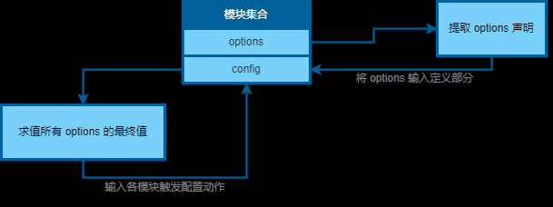
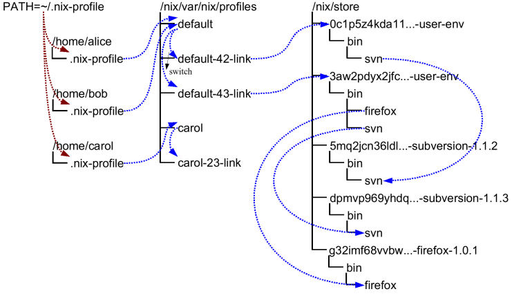
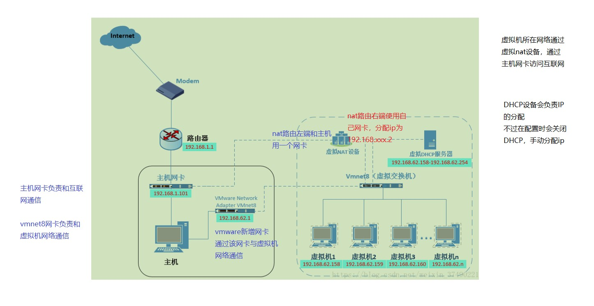
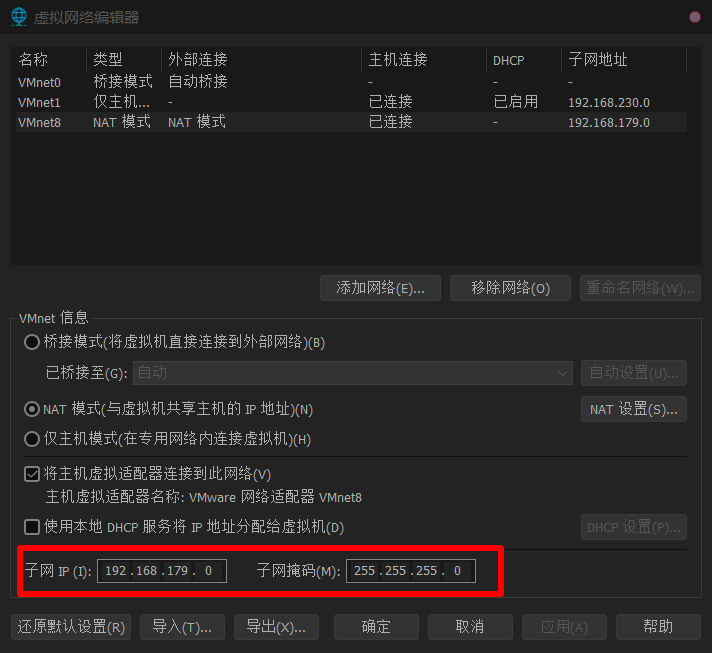
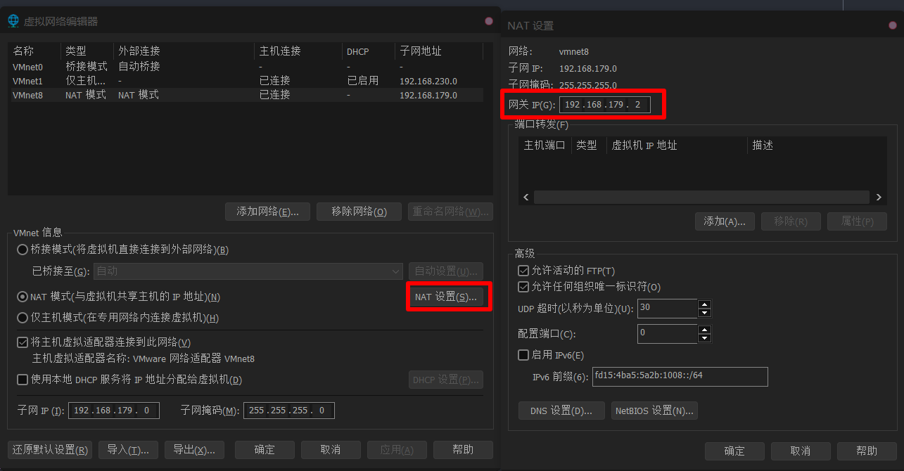
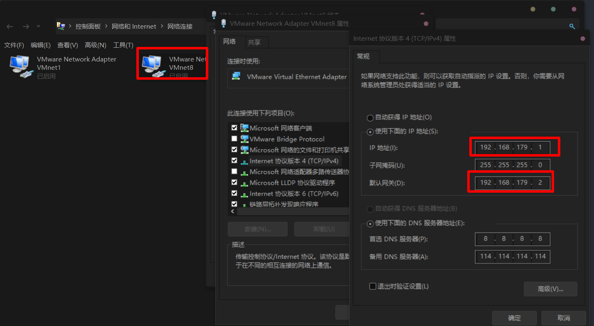

# nix 语言

[示例代码库](https://github.com/rectcircle/learn-nix-demo)

## 概述

为了更好的描述一个包，从源码到制品的过程，nix 设计了一套领域特定语言（DSL），来声明一个包。这个语言就叫做 nix 语言。

nix 是一种特定领域的、纯函数式的、惰性求值的、动态类型的编程语言。

该语言主要的应用场景为：

- 定义一个 nix channel，之前文章多次提到的 nixpkgs 收录的超过 8 万个包，就是通过 nix 语言声明的。
- 在 `shell.nix` 中使用，正如之前文章所讲，其可以为一个项目定义一个可重现的隔离的开发环境。
- 在 NixOS 中，来定义操作系统环境，本系列不多赘述。

## Hello World

```
# nix-lang-demo/01-hello.nix
let
  msg = "hello world";
in msg
```

运行代码，`nix-instantiate --eval nix-lang-demo/01-hello.nix`，输出如下：

```
"hello world"
```

除了直接运行一个 `.nix` 代码文件外。通过实验性的 `nix repl` 命令，可以打开一个 nix 交互式 shell，来交互式的执行 nix 表达式。

关于 `let in` 参见下文：`局部变量`

## 程序结构

和常规的命令式通用编程语言不同，nix 是一种声明式的表达式语言。

常规的 Go、Java、C 等编程语言，一个程序的入口是一个 main 函数。

在 nix 中，没有一个 main 函数。一个 nix 的程序就是 nix 提供的几种基本结构组合而成的表达式。

在执行一个正确的 nix 程序时，解释器最终会推导出一个且必须推导出一个值出来。这个值，必须是 nix 支持的几种数据类型之一，参见下文。

## 数据类型

nix 的数据类型类似于 JSON，可以分为基本数据类型、列表和属性集。

### 基本数据类型

#### 字符串

支持多种表达方式。

- `"string"` 双引号包裹的字符串，
  - 对于特殊字符需使用 `\` 转义，如： `\"`、`\$`、`\n`、`\r`、`\t`。
  - 该类字符串支持使用 `${}` 进行插值。
  - 和其他语言的 `""` 相比，在 nix 中，该类型字符串支持多行的写法。
- `''string''` 两个单引号包裹的字符串，
  - 支持多行，该类字符串会自动删除每一行相同数目（这个数目为所有行中前导空格数最小的数目）的前导空格。比如：

    ```nix
    ''
      This is the first line.
      This is the second line.
        This is the third line.
    ''
    ```

    等价于

    `"This is the first line.\nThis is the second line.\n This is the third line.\n"`

  - 该类型字符串也支持 `${}`进行字符串插值。对于特殊字符需使用 `''` 转移，如：
    - `'''` 等价于 `"''"`
    - `''$` 等价于 `"$"`
    - `\n` 等价于 `"\\n"`，`''\n` 等价于 `"\n"`
    - `\r` 等价于 `"\\r"`，`''\r` 等价于 `"\r"`
    - `\t` 等价于 `"\\t"`，`''\t` 等价于 `"\t"`

双单引号字符串和双引号字符串相比，有更少的引用，且，在书写多行字符串时，代码格式化的缩进会自动去除，且，有更少的转义字符。因此，在写多行字符串时，建议使用双单引号格式。

最后，符合 [RFC 2396](http://www.ietf.org/rfc/rfc2396.txt) 的 URL 可以不使用引号包裹，可以直接使用。

#### 数字

支持且不区分整型和浮点型，格式如 `123`、`123.43`、`.27e13`

#### 路径

如 `/bin/sh`、`./abc`、`abc/123`，包含一个斜杠的会被识别为路径类型。nix 会把这些路径都转换为绝对路径， **注意 nix 中的相对路径都是相对于 `.nix` 源代码文件的** 。

nix 也支持 `~/abc` 这种写法。

nix 还支持一种特殊写法，如 `<nixpkgs>`，nix 在 `NIX_PATH` 环境变量中查找指定名字的路径，当 `NIX_PATH` 不存在时，会在 `~/.nix-defexpr/channels` 中查找。

**路径可以作为字符串插值的符号** ，如 `"${./foo.txt}"`，针对这种情况 **，nix 会将路径对应文件或目录复制到 `"/nix/store/<hash>-foo.txt"` 中** 。（Nix 语言假定在计算 Nix 表达式时所有输入文件都将保持不变。例如，假设您在 nix repl 会话期间使用了内插字符串中的文件路径。稍后在同一会话中，更改文件内容后，再次使用文件路径评估内插字符串可能不会返回新的存储路径，因为 Nix 可能不会重新读取文件内容）

除了 `<>` 语法外，路径也支持插值， **注意，至少要有一个 `/` 出现在插值之前，才会被识别为路径** 。例如：`a.${foo}/b.${bar}` 会被识别为除法运算而不是路径，因此需要改为 `./a.${foo}/b.${bar}`。

注意，通过 `nix-instantiate --eval` 执行文件时， **如果使用 `--strict` 启用严格模式** ，则需要保证所有的 PATH 都必须存在， **且 nix 会将这些文件或目录复制到 `/nix/store` 中** ， **路径变量的值将变为 `/nix/store/$hash-$name`** 。

#### bool

可选值为 true 或 false。

#### null

空值，表示 null。

#### 示例

完整示例 (`nix-lang-demo/02-primitives-data-type.nix`)。

```nix
# nix-env -iA nixpkgs.jq # 为了更好的展示结果，使用 jq 进行结果格式化展示。
# nix-instantiate --eval nix-lang-demo/02-primitives-data-type.nix --strict --json | jq
let
  a = "1";
in {
  demo_01_str_double_quotes = "foo bar \r \t \n \\ \${";
  demo_02_str_with_string_interpolation = "a: ${a}";
  demo_03_str_two_single_quotes = ''
    line1
    line2
    \r \n \t \
    ''\r ''\t ''\n ''' ''${
    a: ${a}
    '';

  demo_04_str_url = https://rectcircle.cn;
  demo_05_num_int = 1;
  demo_06_num_float = 1.1;
  demo_07_num_e = .27e13;

  demo_08_path_abs_path = /bin/sh;
  demo_09_path_rel_path1 = ./demopath/a;
  demo_10_path_rel_path2 = demopath/a;
  demo_11_path_home_path = ~/.bashrc;

  demo_12_bool_true = true;
  demo_13_bool_false = false;

  demo_14_null = null;
}
```

执行代码 `nix-env -iA nixpkgs.jq && nix-instantiate --eval nix-lang-demo/02-primitives-data-type.nix --strict --json | jq`，输出如下：

```json
{
  "demo_01_str_double_quotes": "foo bar \r \t \n \\ ${",
  "demo_02_str_with_string_interpolation": "a: 1",
  "demo_03_str_two_single_quotes": "line1\nline2\n\\r \\n \\t \\\n\r \t \n'' ${\na: 1\n",
  "demo_04_str_url": "https://rectcircle.cn",
  "demo_05_num_int": 1,
  "demo_06_num_float": 1.1,
  "demo_07_num_e": 2700000000000,
  "demo_08_path_abs_path": "/nix/store/9wk86jmq024g8yb40wh4y5znkh1dix8y-sh",
  "demo_09_path_rel_path1": "/nix/store/w996igw5fhzp5pmk8g9bfv99is99b0ap-a",
  "demo_10_path_rel_path2": "/nix/store/w996igw5fhzp5pmk8g9bfv99is99b0ap-a",
  "demo_11_path_home_path": "/nix/store/x1znix2cdfg9fnmgvkdda19n28jphdm7-.bashrc",
  "demo_12_bool_true": true,
  "demo_13_bool_false": false,
  "demo_14_null": null
}
```

### 函数类型

nix 语言是函数式的，其函数也是一种数据类型，也就是说 nix 的函数可以作为返回值，也可以作为函数参数、可以赋值给变量。

因为函数可以在列表、属性集中使用，因此先介绍函数。

nix 函数的定义语法为: `函数参数: 函数体`，语义为：接收一个值作为一个参数，并返回值。函数调用方式为 `函数名 函数参数值`。例如：

```nix
let
  addOne = x: x+1;
in addOne 1 # 返回 2
```

可以说，上面这句话，这就是 nix 函数的全部。但是基于此 nix 提供了一些和 Python 差不多强大的函数能力。

- 多参数函数
  - 如：函数 f `x: y: x + y`，其实等价于 `x: (y: x + y)`，
  - 可以理解为，参数为 `x` 的函数返回了一个参数为 `y` 的函数，这个参数为 `y` 的函数返回 `x + y` 的值。
  - 调用方式为 `f 1 2`，其实等价于 `(f 1) 2`。
  - **但是要注意，`:` 右侧要有一个空格，否则会识别为字符串**
    ```
    nix-repl> let f = x: x+1; in f
    «lambda @ «string»:1:9»

    nix-repl> let f = x:x+1; in f
    "x:x+1"
    ```

- 命名参数函数
  - 简单场景
    - 函数 f `{a, b}: a + b`，本质上是一种语法糖，等价于 `x: x.a + x.b`。
    - 调用方式为 `f {a = 1; b = 2; }`，但是需要注意的是这种方式 nix 会对参数进行属性是否存在校验。
    - 也就是说调用时缺少（`f {a = 1;}`）或者多余（`f {a = 1; b = 2; c= 3;}` ）属性均会报错。
  - 属性默认值
    - 函数 f `{a, b ? 0}: a + b`，`b ? 0`表示 b 的默认值为 0，调用时可以不传 b，如 `f {a = 1;}` 将返回 1。
  - 其他属性和命名属性，
    - 函数 f `args@{ a, b, ... }: a + b + args.b + args.c` 或 `{ a, b, ... }@args: a + b + args.b + args.c`。
    - 在函数调用时，`...` 允许传递了除了 a, b 之外的属性。
    - `@args` 表示将整个属性集赋值给变量`args` ，在函数体中可以使用 args 访问整个属性集。
    - `...` 和 `@` 一般同时出现，但这不是强制的。
    - 如下方式调用：
      - `f {a = 1; b = 2;}` 报错。
      - `f {a = 1; b = 2; c = 3;}` 返回 8。
      - `f {a = 1; b = 2; c = 3; d = 4;}` 返回 8。

- 其他优先级问题：
  - 数组中调用function，需要将function括起来 ` [ (func var) ]`， 否则会被识别为两个元素的数组
  - `(config, ...)@inputs: {config.a.b=10}`，参数中的 config 和 返回值里面的config没有关系。
    - 返回值等价于 `{config = {a={b=10;};};}`，是声明了一个新的 attribute set。
    - 类似于json: `{"config": {a: {b:10}}}`，attribute set 的 config 键不是 参数中 config 的值
    - 注意编程惯性。

完整示例 (`nix-lang-demo/03-func-data-type.nix`)。

```nix
# nix-env -iA nixpkgs.jq # 为了更好的展示结果，使用 jq 进行结果格式化展示。
# nix-instantiate --eval nix-lang-demo/03-func-data-type.nix --strict --json | jq
let
  addOne = x: x+1;
  add = x: y: x + y;
  addTwo = add 2;
  addAttrs = {x, y}: x + y;
  addAttrsYDefault2 = {x, y?2}: x + y;
  addAttrsAtAndRemaining = attrs@{x, y, ...}: x + attrs.y + attrs.z;
in {
  demo_01_add_one_2 = addOne 2;
  demo_02_add_1_2 = add 1 2;
  demo_03_add_two_1 = addTwo 1;
  demo_04_add_attrs_x1_y2 = addAttrs { x = 1; y = 2; };
  demo_05_add_attrs_y_default2_x1 = addAttrsYDefault2 { x = 1; };
  demo_06_add_attrs_at_and_remaining_x_1_y_1_z_1_q_3 = addAttrsAtAndRemaining { x = 1; y = 1; z = 1; q = 3; };
}
```

执行代码 `nix-env -iA nixpkgs.jq && nix-instantiate --eval nix-lang-demo/03-func-data-type.nix --strict --json | jq`，输出如下：

```json
{
  "demo_01_add_one_2": 3,
  "demo_02_add_1_2": 3,
  "demo_03_add_two_1": 3,
  "demo_04_add_attrs_x1_y2": 3,
  "demo_05_add_attrs_y_default2_x1": 3,
  "demo_06_add_attrs_at_and_remaining_x_1_y_1_z_1_q_3": 3
}
```

### 列表

nix 通过方括号 `[]` 定义一个列表。和其他语言不同， **列表中的元素通过空格而不是逗号分割** 。

如： `[ 123 ./foo.nix "abc" (f { x = y; }) ]`，这个列表包含 4 个元素。第一个元素为数字、第二个元素为路径、第三个元素为字符串、第四个元素为调用函数 `f` 并获取结果（使用了小括号包裹）。

而对于 `[ 123 ./foo.nix "abc" f { x = y; } ]` 列表，包含 5 个元素。第四个元素为一个函数、第五个元素为属性集。

注意： **数组的求值是惰性的** ，且是严格长度的。

完整示例 (`nix-lang-demo/04-list-data-type.nix`)。

```nix
# nix-env -iA nixpkgs.jq # 为了更好的展示结果，使用 jq 进行结果格式化展示。
# nix-instantiate --eval nix-lang-demo/04-list-data-type.nix --strict --json | jq
let
  addAttrs = { x, y }: x + y;
  demo_01_list_1 = [ 123 demopath/a "abc" (addAttrs { x = 1; y = 2; }) ];
  demo_01_list_2 = [ 123 demopath/a "abc" addAttrs { x = 1; y = 2; } ];
in
{
  demo_01_list_1 = demo_01_list_1;
  demo_01_list_2_len = builtins.length demo_01_list_2;
}
```

执行代码 `nix-env -iA nixpkgs.jq && nix-instantiate --eval nix-lang-demo/03-func-data-type.nix --strict --json | jq`，输出如下：

```json
{
  "demo_01_list_1": [123, "/nix/store/w996igw5fhzp5pmk8g9bfv99is99b0ap-a", "abc", 3],
  "demo_01_list_2_len": 5
}
```

### 属性集

nix 通过花括号 `{}` 定义一个属性集。属性集的每个元素（属性）为一个键值对，key 和 value 使用 `=` 分割，以 `;` 结尾。

如：

```nix
{
  x = 123;
  text = "Hello";
  y = f { bla = 456; };
}
```

该示例包含 3 个属性，分别是：值为数字的 x、值为字符串的 text、值为 f 函数返回值的 y。

属性集的属性通过点号 `.` 方式访问，如：`{ a = "Foo"; b = "Bar"; }.a`。

**如果访问属性不存在时，取默认值，可以通过 `or` 实现** ，如：`{ a = "Foo"; b = "Bar"; }.c or "Xyzzy"`。

**属性集的 Name 可以是任意字符串** ，如果是包含特殊字符可以使用 `."xxx"` 的方式访问，如：`{ "$!@#?" = 123; }."$!@#?"`。

属性的访问也支持插值，如：`let bar = "foo"; in { foo = 123; }.${bar}`，等价于 `{ foo = 123; }.foo`。

属性定义时其名字也支持插值，如：`let bar = "foo"; in { ${bar} = 123; }.foo`，等价于 `{ foo = 123; }.foo`。

属性定义是如果其名字插值的是一个 null，则不会将该属性添加到该属性即中（因为 null 无法转换为一个字符串），如：`{ ${null} = true; }` 等价于 `{}`。

属性集可以通过 `__functor` 属性名，将该属性集定义成一个函数，如：

```nix
let add = { __functor = self: x: x + self.x; };
    inc = add // { x = 1; };
in inc 1
```

- 第一行，定义了一个 add 属性集，其 `__functor` 是属性是一个函数，该函数参数为 self 和 x，函数体为 `self.x + x`
- 第二行，使用 `{ x = 1; }` 更新（`//` 语法） add 属性集，其返回，赋值给变量 inc
  - **注意这里的更新并不会影响 add 值自身，因为 nix 的值都是不可变的**
- 第三行，将 inc 作为函数调用，参数为 1。此时，实际上调用了 `__functor` 函数。
- 利用该特性可以实现类似面向对象的效果。
  - `//` 类似 new 一个对象，右侧是属性以及值，和lua有写类似

默认情况下，定义一个属性集，属性之间是不能相互引用，如下将报错：

```nix
{
  y = 123;
  x = y;
}
```

通过，在花括号前添加 `rec`，表示声明一个递归属性集。此时，同一属性集内部的属性可以相互引用，如下不会报错：

```nix
rec {
  y = 123;
  x = y;
}
```

此外，递归属性集，属性的引用和顺序无关，如下不会报错：

```nix
rec {
  x = y;
  y = 123;
}
```

此外， **在递归属性集中，如果引用的名字，在作用域内有同名的变量，且属性集内也有同名的属性，此时取属性集属性的值** 。如下：

```nix
let y = 456;
in rec {
  x = y;
  y = 123;
}
```

将返回： `{ x = 123; y = 123; }`。

完整示例 (`nix-lang-demo/05-attrs-data-type.nix`)。

```nix
# nix-env -iA nixpkgs.jq # 为了更好的展示结果，使用 jq 进行结果格式化展示。
# nix-instantiate --eval nix-lang-demo/05-attrs-data-type.nix --strict --json | jq
let
  bKey = "b";
  dKey = "d";
  demo_01_define = {
    a = 1;
    b = "b";
    "$!@#?" = 123;
    ${dKey} = 4;
    ${null} = true;
  };
  demo_02_access = {
    a = demo_01_define.a;
    b = demo_01_define.${bKey};
    c = demo_01_define.c or "c not exist";
    "$!@#?" = demo_01_define."$!@#?";
    d = demo_01_define.d;
  };

  callable_attr_define = { __functor = self: x: x + self.x; };
  demo_03_callable_attr_object = callable_attr_define // { x = 1; };

  demo_04_rec_attr1 = rec {
    y = 123;
    x = y;
  };
  y = 456;
  demo_05_rec_attr2 = rec {
    x = y;
    y = 123;
  };
in
{
  demo_01_define = demo_01_define;
  demo_02_access = demo_02_access;
  demo_03_call_attr = demo_03_callable_attr_object 2;
  demo_04_rec_attr1 = demo_04_rec_attr1;
  demo_05_rec_attr2 = demo_05_rec_attr2;
}
```

执行代码 `nix-env -iA nixpkgs.jq && nix-instantiate --eval nix-lang-demo/05-attrs-data-type.nix --strict --json | jq`，输出如下：

```json
{
  "demo_01_define": {
    "$!@#?": 123,
    "a": 1,
    "b": "b",
    "d": 4
  },
  "demo_02_access": {
    "$!@#?": 123,
    "a": 1,
    "b": "b",
    "c": "c not exist",
    "d": 4
  },
  "demo_03_call_attr": 3,
  "demo_04_rec_attr1": {
    "x": 123,
    "y": 123
  },
  "demo_05_rec_attr2": {
    "x": 123,
    "y": 123
  }
}
```

## 变量

### 局部变量

nix 通过 `let in` 来创建一个作用域，并定义一批变量，如：

```nix
let
  a = 1;
  b = 2;
in
  a + b
```

如上写法等价于： `1 + 2`。

### 属性继承

当我们想构造一个属性集，并想将作用域中的某些属性作为该属性集的属性时，一般的写法如下：

```nix
let
  a = 1;
  b = 2;
in {
  a = a;
  b = b;
  c = 3;
}
```

nix 提供继承语法糖，可以将上述简化为：

```nix
let
  a = 1;
  b = 2;
in {
  inherit a b;
  c = 3;
}
```

inherit 还可以从一个属性集中继承其中的几个属性，示例如下：

```nix
let
  a = 1;
  x = {
    b = 2;
    c = 3;
  };
in {
  inherit a;
  inherit (x) b c;
}
```

等价于：

```nix
let
  a = 1;
  x = {
    b = 2;
    c = 3;
  };
in {
  a = 1;
  b = x.b;
  c = x.c;
}
```

### with 表达式

类似于 python 的 with。通过 with 可以创建一个作用域，并将一个属性集中属性作为作用域中的变量。

示例如下：

```nix
with {
  a = 1;
  b = 2;
}; a + b
```

等价于：

```nix
let
  a = 1;
  b = 2;
in a + b
```

等价于：

```nix
let
x = {
    a = 1;
    b = 2;
  };
in with x;
a + b
```

### 示例

```
nix-lang-demo/06-var.nix
# nix-env -iA nixpkgs.jq # 为了更好的展示结果，使用 jq 进行结果格式化展示。
# nix-instantiate --eval nix-lang-demo/06-var.nix --strict --json | jq

let
  a = 1;
  b = 2;
  attrs1 = {
    x = 3;
    y = 4;
  };
  attrs2 = {
    m = 5;
    n = 6;
  };
in with attrs2;
{
  inherit a b;
  inherit (attrs1) x y;
  m = m;
  inherit n;
}
```

执行代码 `nix-env -iA nixpkgs.jq && nix-instantiate --eval nix-lang-demo/06-var.nix --strict --json | jq`，输出如下：

```json
{
  "a": 1,
  "b": 2,
  "m": 5,
  "n": 6,
  "x": 3,
  "y": 4
}
```

## 流程控制

### 条件表达式

语法如下：

```nix
if e1 then e2 else e3
```

例如：

```nix
let x = 1;
in if x > 0 then "x > 0" else "x <= 0"
```

返回， “x > 0”。

### 循环

nix 是个无副作用的函数式的表达式语言。因此，nix 没有命令式编程语言的 while 或者 for 循环。

一般情况，需要循环场景，就是对列表或者属性集进行转换。nix 可以通过内置高阶函数，如 `builtins.filter`、 `builtins.map`，来达到类似的效果。

### 示例

```nix
# nix-lang-demo/07-flow-control.nix
# nix-env -iA nixpkgs.jq # 为了更好的展示结果，使用 jq 进行结果格式化展示。
# nix-instantiate --eval nix-lang-demo/07-flow-control.nix --strict --json | jq
let
  x = 1;
  l = [1 2 3 4 5 6];
  filter = builtins.filter;
  map = builtins.map;
in {
  demo_01_x_great_than_0 = if x > 0 then "x > 0" else "x <= 0";
  demo_02_l_filter_map = map (e: e * 2) (filter (e: e<=3) l);
}
```

执行代码 `nix-env -iA nixpkgs.jq && nix-instantiate --eval nix-lang-demo/07-flow-control.nix --strict --json | jq`，输出如下：

```json
{
  "demo_01_x_great_than_0": "x > 0",
  "demo_02_l_filter_map": [2, 4, 6]
}
```

## 错误处理

### 断言

通过 assert 可以检查某些条件是否成立，语法如下：

```nix
assert e1; e2
```

其中 e1 是一个可以计算为 bool 类型值的表达式。如果 e1 为 true，则返回 e2 的值，如果 e1 为 false，则停止计算，并打印调用栈信息。如：

- `assert true; 1` 将返回 1。
- `assert false; 1` 将报错。

### 抛出错误

nix 的错误抛出，由内置函数提供，语法如下：

```nix
builtins.throw s
```

抛出错误，如果上层没有处理，解释器会打印消息 `s`，并停止运行（评估）。

### 错误终止

nix 的错误终止，由内置函数提供，语法如下：

```nix
builtins.abort s
```

上层不能捕捉abort的异常，解释器会打印消息 `s`，并停止运行（评估）。

### 错误捕捉

nix 的错误捕捉，由内置函数提供，语法如下：

```nix
builtins.tryEval e
```

- 只能捕捉 `assert` 和 `builtins.throw` 产生的错误。

- 返回一个属性集，包含两个属性：

  - `success`: bool 类型，是否成功，如果捕捉到错误，则该属性为 `false`。
  - `value` 任意类型。
    - 如果 `success = false`，则该参数为 `false`，注意，不是错误消息（参见：[issue](https://github.com/NixOS/nix/issues/356)）。
    - 否则是该参数 e 的值。

### 示例

```nix
nix-lang-demo/08-err-handle.nix
# nix-env -iA nixpkgs.jq # 为了更好的展示结果，使用 jq 进行结果格式化展示。
# nix-instantiate --eval nix-lang-demo/08-err-handle.nix --strict --json | jq
let
  divide = a: b: assert b !=0 ; a / b;
  throw_err = msg: builtins.throw msg;
  abort_err = msg: builtins.abort msg;
in {
  demo_01_4_div_2 = divide 4 2;
  demo_02_try_4_div_0 = builtins.tryEval (divide 4 0);
  demo_03_try_4_div_2 = builtins.tryEval (divide 4 2);
  demo_04_try_throw_err = builtins.tryEval (throw_err "err");
  # demo_05_try_abort_err = builtins.tryEval (abort_err "err"); # abort 无法捕捉
  # demo_06_try_builtins_4_div_0 = builtins.tryEval (4 / 0); # 除 0 无法捕捉
}
```

执行代码 `nix-env -iA nixpkgs.jq && nix-instantiate --eval nix-lang-demo/08-err-handle.nix --strict --json | jq`，输出如下：

```json
{
  "demo_01_4_div_2": 2,
  "demo_02_try_4_div_0": {
    "success": false,
    "value": false
  },
  "demo_03_try_4_div_2": {
    "success": true,
    "value": 2
  },
  "demo_04_try_throw_err": {
    "success": false,
    "value": false
  }
}
```

## 操作符

> 参见：[Nix 手册 Operators](https://nixos.org/manual/nix/stable/language/operators.html#operators)

Nix 操作符和 C 语言的类似，区别是：

- nix 不支持 `:?`，类似效果的是 `if then else`。
- nix 不支持 `++`，`--`、`+=`、`-=` 等类似的涉及修改变量值的操作符。
- nix 支持的一些 C 语言没有的操作符：
  - `attrset ? attrpath`，返回 bool 值， 判断属性集中是否存在某个属性。attrpath 支持 `a.b.c` 格式。
  - `list ++ list`，返回一个 list，两个 list 连接产生一个新的 list。
  - `string + string`，返回一个 string，字符串拼接。
  - `path + path`，返回一个 path，路径拼接（注意最终都会转换为绝对路径进行拼接，而不是路径 join）。
  - `path + string`，返回一个 path，路径拼接（两者先转换为字符串，然后直接拼接到一起，然后转换为一个路径）。
  - `string + path`，返回一个 string，路径拼接（path 路径必须存在）
    - nix 会将该路径复制到 /nix/store 中，并将 string 和 `/nix/store/$hash-文件名` 拼接，并转换为字符串
    - 比如 `"/abc" + ./README.md`，返回 `"/abc/nix/store/qmj08qmd1bb89g6wami4v2fq5ma4f42c-README.md"`。
  - `attrset // attrset` 使用后一个属性集更新到前一个属性集中（存在则覆盖），返回这个更新后的属性集。
  - `bool -> bool` 一种特殊的逻辑运算符，等价于 `!b1 || b2`，参见：[wiki](https://en.wikipedia.org/wiki/Truth_table#Logical_implication)。

完整示例 (`nix-lang-demo/09-operators.nix`)。

```nix
# nix-env -iA nixpkgs.jq # 为了更好的展示结果，使用 jq 进行结果格式化展示。
# nix-instantiate --eval nix-lang-demo/09-operators.nix --strict --json | jq
let
  attrs1 = {
    x = 1;
  };
  list1 = [1 2];
  list2 = [3 4];
in
{
  demo_01_attrs1_has_x = attrs1 ? x;
  demo_02_attrs1_has_y = attrs1 ? y;
  demo_03_attrs1_has_a_dot_b = attrs1 ? a.b;

  demo_04_list1_concat_list2 = list1 ++ list2;

  demo_05_str1_concat_str2 = "abc" + "123";
  # demo_06_path1_concat_path2 = demopath/a + demopath/b; # 严格模式将报错，因为返回的路径不存在。
  demo_07_path1_concat_str2 = "demopath/a" + demopath/b;
  # demo_08_str1_concat_path2 = demopath/a + "demopath/b"; # 严格模式将报错，因为返回的路径不存在。

  demo_08_attrs = attrs1;
  demo_09_attrs1_merge_attrs2 = attrs1 // {y = 2;};

  demo_10_implication = false -> true;
}
```

执行代码 `nix-env -iA nixpkgs.jq && nix-instantiate --eval nix-lang-demo/09-operators.nix --strict --json | jq`，输出如下：

```json
{
  "demo_01_attrs1_has_x": true,
  "demo_02_attrs1_has_y": false,
  "demo_03_attrs1_has_a_dot_b": false,
  "demo_04_list1_concat_list2": [1, 2, 3, 4],
  "demo_05_str1_concat_str2": "abc123",
  "demo_07_path1_concat_str2": "demopath/a/nix/store/nqxj2if4v96ksj1mgsblgc375wcslf83-b",
  "demo_08_attrs": {
    "x": 1
  },
  "demo_09_attrs1_merge_attrs2": {
    "x": 1,
    "y": 2
  },
  "demo_10_implication": true
}
```

## 内置常量和内置函数

- 内置常量：

  - `builtins`，包含内置函数的属性集。
  - `builtins.currentSystem`，如 `"i686-linux"` or `"x86_64-darwin"`。

- 已经添加到顶层作用域，无需通过 `builtins` 引用的内置函数：

  - `abort`，参见上文错误处理。
  - `baseNameOf s` 类似于 gnu 的 basename，去除路径的路径，返回文件名。
  - `break` In debug mode (enabled using –debugger), pause Nix expression evaluation and enter the REPL. Otherwise, return the argument v.
  - `derivation` nix 编译系统核心函数，参见下文：[推导]()。
  - `derivationStrict` 没找到相关手册，只有一个相关 [issue](https://github.com/NixOS/nix/issues/7569)。
  - `dirOf s` 类似于 gnu 的 dirname，返回路径所在目录。
  - `fetchGit`、`fetchMercurial`、`fetchTarball`、`fetchTree`，参见下文：[fetch 相关函数]()。
  - `fromTOML` 未找到相关文档。
  - `import` 参见下文：[模块系统]()。
  - `isNull e` 判断是否是 null（此功能已弃用；使用 `e == null` 代替）。
  - `map f list` 转换一个列表，函数式编程的 map 原语。
  - `placeholder` 不太理解，参见：[原文](https://nixos.org/manual/nix/stable/language/builtins.html#builtins-placeholder)。
  - `removeAttrs set list` 从 set 中删除指定的属性。
  - `scopedImport` 未找到相关文档。
  - `throw` 参见上文错误处理。
  - `toString` 将值转换为字符串，一个属性集可以通过特殊属性 `__toString = self: ...;` 自定义 toString 格式。

- 其他内置函数，参见：[Nix 手册 - 内置函数](https://nixos.org/manual/nix/stable/language/builtins.html)。

## fetch 相关函数

nix 提供了一些从网络上下载文件的内置函数，执行这些函数，nix 会将这些文件下载下来，并存储到 `/nix/store` 中，并返回存储的路径。

- `builtins.fetchurl` 下载 url。

  ```nix
  let fetchurl = builtins.fetchurl;
  in fetchurl {
    url = "http://ftp.nluug.nl/pub/gnu/hello/hello-2.1.1.tar.gz";
    sha256 = "1md7jsfd8pa45z73bz1kszpp01yw6x5ljkjk2hx7wl800any6465";
  }
  ```

- `builtins.fetchGit args` 从 git 中下载文件。

  - args 是一个属性集。

    - `url` 仓库地址。
    - `name` 存储到 `/nix/store` 的名称，默认为 URL 的 basename。
    - `rev` 要获取的 git 修订版。默认为 ref 指向的。
    - `ref` 分支名或者标签名，如 `master`、`"refs/heads/0.5-release"`，默认为 `HEAD`。
    - `submodules` 是否 checkout 子模块，默认为 false。
    - `shallow` 是否浅克隆，默认为 false。
    - `allRefs` 是否获取仓库的所有引用，默认为 false，即只获取 `ref` 参数配置的。

  - 示例：通过 ssh 从私有仓库获取。

    ```nix
    builtins.fetchGit {
      url = "git@github.com:my-secret/repository.git";
      ref = "master";
      rev = "adab8b916a45068c044658c4158d81878f9ed1c3";
    }
    ```

  - 示例：配置引用。

    ```nix
    builtins.fetchGit {
      url = "https://github.com/NixOS/nix.git";
      ref = "refs/heads/0.5-release";
    }
    ```

  - 示例：下载指定分支的指定 commit（推荐配置 rev 来指定 commit，这样是可重现的，否则随着分支的提交，未来某个时刻获取到的和当前可能不一致）。

    ```nix
    builtins.fetchGit {
      url = "https://github.com/nixos/nix.git";
      rev = "841fcbd04755c7a2865c51c1e2d3b045976b7452";
      ref = "1.11-maintenance";
    }
    ```

  - 示例：如果要查找的 commit 位于 git 存储库的默认分支中，您可以省略 ref 属性。

    ```nix
    builtins.fetchGit {
      url = "https://github.com/nixos/nix.git";
      rev = "841fcbd04755c7a2865c51c1e2d3b045976b7452";
    }
    ```

  - 示例：指定某个具体 tag。

    ```nix
    builtins.fetchGit {
      url = "https://github.com/nixos/nix.git";
      ref = "refs/tags/1.9";
    }
    ```

  - 示例：获取最新版本。

    ```nix
    builtins.fetchGit {
      url = "ssh://git@github.com/nixos/nix.git";
      ref = "master";
    }
    ```

- `builtins.fetchTarball args` 从 url 中下载一个 tar 包（压缩格式必须是 gzip, bzip2 or xz 之一的）（缓存在 `~/.cache/nix/tarballs/` 路径），并解包到一个目录中。注意，tar 的顶层目录会被删除。然后将目录存储到 `/nix/store`，并返回该路径，该函数一般和 import 函数（参见下文）一起使用。

  ```nix
  with import (fetchTarball {
    url = "https://github.com/NixOS/nixpkgs/archive/nixos-14.12.tar.gz";
    sha256 = "1jppksrfvbk5ypiqdz4cddxdl8z6zyzdb2srq8fcffr327ld5jj2";
  }) {};
  ```

完整示例 (`nix-lang-demo/10-builtins-fetch.nix`)。

```nix
# nix-env -iA nixpkgs.jq # 为了更好的展示结果，使用 jq 进行结果格式化展示。
# nix-instantiate --eval nix-lang-demo/10-builtins-fetch.nix --strict --json | jq
let
  fetchurl = builtins.fetchurl;
  fetchGit = builtins.fetchGit;
  fetchTarball = builtins.fetchTarball;
in
{
  demo_01_fetchurl = fetchurl {
    url = "http://ftp.nluug.nl/pub/gnu/hello/hello-2.1.1.tar.gz";
    sha256 = "1md7jsfd8pa45z73bz1kszpp01yw6x5ljkjk2hx7wl800any6465";
  };
  demo_02_fetchGit = fetchGit {
    name = "learn-nix-demo-source";
    url = "https://github.com/rectcircle/learn-nix-demo.git";
    rev = "7f4952a6ecf7dcd90c8bb0c8d14795ae1add5326";
    ref = "master";
    shallow = true;
  };
  demo_03_fetchTarball = fetchTarball {
    url = "https://mirrors.tuna.tsinghua.edu.cn/nix-channels/releases/nixpkgs-unstable%40nixpkgs-23.05pre462063.2ce9b9842b5/nixexprs.tar.xz";
  };
}
```

执行代码 `nix-env -iA nixpkgs.jq && nix-instantiate --eval nix-lang-demo/10-builtins-fetch.nix --strict --json | jq`，输出如下：

```json
{
  "demo_01_fetchurl": "/nix/store/9bw6xyn3dnrlxp5vvis6qpmdyj4dq4xy-hello-2.1.1.tar.gz",
  "demo_02_fetchGit": "/nix/store/zjii7ls858zb1qw0mi2v3rd7xg780fav-learn-nix-demo-source",
  "demo_03_fetchTarball": "/nix/store/10njnx13qh4x3z7j7q0jh7m64s0s95w1-source"
}
```

# nixpkg 构建推导

## 模块系统

nix 通过 `import path`， 执行其他文件的代码，并返回执行的结果。在 nix 中 import 是一个内置函数。

path:

- 可以是一个 `.nix` 文件，
- 可以是一个目录，如果是一个目录或压缩包的话，将执行该目录中的 `default.nix` 文件。
- 也可以是一个 attribute set，此时会自动将 attribute set 转换为 string，再进行 import
  - `attriute set` 转为string主要是通过 `{ __toString = self: ...; }` 方法 或者 `{ outPath = ...; }` 参数.
  - flake 的 inputs，一般都会有 `outPath` 属性
  - 参考： <https://nix.dev/manual/nix/2.24/language/builtins.html?highlight=import#builtins-toString>

通过 `import` 函数可以将 nix 代码拆分到文件和目录，以实现模块划分和代码复用。

前文介绍的 nixpkgs channel 本质上就是这样一个模块。下文有一些导入 nixpkgs 的一些惯用用法。

- 示例 1：通过 github 提供的 archive 链接，导入一个历史上某个版本的 nixpkgs。

  ```nix
  let
      pkgs = import (builtins.fetchTarball {
          url = "https://github.com/NixOS/nixpkgs/archive/d1c3fea7ecbed758168787fe4e4a3157e52bc808.tar.gz";
      }) {};
  in
  ```

- 示例 2：通过 git 命令，导入一个历史上某个版本的 nixpkgs。

  ```nix
  let
      pkgs = import (builtins.fetchGit {
          # Descriptive name to make the store path easier to identify
          name = "my-old-revision";
          url = "https://github.com/NixOS/nixpkgs/";
          ref = "refs/heads/nixpkgs-unstable";
          rev = "d1c3fea7ecbed758168787fe4e4a3157e52bc808";
      }) {};
  in
  ```

完整示例

```
nix-lang-demo/demopath/default.nix
{
  c = "demopath/default.nix var c";
}
```

`nix-lang-demo/11-import.nix`。

```nix
# nix-env -iA nixpkgs.jq # 为了更好的展示结果，使用 jq 进行结果格式化展示。
# nix-instantiate --eval nix-lang-demo/11-import.nix --strict --json | jq
let
  import_file = import ./01-hello.nix;
  import_dir = import ./demopath;
in
{
  demo_01_import_file = import_file;
  demo_02_import_dir = import_dir;
}
```

执行代码 `nix-env -iA nixpkgs.jq && nix-instantiate --eval nix-lang-demo/11-import.nix --strict --json | jq`，输出如下：

```json
{
  "demo_01_import_file": "hello world",
  "demo_02_import_dir": {
    "c": "demopath/default.nix var c"
  }
}
```

## 推导 (derivation)

> <https://nix.dev/manual/nix/2.25/language/derivations>
> [nix-pills/our-first-derivation](https://nixos.org/guides/nix-pills/our-first-derivation.html)
> [nix-pills/working-derivation.html](https://nixos.org/guides/nix-pills/working-derivation.html)

### 概述

前文，我们一直将 nix 定位为一个包管理工具。但从本质上来说，nix 的核心是一个包构建系统。

因此，nix 语言需要提供一套机制，可以让用户定义，软件包从源码到二进制产物的过程。

而推导（derivation）就是这样一个最重要的的一个内置函数。是 nix 作为一个构建系统的核心。

### 参数说明

在 nix 中， derivation 内置函数，定义一个软件包重源码到二进制产物的过程，该函数传递一个属性集作为参数，包含如下属性：

- `system` 必填，字符串，定义该构建过程要求的 CPU 架构（x86_64、arm）和操作系统名（linux、darwin）。可通过 `nix -vv --version` 命令获取（或者通过 `builtins.currentSystem` 变量获取，如果是支持所有平台，则可以直接使用这个参数），如果系统不匹配将失败（通过配置，nix 支持远端构建，参见： [forward builds for other platforms](https://nixos.org/manual/nix/stable/advanced-topics/distributed-builds.html)）。该字段会作为环境变量传递给 `builder` 进程。

- `name` 必填，字符串。被 nix-env 用作包的符号名称，并影响其最终存储路径 `/nix/store/$hash-$name`，如果同时支持多版本的场景吗，建议该字段为 `包名-版本号`。。该字段会作为环境变量传递给 `builder` 进程。

- `builder` 必填，字符串或路径，描述一个构建脚本，可以来是另一个 derivation、源码，如 `./builder.sh`。推荐使用 bash `"${pkgs.bash}/bin/bash"`。该字段指向的路径会拷贝到 `/nix/store` 中，并作为环境变量传递给 `builder` 进程。

- `args` 选填，字符串列表，传递给 `builder` 的命令行参数。推荐写法为 `["-c" '' 编译脚本 '']`。

- `outputs` 选填，字符串列表，默认为 `["out"]`。一般情况下，不需要更改（除非想精细化的管理依赖，如配置为 `[ "lib" "headers" "doc" ]`时，其他的推导只需要依赖 `lib` 目录，这种写法可以加速缓存下载）。nix 会在 `/nix/store` 中创建这个列表中声明的所有路径。然后，将该列表中的元素作为 key，对应的路径作为 value，作为环境变量传递给 `builder` 进程。

- 其他属性

  选填，支持字符串、数字、路径、列表、bool、null。这些字段会作为环境变量传递到 `builder` 进程中。需要说明的是：

  - 路径类型，会拷贝到 `/nix/store` 中，然后将绝对路径传递 `builder` 给进程。
  - bool 类型 true，会转换为 1。bool 类型 false、null 会转换为空串。
  - 列表类型，元素会转换为字符串，然后用空格分隔拼接成一个字符串。

### 示例

#### 源码

假设我们有一个 Go 项目，该项目是一个命令行工具，希望通过 nix 编译和发行该包。本部分实现一下该项目：

```
nix-package-demo/go.mod
module github.com/rectcircle/learn-nix-demo/nix-package-demo

go 1.19
nix-package-demo/main.go
package main

import "fmt"

func main() {
	fmt.Println("hello world!")
}
```

#### 定义 derivation

```nix
# nix-lang-demo/12-derivation.nix
# drv_path=$(nix-instantiate nix-lang-demo/12-derivation.nix) && echo "drv_path: $drv_path" && echo "drv: $(nix --extra-experimental-features nix-command show-derivation $drv_path)" && nix-store -r $drv_path && nix-store --read-log $drv_path
# nix-env -e my-nix-package-demo-0.0.1 ; nix-collect-garbage -d  # 彻底卸载。

# 整体来看，该文件定义了一个函数，该函数，参数为 pkgs 默认会拿系统中的 nixpkgs，返回一个 derivation 的返回值。
{pkgs ? import <nixpkgs> { } }:
let
  derivation = builtins.derivation;
  # pkgs = import <nixpkgs> {};
  # 从 github 中获取示例项目的源码，会存储到 /nix/store 中的一个子目录中。source 的值是一个指向这个子目录的路径。
  source = fetchGit {
    name = "learn-nix-demo-source";
    url = "https://github.com/rectcircle/learn-nix-demo.git";
    rev = "7f4952a6ecf7dcd90c8bb0c8d14795ae1add5326";
    ref = "master";
    shallow = true;
  };
in
derivation {
  # 由于 go 项目是跨平台的，所以，这里直接使用 builtins.currentSystem，表示支持任意平台。
  system = builtins.currentSystem;
  name = "my-nix-package-demo-0.0.1";
  # 会启动 nixpkgs 的 bash 来构建项目。
  builder = "${pkgs.bash}/bin/bash";
  # 额外的环境变量，会传递到 builder 进程。
  A = "1";
  # bash 命令的参数。即 bash -c 脚本 。
  args = [ "-c"
  # 在这个脚本，观察下，nix 如何设置这个脚本的环境变量，以及文件系统，参见输出。
  ''
    set -e
    ${pkgs.coreutils}/bin/echo ">>> export -p" && export -p && echo

    echo ">>> export PATH=${pkgs.go_1_19}/bin:${pkgs.bash}/bin:${pkgs.coreutils}/bin" && export PATH="${pkgs.go_1_19}/bin:${pkgs.bash}/bin:${pkgs.coreutils}/bin" && echo

    echo ">>> pwd" && pwd && echo
    echo ">>> id" && id && echo
    echo ">>> ls -al /" && ls -al / && echo
    echo ">>> ls -al /bin" && ls -al /bin && echo
    echo ">>> ls -al /build" && ls -al /build && echo
    echo ">>> ls -al /nix/store" && ls -al /nix/store && echo

    echo ">>> mkdir -p $out/bin" && mkdir -p $out/bin && echo
    echo ">>> cd ${source}/nix-package-demo && CGO_ENABLED=0 go build -o $out/bin/my-nix-package-demo ./" && cd ${source}/nix-package-demo && CGO_ENABLED=0 go build -o $out/bin/my-nix-package-demo ./ && echo

    echo ">>> ls -al $out/bin" && ls -al $out/bin && echo
  ''];
}
```

#### 测试和输出分析

执行 `drv_path=$(nix-instantiate nix-lang-demo/12-derivation.nix) && echo "drv_path: $drv_path" && echo "drv: $()" && nix-store -r $drv_path && nix-store --read-log $drv_path` 命令，输出可以分为三部分。

第一部分，`nix-instantiate nix-lang-demo/12-derivation.nix` 的执行，通过 `echo "drv_path: $drv_path"` 可以看出去，其将打印一个路径。

```
drv_path: /nix/store/svf3hf64w6sadkc0gdpbss7ql0cr6s3d-my-nix-package-demo-0.0.1.drv
```

这个路径命名为 `/nix/store/$hash-$name.drv`。可以看出，nix-instantiate 会执行 `nix-lang-demo/12-derivation.nix` 表达式（如果该文件返回的是一个函数类型，则会使用 `{}` 再调用该函数）。并将结果到该路径。

`.drv` 文件是 nix 构建工具的输入，nix 会根据该文件的配置来执行构建（如有缓存，将直接拉取而跳过构建）。

第二部分， `nix --extra-experimental-features nix-command show-derivation $drv_path` 将使用 json 格式展示上一步产生的 `.drv` 文件。

```json
{
  "/nix/store/svf3hf64w6sadkc0gdpbss7ql0cr6s3d-my-nix-package-demo-0.0.1.drv": {
    "args": [
      "-c",
      "set -e\n/nix/store/bg8f47vihykgqcgblxkfk9sbvc4dnksa-coreutils-9.1/bin/echo \">>> export -p\" && export -p && echo\n\necho \">>> export PATH=/nix/store/633qlvqjryvq0h43nwvzkd5vqxh2rh3c-go-1.19.6/bin:/nix/store/5ynbf6wszmggr0abwifdagrixgnya5vy-bash-5.2-p15/bin:/nix/store/bg8f47vihykgqcgblxkfk9sbvc4dnksa-coreutils-9.1/bin\" && export PATH=\"/nix/store/633qlvqjryvq0h43nwvzkd5vqxh2rh3c-go-1.19.6/bin:/nix/store/5ynbf6wszmggr0abwifdagrixgnya5vy-bash-5.2-p15/bin:/nix/store/bg8f47vihykgqcgblxkfk9sbvc4dnksa-coreutils-9.1/bin\" && echo\n\necho \">>> pwd\" && pwd && echo\necho \">>> id\" && id && echo\necho \">>> ls -al /\" && ls -al / && echo\necho \">>> ls -al /bin\" && ls -al /bin && echo\necho \">>> ls -al /build\" && ls -al /build && echo\necho \">>> ls -al /nix/store\" && ls -al /nix/store && echo\n\necho \">>> mkdir -p $out/bin\" && mkdir -p $out/bin && echo\necho \">>> cd /nix/store/zjii7ls858zb1qw0mi2v3rd7xg780fav-learn-nix-demo-source/nix-package-demo && CGO_ENABLED=0 go build -o $out/bin/my-nix-package-demo ./\" && cd /nix/store/zjii7ls858zb1qw0mi2v3rd7xg780fav-learn-nix-demo-source/nix-package-demo && CGO_ENABLED=0 go build -o $out/bin/my-nix-package-demo ./ && echo\n\necho \">>> ls -al $out/bin\" && ls -al $out/bin && echo\n"
    ],
    "builder": "/nix/store/5ynbf6wszmggr0abwifdagrixgnya5vy-bash-5.2-p15/bin/bash",
    "env": {
      "A": "1",
      "builder": "/nix/store/5ynbf6wszmggr0abwifdagrixgnya5vy-bash-5.2-p15/bin/bash",
      "name": "my-nix-package-demo-0.0.1",
      "out": "/nix/store/rqj3xxlzw7i9iwqqw2xafj9ykv4gy1zh-my-nix-package-demo-0.0.1",
      "system": "x86_64-linux"
    },
    "inputDrvs": {
      "/nix/store/c65s9ncxdkfcijaxn6c9gglcw1zyaapx-go-1.19.6.drv": ["out"],
      "/nix/store/czc8ym3wasmrsnwvlxzavxlfpfi2zg65-bash-5.2-p15.drv": ["out"],
      "/nix/store/psc5y2s3prwxf1ph760nd7n1978s4411-coreutils-9.1.drv": ["out"]
    },
    "inputSrcs": ["/nix/store/zjii7ls858zb1qw0mi2v3rd7xg780fav-learn-nix-demo-source"],
    "outputs": {
      "out": {
        "path": "/nix/store/rqj3xxlzw7i9iwqqw2xafj9ykv4gy1zh-my-nix-package-demo-0.0.1"
      }
    },
    "system": "x86_64-linux"
  }
}
```

重点关注，如下字段：

- `inputDrvs`
  - nix 会分析，我们的 nix 代码，分析我们是否引用了其他 **推导** 。
  - 本例中，我们在 builder 中使用了 `${pkgs.bash}`、在 args 中使用了 `${pkgs.go_1_19}`、`${pkgs.bash}`、`${pkgs.coreutils}`。
  - 因此， nix 识别出这些依赖，添加到了该字段。在 `nix-instantiate` 执行过程中，这些依赖就会被构建完成。
- `inputSrcs`
  - nix 会分析，我们的 nix 代码，分析我们是否引用了其他 **路径** 。
  - 本例中，我们在 args 中引用 fetchGit 获取到的 `source` 路径。
  - 因此 nix 识别出了这些依赖，添加到了该字段。在 `nix-instantiate` 执行过程中，这些依赖就会被获取完成。
- `env`
  - `env` 字段中包含了 `A`，说明声明中的 `A` 属性被加到了环境变量中。
  - 此外 `outputs.out` 也被加到了环境变量中。
- `outputs`
  - 可以看出 outputs 目录，已经被创建出来。

此外，需要强调的是：

- 所有的路径都在 `/nix/store` 目录中。
  - nix 不会依赖除了 /nix/store 之外的其他目录，这保证了 nix 函数式不可变的特性。
- 可以看出 `outputs.out` 目录的 hash 值在编译执行之前就确定，
  - 从该特性可以看出， **nix 的 hash 是由 nix 代码的执行情况决定的，而不是文件内容的 hash** 。
  - 这保证了，同样的 nix 代码生成的各种目录都是一致的。基于这一点 nix 才能实现二进制缓存。

第三部分：`nix-store -r $drv_path && nix-store --read-log $drv_path` 根据 `.drv` 进行编译（对应目录不存在的话），然后打印出输出。

```
/nix/store/rqj3xxlzw7i9iwqqw2xafj9ykv4gy1zh-my-nix-package-demo-0.0.1
>>> export -p
declare -x A="1"
declare -x HOME="/homeless-shelter"
declare -x NIX_BUILD_CORES="4"
declare -x NIX_BUILD_TOP="/build"
declare -x NIX_LOG_FD="2"
declare -x NIX_STORE="/nix/store"
declare -x OLDPWD
declare -x PATH="/path-not-set"
declare -x PWD="/build"
declare -x SHLVL="1"
declare -x TEMP="/build"
declare -x TEMPDIR="/build"
declare -x TERM="xterm-256color"
declare -x TMP="/build"
declare -x TMPDIR="/build"
declare -x builder="/nix/store/5ynbf6wszmggr0abwifdagrixgnya5vy-bash-5.2-p15/bin/bash"
declare -x name="my-nix-package-demo-0.0.1"
declare -x out="/nix/store/rqj3xxlzw7i9iwqqw2xafj9ykv4gy1zh-my-nix-package-demo-0.0.1"
declare -x system="x86_64-linux"

>>> export PATH=/nix/store/633qlvqjryvq0h43nwvzkd5vqxh2rh3c-go-1.19.6/bin:/nix/store/5ynbf6wszmggr0abwifdagrixgnya5vy-bash-5.2-p15/bin:/nix/store/bg8f47vihykgqcgblxkfk9sbvc4dnksa-coreutils-9.1/bin

>>> pwd
/build

>>> id
uid=1000(nixbld) gid=100(nixbld) groups=100(nixbld),65534(nogroup)

>>> ls -al /
total 32
drwxr-x---   9 nixbld nixbld  4096 Mar 12 07:27 .
drwxr-x---   9 nixbld nixbld  4096 Mar 12 07:27 ..
drwxr-xr-x   2 nixbld nixbld  4096 Mar 12 07:27 bin
drwx------   2 nixbld nixbld  4096 Mar 12 07:27 build
drwxr-xr-x   4 nixbld nixbld  4096 Mar 12 07:27 dev
dr-xr-xr-x   2 nixbld nixbld  4096 Mar 12 07:27 etc
drwxr-xr-x   3 nixbld nixbld  4096 Mar 12 07:27 nix
dr-xr-xr-x 194 nobody nogroup    0 Mar 12 07:27 proc
drwxrwxrwt   2 nixbld nixbld  4096 Mar 12 07:27 tmp

>>> ls -al /bin
total 224
drwxr-xr-x 2 nixbld nixbld   4096 Mar 12 07:27 .
drwxr-x--- 9 nixbld nixbld   4096 Mar 12 07:27 ..
-r-xr-xr-x 1 nixbld nixbld 217776 Jan  1  1970 sh

>>> ls -al /build
total 8
drwx------ 2 nixbld nixbld 4096 Mar 12 07:27 .
drwxr-x--- 9 nixbld nixbld 4096 Mar 12 07:27 ..

>>> ls -al /nix/store
total 68
drwxrwxr-t 17 nixbld nixbld 4096 Mar 12 07:27 .
drwxr-xr-x  3 nixbld nixbld 4096 Mar 12 07:27 ..
dr-xr-xr-x  4 nixbld nixbld 4096 Jan  1  1970 2w4k8nvdyiggz717ygbbxchpnxrqc6y9-gcc-12.2.0-lib
dr-xr-xr-x  4 nixbld nixbld 4096 Jan  1  1970 5ynbf6wszmggr0abwifdagrixgnya5vy-bash-5.2-p15
dr-xr-xr-x  3 nixbld nixbld 4096 Jan  1  1970 633qlvqjryvq0h43nwvzkd5vqxh2rh3c-go-1.19.6
dr-xr-xr-x  6 nixbld nixbld 4096 Jan  1  1970 76l4v99sk83ylfwkz8wmwrm4s8h73rhd-glibc-2.35-224
dr-xr-xr-x  4 nixbld nixbld 4096 Jan  1  1970 9zbi407givkvv1m0bd0icwcic3b3q24y-mailcap-2.1.53
dr-xr-xr-x  4 nixbld nixbld 4096 Jan  1  1970 bg8f47vihykgqcgblxkfk9sbvc4dnksa-coreutils-9.1
dr-xr-xr-x  4 nixbld nixbld 4096 Jan  1  1970 bw9s084fzmb5h40x98mfry25blj4cr9r-acl-2.3.1
dr-xr-xr-x  3 nixbld nixbld 4096 Jan  1  1970 bx5ikpp0p8nx88xdldkx16w3k3jzd2qc-busybox-static-x86_64-unknown-linux-musl-1.36.0
dr-xr-xr-x  3 nixbld nixbld 4096 Jan  1  1970 dg8213bqr29hg180gf4ypcj2vvzw4fl3-tzdata-2022g
dr-xr-xr-x  5 nixbld nixbld 4096 Jan  1  1970 jn9kg98dsaajx4mh95rb9r5rf2idglqh-attr-2.5.1
dr-xr-xr-x  3 nixbld nixbld 4096 Jan  1  1970 jvl8dr21nrwhqywwxcl8di4j55765gvy-gmp-with-cxx-stage4-6.2.1
dr-xr-xr-x  4 nixbld nixbld 4096 Jan  1  1970 lg2skbyyn1d7nkczqjz8mms38z4nhj2b-iana-etc-20221107
dr-xr-xr-x  3 nixbld nixbld 4096 Jan  1  1970 qmnr18aqd08zdkhka695ici96k6nzirv-libunistring-1.0
dr-xr-xr-x  4 nixbld nixbld 4096 Jan  1  1970 vv6rlzln7vhxk519rdsrzmhhlpyb5q2m-libidn2-2.3.2
dr-xr-xr-x  4 nixbld nixbld 4096 Jan  1  1970 zjii7ls858zb1qw0mi2v3rd7xg780fav-learn-nix-demo-source

>>> mkdir -p /nix/store/rqj3xxlzw7i9iwqqw2xafj9ykv4gy1zh-my-nix-package-demo-0.0.1/bin

>>> cd /nix/store/zjii7ls858zb1qw0mi2v3rd7xg780fav-learn-nix-demo-source/nix-package-demo && CGO_ENABLED=0 go build -o /nix/store/rqj3xxlzw7i9iwqqw2xafj9ykv4gy1zh-my-nix-package-demo-0.0.1/bin/my-nix-p>

>>> ls -al /nix/store/rqj3xxlzw7i9iwqqw2xafj9ykv4gy1zh-my-nix-package-demo-0.0.1/bin
total 1796
drwxr-xr-x 2 nixbld nixbld    4096 Mar 12 07:27 .
drwxr-xr-x 3 nixbld nixbld    4096 Mar 12 07:27 ..
-rwxr-xr-x 1 nixbld nixbld 1827660 Mar 12 07:27 my-nix-package-demo
```

- `export -p`

  可以看出，nix builder 中的执行环境是一个和操作系统完全隔离的干净的环境。其中：

  - `HOME="/homeless-shelter"`、 `PATH="/path-not-set"` 只是一个占位符。
  - 上文 `.drv` 中的环境变量都正确的注入了。
  - `pwd`、`TMP`、`TEMPDIR` 都在 `/build` 目录。

- `id` 可以看出，nix 创建了一个构建用的用户 `1000(nixbld)`。

- `ls -al /` 可以看出，nix 应该利用了 Linux 的 Mount 和 User namespace 实现的构建隔离。

#### 恢复现场

```bash
nix-env -e my-nix-package-demo-0.0.1 ; nix-collect-garbage -d
```

### derivation 和 stdenv.mkDerivation

这里可以看出，写一个 derivation 启动一个 bash 还是比较麻烦的，最麻烦的是，需要手动设置 PATH 环境变量。

为此，nixpkgs 封装了一个便捷的函数 `stdenv.mkDerivation`，该函数就是对 `derivation` 的封装，提供了更友好的编程接口。

因此，在实践中，一般使用 `stdenv.mkDerivation` 来定义一个推导。

关于 `stdenv.mkDerivation` 参见下文 [nixpkgs 分析]()。

## 常见 shell.nix 分析

上一篇文章，我们使用 shell.nix 定义了一个项目的开发依赖。代码 `nix-package-demo/shell.nix` 如下所示：

```nix
# { pkgs ? import <nixpkgs> { } }:
let
  pkgs = import ( builtins.fetchTarball {
    url = "https://mirrors.tuna.tsinghua.edu.cn/nix-channels/releases/nixpkgs-unstable%40nixpkgs-23.05pre460011.f5ffd578778/nixexprs.tar.xz";
  }) {};
in
pkgs.mkShell {
  buildInputs =
    [
      pkgs.curl
      pkgs.jq
      pkgs.go
      pkgs.which
    ];
  shellHook = ''
    export TEST_ENV_VAR=ABC
  '';
}
```

执行命令 `drv_path=$(nix-instantiate nix-package-demo/shell.nix) && echo "drv_path: $drv_path" && echo "drv: $(nix --extra-experimental-features nix-command show-derivation $drv_path)"` 可以看到输出如下：

```
drv_path: /nix/store/wwmkmm2wvfjh5jh5mhb0anxqpz4s26cx-nix-shell.drv
drv: {
  "/nix/store/wwmkmm2wvfjh5jh5mhb0anxqpz4s26cx-nix-shell.drv": {
    "args": [
      "-e",
      "/nix/store/6xg259477c90a229xwmb53pdfkn6ig3g-default-builder.sh"
    ],
    "builder": "/nix/store/5ynbf6wszmggr0abwifdagrixgnya5vy-bash-5.2-p15/bin/bash",
    "env": {
      "__structuredAttrs": "",
      "buildInputs": "/nix/store/gd51gknpxqaxyd0gycmszm8ckrvwvs0l-curl-7.88.0-dev /nix/store/7paksrb0nbm7q9x7rzzabqlgjci9rx8k-jq-1.6-dev /nix/store/633qlvqjryvq0h43nwvzkd5vqxh2rh3c-go-1.19.6 /nix/store/v0g0r8khhdxn8gwcx3yg57wmndzfdgz5-which-2.21",
      "buildPhase": "{ echo \"------------------------------------------------------------\";\n  echo \" WARNING: the existence of this path is not guaranteed.\";\n  echo \" It is an internal implementation detail for pkgs.mkShell.\";\n  echo \"------------------------------------------------------------\";\n  echo;\n  # Record all build inputs as runtime dependencies\n  export;\n} >> \"$out\"\n",
      "builder": "/nix/store/5ynbf6wszmggr0abwifdagrixgnya5vy-bash-5.2-p15/bin/bash",
      "cmakeFlags": "",
      "configureFlags": "",
      "depsBuildBuild": "",
      "depsBuildBuildPropagated": "",
      "depsBuildTarget": "",
      "depsBuildTargetPropagated": "",
      "depsHostHost": "",
      "depsHostHostPropagated": "",
      "depsTargetTarget": "",
      "depsTargetTargetPropagated": "",
      "doCheck": "",
      "doInstallCheck": "",
      "mesonFlags": "",
      "name": "nix-shell",
      "nativeBuildInputs": "",
      "out": "/nix/store/2zx26yarglz5wqbkl6mqbaxqfyinrixn-nix-shell",
      "outputs": "out",
      "patches": "",
      "phases": "buildPhase",
      "preferLocalBuild": "1",
      "propagatedBuildInputs": "",
      "propagatedNativeBuildInputs": "",
      "shellHook": "export TEST_ENV_VAR=ABC\n",
      "stdenv": "/nix/store/c3f4jdwzn8fm9lp72m91ffw524bakp6v-stdenv-linux",
      "strictDeps": "",
      "system": "x86_64-linux"
    },
    "inputDrvs": {
      "/nix/store/65wj1fwk5f3wncd1j3dmk29k3nzghl8d-which-2.21.drv": [
        "out"
      ],
      "/nix/store/c65s9ncxdkfcijaxn6c9gglcw1zyaapx-go-1.19.6.drv": [
        "out"
      ],
      "/nix/store/czc8ym3wasmrsnwvlxzavxlfpfi2zg65-bash-5.2-p15.drv": [
        "out"
      ],
      "/nix/store/r7wldahsa6maa0m7nnjf82azcy4g8hdh-jq-1.6.drv": [
        "dev"
      ],
      "/nix/store/saw3hgzcr6lsy051kclm3y7kif8b4i6h-curl-7.88.0.drv": [
        "dev"
      ],
      "/nix/store/xjk0c9yw2i25xr08ngk60bc47q9fw2jd-stdenv-linux.drv": [
        "out"
      ]
    },
    "inputSrcs": [
      "/nix/store/6xg259477c90a229xwmb53pdfkn6ig3g-default-builder.sh"
    ],
    "outputs": {
      "out": {
        "path": "/nix/store/2zx26yarglz5wqbkl6mqbaxqfyinrixn-nix-shell"
      }
    },
    "system": "x86_64-linux"
  }
}
```

因此 `mkShell` 本质上就是创建了一个包含了声明依赖的 derivation。

而 `nix-shell` 的流程就是，先调用 `nix-instantiate nix-package-demo/shell.nix`，生成一个 `.drv` 文件，然后根据该文件配置，启动一个 Shell。

## nixpkgs 分析

> 参考： [nixpkgs github](https://github.com/NixOS/nixpkgs) | [nixpkgs 手册](https://nixos.org/manual/nixpkgs/stable/) |

基于上面的背景知识，nixpkgs 和 nix channel 的原理可以很容易的理解。

nixpkgs 本质上就是一个 nix 代码库，该库主要包含如下两类内容：

- 一些对 nix 原生能力进行易用化封装的函数，如 `mkShell`、`stdenv.mkDerivation`。
- 包含了开源世界 80000+ 个软件包的 `derivation` 声明。

可以通过 `nixpkgs.hello` 的源码（[pkgs/applications/misc/hello/default.nix](https://github.com/NixOS/nixpkgs/blob/f94a71f899b26311b439c9efc25f915745b50a8c/pkgs/applications/misc/hello/default.nix)），以及生成的 `.drv` 来了解，如何通过 `stdenv.mkDerivation` 来定一个软件包的 `derivation`。

```bash
nix-env -iA nixpkgs.hello
ls -al /nix/store/*-hello-*.drv
nix --extra-experimental-features nix-command show-derivation /nix/store/7ky0zmis8b384k5sx852i0fq7x9ir2jl-hello-2.12.1.drv
```

这里重点介绍一下，nixpkgs 的 `stdenv.mkDerivation` 的属性集参数的一些重要属性（详见：[Chapter 6. The Standard Environment](https://nixos.org/manual/nixpkgs/stable/#chap-stdenv)）。

- `pname` 包名。
- `version` 包版本。最终对应 derivation name 为 `"${pname}-${version}"`。
- `src` 源代码路径一般等于 fetch 相关函数调用。在脚本可以通过 `src` 环境变量获取到。
- `nativeBuildInputs` 声明在编译时依赖的其他包（derivation），如 go 编译器，git 等。
- `buildInputs` 声明在运行时依赖的其他包（derivation），如 glibc 等，为了支持交叉编译，还有大量 `depsXxx` 相关属性，不太理解。
- `passthru` 该属性目前主要用户测试，该字段的变更不会影响 `.drv` 文件的生成，不会影响 hash 的生成。
- `xxxPhase`
  - 该函数会执行位于 **`nixpkgs/pkgs/stdenv/generic/setup.sh`** 中的 `genericBuild` 函数，该函数将构建过程分成了很多各阶段。
  - 如果项目使用 autotools 来管理编译过程，则一般不用修改该类字段。
  - 如果项目中没有提供 Makefile 则需要手动提供 `buildPhase`、`installPhase` 脚本。
  - 支持的所有阶段如下（`$` 开头的表示默认没有实现）：

    ```
    $prePhases
    unpackPhase
    patchPhase
    $preConfigurePhases
    configurePhase
    $preBuildPhases
    buildPhase
    checkPhase
    $preInstallPhases
    installPhase
    fixupPhase
    installCheckPhase
    $preDistPhases
    distPhase
    $postPhases
    ```
  - 其中也支持自定义各种hook，比如`prePatch`, `postPatch`, `preBuild`等，详情可以查看`nixpkgs/pkgs/stdenv/generic/setup.sh`脚本
    - 另外，stdenv中也包含着一些常用的工具，比如`awk`, `sed`，详细可查看`nixpkgs/pkgs/stdenv/generic/common-path.nix`

针对各种不同的编程语言和框架， nixpkgs 也提供了对应的便捷函数，如 `buildGoModule`，本文不多赘述，详见：[Chapter 17. Languages and frameworks](https://nixos.org/manual/nixpkgs/stable/#chap-language-support)。

注意：不管是 nativeBuildInputs 还是 buildInputs，即使其产物在 Cache 中存在，也都会自动下载下来。 **似乎并不存在 build-only 方式的声明** ，参见： [issue](https://github.com/NixOS/nix/issues/8107)。

## 自定义 channel

根据 nixpkgs 分析章节，做一个自定义 channel 会非常的简单。

上文，推导（derivation）章节的示例已经定义了一个包了，下面我们使用同样的示例代码，定义两个包。

第一个包，使用 `stdenv.mkDerivation` 函数定义，`nix-lang-demo/13-mkderivation.nix`。

```nix
{pkgs ? import <nixpkgs> { } }:
let
  stdenv = pkgs.stdenv;
in
stdenv.mkDerivation {
  pname = "my-nix-package-demo-build-by-my-mk-derivation";
  version = "0.0.1";
  src = fetchGit {
    name = "learn-nix-demo-source";
    url = "https://github.com/rectcircle/learn-nix-demo.git";
    rev = "7f4952a6ecf7dcd90c8bb0c8d14795ae1add5326";
    ref = "master";
    shallow = true;
  };
  nativeBuildInputs = [ pkgs.go_1_19 pkgs.git ];
  buildPhase = ''
    cd nix-package-demo && CGO_ENABLED=0 go build -o $pname ./
  '';
  installPhase = ''
    mkdir -p $out/bin
    cp $pname $out/bin
  '';
}
```

第二个包，使用 `buildGoModule` 函数定义，`nix-lang-demo/14-build-go-module.nix`。

```nix
# https://github.com/NixOS/nixpkgs/blob/master/pkgs/build-support/go/module.nix
{ pkgs ? import <nixpkgs> { } }:
pkgs.buildGoModule {
  pname = "my-nix-package-demo-by-build-go-module";
  version = "0.0.1";
  src = fetchGit {
    name = "learn-nix-demo-source";
    url = "https://github.com/rectcircle/learn-nix-demo.git";
    rev = "7f4952a6ecf7dcd90c8bb0c8d14795ae1add5326";
    ref = "master";
    shallow = true;
  };

  vendorHash = null;  # 自动生成。

  modRoot = "./nix-package-demo";
  CGO_ENABLED = false;
  postInstall = ''
    mv $out/bin/nix-package-demo $out/bin/$pname
  '';
}
```

现在定义这个 channel 的 `./default.nix`。

```nix
# nix-env -qaP -f ./
# nix-env -iA my-nix-package-demo_0_0_1 -f ./
# nix-env -e my-nix-package-demo-0.0.1 ; nix-collect-garbage -d  # 彻底卸载。
# nix-env -iA my-nix-package-demo-build-by-my-mk-derivation_0_0_1 -f ./
# nix-env -e my-nix-package-demo-build-by-my-mk-derivation-0.0.1 ; nix-collect-garbage -d  # 彻底卸载。
# nix-env -iA my-nix-package-demo-by-build-go-module_0_0_1 -f ./
# nix-env -e my-nix-package-demo-by-build-go-module-0.0.1 ; nix-collect-garbage -d  # 彻底卸载。

{ pkgs ? import <nixpkgs> { } }:
{
  my-nix-package-demo_0_0_1 = import ./nix-lang-demo/12-derivation.nix { inherit pkgs; };
  my-nix-package-demo-build-by-my-mk-derivation_0_0_1 = import ./nix-lang-demo/13-mkderivation.nix { inherit pkgs; };
  my-nix-package-demo-by-build-go-module_0_0_1 = import ./nix-lang-demo/14-build-go-module.nix { inherit pkgs; };
}
```

此时，通过 `nix-env -qaP -f ./` 即可像 nixpkgs 一样列出这个 channel 的三个包。

```
my-nix-package-demo_0_0_1                            my-nix-package-demo-0.0.1
my-nix-package-demo-build-by-my-mk-derivation_0_0_1  my-nix-package-demo-build-by-my-mk-derivation-0.0.1
my-nix-package-demo-by-build-go-module_0_0_1         my-nix-package-demo-by-build-go-module-0.0.1
```

可以使用如下命令安装卸载。

```bash
nix-env -iA my-nix-package-demo_0_0_1 -f ./
nix-env -e my-nix-package-demo-0.0.1 ; nix-collect-garbage -d  # 彻底卸载。
nix-env -iA my-nix-package-demo-build-by-my-mk-derivation_0_0_1 -f ./
nix-env -e my-nix-package-demo-build-by-my-mk-derivation-0.0.1 ; nix-collect-garbage -d  # 彻底卸载。
nix-env -iA my-nix-package-demo-by-build-go-module_0_0_1 -f ./
nix-env -e my-nix-package-demo-by-build-go-module-0.0.1 ; nix-collect-garbage -d  # 彻底卸载。
```

## 其他说明

### 纯函数性

最后，讨论一下 nix 语言如何保证 nix 工具是一个纯函数包管理工具。

首先，纯函数指的是没有副作用的函数，也就是说，对于同一个参数的多次调用，一个纯函数可以保证，其返回值永远不变，且不会对外部世界产生任何影响。

从语法上看，nix 所有的语法、操作符都是纯函数性的。但是由于 nix 语言定义的是编译的过程，必然要涉及文件系统和网络相关的操作，如从 github 下载代码、读取文件、将编译产物写入文件。显然包含这些操作就的函数就不是纯函数了。

针对这种情况，nix 的解决办法是，所有对于路径的操作，nix 会根据固定的规则生成一个位于 `/nix/store` 的路径。如果是输入类路径，会将文件拷贝到这个位置。

关键在于这个路径个规则。由于 nix 除了路径和网络下载之外的所有操作都是纯函数的，因此 nix 代码不管运行多少次，到了需要处理目录的地方，其运行状态一定是完全一致，因此 nix 就可以根据运行状态生成一个 hash，并结合路径名生成该路径。这样，在狭义上 nix 并非纯函数，但是在逻辑上，却达到了纯函数的效果。

由于 nix 有了纯函数的保证，那么这些路径的操作就是可以被缓存的。这样，在配合二进制缓存，nix 的安装速度可以做到非常快。

这种机制，对纯函数性的保证实际上比较脆弱，如下的场景可能破坏 nix 的纯函数性，带来不可重现的问题。

- 对于 fetchGit 可以利用 git 的 `rev` 机制，可以保证纯函数性。对于 `fetchTarball` 可以使用 `sha256` 保证纯函数性。但是对于 `fetchurl` 则无法保证纯函数型（因此在[严格评估模式 restricted evaluation mode](https://nixos.org/manual/nix/stable/command-ref/conf-file.html)下，该函数是不可用的）。
- 在使用 derivation 中，总是会调用 shell 来执行命令，而 shell 是无法保证纯函数性的，例如用户在 shell 脚本中使用 curl 来下载内容，且没有校验和处理异常，则会破坏 nix 的纯函数性。

因此，在开发一个 nix 包时，如果要保证纯函数性，则要求：

- 不要使用 `fetchurl`。
- 在编写 shell 脚本时，不要使用 curl 下载内容，时刻注意该 shell 脚本是否是可重现的。

### 各种 Name

至此，当我们要安装一个包时，我们会遇到好几种 Name，在这里总结下这些 Name 之间的关系。

- `derivation_name` 即这个包的名字：
  - 定义位置：在调用 `derivation` 函数时，传递的 `name` 属性。
  - 使用位置：
    - 如果 `derivation` 没有配置 outputs 时（采用默认值 `["out"]`），则该 out 为 `/nix/sotre/$hash_$derivation_name`。
    - 使用 `nix-env -e $derivation_name` 删除包时。
    - 查询包 `nix-env -qaP` 输出的第二列。

- `pname` 在 nixpkgs 的包名：
  - 定义位置：在调用 `stdenv.mkDerivation` 函数是，传递的 `pname` 属性。
  - 使用位置：
    - `stdenv.mkDerivation` 函数传递给 derivation 函数的 name 时，传递的是 `$pname-$version`。也就是说：`$derivation_name=$pname-$version`。

- `attr_name` 执行一个 `default.nix` 后产生属性集中的属性名。
  - 定义位置：`default.nix` 中最终返回的属性集中。
  - 使用位置：
    - 查询包 `nix-env -qaP` 输出的第一列，格式为 `$channel_name.$attr_name`。
    - 查询包 `nix-env -qaP -f path/to/channel` 输出的第一列，格式为 `$attr_name`。
    - 安装包 `nix-env -iA $channel_name.$attr_name`。
    - 安装包 `nix-env -iA $attr_name -f path/to/channel`。

### 包存储结构

传统的 Unix 包存储结构规范是 [FHS](https://en.wikipedia.org/wiki/Filesystem_Hierarchy_Standard) 。这个规范有如下特点：

- 这个规范并不是强制的，可以遵循可以不遵循。
- 没有版本的概念，同一个包的不同版本会相互覆盖。
- 一个包的各个组成部分，在不同个目录。比如 so 文件在 /usr/lib，可执行文件在 /usr/bin。

而 Nix 的包并不遵循 [FHS](https://en.wikipedia.org/wiki/Filesystem_Hierarchy_Standard) 规范，Nix 的包有如下特点：

- Nix 包存储结构是强制，是有 Nix 工具生成和维护的。
- 有版本的概念，同一个包的不同版本存储在不同的目录。
- 一个包的所有文件都存储在和其他包隔离的自己的目录中。

下面是来自 [Nix 论文](https://edolstra.github.io/pubs/nspfssd-lisa2004-final.pdf) 的包存储结构和依赖关系示意图。


- Nix 的所有包都存储在 `/nix/store` 下的目录中，这个目录的格式为 `$hash_$derivation_name`
  - `$hash`：nix 包都是通过 nix 语言定义的，由于 nix 语言的纯函数性，因此对于每个 nix 包的制品的存储目录（在编译过程中成为 out 目录），生成的唯一的 hash 值。这个 hash 值存在的目的是，当该包的依赖变了的情况下，这个包虽然包名和版本号没变，但是其内容已经变了，这个包已经不是之前的包了，为了不可变性，这个 hash 也会变化。
  - `$derivation_name`： 由包名和版本号构成。
- 上图还展示了 Nix 包的依赖关系， **这个关系在编译时，根据 Nix 语言包声明的依赖关系就决定了** 。
- 在传统的 Linux 发行版中（符合 [FHS](https://en.wikipedia.org/wiki/Filesystem_Hierarchy_Standard) 规范），像 libc 这种最常见的动态链接库都是存储在固定的路径中的如 `/lib/x86_64-linux-gnu`。
  - 如果一个包是通过源码编译，自然没有问题，在编译时 libc 也自动的被配置到对应的 `/nix/store/xxx-glibc-xxx/lib` 目录中。
  - 但是，某些专有软件并没有提供源码，此时这类软件的编译过程变为：
    - 下载常规 Linux 版本可执行文件，然后通过 [patchelf](https://github.com/NixOS/patchelf) 工具修改 [ld-linux.so](https://linux.die.net/man/8/ld-linux.so) 到 `/nix/store/xxx-glibc-xxx/lib` 路径即可
    - 详见：[wiki](https://nixos.wiki/wiki/Packaging/Binaries)。

# Nix 原生命令

> <https://nix.dev/manual/nix/2.24/command-ref/>

注意，实际执行的命令其实就是 nix，只不是在执行的时候，nix源码中会识别通过哪个命令启动的程序，从而进行不同的操作

```bash
❯ realpath $(which nix-instantiate)
/nix/store/w4l4xvw461ywc4ia3accj5i3hh50n4r8-nix-2.24.10/bin/nix

❯ realpath $(which nix-shell)
/nix/store/w4l4xvw461ywc4ia3accj5i3hh50n4r8-nix-2.24.10/bin/nix

❯ realpath $(which nix-build)
/nix/store/w4l4xvw461ywc4ia3accj5i3hh50n4r8-nix-2.24.10/bin/nix

❯ realpath $(which nix-env)
/nix/store/w4l4xvw461ywc4ia3accj5i3hh50n4r8-nix-2.24.10/bin/nix

❯ realpath $(which nix-store)
/nix/store/w4l4xvw461ywc4ia3accj5i3hh50n4r8-nix-2.24.10/bin/nix
```

## 主要命令

### nix-build

nix-build: 用于构建 Nix 包，它会将构建结果放到 /nix/store 路径下，但是不会记录到 Nix 的声明式配置中。

在 New CLI 中对应的命令为 nix build

```nix
let
  pkgs = import <nixpkgs> { };
in
derivation {
  name = "simple";
  builder = "${pkgs.bash}/bin/bash";
  args = [ ./simple_builder.sh ];
  gcc = pkgs.gcc;
  coreutils = pkgs.coreutils;
  src = ./simple.c;
  system = builtins.currentSystem;
}
```

`nix-build sample.nix` 分两步：

- nix-instantiate: 解析执行sample.nix，返回 `.drv` 文件
- nix-store -r: 基于 `.drv` 文件, 执行编译

如何进入nix-build失败后的环境：<https://nixos.org/manual/nixpkgs/stable/#breakpointhook>

### nix-shell

nix-shell: nix-shell 用于创建一个临时的 shell 环境。

```bash
nix-shell -E 'with import <nixpkgs> {}; callPackage ./subconverter.nix {}'

unpackPhase
patchPhase
...
```

比较复杂，因此在 New CLI 中它被拆分成了三个子命令 `nix develop`, `nix shell` 以及 `nix run`

可通过 `-I` 覆盖默认的 `$NIX_PATH`。
其中也支持 `-I nixpkgs=channel:nixos-21.05` `-I nixpkgs=flake:nixpkgs` 这些写法

<https://nix.dev/manual/nix/2.18/command-ref/new-cli/nix3-search#opt-include>

### nix-store

```
nix-store -q --references `which hello`
nix-store -q --referrers `which hello`

nix-store -qR `which man`
nix-store -q --tree `which man`
```

### nix-env

nix-env: 用于管理用户环境的软件包，是传统 Nix 的核心命令行工具。它从 nix-channel 定义的数据源中安装软件包，所以安装的软件包版本受 channel 影响。

通过 nix-env 安装的包不会被自动记录到 Nix 的声明式配置中，是完全脱离掌控的，无法在其他主机上复现，因此不推荐使用。

每次软件安装都会生成一个 profile，默认路径为： `${XDG_STATE_HOME-$HOME/.local/state}/nix/profiles/profile`

New CLI 中对应的命令为 nix profile，nix-env 和 nix profile 的作用基本一样：

- 使用过`nix-env`后，再使用 `nix profile` 的时候，后者的配置会兼容前者。`nix-env` 使用 profile 下的 `manifest.nix` 记录信息，而 `nix profile` 使用 `manifest.json`

  ```bash
  # 根据命名就能区分出来profile是哪个生成的。
  ❯ ls -lha ${XDG_STATE_HOME-$HOME/.local/state}/nix/profiles
  lrwxrwxrwx 1 wsain users  60 Dec  8 23:44 profile-3-link -> /nix/store/c63k7y91jljhaqdznxn582hfs9m022n6-user-environment
  lrwxrwxrwx 1 wsain users  51 Dec  8 23:44 profile-4-link -> /nix/store/2604qzjpm4lh0y5hpi5lrhibj8wmpsrc-profile
  ```
- 但使用过`nix profiles`后，就无法再使用`nix-env`了，会有提示：

  ```bash
  $ nix-env -f '<nixpkgs>' -iA 'hello'
  error: nix-env
  profile '/home/alice/.local/state/nix/profiles/profile' is incompatible with 'nix-env'; please use 'nix profile' instead
  ```

如果想要这种无法复现的用户环境，直接删除 `~/.local/state/nix/profiles/profile-<num>-link` (需要为`~/.nix-profile`指向的profile，也可以查看`/nix/var/nix/gcroots/auto`) 后再进行 `nix-collect-garbage` 即可。

## 其他工具命令

### nix-channel

与 apt/yum/pacman 等其他 Linux 发行版的包管理工具类似，传统的 Nix 也以 stable/unstable/test 等 channel 的形式来管理软件包的版本，可通过此命令修改 Nix 的 channel 信息。

channel 通道只是一个返回属性集的 有 default.nix 的文件夹 或 tarball，

nix-channel 会影响 `nix-env`，`nix-build` 等命令的使用

```bash
nix-channel --add https://nixos.org/channels/nixpkgs-unstable nixpkgs
cat ~/.nix-channels
nix-channel --list
nix-channel --update
nix-env -iA nixpkgs.nnn
```

Nix Flakes 在 flake.nix 中通过 inputs 声明依赖包的数据源，通过 flake.lock 锁定依赖版本，完全取代掉了 nix-channel 的功能。

### nix-collect-garbage

nix-collect-garbage: 垃圾回收指令，用于清理 /nix/store 中未被使用的 Store Objects.
在 New CLI 中有个相似的指令 `nix store gc --debug`，但它不会清理 profile 生成的历史版本，因此此命令暂无替代。

### nix-copy-closure

### nix-daemon

### nix-hash

### nix-instantiate

```
# 输出指定包的目录

# 不会实例化
NIXPKGS_ALLOW_UNFREE=1 nix eval --impure nixpkgs#{{pkg_name}}.outPath
# 会实例化，把包下载下来
nix-store -r $(nix-instantiate -A stdenv.cc.cc '<nixpkgs>')
```

### nix-prefetch-url

# Nixos 模块系统

NixOS 的配置文件是通过一个个可复用的模块实现的，模块系统是 nix 的一个库实现的，支持：

- 使用许多独立的 Nix 表达式声明一个属性集。 (imports)
- 对该属性集中的值进行动态类型约束。(options)
- 在不同的 Nix 表达式中定义同一属性的值，并根据其类型 **自动合并** 这些值。

模块是被 [lib.evalModules](https://nixos.org/manual/nixpkgs/stable/#module-system-lib-evalModules) 进行求值的

```nix
let
  nixpkgs = fetchTarball "https://github.com/NixOS/nixpkgs/tarball/nixos-24.05";
  pkgs = import nixpkgs { config = {}; overlays = []; };
in
pkgs.lib.evalModules {
  modules = [
    ./default.nix
  ];
}
```

## 模块的工作原理

### 整体说明

模块是一个function，模块的返回值大概由三个部分组成：导入（imports）、选项（options）与配置（config，或者叫做定义）。三部分要单独看待

```nix
{ pkgs, lib, config, ... }:
{
  imports = [
    # 这里导入其他模块
  ];
  options = {
    # 这里声明选项供其他模块设置
  };
  config = {
    # 选项被激活以后进行的动作
  };
}
```

模块会被 [lib.evalModules](https://nixos.org/manual/nixpkgs/stable/#module-system-lib-evalModules) 进行求值:

- options:
  - 各个模块的 options 会模块系统被 **merge** 到一起，表示整个模块下的模块设置项（类似于声明）
  - 根据 options 中的设置，也可以设置默认值，进行类型检查等。
- config:
  - 作用：
    - 里面可以根据 options 中的声明，设置值
    - 或者使用已设置的值执行其他动作
  - 多值处理: 当多个module里面对同一属性设置不同的值
    - 无法merge的值，根据优先级处理
      - 可以设置优先级，优先级高的覆盖优先级低的，优先先级相等的时候报错，需要手动解决冲突
      - 参考：lib.mkOverride, lib.mkDefault and lib.mkForce
    - 可以 merge 的值，可以调整merge顺序
      - 设置列表类型的合并顺序，ist 跟 string 类型都是列表类型。
      - 参考：lib.mkOrder, lib.mkBefore 与 lib.mkAfter
  - 语法糖：
    - **如果一个模块中没有options，可以直接把config里面的内容写到外面**
    - 如果不需要inputs时，可以进一步把inputs去掉，直接一个 attribute set 作为 config
- imports:
  - imports 表示 要把哪些模块merge到当前模块，
  - 不管import关系如何，模块之间的关系可以视作 **平级**，
  - 以下两个表达式完全等价:

    <details>
    <summary style="color:red;">展开</summary>

    ---

    ```nix
    # ab.nix
    {lib, ...}@input: {
      options = {
        myconf.a = lib.mkOption {
          type = lib.types.nullOr lib.types.int;
          default = null;
        };
        myconf.b= lib.mkOption {
          type = lib.types.nullOr lib.types.int;
          default = null;
        };
      };
      configs = {
        myconf.a = 10;
        myconf.b = 20;
      };
    }
    ```
    ```nix
    # a.nix
    {lib, ...}@input: {
      options = {
        myconf.a= lib.mkOption {
          type = lib.types.nullOr lib.types.int;
          default = null;
        };
        configs = {
          myconf.a = 10;
        };
      };
    }

    # b.nix
    {lib, ...}@input: {
      options = {
        myconf.b= lib.mkOption {
          type = lib.types.nullOr lib.types.int;
          default = null;
        };
        configs = {
          myconf.b = 20;
        };
      };
    }

    # merged.nix
    {lib, ...}@input: {
      imports = [
        a.nix
        b.nix
      ];
    }
    ```

    ---

    </details>

注意： **参数中的config和属性集中的config不同**:

- `模块中的config` 指的是特定模块 option 的求值
- `参数中的config` 保存 所有`模块中的config` **惰性求值** 后的结果，并会传递给所有 module
  - 正因为 nix语言的 惰性求值 (Lazy evaluation)， 才能在所有模块求值完成前，取到所有模块的结果。

### 示例

先观察 `options` 与 `config`，例子：

```nix
{ config, pkgs, ... }:  # 这些参数由构建系统自动输入，你先别管

{
    /*
      我们开始在下面的 options 属性集中声明这个模块的选项了，
      你可以将模块声明成你任意喜欢的名字，这里示例用 “myModule”，注意小驼峰规范。
      同时请注意一件事，那就是模块名称只取决于现在你在 options 的命名，而不是该模块的文件名，
    */

    options = {
        myModule.enable = mkOption {
          type = types.bool;  # 此选项的类型是布尔类型
          default = false;  # 默认情况下，此选项被禁用
          description = "描述一下这个模块";
        };
    };

    config = mkIf config.myModule.enable {
        systemd.services.myService = {  # 创建新的 systemd 服务
        wantedBy = [ "multi-user.target" ];  # 此服务希望在多用户目标下启动
        script = ''  # 服务启动时运行此脚本
                echo "Hello, NixOS!"
            '';
        };
    };
}
```

在上面的代码中，我们通过向 `mkOption` 函数传递了一个属性集参数，生成了一个布尔选项，

下面`config`中的 `mkIf` 则表示生成第一个参数为 `true` 才执行的动作。

现在我们办成了两件事，声明选项，以及定义了启用选项后会触发的动作。

注意到 `mkIf` 后面是 `config.myModule.enable`，即它是从参数 `config` 输入来的，我们不是在 `options` 里声明过这个选项了吗？为什么不直接通过 `options.myModule.enable` 来求值呢？

直接去求值 `options.myModule.enable` 是没有意义的，因为这个选项是未经设置的，这只会求值出它的默认值。

接下来就是 `imports` 的作用了，我们通过将一个模块导入到另一个模块，从而在其他模块设置（定义）被包含的模块的 `options`。

被包含的模块只有 `options` 是对外部可见的，里面定义的函数与常量都是在本地作用域定义的，对其他文件不可见。
同时，被 `imports` 组织的模块集合中的任意模块都能访问任意模块的 `options`，也就是说，只要是被 `imports` 组织的模块，其 `options` 是全局可见的。

接下来构建系统会提取你所有模块中的 `options`，然后求值所有模块中对 `options` 的定义：

如果一个模块没有任何声明，就直接开始定义（`config`）部分，那么就不需要使用 `config = {}` 包装，因为这个模块不包含任何声明，只有定义。
可以将这里的定义理解为一种无条件配置，因为我们没有使用 `mkIf` 之类的函数。如下：

```nix
{
  imports = [
    ./myModule.nix
  ];
  myModule.enable = true;
}
```



然后构建系统再将所有的配置项（即被定义后的 `options`）求值，然后作为参数 `config` 输入到每个模块，这就是每个模块通常要在第一行输入 `config` 的原因，然后下面的 `config` 会根据最终值触发一系列配置动作，从而达到求值模块以生成系统目的。

## 其他说明

### 模块的参数

#### 默认参数

默认有 5 个由模块系统自动生成、自动注入、无需额外声明的参数：

```nix
{lib, config, options, pkgs, ...}:
{ }
```

- lib: nixpkgs 自带的函数库，提供了许多操作 Nix 表达式的实用函数
  - 详见 <https://nixos.org/manual/nixpkgs/stable/#id-1.4>
- config: 包含了当前环境中所有 option 的值
- options: 当前环境中所有 Modules 中定义的所有 options 的集合
- pkgs: 一个包含所有 nixpkgs 包的集合，它也提供了许多相关的工具函数
  - 入门阶段可以认为它的默认值为 `nixpkgs.legacyPackages."${system}"`，
  - 可通过 nixpkgs.pkgs 这个 option 来自定义 pkgs 的值
  - 源码: <https://github.com/NixOS/nixpkgs/blob/nixos-24.11/nixos/modules/misc/nixpkgs.nix#L102>
- modulesPath:
  - 一个 **只在 NixOS 中可用的参数** ，是一个 Path，指向 [nixpkgs/nixos/modules](https://github.com/NixOS/nixpkgs/tree/nixos-24.11/nixos/modules)
  - 它在 <nixpkgs/nixos/lib/eval-config-minimal.nix#L43> 中被定义
  - 通常被用于导入一些额外的 NixOS 模块，NixOS 自动生成的 hardware-configuration.nix 中基本都能看到它

#### 非默认参数

参考：[nixpkgs module-system.chapter](https://github.com/NixOS/nixpkgs/blob/master/doc/module-system/module-system.chapter.md)

Nixpkgs 的模块系统提供了两种方式来传递非默认参数：

- 在任一 Module 中使用 `_module.args` 这个 option 来传递参数
  - 在任何 Module 中都能使用 `_module.args` 这个 option，通过它互相传递参数，这要比只能在 `nixpkgs.lib.nixosSystem` 函数中使用的 `specialArgs` 更灵活。
  - `_module.args` 是在 Module 中声明使用的，因此必须在所有 Modules 都已经被求值后，才能使用它。
    - 这导致 **如果你在 `imports = [ ... ];` 中使用 `_module.args` 传递的参数，会报错`infinite recursion`，这种场景下你必须改用 `specialArgs` 才行**
  - 示例：

    ```nix
    let
      nixpkgs = fetchTarball "https://github.com/NixOS/nixpkgs/tarball/nixos-23.11";
      pkgs = import nixpkgs { config = {}; overlays = []; };
    in
    pkgs.lib.evalModules {
      modules = [
        ({ config, ... }: { config._module.args = { inherit pkgs; }; })
        ./default.nix
      ];
    }
    ```

- nixpkgs.lib.nixosSystem 函数的 specialArgs 参数
  - 原理是调用 `lib.evalModules` 时作为参数传进去
  - 相比 `_module.args`， 因为并不是在module中声明的，所以 `imports` 中使用也行

### 模块的组织方案

由于 `options` 是全局可见的，所以我们需要一种规范组织模块，区分模块的声明与定义部分，不然一切都会被搞砸的。并且尽量不要在零散的地方定义其他模块的 `options`，这样会让模块的维护异常困难，还可能触发难以想象的副作用。

我们只让模块声明属于自己职能的部分，一个模块只完成它应该干的一件事。举个简单的例子，现在有两个模块，对于 `a.nix`，我们将它放到 `services` 文件夹下。你可以注意下面模块名，这表示了从属关系：

```nix
{ config, lib, pkgs, ... }:

{
  options.services.a = {
    enable = lib.mkEnableOption "service a";
  };

  config = lib.mkIf config.services.a.enable {
    # 模块 a 的实现
  };
}
```

对于 `./b.nix`：

```nix
{ config, lib, pkgs, ... }:

{
  imports = [ ./services/a.nix ]; # 导入模块 a

  options.b = {
    enable = lib.mkEnableOption "service b";
  };

  config = lib.mkIf config.b.enable {
    services.a.enable = true;  # 不要这么做
    # 模块 b 的实现
  };
}
```

b 模块不能这样写。假如我们定义 `b.enable = true`，则带来了 `services.a.enable = true` 的副作用，而模块自治的写法是删掉 b 模块中启用 a `option` 的语句，然后再更加顶层的一个中心文件完成所有模块的 `options` 的定义。

```nix
{ config, lib, pkgs, ... }:

{
  imports = [
      ./a.nix
      ./b.nix
  ];  # 导入模块 a 和 b

  services.a.enable = true;  # 在系统配置中启用模块 a
  b.enable = true;  # 在系统配置中启用模块 b
}
```

我们在上面的文件上定义这些 `options` ，正如我们在 `/etc/nixos/configuration.nix` 所做的一致。综上，我们应该使用无副作用的组合来组织模块，并在统一的模块中定义所有模块的 `options`。

### 默认的导入模块

我们在平时修改 `/etc/nixos/configuration.nix` 时，发现我们能定义一些“不存在”的模块的 `options`，它们并不是不存在，而是被默认导入了，

可以点击[这里](https://github.com/NixOS/nixpkgs/blob/master/nixos/modules/module-list.nix)查看默认导入的模块列表。

### 如何找到 Options

- [nixos search options](https://search.nixos.org/options)
- [homemanager options](https://nix-community.github.io/home-manager/options.xhtml)

## options 类型与类型检查

> 类型：<https://github.com/NixOS/nixpkgs/blob/nixos-24.11/nixos/doc/manual/development/option-types.section.md>

### 基础类型

### strMatching

### either 和 enum

### between 约束

### submodule

#### submodule 类型

#### nested submodule 类型

比如 `systemd.user.units.<name>.xxxx` 就是通过这个实现的

#### 带参数的 submodule

## config 时的常用库

> 赋值常用的函数: <https://github.com/NixOS/nixpkgs/blob/nixos-24.11/nixos/doc/manual/development/option-def.section.md>

### lib.mkIf

解决无限递归问题

```
# ./flake.nix
{
  description = "NixOS Flake for Test";
  inputs.nixpkgs.url = "github:NixOS/nixpkgs/nixos-24.11";

  outputs = {nixpkgs, ...}: {
    nixosConfigurations = {
      "test" = nixpkgs.lib.nixosSystem {
        system = "x86_64-linux";
        modules = [
          ({config, lib, ...}: {
            options = {
              foo = lib.mkOption {
                default = false;
                type = lib.types.bool;
              };
            };

            # 示例 1（正常）
            config.warnings = if config.foo then ["foo"] else [];

            # 示例 2（无限递归）
            #   error: infinite recursion encountered
            # config = if config.foo then { warnings = ["foo"];} else {};

            # 示例 3（正常）
            # config = lib.mkIf config.foo {warnings = ["foo"];};
          })
        ];
      };
    };
  };
}
```

- 示例一计算流程： `config.warnings` => `config.foo ` => `config`
  1. 首先，Nix 尝试计算 `config.warnings` 的值，但发现它依赖于 `config.foo`.
  2. 接着，Nix 尝试计算 `config.foo` 的值，它依赖于其外层的 `config`.
  3. Nix 尝试计算 `config` 的值，`config` 中未被 `config.foo` 真正使用的内容都会被 Nix 延迟求值，因此这里不会递归依赖 `config.warnings`。
  4. `config.foo` 求值结束，接着 `config.warnings` 被赋值，计算结束。

- 示例二： `config` => `config.foo` => `config`
  1. 首先，Nix 尝试计算 `config` 的值，但发现它依赖于 `config.foo`.
  2. 接着，Nix 尝试计算 `config.foo` 的值，它依赖于其外层的 `config`.
  3. Nix 尝试计算 `config` 的值，这又跳转到步骤 1，于是进入无限递归，最终报错。

- 示例三：跟示例二唯一的区别是改用了 `lib.mkIf` 解决了无限递归问题。

其关键就在于 `lib.mkIf` 这个函数，使用它定义的 `config` 会被 Nix 延迟求值，也就是说会在 `config.foo` 求值结束后，才会真正计算 `config = lib.mkIf ...` 的值。

### lib.optionalString

### lib.mkOrder, lib.mkBefore 与 lib.mkAfter

### lib.mkOverride, lib.mkDefault and lib.mkForce

### pkgs.callPackage

### 其他

- lib.optional

## 其他特性

### Override

### Overlays

## 源码与文档

nix.dev 模块系统教程: [Module System deep dive](https://nix.dev/tutorials/module-system/deep-dive#dependencies-between-options)

源码：nixpkgs 下的 [lib/modules.nix](https://github.com/NixOS/nixpkgs/blob/master/lib/modules.nix)

模块系统的官方文档如下: [module-system](https://github.com/NixOS/nixpkgs/blob/master/doc/module-system/module-system.chapter.md)

Nixos 模块编写指南: [Writing NixOS Modules](https://github.com/NixOS/nixpkgs/blob/nixos-24.11/nixos/doc/manual/development/writing-modules.chapter.md)

nixos wiki: [nixos module](https://nixos.wiki/wiki/NixOS_modules)

# Nix store

Nix Store 是 Nix 包管理器的核心概念之一，它是一个只读文件系统，用于存储所有需要不可变这一特性的文件，包括软件包的构建结果、软件包的元数据、软件包的所有构建输入等等。

Nix 包管理器使用 Nix 函数式语言来描述软件包及其依赖关系，每个软件包都被视为一个纯函数的输出，软件包的构建结果被保存在 Nix Store 中。

Nix Store 中的数据具有固定的路径格式：

```
/nix/store/b6gvzjyb2pg0kjfwrjmg1vfhh54ad73z-firefox-33.1
|--------| |------------------------------| |----------|
store directory         digest                  name
```

可以看到，Nix Store 中的路径以一个哈希值（digest）为前缀，后面跟着软件包的名称和版本号。
这个哈希值是基于软件包的所有输入信息（构建参数、依赖关系、依赖版本等等）计算出来的，任何构建参数或依赖关系的变化都会导致哈希值的变化，从而保证了每个软件包路径的唯一性。
再加上 Nix Store 是一个只读文件系统，这就保证了软件包的不可变性，即软件包一旦构建完成，就不会再发生变化。

因为构建结果的存储路径是基于构建流程的所有输入信息计算出来的， **同样的输入信息会得到同样的存储路径** 。

这种设计也被称为输入寻址模型（*Input-addressed Model*）。

## NixOS 如何使用 Nix Store

NixOS 的声明式配置将会计算出哪些软件包需要被安装，然后将这些软件包在 Nix Store 中的存储路径软链接到 `/run/current-system` 中，
再通过修改 `PATH` 等环境变量指向 `/run/current-system` 中对应的文件夹，从而实现软件包的安装。
每次部署时，NixOS 会计算出新的系统配置，清理掉旧的软链接，再重新创建新的软链接，从而确保系统环境与声明式配置一致。

home-manager 也是类似的，它会将用户配置的软件包软链接到 `/etc/profiles/per-user/your-username` 这个路径下，再通过修改 `PATH` 等环境变量指向这个路径，从而实现用户软件包的安装。

```
❯ which bash
/etc/profiles/per-user/wsain/bin/bash

❯ ls -lh /etc/profiles/per-user/wsain/bin/bash
lrwxrwxrwx 1 root root 70 Jan  1  1970 /etc/profiles/per-user/wsain/bin/bash -> /nix/store/h891mq18hryx5z5crwivl9w5lkkq9srp-home-manager-path/bin/bash
```

而 `nix develop` 命令则是直接将软件包的存储路径添加到 `PATH` `LD_LIBRARY_PATH` 等环境变量中，使新创建的 shell 环境中可以直接使用这些软件包或库。

## 添加二进制缓存

Nix 提供的官方缓存服务器 <https://cache.nixos.org> 提供了绝大部分常用软件包的二进制缓存，但它并不能满足所有用户的需求。在以下情况下，我们会需要添加额外的缓存服务器：

- 添加一些第三方项目的缓存服务器，例如 nix-community 的缓存服务器 https://nix-community.cachix.org 提供了社区项目的二进制缓存，可以加速这些项目的构建。
- 添加离用户最近的缓存服务器镜像站，用于加速下载。
- 添加自己搭建的缓存服务器，用于加速个人项目的构建速度。

Nix 中通过如下几个 options 来配置缓存服务器：

- [substituters](https://nixos.org/manual/nix/stable/command-ref/conf-file#conf-substituters): 它是一个字符串数组，每个字符串都是一个缓存服务器的地址，Nix 会按照数组中的顺序依次尝试从这些服务器中查找缓存。
- `trusted-public-keys` : 为了防范恶意攻击，Nix 默认启用 require-sigs 功能，
  - 只有附带了签名、且签名能被 trusted-public-keys 中的任意一个公钥验证通过的缓存，才会被 Nix 使用。
  - 因此我们需要将 substituters 对应的公钥添加到 trusted-public-keys 中。
    - 国内的镜像源都是直接从官方缓存服务器中同步的，因此它们的公钥与官方缓存服务器的公钥是一致的，我们可以直接使用官方缓存服务器的公钥，无需额外配置。
    - 这种完全依赖公钥机制的验证方式，实际是将安全责任转嫁给了用户。用户如果希望使用某个第三方库，但又希望使用它的第三方缓存服务器加快构建速度，那就必须自己承担对应的安全风险，自行决策是否将该缓存服务器的公钥添加进 `trusted-public-keys`。为了完全解决这个信任问题，Nix 推出了实验特性 [ca-derivations](https://wiki.nixos.org/wiki/Ca-derivations)，它不依赖 `trusted-public-keys` 进行签名校验，有兴趣的可以自行了解。
- `trusted-users`: 允许使用第三方二进制缓存的用户

可通过如下几种方式来配置 `substituters` `trusted-public-keys` 两个参数：

- 在 /etc/nix/nix.conf 中配置，这是全局生效的
  - 直接手动配置。
  - 模块中`nix.settings`属性配置：可在任一 NixOS Module 中通过 `nix.settings.substituters` 与 `nix.settings.trusted-public-keys` 来声明式地生成 `/etc/nix/nix.conf`.
- 使用`flake.nixConfig`属性配置: 通过 `nixConfig.substituters` 来配置，此配置仅对当前 flake 生效，不会影响系统配置
- 可通过 `nix` 指令的 `--option substituters="http://xxx"` 参数来临时设定，此配置仅对当前指令生效。

上面方式中，除了第一种全局配置外，其他两种都是临时配置。如果同时使用了多种方式，那么后面的配置会直接覆盖前面的配置。

但临时设置 `substituters` 存在安全风险，前面我们也解释了基于 `trusted-public-keys` 的安全验证机制存在缺陷。
将一个不可信的缓存服务器添加到 substituters 中，可能会导致包含恶意内容的缓存被复制到 Nix Store 中。

因此 Nix 对 substituters 的临时设置做出了限制，要想通过第二三种方式设定 substituers，前提是满足如下任意一个条件：

- [`/etc/nix/nix.conf` 中的 `trusted-users`](https://nixos.org/manual/nix/stable/command-ref/conf-file#conf-trusted-users) 参数列表中包含当前用户。
- [`/etc/nix/nix.conf` 中的 `trusted-substituters`](https://nixos.org/manual/nix/stable/command-ref/conf-file#conf-trusted-substituters) 参数列表中包含我们临时指定的 substituters.

基于上述信息，如下是上述三种配置方式的示例。

<details>
<summary style="color:red;">展开</summary>

---

```nix
{
  lib,
  ...
}: {

  # ...
  nix.settings = {
    trusted-users = ["wsain"];

    substituters = [
      "https://mirror.sjtu.edu.cn/nix-channels/store"
      "https://cache.nixos.org"
    ];

    trusted-public-keys = [
      # the default public key of cache.nixos.org, it's built-in, no need to add it here
      # nixos's nix module: https://github.com/NixOS/nixpkgs/blob/nixos-24.11/nixos/modules/config/nix.nix
      "cache.nixos.org-1:6NCHdD59X431o0gWypbMrAURkbJ16ZPMQFGspcDShjY="
    ];
  };

}
```
```nix
{
  description = "NixOS configuration of Ryan Yin";

  # the nixConfig here only affects the flake itself, not the system configuration!
  nixConfig = {
    # override the default substituters
    substituters = [
      "https://mirror.sjtu.edu.cn/nix-channels/store"
      "https://cache.nixos.org"
      "https://nix-community.cachix.org"
    ];
    trusted-public-keys = [
      # nix community's cache server public key
      "nix-community.cachix.org-1:mB9FSh9qf2dCimDSUo8Zy7bkq5CX+/rkCWyvRCYg3Fs="
    ];
  };

  inputs = {
    nixpkgs.url = "github:nixos/nixpkgs/nixos-24.11";
    # ....
  };

  outputs = inputs@{
      self,
      nixpkgs,
      ...
  }: {
    nixosConfigurations = {
      my-nixos = nixpkgs.lib.nixosSystem {
        system = "x86_64-linux";
        modules = [
          ./hardware-configuration.nix
          ./configuration.nix

          {
            # given the users in this list the right to specify additional substituters via:
            #    1. `nixConfig.substituters` in `flake.nix`
            nix.settings.trusted-users = [ "wsain" ];
          }
          # ...
       ];
      };
    };
  };
}
```
```bash
sudo nixos-rebuild switch --option substituters "https://nix-community.cachix.org" --option trusted-public-keys "nix-community.cachix.org-1:mB9FSh9qf2dCimDSUo8Zy7bkq5CX+/rkCWyvRCYg3Fs="
```

---

</details>

## Nix options 参数的 `extra-` 前缀

前面提到的三种方式配置的 `substituters` 会相互覆盖，但比较理想的情况应该是：

1. 在系统层面的 `/etc/nix/nix.conf` 中仅配置最通用的 substituters 与 trusted-public-keys，例如官方缓存服务器与国内镜像源。
2. 在每个 flake 项目的 `flake.nix` 中配置该项目特有的 substituters 与 trusted-public-keys，例如 nix-community 等非官方的缓存服务器。
3. 在构建 flake 项目时，应该将 `flake.nix` 与 `/etx/nix/nix.conf` 中配置的 substituters 与 trusted-public-keys **合并**使用。

Nix 提供了 [`extra-` 前缀](https://nixos.org/manual/nix/stable/command-ref/conf-file.html?highlight=extra#file-format)实现了这个 **合并** 功能。

据官方文档介绍，如果 `xxx` 参数的值是一个列表，那么 `extra-xxx` 参数的值会被追加到 `xxx` 参数的值后面：

也就是说我们可以这么用：

```nix
{
  description = "NixOS configuration of Ryan Yin";

  # the nixConfig here only affects the flake itself, not the system configuration!
  nixConfig = {
    # will be appended to the system-level substituters
    extra-substituters = [
      # nix community's cache server
      "https://nix-community.cachix.org"
    ];

    # will be appended to the system-level trusted-public-keys
    extra-trusted-public-keys = [
      # nix community's cache server public key
      "nix-community.cachix.org-1:mB9FSh9qf2dCimDSUo8Zy7bkq5CX+/rkCWyvRCYg3Fs="
    ];
  };

  inputs = {
    nixpkgs.url = "github:nixos/nixpkgs/nixos-24.11";

    # 省略若干配置...
  };

  outputs = inputs@{
      self,
      nixpkgs,
      ...
  }: {
    nixosConfigurations = {
      my-nixos = nixpkgs.lib.nixosSystem {
        system = "x86_64-linux";
        modules = [
          ./hardware-configuration.nix
          ./configuration.nix

          {
            # given the users in this list the right to specify additional substituters via:
            #    1. `nixConfig.substituters` in `flake.nix`
            nix.settings.trusted-users = [ "ryan" ];

            # the system-level substituters & trusted-public-keys
            nix.settings = {
              substituters = [
                # cache mirror located in China
                # status: https://mirror.sjtu.edu.cn/
                "https://mirror.sjtu.edu.cn/nix-channels/store"
                # status: https://mirrors.ustc.edu.cn/status/
                # "https://mirrors.ustc.edu.cn/nix-channels/store"

                "https://cache.nixos.org"
              ];

              trusted-public-keys = [
                # the default public key of cache.nixos.org, it's built-in, no need to add it here
                "cache.nixos.org-1:6NCHdD59X431o0gWypbMrAURkbJ16ZPMQFGspcDShjY="
              ];
            };

          }
          # 省略若干配置...
       ];
      };
    };
  };
}
```

## 通过代理加速包下载

> 参考了 Issue: [roaming laptop: network proxy configuration - NixOS/nixpkgs](https://github.com/NixOS/nixpkgs/issues/27535#issuecomment-1178444327)

有些用户可能会希望能直接通过 HTTP/Socks5 代理来加速包下载:

- root下，nix 命令会自己处理构建请求
  - 设置了 `http_proxy` `https_proxy` `all_proxy` 之后
  - sudo 执行时，需要带上 `-E`， 保留环境变量
- 而非root下，nix会把请求发给一个叫 `nix-daemon` 的后台进程，所以需要设置 `nix-daemon` 的环境变量

如果你只是临时需要使用代理，可以通过如下命令设置nix-daemon代理环境变量：

```bash
sudo mkdir /run/systemd/system/nix-daemon.service.d/
cat << EOF >/run/systemd/system/nix-daemon.service.d/override.conf
[Service]
Environment="https_proxy=socks5h://localhost:7891"
EOF
sudo systemctl daemon-reload
sudo systemctl restart nix-daemon
```

部署此配置后，可通过 `sudo cat /proc/$(pidof nix-daemon)/environ | tr '\0' '\n'` 查看 nix-daemon 进程的所有环境变量，确认环境变量的设置是否生效。

位于 `/run/systemd/system/nix-daemon.service.d/override.conf` 的设置会在系统重启后被自动删除，或者你可以手动删除它并重启 nix-daemon 服务来恢复原始设置。

如果你希望永久设置代理，建议将上述命令保存为 shell 脚本，在每次启动系统时运行一下。或者也可以使用旁路网关或 TUN 等全局代理方案。

> 社区也有人通过 `systemd.services.nix-daemon.environment` 以声明式的方式为 nix-daemon 永久设置代理，但这种做法下一旦代理出了问题会非常麻烦，
> nix-daemon 将无法正常工作，进而导致大多数 nix 命令无法正常运行，而且 systemd 自身的配置被设置了只读保护，无法简单地修改配置删除代理设置。
> 因此不建议使用这种方式。

> 使用一些商用代理或公共代理时你可能会遇到 GitHub 下载时报 HTTP 403 错误，可尝试通过更换代理服务器或者设置 [access-tokens](https://github.com/NixOS/nix/issues/6536) 来解决。

可以使用代理的方式:

- `export http_proxy....` + `sudo -E nixos-rebuild switch`
- `nix-daemon` 代理 + `nixos-rebuild switch`
  - 下载好资源后，如果报权限不够，再`sudo nixos-rebuild switch`

## 搭建缓存服务器

# Nix 包管理

## Nix Store 的垃圾回收

Nix Store 是一个中心化的存储系统，所有的软件包构建输入跟输出都会被存储在这里。随着系统的使用，Nix Store 中的软件包会越来越多，占用的磁盘空间也会越来越大。

为了避免 Nix Store 无限制地增长，Nix 包管理器为本地 Nix Store 提供了垃圾回收机制，用于清理 `/nix/store` 中的旧数据、回收存储空间。

根据 [Chapter 11. The Garbage Collector - nix pills](https://nixos.org/guides/nix-pills/garbage-collector) 的说法， `nix-store --gc` 命令会执行垃圾回收操作，
它会递归遍历 `/nix/var/nix/gcroots/` 目录下的所有软链接，找出所有被引用的软件包，然后将不再被引用的软件包删除。

而 `nix-collect-garbage --delete-old` 则更进一步，它会先删除掉所有旧的 [profiles](https://nixos.org/manual/nix/stable/command-ref/files/profiles)，
再执行 `nix-store --gc` 命令清理掉不再被引用的软件包。

> 实际测试，nix-collect-garbage 似乎并没有像文档说的那样删除旧的 profiles

需要注意的是，`nix build`, `nix develop` 等命令的构建结果并不会被自动添加到 `/nix/var/nix/gcroots/` 目录中，所以这些构建结果会被垃圾回收机制清理掉。
你可以通过 `nix-instantiate` 跟 `keep-outputs = true` 等手段来避免这种情况，

或者搭建一个自己的二进制缓存服务器，然后在你在缓存服务器上配置一个较长的缓存时间（比如一年），将数据推送到缓存服务器上，这样既可以在所有机器上共享构建结果，
又可以避免本地构建结果被本地的垃圾回收机制清理掉，一举两得。

## profiles

所有 profles:

```
❯ echo $NIX_PROFILES
/run/current-system/sw
/nix/var/nix/profiles/default
/etc/profiles/per-user/wsain
/home/wsain/.local/state/nix/profile
/nix/profile
/home/wsain/.nix-profile
```

- 系统级别 profile:
  > 下面两个应该是同一个指向
  - `/nix/var/nix/profiles/system`
  - `/run/current-system`
- 用户级别 profile: `/etc/profiles/per-user/<username>`
  - 配置 `users.users.<name>.packages` 会生成。
  - home-manager 就是配置的这个属性
- `nix-env` 或 `nix profile` 安装包时生成的用户级别 profile:
  > 如果没有使用 这两个命令装过包，下面指向是不存在的。另外这种配置也是不可复现的。
  > home-manager 默认也会安装到这里，不过通过设置 `home-manager.useUserPackages = true;` 可以安装到 `/etc/profiles` 下. [home-manager: NixOS module](https://nix-community.github.io/home-manager/index.xhtml#sec-install-nixos-module)
  - 普通用户: `$XDG_STATE_HOME/.nix-profile -> $XDG_STATE_HOME/nix/profiles/profile`
  - root用户: `$NIX_STATE_DIR/profiles/per-user/root`



# Flake

<https://nixos.wiki/wiki/Flakes>

## 基本原理

Flask 就是 nix 模块系统的一层wrapper，有四个顶级的属性：

- `description`: 描述信息
- `inputs`: 代替了 nix-channel，同时会记录到`flake.lock`文件中
  - `inputs.nixpkgs` 必须要配置，会作为flake系统级别的
- `outputs`: 则规定了一些特定名称的输出，会由对应的命令识别
- `nixConfig`: 一个属性集，与`nix.conf`中的配置相对应，二进制缓存设置可以添加到这里，但只对当前Flake生效，配置项不会写入到 `nix.conf`

如果想不开启实验性功能，也想使用flake的话，可以考虑使用 [flake-compat](https://github.com/edolstra/flake-compat) 库

查看当前 flake 的属性：

- `nix-repl`
- `:lf .`

## Inputs

inputs

### 支持的格式

```nix
{
  inputs = {
    # 以 GitHub 仓库为数据源，指定使用 master 分支，这是最常见的 input 格式
    nixpkgs.url = "github:Mic92/nixpkgs/master";
    # Git URL，可用于任何基于 https/ssh 协议的 Git 仓库
    git-example.url = "git+https://git.somehost.tld/user/path?ref=branch";
    # 同样是拉取 Git 仓库，但使用 ssh 协议 + 密钥认证，同时使用了 shallow=1 参数避免复制 .git
    ssh-git-example.url = "git+ssh://git@github.com/ryan4yin/nix-secrets.git?shallow=1";
    # Archive File URL, needed in case your input use LFS.
    # Regular git input doesn't support LFS yet.
    git-example-lfs.url = "https://codeberg.org/solver-orgz/treedome/archive/master.tar.gz";
    # 当然也可以直接依赖本地的 git 仓库
    git-directory-example.url = "git+file:/path/to/repo?shallow=1";
    # 使用 `dir` 参数指定某个子目录
    nixpkgs.url = "github:foo/bar?dir=shu";
    # 本地文件夹 (如果使用绝对路径，可省略掉前缀 'path:')
    directory-example.url = "path:/path/to/repo";

    # 如果数据源不是一个 flake，则需要设置 flake=false
    # `flake=false` 通常被用于引入一些额外的源代码、配置文件等
    # 在 nix 代码中可以直接通过 "${inputs.bar}/xxx/xxx" 的方式来引用其中的文件
    # 比如说通过 `import "${inputs.bar}/xxx/xxx.nix"` 来导入其中的 nix 文件
    # 或者直接将 "${inputs.bar}/xx/xx" 当作某些 option 的路径参数使用
    bar = {
      url = "github:foo/bar/branch";
      flake = false;
    };

    sops-nix = {
      url = "github:Mic92/sops-nix";
      # `follows` 是 inputs 中的继承语法
      # 这里使 sops-nix 的 `inputs.nixpkgs` 与当前 flake 的 inputs.nixpkgs 保持一致，
      # 避免依赖的 nixpkgs 版本不一致导致问题
      inputs.nixpkgs.follows = "nixpkgs";
    };

    # 将 flake 锁定在某个 commit 上
    nix-doom-emacs = {
      url = "github:vlaci/nix-doom-emacs?rev=238b18d7b2c8239f676358634bfb32693d3706f3";
      flake = false;
    };
  };

  outputs = { self, ... }@inputs: { ... };
}
```

### nixpkgs 的 flake.nix

## Outputs

> <https://nixos.wiki/wiki/Flakes>

`flake.nix` 中的 `outputs` 是一个返回 attribute set 的函数，是整个 Flake 的构建结果，每个 Flake 都可以有许多不同的 outputs。

一些特定名称的 outputs 有特殊用途，会被某些 Nix 命令识别处理，比如：

- Nix packages: 名称为 `apps.<system>.<name>`, `packages.<system>.<name>` 或 `legacyPackages.<system>.<name>` 的 outputs，都是 Nix 包，通常都是一个个应用程序。
  - 可以通过 `nix build .#name` 来构建某个 nix 包
- Nix Helper Functions: 名称为 `lib` 的 outputs 是 Flake 函数库，可以被其他 Flake 作为 inputs 导入使用。
- Nix development environments: 名称为 `devShells` 的 outputs 是 Nix 开发环境
  - 可以通过 `nix develop` 命令来使用该 Output 创建开发环境

- NixOS configurations: 名称为 `nixosConfigurations.<hostname>` 的 outputs，是 NixOS 的系统配置。
  - `nixos-rebuild switch .#<hostname>` 可以使用该 Output 来部署 NixOS 系统

- Nix templates: 名称为 `templates` 的 outputs 是 flake 模板
  - 可以通过执行命令 `nix flake init --template <reference>` 使用模板初始化一个 Flake 包
- 其他用户自定义的 outputs，可能被其他 Nix 相关的工具使用

nixos wiki 示例：

- `<system>`: is something like "x86_64-linux", "aarch64-linux", "i686-linux", "x86_64-darwin"
- `<name>`: is an attribute name like "hello".
- `<flake>`: is a flake name like "nixpkgs".
- `<store-path>`: is a /nix/store.. path

```nix
{
  inputs = {
    # ......
  };

  outputs = { self, ... }@inputs: {
    # Executed by `nix flake check`
    checks."<system>"."<name>" = derivation;
    # Executed by `nix build .#<name>`
    packages."<system>"."<name>" = derivation;
    # Executed by `nix build .`
    packages."<system>".default = derivation;
    # Executed by `nix run .#<name>`
    apps."<system>"."<name>" = {
      type = "app";
      program = "<store-path>";
    };
    # Executed by `nix run . -- <args?>`
    apps."<system>".default = { type = "app"; program = "..."; };

    # Formatter (alejandra, nixfmt or nixpkgs-fmt)
    formatter."<system>" = derivation;
    # Used for nixpkgs packages, also accessible via `nix build .#<name>`
    legacyPackages."<system>"."<name>" = derivation;
    # Overlay, consumed by other flakes
    overlays."<name>" = final: prev: { };
    # Default overlay
    overlays.default = {};
    # Nixos module, consumed by other flakes
    nixosModules."<name>" = { config }: { options = {}; config = {}; };
    # Default module
    nixosModules.default = {};
    # Used with `nixos-rebuild --flake .#<hostname>`
    # nixosConfigurations."<hostname>".config.system.build.toplevel must be a derivation
    nixosConfigurations."<hostname>" = {};
    # Used by `nix develop .#<name>`
    devShells."<system>"."<name>" = derivation;
    # Used by `nix develop`
    devShells."<system>".default = derivation;
    # Hydra build jobs
    hydraJobs."<attr>"."<system>" = derivation;
    # Used by `nix flake init -t <flake>#<name>`
    templates."<name>" = {
      path = "<store-path>";
      description = "template description goes here?";
    };
    # Used by `nix flake init -t <flake>`
    templates.default = { path = "<store-path>"; description = ""; };
  };
}
```

## nix-command (新一代命令)

> 详见：<https://nix.dev/manual/nix/2.24/command-ref/experimental-commands>

> 对比 [Explaining nix commands](https://qiita-com.translate.goog/Sumi-Sumi/items/6de9ee7aab10bc0dbead?_x_tr_sl=auto&_x_tr_tl=en&_x_tr_hl=en)

相比原生 `nix env` 等命令依赖 `nix-channel`，新版 nix command 会依赖 `nix registry` 作为

### nix shell


nix shell 只会将一些 bin 放到 PATH 中，而不会构建开发环境，比如添加 NIX_CFLAGS_COMPILE, GI_TYPELIB_PATH 等环境变量。

但是nix shell下，可以查询到依赖的 man page，而nix-shell下不行。比如 `nix shell nixpkgs#xorg.libXcursor`。

nix-shell 也会可以触发pkg-config hook，比如 `nix-shell -p harfbuzzFull pkg-config`，pkg-config 可以查到 harfbuzz 库的路径(`PKG_CONFIG_PATH_FOR_TARGET` 环境变量)。
但是用`nix shell nixpkgs#harfbuzzFull nixpkgs#pkg-config` 就不行

经测试发现，man会自动检查 `PATH` 变量里面可执行文件(不管是否真的存在)上一级目录下的`share/man`目录，从而获取到相应的的 man 文档。
而使用 `nix shell` 时，不管有没有可执行文件，都会为`PATH`中添加`$out/bin` 目录

nix shell 的定位和未来的发展可能需要进一步演化。

参考：

> [Nix-shell, nix shell and nix develop](https://discourse.nixos.org/t/nix-shell-nix-shell-and-nix-develop/25964/4)
> ["Lighter" and "cleaner" shell for nix develop and nix shell](https://github.com/NixOS/nix/issues/4609#issuecomment-792331255)

```
nix-shell was originally designed to debug derivation build processes. You hand it a derivation, and instead of building it, it drops you into a shell very similar to the derivation’s build env, so you can walk through the stdenv phases and explore what’s actually happening.

nix-shell turned out to have 2 other significant and unforseen usecases. Over time, features were added to support them:

Making development environments. Rather than debugging a nix build, people would just work on their source code from within the shell. pkgs.mkShell was added to support this usecase.
Temporarily getting access to a package. People would use nix-shell when they wanted to run something without actually permanently installing it. nix-shell -p made this much much easier.
When the flakes-centered CLI redesign came along, one of the things people wanted to do was split this up a bit:

nix shell is built for that last usecase (temporary access to a package). All it does is add a package’s bin directory to PATH, without any of the development stuff. It also takes multiple package arguments, as that makes sense for this usecase. It’s similar to nix-shell -p foo when not used for development purposes, as it doesn’t do all the stdenv stuff that makes dev tools work properly, but nix-shell -p actually does.
nix develop takes on the other 2 usecases (debugging derivation builds and development environments). Its argument is still the package whose build environment one wants to enter, and you can still use pkgs.mkShell to create a “package” with a build environment good for development work. It’s similar to nix-shell -A foo, nix-shell foo.nix, and nix-shell.
So there’s some replication of functionality because we’re in the middle of a CLI redesign which is still experimental (nix shell and nix develop are still experimental, so nix-shell is sticking around despite doing the same thing). There are also some unforseen usecases which we’re now trying to support in less hacky ways.
```

### nix run

### nix develop

- `nix develop --profile ./profile`
  - 可以将 devshell 作为一个profile保存下来，从而防止依赖被gc掉
  - 可以在不想清理掉devshell依赖时使用

- `nix develop .#dev-shll`
  - 读取`flake.nix` outputs 下的 `devShells.dev-shell` 属性，创建开发环境

    <details>
    <summary style="color:red;">example</summary>

    ---
    ```nix
    {
      description = "dev shell";
      inputs = {
        nixpkgs.url = "github:NixOS/nixpkgs/nixos-unstable";
      };
      outputs = { self, nixpkgs, ...}@flake-inputs:
      let
          pkgs = nixpkgs.legacyPackages."x86_64-linux";
      in
        {
          devShells.x86_64-linux = {
            prefect = pkgs.mkShell {
                nativeBuildInputs = [
                  pkgs.python311Packages.python
                ];
                LD_LIBRARY_PATH = "${pkgs.stdenv.cc.cc.lib}/lib";
              };
          };
        };
    }
    ```
    ---

    </details>

- [nix develop ，子 bash 输出有问题](https://discourse.nixos.org/t/how-to-use-nix-shell-inside-nix-develop/11395/3)
  - 原因应该是构建的环境中，也有 bash ， PATH 被修改了，非 interactive 的 bash 优先级更高，
  - 导致执行`bash`时，执行的是非 interactive 的 bash
  - 临时方案：`nix develop nixpkgs#st -c nix shell nixpkgs#bashInteractive -c bash`
  - 因为`nix develop` 时，bash指定了`rcfile`，所以暂时没有额外的方式调整PATH中目录的顺序

## nix registry

<https://nix.dev/manual/nix/2.17/command-ref/new-cli/nix3-registry>

## nix repl

```
:help 查看所有支持的命令
```

# Nix 打包

## 打包基本流程

case:

- [pygobject3 相关](https://github.com/NixOS/nixpkgs/issues/45662#issuecomment-416193370)

## nix 下的动态链接

- nix 下的二进制文件指定`/nix`下的动态链接器

  ```
  # readelf -a `which python3`

  ...
  Program Headers:
  Type           Offset             VirtAddr           PhysAddr
                 FileSiz            MemSiz              Flags  Align
  PHDR           0x0000000000000040 0x0000000000400040 0x0000000000400040
                 0x0000000000000310 0x0000000000000310  R      0x8
  INTERP         0x00000000000003b4 0x00000000004003b4 0x00000000004003b4
                 0x0000000000000053 0x0000000000000053  R      0x1
      [Requesting program interpreter: /nix/store/zdpby3l6azi78sl83cpad2qjpfj25aqx-glibc-2.40-66/lib/ld-linux-x86-64.so.2]
  ...
  ```
- 且会在编译时指定动态库搜索路径
  ```
  # readelf -a `which python3`

  ...
  Dynamic section at offset 0x2d80 contains 32 entries:
    Tag        Type                         Name/Value
  0x0000000000000001 (NEEDED)             Shared library: [libpython3.13.so.1.0]
  0x0000000000000001 (NEEDED)             Shared library: [libdl.so.2]
  0x0000000000000001 (NEEDED)             Shared library: [libm.so.6]
  0x0000000000000001 (NEEDED)             Shared library: [libgcc_s.so.1]
  0x0000000000000001 (NEEDED)             Shared library: [libc.so.6]
  0x000000000000001d (RUNPATH)            Library runpath: [/nix/store/zkaa2crvddx4cvbclym818arv5rgk4my-python3-3.13.4/lib:/nix/store/zdpby3l6azi78sl83cpad2qjpfj25aqx-glibc-2.40-66/lib:/nix/store/bmi5znnqk4kg2grkrhk6py0irc8phf6l-gcc-14.2.1.20250322-lib/lib]
  0x000000000000000c (INIT)               0x401000
  0x000000000000000d (FINI)               0x401138
  0x0000000000000019 (INIT_ARRAY)         0x403d70
  ...
  ```
- 并且动态链接时，默认不会根据`/etc/ld.cache` 以及 默认路径`/usr/lib`  搜索
  > nix源码:<https://github.com/NixOS/nixpkgs/blob/8ab8ef89720a1b6be437167000d032732301bc68/pkgs/development/tools/misc/binutils/default.nix#L78-L81>

---

以python为例，如果使用 pip 安装 numpy 或者 torch 等调用了动态连接库的python库，在使用时可能会出现问题。

import numpy是，会出现`ImportError: libstdc++.so.6: cannot open shared object file: No such file or directory` 的问题

排查调用栈，可以找到一行从 `venv/lib/python3.13/site-packages/numpy/_core/_multiarray_umath.cpython-313-x86_64-linux-gnu.so` 中 import 方法的代码

```python
# numpy/_core/overrides.py
# ...
from numpy._core._multiarray_umath import (
    add_docstring,  _get_implementing_args, _ArrayFunctionDispatcher)
```

检查动态库依赖，会发现有依赖 `libstdc++.so.6` 和 `libz.so.1`。
不管是nixos还是非nixos上， 如果是使用nix下的python安装的numpy，都无法成功`import numpy`

```
# nixos上
ldd ./venv/lib/python3.13/site-packages/numpy/_core/_multiarray_umath.cpython-313-x86_64-linux-gnu.so
    linux-vdso.so.1 (0x00007f8b04d5c000)
    libscipy_openblas64_-6bb31eeb.so => /home/wsain/MyRepo/_temp/cuda_test/venv/lib/python3.13/site-packages/numpy/_core/../../numpy.libs/libscipy_openblas64_-6bb31eeb.so (0x00007f8b02c00000)
    libstdc++.so.6 => not found
    libm.so.6 => /nix/store/zdpby3l6azi78sl83cpad2qjpfj25aqx-glibc-2.40-66/lib/libm.so.6 (0x00007f8b04c6d000)
    libgcc_s.so.1 => /nix/store/4y1jj6cwvslmfh1bzkhbvhx77az6yf00-xgcc-14.2.1.20250322-libgcc/lib/libgcc_s.so.1 (0x00007f8b04c3f000)
    libc.so.6 => /nix/store/zdpby3l6azi78sl83cpad2qjpfj25aqx-glibc-2.40-66/lib/libc.so.6 (0x00007f8b02800000)
    /nix/store/zdpby3l6azi78sl83cpad2qjpfj25aqx-glibc-2.40-66/lib64/ld-linux-x86-64.so.2 (0x00007f8b04d5e000)
    libpthread.so.0 => /nix/store/zdpby3l6azi78sl83cpad2qjpfj25aqx-glibc-2.40-66/lib/libpthread.so.0 (0x00007f8b04c38000)
    libgfortran-040039e1-0352e75f.so.5.0.0 => /home/wsain/MyRepo/_temp/cuda_test/venv/lib/python3.13/site-packages/numpy/_core/../../numpy.libs/libgfortran-040039e1-0352e75f.so.5.0.0 (0x00007f8b02200000)
    libquadmath-96973f99-934c22de.so.0.0.0 => /home/wsain/MyRepo/_temp/cuda_test/venv/lib/python3.13/site-packages/numpy/_core/../../numpy.libs/libquadmath-96973f99-934c22de.so.0.0.0 (0x00007f8b01e00000)
    libz.so.1 => not found

# 非nixos上。ldd会基于 /etc/ld.so.cache 以及默认 /usr/lib 查找动态库。
# 能查到动态，但是python中因为写死了runpath，所以在python中import 时，依旧无法查到动态库
ldd _core/_multiarray_umath.cpython-312-x86_64-linux-gnu.so
      linux-vdso.so.1 (0x00007ffc12ffe000)
      libscipy_openblas64_-6bb31eeb.so => /home/work/users/liyu32/baidu/medc/data-agent/.venv/lib/python3.12/site-packages/numpy/_core/../../numpy.libs/libscipy_openblas64_-6bb31eeb.so (0x00007f588f36d000)
      libstdc++.so.6 => /opt/compiler/gcc-12/lib/libstdc++.so.6 (0x00007f588f148000)
      libm.so.6 => /opt/compiler/gcc-12/lib/libm.so.6 (0x00007f588f008000)
      libgcc_s.so.1 => /opt/compiler/gcc-12/lib/libgcc_s.so.1 (0x00007f588efe7000)
      libc.so.6 => /opt/compiler/gcc-12/lib/libc.so.6 (0x00007f588ee23000)
      /opt/compiler/gcc-12/lib64/ld-linux-x86-64.so.2 (0x00007f58911d3000)
      libpthread.so.0 => /opt/compiler/gcc-12/lib/libpthread.so.0 (0x00007f588ee01000)
      libgfortran-040039e1-0352e75f.so.5.0.0 => /home/work/users/liyu32/baidu/medc/data-agent/.venv/lib/python3.12/site-packages/numpy/_core/../../numpy.libs/libgfortran-040039e1-0352e75f.so.5.0.0 (0x00007f588e950000)
      libquadmath-96973f99-934c22de.so.0.0.0 => /home/work/users/liyu32/baidu/medc/data-agent/.venv/lib/python3.12/site-packages/numpy/_core/../../numpy.libs/libquadmath-96973f99-934c22de.so.0.0.0 (0x00007f588e712000)
      libz.so.1 => /opt/compiler/gcc-12/lib/libz.so.1 (0x00007f588e6f2000)
```

---

因此在nixos上使用python时，需要额外处理。以下为几种常用的处理方式：

- 通过声明式创建python环境

  ```nix
  # nix-shell
  let
    pkgs = import <nixpkgs> {};
  in pkgs.mkShell {
    packages = [
      (pkgs.python3.withPackages (python-pkgs: [
        python-pkgs.pandas
        python-pkgs.requests
      ]))
    ];
  }
  ```

- 依旧使用pip安装库，但在`shell.nix`，添加hook，通过`LD_LIBRARY_PATH`环境变量添加动态库搜索路径。

  ```
  {
    pkgs ? import <nixpkgs> { },
  }:
  let
    lib-path = pkgs.lib.makeLibraryPath [
      pkgs.stdenv.cc.cc
      # pkgs.linuxKernel.packages.linux_6_12.nvidia_x11
      pkgs.linuxPackages.nvidia_x11
    ];
  in
  pkgs.mkShell {
    buildInputs = with pkgs; [
      cudatoolkit
      stdenv.cc
    ];
    shellHook = ''
      # outputs.nixosConfigurations.R9000K.config.hardware.nvidia.package
      # /nix/store/iahdfh5crqxwc9mfmsnkf21fqgqv7lh2-nvidia-x11-565.77-6.12.10/lib
      export LD_LIBRARY_PATH=$LD_LIBRARY_PATH":${lib-path}"
    '';
  }
  ```

- 模拟FHS环境(参考：[nixos.wiki: python](https://nixos.wiki/wiki/Python))：

  ```
  { pkgs ? import <nixpkgs> {} }:
  (pkgs.buildFHSUserEnv {
    name = "pipzone";
    targetPkgs = pkgs: (with pkgs; [
      python314
      python314Packages.pip
      python314Packages.virtualenv
      cudaPackages.cudatoolkit
    ]);
    runScript = "bash --init-file /etc/profile";
  }).env
  ```

- 使用 `uv` 管理python版本和venv

  ```
  uv venv --python 3.12
  ```

# 社区工具

> awesome-nix: <https://github.com/nix-community/awesome-nix>

- [flake-parts](https://github.com/hercules-ci/flake-parts): 通过 Module 模块系统简化配置的编写与维护。
- [flake-utils-plus](https://github.com/gytis-ivaskevicius/flake-utils-plus): 同样是用于简化 Flake 配置的第三方包，不过貌似更强大些
- [nix-output-monitor](https://github.com/maralorn/nix-output-monitor): 命令的输出日志，同时打印出更详细的日志信息，以及构建计时器等额外信息，强烈推荐使用！
- [home-manager](https://github.com/nix-community/home-manager): 用户级别软件管理
- [agenix](https://github.com/ryantm/agenix): secrets 管理工具
- [colmena](https://nixos-and-flakes.thiscute.world/zh/best-practices/remote-deployment): 远程 NixOS 主机部署工具
- [nixos-generator](https://github.com/nix-community/nixos-generators): 镜像生成工具，从 nixos 配置生成 iso/qcow2 等格式的镜像
- [lanzaboote](https://github.com/nix-community/lanzaboote):启用 secure boot
- [impermanence](https://github.com/nix-community/impermanence): 无状态的一种实现方式，选择重启后要保留的文件，其余的会被删除
- [devbox](https://github.com/jetify-com/devbox): 一个基于 Nix 的轻量级开发环境管理工具，类似 earthly，目标是统一开发环境与部署环境，使得开发环境与部署环境一致
- 基于 flatpak 的沙盒运行环境：
  - [nixpak](https://github.com/nixpak/nixpak):
  - [nix-flatpak](https://github.com/gmodena/nix-flatpak):
- [nixpacks](https://github.com/railwayapp/nixpacks): 一个将任何代码自动打包为 OCI 容器镜像的工具，类似 buildpacks
- [disko](https://github.com/nix-community/disko): 声明式的文件系统分区和格式化，主要在安装系统的时候使用
- [haumea](https://github.com/nix-community/haumea):基于文件系统的模块声明，基于文件路径进行模块的明明
- [anyrun](https://github.com/anyrun-org/anyrun): wayland 环境下，程序搜索和执行工具。（类似KDE的krunner）
- [nix-ld](https://github.com/nix-community/nix-ld): 在nixos上运行没有 patchelf 过的 二进制文件
- [nix-darwin](https://github.com/LnL7/nix-darwin): 针对 macos 的一些 nix 模块，也是基于 nixpkgs
- [devenv](https://github.com/cachix/devenv): 声明式客可复现的开发环境
- [devbox](https://github.com/jetify-com/devbox): go 实现的隔离开发环境，非nix环境下的一种选择，也但使用nixpkgs
- [nvfetcher](https://github.com/berberman/nvfetcher): 自动更新维护 nix 包，做nur的时候比较有用。


# 安装

## vmare虚拟机安装

### 配置虚拟机网络

在使用vmare练习安装之前，要确保下面两个服务已经打开


然后按照下面图示配置 vmare 虚拟nat设备的 ip 以及 宿主机新增 `虚拟 vmware vmnet8 网卡` 的ip
（下面示例图中，vmare nat环境使用的子网是 `192.168.62.0/24`，里面的 `62` 是可以按需改变的，后续实操截图用用的则是 `192.168.179.0/24`）



- 其中虚拟机通过虚拟NAT设备(NAT设备就是有nat功能的路由器)，连接主机网卡，访问外网；
- 而虚拟Vmnet8交换机，连接宿主机与虚拟机，保证宿主机与虚拟机间的网络连通

首先 配置虚拟机所在子网：



然后配置 虚拟nat设备 在虚拟机子网内的 ip，vmare的虚拟机，都需要配置此ip作为默认网关，经过虚拟nat设备，连接外网。任意选择子网下的一个ip即可



最后配置主机的`虚拟 vmware vmnet8 网卡`，确保虚拟机能够 ping 通主机，任意选择子网下的一个ip即可，然后默认网关与上面那个虚拟nat设备子网内ip保持一致即可。



注意： 在分配ip时候， 主机的`虚拟 vmware vmnet8 网卡`，虚拟nat设备 在虚拟机子网内的 ip (网关)， 以及虚拟机的ip不要重复

### nixos 安装

进入root环境，之后的操作都是在root环境内操作的

```bash
sudo -i
```

#### 配置 nixos 网络

配置虚拟机 ip 与路由

```bash
# 查看当前ip
ip addr
# 如果没有开启，需要手动 up
ip link set ens33 up

# 为网卡添加ip
ip addr add 192.168.179.151/24 dev ens33

# 查看当前路由配置
ip route # 或者 route -n

# 添加同一子网内的路由表 (一般会自动生成的，若以生成，则不需要添加)
ip route add 192.168.179.0/24 dev ens33 proto kernel scope link src 192.168.179.151
# 删除因上个操作出现的一个没有用的路由 (系统安装后倒不会有这个问题，具体是什么原因就不细查了)
ip route del 0.0.0.0/0 dev ens33

# 添加默认路由
ip route add default via 192.168.179.2 dev ens33 onlink
```

路由表：

```
[nixos@nixos:~]$ route -n
Kernel IP routing table
Destination     Gateway         Genmask         Flags Metric Ref    Use Iface
0.0.0.0         192.168.179.2   0.0.0.0         UG    0      0        0 ens33
169.254.0.0     0.0.0.0         255.255.0.0     U     1002   0        0 ens33
192.168.179.0   0.0.0.0         255.255.255.0   U     0      0        0 ens33
```

配置 dns 解析服务器地址

```bash
vim /etc/resolv.conf
# 新增:
# nameserver 8.8.8.8
# nameserver 114.114.114.114
```

ping 一下测试：

```bash
# 虚拟机
ping www.baidu.com # 可能慢一点儿
ping 197.168.179.1 # 宿主机防火墙可能需要关一下
# 宿主机，两个ip应该都可以ping通
ping 197.168.179.151 # 虚拟机子网ip
ping 197.168.124.6 # 外部子网ipe
```

ssh 登陆

```bash
# 因为默认密码为空，需要设置一下密码
passwd nixos
```

如果宿主机上有代理，也可以配置一下，就不要用第三方源了

```
# clash 的话，需要开启允许虚拟机
export http_proxy=http://192.168.179.1:7890
export https_proxy=http://192.168.179.1:7890
export all_proxy=http://192.168.179.1:7890
```

#### 分区与格式化

```
lsblk

parted /dev/sda  # 分区该设备
mklabel gpt  # 创建 GPT 表
mkpart ESP fat32 1MiB 256MiB  # 在 1 MiB - 256 MiB 的位置创建引导分区
p  # 打印当前分区表
set 1 esp on  # 将序号为 1 的分区标识为可启动
mkpart primary 256MiB -8GiB  # 在自 256MiB 至分区尾前 8GiB 的位置创建主分区
mkpart primary linux-swap -8GiB 100%  # 余下的 8GiB 用于创建交换分区
p  # 确认当前分区情况
quit  # 退出
```

```
mkfs.fat -F 32 /dev/sda1  # 格式化引导分区为 FAT32 格式
mkfs.btrfs -L nixos /dev/sda2  # 格式化根分区为 Btrfs 格式
mkswap -L swap /dev/sda3  # 设置交换分区
mount /dev/sda2 /mnt  # 将根分区挂载到 /mnt 下
btrfs subvolume create /mnt/root  # 创建 root 子卷
btrfs subvolume create /mnt/home  # 创建 home 子卷
btrfs subvolume create /mnt/nix  # 创建 nix 子卷
umount /mnt  # 取消挂载
mount -o compress=zstd,subvol=root /dev/sda2 /mnt  # 启用透明压缩参数挂载 root 子卷
mkdir /mnt/{home,nix,boot}  # 创建 home，nix，boot 目录
mount -o compress=zstd,subvol=home /dev/sda2 /mnt/home  # 启用透明压缩参数挂载 home 子卷
mount -o compress=zstd,noatime,subvol=nix /dev/sda2 /mnt/nix  # 启用透明压缩并不记录时间戳参数挂载 nix 子卷
mount /dev/sda1 /mnt/boot  # 挂载 boot
swapon /dev/sda3  # 启用交换分区
```

#### nixos 安装

生成默认配置

```bash
nixos-generate-config --root /mnt
```

根据注释调整配置，(不同版本系统下，生成的配置可能不同)

```bash
vim /mnt/etc/nixos/configuration.nix
```
```nix
{ config, pkgs, ...}:
{
    imports = [
        ./hardware-configuration.nix
    ]
  boot.loader.systemd-boot.enable = true;
  boot.loader.efi.canTouchEfiVariables = true;
  networking.networkmanager.enable = true;
  networking.hostName = "nixos";
  time.timeZone = "Asia/Shanghai";
  i18n.defaultLocale = "en_US.UTF-8";
  environment.systemPackages = with pkgs; [
    vim
    alacritty
    neovim
  ];
  hardware.pulseaudio.enable = true;
  system.stateVersion = "24.05";
}
```

添加没有生成的，挂载 Btrfs 子卷的参数

```bash
vim /mnt/etc/nixos/hardware-configuration.nix
# 比如 "compress=zstd" 和 "noatime"
```

开始安装：

```bash
nixos-install
```

配置用户

```
nixos-enter  # 进入部署好的系统，类似 arch 的 chroot
passwd root  # 重置 root 密码
useradd -m -G wheel wsain  # 添加普通用户，并加入 wheel 组
passwd wsain  # 设置普通账户密码
```

## 记一次boot失败

在rebuild的时候，强制关机，导致grub配置没有写入，出现了 Minimal BASH-like line editing is supported. 的错误， 并且停留在了grub2交互页面。

不少资料中在这个界面临时修复 grub2。不过试了下应该不适用于 nixos

打算使用live os重新build，先挂载分区，进入系统 rebuild

```bash
sudo -i
mount -o compress=zstd,subvol=root /dev/sda2 /mnt
mount -o compress=zstd,subvol=home /dev/sda2 /mnt/home
mount -o compress=zstd,noatime,subvol=nix /dev/sda2 /mnt/nix
mount /dev/sda1 /mnt/boot
swapon /dev/sda3

nixos-enter
cd /etc/nixos
nixos-rebuild switch --flake .#xxxxxx
```

结果发现报 `/boot` 无法写入。

查看 `/proc/mount` 发现还真挂载为了 readonly

dmesg 后发现的确有报错，按照提示使用 `fsck` 修复挂载 `/boot` 的 `/dev/sda1`

```bash
unmount /boot
fsck /dev/sda1
```

处理完之后，重启，发现就能成功进入grub2 引导界面了

参考资料：

- [A rebuild erased my /boot and I cannot boot into NixOS, please help!!!](https://www.reddit.com/r/NixOS/comments/1ecxyii/urgent_a_rebuild_erased_my_boot_and_i_cannot_boot/)
- [OSError: Errno 30 Read-only file system: '/boot/efi/nixos/...](https://github.com/NixOS/nixpkgs/issues/28817)

## 记一次window覆盖掉boot记录

- 仿照boot失败后，进入live os后，mount目录再 nixos-enter
- 最后nixos-rebuild的时候
  - 如果开启了secureboot，需要先关掉
  - rebuild命令:
    ```
    nixos-rebuild boot --install-bootloader
    ```

# 常用操作 memo

## 更新系统

```nix
# 更新 flake.lock（更新所有依赖项）
nix flake update

# 或者也可以只更新特定的依赖项，比如只更新 home-manager:
nix flake update home-manager

# 部署系统
sudo nixos-rebuild switch --flake .
```

## 降级或升级软件包

flake inputs 中添加指定版本的源，通过`_module.args`或者`specialArgs`传入到module参数中后，
在 home-manager 中 指定版本，具体可以参考 home-manager 文档

示例:

```nix
{
  pkgs,
  config,
  # nix 会从 flake.nix 的 specialArgs 查找并注入此参数
  pkgs-stable,
  # pkgs-fd40cef8d,  # 也可以使用固定 hash 的 nixpkgs 数据源
  ...
}:

{
  # 这里从 pkg-stable 中引用包（而不是默认的 pkgs）
  home.packages = with pkgs-stable; [
    firefox-wayland

    # nixos-unstable 分支中的 Chrome Wayland 支持目前存在问题，
    # 因此这里我们将 google-chrome 回滚到 stable 分支，临时解决下 bug.
    # 相关 Issue: https://github.com/swaywm/sway/issues/7562
    google-chrome
  ];

  programs.vscode = {
    enable = true;
    # 这里也一样，从 pkgs-stable 中引用包
    package = pkgs-stable.vscode;
  };
}
```

当然，也可以配制成这样，只不过没有上面的看起来舒服

```nix
{
  pkgs,
  config,
  pkgs-stable,
  ...
}:

{
  home.packages = (with pkgs-stable; [
    firefox-wayland
    google-chrome
  ]) ++ (with pkgs-stable; [ vscode ]);

  programs.vscode = {
    enable = true;
  };
}
```

## build版本管理

- 列出历史build版本

  ```
  nixos-rebuild list-generations
  # 或者
  nix profile history --profile /nix/var/nix/profiles/system
  ```

- 清理历史build版本

  ```bash
  # 列出 generations
  nix profile history --profile /nix/var/nix/profiles/system
  nix-env -p /nix/var/nix/profiles/system --list-generations
  nixos-rebuild list-generations

  # 清理 7 天之前的所有历史版本
  sudo nix profile wipe-history --older-than 7d --profile /nix/var/nix/profiles/system
  # 或者使用nix-env，删除当前之外的 generation
  nix-env -p /nix/var/nix/profiles/system --delete-generations old

  # 清理历史版本并不会删除数据，还需要以 root 身份运行 gc 命令来删除所有未使用的包
  sudo nix-collect-garbage --delete-old

  # 因为如下 issue，还需要以当前用户身份运行 gc 命令来删除 home-manager 的历史版本和包
  # https://github.com/NixOS/nix/issues/8508
  nix-collect-garbage --delete-old

  # 触发 build，清理 /boot/loader/entirs 下的无用 entry
  sudo nixos-rebuild switch
  # 或者也可以手动清理，但是不推荐
  # sudo bash -c "cd /boot/loader/entries; ls | grep -v <current-generation-name> | xargs rm"
  ```

- 整合上述操作，只保留一个版本，并且清理无用的包

  ```bash
  #! /usr/bin/env bash

  set -e

  sudo \
  http_proxy=http://192.168.179.1:7890 \
  https_proxy=http://192.168.179.1:7890 \
  all_proxy=http://192.168.179.1:7890 \
  nixos-rebuild switch

  sudo nix-env -p /nix/var/nix/profiles/system --delete-generations old
  sudo nix-collect-garbage --delete-old
  nix-collect-garbage --delete-old
  sudo nixos-rebuild switch
  ```

## 查询为什么某个包被安装了

查询为什么某个包被安装，当前环境中的谁依赖了它:

1. 进入一个带有 `nix-tree` 与 `rg` 的 shell：`nix shell nixpkgs#nix-tree nixpkgs#ripgrep`
2. `nix-store --gc --print-roots | rg -v '/proc/' | rg -Po '(?<= -> ).*' | xargs -o nix-tree`
3. `/<package-name>` 以查找到你想查询的包
4. 输入 `w`，看看谁依赖了它（`why depends`），以及完整的依赖链。

## 节约存储空间

如下配置可以比较好的缩减 NixOS 的磁盘占用，可以考虑将它们添加到你的 NixOS 配置中：

```
{ lib, pkgs, ... }:

{
  # ......

  # do not need to keep too much generations
  boot.loader.systemd-boot.configurationLimit = 10;
  # boot.loader.grub.configurationLimit = 10;

  # do garbage collection weekly to keep disk usage low
  nix.gc = {
    automatic = true;
    dates = "weekly";
    options = "--delete-older-than 1w";
  };

  # Optimise storage
  # you can also optimise the store manually via:
  #    nix-store --optimise
  # https://nixos.org/manual/nix/stable/command-ref/conf-file.html#conf-auto-optimise-store
  nix.settings.auto-optimise-store = true;
}
```

## 运行FHS环境的软件

### nix-ld


- python venv 报错 `ImportError: libstdc++.so.6`:

  ```
  Nix-ld is only used by unpatched executables that use the link loader at /lib or /lib64.
  If you use for example python from nixpkgs than it will not pick up NIX_LD_LIBRARY_PATH and NIX_LD since these types of binaries are configured to use a glibc from the nix store.
  If you encounter these cases i.e. when you are trying to use python packages installed in a virtualenv than you need to set LD_LIBRARY_PATH directly.
  You can also create yourself a wrapper like this:

  (pkgs.writeShellScriptBin "python" ''
    export LD_LIBRARY_PATH=$NIX_LD_LIBRARY_PATH
    exec ${pkgs.python3}/bin/python "$@"
  '')
  ```

  或者也可以直接 wrap 命令([参考](https://discourse.nixos.org/t/importerror-libstdc-so-6-cannot-open-shared-object-file-no-such-file-or-directory/41988/4)):

  ```nix
  localPython = writeScriptBin "local-python"
  ''
  .venv/bin/python "$@"
  '';

  # Wrap only python with the required lib files
  python =
    runCommand "python" {
      nativeBuildInputs = [ makeWrapper  ];
      buildInputs = [ libGL libGLU localPython];
    } ''
    makeWrapper ${localPython}/bin/local-python $out/bin/py \
    --prefix LD_LIBRARY_PATH : /usr/lib/wsl/lib \
    --prefix LD_LIBRARY_PATH : ${lib.makeLibraryPath [pkgs.stdenv.cc.cc pkgs.cudaPackages.cudatoolkit pkgs.cudaPackages.cudnn libGL libGLU]}
    '';
  ```

  也可以参照wiki使用buildFHSUserEnv: [nixos wiki: python](https://nixos.wiki/wiki/Python)

  本质上就是保证python能够读取到一些动态库

### steam-run

## home-manager 直接软链 dotfiles

```nix
{ config, pkgs, ... }: let
  # path to your nvim config directory
  nvimPath = "${config.home.homeDirectory}/nix-config/home/nvim";
  # path to your doom emacs config directory
  doomPath = "${config.home.homeDirectory}/nix-config/home/doom";
in
{
  xdg.configFile."nvim".source = config.lib.file.mkOutOfStoreSymlink nvimPath;
  xdg.configFile."doom".source = config.lib.file.mkOutOfStoreSymlink doomPath;

  # other configurations
}
```

## 不使用缓存

注意： `nixos-rebuild` 只是对 `nix` 命令wrap 了一层，有些options，需要直接 `nix --help` 来看，`nixos-rebuild --help`是查不到的。

```bash
nixos-rebuild switch --option substitute false
```

# 参考

- [nixos.org](httpk://nixos.org/learn/)
- Manual
  - **[Nix Reference Manual](https://nix.dev/manual/nix/2.28/)**
  - [Nixpkgs Reference Manual](https://nixos.org/manual/nixpkgs/stable/)
  - [NixOS Reference Manual](https://nixos.org/manual/nixos/stable/)
- [nix.dev](https://nix.dev/)
- [nix-pills](https://nixos.org/guides/nix-pills/)
- [Nixos Wiki (official)](https://wiki.nixos.org/wiki/NixOS_Wiki)
- [Nixos Wiki (unofficial)](https://nixos.wiki/wiki/Main_Page)
- [Home Manager Manual](https://nix-community.github.io/home-manager/)
- [how-to-learn-nix](https://ianthehenry.com/posts/how-to-learn-nix/)
- [nix 源码内文档](https://github.com/NixOS/nixpkgs/tree/nixos-24.11/nixos/doc/manual/development)
- [NixOS 与 Flakes 一份非官方的新手指南](https://nixos-and-flakes.thiscute.world/zh/)
- [NixOS 中文](https://nixos-cn.org/)
- [awesome-nix](https://github.com/nix-community/awesome-nix)
- [noogle: nix function exploring](https://noogle.dev/)

- nix 语言
  - [Nix 详解（三） nix 领域特定语言](https://www.rectcircle.cn/posts/nix-3-nix-dsl/)
    - 没有提供源码的专有软件，会通过 patchelf ld-linux.so 位置到 /nix/store/xxx-glibc-xxx/lib. [wiki](https://nixos.wiki/wiki/Packaging/Binaries)
  - [Nix 语言快速入门](https://nixos-cn.org/tutorials/lang/)
  - builtin：<https://nix.dev/manual/nix/2.25/language/builtins>
- nix
  - [nix详解, nix高级话题](https://www.rectcircle.cn/search/?wd=nix)
  - [nix 基础](https://juejin.cn/post/7165305697561755679)
  - [使用 nix 包管理器解决 glibc 兼容问题](https://v2ex.com/t/892346)
  - [nix 学习经验：安装和打包](https://linux.cn/article-16332-1.html)
  - [NixOS 系列（三）：软件打包，从入门到放弃](https://lantian.pub/article/modify-computer/nixos-packaging.lantian/)
  - 非root用户安装方案
    - <https://github.com/NixOS/nix/issues/789#issuecomment-349145825>
    - [nixos.wiki: Installing without root permissions](https://nixos.wiki/wiki/Nix_Installation_Guide#Installing_without_root_permissions)
- nixpkgs
  - [nix 版本与 reversion](https://lazamar.co.uk/nix-versions/)
    - [原理](https://lazamar.github.io/download-specific-package-version-with-nix/)
  - [nix channel](https://channels.nixos.org/)
  - [nix options](https://search.nixos.org/options)
  - [Nixpkgs Reference Manual](https://nixos.org/manual/nixpkgs/stable/)
- nixos
  - [nixos options](https://search.nixos.org/options)
  - [nixos 从 0 实现全集](https://dev.leiyanhui.com/nixos/start/)
  - [NixOS 系列（四）：“无状态”操作系统](https://lantian.pub/article/modify-computer/nixos-impermanence.lantian/)， - [NixOS 系列（一）：我为什么心动了](https://lantian.pub/article/modify-website/nixos-why.lantian/)
  - [Install NixOS on Apple Silicon Macs](https://github.com/tpwrules/nixos-apple-silicon?tab=readme-ov-file)
- nixos 配置
  - [nix-starter-configs](https://github.com/Misterio77/nix-starter-configs)
  - [《NixOS 与 Flakes 一份非官方的新手指南》作者的 nixos 配置](https://github.com/ryan4yin/nix-config.git)
  - [lantian nixos-config](https://github.com/xddxdd/nixos-config)
- homemanager
  - [simple-homemanager](https://github.com/Evertras/simple-homemanager)
- 杂谈
  - [OS as Code - 我的 NixOS 使用体会](https://thiscute.world/posts/my-experience-of-nixos/)
  - [Nix 和 NixOS ：你们安利方法错了](https://nyk.ma/posts/nix-and-nixos/)
- 其他
  - [nix-ld: Run unpatched dynamic binaries on NixOS](https://github.com/nix-community/nix-ld)
  - [reddit: "global" c libaries in nixos?](https://www.reddit.com/r/NixOS/comments/zwps3n/global_c_libaries_in_nixos/?rdt=46803)
  - steam-run: Run commands in the same FHS environment that is used for Steam
  - [Practical Nix Flakes](https://serokell.io/blog/practical-nix-flakes)
  - Nix Hour：youtube 视频教程
  - [nix develop ，子bash输出有问题](https://discourse.nixos.org/t/how-to-use-nix-shell-inside-nix-develop/11395/3)
    - 原因应该是构建的环境中，也有bash，但不是interactive的bash，执行非interactive导致一些shopt设置失败以及prompt展示有问题
    - 临时方案：`nix develop nixpkgs#st -c nix shell nixpkgs#bashInteractive -c bash`

