# plantuml

## 使用场景

- 需要graphviz
- 使用场景： 流程图，类图，状态图，时序图等UML图以及甘特图等图，就用这个，准没错。
- 资料:
  - [中文官网文档](https://plantuml.com/zh/)
  - [style-c4](https://github.com/xuanye/plantuml-style-c4)：一个自定义的c4风格的样式。

## 语法示例

### 时序图

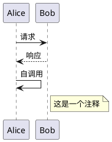

### 用例图

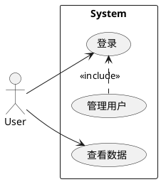

### 类图

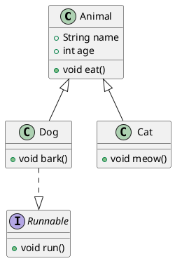

### 活动图

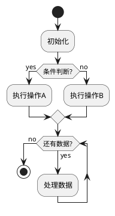

### 组件图

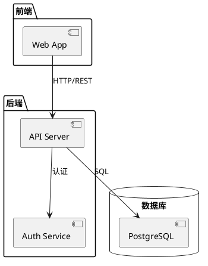

### 状态图

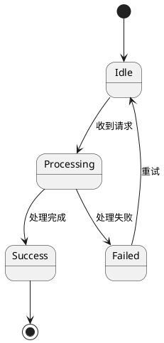

### 对象图

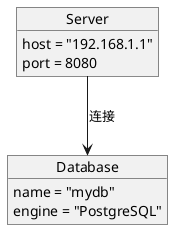

### 部署图

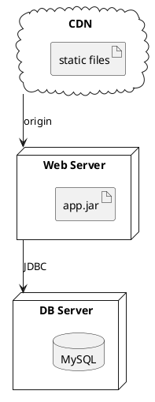

### 定时图

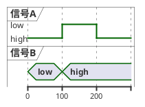

### 网络图

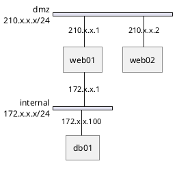

### 甘特图

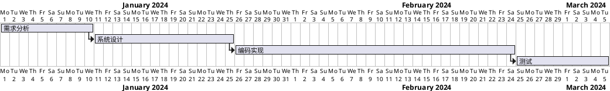

### 架构图

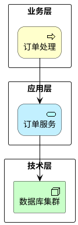

### 思维导图

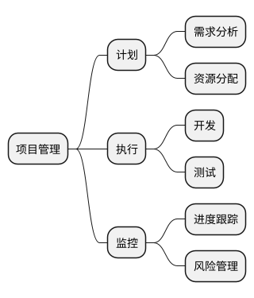

### 工作分解结构

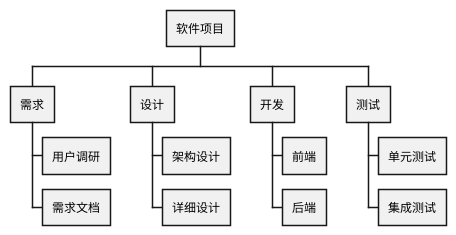

### json与yaml

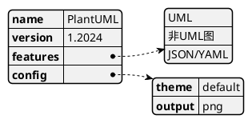

## 其他语法

### 样式

- PlantUML 支持通过 `<style>` 标签定义样式（类似 CSS）
- 示例：
  ```plantuml
  @startuml
  <style>
  classDiagram {
    BackgroundColor #f0f0f0
    FontSize 14
  }
  .important {
    BackgroundColor #ffcccc
    FontStyle bold
  }
  </style>
  class MyClass <<important>> {
    +void method()
  }
  @enduml
  ```

### skinparam 样式语法

- skinparam 是传统的全局样式配置方式
- 常用配置：
  ```plantuml
  @startuml
  skinparam backgroundColor #EEEBDC
  skinparam roundcorner 10
  skinparam sequence {
    ArrowColor #333333
    LifeLineBorderColor #666666
    ParticipantBackgroundColor #E3F2FD
  }
  skinparam class {
    BackgroundColor #FFF9C4
    BorderColor #F57F17
  }
  Alice -> Bob: hello
  @enduml
  ```
- `skinparam monochrome true` 黑白模式
- `skinparam shadowing false` 关闭阴影

### function与procedure

- procedure 不返回值，function 返回值
- 示例：
  ```plantuml
  @startuml
  !procedure $myProc($name)
    participant "$name" as $name
  !endprocedure

  !function $addSuffix($name)
    !return $name + "_service"
  !endfunction

  $myProc("Alice")
  $myProc("Bob")
  participant $addSuffix("Auth")
  Alice -> Bob: request
  @enduml
  ```
- 支持参数默认值：`!function $fn($a, $b="default")`

## 常用语法

# plantuml+C4

- 需要graphviz
- 画整体的架构图挺不错的
- 但是要是画那种各种组件，各种接口都体现出来的比较复杂架构图，就会箭头乱飞。阅读体验极差
- 甚至需要自己手动使用`Lay_D`等手动控制方向

## 基本概念介绍

- C4 模型将软件架构分为四个层次：
  - Context（上下文）：系统与外部用户/系统的关系
  - Container（容器）：系统内的应用、数据库等
  - Component（组件）：容器内的组件
  - Code（代码）：组件内的类/接口
- PlantUML C4 库提供预定义的宏来绘制这些图
- 引入方式：`!include https://raw.githubusercontent.com/plantuml-stdlib/C4-PlantUML/master/C4_Context.puml`

## 使用说明

- 基本元素：
  - `Person(alias, "Label", "Description")` 人物
  - `System(alias, "Label", "Description")` 系统
  - `Container(alias, "Label", "Technology", "Description")` 容器
  - `Rel(from, to, "Label", "Technology")` 关系
- 布局控制：
  - `Lay_D(a, b)` 强制 a 在 b 上方
  - `Lay_R(a, b)` 强制 a 在 b 左侧
- 边界：
  - `System_Boundary(alias, "Label") { ... }` 系统边界
  - `Container_Boundary(alias, "Label") { ... }` 容器边界

## 其他

不同的文件里面可能会有不同的方法重写。

比如C4和C4_Dynamic中都有Rel()方法，不过C4_Dynamic中每一条连线都会有标号，除此之外作用相同

```plantuml
' C4
!unquoted procedure Rel_U($from, $to, $label, $techn="", $descr="", $sprite="", $tags="", $link="")
$getRel($up("-","->>"), $from, $to, $label, $techn, $descr, $sprite, $tags, $link)
!endprocedure

' C4_Dynamic
!unquoted procedure Rel_U($from, $to, $label, $techn="", $descr="", $sprite="", $tags="", $link="")
$getRel($up("-","->>"), $from, $to, Index() + ": " + $label, $techn, $descr, $sprite, $tags, $link)
!endprocedure
```

# graphviz

## 使用场景

- 直接使用graphviz绘图
- 用来画一些数据结构图，复杂有向图比较好用。
- 可以看一些示例了解一下它的强大功能：[官方示例](https://www.graphviz.org/gallery/)
- 主要依赖rank属性对图片进行布局

## Graphviz简要语法

# diagrams

## 使用场景

- 编写python代码生成图片
- 需要graphviz
- 是一个python库，提供了大量图标，使用python脚本编写架构逻辑就能生成架构图。
- 重写了一些操作符，代码看起来也比较清晰
- 比较用来写整体系统架构部署用到的组件或者架构图

## 示例

# draw.io

```bash
draw.io --enable-plugins
# 允许添加外部插件
```

基本啥都能画。免费无限制版的process on

# process on

好像是国产软件，免费版有一些限制，但是能在线协作画图，这个功能可能会有用。

一个人画图感觉不如draw.io

# 参考资料

- [Graphviz简要语法](https://leojhonsong.github.io/zh-CN/2020/03/12/Graphviz%E7%AE%80%E8%A6%81%E8%AF%AD%E6%B3%95/)
- [使用C4-PlantUML来快速的描述软件架构](https://gowa.club/%E8%BD%AF%E4%BB%B6%E6%9E%B6%E6%9E%84/%E4%BD%BF%E7%94%A8C4-PlantUML%E6%9D%A5%E5%BF%AB%E9%80%9F%E7%9A%84%E6%8F%8F%E8%BF%B0%E8%BD%AF%E4%BB%B6%E6%9E%B6%E6%9E%84.html)
- [github:C4-PlantUML](https://github.com/plantuml-stdlib/C4-PlantUML)
- [plantuml中文文档](https://plantuml.com/zh/guide)
- [plantuml_c4网页工具](https://kroki.io/)
- [plantuml图标](https://github.com/tupadr3/plantuml-icon-font-sprites/blob/master/devicons/index.md)
- [piskel:在线画精灵图](https://www.piskelapp.com/)

